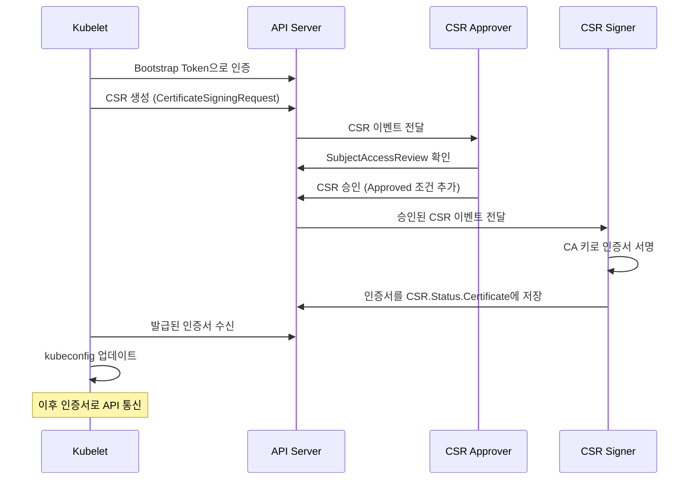
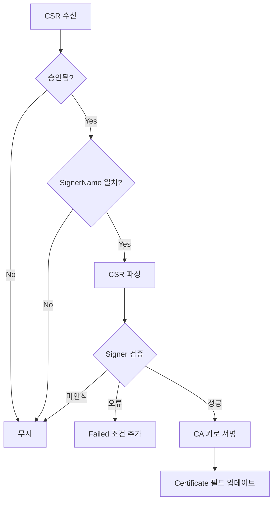
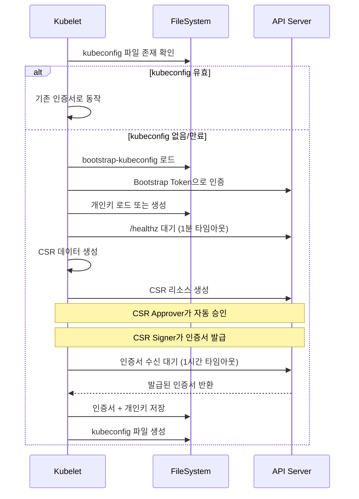
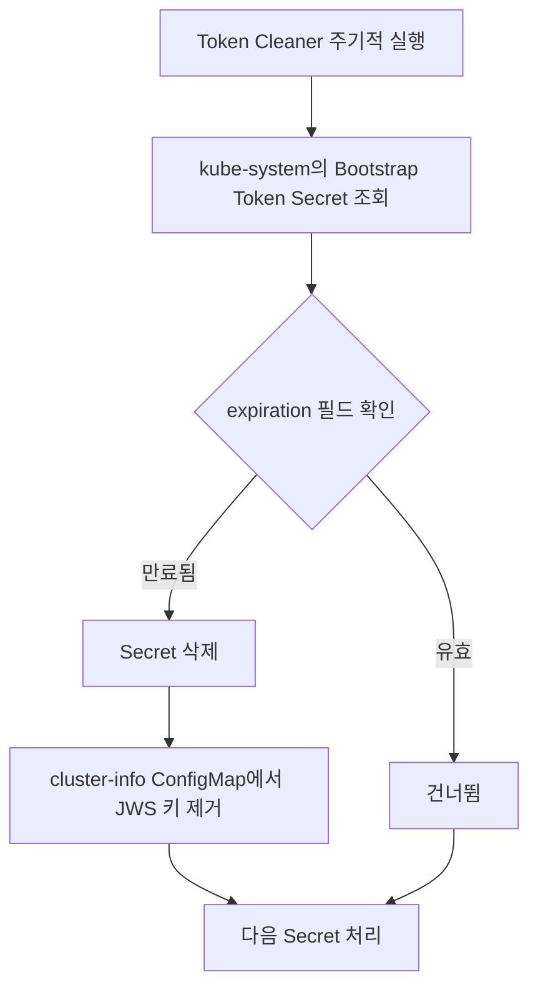

# 32. 인증서 관리 및 Bootstrap 인증 심화

## 목차

1. [개요](#1-개요)
2. [CertificateSigningRequest 타입 정의](#2-certificatesigningrequest-타입-정의)
3. [CSR 승인 흐름 (sarApprove)](#3-csr-승인-흐름-sarapprove)
4. [CSR 서명/발급 (Signer)](#4-csr-서명발급-signer)
5. [Bootstrap Token 인증](#5-bootstrap-token-인증)
6. [Kubelet 인증서 Bootstrap](#6-kubelet-인증서-bootstrap)
7. [인증서 로테이션](#7-인증서-로테이션)
8. [Well-Known Signer Names](#8-well-known-signer-names)
9. [Bootstrap Token 관리 (Signer + Cleaner)](#9-bootstrap-token-관리-signer--cleaner)
10. [왜 이런 설계인가](#10-왜-이런-설계인가)
11. [정리](#11-정리)

---

## 1. 개요

Kubernetes 클러스터에서 인증서(Certificate)는 모든 TLS 통신과 인증의 근간이다. kube-apiserver와 kubelet 간의 통신, 사용자 인증, 서비스 간 mTLS 등 모든 보안 채널이 X.509 인증서에 기반한다.

이 문서에서는 Kubernetes의 인증서 관리 서브시스템을 심층 분석한다:

| 구성요소 | 역할 | 소스 위치 |
|---------|------|----------|
| CertificateSigningRequest (CSR) | 인증서 서명 요청 API 리소스 | `staging/src/k8s.io/api/certificates/v1/types.go` |
| CSR Approver (sarApprove) | CSR 자동 승인 컨트롤러 | `pkg/controller/certificates/approver/sarapprove.go` |
| CSR Signer | CSR 서명 및 인증서 발급 | `pkg/controller/certificates/signer/signer.go` |
| Bootstrap Token Authenticator | 부트스트랩 토큰 기반 인증 | `plugin/pkg/auth/authenticator/token/bootstrap/bootstrap.go` |
| Kubelet Bootstrap | kubelet 초기 인증서 획득 | `pkg/kubelet/certificate/bootstrap/bootstrap.go` |
| Certificate Rotation | 인증서 자동 갱신 | `staging/src/k8s.io/client-go/transport/cert_rotation.go` |

### 전체 아키텍처

```
                         Kubernetes 인증서 관리 아키텍처
  ┌─────────────────────────────────────────────────────────────────────┐
  │                        kube-apiserver                               │
  │  ┌──────────────┐  ┌──────────────┐  ┌──────────────────────────┐  │
  │  │ Bootstrap    │  │ CSR API      │  │ SubjectAccessReview API  │  │
  │  │ Token Auth   │  │ (CRUD)       │  │                          │  │
  │  └──────┬───────┘  └──────┬───────┘  └────────────┬─────────────┘  │
  │         │                 │                        │                │
  └─────────┼─────────────────┼────────────────────────┼────────────────┘
            │                 │                        │
            │    ┌────────────┼────────────────────────┼───────────┐
            │    │     kube-controller-manager                     │
            │    │  ┌─────────┴──────────┐  ┌─────────┴────────┐  │
            │    │  │  CSR Approver      │  │  CSR Signer      │  │
            │    │  │  (sarApprove)      │  │  (CA 서명)        │  │
            │    │  └────────────────────┘  └──────────────────┘  │
            │    └────────────────────────────────────────────────┘
            │
  ┌─────────┴───────────────────────────┐
  │              kubelet                 │
  │  ┌────────────────────────────────┐  │
  │  │  Bootstrap Client             │  │
  │  │  1. Bootstrap Token으로 인증    │  │
  │  │  2. CSR 생성 & 제출            │  │
  │  │  3. 인증서 수신 & 저장          │  │
  │  │  4. 인증서 로테이션             │  │
  │  └────────────────────────────────┘  │
  └──────────────────────────────────────┘
```

### 핵심 흐름 요약



---

## 2. CertificateSigningRequest 타입 정의

### 소스 위치

```
staging/src/k8s.io/api/certificates/v1/types.go
```

### CertificateSigningRequest 구조체

CSR 리소스는 Kubernetes에서 X.509 인증서 서명 요청을 표현하는 클러스터 범위(non-namespaced) API 객체이다.

```go
// staging/src/k8s.io/api/certificates/v1/types.go (line 44)
type CertificateSigningRequest struct {
    metav1.TypeMeta   `json:",inline"`
    metav1.ObjectMeta `json:"metadata,omitempty"`

    // spec: 인증서 요청 데이터. 생성 후 불변(immutable).
    Spec   CertificateSigningRequestSpec   `json:"spec"`
    // status: 승인/거부 상태 및 발급된 인증서
    Status CertificateSigningRequestStatus `json:"status,omitempty"`
}
```

핵심 특성:
- **클러스터 범위**: `+genclient:nonNamespaced` 어노테이션으로 지정
- **서브리소스**: `/status`와 `/approval` 두 개의 서브리소스 지원
- **불변 Spec**: 생성 후 Spec 필드는 변경 불가

### CertificateSigningRequestSpec 구조체

```go
// staging/src/k8s.io/api/certificates/v1/types.go (line 61)
type CertificateSigningRequestSpec struct {
    // PEM 인코딩된 X.509 CSR 데이터
    Request []byte `json:"request"`

    // 요청된 서명자 이름 (정규화된 이름)
    SignerName string `json:"signerName"`

    // 요청된 인증서 유효 기간 (초 단위, 최소 600초)
    ExpirationSeconds *int32 `json:"expirationSeconds,omitempty"`

    // 요청된 키 용도 목록
    Usages []KeyUsage `json:"usages,omitempty"`

    // API 서버가 생성 시 자동 설정하는 필드들 (불변)
    Username string                 `json:"username,omitempty"`
    UID      string                 `json:"uid,omitempty"`
    Groups   []string               `json:"groups,omitempty"`
    Extra    map[string]ExtraValue  `json:"extra,omitempty"`
}
```

| 필드 | 설명 | 설정 주체 |
|------|------|----------|
| `Request` | PEM 인코딩된 CSR 바이너리 | 요청자 |
| `SignerName` | 인증서 서명자 이름 | 요청자 |
| `ExpirationSeconds` | 요청된 유효 기간(초) | 요청자 |
| `Usages` | 키 용도 목록 | 요청자 |
| `Username` | CSR 생성자 이름 | API 서버 |
| `UID` | CSR 생성자 UID | API 서버 |
| `Groups` | CSR 생성자 그룹 목록 | API 서버 |
| `Extra` | CSR 생성자 추가 속성 | API 서버 |

### CertificateSigningRequestStatus 구조체

```go
// staging/src/k8s.io/api/certificates/v1/types.go (line 177)
type CertificateSigningRequestStatus struct {
    // 승인/거부/실패 조건 목록
    Conditions []CertificateSigningRequestCondition `json:"conditions,omitempty"`

    // 서명자가 발급한 PEM 인코딩된 인증서
    // Approved 조건 후 서명자가 설정, 한번 설정되면 불변
    Certificate []byte `json:"certificate,omitempty"`
}
```

### 조건(Condition) 타입

```go
// staging/src/k8s.io/api/certificates/v1/types.go (line 225-232)
const (
    CertificateApproved RequestConditionType = "Approved"   // 승인됨
    CertificateDenied   RequestConditionType = "Denied"     // 거부됨
    CertificateFailed   RequestConditionType = "Failed"     // 실패
)
```

조건의 중요한 규칙:
- **Approved와 Denied는 상호 배타적**: 하나만 존재 가능
- **조건은 제거 불가**: 한번 추가되면 영구적
- **Failed는 독립적**: Approved 후에도 추가 가능 (서명자 오류)

### CertificateSigningRequestCondition 구조체

```go
// staging/src/k8s.io/api/certificates/v1/types.go (line 235-269)
type CertificateSigningRequestCondition struct {
    Type               RequestConditionType `json:"type"`
    Status             v1.ConditionStatus   `json:"status"`
    Reason             string               `json:"reason,omitempty"`
    Message            string               `json:"message,omitempty"`
    LastUpdateTime     metav1.Time          `json:"lastUpdateTime,omitempty"`
    LastTransitionTime metav1.Time          `json:"lastTransitionTime,omitempty"`
}
```

```
  CSR 상태 전이 다이어그램
  ┌──────────┐
  │ Pending  │──────────────┐
  │ (생성됨)  │              │
  └────┬─────┘              │
       │                    │
       ▼                    ▼
  ┌──────────┐       ┌──────────┐
  │ Approved │       │ Denied   │
  │ (승인됨)  │       │ (거부됨)  │
  └────┬─────┘       └──────────┘
       │
       ├──────────────┐
       ▼              ▼
  ┌──────────┐  ┌──────────┐
  │ Issued   │  │ Failed   │
  │ (발급됨)  │  │ (실패)    │
  └──────────┘  └──────────┘
```

### KeyUsage 상수

```go
// staging/src/k8s.io/api/certificates/v1/types.go (line 294-318)
const (
    UsageSigning           KeyUsage = "signing"
    UsageDigitalSignature  KeyUsage = "digital signature"
    UsageContentCommitment KeyUsage = "content commitment"
    UsageKeyEncipherment   KeyUsage = "key encipherment"
    UsageKeyAgreement      KeyUsage = "key agreement"
    UsageDataEncipherment  KeyUsage = "data encipherment"
    UsageCertSign          KeyUsage = "cert sign"
    UsageCRLSign           KeyUsage = "crl sign"
    UsageEncipherOnly      KeyUsage = "encipher only"
    UsageDecipherOnly      KeyUsage = "decipher only"
    UsageAny               KeyUsage = "any"
    UsageServerAuth        KeyUsage = "server auth"
    UsageClientAuth        KeyUsage = "client auth"
    UsageCodeSigning       KeyUsage = "code signing"
    UsageEmailProtection   KeyUsage = "email protection"
    UsageSMIME             KeyUsage = "s/mime"
    UsageIPsecEndSystem    KeyUsage = "ipsec end system"
    UsageIPsecTunnel       KeyUsage = "ipsec tunnel"
    UsageIPsecUser         KeyUsage = "ipsec user"
    UsageTimestamping      KeyUsage = "timestamping"
    UsageOCSPSigning       KeyUsage = "ocsp signing"
    UsageMicrosoftSGC      KeyUsage = "microsoft sgc"
    UsageNetscapeSGC       KeyUsage = "netscape sgc"
)
```

일반적인 사용 패턴:

| 인증서 유형 | 일반적인 Usages |
|------------|----------------|
| TLS 클라이언트 인증서 | `digital signature`, `key encipherment`, `client auth` |
| TLS 서버 인증서 | `key encipherment`, `digital signature`, `server auth` |
| kubelet 클라이언트 | `digital signature`, `client auth` (RSA면 `key encipherment` 추가) |

---

## 3. CSR 승인 흐름 (sarApprove)

### 소스 위치

```
pkg/controller/certificates/approver/sarapprove.go
pkg/controller/certificates/certificate_controller.go
```

### 아키텍처 개요

CSR 승인은 SubjectAccessReview(SAR) 기반의 자동 승인 컨트롤러(`sarApprover`)가 담당한다. 이 컨트롤러는 kubelet의 클라이언트 인증서 요청만 자동 승인하며, 다른 유형의 CSR은 수동 승인이 필요하다.

```
  CSR 승인 흐름 (sarApprover)
  ┌───────────────────────────────────────────────────────────┐
  │                  kube-controller-manager                   │
  │                                                           │
  │  ┌───────────────────────────────────────────────────┐    │
  │  │          CertificateController                    │    │
  │  │  ┌──────────────────────┐                         │    │
  │  │  │  Informer (Watch)    │  CSR Add/Update/Delete  │    │
  │  │  │  csrInformer         ├─────────┐               │    │
  │  │  └──────────────────────┘         │               │    │
  │  │                                   ▼               │    │
  │  │  ┌──────────────────────────────────────────┐     │    │
  │  │  │  WorkQueue (Rate Limited)                │     │    │
  │  │  │  200ms ~ 1000s exponential backoff       │     │    │
  │  │  │  10 QPS bucket                           │     │    │
  │  │  └───────────────────┬──────────────────────┘     │    │
  │  │                      │                            │    │
  │  │                      ▼                            │    │
  │  │  ┌──────────────────────────────────────────┐     │    │
  │  │  │  worker() -> syncFunc() -> handler()     │     │    │
  │  │  │            sarApprover.handle()           │     │    │
  │  │  └──────────────────────────────────────────┘     │    │
  │  └───────────────────────────────────────────────────┘    │
  └───────────────────────────────────────────────────────────┘
```

### CertificateController 기반 구조

`CertificateController`는 CSR 승인과 서명 두 컨트롤러가 공유하는 범용 프레임워크이다.

```go
// pkg/controller/certificates/certificate_controller.go (line 42)
type CertificateController struct {
    name       string
    kubeClient clientset.Interface
    csrLister  certificateslisters.CertificateSigningRequestLister
    csrsSynced cache.InformerSynced
    handler    func(context.Context, *certificates.CertificateSigningRequest) error
    queue      workqueue.TypedRateLimitingInterface[string]
}
```

핵심 설계:
- **플러그인 패턴**: `handler` 함수를 주입받아 승인/서명 로직을 교체
- **Rate Limiting**: 200ms ~ 1000s 지수 백오프 + 10 QPS 제한
- **최적화**: `syncFunc()`에서 이미 인증서가 발급된 CSR은 즉시 반환

```go
// pkg/controller/certificates/certificate_controller.go (line 179)
func (cc *CertificateController) syncFunc(ctx context.Context, key string) error {
    csr, err := cc.csrLister.Get(key)
    // ...
    if len(csr.Status.Certificate) > 0 {
        return nil  // 이미 발급됨 -> 무시
    }
    csr = csr.DeepCopy()  // 공유 캐시 보호를 위한 복사
    return cc.handler(ctx, csr)
}
```

### Informer 이벤트 핸들러

CertificateController는 CSR 리소스의 모든 변경을 감시한다:

```go
// pkg/controller/certificates/certificate_controller.go (line 81-109)
csrInformer.Informer().AddEventHandler(cache.ResourceEventHandlerFuncs{
    AddFunc: func(obj interface{}) {
        csr := obj.(*certificates.CertificateSigningRequest)
        cc.enqueueCertificateRequest(obj)
    },
    UpdateFunc: func(old, new interface{}) {
        cc.enqueueCertificateRequest(new)
    },
    DeleteFunc: func(obj interface{}) {
        // Tombstone 처리 포함
        cc.enqueueCertificateRequest(obj)
    },
})
```

### sarApprover 구조

```go
// pkg/controller/certificates/approver/sarapprove.go (line 42-45)
type sarApprover struct {
    client      clientset.Interface
    recognizers []csrRecognizer
}
```

### csrRecognizer 패턴

```go
// pkg/controller/certificates/approver/sarapprove.go (line 36-40)
type csrRecognizer struct {
    recognize      func(csr *capi.CertificateSigningRequest, x509cr *x509.CertificateRequest) bool
    permission     authorization.ResourceAttributes
    successMessage string
}
```

이 패턴은 "인식 -> 권한 확인 -> 승인" 3단계 파이프라인을 구현한다:

| 단계 | 함수 | 역할 |
|------|------|------|
| 인식(Recognize) | `recognize()` | CSR이 특정 유형인지 확인 |
| 권한 확인(Authorize) | `authorize()` | SAR로 요청자 권한 검증 |
| 승인(Approve) | `appendApprovalCondition()` | Approved 조건 추가 |

### 등록된 Recognizer 목록

```go
// pkg/controller/certificates/approver/sarapprove.go (line 62-76)
func recognizers() []csrRecognizer {
    return []csrRecognizer{
        {
            recognize:      isSelfNodeClientCert,
            permission:     authorization.ResourceAttributes{
                Group: "certificates.k8s.io", Resource: "certificatesigningrequests",
                Verb: "create", Subresource: "selfnodeclient", Version: "*",
            },
            successMessage: "Auto approving self kubelet client certificate after SubjectAccessReview.",
        },
        {
            recognize:      isNodeClientCert,
            permission:     authorization.ResourceAttributes{
                Group: "certificates.k8s.io", Resource: "certificatesigningrequests",
                Verb: "create", Subresource: "nodeclient", Version: "*",
            },
            successMessage: "Auto approving kubelet client certificate after SubjectAccessReview.",
        },
    }
}
```

두 가지 인식기의 차이:

| 인식기 | 조건 | 용도 |
|--------|------|------|
| `isSelfNodeClientCert` | SignerName이 kubelet용 + Username == CommonName | 자기 자신의 인증서 갱신 |
| `isNodeClientCert` | SignerName이 kubelet용 | 모든 kubelet 클라이언트 인증서 |

```go
// pkg/controller/certificates/approver/sarapprove.go (line 151-163)
func isNodeClientCert(csr *capi.CertificateSigningRequest, x509cr *x509.CertificateRequest) bool {
    if csr.Spec.SignerName != capi.KubeAPIServerClientKubeletSignerName {
        return false
    }
    return capihelper.IsKubeletClientCSR(x509cr, usagesToSet(csr.Spec.Usages))
}

func isSelfNodeClientCert(csr *capi.CertificateSigningRequest, x509cr *x509.CertificateRequest) bool {
    if csr.Spec.Username != x509cr.Subject.CommonName {
        return false  // CSR 생성자와 인증서의 CN이 같아야 함
    }
    return isNodeClientCert(csr, x509cr)
}
```

`isSelfNodeClientCert`가 `isNodeClientCert`보다 먼저 체크되는 이유: 더 제한적인 조건(자기 자신의 인증서)을 먼저 확인하고, 해당하지 않으면 더 넓은 범위(모든 노드 인증서)를 확인하는 cascade 패턴이다.

### handle() 메서드 상세

```go
// pkg/controller/certificates/approver/sarapprove.go (line 78-118)
func (a *sarApprover) handle(ctx context.Context, csr *capi.CertificateSigningRequest) error {
    // 1단계: 이미 처리된 CSR 무시
    if len(csr.Status.Certificate) != 0 {
        return nil
    }
    if approved, denied := certificates.GetCertApprovalCondition(&csr.Status); approved || denied {
        return nil
    }

    // 2단계: CSR 데이터 파싱
    x509cr, err := capihelper.ParseCSR(csr.Spec.Request)
    if err != nil {
        return fmt.Errorf("unable to parse csr %q: %v", csr.Name, err)
    }

    // 3단계: recognizer 순회 (순서 중요: selfnodeclient 먼저)
    tried := []string{}
    for _, r := range a.recognizers {
        if !r.recognize(csr, x509cr) {
            continue
        }
        tried = append(tried, r.permission.Subresource)

        // 4단계: SubjectAccessReview로 권한 확인
        approved, err := a.authorize(ctx, csr, r.permission)
        if err != nil {
            return err
        }
        if approved {
            // 5단계: Approved 조건 추가 및 업데이트
            appendApprovalCondition(csr, r.successMessage)
            _, err = a.client.CertificatesV1().CertificateSigningRequests().
                UpdateApproval(ctx, csr.Name, csr, metav1.UpdateOptions{})
            return err
        }
    }

    // 인식되었으나 권한 없음 -> 무시 가능한 에러
    if len(tried) != 0 {
        return certificates.IgnorableError("recognized csr %q as %v but SAR not approved",
            csr.Name, tried)
    }
    return nil
}
```

### authorize() 메서드

```go
// pkg/controller/certificates/approver/sarapprove.go (line 120-140)
func (a *sarApprover) authorize(ctx context.Context, csr *capi.CertificateSigningRequest,
    rattrs authorization.ResourceAttributes) (bool, error) {
    extra := make(map[string]authorization.ExtraValue)
    for k, v := range csr.Spec.Extra {
        extra[k] = authorization.ExtraValue(v)
    }

    sar := &authorization.SubjectAccessReview{
        Spec: authorization.SubjectAccessReviewSpec{
            User:               csr.Spec.Username,  // CSR 생성자
            UID:                csr.Spec.UID,
            Groups:             csr.Spec.Groups,
            Extra:              extra,
            ResourceAttributes: &rattrs,             // 필요한 권한
        },
    }
    sar, err := a.client.AuthorizationV1().SubjectAccessReviews().Create(ctx, sar, metav1.CreateOptions{})
    if err != nil {
        return false, err
    }
    return sar.Status.Allowed, nil
}
```

핵심: CSR 생성자의 자격으로 "이 사용자가 `selfnodeclient` 또는 `nodeclient` 서브리소스에 대해 `create` 동사를 수행할 수 있는가?"를 API 서버에 질의한다.

```
  SubjectAccessReview 흐름
  ┌────────────┐         ┌──────────────┐         ┌─────────┐
  │sarApprover │────────>│ API Server   │────────>│ RBAC    │
  │            │  SAR    │              │  평가    │ 엔진    │
  │            │<────────│              │<────────│         │
  │  Allowed?  │ 결과    │              │  결과   │         │
  └────────────┘         └──────────────┘         └─────────┘
```

### appendApprovalCondition()

```go
// pkg/controller/certificates/approver/sarapprove.go (line 142-149)
func appendApprovalCondition(csr *capi.CertificateSigningRequest, message string) {
    csr.Status.Conditions = append(csr.Status.Conditions, capi.CertificateSigningRequestCondition{
        Type:    capi.CertificateApproved,
        Status:  corev1.ConditionTrue,
        Reason:  "AutoApproved",
        Message: message,
    })
}
```

승인 조건은 `/approval` 서브리소스를 통해 업데이트된다(`UpdateApproval`). 이는 `/status` 서브리소스와 분리되어 있어 승인 권한과 상태 업데이트 권한을 독립적으로 RBAC으로 제어할 수 있다.

### IgnorableError 패턴

```go
// pkg/controller/certificates/certificate_controller.go (line 208-216)
func IgnorableError(s string, args ...interface{}) ignorableError {
    return ignorableError(fmt.Sprintf(s, args...))
}

type ignorableError string

func (e ignorableError) Error() string {
    return string(e)
}
```

이 패턴은 "재시도가 필요하지만 로그에 남길 필요는 없는" 에러를 표현한다. `processNextWorkItem()`에서 `ignorableError` 타입을 체크하여 `klog.V(4)` 레벨로만 로그를 남긴다. 이를 통해 인식되었으나 권한이 없는 CSR이 반복적으로 에러 로그를 발생시키는 것을 방지한다.

---

## 4. CSR 서명/발급 (Signer)

### 소스 위치

```
pkg/controller/certificates/signer/signer.go
pkg/controller/certificates/signer/ca_provider.go
```

### Signer 아키텍처

CSR Signer는 Signer Name별로 독립적인 컨트롤러 인스턴스로 실행된다. 각 인스턴스는 고유한 CA 키 쌍과 검증 로직을 갖는다.

```
  Signer 인스턴스 구성
  ┌──────────────────────────────────────────────────────────┐
  │                 kube-controller-manager                   │
  │                                                          │
  │  ┌─────────────────────────────────────────────────────┐ │
  │  │  csrsigning-kubelet-serving                         │ │
  │  │  SignerName: kubernetes.io/kubelet-serving           │ │
  │  │  CA: --cluster-signing-cert-file / key-file         │ │
  │  │  검증: isKubeletServing()                           │ │
  │  └─────────────────────────────────────────────────────┘ │
  │                                                          │
  │  ┌─────────────────────────────────────────────────────┐ │
  │  │  csrsigning-kubelet-client                          │ │
  │  │  SignerName: kubernetes.io/kube-apiserver-client-    │ │
  │  │             kubelet                                 │ │
  │  │  검증: isKubeletClient()                            │ │
  │  └─────────────────────────────────────────────────────┘ │
  │                                                          │
  │  ┌─────────────────────────────────────────────────────┐ │
  │  │  csrsigning-kube-apiserver-client                   │ │
  │  │  SignerName: kubernetes.io/kube-apiserver-client     │ │
  │  │  검증: isKubeAPIServerClient()                      │ │
  │  └─────────────────────────────────────────────────────┘ │
  │                                                          │
  │  ┌─────────────────────────────────────────────────────┐ │
  │  │  csrsigning-legacy-unknown                          │ │
  │  │  SignerName: kubernetes.io/legacy-unknown            │ │
  │  │  검증: isLegacyUnknown() (제한 없음)                 │ │
  │  └─────────────────────────────────────────────────────┘ │
  └──────────────────────────────────────────────────────────┘
```

### CSRSigningController 팩토리 함수

각 Signer Name별로 전용 팩토리 함수가 존재한다:

```go
// pkg/controller/certificates/signer/signer.go (line 47-85)
func NewKubeletServingCSRSigningController(ctx, client, csrInformer, caFile, caKeyFile, certTTL) {
    return NewCSRSigningController(ctx, "csrsigning-kubelet-serving",
        capi.KubeletServingSignerName, client, csrInformer, caFile, caKeyFile, certTTL)
}

func NewKubeletClientCSRSigningController(ctx, client, csrInformer, caFile, caKeyFile, certTTL) {
    return NewCSRSigningController(ctx, "csrsigning-kubelet-client",
        capi.KubeAPIServerClientKubeletSignerName, client, csrInformer, caFile, caKeyFile, certTTL)
}

func NewKubeAPIServerClientCSRSigningController(ctx, client, csrInformer, caFile, caKeyFile, certTTL) {
    return NewCSRSigningController(ctx, "csrsigning-kube-apiserver-client",
        capi.KubeAPIServerClientSignerName, client, csrInformer, caFile, caKeyFile, certTTL)
}

func NewLegacyUnknownCSRSigningController(ctx, client, csrInformer, caFile, caKeyFile, certTTL) {
    return NewCSRSigningController(ctx, "csrsigning-legacy-unknown",
        capiv1beta1.LegacyUnknownSignerName, client, csrInformer, caFile, caKeyFile, certTTL)
}
```

### signer 구조체

```go
// pkg/controller/certificates/signer/signer.go (line 127-135)
type signer struct {
    caProvider           *caProvider
    client               clientset.Interface
    certTTL              time.Duration       // 최대 TTL
    signerName           string
    isRequestForSignerFn isRequestForSignerFunc
}
```

### handle() 메서드 상세

서명 처리의 핵심 로직이다.

```go
// pkg/controller/certificates/signer/signer.go (line 157-199)
func (s *signer) handle(ctx context.Context, csr *capi.CertificateSigningRequest) error {
    // 1단계: 미승인/실패 CSR 무시
    if !certificates.IsCertificateRequestApproved(csr) ||
        certificates.HasTrueCondition(csr, capi.CertificateFailed) {
        return nil
    }

    // 2단계: SignerName 일치 확인 (fast-path)
    if csr.Spec.SignerName != s.signerName {
        return nil
    }

    // 3단계: CSR 파싱
    x509cr, err := capihelper.ParseCSR(csr.Spec.Request)

    // 4단계: Signer별 검증
    if recognized, err := s.isRequestForSignerFn(x509cr, csr.Spec.Usages, csr.Spec.SignerName); err != nil {
        // 검증 실패 -> Failed 조건 추가
        csr.Status.Conditions = append(csr.Status.Conditions, capi.CertificateSigningRequestCondition{
            Type:           capi.CertificateFailed,
            Status:         v1.ConditionTrue,
            Reason:         "SignerValidationFailure",
            Message:        err.Error(),
            LastUpdateTime: metav1.Now(),
        })
        _, err = s.client.CertificatesV1().CertificateSigningRequests().
            UpdateStatus(ctx, csr, metav1.UpdateOptions{})
        return nil
    } else if !recognized {
        return nil  // 인식되지 않은 요청 무시
    }

    // 5단계: 서명 수행
    cert, err := s.sign(x509cr, csr.Spec.Usages, csr.Spec.ExpirationSeconds, nil)

    // 6단계: 인증서를 Status에 기록
    csr.Status.Certificate = cert
    _, err = s.client.CertificatesV1().CertificateSigningRequests().
        UpdateStatus(ctx, csr, metav1.UpdateOptions{})
    return err
}
```



### sign() 메서드

```go
// pkg/controller/certificates/signer/signer.go (line 201-217)
func (s *signer) sign(x509cr *x509.CertificateRequest, usages []capi.KeyUsage,
    expirationSeconds *int32, now func() time.Time) ([]byte, error) {
    currCA, err := s.caProvider.currentCA()
    if err != nil {
        return nil, err
    }
    der, err := currCA.Sign(x509cr.Raw, authority.PermissiveSigningPolicy{
        TTL:      s.duration(expirationSeconds),
        Usages:   usages,
        Backdate: 5 * time.Minute,  // 시계 오차 보정
        Short:    8 * time.Hour,    // 짧은 인증서 기준
        Now:      now,
    })
    if err != nil {
        return nil, err
    }
    return pem.EncodeToMemory(&pem.Block{Type: "CERTIFICATE", Bytes: der}), nil
}
```

| 파라미터 | 값 | 설명 |
|---------|-----|------|
| `TTL` | `duration()` 결과 | 인증서 유효 기간 |
| `Backdate` | 5분 | NotBefore를 현재 시간에서 5분 전으로 설정 (시계 오차 보정) |
| `Short` | 8시간 | 이 시간보다 짧은 인증서에는 backdate 비율이 높음 |

### duration() 메서드 - 유효 기간 결정

```go
// pkg/controller/certificates/signer/signer.go (line 219-237)
func (s *signer) duration(expirationSeconds *int32) time.Duration {
    if expirationSeconds == nil {
        return s.certTTL  // 기본 TTL 사용
    }
    const min = 10 * time.Minute  // 최소 10분 (backdate 5분의 2배)
    switch requestedDuration := csr.ExpirationSecondsToDuration(*expirationSeconds); {
    case requestedDuration > s.certTTL:
        return s.certTTL              // 최대값 제한
    case requestedDuration < min:
        return min                     // 최소값 보장
    default:
        return requestedDuration       // 요청대로
    }
}
```

```
  인증서 유효 기간 결정 로직
  ┌──────────────────────────────────────────────────────┐
  │ expirationSeconds == nil -> 기본 certTTL (1년 등)    │
  │ requested > certTTL      -> certTTL (상한)           │
  │ requested < 10분         -> 10분 (하한, 안전 장치)    │
  │ 그 외                    -> 요청된 값 사용            │
  └──────────────────────────────────────────────────────┘
```

### caProvider - 동적 CA 리로드

```go
// pkg/controller/certificates/signer/ca_provider.go (line 47-50)
type caProvider struct {
    caValue  atomic.Value                                       // CA 캐시
    caLoader *dynamiccertificates.DynamicCertKeyPairContent     // 동적 로더
}

// pkg/controller/certificates/signer/ca_provider.go (line 87-99)
func (p *caProvider) currentCA() (*authority.CertificateAuthority, error) {
    certPEM, keyPEM := p.caLoader.CurrentCertKeyContent()
    currCA := p.caValue.Load().(*authority.CertificateAuthority)
    if bytes.Equal(currCA.RawCert, certPEM) && bytes.Equal(currCA.RawKey, keyPEM) {
        return currCA, nil  // 변경 없으면 캐시 반환
    }
    // 변경 감지 -> 새 CA 로드
    if err := p.setCA(); err != nil {
        return currCA, err  // 실패 시 기존 CA 반환
    }
    return p.caValue.Load().(*authority.CertificateAuthority), nil
}
```

이 설계의 핵심: CA 인증서와 키가 디스크에서 변경되면 컨트롤러 재시작 없이 자동으로 새 CA를 사용한다. `atomic.Value`를 사용하여 lock-free 읽기를 지원한다.

### Signer별 검증 함수 매핑

```go
// pkg/controller/certificates/signer/signer.go (line 241-257)
func getCSRVerificationFuncForSignerName(signerName string) (isRequestForSignerFunc, error) {
    switch signerName {
    case capi.KubeletServingSignerName:
        return isKubeletServing, nil
    case capi.KubeAPIServerClientKubeletSignerName:
        return isKubeletClient, nil
    case capi.KubeAPIServerClientSignerName:
        return isKubeAPIServerClient, nil
    case capiv1beta1.LegacyUnknownSignerName:
        return isLegacyUnknown, nil
    default:
        return nil, fmt.Errorf("unrecognized signerName: %q", signerName)
    }
}
```

| Signer Name | 검증 함수 | 검증 내용 |
|-------------|----------|----------|
| `kubelet-serving` | `isKubeletServing` | kubelet 서빙 CSR 유효성 |
| `kube-apiserver-client-kubelet` | `isKubeletClient` | kubelet 클라이언트 CSR 유효성 |
| `kube-apiserver-client` | `isKubeAPIServerClient` | client auth usage 필수 확인 |
| `legacy-unknown` | `isLegacyUnknown` | 제한 없음 (하위 호환) |

```go
// kube-apiserver-client 검증 예시
// pkg/controller/certificates/signer/signer.go (line 289-305)
func validAPIServerClientUsages(usages []capi.KeyUsage) error {
    hasClientAuth := false
    for _, u := range usages {
        switch u {
        case capi.UsageDigitalSignature, capi.UsageKeyEncipherment:
            // 허용
        case capi.UsageClientAuth:
            hasClientAuth = true
        default:
            return fmt.Errorf("invalid usage for client certificate: %s", u)
        }
    }
    if !hasClientAuth {
        return fmt.Errorf("missing required usage: %s", capi.UsageClientAuth)
    }
    return nil
}
```

---

## 5. Bootstrap Token 인증

### 소스 위치

```
plugin/pkg/auth/authenticator/token/bootstrap/bootstrap.go
staging/src/k8s.io/cluster-bootstrap/token/api/types.go
```

### Bootstrap Token이란

Bootstrap Token은 새로운 노드가 클러스터에 처음 합류할 때 사용하는 일회성 인증 토큰이다. `<token-id>.<token-secret>` 형식(예: `abcdef.0123456789abcdef`)으로 구성되며, kube-system 네임스페이스의 Secret 리소스로 저장된다.

```yaml
apiVersion: v1
kind: Secret
metadata:
  name: bootstrap-token-abcdef
  namespace: kube-system
type: bootstrap.kubernetes.io/token
data:
  token-id: abcdef
  token-secret: 0123456789abcdef
  usage-bootstrap-authentication: "true"
  auth-extra-groups: "system:bootstrappers:worker"
  expiration: "2025-12-31T00:00:00Z"
```

### Bootstrap Token API 상수

```go
// staging/src/k8s.io/cluster-bootstrap/token/api/types.go
const (
    BootstrapTokenSecretPrefix        = "bootstrap-token-"
    SecretTypeBootstrapToken          = "bootstrap.kubernetes.io/token"
    BootstrapTokenIDKey               = "token-id"
    BootstrapTokenSecretKey           = "token-secret"
    BootstrapTokenExpirationKey       = "expiration"
    BootstrapTokenUsageAuthentication = "usage-bootstrap-authentication"
    BootstrapTokenExtraGroupsKey      = "auth-extra-groups"
    BootstrapUserPrefix               = "system:bootstrap:"
    BootstrapDefaultGroup             = "system:bootstrappers"
    BootstrapGroupPattern             = `\Asystem:bootstrappers:[a-z0-9:-]{0,255}[a-z0-9]\z`
    BootstrapTokenPattern             = `\A([a-z0-9]{6})\.([a-z0-9]{16})\z`
    BootstrapTokenIDBytes             = 6
    BootstrapTokenSecretBytes         = 16
)
```

| 상수 | 값 | 설명 |
|------|-----|------|
| `BootstrapTokenIDBytes` | 6 | Token ID 길이 |
| `BootstrapTokenSecretBytes` | 16 | Token Secret 길이 |
| `BootstrapTokenPattern` | `[a-z0-9]{6}\.[a-z0-9]{16}` | 전체 토큰 패턴 |
| `BootstrapDefaultGroup` | `system:bootstrappers` | 기본 그룹 |
| `BootstrapUserPrefix` | `system:bootstrap:` | 사용자명 접두어 |

### TokenAuthenticator 구조체

```go
// plugin/pkg/auth/authenticator/token/bootstrap/bootstrap.go (line 52-54)
type TokenAuthenticator struct {
    lister corev1listers.SecretNamespaceLister  // kube-system 네임스페이스의 Secret Lister
}
```

### AuthenticateToken() 메서드 상세

이 메서드는 Bearer 토큰을 받아 Bootstrap Token Secret과 대조하여 인증한다.

```go
// plugin/pkg/auth/authenticator/token/bootstrap/bootstrap.go (line 90-151)
func (t *TokenAuthenticator) AuthenticateToken(ctx context.Context, token string) (
    *authenticator.Response, bool, error) {

    // 1단계: 토큰 형식 파싱 ("<id>.<secret>")
    tokenID, tokenSecret, err := bootstraptokenutil.ParseToken(token)
    if err != nil {
        return nil, false, nil  // 형식 불일치 -> 무시 (다른 인증기에 위임)
    }

    // 2단계: Secret 조회
    secretName := bootstrapapi.BootstrapTokenSecretPrefix + tokenID  // "bootstrap-token-<id>"
    secret, err := t.lister.Get(secretName)
    if errors.IsNotFound(err) {
        return nil, false, nil  // 해당 토큰 없음
    }

    // 3단계: 삭제 대기 중인 Secret 거부
    if secret.DeletionTimestamp != nil {
        return nil, false, nil
    }

    // 4단계: Secret 타입 확인
    if string(secret.Type) != string(bootstrapapi.SecretTypeBootstrapToken) || secret.Data == nil {
        return nil, false, nil
    }

    // 5단계: 토큰 비밀번호 비교 (constant-time comparison)
    ts := bootstrapsecretutil.GetData(secret, bootstrapapi.BootstrapTokenSecretKey)
    if subtle.ConstantTimeCompare([]byte(ts), []byte(tokenSecret)) != 1 {
        return nil, false, nil  // 비밀번호 불일치
    }

    // 6단계: 토큰 ID 교차 확인
    id := bootstrapsecretutil.GetData(secret, bootstrapapi.BootstrapTokenIDKey)
    if id != tokenID {
        return nil, false, nil
    }

    // 7단계: 만료 확인
    if bootstrapsecretutil.HasExpired(secret, time.Now()) {
        return nil, false, nil
    }

    // 8단계: 인증 용도 확인
    if bootstrapsecretutil.GetData(secret, bootstrapapi.BootstrapTokenUsageAuthentication) != "true" {
        return nil, false, nil
    }

    // 9단계: 추가 그룹 해석
    groups, err := bootstrapsecretutil.GetGroups(secret)

    // 10단계: 인증 응답 생성
    return &authenticator.Response{
        User: &user.DefaultInfo{
            Name:   bootstrapapi.BootstrapUserPrefix + string(id),  // "system:bootstrap:<id>"
            Groups: groups,  // ["system:bootstrappers", "system:bootstrappers:worker", ...]
        },
    }, true, nil
}
```

```
  Bootstrap Token 인증 흐름
  ┌─────────┐         ┌──────────────────┐         ┌───────────┐
  │ kubelet │         │ TokenAuthenticator│         │ Secret    │
  │         │         │                  │         │ Lister    │
  └────┬────┘         └────────┬─────────┘         └─────┬─────┘
       │                       │                          │
       │ Bearer: abcdef.xyz... │                          │
       ├──────────────────────>│                          │
       │                       │                          │
       │                       │ ParseToken("abcdef.xyz") │
       │                       │──┐                       │
       │                       │  │ tokenID="abcdef"      │
       │                       │<─┘ tokenSecret="xyz..."  │
       │                       │                          │
       │                       │ Get("bootstrap-token-    │
       │                       │      abcdef")            │
       │                       ├─────────────────────────>│
       │                       │         Secret           │
       │                       │<─────────────────────────│
       │                       │                          │
       │                       │ ConstantTimeCompare()    │
       │                       │ HasExpired()             │
       │                       │ GetGroups()              │
       │                       │──┐                       │
       │                       │  │ 검증 통과              │
       │                       │<─┘                       │
       │                       │                          │
       │ User: system:bootstrap│:abcdef                   │
       │ Groups: [system:      │bootstrappers, ...]       │
       │<──────────────────────│                          │
```

### 보안 설계 포인트

1. **Constant-time 비교**: `subtle.ConstantTimeCompare()`로 타이밍 공격 방지
2. **만료 시간 지원**: `expiration` 필드로 토큰 수명 제한
3. **용도별 분리**: `usage-bootstrap-authentication`과 `usage-bootstrap-signing` 구분
4. **추가 그룹**: `auth-extra-groups`로 세분화된 RBAC 권한 부여
5. **형식 불일치 무시**: Bootstrap 토큰이 아닌 Bearer 토큰은 다른 인증기에 위임
6. **삭제 대기 감지**: `DeletionTimestamp`가 설정된 Secret은 거부

---

## 6. Kubelet 인증서 Bootstrap

### 소스 위치

```
pkg/kubelet/certificate/bootstrap/bootstrap.go
```

### Bootstrap 전체 흐름

kubelet이 클러스터에 처음 합류할 때의 전체 인증서 획득 과정이다.



### LoadClientCert() 함수

```go
// pkg/kubelet/certificate/bootstrap/bootstrap.go (line 109-177)
func LoadClientCert(ctx context.Context, kubeconfigPath, bootstrapPath, certDir string,
    nodeName types.NodeName) error {
    // 1단계: 기존 kubeconfig 유효성 확인
    ok, err := isClientConfigStillValid(kubeconfigPath)
    if ok {
        return nil  // 유효한 인증서가 있으면 bootstrap 불필요
    }

    // 2단계: Bootstrap kubeconfig 로드
    bootstrapClientConfig, err := loadRESTClientConfig(bootstrapPath)
    bootstrapClient, err := clientset.NewForConfig(bootstrapClientConfig)

    // 3단계: 인증서 저장소 초기화
    store, err := certificate.NewFileStore("kubelet-client", certDir, certDir, "", "")

    // 4단계: 개인키 로드 또는 생성
    var keyData []byte
    if cert, err := store.Current(); err == nil {
        if cert.PrivateKey != nil {
            keyData, _ = keyutil.MarshalPrivateKeyToPEM(cert.PrivateKey)
        }
    }
    privKeyPath := filepath.Join(certDir, tmpPrivateKeyFile)  // "kubelet-client.key.tmp"
    if !verifyKeyData(keyData) {
        keyData, _, err = keyutil.LoadOrGenerateKeyFile(privKeyPath)
    }

    // 5단계: API 서버 대기
    waitForServer(ctx, *bootstrapClientConfig, 1*time.Minute)

    // 6단계: 노드 인증서 요청
    certData, err := requestNodeCertificate(ctx, bootstrapClient, keyData, nodeName)

    // 7단계: 인증서 저장
    store.Update(certData, keyData)
    os.Remove(privKeyPath)  // 임시 키 파일 정리

    // 8단계: kubeconfig 업데이트
    return writeKubeconfigFromBootstrapping(bootstrapClientConfig, kubeconfigPath,
        store.CurrentPath())
}
```

### 개인키 관리 전략

kubelet의 개인키 관리는 "안전한 재시도"를 보장하는 설계가 적용되어 있다:

```
  개인키 관리 흐름
  ┌──────────────────────────────────────────────────────────┐
  │                                                          │
  │  store.Current() 에서 기존 키 로드 시도                    │
  │       │                                                  │
  │       ├── 성공 -> keyData = 기존 개인키                    │
  │       │                                                  │
  │       └── 실패 -> verifyKeyData(nil) == false             │
  │                   │                                      │
  │                   ├── privKeyPath 파일 존재               │
  │                   │   -> LoadOrGenerateKeyFile()          │
  │                   │   -> 기존 임시 키 재사용               │
  │                   │                                      │
  │                   └── privKeyPath 파일 없음               │
  │                       -> LoadOrGenerateKeyFile()          │
  │                       -> 새 키 생성 & 파일에 저장          │
  │                                                          │
  │  CSR 성공 후: os.Remove(privKeyPath)  // 임시 키 정리     │
  └──────────────────────────────────────────────────────────┘
```

핵심: `kubelet-client.key.tmp` 파일에 개인키를 임시 저장하여, CSR 요청 실패 후 kubelet 재시작 시 같은 키를 재사용한다. 이렇게 하면 같은 `digestedName`이 생성되어 기존 CSR과 충돌하지 않는다.

### requestNodeCertificate() 함수

```go
// pkg/kubelet/certificate/bootstrap/bootstrap.go (line 317-361)
func requestNodeCertificate(ctx context.Context, client clientset.Interface,
    privateKeyData []byte, nodeName types.NodeName) (certData []byte, err error) {

    // 1단계: Subject 설정 (노드 인증서 규칙)
    subject := &pkix.Name{
        Organization: []string{"system:nodes"},          // 필수 O(rganization)
        CommonName:   "system:node:" + string(nodeName), // 필수 CN
    }

    // 2단계: 개인키 파싱 및 CSR 데이터 생성
    privateKey, _ := keyutil.ParsePrivateKeyPEM(privateKeyData)
    csrData, _ := certutil.MakeCSR(privateKey, subject, nil, nil)

    // 3단계: Key Usage 설정
    usages := []certificatesv1.KeyUsage{
        certificatesv1.UsageDigitalSignature,
        certificatesv1.UsageClientAuth,
    }
    if _, ok := privateKey.(*rsa.PrivateKey); ok {
        usages = append(usages, certificatesv1.UsageKeyEncipherment)
    }

    // 4단계: 결정론적 CSR 이름 생성 (재시도 시 중복 방지)
    signer, _ := privateKey.(crypto.Signer)
    name, _ := digestedName(signer.Public(), subject, usages)

    // 5단계: CSR 생성 및 제출
    reqName, reqUID, _ := csr.RequestCertificate(client, csrData, name,
        certificatesv1.KubeAPIServerClientKubeletSignerName, nil, usages, privateKey)

    // 6단계: 인증서 발급 대기 (1시간 타임아웃)
    ctx, cancel := context.WithTimeout(ctx, 3600*time.Second)
    defer cancel()
    return csr.WaitForCertificate(ctx, client, reqName, reqUID)
}
```

노드 인증서의 Subject 규칙:

| 필드 | 값 | 설명 |
|------|-----|------|
| Organization (O) | `system:nodes` | 노드 그룹 |
| CommonName (CN) | `system:node:<nodeName>` | 개별 노드 식별 |

이 규칙은 Node authorizer와 연동된다. API 서버의 Node authorizer는 CN에서 노드 이름을 추출하여, 해당 노드가 접근할 수 있는 리소스만 허용한다.

### 결정론적 CSR 이름 (digestedName)

```go
// pkg/kubelet/certificate/bootstrap/bootstrap.go (line 368-398)
func digestedName(publicKey interface{}, subject *pkix.Name,
    usages []certificatesv1.KeyUsage) (string, error) {
    hash := sha512.New512_256()
    const delimiter = '|'
    encode := base64.RawURLEncoding.EncodeToString

    write := func(data []byte) {
        hash.Write([]byte(encode(data)))
        hash.Write([]byte{delimiter})
    }

    publicKeyData, _ := x509.MarshalPKIXPublicKey(publicKey)
    write(publicKeyData)               // 공개키
    write([]byte(subject.CommonName))  // CN
    for _, v := range subject.Organization {
        write([]byte(v))               // Organization
    }
    for _, v := range usages {
        write([]byte(v))               // Key Usages
    }

    return fmt.Sprintf("node-csr-%s", encode(hash.Sum(nil))), nil
}
```

이 함수가 결정론적 이름을 생성하는 이유:
- **재시도 안전성**: kubelet이 재시작되어도 같은 개인키로 같은 CSR 이름이 생성됨
- **중복 방지**: 동일한 요청이 여러 CSR을 생성하지 않음
- **충돌 방지**: 구분자(`|`)를 사용하여 서로 다른 입력이 같은 해시를 생성하지 않도록 함

```
  결정론적 CSR 이름 생성
  ┌──────────────────────────────────────┐
  │ SHA-512/256 Hash                     │
  │                                      │
  │  input = base64(publicKey) + "|"     │
  │        + base64(commonName) + "|"    │
  │        + base64(org[0]) + "|"        │
  │        + base64(usage[0]) + "|"      │
  │        + base64(usage[1]) + "|"      │
  │        + ...                         │
  │                                      │
  │  name = "node-csr-" + base64(hash)   │
  └──────────────────────────────────────┘
```

### waitForServer() - API 서버 준비 대기

```go
// pkg/kubelet/certificate/bootstrap/bootstrap.go (line 283-308)
func waitForServer(ctx context.Context, cfg restclient.Config, deadline time.Duration) error {
    cfg.Timeout = 1 * time.Second
    cli, _ := restclient.UnversionedRESTClientFor(&cfg)

    ctx, cancel := context.WithTimeout(ctx, deadline)
    defer cancel()

    var connected bool
    wait.JitterUntil(func() {
        if _, err := cli.Get().AbsPath("/healthz").Do(ctx).Raw(); err != nil {
            return  // 실패 -> 재시도
        }
        cancel()
        connected = true
    }, 2*time.Second, 0.2, true, ctx.Done())

    if !connected {
        return errors.New("timed out waiting to connect to apiserver")
    }
    return nil
}
```

- 2초 간격으로 `/healthz` 엔드포인트를 폴링
- 20% 지터(jitter) 추가하여 여러 kubelet의 동시 요청을 분산
- 1분 타임아웃 후에도 연결 실패 시 에러 반환 (하지만 이후 CSR 요청은 계속 시도)

### isClientConfigStillValid() - 기존 인증서 검증

```go
// pkg/kubelet/certificate/bootstrap/bootstrap.go (line 232-272)
func isClientConfigStillValid(kubeconfigPath string) (bool, error) {
    // 1. 파일 존재 확인
    _, err := os.Stat(kubeconfigPath)
    if os.IsNotExist(err) { return false, nil }

    // 2. kubeconfig 로드
    bootstrapClientConfig, err := loadRESTClientConfig(kubeconfigPath)

    // 3. TLS 설정 추출
    transportConfig, _ := bootstrapClientConfig.TransportConfig()
    transport.TLSConfigFor(transportConfig)

    // 4. 인증서 파싱
    certs, _ := certutil.ParseCertsPEM(transportConfig.TLS.CertData)

    // 5. 만료 확인 (하나라도 만료되면 false)
    now := time.Now()
    for _, cert := range certs {
        if now.After(cert.NotAfter) {
            return false, nil
        }
    }
    return true, nil
}
```

이 함수는 에러 발생 시 `utilruntime.HandleError()`로 로그를 남기면서도 `false`를 반환한다. 이는 "기존 인증서를 읽을 수 없으면 새로 bootstrap하라"는 안전한 기본 동작이다.

---

## 7. 인증서 로테이션

### 소스 위치

```
staging/src/k8s.io/client-go/transport/cert_rotation.go
```

### 인증서 로테이션의 필요성

인증서에는 유효 기간이 있으므로 만료 전에 갱신해야 한다. Kubernetes의 인증서 로테이션 시스템은 다음 원칙을 따른다:

1. **무중단 갱신**: 기존 연결을 끊지 않고 새 인증서로 전환
2. **주기적 확인**: 5분마다 인증서 변경 감지
3. **자동 연결 재설정**: 새 인증서 감지 시 기존 연결 종료 후 새 인증서로 재연결

### dynamicClientCert 구조체

```go
// staging/src/k8s.io/client-go/transport/cert_rotation.go (line 41-51)
type dynamicClientCert struct {
    logger     klog.Logger
    clientCert *tls.Certificate     // 현재 인증서 캐시
    certMtx    sync.RWMutex         // 인증서 접근 동기화

    reload     reloadFunc           // 새 인증서 로드 콜백
    connDialer *connrotation.Dialer // 연결 로테이션 지원 다이얼러

    // 하나의 아이템만 갖는 큐 (에러 백오프/재시도 의미론 활용)
    queue workqueue.TypedRateLimitingInterface[string]
}
```

### certRotatingDialer 생성

```go
// staging/src/k8s.io/client-go/transport/cert_rotation.go (line 53-65)
func certRotatingDialer(logger klog.Logger, reload reloadFunc,
    dial utilnet.DialFunc) *dynamicClientCert {
    d := &dynamicClientCert{
        logger:     logger,
        reload:     reload,
        connDialer: connrotation.NewDialer(connrotation.DialFunc(dial)),
        queue: workqueue.NewTypedRateLimitingQueueWithConfig(
            workqueue.DefaultTypedControllerRateLimiter[string](),
            workqueue.TypedRateLimitingQueueConfig[string]{
                Name: "DynamicClientCertificate",
            },
        ),
    }
    return d
}
```

`connrotation.Dialer`는 생성된 모든 연결을 추적하여, 인증서 교체 시 `CloseAll()`로 모든 연결을 종료할 수 있게 한다. 종료된 연결은 새 인증서를 사용하여 자동으로 재연결된다.

### loadClientCert() - 핵심 로테이션 로직

```go
// staging/src/k8s.io/client-go/transport/cert_rotation.go (line 68-96)
func (c *dynamicClientCert) loadClientCert() (*tls.Certificate, error) {
    // 1단계: 콜백으로 새 인증서 로드
    cert, err := c.reload(nil)
    if err != nil {
        return nil, err
    }

    // 2단계: 변경 감지 (RLock으로 읽기 전용 확인)
    c.certMtx.RLock()
    haveCert := c.clientCert != nil
    if certsEqual(c.clientCert, cert) {
        c.certMtx.RUnlock()
        return c.clientCert, nil  // 변경 없음 -> 기존 인증서 반환
    }
    c.certMtx.RUnlock()

    // 3단계: 새 인증서 저장 (Lock으로 쓰기)
    c.certMtx.Lock()
    c.clientCert = cert
    c.certMtx.Unlock()

    // 4단계: 최초 인증서가 아닌 경우에만 연결 재설정
    if !haveCert {
        return cert, nil  // 최초 로드 -> 연결 끊지 않음
    }

    // 5단계: 기존 연결 모두 종료 (새 인증서로 재연결 유도)
    c.logger.V(1).Info(
        "Certificate rotation detected, shutting down client connections to start using new credentials")
    c.connDialer.CloseAll()

    return cert, nil
}
```

```
  인증서 로테이션 상태 머신
  ┌──────────────┐
  │ 최초 로드     │
  │ (haveCert=   │
  │  false)      │
  └──────┬───────┘
         │ loadClientCert()
         ▼
  ┌──────────────┐    변경 없음     ┌──────────────┐
  │ 현재 인증서   │───────────────>│ 기존 인증서   │
  │ 캐시됨       │                │ 그대로 반환   │
  │              │<───────────────│              │
  └──────┬───────┘    5분 후 재확인  └──────────────┘
         │
         │ 변경 감지
         ▼
  ┌──────────────┐
  │ 새 인증서     │
  │ 저장         │
  │ + CloseAll() │──── 기존 연결 모두 종료
  └──────────────┘     새 인증서로 재연결
```

### RWMutex 사용 패턴

`loadClientCert()`는 의도적으로 RLock과 Lock을 분리하여 사용한다:

1. **RLock으로 비교**: 대부분의 경우(인증서 변경 없음) 읽기 락만으로 처리
2. **Lock으로 업데이트**: 변경이 감지된 경우에만 쓰기 락 획득

이 패턴은 TOCTOU(Time Of Check to Time Of Use) 레이스 컨디션이 발생할 수 있으나, 최악의 경우에도 "인증서가 두 번 업데이트되는" 것일 뿐 정확성에는 영향을 주지 않는다.

### 주기적 체크 메커니즘

```go
// staging/src/k8s.io/client-go/transport/cert_rotation.go (line 137-152)
func (c *dynamicClientCert) run(stopCh <-chan struct{}) {
    defer utilruntime.HandleCrashWithLogger(c.logger)
    defer c.queue.ShutDown()

    // 워커 고루틴
    go wait.Until(c.runWorker, time.Second, stopCh)

    // 5분마다 큐에 작업 추가
    go wait.PollImmediateUntil(CertCallbackRefreshDuration, func() (bool, error) {
        c.queue.Add(workItemKey)
        return false, nil  // 영원히 반복 (false 반환)
    }, stopCh)

    <-stopCh
}
```

| 구성요소 | 주기 | 역할 |
|---------|------|------|
| `PollImmediateUntil` | 5분 (`CertCallbackRefreshDuration`) | 큐에 작업 추가 |
| `runWorker` | 즉시 (큐 기반) | `loadClientCert()` 호출 |
| `RateLimiter` | 지수 백오프 | 실패 시 재시도 간격 증가 |

### processNextWorkItem() - 에러 처리

```go
// staging/src/k8s.io/client-go/transport/cert_rotation.go (line 159-176)
func (c *dynamicClientCert) processNextWorkItem() bool {
    dsKey, quit := c.queue.Get()
    if quit {
        return false
    }
    defer c.queue.Done(dsKey)

    _, err := c.loadClientCert()
    if err == nil {
        c.queue.Forget(dsKey)  // 성공 -> 백오프 초기화
        return true
    }

    utilruntime.HandleErrorWithLogger(c.logger, err, "Loading client cert failed", "key", dsKey)
    c.queue.AddRateLimited(dsKey)  // 실패 -> 지수 백오프로 재시도
    return true
}
```

### certsEqual() - 인증서 비교

```go
// staging/src/k8s.io/client-go/transport/cert_rotation.go (line 99-121)
func certsEqual(left, right *tls.Certificate) bool {
    if left == nil || right == nil {
        return left == right
    }
    if !byteMatrixEqual(left.Certificate, right.Certificate) {
        return false
    }
    if !reflect.DeepEqual(left.PrivateKey, right.PrivateKey) {
        return false
    }
    if !byteMatrixEqual(left.SignedCertificateTimestamps, right.SignedCertificateTimestamps) {
        return false
    }
    if !bytes.Equal(left.OCSPStaple, right.OCSPStaple) {
        return false
    }
    return true
}
```

`Leaf` 필드를 비교하지 않는 이유: `Leaf`는 동적으로 파싱되어 채워지는 필드이므로, 동일한 인증서라도 `Leaf`가 다를 수 있다. 실제 인증서 바이트(`Certificate`), 개인키(`PrivateKey`), SCT, OCSP만 비교한다.

### GetClientCertificate 인터페이스

```go
// staging/src/k8s.io/client-go/transport/cert_rotation.go (line 178-180)
func (c *dynamicClientCert) GetClientCertificate(
    *tls.CertificateRequestInfo) (*tls.Certificate, error) {
    return c.loadClientCert()
}
```

이 메서드는 `tls.Config.GetClientCertificate` 콜백으로 등록된다. TLS 핸드셰이크 시마다 호출되어 최신 인증서를 반환한다.

---

## 8. Well-Known Signer Names

### 내장 Signer 목록

```go
// staging/src/k8s.io/api/certificates/v1/types.go (line 148-163)
const (
    KubeAPIServerClientSignerName        = "kubernetes.io/kube-apiserver-client"
    KubeAPIServerClientKubeletSignerName = "kubernetes.io/kube-apiserver-client-kubelet"
    KubeletServingSignerName             = "kubernetes.io/kubelet-serving"
)
```

### Signer별 상세 비교

| 속성 | kube-apiserver-client | kube-apiserver-client-kubelet | kubelet-serving | legacy-unknown |
|------|----------------------|------------------------------|-----------------|----------------|
| **용도** | 일반 클라이언트 | kubelet 클라이언트 | kubelet TLS 서빙 | 레거시 호환 |
| **자동 승인** | 불가 | 가능 (SAR 기반) | 불가 | 불가 |
| **CN 제한** | 없음 | `system:node:<name>` | `system:node:<name>` | 없음 |
| **O 제한** | 없음 | `system:nodes` | `system:nodes` | 없음 |
| **필수 Usage** | `client auth` | `digital signature`, `client auth` | `digital signature`, `server auth` | 없음 |
| **추가 허용 Usage** | `digital signature`, `key encipherment` | `key encipherment` (RSA) | `key encipherment` (RSA) | 모두 |

### 신뢰 분배 모델

```
  Signer별 신뢰 체인
  ┌──────────────────────────────────────────────────────────────┐
  │                     Cluster CA                               │
  │              (--cluster-signing-cert-file)                    │
  └──────────────────┬──────────────┬──────────────┬─────────────┘
                     │              │              │
        ┌────────────┴──┐  ┌───────┴────────┐  ┌──┴─────────────┐
        │ kube-apiserver│  │ kubelet-client  │  │ kubelet-serving│
        │ -client       │  │ -kubelet        │  │                │
        │               │  │                 │  │                │
        │ 신뢰:         │  │ 신뢰:           │  │ 신뢰:          │
        │ API서버 CA    │  │ API서버 CA      │  │ API서버 CA     │
        │ bundle        │  │ bundle          │  │ bundle         │
        │               │  │                 │  │                │
        │ 요청자:       │  │ 요청자:         │  │ 요청자:        │
        │ 사용자/SA     │  │ kubelet         │  │ kubelet        │
        │               │  │                 │  │                │
        │ 승인:         │  │ 승인:           │  │ 승인:          │
        │ 수동          │  │ 자동(SAR)       │  │ 수동           │
        └───────────────┘  └─────────────────┘  └────────────────┘
```

### 커스텀 Signer

Kubernetes는 커스텀 signer name도 지원한다. 커스텀 signer는 다음 사항을 정의해야 한다:

| 정의 항목 | 설명 | 예시 |
|-----------|------|------|
| 신뢰 분배 | CA 번들 배포 방법 | ConfigMap, 주입 |
| 허용 Subject | 허용되는 CN/O | 특정 패턴만 허용 |
| x509 확장 | 필수/허용/금지 확장 | SAN 타입 제한 |
| 키 용도 | 필수/허용/금지 usage | server auth만 허용 |
| 인증서 수명 | 고정/설정 가능 | 최대 30일 |
| CA 인증서 허용 | CA 인증서 요청 가능 여부 | 불허 |

커스텀 signer는 외부 컨트롤러로 구현하여 CSR 리소스를 Watch하고, `spec.signerName`이 자신의 이름과 일치하는 CSR을 처리한다.

---

## 9. Bootstrap Token 관리 (Signer + Cleaner)

### Bootstrap Token의 전체 수명 주기

```
  Bootstrap Token 수명 주기
  ┌───────────┐     ┌───────────┐     ┌───────────┐     ┌───────────┐
  │ 1. 생성   │────>│ 2. 사용   │────>│ 3. 만료   │────>│ 4. 정리   │
  │ kubeadm   │     │ kubelet   │     │ 시간 경과 │     │ Cleaner   │
  │ token     │     │ bootstrap │     │           │     │ 컨트롤러  │
  │ create    │     │           │     │           │     │           │
  └───────────┘     └───────────┘     └───────────┘     └───────────┘
```

### Bootstrap Token Secret 구조

```yaml
apiVersion: v1
kind: Secret
metadata:
  name: bootstrap-token-<token-id>      # 형식 고정
  namespace: kube-system                # 네임스페이스 고정
type: bootstrap.kubernetes.io/token      # 타입 고정
data:
  # 필수 필드
  token-id: <6자리 소문자 영숫자>
  token-secret: <16자리 소문자 영숫자>

  # 선택 필드
  expiration: "2025-12-31T23:59:59Z"   # RFC3339 UTC 시간
  description: "노드 bootstrap용 토큰"

  # 용도 플래그
  usage-bootstrap-authentication: "true"  # 인증용
  usage-bootstrap-signing: "true"        # 서명용 (cluster-info)

  # 추가 그룹
  auth-extra-groups: "system:bootstrappers:worker,system:bootstrappers:ingress"
```

### 두 가지 용도(Usage)

| 용도 | 키 | 설명 |
|------|-----|------|
| 인증 | `usage-bootstrap-authentication` | Bearer 토큰으로 API 서버 인증에 사용 |
| 서명 | `usage-bootstrap-signing` | cluster-info ConfigMap의 JWS 서명에 사용 |

하나의 토큰이 두 가지 용도를 동시에 가질 수 있다. 하지만 보안 모범 사례에 따르면 용도를 분리하는 것이 좋다.

### Token Signing - cluster-info 서명

Bootstrap Token은 `cluster-info` ConfigMap에 JWS(JSON Web Signature) 서명을 추가하는 데에도 사용된다. 이를 통해 새 노드가 클러스터의 CA 인증서를 안전하게 검증할 수 있다.

```
  cluster-info ConfigMap 서명 흐름
  ┌──────────────────────────────────────────────┐
  │ kube-system/cluster-info ConfigMap           │
  │                                              │
  │ data:                                        │
  │   kubeconfig: |                              │
  │     apiVersion: v1                           │
  │     clusters:                                │
  │     - cluster:                               │
  │         certificate-authority-data: <CA>     │
  │         server: https://api.cluster.local    │
  │                                              │
  │   jws-kubeconfig-<token-id>: <JWS 서명>     │
  └──────────────────────────────────────────────┘
                    │
                    │ 서명자: Bootstrap Token (usage-bootstrap-signing)
                    │ 검증자: 새 노드 (token-id로 조회)
                    ▼
  새 노드가 CA 인증서의 무결성을 검증할 수 있음
```

이 메커니즘은 새 노드가 TOFU(Trust On First Use) 문제를 해결하는 방법이다. 토큰을 알고 있는 노드만 JWS 서명을 검증하여 CA 인증서가 위조되지 않았음을 확인할 수 있다.

### Token Cleaner 컨트롤러

만료된 Bootstrap Token을 자동으로 정리하는 컨트롤러가 kube-controller-manager에서 실행된다:

1. `kube-system` 네임스페이스의 `bootstrap.kubernetes.io/token` 타입 Secret을 주기적으로 확인
2. `expiration` 필드가 현재 시간보다 이전인 Secret 삭제
3. 삭제 시 관련 JWS 서명 키(`jws-kubeconfig-<token-id>`)도 `cluster-info` ConfigMap에서 제거



### Bootstrap 관련 RBAC

kubelet이 bootstrap을 수행하려면 다음 RBAC 권한이 필요하다:

```yaml
# system:node-bootstrapper ClusterRole
apiVersion: rbac.authorization.k8s.io/v1
kind: ClusterRole
metadata:
  name: system:node-bootstrapper
rules:
- apiGroups: ["certificates.k8s.io"]
  resources: ["certificatesigningrequests"]
  verbs: ["create", "get", "list", "watch"]
```

```yaml
# system:bootstrappers 그룹에 바인딩
apiVersion: rbac.authorization.k8s.io/v1
kind: ClusterRoleBinding
metadata:
  name: create-csrs-for-bootstrapping
subjects:
- kind: Group
  name: system:bootstrappers
  apiGroup: rbac.authorization.k8s.io
roleRef:
  kind: ClusterRole
  name: system:node-bootstrapper
  apiGroup: rbac.authorization.k8s.io
```

---

## 10. 왜 이런 설계인가

### Q1: 왜 CSR은 두 단계(승인 + 서명)로 분리되어 있는가?

**관심사 분리(Separation of Concerns)**:
- **승인(Approval)**: "이 요청이 정당한가?"에 대한 정책 결정
- **서명(Signing)**: "이 요청을 기술적으로 어떻게 서명할 것인가?"에 대한 암호화 연산

이 분리로 인해:
1. 커스텀 승인기를 독립적으로 구현 가능 (webhook, 외부 정책 엔진 등)
2. 서명 로직 변경 없이 승인 정책 변경 가능
3. 수동 승인과 자동 승인을 동시에 지원
4. 각 단계에 독립적인 RBAC 권한 적용 (`/approval` vs `/status`)

```
  단일 컨트롤러 vs 분리된 컨트롤러

  [단일 컨트롤러 (채택하지 않음)]
  CSR -> 승인+서명 한번에 -> 인증서
  문제: 정책 변경 시 서명 로직도 수정 필요

  [분리된 컨트롤러 (채택)]
  CSR -> Approver(정책) -> Signer(암호화) -> 인증서
  장점: 각 단계를 독립적으로 교체/확장 가능
```

### Q2: 왜 SAR(SubjectAccessReview) 기반으로 승인하는가?

**기존 RBAC 인프라 재사용**: 새로운 승인 메커니즘을 만들지 않고 기존 Kubernetes RBAC을 활용한다.

```yaml
# ClusterRole 예시: kubelet의 자체 인증서 갱신 권한
apiVersion: rbac.authorization.k8s.io/v1
kind: ClusterRole
metadata:
  name: system:certificates.k8s.io:certificatesigningrequests:selfnodeclient
rules:
- apiGroups: ["certificates.k8s.io"]
  resources: ["certificatesigningrequests/selfnodeclient"]
  verbs: ["create"]
```

장점:
1. 관리자가 RBAC로 세밀한 승인 정책 제어 가능
2. 감사 로그에 SAR 기록 남음
3. 기존 RBAC 도구(kubectl, 대시보드)와 통합
4. `selfnodeclient`와 `nodeclient`를 가상 서브리소스로 분리하여 세밀한 권한 제어

### Q3: 왜 Bootstrap Token은 Kubernetes Secret으로 저장하는가?

1. **기존 API 활용**: 새로운 API 리소스 없이 Secret으로 관리
2. **RBAC 통합**: Secret에 대한 기존 RBAC 정책 그대로 적용
3. **etcd 암호화**: at-rest encryption 자동 지원
4. **TTL/만료**: 기존 Secret 메커니즘에 expiration 필드 추가
5. **kubeadm 통합**: `kubeadm token create/list/delete`로 관리
6. **Informer 캐시**: SecretNamespaceLister로 in-memory 조회하여 etcd 부하 최소화

### Q4: 왜 인증서 로테이션에서 WorkQueue를 사용하는가?

`dynamicClientCert`는 큐에 항상 하나의 아이템만 있지만, 의도적으로 WorkQueue를 사용한다:

```go
// "queue only ever has one item, but it has nice error handling backoff/retry semantics"
queue workqueue.TypedRateLimitingInterface[string]
```

이유:
1. **지수 백오프**: 인증서 로드 실패 시 자동으로 재시도 간격 증가
2. **에러 핸들링**: 표준화된 에러 처리 및 로깅
3. **Forget 의미론**: 성공 시 백오프 카운터 초기화
4. **Graceful Shutdown**: `ShutDown()`으로 안전한 종료
5. **큐 의미론 재사용**: 컨트롤러 패턴의 일관성 유지

### Q5: 왜 결정론적 CSR 이름을 사용하는가?

`digestedName()` 함수가 `node-csr-<hash>` 형식의 결정론적 이름을 생성하는 이유:

1. **멱등성(Idempotency)**: 같은 개인키로 같은 CSR을 재요청하면 같은 이름이 생성되어, API 서버가 기존 CSR을 업데이트(또는 충돌 반환)
2. **안전한 재시도**: kubelet 재시작 시 기존 CSR이 있으면 재사용, 없으면 새로 생성
3. **정리 용이**: CSR 이름으로 어떤 노드/키에 해당하는지 추적 가능
4. **고유성 보장**: 구분자(`|`)로 서로 다른 입력이 같은 해시를 생성하는 것을 방지

### Q6: 왜 Backdate를 5분으로 설정하는가?

```go
Backdate: 5 * time.Minute,  // NotBefore = now - 5min
```

클러스터 내 노드들의 시계가 정확히 동기화되지 않을 수 있다. 5분의 backdate는:
1. NTP 동기화 지연 보상
2. 인증서 발급과 사용 사이의 시간 차 보상
3. 분산 시스템에서의 시계 오차(clock skew) 허용
4. `Short: 8 * time.Hour` 대비 약 1% 수준으로 합리적인 비율

### Q7: 왜 caProvider에서 atomic.Value를 사용하는가?

```go
type caProvider struct {
    caValue  atomic.Value  // lock-free 읽기
    caLoader *dynamiccertificates.DynamicCertKeyPairContent
}
```

- CA 인증서는 읽기가 빈번하고 쓰기는 드물다 (CA 교체는 드문 이벤트)
- `atomic.Value`로 읽기 경로에서 lock을 제거하여 성능 최적화
- 변경 감지는 바이트 비교로 수행 (저비용)
- 실패 시에도 기존 CA를 반환하여 가용성 보장 (`return currCA, err`)

### Q8: 왜 각 Signer Name별로 별도 컨트롤러 인스턴스를 실행하는가?

```go
NewKubeletServingCSRSigningController(...)    // 인스턴스 1
NewKubeletClientCSRSigningController(...)     // 인스턴스 2
NewKubeAPIServerClientCSRSigningController(...)  // 인스턴스 3
NewLegacyUnknownCSRSigningController(...)    // 인스턴스 4
```

1. **격리**: 하나의 signer 실패가 다른 signer에 영향을 주지 않음
2. **독립적 CA**: 향후 signer별로 다른 CA 키를 사용할 수 있는 확장성
3. **성능**: 각 인스턴스가 `signerName != s.signerName` fast-path로 불필요한 CSR을 즉시 무시
4. **관찰 용이**: 각 컨트롤러의 메트릭과 로그가 독립적

---

## 11. 정리

### 인증서 관리 전체 흐름 요약

```
  ┌─────────────────────────────────────────────────────────────────┐
  │                    Kubernetes 인증서 생태계                      │
  │                                                                 │
  │  [노드 합류]                                                    │
  │  Bootstrap Token --> 인증 --> CSR 생성 --> 자동 승인 --> 서명    │
  │       |                                                  |      │
  │       v                                                  v      │
  │  Secret (kube-system)                              CA 인증서    │
  │                                                    (디스크)     │
  │                                                         |      │
  │  [운영 중]                                               |      │
  │  인증서 로테이션 --> 주기적 확인 --> 변경 감지 --> 연결 재설정   │
  │                                                                 │
  │  [보안 계층]                                                    │
  │  SAR 기반 승인 <-- RBAC <-- ClusterRole/ClusterRoleBinding      │
  └─────────────────────────────────────────────────────────────────┘
```

### 핵심 컴포넌트 요약 테이블

| 컴포넌트 | 소스 파일 | 핵심 함수 | 역할 |
|---------|----------|----------|------|
| `CertificateSigningRequest` | `api/certificates/v1/types.go` | - | CSR API 리소스 정의 |
| `CertificateController` | `certificate_controller.go` | `syncFunc()`, `worker()` | 범용 CSR 처리 프레임워크 |
| `sarApprover` | `sarapprove.go` | `handle()`, `authorize()` | kubelet CSR 자동 승인 |
| `signer` | `signer.go` | `handle()`, `sign()`, `duration()` | CA 키로 인증서 서명 |
| `caProvider` | `ca_provider.go` | `currentCA()`, `setCA()` | 동적 CA 키 리로드 |
| `TokenAuthenticator` | `bootstrap.go` (plugin) | `AuthenticateToken()` | Bootstrap 토큰 인증 |
| `LoadClientCert` | `bootstrap.go` (kubelet) | `requestNodeCertificate()` | 노드 인증서 획득 |
| `dynamicClientCert` | `cert_rotation.go` | `loadClientCert()`, `run()` | 인증서 자동 갱신 |

### 보안 설계 원칙

| 원칙 | 구현 |
|------|------|
| 최소 권한 | 각 signer name별로 독립적인 검증 함수 |
| 심층 방어 | 승인 -> 서명 2단계 검증 |
| 타이밍 공격 방지 | `subtle.ConstantTimeCompare()` |
| 시계 오차 보정 | 5분 backdate |
| 재시도 안전성 | 결정론적 CSR 이름 |
| 무중단 갱신 | 동적 CA 리로드, 인증서 로테이션 |
| 만료 관리 | Bootstrap Token TTL, 인증서 유효 기간 |
| 캐시 보호 | `DeepCopy()` 후 핸들러에 전달 |

### 관련 kube-controller-manager 플래그

| 플래그 | 기본값 | 설명 |
|--------|-------|------|
| `--cluster-signing-cert-file` | - | CA 인증서 파일 경로 |
| `--cluster-signing-key-file` | - | CA 개인키 파일 경로 |
| `--cluster-signing-duration` | `8760h` (1년) | 기본 인증서 유효 기간 |
| `--controllers` | `*` | 활성화할 컨트롤러 (csrapproving, csrsigning 포함) |

### 관련 kubelet 플래그

| 플래그 | 기본값 | 설명 |
|--------|-------|------|
| `--bootstrap-kubeconfig` | - | Bootstrap kubeconfig 파일 경로 |
| `--kubeconfig` | - | 인증서 기반 kubeconfig 파일 경로 |
| `--cert-dir` | `/var/lib/kubelet/pki` | 인증서 저장 디렉토리 |
| `--rotate-certificates` | `false` | 인증서 자동 로테이션 활성화 |

### 운영 체크리스트

1. **Bootstrap Token 수명 관리**: `kubeadm token create --ttl 24h`로 짧은 TTL 설정
2. **인증서 로테이션 활성화**: kubelet에 `--rotate-certificates=true` 설정
3. **CA 인증서 보안**: CA 키 파일의 파일 시스템 권한 최소화 (0600)
4. **RBAC 정책**: `selfnodeclient` 서브리소스 권한을 kubelet에만 부여
5. **감사 로깅**: CSR 생성/승인/서명 이벤트 감사 로그 활성화
6. **만료 모니터링**: 인증서 만료 시간을 Prometheus 메트릭으로 수집
7. **Bootstrap Token 정리**: 사용 완료된 토큰은 즉시 삭제 또는 짧은 TTL 설정
8. **CSR 대기열 모니터링**: 미승인 CSR이 쌓이지 않는지 확인
