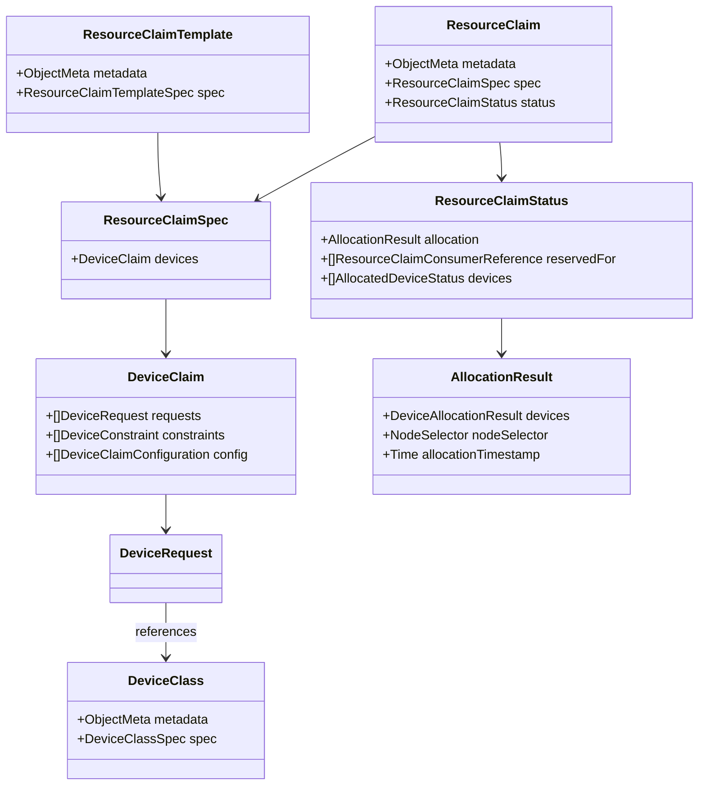
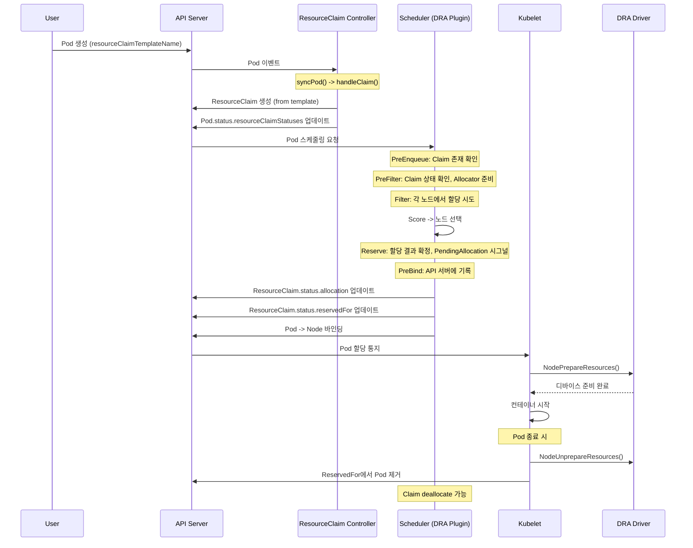

# 33. 고급 스케줄링: Scheduling Gates 및 Dynamic Resource Allocation 심화

## 목차

1. [개요](#1-개요)
2. [Scheduling Gates 메커니즘](#2-scheduling-gates-메커니즘)
3. [Scheduling Gates 플러그인 구현](#3-scheduling-gates-플러그인-구현)
4. [Dynamic Resource Allocation (DRA) 개요](#4-dynamic-resource-allocation-dra-개요)
5. [ResourceClaim 타입 정의](#5-resourceclaim-타입-정의)
6. [DRA 스케줄러 플러그인](#6-dra-스케줄러-플러그인)
7. [ResourceClaim Controller](#7-resourceclaim-controller)
8. [DRA Lifecycle (할당 -> 예약 -> 바인딩)](#8-dra-lifecycle-할당--예약--바인딩)
9. [DeviceClass와 DeviceRequest](#9-deviceclass와-devicerequest)
10. [왜 이런 설계인가](#10-왜-이런-설계인가)
11. [정리](#11-정리)

---

## 1. 개요

Kubernetes의 스케줄링은 단순히 "어떤 노드에 Pod를 배치할 것인가"만의 문제가 아니다.
현대 클라우드 네이티브 환경에서는 외부 시스템의 준비 상태를 기다려야 하거나(Scheduling Gates),
GPU/FPGA 같은 특수 하드웨어 자원을 할당받아야 하는(Dynamic Resource Allocation) 복잡한 요구사항이 존재한다.

이 문서에서는 두 가지 고급 스케줄링 메커니즘을 소스코드 수준에서 심화 분석한다.

### Scheduling Gates

Pod가 스케줄링 큐에 진입하기 전에 **게이트(gate)**를 설정하여, 외부 조건이 충족될 때까지
스케줄링 자체를 차단하는 메커니즘이다. Pod의 `spec.schedulingGates` 필드에 게이트 이름을 추가하면,
해당 게이트가 모두 제거될 때까지 Pod는 스케줄링 큐에 들어가지 못한다.

### Dynamic Resource Allocation (DRA)

기존 `resources.requests/limits` 모델로는 표현이 불가능한 **구조화된 디바이스 자원**을
Pod에 동적으로 할당하기 위한 프레임워크다. GPU, FPGA, 네트워크 인터페이스 등
드라이버 특화(device-specific) 자원을 ResourceClaim이라는 API 객체를 통해 관리한다.

### 핵심 소스 파일

| 파일 | 역할 |
|------|------|
| `pkg/scheduler/framework/plugins/schedulinggates/scheduling_gates.go` | Scheduling Gates 플러그인 |
| `pkg/scheduler/framework/plugins/dynamicresources/dynamicresources.go` | DRA 스케줄러 플러그인 |
| `staging/src/k8s.io/api/core/v1/types.go` | PodSchedulingGate, PodResourceClaim 타입 |
| `staging/src/k8s.io/api/resource/v1/types.go` | ResourceClaim, DeviceClaim, DeviceClass 등 DRA 타입 |
| `pkg/controller/resourceclaim/controller.go` | ResourceClaim 컨트롤러 |

---

## 2. Scheduling Gates 메커니즘

### 2.1 개념

Scheduling Gates는 Pod가 스케줄링 큐(activeQ)에 진입하기 **전에** 외부 조건을 확인하는
**Pre-Enqueue** 단계의 차단 장치다.

전통적인 스케줄링 흐름에서는 Pod가 생성되면 즉시 스케줄링 큐에 들어가고,
Filter/Score 단계를 거쳐 노드에 바인딩된다. 하지만 다음과 같은 시나리오에서는
스케줄링 자체를 보류해야 한다:

- **멀티 클러스터 스케줄링**: 중앙 컨트롤러가 어느 클러스터에 배치할지 결정한 후 게이트를 해제
- **리소스 쿼터 관리**: 외부 쿼터 시스템이 승인한 후 게이트를 해제
- **의존성 관리**: 선행 서비스가 준비된 후 게이트를 해제
- **배치 스케줄링**: 여러 Pod가 동시에 스케줄링되어야 할 때 게이트로 동기화

### 2.2 API 타입: PodSchedulingGate

```go
// staging/src/k8s.io/api/core/v1/types.go (lines 4576-4581)

// PodSchedulingGate is associated to a Pod to guard its scheduling.
type PodSchedulingGate struct {
    // Name of the scheduling gate.
    // Each scheduling gate must have a unique name field.
    Name string `json:"name" protobuf:"bytes,1,opt,name=name"`
}
```

Pod의 `spec.schedulingGates`는 `[]PodSchedulingGate` 타입으로 정의된다.
각 게이트는 고유한 `Name`을 가지며, 이 슬라이스가 비어 있어야만 Pod가 스케줄링 큐에 진입할 수 있다.

### 2.3 동작 흐름

```
Pod 생성 (spec.schedulingGates: ["gate-a", "gate-b"])
    |
    v
+---------------------------------------------+
|  PreEnqueue 단계                              |
|                                               |
|  schedulingGates.PreEnqueue(pod)              |
|    +-- len(pod.Spec.SchedulingGates) > 0 ?   |
|         |-- Yes -> UnschedulableAndUnresolvable|
|         |        (큐에 진입 거부)              |
|         +-- No  -> nil (큐에 진입 허용)        |
+---------------------------------------------+
    |
    | 외부 컨트롤러가 gate-a 제거
    | Pod 업데이트 이벤트 발생
    |
    v
+---------------------------------------------+
|  EventsToRegister -> QueueingHint 평가        |
|                                               |
|  UpdatePodSchedulingGatesEliminated 이벤트     |
|    +-- isSchedulableAfterUpdate...()          |
|         +-- modifiedPod.UID == pod.UID ?      |
|              |-- Yes -> Queue (재시도)         |
|              +-- No  -> QueueSkip             |
+---------------------------------------------+
    |
    | 외부 컨트롤러가 gate-b도 제거
    |
    v
+---------------------------------------------+
|  PreEnqueue 재평가                            |
|                                               |
|  len(pod.Spec.SchedulingGates) == 0          |
|    +-- nil 반환 -> 스케줄링 큐 진입!           |
+---------------------------------------------+
    |
    v
  Filter -> Score -> Reserve -> Bind (일반 스케줄링)
```

### 2.4 YAML 예시

```yaml
apiVersion: v1
kind: Pod
metadata:
  name: gated-pod
spec:
  schedulingGates:
    - name: "example.com/gpu-quota-approved"
    - name: "example.com/security-scan-passed"
  containers:
    - name: app
      image: nginx
      resources:
        requests:
          cpu: "1"
          memory: "512Mi"
```

외부 컨트롤러가 조건을 확인한 후 `schedulingGates`에서 해당 항목을 제거하면,
Pod가 스케줄링 가능한 상태가 된다. 게이트 제거는 Pod의 `spec.schedulingGates` 필드를
PATCH하여 수행한다.

### 2.5 Scheduling Gates와 스케줄링 큐 아키텍처

```
+-------------------------------------------------------------------+
|                  스케줄러 스케줄링 큐                                 |
|                                                                     |
|  +-------------------+    +-------------------+                     |
|  | Unschedulable     |    | Backoff           |                     |
|  | Pods              |    | Queue             |                     |
|  | (Gate 있는 Pod)   |    | (재시도 대기)      |                     |
|  +--------+----------+    +---------+---------+                     |
|           |                         |                               |
|           | Gate 제거 이벤트         | backoff 만료                  |
|           |                         |                               |
|           v                         v                               |
|  +---------------------------------------------------+             |
|  |              Active Queue (activeQ)                |             |
|  |                                                     |             |
|  |  PreEnqueue 통과한 Pod만 여기에 들어옴              |             |
|  +---------+-----------------------------------------+             |
|            |                                                        |
|            | Pop()                                                  |
|            v                                                        |
|  +---------------------------------------------------+             |
|  |         Scheduling Cycle                           |             |
|  |  PreFilter -> Filter -> Score -> Reserve -> Bind   |             |
|  +---------------------------------------------------+             |
+-------------------------------------------------------------------+
```

---

## 3. Scheduling Gates 플러그인 구현

### 3.1 플러그인 구조체

```go
// pkg/scheduler/framework/plugins/schedulinggates/scheduling_gates.go (lines 37-39)

// SchedulingGates checks if a Pod carries .spec.schedulingGates.
type SchedulingGates struct {
    enableSchedulingQueueHint bool
}
```

구조체는 극도로 단순하다. `enableSchedulingQueueHint` 하나의 필드만 가지고 있으며,
이 필드는 QueueingHint 기능 게이트의 활성화 여부를 나타낸다.

### 3.2 인터페이스 구현

```go
var _ fwk.PreEnqueuePlugin = &SchedulingGates{}
var _ fwk.EnqueueExtensions = &SchedulingGates{}
```

두 가지 인터페이스를 구현한다:

| 인터페이스 | 메서드 | 역할 |
|-----------|--------|------|
| `PreEnqueuePlugin` | `PreEnqueue()` | Pod가 큐에 진입할 수 있는지 판단 |
| `EnqueueExtensions` | `EventsToRegister()` | 어떤 이벤트가 재스케줄링을 트리거하는지 등록 |

### 3.3 PreEnqueue 구현

```go
// pkg/scheduler/framework/plugins/schedulinggates/scheduling_gates.go (lines 48-57)

func (pl *SchedulingGates) PreEnqueue(ctx context.Context, p *v1.Pod) *fwk.Status {
    if len(p.Spec.SchedulingGates) == 0 {
        return nil
    }
    gates := make([]string, 0, len(p.Spec.SchedulingGates))
    for _, gate := range p.Spec.SchedulingGates {
        gates = append(gates, gate.Name)
    }
    return fwk.NewStatus(fwk.UnschedulableAndUnresolvable,
        fmt.Sprintf("waiting for scheduling gates: %v", gates))
}
```

**동작 분석:**

1. `SchedulingGates` 슬라이스가 비어 있으면 `nil` 반환 -- 통과
2. 비어 있지 않으면 모든 게이트 이름을 수집
3. `UnschedulableAndUnresolvable` 상태 반환 -- Pod가 큐에 진입하지 못함

`UnschedulableAndUnresolvable`은 `Unschedulable`과 다르다:

| 상태 | 의미 | 재시도 조건 |
|------|------|-----------|
| `Unschedulable` | 현재 노드에서는 불가, 다른 노드에서는 가능 | 노드 상태 변경 시 |
| `UnschedulableAndUnresolvable` | 클러스터 상태가 변하지 않는 한 어디서도 불가 | 특정 이벤트(Gate 제거) 발생 시 |

Scheduling Gates는 후자를 사용한다. 게이트가 존재하는 한 **어떤 노드에서도** 스케줄링이 불가능하기 때문이다.

### 3.4 EventsToRegister 구현

```go
// pkg/scheduler/framework/plugins/schedulinggates/scheduling_gates.go (lines 61-73)

func (pl *SchedulingGates) EventsToRegister(_ context.Context) ([]fwk.ClusterEventWithHint, error) {
    if !pl.enableSchedulingQueueHint {
        return nil, nil
    }
    return []fwk.ClusterEventWithHint{
        {
            Event: fwk.ClusterEvent{
                Resource:   fwk.Pod,
                ActionType: fwk.UpdatePodSchedulingGatesEliminated,
            },
            QueueingHintFn: pl.isSchedulableAfterUpdatePodSchedulingGatesEliminated,
        },
    }, nil
}
```

QueueingHint가 활성화된 경우, `UpdatePodSchedulingGatesEliminated` 이벤트를 등록한다.
이 이벤트는 Pod의 `schedulingGates`가 **제거**될 때 발생하며, 해당 Pod에 대해서만
재스케줄링을 시도한다.

QueueingHint가 비활성화된 경우에는 `nil`을 반환하여, 전통적인 방식(모든 Pod 업데이트에 반응)으로 동작한다.

### 3.5 QueueingHint 함수

```go
// pkg/scheduler/framework/plugins/schedulinggates/scheduling_gates.go (lines 82-94)

func (pl *SchedulingGates) isSchedulableAfterUpdatePodSchedulingGatesEliminated(
    logger klog.Logger, pod *v1.Pod, oldObj, newObj interface{},
) (fwk.QueueingHint, error) {
    _, modifiedPod, err := util.As[*v1.Pod](oldObj, newObj)
    if err != nil {
        return fwk.Queue, err
    }
    if modifiedPod.UID != pod.UID {
        return fwk.QueueSkip, nil
    }
    return fwk.Queue, nil
}
```

이 함수는 업데이트된 Pod가 **같은 UID**인 경우에만 `Queue`를 반환하여
해당 Pod를 다시 스케줄링 큐에 넣도록 한다.
다른 Pod의 게이트가 제거된 것은 현재 Pod의 스케줄링과 무관하므로 `QueueSkip`한다.

**QueueingHint의 효율성:**

기존 방식에서는 아무 Pod의 업데이트 이벤트가 발생할 때마다 Unschedulable 큐의 모든 Pod를
재평가했다. QueueingHint를 사용하면 UID 비교만으로 관련 Pod만 선별하여
불필요한 재스케줄링 시도를 방지한다.

### 3.6 초기화

```go
// pkg/scheduler/framework/plugins/schedulinggates/scheduling_gates.go (lines 76-80)

func New(_ context.Context, _ runtime.Object, _ fwk.Handle, fts feature.Features) (fwk.Plugin, error) {
    return &SchedulingGates{
        enableSchedulingQueueHint: fts.EnableSchedulingQueueHint,
    }, nil
}
```

feature.Features에서 `EnableSchedulingQueueHint` 플래그를 받아 구조체를 초기화한다.
별도의 설정(config)이나 핸들(Handle)은 필요하지 않다.
이것은 이 플러그인의 단순한 본질을 반영한다 -- 상태가 없고(stateless), API 서버 접근이 없으며,
오직 Pod의 `schedulingGates` 필드만 확인한다.

---

## 4. Dynamic Resource Allocation (DRA) 개요

### 4.1 왜 DRA가 필요한가

기존 Kubernetes 리소스 모델의 한계:

```yaml
# 기존 모델 (resources.requests/limits)
resources:
  requests:
    cpu: "2"
    memory: "4Gi"
    nvidia.com/gpu: "1"    # Extended Resource - 정수 카운터일 뿐
  limits:
    cpu: "4"
    memory: "8Gi"
    nvidia.com/gpu: "1"
```

기존 Extended Resource 모델의 문제점:

| 문제 | 설명 |
|------|------|
| 정수 카운터 | GPU 종류(A100 vs H100)를 구분할 수 없음 |
| 공유 불가 | 하나의 디바이스를 여러 Pod가 공유할 수 없음 |
| 속성 표현 | 메모리 크기, 연결 토폴로지 등 속성을 표현할 수 없음 |
| 동적 할당 | 런타임에 드라이버가 자원을 준비하는 흐름이 없음 |
| 제약 조건 | "같은 NUMA 노드의 GPU 2개" 같은 제약을 표현할 수 없음 |

DRA는 이 모든 문제를 해결한다.

### 4.2 DRA 아키텍처 개요

```
+------------------------------------------------------------------+
|                    Control Plane                                  |
|                                                                   |
|  +--------------+   +------------------+   +------------------+   |
|  |  API Server  |   | ResourceClaim    |   |    Scheduler     |   |
|  |              |   | Controller       |   |                  |   |
|  | ResourceClaim|<--+                  |   | DynamicResources |   |
|  | DeviceClass  |   | - syncPod()      |   | Plugin           |   |
|  | ResourceSlice|   | - handleClaim()  |   | - PreEnqueue()   |   |
|  |              |   | - reserveForPod()|   | - PreFilter()    |   |
|  +------+-------+   +------------------+   | - Filter()       |   |
|         |                                   | - Reserve()      |   |
|         |                                   | - PreBind()      |   |
|         |                                   +------------------+   |
+---------|----------------------------------------------------------+
          |
          |  Watch/Update
          |
+---------|---------------------------------------------------------+
|         v            Node                                         |
|  +--------------+   +------------------+                          |
|  |   Kubelet    |   |  DRA Driver      |                          |
|  |              |-->|  (Plugin)        |                          |
|  | - NodePrepare|   |                  |                          |
|  |   Resource   |   | - ResourceSlice  |                          |
|  |              |   |   발행            |                          |
|  +--------------+   | - 디바이스 준비   |                          |
|                     +------------------+                          |
+-------------------------------------------------------------------+
```

### 4.3 핵심 API 객체 관계



### 4.4 DRA의 핵심 워크플로우 요약

```
1. 드라이버가 ResourceSlice를 발행 (노드의 사용 가능한 디바이스 목록)
2. 관리자가 DeviceClass를 정의 (디바이스 종류 + 셀렉터 + 설정)
3. 사용자가 ResourceClaim을 생성 (또는 Template으로 자동 생성)
4. 스케줄러 DRA 플러그인이 할당 수행 (CEL 매칭 + 노드 선택)
5. Kubelet이 DRA 드라이버를 통해 디바이스를 준비
6. 컨테이너가 디바이스 사용
```

---

## 5. ResourceClaim 타입 정의

### 5.1 ResourceClaim

```go
// staging/src/k8s.io/api/resource/v1/types.go (lines 743-757)

type ResourceClaim struct {
    metav1.TypeMeta   `json:",inline"`
    metav1.ObjectMeta `json:"metadata,omitempty" protobuf:"bytes,1,opt,name=metadata"`

    // Spec describes what is being requested and how to configure it.
    // The spec is immutable.
    Spec   ResourceClaimSpec   `json:"spec" protobuf:"bytes,2,name=spec"`
    Status ResourceClaimStatus `json:"status,omitempty" protobuf:"bytes,3,opt,name=status"`
}
```

`ResourceClaim`은 Kubernetes의 네임스페이스 리소스로, Pod가 필요로 하는 디바이스 자원을 선언한다.
**Spec은 불변(immutable)**이다 -- 한번 생성되면 요청 내용을 변경할 수 없다.
Status만 컨트롤러와 스케줄러에 의해 업데이트된다.

### 5.2 ResourceClaimSpec

```go
// staging/src/k8s.io/api/resource/v1/types.go (lines 759-770)

type ResourceClaimSpec struct {
    // Devices defines how to request devices.
    Devices DeviceClaim `json:"devices" protobuf:"bytes,1,name=devices"`
}
```

Spec은 `DeviceClaim` 하나만 포함한다. 과거에는 `Controller` 필드가 있었지만
1.32에서 제거(tombstoned)되었다. 이는 DRA가 **구조화된 파라미터(structured parameters)**
모델로 전환했음을 의미한다 -- 드라이버 기반 할당에서 스케줄러 자체 할당으로의 전환이다.

### 5.3 DeviceClaim

```go
// staging/src/k8s.io/api/resource/v1/types.go (lines 772-810)

type DeviceClaim struct {
    // Requests represent individual requests for distinct devices
    // which must all be satisfied. If empty, nothing needs to be allocated.
    Requests    []DeviceRequest            `json:"requests" protobuf:"bytes,1,name=requests"`

    // These constraints must be satisfied by the set of devices that
    // get allocated for the claim.
    Constraints []DeviceConstraint         `json:"constraints,omitempty" protobuf:"bytes,2,opt,name=constraints"`

    // This field holds configuration for multiple potential drivers
    // which could satisfy requests in this claim.
    Config      []DeviceClaimConfiguration `json:"config,omitempty" protobuf:"bytes,3,opt,name=config"`
}
```

| 필드 | 최대 크기 | 역할 |
|------|----------|------|
| `Requests` | 32개 | 필요한 디바이스 요청 목록. 모든 요청이 만족되어야 함 |
| `Constraints` | 32개 | 디바이스 간 제약조건 (예: 같은 NUMA 노드에 위치) |
| `Config` | 32개 | 드라이버 특화 설정. 할당 시에는 무시되고 드라이버에 전달됨 |

### 5.4 ResourceClaimStatus

```go
// staging/src/k8s.io/api/resource/v1/types.go (lines 1445-1507)

type ResourceClaimStatus struct {
    // Allocation is set once the claim has been allocated successfully.
    Allocation *AllocationResult `json:"allocation,omitempty" protobuf:"bytes,1,opt,name=allocation"`

    // ReservedFor indicates which entities are currently allowed to use
    // the claim. A Pod which references a ResourceClaim which is not
    // reserved for that Pod will not be started.
    // There can be at most 256 such reservations.
    ReservedFor []ResourceClaimConsumerReference `json:"reservedFor,omitempty" ...`

    // Devices contains the status of each device allocated for this
    // claim, as reported by the driver.
    Devices []AllocatedDeviceStatus `json:"devices,omitempty" ...`
}
```

**핵심 설계 포인트:**

1. **Allocation**: 할당 결과. `nil`이면 아직 할당되지 않은 상태
2. **ReservedFor**: 이 Claim을 사용할 수 있는 소비자(Pod) 목록. 최대 256개
3. **Devices**: 각 디바이스의 드라이버 보고 상태

### 5.5 AllocationResult

```go
// staging/src/k8s.io/api/resource/v1/types.go (lines 1534-1560)

type AllocationResult struct {
    // Devices is the result of allocating devices.
    Devices DeviceAllocationResult `json:"devices,omitempty" protobuf:"bytes,1,opt,name=devices"`

    // NodeSelector defines where the allocated resources are available.
    // If unset, they are available everywhere.
    NodeSelector *v1.NodeSelector `json:"nodeSelector,omitempty" protobuf:"bytes,3,opt,name=nodeSelector"`

    // AllocationTimestamp stores the time when the resources were allocated.
    AllocationTimestamp *metav1.Time `json:"allocationTimestamp,omitempty" protobuf:"bytes,5,opt,name=allocationTimestamp"`
}
```

`NodeSelector`가 설정되면 해당 노드에서만 자원을 사용할 수 있다.
이 필드는 스케줄러의 `Filter` 단계에서 노드 적합성 판단에 사용된다.

### 5.6 ResourceClaimConsumerReference

```go
// staging/src/k8s.io/api/resource/v1/types.go (lines 1516-1531)

type ResourceClaimConsumerReference struct {
    APIGroup string    `json:"apiGroup,omitempty" protobuf:"bytes,1,opt,name=apiGroup"`
    Resource string    `json:"resource" protobuf:"bytes,3,name=resource"`
    Name     string    `json:"name" protobuf:"bytes,4,name=name"`
    UID      types.UID `json:"uid" protobuf:"bytes,5,name=uid"`
}
```

`ReservedFor` 필드에 들어가는 소비자 참조. UID를 통해 정확히 하나의 리소스 인스턴스를 식별한다.

### 5.7 PodResourceClaim (Pod 측 참조)

```go
// staging/src/k8s.io/api/core/v1/types.go (lines 4480-4512)

type PodResourceClaim struct {
    // Name uniquely identifies this resource claim inside the pod.
    // This must be a DNS_LABEL.
    Name string `json:"name" protobuf:"bytes,1,name=name"`

    // ResourceClaimName is the name of a ResourceClaim object in the same namespace.
    // Exactly one of ResourceClaimName and ResourceClaimTemplateName must be set.
    ResourceClaimName *string `json:"resourceClaimName,omitempty" protobuf:"bytes,3,opt,name=resourceClaimName"`

    // ResourceClaimTemplateName is the name of a ResourceClaimTemplate object.
    // The template will be used to create a new ResourceClaim, which will
    // be bound to this pod. When this pod is deleted, the ResourceClaim
    // will also be deleted.
    ResourceClaimTemplateName *string `json:"resourceClaimTemplateName,omitempty" protobuf:"bytes,4,opt,name=resourceClaimTemplateName"`
}
```

Pod에서 ResourceClaim을 참조하는 방법은 두 가지다:

| 방법 | 필드 | 생명주기 |
|------|------|---------|
| 직접 참조 | `ResourceClaimName` | Pod와 독립적. 미리 생성된 Claim을 이름으로 참조 |
| 템플릿 참조 | `ResourceClaimTemplateName` | Pod와 연동. Pod 삭제 시 Claim도 삭제 (Owner Reference) |

---

## 6. DRA 스케줄러 플러그인

### 6.1 플러그인 구조체

```go
// pkg/scheduler/framework/plugins/dynamicresources/dynamicresources.go (lines 137-147)

// DynamicResources is a plugin that ensures that ResourceClaims are allocated.
type DynamicResources struct {
    enabled        bool
    fts            feature.Features
    filterTimeout  time.Duration
    bindingTimeout time.Duration
    fh             fwk.Handle
    clientset      kubernetes.Interface
    celCache       *cel.Cache
    draManager     fwk.SharedDRAManager
}
```

| 필드 | 역할 |
|------|------|
| `enabled` | `DynamicResourceAllocation` 기능 게이트 활성화 여부 |
| `fts` | 각종 DRA 서브 기능 게이트 (AdminAccess, PrioritizedList 등) |
| `filterTimeout` | Filter 단계 할당 시도 타임아웃 |
| `bindingTimeout` | 바인딩 조건 대기 타임아웃 |
| `fh` | 스케줄러 프레임워크 핸들 (인포머, 큐 등에 접근) |
| `clientset` | Kubernetes API 클라이언트 (PreBind에서 API 호출용) |
| `celCache` | CEL 표현식 컴파일 캐시 (LRU, 최대 10개, 사이클 간 재사용) |
| `draManager` | DRA 리소스 관리자 (ResourceSlice, DeviceClass, ResourceClaim 캐시) |

### 6.2 구현하는 인터페이스

```go
var _ fwk.PreEnqueuePlugin  = &DynamicResources{}
var _ fwk.PreFilterPlugin   = &DynamicResources{}
var _ fwk.FilterPlugin      = &DynamicResources{}
var _ fwk.PostFilterPlugin  = &DynamicResources{}
var _ fwk.ScorePlugin       = &DynamicResources{}
var _ fwk.ReservePlugin     = &DynamicResources{}
var _ fwk.EnqueueExtensions = &DynamicResources{}
var _ fwk.PreBindPlugin     = &DynamicResources{}
var _ fwk.SignPlugin         = &DynamicResources{}
```

DRA 플러그인은 스케줄링 프레임워크의 **거의 모든 확장점**을 구현한다.

```
PreEnqueue -> PreFilter -> Filter -> PostFilter -> Score -> Reserve -> PreBind
    |            |           |           |           |         |          |
    |            |           |           |           |         |          +-- API 서버에 할당 결과 기록
    |            |           |           |           |         +-- 선택된 노드의 할당 결과 확정
    |            |           |           |           +-- (향후 디바이스 최적 선택을 위한 점수 부여)
    |            |           |           +-- 할당 실패 시 기존 할당 해제 시도
    |            |           +-- 각 노드에서 디바이스 할당 가능 여부 확인
    |            +-- Claim 상태 확인, Allocator 준비
    +-- Claim이 모두 존재하는지 확인
```

### 6.3 PreEnqueue

```go
// pkg/scheduler/framework/plugins/dynamicresources/dynamicresources.go (lines 246-255)

func (pl *DynamicResources) PreEnqueue(ctx context.Context, pod *v1.Pod) (status *fwk.Status) {
    if !pl.enabled {
        return nil
    }
    if err := pl.foreachPodResourceClaim(pod, nil); err != nil {
        return statusUnschedulable(klog.FromContext(ctx), err.Error())
    }
    return nil
}
```

`foreachPodResourceClaim`은 Pod가 참조하는 모든 ResourceClaim이 존재하는지 확인한다.
콜백이 `nil`이므로 실제 처리 없이 존재 여부만 검증한다.
Claim이 아직 생성되지 않았다면 Pod는 큐에 들어갈 수 없다.

### 6.4 PreFilter (핵심 로직)

PreFilter는 DRA 플러그인에서 가장 복잡한 단계로, 약 170줄의 코드를 포함한다.

```go
// pkg/scheduler/framework/plugins/dynamicresources/dynamicresources.go (lines 402-574)

func (pl *DynamicResources) PreFilter(ctx context.Context, state fwk.CycleState,
    pod *v1.Pod, nodes []fwk.NodeInfo) (*fwk.PreFilterResult, *fwk.Status) {

    // 1. 빈 상태 데이터 초기화
    s := &stateData{}
    state.Write(stateKey, s)

    // 2. Pod의 모든 ResourceClaim 조회
    userClaims, err := pl.podResourceClaims(pod)

    // 3. Extended Resource Claim 처리 (DRAExtendedResource 기능)
    extendedResourceClaim, status := pl.preFilterExtendedResources(pod, logger, s)

    // 4. Claim이 없으면 Skip
    claims := newClaimStore(userClaims, extendedResourceClaim)
    if claims.empty() {
        return nil, fwk.NewStatus(fwk.Skip)
    }

    // 5. 각 Claim 상태 확인
    numClaimsToAllocate := 0
    s.informationsForClaim = make([]informationForClaim, claims.len())
    for index, claim := range claims.all() {
        if claim.Status.Allocation != nil &&
            !resourceclaim.CanBeReserved(claim) &&
            !resourceclaim.IsReservedForPod(pod, claim) {
            // 이미 다른 Pod가 사용 중 -> Unschedulable
            return nil, statusUnschedulable(...)
        }
        if claim.Status.Allocation != nil {
            // 이미 할당됨 -> NodeSelector 저장 (Filter에서 사용)
            if claim.Status.Allocation.NodeSelector != nil {
                nodeSelector, _ := nodeaffinity.NewNodeSelector(...)
                s.informationsForClaim[index].availableOnNodes = nodeSelector
            }
        } else {
            numClaimsToAllocate++
            // 할당이 다른 사이클에서 진행 중인지 확인
            if pl.draManager.ResourceClaims().ClaimHasPendingAllocation(claim.UID) {
                return nil, statusUnschedulable(...)
            }
            // DeviceClass 존재 여부 확인
            for _, request := range claim.Spec.Devices.Requests {
                switch {
                case request.Exactly != nil:
                    pl.validateDeviceClass(logger, request.Exactly.DeviceClassName, ...)
                case len(request.FirstAvailable) > 0:
                    // 각 서브요청의 DeviceClass 확인
                }
            }
        }
    }

    // 6. Allocator 준비 (할당해야 할 Claim이 있는 경우)
    if numClaimsToAllocate > 0 {
        // 이미 할당된 디바이스 목록 수집 (다른 Claim에 할당된 디바이스 중복 방지)
        allocatedState, _ := pl.draManager.ResourceClaims().GatherAllocatedState()
        // 노드의 사용 가능한 디바이스 목록 조회
        slices, _ := pl.draManager.ResourceSlices().ListWithDeviceTaintRules()
        // Allocator 생성 (CEL 캐시 포함)
        allocator, _ := structured.NewAllocator(ctx, features,
            *allocatedState, pl.draManager.DeviceClasses(), slices, pl.celCache)
        s.allocator = allocator
        s.nodeAllocations = make(map[string]nodeAllocation)
    }
    s.claims = claims
    return nil, nil
}
```

**stateData 구조 (사이클 내 상태 저장):**

```go
// lines 67-110
type stateData struct {
    claims               claimStore                    // Pod의 모든 Claim
    allocator            structured.Allocator          // 디바이스 할당기
    mutex                sync.Mutex                    // 동시성 보호 (Filter 병렬 실행)
    unavailableClaims    sets.Set[int]                 // 사용 불가 Claim 인덱스
    informationsForClaim []informationForClaim         // Claim별 정보
    nodeAllocations      map[string]nodeAllocation     // 노드별 할당 결과 캐시
}
```

### 6.5 Filter

```go
// pkg/scheduler/framework/plugins/dynamicresources/dynamicresources.go (lines 631-774)

func (pl *DynamicResources) Filter(ctx context.Context, cs fwk.CycleState,
    pod *v1.Pod, nodeInfo fwk.NodeInfo) *fwk.Status {

    // 1. 이미 할당된 Claim: NodeSelector로 노드 적합성 확인
    for index, claim := range state.claims.all() {
        if nodeSelector := state.informationsForClaim[index].availableOnNodes;
            nodeSelector != nil && !nodeSelector.Match(node) {
            unavailableClaims = append(unavailableClaims, index)
        }
        // 바인딩 조건 확인 (DRADeviceBindingConditions 기능)
        if claim.Status.Allocation != nil {
            if pl.fts.EnableDRADeviceBindingConditions {
                ready, err := pl.isClaimReadyForBinding(claim)
                // 타임아웃 또는 실패 시 unavailable로 표시
            }
        }
    }

    // 2. 미할당 Claim: Allocator로 할당 시도
    if state.allocator != nil {
        claimsToAllocate := make([]*resourceapi.ResourceClaim, 0, state.claims.len())
        for _, claim := range state.claims.toAllocate() {
            claimsToAllocate = append(claimsToAllocate, claim)
        }
        // 타임아웃 적용 가능
        allocations, err := state.allocator.Allocate(allocCtx, node, claimsToAllocate)
        // 에러 유형별 처리:
        // - DeadlineExceeded: 타임아웃
        // - ErrFailedAllocationOnNode: 이 노드에서만 실패, 다른 노드는 가능
        // - 기타: 치명적 오류, 스케줄링 중단
    }

    // 3. 결과 캐시 (mutex 보호 -- Filter는 병렬 실행)
    state.mutex.Lock()
    state.nodeAllocations[node.Name] = nodeAllocation{
        allocationResults: allocations,
    }
    state.mutex.Unlock()
    return nil
}
```

Filter는 **각 노드마다 병렬로** 호출된다. 따라서 `state.mutex`로 공유 상태를 보호한다.

```
                    PreFilter (한 번)
                        |
            +-----------+-----------+
            v           v           v
     Filter(node-1) Filter(node-2) Filter(node-3)   <-- 병렬 실행
            |           |           |
            v           v           v
     할당 가능?     할당 가능?     할당 가능?
     결과 캐시     결과 캐시      결과 캐시
            |           |           |
            +-----------+-----------+
                        v
                 Score -> Reserve (하나의 노드 선택)
```

### 6.6 Reserve

```go
// pkg/scheduler/framework/plugins/dynamicresources/dynamicresources.go (lines 907-1001)

func (pl *DynamicResources) Reserve(ctx context.Context, cs fwk.CycleState,
    pod *v1.Pod, nodeName string) (status *fwk.Status) {

    // 1. 이미 할당된 Claim은 건너뜀 (Bind 단계에서 ReservedFor 업데이트)
    numClaimsWithAllocator := 0
    for _, claim := range state.claims.all() {
        if claim.Status.Allocation != nil {
            continue
        }
        numClaimsWithAllocator++
    }
    if numClaimsWithAllocator == 0 {
        return nil
    }

    // 2. Filter에서 캐시한 할당 결과 가져오기
    allocations, ok := state.nodeAllocations[nodeName]
    if !ok || len(allocations.allocationResults) == 0 {
        return statusError(logger, errors.New("claim allocation not found for node"))
    }

    // 3. 각 Claim에 할당 결과 설정
    allocIndex := 0
    for index, claim := range state.claims.toAllocate() {
        allocation := &allocations.allocationResults[allocIndex]
        state.informationsForClaim[index].allocation = allocation

        // Deep Copy + Finalizer 추가 + Status 설정
        claim = claim.DeepCopy()
        claim.Finalizers = append(claim.Finalizers, resourceapi.Finalizer)
        claim.Status.Allocation = allocation

        // 4. Pending Allocation 시그널
        //    (다른 스케줄링 사이클이 같은 리소스를 할당하지 않도록)
        pl.draManager.ResourceClaims().SignalClaimPendingAllocation(claim.UID, claim)
        allocIndex++
    }
    return nil
}
```

Reserve 단계의 핵심은 **낙관적 예약(optimistic reservation)**이다:

1. 실제 API 서버 업데이트 없이 로컬에서 할당 결과를 확정한다
2. `SignalClaimPendingAllocation`으로 다른 스케줄링 사이클에게 이 자원이 사용 중임을 알린다
3. 실제 API 서버 기록은 `PreBind` 단계에서 수행한다
4. 실패 시 `Unreserve`에서 `RemoveClaimPendingAllocation`으로 정리한다

---

## 7. ResourceClaim Controller

### 7.1 컨트롤러 구조체

```go
// pkg/controller/resourceclaim/controller.go (lines 80-121)

// Controller creates ResourceClaims for ResourceClaimTemplates in a pod spec.
type Controller struct {
    features     Features
    kubeClient   clientset.Interface
    claimLister  resourcelisters.ResourceClaimLister
    claimsSynced cache.InformerSynced
    claimCache   cache.MutationCache
    podLister    v1listers.PodLister
    podSynced    cache.InformerSynced
    templateLister  resourcelisters.ResourceClaimTemplateLister
    templatesSynced cache.InformerSynced
    podIndexer   cache.Indexer
    recorder     record.EventRecorder
    queue        workqueue.TypedRateLimitingInterface[string]
    deletedObjects *uidCache
}
```

| 필드 | 역할 |
|------|------|
| `claimLister` | ResourceClaim 목록 조회 (인포머 캐시) |
| `claimCache` | MutationCache -- API 호출 후 인포머 동기화 전까지 임시 캐시 |
| `templateLister` | ResourceClaimTemplate 조회 |
| `podIndexer` | PodResourceClaim 인덱서 -- Claim에서 Pod를 역추적 |
| `deletedObjects` | 삭제된 Pod UID 캐시 -- ReservedFor 정리에 사용 |

### 7.2 주요 역할

ResourceClaim 컨트롤러의 핵심 역할은 두 가지다:

1. **템플릿에서 ResourceClaim 생성**: Pod의 `resourceClaimTemplateName`을 보고
   실제 ResourceClaim 객체를 생성
2. **Pod 바인딩 후 ReservedFor 업데이트**: Pod가 노드에 바인딩되면 해당 Claim의
   `reservedFor`에 Pod를 추가

### 7.3 syncPod 함수

```go
// pkg/controller/resourceclaim/controller.go (lines 556-636)

func (ec *Controller) syncPod(ctx context.Context, namespace, name string) error {
    pod, err := ec.podLister.Pods(namespace).Get(name)
    if err != nil {
        if apierrors.IsNotFound(err) {
            return nil  // Pod가 삭제됨
        }
        return err
    }
    if pod.DeletionTimestamp != nil {
        return nil  // 삭제 진행 중
    }

    // 1단계: 각 PodResourceClaim에 대해 handleClaim 호출
    var newPodClaims map[string]string
    for _, podClaim := range pod.Spec.ResourceClaims {
        if err := ec.handleClaim(ctx, pod, podClaim, &newPodClaims); err != nil {
            ec.recorder.Event(pod, v1.EventTypeWarning,
                "FailedResourceClaimCreation", ...)
            return err
        }
    }

    // 2단계: 새로 생성된 Claim 이름을 Pod Status에 기록
    if newPodClaims != nil {
        statuses := make([]*corev1apply.PodResourceClaimStatusApplyConfiguration, ...)
        for podClaimName, resourceClaimName := range newPodClaims {
            statuses = append(statuses,
                corev1apply.PodResourceClaimStatus().
                    WithName(podClaimName).
                    WithResourceClaimName(resourceClaimName))
        }
        // Server-Side Apply로 Pod Status 업데이트
        ec.kubeClient.CoreV1().Pods(namespace).ApplyStatus(ctx, podApply, ...)
    }

    // 3단계: Pod가 이미 노드에 바인딩된 경우
    if pod.Spec.NodeName == "" {
        return nil  // 스케줄러가 처리할 것
    }
    // ReservedFor 업데이트
    for _, podClaim := range pod.Spec.ResourceClaims {
        claimName, _, _ := resourceclaim.Name(pod, &podClaim)
        claim, _ := ec.claimLister.ResourceClaims(pod.Namespace).Get(*claimName)
        if claim.Status.Allocation != nil &&
            !resourceclaim.IsReservedForPod(pod, claim) &&
            resourceclaim.CanBeReserved(claim) {
            ec.reserveForPod(ctx, pod, claim)
        }
    }
    return nil
}
```

### 7.4 handleClaim 함수 (템플릿에서 Claim 생성)

```go
// pkg/controller/resourceclaim/controller.go (lines 638-717)

func (ec *Controller) handleClaim(ctx context.Context, pod *v1.Pod,
    podClaim v1.PodResourceClaim, newPodClaims *map[string]string) error {

    claimName, mustCheckOwner, err := resourceclaim.Name(pod, &podClaim)
    // ...

    templateName := podClaim.ResourceClaimTemplateName
    if templateName == nil {
        return nil  // 직접 참조 -> 아무 것도 하지 않음
    }

    // 고아(orphan) Claim이 있는지 먼저 확인
    claim, _ := ec.findPodResourceClaim(pod, podClaim)

    if claim == nil {
        // 템플릿에서 새 Claim 생성
        template, _ := ec.templateLister.ResourceClaimTemplates(
            pod.Namespace).Get(*templateName)

        // 기능 게이트 확인
        if !ec.features.AdminAccess && needsAdminAccess(template) {
            return errors.New("admin access is requested, but the feature is disabled")
        }

        // Pod를 Owner로 하여 ResourceClaim 생성
        generateName := pod.Name + "-" + podClaim.Name + "-"
        // ...API 호출로 Claim 생성
    }
}
```

**Claim 생성 흐름:**

```
Pod 생성
  |
  v
syncPod()
  |
  +-- podClaim.ResourceClaimName != nil
  |     +-- 직접 참조 -> 아무 것도 안 함 (Claim은 이미 존재)
  |
  +-- podClaim.ResourceClaimTemplateName != nil
        |
        +-- findPodResourceClaim() -> 고아 Claim 찾기
        |
        +-- 없으면 -> 템플릿에서 새 Claim 생성
        |     +-- Owner: Pod
        |     +-- GenerateName: <pod>-<claim>-
        |     +-- Annotation: podResourceClaimAnnotation
        |
        +-- pod.status.resourceClaimStatuses에 이름 기록
```

---

## 8. DRA Lifecycle (할당 -> 예약 -> 바인딩)

### 8.1 전체 라이프사이클



### 8.2 상태 전이 다이어그램

```
                    +----------------+
                    |     생성됨      |
                    |  (Allocation   |
                    |   == nil)      |
                    +-------+--------+
                            |
                    스케줄러 Filter에서
                    Allocator.Allocate() 성공
                            |
                    +-------v--------+
                    |   할당 대기     |
                    |  (Pending      |
                    |   Allocation)  |
                    +-------+--------+
                            |
                    스케줄러 PreBind에서
                    API 서버 업데이트
                            |
                    +-------v--------+
                    |     할당됨      |
                    |  (Allocation   |
                    |   != nil)      |
                    +-------+--------+
                            |
                    ReservedFor에
                    Pod 추가
                            |
                    +-------v--------+
                    |     예약됨      |
                    |  (ReservedFor  |
                    |   has pod)     |
                    +-------+--------+
                            |
                    Kubelet -> Driver
                    NodePrepareResources
                            |
                    +-------v--------+
                    |    사용 중      |
                    |  (Bound +      |
                    |   Prepared)    |
                    +-------+--------+
                            |
                    Pod 종료,
                    ReservedFor 비움
                            |
                    +-------v--------+
                    |   할당 해제     |
                    |  (Allocation   |
                    |   removed)     |
                    +----------------+
```

### 8.3 낙관적 예약 메커니즘

DRA 스케줄러 플러그인의 핵심 설계 패턴은 **낙관적 동시성 제어(Optimistic Concurrency Control)**이다.

```
스케줄링 사이클 A                    스케줄링 사이클 B
       |                                  |
 Reserve: GPU-0 할당                       |
 SignalClaimPendingAllocation              |
       |                            PreFilter:
       |                            ClaimHasPendingAllocation?
       |                            -> true -> Unschedulable
       |                                  |
 PreBind: API 업데이트                     | (대기)
       |                                  |
 Bind 성공                                |
       |                                  |
       v                            다음 사이클에서 재시도
```

`SignalClaimPendingAllocation`과 `ClaimHasPendingAllocation`은 **인-메모리 플래그**로,
API 서버 왕복 없이 동일 스케줄러 인스턴스 내에서 충돌을 방지한다.

### 8.4 ReservedFor 경쟁 조건 처리

```
// ResourceClaimStatus의 ReservedFor 필드 주석 (lines 1458-1468)
//
// In a cluster with multiple scheduler instances, two pods might get
// scheduled concurrently by different schedulers. When they reference
// the same ResourceClaim which already has reached its maximum number
// of consumers, only one pod can be scheduled.
//
// Both schedulers try to add their pod to claim.status.reservedFor,
// but only the update that reaches the API server first gets stored.
// The other one fails with an error and the scheduler which issued it
// knows that it must put the pod back into the queue.
```

다중 스케줄러 환경에서는 API 서버의 **낙관적 동시성(resourceVersion)**을 통해
경쟁 조건을 해결한다:

1. 스케줄러 A가 `reservedFor`에 Pod-A를 추가하려고 API 업데이트
2. 스케줄러 B가 동시에 Pod-B를 추가하려고 API 업데이트
3. 먼저 도착한 요청만 성공, 나머지는 `Conflict` 에러
4. 실패한 스케줄러는 Pod를 큐에 다시 넣고 재시도

### 8.5 Claim 공유 시나리오

하나의 ResourceClaim을 여러 Pod가 공유하는 시나리오:

```yaml
# ResourceClaim (공유 가능)
apiVersion: resource.k8s.io/v1
kind: ResourceClaim
metadata:
  name: shared-gpu
spec:
  devices:
    requests:
      - name: gpu
        exactly:
          deviceClassName: gpu-timesharing
          count: 1

# Pod A
spec:
  resourceClaims:
    - name: gpu
      resourceClaimName: shared-gpu

# Pod B (같은 Claim 참조)
spec:
  resourceClaims:
    - name: gpu
      resourceClaimName: shared-gpu
```

`status.reservedFor`에 최대 256개의 소비자를 등록할 수 있어,
Time-Sharing GPU 같은 시나리오를 지원한다.

---

## 9. DeviceClass와 DeviceRequest

### 9.1 DeviceClass

```go
// staging/src/k8s.io/api/resource/v1/types.go (lines 1772-1834)

type DeviceClass struct {
    metav1.TypeMeta   `json:",inline"`
    metav1.ObjectMeta `json:"metadata,omitempty" protobuf:"bytes,1,opt,name=metadata"`
    Spec DeviceClassSpec `json:"spec" protobuf:"bytes,2,name=spec"`
}

type DeviceClassSpec struct {
    // Each selector must be satisfied by a device claimed via this class.
    Selectors []DeviceSelector `json:"selectors,omitempty" protobuf:"bytes,1,opt,name=selectors"`
    // Config for each device claimed via this class.
    Config    []DeviceClassConfiguration `json:"config,omitempty" protobuf:"bytes,2,opt,name=config"`
    // ExtendedResourceName for DRAExtendedResource feature.
    ExtendedResourceName *string `json:"extendedResourceName,omitempty" protobuf:"bytes,4,opt,name=extendedResourceName"`
}
```

DeviceClass는 **클러스터 스코프** 리소스로, 관리자가 디바이스의 종류와 기본 설정을 정의한다.
PersistentVolume의 StorageClass에 해당하는 개념이다.

```yaml
# DeviceClass 예시: NVIDIA A100 GPU
apiVersion: resource.k8s.io/v1
kind: DeviceClass
metadata:
  name: gpu-a100
spec:
  selectors:
    - cel:
        expression: >
          device.driver == "gpu.example.com" &&
          device.attributes["gpu.example.com"].model == "A100"
  config:
    - opaque:
        driver: gpu.example.com
        parameters:
          apiVersion: gpu.example.com/v1
          kind: GPUConfig
          sharing:
            strategy: TimeSlicing
```

### 9.2 DeviceRequest

```go
// staging/src/k8s.io/api/resource/v1/types.go (lines 831-880)

type DeviceRequest struct {
    // Name can be used to reference this request in
    // pod.spec.containers[].resources.claims entry and in a constraint.
    Name string `json:"name" protobuf:"bytes,1,name=name"`

    // Exactly specifies the details for a single request that must be met exactly.
    // One of Exactly or FirstAvailable must be set.
    Exactly *ExactDeviceRequest `json:"exactly,omitempty" protobuf:"bytes,2,name=exactly"`

    // FirstAvailable contains subrequests, of which exactly one will be
    // selected by the scheduler. It tries to satisfy them in order.
    FirstAvailable []DeviceSubRequest `json:"firstAvailable,omitempty" protobuf:"bytes,3,name=firstAvailable"`
}
```

DeviceRequest는 두 가지 모드를 지원한다:

| 모드 | 필드 | 설명 | 최대 서브요청 |
|------|------|------|-------------|
| Exactly | `Exactly` | 정확히 하나의 요청. DeviceClass + Selector로 디바이스 지정 | - |
| FirstAvailable | `FirstAvailable` | 우선순위 목록. 첫 번째 만족 가능한 서브요청 선택 | 8개 |

### 9.3 ExactDeviceRequest

```go
// staging/src/k8s.io/api/resource/v1/types.go (lines 882-930)

type ExactDeviceRequest struct {
    // DeviceClassName references a specific DeviceClass.
    DeviceClassName string                 `json:"deviceClassName" protobuf:"bytes,1,name=deviceClassName"`
    // Selectors define criteria which must be satisfied by a specific device.
    Selectors       []DeviceSelector       `json:"selectors,omitempty" protobuf:"bytes,2,name=selectors"`
    // AllocationMode: ExactCount (default) or All
    AllocationMode  DeviceAllocationMode   `json:"allocationMode,omitempty"`
    // Count: number of devices needed (default 1)
    Count           int64                  `json:"count,omitempty"`
    // AdminAccess: allow access to already-allocated devices
    AdminAccess     *bool                  `json:"adminAccess,omitempty"`
}
```

| 필드 | 설명 |
|------|------|
| `DeviceClassName` | 참조할 DeviceClass (필수) |
| `Selectors` | 추가 필터링 조건 (CEL 표현식) |
| `AllocationMode` | `ExactCount` (기본, 정확히 N개) 또는 `All` (매칭되는 모든 디바이스) |
| `Count` | `ExactCount` 모드에서 필요한 디바이스 수 (기본 1) |
| `AdminAccess` | 관리자 접근 권한 (이미 할당된 디바이스에도 접근 가능) |

### 9.4 DeviceSelector (CEL 기반)

```go
// staging/src/k8s.io/api/resource/v1/types.go (lines 1159-1165)

type DeviceSelector struct {
    // CEL contains a CEL expression for selecting a device.
    CEL *CELDeviceSelector `json:"cel,omitempty" protobuf:"bytes,1,opt,name=cel"`
}

type CELDeviceSelector struct {
    // Expression is a CEL expression which evaluates a single device.
    // It must evaluate to true when the device satisfies the desired criteria.
    Expression string `json:"expression" protobuf:"bytes,1,name=expression"`
}
```

CEL(Common Expression Language)을 사용하여 디바이스 속성을 쿼리한다.
셀렉터의 입력 객체 `device`의 구조:

```
device
+-- driver (string)           : 드라이버 이름
+-- attributes (map)          : 디바이스 속성 (접두어 그룹)
|   +-- ["dra.example.com"]
|       +-- model (string)
|       +-- family (string)
|       +-- ...
+-- capacity (map)            : 디바이스 용량 (접두어 그룹)
|   +-- ["dra.example.com"]
|       +-- modules (Quantity)
+-- allowMultipleAllocations  : 다중 할당 허용 여부 (bool)
```

**CEL 셀렉터 예시들:**

```yaml
# GPU 모델 선택
- cel:
    expression: |
      device.driver == "gpu.example.com" &&
      device.attributes["gpu.example.com"].model == "A100"

# 메모리 용량 필터링
- cel:
    expression: |
      device.capacity["gpu.example.com"].memory.compareTo(quantity("40Gi")) >= 0

# FPGA 특정 펌웨어 버전
- cel:
    expression: |
      device.driver == "fpga.example.com" &&
      device.attributes["fpga.example.com"].firmwareVersion.startsWith("2.")
```

### 9.5 ResourceClaimTemplate

```go
// staging/src/k8s.io/api/resource/v1/types.go (lines 1860-1886)

type ResourceClaimTemplate struct {
    metav1.TypeMeta   `json:",inline"`
    metav1.ObjectMeta `json:"metadata,omitempty" protobuf:"bytes,1,opt,name=metadata"`
    // Describes the ResourceClaim that is to be generated.
    // This field is immutable.
    Spec ResourceClaimTemplateSpec `json:"spec" protobuf:"bytes,2,name=spec"`
}

type ResourceClaimTemplateSpec struct {
    // ObjectMeta may contain labels and annotations that will be copied
    // into the ResourceClaim when creating it.
    metav1.ObjectMeta `json:"metadata,omitempty" protobuf:"bytes,1,opt,name=metadata"`
    // Spec for the ResourceClaim.
    Spec ResourceClaimSpec `json:"spec" protobuf:"bytes,2,name=spec"`
}
```

```yaml
# ResourceClaimTemplate 예시
apiVersion: resource.k8s.io/v1
kind: ResourceClaimTemplate
metadata:
  name: gpu-claim-template
spec:
  spec:
    devices:
      requests:
        - name: gpu
          exactly:
            deviceClassName: gpu-a100
            count: 1
---
# Pod에서 Template 사용
apiVersion: v1
kind: Pod
metadata:
  name: ml-training
spec:
  containers:
    - name: trainer
      image: ml-framework:latest
      resources:
        claims:
          - name: gpu
  resourceClaims:
    - name: gpu
      resourceClaimTemplateName: gpu-claim-template
```

### 9.6 스케줄러에서의 DeviceClass 검증

```go
// pkg/scheduler/framework/plugins/dynamicresources/dynamicresources.go (lines 588-603)

func (pl *DynamicResources) validateDeviceClass(logger klog.Logger,
    deviceClassName, requestName string) *fwk.Status {
    if deviceClassName == "" {
        return statusError(logger, fmt.Errorf(
            "request %s: unsupported request type", requestName))
    }
    _, err := pl.draManager.DeviceClasses().Get(deviceClassName)
    if err != nil {
        if apierrors.IsNotFound(err) {
            // Unschedulable로 표시 -> DeviceClass 생성 이벤트까지 대기
            return statusUnschedulable(logger, fmt.Sprintf(
                "request %s: device class %s does not exist",
                requestName, deviceClassName))
        }
    }
    return nil
}
```

PreFilter에서 각 요청의 DeviceClass가 존재하는지 확인한다.
클래스가 없으면 `Unschedulable`을 반환하여 해당 클래스가 생성될 때까지 대기한다.
이것은 **이벤트 기반 재스케줄링**과 연동된다:
`EventsToRegister`에서 DeviceClass 추가 이벤트를 등록해두었기 때문이다.

### 9.7 Allocator의 디바이스 매칭 과정

Filter 단계에서 `state.allocator.Allocate(ctx, node, claims)` 호출 시 내부적으로 수행되는 과정:

```
Allocate(node, claims)
    |
    +-- 1. ResourceSlice에서 노드의 사용 가능한 디바이스 수집
    |       +-- draManager.ResourceSlices().ListWithDeviceTaintRules()
    |
    +-- 2. 이미 할당된 디바이스 제외 (allocatedState)
    |       +-- GatherAllocatedState()에서 수집한 목록
    |
    +-- 3. 각 Claim의 각 Request에 대해:
    |     |
    |     +-- DeviceClass의 Selectors 적용
    |     +-- Request의 Selectors 적용
    |     +-- CEL 표현식 평가 (celCache 활용)
    |     |
    |     +-- AllocationMode 확인:
    |     |   +-- ExactCount -> Count개의 디바이스 선택
    |     |   +-- All -> 매칭되는 모든 디바이스 선택
    |     |
    |     +-- DeviceConstraint 확인 (NUMA 등)
    |
    +-- 4. 모든 Request가 만족되면 AllocationResult 반환
    |
    +-- 5. 실패 시 ErrFailedAllocationOnNode 반환
```

---

## 10. 왜 이런 설계인가

### 10.1 Scheduling Gates: 왜 PreEnqueue인가?

**대안 1: Admission Webhook**으로 Pod 생성 자체를 차단하는 방법이 있다.
하지만 이 접근법은 "Pod 객체가 존재하지 않는" 상태가 되어, 사용자가 `kubectl get pods`로
상태를 확인할 수 없다. Scheduling Gates는 Pod가 존재하되 Pending 상태로 남아 있어
**관찰 가능성(observability)**을 보장한다.

**대안 2: Filter 단계**에서 게이트를 확인할 수도 있다.
하지만 Filter는 모든 노드에 대해 실행되므로, 게이트가 있는 Pod에 대해
불필요한 노드 순회가 발생한다. PreEnqueue에서 차단하면 **스케줄링 사이클 자체를 방지**하여
CPU를 절약한다.

**대안 3: 별도 컨트롤러**가 Pod를 직접 관리. 하지만 이렇게 하면 스케줄러와
별개의 큐잉 메커니즘이 필요하고, 이벤트 기반 재활성화가 복잡해진다.

**결론:** PreEnqueue는 "아직 스케줄링할 준비가 안 된 Pod"를 위한 가장 효율적인 위치다.
스케줄러의 기존 큐잉 인프라를 활용하면서, 불필요한 스케줄링 사이클을 방지한다.

### 10.2 DRA: 왜 ResourceClaim이라는 별도 객체인가?

**대안 1: Pod Spec에 인라인으로 정의.** 하지만 GPU 할당 상태를 Pod와 독립적으로
관리할 수 없다. 하나의 GPU를 여러 Pod가 공유하는 시나리오에서 불가능하다.

**대안 2: PersistentVolumeClaim(PVC)과 통합.** 하지만 PVC는 블록/파일 스토리지에
특화된 개념이다. GPU, FPGA, 네트워크 카드는 스토리지와 본질적으로 다른 라이프사이클을 가진다.

```
PVC 모델:                           DRA 모델:
StorageClass -> PV -> PVC           DeviceClass -> ResourceSlice -> ResourceClaim
                                              |
                                    +---------+---------+
                                    |         |         |
                                  GPU-0     GPU-1     GPU-2
                                    |                   |
                                  Pod-A               Pod-B
                                  (단독 사용)         (공유 사용)
```

DRA가 별도 객체로 존재하는 이유:
1. **Claim 공유**: 여러 Pod가 같은 Claim을 참조하여 디바이스를 공유 (ReservedFor 최대 256)
2. **독립적 라이프사이클**: Pod 삭제 후에도 Claim(과 디바이스 상태)을 유지할 수 있음
3. **관리자 정책**: DeviceClass를 통한 정책 적용 (어떤 디바이스를 누가 사용할 수 있는지)

### 10.3 왜 구조화된 파라미터(Structured Parameters)인가?

초기 DRA(v1alpha2)는 **드라이버 기반 할당** 모델이었다:
- 스케줄러가 드라이버에게 "이 노드에서 할당 가능한가?" 물어봄
- 드라이버가 응답을 반환

이 모델의 문제점:

| 문제 | 설명 |
|------|------|
| 스케줄링 성능 | 노드마다 드라이버에게 RPC 호출 필요 |
| Cluster Autoscaler | 가상 노드에 대해 드라이버가 응답할 수 없음 |
| 결정론적 재현 | 같은 입력에 대해 같은 결과를 보장할 수 없음 |
| 드라이버 가용성 | 드라이버가 다운되면 스케줄링 불가 |

구조화된 파라미터 모델(현재):
- 드라이버가 `ResourceSlice`로 사용 가능한 디바이스를 **선언적으로 발행**
- 스케줄러가 CEL 표현식으로 **자체적으로 매칭/할당** 수행
- 드라이버 RPC 없이 **스케줄러 내에서 완결**

```
이전 모델 (드라이버 기반):

  스케줄러 --RPC--> 드라이버   (노드마다 왕복)
           <------

현재 모델 (구조화된 파라미터):

  드라이버 --발행--> ResourceSlice (API Server에 저장)
                         |
  스케줄러 --읽기--> ResourceSlice
  스케줄러 --CEL---> 자체 매칭      (RPC 없음, 인-프로세스)
```

### 10.4 왜 낙관적 동시성인가?

Reserve에서 즉시 API 서버를 업데이트하지 않고, PreBind에서 일괄 업데이트하는 이유:

1. **성능**: Reserve는 스케줄링 사이클의 임계 경로(critical path)에 있다.
   API 서버 왕복은 수 ms ~ 수십 ms가 소요되므로, 로컬 시그널링으로 대체한다.
2. **원자성**: Reserve에서 Claim 할당과 Pod 바인딩이 분리되면,
   중간에 실패했을 때 정리(cleanup)가 복잡해진다.
   PreBind에서 한꺼번에 처리하면 원자적 업데이트가 가능하다.
3. **롤백 용이성**: Unreserve에서 `RemoveClaimPendingAllocation`만 호출하면
   인-메모리 상태가 즉시 정리된다. API 서버 롤백은 필요 없다.

### 10.5 왜 CEL인가?

디바이스 셀렉터에 CEL(Common Expression Language)을 사용하는 이유:

| 대안 | 문제점 |
|------|--------|
| Label Selector | 복잡한 조건 표현 불가 (`memory >= 40Gi`) |
| JSONPath | 표준화되지 않음, 비교 연산 제한 |
| Rego (OPA) | 외부 의존성, 학습 곡선 높음 |
| CEL | Kubernetes 생태계 표준, 타입 안전, 샌드박스 실행, 빠른 컴파일 |

CEL은 이미 Admission Webhook(ValidatingAdmissionPolicy), CRD Validation 등에서
사용되고 있어, Kubernetes의 **사실상 표준 표현식 언어**이다.

스케줄러는 `celCache`(LRU 캐시, 최대 10개)를 통해 컴파일된 CEL 프로그램을
스케줄링 사이클 간에 재사용한다. 이는 매번 CEL 표현식을 파싱/컴파일하는 비용을 절약한다.

### 10.6 왜 Scheduling Gates와 DRA를 함께 사용하는가?

두 메커니즘은 독립적이지만, 결합하면 강력한 시너지를 발휘한다:

```
시나리오: GPU 드라이버 설치 후 GPU 할당

1. Pod 생성 (Gate: "driver-installed", Claim: "gpu")
2. Gate에 의해 스케줄링 차단
3. Node Agent가 GPU 드라이버 설치
4. Node Agent가 Gate 제거
5. Pod가 스케줄링 큐에 진입
6. DRA 플러그인이 GPU 할당
7. Pod가 노드에 바인딩
```

Scheduling Gates는 **"언제"** 스케줄링할지를 제어하고,
DRA는 **"무엇을"** 할당할지를 제어한다.

---

## 11. 정리

### 11.1 Scheduling Gates 요약

| 항목 | 내용 |
|------|------|
| 소스 위치 | `pkg/scheduler/framework/plugins/schedulinggates/` |
| API 타입 | `PodSchedulingGate` (name string) |
| 확장점 | PreEnqueue, EnqueueExtensions |
| 동작 | gate가 있으면 큐 진입 차단, 모두 제거되면 진입 허용 |
| 이벤트 | `UpdatePodSchedulingGatesEliminated` |
| 코드 규모 | ~95줄 (극도로 단순한 구현) |
| 설계 원칙 | 최소 간섭 -- 스케줄링 사이클 자체를 방지하여 효율성 보장 |

### 11.2 DRA 요약

| 항목 | 내용 |
|------|------|
| 스케줄러 플러그인 | `pkg/scheduler/framework/plugins/dynamicresources/` |
| 컨트롤러 | `pkg/controller/resourceclaim/` |
| 핵심 타입 | ResourceClaim, DeviceClaim, DeviceRequest, DeviceClass, AllocationResult |
| 확장점 | PreEnqueue -> PreFilter -> Filter -> PostFilter -> Score -> Reserve -> PreBind |
| 할당 방식 | 구조화된 파라미터 + CEL 매칭 (드라이버 RPC 불필요) |
| 동시성 | 낙관적 예약 (SignalClaimPendingAllocation) |
| 경쟁 조건 | API 서버 resourceVersion으로 해결 |

### 11.3 전체 흐름 요약

```
[Pod 생성]
    |
    +-- Scheduling Gates 확인 (PreEnqueue)
    |   +-- gate 있으면 대기
    |
    +-- ResourceClaim 존재 확인 (DRA PreEnqueue)
    |   +-- Claim 없으면 대기 (Controller가 템플릿에서 생성)
    |
    +-- Claim 상태 확인 + Allocator 준비 (DRA PreFilter)
    |   +-- 이미 할당된 Claim의 NodeSelector 저장
    |   +-- 할당 필요한 Claim의 DeviceClass 검증
    |   +-- Allocator 초기화 (할당된 디바이스 목록 + ResourceSlice + CEL 캐시)
    |
    +-- 각 노드에서 할당 시도 (DRA Filter, 병렬)
    |   +-- 할당된 Claim: NodeSelector 매칭
    |   +-- 미할당 Claim: Allocator.Allocate() -> CEL 매칭
    |   +-- 결과 nodeAllocations에 캐시
    |
    +-- 노드 선택 (Score)
    |
    +-- 할당 확정 (DRA Reserve)
    |   +-- Filter 캐시에서 할당 결과 가져오기
    |   +-- SignalClaimPendingAllocation
    |
    +-- API 서버 기록 (DRA PreBind)
    |   +-- Claim.status.allocation 업데이트
    |   +-- Claim.status.reservedFor 업데이트
    |
    +-- Pod -> Node 바인딩 (Bind)
```

### 11.4 관련 Feature Gates

| Feature Gate | 상태 | 설명 |
|-------------|------|------|
| `DynamicResourceAllocation` | Beta | DRA 전체 기능 |
| `DRAAdminAccess` | Alpha | 관리자 디바이스 접근 |
| `DRAPrioritizedList` | Alpha | FirstAvailable 서브요청 |
| `DRAPartitionableDevices` | Alpha | 디바이스 파티셔닝 |
| `DRADeviceTaints` | Alpha | 디바이스 테인트/톨러레이션 |
| `DRAConsumableCapacity` | Alpha | 소비 가능 용량 추적 |
| `DRAExtendedResource` | Alpha | Extended Resource 연동 |
| `DRADeviceBindingConditions` | Alpha | 바인딩 조건 검증 |
| `DRAResourceClaimDeviceStatus` | Alpha | 디바이스 상태 보고 |
| `DRASchedulerFilterTimeout` | Alpha | Filter 할당 타임아웃 |
| `SchedulingQueueHint` | Beta | 큐잉 힌트 (Gates에서 사용) |

### 11.5 참고 소스 파일

| 파일 | 라인 | 내용 |
|------|------|------|
| `pkg/scheduler/framework/plugins/schedulinggates/scheduling_gates.go` | 37-39 | SchedulingGates 구조체 |
| 위 파일 | 48-57 | PreEnqueue |
| 위 파일 | 61-73 | EventsToRegister |
| 위 파일 | 82-94 | QueueingHint 함수 |
| `pkg/scheduler/framework/plugins/dynamicresources/dynamicresources.go` | 137-147 | DynamicResources 구조체 |
| 위 파일 | 246-255 | PreEnqueue |
| 위 파일 | 402-574 | PreFilter |
| 위 파일 | 631-774 | Filter |
| 위 파일 | 907-1001 | Reserve |
| `staging/src/k8s.io/api/core/v1/types.go` | 4480-4512 | PodResourceClaim |
| 위 파일 | 4576-4581 | PodSchedulingGate |
| `staging/src/k8s.io/api/resource/v1/types.go` | 743-757 | ResourceClaim |
| 위 파일 | 759-770 | ResourceClaimSpec |
| 위 파일 | 772-810 | DeviceClaim |
| 위 파일 | 831-880 | DeviceRequest |
| 위 파일 | 882-930 | ExactDeviceRequest |
| 위 파일 | 1159-1165 | DeviceSelector |
| 위 파일 | 1445-1507 | ResourceClaimStatus |
| 위 파일 | 1534-1560 | AllocationResult |
| 위 파일 | 1772-1834 | DeviceClass, DeviceClassSpec |
| 위 파일 | 1860-1886 | ResourceClaimTemplate |
| `pkg/controller/resourceclaim/controller.go` | 80-121 | Controller 구조체 |
| 위 파일 | 556-636 | syncPod |
| 위 파일 | 638-717 | handleClaim |
