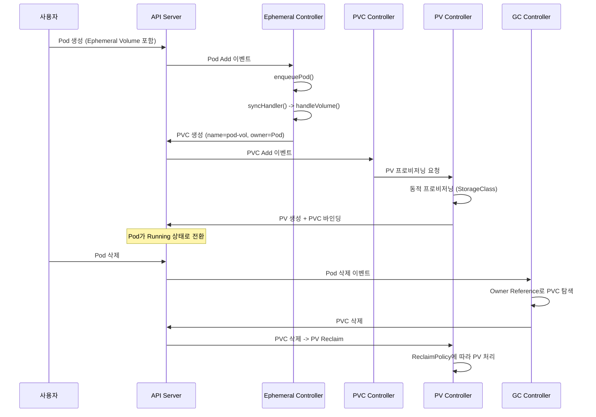

# 34. 고급 스토리지: CSI Migration 및 Ephemeral Volume 심화

## 목차

1. [개요](#1-개요)
2. [CSI Migration 아키텍처](#2-csi-migration-아키텍처)
3. [PluginManager와 Migration 상태](#3-pluginmanager와-migration-상태)
4. [In-Tree → CSI 변환 흐름](#4-in-tree--csi-변환-흐름)
5. [지원 플러그인 목록](#5-지원-플러그인-목록)
6. [Ephemeral Volume Controller](#6-ephemeral-volume-controller)
7. [PVC 자동 생성 및 라이프사이클](#7-pvc-자동-생성-및-라이프사이클)
8. [CSI Driver Spec과 VolumeLifecycleModes](#8-csi-driver-spec과-volumelifecyclemodes)
9. [CSI 플러그인 라이프사이클 모드](#9-csi-플러그인-라이프사이클-모드)
10. [왜 이런 설계인가](#10-왜-이런-설계인가)
11. [정리](#11-정리)

---

## 1. 개요

Kubernetes 스토리지 시스템은 두 개의 중요한 전환점을 거쳤다.

첫째, **CSI Migration**이다. Kubernetes 초기에는 AWS EBS, GCE PD, Azure Disk 등 모든 볼륨 플러그인이 Kubernetes 코어 저장소에 직접 구현되었다(In-tree). 이 방식은 릴리스 종속성, 코드 비대화, 보안 위험, 확장성 한계 등 심각한 문제를 야기했다. CSI Migration은 기존 In-tree PV/Volume 스펙을 **자동으로 CSI 스펙으로 변환**하여, 사용자가 기존 YAML을 수정하지 않아도 CSI 드라이버로 투명하게 전환되도록 한다.

둘째, **Ephemeral Volume**이다. 기존 Kubernetes에서 볼륨을 사용하려면 PVC를 먼저 생성하고 Pod에서 참조하는 2단계 과정이 필요했다. 하지만 캐시, 임시 작업 공간, CI/CD 아티팩트 등 Pod 수명주기와 동일한 볼륨에는 이 과정이 과도하다. Ephemeral Volume Controller는 Pod 스펙에 내장된 PVC 템플릿으로부터 PVC를 자동 생성/삭제한다.

두 시스템 모두 **"기존 워크로드의 변경 없이 새 아키텍처를 적용한다"**는 Kubernetes의 하위 호환성 철학을 대표한다.

```
┌─────────────────────────────────────────────────────────────────────────┐
│                   Kubernetes Storage Layer 진화                          │
│                                                                         │
│  Phase 1: In-tree Only        Phase 2: CSI Migration       Phase 3: CSI │
│  ┌──────────────┐             ┌──────────────────┐        ┌──────────┐ │
│  │ kubelet      │             │ kubelet           │        │ kubelet  │ │
│  │  ├ aws-ebs   │  ────────▶  │  ├ csi-plugin     │ ────▶  │  └ csi   │ │
│  │  ├ gce-pd    │  Migration  │  │  (translator)  │ GA     │   plugin │ │
│  │  ├ azure-disk│             │  └ PluginManager  │        │          │ │
│  │  └ cinder    │             └──────────────────┘        └──────────┘ │
│  └──────────────┘                                                       │
│                                                                         │
│  Ephemeral Volume: Pod 스펙 내 PVC 템플릿 → 자동 PVC 생성/삭제          │
│  ┌─────────┐    ┌────────────────────┐    ┌─────┐    ┌──────────────┐  │
│  │ Pod 생성 │───▶│ Ephemeral Controller│───▶│ PVC │───▶│ CSI Driver   │  │
│  └─────────┘    │ (PVC 자동 생성)     │    └─────┘    │ (볼륨 프로비 │  │
│                 └────────────────────┘               │  저닝)       │  │
│  Pod 삭제 → GC Controller → PVC 삭제 → PV Reclaim    └──────────────┘  │
└─────────────────────────────────────────────────────────────────────────┘
```

---

## 2. CSI Migration 아키텍처

### 2.1 전체 구조

CSI Migration의 핵심 컴포넌트는 `PluginManager`와 `InTreeToCSITranslator`다. 이 두 컴포넌트가 협력하여 In-tree 볼륨 스펙을 CSI 스펙으로 투명하게 변환한다.

```
┌─────────────────────────────────────────────────────────────────────┐
│                    CSI Migration 아키텍처                              │
│                                                                     │
│  ┌─────────────────┐    ┌─────────────────┐    ┌─────────────────┐ │
│  │   Volume Spec    │    │  PluginManager   │    │  CSITranslator  │ │
│  │  (In-tree 형식)  │    │                 │    │                 │ │
│  │                 │    │ IsMigratable()   │    │ TranslateIn     │ │
│  │ awsEBS:         │───▶│ IsMigration      │───▶│ TreePVToCSI()   │ │
│  │   volumeID:     │    │ EnabledFor       │    │                 │ │
│  │     vol-xxx     │    │ Plugin()         │    │ TranslateIn     │ │
│  │   fsType: ext4  │    │                 │    │ TreeInline      │ │
│  └─────────────────┘    │ IsMigration      │    │ VolumeToCSI()   │ │
│                         │ CompleteFor      │    │                 │ │
│                         │ Plugin()         │    │ TranslateCSI    │ │
│                         └─────────────────┘    │ PVToInTree()    │ │
│                                                └────────┬────────┘ │
│                                                         │          │
│                              ┌──────────────────────────┘          │
│                              ▼                                     │
│  ┌──────────────────────────────────────────────────────────────┐  │
│  │               inTreePlugins 맵 (7개 드라이버)                  │  │
│  │                                                              │  │
│  │  AWSEBSDriverName    ──▶ awsElasticBlockStoreTranslator      │  │
│  │  GCEPDDriverName     ──▶ gcePersistentDiskTranslator         │  │
│  │  AzureDiskDriverName ──▶ azureDiskTranslator                 │  │
│  │  AzureFileDriverName ──▶ azureFileTranslator                 │  │
│  │  CinderDriverName    ──▶ openStackCinderTranslator           │  │
│  │  VSphereDriverName   ──▶ vSphereTranslator                   │  │
│  │  PortworxDriverName  ──▶ portworxTranslator                  │  │
│  └──────────────────────────────────────────────────────────────┘  │
│                              │                                     │
│                              ▼                                     │
│  ┌──────────────────────────────────────────────────────────────┐  │
│  │              변환 결과: CSI PersistentVolumeSource             │  │
│  │  Driver: "ebs.csi.aws.com"                                   │  │
│  │  VolumeHandle: "vol-0123456789abcdef0"                       │  │
│  │  FSType: "ext4"                                              │  │
│  │  VolumeAttributes: {"partition": "0"}                        │  │
│  └──────────────────────────────────────────────────────────────┘  │
└─────────────────────────────────────────────────────────────────────┘
```

### 2.2 Feature Gate 기반 점진적 전환

CSI Migration은 Feature Gate를 통해 3단계로 점진적으로 진행되었다.

```
Phase 1: Alpha                    Phase 2: Beta                     Phase 3: GA (현재)
┌───────────────────────┐         ┌───────────────────────┐         ┌───────────────────────┐
│ CSIMigration=false    │         │ CSIMigration=true     │         │ CSIMigration=true     │
│ CSIMigrationAWS=false │   ──▶   │ CSIMigrationAWS=true  │   ──▶   │  (잠금, 변경 불가)    │
│                       │         │                       │         │ InTreePluginAWS       │
│ In-tree 플러그인만    │         │ CSI 변환 + In-tree    │         │ Unregister=true       │
│ 사용                  │         │ 동시 등록 (롤백 가능) │         │ In-tree 완전 제거     │
└───────────────────────┘         └───────────────────────┘         └───────────────────────┘
```

대규모 클러스터에서 스토리지 드라이버 전환은 데이터 손실 위험이 있는 작업이다. 각 단계에서 롤백 가능성을 보장하면서 점진적으로 신뢰도를 확인한 후 다음 단계로 진행한다. GA에서는 Feature Gate가 잠금되어 더 이상 비활성화할 수 없다.

---

## 3. PluginManager와 Migration 상태

### 3.1 PluginManager 구조체

**소스 경로**: `pkg/volume/csimigration/plugin_manager.go` (라인 36-39)

`PluginManager`는 각 In-tree 플러그인의 마이그레이션 상태를 판단하는 게이트키퍼 역할을 한다. `PluginNameMapper` 인터페이스를 임베딩하여 볼륨 스펙에서 플러그인 이름을 추출하는 기능을 활용한다.

```go
// PluginNameMapper 인터페이스: PV/Volume에서 플러그인 이름 추출
type PluginNameMapper interface {
    GetInTreePluginNameFromSpec(pv *v1.PersistentVolume, vol *v1.Volume) (string, error)
    GetCSINameFromInTreeName(pluginName string) (string, error)
}

// PluginManager는 In-tree 플러그인의 마이그레이션 상태를 추적한다
type PluginManager struct {
    PluginNameMapper  // 인터페이스 임베딩
}
```

### 3.2 IsMigrationCompleteForPlugin()

**소스 경로**: `pkg/volume/csimigration/plugin_manager.go` (라인 52-77)

마이그레이션 완전 완료 여부를 확인한다. 완전 마이그레이션은 두 가지 조건을 충족해야 한다:
1. `CSIMigrationXX` Feature Gate 활성화
2. `InTreePluginXXUnregister` Feature Gate 활성화 (In-tree 플러그인 등록 해제)

```go
func (pm PluginManager) IsMigrationCompleteForPlugin(pluginName string) bool {
    // 먼저 마이그레이션이 활성화되어 있어야 한다
    if !pm.IsMigrationEnabledForPlugin(pluginName) {
        return false
    }
    // 현재 7개 플러그인 모두 마이그레이션 완료됨
    switch pluginName {
    case csilibplugins.AWSEBSInTreePluginName:      return true
    case csilibplugins.GCEPDInTreePluginName:       return true
    case csilibplugins.AzureFileInTreePluginName:    return true
    case csilibplugins.AzureDiskInTreePluginName:    return true
    case csilibplugins.CinderInTreePluginName:       return true
    case csilibplugins.VSphereInTreePluginName:      return true
    case csilibplugins.PortworxVolumePluginName:     return true
    default:                                         return false
    }
}
```

### 3.3 IsMigrationEnabledForPlugin()

**소스 경로**: `pkg/volume/csimigration/plugin_manager.go` (라인 81-102)

마이그레이션 활성화 여부를 확인한다. CSIMigration이 GA된 현재, 모든 지원 플러그인에서 `true`를 반환한다.

```go
func (pm PluginManager) IsMigrationEnabledForPlugin(pluginName string) bool {
    // CSIMigration Feature Gate가 GA되어 기본 활성화
    switch pluginName {
    case csilibplugins.AWSEBSInTreePluginName:      return true
    case csilibplugins.GCEPDInTreePluginName:       return true
    case csilibplugins.AzureFileInTreePluginName:    return true
    case csilibplugins.AzureDiskInTreePluginName:    return true
    case csilibplugins.CinderInTreePluginName:       return true
    case csilibplugins.VSphereInTreePluginName:      return true
    case csilibplugins.PortworxVolumePluginName:     return true
    default:                                         return false
    }
}
```

### 3.4 IsMigratable()

**소스 경로**: `pkg/volume/csimigration/plugin_manager.go` (라인 107-118)

볼륨 스펙이 마이그레이션 가능한지 종합 판단한다. 2단계로 동작한다:

```go
func (pm PluginManager) IsMigratable(spec *volume.Spec) (bool, error) {
    if spec == nil {
        return false, fmt.Errorf("could not find if plugin is migratable because volume spec is nil")
    }
    // 1단계: 볼륨 스펙에서 In-tree 플러그인 이름을 추출한다
    pluginName, _ := pm.GetInTreePluginNameFromSpec(spec.PersistentVolume, spec.Volume)
    if pluginName == "" {
        return false, nil  // In-tree 플러그인이 아니면 마이그레이션 불필요
    }
    // 2단계: 해당 플러그인의 마이그레이션 활성화 여부를 확인한다
    return pm.IsMigrationEnabledForPlugin(pluginName), nil
}
```

### 3.5 IsMigrationCompleteForPlugin과 IsMigrationEnabledForPlugin의 분리

현재 Kubernetes에서는 7개 플러그인 모두 두 함수가 동일하게 `true`를 반환하지만, 이 분리는 점진적 마이그레이션의 안전장치로 설계되었다.

```
마이그레이션 상태 머신:

  Disabled ──▶ Enabled ──▶ Complete
     │            │           │
     │            │           │
  In-tree만    CSI 변환 +   In-tree
  사용         In-tree 등록  완전 제거
  (Phase 1)    (Phase 2)    (Phase 3)
               롤백 가능     롤백 불가
```

- **Enabled**: CSI 드라이버가 설치되어 In-tree 볼륨이 CSI로 변환되지만, In-tree 플러그인도 아직 등록되어 있다. 문제 발생 시 Feature Gate를 비활성화하여 롤백할 수 있다.
- **Complete**: In-tree 플러그인이 완전히 제거된다 (`InTreePluginXXUnregister` 활성화). Feature Gate가 잠금되어 롤백이 불가능하다.

---

## 4. In-Tree → CSI 변환 흐름

### 4.1 TranslateInTreeSpecToCSI()

**소스 경로**: `pkg/volume/csimigration/plugin_manager.go` (라인 129-150)

kubelet과 controller에서 호출하는 통합 변환 진입점이다. PV 기반 볼륨과 Inline 볼륨을 모두 처리한다.

```go
func TranslateInTreeSpecToCSI(logger klog.Logger, spec *volume.Spec,
    podNamespace string, translator InTreeToCSITranslator) (*volume.Spec, error) {

    var csiPV *v1.PersistentVolume
    var err error
    inlineVolume := false

    if spec.PersistentVolume != nil {
        // PV 기반 볼륨: TranslateInTreePVToCSI 호출
        csiPV, err = translator.TranslateInTreePVToCSI(logger, spec.PersistentVolume)
    } else if spec.Volume != nil {
        // Inline 볼륨: TranslateInTreeInlineVolumeToCSI 호출
        csiPV, err = translator.TranslateInTreeInlineVolumeToCSI(logger, spec.Volume, podNamespace)
        inlineVolume = true
    } else {
        err = errors.New("not a valid volume spec")
    }
    if err != nil {
        return nil, fmt.Errorf("failed to translate in-tree pv to CSI: %v", err)
    }

    // 변환 결과에 Migrated 플래그를 설정한다
    return &volume.Spec{
        Migrated:                        true,
        PersistentVolume:                csiPV,
        ReadOnly:                        spec.ReadOnly,
        InlineVolumeSpecForCSIMigration: inlineVolume,
    }, nil
}
```

### 4.2 InTreeToCSITranslator 인터페이스

```go
// pkg/volume/csimigration/plugin_manager.go (라인 122-125)
type InTreeToCSITranslator interface {
    TranslateInTreePVToCSI(logger klog.Logger, pv *v1.PersistentVolume) (*v1.PersistentVolume, error)
    TranslateInTreeInlineVolumeToCSI(logger klog.Logger, volume *v1.Volume, podNamespace string) (*v1.PersistentVolume, error)
}
```

### 4.3 세 가지 변환 방향

CSI Migration은 세 가지 방향의 변환을 지원한다.

```
변환 방향 1: In-tree PV → CSI PV

  기존 PV (In-tree)                         변환 후 PV (CSI)
  ┌───────────────────────┐                ┌──────────────────────────┐
  │ PersistentVolume      │                │ PersistentVolume         │
  │  Spec:                │                │  Spec:                   │
  │    AWSElasticBlock    │   Translate    │    CSI:                  │
  │    Store:             │ ──────────▶    │      Driver:             │
  │      VolumeID:        │                │        ebs.csi.aws.com   │
  │        vol-xxx        │                │      VolumeHandle:       │
  │      FSType: ext4     │                │        vol-xxx           │
  │      Partition: 0     │                │      FSType: ext4        │
  │                       │                │      VolumeAttributes:   │
  │                       │                │        partition: "0"    │
  └───────────────────────┘                └──────────────────────────┘

변환 방향 2: In-tree Inline Volume → CSI PV
  (Inline 볼륨은 PV가 없으므로, PV로 감싸서 CSI PV로 변환)

변환 방향 3: CSI PV → In-tree PV (역변환, 롤백용)
  (CSI Driver 이름으로 inTreePlugins 맵을 직접 조회하여 역변환)
```

### 4.4 Migrated 플래그의 의미

`TranslateInTreeSpecToCSI()`의 반환값에서 `Migrated: true`가 설정된다. 이 플래그는 CSI 드라이버가 볼륨이 마이그레이션된 것인지, 원래 CSI로 생성된 것인지 구분하는 데 사용된다. 마이그레이션된 볼륨은 In-tree 시절의 볼륨 ID 형식을 유지하므로, CSI 드라이버가 이를 인지하고 적절히 처리해야 한다.

### 4.5 토폴로지 변환

토폴로지 변환은 CSI Migration에서 가장 복잡한 부분이다. In-tree 플러그인은 Kubernetes 표준 zone 라벨을 사용하지만, CSI 드라이버는 고유 토폴로지 키를 사용한다.

```
In-tree 토폴로지                          CSI 토폴로지
┌──────────────────────────┐              ┌────────────────────────────────┐
│ NodeAffinity:            │              │ NodeAffinity:                  │
│   Required:              │   변환       │   Required:                    │
│     NodeSelectorTerms:   │ ────────▶    │     NodeSelectorTerms:         │
│       - MatchExpr:       │              │       - MatchExpr:             │
│           Key:           │              │           Key:                 │
│             topology.    │              │             topology.ebs.csi.  │
│             kubernetes.  │              │             aws.com/zone       │
│             io/zone      │              │           Values: [us-east-1a] │
│           Values:        │              │                                │
│             [us-east-1a] │              └────────────────────────────────┘
└──────────────────────────┘
```

변환 로직:
1. NodeAffinity에 GA zone 라벨(`topology.kubernetes.io/zone`)이 있으면 CSI 토폴로지 키로 교체
2. NodeAffinity에 없으면 PV 라벨에서 zone 정보를 찾아 NodeAffinity 추가
3. Beta region 라벨(`failure-domain.beta.kubernetes.io/zone`)이 있으면 GA 라벨로 업그레이드

---

## 5. 지원 플러그인 목록

### 5.1 In-tree 플러그인 이름과 CSI 드라이버 매핑

현재 CSI Migration이 완료된 7개 플러그인의 전체 매핑이다. 이 정보는 `staging/src/k8s.io/csi-translation-lib/plugins/` 아래 각 플러그인 파일에 상수로 정의되어 있다.

| In-tree 플러그인 이름 | CSI 드라이버 이름 | 소스 파일 | 토폴로지 키 |
|---|---|---|---|
| `kubernetes.io/aws-ebs` | `ebs.csi.aws.com` | `plugins/aws_ebs.go` | `topology.ebs.csi.aws.com/zone` |
| `kubernetes.io/gce-pd` | `pd.csi.storage.gke.io` | `plugins/gce_pd.go` | `topology.gke.io/zone` |
| `kubernetes.io/azure-disk` | `disk.csi.azure.com` | `plugins/azure_disk.go` | (Azure 전용) |
| `kubernetes.io/azure-file` | `file.csi.azure.com` | `plugins/azure_file.go` | (Azure 전용) |
| `kubernetes.io/cinder` | `cinder.csi.openstack.org` | `plugins/openstack_cinder.go` | `topology.cinder.csi.openstack.org/zone` |
| `kubernetes.io/vsphere-volume` | `csi.vsphere.vmware.com` | `plugins/vsphere_volume.go` | (vSphere 전용) |
| `kubernetes.io/portworx-volume` | `pxd.portworx.com` | `plugins/portworx.go` | (Portworx 전용) |

### 5.2 플러그인별 상수 정의

각 상수의 소스 위치:

```go
// staging/src/k8s.io/csi-translation-lib/plugins/aws_ebs.go (라인 36-37)
AWSEBSInTreePluginName = "kubernetes.io/aws-ebs"

// staging/src/k8s.io/csi-translation-lib/plugins/gce_pd.go (라인 34-35)
GCEPDInTreePluginName = "kubernetes.io/gce-pd"

// staging/src/k8s.io/csi-translation-lib/plugins/azure_disk.go (라인 35-36)
AzureDiskInTreePluginName = "kubernetes.io/azure-disk"

// staging/src/k8s.io/csi-translation-lib/plugins/azure_file.go (라인 33-34)
AzureFileInTreePluginName = "kubernetes.io/azure-file"

// staging/src/k8s.io/csi-translation-lib/plugins/openstack_cinder.go (라인 34-35)
CinderInTreePluginName = "kubernetes.io/cinder"

// staging/src/k8s.io/csi-translation-lib/plugins/vsphere_volume.go (라인 32-33)
VSphereInTreePluginName = "kubernetes.io/vsphere-volume"

// staging/src/k8s.io/csi-translation-lib/plugins/portworx.go (라인 30)
PortworxVolumePluginName = "kubernetes.io/portworx-volume"
```

### 5.3 csi_plugin.go에서의 마이그레이션 등록

**소스 경로**: `pkg/volume/csi/csi_plugin.go` (Init 함수 내부)

CSI 플러그인 초기화 시 마이그레이션 완료 플러그인 목록이 `migratedPlugins` 맵으로 등록된다.

```go
// pkg/volume/csi/csi_plugin.go - Init() 내부
var migratedPlugins = map[string](func() bool){
    csitranslationplugins.GCEPDInTreePluginName:     func() bool { return true },
    csitranslationplugins.AWSEBSInTreePluginName:     func() bool { return true },
    csitranslationplugins.CinderInTreePluginName:     func() bool { return true },
    csitranslationplugins.AzureDiskInTreePluginName:  func() bool { return true },
    csitranslationplugins.AzureFileInTreePluginName:  func() bool { return true },
    csitranslationplugins.VSphereInTreePluginName:    func() bool { return true },
    csitranslationplugins.PortworxVolumePluginName:   func() bool { return true },
}

// NodeInfoManager에 전달하여 CSINode 오브젝트 초기화 시 사용
nim = nodeinfomanager.NewNodeInfoManager(host.GetNodeName(), host, migratedPlugins)
```

---

## 6. Ephemeral Volume Controller

### 6.1 ephemeralController 구조체

**소스 경로**: `pkg/controller/volume/ephemeral/controller.go` (라인 51-76)

```go
type ephemeralController struct {
    // API 서버와 통신하는 Kubernetes 클라이언트
    kubeClient clientset.Interface

    // PVC 캐시 조회를 위한 Lister와 동기화 확인 함수
    pvcLister  corelisters.PersistentVolumeClaimLister
    pvcsSynced cache.InformerSynced

    // Pod 캐시 조회를 위한 Lister와 동기화 확인 함수
    podLister corelisters.PodLister
    podSynced cache.InformerSynced

    // PVC 삭제 시 관련 Pod를 빠르게 찾기 위한 역인덱스
    podIndexer cache.Indexer

    // API 서버에 이벤트를 기록하는 Recorder
    recorder record.EventRecorder

    // Rate limiting이 적용된 작업 큐
    queue workqueue.TypedRateLimitingInterface[string]
}
```

### 6.2 NewController()

**소스 경로**: `pkg/controller/volume/ephemeral/controller.go` (라인 79-121)

컨트롤러 초기화 시 이벤트 핸들러 등록이 핵심이다.

```go
func NewController(ctx context.Context, kubeClient clientset.Interface,
    podInformer coreinformers.PodInformer,
    pvcInformer coreinformers.PersistentVolumeClaimInformer) (Controller, error) {

    ec := &ephemeralController{
        kubeClient: kubeClient,
        podLister:  podInformer.Lister(),
        podIndexer: podInformer.Informer().GetIndexer(),
        podSynced:  podInformer.Informer().HasSynced,
        pvcLister:  pvcInformer.Lister(),
        pvcsSynced: pvcInformer.Informer().HasSynced,
        queue: workqueue.NewTypedRateLimitingQueueWithConfig(
            workqueue.DefaultTypedControllerRateLimiter[string](),
            workqueue.TypedRateLimitingQueueConfig[string]{Name: "ephemeral_volume"},
        ),
    }

    // Pod Informer: AddFunc만 등록
    podInformer.Informer().AddEventHandler(cache.ResourceEventHandlerFuncs{
        AddFunc: ec.enqueuePod,
        // UpdateFunc: 없음! Pod spec은 불변이므로 볼륨 목록이 변하지 않는다
        // DeleteFunc: 없음! Owner Reference 기반 GC가 PVC 삭제를 담당한다
    })

    // PVC Informer: DeleteFunc만 등록
    pvcInformer.Informer().AddEventHandler(cache.ResourceEventHandlerFuncs{
        DeleteFunc: ec.onPVCDelete,  // PVC 삭제 시 재생성 트리거
    })

    // PodPVC 인덱서 설치 (PVC 이름 → Pod 역조회)
    if err := common.AddPodPVCIndexerIfNotPresent(ec.podIndexer); err != nil {
        return nil, fmt.Errorf("could not initialize ephemeral volume controller: %w", err)
    }

    return ec, nil
}
```

### 6.3 이벤트 핸들러 설계 원칙

```
┌───────────────────────────────────────────────────────────────────┐
│              Ephemeral Volume Controller 이벤트 처리               │
│                                                                   │
│  Pod Informer:                                                    │
│  ┌──────────────┐                                                │
│  │ AddFunc      │ → enqueuePod()  ← Pod 생성 시 PVC 필요 여부   │
│  │ UpdateFunc   │ → (없음)        ← Pod spec은 불변!            │
│  │ DeleteFunc   │ → (없음)        ← GC Controller가 PVC 삭제    │
│  └──────────────┘                                                │
│                                                                   │
│  PVC Informer:                                                    │
│  ┌──────────────┐                                                │
│  │ AddFunc      │ → (없음)        ← PVC 생성은 Controller가 함  │
│  │ UpdateFunc   │ → (없음)        ← PVC 변경에 반응할 필요 없음 │
│  │ DeleteFunc   │ → onPVCDelete() ← PVC 삭제 시 재생성 트리거   │
│  └──────────────┘                                                │
└───────────────────────────────────────────────────────────────────┘
```

### 6.4 enqueuePod: 필터링과 큐잉

```go
// pkg/controller/volume/ephemeral/controller.go (라인 123-146)
func (ec *ephemeralController) enqueuePod(obj interface{}) {
    pod, ok := obj.(*v1.Pod)
    if !ok {
        return
    }
    // 삭제 중인 Pod는 무시 (DeletionTimestamp가 설정되어 있으면)
    if pod.DeletionTimestamp != nil {
        return
    }
    // Ephemeral 볼륨이 하나라도 있는지 확인
    for _, vol := range pod.Spec.Volumes {
        if vol.Ephemeral != nil {
            key, err := cache.DeletionHandlingMetaNamespaceKeyFunc(pod)
            if err != nil {
                runtime.HandleError(fmt.Errorf("couldn't get key for object %#v: %v", pod, err))
                return
            }
            ec.queue.Add(key)
            break  // 하나만 있어도 Pod 전체를 큐에 넣는다
        }
    }
}
```

### 6.5 onPVCDelete: 자가 치유 메커니즘

```go
// pkg/controller/volume/ephemeral/controller.go (라인 148-168)
func (ec *ephemeralController) onPVCDelete(obj interface{}) {
    pvc, ok := obj.(*v1.PersistentVolumeClaim)
    if !ok {
        return
    }
    // PodPVC 인덱서로 이 PVC를 참조하는 Pod를 빠르게 찾는다
    objs, err := ec.podIndexer.ByIndex(common.PodPVCIndex,
        fmt.Sprintf("%s/%s", pvc.Namespace, pvc.Name))
    if err != nil {
        runtime.HandleError(fmt.Errorf("listing pods from cache: %v", err))
        return
    }
    // 해당 Pod를 다시 큐에 넣어 PVC 재생성을 트리거한다
    for _, obj := range objs {
        ec.enqueuePod(obj)
    }
}
```

PVC 삭제 시 자가 치유 시퀀스:

```
  사용자 (실수로 삭제)      Controller                    API Server
        │                     │                              │
        │ kubectl delete pvc  │                              │
        │────────────────────▶│                              │
        │                     │ onPVCDelete() 호출           │
        │                     │──────┐                       │
        │                     │      │ PodPVC 인덱서로       │
        │                     │      │ 관련 Pod 탐색         │
        │                     │◀─────┘                       │
        │                     │ enqueuePod(pod)              │
        │                     │──────┐                       │
        │                     │      │ syncHandler()         │
        │                     │      │ handleVolume()        │
        │                     │◀─────┘                       │
        │                     │ PVC가 없음을 감지            │
        │                     │ Create PVC ────────────────▶ │
        │                     │                              │
        │                     │ PVC 재생성 완료              │
```

---

## 7. PVC 자동 생성 및 라이프사이클

### 7.1 handleVolume(): PVC 생성 핵심 로직

**소스 경로**: `pkg/controller/volume/ephemeral/controller.go` (라인 254-302)

```go
func (ec *ephemeralController) handleVolume(ctx context.Context, pod *v1.Pod, vol v1.Volume) error {
    logger := klog.FromContext(ctx)
    logger.V(5).Info("Ephemeral: checking volume", "volumeName", vol.Name)

    if vol.Ephemeral == nil {
        return nil  // Ephemeral이 아닌 볼륨은 무시
    }

    // 1. PVC 이름 결정: <pod-name>-<volume-name>
    pvcName := ephemeral.VolumeClaimName(pod, &vol)

    // 2. PVC 존재 여부 확인
    pvc, err := ec.pvcLister.PersistentVolumeClaims(pod.Namespace).Get(pvcName)
    if err != nil && !errors.IsNotFound(err) {
        return err
    }
    if pvc != nil {
        // 이미 존재하면 Owner 확인 후 종료
        if err := ephemeral.VolumeIsForPod(pod, pvc); err != nil {
            return err  // 다른 Pod의 PVC와 이름 충돌!
        }
        logger.V(5).Info("Ephemeral: PVC already created", "volumeName", vol.Name,
            "PVC", klog.KObj(pvc))
        return nil  // 정상: 이미 생성됨
    }

    // 3. PVC 생성 (Owner Reference = Pod)
    isTrue := true
    pvc = &v1.PersistentVolumeClaim{
        ObjectMeta: metav1.ObjectMeta{
            Name: pvcName,
            OwnerReferences: []metav1.OwnerReference{
                {
                    APIVersion:         "v1",
                    Kind:               "Pod",
                    Name:               pod.Name,
                    UID:                pod.UID,
                    Controller:         &isTrue,
                    BlockOwnerDeletion: &isTrue,
                },
            },
            Annotations: vol.Ephemeral.VolumeClaimTemplate.Annotations,
            Labels:      vol.Ephemeral.VolumeClaimTemplate.Labels,
        },
        Spec: vol.Ephemeral.VolumeClaimTemplate.Spec,
    }

    ephemeralvolumemetrics.EphemeralVolumeCreateAttempts.Inc()
    _, err = ec.kubeClient.CoreV1().PersistentVolumeClaims(pod.Namespace).Create(
        ctx, pvc, metav1.CreateOptions{})
    if err != nil {
        ephemeralvolumemetrics.EphemeralVolumeCreateFailures.Inc()
        return fmt.Errorf("create PVC %s: %v", pvcName, err)
    }
    return nil
}
```

### 7.2 PVC 이름 생성 규칙

**소스 경로**: `staging/src/k8s.io/component-helpers/storage/ephemeral/ephemeral.go` (라인 41-42)

```go
func VolumeClaimName(pod *v1.Pod, volume *v1.Volume) string {
    return pod.Name + "-" + volume.Name
}
```

| Pod Name | Volume Name | PVC Name |
|----------|------------|----------|
| `web-server-0` | `cache` | `web-server-0-cache` |
| `batch-job-abc` | `scratch` | `batch-job-abc-scratch` |
| `ml-worker-1` | `data` | `ml-worker-1-data` |

이름이 **결정적(deterministic)**이므로 PVC 재생성 시 동일 이름이 보장된다. Pod 이름은 네임스페이스 내 고유하고, 볼륨 이름은 Pod 내 고유하므로 조합도 고유하다.

### 7.3 VolumeIsForPod: 이름 충돌 방지

**소스 경로**: `staging/src/k8s.io/component-helpers/storage/ephemeral/ephemeral.go` (라인 49-57)

```go
func VolumeIsForPod(pod *v1.Pod, pvc *v1.PersistentVolumeClaim) error {
    if pvc.Namespace != pod.Namespace || !metav1.IsControlledBy(pvc, pod) {
        return fmt.Errorf("PVC %s/%s was not created for pod %s/%s (pod is not owner)",
            pvc.Namespace, pvc.Name, pod.Namespace, pod.Name)
    }
    return nil
}
```

동일한 네임스페이스에서 `<pod-name>-<volume-name>`과 같은 이름의 PVC가 이미 존재할 수 있다 (수동 생성 등). Owner Reference를 확인하여 해당 PVC가 실제로 이 Pod를 위해 생성된 것인지 검증한다.

### 7.4 Owner Reference와 Garbage Collection

```go
OwnerReferences: []metav1.OwnerReference{
    {
        APIVersion:         "v1",
        Kind:               "Pod",
        Name:               pod.Name,
        UID:                pod.UID,
        Controller:         &isTrue,       // 이 Pod가 PVC의 컨트롤러
        BlockOwnerDeletion: &isTrue,       // Pod 삭제 시 PVC도 foreground 삭제
    },
}
```

```
Owner Reference 기반 GC 흐름:

Pod 삭제 요청
    │
    ▼
┌──────────────────────────────┐
│   Kubernetes GC Controller   │
│                              │
│  1. Pod에 Finalizer 추가     │
│  2. Dependents(PVC) 탐색     │
│  3. PVC 삭제 요청            │
│  4. PVC 삭제 완료 대기       │
│  5. Pod Finalizer 제거       │
│  6. Pod 완전 삭제            │
└──────────────────────────────┘
```

`BlockOwnerDeletion=true`는 Pod가 foreground 삭제될 때, PVC가 먼저 삭제된 후에야 Pod가 완전히 제거됨을 보장한다. 이는 PVC에 바인딩된 PV의 데이터가 정리될 때까지 Pod 리소스가 유지되도록 한다.

### 7.5 전체 생명주기



### 7.6 메트릭

**소스 경로**: `pkg/controller/volume/ephemeral/metrics/`

| 메트릭 | 타입 | 설명 |
|--------|------|------|
| `ephemeral_volume_create_attempts_total` | Counter | PVC 생성 시도 횟수 |
| `ephemeral_volume_create_failures_total` | Counter | PVC 생성 실패 횟수 |

`(failures / attempts)` 비율로 PVC 생성 성공률을 모니터링할 수 있다.

---

## 8. CSI Driver Spec과 VolumeLifecycleModes

### 8.1 CSIDriver 리소스

**소스 경로**: `staging/src/k8s.io/api/storage/v1/types.go` (라인 265-280)

`CSIDriver` 리소스는 클러스터에 설치된 CSI 드라이버의 특성을 Kubernetes에 알려주는 오브젝트다.

```go
type CSIDriver struct {
    metav1.TypeMeta   `json:",inline"`
    metav1.ObjectMeta `json:"metadata,omitempty"`

    // CSI Driver의 스펙 정의
    Spec CSIDriverSpec `json:"spec"`
}
```

### 8.2 CSIDriverSpec 구조체

**소스 경로**: `staging/src/k8s.io/api/storage/v1/types.go` (라인 299-379+)

`CSIDriverSpec`은 CSI 드라이버가 지원하는 기능과 동작 방식을 선언한다.

```go
type CSIDriverSpec struct {
    // Attach 작업이 필요한지 여부
    // false면 ControllerPublishVolume을 구현하지 않는 드라이버
    // +optional
    AttachRequired *bool `json:"attachRequired,omitempty"`

    // 마운트 시 Pod 정보(이름, 네임스페이스, UID)를 전달할지 여부
    // true면 VolumeContext에 Pod 정보가 포함된다
    // +optional
    PodInfoOnMount *bool `json:"podInfoOnMount,omitempty"`

    // 이 드라이버가 지원하는 볼륨 라이프사이클 모드
    // 기본값: ["Persistent"]
    // +optional
    // +listType=set
    VolumeLifecycleModes []VolumeLifecycleMode `json:"volumeLifecycleModes,omitempty"`

    // CSI 드라이버가 스토리지 용량 정보를 제공하는지 여부
    // +optional
    StorageCapacity *bool `json:"storageCapacity,omitempty"`

    // ... (FSGroupPolicy, SELinuxMount 등 추가 필드)
}
```

### 8.3 VolumeLifecycleMode 타입

**소스 경로**: `staging/src/k8s.io/api/storage/v1/types.go` (라인 520-555)

```go
// VolumeLifecycleMode는 CSI 드라이버가 제공하는 볼륨의 사용 모드를 정의한다
type VolumeLifecycleMode string

const (
    // VolumeLifecyclePersistent: 표준 PV/PVC 메커니즘을 통한 볼륨
    // Pod 수명주기와 독립적인 라이프사이클
    // CSIDriverSpec.VolumeLifecycleModes가 비어 있으면 이것이 기본값
    VolumeLifecyclePersistent VolumeLifecycleMode = "Persistent"

    // VolumeLifecycleEphemeral: Pod 스펙 내 CSIVolumeSource로 정의된 인라인 볼륨
    // Pod 수명주기에 바인딩된 라이프사이클
    // 드라이버는 NodePublishVolume 호출만 받는다
    VolumeLifecycleEphemeral VolumeLifecycleMode = "Ephemeral"
)
```

### 8.4 CSIDriverSpec 필드별 동작 영향

| 필드 | 기본값 | true일 때 | false일 때 |
|------|--------|----------|-----------|
| `AttachRequired` | `nil`(true) | AD Controller가 VolumeAttachment 생성 | Attach 단계 건너뜀 |
| `PodInfoOnMount` | `nil`(false) | NodePublishVolume에 Pod 정보 전달 | Pod 정보 미전달 |
| `StorageCapacity` | `nil`(false) | 스케줄러가 용량 고려 | 용량 무시 |
| `VolumeLifecycleModes` | `["Persistent"]` | - | - |

### 8.5 VolumeLifecycleModes의 조합

하나의 CSI 드라이버가 두 가지 모드를 모두 지원할 수 있다.

```yaml
# Persistent만 지원 (일반 블록 스토리지)
apiVersion: storage.k8s.io/v1
kind: CSIDriver
metadata:
  name: ebs.csi.aws.com
spec:
  attachRequired: true
  volumeLifecycleModes:
    - Persistent

# Ephemeral만 지원 (시크릿 인젝션)
apiVersion: storage.k8s.io/v1
kind: CSIDriver
metadata:
  name: secrets-store.csi.k8s.io
spec:
  attachRequired: false
  podInfoOnMount: true
  volumeLifecycleModes:
    - Ephemeral

# 둘 다 지원 (범용 CSI 드라이버)
apiVersion: storage.k8s.io/v1
kind: CSIDriver
metadata:
  name: example-driver.csi.k8s.io
spec:
  attachRequired: true
  podInfoOnMount: true
  volumeLifecycleModes:
    - Persistent
    - Ephemeral
```

---

## 9. CSI 플러그인 라이프사이클 모드

### 9.1 getVolumeLifecycleMode()

**소스 경로**: `pkg/volume/csi/csi_plugin.go` (라인 892-904)

CSI 플러그인이 볼륨 스펙을 기반으로 라이프사이클 모드를 결정하는 핵심 함수다.

```go
func (p *csiPlugin) getVolumeLifecycleMode(spec *volume.Spec) (storage.VolumeLifecycleMode, error) {
    // 1) volume.Spec.Volume.CSI != nil -> Ephemeral 모드
    // 2) volume.Spec.PersistentVolume.Spec.CSI != nil -> Persistent 모드
    volSrc, _, err := getSourceFromSpec(spec)
    if err != nil {
        return "", err
    }

    if volSrc != nil {
        return storage.VolumeLifecycleEphemeral, nil
    }
    return storage.VolumeLifecyclePersistent, nil
}
```

판단 로직은 단순하다:
- **`spec.Volume.CSI`가 존재**하면 Pod 스펙에 직접 CSI 볼륨이 정의된 것이므로 `Ephemeral`이다.
- **`spec.PersistentVolume.Spec.CSI`가 존재**하면 PV를 통해 마운트되는 것이므로 `Persistent`이다.
- 둘 다 없으면 에러를 반환한다.

### 9.2 CanAttach()

**소스 경로**: `pkg/volume/csi/csi_plugin.go` (라인 675-699)

Attach 가능 여부를 결정한다. Ephemeral 모드에서는 항상 `false`를 반환한다.

```go
func (p *csiPlugin) CanAttach(spec *volume.Spec) (bool, error) {
    volumeLifecycleMode, err := p.getVolumeLifecycleMode(spec)
    if err != nil {
        return false, err
    }

    // Ephemeral 볼륨은 Attach 단계가 필요 없다
    if volumeLifecycleMode == storage.VolumeLifecycleEphemeral {
        klog.V(5).Info(log("plugin.CanAttach = false, ephemeral mode detected for spec %v",
            spec.Name()))
        return false, nil
    }

    // Persistent 볼륨: CSIDriver의 AttachRequired 확인
    pvSrc, err := getCSISourceFromSpec(spec)
    if err != nil {
        return false, err
    }
    driverName := pvSrc.Driver
    skipAttach, err := p.skipAttach(driverName)
    if err != nil {
        return false, err
    }
    return !skipAttach, nil
}
```

### 9.3 CanDeviceMount()

**소스 경로**: `pkg/volume/csi/csi_plugin.go` (라인 702-715)

디바이스 마운트 가능 여부를 결정한다. 마찬가지로 Ephemeral 모드에서는 건너뛴다.

```go
func (p *csiPlugin) CanDeviceMount(spec *volume.Spec) (bool, error) {
    volumeLifecycleMode, err := p.getVolumeLifecycleMode(spec)
    if err != nil {
        return false, err
    }

    if volumeLifecycleMode == storage.VolumeLifecycleEphemeral {
        klog.V(5).Info(log("plugin.CanDeviceMount skipped ephemeral mode detected for spec %v",
            spec.Name()))
        return false, nil
    }

    // Persistent 볼륨은 디바이스 마운트를 지원한다
    return true, nil
}
```

### 9.4 라이프사이클 모드별 마운트 파이프라인

```
Persistent 모드:
┌───────────┐    ┌──────────┐    ┌──────────────┐    ┌───────────────┐
│ Controller │    │ Attach/  │    │ Device Mount │    │ Node Publish  │
│ Publish    │───▶│ Detach   │───▶│ (NodeStage)  │───▶│ (NodePublish) │
│ Volume     │    │ Controller│   │              │    │               │
└───────────┘    └──────────┘    └──────────────┘    └───────────────┘
  CanAttach()=true                CanDeviceMount()=true

Ephemeral 모드:
┌───────────────┐
│ Node Publish  │  ← NodePublishVolume만 호출!
│ (NodePublish) │     ControllerPublish, NodeStage는 건너뜀
└───────────────┘
  CanAttach()=false
  CanDeviceMount()=false
```

Ephemeral 모드에서는 `ControllerPublishVolume`과 `NodeStageVolume` 호출이 생략되고, 바로 `NodePublishVolume`만 호출된다. 이는 Ephemeral 볼륨이 네트워크 어태치나 디바이스 준비 없이 노드 로컬에서 즉시 생성/삭제되는 특성을 반영한다.

### 9.5 NewMounter에서의 라이프사이클 모드 사용

```go
// pkg/volume/csi/csi_plugin.go - NewMounter() 내부
func (p *csiPlugin) NewMounter(spec *volume.Spec, pod *api.Pod) (volume.Mounter, error) {
    volSrc, pvSrc, err := getSourceFromSpec(spec)

    // ...

    // 라이프사이클 모드 결정
    volumeLifecycleMode, err := p.getVolumeLifecycleMode(spec)
    if err != nil {
        return nil, err
    }

    mounter := &csiMountMgr{
        plugin:              p,
        spec:                spec,
        pod:                 pod,
        driverName:          csiDriverName(driverName),
        volumeLifecycleMode: volumeLifecycleMode,  // Mounter에 모드 전달
        volumeID:            volumeHandle,
        readOnly:            readOnly,
        // ...
    }
    return mounter, nil
}
```

Mounter가 실제 마운트 작업을 수행할 때 `volumeLifecycleMode`에 따라 `NodePublishVolume` 호출 시 전달하는 파라미터가 달라진다.

---

## 10. 왜 이런 설계인가

### 10.1 CSI Migration: 왜 In-tree 코드를 직접 제거하지 않았는가?

대규모 프로덕션 클러스터에서 스토리지 드라이버를 한 번에 교체하는 것은 데이터 손실 위험이 너무 크다. CSI Migration은 다음 원칙으로 설계되었다:

1. **투명한 변환**: 사용자의 기존 YAML 매니페스트를 수정할 필요가 없다. `PluginManager`가 자동으로 In-tree 스펙을 CSI 스펙으로 변환한다.

2. **점진적 전환**: Feature Gate를 통해 Alpha -> Beta -> GA로 단계적으로 진행한다. 각 단계에서 문제가 발견되면 Feature Gate를 비활성화하여 롤백할 수 있다.

3. **상태 분리**: `IsMigrationEnabledForPlugin()`과 `IsMigrationCompleteForPlugin()`을 분리하여, "CSI로 변환하지만 In-tree도 유지"하는 중간 상태를 표현한다.

### 10.2 Ephemeral Controller: 왜 Pod Update/Delete를 무시하는가?

```
┌───────────────────────────────────────────────────────────────────┐
│                      설계 결정 분석                                │
│                                                                   │
│  Pod Update 무시:                                                 │
│  └─ Pod.Spec.Volumes는 불변(immutable)이다                        │
│     → 생성 이후 볼륨 목록이 변하지 않으므로 감시 불필요            │
│     → 불필요한 reconciliation 방지                                │
│                                                                   │
│  Pod Delete 무시:                                                 │
│  └─ Owner Reference 기반 GC가 PVC 삭제를 담당한다                 │
│     → Controller가 직접 PVC를 삭제하면 GC와 충돌할 수 있다         │
│     → 책임 분리: 생성=Controller, 삭제=GC                         │
│                                                                   │
│  PVC Delete 감시:                                                 │
│  └─ 운영 중 실수로 PVC가 삭제될 수 있다                           │
│     → Pod가 아직 실행 중이라면 PVC가 필요하다                      │
│     → 자가 치유: onPVCDelete() → enqueuePod() → PVC 재생성        │
│     → 선언적 상태 관리 원칙의 구현                                │
└───────────────────────────────────────────────────────────────────┘
```

### 10.3 PVC 이름의 결정적(Deterministic) 생성

`VolumeClaimName(pod, vol) = pod.Name + "-" + vol.Name`

이 설계의 장점:
- **멱등성(Idempotency)**: 같은 Pod/Volume 조합은 항상 같은 PVC 이름을 생성한다. 재시도 시 중복 PVC가 생기지 않는다.
- **예측 가능성**: PVC 이름만으로 어떤 Pod의 어떤 볼륨인지 즉시 파악할 수 있다.
- **자가 치유 지원**: PVC가 삭제되어도 동일 이름으로 재생성할 수 있다.

### 10.4 VolumeLifecycleMode: 왜 CSIDriverSpec에 선언하는가?

CSI 드라이버 개발자가 자신의 드라이버가 어떤 모드를 지원하는지 명시적으로 선언하게 함으로써:

1. **스케줄러 최적화**: Ephemeral-only 드라이버는 Attach를 건너뛸 수 있음을 미리 알 수 있다.
2. **검증(Validation)**: Persistent-only 드라이버에 Ephemeral 볼륨을 사용하려는 시도를 사전에 차단한다.
3. **자기 문서화**: CSIDriver 오브젝트만 보면 드라이버의 기능을 파악할 수 있다.

### 10.5 Owner Reference GC vs 직접 삭제

Ephemeral Controller가 Pod 삭제 시 PVC를 직접 삭제하지 않는 이유:

```
┌─────────────────────────────────────────────────────────────────┐
│  Owner Reference GC의 장점                                       │
│                                                                 │
│  1. 원자성 보장: Pod → PVC 삭제 순서가 GC Controller에 의해      │
│     보장된다 (BlockOwnerDeletion=true)                           │
│                                                                 │
│  2. 중복 삭제 방지: GC Controller가 단일 주체로 삭제를            │
│     관리하므로 경쟁 조건이 없다                                  │
│                                                                 │
│  3. 재사용 가능한 패턴: Kubernetes의 모든 종속 리소스가            │
│     동일한 GC 메커니즘을 사용한다 (Deployment→RS→Pod 등)          │
│                                                                 │
│  4. 컨트롤러 단순화: Ephemeral Controller는 "생성"만 담당,       │
│     "삭제"는 GC에 위임하여 관심사를 분리한다                      │
└─────────────────────────────────────────────────────────────────┘
```

### 10.6 CSI Migration과 Ephemeral Volume의 상호작용

Ephemeral Volume이 In-tree StorageClass를 사용할 때, 두 시스템이 함께 동작한다.

```
Pod Spec (Ephemeral + In-tree SC)
┌──────────────────────────────────┐
│ volumes:                        │
│   - name: data                  │
│     ephemeral:                  │
│       volumeClaimTemplate:      │
│         spec:                   │
│           storageClassName: gp2 │  ← In-tree StorageClass
└──────────────┬───────────────────┘
               │
               ▼
  Ephemeral Controller → PVC 자동 생성 (storageClassName: "gp2")
               │
               ▼
  PV Controller + CSI Migration
  → StorageClass "gp2" 감지
  → TranslateInTreeStorageClassToCSI() 호출
  → CSI 드라이버(ebs.csi.aws.com)로 프로비저닝
               │
               ▼
  CSI Driver → 실제 EBS 볼륨 생성 → PV 생성 + PVC 바인딩
```

---

## 11. 정리

### CSI Migration 핵심

1. `PluginManager`(`pkg/volume/csimigration/plugin_manager.go`)가 볼륨의 마이그레이션 가능 여부를 판단한다.
2. `IsMigratable()` → `IsMigrationEnabledForPlugin()` → `IsMigrationCompleteForPlugin()` 순서로 상태를 확인한다.
3. `TranslateInTreeSpecToCSI()`가 PV 또는 Inline Volume을 CSI 스펙으로 변환하며, `Migrated: true` 플래그를 설정한다.
4. 현재 7개 플러그인(AWS EBS, GCE PD, Azure Disk, Azure File, Cinder, vSphere, Portworx) 모두 GA 마이그레이션이 완료되었다.
5. Feature Gate 3단계(Alpha -> Beta -> GA)로 점진적 마이그레이션을 진행하여 데이터 손실 위험을 최소화했다.

### Ephemeral Volume 핵심

1. `ephemeralController`(`pkg/controller/volume/ephemeral/controller.go`)가 Pod의 Ephemeral Volume에 대한 PVC를 자동 생성한다.
2. PVC 이름은 `<pod-name>-<volume-name>` 규칙으로 결정적이며 멱등적이다.
3. Owner Reference(Controller=true, BlockOwnerDeletion=true)로 Pod 삭제 시 PVC가 GC에 의해 자동 삭제된다.
4. PVC가 삭제되면 `onPVCDelete()` -> PodPVC 인덱서 -> `enqueuePod()` -> PVC 재생성으로 자가 치유한다.
5. Pod Update/Delete 이벤트는 의도적으로 무시한다 (spec 불변, GC 위임).

### CSI Driver Spec 핵심

1. `CSIDriverSpec.VolumeLifecycleModes`(`staging/src/k8s.io/api/storage/v1/types.go`)가 드라이버의 지원 모드를 선언한다.
2. `getVolumeLifecycleMode()`(`pkg/volume/csi/csi_plugin.go`)가 스펙 기반으로 Persistent/Ephemeral을 판별한다.
3. Ephemeral 모드에서는 `CanAttach()=false`, `CanDeviceMount()=false`로 Attach/Stage 단계를 건너뛴다.
4. `AttachRequired`, `PodInfoOnMount`, `StorageCapacity` 등 추가 필드로 드라이버 동작을 세밀하게 제어한다.

### 소스 코드 참조 요약

| 컴포넌트 | 소스 경로 | 핵심 함수/구조체 |
|---------|-----------|----------------|
| PluginManager | `pkg/volume/csimigration/plugin_manager.go` | `PluginManager`, `IsMigratable()`, `IsMigrationCompleteForPlugin()`, `IsMigrationEnabledForPlugin()`, `TranslateInTreeSpecToCSI()` |
| Ephemeral Controller | `pkg/controller/volume/ephemeral/controller.go` | `ephemeralController`, `NewController()`, `handleVolume()`, `enqueuePod()`, `onPVCDelete()` |
| CSIDriver 타입 | `staging/src/k8s.io/api/storage/v1/types.go` | `CSIDriver`, `CSIDriverSpec`, `VolumeLifecycleMode` |
| CSI Plugin | `pkg/volume/csi/csi_plugin.go` | `getVolumeLifecycleMode()`, `CanAttach()`, `CanDeviceMount()` |
| VolumeClaimName 헬퍼 | `staging/src/k8s.io/component-helpers/storage/ephemeral/ephemeral.go` | `VolumeClaimName()`, `VolumeIsForPod()` |
| 플러그인 상수 | `staging/src/k8s.io/csi-translation-lib/plugins/*.go` | `AWSEBSInTreePluginName`, `GCEPDInTreePluginName` 등 |
