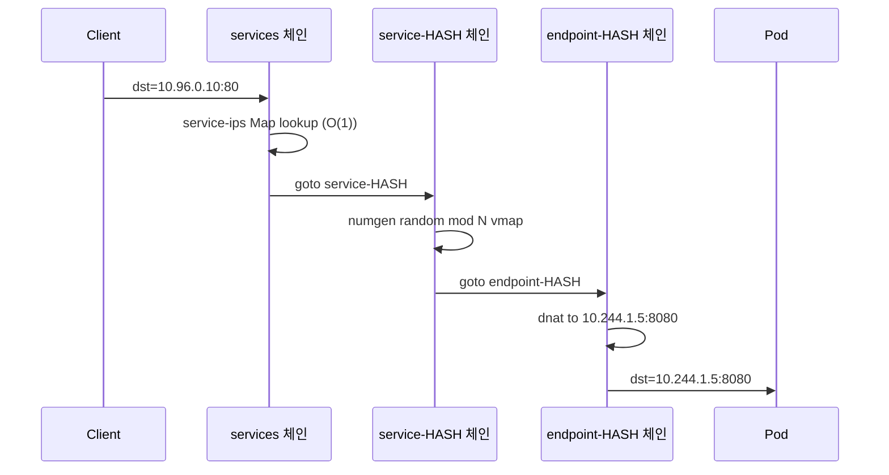
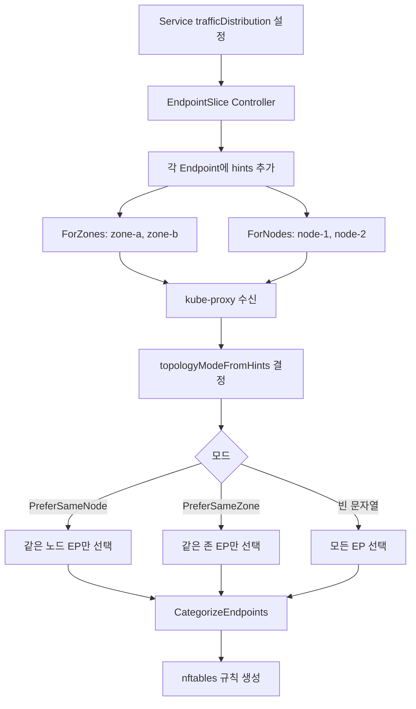
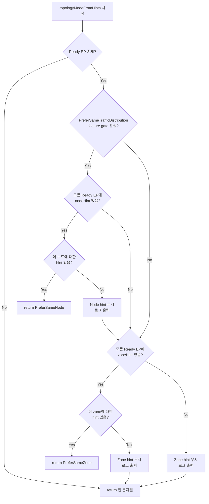

# 35. nftables 프록시 모드 및 Topology Aware Routing 심화

## 목차
1. [개요](#1-개요)
2. [nftables Proxier 구조체](#2-nftables-proxier-구조체)
3. [NFTables 테이블/체인 구조](#3-nftables-테이블체인-구조)
4. [패킷 처리 흐름 (7가지 주요 연산)](#4-패킷-처리-흐름-7가지-주요-연산)
5. [Service/Endpoint 동기화](#5-serviceendpoint-동기화)
6. [Topology Aware Routing 개요](#6-topology-aware-routing-개요)
7. [EndpointSlice Hints (ForZones, ForNodes)](#7-endpointslice-hints-forzones-fornodes)
8. [CategorizeEndpoints 알고리즘](#8-categorizeendpoints-알고리즘)
9. [Topology Mode 결정 로직](#9-topology-mode-결정-로직)
10. [왜 이런 설계인가](#10-왜-이런-설계인가)
11. [정리](#11-정리)

---

## 1. 개요

kube-proxy의 **nftables 모드**는 Kubernetes 1.29에서 Alpha, 1.31에서 Beta로 승격된
차세대 프록시 백엔드이다. 기존 iptables의 구조적 한계(선형 규칙 탐색, 비원자적 업데이트,
확률 기반 로드밸런싱)를 nftables의 **원자적 트랜잭션**, **Set/Map O(1) 해시 조회**,
**numgen random mod N vmap** 로드밸런싱으로 해결한다.

**Topology Aware Routing**은 EndpointSlice의 `hints.forZones`와 `hints.forNodes`를
기반으로 트래픽을 같은 존(zone) 또는 같은 노드(node)의 엔드포인트로 우선 라우팅하여
네트워크 레이턴시와 cross-zone 전송 비용을 절감한다.

```
소스 위치:
  pkg/proxy/nftables/proxier.go      -- nftables Proxier 핵심 구현
  pkg/proxy/topology.go              -- Topology Aware Routing 로직
  pkg/proxy/endpoint.go              -- BaseEndpointInfo (zoneHints, nodeHints)
  pkg/proxy/endpointslicecache.go    -- EndpointSlice Hints 추출
  staging/src/k8s.io/api/discovery/v1/types.go -- EndpointSlice API 타입
```

### 1.1 iptables vs nftables 근본적 차이

| 항목 | iptables | nftables |
|------|----------|----------|
| 규칙 탐색 | 선형 O(N) | Set/Map 해시 O(1) |
| 규칙 적용 | 규칙 단위 순차 적용 | 원자적 트랜잭션 |
| 로드밸런싱 | `-m statistic --probability 1/N` 체이닝 | `numgen random mod N vmap` 단일 규칙 |
| 증분 업데이트 | 전체 체인 재작성 | 변경된 Map/Set 요소만 추가/삭제 |
| 메모리 효율 | 규칙별 matcher 로드 | 공유 Set/Map으로 중복 제거 |
| 체인 구조 | 수천 개의 개별 체인 | 정적 구조 + 동적 서비스 체인 |

---

## 2. nftables Proxier 구조체

### 2.1 Proxier 구조체 핵심 필드

```
소스: pkg/proxy/nftables/proxier.go (라인 137~200)
```

```go
// Proxier is an nftables-based proxy
type Proxier struct {
    // ipFamily defines the IP family which this proxier is tracking.
    ipFamily v1.IPFamily

    // endpointsChanges and serviceChanges contains all changes to endpoints and
    // services that happened since nftables was synced.
    endpointsChanges *proxy.EndpointsChangeTracker
    serviceChanges   *proxy.ServiceChangeTracker

    mu             sync.Mutex // protects the following fields
    svcPortMap     proxy.ServicePortMap
    endpointsMap   proxy.EndpointsMap
    topologyLabels map[string]string    // <-- Topology Aware Routing용

    endpointSlicesSynced bool
    servicesSynced       bool
    syncedOnce           bool
    lastFullSync         time.Time
    needFullSync         bool
    initialized          int32
    syncRunner           *runner.BoundedFrequencyRunner
    syncPeriod           time.Duration
    flushed              bool

    // 사실상 상수 -- mutex 불필요
    nftables       knftables.Interface
    masqueradeAll  bool
    masqueradeMark string
    masqueradeRule string
    conntrack      conntrack.Interface
    localDetector  proxyutil.LocalTrafficDetector
    nodeName       string
    nodeIP         net.IP

    // 증분 동기화를 위한 nftElementStorage 인스턴스들
    clusterIPs          *nftElementStorage   // ClusterIP Set
    serviceIPs          *nftElementStorage   // Service IP Map
    firewallIPs         *nftElementStorage   // Firewall IP Map
    noEndpointServices  *nftElementStorage   // No-endpoint Service Map
    noEndpointNodePorts *nftElementStorage   // No-endpoint NodePort Map
    serviceNodePorts    *nftElementStorage   // NodePort Map
}
```

Proxier 구조체의 핵심 설계 포인트:

```
+--------------------------------------------------+
|              Proxier 내부 데이터 흐름               |
+--------------------------------------------------+
|                                                    |
|  ServiceChangeTracker ──→ svcPortMap               |
|                              │                     |
|  EndpointsChangeTracker ──→ endpointsMap           |
|                              │                     |
|  topologyLabels ─────────→ CategorizeEndpoints()  |
|                              │                     |
|                         syncProxyRules()           |
|                              │                     |
|                    ┌─────────┴──────────┐         |
|                    ▼                    ▼          |
|           nftElementStorage      서비스 체인 생성    |
|           (증분 Map/Set 관리)    (DNAT/Masq 규칙)   |
+--------------------------------------------------+
```

### 2.2 servicePortInfo -- 서비스별 체인 이름 캐싱

```
소스: pkg/proxy/nftables/proxier.go (라인 280~288)
```

```go
type servicePortInfo struct {
    *proxy.BaseServicePortInfo
    nameString             string
    clusterPolicyChainName string   // "service-HASH-ns/svc/tcp/port"
    localPolicyChainName   string   // "local-HASH-ns/svc/tcp/port"
    externalChainName      string   // "external-HASH-ns/svc/tcp/port"
    firewallChainName      string   // "firewall-HASH-ns/svc/tcp/port"
}
```

체인 이름은 SHA-256 해시의 처음 8바이트(Base32)와 `namespace/name/protocol/port` 문자열을
결합하여 생성한다. 해시 프리픽스는 **체인 이름 고유성**을 보장하면서 동시에 **시각적 식별**을
가능하게 한다.

### 2.3 endpointInfo -- 엔드포인트별 체인/어피니티 셋

```
소스: pkg/proxy/nftables/proxier.go (라인 309~324)
```

```go
type endpointInfo struct {
    *proxy.BaseEndpointInfo

    chainName       string   // "endpoint-HASH-ns/svc/tcp/port__10.0.0.1/8080"
    affinitySetName string   // "affinity-HASH-ns/svc/tcp/port__10.0.0.1/8080"
}
```

각 엔드포인트마다 고유 체인을 할당하며, Session Affinity가 활성화된 경우 클라이언트 IP를
기록하는 nftables Set도 함께 생성한다.

### 2.4 NewProxier() 초기화 과정

```
소스: pkg/proxy/nftables/proxier.go (라인 206~277)
```

```
NewProxier() 초기화 순서:
  1. getNFTablesInterface()   -- knftables 인터페이스 생성 (IPv4/IPv6)
  2. masqueradeMark 계산      -- 1 << masqueradeBit 값 생성
  3. NodePortAddresses 파싱   -- nodePortAddressStrings → NodePortAddresses
  4. ServiceHealthServer 생성 -- healthcheck 준비
  5. Proxier 구조체 초기화     -- 모든 Map/Set/Storage 할당
  6. BoundedFrequencyRunner   -- syncProxyRules() 호출 스케줄러
```

```go
proxier := &Proxier{
    ipFamily:         ipFamily,
    svcPortMap:       make(proxy.ServicePortMap),
    endpointsMap:     make(proxy.EndpointsMap),
    needFullSync:     true,        // 첫 동기화는 반드시 Full Sync
    masqueradeMark:   masqueradeMark,
    masqueradeRule:   fmt.Sprintf("mark set mark or %s", masqueradeMark),
    // ... 6개의 nftElementStorage 생성
    clusterIPs:       newNFTElementStorage("set", clusterIPsSet),
    serviceIPs:       newNFTElementStorage("map", serviceIPsMap),
    firewallIPs:      newNFTElementStorage("map", firewallIPsMap),
    noEndpointServices:  newNFTElementStorage("map", noEndpointServicesMap),
    noEndpointNodePorts: newNFTElementStorage("map", noEndpointNodePortsMap),
    serviceNodePorts:    newNFTElementStorage("map", serviceNodePortsMap),
}
```

---

## 3. NFTables 테이블/체인 구조

### 3.1 테이블 구조

모든 kube-proxy nftables 리소스는 단일 테이블 `kube-proxy`에 생성된다.
체인, Set, Map 모두 이 테이블 안에 포함되므로 `kube-` 접두사가 불필요하다.

```
소스: pkg/proxy/nftables/proxier.go (라인 55~97)
```

### 3.2 Base Chains (기본 체인)

Base Chain은 커널의 netfilter 훅 포인트에 직접 연결되는 체인이다.

```
소스: pkg/proxy/nftables/proxier.go (라인 342~356)
```

```
var nftablesBaseChains = []nftablesBaseChain{
    // filter type, pre-DNAT priority (-110)
    {filterPreroutingPreDNATChain, FilterType, PreroutingHook, DNATPriority+"-10"},
    {filterOutputPreDNATChain,     FilterType, OutputHook,     DNATPriority+"-10"},

    // filter type, filter priority (0)
    {filterInputChain,   FilterType, InputHook,   FilterPriority},
    {filterForwardChain, FilterType, ForwardHook, FilterPriority},
    {filterOutputChain,  FilterType, OutputHook,  FilterPriority},

    // nat type, DNAT priority (-100)
    {natPreroutingChain, NATType, PreroutingHook, DNATPriority},
    {natOutputChain,     NATType, OutputHook,     DNATPriority},

    // nat type, SNAT priority (100)
    {natPostroutingChain, NATType, PostroutingHook, SNATPriority},
}
```

### 3.3 체인 계층 구조 (ASCII 다이어그램)

```
                           커널 Netfilter 훅
                    ┌──────────────────────────────┐
                    │                              │
     ┌──────────────┤  PREROUTING 훅               │
     │              │   ├── filter-prerouting-pre-dnat (priority -110)
     │              │   │     └── jump firewall-check
     │              │   └── nat-prerouting          (priority -100)
     │              │         └── jump services
     │              │                              │
     │              ├── INPUT 훅                    │
     │              │   └── filter-input             (priority 0)
     │              │         ├── jump nodeport-endpoints-check
     │              │         └── jump service-endpoints-check
     │              │                              │
     │              ├── FORWARD 훅                  │
     │              │   └── filter-forward           (priority 0)
     │              │         ├── jump service-endpoints-check
     │              │         └── jump cluster-ips-check
     │              │                              │
     │              ├── OUTPUT 훅                   │
     │              │   ├── filter-output-pre-dnat  (priority -110)
     │              │   │     └── jump firewall-check
     │              │   ├── nat-output              (priority -100)
     │              │   │     └── jump services
     │              │   └── filter-output           (priority 0)
     │              │         ├── jump service-endpoints-check
     │              │         └── jump cluster-ips-check
     │              │                              │
     │              ├── POSTROUTING 훅              │
     │              │   └── nat-postrouting         (priority 100)
     │              │         └── jump masquerading
     │              │                              │
     │              └──────────────────────────────┘
```

### 3.4 Regular Chains (일반 체인)

```
소스: pkg/proxy/nftables/proxier.go (라인 367~385)
```

| 체인 | 기능 | 점프 원본 |
|------|------|----------|
| `services` | 서비스 IP/NodePort 디스패치 | nat-output, nat-prerouting |
| `service-endpoints-check` | 엔드포인트 없는 서비스 필터링 | filter-input, filter-forward, filter-output |
| `nodeport-endpoints-check` | 엔드포인트 없는 NodePort 필터링 | filter-input |
| `firewall-check` | LoadBalancerSourceRanges 방화벽 | filter-prerouting-pre-dnat, filter-output-pre-dnat |
| `masquerading` | SNAT 마스커레이딩 | nat-postrouting |
| `cluster-ips-check` | 잘못된 ClusterIP 접근 차단 | filter-forward, filter-output |
| `reject-chain` | reject 액션 헬퍼 | no-endpoint 판정에서 참조 |

### 3.5 동적 서비스 체인

서비스/엔드포인트별로 동적 생성되는 체인은 아래 6가지 프리픽스를 사용한다.

```
소스: pkg/proxy/nftables/proxier.go (라인 796~802)
```

| 프리픽스 | 용도 |
|---------|------|
| `service-` | Cluster 정책 체인 (ClusterIP 트래픽) |
| `local-` | Local 정책 체인 (로컬 엔드포인트만) |
| `external-` | 외부 트래픽 체인 (NodePort, ExternalIP, LB) |
| `endpoint-` | 개별 엔드포인트 DNAT 체인 |
| `affinity-` | Session Affinity Set |
| `firewall-` | LoadBalancerSourceRanges 방화벽 체인 |

### 3.6 핵심 Map/Set 구조

```
+──────────────────────────────────────────────────────────────────+
│ Set/Map Name             │ Type                    │ 용도        │
├──────────────────────────┼─────────────────────────┼────────────┤
│ cluster-ips (Set)        │ ipv4_addr               │ ClusterIP  │
│ service-ips (Map)        │ ip.proto.port → verdict  │ 서비스 매칭│
│ service-nodeports (Map)  │ proto.port → verdict     │ NodePort   │
│ no-endpoint-services     │ ip.proto.port → verdict  │ EP 없음    │
│ no-endpoint-nodeports    │ proto.port → verdict     │ EP 없음 NP │
│ firewall-ips (Map)       │ ip.proto.port → verdict  │ LB 방화벽  │
│ nodeport-ips (Set)       │ ipv4_addr               │ NP 허용 IP │
+──────────────────────────────────────────────────────────────────+
```

---

## 4. 패킷 처리 흐름 (7가지 주요 연산)

nftables proxier가 수행하는 7가지 주요 연산(Operation)을 분석한다.

### 4.1 DNAT (Destination NAT)

패킷의 목적지를 Service IP:Port에서 실제 Endpoint IP:Port로 변환한다.

```
패킷 흐름:
  1. 클라이언트 → ClusterIP:80
  2. services 체인: service-ips Map 조회 → goto service-HASH
  3. service-HASH 체인: numgen random mod N vmap → goto endpoint-HASH
  4. endpoint-HASH 체인: dnat to 10.244.1.5:8080
```

```go
// pkg/proxy/nftables/proxier.go (라인 1647~1653)
// DNAT to final destination.
tx.Add(&knftables.Rule{
    Chain: endpointChain,
    Rule: knftables.Concat(
        "meta l4proto", protocol,
        "dnat to", epInfo.String(),
    ),
})
```



### 4.2 SNAT Masquerading

소스 IP를 노드 IP로 변환하여 응답 패킷이 올바른 경로로 돌아오도록 한다.

```go
// pkg/proxy/nftables/proxier.go (라인 467~474)
// masquerading 체인의 규칙
tx.Add(&knftables.Rule{
    Chain: masqueradingChain,
    Rule: knftables.Concat(
        "mark", "and", proxier.masqueradeMark, "!=", "0",
        "mark", "set", "mark", "xor", proxier.masqueradeMark,
        "masquerade fully-random",
    ),
})
```

마스커레이드 마킹이 필요한 3가지 경우:

| 경우 | 규칙 위치 | 조건 |
|------|----------|------|
| masqueradeAll | internalTrafficChain | `ip daddr ClusterIP` |
| 외부 클러스터 트래픽 | internalTrafficChain | `localDetector.IfNotLocalNFT()` |
| 외부 트래픽 정책 Cluster | externalTrafficChain | 무조건 마킹 |
| Hairpin 트래픽 | endpointChain | `ip saddr == endpoint IP` |

### 4.3 LoadBalancerSourceRanges

LoadBalancer 서비스에 대해 허용된 소스 IP 범위만 접근을 허용한다.

```
처리 흐름:
  1. filter-prerouting-pre-dnat (priority -110) → jump firewall-check
  2. firewall-check: firewall-ips Map에서 dst IP.proto.port 조회
  3. 매칭 시 → goto firewall-HASH (서비스별 방화벽 체인)
  4. firewall-HASH: ip saddr != {허용 범위} → drop
```

```go
// pkg/proxy/nftables/proxier.go (라인 1554~1561)
tx.Add(&knftables.Rule{
    Chain: fwChain,
    Rule: knftables.Concat(
        ipX, "saddr", "!=", "{", sources, "}",
        "drop",
    ),
})
```

**왜 Pre-DNAT priority(-110)에서 처리하는가?**
DNAT 이전에 방화벽 검사를 수행해야 원본 목적지 IP(LoadBalancer VIP)로 매칭할 수 있다.
DNAT 이후에는 목적지가 Pod IP로 변경되어 VIP 기반 매칭이 불가능하다.

### 4.4 Local Traffic Policy

`externalTrafficPolicy: Local` 서비스에서 로컬 엔드포인트만 사용하도록 강제한다.

```
처리 흐름:
  external-HASH 체인:
    1. localDetector.IfLocalNFT() → goto service-HASH (Pod → External: 단축 경로)
    2. fib saddr type local → masquerade mark (노드 로컬 트래픽)
    3. fib saddr type local → goto service-HASH (노드 → External: Cluster 정책)
    4. goto local-HASH (외부 트래픽 → Local 정책)
```

```go
// pkg/proxy/nftables/proxier.go (라인 1486~1493)
// Pod에서 발생한 트래픽은 Cluster 정책으로 단축
tx.Add(&knftables.Rule{
    Chain: externalTrafficChain,
    Rule: knftables.Concat(
        proxier.localDetector.IfLocalNFT(),
        "goto", clusterPolicyChain,
    ),
    Comment: ptr.To("short-circuit pod traffic"),
})
```

### 4.5 No-endpoint Rejection

엔드포인트가 없는 서비스로의 트래픽을 reject 또는 drop 한다.

```
+─────────────────────────────────────────────────────────+
│ 상태                           │ 판정                   │
├────────────────────────────────┼────────────────────────┤
│ 엔드포인트 전혀 없음            │ goto reject-chain      │
│ Internal, Local 정책, 로컬 EP 없음 │ drop                │
│ External, Local 정책, 로컬 EP 없음 │ drop                │
+─────────────────────────────────────────────────────────+
```

```go
// service-endpoints-check 체인
tx.Add(&knftables.Rule{
    Chain: serviceEndpointsCheckChain,
    Rule: knftables.Concat(
        ipX, "daddr", ".", "meta l4proto", ".", "th dport",
        "vmap", "@", noEndpointServicesMap,
    ),
})
```

### 4.6 ClusterIP Validation

유효하지 않은 ClusterIP 접근(미할당 IP, 잘못된 포트)을 차단한다.

```go
// pkg/proxy/nftables/proxier.go (라인 484~501)
// 1. 활성 ClusterIP의 잘못된 포트 접근 → reject
tx.Add(&knftables.Rule{
    Chain: clusterIPsCheckChain,
    Rule: knftables.Concat(
        ipX, "daddr", "@", clusterIPsSet, "reject",
    ),
    Comment: ptr.To("Reject traffic to invalid ports of ClusterIPs"),
})

// 2. ServiceCIDR 범위 내 미할당 IP → drop
tx.Add(&knftables.Rule{
    Chain: clusterIPsCheckChain,
    Rule: knftables.Concat(
        ipX, "daddr", "{", proxier.serviceCIDRs, "}", "drop",
    ),
    Comment: ptr.To("Drop traffic to unallocated ClusterIPs"),
})
```

### 4.7 Port Validation (서비스 디스패치)

서비스 IP와 포트를 기반으로 올바른 서비스 체인으로 디스패치한다.

```go
// pkg/proxy/nftables/proxier.go (라인 617~623)
tx.Add(&knftables.Rule{
    Chain: servicesChain,
    Rule: knftables.Concat(
        ipX, "daddr", ".", "meta l4proto", ".", "th dport",
        "vmap", "@", serviceIPsMap,
    ),
})
```

`service-ips` Map의 키는 `(IP, Protocol, Port)` 3-tuple이며 값은 `goto service-HASH`
verdict이다. 이 Map 기반 조회는 서비스 수에 관계없이 **O(1)** 시간복잡도를 보장한다.

### 4.8 전체 패킷 흐름 통합 다이어그램

```
  ┌──────────────────────────────────────────────────────────────────┐
  │                    외부 패킷 진입 (PREROUTING)                     │
  │                                                                  │
  │  filter-prerouting-pre-dnat (prio -110)                         │
  │    └── ct state new → jump firewall-check                       │
  │          └── vmap @firewall-ips → goto firewall-HASH            │
  │                └── saddr != {허용범위} → drop                    │
  │                                                                  │
  │  nat-prerouting (prio -100)                                     │
  │    └── jump services                                             │
  │          ├── ip.proto.port vmap @service-ips → goto svc chain   │
  │          └── proto.port vmap @service-nodeports → goto ext chain│
  │                                                                  │
  │  [DNAT 수행됨 -- 목적지가 Pod IP로 변경]                          │
  │                                                                  │
  │  filter-forward (prio 0)  / filter-input (prio 0)               │
  │    └── ct state new → jump service-endpoints-check              │
  │          └── vmap @no-endpoint-services → reject/drop           │
  │    └── ct state new → jump cluster-ips-check                    │
  │          └── ip daddr @cluster-ips → reject (잘못된 포트)        │
  │                                                                  │
  │  nat-postrouting (prio 100)                                     │
  │    └── jump masquerading                                         │
  │          └── mark & MASQ_MARK != 0 → masquerade fully-random   │
  └──────────────────────────────────────────────────────────────────┘
```

---

## 5. Service/Endpoint 동기화

### 5.1 syncProxyRules() 메인 루프

```
소스: pkg/proxy/nftables/proxier.go (라인 1017~1747)
```

```go
func (proxier *Proxier) syncProxyRules() (retryError error) {
    proxier.mu.Lock()
    defer proxier.mu.Unlock()

    if !proxier.isInitialized() {
        return
    }

    doFullSync := proxier.needFullSync ||
                  (time.Since(proxier.lastFullSync) > proxyutil.FullSyncPeriod)

    // 1. 서비스/엔드포인트 변경사항 적용
    serviceUpdateResult := proxier.svcPortMap.Update(proxier.serviceChanges)
    endpointUpdateResult := proxier.endpointsMap.Update(proxier.endpointsChanges)

    // 2. 스테일 체인 정리 (1초 이상 된 것만)
    // ...

    // 3. 트랜잭션 시작
    tx := proxier.nftables.NewTransaction()
    if doFullSync {
        proxier.setupNFTables(tx)  // Base chain + Map/Set 재생성
    }

    // 4. 서비스별 규칙 생성
    for svcName, svc := range proxier.svcPortMap {
        // CategorizeEndpoints로 토폴로지 필터링
        clusterEndpoints, localEndpoints, allLocallyReachableEndpoints, hasEndpoints :=
            proxy.CategorizeEndpoints(allEndpoints, svcInfo, proxier.nodeName, proxier.topologyLabels)

        // 체인 생성 + Map/Set 요소 추가
        // ...
    }

    // 5. 트랜잭션 실행
    err = proxier.nftables.Run(context.TODO(), tx)
}
```

### 5.2 Full Sync vs Partial Sync

```
┌──────────────────────────────────────────────────────────────┐
│                    동기화 모드 결정                            │
├──────────────────────────────────────────────────────────────┤
│                                                              │
│  doFullSync = needFullSync ||                                │
│               (time.Since(lastFullSync) > FullSyncPeriod)    │
│                                                              │
│  ┌─────────────┐    ┌──────────────┐                        │
│  │ Full Sync   │    │ Partial Sync │                        │
│  ├─────────────┤    ├──────────────┤                        │
│  │setupNFTables│    │ 변경된 svc만  │                        │
│  │모든 base     │    │ 체인/Map 요소 │                        │
│  │chain/Map/Set│    │ 증분 업데이트  │                        │
│  │재생성        │    │              │                        │
│  └─────────────┘    └──────────────┘                        │
│                                                              │
│  Full Sync 트리거:                                           │
│  - 첫 동기화 (needFullSync = true)                           │
│  - 토폴로지 라벨 변경 (OnTopologyChange)                     │
│  - 이전 동기화 실패                                          │
│  - FullSyncPeriod 초과                                       │
└──────────────────────────────────────────────────────────────┘
```

### 5.3 nftElementStorage -- 증분 동기화 엔진

```
소스: pkg/proxy/nftables/proxier.go (라인 899~998)
```

nftElementStorage는 nftables Set/Map의 현재 상태를 메모리에 캐싱하고,
변경이 필요한 요소만 트랜잭션에 추가하는 증분 동기화 메커니즘이다.

```go
type nftElementStorage struct {
    elements      map[string]string     // key → value 현재 상태
    leftoverKeys  sets.Set[string]      // 더 이상 필요없는 키
    containerType string                // "set" 또는 "map"
    containerName string                // nftables 컨테이너 이름
}
```

동작 순서:
```
  readOrReset()              -- 커널에서 현재 요소 읽기 (실패 시 flush)
    │
    ├── 모든 기존 키를 leftoverKeys에 등록
    │
  ensureElem() (서비스별)    -- 각 서비스의 요소 보장
    │
    ├── 키 존재, 값 동일 → 아무것도 안함, leftoverKeys에서 제거
    ├── 키 존재, 값 다름 → delete + add, leftoverKeys에서 제거
    └── 키 미존재         → add
    │
  cleanupLeftoverKeys()      -- leftoverKeys에 남은 것 = 삭제된 서비스
    │
    └── 남은 키 모두 tx.Delete()
```

### 5.4 서비스-엔드포인트 DNAT 규칙 생성

```
소스: pkg/proxy/nftables/proxier.go (라인 1773~1819)
```

```go
func (proxier *Proxier) writeServiceToEndpointRules(tx *knftables.Transaction,
    svcInfo *servicePortInfo, svcChain string, endpoints []proxy.Endpoint) {

    // 1. Session Affinity 규칙 (있는 경우)
    if svcInfo.SessionAffinityType() == v1.ServiceAffinityClientIP {
        for _, ep := range endpoints {
            tx.Add(&knftables.Rule{
                Chain: svcChain,
                Rule: knftables.Concat(
                    ipX, "saddr", "@", epInfo.affinitySetName,
                    "goto", epInfo.chainName,
                ),
            })
        }
    }

    // 2. 로드밸런싱 규칙 (numgen random mod N vmap)
    var elements []string
    for i, ep := range endpoints {
        elements = append(elements, strconv.Itoa(i), ":", "goto", epInfo.chainName)
        if i != len(endpoints)-1 {
            elements = append(elements, ",")
        }
    }
    tx.Add(&knftables.Rule{
        Chain: svcChain,
        Rule: knftables.Concat(
            "numgen random mod", len(endpoints), "vmap",
            "{", elements, "}",
        ),
    })
}
```

nftables의 `numgen random mod N vmap`은 단일 규칙으로 N-way 로드밸런싱을 수행한다.
iptables의 `--probability 1/N` 체이닝 방식과 달리 규칙 수가 엔드포인트 수에 비례하지 않는다.

```
nftables 규칙 예시:
  numgen random mod 3 vmap {
    0 : goto endpoint-HASH1,
    1 : goto endpoint-HASH2,
    2 : goto endpoint-HASH3
  }

iptables 동등 규칙 (비교):
  -A SVC_CHAIN -m statistic --probability 0.33333 -j ENDPOINT1
  -A SVC_CHAIN -m statistic --probability 0.50000 -j ENDPOINT2
  -A SVC_CHAIN -j ENDPOINT3
```

### 5.5 OnTopologyChange() -- 토폴로지 변경 처리

```
소스: pkg/proxy/nftables/proxier.go (라인 756~763)
```

```go
func (proxier *Proxier) OnTopologyChange(topologyLabels map[string]string) {
    proxier.mu.Lock()
    proxier.topologyLabels = topologyLabels    // 노드의 토폴로지 라벨 업데이트
    proxier.needFullSync = true                // Full Sync 강제
    proxier.mu.Unlock()
    proxier.Sync()
}
```

토폴로지 라벨(`topology.kubernetes.io/zone` 등)이 변경되면 모든 서비스의
엔드포인트 필터링 결과가 달라질 수 있으므로 **Full Sync를 강제**한다.

---

## 6. Topology Aware Routing 개요

### 6.1 목적과 동기

클러스터 내 서비스 트래픽이 원격 존(zone)의 엔드포인트로 라우팅되면:
- **네트워크 레이턴시** 증가 (cross-zone RTT)
- **클라우드 전송 비용** 증가 (cross-zone data transfer)
- **네트워크 대역폭** 낭비

Topology Aware Routing은 EndpointSlice Controller가 각 엔드포인트에 대해
**zone hint** 또는 **node hint**를 설정하고, kube-proxy가 이를 기반으로
트래픽을 같은 zone/node의 엔드포인트로 우선 라우팅하는 메커니즘이다.

### 6.2 Service trafficDistribution 필드

```yaml
apiVersion: v1
kind: Service
metadata:
  name: my-service
spec:
  selector:
    app: my-app
  trafficDistribution: PreferClose   # Topology Aware Routing 활성화
  ports:
    - port: 80
      targetPort: 8080
```

`trafficDistribution` 필드값에 따라 EndpointSlice Controller가 hint를 설정한다:
- `PreferClose`: zone hint를 설정하여 같은 zone 우선 라우팅
- 향후: `PreferSameNode` 등 확장 가능

### 6.3 동작 흐름



---

## 7. EndpointSlice Hints (ForZones, ForNodes)

### 7.1 EndpointSlice API 타입 정의

```
소스: staging/src/k8s.io/api/discovery/v1/types.go (라인 138~192)
```

```go
type Endpoint struct {
    Addresses  []string             `json:"addresses"`
    Conditions EndpointConditions   `json:"conditions,omitempty"`
    Hostname   *string              `json:"hostname,omitempty"`
    TargetRef  *v1.ObjectReference  `json:"targetRef,omitempty"`
    NodeName   *string              `json:"nodeName,omitempty"`
    Zone       *string              `json:"zone,omitempty"`
    Hints      *EndpointHints       `json:"hints,omitempty"`
}

type EndpointHints struct {
    ForZones []ForZone `json:"forZones,omitempty"`  // 최대 8개
    ForNodes []ForNode `json:"forNodes,omitempty"`  // 최대 8개
}

type ForZone struct {
    Name string `json:"name"`   // 예: "us-east-1a"
}

type ForNode struct {
    Name string `json:"name"`   // 예: "worker-node-01"
}
```

### 7.2 Hints 의미론

| Hint 종류 | 의미 | 사용 시나리오 |
|-----------|------|-------------|
| `ForZones` | 이 엔드포인트를 소비해야 하는 zone 목록 | PreferClose 트래픽 분배 |
| `ForNodes` | 이 엔드포인트를 소비해야 하는 node 목록 | PreferSameNode 트래픽 분배 |

ForZones와 ForNodes는 동시에 설정될 수 있다. kube-proxy는
PreferSameNode (feature gate 필요)를 우선 확인하고, 해당되지 않으면 ForZones를 확인한다.

### 7.3 BaseEndpointInfo의 Hint 필드

```
소스: pkg/proxy/endpoint.go (라인 60~87)
```

```go
type BaseEndpointInfo struct {
    ip          string
    port        int
    endpoint    string
    isLocal     bool
    ready       bool
    serving     bool
    terminating bool
    zoneHints   sets.Set[string]   // ForZones에서 추출
    nodeHints   sets.Set[string]   // ForNodes에서 추출
}
```

### 7.4 EndpointSliceCache에서 Hints 추출

```
소스: pkg/proxy/endpointslicecache.go (라인 215~233)
```

```go
// addEndpoints에서 Hints 추출
var zoneHints, nodeHints sets.Set[string]
if endpoint.Hints != nil {
    if len(endpoint.Hints.ForZones) > 0 {
        zoneHints = sets.New[string]()
        for _, zone := range endpoint.Hints.ForZones {
            zoneHints.Insert(zone.Name)
        }
    }
    if len(endpoint.Hints.ForNodes) > 0 &&
       utilfeature.DefaultFeatureGate.Enabled(features.PreferSameTrafficDistribution) {
        nodeHints = sets.New[string]()
        for _, node := range endpoint.Hints.ForNodes {
            nodeHints.Insert(node.Name)
        }
    }
}

endpointInfo := newBaseEndpointInfo(endpointIP, portNum, isLocal,
    ready, serving, terminating, zoneHints, nodeHints)
```

**중요**: `ForNodes` hint는 `PreferSameTrafficDistribution` feature gate가 활성화된
경우에만 추출된다. ForZones는 feature gate 없이 항상 추출된다.

### 7.5 Endpoint 인터페이스

```
소스: pkg/proxy/endpoint.go (라인 27~54)
```

```go
type Endpoint interface {
    String() string
    IP() string
    Port() int
    IsLocal() bool
    IsReady() bool
    IsServing() bool
    IsTerminating() bool
    ZoneHints() sets.Set[string]   // ForZones에서 추출된 zone 이름 Set
    NodeHints() sets.Set[string]   // ForNodes에서 추출된 node 이름 Set
}
```

---

## 8. CategorizeEndpoints 알고리즘

### 8.1 함수 시그니처와 반환값

```
소스: pkg/proxy/topology.go (라인 48~154)
```

```go
func CategorizeEndpoints(
    endpoints []Endpoint,
    svcInfo ServicePort,
    nodeName string,
    topologyLabels map[string]string,
) (clusterEndpoints, localEndpoints, allReachableEndpoints []Endpoint, hasAnyEndpoints bool)
```

| 반환값 | 의미 |
|--------|------|
| `clusterEndpoints` | Cluster 트래픽 정책용 엔드포인트 (토폴로지 반영) |
| `localEndpoints` | Local 트래픽 정책용 엔드포인트 (로컬 노드만) |
| `allReachableEndpoints` | 이 노드에서 도달 가능한 모든 엔드포인트 (위 두 개의 합집합) |
| `hasAnyEndpoints` | 클러스터 어딘가에 엔드포인트가 있는지 여부 |

### 8.2 알고리즘 상세 흐름

```
┌─────────────────────────────────────────────────────────────────────┐
│                CategorizeEndpoints() 알고리즘                        │
├─────────────────────────────────────────────────────────────────────┤
│                                                                     │
│  입력: endpoints[], svcInfo, nodeName, topologyLabels              │
│                                                                     │
│  if len(endpoints) == 0 → return (빈 결과)                          │
│                                                                     │
│  [1단계: Cluster 트래픽 정책 처리]                                   │
│  if svcInfo.UsesClusterEndpoints():                                 │
│    zone = topologyLabels["topology.kubernetes.io/zone"]             │
│    topologyMode = topologyModeFromHints(svcInfo, endpoints,         │
│                                          nodeName, zone)            │
│    clusterEndpoints = filter(endpoints, ep →                        │
│        ep.IsReady() && availableForTopology(ep, mode, node, zone)) │
│                                                                     │
│    if len(clusterEndpoints) == 0:                                   │
│      // Fallback: Ready가 없으면 Serving+Terminating 사용           │
│      clusterEndpoints = filter(endpoints, ep →                      │
│          ep.IsServing() && ep.IsTerminating())                      │
│                                                                     │
│    if len(clusterEndpoints) > 0:                                    │
│      hasAnyEndpoints = true                                         │
│                                                                     │
│  [2단계: Local 트래픽 정책 불필요 시 조기 반환]                      │
│  if !svcInfo.UsesLocalEndpoints():                                  │
│    allReachableEndpoints = clusterEndpoints                         │
│    return                                                           │
│                                                                     │
│  [3단계: Local 트래픽 정책 처리]                                     │
│  Pre-scan: 로컬 Ready, 로컬 Serving+Terminating 여부 확인           │
│  if hasLocalReadyEndpoints:                                         │
│    localEndpoints = filter(ep → ep.IsLocal() && ep.IsReady())      │
│  elif hasLocalServingTerminating:                                    │
│    localEndpoints = filter(ep → ep.IsLocal() &&                     │
│                            ep.IsServing() && ep.IsTerminating())    │
│                                                                     │
│  [4단계: allReachableEndpoints 결정]                                │
│  if !UsesClusterEndpoints():                                        │
│    allReachableEndpoints = localEndpoints                           │
│  elif topologyMode == "" && !useServingTerminating:                  │
│    allReachableEndpoints = clusterEndpoints (상위 집합이므로)        │
│  else:                                                               │
│    allReachableEndpoints = merge(clusterEndpoints, localEndpoints)  │
│                                                                     │
│  return                                                              │
└─────────────────────────────────────────────────────────────────────┘
```

### 8.3 Fallback 전략

CategorizeEndpoints는 다단계 Fallback 전략을 구현한다:

```
Ready 엔드포인트 있음          Ready 엔드포인트 없음
       │                              │
       ▼                              ▼
  토폴로지 필터링              토폴로지 무시
  (zone/node hint 기반)       (이미 hint 결정 시 고려됨)
       │                              │
       ▼                              ▼
  필터된 결과가 있음?          Serving+Terminating 사용
       │                         (Graceful termination)
       ├── Yes → 사용
       └── No → 토폴로지 무시 (topologyModeFromHints에서 결정)
```

**핵심 설계 원칙**: 토폴로지 필터링은 *Ready 엔드포인트가 해당 토폴로지에 존재하는
경우에만* 적용된다. 존재하지 않으면 `topologyModeFromHints()`에서 빈 문자열을 반환하여
토폴로지를 무시하고 모든 Ready 엔드포인트를 사용한다.

### 8.4 allReachableEndpoints 결정 로직

`allReachableEndpoints`는 `clusterEndpoints`와 `localEndpoints`의 합집합이다.
최적화를 위해 불필요한 합집합 계산을 회피한다:

| 조건 | allReachableEndpoints |
|------|----------------------|
| Cluster 정책만 사용 | = clusterEndpoints |
| Local 정책만 사용 | = localEndpoints |
| 토폴로지 없음 + Terminating 미사용 | = clusterEndpoints (상위 집합) |
| 그 외 | merge(cluster, local) |

```go
// pkg/proxy/topology.go (라인 130~136)
if topologyMode == "" && !useServingTerminatingEndpoints {
    // clusterEndpoints는 모든 Ready 엔드포인트를 포함하므로
    // localEndpoints의 상위 집합이다.
    allReachableEndpoints = clusterEndpoints
    return
}
```

---

## 9. Topology Mode 결정 로직

### 9.1 topologyModeFromHints() 함수

```
소스: pkg/proxy/topology.go (라인 164~218)
```

이 함수는 엔드포인트의 hint를 분석하여 3가지 모드 중 하나를 반환한다:
- `""` (빈 문자열): 토폴로지 무시, 모든 엔드포인트 사용
- `"PreferSameNode"`: 같은 노드의 엔드포인트만 사용
- `"PreferSameZone"`: 같은 zone의 엔드포인트만 사용

```go
func topologyModeFromHints(svcInfo ServicePort, endpoints []Endpoint,
    nodeName, zone string) string {

    hasReadyEndpoints := false
    hasEndpointForNode := false
    allEndpointsHaveNodeHints := true
    hasEndpointForZone := false
    allEndpointsHaveZoneHints := true

    for _, endpoint := range endpoints {
        if !endpoint.IsReady() {
            continue   // 비-Ready 엔드포인트는 hint 검사에서 제외
        }
        hasReadyEndpoints = true

        // Node hint 검사
        if endpoint.NodeHints().Len() == 0 {
            allEndpointsHaveNodeHints = false
        } else if endpoint.NodeHints().Has(nodeName) {
            hasEndpointForNode = true
        }

        // Zone hint 검사
        if endpoint.ZoneHints().Len() == 0 {
            allEndpointsHaveZoneHints = false
        } else if endpoint.ZoneHints().Has(zone) {
            hasEndpointForZone = true
        }
    }

    if !hasReadyEndpoints {
        return ""   // Ready 엔드포인트가 없으면 토폴로지 무시
    }

    // 1차: PreferSameNode 시도 (feature gate 필요)
    if featureGate.Enabled(PreferSameTrafficDistribution) {
        if allEndpointsHaveNodeHints && hasEndpointForNode {
            return "PreferSameNode"
        }
    }

    // 2차: PreferSameZone 시도
    if allEndpointsHaveZoneHints && hasEndpointForZone {
        return "PreferSameZone"
    }

    return ""   // 토폴로지 조건 미충족 → 무시
}
```

### 9.2 결정 로직 플로우차트



### 9.3 availableForTopology() 함수

```
소스: pkg/proxy/topology.go (라인 223~234)
```

```go
func availableForTopology(endpoint Endpoint, topologyMode, nodeName, zone string) bool {
    switch topologyMode {
    case "":
        return true   // 토폴로지 무시 → 모든 엔드포인트 사용 가능
    case v1.ServiceTrafficDistributionPreferSameNode:
        return endpoint.NodeHints().Has(nodeName)
    case v1.ServiceTrafficDistributionPreferSameZone:
        return endpoint.ZoneHints().Has(zone)
    default:
        return false
    }
}
```

**설계 원칙**: 이 함수에는 fallback 로직이 없다. Fallback은 `topologyModeFromHints()`에서
모드를 결정할 때 이미 처리된다. 일단 모드가 결정되면 해당 모드의 필터링만 엄격하게 적용한다.

### 9.4 Topology Mode 결정 조건 요약 테이블

| 조건 | Node Hints | Zone Hints | 결과 |
|------|------------|------------|------|
| 모든 Ready EP에 node hint + 이 노드 hint 존재 + FG 활성 | 전부 O | 상관없음 | PreferSameNode |
| 모든 Ready EP에 node hint + 이 노드 hint 없음 | 전부 O | - | Zone 확인 |
| 일부 Ready EP에 node hint 없음 | 일부 X | - | Zone 확인 |
| 모든 Ready EP에 zone hint + 이 zone hint 존재 | - | 전부 O | PreferSameZone |
| 모든 Ready EP에 zone hint + 이 zone hint 없음 | - | 전부 O | "" (무시) |
| 일부 Ready EP에 zone hint 없음 | - | 일부 X | "" (무시) |
| Ready EP 없음 | - | - | "" (무시) |

---

## 10. 왜 이런 설계인가

### 10.1 왜 Map/Set 기반 디스패치인가

**문제**: iptables에서 10,000개 서비스를 처리하면 수만 개의 규칙을 선형 탐색해야 한다.
패킷 하나당 수백 마이크로초의 레이턴시가 발생할 수 있다.

**해결**: nftables의 `service-ips` Map은 `(IP, Protocol, Port)` 3-tuple을 키로 하는
해시 테이블이다. 서비스 수에 관계없이 O(1) 상수 시간에 올바른 서비스 체인을 찾는다.

```
iptables (서비스 10,000개):
  KUBE-SERVICES:
    -d 10.96.0.1/32 -p tcp --dport 443 -j KUBE-SVC-HASH1
    -d 10.96.0.2/32 -p tcp --dport 80  -j KUBE-SVC-HASH2
    ... (10,000개 규칙 순차 매칭)

nftables (서비스 10,000개):
  services:
    ip daddr . meta l4proto . th dport vmap @service-ips
    → 해시 테이블 한 번 조회 (O(1))
```

### 10.2 왜 numgen random mod N vmap인가

**문제**: iptables는 N개 엔드포인트에 대해 N개의 `-m statistic --probability` 규칙을
체이닝해야 한다. 각 규칙의 확률은 `1/N, 1/(N-1), ..., 1/1`로 설정되어야 하며,
이는 비직관적이고 규칙 수가 엔드포인트에 비례한다.

**해결**: nftables의 `numgen random mod N vmap`은 커널 의사난수 생성기를 사용하여
0~(N-1) 범위의 난수를 생성하고, vmap으로 직접 엔드포인트 체인에 점프한다.
**단일 규칙**으로 N-way 균등 로드밸런싱을 구현한다.

### 10.3 왜 토폴로지 hint에 "전부 또는 전무" 정책인가

`topologyModeFromHints()`는 **모든** Ready 엔드포인트에 hint가 있어야만
토폴로지 모드를 활성화한다. 일부만 hint가 있으면 무시한다.

**이유**:
1. **공정성**: 일부만 hint가 있으면 hint 있는 엔드포인트에 트래픽이 집중된다
2. **일관성**: EndpointSlice Controller가 hint를 점진적으로 설정하는 과도기 동안
   불균형한 라우팅을 방지한다
3. **안전성**: hint가 없는 엔드포인트를 무시하면 사용 가능한 백엔드 수가 감소하여
   부하 집중이 발생할 수 있다

### 10.4 왜 PreferSameNode가 PreferSameZone보다 우선인가

Node-level 토폴로지는 Zone-level보다 **더 세밀한 지역성**을 제공한다.
같은 노드의 엔드포인트는 네트워크 홉이 0(loopback 또는 veth)이므로
레이턴시와 비용 모두 최적이다.

```
우선순위 결정 로직:
  1. PreferSameNode → 같은 노드 (네트워크 홉 0)
  2. PreferSameZone → 같은 zone (동일 데이터센터)
  3. 없음           → 모든 EP (cross-zone 가능)
```

### 10.5 왜 Serving+Terminating Fallback인가

Graceful Termination 중인 Pod는 `Ready=false, Serving=true, Terminating=true`
상태이다. 모든 Ready 엔드포인트가 없을 때 이러한 엔드포인트를 Fallback으로 사용하면:

1. **서비스 가용성**: 새 Pod가 Ready 되기 전까지 트래픽을 처리할 수 있다
2. **Graceful Shutdown**: Terminating Pod는 여전히 요청을 처리할 수 있는 상태이다
3. **Rolling Update**: 배포 중 일시적으로 모든 기존 Pod가 Terminating 상태일 수 있다

```
Fallback 체인:
  Ready EP 있음 → Ready EP 사용 (토폴로지 필터링 적용)
       ↓ 없음
  Ready EP 없음 → Serving+Terminating EP 사용 (토폴로지 무시)
       ↓ 없음
  아무것도 없음 → hasAnyEndpoints = false → reject/drop
```

### 10.6 왜 증분 동기화(Partial Sync)인가

**문제**: 대규모 클러스터에서 단일 서비스 변경에 모든 서비스의 nftables 규칙을
재생성하면 수십 밀리초~수백 밀리초의 지연이 발생한다.

**해결**: nftElementStorage는 현재 커널 상태를 캐싱하고, 변경된 요소만
트랜잭션에 포함한다.

```
10,000 서비스 클러스터에서 1개 서비스 변경 시:

Full Sync:    10,000 서비스 × 규칙 생성 → 높은 지연
Partial Sync: 1 서비스 규칙만 변경 → 밀리초 단위 완료
```

`skipServiceUpdate` 플래그로 변경되지 않은 서비스의 체인 생성을 건너뛴다:

```go
skipServiceUpdate := !doFullSync &&
    !serviceUpdateResult.UpdatedServices.Has(svcName.NamespacedName) &&
    !endpointUpdateResult.UpdatedServices.Has(svcName.NamespacedName)
```

### 10.7 왜 스테일 체인을 즉시 삭제하지 않는가

```
소스: pkg/proxy/nftables/proxier.go (라인 1657~1674)
```

커널 6.2 미만에서는 Map 요소가 체인을 참조하고 있을 때, Map 요소를 삭제해도
커널이 체인의 참조 카운트를 즉시 갱신하지 않는다. 체인을 바로 삭제하면
"chain is in use" 에러가 발생한다.

**해결**: 체인을 Flush(규칙 비우기)만 하고, 1초 이상 경과한 후 다음 동기화 사이클에서
삭제한다.

```go
// staleChains 정리 (다음 syncProxyRules 실행 시)
oneSecondAgo := start.Add(-time.Second)
for chain, modtime := range proxier.staleChains {
    if modtime.Before(oneSecondAgo) {
        tx.Delete(&knftables.Chain{Name: chain})
        delete(proxier.staleChains, chain)
    }
}
```

### 10.8 왜 Pre-DNAT 체인에서 방화벽 검사를 하는가

LoadBalancerSourceRanges 검사는 `filter-prerouting-pre-dnat` 체인(priority -110)에서
수행된다. 이는 NAT(priority -100)보다 **먼저** 실행된다.

**이유**: DNAT 이후에는 패킷의 목적지 IP가 LoadBalancer VIP에서 Pod IP로 변경된다.
따라서 VIP 기반으로 방화벽 규칙을 매칭하려면 DNAT 이전에 검사해야 한다.

```
Priority 순서:
  -110  filter-prerouting-pre-dnat  ← 여기서 VIP 기반 방화벽 검사
  -100  nat-prerouting              ← 여기서 DNAT (VIP → Pod IP)
    0   filter-forward              ← DNAT 이후 (Pod IP만 보임)
```

---

## 11. 정리

### 11.1 nftables 프록시 모드 핵심 정리

| 항목 | 내용 |
|------|------|
| 테이블 | `kube-proxy` 단일 테이블 |
| Base Chain | 8개 (filter 5 + nat 3) |
| 서비스 디스패치 | `service-ips` Map O(1) 해시 조회 |
| 로드밸런싱 | `numgen random mod N vmap` 단일 규칙 |
| 동기화 | Full Sync + Partial Sync 하이브리드 |
| 증분 관리 | nftElementStorage 기반 Map/Set 요소 추적 |
| 스테일 정리 | 1초 대기 후 체인 삭제 (커널 호환성) |

### 11.2 Topology Aware Routing 핵심 정리

| 항목 | 내용 |
|------|------|
| Hint 종류 | ForZones (zone), ForNodes (node) |
| 우선순위 | PreferSameNode > PreferSameZone > 없음 |
| 전제조건 | 모든 Ready EP에 hint 필요 (전부 또는 전무) |
| Fallback | Ready 없으면 → Serving+Terminating 사용 |
| 트리거 | OnTopologyChange → Full Sync 강제 |
| Feature Gate | PreferSameTrafficDistribution (ForNodes용) |

### 11.3 서비스 트래픽 흐름 완전 매핑

```
서비스 접근 유형별 처리 체인 매핑:

┌─────────────────────────────────────────────────────────────────────┐
│ 접근 유형        │ 디스패치 경로                                      │
├──────────────────┼──────────────────────────────────────────────────┤
│ ClusterIP        │ service-ips → service-HASH → endpoint-HASH      │
│                  │ (internalTrafficPolicy 적용)                     │
├──────────────────┼──────────────────────────────────────────────────┤
│ NodePort         │ service-nodeports → external-HASH → policy-HASH │
│                  │ (externalTrafficPolicy 적용)                     │
├──────────────────┼──────────────────────────────────────────────────┤
│ ExternalIP       │ service-ips → external-HASH → policy-HASH       │
│                  │ (externalTrafficPolicy 적용)                     │
├──────────────────┼──────────────────────────────────────────────────┤
│ LoadBalancer VIP │ service-ips → external-HASH → policy-HASH       │
│                  │ + firewall-ips → firewall-HASH (Source Range)   │
├──────────────────┼──────────────────────────────────────────────────┤
│ EP 없음 (전체)   │ no-endpoint-services → reject-chain             │
│ EP 없음 (Local)  │ no-endpoint-services → drop                     │
└─────────────────────────────────────────────────────────────────────┘
```

### 11.4 iptables vs nftables 성능 비교

```
+──────────────────────────────────────────────────────────────+
│ 메트릭                 │ iptables      │ nftables            │
├────────────────────────┼───────────────┼─────────────────────┤
│ 규칙 업데이트 방식      │ 전체 재작성    │ 증분 Map/Set 변경   │
│ 서비스 조회 복잡도      │ O(N)          │ O(1)                │
│ LB 규칙 수 / EP        │ N개           │ 1개 (vmap)          │
│ 규칙 적용 원자성       │ 부분적         │ 완전 원자적          │
│ 10K 서비스 동기화 시간  │ 수백 ms       │ 수십 ms             │
│ 메모리 효율            │ 규칙별 matcher │ 공유 Set/Map        │
+──────────────────────────────────────────────────────────────+
```

### 11.5 주요 소스코드 참조

| 파일 | 주요 내용 |
|------|----------|
| `pkg/proxy/nftables/proxier.go` | Proxier 구조체, syncProxyRules, setupNFTables, 서비스 체인 생성 |
| `pkg/proxy/topology.go` | CategorizeEndpoints, topologyModeFromHints, availableForTopology |
| `pkg/proxy/endpoint.go` | Endpoint 인터페이스, BaseEndpointInfo (zoneHints, nodeHints) |
| `pkg/proxy/endpointslicecache.go` | EndpointSlice hints 추출, 캐시 관리 |
| `staging/src/k8s.io/api/discovery/v1/types.go` | EndpointSlice, EndpointHints, ForZone, ForNode 타입 |
