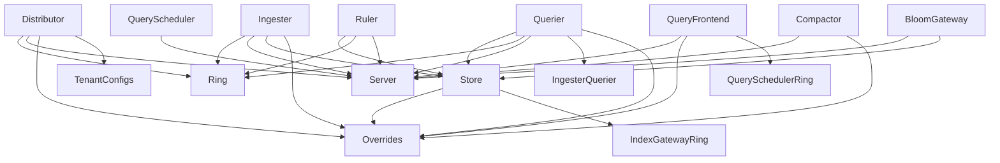

# Loki 아키텍처

## 1. 프로젝트 개요

Grafana Loki는 Prometheus에서 영감을 받은 수평 확장 가능한 멀티테넌트 로그 집계 시스템이다.

**핵심 철학:**
- 로그 **내용**을 인덱싱하지 않고, **레이블 셋**만 인덱싱
- 압축된 비정형 로그를 저장하여 비용 효율적
- Prometheus와 동일한 레이블 체계로 메트릭↔로그 연계

**3 컴포넌트 스택:**

```
┌──────────┐    ┌──────────┐    ┌──────────┐
│  Alloy   │───▶│   Loki   │◀───│ Grafana  │
│ (에이전트) │    │ (메인서비스) │    │  (UI)    │
└──────────┘    └──────────┘    └──────────┘
  로그 수집        저장·쿼리        시각화·탐색
```

---

## 2. 전체 아키텍처

### 2.1 Write Path (쓰기 경로)

```
┌────────┐     ┌──────────────┐     ┌─────────┐     ┌──────────────┐
│ Client │────▶│ Distributor  │────▶│  Ring   │────▶│  Ingester(s) │
│(Alloy) │     │              │     │ Lookup  │     │              │
└────────┘     └──────────────┘     └─────────┘     └──────┬───────┘
                │ 유효성 검증                                │
                │ 레이트 리밋                                │ 인메모리 청크
                │ 스트림 샤딩                                ▼
                │ 듀얼 라이트 ─────▶ Kafka           ┌──────────────┐
                                                     │ Object Store │
                                                     │ + Index      │
                                                     └──────────────┘
```

**상세 흐름:**
1. 클라이언트가 `POST /loki/api/v1/push`로 PushRequest 전송
2. **Distributor**가 수신하여 유효성 검증, 레이트 리밋 체크
3. **Ring**에서 스트림 해시값으로 대상 Ingester(s) 결정
4. Replication Factor만큼 여러 Ingester에 복제 전송
5. 각 **Ingester**가 테넌트별 인스턴스에 로그를 메모리 청크로 버퍼링
6. 주기적으로 청크를 Object Store(S3/GCS/Azure)와 인덱스에 플러시

### 2.2 Read Path (읽기 경로)

```
┌────────┐     ┌───────────────┐     ┌───────────────┐     ┌─────────┐
│ Client │────▶│Query Frontend │────▶│Query Scheduler│────▶│ Querier │
└────────┘     └───────────────┘     └───────────────┘     └────┬────┘
                │ 캐싱                                          │
                │ 시간 분할                              ┌──────┴──────┐
                │ 쿼리 샤딩                              │             │
                │ 리트라이                          ┌─────┴─────┐ ┌────┴──────┐
                                                    │ Ingester  │ │   Store   │
                                                    │ (최신 데이터)│ │ (과거 데이터)│
                                                    └─────┬─────┘ └────┬──────┘
                                                          │            │
                                                          └──────┬─────┘
                                                                 │
                                                          MergeIterator
                                                                 │
                                                              Response
```

**상세 흐름:**
1. 클라이언트가 LogQL 쿼리 전송
2. **Query Frontend**가 캐시 확인, 시간 분할, 쿼리 샤딩 적용
3. **Query Scheduler**가 큐잉 후 가용한 Querier에 라우팅
4. **Querier**가 시간 범위에 따라 소스 분리:
   - 최근 데이터 (기본 3시간 이내): Ingester에서 인메모리 조회
   - 과거 데이터: Store에서 오브젝트 스토리지 조회
5. MergeIterator로 두 소스의 결과를 병합하여 응답

---

## 3. 모듈 시스템

### 3.1 Loki 구조체

`pkg/loki/loki.go`에 정의된 메인 구조체:

```go
// Config (pkg/loki/loki.go:84-141)
type Config struct {
    Server           server.Config
    Distributor      distributor.Config
    Ingester         ingester.Config
    Querier          querier.Config
    StorageConfig    storage.Config
    SchemaConfig     config.SchemaConfig
    Frontend         lokifrontend.Config
    QueryScheduler   scheduler.Config
    Ruler            ruler.Config
    Compactor        compactor.Config
    BloomGateway     bloomgateway.Config
    IndexGateway     indexgateway.Config
    PatternIngester  pattern.Config
    // ... 30+ 설정 필드
}

// Loki (pkg/loki/loki.go:399-471)
type Loki struct {
    ModuleManager  *modules.Manager    // 모듈 라이프사이클 관리
    serviceMap     map[string]services.Service
    ring           *ring.Ring          // Ingester Ring
    distributor    *distributor.Distributor
    Ingester       *ingester.Ingester
    Querier        *querier.Querier
    Store          storage.Store
    frontend       *lokifrontend.Frontend
    // ... HTTP/gRPC 서버 등
}
```

### 3.2 New() → Run() 흐름

```
loki.New(cfg)
  ├── auth/gRPC 미들웨어 설정
  ├── setupModuleManager()
  │     ├── RegisterModule(Server, initServer)
  │     ├── RegisterModule(Ring, initRing)
  │     ├── RegisterModule(Distributor, initDistributor)
  │     ├── RegisterModule(Ingester, initIngester)
  │     ├── RegisterModule(Store, initStore)
  │     ├── RegisterModule(Querier, initQuerier)
  │     ├── RegisterModule(QueryFrontend, initQueryFrontend)
  │     ├── RegisterModule(QueryScheduler, initQueryScheduler)
  │     ├── RegisterModule(Compactor, initCompactor)
  │     ├── RegisterModule(Ruler, initRuler)
  │     ├── RegisterModule(BloomGateway, initBloomGateway)
  │     ├── RegisterModule(IndexGateway, initIndexGateway)
  │     └── ... (30+ 모듈)
  └── return Loki instance

t.Run(RunOpts{StartTime})
  ├── InitModuleServices(target)  ← 위상 정렬로 의존성 순서 초기화
  ├── HTTP/gRPC 핸들러 등록
  ├── Server 시작
  └── 종료 시그널 대기
```

### 3.3 모듈 목록

| 카테고리 | 모듈 | 설명 |
|---------|------|------|
| **인프라** | Server | HTTP/gRPC 서버 |
| | Ring | Ingester 서비스 디스커버리 |
| | MemberlistKV | 분산 KV 스토어 |
| | RuntimeConfig | 런타임 설정 오버라이드 |
| | Overrides | 테넌트별 제한 |
| **쓰기 경로** | Distributor | 로그 분배 |
| | Ingester | 인메모리 저장 |
| | PatternIngester | 로그 패턴 감지 |
| **읽기 경로** | Querier | 쿼리 실행 |
| | QueryFrontend | 쿼리 프론트엔드 |
| | QueryScheduler | 쿼리 스케줄링 |
| | IngesterQuerier | Ingester 쿼리 인터페이스 |
| **백엔드** | Store | 스토리지 추상화 |
| | Compactor | 인덱스 압축 |
| | IndexGateway | 인덱스 게이트웨이 |
| | BloomGateway | 블룸 필터 게이트웨이 |
| | Ruler | 알림 규칙 평가 |
| **기능** | UI | 웹 UI |
| | Analytics | 사용 통계 |

### 3.4 의존성 그래프



소스 참조: `pkg/loki/modules.go:813-863`

---

## 4. 배포 모드

### 4.1 타겟(Target) 시스템

`-target` 플래그로 실행할 모듈 조합을 선택한다:

| 타겟 | 포함 모듈 | 용도 |
|------|----------|------|
| `all` | 모든 모듈 | 모노리스, 개발/소규모 |
| `read` | QueryFrontend, Querier, IngesterQuerier | 읽기 경로 |
| `write` | Ingester, Distributor, PatternIngester | 쓰기 경로 |
| `backend` | QueryScheduler, Ruler, Compactor, IndexGateway, BloomGateway | 백엔드 |

### 4.2 배포 아키텍처 비교

**모노리스 (target=all):**
```
┌─────────────────────────────────┐
│          Loki (all)             │
│  Distributor + Ingester         │
│  + Querier + Frontend           │
│  + Compactor + Ruler            │
│  + IndexGateway + ...           │
└─────────────────────────────────┘
```

**Simple Scalable (read/write/backend):**
```
┌──────────────┐  ┌──────────────┐  ┌──────────────┐
│ Write Nodes  │  │  Read Nodes  │  │Backend Nodes │
│ Distributor  │  │QueryFrontend │  │QueryScheduler│
│ Ingester     │  │Querier       │  │Compactor     │
│ Pattern      │  │IngesterQuery │  │IndexGateway  │
│              │  │              │  │BloomGateway  │
│              │  │              │  │Ruler         │
└──────────────┘  └──────────────┘  └──────────────┘
```

**마이크로서비스:**
```
각 컴포넌트를 독립적인 서비스로 배포
Distributor × N, Ingester × N, Querier × N, ...
```

---

## 5. 초기화 흐름

`cmd/loki/main.go`의 `main()` 함수:

```
main()
│
├── 1. Health Check 명령 확인
│     CheckHealth(os.Args) → RunHealthCheck()
│
├── 2. 버전 출력 확인
│     PrintVersion(os.Args) → version.Print("loki")
│
├── 3. 설정 파싱
│     cfg.DynamicUnmarshal(&config, os.Args)
│     ├── YAML 설정 파일 로드
│     └── CLI 플래그 오버라이드
│
├── 4. OTLP/정책 설정
│     config.LimitsConfig.SetGlobalOTLPConfig()
│     config.LimitsConfig.SetDefaultPolicyStreamMapping()
│     validation.SetDefaultLimitsForYAMLUnmarshalling()
│
├── 5. 로거 초기화
│     util_log.InitLogger(serverCfg)
│
├── 6. 설정 유효성 검증
│     config.Validate()
│
├── 7. 트레이싱 설정
│     tracing.NewOTelOrJaegerFromEnv("loki-{target}")
│
├── 8. 프로파일링 설정
│     setProfilingOptions(config.Profiling)
│
├── 9. 메모리 Ballast 할당
│     ballast := make([]byte, config.BallastBytes)
│     runtime.KeepAlive(ballast)
│     // GC 빈도 감소를 위한 더미 메모리 블록
│
├── 10. Loki 인스턴스 생성
│      t := loki.New(config.Config)
│      ├── 모듈 매니저 설정
│      ├── auth 미들웨어 설정
│      └── gRPC 인터셉터 설정
│
└── 11. 실행
       t.Run(RunOpts{StartTime: startTime})
       ├── InitModuleServices(target)
       │     위상 정렬로 의존성 순서대로 모듈 초기화
       ├── HTTP/gRPC 핸들러 등록
       ├── Server.Run()
       └── 종료 시그널 대기 → Graceful Shutdown
```

소스 참조: `cmd/loki/main.go:44-151`

---

## 6. Ring 기반 서비스 디스커버리

### 6.1 Ring 개념

Loki는 `dskit/ring` 패키지를 사용하여 **일관된 해싱 링(Consistent Hashing Ring)**을 구현한다.

```
                    ┌────────────────────────┐
                    │      Hash Ring         │
                    │                        │
                    │   ┌──┐                 │
                    │   │I1│  ← Ingester 1   │
                    │   └──┘                 │
                    │         ┌──┐           │
                    │         │I3│           │
                    │         └──┘           │
                    │  ┌──┐                  │
                    │  │I2│                  │
                    │  └──┘                  │
                    │                        │
                    └────────────────────────┘

    Stream Hash → Ring 위치 → 담당 Ingester(s) 결정
```

### 6.2 동작 방식

1. **등록**: 각 Ingester가 시작 시 Ring에 자신을 등록 (IP, 포트, 토큰)
2. **조회**: Distributor가 스트림의 해시값으로 Ring을 조회하여 담당 Ingester 결정
3. **복제**: Replication Factor (기본 3)만큼 Ring에서 연속된 Ingester에 복제
4. **장애 감지**: 하트비트 기반 Ingester 상태 모니터링
5. **재분배**: Ingester 추가/제거 시 자동 스트림 재분배

### 6.3 셔플 샤딩

테넌트별로 전체 Ingester 중 서브셋만 사용하여 "noisy neighbor" 문제를 완화한다:

```
전체 Ring: [I1, I2, I3, I4, I5, I6, I7, I8]

Tenant A → Shard [I1, I3, I5]  (3개만 사용)
Tenant B → Shard [I2, I4, I6]  (3개만 사용)
Tenant C → Shard [I1, I4, I7]  (3개만 사용)
```

소스 참조: `pkg/distributor/distributor.go:158-228` (Ring 사용), `pkg/ingester/ingester.go:237-305` (Ring 등록)

---

## 7. 멀티테넌시

### 7.1 테넌트 식별

```yaml
# loki 설정
auth_enabled: true  # 멀티테넌시 활성화
```

- 요청 시 `X-Scope-OrgID` HTTP 헤더로 테넌트 식별
- 헤더 없으면 `fake` 테넌트 사용 (auth_enabled: false일 때)

### 7.2 테넌트 격리

| 항목 | 격리 방식 |
|------|----------|
| **데이터** | 테넌트별 별도 인스턴스 (`instances map[string]*instance`) |
| **인덱스** | 테넌트 ID가 ChunkRef의 `user_id` 필드에 포함 |
| **제한** | `runtime-config`로 테넌트별 제한 오버라이드 |
| **스토리지** | 오브젝트 스토리지 경로에 테넌트 ID 포함 |
| **쿼리** | 테넌트별 쿼리 큐 분리 (QueryScheduler) |

### 7.3 테넌트별 제한

```yaml
# runtime-config (overrides.yaml)
overrides:
  tenant-a:
    ingestion_rate_mb: 10
    ingestion_burst_size_mb: 20
    max_streams_per_user: 10000
    max_query_parallelism: 32
  tenant-b:
    ingestion_rate_mb: 5
    max_streams_per_user: 5000
```

소스 참조: `pkg/validation/limits.go`, `pkg/limits/limit.go`

---

## 8. 핵심 설계 패턴 요약

| 패턴 | 적용 위치 | 효과 |
|------|----------|------|
| **모듈 시스템** | pkg/loki/modules.go | 유연한 배포 모드 |
| **Ring 기반 디스커버리** | dskit/ring | 수평 스케일링 |
| **멀티테넌시** | 전체 시스템 | 리소스 격리 |
| **이터레이터 패턴** | pkg/iter/ | 스트리밍 쿼리, 메모리 효율 |
| **듀얼 소스 쿼리** | Querier | 최신(Ingester) + 과거(Store) 병합 |
| **청크 기반 저장** | Ingester, Storage | 효율적 압축·전송 |
| **WAL 내구성** | Ingester | 장애 시 데이터 복구 |
| **레이트 리밋** | Distributor | 로컬 + 글로벌 제한 |
| **캐싱 계층** | Storage, Frontend | 인덱스·청크·쿼리 캐시 |
| **쿼리 샤딩** | Frontend | 병렬 쿼리 실행 |

---

## 9. Prometheus와의 비교

| 항목 | Prometheus | Loki |
|------|-----------|------|
| **대상** | 메트릭 | 로그 |
| **인덱싱** | 모든 시리즈/레이블 | 레이블만 (로그 내용 미인덱싱) |
| **수집 방식** | Pull (scrape) | Push (agent가 전송) |
| **레이블 체계** | `{job="api", instance="1"}` | 동일 (호환) |
| **쿼리 언어** | PromQL | LogQL (PromQL 확장) |
| **저장** | 로컬 TSDB | 오브젝트 스토리지 + 인덱스 |
| **스케일링** | 연합/Thanos | 네이티브 수평 확장 |

---

## 10. 참고 자료

- 소스 코드: `pkg/loki/loki.go` (Config, Loki struct)
- 모듈 등록: `pkg/loki/modules.go` (30+ 모듈, 의존성 그래프)
- 진입점: `cmd/loki/main.go` (main 함수, 초기화 흐름)
- 설계 문서: [Loki Architecture Blog](https://grafana.com/blog/2019/04/15/how-we-designed-loki-to-work-easily-both-as-microservices-and-as-monoliths/)
