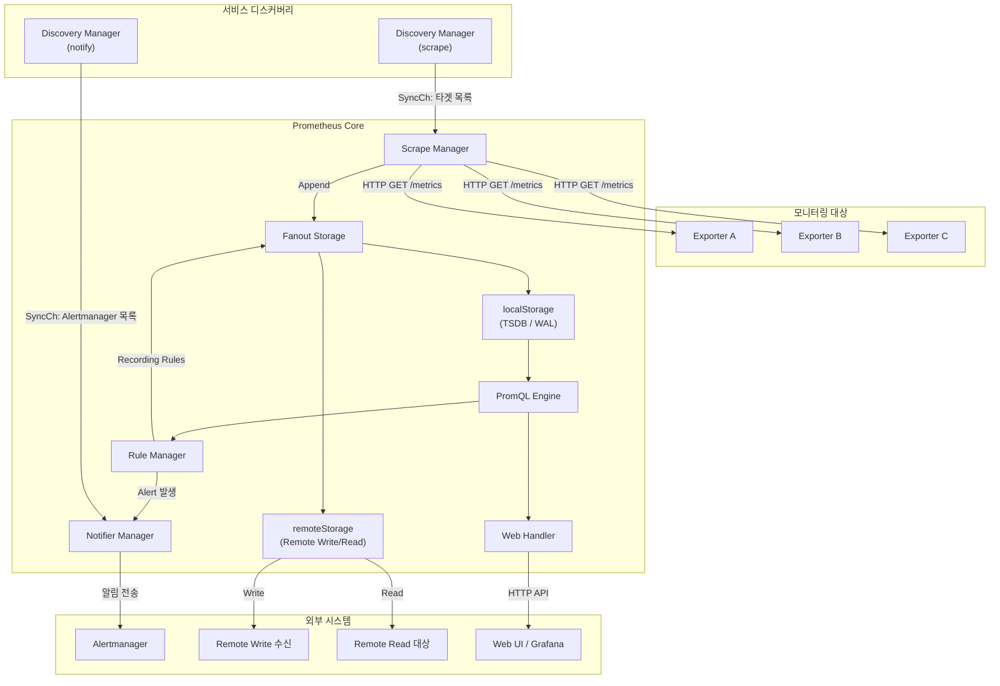
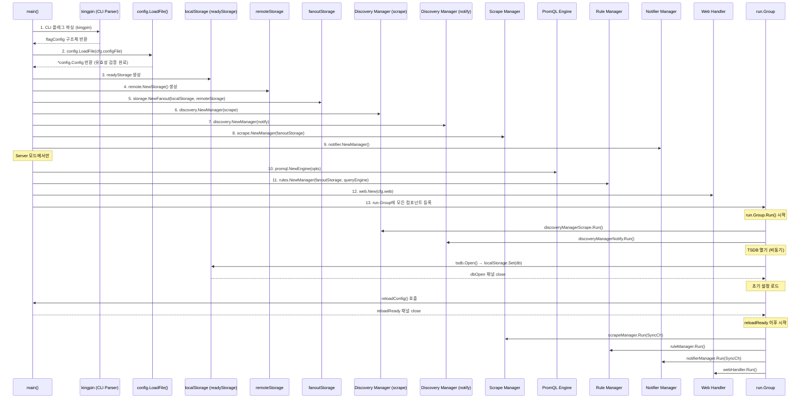
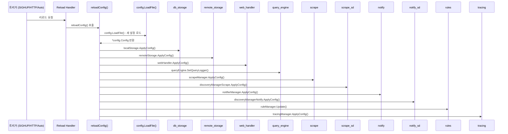

# Prometheus 아키텍처

## 1. 전체 아키텍처 개요

Prometheus는 **풀(Pull) 기반 메트릭 수집 시스템**이다. 모니터링 대상(타겟)에서 HTTP 엔드포인트를 통해 메트릭을 주기적으로 스크레이프(scrape)하고, 수집된 시계열 데이터를 로컬 TSDB(Time Series Database)에 저장하며, PromQL이라는 전용 쿼리 언어로 분석과 알림을 수행한다.

### 핵심 설계 원칙

| 원칙 | 설명 |
|------|------|
| **풀 모델** | 타겟이 메트릭을 푸시하는 것이 아니라 Prometheus가 주기적으로 가져감 |
| **로컬 저장소 우선** | 단일 노드의 TSDB에 저장하여 외부 의존성 최소화 |
| **서비스 디스커버리** | 정적 설정 외에 Kubernetes, Consul, DNS 등 동적 타겟 발견 지원 |
| **다차원 데이터 모델** | 레이블(key=value) 기반의 유연한 시계열 식별 |
| **독립적 운영** | 각 Prometheus 인스턴스가 자체적으로 완결된 모니터링 수행 |

### 데이터 흐름 요약

```
타겟(Exporter) ──HTTP GET──> Scrape Manager ──> TSDB (로컬 저장소)
                                                  │
                                                  ├──> PromQL Engine ──> Web UI / API
                                                  ├──> Rule Manager ──> Recording Rules
                                                  │                  └──> Alert Rules ──> Notifier ──> Alertmanager
                                                  └──> Remote Storage (선택적)
```

---

## 2. 컴포넌트 관계도

### 2.1 전체 컴포넌트 아키텍처 (ASCII)

```
┌─────────────────────────────────────────────────────────────────────────┐
│                        Prometheus Server (main.go)                      │
│                                                                         │
│  ┌──────────────────┐    ┌──────────────────┐    ┌──────────────────┐  │
│  │ Discovery Manager │    │ Discovery Manager │    │  Tracing Manager │  │
│  │    (scrape)       │    │    (notify)       │    │                  │  │
│  └────────┬─────────┘    └────────┬─────────┘    └──────────────────┘  │
│           │ SyncCh()              │ SyncCh()                            │
│           ▼                       ▼                                     │
│  ┌──────────────────┐    ┌──────────────────┐                          │
│  │  Scrape Manager   │    │    Notifier       │                          │
│  │                   │    │   (Manager)       │                          │
│  └────────┬─────────┘    └────────▲─────────┘                          │
│           │ Append                 │ SendAlerts                          │
│           ▼                       │                                     │
│  ┌──────────────────────────────────────────────────────────────┐      │
│  │                    Fanout Storage                             │      │
│  │  ┌──────────────┐          ┌──────────────────┐              │      │
│  │  │  localStorage │ primary  │  remoteStorage    │ secondary   │      │
│  │  │  (TSDB/WAL)   │          │  (Remote Write/   │              │      │
│  │  │               │          │   Remote Read)     │              │      │
│  │  └───────┬───────┘          └──────────────────┘              │      │
│  └──────────┼────────────────────────────────────────────────────┘      │
│             │                                                           │
│             ▼                                                           │
│  ┌──────────────────┐    ┌──────────────────┐                          │
│  │  PromQL Engine    │◄───│   Rule Manager    │                          │
│  │                   │    │  (Recording +     │                          │
│  │                   │    │   Alerting Rules) │                          │
│  └────────┬─────────┘    └──────────────────┘                          │
│           │                                                             │
│           ▼                                                             │
│  ┌──────────────────┐                                                   │
│  │   Web Handler     │  ← HTTP API, UI, /-/reload, /-/healthy          │
│  │  (web.New)        │                                                   │
│  └──────────────────┘                                                   │
│                                                                         │
│  ┌──────────────────┐                                                   │
│  │   run.Group       │  ← 모든 컴포넌트를 goroutine으로 병렬 실행       │
│  └──────────────────┘                                                   │
└─────────────────────────────────────────────────────────────────────────┘
```

### 2.2 데이터 흐름 Mermaid 다이어그램



---

## 3. 초기화 흐름

Prometheus의 초기화 흐름은 `cmd/prometheus/main.go`의 `main()` 함수에서 시작된다. 전체 흐름은 다음과 같은 단계로 진행된다.

### 3.1 초기화 단계 상세



### 3.2 단계별 코드 매핑

#### 1단계: CLI 플래그 파싱 (kingpin)

`cmd/prometheus/main.go`에서 `kingpin` 라이브러리를 사용하여 모든 CLI 플래그를 `flagConfig` 구조체로 파싱한다.

```
// cmd/prometheus/main.go:182-225
type flagConfig struct {
    configFile string
    agentStoragePath            string
    serverStoragePath           string
    notifier                    notifier.Options
    web                         web.Options
    scrape                      scrape.Options
    tsdb                        tsdbOptions
    agent                       agentOptions
    lookbackDelta               model.Duration
    queryTimeout                model.Duration
    queryConcurrency            int
    queryMaxSamples             int
    RemoteFlushDeadline         model.Duration
    enableAutoReload            bool
    autoReloadInterval          model.Duration
    featureList                 []string
    ...
}
```

핵심 플래그:
- `--config.file`: 설정 파일 경로 (기본값: `prometheus.yml`)
- `--storage.tsdb.path`: TSDB 저장 경로 (기본값: `data/`)
- `--web.listen-address`: 웹 서버 주소 (기본값: `0.0.0.0:9090`)
- `--storage.tsdb.retention.time`: 데이터 보존 기간 (기본값: `15d`)
- `--agent`: Agent 모드 활성화 플래그

`setFeatureListOptions()` 메서드로 `--enable-feature` 플래그에 지정된 실험적 기능들을 파싱한다.

#### 2단계: 설정 파일 로드 (config.LoadFile)

```
// config/config.go:124-138
func LoadFile(filename string, agentMode bool, logger *slog.Logger) (*Config, error) {
    content, err := os.ReadFile(filename)
    cfg, err := Load(string(content), logger)
    if agentMode {
        // agent 모드에서 alerting, rule_files 사용 금지
    }
    ...
}
```

`config.Config` 구조체는 Prometheus의 전체 설정을 담는다:

| 필드 | 타입 | 역할 |
|------|------|------|
| `GlobalConfig` | `GlobalConfig` | 글로벌 스크레이프 간격, 평가 간격, 외부 레이블 |
| `ScrapeConfigs` | `[]*ScrapeConfig` | 스크레이프 대상 잡(job) 설정 |
| `AlertingConfig` | `AlertingConfig` | Alertmanager 연결 설정 |
| `RuleFiles` | `[]string` | 알림/레코딩 규칙 파일 경로 |
| `RemoteWriteConfigs` | `[]*RemoteWriteConfig` | Remote Write 대상 설정 |
| `RemoteReadConfigs` | `[]*RemoteReadConfig` | Remote Read 대상 설정 |
| `StorageConfig` | `StorageConfig` | TSDB 설정 (예: Exemplar, OOO 윈도우) |
| `TracingConfig` | `TracingConfig` | 분산 트레이싱 설정 |

#### 3단계: Storage 초기화

Storage 초기화는 3개 레이어로 이루어진다:

```
// cmd/prometheus/main.go:865-869
localStorage  = &readyStorage{stats: tsdb.NewDBStats()}
remoteStorage = remote.NewStorage(logger, reg, localStorage.StartTime, localStoragePath, ...)
fanoutStorage = storage.NewFanout(logger, localStorage, remoteStorage)
```

```
                    ┌─────────────────────┐
                    │   fanoutStorage      │
                    │  (storage.NewFanout) │
                    └──────┬──────┬───────┘
                           │      │
                  primary  │      │ secondary
                           │      │
              ┌────────────▼┐  ┌──▼──────────────┐
              │ localStorage │  │ remoteStorage    │
              │ (readyStorage│  │ (remote.Storage) │
              │  → TSDB/WAL) │  │ → Remote Write   │
              └──────────────┘  │ → Remote Read    │
                                └──────────────────┘
```

`fanoutStorage`의 동작 원리 (`storage/fanout.go:36-51`):
- **쓰기(Write)**: primary(localStorage)와 모든 secondary(remoteStorage)에 동시에 기록
- **읽기(Read)**: primary 쿼리 실패 시 전체 실패, secondary 쿼리 실패 시 경고만 반환하고 계속 진행
- remote storage는 항상 secondary/best effort로 취급

#### 4단계: 컴포넌트 생성 순서

```
// cmd/prometheus/main.go:876-1018 (핵심 부분 요약)

// 1) Notifier Manager
notifierManager = notifier.NewManager(&cfg.notifier, ...)

// 2) Discovery Managers (두 개)
discoveryManagerScrape = discovery.NewManager(ctxScrape, ..., discovery.Name("scrape"))
discoveryManagerNotify = discovery.NewManager(ctxNotify, ..., discovery.Name("notify"))

// 3) Scrape Manager
scrapeManager, _ = scrape.NewManager(&cfg.scrape, ..., fanoutStorage, ...)

// 4) PromQL Engine (서버 모드 전용)
queryEngine = promql.NewEngine(opts)

// 5) Rule Manager (서버 모드 전용)
ruleManager = rules.NewManager(&rules.ManagerOptions{
    Appendable:  fanoutStorage,       // 레코딩 규칙 결과 저장
    Queryable:   localStorage,        // 규칙 평가 시 로컬 데이터 쿼리
    QueryFunc:   rules.EngineQueryFunc(queryEngine, fanoutStorage),
    NotifyFunc:  rules.SendAlerts(notifierManager, ...),
    ...
})

// 6) Web Handler
webHandler = web.New(logger, &cfg.web)
```

#### 5단계: run.Group 병렬 실행

`oklog/run.Group`은 여러 고루틴을 묶어서 **하나라도 종료되면 전체를 종료**하는 패턴을 제공한다. 각 컴포넌트는 `g.Add(execute, interrupt)` 형태로 등록된다.

```
// cmd/prometheus/main.go:1155 이후
var g run.Group

// 등록 순서:
g.Add(termination handler)        // OS 시그널 처리
g.Add(discoveryManagerScrape.Run) // 스크레이프 디스커버리
g.Add(discoveryManagerNotify.Run) // 알림 디스커버리
g.Add(ruleManager.Run)            // 규칙 매니저 (reloadReady 대기)
g.Add(scrapeManager.Run)          // 스크레이프 매니저 (reloadReady 대기)
g.Add(tracingManager.Run)         // 트레이싱 매니저 (reloadReady 대기)
g.Add(reload handler)             // SIGHUP / HTTP reload 처리
g.Add(initial config loading)     // 초기 설정 로드 → reloadReady close
g.Add(TSDB open)                  // TSDB/WAL 열기 → dbOpen close
g.Add(webHandler.Run)             // 웹 서버
g.Add(notifierManager.Run)        // 알림 매니저 (reloadReady 대기)
```

### 3.3 동기화 메커니즘: dbOpen과 reloadReady

초기화 과정에서 두 개의 채널이 컴포넌트 간 동기화를 조율한다:

```
dbOpen 채널                          reloadReady 채널
    │                                     │
    │  TSDB/WAL 열기 완료                 │  초기 설정 로드 완료
    │  → close(dbOpen)                    │  → reloadReady.Close()
    │                                     │
    ▼                                     ▼
초기 설정 로드 시작               다음 컴포넌트들 실행 시작:
(reloadConfig 호출)              - scrapeManager.Run()
    │                            - ruleManager.Run()
    │                            - notifierManager.Run()
    └──완료 후──────────────────>- tracingManager.Run()
                                 - reload handler
```

**왜 이런 구조인가?**
- TSDB가 완전히 열려야 데이터를 저장할 수 있으므로, `dbOpen`이 먼저 완료되어야 한다
- 설정이 로드되어야 Scrape Manager가 어떤 타겟을 스크레이프할지 알 수 있으므로, `reloadReady`를 대기한다
- Discovery Manager는 설정 로드와 독립적으로 먼저 시작할 수 있다 (채널 대기 없음)

### 3.4 초기화 흐름 타임라인

```
시간 ────────────────────────────────────────────────────────────────>

[main() 시작]
  │
  ├─ CLI 파싱 (kingpin)
  ├─ config.LoadFile() - 설정 유효성 검증
  ├─ 컴포넌트 생성 (localStorage, remoteStorage, fanoutStorage, ...)
  │
  ├─ g.Run() 시작 ─────────────────────────────────────────────────>
  │    │
  │    ├─ Discovery Manager (scrape) ─── Run() 즉시 시작 ──────────>
  │    ├─ Discovery Manager (notify) ─── Run() 즉시 시작 ──────────>
  │    ├─ Web Handler ─── Run() 즉시 시작 (Ready=false) ───────────>
  │    │
  │    ├─ TSDB Open ─── 비동기 시작...
  │    │         │
  │    │         └── 완료 → close(dbOpen)
  │    │                        │
  │    ├─ Initial Config Load ──┤ reloadConfig() 호출
  │    │                        │
  │    │                        └── 완료 → reloadReady.Close()
  │    │                                        │
  │    │                                        ├── webHandler.SetReady(Ready)
  │    │                                        │
  │    ├─ Scrape Manager ── <reloadReady> ──────┤── Run(SyncCh) ───>
  │    ├─ Rule Manager ──── <reloadReady> ──────┤── Run() ─────────>
  │    ├─ Notifier ──────── <reloadReady> ──────┤── Run(SyncCh) ───>
  │    ├─ Tracing Manager ─ <reloadReady> ──────┤── Run() ─────────>
  │    └─ Reload Handler ── <reloadReady> ──────┘── Loop 시작 ─────>
```

---

## 4. 실행 모드: Server vs Agent

Prometheus는 두 가지 모드로 실행할 수 있다: **Server 모드**(기본)와 **Agent 모드**(`--agent` 플래그).

### 4.1 모드 비교

| 기능 | Server 모드 | Agent 모드 |
|------|------------|-----------|
| **저장소** | TSDB (전체 블록 + WAL) | WAL만 사용 (`agent.Open()`) |
| **저장 경로** | `--storage.tsdb.path` (기본: `data/`) | `--storage.agent.path` (기본: `data-agent/`) |
| **데이터 보존** | 시간/크기 기반 retention | WAL truncation 기반 |
| **PromQL 쿼리** | 지원 (PromQL Engine 생성) | 비활성 (queryEngine = nil) |
| **Rule 평가** | 지원 (Rule Manager 생성) | 비활성 (ruleManager = nil) |
| **Alert 규칙** | 지원 | 설정 파일에 alerting 섹션 금지 |
| **Remote Write** | 지원 | 지원 (주 사용 목적) |
| **Remote Read** | 지원 | 비활성 |
| **Web UI** | 전체 UI | 제한된 UI |
| **스크레이프** | 지원 | 지원 |

### 4.2 Agent 모드의 설계 의도

Agent 모드는 **메트릭을 수집하여 Remote Write로 중앙 저장소에 전달하는 것**에 특화된 경량 모드이다. 로컬 TSDB 대신 WAL(Write-Ahead Log)만 사용하여 디스크 사용량과 메모리 소비를 줄인다.

```
Agent 모드 데이터 흐름:

타겟 ──HTTP──> Scrape Manager ──> WAL Storage ──> Remote Write ──> 중앙 Prometheus/Thanos/Cortex
                                   (agent.DB)
```

### 4.3 코드에서의 모드 분기

`cmd/prometheus/main.go`에서 `agentMode` 전역 변수로 분기한다:

```
// main.go:606
a.Flag("agent", "Run Prometheus in 'Agent mode'.").BoolVar(&agentMode)

// main.go:932 - Server 모드 전용 컴포넌트
if !agentMode {
    queryEngine = promql.NewEngine(opts)
    ruleManager = rules.NewManager(...)
}

// main.go:1379-1440 - TSDB 열기 (Server 모드)
if !agentMode {
    db, err := openDBWithMetrics(localStoragePath, ...)  // tsdb.Open()
    localStorage.Set(db, startTimeMargin)
}

// main.go:1441-1498 - WAL 열기 (Agent 모드)
if agentMode {
    db, err := agent.Open(logger, reg, remoteStorage, localStoragePath, &opts)
    localStorage.Set(db, 0)
}
```

Agent 모드에서 설정 파일 유효성 검증도 다르다 (`config/config.go:134-138`):
- `alerting` 섹션 금지
- `rule_files` 금지
- `remote_read` 금지

---

## 5. 설정 리로드 메커니즘

Prometheus는 세 가지 방법으로 설정을 리로드할 수 있다.

### 5.1 리로드 트리거 방법

| 방법 | 설명 | 조건 |
|------|------|------|
| **SIGHUP** | `kill -HUP <pid>` 시그널 전송 | 항상 가능 |
| **HTTP POST** | `POST /-/reload` 엔드포인트 호출 | `--web.enable-lifecycle` 플래그 필요 |
| **자동 리로드** | 설정 파일 체크섬 변경 감지 | `--enable-feature=auto-reload-config` 필요 |

### 5.2 리로드 흐름



### 5.3 reloadConfig 함수

```
// cmd/prometheus/main.go:1604-1645 (핵심 부분)
func reloadConfig(filename string, ..., rls ...reloader) (err error) {
    // 1. 새 설정 파일 로드
    conf, err := config.LoadFile(filename, agentMode, logger)

    // 2. 각 reloader를 순차 실행
    for _, rl := range rls {
        if err := rl.reloader(conf); err != nil {
            failed = true
        }
    }

    // 3. 메트릭 업데이트
    configSuccess.Set(1)  // 또는 0 (실패 시)
    configSuccessTime.SetToCurrentTime()
}
```

### 5.4 리로더 실행 순서

리로더는 **등록된 순서대로** 실행된다. 순서가 중요한 이유가 있다:

```
// cmd/prometheus/main.go:1028-1118
reloaders := []reloader{
    1. db_storage        // localStorage 설정 적용
    2. remote_storage    // remoteStorage 설정 적용
    3. web_handler       // 웹 핸들러 설정 적용
    4. query_engine      // 쿼리 로그 설정
    5. scrape            // Scrape Manager에 설정 적용 (SD보다 먼저)
    6. scrape_sd         // Scrape Discovery에 타겟 목록 전달
    7. notify            // Notifier에 설정 적용 (SD보다 먼저)
    8. notify_sd         // Notify Discovery에 Alertmanager 목록 전달
    9. rules             // Rule Manager에 규칙 파일 업데이트
    10. tracing           // 트레이싱 설정 적용
}
```

**왜 Scrape/Notifier가 SD보다 먼저인가?**
주석에 명시되어 있다: "The Scrape and notifier managers need to reload before the Discovery manager as they need to read the most updated config when receiving the new targets list." 즉, Discovery Manager가 새 타겟 목록을 전달할 때 Scrape/Notifier가 이미 최신 설정을 갖고 있어야 한다.

### 5.5 자동 리로드 (Auto Reload)

자동 리로드는 `--enable-feature=auto-reload-config` 플래그로 활성화하며, 설정 파일의 체크섬을 주기적으로 비교한다.

```
// cmd/prometheus/main.go:1317-1334
case <-time.Tick(time.Duration(cfg.autoReloadInterval)):
    if !cfg.enableAutoReload {
        continue
    }
    currentChecksum, err := config.GenerateChecksum(cfg.configFile)
    if currentChecksum == checksum {
        continue  // 변경 없음
    }
    // 체크섬이 다르면 리로드 수행
    reloadConfig(cfg.configFile, ...)
```

기본 체크 간격은 `--config.auto-reload-interval` 플래그로 설정 (기본값: 30초, 최소값: 1초).

---

## 6. 컴포넌트별 역할

### 6.1 컴포넌트 요약 표

| 컴포넌트 | 소스 경로 | 핵심 구조체 | 역할 |
|----------|----------|------------|------|
| **Discovery Manager** | `discovery/manager.go` | `discovery.Manager` | 서비스 디스커버리 실행, 타겟 목록을 SyncCh()로 전달 |
| **Scrape Manager** | `scrape/manager.go` | `scrape.Manager` | 타겟별 스크레이프 루프 관리, 메트릭 수집 후 Storage에 Append |
| **TSDB** | `tsdb/db.go` | `tsdb.DB` | 시계열 데이터 저장소, WAL + Block 기반 |
| **Agent WAL** | `tsdb/agent/db.go` | `agent.DB` | Agent 모드 WAL 전용 저장소 |
| **Fanout Storage** | `storage/fanout.go` | `fanout` | primary + secondary 저장소 팬아웃 |
| **Remote Storage** | `storage/remote/` | `remote.Storage` | Remote Write/Read 처리 |
| **PromQL Engine** | `promql/engine.go` | `promql.Engine` | PromQL 쿼리 파싱 및 실행 |
| **Rule Manager** | `rules/manager.go` | `rules.Manager` | Recording/Alerting 규칙 평가 |
| **Notifier** | `notifier/notifier.go` | `notifier.Manager` | Alertmanager로 알림 전송 |
| **Web Handler** | `web/web.go` | `web.Handler` | HTTP API, Web UI, 관리 엔드포인트 |
| **Tracing Manager** | `tracing/tracing.go` | `tracing.Manager` | OpenTelemetry 트레이싱 |

### 6.2 Discovery Manager

두 개의 독립적인 Discovery Manager가 존재한다:

| 인스턴스 | 용도 | 소비자 |
|----------|------|--------|
| `discoveryManagerScrape` | 스크레이프 타겟 발견 | Scrape Manager |
| `discoveryManagerNotify` | Alertmanager 인스턴스 발견 | Notifier Manager |

각 Discovery Manager는:
1. 설정에 정의된 SD 메커니즘(Kubernetes, Consul, DNS, static 등)을 실행
2. 발견된 타겟을 `targetgroup.Group`으로 그룹화
3. `SyncCh()` 채널을 통해 소비자에게 전달

```
// discovery/manager.go에서 Provider 구조체
type Provider struct {
    name   string
    d      Discoverer        // SD 메커니즘 인터페이스
    config any
    cancel context.CancelFunc
    subs   map[string]struct{} // 구독자 목록
}
```

### 6.3 Scrape Manager

Scrape Manager는 타겟별로 독립적인 스크레이프 루프를 관리한다:

```
// scrape/manager.go:51-58
func NewManager(
    o *Options,
    logger *slog.Logger,
    newScrapeFailureLogger func(string) (*logging.JSONFileLogger, error),
    appendable storage.Appendable,       // 또는 AppendableV2
    appendableV2 storage.AppendableV2,
    registerer prometheus.Registerer,
) (*Manager, error)
```

핵심 동작:
- Discovery Manager로부터 `SyncCh()`를 통해 타겟 목록 수신
- 각 `scrape_config` 잡(job)마다 `scrapePool` 생성
- 각 타겟마다 `scrapeLoop`이 주기적으로 HTTP GET `/metrics` 호출
- 수집된 메트릭을 `fanoutStorage`에 `Append()`

### 6.4 TSDB

TSDB는 Prometheus의 핵심 저장 엔진이다:

```
// tsdb/db.go
func Open(dir string, l *slog.Logger, r prometheus.Registerer,
    opts *Options, stats *DBStats) (db *DB, err error)
```

저장 구조:
```
data/
├── chunks_head/        # Head 블록의 메모리 매핑된 청크
├── wal/                # Write-Ahead Log
├── 01BKGV7JBM69T2.../ # 압축된 블록 (시간 범위별)
│   ├── chunks/
│   ├── index
│   ├── meta.json
│   └── tombstones
└── lock                # 잠금 파일
```

### 6.5 PromQL Engine

PromQL Engine은 쿼리 파싱, 계획, 실행을 담당한다:

```
// promql/engine.go
func NewEngine(opts EngineOpts) *Engine

type EngineOpts struct {
    Logger                   *slog.Logger
    Reg                      prometheus.Registerer
    MaxSamples               int           // 쿼리당 최대 샘플 수 (기본: 50,000,000)
    Timeout                  time.Duration // 쿼리 타임아웃 (기본: 2m)
    ActiveQueryTracker       QueryTracker  // 동시 쿼리 추적
    LookbackDelta            time.Duration // lookback 기간 (기본: 5m)
    EnablePerStepStats       bool          // 단계별 통계
    EnableDelayedNameRemoval bool          // 지연된 이름 제거
    ...
}
```

### 6.6 Rule Manager

Rule Manager는 두 종류의 규칙을 주기적으로 평가한다:

| 규칙 유형 | 역할 | 출력 |
|-----------|------|------|
| **Recording Rule** | PromQL 표현식을 미리 계산하여 새 시계열 생성 | fanoutStorage에 Append |
| **Alerting Rule** | 조건을 평가하여 알림 생성 | Notifier Manager로 전달 |

```
// rules/manager.go
ruleManager = rules.NewManager(&rules.ManagerOptions{
    Appendable:  fanoutStorage,        // 레코딩 규칙 결과 저장
    Queryable:   localStorage,         // 로컬 데이터만 쿼리 (remote 제외)
    QueryFunc:   rules.EngineQueryFunc(queryEngine, fanoutStorage),
    NotifyFunc:  rules.SendAlerts(notifierManager, ...),
    ...
})
```

**왜 Queryable이 localStorage인가?** Rule 평가 시 remote storage의 지연/장애가 알림에 영향을 주지 않도록, 로컬 데이터만 사용한다. 반면 Appendable은 fanoutStorage를 사용하여 결과가 remote에도 전파되도록 한다.

### 6.7 Notifier Manager

Notifier Manager는 알림을 Alertmanager 인스턴스로 전달한다:

```
// notifier/notifier.go:90
func NewManager(o *Options, nameValidationScheme model.ValidationScheme,
    logger *slog.Logger) *Manager
```

핵심 옵션:
- `QueueCapacity`: 대기 알림 큐 크기 (기본: 10000)
- `MaxBatchSize`: 배치당 최대 알림 수
- `DrainOnShutdown`: 종료 시 미전송 알림 처리 여부 (기본: true)

### 6.8 Web Handler

Web Handler는 Prometheus의 HTTP 인터페이스를 제공한다:

```
// web/web.go:318
func New(logger *slog.Logger, o *Options) *Handler
```

주요 엔드포인트:

| 경로 | 역할 |
|------|------|
| `/api/v1/*` | PromQL 쿼리, 메타데이터, 타겟 정보 등 REST API |
| `/graph` | Web UI (쿼리 인터페이스) |
| `/targets` | 스크레이프 타겟 상태 |
| `/rules` | 규칙 상태 |
| `/alerts` | 활성 알림 |
| `/-/ready` | readiness 프로브 |
| `/-/healthy` | liveness 프로브 |
| `/-/reload` | 설정 리로드 (`--web.enable-lifecycle` 필요) |
| `/-/quit` | 종료 (`--web.enable-lifecycle` 필요) |
| `/api/v1/write` | Remote Write 수신 (`--web.enable-remote-write-receiver` 필요) |
| `/api/v1/otlp/*` | OTLP 수신 (`--web.enable-otlp-receiver` 필요) |
| `/metrics` | Prometheus 자체 메트릭 |

---

## 7. 종료 흐름

`run.Group`의 특성으로 인해, **하나의 컴포넌트가 종료(또는 에러)되면 다른 모든 컴포넌트의 interrupt 함수가 호출된다**.

### 종료 순서

```
1. OS Signal (SIGTERM/SIGINT) 수신 또는 /-/quit 호출
2. reloadReady.Close() → 대기 중인 컴포넌트 해제
3. webHandler.SetReady(Stopping) → readiness 프로브 실패
4. run.Group이 모든 interrupt 함수 호출:
   ├─ cancelScrape()            → Discovery Manager (scrape) 종료
   ├─ cancelNotify()            → Discovery Manager (notify) 종료
   ├─ ruleManager.Stop()        → Rule Manager 종료
   ├─ scrapeManager.Stop()      → Scrape Manager 종료 (TSDB 닫기 전에 반드시)
   ├─ tracingManager.Stop()     → Tracing Manager 종료
   ├─ cancel reload handler     → Reload 루프 종료
   ├─ fanoutStorage.Close()     → Storage 종료 (TSDB + Remote)
   ├─ cancelWeb()               → Web Handler 종료
   └─ notifierManager.Stop()    → Notifier 종료 (ruleManager 이후)
```

**왜 Scrape Manager가 TSDB보다 먼저 종료되어야 하는가?**
`cmd/prometheus/main.go:1240-1243`의 주석에 명시: "Scrape manager needs to be stopped before closing the local TSDB so that it doesn't try to write samples to a closed storage."

**왜 Notifier가 Rule Manager보다 나중에 종료되어야 하는가?**
`cmd/prometheus/main.go:1519-1520`의 주석에 명시: "Calling notifier.Stop() before ruleManager.Stop() will cause a panic if the ruleManager isn't running."

---

## 8. Feature Flags

Prometheus는 실험적 기능을 `--enable-feature` 플래그로 관리한다:

| 플래그 | 기능 |
|--------|------|
| `exemplar-storage` | 인메모리 Exemplar 저장소 활성화 |
| `memory-snapshot-on-shutdown` | 종료 시 메모리 스냅샷 저장 |
| `metadata-wal-records` | WAL에 메타데이터 레코드 기록 |
| `promql-per-step-stats` | PromQL 단계별 통계 |
| `auto-reload-config` | 설정 파일 자동 리로드 |
| `concurrent-rule-eval` | 규칙 동시 평가 |
| `created-timestamp-zero-ingestion` | Start Timestamp Zero 수집 |
| `delayed-compaction` | 지연 컴팩션 |
| `old-ui` | 이전 버전 UI 사용 |
| `otlp-deltatocumulative` | OTLP Delta → Cumulative 변환 |
| `native-histograms` | (no-op, 스크레이프 설정으로 이동) |

---

## 9. 소스코드 디렉토리 매핑

```
prometheus/
├── cmd/prometheus/main.go    # 진입점, 초기화, run.Group
├── config/config.go          # 설정 파일 파싱, Config 구조체
├── scrape/manager.go         # Scrape Manager
├── discovery/manager.go      # Discovery Manager
├── tsdb/db.go                # TSDB 저장 엔진
├── tsdb/agent/db.go          # Agent 모드 WAL 저장소
├── promql/engine.go          # PromQL 쿼리 엔진
├── rules/manager.go          # Rule Manager (Recording + Alerting)
├── notifier/notifier.go      # Notifier Manager (→ Alertmanager)
├── web/web.go                # Web Handler (HTTP API + UI)
├── storage/fanout.go         # Fanout Storage (primary + secondary)
├── storage/remote/           # Remote Write/Read 구현
├── model/                    # 데이터 모델 (labels, exemplar, histogram 등)
├── template/                 # 알림 템플릿
├── tracing/                  # OpenTelemetry 트레이싱
└── util/                     # 유틸리티 (compression, features, logging 등)
```

---

## 10. 요약

Prometheus의 아키텍처는 **독립적인 컴포넌트들이 채널과 인터페이스를 통해 느슨하게 연결된 구조**이다.

핵심 설계 특징:
1. **run.Group 패턴**: 모든 컴포넌트가 병렬 실행되며, 하나의 실패가 전체 종료를 유발하여 일관된 상태를 보장
2. **Fanout Storage 추상화**: 로컬(TSDB)과 원격(Remote) 저장소를 하나의 인터페이스로 추상화
3. **이중 Discovery Manager**: 스크레이프 타겟과 Alertmanager 발견을 독립적으로 수행
4. **채널 기반 동기화**: `dbOpen`과 `reloadReady` 채널로 초기화 순서를 보장
5. **Server/Agent 이중 모드**: 동일한 코드베이스에서 전체 기능과 경량 포워더를 모두 지원
6. **설정 핫 리로드**: 무중단 설정 변경을 위한 다중 리로드 메커니즘
