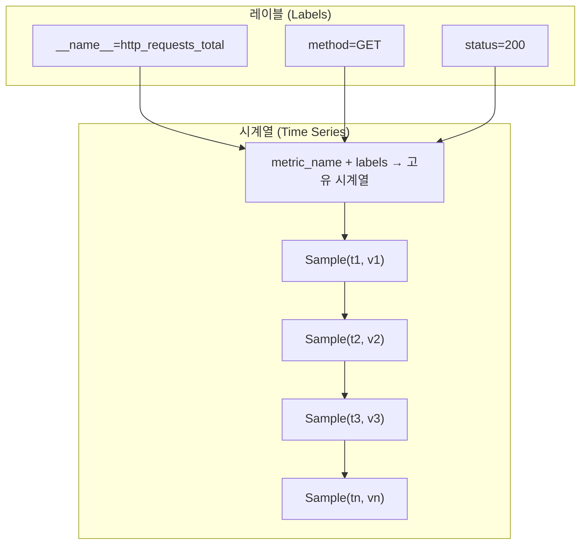
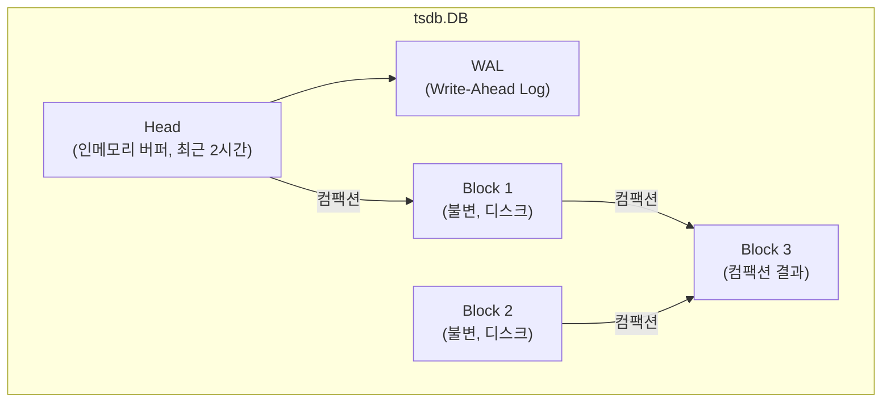
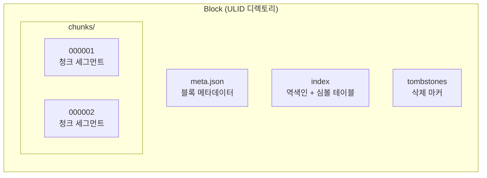
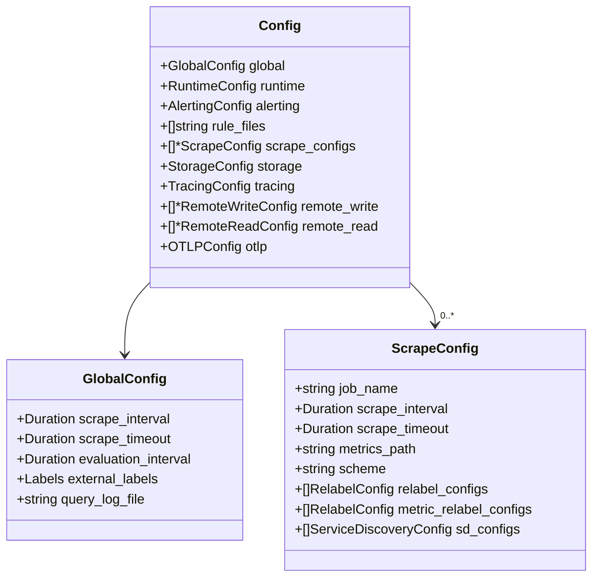
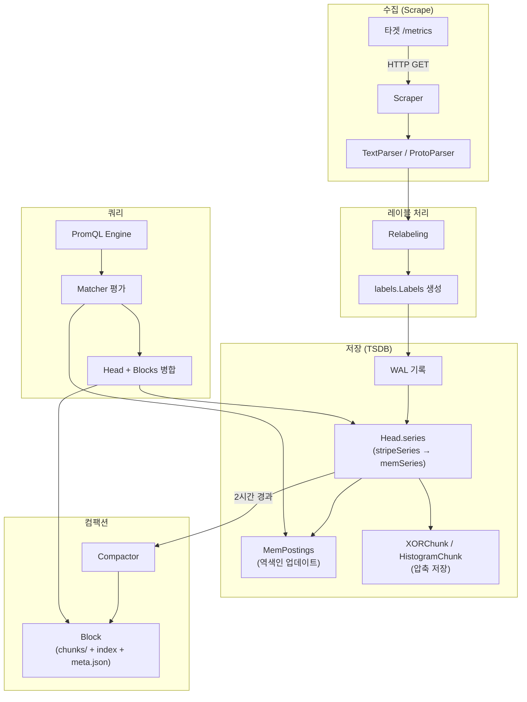

# Prometheus 데이터 모델 심층 분석

## 목차

1. [시계열 데이터 모델 개요](#1-시계열-데이터-모델-개요)
2. [레이블 시스템](#2-레이블-시스템)
3. [레이블 내부 구현](#3-레이블-내부-구현)
4. [레이블 매처](#4-레이블-매처)
5. [TSDB 저장소 구조](#5-tsdb-저장소-구조)
6. [Head (인메모리 버퍼)](#6-head-인메모리-버퍼)
7. [memSeries와 stripeSeries](#7-memseries와-stripeseries)
8. [Block (디스크 블록)](#8-block-디스크-블록)
9. [Chunk 인코딩](#9-chunk-인코딩)
10. [인덱스 구조](#10-인덱스-구조)
11. [WAL 레코드 타입](#11-wal-레코드-타입)
12. [설정 모델](#12-설정-모델)
13. [메트릭 타입](#13-메트릭-타입)
14. [전체 데이터 흐름 요약](#14-전체-데이터-흐름-요약)

---

## 1. 시계열 데이터 모델 개요

Prometheus의 모든 데이터는 **시계열(time series)** 로 표현된다. 하나의 시계열은 고유한 메트릭 이름과 레이블 조합으로 식별되며, 시간 순서로 정렬된 샘플의 연속이다.

### 시계열 식별 공식

```
시계열 = metric_name + {label_name=label_value, ...}
```

예시:
```
http_requests_total{method="GET", handler="/api/v1/query", status="200"}
```

### Sample 구조

각 샘플은 두 가지 값으로 구성된다:

| 필드 | 타입 | 설명 |
|------|------|------|
| Timestamp | `int64` | Unix 밀리초 타임스탬프 |
| Value | `float64` | 64비트 부동소수점 값 |

```
Sample = (timestamp_ms int64, value float64)
```

### 시계열 데이터 모델 다이어그램



**핵심 원칙:**
- `__name__` 레이블은 메트릭 이름을 나타내는 특수 레이블이다
- 동일한 레이블 집합은 정확히 하나의 시계열을 식별한다
- 레이블이 하나라도 다르면 완전히 다른 시계열이 된다
- 샘플은 항상 시간 순서대로 추가되어야 한다 (Out-of-Order 지원 제외)

---

## 2. 레이블 시스템

레이블은 Prometheus 데이터 모델의 핵심이다. 모든 시계열의 식별, 쿼리, 필터링이 레이블을 통해 이루어진다.

### Label 구조체

> 소스: `model/labels/labels_common.go`

```go
// Label is a key/value a pair of strings.
type Label struct {
    Name, Value string
}
```

### 특수 레이블 상수

| 상수 | 값 | 용도 |
|------|------|------|
| `MetricName` | `__name__` | 메트릭 이름 (스크래핑 시 자동 설정) |
| `AlertName` | `alertname` | 알림 규칙 이름 |
| `BucketLabel` | `le` | 히스토그램 버킷 경계값 |

> 소스에서 발견된 내부 구분자:

| 상수 | 값 | 용도 |
|------|------|------|
| `labelSep` | `0xFE` | `Bytes()` 반환값 시작 |
| `sep` | `0xFF` | `Bytes()`, `Hash()` 내부에서 레이블 간 구분 |

### Labels 정렬 규칙

Labels는 **항상 Name 기준으로 알파벳 순서로 정렬**된다. 이 불변 조건은 모든 구현에서 보장되며, 비교 및 해싱의 정확성을 담보한다.

```
{__name__="http_requests_total", handler="/api", method="GET", status="200"}
  ↑ __name__가 먼저, handler, method, status 순서
```

---

## 3. 레이블 내부 구현

Prometheus는 세 가지 Labels 구현을 빌드 태그로 선택할 수 있다.

### 3.1 stringlabels (기본 구현)

> 소스: `model/labels/labels_stringlabels.go`

```go
//go:build !slicelabels && !dedupelabels

const ImplementationName = "stringlabels"

// Labels is implemented by a single flat string holding name/value pairs.
// Each name and value is preceded by its length, encoded as a single byte
// for size 0-254, or the following 3 bytes little-endian, if the first byte is 255.
// Maximum length allowed is 2^24 or 16MB.
// Names are in order.
type Labels struct {
    data string
}
```

**인코딩 방식:**
- 모든 name/value 쌍이 하나의 연속된 문자열로 팩킹된다
- 각 문자열 앞에 길이가 인코딩된다: 0~254는 1바이트, 255 이상은 3바이트 little-endian
- Go의 `string`은 불변이므로 안전하게 공유할 수 있다

```
+---+----------+---+--------+---+--------+---+-----+
|len|  name1   |len| value1 |len| name2  |len|val2 |
+---+----------+---+--------+---+--------+---+-----+
     "__name__"     "http_req"   "method"     "GET"
```

**해싱:**

```go
func (ls Labels) Hash() uint64 {
    return xxhash.Sum64(yoloBytes(ls.data))
}
```

xxhash를 사용하여 전체 data 문자열을 해싱한다. `yoloBytes`는 메모리 복사 없이 string을 []byte로 변환하는 unsafe 연산이다.

### 3.2 dedupelabels (중복 제거 구현)

> 소스: `model/labels/labels_dedupelabels.go`

```go
//go:build dedupelabels

const ImplementationName = "dedupelabels"

type Labels struct {
    syms *nameTable
    data string
}
```

**SymbolTable:**

```go
type SymbolTable struct {
    mx      sync.Mutex
    *nameTable
    nextNum int
    byName  map[string]int
}

type nameTable struct {
    byNum       []string
    symbolTable *SymbolTable
}
```

| 메서드 | 설명 |
|--------|------|
| `ToNum(name string) int` | 문자열 → 정수 매핑 (없으면 새로 추가) |
| `checkNum(name string) (int, bool)` | 문자열 존재 여부 확인 |
| `Len() int` | 등록된 심볼 수 |

**동작 원리:**
1. 모든 레이블 문자열(이름과 값)을 정수로 매핑
2. Labels.data에는 varint로 인코딩된 정수 시퀀스가 저장됨
3. 동일한 문자열이 여러 시계열에서 반복되면 정수 하나로 공유됨
4. 메모리 사용량이 크게 줄어듦 (특히 시계열 수가 많을 때)

```
SymbolTable:
  "method" → 0    "__name__" → 1    "GET" → 2    "POST" → 3
  "http_requests_total" → 4

Labels.data (varint 인코딩):
  [1, 4, 0, 2]  → __name__=http_requests_total, method=GET
  [1, 4, 0, 3]  → __name__=http_requests_total, method=POST
```

### 3.3 slicelabels (슬라이스 구현)

> 소스: `model/labels/labels_slicelabels.go`

슬라이스 기반의 단순한 구현으로 `[]Label` 배열을 직접 사용한다.

```go
type Labels []Label
```

### Labels 구현 비교

| 구현 | 메모리 효율 | 생성 비용 | 비교 비용 | 빌드 태그 |
|------|------------|----------|----------|----------|
| stringlabels | 높음 (단일 문자열) | 중간 | 빠름 (문자열 비교) | 기본값 |
| dedupelabels | 매우 높음 (심볼 테이블) | 높음 | 빠름 | `dedupelabels` |
| slicelabels | 낮음 (슬라이스 오버헤드) | 낮음 | 중간 | `slicelabels` |

### Builder와 ScratchBuilder

> 소스: `model/labels/labels_stringlabels.go`

```go
type Builder struct {
    base Labels
    del  []string
    add  []Label
}
```

Builder는 기존 Labels를 기반으로 레이블을 추가/삭제하는 빌더 패턴이다.

| 메서드 | 설명 |
|--------|------|
| `Reset(base Labels)` | 기존 레이블 기반으로 초기화 |
| `Set(n, v string)` | 레이블 추가/변경 |
| `Del(ns ...string)` | 레이블 삭제 |
| `Keep(ns ...string)` | 지정된 레이블만 유지 |
| `Labels() Labels` | 최종 Labels 생성 |

```go
type ScratchBuilder struct {
    add             []Label
    output          Labels
    overwriteBuffer []byte
}
```

ScratchBuilder는 새 Labels를 처음부터 만드는 경량 빌더이다. 할당을 최소화하기 위해 내부 버퍼를 재사용한다.

---

## 4. 레이블 매처

> 소스: `model/labels/matcher.go`

PromQL 쿼리에서 시계열을 필터링할 때 사용되는 매처 구조체이다.

```go
type MatchType int

const (
    MatchEqual     MatchType = iota  // =
    MatchNotEqual                     // !=
    MatchRegexp                       // =~
    MatchNotRegexp                    // !~
)

type Matcher struct {
    Type  MatchType
    Name  string
    Value string
    re    *FastRegexMatcher  // 정규식 매처 (Type이 =~ 또는 !~ 일 때만 초기화)
}
```

### 매처 타입 테이블

| 타입 | 기호 | 설명 | 예시 |
|------|------|------|------|
| `MatchEqual` | `=` | 정확한 값 일치 | `method="GET"` |
| `MatchNotEqual` | `!=` | 값 불일치 | `status!="500"` |
| `MatchRegexp` | `=~` | 정규식 일치 | `method=~"GET\|POST"` |
| `MatchNotRegexp` | `!~` | 정규식 불일치 | `handler!~"/admin.*"` |

**FastRegexMatcher:**
정규식 매처는 `regexp.go`에서 최적화된 구현을 제공한다. 단순한 패턴(리터럴, 접두사, 접미사)은 정규식 엔진을 우회하고 문자열 비교로 처리한다.

---

## 5. TSDB 저장소 구조

> 소스: `tsdb/db.go`

Prometheus TSDB는 시계열 데이터를 효율적으로 저장하고 쿼리하기 위한 커스텀 시계열 데이터베이스이다.

### DB 구조체

```go
type DB struct {
    dir    string
    locker *tsdbutil.DirLocker

    logger   *slog.Logger
    metrics  *dbMetrics
    opts     *Options
    chunkPool chunkenc.Pool
    compactor Compactor

    mtx    sync.RWMutex
    blocks []*Block                        // 불변 디스크 블록들

    lastGarbageCollectedMmapRef chunks.ChunkDiskMapperRef

    head *Head                             // 인메모리 활성 버퍼

    compactc chan struct{}                  // 컴팩션 트리거 채널
    donec    chan struct{}                  // 종료 완료 채널
    stopc    chan struct{}                  // 종료 신호 채널

    cmtx           sync.Mutex              // 컴팩션/삭제 동시 실행 방지
    autoCompactMtx sync.Mutex
    autoCompact    bool
}
```

### TSDB 전체 구조 다이어그램



### DB Options 주요 설정

> 소스: `tsdb/db.go`, `DefaultOptions()`

| 옵션 | 기본값 | 설명 |
|------|--------|------|
| `WALSegmentSize` | 128MB | WAL 세그먼트 파일 크기 |
| `RetentionDuration` | 15일 | 데이터 보존 기간 (밀리초) |
| `MinBlockDuration` | 2시간 | 최소 블록 시간 범위 (밀리초) |
| `MaxBlockDuration` | 2시간 | 최대 블록 시간 범위 (밀리초) |
| `StripeSize` | 16384 | stripeSeries 해시맵 크기 |
| `SamplesPerChunk` | 120 | 청크당 목표 샘플 수 |
| `MaxBlockChunkSegmentSize` | 512MB | 청크 세그먼트 파일 최대 크기 |
| `EnableOverlappingCompaction` | true | 겹치는 블록 컴팩션 허용 |

### 디스크 레이아웃

```
data/
├── 01BKGV7JBM69T2G1BGBGM6KB12/   # Block ULID
│   ├── chunks/
│   │   └── 000001                  # 청크 데이터 파일
│   ├── index                       # 인덱스 파일
│   ├── meta.json                   # 블록 메타데이터
│   └── tombstones                  # 삭제 마커
├── 01BKGTZQ1SYQJTR4PB43C8PD98/   # 또 다른 Block
│   └── ...
├── chunks_head/                    # Head 청크 (mmap)
│   └── 000001
├── wal/                            # Write-Ahead Log
│   ├── 00000001
│   ├── 00000002
│   └── checkpoint.000001/
└── lock                            # 파일 락
```

---

## 6. Head (인메모리 버퍼)

> 소스: `tsdb/head.go`

Head는 가장 최근의 시계열 데이터를 메모리에 보관하는 활성 버퍼이다. 기본적으로 최근 2시간(MinBlockDuration)의 데이터를 담당한다.

### Head 구조체 핵심 필드

```go
type Head struct {
    chunkRange    atomic.Int64       // 청크 시간 범위 (기본 2시간, 밀리초)
    numSeries     atomic.Uint64      // 현재 활성 시계열 수
    numStaleSeries atomic.Uint64     // 스테일 시계열 수
    minTime       atomic.Int64       // Head 내 최소 타임스탬프
    maxTime       atomic.Int64       // Head 내 최대 타임스탬프
    lastSeriesID  atomic.Uint64      // 마지막 할당된 시리즈 ID

    opts     *HeadOptions
    wal      *wlog.WL               // Write-Ahead Log
    wbl      *wlog.WL               // Write-Behind Log (OOO용)

    series   *stripeSeries          // 모든 시계열 (stripe 해시맵)
    postings *index.MemPostings     // 역색인 (label→series)

    tombstones *tombstones.MemTombstones

    chunkDiskMapper *chunks.ChunkDiskMapper  // Head 청크 디스크 매핑

    iso    *isolation               // 읽기 격리
    oooIso *oooIsolation            // Out-of-Order 격리
}
```

### Head 생명주기

```
┌─────────────┐     ┌──────────────┐     ┌──────────────┐
│  샘플 수집   │ ──→ │  Head에 저장  │ ──→ │  WAL에 기록   │
│ (Scrape)    │     │ (memSeries)  │     │ (영속성 보장) │
└─────────────┘     └──────────────┘     └──────────────┘
                           │
                           │ 2시간 경과
                           ▼
                    ┌──────────────┐     ┌──────────────┐
                    │  컴팩션 실행  │ ──→ │  Block 생성   │
                    │ (Head → Block)│    │ (불변 디스크)  │
                    └──────────────┘     └──────────────┘
```

---

## 7. memSeries와 stripeSeries

### memSeries

> 소스: `tsdb/head.go:2386`

```go
type memSeries struct {
    ref       chunks.HeadSeriesRef   // 고유 시리즈 참조 번호
    meta      *metadata.Metadata     // 시리즈 메타데이터 (타입, 도움말 등)
    shardHash uint64                 // 샤딩용 해시값

    sync.Mutex                       // 아래 필드 보호용 뮤텍스

    lset labels.Labels               // 레이블 집합

    mmappedChunks []*mmappedChunk    // 디스크에 mmap된 불변 청크
    headChunks    *memChunk          // 현재 빌드 중인 인메모리 청크 (링크드 리스트)
    firstChunkID  chunks.HeadChunkID // mmappedChunks[0]의 HeadChunkID

    ooo *memSeriesOOOFields          // Out-of-Order 데이터 필드
}
```

**청크 관리 다이어그램:**

```
memSeries:
  mmappedChunks = [p5, p6, p7, p8, p9]    ← 디스크에 mmap된 청크
  firstChunkID  = 5                         ← mmappedChunks[0]의 ID

  headChunks → [현재 청크] → [이전 청크] → nil  ← 메모리 내 링크드 리스트

컴팩션 후:
  before: mmappedChunks=[p5,p6,p7,p8,p9] firstChunkID=5
   after: mmappedChunks=[p7,p8,p9]       firstChunkID=7
                          ↑ p5, p6은 Block으로 이동됨
```

### stripeSeries

> 소스: `tsdb/head.go:1988`

stripeSeries는 동시성을 위해 **스트라이프 해시맵** 패턴을 사용한다.

```go
type stripeSeries struct {
    size   int                                           // 스트라이프 수 (기본 16384)
    series []map[chunks.HeadSeriesRef]*memSeries         // ref로 샤딩된 시리즈 맵
    hashes []seriesHashmap                               // 레이블 해시로 샤딩된 해시맵
    locks  []stripeLock                                  // 스트라이프별 락
    seriesLifecycleCallback SeriesLifecycleCallback
}

type stripeLock struct {
    sync.RWMutex
    _ [40]byte   // 캐시 라인 패딩 (false sharing 방지)
}
```

**왜 스트라이프 해시맵인가?**

1. 단일 `sync.RWMutex`는 수백만 시계열에서 병목이 된다
2. 해시값에 따라 16384개의 버킷으로 분산하여 락 경합을 최소화한다
3. `_ [40]byte` 패딩으로 다른 스트라이프의 락이 같은 캐시 라인에 놓이는 것을 방지한다

```
stripeSeries (size=16384):

  series[0]  + lock[0]  →  {ref_A: *memSeries, ref_B: *memSeries, ...}
  series[1]  + lock[1]  →  {ref_C: *memSeries, ...}
  series[2]  + lock[2]  →  {ref_D: *memSeries, ref_E: *memSeries, ...}
  ...
  series[16383] + lock[16383] → {...}

  조회: series[ref % 16384] 에서 검색 → lock[ref % 16384]만 잠금
```

### seriesHashmap

```go
type seriesHashmap struct {
    unique    map[uint64]*memSeries       // 해시 충돌 없는 경우 (대부분)
    conflicts map[uint64][]*memSeries     // 해시 충돌 시 체이닝
}
```

대부분의 시계열은 고유한 해시값을 가지므로 `unique` 맵에서 O(1) 조회된다. 해시 충돌이 발생하면 `conflicts` 맵에서 레이블을 순차 비교한다.

---

## 8. Block (디스크 블록)

> 소스: `tsdb/block.go`

Block은 컴팩션 결과로 생성되는 **불변(immutable)** 디스크 저장 단위이다.

### Block 구조체

```go
type Block struct {
    mtx            sync.RWMutex
    closing        bool
    pendingReaders sync.WaitGroup

    dir  string
    meta BlockMeta

    symbolTableSize uint64       // 심볼 테이블 크기 (바이트)

    chunkr     ChunkReader       // 청크 데이터 읽기
    indexr     IndexReader        // 인덱스 읽기
    tombstones tombstones.Reader  // 삭제 마커 읽기

    numBytesChunks    int64
    numBytesIndex     int64
    numBytesTombstone int64
}
```

### BlockMeta

```go
type BlockMeta struct {
    ULID       ulid.ULID           `json:"ulid"`       // 고유 식별자 (26자 Base32)
    MinTime    int64               `json:"minTime"`    // 블록 내 최소 타임스탬프
    MaxTime    int64               `json:"maxTime"`    // 블록 내 최대 타임스탬프
    Stats      BlockStats          `json:"stats,omitempty"`
    Compaction BlockMetaCompaction `json:"compaction"`
    Version    int                 `json:"version"`
}

type BlockStats struct {
    NumSamples          uint64 `json:"numSamples,omitempty"`
    NumFloatSamples     uint64 `json:"numFloatSamples,omitempty"`
    NumHistogramSamples uint64 `json:"numHistogramSamples,omitempty"`
    NumSeries           uint64 `json:"numSeries,omitempty"`
    NumChunks           uint64 `json:"numChunks,omitempty"`
    NumTombstones       uint64 `json:"numTombstones,omitempty"`
}
```

### meta.json 예시

```json
{
    "ulid": "01BKGV7JBM69T2G1BGBGM6KB12",
    "minTime": 1602237600000,
    "maxTime": 1602244800000,
    "stats": {
        "numSamples": 5765412,
        "numSeries": 12345,
        "numChunks": 24690
    },
    "compaction": {
        "level": 1,
        "sources": ["01BKGV7JBM69T2G1BGBGM6KB12"]
    },
    "version": 1
}
```

### Block 내부 파일 구조



### IndexWriter / IndexReader 인터페이스

```go
type IndexWriter interface {
    AddSymbol(sym string) error
    AddSeries(ref storage.SeriesRef, l labels.Labels, chunks ...chunks.Meta) error
    Close() error
}

type IndexReader interface {
    Symbols() index.StringIter
    LabelValues(ctx context.Context, name string, ...) ([]string, error)
    Postings(ctx context.Context, name string, values ...string) (index.Postings, error)
    Series(ref storage.SeriesRef, builder *labels.ScratchBuilder, chks *[]chunks.Meta) error
    LabelNames(ctx context.Context, matchers ...*labels.Matcher) ([]string, error)
    Close() error
}
```

---

## 9. Chunk 인코딩

> 소스: `tsdb/chunkenc/chunk.go`, `tsdb/chunkenc/xor.go`

### 인코딩 타입

```go
type Encoding uint8

const (
    EncNone           Encoding = iota  // 0: 인코딩 없음
    EncXOR                             // 1: XOR 압축 (float64)
    EncHistogram                       // 2: 네이티브 히스토그램
    EncFloatHistogram                  // 3: 부동소수점 히스토그램
)
```

| 인코딩 | 대상 데이터 | 압축률 | 설명 |
|--------|-----------|--------|------|
| `EncXOR` | float64 샘플 | ~1.37 bytes/sample | Gorilla 논문 기반 Delta-of-Delta + XOR |
| `EncHistogram` | 정수 히스토그램 | 가변 | 네이티브 히스토그램 전용 |
| `EncFloatHistogram` | 실수 히스토그램 | 가변 | 부동소수점 히스토그램 전용 |

### 청크 크기 제한

| 상수 | 값 | 설명 |
|------|------|------|
| `MaxBytesPerXORChunk` | 1024 bytes | XOR 청크 최대 크기 |
| `TargetBytesPerHistogramChunk` | 1024 bytes | 히스토그램 청크 목표 크기 |
| `MinSamplesPerHistogramChunk` | 10 | 히스토그램 청크 최소 샘플 수 |

### XOR 청크 (Gorilla 압축)

> 소스: `tsdb/chunkenc/xor.go`

```go
type XORChunk struct {
    b bstream   // 비트스트림
}

type xorAppender struct {
    b        *bstream
    t        int64     // 마지막 타임스탬프
    v        float64   // 마지막 값
    tDelta   uint64    // 마지막 타임스탬프 delta
    leading  uint8     // XOR 결과의 leading zeros
    trailing uint8     // XOR 결과의 trailing zeros
}
```

**타임스탬프 압축 (Delta-of-Delta):**

```
첫 번째 샘플: t0 → varint 인코딩
두 번째 샘플: tDelta = t1 - t0 → uvarint 인코딩
세 번째 이후: dod = (t_n - t_{n-1}) - (t_{n-1} - t_{n-2})
              = 현재 delta - 이전 delta

dod 인코딩:
  dod == 0        → 1비트  (0)                  ← 가장 흔한 경우
  |dod| < 2^13   → 2+14비트 (10 + 14bit value)
  |dod| < 2^16   → 3+17비트 (110 + 17bit value)
  |dod| < 2^19   → 3+20비트 (1110 + 20bit value)
  그 외           → 4+64비트 (1111 + 64bit value)
```

**값 압축 (XOR):**

```
xor = float64bits(v_current) XOR float64bits(v_previous)

xor == 0          → 1비트  (0)           ← 값이 동일
leading/trailing 재사용 가능:
                  → 2비트 (10) + 유효 비트만 기록
그 외:
                  → 2비트 (11) + 5bit leading + 6bit (64-leading-trailing) + 유효 비트
```

**왜 이 방식이 효율적인가?**
- 메트릭 값은 일정한 간격으로 스크래핑되므로 delta-of-delta가 대부분 0이다
- Counter 메트릭은 증가량이 거의 일정하므로 XOR 결과에서 유효 비트가 적다
- 결과적으로 샘플당 평균 1.37바이트의 압축률을 달성한다

---

## 10. 인덱스 구조

### MemPostings (인메모리 역색인)

> 소스: `tsdb/index/postings.go`

```go
type MemPostings struct {
    mtx sync.RWMutex
    m   map[string]map[string][]storage.SeriesRef  // label_name → label_value → []SeriesRef
    lvs map[string][]string                        // label_name → []label_value
}
```

**역색인 구조:**

```
m["__name__"]["http_requests_total"] → [1, 5, 12, 47, ...]
m["__name__"]["node_cpu_seconds"]    → [2, 8, 23, ...]
m["method"]["GET"]                    → [1, 2, 12, 23, ...]
m["method"]["POST"]                   → [5, 47, ...]
m["status"]["200"]                    → [1, 2, 5, ...]
m["status"]["500"]                    → [12, 47, ...]
```

**쿼리 실행 예시:**

```
쿼리: http_requests_total{method="GET", status="200"}

1. m["__name__"]["http_requests_total"] → [1, 5, 12, 47]
2. m["method"]["GET"]                    → [1, 2, 12, 23]
3. m["status"]["200"]                    → [1, 2, 5]

교집합: [1]  ← SeriesRef=1인 시계열이 모든 조건 충족
```

### 디스크 인덱스 파일 구조 (TOC)

> 소스: `tsdb/index/index.go`

```go
type TOC struct {
    Symbols           uint64  // 심볼 테이블 섹션 오프셋
    Series            uint64  // 시리즈 섹션 오프셋
    LabelIndices      uint64  // 레이블 인덱스 섹션 오프셋
    LabelIndicesTable uint64  // 레이블 인덱스 테이블 오프셋
    Postings          uint64  // 포스팅 리스트 섹션 오프셋
    PostingsTable     uint64  // 포스팅 테이블 오프셋
}
```

**인덱스 파일 레이아웃:**

```
┌────────────────────────────────────┐
│  Magic Number (0xBAAAD700)         │  4 bytes
│  Version                           │  1 byte
├────────────────────────────────────┤
│  Symbol Table                      │  모든 문자열 중복 제거
│    - 정렬된 문자열 목록             │
│    - 각 문자열에 순차 번호 부여      │
├────────────────────────────────────┤
│  Series                            │  시리즈별 레이블 + 청크 참조
│    - labels (심볼 번호로 인코딩)     │
│    - chunks (MinTime, MaxTime, Ref) │
├────────────────────────────────────┤
│  Label Index                       │  (deprecated, v2에서 사용)
├────────────────────────────────────┤
│  Label Index Table                 │
├────────────────────────────────────┤
│  Postings                          │  label pair → []SeriesRef
│    - 각 (name, value) 쌍에 대해     │
│    - 정렬된 SeriesRef 배열          │
├────────────────────────────────────┤
│  Postings Offset Table             │  포스팅 리스트 빠른 조회
│    - (name, value) → 오프셋         │
├────────────────────────────────────┤
│  TOC (Table of Contents)           │  6개 섹션 오프셋 (48 bytes)
├────────────────────────────────────┤
│  CRC32 Checksum                    │  4 bytes
└────────────────────────────────────┘
```

### Symbol Table의 역할

Symbol Table은 인덱스 파일 내에서 모든 문자열의 중복을 제거한다:

```
Symbol Table:
  0 → "__name__"
  1 → "http_requests_total"
  2 → "method"
  3 → "GET"
  4 → "POST"
  5 → "status"
  6 → "200"

Series 섹션에서 참조:
  Series #1: labels=[0,1, 2,3, 5,6]  → __name__=http_requests_total, method=GET, status=200
  Series #2: labels=[0,1, 2,4, 5,6]  → __name__=http_requests_total, method=POST, status=200
```

수만 개의 시계열이 동일한 레이블 이름/값을 공유하므로 심볼 테이블이 인덱스 크기를 크게 줄인다.

---

## 11. WAL 레코드 타입

> 소스: `tsdb/record/record.go`

WAL(Write-Ahead Log)은 Head의 데이터를 영속화하여 크래시 복구를 지원한다. 모든 쓰기는 먼저 WAL에 기록된 후 메모리에 반영된다.

### 레코드 타입 열거

```go
type Type uint8

const (
    Unknown                            Type = 255
    Series                             Type = 1   // 새 시계열 등록
    Samples                            Type = 2   // float64 샘플
    Tombstones                         Type = 3   // 삭제 마커
    Exemplars                          Type = 4   // Exemplar (추적 링크)
    MmapMarkers                        Type = 5   // OOO mmap 마커
    Metadata                           Type = 6   // 시리즈 메타데이터
    HistogramSamples                   Type = 7   // 정수 히스토그램
    FloatHistogramSamples              Type = 8   // 실수 히스토그램
    CustomBucketsHistogramSamples      Type = 9   // 커스텀 버킷 히스토그램
    CustomBucketsFloatHistogramSamples Type = 10  // 커스텀 버킷 실수 히스토그램
)
```

### WAL 레코드 구조체

| 레코드 타입 | 구조체 | 필드 |
|------------|--------|------|
| Series | `RefSeries` | `Ref chunks.HeadSeriesRef`, `Labels labels.Labels` |
| Samples | `RefSample` | `Ref chunks.HeadSeriesRef`, `T int64`, `V float64` |
| Metadata | `RefMetadata` | `Ref chunks.HeadSeriesRef`, `Type uint8`, `Unit string`, `Help string` |
| Exemplars | `RefExemplar` | `Ref chunks.HeadSeriesRef`, `T int64`, `V float64`, `Labels labels.Labels` |
| Histograms | `RefHistogramSample` | `Ref chunks.HeadSeriesRef`, `T int64`, `H *histogram.Histogram` |
| FloatHistograms | `RefFloatHistogramSample` | `Ref chunks.HeadSeriesRef`, `T int64`, `FH *histogram.FloatHistogram` |

### WAL 쓰기 흐름

```
1. 새 시계열 발견
   → WAL: Series 레코드 (ref=42, labels={__name__="cpu_usage", instance="host1"})

2. 샘플 수집
   → WAL: Samples 레코드 (ref=42, t=1602237600000, v=0.75)

3. 메타데이터 수신
   → WAL: Metadata 레코드 (ref=42, type=gauge, unit="ratio", help="CPU usage ratio")

4. 크래시 후 복구
   → WAL 재생: Series → Samples → Metadata 순서로 Head 재구성
```

### WAL 세그먼트 관리

```
wal/
├── 00000001        # 128MB 세그먼트
├── 00000002        # 128MB 세그먼트
├── 00000003        # 현재 활성 세그먼트
└── checkpoint.000001/  # 체크포인트 (오래된 WAL 정리)
    └── 00000000
```

- 세그먼트가 128MB에 도달하면 새 세그먼트로 로테이션
- 체크포인트는 Head에서 제거된 시계열의 WAL 레코드를 정리
- 복구 시 체크포인트 + 이후 세그먼트만 재생하면 됨

---

## 12. 설정 모델

> 소스: `config/config.go`

### Config 최상위 구조

```go
type Config struct {
    GlobalConfig       GlobalConfig           `yaml:"global"`
    Runtime            RuntimeConfig          `yaml:"runtime,omitempty"`
    AlertingConfig     AlertingConfig         `yaml:"alerting,omitempty"`
    RuleFiles          []string               `yaml:"rule_files,omitempty"`
    ScrapeConfigFiles  []string               `yaml:"scrape_config_files,omitempty"`
    ScrapeConfigs      []*ScrapeConfig        `yaml:"scrape_configs,omitempty"`
    StorageConfig      StorageConfig          `yaml:"storage,omitempty"`
    TracingConfig      TracingConfig          `yaml:"tracing,omitempty"`
    RemoteWriteConfigs []*RemoteWriteConfig   `yaml:"remote_write,omitempty"`
    RemoteReadConfigs  []*RemoteReadConfig    `yaml:"remote_read,omitempty"`
    OTLPConfig         OTLPConfig             `yaml:"otlp,omitempty"`
}
```

### Config 클래스 다이어그램



### GlobalConfig

```go
type GlobalConfig struct {
    ScrapeInterval       model.Duration `yaml:"scrape_interval,omitempty"`      // 기본 15s
    ScrapeTimeout        model.Duration `yaml:"scrape_timeout,omitempty"`       // 기본 10s
    ScrapeProtocols      []ScrapeProtocol `yaml:"scrape_protocols,omitempty"`
    EvaluationInterval   model.Duration `yaml:"evaluation_interval,omitempty"`  // 기본 15s
    RuleQueryOffset      model.Duration `yaml:"rule_query_offset,omitempty"`
    QueryLogFile         string         `yaml:"query_log_file,omitempty"`
    ScrapeFailureLogFile string         `yaml:"scrape_failure_log_file,omitempty"`
    ExternalLabels       labels.Labels  `yaml:"external_labels,omitempty"`
    BodySizeLimit        units.Base2Bytes `yaml:"body_size_limit,omitempty"`
    SampleLimit          uint           `yaml:"sample_limit,omitempty"`
    TargetLimit          uint           `yaml:"target_limit,omitempty"`
    LabelLimit           uint           `yaml:"label_limit,omitempty"`
    LabelNameLengthLimit uint           `yaml:"label_name_length_limit,omitempty"`
    LabelValueLengthLimit uint          `yaml:"label_value_length_limit,omitempty"`
}
```

### ScrapeConfig 주요 필드

```go
type ScrapeConfig struct {
    JobName                        string            `yaml:"job_name"`
    HonorLabels                    bool              `yaml:"honor_labels,omitempty"`
    HonorTimestamps                bool              `yaml:"honor_timestamps"`
    ScrapeInterval                 model.Duration    `yaml:"scrape_interval,omitempty"`
    ScrapeTimeout                  model.Duration    `yaml:"scrape_timeout,omitempty"`
    ScrapeProtocols                []ScrapeProtocol  `yaml:"scrape_protocols,omitempty"`
    ScrapeNativeHistograms         *bool             `yaml:"scrape_native_histograms,omitempty"`
    MetricsPath                    string            `yaml:"metrics_path,omitempty"`
    Scheme                         string            `yaml:"scheme,omitempty"`
    EnableCompression              bool              `yaml:"enable_compression"`
    BodySizeLimit                  units.Base2Bytes  `yaml:"body_size_limit,omitempty"`
    SampleLimit                    uint              `yaml:"sample_limit,omitempty"`
    TargetLimit                    uint              `yaml:"target_limit,omitempty"`
    LabelLimit                     uint              `yaml:"label_limit,omitempty"`
    NativeHistogramBucketLimit     uint              `yaml:"native_histogram_bucket_limit,omitempty"`
}
```

### YAML 설정 예시

```yaml
global:
  scrape_interval: 15s
  scrape_timeout: 10s
  evaluation_interval: 15s
  external_labels:
    cluster: production
    region: ap-northeast-2

rule_files:
  - "rules/*.yml"

alerting:
  alertmanagers:
    - static_configs:
        - targets: ["alertmanager:9093"]

scrape_configs:
  - job_name: "prometheus"
    scrape_interval: 5s
    metrics_path: "/metrics"
    static_configs:
      - targets: ["localhost:9090"]

  - job_name: "node-exporter"
    scrape_interval: 15s
    kubernetes_sd_configs:
      - role: node
    relabel_configs:
      - source_labels: [__address__]
        regex: "(.*):.*"
        target_label: instance
        replacement: "${1}:9100"

remote_write:
  - url: "http://thanos-receive:19291/api/v1/receive"
```

---

## 13. 메트릭 타입

> 소스: `tsdb/record/record.go`

### MetricType 열거

```go
type MetricType uint8

const (
    UnknownMT       MetricType = 0
    Counter         MetricType = 1
    Gauge           MetricType = 2
    HistogramSample MetricType = 3
    GaugeHistogram  MetricType = 4
    Summary         MetricType = 5
    Info            MetricType = 6
    Stateset        MetricType = 7
)
```

### 메트릭 타입별 특성

| 타입 | 값 | 설명 | 특성 | 예시 |
|------|------|------|------|------|
| **Counter** | 1 | 단조 증가 카운터 | 리셋 시 0부터 재시작, `rate()` 함수와 함께 사용 | `http_requests_total` |
| **Gauge** | 2 | 임의 값 게이지 | 증가/감소 가능, 현재 상태를 나타냄 | `node_memory_free_bytes` |
| **Histogram** | 3 | 히스토그램 | 버킷별 카운트, `_bucket`, `_sum`, `_count` 접미사 | `http_request_duration_seconds` |
| **GaugeHistogram** | 4 | 게이지 히스토그램 | 리셋 없는 히스토그램 | 분포 스냅샷 |
| **Summary** | 5 | 서머리 | 사전 계산된 분위수, `_sum`, `_count` 접미사 | `go_gc_duration_seconds` |
| **Info** | 6 | 정보 메트릭 | 값은 항상 1, 레이블로 정보 전달 | `target_info` |
| **Stateset** | 7 | 상태 집합 | 0 또는 1 값, 열거형 상태 표현 | `feature_flags` |

### 클래식 히스토그램 vs 네이티브 히스토그램

```
클래식 히스토그램 (exposition):
  http_request_duration_seconds_bucket{le="0.005"} 24054
  http_request_duration_seconds_bucket{le="0.01"}  33444
  http_request_duration_seconds_bucket{le="0.025"} 100392
  http_request_duration_seconds_bucket{le="+Inf"}  144320
  http_request_duration_seconds_sum 53423.42
  http_request_duration_seconds_count 144320

네이티브 히스토그램 (TSDB 내부):
  단일 시계열에 전체 분포 저장
  - 스키마(해상도) 기반 지수 버킷
  - 버킷 수 동적 조절 가능
  - EncHistogram / EncFloatHistogram으로 인코딩
```

---

## 14. 전체 데이터 흐름 요약



### 데이터 흐름 단계별 정리

| 단계 | 컴포넌트 | 데이터 형태 | 저장 위치 |
|------|---------|-----------|----------|
| 1. 스크래핑 | Scraper | 텍스트/protobuf 메트릭 | 네트워크 |
| 2. 파싱 | TextParser | `(metric_name, labels, value, timestamp)` | 메모리 |
| 3. 레이블링 | Relabeler | `labels.Labels` | 메모리 |
| 4. WAL 기록 | WAL | `RefSeries`, `RefSample` 레코드 | 디스크 (wal/) |
| 5. Head 저장 | memSeries | XOR/Histogram 인코딩된 청크 | 메모리 + mmap |
| 6. 역색인 | MemPostings | `label→value→[]SeriesRef` | 메모리 |
| 7. 컴팩션 | Compactor | Block (chunks + index) | 디스크 |
| 8. 쿼리 | PromQL | Postings 교집합 → Series 읽기 → 디코딩 | 메모리 |

---

## 관련 소스코드 경로 요약

| 모듈 | 파일 경로 | 핵심 구조체 |
|------|----------|-----------|
| 레이블 | `model/labels/labels_common.go` | `Label`, `Labels` |
| 레이블 (stringlabels) | `model/labels/labels_stringlabels.go` | `Labels{data string}`, `Builder`, `ScratchBuilder` |
| 레이블 (dedupelabels) | `model/labels/labels_dedupelabels.go` | `Labels{syms, data}`, `SymbolTable` |
| 매처 | `model/labels/matcher.go` | `Matcher`, `MatchType` |
| TSDB | `tsdb/db.go` | `DB`, `Options` |
| Head | `tsdb/head.go` | `Head`, `memSeries`, `stripeSeries` |
| Block | `tsdb/block.go` | `Block`, `BlockMeta`, `BlockStats` |
| 청크 인코딩 | `tsdb/chunkenc/xor.go` | `XORChunk`, `xorAppender` |
| 청크 타입 | `tsdb/chunkenc/chunk.go` | `Encoding` |
| 인덱스 | `tsdb/index/index.go` | `TOC`, `Writer` |
| 역색인 | `tsdb/index/postings.go` | `MemPostings` |
| WAL 레코드 | `tsdb/record/record.go` | `Type`, `RefSeries`, `RefSample`, `RefMetadata` |
| 설정 | `config/config.go` | `Config`, `GlobalConfig`, `ScrapeConfig` |
