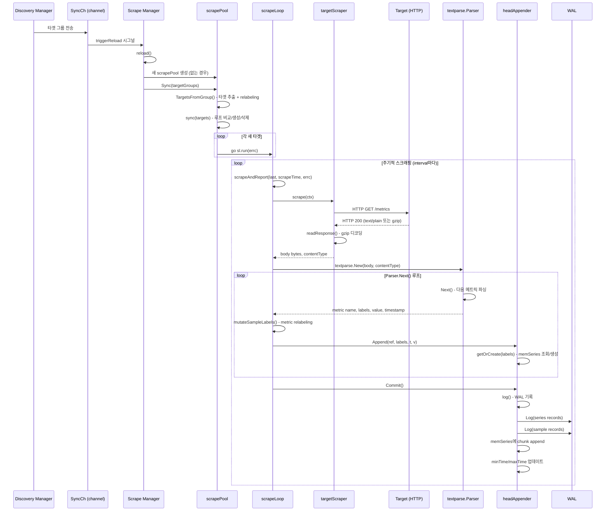
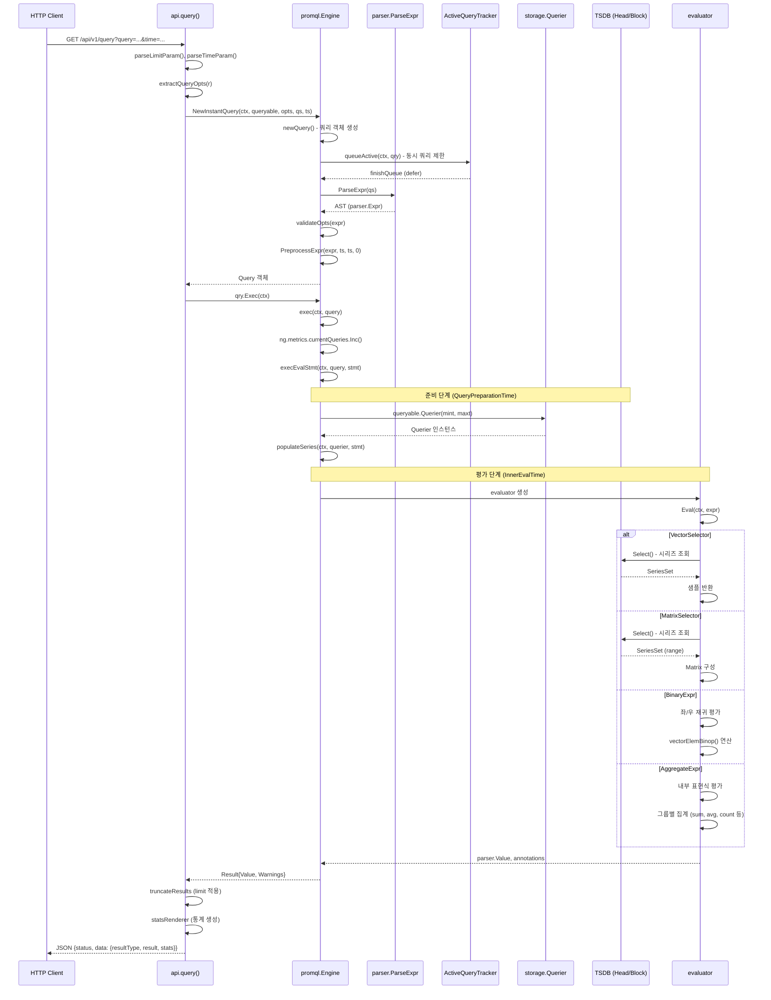
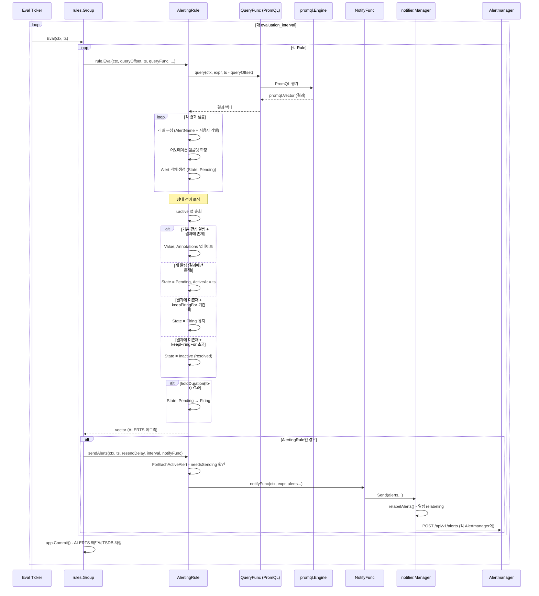
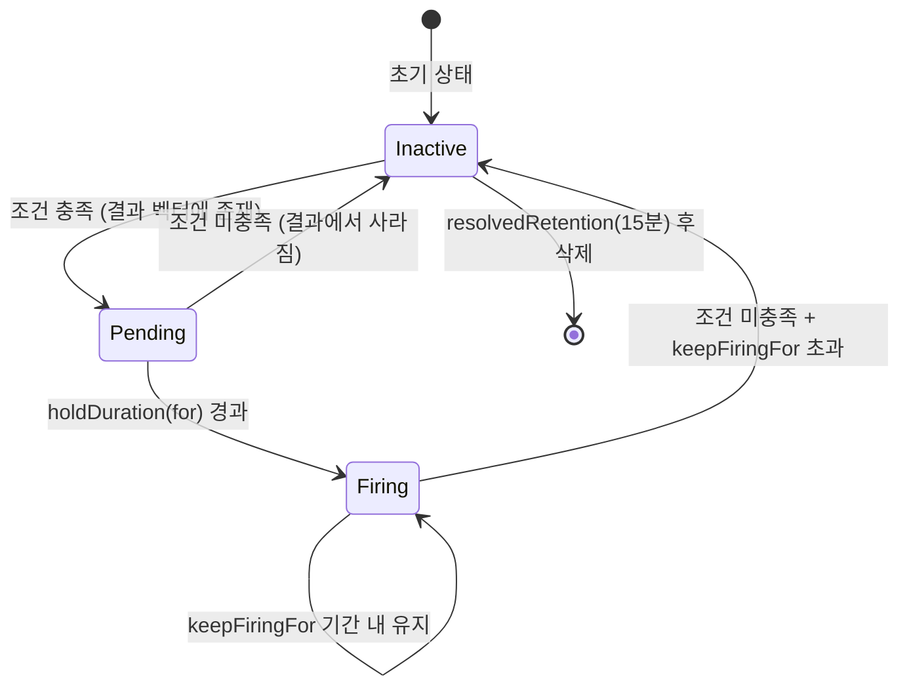
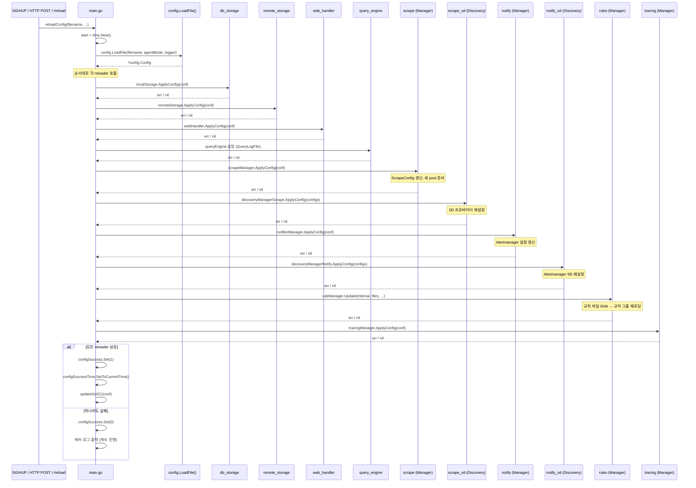
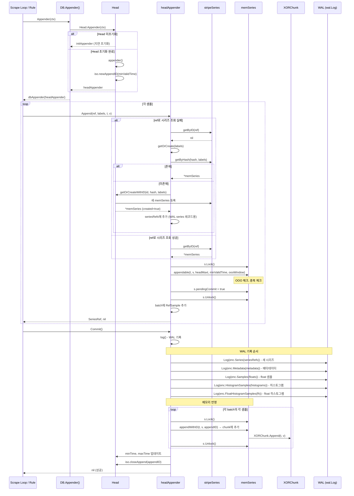
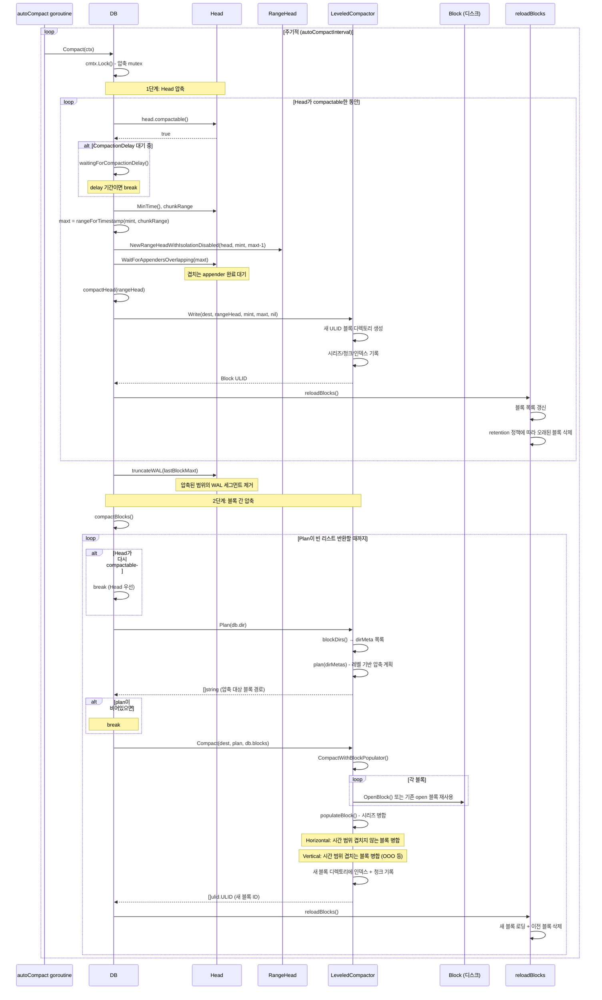

# Prometheus 시퀀스 다이어그램

이 문서는 Prometheus의 핵심 유즈케이스 6가지를 시퀀스 다이어그램으로 분석한다. 모든 코드 참조는 실제 소스코드에서 직접 확인한 경로와 함수명을 기반으로 한다.

---

## 1. 스크래핑 흐름 (Scrape Flow)

Prometheus의 가장 핵심적인 유즈케이스다. Service Discovery에서 타겟을 발견하고, HTTP GET으로 메트릭을 수집하여 TSDB에 저장하는 전체 파이프라인을 다룬다.

### 1.1 전체 시퀀스 다이어그램



### 1.2 주요 단계 설명

**Discovery Manager -> Scrape Manager 연결**

Discovery Manager는 타겟 그룹을 발견하면 `SyncCh` 채널로 전송한다. Scrape Manager의 `reloader()` 고루틴이 `triggerReload` 채널을 감시하다가, 신호를 받으면 `reload()`를 호출한다.

소스 위치: `scrape/manager.go` 186~245번째 줄

```
reloader() → ticker (DiscoveryReloadInterval) → triggerReload → reload()
```

`reload()`는 `m.targetSets`를 순회하며, 아직 `scrapePool`이 없는 설정에 대해 `newScrapePool()`을 호출하고, 각 pool에 대해 병렬로 `Sync()`를 실행한다.

**scrapePool.Sync()**

소스 위치: `scrape/scrape.go` 390~434번째 줄

`Sync()`는 타겟 그룹에서 실제 타겟을 추출한다. `TargetsFromGroup()`을 호출하여 relabeling을 적용하고, 빈 라벨셋을 가진 타겟은 `droppedTargets`로 분류한다. 이후 `sync(targets)`를 호출하여 기존 루프와 비교한다:

- 새 타겟: `scrapeLoop` 생성 후 `go sl.run(errc)` 시작
- 사라진 타겟: 해당 루프 중지
- 기존 타겟: 루프 유지

**scrapeLoop.run()**

소스 위치: `scrape/scrape.go` 1234~1299번째 줄

`run()`은 먼저 `offset` 만큼 대기하여 타겟 간 스크래핑 시간을 분산시킨다. 이후 `time.NewTicker(interval)`로 주기적으로 `scrapeAndReport()`를 호출한다.

타임스탬프 정렬 로직이 주목할 만하다. `AlignScrapeTimestamps`가 활성화되면 TSDB 압축 효율을 높이기 위해 스크래핑 시간을 정렬한다 (tolerance: 최대 interval의 1% 또는 2ms).

**targetScraper.scrape() 및 readResponse()**

소스 위치: `scrape/scrape.go` 735~752번째 줄 (scrape), 754~805번째 줄 (readResponse)

`scrape()`는 `http.NewRequest(GET, url, nil)`로 요청을 생성한다. 헤더에 `Accept`, `Accept-Encoding`, `User-Agent`, `X-Prometheus-Scrape-Timeout-Seconds`를 설정한다. OpenTelemetry 스팬도 생성된다.

`readResponse()`는 응답의 `Content-Encoding`이 `gzip`이면 `gzip.NewReader`로 디코딩하고, 아니면 직접 읽는다. `bodySizeLimit`를 초과하면 에러를 반환한다.

**scrapeAndReport() - 핵심 조율 함수**

소스 위치: `scrape/scrape.go` 1313~1381번째 줄

이 함수가 스크래핑의 전체 흐름을 조율한다:

1. `app := sl.appender()` - TSDB appender 획득
2. `sl.scraper.scrape(ctx)` - HTTP 요청
3. `sl.scraper.readResponse()` - 응답 읽기
4. `app.append(buf.Bytes(), contentType, appendTime)` - 파싱 + 저장
5. `app.Commit()` - WAL 기록 및 커밋
6. `sl.report(app, ...)` - 스크래핑 메트릭 기록 (`up`, `scrape_duration_seconds` 등)

에러 발생 시 `app.Rollback()`이 호출되어 모든 변경이 취소된다.

---

## 2. PromQL 쿼리 흐름 (Query Flow)

사용자가 HTTP API로 PromQL 쿼리를 보내면, 파싱 -> AST 생성 -> 시리즈 로딩 -> 평가 -> 응답 반환까지의 전체 흐름이다.

### 2.1 전체 시퀀스 다이어그램



### 2.2 주요 단계 설명

**API 진입점**

소스 위치: `web/api/v1/api.go` 502~569번째 줄

`api.query()` 함수가 HTTP 요청을 받아 `limit`, `time`, `timeout` 파라미터를 파싱한다. `extractQueryOpts()`로 쿼리 옵션(lookback delta 등)을 추출한 뒤 `Engine.NewInstantQuery()`를 호출한다.

**Engine.NewInstantQuery()**

소스 위치: `promql/engine.go` 531~548번째 줄

1. `newQuery()` - 쿼리 구조체 생성 (start=end=ts, interval=0)
2. `queueActive()` - `ActiveQueryTracker`로 동시 쿼리 수 제한 확인
3. `parser.ParseExpr(qs)` - PromQL 문자열을 AST로 파싱
4. `PreprocessExpr()` - `@` modifier, offset 등 전처리

**exec() 및 execEvalStmt()**

소스 위치: `promql/engine.go` 673~703번째 줄 (exec), 773~813번째 줄 (execEvalStmt)

`exec()`는 timeout context를 설정하고 쿼리 로깅을 처리한다. `execEvalStmt()`가 실제 평가를 수행하며, 두 단계로 나뉜다:

1. **준비 단계**: `Querier(mint, maxt)`로 querier를 얻고, `populateSeries()`로 필요한 시리즈를 미리 로딩
2. **평가 단계**: `evaluator.Eval()`이 AST를 재귀적으로 순회하며 각 노드를 평가

Instant 쿼리 (start == end)는 step=1인 range 쿼리로 실행되어 코드 경로가 통일된다.

**evaluator의 표현식 타입별 처리**

| 표현식 타입 | 처리 방식 |
|------------|----------|
| VectorSelector | `Select()` 호출 후 현재 시점의 샘플 반환 |
| MatrixSelector | `Select()` 호출 후 범위 내 모든 샘플을 Matrix로 구성 |
| BinaryExpr | 좌/우 표현식 재귀 평가 후 `vectorElemBinop()` 연산 |
| AggregateExpr | 내부 표현식 평가 후 라벨 기준 그룹핑 + 집계 함수 적용 |
| Call (함수) | 인자 평가 후 등록된 함수 (rate, irate, histogram_quantile 등) 호출 |

---

## 3. 알림 흐름 (Alert Flow)

Rule Manager가 주기적으로 알림 규칙을 평가하고, 조건이 충족되면 Alertmanager로 전송하는 흐름이다.

### 3.1 전체 시퀀스 다이어그램



### 3.2 상태 전이 다이어그램



### 3.3 주요 단계 설명

**Group.Eval()**

소스 위치: `rules/group.go` 504~574번째 줄

`Group.Eval()`은 그룹 내 모든 규칙을 순차적으로 (또는 `concurrent-rule-eval` 플래그 활성화 시 병렬로) 평가한다. 각 규칙에 대해:

1. `rule.Eval()` 호출 - PromQL 평가 + 알림 상태 업데이트
2. AlertingRule이면 `sendAlerts()` 호출
3. 결과 벡터를 `app.Append()`로 TSDB에 저장 (ALERTS 시리즈)

**AlertingRule.Eval()**

소스 위치: `rules/alerting.go` 382~458번째 줄

1. `query(ctx, r.vector.String(), ts.Add(-queryOffset))` - PromQL 규칙 표현식 평가
2. 결과 벡터를 순회하며 각 샘플에 대해:
   - 라벨 구성: `MetricName` 제거, 사용자 정의 라벨 추가, `AlertName` 설정
   - 어노테이션 템플릿 확장 (`$labels`, `$value`, `$externalLabels` 변수 주입)
   - `Alert` 객체 생성 (초기 상태: `StatePending`)
3. `r.active` 맵과 비교하여 상태 전이 수행

**sendAlerts()**

소스 위치: `rules/alerting.go` 613~628번째 줄

`ForEachActiveAlert()`으로 활성 알림을 순회하고, `needsSending(ts, resendDelay)` 조건을 만족하는 알림만 전송한다. `ValidUntil`은 `ts + 4 * max(interval, resendDelay)`로 설정되어 2회 평가/전송 실패를 허용한다.

**notifier.Manager.Send()**

소스 위치: `notifier/manager.go` 254~273번째 줄

`relabelAlerts()`로 알림에 external labels와 relabeling을 적용한 뒤, 등록된 모든 Alertmanager 인스턴스에 `ams.send(alerts...)`로 전송한다.

---

## 4. 설정 리로드 흐름 (Config Reload Flow)

Prometheus는 SIGHUP 시그널 또는 `/-/reload` HTTP 엔드포인트로 설정을 동적으로 리로드할 수 있다.

### 4.1 전체 시퀀스 다이어그램



### 4.2 Reloader 목록 및 역할

소스 위치: `cmd/prometheus/main.go` 1028~1118번째 줄

| 순서 | 이름 | 함수 | 역할 |
|------|------|------|------|
| 1 | db_storage | `localStorage.ApplyConfig` | TSDB 설정 적용 (OOO window 등) |
| 2 | remote_storage | `remoteStorage.ApplyConfig` | Remote Write/Read 설정 갱신 |
| 3 | web_handler | `webHandler.ApplyConfig` | 웹 핸들러 설정 갱신 |
| 4 | query_engine | (inline) | QueryLogFile 설정 |
| 5 | scrape | `scrapeManager.ApplyConfig` | 스크래핑 설정 갱신 (Scrape/notify가 Discovery보다 먼저) |
| 6 | scrape_sd | `discoveryManagerScrape.ApplyConfig` | 스크래핑 SD 프로바이더 재설정 |
| 7 | notify | `notifierManager.ApplyConfig` | Alertmanager 연결 설정 |
| 8 | notify_sd | `discoveryManagerNotify.ApplyConfig` | Alertmanager SD 재설정 |
| 9 | rules | `ruleManager.Update` | 규칙 파일 경로 Glob + 그룹 재로딩 |
| 10 | tracing | `tracingManager.ApplyConfig` | OpenTelemetry 트레이싱 설정 |

**중요한 순서 의존성**: 주석에 명시되어 있듯이 Scrape Manager와 Notifier Manager는 Discovery Manager보다 먼저 설정을 적용받아야 한다. Discovery가 새 타겟 리스트를 보낼 때 최신 설정이 적용된 상태여야 하기 때문이다.

**reloadConfig() 핵심 로직**

소스 위치: `cmd/prometheus/main.go` 1604~1648번째 줄

```
reloadConfig() {
    conf = config.LoadFile(filename)
    for _, rl := range reloaders {
        rl.reloader(conf)  // 실패해도 다음 reloader 계속 진행
    }
    updateGoGC(conf)  // GOGC 런타임 설정 갱신
}
```

하나의 reloader가 실패해도 나머지는 계속 실행된다. 하지만 하나라도 실패하면 전체 결과는 실패로 기록된다.

---

## 5. TSDB 쓰기 경로 (TSDB Write Path)

메트릭 샘플이 TSDB의 Head 블록에 저장되는 상세 흐름이다.

### 5.1 전체 시퀀스 다이어그램



### 5.2 주요 단계 설명

**headAppender.Append()**

소스 위치: `tsdb/head_append.go` 425~465번째 줄

1. OOO 비활성화 상태에서 `t < minValidTime`이면 즉시 `ErrOutOfBounds` 반환 (fast path)
2. `getByID(ref)` 또는 `getOrCreate(labels)`로 `memSeries` 조회/생성
3. Stale NaN 처리: 이전 배치의 타입(float/histogram)에 따라 적절한 stale marker 생성
4. `s.Lock()` 후 `appendable()` 호출 - OOO 여부, 중복 여부, 범위 유효성 검사
5. batch에 `RefSample{Ref: s.ref, T: t, V: v}` 추가

**headAppenderBase.log() - WAL 기록**

소스 위치: `tsdb/head_append.go` 1053~1112번째 줄

WAL 기록은 엄격한 순서를 따른다:

1. **Series 레코드**: 새로 생성된 시리즈의 라벨 정보
2. **Metadata 레코드**: 시리즈 메타데이터 (HELP, TYPE)
3. **Float 샘플**: 일반 float 메트릭 값 (반드시 히스토그램보다 먼저)
4. **Histogram 샘플**: 네이티브 히스토그램 값
5. **FloatHistogram 샘플**: float 히스토그램 값
6. **Exemplar 레코드**: exemplar 데이터

이 순서가 중요한 이유: WAL 리플레이 시 시리즈 정의가 먼저 와야 샘플을 올바르게 매핑할 수 있다.

**getOrCreate() - 시리즈 생성**

소스 위치: `tsdb/head_append.go` 536~540번째 줄

`labels.WithoutEmpty()`로 빈 라벨을 제거한 뒤, `stripeSeries.getByHash(hash, labels)`로 기존 시리즈를 찾는다. 없으면 새로 생성하고 `stripeSeries`에 등록한다. `stripeSeries`는 해시 기반 샤딩으로 락 경합을 줄인 구조다.

---

## 6. TSDB 압축 흐름 (TSDB Compaction Flow)

Head 블록의 데이터를 디스크 블록으로 변환하고, 기존 블록들을 병합하는 압축 프로세스다.

### 6.1 전체 시퀀스 다이어그램



### 6.2 주요 단계 설명

**DB.Compact() - 전체 압축 조율**

소스 위치: `tsdb/db.go` 1414~1480번째 줄

압축은 두 단계로 나뉜다:

**1단계 - Head 압축**: Head 블록에 충분한 데이터가 쌓이면 (`compactable()`) 디스크 블록으로 변환한다.

- `compactable()`: Head의 데이터 범위가 `chunkRange/2`보다 크면 true
- `CompactionDelay`: Head 압축 전 지연 시간 (데이터가 더 쌓이길 기다림)
- `RangeHead`: Head의 일부 범위를 감싸는 뷰 (반개방 구간 `[mint, maxt)`)
- `WaitForAppendersOverlapping(maxt)`: 압축 범위와 겹치는 진행 중인 append가 완료될 때까지 대기
- `compactHead()` -> `LeveledCompactor.Write()`: 새 블록 디렉토리 생성

Head 압축 후 `truncateWAL(lastBlockMaxt)`로 이미 블록으로 변환된 범위의 WAL 세그먼트를 제거한다.

**2단계 - 블록 간 압축**: `compactBlocks()` 호출

소스 위치: `tsdb/db.go` 1721~1751번째 줄

1. `Plan(db.dir)` - 압축할 블록 조합 결정
2. `Compact(dest, plan, db.blocks)` - 블록 병합
3. `reloadBlocks()` - 새 블록 로딩 + 이전 블록 삭제

Head가 다시 compactable해지면 블록 간 압축을 중단하고 Head 압축을 우선한다.

**LeveledCompactor.Plan()**

소스 위치: `tsdb/compact.go` 249~277번째 줄

블록 디렉토리를 스캔하고 메타데이터를 읽어 `plan()` 알고리즘으로 압축 대상을 결정한다. 레벨 기반 압축을 사용하여 작은 블록들을 점진적으로 큰 블록으로 합친다.

`blockExcludeFunc`이 설정된 경우, 해당 블록부터 이후 블록은 스킵한다 (업로드 중인 블록 제외 등).

**LeveledCompactor.Compact()**

소스 위치: `tsdb/compact.go` 485~529번째 줄

이미 열려 있는 블록은 재사용하고, 닫혀 있는 블록은 `OpenBlock()`으로 연다. `CompactWithBlockPopulator()`가 실제 병합을 수행하며, 두 가지 병합 모드가 있다:

| 병합 모드 | 조건 | 동작 |
|-----------|------|------|
| Horizontal | 시간 범위가 겹치지 않음 | 시리즈를 시간순으로 연결 |
| Vertical | 시간 범위가 겹침 (OOO 등) | 동일 시리즈의 샘플을 정렬 후 병합 |

---

## 흐름 간 관계도

```
┌─────────────────────────────────────────────────────┐
│                 Config Reload (4)                    │
│  SIGHUP → reloadConfig() → 각 컴포넌트 ApplyConfig  │
└──────────┬──────────┬──────────┬────────────────────┘
           │          │          │
           v          v          v
┌──────────────┐ ┌─────────┐ ┌──────────┐
│ Scrape (1)   │ │ Rules   │ │ Notifier │
│ Discovery →  │ │ (3)     │ │ (3)      │
│ scrapePool → │ │ Group   │ │ Manager  │
│ scrapeLoop   │ │ .Eval() │ │ .Send()  │
└──────┬───────┘ └────┬────┘ └─────┬────┘
       │              │            │
       v              v            v
┌──────────────────────────┐  ┌──────────┐
│     TSDB Write Path (5)  │  │Alertmgr  │
│  headAppender.Append()   │  │(외부)    │
│  → WAL.Log()             │  └──────────┘
│  → memSeries.append()    │
└──────────┬───────────────┘
           │
           v
┌──────────────────────────┐
│   TSDB Compaction (6)    │
│  Head → 디스크 블록       │
│  블록 병합 (Leveled)      │
└──────────┬───────────────┘
           │
           v
┌──────────────────────────┐
│   PromQL Query (2)       │
│  Engine → Querier.Select │
│  → Head + Blocks 조회    │
└──────────────────────────┘
```

이 관계도에서 볼 수 있듯이:

1. **스크래핑(1)**과 **규칙 평가(3)**는 모두 TSDB 쓰기 경로(5)를 통해 데이터를 저장한다
2. **PromQL 쿼리(2)**는 TSDB에서 데이터를 읽으며, Head(메모리)와 디스크 블록 모두를 조회한다
3. **압축(6)**은 쓰기 경로가 만든 Head 데이터를 디스크 블록으로 변환한다
4. **설정 리로드(4)**는 모든 컴포넌트의 설정을 갱신하여 전체 파이프라인에 영향을 미친다
5. **알림 흐름(3)**은 PromQL 엔진을 사용하여 규칙을 평가하고, 결과를 외부 Alertmanager로 전송한다
