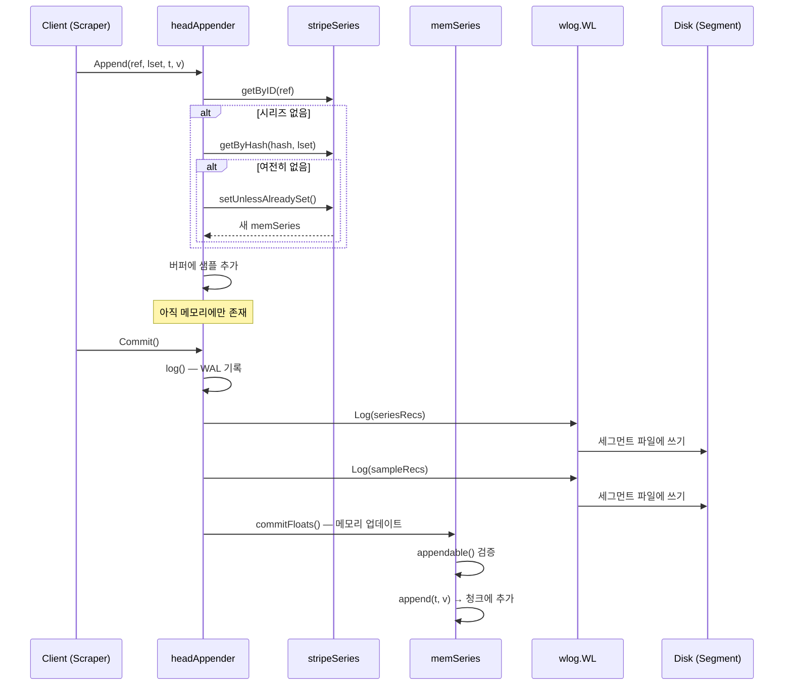
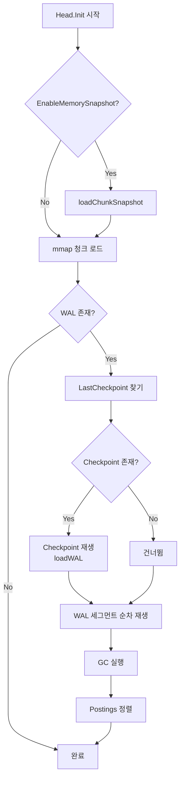

# 07. TSDB Head & WAL 심화 분석

## 목차

1. [Head 블록 개요](#1-head-블록-개요)
2. [Head 구조체 상세](#2-head-구조체-상세)
3. [stripeSeries 동시성 패턴](#3-stripeseries-동시성-패턴)
4. [memSeries 상세](#4-memseries-상세)
5. [Append 경로 상세](#5-append-경로-상세)
6. [WAL 구현](#6-wal-구현)
7. [Checkpoint](#7-checkpoint)
8. [WAL 재생 (Crash Recovery)](#8-wal-재생-crash-recovery)
9. [Out-of-Order (OOO) 처리](#9-out-of-order-ooo-처리)
10. [성능 최적화](#10-성능-최적화)

---

## 1. Head 블록 개요

### 1.1 Head란 무엇인가

Prometheus TSDB에서 **Head 블록**은 가장 최근의 시계열 데이터를 인메모리에 보유하는 핵심 컴포넌트다. 디스크에 영구 저장되는 불변(immutable) 블록과 달리, Head는 **변경 가능(mutable)** 한 유일한 블록으로서 모든 쓰기 요청의 진입점이 된다.

```
소스 경로: tsdb/head.go
```

```
┌─────────────────────────────────────────────────────────┐
│                    Prometheus TSDB                        │
│                                                          │
│  ┌──────────┐  ┌──────────┐  ┌──────────┐  ┌─────────┐ │
│  │ Block 1  │  │ Block 2  │  │ Block 3  │  │  Head   │ │
│  │ (2h)     │  │ (2h)     │  │ (2h)     │  │ (2h)    │ │
│  │ 불변     │  │ 불변     │  │ 불변     │  │ 가변    │ │
│  │ 디스크   │  │ 디스크   │  │ 디스크   │  │ 메모리  │ │
│  └──────────┘  └──────────┘  └──────────┘  └─────────┘ │
│  ◀──────── 읽기 전용 ──────────▶           ◀─읽기/쓰기─▶│
│                                                          │
│  시간 →→→→→→→→→→→→→→→→→→→→→→→→→→→→→→→→→→→ 현재           │
└─────────────────────────────────────────────────────────┘
```

### 1.2 생명주기

Head 블록은 다음과 같은 생명주기를 갖는다:

| 단계 | 설명 |
|------|------|
| **생성** | `NewHead()`로 초기화, `Init()`으로 WAL 재생 |
| **수집** | 스크래핑된 샘플이 `Append()` → `Commit()`으로 기록 |
| **청크 전환** | 청크가 가득 차면 mmap으로 디스크에 매핑 |
| **컴팩션** | chunkRange(기본 2시간) 초과 시 불변 블록으로 변환 |
| **정리** | `gc()`로 오래된 시리즈와 청크 제거 |
| **종료** | `Close()`로 WAL 플러시 및 리소스 해제 |

### 1.3 Head와 WAL의 관계

Head는 인메모리 데이터이므로 프로세스 재시작 시 유실될 수 있다. **WAL(Write-Ahead Log)** 은 이를 방지하기 위한 내구성(durability) 레이어다.

```
          쓰기 요청
              │
              ▼
    ┌─────────────────┐
    │   headAppender   │
    │   .Append()      │
    └────────┬────────┘
             │
             ▼
    ┌─────────────────┐     ┌─────────────────┐
    │   WAL.Log()     │────▶│  세그먼트 파일    │
    │   (디스크 기록)  │     │  (순차 쓰기)      │
    └────────┬────────┘     └─────────────────┘
             │
             ▼
    ┌─────────────────┐
    │   메모리 업데이트  │
    │   (memSeries)    │
    └─────────────────┘
```

**핵심 원칙**: WAL에 먼저 기록한 후 메모리를 업데이트한다. 이 순서가 바뀌면 크래시 시 데이터가 유실된다.

---

## 2. Head 구조체 상세

### 2.1 전체 필드 맵

`tsdb/head.go`에 정의된 `Head` 구조체는 다음과 같은 핵심 필드를 포함한다:

```go
// Head handles reads and writes of time series data within a time window.
// 소스: tsdb/head.go:68
type Head struct {
    chunkRange               atomic.Int64   // 기본 2시간 (7,200,000ms)
    numSeries                atomic.Uint64  // 현재 활성 시계열 수
    numStaleSeries           atomic.Uint64  // 스테일 마커된 시리즈 수
    minOOOTime, maxOOOTime   atomic.Int64   // OOO 샘플의 시간 범위
    minTime, maxTime         atomic.Int64   // 인오더 샘플의 시간 범위
    minValidTime             atomic.Int64   // 허용 최소 타임스탬프
    lastWALTruncationTime    atomic.Int64   // 마지막 WAL 잘라내기 시각
    lastMemoryTruncationTime atomic.Int64   // 마지막 메모리 정리 시각
    lastSeriesID             atomic.Uint64  // 시리즈 ID 카운터

    wal, wbl        *wlog.WL              // WAL + WBL (OOO 전용)
    series          *stripeSeries          // 모든 활성 시계열
    postings        *index.MemPostings     // 역색인 (레이블→시리즈)
    chunkDiskMapper *chunks.ChunkDiskMapper // head 청크 mmap
    // ... (풀, 메트릭, 격리 등 생략)
}
```

### 2.2 atomic 카운터의 역할

Head의 주요 상태값들은 모두 `atomic` 타입을 사용한다. 이는 읽기/쓰기가 동시에 발생하는 환경에서 락 없이 안전하게 접근하기 위함이다.

| 필드 | 타입 | 용도 | 업데이트 시점 |
|------|------|------|-------------|
| `chunkRange` | `atomic.Int64` | 청크 시간 범위 (기본 2h) | 런타임 조정 가능 |
| `numSeries` | `atomic.Uint64` | 활성 시리즈 수 | 시리즈 생성/GC |
| `minTime` | `atomic.Int64` | Head 최소 타임스탬프 | Append, Truncate |
| `maxTime` | `atomic.Int64` | Head 최대 타임스탬프 | Append |
| `lastSeriesID` | `atomic.Uint64` | 시리즈 ID 자동 증가 | 새 시리즈 생성 |
| `minValidTime` | `atomic.Int64` | 이 시각 이전 샘플 거부 | Init, Truncate |

### 2.3 chunkRange와 DefaultBlockDuration

```go
// 소스: tsdb/head.go:215
func DefaultHeadOptions() *HeadOptions {
    ho := &HeadOptions{
        ChunkRange:      DefaultBlockDuration,  // 2시간
        StripeSize:      DefaultStripeSize,      // 16384
        SamplesPerChunk: DefaultSamplesPerChunk, // 120
        // ...
    }
}
```

`chunkRange`는 Head가 보유하는 시계열 데이터의 시간 범위를 결정한다. 기본값은 `DefaultBlockDuration`(2시간 = 7,200,000ms)이며, 이 범위를 초과하면 컴팩션이 트리거되어 불변 블록이 생성된다.

### 2.4 wal과 wbl

```go
// 소스: tsdb/head.go:84
wal, wbl *wlog.WL
```

- **`wal`**: 인오더(in-order) 샘플을 위한 기본 WAL
- **`wbl`**: Out-of-Order 샘플 전용 Write Buffer Log. OOO 기능이 활성화되면 별도의 WAL 파일에 기록된다

두 로그 모두 같은 `wlog.WL` 타입을 사용하지만 독립적인 세그먼트 디렉토리를 갖는다.

### 2.5 HeadOptions 주요 설정

```go
// 소스: tsdb/head.go:156
type HeadOptions struct {
    MaxExemplars         atomic.Int64  // 런타임 변경 가능
    OutOfOrderTimeWindow atomic.Int64  // OOO 허용 시간 윈도우
    OutOfOrderCapMax     atomic.Int64  // OOO 청크 최대 크기 (기본 32)
    ChunkRange           int64         // 청크 시간 범위
    StripeSize           int           // stripeSeries 크기 (2의 거듭제곱)
    SamplesPerChunk      int           // 청크당 목표 샘플 수 (기본 120)
    WALReplayConcurrency int           // WAL 재생 병렬도 (기본 GOMAXPROCS)
    IsolationDisabled    bool          // 격리 비활성화
    // ...
}
```

---

## 3. stripeSeries 동시성 패턴

### 3.1 왜 stripe 패턴인가

Prometheus는 초당 수백만 개의 샘플을 처리해야 한다. 단일 `sync.RWMutex`로 모든 시리즈를 보호하면 락 경합(contention)이 심각해진다. `stripeSeries`는 이 문제를 **해시 기반 샤딩**으로 해결한다.

```
단일 락 방식 (나쁜 예):
  goroutine 1 ──┐
  goroutine 2 ──┤──▶ [하나의 RWMutex] ──▶ [전체 시리즈 맵]
  goroutine 3 ──┤
  goroutine N ──┘    ← 심각한 경합!

stripeSeries 방식:
  goroutine 1 ──▶ [Lock 0] ──▶ [시리즈 맵 0]
  goroutine 2 ──▶ [Lock 1] ──▶ [시리즈 맵 1]
  goroutine 3 ──▶ [Lock 2] ──▶ [시리즈 맵 2]
  ...
  goroutine N ──▶ [Lock K] ──▶ [시리즈 맵 K]
                  ← 경합 대폭 감소!
```

### 3.2 구조체 정의

```go
// 소스: tsdb/head.go:1978-1994
// DefaultStripeSize is the default number of entries to allocate
// in the stripeSeries hash map.
DefaultStripeSize = 1 << 14  // = 16384

type stripeSeries struct {
    size                    int
    series                  []map[chunks.HeadSeriesRef]*memSeries // ref 기반 샤딩
    hashes                  []seriesHashmap                       // 해시 기반 샤딩
    locks                   []stripeLock                          // 각 샤드별 독립 락
    seriesLifecycleCallback SeriesLifecycleCallback
}

type stripeLock struct {
    sync.RWMutex
    // Padding to avoid multiple locks being on the same cache line.
    _ [40]byte  // ← 캐시 라인 false sharing 방지
}
```

**핵심 설계 포인트**:

| 요소 | 설명 |
|------|------|
| `size = 16384` | 2^14 스트라이프. 비트 마스킹으로 빠른 샤드 결정 |
| `series[]` | `HeadSeriesRef` → `*memSeries` 맵. ref 값으로 샤딩 |
| `hashes[]` | 레이블 해시 → `*memSeries` 맵. 해시 충돌 처리 포함 |
| `locks[]` | 각 스트라이프별 독립적인 `RWMutex` |
| `_ [40]byte` | 64바이트 캐시 라인에서 false sharing 방지용 패딩 |

### 3.3 해시 기반 샤딩 (FNV-1a)

시리즈의 레이블 세트는 FNV-1a 해시 함수로 64비트 해시값이 계산된다. 이 해시값의 하위 14비트(`& (size-1)`)가 스트라이프 인덱스가 된다.

```
레이블: {__name__="http_requests", method="GET", status="200"}
    │
    ▼
FNV-1a 해시: 0x3A7B_C1D4_E5F6_7890
    │
    ▼
스트라이프 인덱스: 0x7890 & 0x3FFF = 0x0890 (= 2192)
    │
    ▼
hashes[2192]에서 시리즈 조회/저장
```

### 3.4 getByID() 경로

```go
// 소스: tsdb/head.go:2300-2308
func (s *stripeSeries) getByID(id chunks.HeadSeriesRef) *memSeries {
    i := uint64(id) & uint64(s.size-1)  // 비트 마스킹으로 샤드 결정

    s.locks[i].RLock()
    series := s.series[i][id]
    s.locks[i].RUnlock()

    return series
}
```

`HeadSeriesRef`는 단조 증가하는 정수이므로 `ref & (size-1)`로 균일하게 분산된다.

### 3.5 getByHash() 경로

```go
// 소스: tsdb/head.go:2310-2318
func (s *stripeSeries) getByHash(hash uint64, lset labels.Labels) *memSeries {
    i := hash & uint64(s.size-1)  // 해시값의 하위 비트로 샤드 결정

    s.locks[i].RLock()
    series := s.hashes[i].get(hash, lset)
    s.locks[i].RUnlock()

    return series
}
```

`seriesHashmap`은 해시 충돌을 처리하기 위해 두 개의 맵을 사용한다:

```go
type seriesHashmap struct {
    unique    map[uint64]*memSeries           // 해시 충돌 없는 경우
    conflicts map[uint64][]*memSeries          // 해시 충돌 시 리스트
}
```

대부분의 경우 `unique` 맵에서 O(1)로 조회되며, 해시 충돌은 극히 드물다.

### 3.6 setUnlessAlreadySet() — 원자적 시리즈 등록

새 시리즈를 등록할 때는 **읽기-쓰기 경쟁**을 방지해야 한다. `setUnlessAlreadySet()`은 락을 획득한 상태에서 이미 존재하는지 확인하고, 없을 때만 등록한다:

```
getByHash() → nil (시리즈 없음)
    │
    ▼
setUnlessAlreadySet():
    1. locks[i].Lock()            // 쓰기 락 획득
    2. hashes[i].get(hash, lset)  // 다시 확인 (다른 goroutine이 먼저 등록했을 수 있음)
    3. 없으면 등록, 있으면 기존 반환
    4. locks[i].Unlock()
```

이 **double-check 패턴**은 동시에 같은 시리즈를 등록하려는 여러 goroutine 중 하나만 성공하도록 보장한다.

---

## 4. memSeries 상세

### 4.1 구조체 정의

```go
// 소스: tsdb/head.go:2386-2438
type memSeries struct {
    // 생성 후 변경 불가 (락 불필요)
    ref       chunks.HeadSeriesRef
    meta      *metadata.Metadata
    shardHash uint64

    // 아래부터 락 필요
    sync.Mutex

    lset labels.Labels  // 레이블 세트

    // mmap된 불변 청크 (디스크)
    mmappedChunks []*mmappedChunk
    // 인메모리 헤드 청크 (링크드 리스트, 최신→과거)
    headChunks   *memChunk
    firstChunkID chunks.HeadChunkID

    // Out-of-Order 전용 필드
    ooo *memSeriesOOOFields

    mmMaxTime int64  // mmap 청크의 최대 시간

    nextAt        int64            // 다음 청크 전환 시각
    pendingCommit bool             // 커밋 대기 샘플 존재 여부

    // 중복 감지용 마지막 값
    lastValue               float64
    lastHistogramValue      *histogram.Histogram
    lastFloatHistogramValue *histogram.FloatHistogram

    // 현재 헤드 청크의 Appender
    app chunkenc.Appender

    // 격리 트랜잭션 링
    txs *txRing
}
```

### 4.2 청크 구조: 링크드 리스트

`headChunks`는 **단일 링크드 리스트**로 구현되어 있다. 가장 최근 청크가 리스트의 헤드(head)이고, `.next`로 과거 청크를 추적한다.

```
headChunks ──▶ [memChunk 3] ──▶ [memChunk 2] ──▶ [memChunk 1] ──▶ nil
               (현재 쓰기중)     (아직 mmap 안됨)   (mmap 대기)
               maxTime=now      maxTime=T-1        maxTime=T-2
```

```
mmappedChunks (디스크에 mmap):
  [p5] ──▶ [p6] ──▶ [p7] ──▶ [p8] ──▶ [p9]
  firstChunkID = 5

컴팩션 후:
  [p7] ──▶ [p8] ──▶ [p9]
  firstChunkID = 7    ← p5, p6은 블록으로 이동
```

### 4.3 lastValue와 중복 제거

```go
// 소스: tsdb/head.go:2424-2425
// We keep the last value here (in addition to appending it to the chunk)
// so we can check for duplicates.
lastValue float64
```

동일한 타임스탬프에 동일한 값이 다시 들어오면 중복으로 판단하여 무시한다. 이는 스크래핑 재시도 등에서 발생할 수 있는 중복 데이터를 효율적으로 걸러낸다.

### 4.4 memSeriesOOOFields

```go
// 소스: tsdb/head.go:2442-2446
type memSeriesOOOFields struct {
    oooMmappedChunks []*mmappedChunk    // 디스크의 OOO mmap 청크
    oooHeadChunk     *oooHeadChunk      // 인메모리 OOO 청크
    firstOOOChunkID  chunks.HeadChunkID // 첫 OOO 청크 ID
}
```

OOO 필드는 **지연 초기화(lazy initialization)** 된다. OOO 샘플이 실제로 들어올 때만 `ooo` 필드가 할당되므로, OOO를 사용하지 않는 시리즈는 추가 메모리를 소비하지 않는다.

### 4.5 oooHeadChunk

```go
// 소스: tsdb/head.go:2607-2610
type oooHeadChunk struct {
    chunk            *OOOChunk
    minTime, maxTime int64
}
```

`OOOChunk`는 타임스탬프 기준으로 정렬되지 않은 샘플을 담는 특수 청크다. 인오더 청크와 달리 삽입(insert) 연산을 지원한다.

---

## 5. Append 경로 상세

### 5.1 전체 흐름 (Mermaid)



### 5.2 headAppenderBase 구조

```go
// 소스: tsdb/head_append.go:401-415
type headAppenderBase struct {
    head          *Head
    minValidTime  int64                              // 허용 최소 시각
    headMaxt      int64                              // Head 현재 최대 시각
    oooTimeWindow int64                              // OOO 허용 윈도우

    seriesRefs   []record.RefSeries                  // 새 시리즈 레코드
    series       []*memSeries                        // 새 시리즈 포인터
    batches      []*appendBatch                      // 샘플/히스토그램 배치

    typesInBatch map[chunks.HeadSeriesRef]sampleType // 시리즈별 샘플 타입
    appendID, cleanupAppendIDsBelow uint64           // 격리용 트랜잭션 ID
    closed       bool
}
```

### 5.3 Append() — headAppenderV2

`headAppenderV2.Append()`는 다음 순서로 동작한다:

```go
// 소스: tsdb/head_append_v2.go:106
func (a *headAppenderV2) Append(ref, ls, st, t, v, h, fh, opts) {
    // 1. 히스토그램 유효성 검증
    // 2. OOO 비활성 + 범위 밖 → 즉시 거부
    // 3. 시리즈 조회 (getByID → getByHash → getOrCreate)
    // 4. ST 제로 샘플 처리 (선택적)
    // 5. 타입별 append (appendFloat/appendHistogram/appendFloatHistogram)
    // 6. 에러 처리 + exemplar 추가
}
```

**시리즈 조회 우선순위**:

```
1. getByID(ref)       → ref 캐시 히트 (가장 빠름, O(1))
     │
     ▼ miss
2. getOrCreate(lset)  → 해시 기반 조회 또는 신규 생성
     │
     ├─ getByHash(hash, lset) → 기존 시리즈 반환
     │
     └─ 없으면 newMemSeries() + 등록
```

스크래핑 루프에서는 이전 스크래핑에서 반환받은 `ref`를 재사용하므로, 대부분의 경우 `getByID()`에서 즉시 조회된다.

### 5.4 Commit() — WAL 기록 후 메모리 업데이트

```go
// 소스: tsdb/head_append.go:1707
func (a *headAppenderBase) Commit() (err error) {
    // 1. WAL에 먼저 기록
    if err := a.log(); err != nil {
        _ = a.Rollback()
        return fmt.Errorf("write to WAL: %w", err)
    }

    // 2. writeNotified 알림 (WAL watcher 등)
    if h.writeNotified != nil {
        h.writeNotified.Notify()
    }

    // 3. 배치별로 메모리에 커밋
    for _, b := range a.batches {
        a.commitFloats(b, acc)
        a.commitHistograms(b, acc)
        a.commitFloatHistograms(b, acc)
        commitMetadata(b)
    }

    // 4. 시리즈 pendingCommit 해제
    a.unmarkCreatedSeriesAsPendingCommit()

    // 5. OOO 레코드 WBL에 기록
    if h.wbl != nil {
        h.wbl.Log(acc.oooRecords...)
    }

    // 6. 메트릭 업데이트 (카운터 등)
}
```

### 5.5 log() — WAL 기록 순서

```go
// 소스: tsdb/head_append.go:1053-1113
func (a *headAppenderBase) log() error {
    // 1. 시리즈 정의 먼저 기록 (재생 시 시리즈 등록 필요)
    if len(a.seriesRefs) > 0 {
        a.head.wal.Log(enc.Series(a.seriesRefs, buf))
    }

    for _, b := range a.batches {
        // 2. 메타데이터
        if len(b.metadata) > 0 {
            a.head.wal.Log(enc.Metadata(b.metadata, buf))
        }
        // 3. Float 샘플 (순서 중요!)
        if len(b.floats) > 0 {
            a.head.wal.Log(enc.Samples(b.floats, buf))
        }
        // 4. 히스토그램 샘플
        if len(b.histograms) > 0 {
            a.head.wal.Log(enc.HistogramSamples(b.histograms, buf))
        }
        // 5. Float 히스토그램 샘플
        if len(b.floatHistograms) > 0 {
            a.head.wal.Log(enc.FloatHistogramSamples(b.floatHistograms, buf))
        }
    }
}
```

**기록 순서가 중요한 이유**: 재생(replay) 시 시리즈 정의가 먼저 처리되어야 샘플을 올바른 시리즈에 매핑할 수 있다.

### 5.6 Rollback()

롤백 시에는 WAL에 아무것도 기록하지 않고, 새로 생성된 시리즈의 `pendingCommit` 플래그만 해제한다. 이미 WAL에 기록된 데이터는 롤백할 수 없으므로, `log()`가 실패하면 자동으로 `Rollback()`이 호출된다.

---

## 6. WAL 구현

### 6.1 WL 구조체

```go
// 소스: tsdb/wlog/wlog.go:172-198
type WL struct {
    dir         string
    logger      *slog.Logger
    segmentSize int         // 기본 128MB
    mtx         sync.RWMutex
    segment     *Segment    // 현재 활성 세그먼트
    donePages   int         // 현재 세그먼트에서 완성된 페이지 수
    page        *page       // 현재 활성 페이지 (32KB 버퍼)
    stopc       chan chan struct{}
    actorc      chan func()
    closed      bool
    compress    compression.Type
    cEnc        compression.EncodeBuffer
    WriteNotified WriteNotified
    metrics     *wlMetrics
}
```

### 6.2 세그먼트 구조

WAL은 **세그먼트 파일** 시퀀스로 구성된다:

```
data/wal/
├── 00000000    (128MB, 완료)
├── 00000001    (128MB, 완료)
├── 00000002    (128MB, 완료)
├── 00000003    (쓰기 중, < 128MB)
└── checkpoint.00000001/
    └── 00000000  (체크포인트)
```

```go
// 소스: tsdb/wlog/wlog.go:41
const (
    DefaultSegmentSize = 128 * 1024 * 1024 // 128 MB
    pageSize           = 32 * 1024         // 32 KB
    recordHeaderSize   = 7                 // type(1) + length(2) + CRC32(4)
)
```

세그먼트 이름은 단순 정수(0부터 증가)이며, 128MB에 도달하면 새 세그먼트로 전환된다.

### 6.3 페이지 버퍼링

```go
// 소스: tsdb/wlog/wlog.go:56-60
type page struct {
    alloc   int
    flushed int
    buf     [pageSize]byte  // [32KB]byte — 고정 크기 버퍼
}
```

WAL은 32KB 페이지 단위로 디스크에 쓴다. 이 배치 I/O는 작은 레코드마다 `fsync`를 호출하는 것보다 훨씬 효율적이다.

```
페이지 (32KB):
┌──────────────────────────────────────────────────┐
│ [Rec Header][Data]  [Rec Header][Data]  [Padding]│
│  7 bytes     N       7 bytes     M       0s      │
└──────────────────────────────────────────────────┘
                                           ▲
                                    recPageTerm (0x00)
```

### 6.4 레코드 포맷

각 레코드는 다음 헤더를 갖는다:

```
┌─────────────┬──────────────┬──────────────┬──────────┐
│ type (1B)   │ length (2B)  │ CRC32 (4B)   │ data     │
│             │ big-endian   │ Castagnoli    │ (가변)   │
└─────────────┴──────────────┴──────────────┴──────────┘
```

| 필드 | 크기 | 설명 |
|------|------|------|
| `type` | 1 byte | 레코드 타입 + 압축 플래그 |
| `length` | 2 bytes | 데이터 부분 길이 (big-endian) |
| `CRC32` | 4 bytes | Castagnoli CRC32 체크섬 |
| `data` | 가변 | 실제 레코드 데이터 |

### 6.5 레코드 타입

```go
// 소스: tsdb/wlog/wlog.go:620-628
type recType uint8
const (
    recPageTerm recType = 0  // 페이지 나머지 부분 비어있음
    recFull     recType = 1  // 완전한 레코드
    recFirst    recType = 2  // 분할 레코드의 첫 번째 조각
    recMiddle   recType = 3  // 분할 레코드의 중간 조각
    recLast     recType = 4  // 분할 레코드의 마지막 조각
)
```

레코드가 현재 페이지에 들어가지 않으면 여러 페이지에 걸쳐 분할된다:

```
레코드가 하나의 페이지에 맞는 경우:
  [recFull | length | CRC | data.................]

레코드가 2개 페이지에 걸치는 경우:
  Page N:   [recFirst  | length | CRC | data_part1.........]
  Page N+1: [recLast   | length | CRC | data_part2.........]

레코드가 3개 이상 페이지에 걸치는 경우:
  Page N:   [recFirst  | length | CRC | data_part1.........]
  Page N+1: [recMiddle | length | CRC | data_part2.........]
  Page N+2: [recLast   | length | CRC | data_part3.........]
```

**중요 제약**: 레코드는 **세그먼트 경계를 넘지 않는다**. 현재 세그먼트에 공간이 부족하면 새 세그먼트로 전환한 후 기록한다.

### 6.6 압축 (Snappy/Zstd)

```go
// 소스: tsdb/wlog/wlog.go:615-617
snappyMask  = 1 << 3  // 0x08
zstdMask    = 1 << 4  // 0x10
recTypeMask = snappyMask - 1  // 0x07
```

type 바이트의 상위 비트가 압축 방식을 나타낸다:

| 비트 패턴 | 압축 방식 |
|-----------|----------|
| `0000_0xxx` | 압축 없음 |
| `0000_1xxx` | Snappy |
| `0001_0xxx` | Zstd |

```go
// 소스: tsdb/wlog/wlog.go:684-701
// log() 함수 내부:
enc, err := compression.Encode(w.compress, rec, w.cEnc)
if w.compress != compression.None {
    savedBytes := len(rec) - len(enc)
    // 압축 후 오히려 커지면 비압축 사용
    if savedBytes <= 0 {
        enc = rec
        finalCompression = compression.None
    }
}
```

**지능적 압축 선택**: 작은 레코드의 경우 Snappy 압축이 오히려 크기를 늘릴 수 있다. 이때는 자동으로 비압축으로 폴백한다.

### 6.7 Log() — 기록 메서드

```go
// 소스: tsdb/wlog/wlog.go:657-669
func (w *WL) Log(recs ...[]byte) error {
    w.mtx.Lock()
    defer w.mtx.Unlock()
    for i, r := range recs {
        if err := w.log(r, i == len(recs)-1); err != nil {
            w.metrics.writesFailed.Inc()
            return err
        }
    }
    return nil
}
```

`Log()`는 여러 레코드를 배치로 받아 처리하며, **마지막 레코드일 때만 페이지를 플러시**한다(`final = true`). 이는 같은 Commit 내의 여러 레코드를 하나의 I/O로 묶기 위함이다.

### 6.8 log() — 내부 기록 로직

```go
// 소스: tsdb/wlog/wlog.go:675-781
func (w *WL) log(rec []byte, final bool) error {
    // 1. 페이지가 가득 차면 먼저 플러시
    if w.page.full() {
        w.flushPage(true)
    }

    // 2. 레코드 압축
    enc := compression.Encode(w.compress, rec, w.cEnc)

    // 3. 현재 세그먼트에 공간 부족하면 새 세그먼트 생성
    left := w.page.remaining() - recordHeaderSize
    left += (pageSize - recordHeaderSize) * (w.pagesPerSegment() - w.donePages - 1)
    if len(enc) > left {
        w.nextSegment(true)
    }

    // 4. 페이지 단위로 분할하여 기록
    for i := 0; i == 0 || len(enc) > 0; i++ {
        // 레코드 헤더 작성: type(1) + length(2) + CRC32(4)
        buf[0] = byte(typ)
        binary.BigEndian.PutUint16(buf[1:], uint16(len(part)))
        binary.BigEndian.PutUint32(buf[3:], crc32.Checksum(part, castagnoliTable))
        copy(buf[recordHeaderSize:], part)
    }

    // 5. 배치의 마지막 레코드이면 플러시
    if final && w.page.alloc > 0 {
        w.flushPage(false)
    }
}
```

### 6.9 Repair() — 손상 복구

```go
// 소스: tsdb/wlog/wlog.go:400-439
func (w *WL) Repair(origErr error) error {
    var cerr *CorruptionErr
    if !errors.As(origErr, &cerr) {
        return fmt.Errorf("cannot handle error: %w", origErr)
    }

    // 손상된 세그먼트 이후의 모든 세그먼트 삭제
    for _, s := range segs {
        if s.index <= cerr.Segment {
            continue
        }
        os.Remove(filepath.Join(w.Dir(), s.name))
    }
    // 손상된 세그먼트를 손상 지점에서 잘라냄
}
```

**복구 전략**: 손상된 지점 이후의 모든 데이터를 포기한다. 인과관계가 있는 레코드 특성상 부분 복구는 의미가 없기 때문이다.

---

## 7. Checkpoint

### 7.1 왜 Checkpoint가 필요한가

WAL은 계속 커진다. Checkpoint는 WAL에서 **이미 불필요해진 데이터를 정리**하기 위한 메커니즘이다.

```
Checkpoint 없이:
  WAL: [seg0] [seg1] [seg2] [seg3] [seg4] ... → 무한 성장!

Checkpoint 있으면:
  checkpoint.00002/  → seg0~seg2의 활성 데이터만 압축 저장
  [seg3] [seg4]      → 새 WAL 세그먼트만 유지
```

### 7.2 Checkpoint() 함수

```go
// 소스: tsdb/wlog/checkpoint.go:105
func Checkpoint(logger, w *WL, from, to int, keep func(id HeadSeriesRef) bool, mint int64) (*CheckpointStats, error)
```

| 매개변수 | 설명 |
|---------|------|
| `from`, `to` | 체크포인트할 WAL 세그먼트 범위 |
| `keep` | 시리즈 유지 여부 판별 함수 |
| `mint` | 이 시각 이전의 샘플은 제외 |

### 7.3 체크포인트 과정

```
1. 기존 checkpoint + WAL 세그먼트 [from, to] 읽기
2. 임시 디렉토리에 새 checkpoint 작성
3. 레코드 필터링:
   - Series:    keep(ref) == false → 드롭
   - Samples:   t < mint → 드롭
   - Metadata:  시리즈당 최신 것만 유지
4. 임시 → 최종 디렉토리로 rename
5. 이전 checkpoint 삭제
```

```go
// 소스: tsdb/wlog/checkpoint.go:184-201 (Series 필터링 예시)
case record.Series:
    series, err = dec.Series(rec, series)
    // 활성 시리즈만 유지
    repl := series[:0]
    for _, s := range series {
        if keep(s.Ref) {
            repl = append(repl, s)
        }
    }
    stats.DroppedSeries += len(series) - len(repl)

case record.Samples:
    samples, err = dec.Samples(rec, samples)
    // mint 이후 샘플만 유지
    repl := samples[:0]
    for _, s := range samples {
        if s.T >= mint {
            repl = append(repl, s)
        }
    }
    stats.DroppedSamples += len(samples) - len(repl)
```

### 7.4 Checkpoint 디렉토리 명명 규칙

```
data/wal/
├── checkpoint.00000005/   ← to=5까지의 체크포인트
│   └── 00000000
├── 00000006               ← 체크포인트 이후 세그먼트
├── 00000007
└── 00000008               ← 현재 쓰기 중
```

체크포인트 디렉토리 이름에 포함된 숫자(`N`)는 해당 체크포인트가 `segment[0..N]`까지의 데이터를 커버함을 의미한다.

---

## 8. WAL 재생 (Crash Recovery)

### 8.1 Head.Init() — 초기화 및 재생

```go
// 소스: tsdb/head.go:666
func (h *Head) Init(minValidTime int64) error {
    // 1. mmap 청크 로드 (또는 청크 스냅샷 로드)
    // 2. checkpoint 로드 (있으면)
    // 3. WAL 세그먼트 순차 재생
    // 4. GC + postings 정렬
}
```

전체 재생 흐름:



### 8.2 재생 순서

```go
// 소스: tsdb/head.go:777-812
// 1. Checkpoint 재생
dir, startFrom, err := wlog.LastCheckpoint(h.wal.Dir())
if err == nil && startFrom >= snapIdx {
    sr, _ := wlog.NewSegmentsReader(dir)
    h.loadWAL(wlog.NewReader(sr), syms, multiRef, mmappedChunks, oooMmappedChunks)
    startFrom++
}

// 2. WAL 세그먼트 순차 재생
for i := startFrom; i <= endAt; i++ {
    s, _ := wlog.OpenReadSegment(wlog.SegmentName(h.wal.Dir(), i))
    // offset 처리 (스냅샷 이후부터)
    h.loadWAL(wlog.NewReader(sr), syms, multiRef, mmappedChunks, oooMmappedChunks)
}
```

### 8.3 loadWAL() — 병렬 재생

```go
// 소스: tsdb/head_wal.go:78
func (h *Head) loadWAL(r *wlog.Reader, syms, multiRef, mmappedChunks, oooMmappedChunks) error {
    concurrency := h.opts.WALReplayConcurrency  // 기본 GOMAXPROCS
    processors  := make([]walSubsetProcessor, concurrency)

    // 시리즈 ID 공간을 concurrency 개의 파티션으로 분할
    shards := make([][]record.RefSample, concurrency)
}
```

WAL 재생은 **병렬**로 수행된다:

```
WAL Reader (단일 스레드):
  ┌─ 레코드 읽기 → 디코딩 → 타입별 분기
  │
  ├─ Series 레코드 → 시리즈 등록 (직렬)
  │
  ├─ Sample 레코드 → ref % concurrency로 샤딩
  │   ├─ shard[0] → processor[0] (goroutine)
  │   ├─ shard[1] → processor[1] (goroutine)
  │   └─ shard[N] → processor[N] (goroutine)
  │
  ├─ Exemplar 레코드 → exemplarsInput 채널
  │
  └─ Metadata 레코드 → 시리즈에 직접 설정
```

### 8.4 재생되는 레코드 타입

| 레코드 타입 | 처리 | 비고 |
|------------|------|------|
| `record.Series` | `getOrCreateWithID()`로 시리즈 등록 | 직렬 처리 (순서 보장) |
| `record.Samples` | `memSeries.append()`로 샘플 추가 | 병렬 처리 (샤딩) |
| `record.HistogramSamples` | `memSeries.appendHistogram()` | 병렬 처리 |
| `record.FloatHistogramSamples` | `memSeries.appendFloatHistogram()` | 병렬 처리 |
| `record.Exemplars` | `exemplars.AddExemplar()` | 별도 goroutine |
| `record.Metadata` | `series.meta` 설정 | 직렬 처리 |
| `record.Tombstones` | tombstone 추가 | 직렬 처리 |

### 8.5 multiRef 맵 — 시리즈 ID 충돌 처리

WAL에서 같은 레이블 세트가 다른 ID로 여러 번 등록될 수 있다 (예: 재시작 전후). `multiRef` 맵은 이 중복을 추적하여 올바른 시리즈로 매핑한다.

```go
// 소스: tsdb/head.go:793
multiRef := map[chunks.HeadSeriesRef]chunks.HeadSeriesRef{}
```

```
WAL 레코드:  Series(ref=100, lset={__name__="cpu"})
             Series(ref=200, lset={__name__="cpu"})  ← 같은 레이블, 다른 ref
             Sample(ref=100, t=1000, v=42.0)
             Sample(ref=200, t=2000, v=43.0)

multiRef: {200 → 100}  ← ref=200는 ref=100으로 리다이렉트
```

---

## 9. Out-of-Order (OOO) 처리

### 9.1 왜 OOO가 필요한가

전통적으로 TSDB는 단조 증가하는 타임스탬프만 허용했다. 하지만 실제 환경에서는:

- **지연된 스크래핑**: 네트워크 지연으로 과거 샘플이 늦게 도착
- **배치 인제스트**: 벌크로 과거 데이터 주입
- **다중 Prometheus 인스턴스**: 원격 쓰기에서 순서 역전

이런 상황에서 데이터를 버리지 않기 위해 OOO 기능이 도입되었다.

### 9.2 OOO 관련 설정

```go
// 소스: tsdb/head.go:161-162
OutOfOrderTimeWindow atomic.Int64  // OOO 허용 윈도우 (기본 0 = 비활성)
OutOfOrderCapMax     atomic.Int64  // OOO 청크 최대 크기 (기본 32)
```

```yaml
# prometheus.yml 설정 예시
storage:
  tsdb:
    out_of_order_time_window: 30m  # 30분 이내의 과거 샘플 허용
```

### 9.3 OOO 판별 로직

```
현재 시각: T
Head maxTime: T_max
oooTimeWindow: W

샘플 타임스탬프 t에 대해:
  t >= T_max      → 인오더 (정상)
  T_max - W <= t  → OOO 허용 → WBL에 기록
  t < T_max - W   → 거부 (ErrTooOldSample)
```

```
시간 축:
  ◀─── 거부 ──── │ ◀── OOO 허용 ──│── 인오더 ──▶
                  │                │
            T_max - W           T_max          현재
```

### 9.4 WBL (Write Buffer Log)

OOO 샘플은 기본 WAL이 아닌 **WBL**에 기록된다:

```go
// 소스: tsdb/wlog/wlog.go:44
WblDirName = "wbl"
```

```
data/
├── wal/          ← 인오더 WAL
│   ├── 00000000
│   └── 00000001
└── wbl/          ← OOO 전용 WAL
    ├── 00000000
    └── 00000001
```

분리하는 이유:
1. **인오더 WAL의 순서 불변성 보장**: 인오더 WAL은 항상 시간순으로 정렬된 레코드만 포함
2. **독립적인 수명 관리**: WBL은 OOO 컴팩션 시 별도로 정리
3. **재생 최적화**: 인오더 재생과 OOO 재생을 분리하여 병렬 처리 가능

### 9.5 OOO 인메모리 구조

```go
// 소스: tsdb/head.go:2442-2446
type memSeriesOOOFields struct {
    oooMmappedChunks []*mmappedChunk    // 디스크의 OOO mmap 청크
    oooHeadChunk     *oooHeadChunk      // 인메모리 OOO 청크
    firstOOOChunkID  chunks.HeadChunkID // 첫 OOO 청크 ID
}
```

OOO 청크는 인오더 청크와 달리 **삽입 정렬**을 지원한다. `series.insert()` 메서드로 올바른 위치에 샘플을 삽입한다.

### 9.6 OOO Commit 과정

```go
// 소스: tsdb/head_append.go:1386-1411 (commitFloats 내 OOO 분기)
case oooSample:
    // 1. series.insert(t, v, ...) — OOO 청크에 삽입
    ok, chunkCreated, mmapRefs = series.insert(t, v, nil, nil,
        a.head.chunkDiskMapper, acc.oooCapMax, a.head.logger)

    // 2. 청크가 새로 생성되면 mmap 마커 추적
    if chunkCreated {
        acc.oooMmapMarkers[series.ref] = mmapRefs
    }

    // 3. 성공하면 WBL 레코드에 추가
    if ok {
        acc.wblFloats = append(acc.wblFloats, s)
    }
```

최종적으로 모든 OOO 레코드는 WBL에 배치로 기록된다:

```go
// 소스: tsdb/head_append.go:1786-1787
if h.wbl != nil {
    h.wbl.Log(acc.oooRecords...)
}
```

---

## 10. 성능 최적화

### 10.1 메모리 풀 재사용

Head는 다수의 `zeropool.Pool`을 유지하여 GC 부하를 줄인다:

```go
// 소스: tsdb/head.go:89-98
refSeriesPool       zeropool.Pool[[]record.RefSeries]
floatsPool          zeropool.Pool[[]record.RefSample]
exemplarsPool       zeropool.Pool[[]exemplarWithSeriesRef]
histogramsPool      zeropool.Pool[[]record.RefHistogramSample]
floatHistogramsPool zeropool.Pool[[]record.RefFloatHistogramSample]
metadataPool        zeropool.Pool[[]record.RefMetadata]
seriesPool          zeropool.Pool[[]*memSeries]
typeMapPool         zeropool.Pool[map[chunks.HeadSeriesRef]sampleType]
bytesPool           zeropool.Pool[[]byte]
memChunkPool        sync.Pool  // memChunk 재활용
```

| 풀 | 용도 | 라이프사이클 |
|-----|------|-----------|
| `refSeriesPool` | 새 시리즈 레코드 버퍼 | Append → Commit/Rollback |
| `floatsPool` | Float 샘플 레코드 버퍼 | Append → Commit/Rollback |
| `bytesPool` | WAL 인코딩 바이트 버퍼 | log() 내부 |
| `memChunkPool` | 청크 객체 재활용 | 청크 생성 → GC |
| `wlReplay*Pool` | WAL 재생 전용 버퍼 | Init() → resetWLReplayResources() |

`zeropool.Pool`은 `sync.Pool`과 달리 제로값을 반환하며, 타입 파라미터를 지원한다.

### 10.2 mmap 청크 — GC 부하 감소

인메모리 청크가 가득 차면 디스크에 mmap된다:

```
인메모리 헤드 청크 (Go 힙):
  [memChunk] ← GC가 추적해야 함

mmap된 청크 (OS가 관리):
  [mmappedChunk] ← Go GC 대상이 아님!
  실제 데이터는 커널의 페이지 캐시에 존재
```

mmap의 장점:
1. **GC 부하 감소**: 수백만 개의 시리즈가 있을 때, 모든 청크를 Go 힙에 두면 GC pause가 심해진다
2. **메모리 효율**: OS가 페이지 캐시를 통해 자동으로 관리하므로 물리 메모리 압박 시 자동 해제
3. **빠른 재시작**: WAL 전체를 재생할 필요 없이 mmap 파일을 바로 매핑

```go
// 소스: tsdb/head.go:131-132
// chunkDiskMapper is used to write and read Head chunks to/from disk.
chunkDiskMapper *chunks.ChunkDiskMapper
```

### 10.3 배치 WAL 기록

```go
// 소스: tsdb/wlog/wlog.go:657-669
func (w *WL) Log(recs ...[]byte) error {
    w.mtx.Lock()
    defer w.mtx.Unlock()
    for i, r := range recs {
        // 마지막 레코드에서만 플러시
        if err := w.log(r, i == len(recs)-1); err != nil {
            return err
        }
    }
    return nil
}
```

여러 레코드를 하나의 `Log()` 호출로 묶으면:
- 락 획득/해제 1회 (vs. 레코드마다 1회)
- 페이지 플러시 1회 (vs. 레코드마다 1회)
- fsync 1회 (vs. 레코드마다 1회)

### 10.4 WAL 재생 병렬화

```go
// 소스: tsdb/head_wal.go:92-99
concurrency := h.opts.WALReplayConcurrency  // 기본 GOMAXPROCS
processors  := make([]walSubsetProcessor, concurrency)
shards      := make([][]record.RefSample, concurrency)
```

WAL 재생 시 샘플을 시리즈 ref 기준으로 샤딩하여 여러 goroutine이 병렬로 처리한다. 같은 시리즈의 샘플은 항상 같은 goroutine에서 처리되므로 락 없이 안전하다.

```
WAL Reader (직렬):
  Series[ref=1, ref=2, ref=3, ...] → 직렬 등록
  Sample[ref=1, t, v] → shard[1 % N]
  Sample[ref=2, t, v] → shard[2 % N]
  Sample[ref=3, t, v] → shard[3 % N]

Processor 0: ref=0, N, 2N, ... 처리
Processor 1: ref=1, N+1, 2N+1, ... 처리
...
Processor N-1: ref=N-1, 2N-1, ... 처리
```

### 10.5 캐시 라인 최적화

```go
// 소스: tsdb/head.go:1996-2000
type stripeLock struct {
    sync.RWMutex
    // Padding to avoid multiple locks being on the same cache line.
    _ [40]byte
}
```

`sync.RWMutex`는 약 24바이트이고, 패딩 40바이트를 합치면 64바이트가 된다. 이는 일반적인 CPU 캐시 라인 크기와 일치하여 **false sharing**을 방지한다.

False sharing이란:
```
캐시 라인 64바이트:
  [Lock A (24B)][Lock B (24B)][...16B...]

CPU 코어 0이 Lock A를 변경 → 캐시 라인 전체 무효화
CPU 코어 1이 Lock B를 읽으려면 → 캐시 미스!

패딩 후:
  캐시 라인 1: [Lock A (24B)][Padding (40B)]
  캐시 라인 2: [Lock B (24B)][Padding (40B)]

각 코어가 독립적으로 캐시 라인 사용 → 경합 없음
```

### 10.6 성능 요약 테이블

| 최적화 기법 | 문제 | 해결 방식 | 영향 |
|------------|------|----------|------|
| stripeSeries | 락 경합 | 16384개 샤드로 분산 | 초당 수백만 샘플 처리 |
| 캐시 라인 패딩 | False sharing | 64바이트 정렬 | 멀티코어 성능 향상 |
| 메모리 풀 | GC 부하 | 객체 재사용 | GC pause 감소 |
| mmap 청크 | 힙 메모리 | OS 페이지 캐시 활용 | GC 추적 대상 감소 |
| 배치 WAL 기록 | I/O 오버헤드 | 여러 레코드 1회 플러시 | fsync 횟수 감소 |
| 병렬 WAL 재생 | 재시작 시간 | GOMAXPROCS 병렬 처리 | 재생 시간 단축 |
| 압축 폴백 | 비효율적 압축 | 커지면 비압축 사용 | 디스크 공간 최적화 |
| atomic 카운터 | 읽기 경합 | 락 없는 원자적 읽기 | 조회 성능 향상 |

---

## 참고 소스 파일

| 파일 | 주요 내용 |
|------|----------|
| `tsdb/head.go` | Head, stripeSeries, memSeries 구조체 |
| `tsdb/head_append.go` | headAppenderBase, Commit(), log() |
| `tsdb/head_append_v2.go` | headAppenderV2, AppenderV2 |
| `tsdb/head_wal.go` | loadWAL(), 병렬 재생 |
| `tsdb/wlog/wlog.go` | WL, Log(), log(), Repair() |
| `tsdb/wlog/reader.go` | Reader, Next(), 레코드 파싱 |
| `tsdb/wlog/checkpoint.go` | Checkpoint(), 레코드 필터링 |
