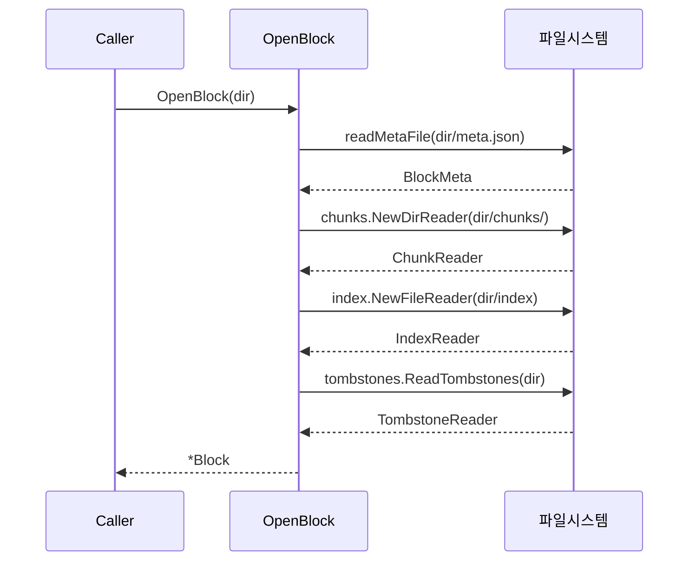
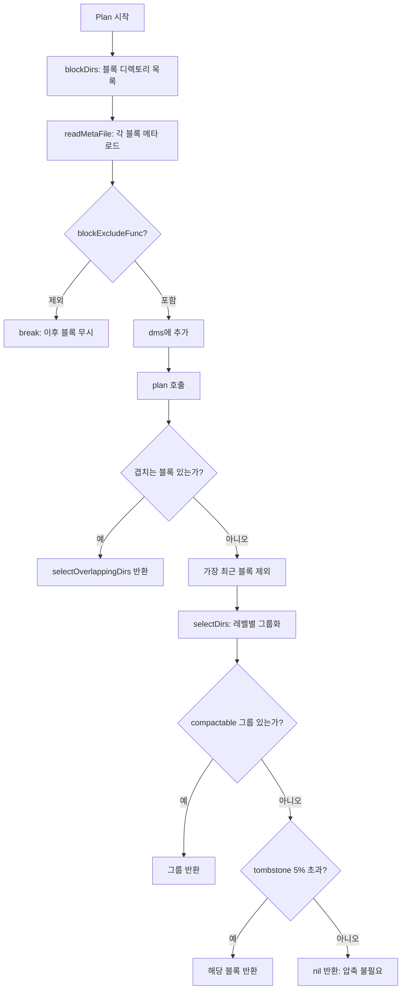
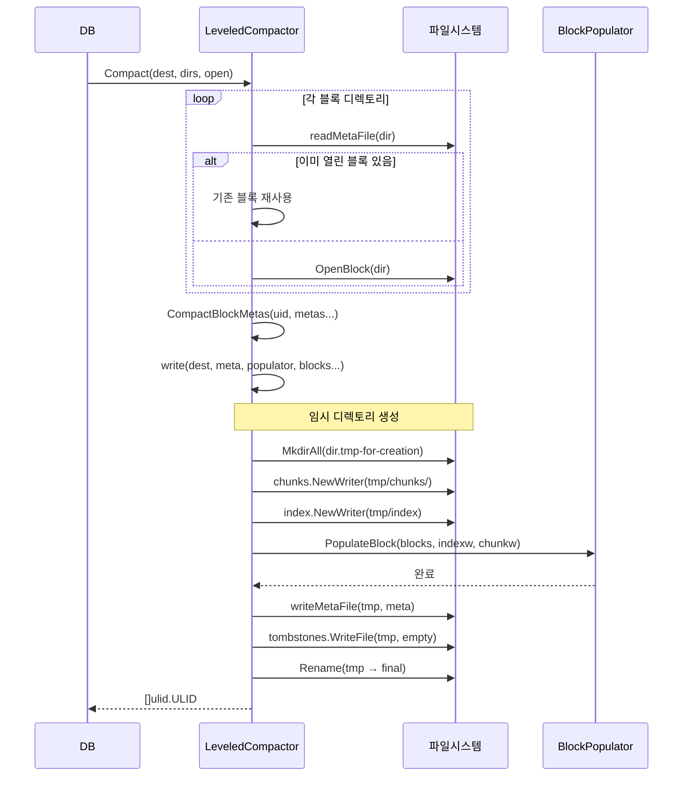

# 08. TSDB Block & Compaction Deep-Dive

## 목차

1. [Block 개요](#1-block-개요)
2. [Block 디렉토리 구조](#2-block-디렉토리-구조)
3. [BlockMeta 상세](#3-blockmeta-상세)
4. [Block 열기/닫기](#4-block-열기닫기)
5. [Block에서 데이터 읽기](#5-block에서-데이터-읽기)
6. [레벨 기반 압축 전략](#6-레벨-기반-압축-전략)
7. [Plan() 알고리즘](#7-plan-알고리즘)
8. [Compact() 과정](#8-compact-과정)
9. [Head -> Block 압축](#9-head---block-압축)
10. [Vertical Compaction](#10-vertical-compaction)
11. [Retention (보존 정책)](#11-retention-보존-정책)
12. [블록 삭제](#12-블록-삭제)
13. [지연 압축 (Delayed Compaction)](#13-지연-압축-delayed-compaction)

---

## 1. Block 개요

### 불변 디스크 블록이란

Prometheus TSDB에서 **Block**은 특정 시간 범위의 시계열 데이터를 담는 **불변(immutable) 디스크 저장 단위**다. 한번 디스크에 기록된 블록은 삭제(tombstone 처리)를 제외하면 내용이 변경되지 않는다. 이 불변성은 동시 읽기/쓰기 시 잠금(lock) 경합을 최소화하고, 블록 단위의 원자적 교체를 가능하게 한다.

소스 코드에서 Block 구조체는 다음과 같이 정의되어 있다:

```
// 파일: tsdb/block.go (라인 312-335)

type Block struct {
    mtx            sync.RWMutex
    closing        bool
    pendingReaders sync.WaitGroup

    dir  string
    meta BlockMeta

    symbolTableSize uint64

    chunkr     ChunkReader
    indexr     IndexReader
    tombstones tombstones.Reader

    logger *slog.Logger

    numBytesChunks    int64
    numBytesIndex     int64
    numBytesTombstone int64
    numBytesMeta      int64
}
```

### 시간 기반 파티셔닝

TSDB는 시간 축을 따라 데이터를 블록 단위로 파티셔닝한다. 각 블록은 반개방 구간 `[MinTime, MaxTime)`을 커버한다.

```
시간축 →
├─────────────┤─────────────┤─────────────┤─────────────┤ ...
│  Block A    │  Block B    │  Block C    │   Head      │
│ [0h, 2h)    │ [2h, 4h)    │ [4h, 6h)    │ [6h, now)   │
│  Level 1    │  Level 1    │  Level 1    │ (in-memory) │
├─────────────┤─────────────┤─────────────┤─────────────┤

     ↓ Compaction 후

├─────────────────────────────┤─────────────┤─────────────┤
│          Block D            │  Block C    │   Head      │
│        [0h, 4h)             │ [4h, 6h)    │ [6h, now)   │
│         Level 2             │  Level 1    │ (in-memory) │
├─────────────────────────────┤─────────────┤─────────────┤
```

이러한 시간 기반 파티셔닝의 핵심 이점:

| 이점 | 설명 |
|------|------|
| 쿼리 효율성 | 시간 범위 쿼리 시 해당 블록만 스캔하면 됨 |
| 데이터 삭제 효율성 | 오래된 블록 전체를 삭제하면 retention 구현 가능 |
| 쓰기와 읽기 분리 | Head에만 쓰기, 블록은 읽기 전용 |
| 압축 용이성 | 시간 범위가 인접한 블록끼리 병합 |

---

## 2. Block 디렉토리 구조

### 디렉토리 레이아웃

각 블록은 ULID(Universally Unique Lexicographically Sortable Identifier)를 이름으로 하는 디렉토리에 저장된다:

```
data/
├── 01BKGV7JBM69T2G1BGBGM6KB12/    ← ULID 블록 디렉토리
│   ├── chunks/
│   │   └── 000001                   ← 청크 세그먼트 파일 (시계열 데이터)
│   ├── index                        ← 인덱스 파일 (시리즈 → 청크 매핑)
│   ├── meta.json                    ← 블록 메타데이터
│   └── tombstones                   ← 삭제 마커
├── 01BKGTZQ1SYQJTR4PB43C8PD98/
│   ├── chunks/
│   │   ├── 000001
│   │   └── 000002                   ← 512MB 초과 시 세그먼트 분할
│   ├── index
│   ├── meta.json
│   └── tombstones
├── chunks_head/                      ← Head 메모리 매핑 청크
├── wal/                              ← Write-Ahead Log
└── lock                              ← 프로세스 잠금 파일
```

### 각 파일의 역할

소스 코드에서 파일명 상수와 디렉토리 헬퍼:

```
// 파일: tsdb/block.go (라인 242-256)

const (
    indexFilename = "index"
    metaFilename  = "meta.json"
    metaVersion1  = 1
)

func chunkDir(dir string) string { return filepath.Join(dir, "chunks") }
```

| 파일/디렉토리 | 역할 | 크기 특성 |
|--------------|------|----------|
| `chunks/000001` | 실제 시계열 샘플 데이터. XOR 인코딩(float), 히스토그램 인코딩 등 | 세그먼트당 최대 512MB (기본값) |
| `index` | 시리즈 라벨 → 포스팅 리스트 → 청크 오프셋 매핑 | 블록 크기의 약 10-30% |
| `meta.json` | 블록의 시간 범위, 통계, 압축 히스토리 | 수 KB |
| `tombstones` | 삭제된 시리즈/시간 범위 마커 | 일반적으로 매우 작음 |

### 임시 디렉토리 접미사

블록 생성과 삭제의 원자성을 보장하기 위해 임시 디렉토리 접미사를 사용한다:

```
// 파일: tsdb/db.go (라인 65-69)

tmpForDeletionBlockDirSuffix = ".tmp-for-deletion"
tmpForCreationBlockDirSuffix = ".tmp-for-creation"
tmpLegacy                    = ".tmp"   // Pre-2.21 호환용
```

**왜 접미사 방식인가?** `meta.json`을 마지막에 생성하는 방식 대신 접미사를 사용하는 이유는, 오류 발생 시에도 블록 내용물로부터 `meta.json`을 복구할 수 있기 때문이다. 접미사가 붙은 디렉토리는 TSDB 시작 시 정리된다.

---

## 3. BlockMeta 상세

### BlockMeta 구조체

`meta.json` 파일에 직렬화되는 핵심 메타데이터 구조체:

```
// 파일: tsdb/block.go (라인 163-181)

type BlockMeta struct {
    ULID       ulid.ULID            `json:"ulid"`
    MinTime    int64                `json:"minTime"`
    MaxTime    int64                `json:"maxTime"`
    Stats      BlockStats           `json:"stats,omitempty"`
    Compaction BlockMetaCompaction  `json:"compaction"`
    Version    int                  `json:"version"`
}
```

### 필드 상세 설명

#### ULID

ULID는 시간 순서를 보장하는 고유 식별자다. 블록이 압축(compaction)될 때마다 새 ULID가 생성된다. ULID의 상위 48비트는 타임스탬프이므로, ULID 자체가 블록 생성 시점을 인코딩한다.

#### MinTime / MaxTime

블록이 포함하는 샘플의 시간 범위를 밀리초 단위로 표현한다. 블록 구간은 **반개방(half-open)**: `[MinTime, MaxTime)`.

```go
// 파일: tsdb/block.go (라인 726-730)
func (pb *Block) OverlapsClosedInterval(mint, maxt int64) bool {
    // 블록 자체는 반개방 구간 [pb.meta.MinTime, pb.meta.MaxTime)
    return pb.meta.MinTime <= maxt && mint < pb.meta.MaxTime
}
```

#### BlockStats

```
// 파일: tsdb/block.go (라인 183-191)

type BlockStats struct {
    NumSamples          uint64 `json:"numSamples,omitempty"`
    NumFloatSamples     uint64 `json:"numFloatSamples,omitempty"`
    NumHistogramSamples uint64 `json:"numHistogramSamples,omitempty"`
    NumSeries           uint64 `json:"numSeries,omitempty"`
    NumChunks           uint64 `json:"numChunks,omitempty"`
    NumTombstones       uint64 `json:"numTombstones,omitempty"`
}
```

| 필드 | 설명 |
|------|------|
| `NumSamples` | 블록 내 전체 샘플 수 |
| `NumFloatSamples` | float64 타입 샘플 수 |
| `NumHistogramSamples` | 히스토그램 타입 샘플 수 |
| `NumSeries` | 고유 시리즈(metric+labels 조합) 수 |
| `NumChunks` | 청크 수 (시리즈당 여러 청크 가능) |
| `NumTombstones` | 삭제 마커 수 |

#### BlockMetaCompaction

```
// 파일: tsdb/block.go (라인 200-216)

type BlockMetaCompaction struct {
    Level     int          `json:"level"`
    Sources   []ulid.ULID  `json:"sources,omitempty"`
    Deletable bool         `json:"deletable,omitempty"`
    Parents   []BlockDesc  `json:"parents,omitempty"`
    Failed    bool         `json:"failed,omitempty"`
    Hints     []string     `json:"hints,omitempty"`
}
```

| 필드 | 의미 |
|------|------|
| `Level` | 압축 깊이. Head에서 직접 생성 = Level 1, 두 블록 병합 = max(Level) + 1 |
| `Sources` | 이 블록을 구성하는 원본 Head 블록들의 ULID 목록 |
| `Deletable` | 압축 결과 빈 블록이면 true (다음 reload 시 삭제) |
| `Parents` | 직접 부모 블록의 ULID/시간 범위 (압축 직전 블록들) |
| `Failed` | 이 블록의 압축이 실패했으면 true (Plan에서 제외) |
| `Hints` | 추가 힌트 (예: `from-out-of-order`, `from-stale-series`) |

### Compaction Hints

```
// 파일: tsdb/block.go (라인 247-253)

CompactionHintFromOutOfOrder  = "from-out-of-order"
CompactionHintFromStaleSeries = "from-stale-series"
```

OOO(Out-of-Order) 블록이나 stale 시리즈에서 생성된 블록을 구별하기 위해 Hints를 사용한다. 이 정보는 압축 시 부모 메타를 상속할 때 전파된다.

### meta.json 예시

```json
{
    "ulid": "01BKGV7JBM69T2G1BGBGM6KB12",
    "minTime": 1602237600000,
    "maxTime": 1602244800000,
    "stats": {
        "numSamples": 5839420,
        "numFloatSamples": 5839420,
        "numSeries": 12847,
        "numChunks": 38541,
        "numTombstones": 0
    },
    "compaction": {
        "level": 2,
        "sources": [
            "01BKGTZQ1SYQJTR4PB43C8PD98",
            "01BKGV7JBM69T2G1BGBGM6KB12"
        ],
        "parents": [
            {
                "ulid": "01BKG...(블록 A)",
                "minTime": 1602237600000,
                "maxTime": 1602244800000
            },
            {
                "ulid": "01BKG...(블록 B)",
                "minTime": 1602244800000,
                "maxTime": 1602252000000
            }
        ]
    },
    "version": 1
}
```

---

## 4. Block 열기/닫기

### OpenBlock()

`OpenBlock()`은 디스크의 블록 디렉토리를 열어 메모리에 로드한다:

```
// 파일: tsdb/block.go (라인 339-390)

func OpenBlock(logger *slog.Logger, dir string, pool chunkenc.Pool,
    postingsDecoderFactory PostingsDecoderFactory) (pb *Block, err error) {

    var closers []io.Closer
    defer func() {
        if err != nil {
            err = errors.Join(err, closeAll(closers))  // 실패 시 열었던 리소스 정리
        }
    }()

    meta, sizeMeta, err := readMetaFile(dir)           // 1. meta.json 읽기
    ...
    cr, err := chunks.NewDirReader(chunkDir(dir), pool) // 2. chunks/ 디렉토리 열기
    closers = append(closers, cr)

    ir, err := index.NewFileReader(...)                 // 3. index 파일 열기
    closers = append(closers, ir)

    tr, sizeTomb, err := tombstones.ReadTombstones(dir) // 4. tombstones 읽기
    closers = append(closers, tr)

    pb = &Block{
        dir:               dir,
        meta:              *meta,
        chunkr:            cr,
        indexr:            ir,
        tombstones:        tr,
        symbolTableSize:   ir.SymbolTableSize(),
        numBytesChunks:    cr.Size(),
        numBytesIndex:     ir.Size(),
        numBytesTombstone: sizeTomb,
        numBytesMeta:      sizeMeta,
    }
    return pb, nil
}
```



### Close()와 pendingReaders

블록 닫기는 진행 중인 읽기가 모두 완료될 때까지 **블로킹(blocking)**된다:

```
// 파일: tsdb/block.go (라인 393-405)

func (pb *Block) Close() error {
    pb.mtx.Lock()
    pb.closing = true           // 새로운 읽기 차단
    pb.mtx.Unlock()

    pb.pendingReaders.Wait()    // 기존 읽기 완료 대기

    return errors.Join(
        pb.chunkr.Close(),
        pb.indexr.Close(),
        pb.tombstones.Close(),
    )
}
```

`pendingReaders`는 `sync.WaitGroup`으로 구현된다. `startRead()`로 카운트를 증가시키고, 각 reader의 `Close()`에서 `Done()`을 호출한다:

```
// 파일: tsdb/block.go (라인 431-440)

func (pb *Block) startRead() error {
    pb.mtx.RLock()
    defer pb.mtx.RUnlock()

    if pb.closing {
        return ErrClosing    // "block is closing" 에러 반환
    }
    pb.pendingReaders.Add(1)
    return nil
}
```

이 패턴은 **안전한 블록 교체**를 보장한다. 압축으로 새 블록이 생성되어도, 기존 블록을 읽고 있는 쿼리가 완료될 때까지 삭제를 대기한다.

```
        ┌────── Block 열기 ──────┐
        │                        │
   startRead() ──┬── Index()     │   Reader 획득
                 ├── Chunks()    │   pendingReaders++
                 └── Tombstones()│
        │                        │
   ... 쿼리 수행 ...              │
        │                        │
   reader.Close()                │   pendingReaders--
        │                        │
        └────── Block 닫기 ──────┘
                  │
        Close() 호출
        closing = true ← 새 읽기 차단
        pendingReaders.Wait() ← 기존 읽기 대기
        chunkr/indexr/tombstones Close()
```

---

## 5. Block에서 데이터 읽기

### BlockReader 인터페이스

블록에서 데이터를 읽기 위한 핵심 인터페이스:

```
// 파일: tsdb/block.go (라인 145-161)

type BlockReader interface {
    Index() (IndexReader, error)
    Chunks() (ChunkReader, error)
    Tombstones() (tombstones.Reader, error)
    Meta() BlockMeta
    Size() int64
}
```

### IndexReader

인덱스 리더는 라벨 → 시리즈 → 청크 매핑을 제공한다:

```
// 파일: tsdb/block.go (라인 60-110) - 주요 메서드

type IndexReader interface {
    Symbols() index.StringIter                           // 모든 심볼(라벨 이름/값) 반복
    LabelValues(ctx, name, hints, matchers) ([]string, error)  // 특정 라벨의 값 목록
    Postings(ctx, name, values) (index.Postings, error)  // 라벨 쌍의 포스팅 리스트
    Series(ref, builder, chks) error                     // 시리즈 ID → 라벨 + 청크 메타
    LabelNames(ctx, matchers) ([]string, error)          // 모든 라벨 이름
    Close() error
}
```

### ChunkReader

청크 리더는 실제 시계열 데이터를 반환한다:

```
// 파일: tsdb/block.go (라인 125-143)

type ChunkReader interface {
    ChunkOrIterable(meta chunks.Meta) (chunkenc.Chunk, chunkenc.Iterable, error)
    Close() error
}
```

`ChunkOrIterable`은 두 가지 반환 방식을 지원한다:
- **단일 청크**: 기존 청크를 그대로 반환 (일반적 경우)
- **Iterable**: 여러 청크의 샘플을 합쳐야 하는 경우 (OOO 데이터 등)

### 래퍼(Wrapper) 패턴

Block은 실제 reader를 래퍼로 감싸서 `pendingReaders` 카운트를 관리한다:

```
// 파일: tsdb/block.go (라인 481-484, 559-562)

type blockIndexReader struct {
    ir IndexReader
    b  *Block
}

func (r blockIndexReader) Close() error {
    r.b.pendingReaders.Done()  // reader 닫을 때 카운트 감소
    return nil
}
```

`blockChunkReader`와 `blockTombstoneReader`도 동일한 패턴을 따른다. 이 래퍼 덕분에 블록의 어떤 reader를 사용하든 `Close()` 호출 시 자동으로 pendingReaders가 감소한다.

### 쿼리 흐름

```
블록에서 특정 시리즈 데이터를 읽는 흐름:

1. IndexReader.Postings("__name__", "http_requests_total")
   → 해당 라벨 쌍에 매칭되는 시리즈 ID(포스팅) 목록 반환

2. IndexReader.Series(seriesRef, &builder, &chks)
   → 시리즈 ID로 라벨 셋과 청크 메타 목록 반환

3. ChunkReader.ChunkOrIterable(chunkMeta)
   → 청크 메타의 파일 오프셋으로 실제 샘플 데이터 반환

4. chunk.Iterator()
   → 청크 내 개별 샘플 순회
```

---

## 6. 레벨 기반 압축 전략

### 왜 레벨 기반인가

시계열 데이터베이스에서 작은 블록이 무한히 쌓이면 다음 문제가 발생한다:
- **쿼리 시 너무 많은 블록을 열어야 함**: 1주일 범위 쿼리에 수백 개 블록 스캔
- **파일 디스크립터 낭비**: 블록당 최소 3개(index, chunks, tombstones) 파일
- **인덱스 오버헤드**: 블록마다 독립적 인덱스를 유지

레벨 기반 압축은 LSM(Log-Structured Merge) 트리와 유사한 전략으로, 시간이 지남에 따라 작은 블록들을 큰 블록으로 병합한다.

### Ranges 설정

`ExponentialBlockRanges` 함수로 압축 범위를 생성한다:

```
// 파일: tsdb/compact.go (라인 41-50)

func ExponentialBlockRanges(minSize int64, steps, stepSize int) []int64 {
    ranges := make([]int64, 0, steps)
    curRange := minSize
    for range steps {
        ranges = append(ranges, curRange)
        curRange *= int64(stepSize)
    }
    return ranges
}
```

Prometheus 기본 설정은 `ExponentialBlockRanges(2h, steps, 3)`으로 다음과 같은 범위를 생성한다:

```
ranges = [2h, 6h, 18h, 54h, 162h, ...]

시간축 (시간 단위)
│
│ Level 1: ┌──┐┌──┐┌──┐┌──┐┌──┐┌──┐┌──┐┌──┐┌──┐  (2시간 블록)
│          └──┘└──┘└──┘└──┘└──┘└──┘└──┘└──┘└──┘
│
│ Level 2: ┌────────┐┌────────┐┌────────┐          (6시간 블록 = 2h x 3)
│          └────────┘└────────┘└────────┘
│
│ Level 3: ┌──────────────────────────┐            (18시간 블록 = 6h x 3)
│          └──────────────────────────┘
│
│ Level 4: ┌────────────────────────────────────...  (54시간 블록 = 18h x 3)
│          └────────────────────────────────────...
│
└──────────────────────────────────────────────────→ 시간
  0h   2h   4h   6h   8h  10h  12h  14h  16h  18h
```

### DefaultBlockDuration

```
// 파일: tsdb/db.go (라인 54-55)

const DefaultBlockDuration = int64(2 * time.Hour / time.Millisecond)
```

Head에서 디스크로 플러시되는 최소 블록의 시간 범위는 **2시간**이다. 이 값은 다음 트레이드오프를 반영한다:

| 항목 | 작은 블록 (예: 30분) | 큰 블록 (예: 24시간) |
|------|---------------------|---------------------|
| WAL 크기 | 작음 | 큼 |
| 복구 시간 | 빠름 | 느림 |
| 쿼리 오버헤드 | 높음 (블록 수 많음) | 낮음 |
| 데이터 손실 위험 | 낮음 | 높음 |

### MaxBlockDuration

최대 블록 크기는 retention의 10% 또는 31일 중 작은 값으로 설정된다. 너무 큰 블록은 retention 정책 적용 시 세밀한 제어가 어렵기 때문이다.

```
// 파일: tsdb/db.go (라인 83)
// 기본값에서는 MinBlockDuration과 동일하게 시작하지만,
// Open() 시 retention에 맞게 조정됨

MaxBlockDuration: DefaultBlockDuration,
```

---

## 7. Plan() 알고리즘

### 전체 흐름

`Plan()` 메서드는 압축 대상 블록 목록을 반환한다:



### Plan() 코드 분석

```
// 파일: tsdb/compact.go (라인 249-277)

func (c *LeveledCompactor) Plan(dir string) ([]string, error) {
    dirs, err := blockDirs(dir)
    ...
    var dms []dirMeta
    for _, dir := range dirs {
        meta, _, err := readMetaFile(dir)
        ...
        if c.blockExcludeFunc != nil && c.blockExcludeFunc(meta) {
            break    // 제외된 블록 이후는 모두 건너뜀 (연속성 보장)
        }
        dms = append(dms, dirMeta{dir, meta})
    }
    return c.plan(dms)
}
```

### plan() 내부 로직

```
// 파일: tsdb/compact.go (라인 279-328)

func (c *LeveledCompactor) plan(dms []dirMeta) ([]string, error) {
    // 1단계: MinTime 기준 정렬
    slices.SortFunc(dms, ...)

    // 2단계: 겹치는 블록 우선 처리
    res := c.selectOverlappingDirs(dms)
    if len(res) > 0 {
        return res, nil
    }

    // 3단계: 가장 최근 블록 제외 (아직 백업용으로 유지)
    dms = dms[:len(dms)-1]

    // 4단계: 레벨 기반 선택
    for _, dm := range c.selectDirs(dms) {
        res = append(res, dm.dir)
    }
    if len(res) > 0 {
        return res, nil
    }

    // 5단계: tombstone 비율 기반 압축
    for i := len(dms) - 1; i >= 0; i-- {
        meta := dms[i].meta
        if meta.MaxTime-meta.MinTime < c.ranges[len(c.ranges)/2] {
            // 블록이 전부 삭제된 경우
            if meta.Stats.NumTombstones > 0 &&
               meta.Stats.NumTombstones >= meta.Stats.NumSeries {
                return []string{dms[i].dir}, nil
            }
            break
        }
        // tombstone가 시리즈의 5% 이상이면 압축
        if float64(meta.Stats.NumTombstones)/float64(meta.Stats.NumSeries+1) > 0.05 {
            return []string{dms[i].dir}, nil
        }
    }

    return nil, nil
}
```

### splitByRange() 알고리즘

시간 범위별 블록 그룹화의 핵심 함수:

```
// 파일: tsdb/compact.go (라인 400-437)

func splitByRange(ds []dirMeta, tr int64) [][]dirMeta {
    var splitDirs [][]dirMeta

    for i := 0; i < len(ds); {
        var group []dirMeta
        m := ds[i].meta

        // 시간 범위 tr에 정렬된 시작 시간 t0 계산
        if m.MinTime >= 0 {
            t0 = tr * (m.MinTime / tr)
        } else {
            t0 = tr * ((m.MinTime - tr + 1) / tr)
        }

        // 범위를 초과하는 블록은 건너뜀
        if m.MaxTime > t0+tr {
            i++
            continue
        }

        // [t0, t0+tr] 범위 내 모든 블록 수집
        for ; i < len(ds); i++ {
            if ds[i].meta.MaxTime > t0+tr {
                break
            }
            group = append(group, ds[i])
        }
        if len(group) > 0 {
            splitDirs = append(splitDirs, group)
        }
    }
    return splitDirs
}
```

예시: `tr = 6h`일 때:

```
블록: [0-2h] [2-4h] [4-6h] [8-10h] [10-12h] [14-16h]

splitByRange 결과:
  그룹 1: [0-2h, 2-4h, 4-6h]    → t0=0h, 범위 [0h, 6h)
  그룹 2: [8-10h, 10-12h]        → t0=6h, 범위 [6h, 12h)
  그룹 3: [14-16h]               → t0=12h, 범위 [12h, 18h)
```

### selectDirs() - 레벨 기반 선택

```
// 파일: tsdb/compact.go (라인 330-367)

func (c *LeveledCompactor) selectDirs(ds []dirMeta) []dirMeta {
    if len(c.ranges) < 2 || len(ds) < 1 {
        return nil
    }
    highTime := ds[len(ds)-1].meta.MinTime

    for _, iv := range c.ranges[1:] {        // 작은 범위부터 순회
        parts := splitByRange(ds, iv)
        ...
        for _, p := range parts {
            // 압축 실패 블록이 포함된 그룹 건너뜀
            for _, dm := range p {
                if dm.meta.Compaction.Failed { continue Outer }
            }
            mint := p[0].meta.MinTime
            maxt := p[len(p)-1].meta.MaxTime
            // 범위를 꽉 채우거나, 최신 블록보다 이전이고, 2개 이상일 때
            if (maxt-mint == iv || maxt <= highTime) && len(p) > 1 {
                return p
            }
        }
    }
    return nil
}
```

**왜 가장 최근 블록을 제외하는가?** 가장 최근 블록을 Plan에서 제외하는 이유는 사용자가 블록 단위로 백업할 수 있는 시간 여유를 주기 위함이다. 이로 인해 새로 생성된 2시간 블록이 바로 압축되지 않고, 다음 블록이 생성된 후에야 압축 대상이 된다.

---

## 8. Compact() 과정

### 전체 흐름



### Compact() 메서드

```
// 파일: tsdb/compact.go (라인 485-584)

func (c *LeveledCompactor) Compact(dest string, dirs []string, open []*Block) ([]ulid.ULID, error) {
    return c.CompactWithBlockPopulator(dest, dirs, open, DefaultBlockPopulator{})
}
```

핵심 단계:

1. **블록 열기**: 각 디렉토리의 메타를 읽고, 이미 열린 블록이 있으면 재사용
2. **메타 병합**: `CompactBlockMetas()`로 새 메타 생성
3. **블록 쓰기**: `write()`로 임시 디렉토리에 새 블록 생성
4. **빈 블록 처리**: 결과가 빈 블록이면 원본 블록을 Deletable로 마킹
5. **에러 처리**: 실패 시 원본 블록에 `Failed` 플래그 설정

### CompactBlockMetas()

여러 블록의 메타를 하나로 병합:

```
// 파일: tsdb/compact.go (라인 441-481)

func CompactBlockMetas(uid ulid.ULID, blocks ...*BlockMeta) *BlockMeta {
    res := &BlockMeta{ULID: uid}
    sources := map[ulid.ULID]struct{}{}

    for _, b := range blocks {
        // MinTime/MaxTime: 전체 범위의 최소/최대
        if b.MinTime < mint { mint = b.MinTime }
        if b.MaxTime > maxt { maxt = b.MaxTime }
        // Level: 가장 높은 레벨 + 1
        if b.Compaction.Level > res.Compaction.Level {
            res.Compaction.Level = b.Compaction.Level
        }
        // Sources: 모든 원본 소스 합집합
        for _, s := range b.Compaction.Sources {
            sources[s] = struct{}{}
        }
        // Parents: 직접 부모로 기록
        res.Compaction.Parents = append(res.Compaction.Parents, BlockDesc{...})
    }
    res.Compaction.Level++
    ...
}
```

### write() - 임시 디렉토리에 블록 생성

```
// 파일: tsdb/compact.go (라인 658-769)

func (c *LeveledCompactor) write(dest string, meta *BlockMeta,
    blockPopulator BlockPopulator, blocks ...BlockReader) (err error) {

    dir := filepath.Join(dest, meta.ULID.String())
    tmp := dir + tmpForCreationBlockDirSuffix          // .tmp-for-creation

    // 1. 임시 디렉토리 생성
    os.MkdirAll(tmp, 0o777)

    // 2. 청크 writer 생성
    chunkw, err := chunks.NewWriter(chunkDir(tmp), ...)

    // 3. Level 1이면 계측(instrumented) writer로 감싸기
    if meta.Compaction.Level == 1 {
        chunkw = &instrumentedChunkWriter{...}
    }

    // 4. 인덱스 writer 생성
    indexw, err := index.NewWriterWithEncoder(...)

    // 5. 블록 채우기 (머지 정렬)
    blockPopulator.PopulateBlock(ctx, ..., blocks, meta, indexw, chunkw, ...)

    // 6. writers 닫기
    for _, w := range closers { w.Close() }

    // 7. 빈 블록이면 조기 반환
    if meta.Stats.NumSamples == 0 { return nil }

    // 8. meta.json 쓰기
    writeMetaFile(c.logger, tmp, meta)

    // 9. 빈 tombstones 파일 생성
    tombstones.WriteFile(c.logger, tmp, tombstones.NewMemTombstones())

    // 10. 디렉토리 sync
    df.Sync()

    // 11. 원자적 이름 변경: .tmp-for-creation → 최종 디렉토리
    fileutil.Replace(tmp, dir)
}
```

### PopulateBlock() - 머지 정렬

`DefaultBlockPopulator.PopulateBlock()`은 여러 블록의 시리즈를 **정렬된 순서**로 합친다:

```
// 파일: tsdb/compact.go (라인 793-938) - 주요 로직

func (DefaultBlockPopulator) PopulateBlock(...) error {
    // 1. 각 블록에서 IndexReader, ChunkReader, TombstoneReader 획득
    for i, b := range blocks {
        indexr, _ := b.Index()
        chunkr, _ := b.Chunks()
        tombsr, _ := b.Tombstones()

        // 정렬된 포스팅으로 ChunkSeriesSet 생성
        postings := postingsFunc(ctx, indexr)
        sets = append(sets, NewBlockChunkSeriesSet(..., postings, ...))

        // 심볼 테이블 머지
        symbols = NewMergedStringIter(symbols, indexr.Symbols())
    }

    // 2. 심볼 테이블 쓰기
    for symbols.Next() {
        indexw.AddSymbol(symbols.At())
    }

    // 3. 시리즈 머지 (겹치는 블록이 있으면 MergeChunkSeriesSet 사용)
    set := sets[0]
    if len(sets) > 1 {
        set = storage.NewMergeChunkSeriesSet(sets, 0, mergeFunc)
    }

    // 4. 정렬된 시리즈 순회하며 청크/인덱스 쓰기
    for set.Next() {
        s := set.At()
        chunkw.WriteChunks(chks...)
        indexw.AddSeries(ref, s.Labels(), chks...)

        meta.Stats.NumChunks += uint64(len(chks))
        meta.Stats.NumSeries++
        for _, chk := range chks {
            meta.Stats.NumSamples += uint64(chk.Chunk.NumSamples())
        }
    }
}
```

---

## 9. Head -> Block 압축

### Head Compaction이란

Head는 메모리에 존재하는 가장 최근 데이터 블록이다. 충분한 시간이 지나면(최소 `chunkRange/2` = 1시간 이상) Head의 완료된 범위를 디스크 블록으로 변환한다.

### compactHead() 흐름

```
// 파일: tsdb/db.go (라인 1636-1661)

func (db *DB) compactHead(head *RangeHead) error {
    db.lastHeadCompactionTime = time.Now()

    // 1. LeveledCompactor.Write()로 블록 생성
    uids, err := db.compactor.Write(db.dir, head, head.MinTime(), head.BlockMaxTime(), nil)
    ...

    // 2. 블록 리로드
    if err := db.reloadBlocks(); err != nil {
        // 실패 시 새로 생성한 블록 삭제
        for _, uid := range uids {
            os.RemoveAll(filepath.Join(db.dir, uid.String()))
        }
        return ...
    }

    // 3. Head 메모리 truncate
    db.head.truncateMemory(head.BlockMaxTime())

    // 4. 심볼 테이블 재구축
    db.head.RebuildSymbolTable(db.logger)
    return nil
}
```

### RangeHead

`RangeHead`는 Head의 특정 시간 범위만 읽는 뷰(view)다:

```
// 파일: tsdb/db.go (라인 1458-1468)

// Head에서 mint~maxt-1 범위만 읽는 RangeHead 생성
mint := db.head.MinTime()
maxt := rangeForTimestamp(mint, db.head.chunkRange.Load())

// 블록 구간은 반개방 [mint, maxt) 이지만
// 청크 구간은 폐구간 [mint, maxt] 이므로 maxt-1 사용
rh := NewRangeHeadWithIsolationDisabled(db.head, mint, maxt-1)
```

### LeveledCompactor.Write()

Head에서 블록을 생성하는 전용 메서드:

```
// 파일: tsdb/compact.go (라인 586-636)

func (c *LeveledCompactor) Write(dest string, b BlockReader,
    mint, maxt int64, base *BlockMeta) ([]ulid.ULID, error) {

    uid := ulid.MustNew(ulid.Now(), rand.Reader)

    meta := &BlockMeta{
        ULID:    uid,
        MinTime: mint,
        MaxTime: maxt,
    }
    meta.Compaction.Level = 1          // Head에서 직접 생성이므로 Level 1
    meta.Compaction.Sources = []ulid.ULID{uid}

    // OOO/StaleSeries 힌트 상속
    if base != nil {
        meta.Compaction.Parents = []BlockDesc{...}
        if base.Compaction.FromOutOfOrder() {
            meta.Compaction.SetOutOfOrder()
        }
    }

    err := c.write(dest, meta, DefaultBlockPopulator{}, b)
    ...
}
```

### Compact() 전체 루프

```
// 파일: tsdb/db.go (라인 1414-1506)

func (db *DB) Compact(ctx context.Context) (returnErr error) {
    db.cmtx.Lock()
    defer db.cmtx.Unlock()

    // Phase 1: Head Compaction (반복)
    for {
        if !db.head.compactable() {
            break
        }
        if db.waitingForCompactionDelay() {
            break
        }
        rh := NewRangeHeadWithIsolationDisabled(db.head, mint, maxt-1)
        db.head.WaitForAppendersOverlapping(rh.MaxTime())
        db.compactHead(rh)
        lastBlockMaxt = maxt
    }

    // WAL 잘라내기
    db.head.truncateWAL(lastBlockMaxt)

    // Phase 2: OOO Head Compaction
    if lastBlockMaxt != math.MinInt64 {
        db.compactOOOHead(ctx)
    }

    // Phase 3: Block Compaction
    return db.compactBlocks()
}
```

```
Head Compaction 타임라인:

  Head 상태:    [=====데이터=====|=====데이터=====|===진행중===]
  시간:         mint          maxt          maxt+range    now
                                                          ↑
                                                     쓰기 지점
                 ↓ compactable 영역
           [============]
           mint       maxt

  결과:
  디스크 블록:   [====Block====]
                mint       maxt
  Head:                         [===진행중===]
                               maxt         now
```

---

## 10. Vertical Compaction

### 겹치는 블록이란

일반적으로 블록의 시간 범위는 겹치지 않아야 한다. 하지만 다음 상황에서 겹침이 발생할 수 있다:

- **Out-of-Order(OOO) 데이터 수집**: 과거 시점의 데이터가 늦게 도착
- **백필(Backfill)**: API를 통해 과거 데이터 삽입
- **블록 업로드**: 외부에서 블록을 직접 복사

### EnableOverlappingCompaction 옵션

```
// 파일: tsdb/db.go (라인 200-204)

// EnableOverlappingCompaction은 겹치는 블록의 압축을 허용한다.
// Prometheus에서는 항상 true이지만, Mimir/Thanos 같은 다운스트림 프로젝트에서는
// 별도 컴포넌트가 압축을 담당하므로 false로 설정할 수 있다.
EnableOverlappingCompaction bool
```

### selectOverlappingDirs()

겹치는 블록 감지 및 선택:

```
// 파일: tsdb/compact.go (라인 369-394)

func (c *LeveledCompactor) selectOverlappingDirs(ds []dirMeta) []string {
    if !c.enableOverlappingCompaction {
        return nil
    }
    if len(ds) < 2 {
        return nil
    }

    var overlappingDirs []string
    globalMaxt := ds[0].meta.MaxTime

    for i, d := range ds[1:] {
        if d.meta.MinTime < globalMaxt {           // 겹침 발견!
            if len(overlappingDirs) == 0 {
                overlappingDirs = append(overlappingDirs, ds[i].dir)
            }
            overlappingDirs = append(overlappingDirs, d.dir)
        } else if len(overlappingDirs) > 0 {
            break                                   // 연속 겹침 종료
        }
        if d.meta.MaxTime > globalMaxt {
            globalMaxt = d.meta.MaxTime
        }
    }
    return overlappingDirs
}
```

### Vertical Compaction 동작 원리

```
겹치는 블록 상태:

Block A: [==========]
         0h        4h

Block B:      [==========]
              2h        6h

Block C:           [==========]
                   4h        8h

selectOverlappingDirs 결과: [A, B]  (A와 B가 겹침)

Vertical Compaction 후:

Block D: [===============]
         0h             6h    ← A + B 머지

Block C:           [==========]
                   4h        8h

다음 Compact에서:
Block E: [=======================]
         0h                    8h    ← D + C 머지
```

### OOO Compaction

```
// 파일: tsdb/db.go (라인 1590-1632)

func (db *DB) compactOOO(dest string, oooHead *OOOCompactionHead) (_ []ulid.ULID, err error) {
    blockSize := oooHead.ChunkRange()

    // OOO 데이터를 blockSize 단위로 분할하여 블록 생성
    for t := blockSize * (oooHeadMint / blockSize); t <= oooHeadMaxt; t += blockSize {
        mint, maxt := t, t+blockSize
        meta := &BlockMeta{}
        meta.Compaction.SetOutOfOrder()   // OOO 힌트 설정
        uids, err := db.compactor.Write(dest, oooHead.CloneForTimeRange(mint, maxt-1), mint, maxt, meta)
        ulids = append(ulids, uids...)
    }
}
```

OOO 블록은 기존 인-오더 블록과 시간 범위가 겹칠 수 있으므로, 이후 `selectOverlappingDirs()`에 의해 Vertical Compaction 대상이 된다.

---

## 11. Retention (보존 정책)

### 세 가지 보존 정책

Prometheus TSDB는 세 가지 보존 정책을 지원한다:

```
// 파일: tsdb/db.go (라인 119-133)

RetentionDuration int64   // 시간 기반 보존 (밀리초)
MaxBytes          int64   // 크기 기반 보존 (바이트)
MaxPercentage     uint    // 백분율 기반 보존 (%)
```

| 정책 | 설정 | 기본값 | 동작 |
|------|------|--------|------|
| 시간 기반 | `--storage.tsdb.retention.time` | 15일 | 가장 최신 블록과의 시간 차이 기준 |
| 크기 기반 | `--storage.tsdb.retention.size` | 비활성 | WAL + Head + 블록 합계 기준 |
| 백분율 기반 | `--storage.tsdb.retention.percentage` | 비활성 | 디스크 전체 크기 대비 비율 |

### deletableBlocks()

모든 보존 정책을 통합하는 함수:

```
// 파일: tsdb/db.go (라인 1941-1972)

func deletableBlocks(db *DB, blocks []*Block) map[ulid.ULID]struct{} {
    deletable := make(map[ulid.ULID]struct{})

    // 1. MaxTime 기준 내림차순 정렬 (최신 → 오래된 순)
    slices.SortFunc(blocks, func(a, b *Block) int {
        // b.MaxTime > a.MaxTime 이면 a가 먼저 (내림차순)
        ...
    })

    // 2. Compaction.Deletable 플래그로 표시된 블록
    for _, block := range blocks {
        if block.Meta().Compaction.Deletable {
            deletable[block.Meta().ULID] = struct{}{}
        }
    }

    // 3. 시간 기반 보존 위반 블록
    for ulid := range BeyondTimeRetention(db, blocks) {
        deletable[ulid] = struct{}{}
    }

    // 4. 크기 기반 보존 위반 블록
    for ulid := range BeyondSizeRetention(db, blocks) {
        deletable[ulid] = struct{}{}
    }

    return deletable
}
```

### BeyondTimeRetention()

```
// 파일: tsdb/db.go (라인 1976-1996)

func BeyondTimeRetention(db *DB, blocks []*Block) (deletable map[ulid.ULID]struct{}) {
    retentionDuration := db.getRetentionDuration()
    if len(blocks) == 0 || retentionDuration == 0 {
        return deletable
    }

    deletable = make(map[ulid.ULID]struct{})
    for i, block := range blocks {
        // blocks[0]은 최신 블록 (MaxTime이 가장 큰 블록)
        // 최신 블록의 MaxTime - 현재 블록의 MaxTime >= retention 이면 삭제
        if i > 0 && blocks[0].Meta().MaxTime-block.Meta().MaxTime >= retentionDuration {
            for _, b := range blocks[i:] {
                deletable[b.meta.ULID] = struct{}{}
            }
            db.metrics.timeRetentionCount.Inc()
            break
        }
    }
    return deletable
}
```

```
시간 기반 Retention 예시 (retention = 15일):

블록들 (MaxTime 내림차순 정렬):

  blocks[0]: MaxTime = Day 20  ← 최신
  blocks[1]: MaxTime = Day 18
  blocks[2]: MaxTime = Day 12
  blocks[3]: MaxTime = Day 5   ← Day 20 - Day 5 = 15일 >= retention
  blocks[4]: MaxTime = Day 3   ← 삭제 대상
  blocks[5]: MaxTime = Day 1   ← 삭제 대상

  → blocks[3], blocks[4], blocks[5] 삭제
```

### BeyondSizeRetention()

```
// 파일: tsdb/db.go (라인 2000-2039)

func BeyondSizeRetention(db *DB, blocks []*Block) (deletable map[ulid.ULID]struct{}) {
    maxBytes, maxPercentage := db.getRetentionSettings()

    // 백분율 기반이 우선
    if maxPercentage > 0 {
        diskSize := db.fsSizeFunc(db.dir)
        if diskSize > 0 {
            maxBytes = int64(uint64(maxPercentage) * diskSize / 100)
        }
    }

    if maxBytes <= 0 {
        return deletable
    }

    deletable = make(map[ulid.ULID]struct{})

    // WAL + Head 크기부터 시작
    blocksSize := db.Head().Size()
    for i, block := range blocks {    // 최신 → 오래된 순
        blocksSize += block.Size()
        if blocksSize > maxBytes {
            // 이 블록부터 이후 모든 블록 삭제
            for _, b := range blocks[i:] {
                deletable[b.meta.ULID] = struct{}{}
            }
            db.metrics.sizeRetentionCount.Inc()
            break
        }
    }
    return deletable
}
```

```
크기 기반 Retention 예시 (maxBytes = 10GB):

  Head + WAL: 2GB

  blocks[0]: 3GB  (누적: 5GB)  ← 유지
  blocks[1]: 3GB  (누적: 8GB)  ← 유지
  blocks[2]: 3GB  (누적: 11GB) ← 초과! 삭제 대상
  blocks[3]: 2GB  (누적: 13GB) ← 삭제 대상

  → blocks[2], blocks[3] 삭제
```

### 런타임 설정 변경

보존 정책은 설정 파일 리로드를 통해 런타임에 변경 가능하다:

```
// 파일: tsdb/db.go (라인 1278-1292)

if conf.StorageConfig.TSDBConfig.Retention != nil {
    db.retentionMtx.Lock()
    if conf.StorageConfig.TSDBConfig.Retention.Time > 0 {
        db.opts.RetentionDuration = int64(conf.StorageConfig.TSDBConfig.Retention.Time)
    }
    if conf.StorageConfig.TSDBConfig.Retention.Size > 0 {
        db.opts.MaxBytes = int64(conf.StorageConfig.TSDBConfig.Retention.Size)
    }
    if conf.StorageConfig.TSDBConfig.Retention.Percentage > 0 {
        db.opts.MaxPercentage = conf.StorageConfig.TSDBConfig.Retention.Percentage
    }
    db.retentionMtx.Unlock()
}
```

---

## 12. 블록 삭제

### 안전한 삭제 프로토콜

블록 삭제는 두 단계로 이루어진다:

1. **원자적 이름 변경**: `ULID/` → `ULID.tmp-for-deletion/`
2. **디렉토리 삭제**: `os.RemoveAll(ULID.tmp-for-deletion/)`

```
// 파일: tsdb/db.go (라인 2045-2074)

func (db *DB) deleteBlocks(blocks map[ulid.ULID]*Block) error {
    for ulid, block := range blocks {
        // 1. 열려 있으면 닫기 (pendingReaders 대기)
        if block != nil {
            if err := block.Close(); err != nil {
                db.logger.Warn("Closing block failed", "err", err, "block", ulid)
            }
        }

        toDelete := filepath.Join(db.dir, ulid.String())
        switch _, err := os.Stat(toDelete); {
        case os.IsNotExist(err):
            continue   // 이미 삭제됨
        case err != nil:
            return ...
        }

        // 2. 원자적 이름 변경 → .tmp-for-deletion
        tmpToDelete := filepath.Join(db.dir, fmt.Sprintf("%s%s", ulid, tmpForDeletionBlockDirSuffix))
        fileutil.Replace(toDelete, tmpToDelete)

        // 3. 실제 삭제
        os.RemoveAll(tmpToDelete)
        db.logger.Info("Deleting obsolete block", "block", ulid)
    }
    return nil
}
```

### 왜 이름 변경 후 삭제하는가?

```
직접 삭제의 위험:

  os.RemoveAll("01BKGV7J.../")
       ↓
  chunks/000001 삭제 완료
  index 삭제 중... ← 여기서 크래시!

  재시작 시: 불완전한 블록 디렉토리가 남음 (index 없는 상태)
  → 블록을 열 수 없지만, 블록 목록에는 존재

원자적 이름 변경 후 삭제:

  rename("01BKGV7J.../", "01BKGV7J...tmp-for-deletion/")  ← 원자적
       ↓
  os.RemoveAll("01BKGV7J...tmp-for-deletion/")
       ↓ 여기서 크래시!

  재시작 시: .tmp-for-deletion 접미사 디렉토리는 시작 시 정리됨
  → 안전하게 복구
```

### reloadBlocks()에서의 삭제 트리거

```
// 파일: tsdb/db.go (라인 1795-1901)

func (db *DB) reloadBlocks() (err error) {
    // 1. 디스크의 모든 블록 열기
    loadable, corrupted, err := openBlocks(...)

    // 2. 삭제 대상 결정
    deletableULIDs := db.blocksToDelete(loadable)

    // 3. 부모 블록도 삭제 대상에 추가
    for _, block := range loadable {
        for _, b := range block.Meta().Compaction.Parents {
            deletable[b.ULID] = nil
        }
    }

    // 4. 삭제 대상 제외한 블록만 로드
    for _, block := range loadable {
        if _, ok := deletable[block.Meta().ULID]; ok {
            deletable[block.Meta().ULID] = block
            continue
        }
        toLoad = append(toLoad, block)
    }

    // 5. 블록 목록 교체 (원자적)
    db.mtx.Lock()
    oldBlocks := db.blocks
    db.blocks = toLoad
    db.mtx.Unlock()

    // 6. 실제 삭제 수행
    db.deleteBlocks(deletable)
}
```

### pendingReaders와 안전한 삭제

블록을 닫을 때 `pendingReaders.Wait()`가 호출된다. 이는 진행 중인 쿼리가 완료될 때까지 블로킹된다:

```
삭제 시나리오:

시간  │  쿼리 Q1          │  Compaction
──────┼────────────────────┼─────────────────────
 t0   │  block.Index()     │
      │  pendingReaders=1  │
 t1   │  읽기 진행 중...    │  reloadBlocks() 시작
      │                    │  새 블록 목록으로 교체
 t2   │  읽기 진행 중...    │  deleteBlocks() 호출
      │                    │  block.Close() 호출
      │                    │  closing = true
      │                    │  pendingReaders.Wait() ← 블로킹!
 t3   │  reader.Close()    │
      │  pendingReaders=0  │  Wait() 반환!
      │                    │  chunkr/indexr Close
 t4   │                    │  디렉토리 삭제
```

---

## 13. 지연 압축 (Delayed Compaction)

### 배경과 목적

여러 Prometheus 인스턴스가 같은 시점에 압축을 수행하면 디스크 I/O가 동시에 몰려 성능 저하가 발생할 수 있다. 지연 압축은 각 인스턴스에 랜덤 지연을 부여하여 I/O를 시간적으로 분산시킨다.

### 설정 옵션

```
// 파일: tsdb/db.go (라인 57-58, 93-95)

const DefaultCompactionDelayMaxPercent = 10

// DefaultOptions에서:
EnableDelayedCompaction:     false,
CompactionDelayMaxPercent:   DefaultCompactionDelayMaxPercent,  // 10%
CompactionDelay:             time.Duration(0),
```

| 옵션 | 설명 |
|------|------|
| `EnableDelayedCompaction` | true이면 DB 열 때 랜덤 지연 생성 |
| `CompactionDelay` | 직접 지정 가능 (EnableDelayedCompaction보다 우선) |
| `CompactionDelayMaxPercent` | 최대 지연 = chunkRange의 이 % |

### 지연 시간 계산

```
// 파일: tsdb/db.go (라인 2260-2261)

func (db *DB) generateCompactionDelay() time.Duration {
    return time.Duration(
        rand.Int63n(db.head.chunkRange.Load() * int64(db.opts.CompactionDelayMaxPercent) / 100),
    ) * time.Millisecond
}
```

기본 설정에서:
- `chunkRange` = 2시간 = 7,200,000ms
- `CompactionDelayMaxPercent` = 10%
- 최대 지연 = 7,200,000 * 10 / 100 = 720,000ms = **12분**
- 실제 지연 = [0, 12분) 범위의 랜덤 값

### 지연 적용 흐름

```
// 파일: tsdb/db.go (라인 1140-1141)

// DB Open() 시
if opts.EnableDelayedCompaction {
    opts.CompactionDelay = db.generateCompactionDelay()
}
```

```
// 파일: tsdb/db.go (라인 1404-1407)

func (db *DB) waitingForCompactionDelay() bool {
    return time.Since(db.timeWhenCompactionDelayStarted) < db.opts.CompactionDelay
}
```

```
// Compact() 내부 (라인 1442-1457)

for {
    if !db.head.compactable() {
        // Head가 압축 불가 → 지연 타이머 리셋
        if !db.timeWhenCompactionDelayStarted.IsZero() {
            db.timeWhenCompactionDelayStarted = time.Time{}
        }
        break
    }

    if db.timeWhenCompactionDelayStarted.IsZero() {
        // Head가 압축 가능해진 시점 기록
        db.timeWhenCompactionDelayStarted = time.Now()
    }

    if db.waitingForCompactionDelay() {
        break   // 아직 지연 시간이 남았으면 압축하지 않음
    }

    // 지연 완료 → 압축 수행
    db.compactHead(rh)
}
```

### 지연 압축의 효과

```
여러 Prometheus 인스턴스 (지연 압축 미적용):

Instance A: ──────────┤COMPACT├──────────┤COMPACT├──
Instance B: ──────────┤COMPACT├──────────┤COMPACT├──
Instance C: ──────────┤COMPACT├──────────┤COMPACT├──
                      ↑                  ↑
               디스크 I/O 폭주      디스크 I/O 폭주

여러 Prometheus 인스턴스 (지연 압축 적용):

Instance A: ──────┤COMPACT├──────────────┤COMPACT├──
Instance B: ────────────┤COMPACT├────────────┤COMPACT├──
Instance C: ──────────────┤COMPACT├────────────┤COMPACT├──
                  ↑        ↑       ↑
              I/O 분산  I/O 분산  I/O 분산
```

---

## 요약

### 핵심 개념 정리

| 개념 | 설명 |
|------|------|
| Block | 특정 시간 범위의 불변 디스크 저장 단위 |
| ULID | 시간 순서 고유 식별자, 블록/디렉토리 이름 |
| BlockMeta | 블록의 시간 범위, 통계, 압축 히스토리 |
| LeveledCompactor | 레벨 기반 압축 수행자 |
| Plan() | 압축 대상 블록 선택 알고리즘 |
| Compact() | 여러 블록을 하나로 병합 |
| Write() | Head/OOOHead를 디스크 블록으로 변환 |
| Vertical Compaction | 겹치는 블록 병합 |
| Retention | 시간/크기/백분율 기반 데이터 보존 정책 |

### 소스 파일 참조

| 파일 | 주요 내용 |
|------|----------|
| `tsdb/block.go` | Block 구조체, BlockMeta, OpenBlock(), Close(), reader 래퍼 |
| `tsdb/compact.go` | LeveledCompactor, Plan(), Compact(), Write(), PopulateBlock() |
| `tsdb/db.go` | DB.Compact(), compactHead(), compactBlocks(), reloadBlocks(), Retention 로직 |

### 압축 파이프라인 전체 흐름

```
                         ┌─────────────────────────────────┐
                         │         Prometheus TSDB          │
                         │                                  │
  샘플 수집 ──────────→  │  ┌──────────────────────────┐    │
                         │  │         Head              │    │
                         │  │  (메모리, WAL 백업)        │    │
                         │  └──────────┬───────────────┘    │
                         │             │ compactHead()       │
                         │             ↓                     │
                         │  ┌──────────────────────────┐    │
                         │  │   Level 1 블록 (2h)       │    │
                         │  │   [Block A] [Block B] ... │    │
                         │  └──────────┬───────────────┘    │
                         │             │ compactBlocks()     │
                         │             │ Plan() → selectDirs │
                         │             ↓                     │
                         │  ┌──────────────────────────┐    │
                         │  │   Level 2 블록 (6h)       │    │
                         │  │   [Block D] [Block E] ... │    │
                         │  └──────────┬───────────────┘    │
                         │             │                     │
                         │             ↓                     │
                         │  ┌──────────────────────────┐    │
                         │  │   Level 3 블록 (18h)      │    │
                         │  │   [Block F] ...           │    │
                         │  └──────────┬───────────────┘    │
                         │             │                     │
                         │             ↓                     │
                         │  ┌──────────────────────────┐    │
                         │  │   Retention 정책 적용      │    │
                         │  │   → 오래된 블록 삭제       │    │
                         │  └──────────────────────────┘    │
                         │                                  │
                         └─────────────────────────────────┘
```
