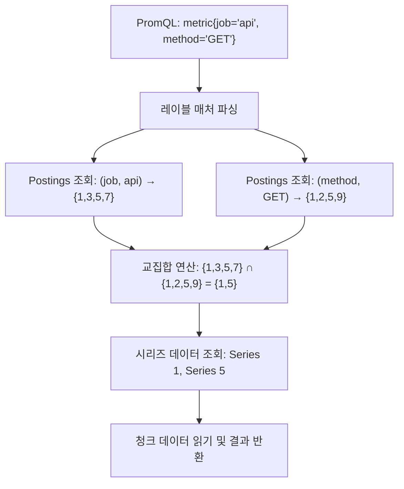
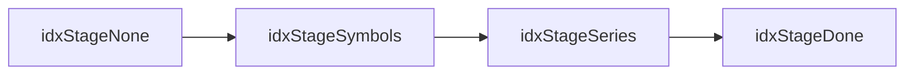
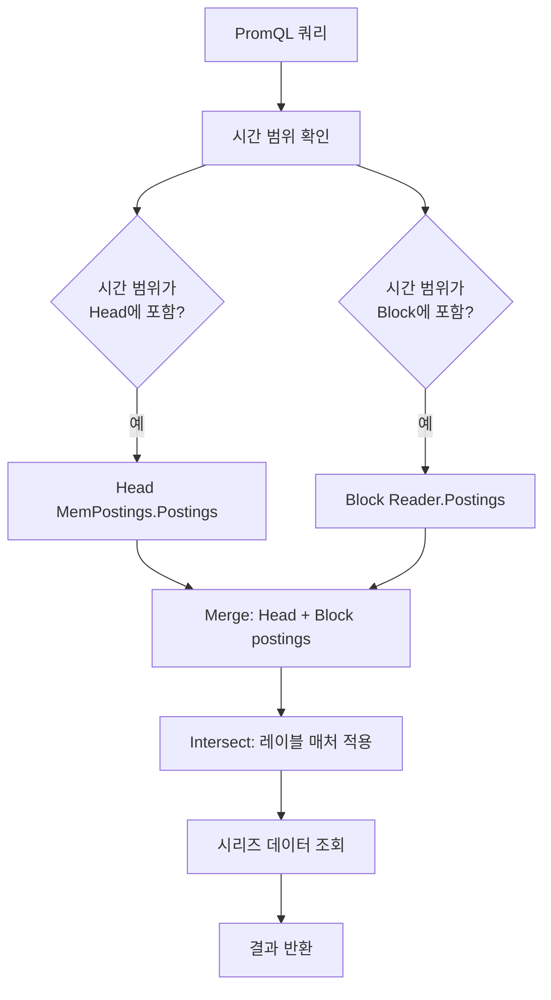

# 09. TSDB 인덱스 & Postings 심화 분석

## 목차

1. [역색인 개요](#1-역색인-개요)
2. [MemPostings (인메모리 역색인)](#2-mempostings-인메모리-역색인)
3. [Postings 연산](#3-postings-연산)
4. [블록 인덱스 파일 구조](#4-블록-인덱스-파일-구조)
5. [Index Writer](#5-index-writer)
6. [Index Reader](#6-index-reader)
7. [Symbol Table](#7-symbol-table)
8. [쿼리 최적화](#8-쿼리-최적화)
9. [Head vs Block 인덱스 비교](#9-head-vs-block-인덱스-비교)

---

## 1. 역색인 개요

### 왜 역색인인가

Prometheus는 수백만 개의 시계열(time series)을 관리한다. 사용자가 PromQL로 `http_requests_total{job="api", method="GET"}`과 같은 쿼리를 실행하면, 시스템은 해당 레이블 조합과 일치하는 시계열을 **즉시** 찾아야 한다.

단순히 모든 시계열을 순회하며 레이블을 비교하면 O(N) 시간이 소요되어, 시계열 수가 수백만에 달할 때 심각한 성능 문제가 발생한다.

**역색인(Inverted Index)**은 이 문제를 해결한다. 전통적인 색인이 "시계열 → 레이블"로 매핑한다면, 역색인은 "레이블 → 시계열 ID 목록"으로 매핑한다.

```
┌─────────────────────────────────────────────────────┐
│                    정방향 색인                         │
│  Series 1 → {__name__="http_requests", job="api"}   │
│  Series 2 → {__name__="http_requests", job="web"}   │
│  Series 3 → {__name__="cpu_usage", job="api"}       │
└─────────────────────────────────────────────────────┘

┌─────────────────────────────────────────────────────┐
│                    역색인                             │
│  (job, "api")             → [Series 1, Series 3]    │
│  (job, "web")             → [Series 2]              │
│  (__name__, "http_requests") → [Series 1, Series 2] │
│  (__name__, "cpu_usage")     → [Series 3]           │
└─────────────────────────────────────────────────────┘
```

### 레이블 기반 시계열 조회 흐름



역색인의 핵심 이점:

| 연산 | 역색인 없이 | 역색인 사용 |
|------|-----------|-----------|
| 레이블 매칭 | O(N) 전체 스캔 | O(1) 맵 조회 |
| AND 연산 | O(N) 필터링 | O(min(A,B)) 정렬된 교집합 |
| OR 연산 | O(N) 필터링 | O(A+B) 정렬된 합집합 |

여기서 N은 전체 시계열 수, A와 B는 각 레이블 매처에 매칭되는 시계열 수이다.

---

## 2. MemPostings (인메모리 역색인)

### 구조 개요

`MemPostings`는 Head 블록(최근 데이터가 저장되는 인메모리 영역)에서 사용하는 인메모리 역색인이다. 소스 파일 `tsdb/index/postings.go`에 정의되어 있다.

```go
// tsdb/index/postings.go (line 60-79)
type MemPostings struct {
    mtx sync.RWMutex

    // m holds the postings lists for each label-value pair,
    // indexed first by label name, and then by label value.
    m map[string]map[string][]storage.SeriesRef

    // lvs holds the label values for each label name.
    // lvs[name] is essentially an unsorted append-only list of all keys in m[name]
    lvs map[string][]string

    ordered bool
}
```

### 데이터 구조 다이어그램

```
MemPostings
├── mtx: sync.RWMutex (읽기/쓰기 동시성 제어)
├── m: map[string]map[string][]SeriesRef
│   ├── "__name__"
│   │   ├── "http_requests" → [1, 5, 12, 89, 102]
│   │   ├── "cpu_usage"     → [2, 6, 33, 47]
│   │   └── "memory_bytes"  → [3, 7, 55]
│   ├── "job"
│   │   ├── "api"     → [1, 2, 3, 33, 55]
│   │   ├── "web"     → [5, 6, 7, 47]
│   │   └── "worker"  → [12, 89, 102]
│   ├── "instance"
│   │   ├── "host1:9090" → [1, 2, 5, 6]
│   │   └── "host2:9090" → [3, 7, 12, 33]
│   └── "" (allPostingsKey)
│       └── "" → [1, 2, 3, 5, 6, 7, 12, 33, 47, 55, 89, 102]
├── lvs: map[string][]string
│   ├── "__name__" → ["http_requests", "cpu_usage", "memory_bytes"]
│   ├── "job"      → ["api", "web", "worker"]
│   └── "instance" → ["host1:9090", "host2:9090"]
└── ordered: bool (정렬 완료 여부)
```

특수한 키인 `allPostingsKey`(빈 문자열 Label `{Name: "", Value: ""}`)은 전체 시리즈 ID 목록을 보유한다:

```go
// tsdb/index/postings.go (line 38)
var allPostingsKey = labels.Label{}
```

### Add() 메서드

새 시계열이 Head에 추가될 때 `Add()`가 호출된다:

```go
// tsdb/index/postings.go (line 403-411)
func (p *MemPostings) Add(id storage.SeriesRef, lset labels.Labels) {
    p.mtx.Lock()

    lset.Range(func(l labels.Label) {
        p.addFor(id, l)
    })
    p.addFor(id, allPostingsKey)

    p.mtx.Unlock()
}
```

`addFor()`는 실제로 postings 리스트에 시리즈 ID를 삽입하는 내부 함수이다:

```go
// tsdb/index/postings.go (line 423-449)
func (p *MemPostings) addFor(id storage.SeriesRef, l labels.Label) {
    nm, ok := p.m[l.Name]
    if !ok {
        nm = map[string][]storage.SeriesRef{}
        p.m[l.Name] = nm
    }
    vm, ok := nm[l.Value]
    if !ok {
        p.lvs[l.Name] = appendWithExponentialGrowth(p.lvs[l.Name], l.Value)
    }
    list := appendWithExponentialGrowth(vm, id)
    nm[l.Value] = list

    if !p.ordered {
        return
    }
    // 정렬 상태 유지: 삽입 정렬로 올바른 위치에 배치
    for i := len(list) - 1; i >= 1; i-- {
        if list[i] >= list[i-1] {
            break
        }
        list[i], list[i-1] = list[i-1], list[i]
    }
}
```

**핵심 설계 포인트:**

1. **지수 성장(Exponential Growth)**: `appendWithExponentialGrowth()`는 슬라이스 용량을 2배씩 늘려 메모리 할당 횟수를 줄인다.
2. **조건부 정렬**: `ordered` 플래그가 `true`이면 삽입 시 정렬을 유지한다. WAL 리플레이처럼 대량 삽입 시에는 `ordered=false`로 생성하고 나중에 `EnsureOrder()`를 한 번 호출하는 것이 더 효율적이다.
3. **삽입 정렬**: 이미 정렬된 리스트의 끝에 하나를 추가하므로, 대부분 O(1)에 완료된다.

### Get() / Postings() 메서드

특정 레이블 이름-값 쌍에 대한 postings를 조회한다:

```go
// tsdb/index/postings.go (line 502-515)
func (p *MemPostings) Postings(ctx context.Context, name string, values ...string) Postings {
    res := make([]*listPostings, 0, len(values))
    lps := make([]listPostings, len(values))
    p.mtx.RLock()
    postingsMapForName := p.m[name]
    for i, value := range values {
        if lp := postingsMapForName[value]; lp != nil {
            lps[i] = listPostings{list: lp}
            res = append(res, &lps[i])
        }
    }
    p.mtx.RUnlock()
    return Merge(ctx, res...)
}
```

여러 값에 대한 postings를 조회할 때(예: `job=~"api|web"`), 각 값의 postings 리스트를 가져와서 `Merge()`로 합집합을 구한다.

### All() 메서드

전체 시리즈의 postings를 반환한다:

```go
// tsdb/index/postings.go (line 243-245)
func (p *MemPostings) All() Postings {
    return p.Postings(context.Background(), allPostingsKey.Name, allPostingsKey.Value)
}
```

`allPostingsKey`는 빈 레이블(`{Name: "", Value: ""}`)이며, 모든 시리즈가 추가될 때 함께 등록된다.

### EnsureOrder(): 정렬하여 교집합 최적화

WAL 리플레이나 원격 쓰기(remote write) 등에서 대량의 시리즈를 한꺼번에 로드할 때, 정렬을 미루는 것이 효율적이다. `NewUnorderedMemPostings()`로 생성한 뒤 `EnsureOrder()`를 한 번만 호출한다:

```go
// tsdb/index/postings.go (line 252-304)
func (p *MemPostings) EnsureOrder(numberOfConcurrentProcesses int) {
    p.mtx.Lock()
    defer p.mtx.Unlock()

    if p.ordered {
        return
    }

    concurrency := numberOfConcurrentProcesses
    if concurrency <= 0 {
        concurrency = runtime.GOMAXPROCS(0)
    }
    workc := make(chan *[][]storage.SeriesRef)

    var wg sync.WaitGroup
    wg.Add(concurrency)

    for i := 0; i < concurrency; i++ {
        go func() {
            for job := range workc {
                for _, l := range *job {
                    slices.Sort(l)
                }
                *job = (*job)[:0]
                ensureOrderBatchPool.Put(job)
            }
            wg.Done()
        }()
    }

    nextJob := ensureOrderBatchPool.Get().(*[][]storage.SeriesRef)
    for _, e := range p.m {
        for _, l := range e {
            *nextJob = append(*nextJob, l)
            if len(*nextJob) >= ensureOrderBatchSize {
                workc <- nextJob
                nextJob = ensureOrderBatchPool.Get().(*[][]storage.SeriesRef)
            }
        }
    }
    // 마지막 부분 배치 처리
    if len(*nextJob) > 0 {
        workc <- nextJob
    }

    close(workc)
    wg.Wait()

    p.ordered = true
}
```

**왜 병렬 정렬인가:**

- 수백만 개 시계열이 있으면 postings 리스트도 수백만 개가 된다
- 배치 크기(`ensureOrderBatchSize = 1024`)로 나누어 여러 고루틴에 분배
- `sync.Pool`을 사용하여 배치 슬라이스의 메모리 재활용
- `GOMAXPROCS`만큼의 워커가 병렬 처리

### Delete(): 시리즈 제거

Compaction이나 시리즈 만료 시 postings에서 시리즈를 제거한다:

```go
// tsdb/index/postings.go (line 308-368)
func (p *MemPostings) Delete(deleted map[storage.SeriesRef]struct{}, affected map[labels.Label]struct{}) {
    p.mtx.Lock()
    defer p.mtx.Unlock()

    process := func(l labels.Label) {
        orig := p.m[l.Name][l.Value]
        repl := make([]storage.SeriesRef, 0, len(orig))
        for _, id := range orig {
            if _, ok := deleted[id]; !ok {
                repl = append(repl, id)
            }
        }
        if len(repl) > 0 {
            p.m[l.Name][l.Value] = repl
        } else {
            delete(p.m[l.Name], l.Value)
        }
    }

    i := 0
    for l := range affected {
        i++
        process(l)
        // 512개마다 잠시 락을 풀어 읽기 쿼리 허용
        if i%512 == 0 {
            p.unlockWaitAndLockAgain()
        }
    }
    process(allPostingsKey)
}
```

**동시성 배려 설계:**

`Delete()`는 장시간 실행될 수 있으므로, 512번 반복할 때마다 `unlockWaitAndLockAgain()`을 호출하여 대기 중인 읽기 쿼리가 진행될 수 있도록 양보한다:

```go
// tsdb/index/postings.go (line 372-385)
func (p *MemPostings) unlockWaitAndLockAgain() {
    p.mtx.Unlock()
    // RLock을 한 번 잡아서 대기 중인 reader에게 기회를 준다
    p.mtx.RLock()
    p.mtx.RUnlock()
    // 추가로 1ms 대기하여 reader가 락을 잡을 확률을 높인다
    time.Sleep(time.Millisecond)
    p.mtx.Lock()
}
```

이 패턴은 쓰기 락을 장시간 점유하여 읽기 쿼리가 블로킹되는 것을 방지한다. 특히 대규모 삭제 작업에서 쿼리 지연(latency)을 크게 줄여준다.

### 동시성: RWMutex

`MemPostings`는 `sync.RWMutex`로 동시성을 제어한다:

| 연산 | 락 종류 | 이유 |
|------|--------|------|
| `Add()` | Write Lock | postings 맵 수정 |
| `Delete()` | Write Lock | postings 맵 수정 (주기적 양보) |
| `EnsureOrder()` | Write Lock | 전체 정렬 작업 |
| `Postings()` | Read Lock | postings 조회 (읽기 전용) |
| `LabelValues()` | Read Lock | 레이블 값 목록 조회 |
| `LabelNames()` | Read Lock | 레이블 이름 목록 조회 |
| `All()` | Read Lock | 전체 postings 조회 |
| `PostingsForLabelMatching()` | Read Lock (짧게) | 값 목록 복사 후 락 해제, 매칭 후 다시 Read Lock |

특히 `PostingsForLabelMatching()`은 정규식 매칭이 오래 걸릴 수 있으므로, 값 목록만 빠르게 복사한 뒤 락을 해제하고, 매칭이 완료된 후에 다시 짧게 락을 잡아 postings를 가져온다:

```go
// tsdb/index/postings.go (line 451-498) - 핵심 부분
func (p *MemPostings) PostingsForLabelMatching(ctx context.Context, name string, match func(string) bool) Postings {
    p.mtx.RLock()
    readOnlyLabelValues := p.lvs[name]  // append-only 슬라이스 참조 복사
    p.mtx.RUnlock()

    // 락 없이 매칭 수행 (느린 정규식도 안전)
    vals := make([]string, 0, len(readOnlyLabelValues))
    for _, v := range readOnlyLabelValues {
        if match(v) {
            vals = append(vals, v)
        }
    }

    if len(vals) == 0 {
        return EmptyPostings()
    }

    // 매칭된 값의 postings만 짧게 락 잡고 가져옴
    its := make([]*listPostings, 0, len(vals))
    p.mtx.RLock()
    e := p.m[name]
    for i, v := range vals {
        if refs, ok := e[v]; ok {
            // ...postings 리스트 참조
        }
    }
    p.mtx.RUnlock()

    return Merge(ctx, its...)
}
```

---

## 3. Postings 연산

### Postings 인터페이스

모든 postings 연산의 기반이 되는 인터페이스:

```go
// tsdb/index/postings.go (line 546-560)
type Postings interface {
    Next() bool                    // 다음 값으로 전진
    Seek(v storage.SeriesRef) bool // v 이상의 값으로 점프
    At() storage.SeriesRef         // 현재 값 반환
    Err() error                    // 에러 반환
}
```

`Postings` 인터페이스는 **정렬된 시리즈 ID** 위를 순회하는 이터레이터이다. `Next()`와 `Seek()`는 커서(cursor) 패턴으로, 한 방향으로만 전진한다.

### ListPostings: 정렬된 시리즈 ID 리스트

가장 기본적인 구현체:

```go
// tsdb/index/postings.go (line 831-885)
type listPostings struct {
    list []storage.SeriesRef
    cur  storage.SeriesRef
}

func (it *listPostings) Next() bool {
    if len(it.list) > 0 {
        it.cur = it.list[0]
        it.list = it.list[1:]
        return true
    }
    it.cur = 0
    return false
}

func (it *listPostings) Seek(x storage.SeriesRef) bool {
    if it.cur >= x {
        return true
    }
    if len(it.list) == 0 {
        return false
    }
    // 이진 탐색으로 빠르게 점프
    i := 0
    if it.list[0] < x {
        i, _ = slices.BinarySearch(it.list, x)
        if i >= len(it.list) {
            it.list = nil
            return false
        }
    }
    it.cur = it.list[i]
    it.list = it.list[i+1:]
    return true
}
```

**왜 `Seek()`에서 이진 탐색을 사용하는가:**

`Seek()`은 교집합 연산에서 핵심적으로 사용된다. 한 쪽 리스트의 현재 값으로 다른 쪽을 `Seek()`하면, 건너뛸 수 있는 요소들을 O(log n)에 스킵할 수 있다.

### Intersect(): 교집합 (AND 연산)

PromQL에서 여러 매처가 AND로 결합될 때 사용된다:

```go
// tsdb/index/postings.go (line 595-607)
func Intersect(its ...Postings) Postings {
    if len(its) == 0 {
        return EmptyPostings()
    }
    if len(its) == 1 {
        return its[0]
    }
    if slices.Contains(its, EmptyPostings()) {
        return EmptyPostings()  // 빈 postings가 하나라도 있으면 결과도 빈 것
    }
    return newIntersectPostings(its...)
}
```

교집합 연산의 핵심 알고리즘 (`Next()` 메서드):

```go
// tsdb/index/postings.go (line 643-667)
func (it *intersectPostings) Next() bool {
    // 첫 번째 Postings를 전진시키고 목표값으로 설정
    if !it.postings[0].Next() {
        return false
    }
    target := it.postings[0].At()
    allEqual := true
    for _, p := range it.postings[1:] {
        if !p.Next() {
            return false
        }
        at := p.At()
        if at > target {     // 더 큰 값을 새 목표로
            target = at
            allEqual = false
        } else if at < target { // Seek이 필요
            allEqual = false
        }
    }
    if allEqual {
        it.current = target
        return true
    }
    return it.Seek(target)  // 모두 같아질 때까지 반복
}
```

```
교집합 동작 예시:

Postings A: [1, 3, 5, 7, 9, 11]
Postings B: [2, 3, 6, 7, 10, 11]

Step 1: A.Next()=1, B.Next()=2 → 불일치, Seek(2)
Step 2: A.Seek(2)=3, B.At()=2 → B.Seek(3)=3 → 일치! → 출력 3
Step 3: A.Next()=5, B.Next()=6 → 불일치, Seek(6)
Step 4: A.Seek(6)=7, B.At()=6 → B.Seek(7)=7 → 일치! → 출력 7
Step 5: A.Next()=9, B.Next()=10 → 불일치, Seek(10)
Step 6: A.Seek(10)=11, B.At()=10 → B.Seek(11)=11 → 일치! → 출력 11

결과: [3, 7, 11]
```

### Merge(): 합집합 (OR 연산)

`Merge()`는 Loser Tree(패자 트리)를 사용하여 여러 정렬된 이터레이터를 효율적으로 병합한다:

```go
// tsdb/index/postings.go (line 679-692)
func Merge[T Postings](_ context.Context, its ...T) Postings {
    if len(its) == 0 {
        return EmptyPostings()
    }
    if len(its) == 1 {
        return its[0]
    }
    p, ok := newMergedPostings(its)
    if !ok {
        return EmptyPostings()
    }
    return p
}
```

Loser Tree를 사용한 합집합 구현:

```go
// tsdb/index/postings.go (line 694-743)
type mergedPostings[T Postings] struct {
    p   []T
    h   *loser.Tree[storage.SeriesRef, T]
    cur storage.SeriesRef
}

func (it *mergedPostings[T]) Next() bool {
    for {
        if !it.h.Next() {
            return false
        }
        // 중복 제거
        newItem := it.h.At()
        if newItem != it.cur {
            it.cur = newItem
            return true
        }
    }
}
```

**왜 Loser Tree인가:**

k개의 정렬된 리스트를 병합할 때:
- 단순 비교: O(k)씩 비교하여 전체 O(N*k)
- Min-Heap: O(N*log k) - 기존 방식
- Loser Tree: O(N*log k) - 같은 복잡도지만 분기 예측 적중률이 높아 실제 성능 우수

Prometheus는 `go-loser` 라이브러리를 사용하여 이를 구현한다.

### Without(): 차집합 (NOT 연산)

PromQL의 `!=` 연산자나 `__name__!="metric"` 같은 부정 매처에 사용된다:

```go
// tsdb/index/postings.go (line 747-756)
func Without(full, drop Postings) Postings {
    if full == EmptyPostings() {
        return EmptyPostings()
    }
    if drop == EmptyPostings() {
        return full
    }
    return newRemovedPostings(full, drop)
}
```

차집합의 `Next()` 알고리즘:

```go
// tsdb/index/postings.go (line 778-808)
func (rp *removedPostings) Next() bool {
    for {
        if !rp.fok {
            return false
        }
        if !rp.rok {
            rp.cur = rp.full.At()
            rp.fok = rp.full.Next()
            return true
        }
        switch fcur, rcur := rp.full.At(), rp.remove.At(); {
        case fcur < rcur:
            rp.cur = fcur
            rp.fok = rp.full.Next()
            return true
        case rcur < fcur:
            // remove 포인터를 full 위치까지 전진
            rp.rok = rp.remove.Seek(fcur)
        default:
            // 값이 같으면 스킵 (제거)
            rp.fok = rp.full.Next()
        }
    }
}
```

```
차집합 동작 예시:

Full:   [1, 2, 3, 5, 7, 9, 11]
Remove: [2, 5, 9]

Step 1: full=1, remove=2 → 1 < 2 → 출력 1
Step 2: full=2, remove=2 → 같음 → 스킵
Step 3: full=3, remove=2 → remove.Seek(3)→5, 3 < 5 → 출력 3
Step 4: full=5, remove=5 → 같음 → 스킵
Step 5: full=7, remove=5 → remove.Seek(7)→9, 7 < 9 → 출력 7
Step 6: full=9, remove=9 → 같음 → 스킵
Step 7: full=11, remove 끝 → 출력 11

결과: [1, 3, 7, 11]
```

### 왜 정렬이 중요한가: O(n) 교집합 연산

postings 리스트가 정렬되어 있으면:

1. **교집합**: 두 포인터를 동시에 전진시키며 비교 → O(A + B)
2. **합집합**: 머지 소트처럼 병합 → O(A + B)
3. **차집합**: 한쪽 포인터를 따라가며 제거 → O(A + B)
4. **Seek()**: 이진 탐색으로 스킵 → O(log n)

정렬되지 않으면 교집합만 해도 O(A * B)가 되어 성능이 급격히 저하된다.

---

## 4. 블록 인덱스 파일 구조

### 전체 파일 레이아웃

Prometheus의 블록 인덱스 파일은 다음과 같은 구조를 갖는다:

```
┌──────────────────────────────────────────────────────────┐
│  Magic Number (4 bytes): 0xBAAAD700                      │
│  Version (1 byte): 2                                     │
├──────────────────────────────────────────────────────────┤
│                                                          │
│  ┌────────────────────────────────────────────────────┐  │
│  │  Symbol Table                                      │  │
│  │  <len:4><count:4><sym1><sym2>...<symN><crc32:4>    │  │
│  └────────────────────────────────────────────────────┘  │
│                                                          │
│  ┌────────────────────────────────────────────────────┐  │
│  │  Series Section (16-byte aligned)                  │  │
│  │  [padding]                                         │  │
│  │  <len><labels><chunks><crc32>                      │  │
│  │  [padding]                                         │  │
│  │  <len><labels><chunks><crc32>                      │  │
│  │  ...                                               │  │
│  └────────────────────────────────────────────────────┘  │
│                                                          │
│  ┌────────────────────────────────────────────────────┐  │
│  │  Label Indices (V2에서는 비어 있음)                    │  │
│  └────────────────────────────────────────────────────┘  │
│                                                          │
│  ┌────────────────────────────────────────────────────┐  │
│  │  Postings Section (4-byte aligned)                 │  │
│  │  <len:4><count:4><ref1:4><ref2:4>...<crc32:4>      │  │
│  │  ...                                               │  │
│  └────────────────────────────────────────────────────┘  │
│                                                          │
│  ┌────────────────────────────────────────────────────┐  │
│  │  Label Indices Table (V2에서는 비어 있음)              │  │
│  └────────────────────────────────────────────────────┘  │
│                                                          │
│  ┌────────────────────────────────────────────────────┐  │
│  │  Postings Offset Table                             │  │
│  │  <len:4><count:4>                                  │  │
│  │  <keycount><name><value><offset> ...               │  │
│  │  <crc32:4>                                         │  │
│  └────────────────────────────────────────────────────┘  │
│                                                          │
│  ┌────────────────────────────────────────────────────┐  │
│  │  TOC (Table of Contents) - 52 bytes                │  │
│  │  <Symbols:8><Series:8><LabelIndices:8>             │  │
│  │  <LabelIndicesTable:8><Postings:8>                 │  │
│  │  <PostingsTable:8><crc32:4>                        │  │
│  └────────────────────────────────────────────────────┘  │
└──────────────────────────────────────────────────────────┘
```

### TOC (Table of Contents): 6개 섹션 오프셋

TOC는 파일 끝에 위치하며, 각 섹션의 시작 오프셋을 담는다:

```go
// tsdb/index/index.go (line 171-178)
type TOC struct {
    Symbols           uint64  // Symbol Table 시작 오프셋
    Series            uint64  // Series 섹션 시작 오프셋
    LabelIndices      uint64  // Label Indices 시작 (V2에서는 사용 안 함)
    LabelIndicesTable uint64  // Label Indices Table 시작 (V2에서는 사용 안 함)
    Postings          uint64  // Postings 섹션 시작 오프셋
    PostingsTable     uint64  // Postings Offset Table 시작 오프셋
}
```

TOC 크기는 고정이다:

```go
// tsdb/index/index.go (line 689)
const indexTOCLen = 6*8 + crc32.Size  // = 52 bytes
```

TOC 파싱은 파일 끝에서 52바이트를 읽어 수행한다:

```go
// tsdb/index/index.go (line 181-203)
func NewTOCFromByteSlice(bs ByteSlice) (*TOC, error) {
    b := bs.Range(bs.Len()-indexTOCLen, bs.Len())
    expCRC := binary.BigEndian.Uint32(b[len(b)-4:])
    d := encoding.Decbuf{B: b[:len(b)-4]}

    if d.Crc32(castagnoliTable) != expCRC {
        return nil, fmt.Errorf("read TOC: %w", encoding.ErrInvalidChecksum)
    }

    toc := &TOC{
        Symbols:           d.Be64(),
        Series:            d.Be64(),
        LabelIndices:      d.Be64(),
        LabelIndicesTable: d.Be64(),
        Postings:          d.Be64(),
        PostingsTable:     d.Be64(),
    }
    return toc, d.Err()
}
```

### Symbol Table: 문자열 중복 제거

모든 레이블 이름과 값은 Symbol Table에 한 번만 저장되고, 이후에는 정수 인덱스로 참조된다:

```
Symbol Table 바이너리 구조:

┌────────────────────────────────────────────┐
│ Length (4 bytes, BE uint32)                 │
├────────────────────────────────────────────┤
│ Symbol Count (4 bytes, BE uint32)          │
├────────────────────────────────────────────┤
│ Symbol 0: <varint_len><bytes>  "GET"       │
│ Symbol 1: <varint_len><bytes>  "__name__"  │
│ Symbol 2: <varint_len><bytes>  "api"       │
│ Symbol 3: <varint_len><bytes>  "cpu_usage" │
│ Symbol 4: <varint_len><bytes>  "http_req"  │
│ Symbol 5: <varint_len><bytes>  "job"       │
│ Symbol 6: <varint_len><bytes>  "method"    │
│ ...                                        │
├────────────────────────────────────────────┤
│ CRC32 (4 bytes)                            │
└────────────────────────────────────────────┘

심볼은 알파벳 순으로 정렬되어 저장된다.
V2에서 심볼 번호(0, 1, 2, ...)로 참조한다.
```

### Series 섹션: 시리즈별 레이블 + 청크 참조

각 시리즈 엔트리는 16바이트 정렬된다:

```
Series Entry 바이너리 구조:

┌──────────────────────────────────────────────────────┐
│ [Padding to 16-byte alignment]                       │
├──────────────────────────────────────────────────────┤
│ Length (uvarint): 이후 데이터 길이                       │
├──────────────────────────────────────────────────────┤
│ Label Count (uvarint): 레이블 쌍 개수                    │
│ Label 0 Name (uvarint): Symbol Table 인덱스           │
│ Label 0 Value (uvarint): Symbol Table 인덱스           │
│ Label 1 Name (uvarint): Symbol Table 인덱스            │
│ Label 1 Value (uvarint): Symbol Table 인덱스            │
│ ...                                                  │
├──────────────────────────────────────────────────────┤
│ Chunk Count (uvarint)                                │
│ Chunk 0: MinTime(varint64), Duration(uvarint64),     │
│          Ref(uvarint64)                              │
│ Chunk 1: MinTimeDelta, Duration, RefDelta            │
│ ...                                                  │
├──────────────────────────────────────────────────────┤
│ CRC32 (4 bytes)                                      │
└──────────────────────────────────────────────────────┘
```

16바이트 정렬의 이유: 4바이트 시리즈 참조로 16 * 2^32 = 64GiB까지 주소 지정이 가능하다.

```go
// tsdb/index/index.go (line 54)
const seriesByteAlign = 16
```

### Postings 섹션: (label_name, label_value) -> series_ids

각 postings 엔트리는 4바이트 정렬된다:

```
Postings Entry 바이너리 구조:

┌─────────────────────────────────────────────┐
│ [Padding to 4-byte alignment]               │
├─────────────────────────────────────────────┤
│ Length (4 bytes, BE uint32)                  │
├─────────────────────────────────────────────┤
│ Series Count (4 bytes, BE uint32)           │
│ Series Ref 0 (4 bytes, BE uint32)           │
│ Series Ref 1 (4 bytes, BE uint32)           │
│ ...                                         │
├─────────────────────────────────────────────┤
│ CRC32 (4 bytes)                             │
└─────────────────────────────────────────────┘

Series Ref는 Series 섹션 내 오프셋 / 16 값이다.
```

### Postings Offset Table: Postings 오프셋 인덱스

postings 테이블은 레이블 이름-값 쌍으로 해당 postings의 위치를 찾는 색인이다:

```
Postings Offset Table 바이너리 구조:

┌─────────────────────────────────────────────────────┐
│ Length (4 bytes, BE uint32)                          │
├─────────────────────────────────────────────────────┤
│ Entry Count (4 bytes, BE uint32)                    │
├─────────────────────────────────────────────────────┤
│ Entry 0:                                            │
│   Key Count (uvarint): 2                            │
│   Label Name (uvarint-length-prefixed string)       │
│   Label Value (uvarint-length-prefixed string)      │
│   Postings Offset (uvarint64)                       │
├─────────────────────────────────────────────────────┤
│ Entry 1:                                            │
│   Key Count: 2                                      │
│   Label Name                                        │
│   Label Value                                       │
│   Postings Offset                                   │
├─────────────────────────────────────────────────────┤
│ ...                                                 │
├─────────────────────────────────────────────────────┤
│ CRC32 (4 bytes)                                     │
└─────────────────────────────────────────────────────┘
```

---

## 5. Index Writer

### Writer 구조체

```go
// tsdb/index/index.go (line 128-168)
type Writer struct {
    ctx context.Context

    f   *FileWriter  // 메인 인덱스 파일
    fP  *FileWriter  // Postings 임시 파일
    fPO *FileWriter  // Postings Offset Table 임시 파일
    cntPO uint64     // Postings Offset 엔트리 수

    toc           TOC
    stage         indexWriterStage
    postingsStart uint64

    buf1 encoding.Encbuf  // 재사용 가능 버퍼 1
    buf2 encoding.Encbuf  // 재사용 가능 버퍼 2

    numSymbols  int
    symbols     *Symbols
    symbolFile  *fileutil.MmapFile
    lastSymbol  string
    symbolCache map[string]uint32  // 심볼 → 인덱스 번호

    labelNames map[string]uint64   // 레이블 이름 → 사용 횟수

    lastSeries    labels.Labels
    lastSeriesRef storage.SeriesRef
    lastChunkRef  chunks.ChunkRef

    crc32 hash.Hash

    Version int
    postingsEncoder PostingsEncoder
}
```

### 쓰기 단계 (Stage) 관리

Writer는 엄격한 단계 순서를 강제한다:



```go
// tsdb/index/index.go (line 76-81)
const (
    idxStageNone    indexWriterStage = iota
    idxStageSymbols
    idxStageSeries
    idxStageDone
)
```

`ensureStage()`가 단계 전환을 관리하며, 각 단계 진입 시 해당 섹션의 시작 위치를 TOC에 기록한다:

```go
// tsdb/index/index.go (line 384-419) - 핵심 부분
switch s {
case idxStageSymbols:
    w.toc.Symbols = w.f.pos
case idxStageSeries:
    w.toc.Series = w.f.pos
case idxStageDone:
    w.toc.LabelIndices = w.f.pos
    // Postings를 임시 파일로 생성
    w.writePostingsToTmpFiles()
    w.toc.Postings = w.f.pos
    // 임시 파일에서 메인 파일로 복사
    w.writePostings()
    w.toc.PostingsTable = w.f.pos
    w.writePostingsOffsetTable()
    w.writeTOC()
}
```

### AddSymbol(): 문자열 추가

심볼은 알파벳 순으로 추가해야 한다:

```go
// tsdb/index/index.go (line 537-550)
func (w *Writer) AddSymbol(sym string) error {
    if err := w.ensureStage(idxStageSymbols); err != nil {
        return err
    }
    if w.numSymbols != 0 && sym <= w.lastSymbol {
        return fmt.Errorf("symbol %q out-of-order", sym)
    }
    w.lastSymbol = sym
    w.symbolCache[sym] = uint32(w.numSymbols)
    w.numSymbols++
    w.buf1.Reset()
    w.buf1.PutUvarintStr(sym)
    return w.write(w.buf1.Get())
}
```

### AddSeries(): 시리즈 레이블 + 청크 메타

시리즈도 레이블 순서대로 추가해야 한다:

```go
// tsdb/index/index.go (line 434-528) - 핵심 부분
func (w *Writer) AddSeries(ref storage.SeriesRef, lset labels.Labels, chunks ...chunks.Meta) error {
    // 16바이트 정렬 패딩
    w.addPadding(seriesByteAlign)

    // 레이블을 심볼 인덱스로 인코딩
    w.buf2.PutUvarint(lset.Len())
    lset.Validate(func(l labels.Label) error {
        nameIndex := w.symbolCache[l.Name]
        w.labelNames[l.Name]++
        w.buf2.PutUvarint32(nameIndex)

        valueIndex := w.symbolCache[l.Value]
        w.buf2.PutUvarint32(valueIndex)
        return nil
    })

    // 청크 메타 인코딩 (델타 인코딩)
    w.buf2.PutUvarint(len(chunks))
    if len(chunks) > 0 {
        c := chunks[0]
        w.buf2.PutVarint64(c.MinTime)
        w.buf2.PutUvarint64(uint64(c.MaxTime - c.MinTime))
        w.buf2.PutUvarint64(uint64(c.Ref))
        // 이후 청크는 이전 청크 대비 델타로 저장
        for _, c := range chunks[1:] {
            w.buf2.PutUvarint64(uint64(c.MinTime - t0))
            w.buf2.PutUvarint64(uint64(c.MaxTime - c.MinTime))
            w.buf2.PutVarint64(int64(c.Ref) - ref0)
        }
    }
}
```

**왜 델타 인코딩인가:** 연속된 청크의 시간과 참조값은 보통 근접하므로, 차이만 저장하면 varint로 인코딩 시 훨씬 적은 바이트를 사용한다.

### writePostingsToTmpFiles(): Postings 생성

시리즈 섹션을 다시 스캔하여 각 레이블 이름-값 조합에 대한 postings 리스트를 구성한다:

```go
// tsdb/index/index.go (line 706-830) - 핵심 흐름
func (w *Writer) writePostingsToTmpFiles() error {
    // 1. 전체 시리즈(All Postings) 먼저 기록
    offsets := []uint32{}
    // Series 섹션을 순회하며 모든 시리즈의 오프셋 수집
    for d.Len() > 0 {
        offsets = append(offsets, uint32(startPos/seriesByteAlign))
        // 다음 시리즈로 스킵
    }
    w.writePosting("", "", offsets)  // allPostingsKey

    // 2. 레이블 이름별로 배치 처리
    for len(names) > 0 {
        // 메모리 사용량을 maxPostings 이하로 유지하면서 배치 구성
        // Series 섹션을 다시 스캔하여 해당 레이블의 postings 구성
        postings := map[uint32]map[uint32][]uint32{}
        // 시리즈 순회하며 레이블 값별 시리즈 오프셋 수집
        for _, name := range batchNames {
            // 값 순서대로 postings 기록
            for _, v := range values {
                w.writePosting(name, value, postings[sid][v])
            }
        }
    }
}
```

### writeTOC(): 전체 TOC 기록

파일 끝에 TOC를 기록한다:

```go
// tsdb/index/index.go (line 691-704)
func (w *Writer) writeTOC() error {
    w.buf1.Reset()

    w.buf1.PutBE64(w.toc.Symbols)
    w.buf1.PutBE64(w.toc.Series)
    w.buf1.PutBE64(w.toc.LabelIndices)
    w.buf1.PutBE64(w.toc.LabelIndicesTable)
    w.buf1.PutBE64(w.toc.Postings)
    w.buf1.PutBE64(w.toc.PostingsTable)

    w.buf1.PutHash(w.crc32)

    return w.write(w.buf1.Get())
}
```

### 임시 파일 전략

Writer는 3개의 파일을 사용한다:

```
쓰기 과정:

1. 메인 파일 (index)
   Header → Symbols → Series → [여기서 멈춤]

2. 임시 Postings 파일 (index_tmp_p)
   Posting 0 → Posting 1 → ... → Posting N

3. 임시 Postings Offset 파일 (index_tmp_po)
   Offset Entry 0 → Offset Entry 1 → ...

4. Close() 시:
   메인 파일 ← Postings (임시 파일에서 복사)
   메인 파일 ← Postings Offset Table (임시 파일에서 복사, 오프셋 조정)
   메인 파일 ← TOC
   임시 파일 삭제
```

**왜 임시 파일을 사용하는가:** Postings와 Postings Offset Table은 Series 섹션을 전체 스캔한 뒤에야 생성할 수 있다. 메인 파일에 직접 쓰면 오프셋 계산이 복잡해지므로, 임시 파일에 먼저 쓰고 나중에 오프셋을 조정하여 복사한다.

---

## 6. Index Reader

### Reader 구조체

```go
// tsdb/index/index.go (line 950-971)
type Reader struct {
    b   ByteSlice    // mmap된 인덱스 파일 바이트
    toc *TOC         // Table of Contents

    c io.Closer      // 리소스 해제용

    // 레이블 이름 → postingOffset 목록 (V2)
    // 모든 값을 저장하지 않고 매 32번째 값만 저장하여 메모리 절약
    postings map[string][]postingOffset

    // V1 호환용
    postingsV1 map[string]map[string]uint64

    symbols     *Symbols
    nameSymbols map[uint32]string  // 레이블 이름 심볼 캐시
    st          *labels.SymbolTable

    dec     *Decoder
    version int
}
```

### postingOffset과 symbolFactor

Reader는 메모리 절약을 위해 Postings Offset Table의 모든 엔트리를 메모리에 올리지 않는다. 대신 매 `symbolFactor`(=32)번째 엔트리만 저장한다:

```go
// tsdb/index/index.go (line 1164)
const symbolFactor = 32

// tsdb/index/index.go (line 973-976)
type postingOffset struct {
    value string
    off   int
}
```

```
Postings Offset Table에 100개 엔트리가 있을 때:

디스크:  [0] [1] [2] ... [31] [32] [33] ... [63] [64] ... [99]
메모리:  [0]                   [32]                [64]    [99(마지막)]

특정 값을 찾을 때:
1. 이진 탐색으로 가장 가까운 저장된 오프셋을 찾음
2. 해당 오프셋부터 디스크에서 순차 스캔
```

### Postings(): (name, value) -> SeriesRef 이터레이터

Reader의 `Postings()` 메서드는 디스크에서 postings를 읽어 이터레이터로 반환한다:

```go
// tsdb/index/index.go (line 1519-1590) - 핵심 부분
func (r *Reader) Postings(ctx context.Context, name string, values ...string) (Postings, error) {
    // V1이면 전체 오프셋이 메모리에 있으므로 직접 조회
    if r.version == FormatV1 {
        // ...직접 조회
    }

    e, ok := r.postings[name]
    if !ok {
        return EmptyPostings(), nil
    }

    slices.Sort(values)  // 값을 정렬하여 순차 스캔 가능

    res := make([]Postings, 0, len(values))
    for valueIndex < len(values) {
        value := values[valueIndex]

        // 이진 탐색으로 가장 가까운 postingOffset 찾기
        i := sort.Search(len(e), func(i int) bool { return e[i].value >= value })
        if i > 0 && e[i].value != value {
            i--  // 이전 엔트리부터 스캔
        }

        // traversePostingOffsets로 디스크에서 순차 스캔
        r.traversePostingOffsets(ctx, e[i].off, func(val string, postingsOff uint64) (bool, error) {
            if val == value {
                // 해당 오프셋에서 postings 디코딩
                d2 := encoding.NewDecbufAt(r.b, int(postingsOff), castagnoliTable)
                _, p, err := r.dec.DecodePostings(d2)
                res = append(res, p)
            }
            return val <= value, nil
        })
    }

    return Merge(ctx, res...), nil
}
```

### Series(): ref -> 레이블 + 청크 메타

시리즈 참조(SeriesRef)로 레이블과 청크 메타데이터를 읽는다:

```go
// tsdb/index/index.go (line 1461-1479)
func (r *Reader) Series(id storage.SeriesRef, builder *labels.ScratchBuilder, chks *[]chunks.Meta) error {
    offset := id
    // V2에서는 16바이트 정렬이므로 실제 오프셋은 id * 16
    if r.version != FormatV1 {
        offset = id * seriesByteAlign
    }
    d := encoding.NewDecbufUvarintAt(r.b, int(offset), castagnoliTable)
    builder.SetSymbolTable(r.st)
    builder.Reset()
    err := r.dec.Series(d.Get(), builder, chks)
    return err
}
```

### LabelNames(), LabelValues(): 메타 조회

`LabelNames()`는 postings 맵의 키로부터 레이블 이름 목록을 반환한다:

```go
// Reader의 postings 맵에서 키를 가져옴
// r.postings = map[string][]postingOffset{}
```

`LabelValues()`는 Postings Offset Table을 순회하여 특정 레이블 이름의 모든 값을 수집한다:

```go
// tsdb/index/index.go (line 1364-1405) - 핵심 부분
func (r *Reader) LabelValues(ctx context.Context, name string, hints *storage.LabelHints, ...) ([]string, error) {
    e, ok := r.postings[name]
    // ...
    values := make([]string, 0, valuesLength)
    lastVal := e[len(e)-1].value

    // 첫 번째 저장된 오프셋부터 순회하며 모든 값 수집
    r.traversePostingOffsets(ctx, e[0].off, func(val string, _ uint64) (bool, error) {
        values = append(values, val)
        return val != lastVal, nil  // 마지막 값에 도달하면 종료
    })
    return values, err
}
```

---

## 7. Symbol Table

### 문자열 -> 오프셋 매핑 (중복 제거)

Symbol Table의 핵심 목적은 **문자열 중복 제거**이다. 수백만 시계열에서 `__name__`, `job`, `instance` 같은 레이블 이름은 반복적으로 등장한다. 각 문자열을 한 번만 저장하고 정수 인덱스로 참조하면 메모리와 디스크 공간을 크게 절약할 수 있다.

### model/labels의 SymbolTable (인메모리)

`model/labels/labels_dedupelabels.go`에 정의된 인메모리 SymbolTable:

```go
// model/labels/labels_dedupelabels.go (line 47-52)
type SymbolTable struct {
    mx      sync.Mutex
    *nameTable
    nextNum int
    byName  map[string]int  // 문자열 → 정수 매핑
}

// nameTable은 Labels에서 사용하는 불변 부분
type nameTable struct {
    byNum       []string       // 정수 → 문자열 역매핑 (읽기 전용)
    symbolTable *SymbolTable
}
```

`ToNum()`은 문자열을 정수로 매핑한다:

```go
// model/labels/labels_dedupelabels.go (line 80-96)
func (t *SymbolTable) toNumUnlocked(name string) int {
    if i, found := t.byName[name]; found {
        return i
    }
    i := t.nextNum
    if t.nextNum == cap(t.byNum) {
        // 용량 초과 시 2배 크기로 새 슬라이스 생성
        newSlice := make([]string, cap(t.byNum)*2)
        copy(newSlice, t.byNum)
        t.nameTable = &nameTable{byNum: newSlice, symbolTable: t}
    }
    name = strings.Clone(name)  // 원본 버퍼 참조 방지
    t.byNum[i] = name
    t.byName[name] = i
    t.nextNum++
    return i
}
```

**왜 `strings.Clone()`을 호출하는가:** 호출자가 재사용 가능한 버퍼의 일부를 전달할 수 있다. `Clone()`으로 독립적인 복사본을 만들어 SymbolTable이 원본 버퍼의 GC를 방해하지 않도록 한다.

### 블록 인덱스의 Symbols (디스크)

디스크 기반 Symbol Table은 `Symbols` 구조체로 표현된다:

```go
// tsdb/index/index.go (line 1155-1162)
type Symbols struct {
    bs      ByteSlice  // mmap된 인덱스 파일
    version int
    off     int        // Symbol Table 시작 오프셋

    offsets []int      // 매 32번째 심볼의 바이트 오프셋 (빠른 조회용)
    seen    int        // 전체 심볼 수
}
```

심볼 조회(`Lookup()`):

```go
// tsdb/index/index.go (line 1193-1215)
func (s Symbols) Lookup(o uint32) (string, error) {
    d := encoding.Decbuf{B: s.bs.Range(0, s.bs.Len())}

    if s.version == FormatV1 {
        d.Skip(int(o))  // V1: 바이트 오프셋으로 직접 접근
    } else {
        // V2: 심볼 번호로 조회
        d.Skip(s.offsets[int(o/symbolFactor)])
        // 나머지 만큼 순차 스킵
        for i := o - (o / symbolFactor * symbolFactor); i > 0; i-- {
            d.UvarintBytes()
        }
    }
    sym := d.UvarintStr()
    return sym, d.Err()
}
```

```
symbolFactor = 32를 사용한 심볼 조회 예시:

심볼 #75를 찾으려면:
1. offsets[75/32] = offsets[2] → 64번째 심볼의 바이트 오프셋으로 점프
2. 75 - (75/32)*32 = 75 - 64 = 11개 심볼을 순차 스킵
3. 12번째 심볼이 #75

매 32개마다 오프셋을 저장하므로:
- 메모리: O(N/32) = 심볼 수의 1/32만 메모리에 저장
- 조회: O(32) = 최대 32번 순차 스킵 (충분히 빠름)
```

### 역방향 조회 (ReverseLookup)

문자열로 심볼 번호를 찾는 역방향 조회는 이진 탐색을 활용한다:

```go
// tsdb/index/index.go (line 1217-1258) - 핵심 흐름
func (s Symbols) ReverseLookup(sym string) (uint32, error) {
    // 이진 탐색으로 sym보다 큰 첫 번째 오프셋 위치 찾기
    i := sort.Search(len(s.offsets), func(i int) bool {
        d := encoding.Decbuf{B: s.bs.Range(0, s.bs.Len())}
        d.Skip(s.offsets[i])
        return yoloString(d.UvarintBytes()) > sym
    })
    // 이전 오프셋부터 순차 탐색
    if i > 0 {
        i--
    }
    // 순차 스캔하여 정확히 일치하는 심볼 찾기
}
```

---

## 8. 쿼리 최적화

### 가장 선택적인 매처부터 교집합 수행

쿼리 `{job="api", __name__="http_requests", method="GET"}`에서:

- `method="GET"` → 10,000개 시리즈 매칭
- `job="api"` → 50,000개 시리즈 매칭
- `__name__="http_requests"` → 100,000개 시리즈 매칭

가장 선택적인(결과가 적은) 매처부터 교집합을 수행하면 중간 결과 크기가 줄어들어 전체 연산이 빨라진다:

```
최적화된 교집합 순서:

1. method="GET"          → 10,000개
2. ∩ job="api"           → ~2,000개 (10,000에서 크게 감소)
3. ∩ __name__="http_req" → ~2,000개 (이미 충분히 작음)

비최적화 순서:

1. __name__="http_req"   → 100,000개
2. ∩ job="api"           → ~25,000개
3. ∩ method="GET"        → ~2,000개

최종 결과는 같지만, 중간 과정의 비교 횟수가 크게 다르다.
```

### EmptyPostings 빠른 경로

`Intersect()`에서 입력 중 하나라도 `EmptyPostings()`이면 즉시 빈 결과를 반환한다:

```go
// tsdb/index/postings.go (line 595-607)
func Intersect(its ...Postings) Postings {
    if len(its) == 0 {
        return EmptyPostings()
    }
    if len(its) == 1 {
        return its[0]
    }
    if slices.Contains(its, EmptyPostings()) {
        return EmptyPostings()  // 빈 postings가 하나라도 있으면 즉시 반환
    }
    return newIntersectPostings(its...)
}
```

`Without()`에서도 유사한 최적화:

```go
func Without(full, drop Postings) Postings {
    if full == EmptyPostings() {
        return EmptyPostings()  // full이 비어있으면 결과도 빔
    }
    if drop == EmptyPostings() {
        return full  // 제거할 것이 없으면 그대로 반환
    }
    return newRemovedPostings(full, drop)
}
```

### bigEndianPostings: 디스크 직접 읽기

디스크에서 읽은 postings는 big-endian 바이트 배열 위를 직접 순회하여 디코딩 오버헤드를 줄인다:

```go
// tsdb/index/postings.go (line 889-893)
type bigEndianPostings struct {
    list []byte
    cur  uint32
}
```

별도의 `[]uint32` 슬라이스로 변환하지 않고 바이트 배열 위에서 직접 4바이트씩 읽으므로 메모리 할당이 없다.

### PostingsForLabelMatching 최적화

정규식 매칭은 비용이 클 수 있다. `PostingsForLabelMatching()`은 락을 최소화하여 쿼리 처리량을 높인다:

```
┌─────────────────────────────────────────┐
│ 1. RLock 획득                            │
│ 2. lvs[name] 슬라이스 참조 복사           │
│ 3. RLock 해제                            │
├─────────────────────────────────────────┤
│ 4. 락 없이 정규식 매칭 수행 (느릴 수 있음)  │
│    vals = match(readOnlyLabelValues)     │
├─────────────────────────────────────────┤
│ 5. RLock 재획득                           │
│ 6. 매칭된 값의 postings 참조 수집          │
│ 7. RLock 해제                            │
├─────────────────────────────────────────┤
│ 8. 락 없이 Merge 수행                    │
└─────────────────────────────────────────┘
```

이 설계 덕분에 `job=~"api-.*"` 같은 느린 정규식이 있어도 쓰기 경로와 compaction을 블로킹하지 않는다.

---

## 9. Head vs Block 인덱스 비교

### 전체 비교 요약

```
┌──────────────────────────┬────────────────────────┬────────────────────────┐
│          항목             │      Head 인덱스        │     Block 인덱스        │
│                          │   (MemPostings)        │  (index 파일)           │
├──────────────────────────┼────────────────────────┼────────────────────────┤
│ 저장 위치                 │ 메모리 (RAM)            │ 디스크 (mmap)           │
│ 데이터 구조               │ Go map + slice         │ 바이너리 파일           │
│ Postings                 │ map[name]map[val][]ref │ 파일 내 바이트 배열      │
│ Symbol Table             │ labels.SymbolTable     │ Symbols struct (mmap)  │
│ 수정 가능 여부             │ 가능 (Add/Delete)      │ 불가 (읽기 전용)        │
│ 동시성 제어               │ sync.RWMutex          │ 불필요 (불변)            │
│ 시리즈 조회 시간           │ O(1) 맵 조회           │ O(log n) 이진 탐색      │
│ 메모리 사용량              │ 높음 (전체 인메모리)    │ 낮음 (mmap, OS 관리)    │
│ 시리즈 추가               │ O(1) amortized        │ 불가                   │
│ Compaction 대상           │ 아님                   │ 대상 (블록 병합 시)      │
│ WAL 연동                  │ 있음 (복구 시 리플레이)  │ 없음                   │
└──────────────────────────┴────────────────────────┴────────────────────────┘
```

### 쿼리 시 통합 과정

PromQL 쿼리는 Head와 Block 인덱스를 모두 조회한 뒤 결과를 합친다:



### Head에서 Block으로의 전환

Head의 데이터가 일정 크기에 도달하면 compaction을 통해 블록으로 변환된다:

```
Head Compaction 과정:

1. Head MemPostings에서 시리즈 목록 추출
2. 시리즈를 레이블 순으로 정렬
3. Index Writer 생성
4. 심볼 추가 (AddSymbol) - 모든 레이블 이름/값
5. 시리즈 추가 (AddSeries) - 레이블 + 청크 참조
6. Writer.Close() → postings 생성 + TOC 기록
7. 블록 디렉토리에 index 파일 저장
8. Head에서 해당 시리즈 제거 (Delete)
```

### 성능 특성 비교

| 연산 | Head (MemPostings) | Block (Reader) |
|------|-------------------|----------------|
| `Postings("job", "api")` | O(1) 맵 조회 | O(log n) 이진 탐색 + 디스크 읽기 |
| `LabelValues("job")` | O(1) 슬라이스 복사 | O(k) Offset Table 순회 |
| `LabelNames()` | O(n) 맵 키 수집 | O(1) postings 맵 키 |
| `Series(ref)` | O(1) 배열 인덱싱 | O(1) mmap 오프셋 접근 |
| 메모리 | 전체 데이터 상주 | OS 페이지 캐시에 의존 |
| 시작 시간 | WAL 리플레이 필요 | mmap으로 즉시 가용 |

### 설계 선택의 이유

**왜 Head는 인메모리인가:**
- 최근 데이터에 대한 쓰기(scrape)가 초당 수만 건 발생
- 매 scrape마다 디스크 I/O를 하면 성능 병목
- WAL로 내구성(durability) 보장

**왜 Block은 디스크 기반인가:**
- 과거 데이터는 읽기 전용이므로 수정 불필요
- mmap으로 OS가 메모리 관리를 대행
- 여러 블록을 동시에 열어도 물리 메모리 초과 없음
- 불변이므로 락 없이 동시 접근 가능

**왜 Symbol Table을 분리하는가:**
- 레이블 이름/값 문자열은 시계열 간 중복이 극심
- `job`, `instance`, `__name__` 등은 모든 시계열에 존재
- 정수 인덱스로 참조하면 시리즈 엔트리 크기가 크게 줄어듦
- V2에서 심볼 번호 기반 참조로 전환하여 조회 효율 개선

---

## 참고 소스 파일

| 파일 | 주요 내용 |
|------|---------|
| `tsdb/index/index.go` | Writer, Reader, TOC, Symbols, FileWriter |
| `tsdb/index/postings.go` | MemPostings, Intersect, Merge, Without, ListPostings |
| `model/labels/labels_common.go` | Label 구조체, MetricName 상수 |
| `model/labels/labels_dedupelabels.go` | SymbolTable (인메모리, dedupelabels 빌드 태그) |
