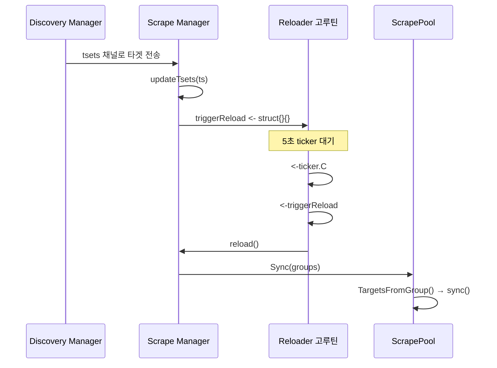
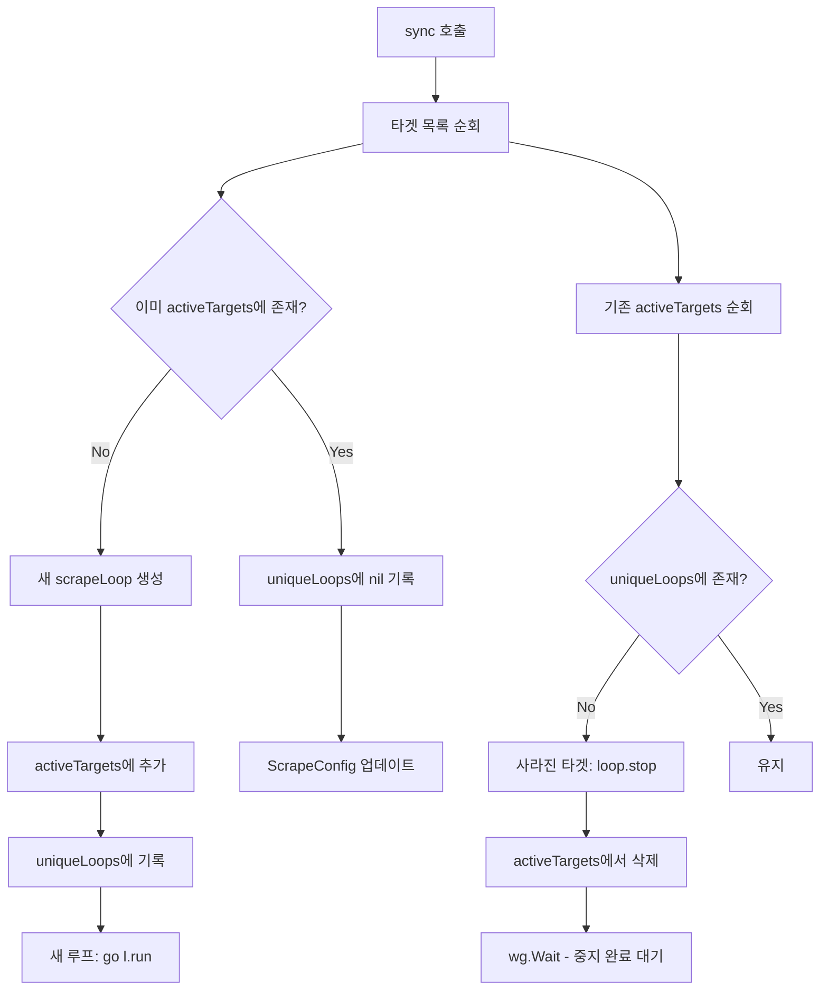
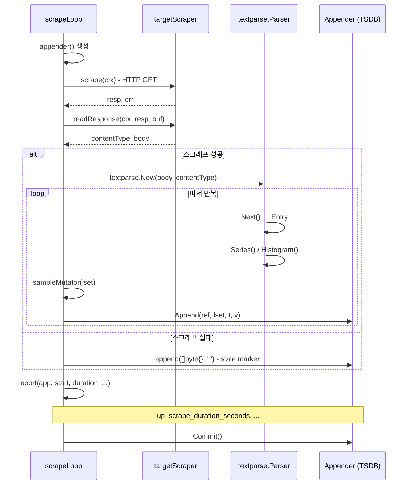

# 11. 스크래프 엔진 (Scrape Engine) Deep-Dive

## 목차

1. [스크래프 매니저 개요 - Pull 모델의 핵심](#1-스크래프-매니저-개요---pull-모델의-핵심)
2. [Manager 구조체 분석](#2-manager-구조체-분석)
3. [Manager.Run() 흐름](#3-managerrun-흐름)
4. [scrapePool: Job별 관리 단위](#4-scrapepool-job별-관리-단위)
5. [scrapeLoop: 개별 타겟 스크래핑 루프](#5-scrapeloop-개별-타겟-스크래핑-루프)
6. [targetScraper: HTTP 클라이언트](#6-targetscraper-http-클라이언트)
7. [메트릭 파싱 (textparse)](#7-메트릭-파싱-textparse)
8. [append 경로](#8-append-경로)
9. [타임스탬프 정렬](#9-타임스탬프-정렬)
10. [보고 메트릭](#10-보고-메트릭)

---

## 1. 스크래프 매니저 개요 - Pull 모델의 핵심

### Pull vs Push 모델

Prometheus의 가장 핵심적인 설계 결정은 **Pull 모델**을 채택한 것이다. 대부분의 모니터링 시스템(Graphite, StatsD 등)이 Push 모델을 사용하는 반면, Prometheus는 모니터링 대상이 메트릭을 노출하고 Prometheus 서버가 주기적으로 가져오는(scrape) 방식을 사용한다.

```
┌─────────────────────────────────────────────────────────────────┐
│                    Push 모델 (전통적 방식)                        │
│                                                                 │
│  ┌──────────┐    push     ┌──────────────┐                      │
│  │ App + Agent├──────────>│  수집 서버     │                      │
│  └──────────┘             └──────────────┘                      │
│  애플리케이션이 능동적으로 메트릭을 전송                              │
└─────────────────────────────────────────────────────────────────┘

┌─────────────────────────────────────────────────────────────────┐
│                    Pull 모델 (Prometheus)                        │
│                                                                 │
│  ┌──────────┐   GET /metrics   ┌──────────────┐                 │
│  │ App       │<────────────────│  Prometheus   │                 │
│  │ (exporter)│────────────────>│  Server       │                 │
│  └──────────┘   응답 (텍스트)   └──────────────┘                 │
│  Prometheus가 주기적으로 HTTP 요청으로 메트릭을 가져옴               │
└─────────────────────────────────────────────────────────────────┘
```

### Pull 모델의 장점

| 장점 | 설명 |
|------|------|
| 중앙 집중 제어 | 스크래프 간격, 타겟 목록을 Prometheus 측에서 통제 |
| 타겟 상태 확인 | 스크래프 실패 = 타겟 다운, 별도 health check 불필요 |
| 간단한 구현 | 대상은 HTTP 엔드포인트만 노출하면 됨 |
| 디버깅 용이 | 브라우저로 `/metrics` 직접 확인 가능 |
| 부하 제어 | Prometheus가 스크래프 속도를 통제하므로 타겟 과부하 방지 |

### 스크래프 엔진의 위치

스크래프 엔진은 Prometheus 서버에서 Service Discovery와 TSDB 사이를 연결하는 핵심 컴포넌트이다.

```
┌─────────────────────────────────────────────────────────────────┐
│                     Prometheus Server                           │
│                                                                 │
│  ┌──────────────┐    targetSets    ┌──────────────┐             │
│  │  Discovery   │────────────────>│  Scrape      │             │
│  │  Manager     │  chan []Group    │  Manager     │             │
│  └──────────────┘                 └──────┬───────┘             │
│                                          │                      │
│                                   scrapePool (Job별)            │
│                                          │                      │
│                                   scrapeLoop (타겟별)            │
│                                          │                      │
│                                   HTTP GET /metrics             │
│                                          │                      │
│                                   textparse (파싱)              │
│                                          │                      │
│                                   ┌──────▼───────┐             │
│                                   │    TSDB      │             │
│                                   │  Appender    │             │
│                                   └──────────────┘             │
└─────────────────────────────────────────────────────────────────┘
```

소스 위치: `scrape/manager.go`, `scrape/scrape.go`, `scrape/target.go`

---

## 2. Manager 구조체 분석

### Manager 구조체 정의

`Manager`는 모든 스크래프 풀을 관리하는 최상위 컴포넌트이다. 소스코드(`scrape/manager.go:135`)에서 정의된 구조체를 살펴보자:

```go
// Manager maintains a set of scrape pools and manages start/stop cycles
// when receiving new target groups from the discovery manager.
type Manager struct {
    opts   *Options
    logger *slog.Logger

    appendable   storage.Appendable
    appendableV2 storage.AppendableV2

    graceShut chan struct{}

    offsetSeed             uint64
    mtxScrape              sync.Mutex
    scrapeConfigs          map[string]*config.ScrapeConfig
    scrapePools            map[string]*scrapePool
    newScrapeFailureLogger func(string) (*logging.JSONFileLogger, error)
    scrapeFailureLoggers   map[string]FailureLogger
    targetSets             map[string][]*targetgroup.Group
    buffers                *pool.Pool

    triggerReload chan struct{}
    metrics       *scrapeMetrics
}
```

### 핵심 필드 분석

| 필드 | 타입 | 역할 |
|------|------|------|
| `scrapeConfigs` | `map[string]*config.ScrapeConfig` | job_name -> 스크래프 설정 매핑 |
| `scrapePools` | `map[string]*scrapePool` | job_name -> 스크래프 풀 매핑 |
| `targetSets` | `map[string][]*targetgroup.Group` | job_name -> 디스커버리 결과 매핑 |
| `appendable` | `storage.Appendable` | TSDB에 데이터를 쓰기 위한 인터페이스 (V1) |
| `appendableV2` | `storage.AppendableV2` | TSDB에 데이터를 쓰기 위한 인터페이스 (V2, 신규) |
| `offsetSeed` | `uint64` | HA 환경에서 스크래프 시간 분산을 위한 시드 |
| `triggerReload` | `chan struct{}` | 리로드 트리거 채널 (버퍼 크기 1) |
| `buffers` | `*pool.Pool` | 스크래프 응답 버퍼 풀 (메모리 재사용) |
| `graceShut` | `chan struct{}` | 우아한 종료 시그널 |

### Options 구조체

`Options`(`scrape/manager.go:105`)는 스크래프 매니저의 전역 설정이다:

```go
type Options struct {
    PassMetadataInContext             bool
    AppendMetadata                    bool
    DiscoveryReloadInterval           model.Duration
    EnableStartTimestampZeroIngestion bool
    EnableTypeAndUnitLabels           bool
    HTTPClientOptions                 []config_util.HTTPClientOption
    FeatureRegistry                   features.Collector
    skipOffsetting                    bool  // 테스트용
}
```

| 옵션 | 기본값 | 설명 |
|------|--------|------|
| `PassMetadataInContext` | false | OTel Collector 등 다운스트림에서 메타데이터 조회용 |
| `AppendMetadata` | false | WAL에 메타데이터 기록 (remote write에 필요) |
| `DiscoveryReloadInterval` | 5초 | 디스커버리 결과 리로드 최소 간격 |
| `EnableStartTimestampZeroIngestion` | false | created timestamp를 synthetic zero sample로 수집 |

### NewManager 생성자

`NewManager`(`scrape/manager.go:51`)는 V1과 V2 Appender를 상호 배타적으로 받는다:

```go
func NewManager(o *Options, logger *slog.Logger,
    newScrapeFailureLogger func(string) (*logging.JSONFileLogger, error),
    appendable storage.Appendable,
    appendableV2 storage.AppendableV2,
    registerer prometheus.Registerer,
) (*Manager, error) {
    // appendable과 appendableV2 중 하나만 제공 가능
    if appendable != nil && appendableV2 != nil {
        return nil, errors.New("...")
    }
    // ...
    m.buffers = pool.New(1e3, 100e6, 3, func(sz int) any {
        return make([]byte, 0, sz)
    })
}
```

버퍼 풀은 최소 1KB에서 최대 100MB까지, 3단계로 크기를 늘리는 구조이다. 스크래프 응답 데이터를 담는 버퍼를 재사용하여 GC 부담을 줄인다.

---

## 3. Manager.Run() 흐름

### Run 메서드

`Manager.Run()`(`scrape/manager.go:160`)은 Discovery Manager로부터 타겟 세트 업데이트를 받아 리로드를 트리거한다:

```go
func (m *Manager) Run(tsets <-chan map[string][]*targetgroup.Group) error {
    go m.reloader()
    for {
        select {
        case ts, ok := <-tsets:
            if !ok {
                break
            }
            m.updateTsets(ts)
            select {
            case m.triggerReload <- struct{}{}:
            default:
            }
        case <-m.graceShut:
            return nil
        }
    }
}
```

### reloader 고루틴

`reloader()`(`scrape/manager.go:186`)는 실제 리로드를 수행하는 고루틴으로, 빈번한 리로드를 **쓰로틀링**한다:

```go
func (m *Manager) reloader() {
    reloadIntervalDuration := m.opts.DiscoveryReloadInterval
    if reloadIntervalDuration == model.Duration(0) {
        reloadIntervalDuration = model.Duration(5 * time.Second)
    }
    ticker := time.NewTicker(time.Duration(reloadIntervalDuration))
    defer ticker.Stop()

    for {
        select {
        case <-m.graceShut:
            return
        case <-ticker.C:
            select {
            case <-m.triggerReload:
                m.reload()
            case <-m.graceShut:
                return
            }
        }
    }
}
```

이 설계의 핵심은 **두 단계 select**이다:

1. 외부 select: 5초 ticker를 기다림 (쓰로틀링)
2. 내부 select: triggerReload 채널에 신호가 있으면 reload 수행

이렇게 하면 디스커버리 결과가 빈번하게 변경되더라도 최소 5초 간격으로만 리로드가 실행된다.



### reload 메서드

`reload()`(`scrape/manager.go:211`)은 각 targetSet에 대해 scrapePool을 생성하거나 기존 풀을 동기화한다:

```go
func (m *Manager) reload() {
    m.mtxScrape.Lock()
    var wg sync.WaitGroup
    for setName, groups := range m.targetSets {
        if _, ok := m.scrapePools[setName]; !ok {
            // 새 scrapePool 생성
            sp, err := newScrapePool(scrapeConfig, m.appendable, m.appendableV2,
                m.offsetSeed, m.logger, m.buffers, m.opts, m.metrics)
            m.scrapePools[setName] = sp
        }
        wg.Add(1)
        go func(sp *scrapePool, groups []*targetgroup.Group) {
            sp.Sync(groups)  // 병렬 실행
            wg.Done()
        }(m.scrapePools[setName], groups)
    }
    m.mtxScrape.Unlock()
    wg.Wait()
}
```

각 scrapePool의 `Sync()`가 병렬로 실행되는 것이 중요하다. 대규모 환경에서 수십 개의 job이 있을 때, 순차 처리하면 리로드 시간이 길어지기 때문이다.

### ApplyConfig - 설정 변경 처리

`ApplyConfig()`(`scrape/manager.go:279`)는 설정 파일이 변경될 때 호출된다. reload()와 달리 기존 scrapePool의 설정 변경까지 처리한다:

```
ApplyConfig() 흐름:
┌─────────────────────────────────────────────────────────┐
│ 1. scrapeConfigs 맵 갱신                                 │
│ 2. scrapeFailureLoggers 재생성                           │
│ 3. offsetSeed 재계산 (ExternalLabels + FQDN 기반)        │
│ 4. 기존 scrapePools 순회:                                │
│    ├── 설정에서 제거된 pool → stop()                      │
│    ├── 설정이 변경된 pool → reload(newCfg)               │
│    └── 변경 없는 pool → scrapeFailureLogger만 업데이트    │
│ 5. 병렬 실행 (runtime.GOMAXPROCS 기반 동시성 제한)        │
└─────────────────────────────────────────────────────────┘
```

동시성 제한이 특히 주목할 만하다:

```go
canReload := make(chan int, runtime.GOMAXPROCS(0))
for poolName, pool := range m.scrapePools {
    canReload <- 1  // 세마포어 acquire
    wg.Add(1)
    go func(...) {
        defer func() {
            wg.Done()
            <-canReload  // 세마포어 release
        }()
        // ... pool 처리
    }(...)
}
```

CPU 코어 수만큼의 고루틴만 동시에 리로드를 수행하여, 대규모 환경에서 CPU 과부하를 방지한다.

---

## 4. scrapePool: Job별 관리 단위

### scrapePool 구조체

`scrapePool`(`scrape/scrape.go:84`)은 하나의 `scrape_config` (job)에 해당하는 스크래프 풀이다:

```go
type scrapePool struct {
    appendable   storage.Appendable
    appendableV2 storage.AppendableV2
    logger       *slog.Logger
    ctx          context.Context
    cancel       context.CancelFunc
    options      *Options

    mtx    sync.Mutex
    config *config.ScrapeConfig
    client *http.Client
    loops  map[uint64]loop           // hash -> scrapeLoop

    symbolTable           *labels.SymbolTable
    lastSymbolTableCheck  time.Time
    initialSymbolTableLen int

    targetMtx           sync.Mutex
    activeTargets       map[uint64]*Target   // hash -> Target
    droppedTargets      []*Target
    droppedTargetsCount int
    scrapeFailureLogger FailureLogger

    metrics    *scrapeMetrics
    buffers    *pool.Pool
    offsetSeed uint64
}
```

### 핵심 필드 관계

```
scrapePool (job_name = "node-exporter")
├── config: ScrapeConfig (interval=15s, timeout=10s, ...)
├── client: *http.Client (TLS, auth 등 설정 포함)
├── symbolTable: *labels.SymbolTable (레이블 문자열 공유)
├── activeTargets:
│   ├── hash(0xA1B2): Target{labels: {instance="host1:9100"}}
│   ├── hash(0xC3D4): Target{labels: {instance="host2:9100"}}
│   └── hash(0xE5F6): Target{labels: {instance="host3:9100"}}
└── loops:
    ├── hash(0xA1B2): scrapeLoop{target: host1, interval: 15s}
    ├── hash(0xC3D4): scrapeLoop{target: host2, interval: 15s}
    └── hash(0xE5F6): scrapeLoop{target: host3, interval: 15s}
```

### symbolTable - 레이블 문자열 공유

`labels.SymbolTable`은 동일한 레이블 이름/값 문자열을 여러 시리즈에서 공유하기 위한 최적화이다. 예를 들어, 같은 job의 모든 타겟이 `job="node-exporter"` 레이블을 갖는다면, "job"과 "node-exporter" 문자열은 한 번만 저장된다.

심볼 테이블이 과도하게 커지면(초기 크기의 2배 이상) 자동으로 재생성된다 (`checkSymbolTable()`, `scrape/scrape.go:371`):

```go
func (sp *scrapePool) checkSymbolTable() {
    const minTimeToCleanSymbolTable = 5 * time.Minute
    if time.Since(sp.lastSymbolTableCheck) > minTimeToCleanSymbolTable {
        if sp.initialSymbolTableLen == 0 {
            sp.initialSymbolTableLen = sp.symbolTable.Len()
        } else if sp.symbolTable.Len() > 2*sp.initialSymbolTableLen {
            sp.symbolTable = labels.NewSymbolTable()
            sp.initialSymbolTableLen = 0
            sp.restartLoops(false) // 모든 캐시 드롭
        }
        sp.lastSymbolTableCheck = time.Now()
    }
}
```

### Sync() - 타겟 그룹 동기화

`Sync()`(`scrape/scrape.go:390`)는 디스커버리 결과인 타겟 그룹을 실제 스크래프 타겟으로 변환하고 동기화한다:

```go
func (sp *scrapePool) Sync(tgs []*targetgroup.Group) {
    sp.mtx.Lock()
    defer sp.mtx.Unlock()

    var all []*Target
    var targets []*Target
    lb := labels.NewBuilderWithSymbolTable(sp.symbolTable)

    for _, tg := range tgs {
        targets, failures := TargetsFromGroup(tg, sp.config, targets, lb)
        for _, t := range targets {
            nonEmpty := false
            t.LabelsRange(func(labels.Label) { nonEmpty = true })
            switch {
            case nonEmpty:
                all = append(all, t)       // 유효한 타겟
            default:
                sp.droppedTargets = append(sp.droppedTargets, t)  // 드롭된 타겟
                sp.droppedTargetsCount++
            }
        }
    }

    sp.sync(all)
    sp.checkSymbolTable()
}
```

### sync() - 타겟 루프 시작/중지

`sync()`(`scrape/scrape.go:439`)는 실제로 scrapeLoop을 시작하고 중지하는 핵심 메서드이다:



핵심 로직을 코드로 살펴보면:

```go
func (sp *scrapePool) sync(targets []*Target) {
    uniqueLoops := make(map[uint64]loop)

    for _, t := range targets {
        hash := t.hash()
        if _, ok := sp.activeTargets[hash]; !ok {
            // 새로운 타겟 → 루프 생성
            l := sp.newLoop(scrapeLoopOptions{
                target:   t,
                scraper:  &targetScraper{...},
                cache:    newScrapeCache(sp.metrics),
                interval: targetInterval,
                timeout:  targetTimeout,
                sp:       sp,
            })
            sp.activeTargets[hash] = t
            sp.loops[hash] = l
            uniqueLoops[hash] = l
        } else {
            // 기존 타겟 → 중복 체크
            if _, ok := uniqueLoops[hash]; !ok {
                uniqueLoops[hash] = nil
            }
            sp.activeTargets[hash].SetScrapeConfig(sp.config, t.tLabels, t.tgLabels)
        }
    }

    // 사라진 타겟의 루프 중지
    for hash := range sp.activeTargets {
        if _, ok := uniqueLoops[hash]; !ok {
            go sp.loops[hash].stop()
            delete(sp.loops, hash)
            delete(sp.activeTargets, hash)
        }
    }

    // 새 루프 시작
    for _, l := range uniqueLoops {
        if l != nil {
            go l.run(nil)
        }
    }
}
```

### TargetLimit 검사

`refreshTargetLimitErr()`(`scrape/scrape.go:529`)는 타겟 수가 `target_limit`을 초과하면 에러를 반환한다. 이 에러는 각 scrapeLoop에 `setForcedError()`로 전달되어, 루프가 실제 스크래프를 수행하지 않고 에러만 기록하게 된다:

```go
func (sp *scrapePool) refreshTargetLimitErr() error {
    if sp.config == nil || sp.config.TargetLimit == 0 {
        return nil
    }
    if l := len(sp.activeTargets); l > int(sp.config.TargetLimit) {
        return fmt.Errorf("target_limit exceeded (number of targets: %d, limit: %d)",
            l, sp.config.TargetLimit)
    }
    return nil
}
```

---

## 5. scrapeLoop: 개별 타겟 스크래핑 루프

### scrapeLoop 구조체

`scrapeLoop`(`scrape/scrape.go:822`)는 개별 타겟을 주기적으로 스크래핑하는 루프이다:

```go
type scrapeLoop struct {
    ctx         context.Context
    cancel      func()
    stopped     chan struct{}
    parentCtx   context.Context
    appenderCtx context.Context
    l           *slog.Logger
    cache       *scrapeCache

    interval            time.Duration
    timeout             time.Duration
    sampleMutator       labelsMutator
    reportSampleMutator labelsMutator
    scraper             scraper

    // 스크래프 풀에서 상속받은 정적 파라미터
    appendable   storage.Appendable
    appendableV2 storage.AppendableV2
    buffers      *pool.Pool
    offsetSeed   uint64
    symbolTable  *labels.SymbolTable
    metrics      *scrapeMetrics

    // config.ScrapeConfig에서 가져온 옵션
    sampleLimit              int
    bucketLimit              int
    maxSchema                int32
    labelLimits              *labelLimits
    honorLabels              bool
    honorTimestamps          bool
    trackTimestampsStaleness bool
    mrc                      []*relabel.Config
    // ... 기타 옵션
}
```

### run() - 메인 루프

`run()`(`scrape/scrape.go:1234`)은 scrapeLoop의 핵심 실행 로직이다:

```go
func (sl *scrapeLoop) run(errc chan<- error) {
    // 1단계: offset 대기 (스크래프 분산)
    if !sl.skipOffsetting {
        select {
        case <-time.After(sl.scraper.offset(sl.interval, sl.offsetSeed)):
        case <-sl.ctx.Done():
            close(sl.stopped)
            return
        }
    }

    // 2단계: ticker 기반 주기적 스크래핑
    alignedScrapeTime := time.Now().Round(0)
    ticker := time.NewTicker(sl.interval)
    defer ticker.Stop()

mainLoop:
    for {
        select {
        case <-sl.parentCtx.Done():
            close(sl.stopped)
            return
        case <-sl.ctx.Done():
            break mainLoop
        default:
        }

        scrapeTime := time.Now().Round(0)
        // 타임스탬프 정렬 (TSDB 압축 최적화)
        if AlignScrapeTimestamps {
            // ... 정렬 로직
        }

        last = sl.scrapeAndReport(last, scrapeTime, errc)

        select {
        case <-sl.parentCtx.Done(): return
        case <-sl.ctx.Done(): break mainLoop
        case <-ticker.C:
        }
    }

    close(sl.stopped)

    // 3단계: 종료 시 stale marker 기록
    if !sl.disabledEndOfRunStalenessMarkers.Load() {
        sl.endOfRunStaleness(last, ticker, sl.interval)
    }
}
```

### 두 가지 Context의 역할

scrapeLoop은 `ctx`와 `parentCtx` 두 개의 컨텍스트를 사용한다:

```
parentCtx (scrapePool의 ctx)
├── ctx (scrapeLoop 자체의 ctx)
│   └── cancel() 호출 시: mainLoop 탈출 → stale marker 기록
│
└── parentCtx.Done() 시: 서버 종료 → 즉시 리턴, stale marker 없음
```

| 시나리오 | parentCtx | ctx | Stale Marker |
|----------|-----------|-----|--------------|
| 서버 종료 | 취소됨 | 취소됨 | 기록하지 않음 |
| 타겟 제거 | 유효 | 취소됨 | 기록함 |
| 설정 변경 리로드 | 유효 | 취소됨 | 기록함 (또는 캐시 재사용 시 비활성화) |

### scrapeAndReport() - 스크래프 + 보고

`scrapeAndReport()`(`scrape/scrape.go:1313`)는 HTTP 스크래프, 파싱, TSDB 저장, 보고 메트릭 기록을 한 번에 수행한다:



코드의 핵심 흐름:

```go
func (sl *scrapeLoop) scrapeAndReport(last, appendTime time.Time, errc chan<- error) time.Time {
    start := time.Now()
    app := sl.appender()

    // defer: report → commit (또는 rollback)
    defer func() {
        if err != nil {
            _ = app.Rollback()
            return
        }
        err = app.Commit()
    }()

    defer func() {
        sl.report(app, appendTime, time.Since(start),
            total, added, seriesAdded, bytesRead, scrapeErr)
    }()

    // HTTP 스크래프
    scrapeCtx, cancel := context.WithTimeout(sl.parentCtx, sl.timeout)
    resp, scrapeErr = sl.scraper.scrape(scrapeCtx)
    if scrapeErr == nil {
        b = sl.buffers.Get(sl.lastScrapeSize).([]byte)
        buf = bytes.NewBuffer(b)
        contentType, scrapeErr = sl.scraper.readResponse(scrapeCtx, resp, buf)
    }
    cancel()

    // 파싱 + append (성공이든 실패든 stale marker 처리)
    total, added, seriesAdded, appErr = app.append(b, contentType, appendTime)
    if appErr != nil {
        _ = app.Rollback()
        app = sl.appender()
        // 빈 스크래프로 stale marker 트리거
        app.append([]byte{}, "", appendTime)
    }

    return start
}
```

### endOfRunStaleness() - 종료 시 Stale Marker

`endOfRunStaleness()`(`scrape/scrape.go:1446`)는 타겟이 사라졌을 때 stale marker를 기록하는데, **2+ scrape interval을 기다린 후** 기록한다:

```
타겟 제거 시 타임라인:
────────────────────────────────────────────────────────>
     │           │              │         │
  stop()     ticker.C 1      ticker.C 2  +10% 대기
  호출됨     (staleTime 기록)  (재생성 확인) (안전 마진)
                                           │
                                     stale marker 기록
```

왜 바로 기록하지 않는가? 타겟이 "flapping"(반복적으로 나타났다 사라짐)하는 경우, 새 scrapeLoop이 이미 데이터를 기록하고 있을 수 있다. 2회 interval + 10%를 기다리면 새 루프의 샘플이 이미 들어와 있으므로, stale marker가 out-of-order로 무시된다.

```go
func (sl *scrapeLoop) endOfRunStaleness(last time.Time, ticker *time.Ticker, interval time.Duration) {
    if last.IsZero() { return }

    select { case <-sl.parentCtx.Done(): return
    case <-ticker.C: staleTime = time.Now() }  // 1번째 tick

    select { case <-sl.parentCtx.Done(): return
    case <-ticker.C: }                          // 2번째 tick

    select { case <-sl.parentCtx.Done(): return
    case <-time.After(interval / 10): }         // +10%

    if sl.disabledEndOfRunStalenessMarkers.Load() { return }

    // stale marker 기록
    app.append([]byte{}, "", staleTime)
    sl.reportStale(app, staleTime)
}
```

---

## 6. targetScraper: HTTP 클라이언트

### targetScraper 구조체

`targetScraper`(`scrape/scrape.go:686`)는 실제 HTTP 요청을 수행하는 컴포넌트이다:

```go
type targetScraper struct {
    *Target

    client  *http.Client
    req     *http.Request
    timeout time.Duration

    gzipr *gzip.Reader
    buf   *bufio.Reader

    bodySizeLimit        int64
    acceptHeader         string
    acceptEncodingHeader string
    metrics              *scrapeMetrics
}
```

### scrape() - HTTP GET 요청

`scrape()`(`scrape/scrape.go:735`)는 타겟에 HTTP GET 요청을 보낸다:

```go
func (s *targetScraper) scrape(ctx context.Context) (*http.Response, error) {
    if s.req == nil {
        req, err := http.NewRequest(http.MethodGet, s.URL().String(), http.NoBody)
        req.Header.Add("Accept", s.acceptHeader)
        req.Header.Add("Accept-Encoding", s.acceptEncodingHeader)
        req.Header.Set("User-Agent", UserAgent)
        req.Header.Set("X-Prometheus-Scrape-Timeout-Seconds",
            strconv.FormatFloat(s.timeout.Seconds(), 'f', -1, 64))
        s.req = req
    }
    // OpenTelemetry 트레이싱 통합
    ctx, span := otel.Tracer("").Start(ctx, "Scrape",
        trace.WithSpanKind(trace.SpanKindClient))
    defer span.End()

    return s.client.Do(s.req.WithContext(ctx))
}
```

요청에 포함되는 HTTP 헤더:

| 헤더 | 값 | 목적 |
|------|---|------|
| `Accept` | `application/openmetrics-text;...` | 지원하는 메트릭 형식 협상 |
| `Accept-Encoding` | `gzip` 또는 `identity` | 압축 지원 여부 |
| `User-Agent` | `Prometheus/<version>` | 클라이언트 식별 |
| `X-Prometheus-Scrape-Timeout-Seconds` | `10` | 타겟에게 타임아웃 알림 |

### Accept 헤더 생성

`acceptHeader()`(`scrape/scrape.go:708`)는 `scrape_protocols` 설정에 따라 우선순위 기반 Accept 헤더를 생성한다:

```go
func acceptHeader(sps []config.ScrapeProtocol, scheme model.EscapingScheme) string {
    var vals []string
    weight := len(config.ScrapeProtocolsHeaders) + 1
    for _, sp := range sps {
        val := config.ScrapeProtocolsHeaders[sp]
        val += fmt.Sprintf(";q=0.%d", weight)
        vals = append(vals, val)
        weight--
    }
    vals = append(vals, fmt.Sprintf("*/*;q=0.%d", weight))
    return strings.Join(vals, ",")
}
```

예를 들어, `scrape_protocols: [PrometheusText1.0.0, OpenMetricsText1.0.0]` 설정 시:

```
Accept: application/vnd.google.protobuf;...;q=0.5,
        text/plain;version=1.0.0;q=0.4,
        application/openmetrics-text;version=1.0.0;q=0.3,
        */*;q=0.2
```

### readResponse() - 응답 읽기

`readResponse()`(`scrape/scrape.go:754`)는 HTTP 응답을 읽고 gzip 압축을 해제한다:

```go
func (s *targetScraper) readResponse(_ context.Context, resp *http.Response, w io.Writer) (string, error) {
    defer func() {
        io.Copy(io.Discard, resp.Body)
        resp.Body.Close()
    }()

    if resp.StatusCode != http.StatusOK {
        return "", fmt.Errorf("server returned HTTP status %s", resp.Status)
    }

    if s.bodySizeLimit <= 0 {
        s.bodySizeLimit = math.MaxInt64
    }

    if resp.Header.Get("Content-Encoding") != "gzip" {
        // 비압축 응답
        n, err := io.Copy(w, io.LimitReader(resp.Body, s.bodySizeLimit))
        if n >= s.bodySizeLimit {
            return "", errBodySizeLimit
        }
        return resp.Header.Get("Content-Type"), nil
    }

    // gzip 압축 해제 (Reader 재사용)
    if s.gzipr == nil {
        s.buf = bufio.NewReader(resp.Body)
        s.gzipr, _ = gzip.NewReader(s.buf)
    } else {
        s.buf.Reset(resp.Body)
        s.gzipr.Reset(s.buf)
    }

    n, _ := io.Copy(w, io.LimitReader(s.gzipr, s.bodySizeLimit))
    s.gzipr.Close()
    if n >= s.bodySizeLimit {
        return "", errBodySizeLimit
    }
    return resp.Header.Get("Content-Type"), nil
}
```

gzip Reader와 bufio Reader를 `targetScraper` 구조체에 캐싱하여 매 스크래프마다 재할당하지 않는 점이 중요한 최적화이다.

---

## 7. 메트릭 파싱 (textparse)

### 지원 포맷

Prometheus는 세 가지 메트릭 형식을 지원한다:

| 형식 | Content-Type | 특징 |
|------|-------------|------|
| Prometheus Text | `text/plain; version=0.0.4` | 전통적인 텍스트 형식 |
| OpenMetrics Text | `application/openmetrics-text` | 표준화된 형식, exemplar 지원 |
| Prometheus Protobuf | `application/vnd.google.protobuf` | 바이너리 형식, native histogram 지원 |

### Parser 인터페이스

`textparse.New()`는 Content-Type을 기반으로 적절한 파서를 선택한다:

```go
p, err := textparse.New(b, contentType, sl.symbolTable, textparse.ParserOptions{
    EnableTypeAndUnitLabels:                 sl.enableTypeAndUnitLabels,
    IgnoreNativeHistograms:                  !sl.enableNativeHistogramScraping,
    ConvertClassicHistogramsToNHCB:          sl.convertClassicHistToNHCB,
    KeepClassicOnClassicAndNativeHistograms: sl.alwaysScrapeClassicHist,
    OpenMetricsSkipSTSeries:                 sl.enableSTZeroIngestion,
    FallbackContentType:                     sl.fallbackScrapeProtocol,
})
```

파서는 `Next()`로 반복하며 각 엔트리 타입에 따라 처리한다:

```go
for {
    et, err := p.Next()
    if errors.Is(err, io.EOF) { break }

    switch et {
    case textparse.EntryType:
        lastMFName, lastMeta = sl.cache.setType(p.Type())
    case textparse.EntryHelp:
        lastMFName, lastMeta = sl.cache.setHelp(p.Help())
    case textparse.EntryUnit:
        lastMFName, lastMeta = sl.cache.setUnit(p.Unit())
    case textparse.EntryComment:
        continue
    case textparse.EntryHistogram:
        met, parsedTimestamp, h, fh = p.Histogram()
    default:  // EntrySeries
        met, parsedTimestamp, val = p.Series()
    }
}
```

### 파싱 흐름도

```
Prometheus Text 형식 입력:
━━━━━━━━━━━━━━━━━━━━━━━━━━━━━━━━━━━━━━
# HELP http_requests_total Total HTTP requests
# TYPE http_requests_total counter
http_requests_total{method="GET"} 1234
http_requests_total{method="POST"} 567
━━━━━━━━━━━━━━━━━━━━━━━━━━━━━━━━━━━━━━

Parser.Next() 호출 순서:
┌─────────────────────────────────────────┐
│ 1. EntryHelp   → ("http_requests_total",│
│                    "Total HTTP requests")│
│ 2. EntryType   → ("http_requests_total",│
│                    counter)              │
│ 3. EntrySeries → met=http_requests_total│
│                   {method="GET"}         │
│                   val=1234               │
│ 4. EntrySeries → met=http_requests_total│
│                   {method="POST"}        │
│                   val=567                │
│ 5. EOF                                  │
└─────────────────────────────────────────┘
```

---

## 8. append 경로

### scrapeCache - 시리즈 참조 재사용

`scrapeCache`(`scrape/scrape.go:887`)는 스크래프 간 시리즈 참조(SeriesRef)를 캐싱하여 TSDB 조회를 최소화한다:

```go
type scrapeCache struct {
    iter uint64  // 현재 스크래프 반복 번호

    series        map[string]*cacheEntry    // 메트릭 문자열 → 캐시 엔트리
    droppedSeries map[string]*uint64        // 드롭된 메트릭 → 반복 번호
    seriesCur     map[storage.SeriesRef]*cacheEntry  // 현재 반복에서 본 시리즈
    seriesPrev    map[storage.SeriesRef]*cacheEntry  // 이전 반복에서 본 시리즈
    metadata      map[string]*metaEntry     // 메트릭 패밀리 → 메타데이터
}

type cacheEntry struct {
    ref      storage.SeriesRef  // TSDB 시리즈 참조 (빠른 append에 사용)
    lastIter uint64             // 마지막으로 관측된 반복
    hash     uint64             // 레이블셋 해시
    lset     labels.Labels      // 레이블셋
}
```

캐시 조회 흐름:

```
메트릭 바이트 입력: http_requests_total{method="GET"} 1234
                    │
                    ▼
            cache.get(met)
                    │
          ┌─────────┴─────────┐
          │ 캐시 히트          │ 캐시 미스
          │                   │
          ▼                   ▼
   ref, lset 재사용     p.Labels(&lset)
   (TSDB 조회 스킵)     sampleMutator(lset)
                        verifyLabelLimits()
                              │
                              ▼
                     cache.addRef(met, ref, lset, hash)
```

### iterDone() - 스크래프 반복 완료 처리

`iterDone()`(`scrape/scrape.go:937`)는 각 스크래프가 끝난 후 캐시를 정리한다:

```go
func (c *scrapeCache) iterDone(flushCache bool) {
    count := len(c.series) + len(c.droppedSeries) + len(c.metadata)

    switch {
    case flushCache:
        c.successfulCount = count
    case count > c.successfulCount*2+1000:
        // 캐시가 과도하게 커짐 → 강제 플러시
        flushCache = true
    }

    if flushCache {
        // 이번 반복에서 안 나타난 시리즈 삭제
        for s, e := range c.series {
            if c.iter != e.lastIter {
                delete(c.series, s)
            }
        }
        // 메타데이터는 10회 유지
        for m, e := range c.metadata {
            if c.iter-e.lastIter > 10 {
                delete(c.metadata, m)
            }
        }
    }

    // staleness 추적용 맵 교체
    c.seriesPrev, c.seriesCur = c.seriesCur, c.seriesPrev
    clear(c.seriesCur)
    c.iter++
}
```

### mutateSampleLabels() - 레이블 변환

`mutateSampleLabels()`(`scrape/scrape.go:585`)는 `honor_labels`와 `metric_relabel_configs`를 적용한다:

```go
func mutateSampleLabels(lset labels.Labels, target *Target, honor bool,
    rc []*relabel.Config) labels.Labels {
    lb := labels.NewBuilder(lset)

    if honor {
        // honor_labels=true: 타겟 레이블은 메트릭에 없을 때만 추가
        target.LabelsRange(func(l labels.Label) {
            if !lset.Has(l.Name) {
                lb.Set(l.Name, l.Value)
            }
        })
    } else {
        // honor_labels=false: 충돌 시 "exported_" 접두사로 이름 변경
        target.LabelsRange(func(l labels.Label) {
            existingValue := lset.Get(l.Name)
            if existingValue != "" {
                conflictingExposedLabels = append(...)
            }
            lb.Set(l.Name, l.Value)
        })
        resolveConflictingExposedLabels(lb, conflictingExposedLabels)
    }

    // metric_relabel_configs 적용
    if keep := relabel.ProcessBuilder(lb, rc...); !keep {
        return labels.EmptyLabels()  // 드롭
    }
    return lb.Labels()
}
```

`honor_labels` 동작 비교:

| 시나리오 | honor_labels=true | honor_labels=false (기본) |
|----------|-------------------|--------------------------|
| 메트릭에 `job="app"`, 타겟에 `job="service"` | `job="app"` (메트릭 우선) | `job="service"`, `exported_job="app"` |
| 메트릭에 `job` 없음, 타겟에 `job="service"` | `job="service"` | `job="service"` |

### verifyLabelLimits() - 레이블 제한 검사

`verifyLabelLimits()`(`scrape/scrape.go:550`)는 레이블 개수와 길이 제한을 검사한다:

```go
func verifyLabelLimits(lset labels.Labels, limits *labelLimits) error {
    if limits.labelLimit > 0 {
        if lset.Len() > limits.labelLimit {
            return fmt.Errorf("label_limit exceeded (...)")
        }
    }
    return lset.Validate(func(l labels.Label) error {
        if limits.labelNameLengthLimit > 0 && len(l.Name) > limits.labelNameLengthLimit {
            return fmt.Errorf("label_name_length_limit exceeded (...)")
        }
        if limits.labelValueLengthLimit > 0 && len(l.Value) > limits.labelValueLengthLimit {
            return fmt.Errorf("label_value_length_limit exceeded (...)")
        }
        return nil
    })
}
```

제한을 초과하면 해당 메트릭뿐 아니라 **전체 스크래프가 실패**한다 (`break loop`).

### Stale Marker 메커니즘

이전 스크래프에서 존재했지만 현재 스크래프에서 사라진 시리즈에는 stale marker가 기록된다:

```go
func (sl *scrapeLoop) updateStaleMarkers(app storage.Appender, defTime int64) error {
    sl.cache.forEachStale(func(ref storage.SeriesRef, lset labels.Labels) bool {
        _, err = app.Append(ref, lset, defTime, math.Float64frombits(value.StaleNaN))
        return err == nil
    })
    return err
}
```

`forEachStale()`는 `seriesPrev`에는 있지만 `seriesCur`에는 없는 시리즈를 찾아낸다:

```
seriesPrev (이전 스크래프)        seriesCur (현재 스크래프)
┌─────────────────────┐        ┌─────────────────────┐
│ ref=1: metric_a     │        │ ref=1: metric_a     │
│ ref=2: metric_b     │        │ ref=3: metric_c     │ ← 새로 추가
│ ref=3: metric_c     │        └─────────────────────┘
└─────────────────────┘
        │
        ▼
  ref=2 (metric_b)는 seriesCur에 없음
  → StaleNaN(0x7FF0000000000002) 기록
```

StaleNaN은 특수한 NaN 비트 패턴(`math.Float64frombits(value.StaleNaN)`)으로, 일반 NaN과 구별된다. PromQL의 `absent()` 함수나 알림 규칙이 이를 감지하여 시리즈가 사라졌음을 판단한다.

### Appender 래핑 체인

`appenderWithLimits()`(`scrape/scrape.go:646`)는 기본 Appender를 여러 검증 레이어로 래핑한다:

```
                TSDB Appender
                     │
              timeLimitAppender      ← 미래 타임스탬프 제한 (현재 + 10분)
                     │
              limitAppender          ← sample_limit 검사
                     │
              bucketLimitAppender    ← native_histogram_bucket_limit 검사
                     │
              maxSchemaAppender      ← native_histogram_min_bucket_factor 검사
                     │
            [스크래프 루프에서 사용]
```

```go
func appenderWithLimits(app storage.Appender, sampleLimit, bucketLimit int,
    maxSchema int32) storage.Appender {
    app = &timeLimitAppender{
        Appender: app,
        maxTime:  timestamp.FromTime(time.Now().Add(maxAheadTime)),  // +10분
    }
    if sampleLimit > 0 {
        app = &limitAppender{Appender: app, limit: sampleLimit}
    }
    if bucketLimit > 0 {
        app = &bucketLimitAppender{Appender: app, limit: bucketLimit}
    }
    if maxSchema < histogram.ExponentialSchemaMax {
        app = &maxSchemaAppender{Appender: app, maxSchema: maxSchema}
    }
    return app
}
```

`limitAppender`는 stale marker에 대해서는 sample_limit을 우회한다:

```go
func (app *limitAppender) Append(ref storage.SeriesRef, lset labels.Labels,
    t int64, v float64) (storage.SeriesRef, error) {
    // ref가 0이 아니고(알려진 시리즈) StaleNaN이면 제한 우회
    if ref == 0 || !value.IsStaleNaN(v) {
        app.i++
        if app.i > app.limit {
            return 0, errSampleLimit
        }
    }
    return app.Appender.Append(ref, lset, t, v)
}
```

---

## 9. 타임스탬프 정렬

### 문제: TSDB 압축 비효율

Go의 `time.Ticker`는 OS 스케줄링에 의해 미세한 지터(jitter)가 발생한다. 예를 들어, 15초 간격으로 스크래프해도 실제 타임스탬프는 다음과 같다:

```
이상적인 경우:    0s     15s     30s     45s     60s
실제 (지터):    0.001s  15.003s 30.002s 45.004s 60.001s
```

이 미세한 차이가 TSDB의 XOR 기반 압축에서 큰 차이를 만든다. 정확히 15초 간격이면 delta-of-delta가 0이 되어 극도로 효율적으로 압축되지만, 지터가 있으면 각각 다른 delta 값이 저장되어 디스크 사용량이 증가한다.

### 해결: AlignScrapeTimestamps

`scrape/scrape.go:69-70`에 정의된 전역 변수:

```go
var ScrapeTimestampTolerance = 2 * time.Millisecond
var AlignScrapeTimestamps = true
```

`run()` 메서드 내의 정렬 로직(`scrape/scrape.go:1268`):

```go
if AlignScrapeTimestamps {
    // 허용 오차는 스크래프 간격의 1% 이내로 제한
    tolerance := min(sl.interval/100, ScrapeTimestampTolerance)

    // 누락된 tick이 있으면 alignedScrapeTime을 여러 번 진행
    for scrapeTime.Sub(alignedScrapeTime) >= sl.interval {
        alignedScrapeTime = alignedScrapeTime.Add(sl.interval)
    }

    // 허용 오차 이내이면 정렬된 시간 사용
    if scrapeTime.Sub(alignedScrapeTime) <= tolerance {
        scrapeTime = alignedScrapeTime
    }
}
```

정렬 동작 예시:

```
interval = 15s, tolerance = 2ms

alignedScrapeTime:  0s      15s      30s      45s
실제 scrapeTime:    0.001s  15.001s  30.003s  45.001s
                    │       │        │        │
                    ▼       ▼        ▼        ▼
사용된 시간:         0s      15s      30.003s  45s
                   (정렬됨) (정렬됨) (3ms > 2ms (정렬됨)
                                    → 정렬 안됨)
```

| 항목 | 값 |
|------|---|
| 기본 허용 오차 | 2ms |
| 최대 허용 오차 | interval의 1% |
| 15초 interval | min(150ms, 2ms) = 2ms |
| 100ms interval | min(1ms, 2ms) = 1ms |

---

## 10. 보고 메트릭

### 자동 생성 메트릭

매 스크래프마다 Prometheus는 타겟의 상태를 나타내는 메트릭을 자동으로 생성한다 (`scrape/scrape.go:2010`):

| 메트릭 | 타입 | 설명 |
|--------|------|------|
| `up` | Gauge | 스크래프 성공=1, 실패=0 |
| `scrape_duration_seconds` | Gauge | 마지막 스크래프 소요 시간 |
| `scrape_samples_scraped` | Gauge | 파싱된 총 샘플 수 |
| `scrape_samples_post_metric_relabeling` | Gauge | relabeling 후 남은 샘플 수 |
| `scrape_series_added` | Gauge | 새로 추가된 시리즈 수 |

`extra_scrape_metrics` 활성화 시 추가 메트릭:

| 메트릭 | 타입 | 설명 |
|--------|------|------|
| `scrape_timeout_seconds` | Gauge | 설정된 스크래프 타임아웃 |
| `scrape_sample_limit` | Gauge | 설정된 sample_limit (0이면 무제한) |
| `scrape_body_size_bytes` | Gauge | 스크래프 응답 크기 (실패 시 -1 또는 0) |

### report() 함수 구현

`report()`(`scrape/scrape.go:2076`)는 위 메트릭들을 TSDB에 기록한다:

```go
func (sl *scrapeLoop) report(app scrapeLoopAppendAdapter, start time.Time,
    duration time.Duration, scraped, added, seriesAdded, bytes int,
    scrapeErr error) (err error) {

    sl.scraper.Report(start, duration, scrapeErr)
    ts := timestamp.FromTime(start)

    // up 메트릭: 성공=1, 실패=0
    var health float64
    if scrapeErr == nil {
        health = 1
    }

    b := labels.NewBuilderWithSymbolTable(sl.symbolTable)
    app.addReportSample(scrapeHealthMetric, ts, health, b, false)
    app.addReportSample(scrapeDurationMetric, ts, duration.Seconds(), b, false)
    app.addReportSample(scrapeSamplesMetric, ts, float64(scraped), b, false)
    app.addReportSample(samplesPostRelabelMetric, ts, float64(added), b, false)
    app.addReportSample(scrapeSeriesAddedMetric, ts, float64(seriesAdded), b, false)

    if sl.reportExtraMetrics {
        app.addReportSample(scrapeTimeoutMetric, ts, sl.timeout.Seconds(), b, false)
        app.addReportSample(scrapeSampleLimitMetric, ts, float64(sl.sampleLimit), b, false)
        app.addReportSample(scrapeBodySizeBytesMetric, ts, float64(bytes), b, false)
    }
    return err
}
```

### 보고 메트릭의 레이블 충돌 방지

보고 메트릭의 이름 끝에는 유니코드 `\xff` 문자가 붙는다:

```go
scrapeHealthMetric = reportSample{
    name: []byte("up" + "\xff"),
    // ...
}
```

이는 scrapeCache에서 사용자가 노출하는 메트릭과의 해시 충돌을 방지하기 위한 장치이다. 실제 TSDB에 저장될 때는 정상적인 이름(`up`)이 사용된다.

### 실패 시 동작

스크래프가 실패하면:

```
┌─────────────────────────────────────────┐
│ 스크래프 실패 시                          │
│                                         │
│ 1. up = 0                               │
│ 2. scrape_duration_seconds = 실제 소요시간│
│ 3. scrape_samples_scraped = 0           │
│ 4. 이전에 있던 시리즈에 StaleNaN 기록      │
│ 5. scrape_body_size_bytes = 0           │
│    (body_size_limit 초과 시 = -1)        │
└─────────────────────────────────────────┘
```

### Target.Report() - 타겟 상태 갱신

`Target.Report()`(`scrape/target.go:242`)는 각 스크래프 결과를 타겟 객체에 기록한다:

```go
func (t *Target) Report(start time.Time, dur time.Duration, err error) {
    t.mtx.Lock()
    defer t.mtx.Unlock()

    if err == nil {
        t.health = HealthGood   // "up"
    } else {
        t.health = HealthBad    // "down"
    }
    t.lastError = err
    t.lastScrape = start
    t.lastScrapeDuration = dur
}
```

이 정보는 Prometheus의 Service Discovery 웹 페이지(`/targets`)에서 확인할 수 있다:

```
┌─────────────────────────────────────────────────────────┐
│ Target: http://host1:9100/metrics                       │
│ State: UP (green)                                       │
│ Labels: {instance="host1:9100", job="node-exporter"}    │
│ Last Scrape: 3.2s ago                                   │
│ Scrape Duration: 42ms                                   │
│ Error:                                                  │
├─────────────────────────────────────────────────────────┤
│ Target: http://host2:9100/metrics                       │
│ State: DOWN (red)                                       │
│ Labels: {instance="host2:9100", job="node-exporter"}    │
│ Last Scrape: 18s ago                                    │
│ Scrape Duration: 10.002s                                │
│ Error: context deadline exceeded                        │
└─────────────────────────────────────────────────────────┘
```

---

## 요약: 전체 스크래프 파이프라인

```
┌────────────────────────────────────────────────────────────────────────┐
│                    스크래프 엔진 전체 파이프라인                          │
│                                                                        │
│  Discovery Manager                                                     │
│       │ targetSets (chan)                                               │
│       ▼                                                                │
│  Manager.Run()                                                         │
│       │ updateTsets() → triggerReload                                   │
│       ▼                                                                │
│  reloader() (5초 쓰로틀링)                                              │
│       │ reload()                                                       │
│       ▼                                                                │
│  scrapePool.Sync()                                                     │
│       │ TargetsFromGroup() → PopulateLabels() → relabel                │
│       ▼                                                                │
│  scrapePool.sync()                                                     │
│       ├── 새 타겟 → newScrapeLoop() → go loop.run()                    │
│       └── 사라진 타겟 → loop.stop() → endOfRunStaleness()              │
│                                                                        │
│  scrapeLoop.run()                                                      │
│       │ offset 대기 (분산)                                              │
│       │ ticker 루프                                                     │
│       ▼                                                                │
│  scrapeAndReport()                                                     │
│       │ 1. targetScraper.scrape() → HTTP GET /metrics                  │
│       │ 2. targetScraper.readResponse() → gzip 해제                    │
│       │ 3. textparse.New() → 파서 선택                                  │
│       │ 4. Parser.Next() 루프:                                         │
│       │    ├── cache.get(met) → 시리즈 참조 캐시                        │
│       │    ├── sampleMutator() → honor_labels + relabel                │
│       │    ├── verifyLabelLimits() → 레이블 제한 검사                    │
│       │    └── appender.Append() → TSDB 저장                           │
│       │ 5. updateStaleMarkers() → 사라진 시리즈에 StaleNaN             │
│       │ 6. report() → up, scrape_duration_seconds, ...                 │
│       │ 7. app.Commit() → TSDB 커밋                                    │
│       └── cache.iterDone() → 캐시 정리 + staleness 추적 교체            │
└────────────────────────────────────────────────────────────────────────┘
```

### 핵심 설계 원칙

1. **메모리 재사용**: 버퍼 풀, gzip Reader 캐싱, scrapeCache의 시리즈 참조 재사용
2. **동시성 제어**: 풀별 병렬 Sync, GOMAXPROCS 기반 리로드 동시성 제한
3. **분산 스크래핑**: offset + offsetSeed로 HA 환경에서 시간 분산
4. **안전한 종료**: 2+ interval 대기 후 stale marker, parentCtx/ctx 분리
5. **쓰로틀링**: 디스커버리 결과 변경을 5초 간격으로 묶어 처리
6. **계층적 검증**: timeLimitAppender → limitAppender → bucketLimitAppender → TSDB
