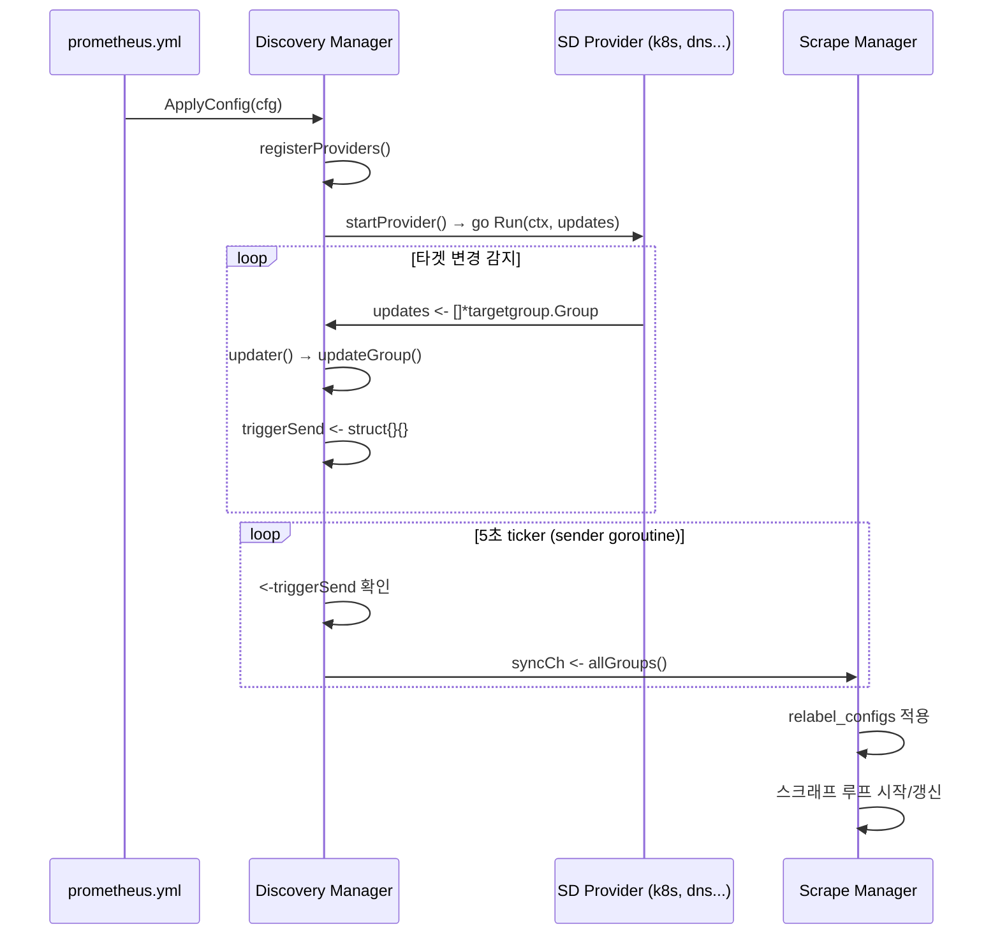

# 12. 서비스 디스커버리 (Service Discovery) Deep-Dive

## 목차

1. [서비스 디스커버리 개요](#1-서비스-디스커버리-개요)
2. [Discoverer 인터페이스](#2-discoverer-인터페이스)
3. [Discovery Manager](#3-discovery-manager)
4. [targetgroup.Group 구조](#4-targetgroupgroup-구조)
5. [Kubernetes SD](#5-kubernetes-sd)
6. [DNS SD](#6-dns-sd)
7. [File SD](#7-file-sd)
8. [HTTP SD](#8-http-sd)
9. [Static Config](#9-static-config)
10. [SD 프로바이더 등록 메커니즘](#10-sd-프로바이더-등록-메커니즘)
11. [커스텀 SD 개발 방법](#11-커스텀-sd-개발-방법)

---

## 1. 서비스 디스커버리 개요

### 1.1 왜 서비스 디스커버리가 필요한가

전통적인 모니터링 시스템에서는 감시 대상(타겟)의 IP 주소와 포트를 설정 파일에 정적으로 기입했다. 그러나 현대 클라우드 네이티브 환경에서는 이 방식이 작동하지 않는다:

- **컨테이너 오케스트레이션**: Kubernetes Pod는 수시로 생성/삭제되며, IP가 매번 바뀐다
- **오토스케일링**: AWS EC2, GCE 인스턴스가 트래픽에 따라 자동으로 증감한다
- **서비스 메시**: Consul, Nomad 등에서 서비스 인스턴스가 동적으로 등록/해제된다
- **마이크로서비스**: 수백 개의 서비스가 독립적으로 배포되며 주소가 계속 변한다

Prometheus는 **pull 모델**을 사용하므로, 스크래프할 타겟의 주소를 반드시 알아야 한다. 서비스 디스커버리(SD)는 이 문제를 해결하는 핵심 서브시스템으로, 다양한 인프라 소스에서 타겟 목록을 자동으로 수집하고 실시간 업데이트한다.

### 1.2 서비스 디스커버리의 위치

```
┌─────────────────────────────────────────────────────────────┐
│                     prometheus.yml                          │
│  scrape_configs:                                            │
│    - job_name: 'kubernetes-pods'                            │
│      kubernetes_sd_configs:                                 │
│        - role: pod                                          │
│      relabel_configs:                                       │
│        - source_labels: [__meta_kubernetes_pod_annotation_  │
│                          prometheus_io_scrape]              │
│          action: keep                                       │
│          regex: true                                        │
└──────────────┬──────────────────────────────────────────────┘
               │ 설정 파싱
               ▼
┌──────────────────────────┐     syncCh      ┌──────────────────────┐
│    Discovery Manager     │ ──────────────► │   Scrape Manager     │
│                          │  map[string]    │                      │
│  ┌────────────────────┐  │  []*Group       │  타겟 라벨 처리       │
│  │ Provider: k8s/0    │  │                 │  (relabel_configs)   │
│  │ Provider: dns/1    │  │                 │  스크래프 루프 시작    │
│  │ Provider: file/2   │  │                 │                      │
│  └────────────────────┘  │                 └──────────────────────┘
└──────────────────────────┘
```

### 1.3 전체 데이터 흐름



---

## 2. Discoverer 인터페이스

### 2.1 핵심 인터페이스 정의

Prometheus의 모든 서비스 디스커버리 메커니즘은 하나의 인터페이스를 구현한다.

**소스 경로**: `discovery/discovery.go`

```go
// Discoverer provides information about target groups. It maintains a set
// of sources from which TargetGroups can originate.
type Discoverer interface {
    // Run hands a channel to the discovery provider through which
    // it can send updated target groups. It must return when the context is canceled.
    // It should not close the update channel on returning.
    Run(ctx context.Context, up chan<- []*targetgroup.Group)
}
```

### 2.2 인터페이스 설계의 핵심 원칙

| 원칙 | 설명 |
|------|------|
| **단일 메서드** | `Run()` 하나만 구현하면 SD 프로바이더가 된다 |
| **비동기 전송** | 채널을 통해 타겟 그룹을 비동기로 전달한다 |
| **Context 기반 생명주기** | `ctx.Done()`으로 종료 시점을 제어한다 |
| **채널 소유권** | 프로바이더는 채널을 닫지 않는다 (Manager가 소유) |
| **초기 전체 전송** | 최초 실행 시 발견 가능한 모든 타겟 그룹을 전송해야 한다 |
| **증분 업데이트** | 변경이 감지될 때만 해당 타겟 그룹을 재전송한다 |

### 2.3 Config 인터페이스

각 SD 프로바이더는 설정을 위한 `Config` 인터페이스도 구현해야 한다:

```go
type Config interface {
    Name() string
    NewDiscoverer(DiscovererOptions) (Discoverer, error)
    NewDiscovererMetrics(prometheus.Registerer, RefreshMetricsInstantiator) DiscovererMetrics
}
```

- `Name()`: SD 메커니즘의 고유 이름 (예: `"kubernetes"`, `"dns"`, `"file"`)
- `NewDiscoverer()`: 설정으로부터 실제 Discoverer 인스턴스를 생성
- `NewDiscovererMetrics()`: 해당 SD의 메트릭 객체를 생성

### 2.4 DiscovererOptions

Discoverer 생성 시 전달되는 옵션 구조체:

```go
type DiscovererOptions struct {
    Logger            *slog.Logger
    Metrics           DiscovererMetrics
    HTTPClientOptions []config.HTTPClientOption
    SetName           string  // 이 discoverer set의 식별자
}
```

---

## 3. Discovery Manager

### 3.1 Manager 구조체

**소스 경로**: `discovery/manager.go`

Discovery Manager는 모든 SD 프로바이더를 관리하고, 업데이트를 수집하여 Scrape Manager로 전달하는 중앙 제어 컴포넌트다.

```go
type Manager struct {
    logger   *slog.Logger
    name     string
    ctx      context.Context

    // 타겟 저장소: poolKey → source → Group
    targets    map[poolKey]map[string]*targetgroup.Group
    targetsMtx sync.Mutex

    // SD 프로바이더 목록
    providers []*Provider

    // Scrape Manager로 업데이트 전송하는 채널
    syncCh chan map[string][]*targetgroup.Group

    // 업데이트 쓰로틀링: 기본 5초
    updatert time.Duration

    // 업데이트 시그널 채널 (버퍼 크기 1)
    triggerSend chan struct{}

    // 프로바이더 카운터
    lastProvider uint

    metrics   *Metrics
    sdMetrics map[string]DiscovererMetrics
}
```

### 3.2 poolKey: 타겟 그룹의 복합 키

```go
type poolKey struct {
    setName  string  // scrape config의 job_name
    provider string  // 프로바이더 이름 (예: "kubernetes/0")
}
```

타겟은 `poolKey → source → *targetgroup.Group`의 3단계 맵으로 관리된다. 이 설계 덕분에:

- 같은 job 아래 여러 SD 프로바이더가 동시에 동작 가능
- 각 프로바이더의 타겟 그룹이 독립적으로 관리됨
- `source`로 개별 타겟 그룹의 증분 업데이트 가능

### 3.3 Provider 구조체

```go
type Provider struct {
    name    string
    d       Discoverer
    config  any
    cancel  context.CancelFunc
    done    func()

    mu      sync.RWMutex
    subs    map[string]struct{}    // 현재 구독자 (job_name 목록)
    newSubs map[string]struct{}    // 설정 리로드 시 새 구독자
}
```

하나의 Provider는 하나의 Discoverer 인스턴스를 래핑한다. 동일한 설정의 프로바이더는 여러 scrape config에서 **공유**된다 (reflect.DeepEqual로 비교).

### 3.4 Manager.Run() - 시작

```go
func (m *Manager) Run() error {
    go m.sender()
    <-m.ctx.Done()
    m.cancelDiscoverers()
    return m.ctx.Err()
}
```

- `sender()` goroutine을 백그라운드로 시작
- Context가 취소될 때까지 블로킹
- 종료 시 모든 Discoverer를 취소

### 3.5 ApplyConfig() - 설정 적용

설정 리로드의 핵심 로직이다. 기존 프로바이더와 새 설정을 비교하여 최소한의 변경만 수행한다:

```
ApplyConfig(cfg) 흐름:
    ├── registerProviders(): 각 scrape config의 SD 설정을 순회
    │   ├── 기존 프로바이더와 reflect.DeepEqual 비교
    │   │   ├── 동일 → newSubs에 setName 추가 (프로바이더 재사용)
    │   │   └── 다름 → 새 Discoverer 생성, providers에 추가
    │   └── SD 설정이 비어있으면 StaticConfig{{}} 추가 (빈 타겟)
    │
    ├── 폐기 프로바이더 처리:
    │   ├── newSubs가 비어있고 실행 중인 프로바이더 → cancel()
    │   └── 새 프로바이더 → startProvider()
    │
    ├── 타겟 마이그레이션:
    │   ├── 폐기된 subs의 타겟 삭제
    │   └── 새 subs에 기존 refTargets 복사
    │
    └── triggerSend로 즉시 업데이트 트리거
```

### 3.6 startProvider() - 프로바이더 시작

```go
func (m *Manager) startProvider(ctx context.Context, p *Provider) {
    ctx, cancel := context.WithCancel(ctx)
    updates := make(chan []*targetgroup.Group)

    p.cancel = cancel

    go p.d.Run(ctx, updates)     // SD 프로바이더 실행
    go m.updater(ctx, p, updates) // 업데이트 수신 goroutine
}
```

각 프로바이더에 대해 두 개의 goroutine이 실행된다:
1. **SD Run goroutine**: 타겟 변경을 감지하여 `updates` 채널로 전송
2. **updater goroutine**: `updates`를 수신하여 Manager의 targets 맵에 병합

### 3.7 updater() - 업데이트 수신 및 병합

```go
func (m *Manager) updater(ctx context.Context, p *Provider, updates chan []*targetgroup.Group) {
    defer m.cleaner(p)
    for {
        select {
        case <-ctx.Done():
            return
        case tgs, ok := <-updates:
            m.metrics.ReceivedUpdates.Inc()
            if !ok {
                <-ctx.Done()
                return
            }

            p.mu.RLock()
            for s := range p.subs {
                m.updateGroup(poolKey{setName: s, provider: p.name}, tgs)
            }
            p.mu.RUnlock()

            select {
            case m.triggerSend <- struct{}{}:
            default:
            }
        }
    }
}
```

핵심 동작:
1. 프로바이더의 `updates` 채널에서 타겟 그룹 배열을 수신
2. 해당 프로바이더의 모든 구독자(subs)에 대해 `updateGroup()` 호출
3. `triggerSend`에 시그널 전송 (버퍼 1이므로 중복 시그널은 자동 drop)

### 3.8 updateGroup() - 타겟 그룹 저장

```go
func (m *Manager) updateGroup(poolKey poolKey, tgs []*targetgroup.Group) {
    m.targetsMtx.Lock()
    defer m.targetsMtx.Unlock()

    if _, ok := m.targets[poolKey]; !ok {
        m.targets[poolKey] = make(map[string]*targetgroup.Group)
    }
    for _, tg := range tgs {
        if tg == nil {
            continue
        }
        if len(tg.Targets) > 0 {
            m.targets[poolKey][tg.Source] = tg
        } else {
            // 타겟이 비어있으면 해당 source 삭제 (메모리 누수 방지)
            delete(m.targets[poolKey], tg.Source)
        }
    }
}
```

**중요한 설계 결정**: 빈 Targets 배열을 가진 그룹은 해당 source의 삭제를 의미한다. 이것이 Kubernetes SD 같은 메커니즘에서 Pod 삭제를 전파하는 방식이다.

### 3.9 sender() - 쓰로틀된 업데이트 전송

```go
func (m *Manager) sender() {
    ticker := time.NewTicker(m.updatert)  // 기본 5초
    defer func() {
        ticker.Stop()
        close(m.syncCh)
    }()
    for {
        select {
        case <-m.ctx.Done():
            return
        case <-ticker.C:
            select {
            case <-m.triggerSend:
                select {
                case m.syncCh <- m.allGroups():
                default:
                    // 수신자 채널이 가득 참 → 다음 사이클에 재시도
                    m.metrics.DelayedUpdates.Inc()
                    select {
                    case m.triggerSend <- struct{}{}:
                    default:
                    }
                }
            default:
            }
        }
    }
}
```

sender()의 5초 디바운싱 메커니즘:

```
시간 ──────────────────────────────────────────────────►

SD 업데이트:  ●  ●●  ●     ●  ●●●●  ●
              │  ││  │     │  ││││  │
triggerSend:  ■  ■   ■     ■  ■     ■  (버퍼 1, 중복 무시)
              │        │         │         │
ticker(5s):   ├────────┤─────────┤─────────┤
              │        │         │         │
syncCh 전송:  │        ✓         ✓         ✓
```

**왜 5초 디바운싱인가?**
- Kubernetes SD 같은 메커니즘은 초당 수십~수백 건의 업데이트를 생성할 수 있다
- 각 업데이트마다 Scrape Manager가 타겟 목록을 재계산하면 CPU 낭비
- 5초 간격으로 배치 처리하여 부하를 크게 줄인다

### 3.10 allGroups() - 전체 타겟 수집

```go
func (m *Manager) allGroups() map[string][]*targetgroup.Group {
    tSets := map[string][]*targetgroup.Group{}
    n := map[string]int{}

    for _, p := range m.providers {
        for s := range p.subs {
            // 빈 리스트로 초기화 (stale 타겟 드롭 보장)
            if _, ok := tSets[s]; !ok {
                tSets[s] = []*targetgroup.Group{}
                n[s] = 0
            }
            if tsets, ok := m.targets[poolKey{s, p.name}]; ok {
                for _, tg := range tsets {
                    tSets[s] = append(tSets[s], tg)
                    n[s] += len(tg.Targets)
                }
            }
        }
    }
    // 메트릭 업데이트
    for setName, v := range n {
        m.metrics.DiscoveredTargets.WithLabelValues(setName).Set(float64(v))
    }
    return tSets
}
```

---

## 4. targetgroup.Group 구조

### 4.1 Group 구조체 정의

**소스 경로**: `discovery/targetgroup/targetgroup.go`

```go
type Group struct {
    // 각 타겟의 라벨셋 배열. __address__로 고유 식별
    Targets []model.LabelSet

    // 그룹 내 모든 타겟에 공통 적용되는 라벨셋
    Labels model.LabelSet

    // 타겟 그룹의 고유 식별자
    Source string
}
```

### 4.2 구조 다이어그램

```
targetgroup.Group
├── Source: "pod/default/my-app-7b8f9c6d4f-x2k9j"
│
├── Labels (공통 라벨):
│   ├── __meta_kubernetes_namespace = "default"
│   ├── __meta_kubernetes_pod_name = "my-app-7b8f9c6d4f-x2k9j"
│   ├── __meta_kubernetes_pod_ip = "10.244.1.15"
│   ├── __meta_kubernetes_pod_ready = "true"
│   └── __meta_kubernetes_pod_phase = "Running"
│
└── Targets (개별 타겟):
    ├── [0] LabelSet:
    │   ├── __address__ = "10.244.1.15:8080"
    │   ├── __meta_kubernetes_pod_container_name = "app"
    │   └── __meta_kubernetes_pod_container_port_name = "http"
    │
    └── [1] LabelSet:
        ├── __address__ = "10.244.1.15:9090"
        ├── __meta_kubernetes_pod_container_name = "app"
        └── __meta_kubernetes_pod_container_port_name = "metrics"
```

### 4.3 LabelSet과 특수 라벨

| 특수 라벨 | 역할 |
|----------|------|
| `__address__` | 타겟의 호스트:포트 (필수) |
| `__metrics_path__` | 메트릭 경로 (기본값: `/metrics`) |
| `__scheme__` | HTTP/HTTPS (기본값: `http`) |
| `__param_<name>` | 스크래프 요청의 URL 파라미터 |
| `__meta_*` | SD 메타데이터 라벨 (relabel에서 사용, 저장되지 않음) |

### 4.4 직렬화 형식

Group은 JSON과 YAML 양쪽을 지원한다. 직렬화 시 `Targets`의 `__address__` 값만 문자열 배열로 추출된다:

```json
[
  {
    "targets": ["10.244.1.15:8080", "10.244.1.15:9090"],
    "labels": {
      "__meta_kubernetes_namespace": "default",
      "__meta_kubernetes_pod_name": "my-app"
    }
  }
]
```

역직렬화 시 각 문자열은 `{__address__: "값"}` 형태의 LabelSet으로 변환된다.

---

## 5. Kubernetes SD

### 5.1 개요

Kubernetes SD는 Prometheus에서 가장 많이 사용되는 SD 메커니즘이다. Kubernetes API 서버에 Watch 요청을 보내 리소스 변경을 실시간으로 감지하고, 이를 타겟 그룹으로 변환한다.

**소스 경로**: `discovery/kubernetes/kubernetes.go`

### 5.2 Discovery 구조체

```go
type Discovery struct {
    sync.RWMutex
    client             kubernetes.Interface    // K8s API 클라이언트
    role               Role                     // 탐색 역할
    logger             *slog.Logger
    namespaceDiscovery *NamespaceDiscovery      // 네임스페이스 필터
    discoverers        []discovery.Discoverer   // 역할별 하위 discoverer
    selectors          roleSelector             // 라벨/필드 셀렉터
    ownNamespace       string                   // 자기 네임스페이스
    attachMetadata     AttachMetadataConfig     // 추가 메타데이터 설정
    metrics            *kubernetesMetrics
}
```

### 5.3 Role (탐색 역할)

```go
const (
    RoleNode          Role = "node"
    RolePod           Role = "pod"
    RoleService       Role = "service"
    RoleEndpoint      Role = "endpoints"
    RoleEndpointSlice Role = "endpointslice"
    RoleIngress       Role = "ingress"
)
```

| Role | 탐색 대상 | 주요 용도 |
|------|----------|----------|
| `pod` | 모든 Pod | 개별 컨테이너 포트 직접 스크래프 |
| `node` | 모든 Node | kubelet, node-exporter 스크래프 |
| `service` | 모든 Service | 블랙박스 프로빙, 서비스 모니터링 |
| `endpoints` | Endpoints 객체 | Service 뒤의 실제 Pod 스크래프 |
| `endpointslice` | EndpointSlice 객체 | endpoints의 개선 버전 (대규모 클러스터) |
| `ingress` | Ingress 객체 | 외부 엔드포인트 블랙박스 프로빙 |

### 5.4 SDConfig 설정

```go
type SDConfig struct {
    APIServer          config.URL              `yaml:"api_server,omitempty"`
    Role               Role                    `yaml:"role"`
    KubeConfig         string                  `yaml:"kubeconfig_file"`
    HTTPClientConfig   config.HTTPClientConfig `yaml:",inline"`
    NamespaceDiscovery NamespaceDiscovery      `yaml:"namespaces,omitempty"`
    Selectors          []SelectorConfig        `yaml:"selectors,omitempty"`
    AttachMetadata     AttachMetadataConfig    `yaml:"attach_metadata,omitempty"`
}
```

인증 설정 우선순위:
1. `kubeconfig_file` 지정 → kubeconfig 파일 사용
2. `api_server` 미지정, kubeconfig 미지정 → in-cluster config (ServiceAccount)
3. `api_server` 지정 → HTTPClientConfig의 인증 설정 사용

상호 배타적 제약:
- `api_server`와 `kubeconfig_file`은 동시 사용 불가
- `kubeconfig_file`과 커스텀 HTTPClientConfig은 동시 사용 불가

### 5.5 Informer 패턴

Kubernetes SD의 핵심은 **client-go의 Informer 패턴**이다:

```
┌─────────────────┐     Watch      ┌─────────────────┐
│  K8s API Server │ ◄──────────── │  SharedInformer  │
│                 │ ──────────── ► │                  │
│  - Pod          │    Events      │  - List (초기)   │
│  - Node         │  (Add/Update/  │  - Watch (이후)  │
│  - Service      │   Delete)      │  - Local Cache   │
│  - Endpoints    │                │  - Event Handler │
│  - Ingress      │                │                  │
└─────────────────┘                └────────┬────────┘
                                            │
                                   ┌────────▼────────┐
                                   │  Role Discoverer │
                                   │  (Pod/Node/...)  │
                                   │                  │
                                   │  buildXxx()      │
                                   │  → targetgroup   │
                                   └────────┬────────┘
                                            │
                                   ┌────────▼────────┐
                                   │  chan<- []*Group  │
                                   └─────────────────┘
```

실제 코드에서 Informer 생성 과정 (Pod role 예시):

```go
// kubernetes.go - Run() 메서드 내 RolePod case
p := d.client.CoreV1().Pods(namespace)
plw := &cache.ListWatch{
    ListWithContextFunc: func(ctx context.Context, options metav1.ListOptions) (runtime.Object, error) {
        options.FieldSelector = d.selectors.pod.field
        options.LabelSelector = d.selectors.pod.label
        return p.List(ctx, options)
    },
    WatchFuncWithContext: func(ctx context.Context, options metav1.ListOptions) (watch.Interface, error) {
        options.FieldSelector = d.selectors.pod.field
        options.LabelSelector = d.selectors.pod.label
        return p.Watch(ctx, options)
    },
}
pod := NewPod(
    d.logger.With("role", "pod"),
    d.newIndexedPodsInformer(plw),
    nodeInformer,        // attach_metadata.node 설정 시
    namespaceInformer,   // attach_metadata.namespace 설정 시
    replicaSetInformer,  // attach_metadata.deployment 설정 시
    jobInformer,         // attach_metadata.job/cronjob 설정 시
    ...
)
d.discoverers = append(d.discoverers, pod)
go pod.podInf.Run(ctx.Done())
```

### 5.6 Run() 메서드의 동작

`Discovery.Run()`은 Role에 따라 적절한 하위 discoverer를 생성하고 병렬로 실행한다:

```go
func (d *Discovery) Run(ctx context.Context, ch chan<- []*targetgroup.Group) {
    d.Lock()
    namespaces := d.getNamespaces()

    switch d.role {
    case RoleEndpointSlice:
        // EndpointSlice + Service + Pod Informer 생성
    case RoleEndpoint:
        // Endpoints + Service + Pod Informer 생성
    case RolePod:
        // Pod Informer 생성 (+ 옵션: Node, Namespace, ReplicaSet, Job)
    case RoleService:
        // Service Informer 생성
    case RoleIngress:
        // Ingress Informer 생성
    case RoleNode:
        // Node Informer 생성
    }

    var wg sync.WaitGroup
    for _, dd := range d.discoverers {
        wg.Add(1)
        go func(d discovery.Discoverer) {
            defer wg.Done()
            d.Run(ctx, ch)
        }(dd)
    }
    d.Unlock()
    wg.Wait()
    <-ctx.Done()
}
```

### 5.7 네임스페이스 필터링

```go
func (d *Discovery) getNamespaces() []string {
    namespaces := d.namespaceDiscovery.Names
    includeOwnNamespace := d.namespaceDiscovery.IncludeOwnNamespace

    if len(namespaces) == 0 && !includeOwnNamespace {
        return []string{apiv1.NamespaceAll}  // 모든 네임스페이스
    }
    if includeOwnNamespace && d.ownNamespace != "" {
        return append(namespaces, d.ownNamespace)
    }
    return namespaces
}
```

### 5.8 Kubernetes SD 라벨 매핑 (Pod Role)

**소스 경로**: `discovery/kubernetes/pod.go`

| 라벨 | 값 | 설명 |
|------|---|------|
| `__meta_kubernetes_namespace` | `default` | Pod의 네임스페이스 |
| `__meta_kubernetes_pod_name` | `my-app-xxx` | Pod 이름 |
| `__meta_kubernetes_pod_ip` | `10.244.1.15` | Pod IP |
| `__meta_kubernetes_pod_ready` | `true`/`false` | Ready 상태 |
| `__meta_kubernetes_pod_phase` | `Running` | Pod 단계 |
| `__meta_kubernetes_pod_node_name` | `node-1` | 스케줄된 노드 |
| `__meta_kubernetes_pod_host_ip` | `192.168.1.10` | 노드의 호스트 IP |
| `__meta_kubernetes_pod_uid` | `uuid` | Pod UID |
| `__meta_kubernetes_pod_controller_kind` | `ReplicaSet` | 컨트롤러 종류 |
| `__meta_kubernetes_pod_controller_name` | `my-app-xxx` | 컨트롤러 이름 |
| `__meta_kubernetes_pod_container_name` | `app` | 컨테이너 이름 |
| `__meta_kubernetes_pod_container_id` | `containerd://xxx` | 컨테이너 ID |
| `__meta_kubernetes_pod_container_image` | `nginx:1.25` | 컨테이너 이미지 |
| `__meta_kubernetes_pod_container_port_name` | `http` | 포트 이름 |
| `__meta_kubernetes_pod_container_port_number` | `8080` | 포트 번호 |
| `__meta_kubernetes_pod_container_port_protocol` | `TCP` | 포트 프로토콜 |
| `__meta_kubernetes_pod_container_init` | `true`/`false` | Init 컨테이너 여부 |
| `__meta_kubernetes_pod_label_<key>` | `<value>` | Pod 라벨 |
| `__meta_kubernetes_pod_labelpresent_<key>` | `true` | 라벨 존재 여부 |
| `__meta_kubernetes_pod_annotation_<key>` | `<value>` | Pod 어노테이션 |
| `__meta_kubernetes_pod_annotationpresent_<key>` | `true` | 어노테이션 존재 여부 |
| `__meta_kubernetes_pod_deployment_name` | `my-app` | Deployment 이름 (attach_metadata 필요) |
| `__meta_kubernetes_pod_job_name` | `my-job` | Job 이름 (attach_metadata 필요) |
| `__meta_kubernetes_pod_cronjob_name` | `my-cronjob` | CronJob 이름 (attach_metadata 필요) |

### 5.9 Kubernetes SD 라벨 매핑 (Node Role)

**소스 경로**: `discovery/kubernetes/node.go`

| 라벨 | 값 | 설명 |
|------|---|------|
| `__meta_kubernetes_node_name` | `node-1` | 노드 이름 |
| `__meta_kubernetes_node_provider_id` | `aws:///...` | 클라우드 프로바이더 ID |
| `__meta_kubernetes_node_label_<key>` | `<value>` | 노드 라벨 |
| `__meta_kubernetes_node_labelpresent_<key>` | `true` | 라벨 존재 여부 |
| `__meta_kubernetes_node_annotation_<key>` | `<value>` | 노드 어노테이션 |
| `__meta_kubernetes_node_address_<type>` | `192.168.1.10` | 노드 주소 (InternalIP 등) |
| `__address__` | `node-ip:kubelet-port` | Kubelet 엔드포인트 |
| `instance` | `node-1` | 인스턴스 이름 |

Node SD에서 `__address__`는 노드 IP와 kubelet 포트(기본 10250)로 조합된다:

```go
// node.go - buildNode()
addr = net.JoinHostPort(addr, strconv.FormatInt(
    int64(node.Status.DaemonEndpoints.KubeletEndpoint.Port), 10))
```

### 5.10 라벨/어노테이션 전파 함수

```go
// kubernetes.go
func addObjectAnnotationsAndLabels(labelSet model.LabelSet, objectMeta metav1.ObjectMeta, resource string) {
    for k, v := range objectMeta.Labels {
        ln := strutil.SanitizeLabelName(k)
        labelSet[model.LabelName(metaLabelPrefix+resource+"_label_"+ln)] = lv(v)
        labelSet[model.LabelName(metaLabelPrefix+resource+"_labelpresent_"+ln)] = presentValue
    }
    for k, v := range objectMeta.Annotations {
        ln := strutil.SanitizeLabelName(k)
        labelSet[model.LabelName(metaLabelPrefix+resource+"_annotation_"+ln)] = lv(v)
        labelSet[model.LabelName(metaLabelPrefix+resource+"_annotationpresent_"+ln)] = presentValue
    }
}
```

`strutil.SanitizeLabelName()`은 Kubernetes 라벨 키(예: `app.kubernetes.io/name`)를 Prometheus 호환 형식(예: `app_kubernetes_io_name`)으로 변환한다.

### 5.11 Selector 설정

각 Role은 특정 리소스에 대한 라벨/필드 셀렉터를 지원한다:

```go
allowedSelectors := map[Role][]string{
    RolePod:           {string(RolePod), string(RoleNode)},
    RoleService:       {string(RoleService)},
    RoleEndpointSlice: {string(RolePod), string(RoleService), string(RoleEndpointSlice)},
    RoleEndpoint:      {string(RolePod), string(RoleService), string(RoleEndpoint)},
    RoleNode:          {string(RoleNode)},
    RoleIngress:       {string(RoleIngress)},
}
```

설정 예:
```yaml
kubernetes_sd_configs:
  - role: pod
    selectors:
      - role: pod
        label: "app=nginx"
      - role: node
        field: "metadata.name=worker-1"
```

### 5.12 attach_metadata 설정

```go
type AttachMetadataConfig struct {
    Node              bool `yaml:"node"`
    Namespace         bool `yaml:"namespace"`
    PodMetadataConfig `yaml:",inline"`
}

type PodMetadataConfig struct {
    Deployment bool `yaml:"deployment"`
    Job        bool `yaml:"job"`
    CronJob    bool `yaml:"cronjob"`
}
```

`attach_metadata`가 활성화되면 추가 Informer가 생성된다:
- `node: true` → Node Informer 시작, Pod의 노드 메타데이터 부착
- `namespace: true` → Namespace Informer 시작, 네임스페이스 라벨/어노테이션 부착
- `deployment: true` → ReplicaSet Informer 시작, Deployment 이름 역추적
- `job/cronjob: true` → Job Informer 시작, Job/CronJob 이름 부착

---

## 6. DNS SD

### 6.1 개요

DNS SD는 DNS 레코드(SRV, A, AAAA, MX, NS)를 주기적으로 조회하여 타겟을 발견하는 간단한 SD 메커니즘이다.

**소스 경로**: `discovery/dns/dns.go`

### 6.2 SDConfig

```go
type SDConfig struct {
    Names           []string       `yaml:"names"`              // DNS 이름 목록
    RefreshInterval model.Duration `yaml:"refresh_interval"`   // 기본 30초
    Type            string         `yaml:"type"`               // 기본 "SRV"
    Port            int            `yaml:"port"`               // SRV 외 필수
}
```

지원 레코드 타입:

| 타입 | 포트 설정 | 설명 |
|------|----------|------|
| `SRV` | 자동 (레코드에 포함) | 서비스명 + 프로토콜로 조회, 포트 포함 |
| `A` | 필수 | IPv4 주소 조회 |
| `AAAA` | 필수 | IPv6 주소 조회 |
| `MX` | 필수 | 메일 교환 서버 조회 |
| `NS` | 필수 | 네임서버 조회 |

### 6.3 Discovery 구조체

```go
type Discovery struct {
    *refresh.Discovery          // refresh 패키지 임베딩 (주기적 리프레시)
    names   []string
    port    int
    qtype   uint16              // dns.TypeSRV, dns.TypeA 등
    logger  *slog.Logger
    metrics *dnsMetrics
    lookupFn func(name string, qtype uint16, logger *slog.Logger) (*dns.Msg, error)
}
```

DNS SD는 `refresh.Discovery`를 임베딩하여 주기적 리프레시 패턴을 재사용한다. `refresh.Discovery`는:
- 지정된 간격(기본 30초)으로 `RefreshF`를 호출
- 결과를 `chan<- []*targetgroup.Group`로 전송
- `Discoverer` 인터페이스의 `Run()`을 자동 구현

### 6.4 refresh() 메서드

```go
func (d *Discovery) refresh(ctx context.Context) ([]*targetgroup.Group, error) {
    var (
        wg  sync.WaitGroup
        ch  = make(chan *targetgroup.Group)
        tgs = make([]*targetgroup.Group, 0, len(d.names))
    )

    wg.Add(len(d.names))
    for _, name := range d.names {
        go func(n string) {
            if err := d.refreshOne(ctx, n, ch); err != nil && !errors.Is(err, context.Canceled) {
                d.logger.Error("Error refreshing DNS targets", "err", err)
            }
            wg.Done()
        }(name)
    }

    go func() {
        wg.Wait()
        close(ch)
    }()

    for tg := range ch {
        tgs = append(tgs, tg)
    }
    return tgs, nil
}
```

각 DNS 이름에 대해 병렬로 조회를 수행한다.

### 6.5 DNS 조회 전략 (lookupWithSearchPath)

DNS 조회는 `/etc/resolv.conf`의 search path를 고려한다:

1. 주어진 이름의 모든 search path 조합을 시도
2. **성공 (RCODE=SUCCESS)**: 즉시 반환
3. **모든 조합이 NXDOMAIN**: 해당 이름이 존재하지 않음 확인, 빈 결과 반환
4. **일부 에러 발생**: 에러 반환 (기존 상태 유지)

```go
func lookupWithSearchPath(name string, qtype uint16, logger *slog.Logger) (*dns.Msg, error) {
    conf, err := dns.ClientConfigFromFile(resolvConf)
    // ...
    for _, lname := range conf.NameList(name) {
        response, err := lookupFromAnyServer(lname, qtype, conf, logger)
        switch {
        case err != nil:
            allResponsesValid = false
        case response.Rcode == dns.RcodeSuccess:
            return response, nil  // 성공!
        }
    }
    // ...
}
```

TCP 폴백: UDP 응답이 truncated되면 자동으로 TCP로 재시도한다.

### 6.6 DNS SD 라벨

| 라벨 | 설명 |
|------|------|
| `__address__` | `host:port` 형식 |
| `__meta_dns_name` | 조회한 DNS 이름 |
| `__meta_dns_srv_record_target` | SRV 레코드 타겟 |
| `__meta_dns_srv_record_port` | SRV 레코드 포트 |
| `__meta_dns_mx_record_target` | MX 레코드 타겟 |
| `__meta_dns_ns_record_target` | NS 레코드 타겟 |

### 6.7 설정 예시

```yaml
scrape_configs:
  - job_name: 'dns-srv'
    dns_sd_configs:
      - names:
          - '_prometheus._tcp.example.com'
        type: SRV
        refresh_interval: 15s

  - job_name: 'dns-a'
    dns_sd_configs:
      - names:
          - 'web-servers.example.com'
        type: A
        port: 9090
```

---

## 7. File SD

### 7.1 개요

File SD는 JSON/YAML 파일에서 타겟 목록을 읽는 SD 메커니즘이다. 파일 시스템 감시(fsnotify)와 주기적 리프레시를 조합하여 동적 타겟 관리를 제공한다.

**소스 경로**: `discovery/file/file.go`

### 7.2 SDConfig

```go
type SDConfig struct {
    Files           []string       `yaml:"files"`
    RefreshInterval model.Duration `yaml:"refresh_interval,omitempty"`  // 기본 5분
}
```

파일 경로에는 glob 패턴(`*`)을 사용할 수 있으나, 확장자는 `.json`, `.yml`, `.yaml`만 허용된다:

```go
var patFileSDName = regexp.MustCompile(`^[^*]*(\*[^/]*)?\.(json|yml|yaml|JSON|YML|YAML)$`)
```

### 7.3 Discovery 구조체

```go
type Discovery struct {
    paths      []string               // 설정된 파일 패턴
    watcher    *fsnotify.Watcher      // 파일 시스템 감시
    interval   time.Duration          // 리프레시 간격
    timestamps map[string]float64     // 파일별 수정 시간
    lock       sync.RWMutex
    lastRefresh map[string]int        // 파일별 마지막 타겟 그룹 수
    logger      *slog.Logger
    metrics     *fileMetrics
}
```

### 7.4 Run() - 이벤트 루프

```go
func (d *Discovery) Run(ctx context.Context, ch chan<- []*targetgroup.Group) {
    watcher, err := fsnotify.NewWatcher()
    // ...
    d.watcher = watcher
    defer d.stop()

    d.refresh(ctx, ch)  // 최초 1회 전체 리프레시

    ticker := time.NewTicker(d.interval)
    defer ticker.Stop()

    for {
        select {
        case <-ctx.Done():
            return
        case event := <-d.watcher.Events:
            if event.Name == "" { break }
            if event.Op^fsnotify.Chmod == 0 { break }  // chmod는 무시
            d.refresh(ctx, ch)
        case <-ticker.C:
            d.refresh(ctx, ch)  // 주기적 리프레시 (놓친 이벤트 보상)
        case err := <-d.watcher.Errors:
            // 에러 로깅
        }
    }
}
```

**왜 주기적 리프레시와 fsnotify를 동시에 사용하는가?**

- fsnotify는 파일 변경을 즉시 감지하여 빠른 반응을 제공
- 그러나 watcher 등록 실패, NFS 등 원격 파일 시스템, 에지 케이스 등에서 이벤트가 누락될 수 있음
- 주기적 리프레시(기본 5분)가 이런 누락을 보상하는 안전장치 역할

### 7.5 refresh() - 파일 읽기 및 변경 감지

```go
func (d *Discovery) refresh(ctx context.Context, ch chan<- []*targetgroup.Group) {
    ref := map[string]int{}
    for _, p := range d.listFiles() {
        tgroups, err := d.readFile(p)
        if err != nil {
            ref[p] = d.lastRefresh[p]  // 에러 시 이전 상태 유지
            continue
        }
        ch <- tgroups
        ref[p] = len(tgroups)
    }

    // 삭제된 파일의 타겟 정리
    for f, n := range d.lastRefresh {
        m, ok := ref[f]
        if !ok || n > m {
            for i := m; i < n; i++ {
                ch <- []*targetgroup.Group{{Source: fileSource(f, i)}}
            }
        }
    }
    d.lastRefresh = ref
    d.watchFiles()
}
```

삭제된 파일 처리: `lastRefresh`에 있지만 이번 리프레시에서 발견되지 않은 파일에 대해, 빈 Targets를 가진 Group을 전송한다. 이렇게 하면 Manager의 `updateGroup()`에서 해당 source가 삭제된다.

### 7.6 readFile() - 파일 파싱

```go
func (d *Discovery) readFile(filename string) ([]*targetgroup.Group, error) {
    content, _ := io.ReadAll(fd)

    switch ext := filepath.Ext(filename); strings.ToLower(ext) {
    case ".json":
        json.Unmarshal(content, &targetGroups)
    case ".yml", ".yaml":
        yaml.UnmarshalStrict(content, &targetGroups)
    }

    for i, tg := range targetGroups {
        tg.Source = fileSource(filename, i)  // "filename:index" 형식
        tg.Labels[fileSDFilepathLabel] = model.LabelValue(filename)
    }
    return targetGroups, nil
}
```

### 7.7 File SD 라벨

| 라벨 | 설명 |
|------|------|
| `__meta_filepath` | 타겟을 읽어온 파일 경로 |

### 7.8 파일 형식 예시

JSON:
```json
[
  {
    "targets": ["10.0.0.1:9090", "10.0.0.2:9090"],
    "labels": {
      "env": "production",
      "team": "infra"
    }
  },
  {
    "targets": ["10.0.1.1:9090"],
    "labels": {
      "env": "staging"
    }
  }
]
```

YAML:
```yaml
- targets:
    - "10.0.0.1:9090"
    - "10.0.0.2:9090"
  labels:
    env: production
    team: infra
- targets:
    - "10.0.1.1:9090"
  labels:
    env: staging
```

### 7.9 설정 예시

```yaml
scrape_configs:
  - job_name: 'file-sd'
    file_sd_configs:
      - files:
          - '/etc/prometheus/targets/*.json'
          - '/etc/prometheus/targets/*.yml'
        refresh_interval: 5m
```

---

## 8. HTTP SD

### 8.1 개요

HTTP SD는 HTTP 엔드포인트에서 JSON 형식의 타겟 목록을 주기적으로 가져오는 SD 메커니즘이다. File SD의 HTTP 버전으로, 중앙 집중식 타겟 관리 시스템과 연동할 때 유용하다.

**소스 경로**: `discovery/http/http.go`

### 8.2 SDConfig

```go
type SDConfig struct {
    HTTPClientConfig config.HTTPClientConfig `yaml:",inline"`
    RefreshInterval  model.Duration          `yaml:"refresh_interval,omitempty"`  // 기본 60초
    URL              string                  `yaml:"url"`
}
```

URL은 `http://` 또는 `https://` 스킴만 허용된다.

### 8.3 Discovery 구조체

```go
type Discovery struct {
    *refresh.Discovery              // refresh 패키지 임베딩
    url             string
    client          *http.Client
    refreshInterval time.Duration
    tgLastLength    int             // 이전 타겟 그룹 수 (삭제 감지용)
    metrics         *httpMetrics
}
```

DNS SD와 마찬가지로 `refresh.Discovery`를 임베딩한다.

### 8.4 Refresh() 메서드

```go
func (d *Discovery) Refresh(ctx context.Context) ([]*targetgroup.Group, error) {
    req, _ := http.NewRequest(http.MethodGet, d.url, http.NoBody)
    req.Header.Set("User-Agent", userAgent)
    req.Header.Set("Accept", "application/json")
    req.Header.Set("X-Prometheus-Refresh-Interval-Seconds",
        strconv.FormatFloat(d.refreshInterval.Seconds(), 'f', -1, 64))

    resp, err := d.client.Do(req.WithContext(ctx))
    // ...

    // Content-Type 검증: application/json만 허용
    if !matchContentType.MatchString(resp.Header.Get("Content-Type")) {
        return nil, fmt.Errorf("unsupported content type %q", ...)
    }

    var targetGroups []*targetgroup.Group
    json.Unmarshal(b, &targetGroups)

    for i, tg := range targetGroups {
        tg.Source = urlSource(d.url, i)
        tg.Labels[httpSDURLLabel] = model.LabelValue(d.url)
    }

    // 삭제된 타겟 그룹 처리
    l := len(targetGroups)
    for i := l; i < d.tgLastLength; i++ {
        targetGroups = append(targetGroups, &targetgroup.Group{Source: urlSource(d.url, i)})
    }
    d.tgLastLength = l

    return targetGroups, nil
}
```

주요 특징:
- `X-Prometheus-Refresh-Interval-Seconds` 헤더로 서버에 폴링 간격을 알려준다
- `application/json` Content-Type만 허용 (charset=utf-8 옵션)
- 이전보다 타겟 그룹 수가 줄어들면 빈 Group을 추가하여 삭제를 알린다
- HTTP 클라이언트 타임아웃이 RefreshInterval과 동일하게 설정된다

### 8.5 HTTP SD 라벨

| 라벨 | 설명 |
|------|------|
| `__meta_url` | 타겟을 가져온 HTTP URL |

### 8.6 HTTP 엔드포인트 응답 형식

```json
[
  {
    "targets": ["10.0.0.1:9090", "10.0.0.2:9090"],
    "labels": {
      "env": "production",
      "__scheme__": "https"
    }
  }
]
```

### 8.7 설정 예시

```yaml
scrape_configs:
  - job_name: 'http-sd'
    http_sd_configs:
      - url: 'http://service-registry.internal:8080/targets'
        refresh_interval: 30s
        basic_auth:
          username: prometheus
          password_file: /etc/prometheus/auth/password
```

---

## 9. Static Config

### 9.1 개요

Static Config는 가장 단순한 SD 형태로, 설정 파일에 타겟 주소를 직접 기입한다. 별도의 SD 인프라 없이 소수의 고정 타겟을 모니터링할 때 사용한다.

### 9.2 구현

**소스 경로**: `discovery/discovery.go`

```go
type StaticConfig []*targetgroup.Group

func (StaticConfig) Name() string { return "static" }

func (c StaticConfig) NewDiscoverer(DiscovererOptions) (Discoverer, error) {
    return staticDiscoverer(c), nil
}

type staticDiscoverer []*targetgroup.Group

func (c staticDiscoverer) Run(ctx context.Context, up chan<- []*targetgroup.Group) {
    defer close(up)
    select {
    case <-ctx.Done():
    case up <- c:
    }
}
```

`staticDiscoverer.Run()`은 타겟 그룹을 한 번 전송하고 Context 취소를 기다린다. 가장 단순한 Discoverer 구현이다.

### 9.3 설정 예시

```yaml
scrape_configs:
  - job_name: 'static-targets'
    static_configs:
      - targets:
          - 'localhost:9090'
          - 'localhost:9100'
        labels:
          env: 'local'
          group: 'infrastructure'
```

---

## 10. SD 프로바이더 등록 메커니즘

### 10.1 레지스트리 시스템

Prometheus의 SD 프로바이더 등록은 Go의 `init()` 함수와 blank import를 활용한 플러그인 시스템이다.

**소스 경로**: `discovery/registry.go`

```go
var (
    configNames      = make(map[string]Config)      // 이름 → Config 매핑
    configFieldNames = make(map[reflect.Type]string) // 타입 → 필드명 매핑
    configFields     []reflect.StructField           // YAML 언마샬용 필드 목록
)

func RegisterConfig(config Config) {
    registerConfig(config.Name()+"_sd_configs", reflect.TypeOf(config), config)
}
```

각 SD 패키지의 `init()`에서 `RegisterConfig()`를 호출한다:

```go
// discovery/kubernetes/kubernetes.go
func init() {
    discovery.RegisterConfig(&SDConfig{})
}

// discovery/dns/dns.go
func init() {
    discovery.RegisterConfig(&SDConfig{})
}

// discovery/file/file.go
func init() {
    discovery.RegisterConfig(&SDConfig{})
}
```

### 10.2 install 패키지: 일괄 등록

**소스 경로**: `discovery/install/install.go`

```go
package install

import (
    _ "github.com/prometheus/prometheus/discovery/aws"
    _ "github.com/prometheus/prometheus/discovery/azure"
    _ "github.com/prometheus/prometheus/discovery/consul"
    _ "github.com/prometheus/prometheus/discovery/digitalocean"
    _ "github.com/prometheus/prometheus/discovery/dns"
    _ "github.com/prometheus/prometheus/discovery/eureka"
    _ "github.com/prometheus/prometheus/discovery/file"
    _ "github.com/prometheus/prometheus/discovery/gce"
    _ "github.com/prometheus/prometheus/discovery/hetzner"
    _ "github.com/prometheus/prometheus/discovery/http"
    _ "github.com/prometheus/prometheus/discovery/ionos"
    _ "github.com/prometheus/prometheus/discovery/kubernetes"
    _ "github.com/prometheus/prometheus/discovery/linode"
    _ "github.com/prometheus/prometheus/discovery/marathon"
    _ "github.com/prometheus/prometheus/discovery/moby"
    _ "github.com/prometheus/prometheus/discovery/nomad"
    _ "github.com/prometheus/prometheus/discovery/openstack"
    _ "github.com/prometheus/prometheus/discovery/ovhcloud"
    _ "github.com/prometheus/prometheus/discovery/puppetdb"
    _ "github.com/prometheus/prometheus/discovery/scaleway"
    _ "github.com/prometheus/prometheus/discovery/stackit"
    _ "github.com/prometheus/prometheus/discovery/triton"
    _ "github.com/prometheus/prometheus/discovery/uyuni"
    _ "github.com/prometheus/prometheus/discovery/vultr"
    _ "github.com/prometheus/prometheus/discovery/xds"
    _ "github.com/prometheus/prometheus/discovery/zookeeper"
)
```

Prometheus의 `main.go`에서 `import _ "discovery/install"`을 하면 모든 SD 프로바이더가 자동으로 등록된다.

### 10.3 동적 YAML 파싱

등록된 Config들은 `reflect`를 사용하여 동적으로 YAML 구조체를 생성한다:

```
RegisterConfig("kubernetes") → configFields에 추가:
    Field{
        Name: "AUTO_DISCOVERY_kubernetes_sd_configs",
        Type: []*kubernetes.SDConfig,
        Tag:  `yaml:"kubernetes_sd_configs,omitempty"`
    }

RegisterConfig("dns") → configFields에 추가:
    Field{
        Name: "AUTO_DISCOVERY_dns_sd_configs",
        Type: []*dns.SDConfig,
        Tag:  `yaml:"dns_sd_configs,omitempty"`
    }
```

이 동적 필드들이 `Configs.UnmarshalYAML()`에서 사용되어, 새 SD 프로바이더를 추가해도 설정 파싱 코드를 수정할 필요가 없다.

### 10.4 등록 흐름 다이어그램

```mermaid
graph TD
    A[main.go] -->|import _| B[discovery/install/install.go]
    B -->|import _| C1[discovery/kubernetes]
    B -->|import _| C2[discovery/dns]
    B -->|import _| C3[discovery/file]
    B -->|import _| C4[discovery/http]
    B -->|import _| C5[... 25개 이상]

    C1 -->|init()| D[discovery.RegisterConfig]
    C2 -->|init()| D
    C3 -->|init()| D
    C4 -->|init()| D
    C5 -->|init()| D

    D -->|configNames map에 등록| E[YAML 동적 파싱 가능]
    D -->|configFields에 필드 추가| E

    E -->|Configs.UnmarshalYAML| F[prometheus.yml 파싱]
    F -->|Config.NewDiscoverer| G[Discoverer 인스턴스 생성]
```

---

## 11. 커스텀 SD 개발 방법

### 11.1 개발 단계

커스텀 SD 프로바이더를 개발하려면 다음 단계를 따른다:

**1단계: Config 구현**

```go
package mysd

import (
    "github.com/prometheus/prometheus/discovery"
)

type SDConfig struct {
    Endpoint        string         `yaml:"endpoint"`
    RefreshInterval model.Duration `yaml:"refresh_interval,omitempty"`
}

func (*SDConfig) Name() string { return "mysd" }

func (c *SDConfig) NewDiscoverer(opts discovery.DiscovererOptions) (discovery.Discoverer, error) {
    return NewDiscovery(c, opts)
}

func (*SDConfig) NewDiscovererMetrics(reg prometheus.Registerer, rmi discovery.RefreshMetricsInstantiator) discovery.DiscovererMetrics {
    // 메트릭 구현
}
```

**2단계: Discoverer 구현**

```go
type Discovery struct {
    *refresh.Discovery
    endpoint string
    // ...
}

func NewDiscovery(conf *SDConfig, opts discovery.DiscovererOptions) (*Discovery, error) {
    d := &Discovery{
        endpoint: conf.Endpoint,
    }
    d.Discovery = refresh.NewDiscovery(refresh.Options{
        Logger:   opts.Logger,
        Mech:     "mysd",
        SetName:  opts.SetName,
        Interval: time.Duration(conf.RefreshInterval),
        RefreshF: d.refresh,
        MetricsInstantiator: ...,
    })
    return d, nil
}

func (d *Discovery) refresh(ctx context.Context) ([]*targetgroup.Group, error) {
    // 외부 시스템에서 타겟 조회
    // []*targetgroup.Group 반환
}
```

**3단계: init()에서 등록**

```go
func init() {
    discovery.RegisterConfig(&SDConfig{})
}
```

**4단계: install 패키지에 추가**

```go
// discovery/install/install.go
import (
    _ "github.com/prometheus/prometheus/discovery/mysd"
)
```

### 11.2 refresh 패키지 활용

대부분의 SD는 "주기적으로 외부 시스템을 폴링"하는 패턴을 사용한다. `discovery/refresh` 패키지가 이 패턴을 추상화한다:

```
refresh.Discovery
├── Run(ctx, ch) 구현 제공
│   └── 내부 루프:
│       ├── RefreshF() 호출
│       ├── 결과 → ch 전송
│       └── Interval 대기
├── 메트릭 자동 수집
└── 에러 처리
```

DNS SD, HTTP SD, Consul SD, EC2 SD 등 대부분의 폴링 기반 SD가 이 패키지를 사용한다.

### 11.3 이벤트 기반 SD

Kubernetes SD, File SD처럼 이벤트를 직접 수신하는 SD는 `refresh.Discovery`를 사용하지 않고 `Run()`을 직접 구현한다. 이 경우:

- 초기 실행 시 전체 타겟 목록을 전송해야 한다
- 변경 발생 시 해당 타겟 그룹만 증분 전송한다
- Context 취소 시 정리(cleanup)를 수행해야 한다
- 채널을 닫지 않아야 한다

---

## SD 타입 비교 테이블

| 특성 | Static | File SD | DNS SD | HTTP SD | Kubernetes SD |
|------|--------|---------|--------|---------|---------------|
| **업데이트 방식** | 설정 리로드 | fsnotify + 폴링 | 폴링 | 폴링 | Watch (이벤트) |
| **기본 주기** | - | 5분 | 30초 | 60초 | 실시간 |
| **외부 의존성** | 없음 | 파일 시스템 | DNS 서버 | HTTP 서버 | K8s API 서버 |
| **타겟 형식** | YAML | JSON/YAML 파일 | DNS 레코드 | JSON HTTP | K8s 리소스 |
| **메타 라벨** | 없음 | `__meta_filepath` | `__meta_dns_*` | `__meta_url` | `__meta_kubernetes_*` |
| **확장성** | 수동 | 중간 | 낮음 | 높음 | 매우 높음 |
| **복잡도** | 매우 낮음 | 낮음 | 낮음 | 중간 | 높음 |
| **refresh 사용** | 아니오 | 아니오 | 예 | 예 | 아니오 |
| **적합한 환경** | 개발/소규모 | 외부 도구 연동 | DNS 기반 인프라 | 커스텀 레지스트리 | Kubernetes |

---

## 핵심 설계 원칙 요약

### 왜 채널 기반 비동기 아키텍처인가?

1. **느슨한 결합**: SD 프로바이더와 Scrape Manager가 채널로만 통신하여 독립적으로 동작
2. **쓰로틀링 용이**: sender()의 ticker로 업데이트 빈도를 간단히 제어
3. **확장성**: 새 SD 프로바이더 추가 시 기존 코드 변경 불필요

### 왜 Source 기반 증분 업데이트인가?

1. **효율성**: 전체 타겟 목록이 아닌 변경된 그룹만 전송
2. **메모리 관리**: 빈 Targets로 삭제를 표현하여 메모리 누수 방지
3. **다중 프로바이더 지원**: poolKey로 프로바이더별 타겟을 독립 관리

### 왜 init() + blank import 패턴인가?

1. **플러그인 아키텍처**: 컴파일 시점에 포함할 SD를 선택 가능
2. **최소 코어 의존성**: 기본 코드에 모든 SD의 의존성이 포함되지 않음
3. **자동 YAML 지원**: 등록만으로 설정 파싱이 자동으로 작동

---

## 참고 소스 파일

| 파일 | 경로 | 역할 |
|------|------|------|
| manager.go | `discovery/manager.go` | Discovery Manager 구현 |
| discovery.go | `discovery/discovery.go` | Discoverer, Config 인터페이스 |
| registry.go | `discovery/registry.go` | SD 프로바이더 등록 레지스트리 |
| targetgroup.go | `discovery/targetgroup/targetgroup.go` | Group 구조체 |
| kubernetes.go | `discovery/kubernetes/kubernetes.go` | Kubernetes SD |
| pod.go | `discovery/kubernetes/pod.go` | Pod role 구현 |
| node.go | `discovery/kubernetes/node.go` | Node role 구현 |
| dns.go | `discovery/dns/dns.go` | DNS SD |
| file.go | `discovery/file/file.go` | File SD |
| http.go | `discovery/http/http.go` | HTTP SD |
| install.go | `discovery/install/install.go` | 일괄 등록 |
