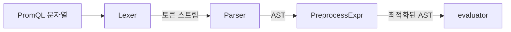
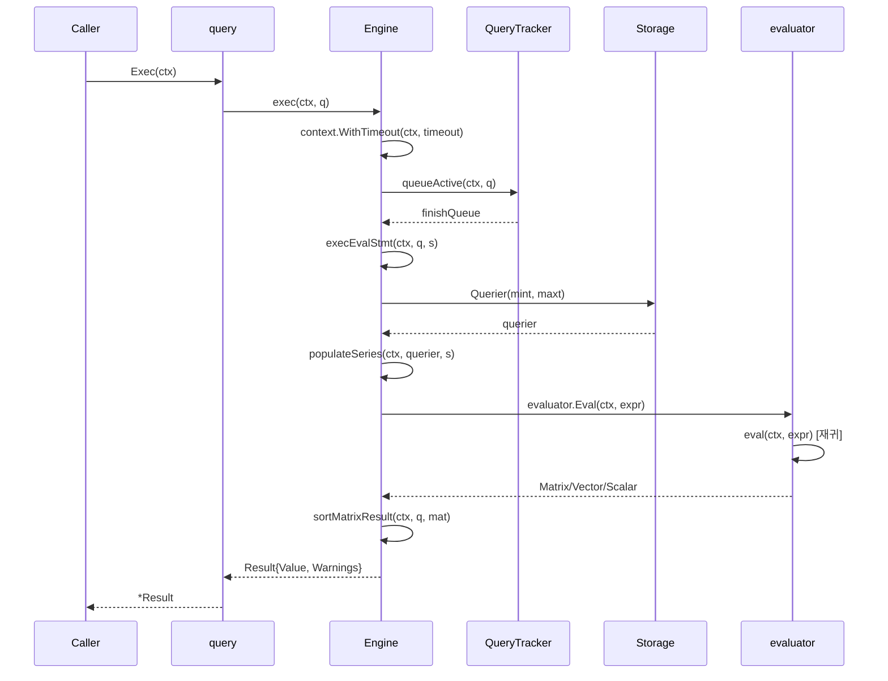

# 13. PromQL 엔진 Deep-Dive

## 목차
1. [PromQL 개요](#1-promql-개요)
2. [Engine 구조체](#2-engine-구조체)
3. [파싱 (Parse)](#3-파싱-parse)
4. [쿼리 생성](#4-쿼리-생성)
5. [실행 파이프라인 (exec)](#5-실행-파이프라인-exec)
6. [evaluator.eval() 상세](#6-evaluatoreval-상세)
7. [내장 함수](#7-내장-함수)
8. [결과 타입](#8-결과-타입)
9. [메모리 관리](#9-메모리-관리)
10. [쿼리 로깅 및 통계](#10-쿼리-로깅-및-통계)

---

## 1. PromQL 개요

PromQL(Prometheus Query Language)은 시계열 데이터를 위해 특별히 설계된 함수형 쿼리 언어다.
SQL과 달리 테이블이 아닌 **시계열(time series)** 을 기본 데이터 단위로 다루며,
레이블 기반 필터링, 집계, 수학 연산, 시간 범위 함수를 조합하여 복잡한 메트릭 분석을 수행한다.

### PromQL의 핵심 특성

| 특성 | 설명 |
|------|------|
| 함수형 | 중첩 함수 호출로 파이프라인 구성 (SQL의 JOIN 대신 라벨 매칭) |
| 차원 기반 | `{label="value"}` 형태의 라벨 셀렉터로 시계열 필터링 |
| 시간 인식 | 모든 연산이 시간 범위를 고려 (`[5m]`, `offset 1h`) |
| 타입 안전 | Scalar, Vector, Matrix, String 4가지 타입 체계 |
| 불변성 | 쿼리가 원본 데이터를 변경하지 않음 |

### 쿼리 예시와 실행 흐름

```
rate(http_requests_total{job="api-server"}[5m])
```

이 쿼리는 다음 과정을 거친다:

```
문자열 입력
    │
    ▼
┌─────────┐    ┌──────────┐    ┌──────────┐    ┌──────────┐
│  Lexer  │───▶│  Parser  │───▶│ Prepare  │───▶│ Evaluate │
│ (토큰화) │    │(AST 생성) │    │(시리즈   │    │(재귀적   │
│         │    │          │    │ 로드)     │    │ 순회)    │
└─────────┘    └──────────┘    └──────────┘    └──────────┘
                                                    │
                                                    ▼
                                              ┌──────────┐
                                              │  Result  │
                                              │ (정렬 후  │
                                              │  반환)    │
                                              └──────────┘
```

---

## 2. Engine 구조체

### Engine 정의

PromQL 엔진은 `promql/engine.go`에 정의된 `Engine` 구조체가 핵심이다.
쿼리의 생성, 파싱, 실행, 제한 관리 등 전체 생명주기를 관장한다.

```go
// promql/engine.go:345
type Engine struct {
    logger                   *slog.Logger
    metrics                  *engineMetrics
    timeout                  time.Duration
    maxSamplesPerQuery       int
    activeQueryTracker       QueryTracker
    queryLogger              QueryLogger
    queryLoggerLock          sync.RWMutex
    lookbackDelta            time.Duration
    noStepSubqueryIntervalFn func(rangeMillis int64) int64
    enableAtModifier         bool
    enableNegativeOffset     bool
    enablePerStepStats       bool
    enableDelayedNameRemoval bool
    enableTypeAndUnitLabels  bool
    parser                   parser.Parser
}
```

### 핵심 필드 상세

| 필드 | 타입 | 역할 | 기본값 |
|------|------|------|--------|
| `timeout` | `time.Duration` | 쿼리 실행 최대 시간. 초과 시 `ErrQueryTimeout` 발생 | 설정 필수 |
| `maxSamplesPerQuery` | `int` | 단일 쿼리가 메모리에 로드할 수 있는 최대 샘플 수 | 설정 필수 |
| `lookbackDelta` | `time.Duration` | 마지막 샘플 이후 이 시간 내에 있으면 "살아있는" 시계열로 간주 | 5분 |
| `activeQueryTracker` | `QueryTracker` | 동시 쿼리 수 제한 및 활성 쿼리 추적 | nil (무제한) |
| `parser` | `parser.Parser` | PromQL 파서 인스턴스 | 기본 파서 |
| `noStepSubqueryIntervalFn` | `func(int64) int64` | 서브쿼리에 step이 지정되지 않았을 때의 기본 간격 함수 | 설정 필수 |

### lookbackDelta의 의미

`lookbackDelta`는 PromQL 엔진에서 가장 중요한 설정 중 하나다.
Instant Query에서 VectorSelector를 평가할 때, 평가 시점(evaluation timestamp)으로부터
`lookbackDelta` 이내에 샘플이 있으면 해당 시계열이 존재하는 것으로 판단한다.

```
lookbackDelta = 5m (기본값)

시간 ────────────────────────────────────────▶
     │                           │           │
     t-5m                    마지막 샘플      t (평가 시점)
     │◄──── lookbackDelta ──────▶│           │
     │                           │           │
     │       이 범위 내에 샘플이 있으면       │
     │       시계열이 "살아있음"으로 판단      │
```

### ActiveQueryTracker

`QueryTracker` 인터페이스는 두 가지 목적을 가진다:

1. **동시 실행 제한**: `Insert()`가 블로킹으로 동작하여 최대 동시 쿼리 수를 제한
2. **장애 복구**: 엔진 크래시 시 활성 쿼리 목록을 로그로 남겨 디버깅 지원

```go
// promql/engine.go:283
type QueryTracker interface {
    io.Closer
    GetMaxConcurrent() int
    Insert(ctx context.Context, query string) (int, error)
    Delete(insertIndex int)
}
```

### EngineOpts 구성

엔진 생성 시 `EngineOpts`를 통해 모든 설정을 전달한다:

```go
// promql/engine.go:298
type EngineOpts struct {
    Logger             *slog.Logger
    Reg                prometheus.Registerer
    MaxSamples         int
    Timeout            time.Duration
    ActiveQueryTracker QueryTracker
    LookbackDelta      time.Duration
    NoStepSubqueryIntervalFn func(rangeMillis int64) int64
    EnableAtModifier         bool
    EnableNegativeOffset     bool
    EnablePerStepStats       bool
    EnableDelayedNameRemoval bool
    EnableTypeAndUnitLabels  bool
    FeatureRegistry          features.Collector
    Parser                   parser.Parser
}
```

---

## 3. 파싱 (Parse)

### 전체 파싱 아키텍처

PromQL의 파싱은 **렉서(Lexer) → 파서(Parser) → AST** 의 고전적인 2단계 구조를 따른다.



### 렉서 (Lexer)

렉서는 `promql/parser/lex.go`에 정의되어 있으며, 상태 기반 스캐닝(state-based scanning) 방식을 사용한다.

```go
// promql/parser/lex.go:276
type Lexer struct {
    input       string       // 스캔 대상 문자열
    state       stateFn      // 다음 렉싱 함수
    pos         posrange.Pos // 현재 위치
    start       posrange.Pos // 현재 Item의 시작 위치
    width       posrange.Pos // 마지막으로 읽은 rune의 폭
    lastPos     posrange.Pos // 가장 최근 반환한 Item의 위치
    itemp       *Item        // 다음 스캔 결과를 저장할 포인터
    scannedItem bool         // 아이템 스캔 완료 여부
    parenDepth  int          // 괄호 중첩 깊이
}
```

렉서의 핵심은 `stateFn` 타입이다. 각 상태 함수는 입력을 소비하고
다음 상태 함수를 반환하는 방식으로, 상태 머신처럼 동작한다.

토큰화 예시:

```
입력: rate(http_requests_total{job="api"}[5m])

토큰 스트림:
┌────────────┬─────────────────────────────┐
│ 토큰 타입   │ 값                          │
├────────────┼─────────────────────────────┤
│ IDENTIFIER │ "rate"                      │
│ LEFT_PAREN │ "("                         │
│ IDENTIFIER │ "http_requests_total"       │
│ LEFT_BRACE │ "{"                         │
│ IDENTIFIER │ "job"                       │
│ EQL        │ "="                         │
│ STRING     │ "api"                       │
│ RIGHT_BRACE│ "}"                         │
│ LEFT_BRACKET│ "["                        │
│ DURATION   │ "5m"                        │
│ RIGHT_BRACKET│ "]"                       │
│ RIGHT_PAREN│ ")"                         │
└────────────┴─────────────────────────────┘
```

### 파서 (Parser)

파서는 `promql/parser/parse.go`에 구현되어 있으며, YACC 기반 생성 파서를 사용한다.
파서 인스턴스는 `sync.Pool`을 통해 재활용되어 GC 부담을 줄인다.

```go
// promql/parser/parse.go:37
var parserPool = sync.Pool{
    New: func() any {
        return &parser{}
    },
}

// promql/parser/parse.go:143
type parser struct {
    lex       Lexer
    inject    ItemType
    injecting bool
    functions map[string]*Function
    // ... 추가 상태 필드
}
```

파서 인터페이스는 여러 파싱 메서드를 제공한다:

```go
// promql/parser/parse.go:52
type Parser interface {
    ParseExpr(input string) (Expr, error)
    ParseMetric(input string) (labels.Labels, error)
    ParseMetricSelector(input string) ([]*labels.Matcher, error)
    ParseMetricSelectors(matchers []string) ([][]*labels.Matcher, error)
    ParseSeriesDesc(input string) (labels.Labels, []SequenceValue, error)
    RegisterFeatures(r features.Collector)
}
```

### AST 노드 타입

파서는 토큰 스트림을 AST(Abstract Syntax Tree)로 변환한다.
모든 AST 노드는 `Node` 인터페이스를 구현하며, 표현식 노드는 추가로 `Expr` 인터페이스를 구현한다.

```go
// promql/parser/ast.go:38
type Node interface {
    String() string
    Pretty(level int) string
    PositionRange() posrange.PositionRange
}

// promql/parser/ast.go:77
type Expr interface {
    Node
    Type() ValueType
    PromQLExpr()
}
```

#### 주요 AST 노드 타입 일람

| AST 노드 | 반환 타입 | PromQL 예시 | 설명 |
|-----------|----------|-------------|------|
| `VectorSelector` | Vector | `http_requests_total{job="api"}` | 라벨 매칭으로 시계열 선택 |
| `MatrixSelector` | Matrix | `http_requests_total{job="api"}[5m]` | 시간 범위 포함 선택 |
| `BinaryExpr` | Vector/Scalar | `metric_a + metric_b` | 이항 연산 |
| `AggregateExpr` | Vector | `sum by (job) (metric)` | 집계 연산 |
| `Call` | 다양 | `rate(metric[5m])` | 함수 호출 |
| `SubqueryExpr` | Matrix | `metric[1h:5m]` | 서브쿼리 |
| `NumberLiteral` | Scalar | `42` | 숫자 리터럴 |
| `StringLiteral` | String | `"hello"` | 문자열 리터럴 |
| `UnaryExpr` | 피연산자에 따름 | `-metric` | 단항 연산 |
| `ParenExpr` | 피연산자에 따름 | `(metric + 1)` | 괄호 표현식 |
| `StepInvariantExpr` | 피연산자에 따름 | (엔진 내부) | 스텝 불변 최적화 |
| `DurationExpr` | Scalar | (실험적) | 기간 표현식 |

#### VectorSelector 구조

VectorSelector는 가장 기본적인 셀렉터로, 라벨 매처와 시리즈 참조를 포함한다:

```go
// promql/parser/ast.go:206
type VectorSelector struct {
    Name               string
    OriginalOffset     time.Duration
    Offset             time.Duration
    Timestamp          *int64
    SkipHistogramBuckets bool
    StartOrEnd         ItemType       // @ start() 또는 @ end()
    LabelMatchers      []*labels.Matcher
    UnexpandedSeriesSet storage.SeriesSet  // 준비 단계에서 채워짐
    Series             []storage.Series   // 확장된 시리즈 목록
    Anchored           bool
    Smoothed           bool
}
```

#### BinaryExpr과 VectorMatching

이항 연산에서 두 벡터 간 매칭 규칙을 정의하는 `VectorMatching` 구조체:

```go
// promql/parser/ast.go:309
type VectorMatching struct {
    Card           VectorMatchCardinality  // one-to-one, many-to-one, etc.
    MatchingLabels []string                // 매칭에 사용할 라벨
    On             bool                    // on(...) 사용 여부
    Include        []string                // group_left/right에 포함할 추가 라벨
    FillValues     VectorMatchFillValues   // fill 수정자
}
```

카디널리티 타입:

| 카디널리티 | PromQL 수식어 | 의미 |
|-----------|-------------|------|
| `CardOneToOne` | (기본) | 양쪽 각 1개 시계열 매칭 |
| `CardManyToOne` | `group_left` | 왼쪽 여러 시계열 → 오른쪽 1개 |
| `CardOneToMany` | `group_right` | 왼쪽 1개 → 오른쪽 여러 시계열 |
| `CardManyToMany` | (집합 연산) | `and`, `or`, `unless` |

### AST 시각화 예시

`rate(http_requests_total{job="api"}[5m])` 쿼리의 AST:

```
            Call
          ┌──┴──┐
         func  args
          │     │
        "rate"  │
                │
         MatrixSelector
          ┌──────┴──────┐
     VectorSelector   Range=5m
       ┌──────┴──────┐
      Name          LabelMatchers
       │              │
  "http_requests"  [job="api"]
      _total
```

더 복잡한 쿼리 `sum by (job) (rate(http_requests_total[5m])) > 100`:

```
                BinaryExpr (>)
               ┌──────┴──────┐
         AggregateExpr    NumberLiteral
          ┌────┴────┐         │
         Op=sum   Call        100
         by=[job]  │
                  func="rate"
                   │
              MatrixSelector
               ┌───┴───┐
          VectorSelector Range=5m
               │
          "http_requests_total"
```

---

## 4. 쿼리 생성

### NewInstantQuery와 NewRangeQuery

엔진은 두 가지 쿼리 생성 메서드를 제공한다:

```go
// promql/engine.go:531
func (ng *Engine) NewInstantQuery(ctx context.Context, q storage.Queryable,
    opts QueryOpts, qs string, ts time.Time) (Query, error) {
    pExpr, qry := ng.newQuery(q, qs, opts, ts, ts, 0*time.Second)
    finishQueue, err := ng.queueActive(ctx, qry)
    if err != nil { return nil, err }
    defer finishQueue()
    expr, err := ng.parser.ParseExpr(qs)
    if err != nil { return nil, err }
    if err := ng.validateOpts(expr); err != nil { return nil, err }
    *pExpr, err = PreprocessExpr(expr, ts, ts, 0)
    return qry, err
}

// promql/engine.go:552
func (ng *Engine) NewRangeQuery(ctx context.Context, q storage.Queryable,
    opts QueryOpts, qs string, start, end time.Time, interval time.Duration) (Query, error) {
    pExpr, qry := ng.newQuery(q, qs, opts, start, end, interval)
    // ... 동일한 패턴
    *pExpr, err = PreprocessExpr(expr, start, end, interval)
    return qry, err
}
```

### Instant Query vs Range Query 비교

| 항목 | Instant Query | Range Query |
|------|--------------|-------------|
| 시간 범위 | `Start == End` | `Start < End` |
| Interval | 0 | > 0 (예: 15s, 1m) |
| 결과 타입 | Vector (또는 Scalar) | Matrix |
| 평가 횟수 | 1회 | `(End-Start)/Interval + 1` 회 |
| 사용처 | 대시보드의 단일 값 표시 | 그래프, 시계열 차트 |
| 허용 표현식 타입 | Vector, Scalar, Matrix, String | Vector, Scalar만 |

Instant Query는 내부적으로 Range Query의 특수한 경우(step=1)로 처리된다:

```go
// promql/engine.go:791
// Instant evaluation. This is executed as a range evaluation with one step.
if s.Start.Equal(s.End) && s.Interval == 0 {
    start := timeMilliseconds(s.Start)
    evaluator := &evaluator{
        startTimestamp: start,
        endTimestamp:   start,
        interval:       1,  // ← step을 1로 설정
        // ...
    }
```

### query 구조체

생성된 쿼리는 `query` 구조체로 표현된다:

```go
// promql/engine.go:190
type query struct {
    queryable   storage.Queryable   // 데이터 제공자 (TSDB)
    q           string              // 원본 쿼리 문자열
    stmt        parser.Statement    // 파싱된 AST
    stats       *stats.QueryTimers  // 실행 시간 통계
    sampleStats *stats.QuerySamples // 샘플 수 통계
    matrix      Matrix              // 결과 재사용용 매트릭스
    cancel      func()              // 취소 함수
    ng          *Engine             // 소속 엔진
}
```

### PreprocessExpr

파싱 후 `PreprocessExpr`가 AST를 전처리한다. 이 단계에서 `StepInvariantExpr` 최적화가 적용된다.
평가 시간에 무관하게 동일한 결과를 반환하는 부분 표현식을 감지하여, 한 번만 평가하고
결과를 모든 스텝에 복제한다.

```
원본 AST:                   전처리 후 AST:
    +                           +
   / \                         / \
  rate  100              rate  StepInvariantExpr
  [5m]                   [5m]       │
                                   100
```

---

## 5. 실행 파이프라인 (exec)

### 전체 실행 흐름

쿼리의 `Exec()` 메서드가 호출되면 엔진의 `exec()` 메서드를 거쳐 전체 파이프라인이 시작된다.



### exec() 메서드

```go
// promql/engine.go:673
func (ng *Engine) exec(ctx context.Context, q *query) (v parser.Value, ws annotations.Annotations, err error) {
    ng.metrics.currentQueries.Inc()
    defer func() {
        ng.metrics.currentQueries.Dec()
        ng.metrics.querySamples.Add(float64(q.sampleStats.TotalSamples))
    }()

    ctx, cancel := context.WithTimeout(ctx, ng.timeout)
    q.cancel = cancel

    // 쿼리 로깅 (defer로 실행 후 기록)
    defer func() { /* 쿼리 로그 기록 */ }()

    // 1단계: 큐 대기
    finishQueue, err := ng.queueActive(ctx, q)
    if err != nil { return nil, nil, err }
    defer finishQueue()

    // 2단계: 평가 실행
    switch s := q.Statement().(type) {
    case *parser.EvalStmt:
        return ng.execEvalStmt(ctx, q, s)
    case parser.TestStmt:
        return nil, nil, s(ctx)
    }
}
```

### execEvalStmt() 메서드 - 4단계 실행

이 메서드는 쿼리 실행의 핵심으로, 4개의 측정 가능한 단계를 순서대로 수행한다:

```
┌──────────────────────────────────────────────────────┐
│               execEvalStmt() 실행 단계                │
├──────────┬───────────────────────────────────────────┤
│ 1. 준비   │ FindMinMaxTime → Querier → populateSeries │
│ (prepare)│ AST 순회하여 필요한 시간 범위 계산           │
│          │ Storage에서 시리즈 셀렉트                   │
├──────────┼───────────────────────────────────────────┤
│ 2. 평가   │ evaluator 생성 → Eval(ctx, expr) 호출     │
│ (eval)   │ 재귀적 AST 순회 + 샘플 로드                │
├──────────┼───────────────────────────────────────────┤
│ 3. 변환   │ Matrix → Vector (instant) 또는 그대로     │
│ (convert)│ 결과 타입에 맞게 변환                       │
├──────────┼───────────────────────────────────────────┤
│ 4. 정렬   │ sort.Sort(mat)                           │
│ (sort)   │ 라벨 기준 알파벳 순 정렬                    │
└──────────┴───────────────────────────────────────────┘
```

#### 1단계: 준비 (Prepare)

```go
// promql/engine.go:773
prepareSpanTimer, ctxPrepare := query.stats.GetSpanTimer(ctx,
    stats.QueryPreparationTime, ...)
mint, maxt := FindMinMaxTime(s)
querier, err := query.queryable.Querier(mint, maxt)
ng.populateSeries(ctxPrepare, querier, s)
prepareSpanTimer.Finish()
```

`FindMinMaxTime()`은 AST를 순회하며 모든 VectorSelector와 MatrixSelector의
시간 범위, offset, @ modifier를 고려하여 **실제 필요한 최소/최대 타임스탬프**를 계산한다.

`populateSeries()`는 AST를 순회하며 각 VectorSelector에 대해 `querier.Select()`를 호출한다:

```go
// promql/engine.go:1029
func (ng *Engine) populateSeries(ctx context.Context, querier storage.Querier, s *parser.EvalStmt) {
    var evalRange time.Duration
    parser.Inspect(s.Expr, func(node parser.Node, path []parser.Node) error {
        switch n := node.(type) {
        case *parser.VectorSelector:
            start, end := getTimeRangesForSelector(s, n, path, evalRange)
            hints := &storage.SelectHints{
                Start: start, End: end,
                Step:  durationMilliseconds(interval),
                Range: durationMilliseconds(evalRange),
                Func:  extractFuncFromPath(path),
            }
            hints.By, hints.Grouping = extractGroupsFromPath(path)
            n.UnexpandedSeriesSet = querier.Select(ctx, false, hints, n.LabelMatchers...)
        case *parser.MatrixSelector:
            evalRange = n.Range
        }
        return nil
    })
}
```

여기서 `SelectHints`는 스토리지 레이어에 최적화 힌트를 전달한다.
함수명(`Func`), 그루핑 정보(`By`, `Grouping`) 등을 포함하여
리모트 스토리지가 사전 집계를 수행할 수 있게 한다.

#### 2단계: 평가 (Eval)

```go
// Instant Query인 경우
evaluator := &evaluator{
    startTimestamp: start,
    endTimestamp:   start,
    interval:       1,
    maxSamples:     ng.maxSamplesPerQuery,
    lookbackDelta:  s.LookbackDelta,
    // ...
}
val, warnings, err := evaluator.Eval(ctxInnerEval, s.Expr)
```

```go
// Range Query인 경우
evaluator := &evaluator{
    startTimestamp: timeMilliseconds(s.Start),
    endTimestamp:   timeMilliseconds(s.End),
    interval:       durationMilliseconds(s.Interval),
    maxSamples:     ng.maxSamplesPerQuery,
    // ...
}
val, warnings, err := evaluator.Eval(ctxInnerEval, s.Expr)
```

---

## 6. evaluator.eval() 상세

### evaluator 구조체

```go
// promql/engine.go:1138
type evaluator struct {
    startTimestamp           int64  // 시작 시간 (밀리초)
    endTimestamp             int64  // 종료 시간 (밀리초)
    interval                 int64  // 스텝 간격 (밀리초)
    maxSamples               int    // 최대 샘플 수
    currentSamples           int    // 현재 로드된 샘플 수
    logger                   *slog.Logger
    lookbackDelta            time.Duration
    samplesStats             *stats.QuerySamples
    noStepSubqueryIntervalFn func(rangeMillis int64) int64
    enableDelayedNameRemoval bool
    enableTypeAndUnitLabels  bool
    querier                  storage.Querier
}
```

### eval() 메서드의 재귀적 분기

`eval()`은 `parser.Expr`의 구체적인 타입에 따라 switch-case로 분기한다.
이것이 PromQL 엔진의 가장 핵심적인 메서드다.

```go
// promql/engine.go:1905
func (ev *evaluator) eval(ctx context.Context, expr parser.Expr) (parser.Value, annotations.Annotations) {
    // 타임아웃/취소 확인
    if err := contextDone(ctx, "expression evaluation"); err != nil {
        ev.error(err)
    }

    numSteps := int((ev.endTimestamp-ev.startTimestamp)/ev.interval) + 1

    switch e := expr.(type) {
    case *parser.AggregateExpr:  // 집계 표현식
    case *parser.Call:           // 함수 호출
    case *parser.BinaryExpr:    // 이항 연산
    case *parser.NumberLiteral: // 숫자 리터럴
    case *parser.VectorSelector:// 벡터 셀렉터
    case *parser.MatrixSelector:// 매트릭스 셀렉터
    case *parser.SubqueryExpr:  // 서브쿼리
    case *parser.StepInvariantExpr: // 스텝 불변 표현식
    case *parser.ParenExpr:     // 괄호 (재귀)
    case *parser.UnaryExpr:     // 단항 연산
    case *parser.StringLiteral: // 문자열 리터럴
    }
}
```

### VectorSelector 평가

VectorSelector의 평가는 `evalSeries()`를 통해 수행된다.
각 시계열에 대해, 각 평가 시점에서 `lookbackDelta` 범위 내의 **최신 샘플**을 선택한다.

```
평가 시점 t에서 VectorSelector 평가:

시간 ───────────────────────────────────────▶
     │        ●    ●        ●     │          │
     t-δ   샘플1  샘플2   샘플3    t      미래
     │◄──── lookbackDelta ──────▶│
     │                     ▲     │
     │                     │     │
     │              이 샘플이 선택됨 │
     │           (범위 내 최신)    │
```

만약 `lookbackDelta` 범위 내에 샘플이 하나도 없으면, 해당 시계열은 그 시점에서 결과에 포함되지 않는다.
이것이 "stale" 시계열 탐지의 핵심 메커니즘이다.

### MatrixSelector 평가

MatrixSelector는 지정된 시간 범위(`[5m]` 등) 내의 **모든 샘플**을 반환한다.

```
rate(metric[5m])에서 MatrixSelector 평가:

시간 ────────────────────────────────────────▶
     │   ●    ●    ●    ●    ●    │
     t-5m                         t
     │◄───── Range = 5m ────────▶│
     │                            │
     │  이 범위 내 모든 샘플 반환    │
```

```go
// eval() 내 MatrixSelector 분기
case *parser.MatrixSelector:
    if ev.startTimestamp != ev.endTimestamp {
        panic(errors.New("cannot do range evaluation of matrix selector"))
    }
    return ev.matrixSelector(ctx, e)
```

MatrixSelector는 Instant Query에서만 직접 평가될 수 있다.
Range Query에서는 반드시 `rate()`, `avg_over_time()` 등의 함수 내부 인자로만 사용된다.

### BinaryExpr 평가

이항 연산은 피연산자 타입 조합에 따라 4가지 경로로 분기된다:

```go
case *parser.BinaryExpr:
    switch lt, rt := e.LHS.Type(), e.RHS.Type(); {
    case lt == ValueTypeScalar && rt == ValueTypeScalar:
        // scalarBinop: 단순 산술
    case lt == ValueTypeVector && rt == ValueTypeVector:
        // VectorAnd, VectorOr, VectorUnless, VectorBinop
        // 라벨 매칭 기반 벡터 연산
    case lt == ValueTypeVector && rt == ValueTypeScalar:
        // VectorscalarBinop (벡터 OP 스칼라)
    case lt == ValueTypeScalar && rt == ValueTypeVector:
        // VectorscalarBinop (스칼라 OP 벡터, 순서 반전)
    }
```

벡터 간 이항 연산의 라벨 매칭 과정:

```
벡터 A:                          벡터 B:
{job="api", instance="1"} 100    {job="api", instance="1"} 200
{job="api", instance="2"} 150    {job="api", instance="2"} 250
{job="web", instance="3"} 80     {job="web", instance="4"} 300

A + B  (기본 매칭: 모든 라벨이 동일해야 함)

결과:
{job="api", instance="1"} 300    ← 매칭됨
{job="api", instance="2"} 400    ← 매칭됨
                                  ← instance="3"과 "4"는 매칭 안됨

A + on(job) group_left B  (job 라벨만으로 매칭)

결과:
{job="api", instance="1"} 300    ← job="api" 매칭 (A쪽 라벨 유지)
{job="api", instance="2"} 400    ← job="api" 매칭
{job="web", instance="3"} 380    ← job="web" 매칭
```

### AggregateExpr 평가

집계 표현식은 `rangeEvalAgg()`를 통해 처리된다:

```go
case *parser.AggregateExpr:
    sortedGrouping := e.Grouping
    slices.Sort(sortedGrouping)
    // ...
    val, ws := ev.eval(ctx, e.Expr)  // 하위 표현식 먼저 평가
    inputMatrix := val.(Matrix)
    result, ws := ev.rangeEvalAgg(ctx, e, sortedGrouping, inputMatrix, fp)
```

그룹화 키 생성 → 그룹별 시리즈 분류 → 집계 함수 적용 순서로 진행된다.

### SubqueryExpr 평가

서브쿼리는 **새로운 evaluator를 생성**하여 재귀적으로 평가한다:

```go
case *parser.SubqueryExpr:
    newEv := &evaluator{
        endTimestamp:   ev.endTimestamp - offsetMillis,
        startTimestamp: /* 정렬된 시작 시점 */,
        interval:       durationMilliseconds(e.Step),  // 또는 기본 간격
        currentSamples: ev.currentSamples,
        maxSamples:     ev.maxSamples,
        // ...
    }
    res, ws := newEv.eval(ctx, e.Expr)
    ev.currentSamples = newEv.currentSamples  // 샘플 카운트 동기화
```

### StepInvariantExpr 평가

스텝 불변 표현식은 단일 시점에서만 평가하고 결과를 모든 스텝에 복제한다:

```go
case *parser.StepInvariantExpr:
    newEv := &evaluator{
        startTimestamp: ev.startTimestamp,
        endTimestamp:   ev.startTimestamp,  // ← 시작=종료 (단일 평가)
        // ...
    }
    res, ws := newEv.eval(ctx, e.Expr)
    // 결과를 모든 스텝 타임스탬프에 복제
    for i := range mat {
        for ts := ev.startTimestamp; ts <= ev.endTimestamp; ts += ev.interval {
            // 타임스탬프만 변경하여 포인트 추가
        }
    }
```

### rangeEval() 메서드

`rangeEval()`은 여러 표현식을 동시에 평가하고 콜백 함수를 스텝별로 호출하는 핵심 유틸리티다:

```go
// promql/engine.go:1390
func (ev *evaluator) rangeEval(ctx context.Context,
    matching *parser.VectorMatching,
    funcCall func([]Vector, Matrix, [][]EvalSeriesHelper, *EvalNodeHelper) (Vector, annotations.Annotations),
    exprs ...parser.Expr) (Matrix, annotations.Annotations) {

    numSteps := int((ev.endTimestamp-ev.startTimestamp)/ev.interval) + 1
    matrixes := make([]Matrix, len(exprs))

    // 1. 모든 하위 표현식 평가
    for i, e := range exprs {
        val, ws := ev.eval(ctx, e)
        matrixes[i] = val.(Matrix)
    }

    // 2. 각 스텝마다 콜백 호출
    for ts := ev.startTimestamp; ts <= ev.endTimestamp; ts += ev.interval {
        // 해당 스텝의 벡터 추출
        // funcCall(vectors, ...) 호출
        // 결과 수집
    }
}
```

이 패턴은 **모든 이항 연산, 스칼라 함수, 집계** 에서 공통으로 사용된다.
하위 표현식을 먼저 전체 평가한 뒤, 스텝별로 슬라이스하여 연산을 적용하는 방식이다.

---

## 7. 내장 함수

### 함수 등록 구조

PromQL 함수는 두 곳에 등록된다:

1. **파서 레벨**: `parser/functions.go`의 `Functions` 맵 — 시그니처 정의
2. **엔진 레벨**: `promql/functions.go`의 `FunctionCalls` 맵 — 실제 구현

```go
// promql/parser/functions.go:18
type Function struct {
    Name         string
    ArgTypes     []ValueType
    Variadic     int
    ReturnType   ValueType
    Experimental bool
}

// promql/functions.go:60
type FunctionCall func(vectorVals []Vector, matrixVals Matrix,
    args parser.Expressions, enh *EvalNodeHelper) (Vector, annotations.Annotations)
```

### 주요 함수 분류

#### 카운터/게이지 함수

| 함수 | 입력 | 설명 |
|------|------|------|
| `rate()` | Matrix | 초당 증가율 (카운터 리셋 보정) |
| `increase()` | Matrix | 범위 내 총 증가량 |
| `irate()` | Matrix | 마지막 두 샘플 기반 순간 증가율 |
| `delta()` | Matrix | 범위 내 차이 (게이지용) |
| `idelta()` | Matrix | 마지막 두 샘플 차이 |
| `deriv()` | Matrix | 선형 회귀 기반 미분값 |

#### rate() 구현의 핵심: extrapolatedRate

`rate()`의 핵심 알고리즘은 `extrapolatedRate()` 함수에 있다.
단순히 `(마지막값 - 첫값) / 시간`이 아닌, **외삽(extrapolation)** 을 수행한다:

```go
// promql/functions.go:178
func extrapolatedRate(vals Matrix, args parser.Expressions, enh *EvalNodeHelper,
    isCounter, isRate bool) (Vector, annotations.Annotations) {

    // 1. 샘플 범위 확인
    // 2. 카운터 리셋 보정 (isCounter인 경우)
    // 3. 외삽 여부 결정 (extrapolationThreshold = 평균간격 * 1.1)
    // 4. factor 계산 후 결과 곱셈
}
```

외삽 로직 시각화:

```
실제 샘플:    ●─────●─────●─────●─────●
              │                       │
         durationToStart        durationToEnd
              │◄──────────────────────▶│
              │    sampledInterval     │
       ──────▶│                       │◀──────
       외삽   │                       │  외삽

외삽 조건: durationToStart < averageDuration * 1.1
결과: factor = (sampledInterval + durationToStart + durationToEnd) / sampledInterval
```

카운터 리셋 보정:

```go
// 카운터 값이 감소하면 리셋으로 간주하고 이전 값을 누적
prevValue := samples.Floats[0].F
for _, currPoint := range samples.Floats[1:] {
    if currPoint.F < prevValue {
        resultFloat += prevValue  // 리셋 이전 값 추가
    }
    prevValue = currPoint.F
}
```

#### 범위 벡터 함수 (over_time 계열)

| 함수 | 설명 |
|------|------|
| `avg_over_time()` | 범위 내 평균 |
| `max_over_time()` | 범위 내 최댓값 |
| `min_over_time()` | 범위 내 최솟값 |
| `sum_over_time()` | 범위 내 합계 |
| `count_over_time()` | 범위 내 샘플 수 |
| `stddev_over_time()` | 범위 내 표준편차 |
| `quantile_over_time()` | 범위 내 분위수 |
| `last_over_time()` | 범위 내 마지막 샘플 |
| `first_over_time()` | 범위 내 첫 샘플 |
| `present_over_time()` | 범위 내 값 존재 여부 |
| `absent_over_time()` | 범위 내 값 부재 여부 |
| `mad_over_time()` | 중앙 절대 편차 |

#### 히스토그램 함수

| 함수 | 설명 |
|------|------|
| `histogram_quantile()` | 히스토그램 버킷에서 분위수 계산 |
| `histogram_avg()` | 네이티브 히스토그램 평균 |
| `histogram_count()` | 네이티브 히스토그램 카운트 |
| `histogram_sum()` | 네이티브 히스토그램 합계 |
| `histogram_fraction()` | 구간 내 비율 |
| `histogram_stddev()` | 히스토그램 표준편차 |
| `histogram_stdvar()` | 히스토그램 분산 |

#### 라벨 조작 함수

```go
// label_replace와 label_join은 특별 처리됨 (FunctionCalls 맵에 nil로 등록)
"label_replace": nil,  // evalLabelReplace로 직접 처리
"label_join":    nil,  // evalLabelJoin으로 직접 처리
```

이 두 함수는 시리즈 단위가 아닌 **라벨 단위**로 동작하므로,
일반적인 함수 호출 경로(`FunctionCalls` 맵)를 우회하여 `eval()` 내에서 직접 처리된다:

```go
// eval() 내 Call 분기
switch e.Func.Name {
case "label_replace":
    return ev.evalLabelReplace(ctx, e.Args)
case "label_join":
    return ev.evalLabelJoin(ctx, e.Args)
case "info":
    return ev.evalInfo(ctx, e.Args)
}
```

#### 수학/삼각 함수

| 함수 | 설명 |
|------|------|
| `abs()`, `ceil()`, `floor()`, `round()` | 기본 수학 |
| `exp()`, `ln()`, `log2()`, `log10()` | 지수/로그 |
| `sqrt()`, `sgn()` | 제곱근, 부호 |
| `sin()`, `cos()`, `tan()` | 삼각함수 |
| `asin()`, `acos()`, `atan()` | 역삼각함수 |
| `sinh()`, `cosh()`, `tanh()` | 쌍곡선함수 |
| `deg()`, `rad()` | 각도 변환 |
| `pi()` | 원주율 상수 |

#### FunctionCalls 맵 (전체 등록 목록)

`promql/functions.go:2153`에 정의된 `FunctionCalls` 맵은 약 **70개 이상의 내장 함수**를 포함한다.
함수명을 키로, `FunctionCall` 타입의 구현 함수를 값으로 가진다.

---

## 8. 결과 타입

### 4가지 결과 타입

PromQL의 모든 표현식은 다음 4가지 타입 중 하나로 평가된다:

```
┌───────────────────────────────────────────────────────┐
│                  PromQL 결과 타입 체계                  │
├───────────┬───────────────────────────────────────────┤
│ Scalar    │ 단일 (timestamp, float64) 쌍              │
│           │ 예: time(), scalar(vector)                │
├───────────┼───────────────────────────────────────────┤
│ Vector    │ (labels, timestamp, value) 샘플의 집합     │
│ (Instant) │ 같은 타임스탬프, 서로 다른 라벨셋           │
│           │ 예: http_requests_total{job="api"}        │
├───────────┼───────────────────────────────────────────┤
│ Matrix    │ 시계열별 (timestamp, value) 배열의 집합     │
│ (Range)   │ 여러 타임스탬프에 걸친 데이터 포인트         │
│           │ 예: rate(metric[5m]) (range query 결과)   │
├───────────┼───────────────────────────────────────────┤
│ String    │ 단일 문자열 값                              │
│           │ 거의 사용되지 않음                           │
└───────────┴───────────────────────────────────────────┘
```

### Go 타입 매핑

```go
// 결과 타입과 Go 타입의 대응

type Scalar struct {
    T int64    // 타임스탬프 (밀리초)
    V float64  // 값
}

type Sample struct {
    Metric   labels.Labels
    T        int64
    F        float64
    H        *histogram.FloatHistogram
    DropName bool
}

type Vector []Sample  // 한 시점의 샘플 집합

type Series struct {
    Metric     labels.Labels
    Floats     []FPoint       // float 데이터 포인트
    Histograms []HPoint       // 히스토그램 데이터 포인트
    DropName   bool
}

type Matrix []Series  // 여러 시계열의 집합

type FPoint struct {
    T int64    // 타임스탬프
    F float64  // float 값
}

type HPoint struct {
    T int64                        // 타임스탬프
    H *histogram.FloatHistogram    // 히스토그램 값
}

type String struct {
    T int64
    V string
}
```

### 타입별 사용 컨텍스트

| 표현식 | 반환 타입 (Instant) | 반환 타입 (Range) |
|--------|-------------------|------------------|
| `42` | Scalar | Matrix (1 series) |
| `metric_name` | Vector | Matrix |
| `metric_name[5m]` | Matrix | 사용 불가 |
| `rate(m[5m])` | Vector | Matrix |
| `sum(metric)` | Vector | Matrix |
| `"string"` | String | String |

### Instant Query에서의 결과 변환

`execEvalStmt()`에서 Instant Query의 결과는 내부적으로 항상 Matrix로 평가된 뒤,
표현식의 선언된 타입에 따라 변환된다:

```go
// promql/engine.go:828
switch s.Expr.Type() {
case parser.ValueTypeVector:
    // Matrix → Vector 변환 (각 시리즈에서 하나의 샘플만 추출)
    vector := make(Vector, len(mat))
    for i, s := range mat {
        if len(s.Histograms) > 0 {
            vector[i] = Sample{Metric: s.Metric, H: s.Histograms[0].H, T: start}
        } else {
            vector[i] = Sample{Metric: s.Metric, F: s.Floats[0].F, T: start}
        }
    }
    return vector, warnings, nil
case parser.ValueTypeScalar:
    return Scalar{V: mat[0].Floats[0].F, T: start}, warnings, nil
case parser.ValueTypeMatrix:
    return mat, warnings, nil
}
```

---

## 9. 메모리 관리

### maxSamples 제한

모든 쿼리는 `maxSamplesPerQuery`에 의해 메모리 사용이 제한된다.
`evaluator`는 `currentSamples` 카운터를 유지하며, 새로운 샘플이 로드될 때마다 확인한다:

```go
if ev.currentSamples+len(ss.Floats)+histSamples > ev.maxSamples {
    ev.error(ErrTooManySamples(env))
}
```

`ErrTooManySamples`는 panic으로 전파되며, `Eval()` 메서드의 recover에서 포착된다.

### 포인트 슬라이스 풀링

엔진은 `zeropool`을 기반으로 Float 포인트와 Histogram 포인트 슬라이스를 풀링하여
GC 부담을 줄인다:

```go
// 상수 정의
const (
    maxPointsSliceSize     = 5000  // 풀에 반환 가능한 최대 크기
    matrixSelectorSliceSize = 16   // 매트릭스 셀렉터 기본 버퍼 크기
)
```

풀링 패턴:

```
┌──────────────────────────────────┐
│       zeropool.Pool[[]FPoint]    │
│  ┌─────────────────────────────┐ │
│  │  getFlPointSlice(size)      │ │
│  │  → 풀에서 슬라이스 가져옴     │ │
│  │  → 없으면 새로 할당          │ │
│  │  → size > maxSize면 제한     │ │
│  └─────────────────────────────┘ │
│  ┌─────────────────────────────┐ │
│  │  putFPointSlice(s)          │ │
│  │  → len(s) ≤ maxSize면 반환  │ │
│  │  → 아니면 GC에 맡김          │ │
│  └─────────────────────────────┘ │
└──────────────────────────────────┘
```

### numSteps 기반 사전 할당

Range Query에서 결과 슬라이스의 크기를 사전에 계산하여 동적 확장을 최소화한다:

```go
numSteps := int((ev.endTimestamp-ev.startTimestamp)/ev.interval) + 1
```

이 `numSteps` 값은 시리즈별 결과 슬라이스의 초기 용량으로 사용된다.
예를 들어 1시간 범위에 15초 간격이면 `numSteps = 241`이다.

### 이전 시리즈 슬라이스 재사용

함수 호출 평가에서 이전 시리즈의 슬라이스를 재사용하는 최적화가 적용된다:

```go
// reuseOrGetFPointSlices: 이전 시리즈(prevSS)가 있고 해당 슬라이스가
// 더 이상 필요 없으면 재사용, 아니면 새로 할당
ss.Floats = reuseOrGetFPointSlices(prevSS, numSteps)
```

### query.Close()에서의 메모리 반환

쿼리 완료 후 `Close()`에서 모든 슬라이스를 풀에 반환한다:

```go
// promql/engine.go:240
func (q *query) Close() {
    for _, s := range q.matrix {
        putFPointSlice(s.Floats)
        putHPointSlice(s.Histograms)
    }
}
```

### 메모리 사용량 추정

| 요소 | 크기 (바이트) |
|------|-------------|
| FPoint (T + F) | 16 |
| HPoint (T + *H) | 16 (포인터) + 히스토그램 크기 |
| Sample | ~120 (labels 포함) |
| Series | ~160 + 포인트 슬라이스 |

1만 시계열 x 1000 스텝의 Range Query 시:
- FPoint만: 10,000 x 1,000 x 16 = ~160MB
- 이것이 `maxSamples` 제한이 중요한 이유

---

## 10. 쿼리 로깅 및 통계

### QueryTimers

각 실행 단계의 소요 시간을 측정하는 타이머:

```
┌──────────────────────────────────────────────────────┐
│                   QueryTimers 구조                    │
├──────────────────┬───────────────────────────────────┤
│ ExecTotalTime    │ 전체 실행 시간                      │
├──────────────────┼───────────────────────────────────┤
│ ExecQueueTime    │ 큐 대기 시간 (ActiveQueryTracker)   │
├──────────────────┼───────────────────────────────────┤
│ QueryPreparationTime │ 준비 시간 (시리즈 로드)         │
├──────────────────┼───────────────────────────────────┤
│ InnerEvalTime    │ 내부 평가 시간 (AST 순회)           │
├──────────────────┼───────────────────────────────────┤
│ ResultSortTime   │ 결과 정렬 시간                      │
├──────────────────┼───────────────────────────────────┤
│ EvalTotalTime    │ 평가 전체 시간 (준비 + 평가 + 정렬) │
└──────────────────┴───────────────────────────────────┘
```

### engineMetrics

엔진은 Prometheus 자체 메트릭을 노출한다:

```go
// promql/engine.go:80
type engineMetrics struct {
    currentQueries            prometheus.Gauge    // 현재 실행 중인 쿼리 수
    maxConcurrentQueries      prometheus.Gauge    // 최대 동시 쿼리 수
    queryLogEnabled           prometheus.Gauge    // 쿼리 로그 활성화 여부
    queryLogFailures          prometheus.Counter  // 쿼리 로그 실패 횟수
    queryQueueTime            prometheus.Observer  // 큐 대기 시간 (Summary)
    queryQueueTimeHistogram   prometheus.Observer  // 큐 대기 시간 (Histogram)
    queryPrepareTime          prometheus.Observer  // 준비 시간
    queryPrepareTimeHistogram prometheus.Observer
    queryInnerEval            prometheus.Observer  // 내부 평가 시간
    queryInnerEvalHistogram   prometheus.Observer
    queryResultSort           prometheus.Observer  // 결과 정렬 시간
    queryResultSortHistogram  prometheus.Observer
    querySamples              prometheus.Counter  // 총 로드된 샘플 수
}
```

노출되는 메트릭 이름:

| 메트릭 | 타입 | 설명 |
|--------|------|------|
| `prometheus_engine_queries` | Gauge | 현재 실행/대기 중인 쿼리 수 |
| `prometheus_engine_queries_concurrent_max` | Gauge | 최대 동시 쿼리 한도 |
| `prometheus_engine_query_duration_seconds` | Summary | 실행 단계별 소요 시간 |
| `prometheus_engine_query_duration_histogram_seconds` | Histogram | 실행 단계별 소요 시간 (NativeHistogram 포함) |
| `prometheus_engine_query_samples_total` | Counter | 전체 로드된 샘플 수 |
| `prometheus_engine_query_log_enabled` | Gauge | 쿼리 로그 활성화 상태 |
| `prometheus_engine_query_log_failures_total` | Counter | 쿼리 로그 실패 횟수 |

### QuerySamples 통계

샘플 관련 통계는 `stats.QuerySamples`로 추적된다:

```go
// query 구조체 내
type query struct {
    stats       *stats.QueryTimers   // 시간 통계
    sampleStats *stats.QuerySamples  // 샘플 통계
    // ...
}
```

주요 샘플 통계:
- `TotalSamples`: 쿼리가 로드한 총 샘플 수
- 스텝별 샘플 수 (`enablePerStepStats` 활성화 시)
- 피크 샘플 수 (동시에 메모리에 존재한 최대 샘플 수)

### 쿼리 로그

`exec()` 메서드의 defer에서 쿼리 실행 정보를 JSON 형태로 기록한다:

```go
// promql/engine.go:683
defer func() {
    ng.queryLoggerLock.RLock()
    if l := ng.queryLogger; l != nil {
        logger := slog.New(l)
        f := make([]slog.Attr, 0, 16)
        params := map[string]any{
            "query": q.q,
            "start": formatDate(eq.Start),
            "end":   formatDate(eq.End),
            "step":  int64(eq.Interval / (time.Second / time.Nanosecond)),
        }
        f = append(f, slog.Any("params", params))
        if err != nil {
            f = append(f, slog.Any("error", err))
        }
        f = append(f, slog.Any("stats", stats.NewQueryStats(q.Stats())))
        // spanID, traceID 추가 (OpenTelemetry 연동)
        logger.LogAttrs(ctx, slog.LevelInfo, "promql query logged", f...)
    }
    ng.queryLoggerLock.RUnlock()
}()
```

### 에러 타입

엔진은 4가지 커스텀 에러 타입을 정의한다:

| 에러 타입 | 원인 | 복구 가능성 |
|-----------|------|-----------|
| `ErrQueryTimeout` | `context.DeadlineExceeded` | 타임아웃 증가 또는 쿼리 최적화 |
| `ErrQueryCanceled` | `context.Canceled` | 클라이언트 취소 (정상) |
| `ErrTooManySamples` | `currentSamples > maxSamples` | 쿼리 범위 축소 또는 제한 증가 |
| `ErrStorage` | 스토리지 레이어 오류 | 스토리지 상태 확인 |

에러 전파 방식은 **panic/recover 패턴**을 사용한다:

```go
// evaluator에서 에러 발생 시
func (*evaluator) error(err error) {
    panic(err)  // ← panic 으로 전파
}

// Eval()에서 recover
func (ev *evaluator) Eval(ctx context.Context, expr parser.Expr) (v parser.Value, ws annotations.Annotations, err error) {
    defer ev.recover(expr, &ws, &err)  // ← recover로 포착
    v, ws = ev.eval(ctx, expr)
    return v, ws, nil
}
```

이 패턴을 사용하는 이유는 재귀적 `eval()` 호출의 깊은 콜스택에서
에러를 일일이 반환하지 않고 즉시 최상위로 전파하기 위함이다.

---

## 요약

### PromQL 엔진의 핵심 설계 원칙

1. **재귀적 AST 순회**: 모든 평가는 `eval()` 메서드의 재귀 호출로 수행된다.
   하위 표현식을 먼저 평가하고 결과를 조합하는 bottom-up 방식.

2. **지연 시리즈 로드**: `populateSeries()`에서 `UnexpandedSeriesSet`만 설정하고,
   실제 데이터는 `eval()` 시점에 `checkAndExpandSeriesSet()`로 로드한다.

3. **메모리 보호**: `maxSamples` 제한과 panic/recover 패턴으로 OOM을 방지한다.
   슬라이스 풀링으로 GC 부담을 줄인다.

4. **StepInvariant 최적화**: 시간에 무관한 부분 표현식을 한 번만 평가하여
   Range Query 성능을 크게 향상시킨다.

5. **동시성 제어**: `ActiveQueryTracker`로 동시 쿼리 수를 제한하고,
   `context.WithTimeout`으로 개별 쿼리의 실행 시간을 제한한다.

### 소스 코드 참조

| 파일 | 역할 |
|------|------|
| `promql/engine.go` | Engine, query, evaluator, exec(), execEvalStmt(), eval() |
| `promql/parser/ast.go` | AST 노드 타입 정의 (VectorSelector, BinaryExpr 등) |
| `promql/parser/parse.go` | Parser 인터페이스, parser 구현 (YACC 기반) |
| `promql/parser/lex.go` | Lexer 구현 (상태 기반 스캐닝) |
| `promql/parser/functions.go` | Function 시그니처 정의, Functions 맵 |
| `promql/functions.go` | FunctionCall 구현, FunctionCalls 맵, rate/increase 등 |
