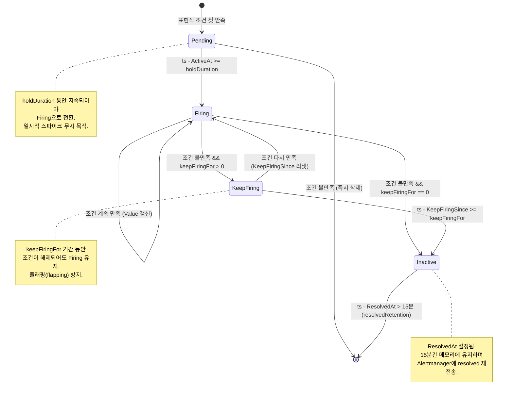
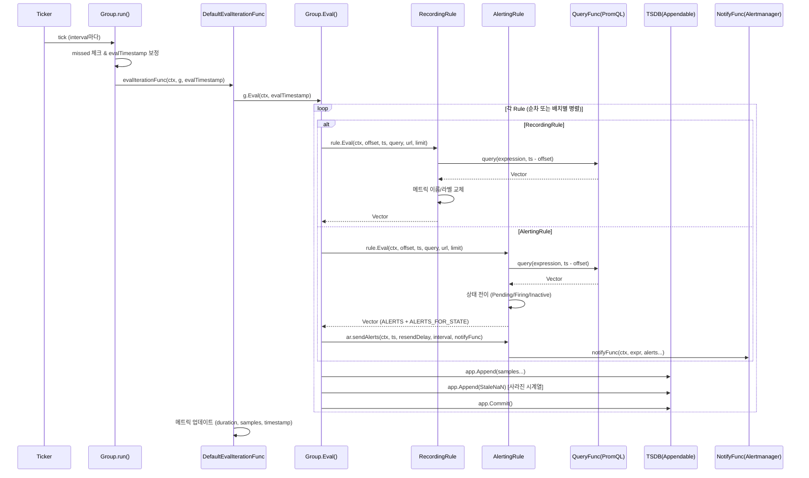

# 14. Prometheus 규칙 엔진 (Rule Engine) Deep-Dive

## 목차

1. [규칙 엔진 개요](#1-규칙-엔진-개요)
2. [Manager 구조체](#2-manager-구조체)
3. [Group 구조체](#3-group-구조체)
4. [Rule 인터페이스](#4-rule-인터페이스)
5. [RecordingRule 상세](#5-recordingrule-상세)
6. [AlertingRule 상세](#6-alertingrule-상세)
7. [Alert 생명주기](#7-alert-생명주기)
8. [sendAlerts와 알림 발송](#8-sendalerts와-알림-발송)
9. [동시 평가 (Concurrent Evaluation)](#9-동시-평가-concurrent-evaluation)
10. [템플릿 확장](#10-템플릿-확장)

---

## 1. 규칙 엔진 개요

### 왜 규칙이 필요한가

Prometheus는 Pull 기반 메트릭 수집 시스템이다. 수집된 원시 메트릭 데이터를 그대로 사용하는 것만으로는 실무 운영에 충분하지 않다. 규칙 엔진이 필요한 핵심 이유는 다음과 같다:

| 문제 | 규칙으로 해결 |
|------|-------------|
| 복잡한 PromQL 쿼리를 대시보드에서 매번 실행하면 느림 | RecordingRule로 사전 계산하여 새 시계열로 저장 |
| 높은 카디널리티 메트릭을 집계 없이 쿼리하면 비용 과다 | RecordingRule로 차원(dimension) 축소 |
| 특정 조건(예: CPU 사용률 > 90%)이 지속되면 알림 필요 | AlertingRule로 조건 평가 후 Alertmanager에 통보 |
| 알림 조건에 `for` 지속 시간 필요 (일시적 스파이크 무시) | AlertingRule의 holdDuration으로 Pending 상태 관리 |

### 아키텍처 위치

```
┌─────────────────────────────────────────────────────────┐
│                    Prometheus Server                     │
│                                                         │
│  ┌──────────┐    ┌──────────────┐    ┌───────────────┐  │
│  │ Scraper  │───▶│    TSDB      │◀───│  Rule Engine  │  │
│  └──────────┘    └──────┬───────┘    └───────┬───────┘  │
│                         │                    │           │
│                         │              ┌─────┴─────┐    │
│                         │              │           │    │
│                    ┌────▼────┐   ┌─────▼───┐ ┌────▼──┐ │
│                    │ PromQL  │   │Recording│ │Alerting│ │
│                    │ Engine  │   │  Rules  │ │ Rules  │ │
│                    └─────────┘   └─────────┘ └───┬────┘ │
│                                                  │      │
│                                          ┌───────▼────┐ │
│                                          │Alertmanager│ │
│                                          └────────────┘ │
└─────────────────────────────────────────────────────────┘
```

규칙 엔진은 주기적으로(기본 1분 간격) TSDB에서 PromQL 쿼리를 실행하고, 결과를 다시 TSDB에 저장하거나(RecordingRule) Alertmanager에 알림을 발송한다(AlertingRule).

### 소스코드 구조

규칙 엔진의 핵심 소스 파일은 `rules/` 디렉토리에 위치한다:

| 파일 | 역할 |
|------|------|
| `rules/manager.go` | Manager 구조체, Update/Run/Stop, 동시성 제어 |
| `rules/group.go` | Group 구조체, run() 평가 루프, Eval(), 의존성 맵 |
| `rules/alerting.go` | AlertingRule, Alert 상태 머신, sendAlerts() |
| `rules/recording.go` | RecordingRule, 메트릭 이름/라벨 덮어쓰기 |
| `rules/rule.go` | Rule 인터페이스 정의, RuleHealth 타입 |

---

## 2. Manager 구조체

### 구조 정의

Manager는 모든 규칙 그룹의 생명주기를 관리하는 최상위 객체다.

> 소스: `rules/manager.go` 97~107행

```go
type Manager struct {
    opts                 *ManagerOptions
    groups               map[string]*Group
    mtx                  sync.RWMutex
    block                chan struct{}
    done                 chan struct{}
    restored             bool
    restoreNewRuleGroups bool
    logger               *slog.Logger
}
```

| 필드 | 설명 |
|------|------|
| `groups` | `map[string]*Group` — 키는 `파일경로;그룹이름` 형식 (`GroupKey()` 함수 사용) |
| `block` | Run()이 호출될 때까지 그룹 평가를 블로킹하는 채널 |
| `done` | Stop() 시 닫혀서 모든 고루틴에 종료 신호 전파 |
| `restored` | 첫 번째 Update() 이후 `true` — for 상태 복원 제어 |
| `mtx` | groups 맵 접근 보호용 RWMutex |

### ManagerOptions 상세

> 소스: `rules/manager.go` 113~144행

```go
type ManagerOptions struct {
    QueryFunc                 QueryFunc
    NotifyFunc                NotifyFunc
    Appendable                storage.Appendable
    Queryable                 storage.Queryable
    ExternalURL               *url.URL
    OutageTolerance           time.Duration
    ForGracePeriod            time.Duration
    ResendDelay               time.Duration
    MaxConcurrentEvals        int64
    ConcurrentEvalsEnabled    bool
    RuleConcurrencyController RuleConcurrencyController
    RuleDependencyController  RuleDependencyController
    // ... 기타 필드
}
```

핵심 콜백/의존성:

| 옵션 | 역할 |
|------|------|
| `QueryFunc` | PromQL instant query를 실행하는 함수. `EngineQueryFunc()`로 생성 |
| `NotifyFunc` | Alert를 Alertmanager에 전송하는 콜백 |
| `Appendable` | 규칙 평가 결과를 TSDB에 쓰기 위한 인터페이스 |
| `Queryable` | for 상태 복원 시 TSDB에서 `ALERTS_FOR_STATE` 시계열 조회 |
| `ResendDelay` | 알림 재발송 최소 간격 (기본 1분) |
| `OutageTolerance` | for 상태 복원 시 허용하는 최대 다운타임 |
| `ForGracePeriod` | 복원된 알림의 for 대기 유예 기간 |

### QueryFunc: PromQL 실행 어댑터

> 소스: `rules/manager.go` 44~73행

```go
type QueryFunc func(ctx context.Context, q string, t time.Time) (promql.Vector, error)
```

`EngineQueryFunc()`는 PromQL 엔진의 `NewInstantQuery()`를 호출하고, 결과 타입이 Scalar인 경우 Vector로 변환한다. 이 변환이 필요한 이유는 규칙 엔진이 모든 결과를 `promql.Vector` 형태로 통일하여 처리하기 때문이다.

### Run() / Stop()

```
Run() 호출 흐름:
┌───────┐     ┌────────┐     ┌────────────┐
│ Run() │────▶│start() │────▶│close(block)│
└───┬───┘     └────────┘     └────────────┘
    │
    ▼
<-m.done (블로킹 대기 — Stop()이 닫을 때까지)
```

`Run()`은 `close(m.block)`을 통해 모든 그룹의 `run()` 고루틴에 시작 신호를 보내고, `<-m.done`으로 종료 신호를 기다린다.

`Stop()`은 두 단계로 동작한다:

1. 모든 그룹에 `stopAsync()` (비동기 중지 신호)
2. 모든 그룹에 `waitStopped()` (종료 완료 대기)

이 두 단계 분리의 이유: 각 그룹이 순차적으로 중지를 기다리면 전체 종료 시간이 `N * 그룹별_종료_시간`이 되지만, 비동기로 모든 그룹에 신호를 보낸 후 한꺼번에 기다리면 `max(그룹별_종료_시간)`으로 단축된다.

### Update(): 규칙 파일 재로드

`Update()`는 규칙 설정이 변경되었을 때 호출된다 (예: SIGHUP 시그널, API 호출).

> 소스: `rules/manager.go` 245~321행

```
Update() 흐름:

1. LoadGroups()로 새 규칙 파일 파싱
   │
2. 기존 그룹과 비교
   ├─ 동일(Equals) → 기존 그룹 유지
   ├─ 변경됨 → oldg.stop() + newg.CopyState(oldg) + newg.run()
   └─ 삭제됨 → oldg.markStale = true + oldg.stop()
   │
3. 삭제된 그룹의 메트릭 정리
   │
4. m.groups = groups (새 맵으로 교체)
```

핵심 설계 결정:

- **상태 복원**: 변경된 그룹은 `CopyState()`로 기존 Alert의 `active` 맵, `seriesInPreviousEval`, `evaluationTime` 등을 복사한다. 이를 통해 규칙 리로드 시 Alert의 Pending/Firing 상태가 유지된다.
- **Stale 마킹**: 삭제된 그룹은 `markStale = true`로 설정되어 stop() 시 이전에 생산한 시계열에 StaleNaN 마커를 기록한다.
- **블로킹 대기**: 새 그룹의 `run()`은 `<-m.block`으로 Manager가 `Run()`을 호출할 때까지 대기한다. 이는 부트스트랩 중 TSDB가 아직 준비되지 않은 상태에서 쿼리하는 것을 방지한다.

### LoadGroups(): 파일 파싱과 규칙 생성

> 소스: `rules/manager.go` 344~413행

`LoadGroups()`는 다음 과정을 거친다:

1. `GroupLoader.Load()`로 YAML 파일 파싱 (기본: `FileLoader` → `rulefmt.ParseFile()`)
2. 각 규칙의 표현식을 `GroupLoader.Parse()`로 PromQL AST로 변환
3. `alert` 필드가 있으면 `NewAlertingRule()`, `record` 필드가 있으면 `NewRecordingRule()` 생성
4. `RuleDependencyController.AnalyseRules()`로 규칙 간 의존성 분석
5. `NewGroup()`으로 그룹 생성

---

## 3. Group 구조체

### 구조 정의

Group은 논리적으로 관련된 규칙들의 집합이다. 동일한 평가 간격(interval)으로 함께 평가된다.

> 소스: `rules/group.go` 45~77행

```go
type Group struct {
    name                  string
    file                  string
    interval              time.Duration
    queryOffset           *time.Duration
    limit                 int
    rules                 []Rule
    seriesInPreviousEval  []map[string]labels.Labels
    staleSeries           []labels.Labels
    opts                  *ManagerOptions
    shouldRestore         bool
    markStale             bool
    done                  chan struct{}
    terminated            chan struct{}
    managerDone           chan struct{}
    evalIterationFunc     GroupEvalIterationFunc
    // ... 메트릭/타임스탬프 필드
}
```

| 필드 | 설명 |
|------|------|
| `name`, `file` | 그룹 이름과 원본 파일 경로. 키: `file;name` |
| `interval` | 평가 간격 (기본 글로벌 값, 그룹별 오버라이드 가능) |
| `queryOffset` | 쿼리 시간 오프셋 — 평가 시점에서 과거로 이동 |
| `limit` | 규칙당 최대 시계열 수 제한 (0 = 무제한) |
| `rules` | `[]Rule` — AlertingRule과 RecordingRule의 슬라이스 |
| `seriesInPreviousEval` | 이전 평가에서 각 규칙이 생산한 시계열 맵 (stale 감지용) |
| `staleSeries` | StaleNaN 마커를 기록해야 할 시계열 목록 |
| `shouldRestore` | 첫 평가 후 for 상태 복원 필요 여부 |
| `evalIterationFunc` | 평가 반복 함수 (기본: `DefaultEvalIterationFunc`) |

### run(): ticker 기반 평가 루프

> 소스: `rules/group.go` 208~297행

`run()`은 Group의 핵심 고루틴이다. 다음 시퀀스로 동작한다:

```
run() 실행 흐름:

1. EvalTimestamp() + interval로 첫 평가 시점 계산
   │
2. time.After(첫 평가 시점까지 대기)
   │
3. 첫 번째 evalIterationFunc() 실행
   │
4. shouldRestore == true?
   │  ├─ Yes: 두 번째 평가 실행 후 RestoreForState()
   │  └─ No: 건너뜀
   │
5. 메인 루프:
   for {
     select {
       case <-g.done: return
       case <-tick.C:
         missed 카운트 → evalTimestamp 보정 → evalIterationFunc()
     }
   }
   │
6. defer: markStale == true면 2*interval 후 staleSeries 정리
```

#### EvalTimestamp(): 시간 슬롯 정렬

> 소스: `rules/group.go` 422~445행

```go
func (g *Group) EvalTimestamp(startTime int64) time.Time {
    offset = int64(g.hash() % uint64(g.interval))
    adjNow = startTime - offset
    base = adjNow - (adjNow % int64(g.interval))
    next = base + offset
    return time.Unix(0, next).UTC()
}
```

이 알고리즘의 목적:

1. **일관된 슬롯**: 평가 시간이 interval의 정확한 배수에 정렬됨 (예: 30초 간격이면 00:00:00, 00:00:30, 00:01:00, ...)
2. **그룹별 오프셋**: `hash() % interval`로 그룹마다 다른 오프셋을 적용하여 모든 그룹이 동시에 평가되는 것을 방지 (thundering herd 완화)
3. **과거 시점 보장**: offset을 먼저 빼서 계산 결과가 항상 현재 이전 시점이 되도록 보장

#### missed 처리

```go
missed := (time.Since(evalTimestamp) / g.interval) - 1
if missed > 0 {
    g.metrics.IterationsMissed.Add(float64(missed))
}
evalTimestamp = evalTimestamp.Add((missed + 1) * g.interval)
```

평가가 interval보다 오래 걸리면 일부 평가가 누락된다. 이때 `missed` 횟수를 메트릭에 기록하고, evalTimestamp를 현재에 가장 가까운 슬롯으로 점프한다. 누락된 슬롯은 건너뛰고 최신 데이터로 바로 평가하는 전략이다.

#### shouldRestore와 for 상태 복원

Prometheus가 재시작되면 Alert의 Pending/Firing 상태가 메모리에서 사라진다. `shouldRestore`가 true이면:

1. 첫 번째 평가 실행 (데이터 워밍업)
2. 두 번째 평가 실행 (RecordingRule 결과가 TSDB에 반영됨)
3. `RestoreForState()` 호출 — TSDB에서 `ALERTS_FOR_STATE` 시계열을 조회하여 `ActiveAt` 시간을 복원

복원 시 세 가지 경우를 처리한다:

| 상황 | 처리 |
|------|------|
| `timeRemainingPending <= 0` | 다운 전에 이미 Firing 상태였음. 다음 평가에서 자동 복원 |
| `timeRemainingPending < ForGracePeriod` | 유예 기간 적용: `restoredActiveAt = ts + ForGracePeriod - holdDuration` |
| 그 외 | 다운타임만큼 ActiveAt을 미래로 이동: `restoredActiveAt += downDuration` |

### Eval(): 규칙 평가 실행

> 소스: `rules/group.go` 504~691행

`Eval()`은 그룹 내 모든 규칙을 평가하는 핵심 메서드다.

```
Eval() 시퀀스 다이어그램:

┌──────┐      ┌──────┐      ┌────────┐      ┌──────┐
│ Eval │      │ Rule │      │Appendable│     │Notify│
└──┬───┘      └──┬───┘      └────┬────┘     └──┬───┘
   │             │               │              │
   │ rule.Eval() │               │              │
   │────────────▶│               │              │
   │  vector     │               │              │
   │◀────────────│               │              │
   │             │               │              │
   │ [AlertingRule이면]           │              │
   │ ar.sendAlerts()             │              │
   │────────────────────────────────────────────▶│
   │             │               │              │
   │ app.Append(sample)          │              │
   │────────────────────────────▶│              │
   │             │               │              │
   │ [이전 평가에 있었지만 지금 없는 시계열]      │
   │ app.Append(StaleNaN)        │              │
   │────────────────────────────▶│              │
   │             │               │              │
   │ app.Commit()│               │              │
   │────────────────────────────▶│              │
   │             │               │              │
```

각 규칙 평가의 상세 단계:

1. **규칙 평가**: `rule.Eval(ctx, queryOffset, ts, queryFunc, externalURL, limit)` 호출
2. **에러 처리**: 실패 시 `HealthBad` 설정, `EvalFailures` 카운터 증가
3. **Alert 발송**: AlertingRule이면 `sendAlerts()` 호출
4. **TSDB 기록**: 반환된 Vector의 각 Sample을 `Appender.Append()`로 저장
5. **Stale 마킹**: 이전 평가에 존재했지만 현재 평가에 없는 시계열에 StaleNaN 기록
6. **시계열 추적**: `seriesInPreviousEval[i]`를 현재 평가 결과로 갱신

#### Stale Series 처리의 중요성

```go
for metric, lset := range g.seriesInPreviousEval[i] {
    if _, ok := seriesReturned[metric]; !ok {
        _, err = app.Append(0, lset, timestamp.FromTime(ts.Add(-ruleQueryOffset)),
            math.Float64frombits(value.StaleNaN))
    }
}
```

RecordingRule이 `job:http_requests:rate5m`이라는 시계열을 생산하다가, 원본 메트릭이 사라지면 해당 시계열도 더 이상 생산되지 않는다. 이때 StaleNaN을 기록하지 않으면 마지막 값이 영원히 유효한 것처럼 보인다. StaleNaN은 "이 시계열은 더 이상 존재하지 않는다"는 명시적 신호다.

---

## 4. Rule 인터페이스

> 소스: `rules/rule.go` 37~86행

```go
type Rule interface {
    Name() string
    Labels() labels.Labels
    Eval(ctx context.Context, queryOffset time.Duration,
         evaluationTime time.Time, queryFunc QueryFunc,
         externalURL *url.URL, limit int) (promql.Vector, error)
    String() string
    Query() parser.Expr
    SetLastError(error)
    LastError() error
    SetHealth(RuleHealth)
    Health() RuleHealth
    SetEvaluationDuration(time.Duration)
    GetEvaluationDuration() time.Duration
    SetEvaluationTimestamp(time.Time)
    GetEvaluationTimestamp() time.Time
    SetDependentRules(rules []Rule)
    NoDependentRules() bool
    DependentRules() []Rule
    SetDependencyRules(rules []Rule)
    NoDependencyRules() bool
    DependencyRules() []Rule
}
```

### RuleHealth 타입

```go
type RuleHealth string

const (
    HealthUnknown RuleHealth = "unknown"  // 아직 평가되지 않음
    HealthGood    RuleHealth = "ok"       // 마지막 평가 성공
    HealthBad     RuleHealth = "err"      // 마지막 평가 실패
)
```

### 의존성 관련 메서드

Rule 인터페이스에는 동시 평가를 위한 의존성 관리 메서드가 포함되어 있다:

| 메서드 | 역할 |
|--------|------|
| `SetDependentRules()` | 이 규칙의 출력을 입력으로 사용하는 규칙들 설정 |
| `NoDependentRules()` | 의존하는 규칙이 없음이 보장되면 `true` |
| `SetDependencyRules()` | 이 규칙이 입력으로 사용하는 규칙들 설정 |
| `NoDependencyRules()` | 의존하는 입력 규칙이 없음이 보장되면 `true` |

`nil`과 빈 슬라이스를 구분하는 것이 중요하다:
- `nil`: 의존성을 아직 분석하지 않았음 → `NoDependentRules()` = `false` (안전한 기본값)
- `[]Rule{}` (빈 슬라이스): 분석 완료, 의존자 없음 → `NoDependentRules()` = `true`

---

## 5. RecordingRule 상세

### 구조 정의

> 소스: `rules/recording.go` 38~54행

```go
type RecordingRule struct {
    name                string
    vector              parser.Expr
    labels              labels.Labels
    health              *atomic.String
    evaluationTimestamp *atomic.Time
    lastError           *atomic.Error
    evaluationDuration  *atomic.Duration
    dependentRules      []Rule
    dependencyRules     []Rule
}
```

RecordingRule은 AlertingRule보다 단순하다. 상태 머신이 없고, 표현식 평가 결과에 이름과 라벨을 덮어쓴 후 저장하는 것이 전부다.

### Eval() 동작

> 소스: `rules/recording.go` 85~122행

```go
func (rule *RecordingRule) Eval(ctx context.Context, queryOffset time.Duration,
    ts time.Time, query QueryFunc, _ *url.URL, limit int) (promql.Vector, error) {

    vector, err := query(ctx, rule.vector.String(), ts.Add(-queryOffset))
    // ...

    for i := range vector {
        sample := &vector[i]
        lb.Reset(sample.Metric)
        lb.Set(labels.MetricName, rule.name)      // 메트릭 이름 교체
        rule.labels.Range(func(l labels.Label) {
            lb.Set(l.Name, l.Value)                // 추가 라벨 설정
        })
        sample.Metric = lb.Labels()
    }

    if vector.ContainsSameLabelset() {
        return nil, ErrDuplicateRecordingLabelSet  // 중복 라벨셋 검증
    }

    if limit > 0 && numSeries > limit {
        return nil, fmt.Errorf("exceeded limit of %d with %d series", limit, numSeries)
    }

    return vector, nil
}
```

처리 흐름:

```
┌─────────────────────────────────────────────────────┐
│ RecordingRule.Eval()                                 │
│                                                     │
│  1. query(expression, ts - queryOffset)             │
│     │                                               │
│  2. 각 샘플에 대해:                                  │
│     ├─ __name__ = rule.name 으로 교체                │
│     └─ rule.labels 추가 (기존 라벨 덮어쓰기)          │
│     │                                               │
│  3. 중복 라벨셋 검증                                  │
│     │                                               │
│  4. limit 초과 검증                                   │
│     │                                               │
│  5. Vector 반환 → Group.Eval()이 TSDB에 저장          │
└─────────────────────────────────────────────────────┘
```

### 사용 사례

#### 1. 복잡한 쿼리 사전 계산

```yaml
groups:
  - name: aggregation
    rules:
      - record: job:http_requests:rate5m
        expr: sum(rate(http_requests_total[5m])) by (job)
```

이 규칙 없이 대시보드에서 매번 `sum(rate(http_requests_total[5m])) by (job)`을 실행하면:
- 원본 시계열 수만큼의 데이터를 매번 스캔
- 대시보드 로드 시간 증가
- PromQL 엔진 부하 증가

RecordingRule을 사용하면 매 평가 주기마다 한 번만 계산하고, 결과를 `job:http_requests:rate5m`이라는 새 시계열로 저장한다.

#### 2. 카디널리티 감소

```yaml
- record: instance:cpu:avg
  expr: avg without(cpu) (rate(node_cpu_seconds_total{mode!="idle"}[5m]))
```

원본이 CPU 코어별 시계열(예: 64코어 * 100인스턴스 = 6,400개)이라면, 이 규칙으로 인스턴스별 1개(= 100개)로 축소된다.

### 중복 라벨셋 에러

`ErrDuplicateRecordingLabelSet`은 규칙 라벨을 적용한 후 동일한 라벨 조합이 발생할 때 반환된다. 예를 들어 표현식 결과에 `{job="a", instance="1"}`과 `{job="a", instance="2"}`가 있는데, `labels: {instance: "x"}`로 instance를 고정하면 두 샘플 모두 `{job="a", instance="x"}`가 되어 충돌한다.

---

## 6. AlertingRule 상세

### 구조 정의

> 소스: `rules/alerting.go` 116~157행

```go
type AlertingRule struct {
    name           string
    vector         parser.Expr
    holdDuration   time.Duration    // for: 기간
    keepFiringFor  time.Duration    // keep_firing_for: 기간
    labels         labels.Labels
    annotations    labels.Labels
    externalLabels map[string]string
    externalURL    string
    restored       *atomic.Bool
    active         map[uint64]*Alert  // fingerprint → Alert
    // ... 메트릭/의존성 필드
}
```

| 필드 | 설명 |
|------|------|
| `holdDuration` | `for:` 설정 — Pending에서 Firing으로 전환하기까지 조건이 유지되어야 하는 시간 |
| `keepFiringFor` | `keep_firing_for:` 설정 — 조건 해제 후에도 Firing 상태를 유지하는 시간 |
| `active` | `map[uint64]*Alert` — 라벨셋의 fingerprint(해시)를 키로 사용 |
| `restored` | for 상태 복원 완료 여부 (atomic) |

### Alert 구조체

> 소스: `rules/alerting.go` 84~100행

```go
type Alert struct {
    State       AlertState
    Labels      labels.Labels
    Annotations labels.Labels
    Value       float64
    ActiveAt        time.Time
    FiredAt         time.Time
    ResolvedAt      time.Time
    LastSentAt      time.Time
    ValidUntil      time.Time
    KeepFiringSince time.Time
}
```

| 필드 | 설명 |
|------|------|
| `State` | 현재 상태: Inactive, Pending, Firing |
| `ActiveAt` | 조건이 처음 만족된 시점 |
| `FiredAt` | Firing 상태로 전환된 시점 |
| `ResolvedAt` | 조건 해제 시점 (0이면 아직 활성) |
| `LastSentAt` | 마지막으로 Alertmanager에 발송된 시점 |
| `ValidUntil` | 알림의 유효 기간 (이 시점까지 재발송 없으면 Alertmanager가 resolved 처리) |
| `KeepFiringSince` | keepFiringFor가 활성화된 시점 |

### AlertState 열거형

> 소스: `rules/alerting.go` 54~67행

```go
const (
    StateUnknown  AlertState = iota  // 아직 평가되지 않음
    StateInactive                     // 조건 불만족
    StatePending                      // 조건 만족, holdDuration 대기 중
    StateFiring                       // 조건 지속 만족, 알림 발송 대상
)
```

### Eval() 동작 상세

> 소스: `rules/alerting.go` 382~546행

AlertingRule의 Eval()은 RecordingRule보다 복잡하다. 상태 머신을 관리해야 하기 때문이다.

```
AlertingRule.Eval() 상세 흐름:

1. PromQL 표현식 실행
   query(ctx, vector.String(), ts - queryOffset)
   │
2. 결과별 Alert 객체 생성
   ├─ 라벨 빌딩: 원본 메트릭 라벨 + rule.labels + alertname
   ├─ Annotations 템플릿 확장
   └─ fingerprint(hash) 계산
   │
3. 기존 활성 Alert 업데이트
   ├─ 이미 존재 && !Inactive → Value/Annotations만 갱신
   └─ 새로운 fingerprint → active 맵에 추가 (Pending 상태)
   │
4. active 맵 순회하며 상태 전이
   ├─ 표현식에 없는 Alert:
   │   ├─ keepFiringFor 활성화? → KeepFiringSince 설정, 유지
   │   ├─ Pending → 즉시 삭제
   │   ├─ Firing → Inactive + ResolvedAt 설정
   │   └─ Resolved 후 15분 경과 → 삭제
   │
   └─ 표현식에 있는 Alert:
       ├─ Pending && (ts - ActiveAt >= holdDuration) → Firing
       ├─ Firing && (ts - ActiveAt < holdDuration) → Pending (holdDuration 증가 시)
       └─ KeepFiringSince 리셋
   │
5. limit 초과 검사
   │
6. ALERTS, ALERTS_FOR_STATE 시계열 벡터 반환
```

### ALERTS / ALERTS_FOR_STATE 합성 메트릭

AlertingRule.Eval()은 두 종류의 합성 시계열을 반환한다:

```go
// ALERTS 시계열: alertstate 라벨로 현재 상태 표시
vec = append(vec, r.sample(a, ts))
// ALERTS_FOR_STATE 시계열: ActiveAt의 Unix 타임스탬프를 값으로 저장
vec = append(vec, r.forStateSample(a, ts, float64(a.ActiveAt.Unix())))
```

| 시계열 | 용도 |
|--------|------|
| `ALERTS{alertname="X", alertstate="firing"}` | 현재 Alert 상태 조회용 (다른 규칙에서 참조 가능) |
| `ALERTS_FOR_STATE{alertname="X"}` | 재시작 후 for 상태 복원용 (ActiveAt 시점을 TSDB에 기록) |

---

## 7. Alert 생명주기

### 상태 전이 다이어그램



### 상태 전이 코드 분석

#### Pending → Firing 전환

```go
if a.State == StatePending && ts.Sub(a.ActiveAt) >= r.holdDuration {
    a.State = StateFiring
    a.FiredAt = ts
}
```

`holdDuration`(YAML의 `for:` 값)은 일시적인 메트릭 변동으로 인한 거짓 알림을 방지한다. 예를 들어 `for: 5m`이면 조건이 5분 연속 만족되어야 Firing으로 전환된다.

#### Firing → Pending 역전환 (holdDuration 변경 시)

```go
if a.State == StateFiring && ts.Sub(a.ActiveAt) < r.holdDuration {
    a.State = StatePending
    a.FiredAt = time.Time{}
    a.LastSentAt = time.Time{}
    a.KeepFiringSince = time.Time{}
}
```

규칙 리로드로 `holdDuration`이 증가하면, 이미 Firing 중인 Alert가 Pending으로 되돌아갈 수 있다. 이는 "새로운 holdDuration 기준으로 아직 충분히 오래 지속되지 않았다"는 의미다.

#### keepFiringFor 처리

```go
var keepFiring bool
if a.State == StateFiring && r.keepFiringFor > 0 {
    if a.KeepFiringSince.IsZero() {
        a.KeepFiringSince = ts    // keepFiringFor 타이머 시작
    }
    if ts.Sub(a.KeepFiringSince) < r.keepFiringFor {
        keepFiring = true         // 아직 유지 기간 내
    }
}
```

`keepFiringFor`는 조건이 해제된 후에도 일정 시간 Firing 상태를 유지한다. 이는 메트릭이 경계값 주변에서 진동(flapping)할 때 반복적인 resolved/firing 알림을 방지한다.

```
시간축 예시 (keepFiringFor: 10m):

조건: ─────TTTTTTTTTTTTFFFFFFTTTTTTTT─────
     |    |         |        |      |
상태: Pending→Firing │   KeepFiring  │
     |              조건 해제       조건 재만족
     |              (KeepFiringSince (KeepFiringSince
     |               설정)           리셋)
```

#### resolvedRetention: 15분 유지

```go
const resolvedRetention = 15 * time.Minute

if a.State == StatePending ||
   (!a.ResolvedAt.IsZero() && ts.Sub(a.ResolvedAt) > resolvedRetention) {
    delete(r.active, fp)
}
```

Resolved 된 Alert를 즉시 삭제하지 않고 15분간 유지하는 이유:

1. **네트워크 장애 내성**: Alertmanager에 resolved 알림을 전송하지 못했을 때 재시도 기회 제공
2. **Alertmanager 장애 내성**: Alertmanager가 재시작되어도 resolved 알림을 다시 받을 수 있음
3. **긴 Group interval 대응**: Group interval이 긴 경우(예: 5분), 한 번의 전송 실패로 resolved가 누락되는 것을 방지

---

## 8. sendAlerts와 알림 발송

### sendAlerts() 메서드

> 소스: `rules/alerting.go` 613~628행

```go
func (r *AlertingRule) sendAlerts(ctx context.Context, ts time.Time,
    resendDelay, interval time.Duration, notifyFunc NotifyFunc) {

    alerts := []*Alert{}
    r.ForEachActiveAlert(func(alert *Alert) {
        if alert.needsSending(ts, resendDelay) {
            alert.LastSentAt = ts
            delta := max(interval, resendDelay)
            alert.ValidUntil = ts.Add(4 * delta)
            anew := *alert
            anew.Labels = alert.Labels.Copy()
            alerts = append(alerts, &anew)
        }
    })
    notifyFunc(ctx, r.vector.String(), alerts...)
}
```

### needsSending(): 발송 판단 로직

> 소스: `rules/alerting.go` 102~113행

```go
func (a *Alert) needsSending(ts time.Time, resendDelay time.Duration) bool {
    if a.State == StatePending {
        return false                              // Pending은 절대 발송 안함
    }
    if a.ResolvedAt.After(a.LastSentAt) {
        return true                               // 마지막 발송 후 resolved → 즉시 재발송
    }
    return a.LastSentAt.Add(resendDelay).Before(ts) // resendDelay 경과 → 재발송
}
```

발송 판단 플로차트:

```
needsSending(ts, resendDelay):

State == Pending?
├─ Yes → return false (Pending은 절대 발송하지 않음)
└─ No
   │
   ResolvedAt > LastSentAt?
   ├─ Yes → return true (resolved 상태 즉시 알려야 함)
   └─ No
      │
      LastSentAt + resendDelay < ts?
      ├─ Yes → return true (재발송 시간 도래)
      └─ No → return false (아직 재발송 시간 아님)
```

### ValidUntil 계산

```go
delta := max(interval, resendDelay)
alert.ValidUntil = ts.Add(4 * delta)
```

`ValidUntil`은 Alertmanager에게 "이 시점까지 갱신 알림이 없으면 resolved로 간주하라"고 알려주는 만료 시간이다.

`4 * delta`인 이유:
- 2번의 평가 실패(evaluation failure) 또는 Alertmanager 전송 실패를 허용
- `delta = max(interval, resendDelay)`이므로, interval이 30초이고 resendDelay가 1분이면 delta = 1분
- ValidUntil = 현재 + 4분 → 4번 연속 실패해야 만료

### SendAlerts(): NotifyFunc 생성

> 소스: `rules/manager.go` 469~492행

```go
func SendAlerts(s Sender, externalURL string) NotifyFunc {
    return func(_ context.Context, expr string, alerts ...*Alert) {
        var res []*notifier.Alert
        for _, alert := range alerts {
            a := &notifier.Alert{
                StartsAt:     alert.FiredAt,
                Labels:       alert.Labels,
                Annotations:  alert.Annotations,
                GeneratorURL: externalURL + strutil.TableLinkForExpression(expr),
            }
            if !alert.ResolvedAt.IsZero() {
                a.EndsAt = alert.ResolvedAt
            } else {
                a.EndsAt = alert.ValidUntil
            }
            res = append(res, a)
        }
        if len(alerts) > 0 {
            s.Send(res...)
        }
    }
}
```

Alert → notifier.Alert 변환 시:
- `EndsAt`: resolved면 `ResolvedAt`, 아직 활성이면 `ValidUntil`
- `GeneratorURL`: 표현식 링크를 포함하여 Alertmanager UI에서 원본 쿼리로 이동 가능

---

## 9. 동시 평가 (Concurrent Evaluation)

### 개요

기본적으로 한 Group 내의 모든 규칙은 순차적으로 평가된다. 규칙 A의 출력을 규칙 B가 입력으로 사용할 수 있기 때문이다. 그러나 독립적인 규칙들은 병렬로 평가하면 성능이 향상된다.

### RuleConcurrencyController 인터페이스

> 소스: `rules/manager.go` 524~536행

```go
type RuleConcurrencyController interface {
    SplitGroupIntoBatches(ctx context.Context, group *Group) []ConcurrentRules
    Allow(ctx context.Context, group *Group, rule Rule) bool
    Done(ctx context.Context)
}
```

| 메서드 | 역할 |
|--------|------|
| `SplitGroupIntoBatches()` | 규칙들을 배치로 분할. 같은 배치 내 규칙은 병렬 실행 가능 |
| `Allow()` | 세마포어 슬롯 획득 시도. `true`면 병렬, `false`면 순차 |
| `Done()` | 세마포어 슬롯 반환 |

### 배치 분할 전략

> 소스: `rules/manager.go` 553~587행

`SplitGroupIntoBatches()`는 의존성 분석 결과를 기반으로 3단계 배치를 생성한다:

```
규칙 의존성에 따른 배치 분할:

배치 1 (병렬): 의존성이 없는 규칙들 (NoDependencyRules() == true)
              ┌─────┐ ┌─────┐ ┌─────┐
              │ R1  │ │ R2  │ │ R3  │  ← 동시 실행
              └─────┘ └─────┘ └─────┘

배치 2 (순차): 의존성도 있고 의존자도 있는 규칙들
              ┌─────┐
              │ R4  │  ← 순차 실행 (한 번에 하나씩)
              └─────┘
              ┌─────┐
              │ R5  │
              └─────┘

배치 3 (병렬): 의존자가 없는 규칙들 (NoDependentRules() == true)
              ┌─────┐ ┌─────┐
              │ R6  │ │ R7  │  ← 동시 실행
              └─────┘ └─────┘
```

이 전략이 안전한 이유: 규칙은 그룹 내에서 정의 순서대로 의존성이 흐른다. 규칙 A가 규칙 B보다 먼저 정의되면, B가 A에 의존할 수 있지만 A가 B에 의존하는 것은 허용되지 않는다. 따라서:

1. **배치 1**: 아무것도 의존하지 않으므로 안전하게 병렬 실행
2. **배치 2**: 배치 1 결과에 의존하면서 배치 3의 입력을 생성하므로 순차 실행
3. **배치 3**: 아무도 이 규칙의 결과에 의존하지 않으므로 안전하게 병렬 실행

### concurrentRuleEvalController: 세마포어 기반 제어

> 소스: `rules/manager.go` 539~591행

```go
type concurrentRuleEvalController struct {
    sema *semaphore.Weighted
}

func (c *concurrentRuleEvalController) Allow(_ context.Context, _ *Group, _ Rule) bool {
    return c.sema.TryAcquire(1)
}

func (c *concurrentRuleEvalController) Done(_ context.Context) {
    c.sema.Release(1)
}
```

`semaphore.Weighted`를 사용하여 전체 Prometheus 서버에서 동시에 평가되는 규칙 수를 `MaxConcurrentEvals`로 제한한다. 이는 그룹별이 아닌 글로벌 제한이다.

`TryAcquire(1)`이 `false`를 반환하면 (슬롯 부족) 해당 규칙은 순차 실행으로 폴백한다:

```go
if len(batch) > 1 && ctrl.Allow(ctx, g, rule) {
    wg.Add(1)
    go eval(ruleIndex, rule, func() {
        wg.Done()
        ctrl.Done(ctx)
    })
} else {
    eval(ruleIndex, rule, nil)  // 순차 실행 폴백
}
```

### 의존성 분석: buildDependencyMap()

> 소스: `rules/group.go` 1125~1211행

`buildDependencyMap()`은 규칙 간의 의존성 그래프를 구축한다:

```go
func buildDependencyMap(rules []Rule) dependencyMap {
    dependencies := make(dependencyMap)

    for _, rule := range rules {
        parser.Inspect(rule.Query(), func(node parser.Node, _ []parser.Node) error {
            if n, ok := node.(*parser.VectorSelector); ok {
                // 메트릭 이름 매처 추출
                // 와일드카드면 indeterminate → nil 반환 (모든 규칙 순차 실행)
                // 다른 규칙의 이름과 매치하면 의존성 등록
            }
            return nil
        })
    }
    // ...
}
```

분석 알고리즘:

1. 각 규칙의 PromQL 표현식에서 `VectorSelector` 노드를 찾는다
2. `__name__` 매처가 없는 와일드카드 쿼리(예: `{cluster="prod"}`)가 있으면 → 모든 의존성을 결정할 수 없으므로 `nil` 반환 (안전하게 전체 순차 실행)
3. 이름 매처가 다른 규칙의 출력 이름과 일치하면 의존성 등록
4. `ALERTS`/`ALERTS_FOR_STATE` 메트릭을 쿼리하는 경우, `alertname` 라벨로 해당 AlertingRule과의 의존성 등록

```
의존성 분석 예시:

규칙 정의 순서:
  R1: record: job:requests:rate5m       expr: sum(rate(http_requests_total[5m])) by (job)
  R2: record: job:requests:ratio        expr: job:requests:rate5m / ignoring(job) sum(job:requests:rate5m)
  R3: alert:  HighRequestRate           expr: job:requests:rate5m > 1000

의존성 맵:
  R1 → [R2, R3]  (R1의 출력을 R2와 R3이 사용)
  R2 → []        (R2의 출력을 아무도 사용하지 않음)
  R3 → []        (R3의 출력 ALERTS를 아무도 사용하지 않음)

배치:
  배치 1 (병렬): [R1]   — 의존성 없음
  배치 2 (순차): (없음)
  배치 3 (병렬): [R2, R3] — 의존자 없음
```

### sequentialRuleEvalController: 기본 순차 실행

```go
type sequentialRuleEvalController struct{}

func (sequentialRuleEvalController) Allow(context.Context, *Group, Rule) bool {
    return false
}

func (sequentialRuleEvalController) SplitGroupIntoBatches(context.Context, *Group) []ConcurrentRules {
    return nil
}
```

`ConcurrentEvalsEnabled`가 `false`(기본값)이면 이 컨트롤러가 사용된다. `SplitGroupIntoBatches()`가 `nil`을 반환하면 Group.Eval()은 단순 순차 루프를 실행한다:

```go
if len(batches) == 0 {
    for i, rule := range g.rules {
        eval(i, rule, nil)
    }
}
```

---

## 10. 템플릿 확장

### Annotations에서의 템플릿 사용

AlertingRule의 Eval()에서 라벨과 Annotations 값은 Go 템플릿으로 확장된다.

> 소스: `rules/alerting.go` 401~428행

```go
tmplData := template.AlertTemplateData(l, r.externalLabels, r.externalURL, smpl)

defs := []string{
    "{{$labels := .Labels}}",
    "{{$externalLabels := .ExternalLabels}}",
    "{{$externalURL := .ExternalURL}}",
    "{{$value := .Value}}",
}

expand := func(text string) string {
    tmpl := template.NewTemplateExpander(
        ctx,
        strings.Join(append(defs, text), ""),
        "__alert_"+r.Name(),
        tmplData,
        model.Time(timestamp.FromTime(ts)),
        template.QueryFunc(query),
        externalURL,
        nil,
    )
    result, err := tmpl.Expand()
    if err != nil {
        result = fmt.Sprintf("<error expanding template: %s>", err)
        r.logger.Warn("Expanding alert template failed", "err", err, "data", tmplData)
    }
    return result
}
```

### 사용 가능한 변수

| 변수 | 타입 | 설명 |
|------|------|------|
| `$labels` (= `.Labels`) | `map[string]string` | 현재 Alert 인스턴스의 라벨 맵 |
| `$externalLabels` (= `.ExternalLabels`) | `map[string]string` | `--global.external-labels` 설정의 라벨 |
| `$externalURL` (= `.ExternalURL`) | `string` | `--web.external-url` 값 |
| `$value` (= `.Value`) | `string` | 표현식 결과 값 (문자열로 변환됨) |

### 템플릿 예시

```yaml
groups:
  - name: example
    rules:
      - alert: HighRequestLatency
        expr: histogram_quantile(0.99, rate(http_request_duration_seconds_bucket[5m])) > 1
        for: 10m
        labels:
          severity: page
        annotations:
          summary: "{{ $labels.instance }}에서 높은 요청 지연 시간"
          description: >-
            {{ $labels.instance }}의 p99 지연 시간이 {{ $value }}초입니다.
            (외부 클러스터: {{ $externalLabels.cluster }})
```

### 라벨에서의 템플릿

라벨 값도 템플릿 확장이 적용된다:

```go
r.labels.Range(func(l labels.Label) {
    lb.Set(l.Name, expand(l.Value))
})
```

이를 통해 동적 라벨 생성이 가능하다:

```yaml
labels:
  tier: "{{ $labels.job }}_alerts"
```

### 템플릿 에러 처리

템플릿 확장 실패 시 패닉 대신 에러 메시지가 결과 문자열에 포함된다:

```go
if err != nil {
    result = fmt.Sprintf("<error expanding template: %s>", err)
    r.logger.Warn("Expanding alert template failed", "err", err, "data", tmplData)
}
```

이 설계의 이유: 템플릿 에러로 인해 전체 Alert 평가가 실패하면, 조건 자체는 만족하는데 알림을 못 보내는 더 심각한 문제가 발생한다. 대신 에러 메시지가 포함된 Annotation으로라도 알림을 발송하는 것이 운영적으로 더 안전하다.

### 템플릿 내 PromQL 쿼리

`template.QueryFunc(query)`가 템플릿 확장기에 전달되므로, 템플릿 내에서 추가적인 PromQL 쿼리를 실행할 수 있다:

```yaml
annotations:
  description: >-
    현재 CPU 사용률: {{ with query "100 - (avg by(instance) (rate(node_cpu_seconds_total{mode='idle'}[5m])) * 100)" }}
      {{ . | first | value }}%
    {{ end }}
```

---

## 부록: 전체 평가 사이클 시퀀스 다이어그램



---

## 부록: 주요 메트릭

규칙 엔진은 자체 동작을 모니터링하기 위한 Prometheus 메트릭을 노출한다:

> 소스: `rules/group.go` 913~1077행

| 메트릭 | 타입 | 설명 |
|--------|------|------|
| `prometheus_rule_evaluation_duration_seconds` | Summary | 개별 규칙 평가 소요 시간 |
| `prometheus_rule_group_duration_seconds` | Summary | 그룹 전체 평가 소요 시간 |
| `prometheus_rule_group_iterations_missed_total` | Counter | 느린 평가로 인한 누락 횟수 |
| `prometheus_rule_group_iterations_total` | Counter | 스케줄된 평가 총 횟수 |
| `prometheus_rule_evaluations_total` | Counter | 규칙 평가 총 횟수 |
| `prometheus_rule_evaluation_failures_total` | Counter | 규칙 평가 실패 횟수 |
| `prometheus_rule_group_interval_seconds` | Gauge | 그룹 평가 간격 |
| `prometheus_rule_group_last_evaluation_timestamp_seconds` | Gauge | 마지막 평가 시각 |
| `prometheus_rule_group_last_duration_seconds` | Gauge | 마지막 평가 소요 시간 |
| `prometheus_rule_group_last_rule_duration_sum_seconds` | Gauge | 개별 규칙 소요 시간의 합 (병렬 실행 시 group_duration보다 클 수 있음) |
| `prometheus_rule_group_rules` | Gauge | 그룹 내 규칙 수 |
| `prometheus_rule_group_last_evaluation_samples` | Gauge | 마지막 평가에서 반환된 샘플 수 |

### 모니터링 활용

```
# 느린 규칙 그룹 감지
prometheus_rule_group_last_duration_seconds
  / prometheus_rule_group_interval_seconds > 0.9

# 병렬 평가 효과 측정
prometheus_rule_group_last_rule_duration_sum_seconds
  / prometheus_rule_group_last_duration_seconds > 1
  # 1보다 크면 병렬 실행의 이점이 있음

# 규칙 평가 실패율
rate(prometheus_rule_evaluation_failures_total[5m])
  / rate(prometheus_rule_evaluations_total[5m])
```

---

## 부록: 설계 결정 요약 (Why?)

| 설계 결정 | 이유 |
|-----------|------|
| Group 단위로 규칙 관리 | 관련 규칙을 동일 interval로 평가, 순서 보장 |
| EvalTimestamp 해싱 오프셋 | 모든 그룹이 동시에 평가하면 쿼리 부하 집중. 해시로 분산 |
| resolvedRetention 15분 | 네트워크/Alertmanager 장애 시 resolved 알림 재전송 보장 |
| ValidUntil = 4 * delta | 2번의 연속 실패 허용, 안전 마진 |
| StaleNaN 마커 기록 | 사라진 시계열을 명시적으로 만료 표시. PromQL lookback window에서 유령 데이터 방지 |
| 템플릿 에러 시 결과에 에러 포함 | 알림 자체가 누락되는 것보다 에러 메시지 포함된 알림이 운영적으로 나음 |
| keepFiringFor | 메트릭 flapping 시 resolved/firing 반복을 방지하여 알림 피로 감소 |
| CopyState()로 상태 복원 | 규칙 리로드 시 Alert 상태(Pending/Firing)와 ActiveAt을 보존 |
| 의존성 분석 시 순서 기반 | 규칙이 정의 순서대로 실행되므로, 뒤에 정의된 규칙만 앞 규칙에 의존 가능 |
| nil vs 빈 슬라이스 구분 | 분석 미완료(nil → 안전하게 순차)와 분석 완료(빈 → 병렬 허용)를 구분 |
