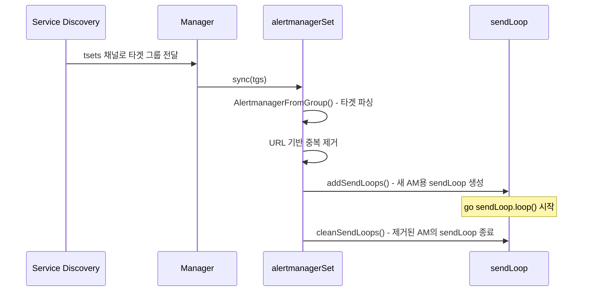
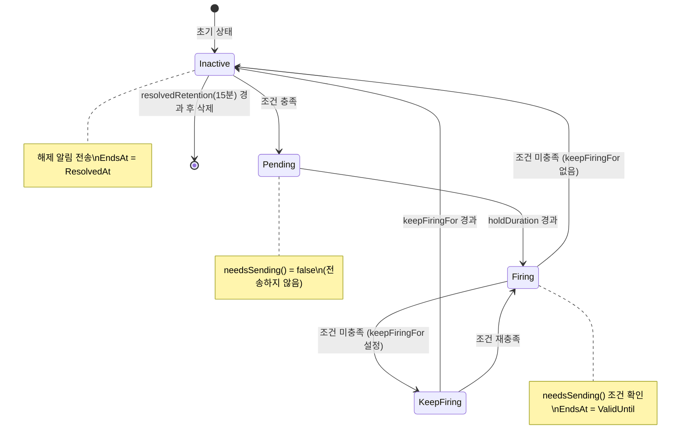
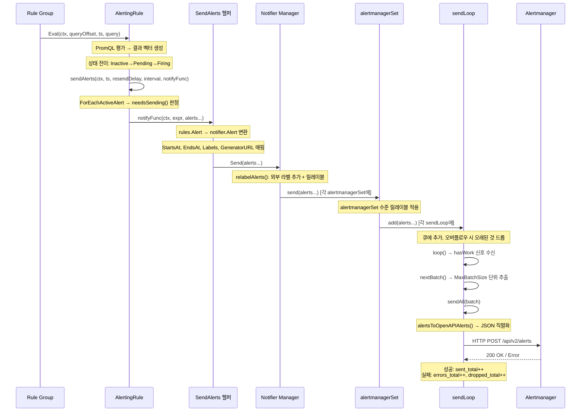

# 15. Alerting Pipeline Deep-Dive

## 목차

1. [알림 파이프라인 개요](#1-알림-파이프라인-개요)
2. [SendAlerts 헬퍼 (rules 패키지)](#2-sendalerts-헬퍼-rules-패키지)
3. [Notifier Manager](#3-notifier-manager)
4. [alertmanagerSet](#4-alertmanagerset)
5. [sendLoop와 sendAll](#5-sendloop와-sendall)
6. [HTTP 발송 프로토콜](#6-http-발송-프로토콜)
7. [Alert JSON 구조](#7-alert-json-구조)
8. [DrainOnShutdown](#8-drainonshutdown)
9. [메트릭](#9-메트릭)
10. [엔드-투-엔드 알림 흐름 정리](#10-엔드-투-엔드-알림-흐름-정리)

---

## 1. 알림 파이프라인 개요

Prometheus의 알림 파이프라인은 규칙 평가(Rule Evaluation)에서 시작하여 Alertmanager로의 HTTP 전송까지 이어지는 다단계 처리 체인이다. 이 파이프라인은 크게 세 개의 계층으로 나뉜다.

```
┌─────────────────────────────────────────────────────────────────────┐
│                     Prometheus 서버                                  │
│                                                                     │
│  ┌──────────────┐    ┌──────────────┐    ┌────────────────────────┐ │
│  │  Rule        │    │  rules.      │    │  notifier.Manager      │ │
│  │  Manager     │───>│  SendAlerts  │───>│                        │ │
│  │              │    │  (변환 헬퍼)  │    │  ┌──────────────────┐  │ │
│  │  Eval()      │    │              │    │  │ alertmanagerSet  │  │ │
│  │  sendAlerts()│    │  rules.Alert │    │  │  ┌────────────┐  │  │ │
│  │              │    │  → notifier. │    │  │  │ sendLoop   │  │  │ │
│  │              │    │    Alert     │    │  │  │  queue[]   │──┼──┼─┼──> Alertmanager
│  │              │    │              │    │  │  │  sendAll() │  │  │ │     HTTP POST
│  └──────────────┘    └──────────────┘    │  │  └────────────┘  │  │ │
│                                         │  └──────────────────┘  │ │
│                                         └────────────────────────┘ │
└─────────────────────────────────────────────────────────────────────┘
```

### 핵심 컴포넌트 간 관계

```mermaid
graph LR
    A[Group.Eval] --> B[AlertingRule.Eval]
    B --> C[AlertingRule.sendAlerts]
    C --> D[NotifyFunc / SendAlerts 헬퍼]
    D --> E[Manager.Send]
    E --> F[relabelAlerts]
    F --> G[alertmanagerSet.send]
    G --> H[sendLoop.add]
    H --> I[sendLoop.loop]
    I --> J[sendLoop.sendAll]
    J --> K[sendLoop.sendOne]
    K --> L[HTTP POST /api/v2/alerts]
```



### 왜 이런 설계인가?

| 설계 결정 | 이유 |
|-----------|------|
| rules/notifier 패키지 분리 | 규칙 평가와 알림 전송의 관심사 분리 — 규칙 엔진은 "무엇을" 알릴지, 노티파이어는 "어떻게" 전달할지만 담당 |
| NotifyFunc 콜백 패턴 | 테스트에서 목(mock) 주입 용이, rules 패키지가 notifier에 직접 의존하지 않음 |
| alertmanagerSet별 독립 sendLoop | 각 Alertmanager 엔드포인트마다 독립 큐를 운영하여 하나의 장애가 다른 엔드포인트에 영향 주지 않음 |
| 큐 기반 비동기 처리 | 규칙 평가 루프가 HTTP 전송 지연에 의해 블로킹되지 않도록 보장 |

---

## 2. SendAlerts 헬퍼 (rules 패키지)

### 2.1 NotifyFunc 타입 정의

`rules/manager.go`에 정의된 `NotifyFunc`는 알림 전송의 추상화 인터페이스다.

```go
// 소스: rules/manager.go:109-110
type NotifyFunc func(ctx context.Context, expr string, alerts ...*Alert)
```

이 함수 타입은 `ManagerOptions`의 필드로 전달되어, 규칙 그룹 평가 시 호출된다.

```go
// 소스: rules/manager.go:117
type ManagerOptions struct {
    NotifyFunc                NotifyFunc
    // ...
}
```

### 2.2 SendAlerts() 함수: rules.Alert → notifier.Alert 변환

`SendAlerts()`는 `Sender` 인터페이스를 래핑하여 `NotifyFunc`를 생성하는 팩토리 함수다.

```go
// 소스: rules/manager.go:464-492
type Sender interface {
    Send(alerts ...*notifier.Alert)
}

func SendAlerts(s Sender, externalURL string) NotifyFunc {
    return func(_ context.Context, expr string, alerts ...*Alert) {
        var res []*notifier.Alert
        for _, alert := range alerts {
            a := &notifier.Alert{
                StartsAt:     alert.FiredAt,
                Labels:       alert.Labels,
                Annotations:  alert.Annotations,
                GeneratorURL: externalURL + strutil.TableLinkForExpression(expr),
            }
            if !alert.ResolvedAt.IsZero() {
                a.EndsAt = alert.ResolvedAt
            } else {
                a.EndsAt = alert.ValidUntil
            }
            res = append(res, a)
        }
        if len(alerts) > 0 {
            s.Send(res...)
        }
    }
}
```

### 2.3 rules.Alert vs notifier.Alert 필드 매핑

두 패키지는 각각 독립된 `Alert` 구조체를 정의하고 있으며, `SendAlerts`에서 변환이 이루어진다.

| rules.Alert 필드 | notifier.Alert 필드 | 변환 규칙 |
|-------------------|---------------------|-----------|
| `FiredAt` | `StartsAt` | 알림이 최초 발화된 시각 |
| `ResolvedAt` | `EndsAt` | 해제된 경우 해제 시각 사용 |
| `ValidUntil` | `EndsAt` | 미해제 시 유효기간 끝 시각 |
| `Labels` | `Labels` | 동일 전달 (labels.Labels) |
| `Annotations` | `Annotations` | 동일 전달 |
| (expr 기반 생성) | `GeneratorURL` | `externalURL + TableLinkForExpression(expr)` |

### 2.4 ValidUntil 계산 로직

`sendAlerts()` 메서드에서 `ValidUntil`은 다음과 같이 계산된다.

```go
// 소스: rules/alerting.go:613-628
func (r *AlertingRule) sendAlerts(ctx context.Context, ts time.Time,
    resendDelay, interval time.Duration, notifyFunc NotifyFunc) {
    alerts := []*Alert{}
    r.ForEachActiveAlert(func(alert *Alert) {
        if alert.needsSending(ts, resendDelay) {
            alert.LastSentAt = ts
            // Allow for two Eval or Alertmanager send failures.
            delta := max(interval, resendDelay)
            alert.ValidUntil = ts.Add(4 * delta)
            anew := *alert
            anew.Labels = alert.Labels.Copy()
            alerts = append(alerts, &anew)
        }
    })
    notifyFunc(ctx, r.vector.String(), alerts...)
}
```

**핵심 설계 의도**: `ValidUntil = ts + 4 * max(interval, resendDelay)`로 설정하여, 평가 주기 또는 재전송 지연의 4배 기간 동안 Alertmanager에서 알림이 유효하도록 만든다. 이는 최대 2회의 평가 실패 또는 전송 실패를 허용하는 안전 마진이다.

### 2.5 needsSending() 판정 로직

```go
// 소스: rules/alerting.go:102-113
func (a *Alert) needsSending(ts time.Time, resendDelay time.Duration) bool {
    if a.State == StatePending {
        return false    // Pending 상태는 전송하지 않음
    }
    // 마지막 전송 이후 해제된 경우 즉시 재전송
    if a.ResolvedAt.After(a.LastSentAt) {
        return true
    }
    // resendDelay 경과 시 재전송
    return a.LastSentAt.Add(resendDelay).Before(ts)
}
```

```
needsSending() 판정 플로우차트:

  ┌─────────────┐
  │ State ==    │  Yes
  │ Pending?    │──────> return false (전송 안 함)
  └──────┬──────┘
         │ No
  ┌──────▼──────────────┐
  │ ResolvedAt >        │  Yes
  │ LastSentAt?         │──────> return true (즉시 재전송)
  └──────┬──────────────┘
         │ No
  ┌──────▼──────────────────┐
  │ LastSentAt +            │  Yes
  │ resendDelay < ts?       │──────> return true (주기 재전송)
  └──────┬──────────────────┘
         │ No
         ▼
    return false (아직 재전송 시기 아님)
```

---

## 3. Notifier Manager

### 3.1 Manager 구조체

`notifier/manager.go`에 정의된 `Manager`는 알림 전송 파이프라인의 최상위 조정자(Coordinator)이다.

```go
// 소스: notifier/manager.go:52-65
type Manager struct {
    opts *Options

    metrics *alertMetrics

    mtx sync.RWMutex

    stopOnce      *sync.Once
    stopRequested chan struct{}

    alertmanagers map[string]*alertmanagerSet
    logger        *slog.Logger
}
```

### 3.2 Options 구성

```go
// 소스: notifier/manager.go:68-80
type Options struct {
    QueueCapacity   int
    DrainOnShutdown bool
    ExternalLabels  labels.Labels
    RelabelConfigs  []*relabel.Config
    Do func(ctx context.Context, client *http.Client, req *http.Request) (*http.Response, error)
    Registerer prometheus.Registerer
    MaxBatchSize int
}
```

| 옵션 | 기본값 | 설명 |
|------|--------|------|
| `QueueCapacity` | (설정 필요) | 각 sendLoop의 알림 큐 최대 용량 |
| `DrainOnShutdown` | `false` | 종료 시 미전송 알림을 drain할지 여부 |
| `ExternalLabels` | (글로벌 설정) | 모든 알림에 추가되는 외부 라벨 |
| `RelabelConfigs` | `nil` | 알림 레이블 재작성 규칙 |
| `MaxBatchSize` | `256` | 한 번에 전송할 최대 알림 수 |
| `Do` | `http.Client.Do` | HTTP 요청 실행 함수 (테스트 주입용) |

### 3.3 NewManager() 초기화

```go
// 소스: notifier/manager.go:90-123
func NewManager(o *Options, nameValidationScheme model.ValidationScheme,
    logger *slog.Logger) *Manager {
    if o.Do == nil {
        o.Do = do
    }
    if o.MaxBatchSize <= 0 {
        o.MaxBatchSize = DefaultMaxBatchSize  // 256
    }
    // ...
    n := &Manager{
        stopRequested: make(chan struct{}),
        stopOnce:      &sync.Once{},
        opts:          o,
        logger:        logger,
    }
    n.metrics = newAlertMetrics(o.Registerer, alertmanagersDiscoveredFunc)
    n.metrics.queueCapacity.Set(float64(o.QueueCapacity))
    return n
}
```

### 3.4 Send() 메서드: 알림 수신 및 분배

`Send()`는 규칙 평가 결과를 받아 모든 `alertmanagerSet`에 분배하는 진입점이다.

```go
// 소스: notifier/manager.go:254-273
func (n *Manager) Send(alerts ...*Alert) {
    select {
    case <-n.stopRequested:
        return
    default:
    }

    n.mtx.RLock()
    defer n.mtx.RUnlock()

    // 1. 외부 라벨 추가 + 릴레이블 적용
    alerts = relabelAlerts(n.opts.RelabelConfigs, n.opts.ExternalLabels, alerts)
    if len(alerts) == 0 {
        return
    }

    // 2. 모든 alertmanagerSet에 분배
    for _, ams := range n.alertmanagers {
        ams.send(alerts...)
    }
}
```

```
Manager.Send() 처리 흐름:

  입력: []*Alert
      │
      ▼
  ┌─────────────────────────┐
  │ stopRequested 확인      │─── 종료 요청됨 → return
  └─────────┬───────────────┘
            │
  ┌─────────▼───────────────┐
  │ relabelAlerts()         │
  │  - 외부 라벨 추가        │
  │  - RelabelConfig 적용   │
  │  - 드롭된 알림 제거      │
  └─────────┬───────────────┘
            │
            ▼
  ┌─────────────────────────────────────────┐
  │ for _, ams := range n.alertmanagers {   │
  │     ams.send(alerts...)                 │
  │ }                                       │
  │                                         │
  │  alertmanagerSet-1.send() ──> sendLoop  │
  │  alertmanagerSet-2.send() ──> sendLoop  │
  │  ...                                    │
  └─────────────────────────────────────────┘
```

### 3.5 relabelAlerts(): 외부 라벨과 릴레이블 처리

```go
// 소스: notifier/alert.go:71-102
func relabelAlerts(relabelConfigs []*relabel.Config,
    externalLabels labels.Labels, alerts []*Alert) []*Alert {
    lb := labels.NewBuilder(labels.EmptyLabels())
    var relabeledAlerts []*Alert

    for _, a := range alerts {
        lb.Reset(a.Labels)
        externalLabels.Range(func(l labels.Label) {
            if a.Labels.Get(l.Name) == "" {
                lb.Set(l.Name, l.Value)  // 기존에 없는 라벨만 추가
            }
        })

        keep := relabel.ProcessBuilder(lb, relabelConfigs...)
        if !keep {
            continue  // 릴레이블에 의해 드롭
        }

        if !labels.Equal(a.Labels, lb.Labels()) {
            a = &Alert{
                Labels:       lb.Labels(),
                Annotations:  a.Annotations,
                StartsAt:     a.StartsAt,
                EndsAt:       a.EndsAt,
                GeneratorURL: a.GeneratorURL,
            }
        }
        relabeledAlerts = append(relabeledAlerts, a)
    }
    return relabeledAlerts
}
```

**핵심 포인트**:
- 외부 라벨은 알림에 해당 라벨이 **없을 때만** 추가된다 (알림 자체 라벨이 우선)
- 릴레이블에서 `keep=false`면 해당 알림은 전송되지 않는다
- 라벨이 변경된 경우 **새 Alert 객체**를 생성하여 불변성을 보장한다

### 3.6 Run() 메서드: 타겟 업데이트 루프

```go
// 소스: notifier/manager.go:205-215
func (n *Manager) Run(tsets <-chan map[string][]*targetgroup.Group) {
    n.targetUpdateLoop(tsets)

    // 종료 시 모든 sendLoop 정리
    n.mtx.Lock()
    defer n.mtx.Unlock()
    for _, ams := range n.alertmanagers {
        ams.mtx.Lock()
        ams.cleanSendLoops(ams.ams...)
        ams.mtx.Unlock()
    }
}
```

`targetUpdateLoop()`는 서비스 디스커버리 매니저로부터 타겟 그룹 업데이트를 수신한다.

```go
// 소스: notifier/manager.go:218-236
func (n *Manager) targetUpdateLoop(tsets <-chan map[string][]*targetgroup.Group) {
    for {
        select {
        case <-n.stopRequested:
            return
        default:
            select {
            case <-n.stopRequested:
                return
            case ts, ok := <-tsets:
                if !ok {
                    break
                }
                n.reload(ts)
            }
        }
    }
}
```

이 이중 `select` 패턴은 `stopRequested`에 우선순위를 부여하는 Go의 관용적 패턴이다. 채널이 닫히면 타겟 업데이트 처리보다 종료가 먼저 처리된다.

### 3.7 ApplyConfig(): 설정 갱신

```go
// 소스: notifier/manager.go:126-198
func (n *Manager) ApplyConfig(conf *config.Config) error {
    n.mtx.Lock()
    defer n.mtx.Unlock()

    n.opts.ExternalLabels = conf.GlobalConfig.ExternalLabels
    n.opts.RelabelConfigs = conf.AlertingConfig.AlertRelabelConfigs

    amSets := make(map[string]*alertmanagerSet)
    configToAlertmanagers := make(map[string]*alertmanagerSet, len(n.alertmanagers))

    // 기존 설정의 해시 맵 구성
    for _, oldAmSet := range n.alertmanagers {
        hash, _ := oldAmSet.configHash()
        configToAlertmanagers[hash] = oldAmSet
    }

    // 새 설정에 대해 alertmanagerSet 생성
    for k, cfg := range conf.AlertingConfig.AlertmanagerConfigs.ToMap() {
        ams, _ := newAlertmanagerSet(cfg, n.opts, n.logger, n.metrics)
        hash, _ := ams.configHash()

        // 동일 해시의 기존 세트가 있으면 sendLoop 재활용
        if oldAmSet, ok := configToAlertmanagers[hash]; ok {
            ams.ams = oldAmSet.ams
            ams.droppedAms = oldAmSet.droppedAms
            // sendLoops 이전 (소유권 이전)
            if oldAmSet.sendLoops != nil {
                ams.sendLoops = oldAmSet.sendLoops
                oldAmSet.sendLoops = nil
            }
        }
        amSets[k] = ams
    }

    // 이전되지 않은 sendLoop 정리
    for _, oldAmSet := range n.alertmanagers {
        if oldAmSet.sendLoops != nil {
            oldAmSet.cleanSendLoops(oldAmSet.ams...)
        }
    }

    n.alertmanagers = amSets
    return nil
}
```

**설정 갱신의 핵심 원리**: 설정 해시(MD5)를 기반으로 변경되지 않은 `alertmanagerSet`의 `sendLoops`를 재활용하여, 불필요한 연결 재설정을 방지한다.

---

## 4. alertmanagerSet

### 4.1 구조체 정의

`alertmanagerSet`은 동일한 설정을 공유하는 Alertmanager 인스턴스 그룹을 관리한다.

```go
// 소스: notifier/alertmanagerset.go:35-48
type alertmanagerSet struct {
    cfg    *config.AlertmanagerConfig
    client *http.Client
    opts   *Options

    metrics *alertMetrics

    mtx        sync.RWMutex
    ams        []alertmanager      // 활성 Alertmanager 목록
    droppedAms []alertmanager      // 릴레이블로 드롭된 Alertmanager 목록
    sendLoops  map[string]*sendLoop // URL → sendLoop 매핑

    logger *slog.Logger
}
```

### 4.2 Alertmanager 인터페이스

```go
// 소스: notifier/alertmanager.go:30-32
type alertmanager interface {
    url() *url.URL
}

type alertmanagerLabels struct{ labels.Labels }

func (a alertmanagerLabels) url() *url.URL {
    return &url.URL{
        Scheme: a.Get(model.SchemeLabel),
        Host:   a.Get(model.AddressLabel),
        Path:   a.Get(pathLabel),
    }
}
```

### 4.3 sync(): 서비스 디스커버리 기반 동적 갱신

```go
// 소스: notifier/alertmanagerset.go:79-123
func (s *alertmanagerSet) sync(tgs []*targetgroup.Group) {
    allAms := []alertmanager{}
    allDroppedAms := []alertmanager{}

    for _, tg := range tgs {
        ams, droppedAms, _ := AlertmanagerFromGroup(tg, s.cfg)
        allAms = append(allAms, ams...)
        allDroppedAms = append(allDroppedAms, droppedAms...)
    }

    s.mtx.Lock()
    defer s.mtx.Unlock()
    previousAms := s.ams
    s.ams = []alertmanager{}
    s.droppedAms = allDroppedAms

    // URL 기반 중복 제거
    seen := map[string]struct{}{}
    for _, am := range allAms {
        us := am.url().String()
        if _, ok := seen[us]; ok {
            continue
        }
        seen[us] = struct{}{}
        s.ams = append(s.ams, am)
    }
    s.addSendLoops(s.ams)

    // 제거된 Alertmanager의 sendLoop 정리
    for _, am := range previousAms {
        us := am.url().String()
        if _, ok := seen[us]; ok {
            continue
        }
        seen[us] = struct{}{}
        s.cleanSendLoops(am)
    }
}
```



### 4.4 AlertmanagerFromGroup(): 타겟 그룹에서 Alertmanager 추출

```go
// 소스: notifier/alertmanager.go:48-85
func AlertmanagerFromGroup(tg *targetgroup.Group,
    cfg *config.AlertmanagerConfig) ([]alertmanager, []alertmanager, error) {

    var res []alertmanager
    var droppedAlertManagers []alertmanager

    for _, tlset := range tg.Targets {
        lb.Set(model.SchemeLabel, cfg.Scheme)
        lb.Set(pathLabel, postPath(cfg.PathPrefix, cfg.APIVersion))
        // 타겟 그룹 라벨 결합
        // ...
        keep := relabel.ProcessBuilder(lb, cfg.RelabelConfigs...)
        if !keep {
            droppedAlertManagers = append(droppedAlertManagers, alertmanagerLabels{preRelabel})
            continue
        }
        res = append(res, alertmanagerLabels{lb.Labels()})
    }
    return res, droppedAlertManagers, nil
}
```

### 4.5 URL 경로 생성: postPath()

```go
// 소스: notifier/alertmanager.go:87-90
func postPath(pre string, v config.AlertmanagerAPIVersion) string {
    alertPushEndpoint := fmt.Sprintf("/api/%v/alerts", string(v))
    return path.Join("/", pre, alertPushEndpoint)
}
```

API 버전에 따른 경로 예시:

| API 버전 | PathPrefix | 최종 경로 |
|----------|------------|-----------|
| `v2` | `/` | `/api/v2/alerts` |
| `v2` | `/alertmanager` | `/alertmanager/api/v2/alerts` |

### 4.6 send(): 알림을 sendLoop에 분배

```go
// 소스: notifier/alertmanagerset.go:134-148
func (s *alertmanagerSet) send(alerts ...*Alert) {
    s.mtx.Lock()
    defer s.mtx.Unlock()

    // alertmanagerSet 수준 릴레이블 적용
    if len(s.cfg.AlertRelabelConfigs) > 0 {
        alerts = relabelAlerts(s.cfg.AlertRelabelConfigs, labels.Labels{}, alerts)
        if len(alerts) == 0 {
            return
        }
    }

    // 모든 sendLoop에 알림 추가
    for _, sendLoop := range s.sendLoops {
        sendLoop.add(alerts...)
    }
}
```

**2단계 릴레이블 구조**: Manager 수준의 `alert_relabel_configs`와 alertmanagerSet 수준의 `alert_relabel_configs`가 순차적으로 적용된다.

```
알림 → Manager.relabelAlerts()  → alertmanagerSet.relabelAlerts() → sendLoop
       (글로벌 릴레이블)            (AM 설정별 릴레이블)
```

---

## 5. sendLoop와 sendAll

### 5.1 sendLoop 구조체

각 Alertmanager 엔드포인트마다 하나의 `sendLoop`가 독립적으로 동작한다.

```go
// 소스: notifier/sendloop.go:30-46
type sendLoop struct {
    alertmanagerURL string

    cfg    *config.AlertmanagerConfig
    client *http.Client
    opts   *Options

    metrics *alertMetrics

    mtx      sync.RWMutex
    queue    []*Alert          // 알림 버퍼 큐
    hasWork  chan struct{}     // 작업 알림 신호
    stopped  chan struct{}     // 종료 신호
    stopOnce sync.Once

    logger *slog.Logger
}
```

### 5.2 add(): 큐에 알림 추가

```go
// 소스: notifier/sendloop.go:75-113
func (s *sendLoop) add(alerts ...*Alert) {
    select {
    case <-s.stopped:
        return    // 이미 종료된 경우 무시
    default:
    }

    s.mtx.Lock()
    defer s.mtx.Unlock()

    // 1. 배치가 큐 용량보다 큰 경우 앞부분 드롭
    if d := len(alerts) - s.opts.QueueCapacity; d > 0 {
        dropped += d
        alerts = alerts[d:]
    }

    // 2. 큐가 가득 찬 경우 오래된 알림 드롭
    if d := (len(s.queue) + len(alerts)) - s.opts.QueueCapacity; d > 0 {
        dropped += d
        s.queue = s.queue[d:]  // 앞에서부터 제거 (오래된 순)
    }

    s.queue = append(s.queue, alerts...)

    // 3. 작업 신호 전송
    s.notifyWork()

    // 4. 메트릭 업데이트
    s.metrics.queueLength.WithLabelValues(s.alertmanagerURL).Set(float64(len(s.queue)))
    if dropped > 0 {
        s.metrics.dropped.WithLabelValues(s.alertmanagerURL).Add(float64(dropped))
    }
}
```

큐 오버플로우 처리 전략:

```
큐 상태 예시 (QueueCapacity = 5):

  현재 큐: [A1, A2, A3, A4]   (len=4)
  새 알림: [A5, A6, A7]       (len=3)

  (4 + 3) - 5 = 2  →  앞에서 2개 드롭

  결과 큐: [A3, A4, A5, A6, A7]  (len=5)
           ↑ A1, A2 드롭됨

  설계 의도: 최신 알림이 더 중요하므로 오래된 알림을 우선 제거
```

### 5.3 loop(): 메인 전송 루프

```go
// 소스: notifier/sendloop.go:186-207
func (s *sendLoop) loop() {
    for {
        select {
        case <-s.stopped:
            return
        default:
            select {
            case <-s.stopped:
                return
            case <-s.hasWork:
                s.sendOneBatch()

                // 큐에 아직 남아있으면 다음 반복 트리거
                if s.queueLen() > 0 {
                    s.notifyWork()
                }
            }
        }
    }
}
```

**왜 이중 select인가?** Go의 `select`는 여러 채널이 동시에 준비되면 무작위로 선택한다. 이중 `select` 패턴은 `stopped` 채널에 우선순위를 부여하여, 종료 요청 시 즉시 루프를 탈출하도록 보장한다.

### 5.4 nextBatch(): 배치 추출

```go
// 소스: notifier/sendloop.go:159-174
func (s *sendLoop) nextBatch() []*Alert {
    s.mtx.Lock()
    defer s.mtx.Unlock()

    var alerts []*Alert
    if maxBatchSize := s.opts.MaxBatchSize; len(s.queue) > maxBatchSize {
        alerts = append(make([]*Alert, 0, maxBatchSize), s.queue[:maxBatchSize]...)
        s.queue = s.queue[maxBatchSize:]
    } else {
        alerts = append(make([]*Alert, 0, len(s.queue)), s.queue...)
        s.queue = s.queue[:0]
    }
    s.metrics.queueLength.WithLabelValues(s.alertmanagerURL).Set(float64(len(s.queue)))
    return alerts
}
```

배치 추출 동작:

```
큐: [A1, A2, ..., A300]  (len=300, MaxBatchSize=256)

  nextBatch() 호출 1:
    반환: [A1, ..., A256]   (256개)
    잔여 큐: [A257, ..., A300]  (44개)
    → notifyWork()로 다음 반복 트리거

  nextBatch() 호출 2:
    반환: [A257, ..., A300]  (44개)
    잔여 큐: []  (비어있음)
    → notifyWork() 호출 안 함
```

### 5.5 sendAll(): 실제 HTTP 전송

```go
// 소스: notifier/sendloop.go:209-249
func (s *sendLoop) sendAll(alerts []*Alert) bool {
    if len(alerts) == 0 {
        return true
    }

    begin := time.Now()

    var payload []byte
    switch s.cfg.APIVersion {
    case config.AlertmanagerAPIVersionV2:
        openAPIAlerts := alertsToOpenAPIAlerts(alerts)
        payload, _ = json.Marshal(openAPIAlerts)
    default:
        // 잘못된 API 버전 → 에러 로깅 후 실패 반환
        return false
    }

    ctx, cancel := context.WithTimeout(context.Background(), time.Duration(s.cfg.Timeout))
    defer cancel()

    if err := s.sendOne(ctx, s.client, s.alertmanagerURL, payload); err != nil {
        s.metrics.errors.WithLabelValues(s.alertmanagerURL).Add(float64(len(alerts)))
        return false
    }

    // 성공 메트릭 기록
    durationSeconds := time.Since(begin).Seconds()
    s.metrics.latencySummary.WithLabelValues(s.alertmanagerURL).Observe(durationSeconds)
    s.metrics.latencyHistogram.WithLabelValues(s.alertmanagerURL).Observe(durationSeconds)
    s.metrics.sent.WithLabelValues(s.alertmanagerURL).Add(float64(len(alerts)))
    return true
}
```

### 5.6 sendOne(): HTTP POST 실행

```go
// 소스: notifier/sendloop.go:251-273
func (s *sendLoop) sendOne(ctx context.Context, c *http.Client,
    url string, b []byte) error {
    req, _ := http.NewRequest(http.MethodPost, url, bytes.NewReader(b))
    req.Header.Set("User-Agent", userAgent)
    req.Header.Set("Content-Type", contentTypeJSON)

    resp, err := s.opts.Do(ctx, c, req)
    if err != nil {
        return err
    }
    defer func() {
        io.Copy(io.Discard, resp.Body)
        resp.Body.Close()
    }()

    if resp.StatusCode/100 != 2 {
        return fmt.Errorf("bad response status %s", resp.Status)
    }
    return nil
}
```

---

## 6. HTTP 발송 프로토콜

### 6.1 요청 형식

Prometheus가 Alertmanager에 보내는 HTTP 요청의 구조:

```
POST /api/v2/alerts HTTP/1.1
Host: alertmanager:9093
Content-Type: application/json
User-Agent: Prometheus/<version>
```

### 6.2 OpenAPI 변환

Alertmanager API v2는 OpenAPI 스펙을 사용한다. `alertsToOpenAPIAlerts()`에서 내부 Alert를 OpenAPI 모델로 변환한다.

```go
// 소스: notifier/util.go:23-40
func alertsToOpenAPIAlerts(alerts []*Alert) models.PostableAlerts {
    openAPIAlerts := models.PostableAlerts{}
    for _, a := range alerts {
        start := strfmt.DateTime(a.StartsAt)
        end := strfmt.DateTime(a.EndsAt)
        openAPIAlerts = append(openAPIAlerts, &models.PostableAlert{
            Annotations: labelsToOpenAPILabelSet(a.Annotations),
            EndsAt:      end,
            StartsAt:    start,
            Alert: models.Alert{
                GeneratorURL: strfmt.URI(a.GeneratorURL),
                Labels:       labelsToOpenAPILabelSet(a.Labels),
            },
        })
    }
    return openAPIAlerts
}
```

### 6.3 타임아웃 관리

```go
ctx, cancel := context.WithTimeout(context.Background(), time.Duration(s.cfg.Timeout))
defer cancel()
```

`cfg.Timeout`은 `alertmanager_config`의 `timeout` 필드에서 설정되며, 해당 시간 내에 HTTP 응답이 오지 않으면 요청이 취소된다.

### 6.4 응답 처리

```
HTTP 응답 코드 처리:

  2xx (200~299) → 성공
  그 외 전체   → 실패 (에러 메트릭 증가)

  * 재시도 로직은 현재 코드에 포함되어 있지 않다.
    실패한 알림은 드롭되며 metrics.dropped 카운터에 반영된다.
    다만 규칙 평가는 주기적으로 반복되므로 needsSending()의
    resendDelay 로직에 의해 다음 평가 주기에 재전송이 시도된다.
```

### 6.5 재전송 메커니즘 비교

| 메커니즘 | 계층 | 설명 |
|----------|------|------|
| `resendDelay` | rules.AlertingRule | 규칙 평가 시 `needsSending()` 판정 — 마지막 전송 이후 일정 시간이 지나면 재전송 |
| `ValidUntil` | Alertmanager 측 | Alertmanager가 이 시각까지 알림을 유효하다고 판단 — 그 전에 재전송이 오지 않으면 자동 해제 |
| sendLoop 실패 시 | notifier.sendLoop | 전송 실패 시 해당 배치는 드롭되지만, 다음 규칙 평가 주기에 `needsSending()`이 true를 반환하여 새 알림이 큐에 추가됨 |

---

## 7. Alert JSON 구조

### 7.1 Alertmanager API v2 요청 바디

```json
[
  {
    "labels": {
      "alertname": "HighCPUUsage",
      "instance": "server-01:9090",
      "severity": "critical",
      "cluster": "production"
    },
    "annotations": {
      "summary": "CPU 사용률이 90%를 초과했습니다",
      "description": "server-01의 CPU 사용률이 현재 95.2%입니다"
    },
    "startsAt": "2026-03-11T10:00:00.000Z",
    "endsAt": "2026-03-11T10:20:00.000Z",
    "generatorURL": "http://prometheus:9090/graph?g0.expr=cpu_usage+%3E+90"
  },
  {
    "labels": {
      "alertname": "DiskSpaceLow",
      "instance": "server-02:9090",
      "severity": "warning"
    },
    "annotations": {
      "summary": "디스크 여유 공간 부족"
    },
    "startsAt": "2026-03-11T09:45:00.000Z",
    "endsAt": "2026-03-11T10:25:00.000Z",
    "generatorURL": "http://prometheus:9090/graph?g0.expr=disk_free+%3C+10"
  }
]
```

### 7.2 필드별 의미

| 필드 | 타입 | 필수 | 설명 |
|------|------|------|------|
| `labels` | `object` | **필수** | 알림 식별용 라벨. 반드시 `alertname` 포함 |
| `annotations` | `object` | 선택 | 알림 상세 정보 (summary, description, runbook_url 등) |
| `startsAt` | `datetime` | 선택 | 알림 시작 시각 (RFC3339). 생략 시 Alertmanager가 수신 시각 사용 |
| `endsAt` | `datetime` | 선택 | 알림 종료 시각. 미래 시각 = 활성, 과거 시각 = 해제 |
| `generatorURL` | `uri` | 선택 | 알림을 생성한 규칙의 Prometheus 그래프 URL |

### 7.3 활성 vs 해제 알림 구분

```
활성 알림 (Firing):
  - endsAt가 현재 시각보다 미래
  - 또는 endsAt가 비어있음
  - ValidUntil = ts + 4 * max(interval, resendDelay)

해제 알림 (Resolved):
  - endsAt가 현재 시각보다 과거 또는 같음
  - ResolvedAt 필드가 설정됨

  ┌────────────────────────────────────────────────────┐
  │ 시간축:                                             │
  │                                                    │
  │  StartsAt          EndsAt                          │
  │    │                 │                              │
  │    ▼                 ▼                              │
  │ ───●=================●────────────────────>        │
  │    │  활성(Firing)   │  해제(Resolved)              │
  │    │                 │                              │
  │    │<── 알림 유효 ──>│                              │
  └────────────────────────────────────────────────────┘
```

### 7.4 알림 상태 전이와 JSON 매핑



---

## 8. DrainOnShutdown

### 8.1 종료 시 큐 처리

`DrainOnShutdown` 옵션은 Prometheus 서버 종료 시 미전송 알림의 처리 방식을 결정한다.

```go
// 소스: notifier/sendloop.go:124-144
func (s *sendLoop) stop() {
    s.stopOnce.Do(func() {
        close(s.stopped)

        if s.opts.DrainOnShutdown {
            s.drainQueue()         // 모든 남은 알림 전송
        } else {
            ql := s.queueLen()
            s.logger.Warn("Alert notification queue not drained on shutdown, dropping alerts",
                "count", ql)
            s.metrics.dropped.WithLabelValues(s.alertmanagerURL).Add(float64(ql))
        }

        // 메트릭 정리
        s.metrics.latencySummary.DeleteLabelValues(s.alertmanagerURL)
        s.metrics.latencyHistogram.DeleteLabelValues(s.alertmanagerURL)
        s.metrics.sent.DeleteLabelValues(s.alertmanagerURL)
        s.metrics.dropped.DeleteLabelValues(s.alertmanagerURL)
        s.metrics.errors.DeleteLabelValues(s.alertmanagerURL)
        s.metrics.queueLength.DeleteLabelValues(s.alertmanagerURL)
    })
}
```

### 8.2 drainQueue() 구현

```go
// 소스: notifier/sendloop.go:146-150
func (s *sendLoop) drainQueue() {
    for s.queueLen() > 0 {
        s.sendOneBatch()
    }
}
```

### 8.3 DrainOnShutdown 비교

| 모드 | 동작 | 장점 | 단점 |
|------|------|------|------|
| `true` (drain) | 종료 전 큐의 모든 알림 전송 시도 | 해제(resolved) 알림이 확실히 전달됨 | 종료 시간 지연 가능 |
| `false` (drop) | 큐 내용 폐기, dropped 메트릭 증가 | 빠른 종료 | 해제 알림 누락 → Alertmanager에서 알림이 계속 활성 상태로 남을 수 있음 |

```
DrainOnShutdown = true 시 종료 흐름:

  ┌──────────┐     ┌───────────┐     ┌──────────────┐
  │ Stop()   │────>│ close(    │────>│ loop() 종료  │
  │          │     │ stopped)  │     │              │
  └──────────┘     └───────────┘     └──────┬───────┘
                                            │
                                   ┌────────▼────────┐
                                   │ drainQueue()    │
                                   │  while len > 0: │
                                   │    sendOneBatch()│
                                   └────────┬────────┘
                                            │
                                   ┌────────▼────────┐
                                   │ 메트릭 정리      │
                                   │ DeleteLabelValues│
                                   └─────────────────┘
```

### 8.4 Manager.Stop()과 sendLoop 종료의 관계

```go
// 소스: notifier/manager.go:320-326
func (n *Manager) Stop() {
    n.stopOnce.Do(func() {
        close(n.stopRequested)
    })
}
```

`Stop()`은 `stopRequested` 채널을 닫아 `targetUpdateLoop()`를 종료시킨다. 이후 `Run()` 메서드의 후처리에서 모든 `alertmanagerSet`의 `cleanSendLoops()`가 호출되어 각 `sendLoop.stop()`이 실행된다.

---

## 9. 메트릭

### 9.1 메트릭 구조체

```go
// 소스: notifier/metric.go:22-31
type alertMetrics struct {
    latencySummary          *prometheus.SummaryVec
    latencyHistogram        *prometheus.HistogramVec
    errors                  *prometheus.CounterVec
    sent                    *prometheus.CounterVec
    dropped                 *prometheus.CounterVec
    queueLength             *prometheus.GaugeVec
    queueCapacity           prometheus.Gauge
    alertmanagersDiscovered prometheus.GaugeFunc
}
```

### 9.2 전체 메트릭 목록

| 메트릭 이름 | 타입 | 라벨 | 설명 |
|-------------|------|------|------|
| `prometheus_notifications_latency_seconds` | Summary | `alertmanager` | 알림 전송 지연 시간 (p50, p90, p99) |
| `prometheus_notifications_latency_histogram_seconds` | Histogram | `alertmanager` | 알림 전송 지연 히스토그램 (버킷: 0.01, 0.1, 1, 10초 + NativeHistogram) |
| `prometheus_notifications_errors_total` | Counter | `alertmanager` | 에러가 발생한 알림 전송 총 수 |
| `prometheus_notifications_sent_total` | Counter | `alertmanager` | 성공적으로 전송된 알림 총 수 |
| `prometheus_notifications_dropped_total` | Counter | `alertmanager` | 큐 오버플로우 또는 전송 실패로 드롭된 알림 수 |
| `prometheus_notifications_queue_length` | Gauge | `alertmanager` | 현재 큐에 대기 중인 알림 수 |
| `prometheus_notifications_queue_capacity` | Gauge | (없음) | 큐의 최대 용량 |
| `prometheus_notifications_alertmanagers_discovered` | Gauge | (없음) | 디스커버리된 활성 Alertmanager 수 |

### 9.3 메트릭 등록

```go
// 소스: notifier/metric.go:33-111
func newAlertMetrics(r prometheus.Registerer,
    alertmanagersDiscovered func() float64) *alertMetrics {
    m := &alertMetrics{
        latencySummary: prometheus.NewSummaryVec(prometheus.SummaryOpts{
            Namespace:  "prometheus",
            Subsystem:  "notifications",
            Name:       "latency_seconds",
            Objectives: map[float64]float64{0.5: 0.05, 0.9: 0.01, 0.99: 0.001},
        }, []string{"alertmanager"}),

        latencyHistogram: prometheus.NewHistogramVec(prometheus.HistogramOpts{
            Namespace: "prometheus",
            Subsystem: "notifications",
            Name:      "latency_histogram_seconds",
            Buckets:   []float64{.01, .1, 1, 10},
            NativeHistogramBucketFactor:     1.1,
            NativeHistogramMaxBucketNumber:  100,
            NativeHistogramMinResetDuration: 1 * time.Hour,
        }, []string{"alertmanager"}),
        // errors, sent, dropped, queueLength, queueCapacity ...
    }
    r.MustRegister(m.latencySummary, m.latencyHistogram, m.errors,
        m.sent, m.dropped, m.queueLength, m.queueCapacity,
        m.alertmanagersDiscovered)
    return m
}
```

### 9.4 메트릭 갱신 시점

```
┌────────────────────────────────────────────────────────────────┐
│                    메트릭 갱신 시점 맵                           │
│                                                                │
│  sendLoop.add()                                                │
│    ├── queue_length 갱신                                        │
│    └── dropped_total 증가 (큐 오버플로우 시)                     │
│                                                                │
│  sendLoop.sendAll()                                            │
│    ├── 성공 시:                                                 │
│    │   ├── sent_total += len(alerts)                            │
│    │   ├── latency_seconds.Observe(duration)                    │
│    │   └── latency_histogram_seconds.Observe(duration)          │
│    └── 실패 시:                                                 │
│        └── errors_total += len(alerts)                          │
│                                                                │
│  sendLoop.sendOneBatch()                                       │
│    └── sendAll 실패 시:                                         │
│        └── dropped_total += len(alerts)                         │
│                                                                │
│  sendLoop.stop()                                               │
│    ├── DrainOnShutdown=false: dropped_total += queueLen         │
│    └── 메트릭 라벨 삭제 (DeleteLabelValues)                     │
│                                                                │
│  Manager 생성 시:                                               │
│    └── queue_capacity 설정                                      │
│                                                                │
│  Manager.Alertmanagers() 호출 시:                               │
│    └── alertmanagers_discovered 자동 계산 (GaugeFunc)            │
└────────────────────────────────────────────────────────────────┘
```

### 9.5 운영 시 유용한 PromQL 쿼리

```promql
# 1. 전송 성공률 (최근 5분)
rate(prometheus_notifications_sent_total[5m])
/ (rate(prometheus_notifications_sent_total[5m]) + rate(prometheus_notifications_errors_total[5m]))

# 2. 드롭된 알림 비율
rate(prometheus_notifications_dropped_total[5m])

# 3. 큐 사용률
prometheus_notifications_queue_length / prometheus_notifications_queue_capacity

# 4. p99 전송 지연
prometheus_notifications_latency_seconds{quantile="0.99"}

# 5. 디스커버리된 Alertmanager 수
prometheus_notifications_alertmanagers_discovered
```

---

## 10. 엔드-투-엔드 알림 흐름 정리

### 10.1 전체 흐름 시퀀스 다이어그램



### 10.2 단계별 상세 설명

#### 단계 1: 규칙 평가 (AlertingRule.Eval)

```
소스: rules/alerting.go:382-546

1. PromQL 쿼리 실행
2. 결과 벡터의 각 샘플에 대해:
   - 템플릿 확장 (labels, annotations)
   - 라벨 해시 계산
   - Alert 객체 생성 (초기 상태: StatePending)
3. 기존 active 맵과 병합:
   - 기존 활성 알림 → 값/어노테이션만 업데이트
   - 새 알림 → active 맵에 추가
4. 결과에 없는 기존 알림 처리:
   - keepFiringFor 확인
   - 해제 처리 (StateInactive, ResolvedAt 설정)
   - resolvedRetention(15분) 경과 후 삭제
5. holdDuration 경과 시 StatePending → StateFiring 전이
```

#### 단계 2: 전송 판정 (sendAlerts)

```
소스: rules/alerting.go:613-628

for each active alert:
    if needsSending(ts, resendDelay):
        - LastSentAt = ts
        - ValidUntil = ts + 4 * max(interval, resendDelay)
        - alert 복사 (Labels.Copy()로 불변성 보장)
        - alerts 리스트에 추가

notifyFunc(ctx, vector.String(), alerts...)
```

#### 단계 3: Alert 변환 (SendAlerts 헬퍼)

```
소스: rules/manager.go:469-492

rules.Alert → notifier.Alert 변환:
    StartsAt     = alert.FiredAt
    EndsAt       = alert.ResolvedAt (해제됨) 또는 alert.ValidUntil (활성)
    Labels       = alert.Labels
    Annotations  = alert.Annotations
    GeneratorURL = externalURL + TableLinkForExpression(expr)
```

#### 단계 4: Manager.Send()

```
소스: notifier/manager.go:254-273

1. stopRequested 확인 → 종료 중이면 리턴
2. relabelAlerts(): 외부 라벨 추가 + RelabelConfigs 적용
3. 모든 alertmanagerSet에 알림 분배
```

#### 단계 5: alertmanagerSet.send()

```
소스: notifier/alertmanagerset.go:134-148

1. alertmanagerSet 수준 AlertRelabelConfigs 적용
2. 모든 sendLoop에 알림 추가
```

#### 단계 6: sendLoop 처리

```
소스: notifier/sendloop.go:186-273

1. add() → 큐에 추가, hasWork 신호 전송
2. loop() → hasWork 수신 → sendOneBatch()
3. nextBatch() → MaxBatchSize(256) 단위로 큐에서 추출
4. sendAll() → JSON 직렬화 → sendOne() → HTTP POST
5. 성공/실패 메트릭 기록
```

### 10.3 에러 처리 전략

```
에러 발생 지점별 처리:

┌─────────────────────────┬──────────────────────────────────────────────┐
│ 에러 지점               │ 처리 방식                                     │
├─────────────────────────┼──────────────────────────────────────────────┤
│ PromQL 평가 실패        │ 규칙 Health=Bad, 알림 전송 안 함               │
│                         │ 다음 평가 주기에 재시도                         │
├─────────────────────────┼──────────────────────────────────────────────┤
│ 큐 오버플로우           │ 가장 오래된 알림 드롭                          │
│                         │ dropped_total 메트릭 증가                      │
│                         │ 경고 로그 출력                                 │
├─────────────────────────┼──────────────────────────────────────────────┤
│ JSON 직렬화 실패        │ 해당 배치 전체 드롭                            │
│                         │ 에러 로그 출력                                 │
├─────────────────────────┼──────────────────────────────────────────────┤
│ HTTP 전송 실패          │ 해당 배치 드롭                                 │
│ (네트워크 에러)         │ errors_total, dropped_total 증가               │
│                         │ 다음 규칙 평가 시 resendDelay에 의해 재전송     │
├─────────────────────────┼──────────────────────────────────────────────┤
│ HTTP 응답 비-2xx        │ HTTP 전송 실패와 동일 처리                     │
├─────────────────────────┼──────────────────────────────────────────────┤
│ HTTP 타임아웃           │ context.WithTimeout 취소                      │
│                         │ HTTP 전송 실패와 동일 처리                     │
├─────────────────────────┼──────────────────────────────────────────────┤
│ Alertmanager 디스커버리 │ 에러 로그, 해당 타겟 그룹 건너뜀               │
│ 실패                    │ 기존 알려진 AM은 유지                          │
└─────────────────────────┴──────────────────────────────────────────────┘
```

### 10.4 동시성 모델

```
┌───────────────────────────────────────────────────────────────┐
│                     동시성 구조                                 │
│                                                               │
│  [메인 고루틴]                                                 │
│     │                                                         │
│     ├─── Rule Manager (규칙 평가)                              │
│     │      └── Group.Eval() → sendAlerts() → Manager.Send()  │
│     │                                                         │
│     ├─── Notifier Manager.Run() [별도 고루틴]                  │
│     │      └── targetUpdateLoop() ← SD 채널                   │
│     │                                                         │
│     └─── sendLoop.loop() [AM당 1개 고루틴]                     │
│            ├── AM-1: sendLoop.loop() ← hasWork 채널            │
│            ├── AM-2: sendLoop.loop() ← hasWork 채널            │
│            └── AM-3: sendLoop.loop() ← hasWork 채널            │
│                                                               │
│  동기화 수단:                                                  │
│   - Manager.mtx (RWMutex): alertmanagers 맵 보호              │
│   - alertmanagerSet.mtx (RWMutex): ams, sendLoops 보호        │
│   - sendLoop.mtx (RWMutex): queue 보호                        │
│   - sendLoop.hasWork (chan struct{}, cap=1): 작업 신호          │
│   - sendLoop.stopped (chan struct{}): 종료 신호                 │
│   - Manager.stopRequested (chan struct{}): 전체 종료 신호       │
└───────────────────────────────────────────────────────────────┘
```

### 10.5 설정 예시

```yaml
# prometheus.yml
global:
  external_labels:
    cluster: "production"
    region: "ap-northeast-2"

alerting:
  alert_relabel_configs:
    - source_labels: [severity]
      regex: "info"
      action: drop           # severity=info 알림은 전송하지 않음

  alertmanagers:
    - scheme: http
      timeout: 10s
      api_version: v2
      path_prefix: /
      static_configs:
        - targets:
          - "alertmanager-1:9093"
          - "alertmanager-2:9093"
      relabel_configs:
        - source_labels: [__address__]
          target_label: __address__
          regex: "(.*):9093"
          replacement: "${1}:9093"

    - scheme: https
      timeout: 30s
      api_version: v2
      tls_config:
        ca_file: /etc/prometheus/ca.pem
      service_discovery_configs:
        - consul_sd_configs:
          - server: "consul:8500"
            services: ["alertmanager"]
```

### 10.6 핵심 설계 원칙 요약

| 원칙 | 구현 |
|------|------|
| **비동기 분리** | 규칙 평가 → Send() → 큐 → sendLoop, 각 단계가 비동기적으로 분리되어 서로의 지연에 영향받지 않음 |
| **독립 큐** | 각 Alertmanager 엔드포인트마다 독립 sendLoop과 큐 운영 — 하나의 AM 장애가 다른 AM에 전파되지 않음 |
| **최신 우선** | 큐 오버플로우 시 오래된 알림을 드롭 — 최신 상태 정보가 더 가치 있다는 판단 |
| **멱등성** | Alertmanager API는 동일 알림의 중복 수신을 허용 — resendDelay에 의한 주기적 재전송으로 최종 일관성 보장 |
| **Graceful 종료** | DrainOnShutdown으로 종료 시 해제 알림 유실 방지 옵션 제공 |
| **관찰 가능성** | 큐 길이, 전송 성공/실패/드롭/지연 등 세밀한 메트릭 제공 |

---

## 참고 소스 파일

| 파일 | 경로 | 핵심 내용 |
|------|------|-----------|
| manager.go | `notifier/manager.go` | Manager 구조체, Send(), Run(), ApplyConfig() |
| sendloop.go | `notifier/sendloop.go` | sendLoop, loop(), sendAll(), sendOne() |
| alert.go | `notifier/alert.go` | notifier.Alert 구조체, relabelAlerts() |
| alertmanager.go | `notifier/alertmanager.go` | alertmanager 인터페이스, AlertmanagerFromGroup(), postPath() |
| alertmanagerset.go | `notifier/alertmanagerset.go` | alertmanagerSet, sync(), send(), addSendLoops() |
| metric.go | `notifier/metric.go` | alertMetrics 구조체, 메트릭 등록 |
| util.go | `notifier/util.go` | alertsToOpenAPIAlerts(), labelsToOpenAPILabelSet() |
| alerting.go | `rules/alerting.go` | AlertingRule, Eval(), sendAlerts(), needsSending() |
| manager.go | `rules/manager.go` | NotifyFunc, SendAlerts() 헬퍼, Sender 인터페이스 |
| group.go | `rules/group.go` | Group 평가에서 sendAlerts() 호출 지점 |
