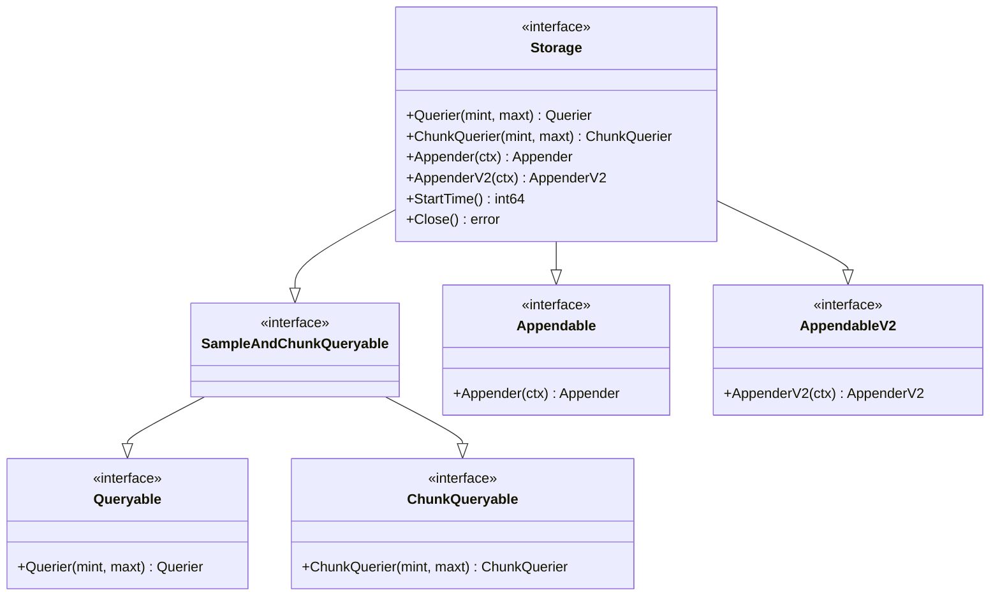
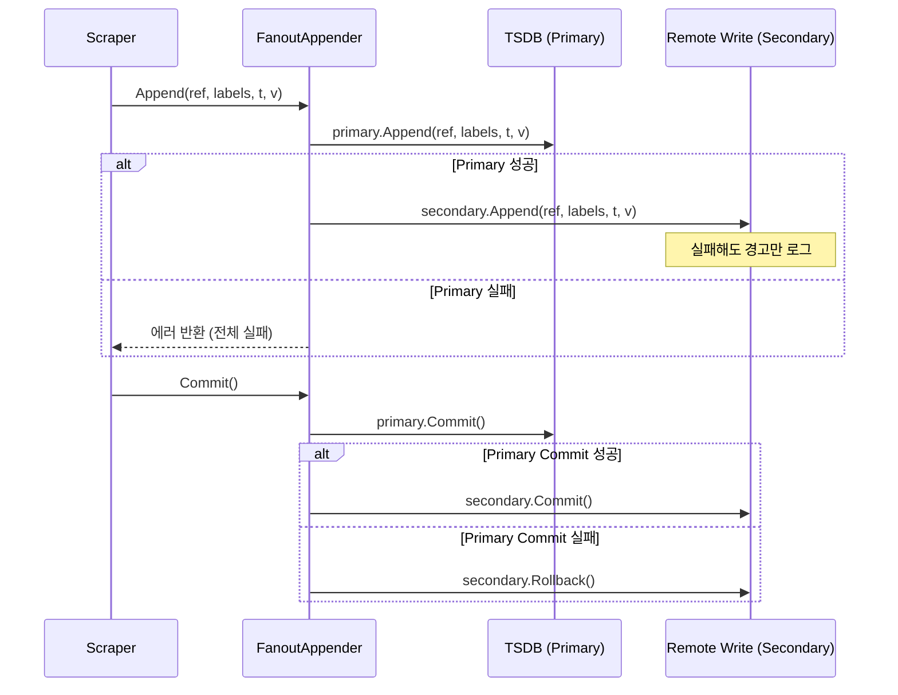
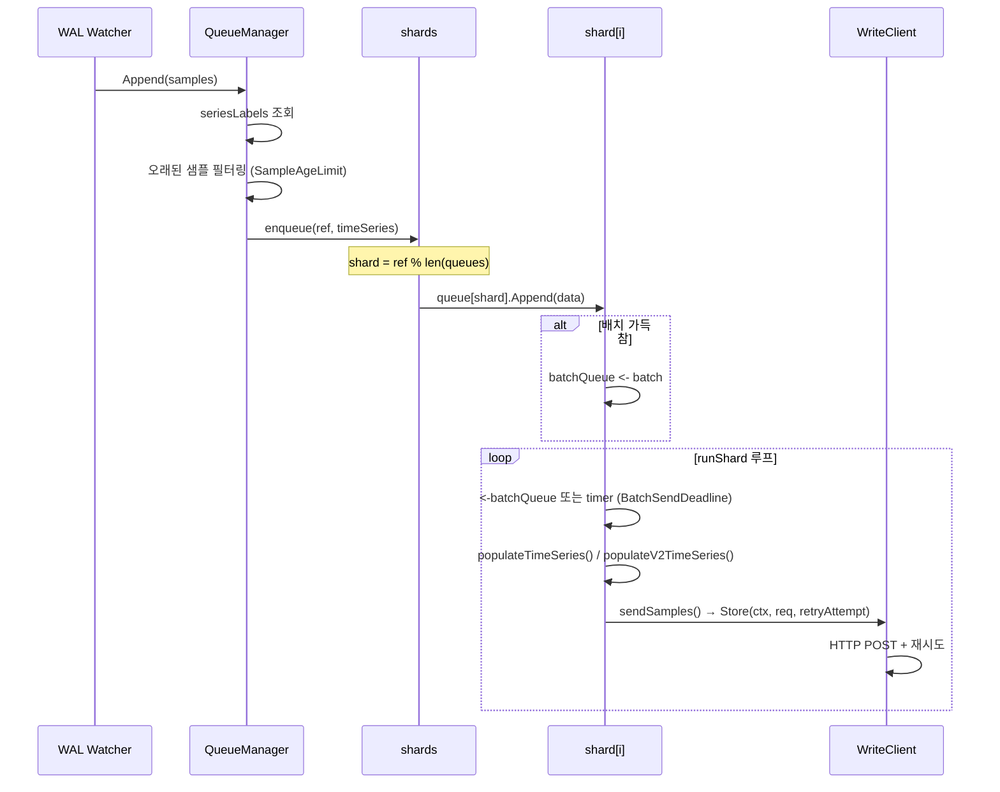

# 16. Remote Storage (원격 저장소)

## 목차

1. [원격 저장소 개요](#1-원격-저장소-개요)
2. [저장소 인터페이스 계층](#2-저장소-인터페이스-계층)
3. [FanoutStorage 상세](#3-fanoutstorage-상세)
4. [Remote Write 아키텍처](#4-remote-write-아키텍처)
5. [Remote Write 프로토콜](#5-remote-write-프로토콜)
6. [Remote Read 아키텍처](#6-remote-read-아키텍처)
7. [QueueManager 상세](#7-queuemanager-상세)
8. [설정 예시 및 튜닝](#8-설정-예시-및-튜닝)
9. [호환 가능한 원격 저장소](#9-호환-가능한-원격-저장소)
10. [운영 메트릭 및 모니터링](#10-운영-메트릭-및-모니터링)

---

## 1. 원격 저장소 개요

### 1.1 왜 Remote Write/Read인가

Prometheus의 로컬 TSDB는 단일 노드에서 매우 효율적인 시계열 저장소이지만, 다음과 같은 한계를 가진다.

| 한계 | 설명 |
|------|------|
| **장기 저장** | 로컬 디스크 용량에 의존, 수개월~수년 보존 어려움 |
| **글로벌 뷰** | 여러 Prometheus 인스턴스의 데이터를 통합 쿼리 불가 |
| **고가용성** | 단일 노드 장애 시 데이터 유실 위험 |
| **수평 확장** | 단일 인스턴스의 수집/저장 용량에 제한 |

Remote Write와 Remote Read는 이 한계를 해결하기 위한 Prometheus의 핵심 기능이다.

```
┌──────────────────────────────────────────────────────┐
│                  Prometheus 인스턴스                    │
│                                                      │
│  ┌──────────┐    ┌───────────┐    ┌───────────────┐  │
│  │ Scraper  │───>│ 로컬 TSDB │    │ Remote Write  │  │
│  └──────────┘    │ (primary) │    │ (secondary)   │  │
│                  └───────────┘    └───────┬───────┘  │
│                                          │          │
│                  ┌───────────┐            │          │
│                  │Remote Read│<───────────┤          │
│                  └───────────┘            │          │
└──────────────────────────────┬───────────┘          │
                               │                      │
                     ┌─────────▼──────────┐            │
                     │  원격 저장소        │            │
                     │  (Thanos, Mimir,   │<───────────┘
                     │   VictoriaMetrics) │
                     └────────────────────┘
```

### 1.2 Remote Write vs Remote Read

| 구분 | Remote Write | Remote Read |
|------|-------------|-------------|
| **방향** | Prometheus -> 원격 저장소 | 원격 저장소 -> Prometheus |
| **목적** | 데이터 복제/장기 저장 | 장기 데이터 조회 |
| **트리거** | WAL 기반 자동 전송 | PromQL 쿼리 시 자동 호출 |
| **프로토콜** | HTTP POST + Protobuf + Snappy | HTTP POST + Protobuf + Snappy |
| **신뢰성** | WAL 기반 재시도, 지수 백오프 | 쿼리 실패 시 에러 반환 |

---

## 2. 저장소 인터페이스 계층

Prometheus의 저장소 계층은 인터페이스 기반으로 설계되어 있으며, 소스 파일 `storage/interface.go`에 정의된다.

### 2.1 핵심 인터페이스 계층도



### 2.2 Storage 인터페이스

`storage/interface.go`에 정의된 `Storage` 인터페이스는 Prometheus 저장소의 최상위 추상화이다.

```go
// storage/interface.go
type Storage interface {
    SampleAndChunkQueryable
    Appendable
    AppendableV2
    StartTime() (int64, error)
    Close() error
}
```

이 인터페이스를 구현하는 주요 구현체:

| 구현체 | 패키지 | 역할 |
|--------|--------|------|
| `fanout` | `storage/fanout.go` | primary(TSDB) + secondaries(remote) 통합 |
| TSDB | `tsdb/` | 로컬 시계열 데이터베이스 |
| `WriteStorage` | `storage/remote/write.go` | 원격 쓰기 저장소 |
| `sampleAndChunkQueryableClient` | `storage/remote/read.go` | 원격 읽기 클라이언트 |

### 2.3 Querier 인터페이스

```go
// storage/interface.go
type Querier interface {
    LabelQuerier
    Select(ctx context.Context, sortSeries bool, hints *SelectHints,
           matchers ...*labels.Matcher) SeriesSet
}
```

`Select` 메서드는 라벨 매처를 받아 `SeriesSet`을 반환한다. `SelectHints`를 통해 쿼리 최적화 힌트(시간 범위, step, 함수, 그루핑 등)를 전달할 수 있다.

### 2.4 Appender 인터페이스

```go
// storage/interface.go (Appender - v1, 곧 deprecated 예정)
type Appender interface {
    AppenderTransaction
    Append(ref SeriesRef, l labels.Labels, t int64, v float64) (SeriesRef, error)
    SetOptions(opts *AppendOptions)
    ExemplarAppender
    HistogramAppender
    MetadataUpdater
    StartTimestampAppender
}
```

`AppenderV2`는 이를 대체할 새로운 인터페이스로 전환 중이며(ETA: Q2 2026), 하나의 `Append` 호출에서 float 샘플, 히스토그램, exemplar를 모두 처리한다.

### 2.5 SeriesSet과 Series

```go
// storage/interface.go
type SeriesSet interface {
    Next() bool
    At() Series
    Err() error
    Warnings() annotations.Annotations
}

type Series interface {
    Labels
    SampleIterable
}
```

`SeriesSet`은 이터레이터 패턴을 사용한다. `Next()`로 다음 시리즈로 이동하고, `At()`으로 현재 시리즈를 가져온다.

---

## 3. FanoutStorage 상세

### 3.1 FanoutStorage란

`FanoutStorage`는 Prometheus의 핵심 저장소 통합 계층이다. `storage/fanout.go`에 정의되며, 하나의 primary 저장소(TSDB)와 여러 secondary 저장소(원격 저장소)를 통합한다.

```go
// storage/fanout.go
type fanout struct {
    logger      *slog.Logger
    primary     Storage      // 로컬 TSDB
    secondaries []Storage    // 원격 저장소들
}

func NewFanout(logger *slog.Logger, primary Storage, secondaries ...Storage) Storage {
    return &fanout{
        logger:      logger,
        primary:     primary,
        secondaries: secondaries,
    }
}
```

### 3.2 쓰기 경로: 모든 저장소에 팬아웃



실제 코드를 보면 `fanoutAppender.Commit()`:

```go
// storage/fanout.go
func (f *fanoutAppender) Commit() (err error) {
    err = f.primary.Commit()
    for _, appender := range f.secondaries {
        if err == nil {
            err = appender.Commit()
        } else {
            if rollbackErr := appender.Rollback(); rollbackErr != nil {
                f.logger.Error("Squashed rollback error on commit", "err", rollbackErr)
            }
        }
    }
    return err
}
```

**핵심 설계 원칙:**
- primary 실패 = 전체 실패 (secondary들은 롤백)
- secondary 실패 = 경고만 (primary 성공은 유지)

### 3.3 읽기 경로: MergeQuerier로 병합

```go
// storage/fanout.go
func (f *fanout) Querier(mint, maxt int64) (Querier, error) {
    primary, err := f.primary.Querier(mint, maxt)
    if err != nil {
        return nil, err  // primary 실패 = 전체 실패
    }

    secondaries := make([]Querier, 0, len(f.secondaries))
    for _, storage := range f.secondaries {
        querier, err := storage.Querier(mint, maxt)
        if err != nil {
            // secondary 실패 시 모든 열린 querier 닫고 에러 반환
            errs := []error{err, primary.Close()}
            for _, q := range secondaries {
                errs = append(errs, q.Close())
            }
            return nil, errors.Join(errs...)
        }
        if _, ok := querier.(noopQuerier); !ok {
            secondaries = append(secondaries, querier)
        }
    }
    return NewMergeQuerier([]Querier{primary}, secondaries,
                           ChainedSeriesMerge), nil
}
```

`MergeQuerier`는 primary와 secondary의 결과를 병합한다. secondary에서 에러가 발생하면 해당 결과만 버리고 경고로 처리한다.

### 3.4 StartTime: 가장 이른 시작 시간

```go
// storage/fanout.go
func (f *fanout) StartTime() (int64, error) {
    firstTime, err := f.primary.StartTime()
    if err != nil {
        return int64(model.Latest), err
    }
    for _, s := range f.secondaries {
        t, err := s.StartTime()
        if err != nil {
            return int64(model.Latest), err
        }
        if t < firstTime {
            firstTime = t
        }
    }
    return firstTime, nil
}
```

모든 저장소의 StartTime 중 가장 이른 시간을 반환한다. 이를 통해 Remote Read가 로컬 TSDB보다 더 오래된 데이터에 접근할 수 있다.

---

## 4. Remote Write 아키텍처

### 4.1 전체 아키텍처

```
┌───────────────────────────────────────────────────────────────────┐
│                       WriteStorage                                │
│  storage/remote/write.go                                         │
│                                                                   │
│  ┌────────────┐   ┌─────────────────────────────────────────┐    │
│  │ ewmaRate   │   │ QueueManager (per remote_write target)  │    │
│  │ samplesIn  │   │                                         │    │
│  └────────────┘   │  ┌─────────────────────────────────┐    │    │
│                   │  │ WAL Watcher                      │    │    │
│  ┌────────────┐   │  │  - WAL 세그먼트 감시             │    │    │
│  │ interner   │   │  │  - 샘플/시리즈/메타데이터 읽기   │    │    │
│  │ (pool)     │   │  └──────────────┬──────────────────┘    │    │
│  └────────────┘   │                 │                       │    │
│                   │  ┌──────────────▼──────────────────┐    │    │
│                   │  │ shards (동적 조절)               │    │    │
│                   │  │  ┌─────┐ ┌─────┐     ┌─────┐   │    │    │
│                   │  │  │shard│ │shard│ ... │shard│   │    │    │
│                   │  │  │  0  │ │  1  │     │  N  │   │    │    │
│                   │  │  └──┬──┘ └──┬──┘     └──┬──┘   │    │    │
│                   │  └─────┼───────┼───────────┼──────┘    │    │
│                   │        │       │           │           │    │
│                   │  ┌─────▼───────▼───────────▼──────┐    │    │
│                   │  │ WriteClient (HTTP POST)        │    │    │
│                   │  │  - Protobuf 직렬화              │    │    │
│                   │  │  - Snappy 압축                  │    │    │
│                   │  │  - 재시도 + 지수 백오프          │    │    │
│                   │  └────────────────────────────────┘    │    │
│                   └─────────────────────────────────────────┘    │
└───────────────────────────────────────────────────────────────────┘
```

### 4.2 WriteStorage 구조체

`storage/remote/write.go`에 정의된 `WriteStorage`는 모든 원격 쓰기 저장소를 관리한다.

```go
// storage/remote/write.go
type WriteStorage struct {
    logger *slog.Logger
    reg    prometheus.Registerer
    mtx    sync.Mutex

    watcherMetrics    *wlog.WatcherMetrics
    liveReaderMetrics *wlog.LiveReaderMetrics
    externalLabels    labels.Labels
    dir               string
    queues            map[string]*QueueManager  // hash -> QueueManager
    samplesIn         *ewmaRate
    flushDeadline     time.Duration
    interner          *pool
    scraper           ReadyScrapeManager
    quit              chan struct{}
    recordBuf         *record.BuffersPool
    highestTimestamp   *maxTimestamp
    enableTypeAndUnitLabels bool
}
```

주요 필드:
- `queues`: 설정 해시를 키로 하는 QueueManager 맵. 각 `remote_write` 타겟마다 하나의 QueueManager 생성
- `samplesIn`: EWMA(지수가중이동평균) 기반 샘플 수신 속도 추적
- `interner`: 라벨 문자열 중복 제거를 위한 풀
- `highestTimestamp`: 수신한 가장 최신 타임스탬프 추적

### 4.3 ApplyConfig: 설정 변경 시 큐 재생성

`WriteStorage.ApplyConfig()`은 설정이 변경될 때 호출된다. 핵심 로직:

1. 각 `remote_write` 설정을 해시하여 고유 식별자 생성
2. 기존 큐와 비교하여 변경된 것만 재생성
3. 외부 라벨이 변경되지 않고 해시가 같으면 기존 큐 재사용 (클라이언트만 업데이트)
4. 제거된 큐는 `Stop()` 호출
5. 새 큐는 `Start()` 호출

```go
// storage/remote/write.go - ApplyConfig 핵심 흐름
func (rws *WriteStorage) ApplyConfig(conf *config.Config) error {
    rws.mtx.Lock()
    defer rws.mtx.Unlock()

    externalLabelUnchanged := labels.Equal(conf.GlobalConfig.ExternalLabels, rws.externalLabels)

    newQueues := make(map[string]*QueueManager)
    newHashes := []string{}
    for _, rwConf := range conf.RemoteWriteConfigs {
        hash, err := toHash(rwConf)
        // ... 중복 체크 ...

        c, err := NewWriteClient(name, &ClientConfig{...})
        // ... 에러 처리 ...

        queue, ok := rws.queues[hash]
        if externalLabelUnchanged && ok {
            queue.SetClient(c)  // 클라이언트만 업데이트
            newQueues[hash] = queue
            delete(rws.queues, hash)
            continue
        }
        // 새 QueueManager 생성
        newQueues[hash] = NewQueueManager(...)
        newHashes = append(newHashes, hash)
    }

    // 변경/제거된 큐 정지
    for _, q := range rws.queues {
        q.Stop()
    }
    // 새 큐 시작
    for _, hash := range newHashes {
        newQueues[hash].Start()
    }
    rws.queues = newQueues
    return nil
}
```

### 4.4 timestampTracker: Appender 어댑터

`WriteStorage`는 `Appender()` / `AppenderV2()` 호출 시 `timestampTracker`를 반환한다. 이 tracker는 실제로 데이터를 저장하지 않고, 수신된 샘플 수와 최고 타임스탬프만 추적한다.

```go
// storage/remote/write.go
func (rws *WriteStorage) Appender(context.Context) storage.Appender {
    return &timestampTracker{
        baseTimestampTracker: baseTimestampTracker{
            writeStorage:         rws,
            highestRecvTimestamp: rws.highestTimestamp,
        },
    }
}
```

`Commit()` 시 EWMA 레이트에 샘플 수를 반영:

```go
func (t *baseTimestampTracker) Commit() error {
    t.writeStorage.samplesIn.incr(t.samples + t.exemplars + t.histograms)
    samplesIn.Add(float64(t.samples))
    exemplarsIn.Add(float64(t.exemplars))
    histogramsIn.Add(float64(t.histograms))
    t.highestRecvTimestamp.Set(float64(t.highestTimestamp / 1000))
    return nil
}
```

**왜 이런 설계인가?** 실제 원격 전송은 WAL Watcher가 비동기로 처리한다. `timestampTracker`는 단지 수신 속도를 추적하여 샤드 수 동적 조절에 활용하기 위한 것이다.

### 4.5 WAL 기반 신뢰성

Remote Write의 데이터 소스는 WAL(Write-Ahead Log)이다.

```
┌─────────┐        ┌─────────┐        ┌──────────────┐
│ Scraper │──WAL──>│   WAL   │──읽기──>│ WAL Watcher  │
│         │  쓰기  │ segments│        │              │
└─────────┘        └─────────┘        └──────┬───────┘
                                             │
                                    ┌────────▼────────┐
                                    │  QueueManager   │
                                    │  .Append()      │
                                    └────────┬────────┘
                                             │
                                    ┌────────▼────────┐
                                    │  shards         │
                                    │  → HTTP POST    │
                                    └─────────────────┘
```

WAL 기반의 장점:
1. **재시작 복구**: Prometheus가 재시작되어도 WAL에서 미전송 데이터를 재전송
2. **배압(backpressure) 처리**: 원격 저장소가 느려도 WAL이 버퍼 역할
3. **중복 제거**: WAL의 체크포인트 메커니즘으로 이미 전송된 데이터 건너뜀

---

## 5. Remote Write 프로토콜

### 5.1 프로토콜 버전

Prometheus는 두 가지 Remote Write 프로토콜 버전을 지원한다.

| 항목 | v1 (WriteRequest) | v2 (Request) |
|------|-------------------|--------------|
| **proto 패키지** | `prometheus` | `io.prometheus.write.v2` |
| **소스 파일** | `prompb/remote.proto` | `prompb/io/prometheus/write/v2/types.proto` |
| **라벨 인코딩** | 문자열 직접 포함 | 심볼 테이블 참조 (인덱스) |
| **메타데이터** | 별도 배치 전송 | TimeSeries에 인라인 포함 |
| **Content-Type** | `application/x-protobuf` | `application/x-protobuf;proto=io.prometheus.write.v2.Request` |
| **버전 헤더** | `0.1.0` | `2.0.0` |

### 5.2 v1 WriteRequest (prompb/remote.proto)

```protobuf
// prompb/remote.proto
message WriteRequest {
  repeated prometheus.TimeSeries timeseries = 1;
  reserved 2;  // Cortex 호환성 예약
  repeated prometheus.MetricMetadata metadata = 3;
}

// prompb/types.proto
message TimeSeries {
  repeated Label labels         = 1;
  repeated Sample samples       = 2;
  repeated Exemplar exemplars   = 3;
  repeated Histogram histograms = 4;
}

message Sample {
  double value    = 1;
  int64 timestamp = 2;  // 밀리초
}

message Label {
  string name  = 1;
  string value = 2;
}
```

v1의 구조적 특징:
- 각 TimeSeries마다 라벨 문자열을 직접 포함 → 중복이 많음
- 메타데이터는 별도 `MetricMetadata` 배열로 전송

### 5.3 v2 Request (io.prometheus.write.v2)

```protobuf
// prompb/io/prometheus/write/v2/types.proto
message Request {
  reserved 1 to 3;  // v1과의 호환성을 위해 예약
  repeated string symbols = 4;       // 심볼 테이블
  repeated TimeSeries timeseries = 5;
}

message TimeSeries {
  repeated uint32 labels_refs = 1;   // symbols 배열 인덱스 (항상 짝수 개)
  repeated Sample samples = 2;
  repeated Histogram histograms = 3;
  repeated Exemplar exemplars = 4;
  Metadata metadata = 5;             // 인라인 메타데이터
}

message Sample {
  double value = 1;
  int64 timestamp = 2;
  int64 start_timestamp = 3;         // v2 신규: 시작 타임스탬프
}

message Metadata {
  MetricType type = 1;
  uint32 help_ref = 3;               // symbols 배열 참조
  uint32 unit_ref = 4;               // symbols 배열 참조
}
```

v2의 핵심 개선:
1. **심볼 테이블**: 라벨 이름과 값을 중복 제거하여 크기 감소
2. **인라인 메타데이터**: 각 TimeSeries에 메타데이터 포함, 별도 전송 불필요
3. **시작 타임스탬프**: 카운터/히스토그램의 정확한 rate 계산 지원
4. **reserved 1-3**: v1 메시지와의 비결정적 상호운용 방지

### 5.4 압축 및 HTTP 전송

```go
// storage/remote/client.go
const (
    RemoteWriteVersionHeader        = "X-Prometheus-Remote-Write-Version"
    RemoteWriteVersion1HeaderValue  = "0.1.0"
    RemoteWriteVersion20HeaderValue = "2.0.0"
    appProtoContentType             = "application/x-protobuf"
)
```

전송 과정:

```
TimeSeries 데이터
    │
    ▼
Protobuf 직렬화 (proto.Marshal)
    │
    ▼
Snappy 압축 (현재 하드코딩)
    │
    ▼
HTTP POST 요청
    │  Headers:
    │    Content-Encoding: snappy
    │    Content-Type: application/x-protobuf[;proto=...]
    │    X-Prometheus-Remote-Write-Version: 0.1.0 | 2.0.0
    │    User-Agent: Prometheus/<version>
    │    Retry-Attempt: <N> (재시도 시)
    │
    ▼
원격 저장소
```

실제 `Client.Store()` 코드에서:

```go
// storage/remote/client.go
func (c *Client) Store(ctx context.Context, req []byte, attempt int) (WriteResponseStats, error) {
    httpReq, err := http.NewRequest(http.MethodPost, c.urlString, bytes.NewReader(req))
    httpReq.Header.Add("Content-Encoding", string(c.writeCompression))
    httpReq.Header.Set("Content-Type", remoteWriteContentTypeHeaders[c.writeProtoMsg])
    httpReq.Header.Set("User-Agent", UserAgent)
    if c.writeProtoMsg == remoteapi.WriteV1MessageType {
        httpReq.Header.Set(RemoteWriteVersionHeader, RemoteWriteVersion1HeaderValue)
    } else {
        httpReq.Header.Set(RemoteWriteVersionHeader, RemoteWriteVersion20HeaderValue)
    }
    // ...
}
```

### 5.5 재시도 전략

```go
// storage/remote/client.go - Store() 에러 처리
if httpResp.StatusCode/100 == 5 ||
    (c.retryOnRateLimit && httpResp.StatusCode == http.StatusTooManyRequests) {
    return rs, RecoverableError{err, retryAfterDuration(httpResp.Header.Get("Retry-After"))}
}
return rs, err  // 4xx (429 제외) → 비복구 에러, 재시도 안 함
```

| HTTP 상태 | 처리 |
|-----------|------|
| 2xx | 성공 |
| 5xx | 복구 가능 에러 → 지수 백오프 재시도 |
| 429 (Rate Limit) | `retry_on_http_429: true` 설정 시 재시도 |
| 기타 4xx | 비복구 에러 → 드롭 |

재시도 시 `Retry-After` 헤더를 존중한다:

```go
func retryAfterDuration(t string) model.Duration {
    parsedDuration, err := time.Parse(http.TimeFormat, t)
    if err == nil {
        s := time.Until(parsedDuration).Seconds()
        return model.Duration(s) * model.Duration(time.Second)
    }
    d, err := strconv.Atoi(t)
    if err != nil {
        return defaultBackoff
    }
    return model.Duration(d) * model.Duration(time.Second)
}
```

---

## 6. Remote Read 아키텍처

### 6.1 sampleAndChunkQueryableClient

`storage/remote/read.go`에 정의된 `sampleAndChunkQueryableClient`는 원격 읽기의 핵심 구현체이다.

```go
// storage/remote/read.go
type sampleAndChunkQueryableClient struct {
    client           ReadClient
    externalLabels   labels.Labels
    requiredMatchers []*labels.Matcher
    readRecent       bool
    callback         startTimeCallback
}
```

주요 필드:
- `client`: HTTP 기반 원격 읽기 클라이언트
- `externalLabels`: 쿼리에 자동 추가할 외부 라벨
- `requiredMatchers`: 이 매처가 충족되지 않으면 NoopSeriesSet 반환
- `readRecent`: `true`면 로컬 TSDB와 겹치는 최근 데이터도 읽기
- `callback`: 로컬 TSDB의 시작 시간을 가져오는 콜백

### 6.2 로컬 저장소 우선 전략

```go
// storage/remote/read.go
func (c *sampleAndChunkQueryableClient) preferLocalStorage(mint, maxt int64) (cmaxt int64, noop bool, err error) {
    localStartTime, err := c.callback()
    if err != nil {
        return 0, false, err
    }
    cmaxt = maxt
    // 쿼리 시작 시간이 로컬 TSDB 시작 시간보다 이후면 → noop (로컬에서 처리)
    if mint > localStartTime {
        return 0, true, nil
    }
    // 쿼리 종료 시간이 로컬 TSDB 시작 시간보다 이후면 → 종료 시간을 로컬 시작으로 줄임
    if maxt > localStartTime {
        cmaxt = localStartTime
    }
    return cmaxt, false, nil
}
```

이 로직의 의미:

```
시간축 ──────────────────────────────────────────>
                      │
         원격 읽기    │    로컬 TSDB
    ◄────────────────►│◄──────────────────────►
                      │
            localStartTime

쿼리 A: [a ──── b]   → 완전히 원격
쿼리 B: [c ──── d]   → d를 localStartTime으로 조정
쿼리 C:        [e ── f] → noop (로컬에서 완전히 처리)
```

`readRecent: true`로 설정하면 이 최적화를 건너뛰고, 항상 원격에서도 읽는다.

### 6.3 외부 라벨 처리

원격 읽기 시 외부 라벨을 쿼리에 자동 추가하고, 결과에서 제거한다.

```go
// storage/remote/read.go
func (q *querier) Select(ctx context.Context, sortSeries bool, hints *SelectHints,
                          matchers ...*labels.Matcher) SeriesSet {
    // 1. requiredMatchers 체크
    if len(q.requiredMatchers) > 0 {
        // ... 매칭 확인 ...
        if len(requiredMatchers) > 0 {
            return storage.NoopSeriesSet()  // 필수 매처 불충족
        }
    }

    // 2. 외부 라벨을 매처에 추가
    m, added := q.addExternalLabels(matchers)

    // 3. 원격 쿼리 실행
    query, err := ToQuery(q.mint, q.maxt, m, hints)
    res, err := q.client.Read(ctx, query, sortSeries)

    // 4. 결과에서 외부 라벨 제거 (사용자에게 투명하게)
    return newSeriesSetFilter(res, added)
}
```

### 6.4 읽기 응답 유형

`prompb/remote.proto`에 정의된 두 가지 응답 유형:

```protobuf
// prompb/remote.proto
message ReadRequest {
  repeated Query queries = 1;
  enum ResponseType {
    SAMPLES = 0;              // 전통적 방식: 전체 응답을 한 번에
    STREAMED_XOR_CHUNKS = 1;  // 스트리밍: 청크 단위로 응답
  }
  repeated ResponseType accepted_response_types = 2;
}
```

| 응답 유형 | Content-Type | 특징 |
|-----------|-------------|------|
| `SAMPLES` | `application/x-protobuf` (Snappy) | 전체 응답을 한 번에 반환, 메모리 사용 큼 |
| `STREAMED_XOR_CHUNKS` | `application/x-streamed-protobuf` | 시리즈별 스트리밍, 메모리 효율적 |

Prometheus 클라이언트는 `STREAMED_XOR_CHUNKS`를 우선 요청한다:

```go
// storage/remote/client.go
AcceptedResponseTypes = []prompb.ReadRequest_ResponseType{
    prompb.ReadRequest_STREAMED_XOR_CHUNKS,
    prompb.ReadRequest_SAMPLES,
}
```

### 6.5 ReadRequest 구조

```protobuf
message Query {
  int64 start_timestamp_ms = 1;
  int64 end_timestamp_ms = 2;
  repeated prometheus.LabelMatcher matchers = 3;
  prometheus.ReadHints hints = 4;
}

message ReadHints {
  int64 step_ms = 1;
  string func = 2;
  int64 start_ms = 3;
  int64 end_ms = 4;
  repeated string grouping = 5;
  bool by = 6;
  int64 range_ms = 7;
}
```

`ReadHints`를 통해 PromQL 컨텍스트 정보를 원격 저장소에 전달한다. 이를 활용하면 원격 저장소가 서버 사이드 다운샘플링이나 필터링을 수행할 수 있다.

---

## 7. QueueManager 상세

### 7.1 QueueManager 구조체

`storage/remote/queue_manager.go`에 정의된 `QueueManager`는 원격 쓰기의 핵심 엔진이다.

```go
// storage/remote/queue_manager.go
type QueueManager struct {
    lastSendTimestamp            atomic.Int64
    buildRequestLimitTimestamp   atomic.Int64
    reshardDisableStartTimestamp atomic.Int64
    reshardDisableEndTimestamp   atomic.Int64

    logger               *slog.Logger
    flushDeadline        time.Duration
    cfg                  config.QueueConfig
    mcfg                 config.MetadataConfig
    externalLabels       []labels.Label
    relabelConfigs       []*relabel.Config
    sendExemplars        bool
    sendNativeHistograms bool
    watcher              *wlog.Watcher        // WAL 감시자
    metadataWatcher      *MetadataWatcher

    clientMtx   sync.RWMutex
    storeClient WriteClient
    protoMsg    remoteapi.WriteMessageType
    compr       compression.Type              // 현재 Snappy 하드코딩

    seriesLabels   map[chunks.HeadSeriesRef]labels.Labels
    seriesMetadata map[chunks.HeadSeriesRef]*metadata.Metadata
    droppedSeries  map[chunks.HeadSeriesRef]struct{}

    shards      *shards
    numShards   int
    reshardChan chan int
    quit        chan struct{}

    dataIn, dataDropped, dataOut, dataOutDuration *ewmaRate

    metrics              *queueManagerMetrics
    interner             *pool
    highestRecvTimestamp *maxTimestamp
}
```

### 7.2 shards 구조체

```go
// storage/remote/queue_manager.go
type shards struct {
    mtx    sync.RWMutex
    qm     *QueueManager
    queues []*queue

    enqueuedSamples    atomic.Int64
    enqueuedExemplars  atomic.Int64
    enqueuedHistograms atomic.Int64

    done         chan struct{}
    running      atomic.Int32
    softShutdown chan struct{}
    hardShutdown context.CancelFunc

    samplesDroppedOnHardShutdown    atomic.Uint32
    exemplarsDroppedOnHardShutdown  atomic.Uint32
    histogramsDroppedOnHardShutdown atomic.Uint32
    metadataDroppedOnHardShutdown   atomic.Uint32
}
```

### 7.3 데이터 흐름: Append -> enqueue -> runShard -> Store



### 7.4 샤드 동적 조절: calculateDesiredShards()

샤드 수는 10초마다(`shardUpdateDuration`) 재계산된다.

```go
// storage/remote/queue_manager.go
func (t *QueueManager) calculateDesiredShards() int {
    t.dataOut.tick()
    t.dataDropped.tick()
    t.dataOutDuration.tick()

    var (
        dataInRate      = t.dataIn.rate()         // 수신 속도
        dataOutRate     = t.dataOut.rate()         // 전송 속도
        dataKeptRatio   = dataOutRate / (t.dataDropped.rate() + dataOutRate)
        dataOutDuration = t.dataOutDuration.rate() / float64(time.Second)
        dataPendingRate = dataInRate*dataKeptRatio - dataOutRate
        highestSent     = t.metrics.highestSentTimestamp.Get()
        highestRecv     = t.highestRecvTimestamp.Get()
        delay           = highestRecv - highestSent    // 전송 지연
        dataPending     = delay * dataInRate * dataKeptRatio
    )

    if dataOutRate <= 0 {
        return t.numShards  // 전송 데이터 없으면 현상 유지
    }

    var (
        backlogCatchup = 0.05 * dataPending           // 밀린 데이터의 5%씩 따라잡기
        timePerSample  = dataOutDuration / dataOutRate // 샘플당 소요 시간
        desiredShards  = timePerSample * (dataInRate*dataKeptRatio + backlogCatchup)
    )

    // 허용 범위 (±30%) 내면 현상 유지
    lowerBound := float64(t.numShards) * (1. - shardToleranceFraction)
    upperBound := float64(t.numShards) * (1. + shardToleranceFraction)
    desiredShards = math.Ceil(desiredShards)
    if lowerBound <= desiredShards && desiredShards <= upperBound {
        return t.numShards
    }

    numShards := int(desiredShards)
    // 10초 이상 뒤처지면 다운샤딩 금지
    if numShards < t.numShards && delay > 10.0 {
        return t.numShards
    }

    // 범위 클램핑: [MinShards, MaxShards]
    switch {
    case numShards > t.cfg.MaxShards:
        numShards = t.cfg.MaxShards
    case numShards < t.cfg.MinShards:
        numShards = t.cfg.MinShards
    }
    return numShards
}
```

**핵심 공식:**

```
desiredShards = timePerSample * (dataInRate * dataKeptRatio + 0.05 * dataPending)
```

이 공식의 의미:
1. `timePerSample`: 원격 저장소가 샘플 하나를 처리하는 데 걸리는 평균 시간
2. `dataInRate * dataKeptRatio`: 실제로 전송해야 할 초당 샘플 수
3. `0.05 * dataPending`: 밀린 데이터를 5%씩 추가로 따라잡기
4. 결과: 필요한 병렬 전송 채널 수

### 7.5 shouldReshard: 리샤딩 조건

```go
func (t *QueueManager) shouldReshard(desiredShards int) bool {
    if desiredShards == t.numShards {
        return false  // 변경 없으면 스킵
    }
    // 마지막 성공 전송이 10초 이내인지 확인
    minSendTimestamp := time.Now().Add(-1 * shardUpdateDuration).Unix()
    lsts := t.lastSendTimestamp.Load()
    if lsts < minSendTimestamp {
        return false  // 전송 실패 중이면 리샤딩 스킵
    }
    // 복구 가능 에러로 인한 리샤딩 비활성화 기간 확인
    if disableTimestamp := t.reshardDisableEndTimestamp.Load(); time.Now().Unix() < disableTimestamp {
        return false  // 비활성화 기간이면 스킵
    }
    return true
}
```

### 7.6 리샤딩 프로세스

```go
func (t *QueueManager) reshardLoop() {
    defer t.wg.Done()
    for {
        select {
        case numShards := <-t.reshardChan:
            t.shards.stop()          // 기존 샤드 정지 및 플러시
            t.shards.start(numShards) // 새 샤드 시작
        case <-t.quit:
            return
        }
    }
}
```

리샤딩 시 기존 샤드를 완전히 플러시한 후 새 샤드를 시작한다. 이는 **순서 보장**을 위한 설계이다.

### 7.7 enqueue: 시리즈 참조 기반 샤딩

```go
// storage/remote/queue_manager.go
func (s *shards) enqueue(ref chunks.HeadSeriesRef, data timeSeries) bool {
    s.mtx.RLock()
    defer s.mtx.RUnlock()
    shard := uint64(ref) % uint64(len(s.queues))  // 해시 기반 샤드 배정
    select {
    case <-s.softShutdown:
        return false
    default:
        appended := s.queues[shard].Append(data)
        if !appended {
            return false
        }
        // 메트릭 업데이트 ...
        return true
    }
}
```

같은 시리즈(같은 `ref`)는 항상 같은 샤드로 라우팅된다. 이는 시리즈 내 순서 보장을 보장한다.

### 7.8 runShard: 배치 전송 루프

각 샤드는 goroutine에서 `runShard`를 실행한다.

```go
func (s *shards) runShard(ctx context.Context, shardID int, queue *queue) {
    // ...
    batchQueue := queue.Chan()
    timer := time.NewTimer(time.Duration(s.qm.cfg.BatchSendDeadline))

    for {
        select {
        case <-ctx.Done():
            // Hard shutdown: 모든 미전송 데이터 드롭
            return

        case batch, ok := <-batchQueue:
            if !ok { return }
            sendBatch(batch, s.qm.protoMsg, s.qm.compr, false)
            queue.ReturnForReuse(batch)
            timer.Reset(time.Duration(s.qm.cfg.BatchSendDeadline))

        case <-timer.C:
            // BatchSendDeadline 만료: 부분 배치도 전송
            batch := queue.Batch()
            if len(batch) > 0 {
                sendBatch(batch, s.qm.protoMsg, s.qm.compr, true)
            }
            queue.ReturnForReuse(batch)
            timer.Reset(time.Duration(s.qm.cfg.BatchSendDeadline))
        }
    }
}
```

배치 전송의 두 가지 트리거:
1. **배치 가득 참**: `MaxSamplesPerSend`에 도달
2. **타이머 만료**: `BatchSendDeadline`(기본 5초) 경과

### 7.9 sendWriteRequestWithBackoff: 지수 백오프

```go
func (t *QueueManager) sendWriteRequestWithBackoff(ctx context.Context,
    attempt func(int) error, onRetry func()) error {
    backoff := t.cfg.MinBackoff        // 기본 30ms
    sleepDuration := model.Duration(0)
    try := 0

    for {
        select {
        case <-ctx.Done():
            return ctx.Err()
        default:
        }

        err := attempt(try)
        if err == nil {
            return nil
        }

        var backoffErr RecoverableError
        if !errors.As(err, &backoffErr) {
            return err  // 비복구 에러 → 즉시 반환
        }

        sleepDuration = backoff
        if backoffErr.retryAfter > 0 {
            sleepDuration = backoffErr.retryAfter  // Retry-After 존중
        }

        // 복구 가능 에러 동안 리샤딩 비활성화
        reshardWaitPeriod := time.Now().Add(time.Duration(sleepDuration) * 2)
        setAtomicToNewer(&t.reshardDisableEndTimestamp, reshardWaitPeriod.Unix())

        select {
        case <-ctx.Done():
        case <-time.After(time.Duration(sleepDuration)):
        }

        onRetry()
        backoff = min(sleepDuration*2, t.cfg.MaxBackoff)  // 지수 증가, 최대 5초
        try++
    }
}
```

**왜 복구 에러 시 리샤딩을 비활성화하는가?** rate limiting(429)이나 서버 과부하(5xx) 상황에서 샤드를 늘리면 더 많은 요청이 발생하여 상황을 악화시킬 수 있다. 따라서 복구 가능 에러가 발생하면 sleep 시간의 2배 동안 리샤딩을 비활성화한다.

### 7.10 queue 구조체: 배치 버퍼링

```go
type queue struct {
    batchMtx   sync.Mutex
    batch      []timeSeries              // 현재 수집 중인 배치
    batchQueue chan []timeSeries          // 전송 대기 배치 큐

    poolMtx   sync.Mutex
    batchPool [][]timeSeries             // 재사용 배치 풀
}
```

`queue`는 이중 버퍼 구조를 사용한다:
1. `batch`: 현재 수집 중인 부분 배치 (크기: `MaxSamplesPerSend`)
2. `batchQueue`: 가득 찬 배치의 채널 (크기: `Capacity / MaxSamplesPerSend`)

```go
func newQueue(batchSize, capacity int) *queue {
    batches := capacity / batchSize
    if batches == 0 {
        batches = 1  // 최소 1개 배치
    }
    return &queue{
        batch:      make([]timeSeries, 0, batchSize),
        batchQueue: make(chan []timeSeries, batches),
        batchPool:  make([][]timeSeries, 0, batches+1),
    }
}
```

### 7.11 종료 처리: softShutdown과 hardShutdown

```go
func (s *shards) stop() {
    // 1단계: Soft shutdown → 새 enqueue 차단
    s.mtx.RLock()
    close(s.softShutdown)
    s.mtx.RUnlock()

    // 2단계: 큐 플러시 시도
    s.mtx.Lock()
    defer s.mtx.Unlock()
    for _, queue := range s.queues {
        go queue.FlushAndShutdown(s.done)
    }

    select {
    case <-s.done:
        return  // 정상 종료
    case <-time.After(s.qm.flushDeadline):
        // 3단계: flushDeadline 초과 → Hard shutdown
    }

    s.hardShutdown()  // HTTP 연결 강제 종료
    <-s.done

    // 드롭된 데이터 로깅
}
```

---

## 8. 설정 예시 및 튜닝

### 8.1 remote_write 기본 설정

```yaml
remote_write:
  - url: "http://remote-storage:9090/api/v1/write"
    # 프로토콜 버전 (기본: prometheus.WriteRequest, v2는 io.prometheus.write.v2.Request)
    protobuf_message: "io.prometheus.write.v2.Request"
    # 타임아웃 (기본: 30s)
    remote_timeout: 30s
    # 이름 (메트릭 라벨용)
    name: "my-remote-storage"
    # 외부 라벨 추가 전 relabeling
    write_relabel_configs:
      - source_labels: [__name__]
        regex: "expensive_metric_.*"
        action: drop
    # Exemplar 전송 여부 (기본: false)
    send_exemplars: true
    # Native Histogram 전송 여부 (기본: false)
    send_native_histograms: true
```

### 8.2 queue_config 상세 설정

```yaml
remote_write:
  - url: "http://remote-storage:9090/api/v1/write"
    queue_config:
      # 큐 용량 (각 샤드당)
      capacity: 10000          # 기본값
      # 배치당 최대 샘플 수
      max_samples_per_send: 2000  # 기본값
      # 배치 전송 기한 (미달 배치도 이 시간 후 전송)
      batch_send_deadline: 5s    # 기본값
      # 샤드 수 범위
      min_shards: 1              # 기본값
      max_shards: 50             # 기본값
      # 재시도 백오프
      min_backoff: 30ms          # 기본값
      max_backoff: 5s            # 기본값
      # 429 상태 코드 재시도 여부
      retry_on_http_429: true    # 기본: false
      # 오래된 샘플 필터링
      sample_age_limit: 0s       # 기본: 0 (비활성화)
```

### 8.3 DefaultQueueConfig 값

`config/config.go`에 정의된 기본값:

```go
// config/config.go
DefaultQueueConfig = QueueConfig{
    MaxShards:         50,
    MinShards:         1,
    MaxSamplesPerSend: 2000,
    Capacity:          10000,
    BatchSendDeadline: model.Duration(5 * time.Second),
    MinBackoff:        model.Duration(30 * time.Millisecond),
    MaxBackoff:        model.Duration(5 * time.Second),
}
```

**용량 계산 예시:**
- MaxShards=50, MaxSamplesPerSend=2000, 평균 전송 시간=100ms
- 이론적 최대 처리량: 50 * 2000 / 0.1 = **1,000,000 samples/sec**
- 각 샤드 버퍼: Capacity=10000, 배치=5개(10000/2000)
- 총 버퍼: 50 * 10000 = 500,000 samples

### 8.4 remote_read 설정

```yaml
remote_read:
  - url: "http://remote-storage:9090/api/v1/read"
    # 이름 (메트릭 라벨용)
    name: "long-term-storage"
    # 최근 데이터도 원격에서 읽을지 여부
    read_recent: false           # 기본: false (로컬 TSDB 우선)
    # 타임아웃
    remote_timeout: 1m
    # 필수 매처 (이 라벨이 있는 쿼리만 원격으로 전달)
    required_matchers:
      cluster: "production"
    # HTTP 클라이언트 설정
    tls_config:
      cert_file: /path/to/cert
      key_file: /path/to/key
    # 인증
    basic_auth:
      username: admin
      password: secret
```

### 8.5 메타데이터 설정

```yaml
remote_write:
  - url: "http://remote-storage:9090/api/v1/write"
    metadata_config:
      send: true                 # 기본: true
      send_interval: 1m          # 기본: 1m
      max_samples_per_send: 500  # 기본: 500
```

v2 프로토콜에서는 `metadata_config.send`가 중복이다. 메타데이터가 WAL에서 직접 수집되어 각 TimeSeries에 인라인으로 포함되기 때문이다.

```go
// storage/remote/queue_manager.go - NewQueueManager
if t.mcfg.Send && t.protoMsg != remoteapi.WriteV1MessageType {
    logger.Warn("usage of 'metadata_config.send' is redundant when using remote write v2 ...")
    t.mcfg.Send = false
}
```

### 8.6 튜닝 가이드

| 상황 | 조정 항목 | 방향 |
|------|----------|------|
| 전송 지연(lag) 증가 | `max_shards` | 증가 |
| 메모리 사용량 과다 | `capacity`, `max_shards` | 감소 |
| 원격 저장소 과부하 | `max_samples_per_send`, `max_shards` | 감소 |
| 네트워크 대역폭 제한 | `max_samples_per_send` | 감소 |
| 낮은 처리량, 지연 큼 | `batch_send_deadline` | 감소 |
| 429 에러 빈발 | `retry_on_http_429: true`, `max_shards` 감소 | 조정 |
| 매우 높은 수집 속도 | `min_shards` | 증가 (초기 샤드 확보) |

---

## 9. 호환 가능한 원격 저장소

### 9.1 주요 호환 저장소

Prometheus Remote Write/Read 프로토콜을 지원하는 주요 원격 저장소:

| 저장소 | 유형 | 특징 |
|--------|------|------|
| **Thanos** | CNCF Incubating | 글로벌 뷰, 객체 스토리지 기반 장기 저장, 다운샘플링 |
| **Cortex/Mimir** | Grafana Labs | 멀티테넌트, 수평 확장, 마이크로서비스 아키텍처 |
| **VictoriaMetrics** | 독립 프로젝트 | 고성능, 압축률 우수, 단순한 운영 |
| **InfluxDB** | InfluxData | Flux 쿼리 언어, IoT 특화 |
| **M3** | Uber | 분산 시계열 DB, 높은 수집 처리량 |
| **Chronosphere** | 상용 | 엔터프라이즈 관측성, Mimir 기반 |

### 9.2 Thanos 연동 아키텍처

```
┌──────────┐ Remote Write  ┌──────────────┐
│Prometheus│───────────────>│ Thanos       │
│  #1      │               │ Receive      │
└──────────┘               └──────┬───────┘
                                  │
┌──────────┐ Remote Write  ┌──────┼───────┐
│Prometheus│───────────────>│ Thanos       │───> Object Storage
│  #2      │               │ Receive      │     (S3, GCS, ...)
└──────────┘               └──────┬───────┘
                                  │
                           ┌──────▼───────┐
                           │ Thanos Query │ ← 글로벌 뷰
                           └──────────────┘
```

### 9.3 VictoriaMetrics 연동

```yaml
remote_write:
  - url: "http://victoriametrics:8428/api/v1/write"
    queue_config:
      max_samples_per_send: 10000  # VM은 큰 배치에 최적화
      capacity: 50000
```

### 9.4 Grafana Mimir 연동

```yaml
remote_write:
  - url: "http://mimir-distributor:8080/api/v1/push"
    protobuf_message: "io.prometheus.write.v2.Request"
    headers:
      X-Scope-OrgID: "tenant-1"
    queue_config:
      max_shards: 200  # Mimir은 높은 병렬 처리 지원
```

---

## 10. 운영 메트릭 및 모니터링

### 10.1 핵심 모니터링 메트릭

`storage/remote/queue_manager.go`에 정의된 `queueManagerMetrics`:

| 메트릭 | 유형 | 설명 |
|--------|------|------|
| `prometheus_remote_storage_samples_total` | Counter | 전송 성공 샘플 수 |
| `prometheus_remote_storage_samples_failed_total` | Counter | 전송 실패 샘플 수 (비복구) |
| `prometheus_remote_storage_samples_retried_total` | Counter | 재시도된 샘플 수 |
| `prometheus_remote_storage_samples_dropped_total` | Counter | 드롭된 샘플 수 (reason 라벨) |
| `prometheus_remote_storage_samples_pending` | Gauge | 전송 대기 중 샘플 수 |
| `prometheus_remote_storage_sent_batch_duration_seconds` | Histogram | 배치 전송 소요 시간 |
| `prometheus_remote_storage_shards` | Gauge | 현재 샤드 수 |
| `prometheus_remote_storage_shards_desired` | Gauge | 계산된 필요 샤드 수 |
| `prometheus_remote_storage_shards_max` | Gauge | 설정된 최대 샤드 수 |
| `prometheus_remote_storage_shards_min` | Gauge | 설정된 최소 샤드 수 |
| `prometheus_remote_storage_bytes_total` | Counter | 전송된 바이트 수 (압축 후) |
| `prometheus_remote_storage_queue_highest_timestamp_seconds` | Gauge | 큐에 넣은 가장 최신 타임스탬프 |
| `prometheus_remote_storage_queue_highest_sent_timestamp_seconds` | Gauge | 성공 전송한 가장 최신 타임스탬프 |
| `prometheus_remote_storage_max_samples_per_send` | Gauge | 배치당 최대 샘플 수 |

### 10.2 드롭 원인별 분류

`samples_dropped_total` 메트릭의 `reason` 라벨:

| reason | 설명 |
|--------|------|
| `too_old` | `sample_age_limit`보다 오래된 샘플 |
| `dropped_series` | relabeling으로 드롭된 시리즈 |
| `unintentionally_dropped_series` | 알 수 없는 참조 ID (예기치 않은 드롭) |
| `nhcb_in_rw1_not_supported` | v1에서 지원하지 않는 NHCB 히스토그램 |

### 10.3 Remote Read 메트릭

```go
// storage/remote/client.go
"prometheus_remote_read_client_queries_total"           // 총 쿼리 수 (response_type, code 라벨)
"prometheus_remote_read_client_queries"                  // 진행 중 쿼리 수
"prometheus_remote_read_client_request_duration_seconds" // 요청 소요 시간
```

### 10.4 전송 지연 모니터링 알림 예시

```yaml
# 원격 쓰기 지연이 5분 이상이면 알림
- alert: RemoteWriteBehind
  expr: |
    (prometheus_remote_storage_queue_highest_timestamp_seconds
    - prometheus_remote_storage_queue_highest_sent_timestamp_seconds) > 300
  for: 15m
  labels:
    severity: warning
  annotations:
    summary: "Prometheus remote write is {{ $value }}s behind"

# 샘플 드롭 발생
- alert: RemoteWriteSamplesDropped
  expr: |
    rate(prometheus_remote_storage_samples_dropped_total[5m]) > 0
  for: 5m
  labels:
    severity: warning
  annotations:
    summary: "Remote write dropping samples at {{ $value }}/s"

# 전송 실패 증가
- alert: RemoteWriteFailures
  expr: |
    rate(prometheus_remote_storage_samples_failed_total[5m]) > 0
  for: 5m
  labels:
    severity: critical
  annotations:
    summary: "Remote write failing at {{ $value }}/s"
```

### 10.5 Grafana 대시보드 핵심 패널

| 패널 | PromQL | 용도 |
|------|--------|------|
| 전송 속도 | `rate(prometheus_remote_storage_samples_total[5m])` | 초당 성공 전송 |
| 전송 지연 | `queue_highest_timestamp_seconds - queue_highest_sent_timestamp_seconds` | 밀린 시간(초) |
| 샤드 현황 | `prometheus_remote_storage_shards` | 현재/원하는/최대 샤드 |
| 배치 지연 | `histogram_quantile(0.99, rate(sent_batch_duration_seconds_bucket[5m]))` | p99 전송 시간 |
| 큐 사용률 | `prometheus_remote_storage_samples_pending / shard_capacity` | 큐 포화도 |

---

## 요약

Prometheus Remote Storage는 다음 핵심 설계 원칙으로 구현되어 있다:

1. **인터페이스 기반 추상화**: `Storage`, `Queryable`, `Appendable` 인터페이스로 로컬/원격 저장소를 투명하게 통합
2. **FanoutStorage 패턴**: primary(TSDB)에 쓰기 실패하면 전체 실패, secondary(remote)는 best-effort
3. **WAL 기반 신뢰성**: 재시작 시에도 미전송 데이터를 재전송 가능
4. **동적 샤딩**: EWMA 기반 수신/전송 속도 추적으로 샤드 수 자동 조절
5. **지수 백오프**: 복구 가능 에러(5xx, 429) 시 지수적으로 재시도 간격 증가, 동시에 리샤딩 비활성화
6. **프로토콜 진화**: v1(문자열 직접 포함) → v2(심볼 테이블, 인라인 메타데이터, 시작 타임스탬프)로 효율성 개선

| 핵심 소스 파일 | 역할 |
|---------------|------|
| `storage/interface.go` | Storage, Queryable, Appendable 인터페이스 |
| `storage/fanout.go` | FanoutStorage (primary + secondaries) |
| `storage/remote/write.go` | WriteStorage, timestampTracker |
| `storage/remote/read.go` | sampleAndChunkQueryableClient, querier |
| `storage/remote/queue_manager.go` | QueueManager, shards, calculateDesiredShards |
| `storage/remote/client.go` | HTTP Client, Store, Read |
| `prompb/remote.proto` | v1 WriteRequest, ReadRequest |
| `prompb/io/prometheus/write/v2/types.proto` | v2 Request (심볼 테이블) |
| `config/config.go` | DefaultQueueConfig |
