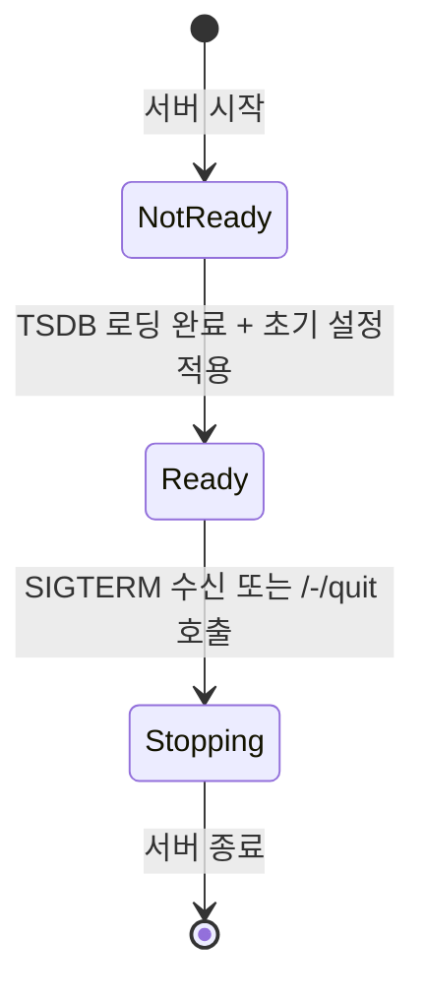
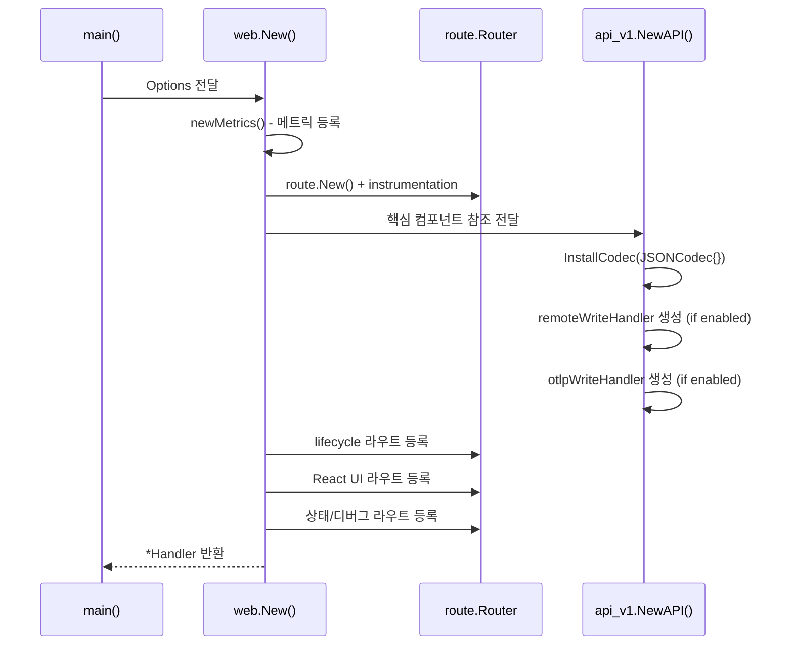
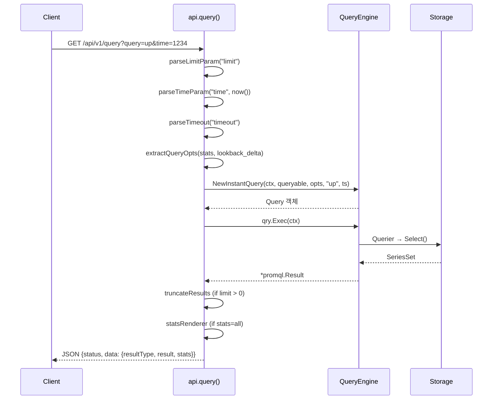
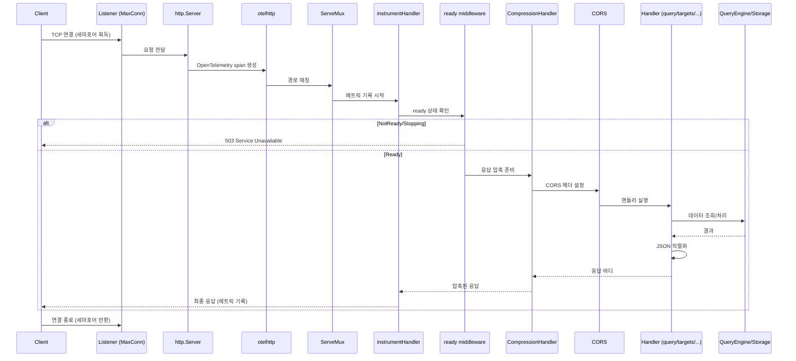

# 17. HTTP API & Web Handler Deep-Dive

## 1. 개요

Prometheus의 HTTP API와 Web Handler는 사용자와 외부 시스템이 Prometheus와 상호작용하는 유일한 진입점이다. 쿼리 실행, 메타데이터 조회, 관리 작업, Web UI 제공까지 모든 것이 이 계층을 통해 이루어진다.

핵심 소스 파일:

| 파일 | 역할 |
|------|------|
| `web/web.go` | Handler 구조체, 라우터 설정, 서버 시작, lifecycle 엔드포인트 |
| `web/api/v1/api.go` | API v1 엔드포인트 등록 및 핸들러 구현 |
| `web/api/v1/codec.go` | 응답 인코딩 (JSON 등) |
| `web/ui/` | React 기반 Web UI 에셋 |

전체 아키텍처를 다이어그램으로 나타내면 다음과 같다.

```
┌─────────────────────────────────────────────────────────┐
│                    HTTP Client / Browser                 │
└───────────────┬─────────────────────────────────────────┘
                │
                ▼
┌───────────────────────────────────────────────────────────┐
│  net/http.Server                                          │
│  ├─ ReadTimeout                                           │
│  ├─ otelhttp (OpenTelemetry tracing)                      │
│  └─ withStackTracer (panic 복구 + 로깅)                    │
├───────────────────────────────────────────────────────────┤
│  http.ServeMux                                            │
│  ├─ /api/v1/*  →  API v1 Router (route.Router)            │
│  └─ /*         →  Main Router (route.Router)              │
├───────────────────────────────────────────────────────────┤
│  Main Router                          API v1 Router       │
│  ├─ /-/healthy                        ├─ /query           │
│  ├─ /-/ready                          ├─ /query_range     │
│  ├─ /-/reload                         ├─ /labels          │
│  ├─ /-/quit                           ├─ /series          │
│  ├─ /metrics                          ├─ /targets         │
│  ├─ /federate                         ├─ /rules           │
│  ├─ /graph (/query)                   ├─ /alerts          │
│  ├─ /targets                          ├─ /write           │
│  ├─ /alerts                           ├─ /admin/*         │
│  └─ /static/*                         └─ /status/*        │
└───────────────────────────────────────────────────────────┘
                │                           │
                ▼                           ▼
┌──────────────────┐  ┌──────────────────────────────────┐
│  React SPA       │  │  Storage / QueryEngine / Scrape   │
│  (Web UI)        │  │  Manager / Rule Manager           │
└──────────────────┘  └──────────────────────────────────┘
```

---

## 2. Handler 구조체

### 2.1 Handler 정의

`web/web.go`의 `Handler` 구조체는 Prometheus 웹 서버의 핵심이다.

```
// web/web.go:214-248
type Handler struct {
    logger          *slog.Logger
    gatherer        prometheus.Gatherer
    metrics         *metrics
    scrapeManager   *scrape.Manager
    ruleManager     *rules.Manager
    queryEngine     *promql.Engine
    lookbackDelta   time.Duration
    context         context.Context
    storage         storage.Storage
    localStorage    LocalStorage
    exemplarStorage storage.ExemplarQueryable
    notifier        *notifier.Manager
    apiV1           *api_v1.API
    router          *route.Router
    quitCh          chan struct{}
    quitOnce        sync.Once
    reloadCh        chan chan error
    options         *Options
    config          *config.Config
    versionInfo     *PrometheusVersion
    birth           time.Time
    cwd             string
    flagsMap        map[string]string
    mtx             sync.RWMutex
    now             func() model.Time
    ready           atomic.Uint32
}
```

Handler는 Prometheus의 모든 핵심 컴포넌트에 대한 참조를 보유한다. 이 설계의 의도는 HTTP 계층이 각 서브시스템과 직접 통신할 수 있도록 하면서도, 단일 진입점으로 관리하기 위함이다.

### 2.2 Options 구조체

`Options`는 Handler 생성 시 전달되는 설정 묶음이다.

```
// web/web.go:261-315 (핵심 필드)
type Options struct {
    ListenAddresses            []string          // 리스닝 주소 (복수 가능)
    ReadTimeout                time.Duration     // HTTP 요청 읽기 타임아웃
    MaxConnections             int               // 최대 동시 연결 수
    CORSOrigin                 *regexp.Regexp    // CORS 허용 오리진 패턴
    ExternalURL                *url.URL          // 외부 접근 URL
    RoutePrefix                string            // 라우트 프리픽스
    EnableLifecycle            bool              // /-/reload, /-/quit 활성화
    EnableAdminAPI             bool              // admin API 활성화
    EnableRemoteWriteReceiver  bool              // Remote Write 수신 활성화
    EnableOTLPWriteReceiver    bool              // OTLP 수신 활성화
    IsAgent                    bool              // Agent 모드 여부
    UseOldUI                   bool              // 구 UI 사용 여부
    TSDBRetentionDuration      model.Duration    // TSDB 보존 기간
    TSDBDir                    string            // TSDB 데이터 디렉토리
    Storage                    storage.Storage   // 스토리지 인터페이스
    QueryEngine                *promql.Engine    // PromQL 엔진
    ScrapeManager              *scrape.Manager   // 스크래프 매니저
    RuleManager                *rules.Manager    // 규칙 매니저
    Notifier                   *notifier.Manager // 알림 매니저
}
```

주요 설정 옵션별 의미:

| 옵션 | 기본값 | 설명 |
|------|--------|------|
| `ListenAddresses` | `["0.0.0.0:9090"]` | 복수 주소에서 동시 리스닝 가능 |
| `ReadTimeout` | 5m | HTTP 요청 바디 읽기 제한 시간 |
| `MaxConnections` | 512 | 동시 TCP 연결 최대 수 (세마포어 기반) |
| `EnableLifecycle` | false | `--web.enable-lifecycle` 플래그로 활성화 |
| `EnableAdminAPI` | false | `--web.enable-admin-api` 플래그로 활성화 |

### 2.3 Ready 상태 관리

Handler는 원자적(atomic) ready 상태를 관리한다. 세 가지 상태가 정의되어 있다.

```
// web/web.go:109-115
type ReadyStatus uint32

const (
    NotReady ReadyStatus = iota   // 0: 시작 중
    Ready                         // 1: 정상 동작
    Stopping                      // 2: 종료 중
)
```

상태 전이 다이어그램:



`testReady` 미들웨어가 모든 요청 앞단에서 상태를 확인한다:

- **Ready**: 정상 처리
- **NotReady**: HTTP 503 + `X-Prometheus-Stopping: false`
- **Stopping**: HTTP 503 + `X-Prometheus-Stopping: true`

`X-Prometheus-Stopping` 헤더는 로드밸런서가 graceful shutdown을 감지하는 데 활용된다. 아직 시작 중인 것(NotReady)과 종료 중인 것(Stopping)을 구분함으로써, 로드밸런서가 적절한 대응을 할 수 있다.

---

## 3. Handler 초기화와 라우팅

### 3.1 New() 함수

`New()` 함수(`web/web.go:318-607`)는 Handler를 생성하고 모든 라우트를 등록한다.



### 3.2 Run() 함수

`Run()` 함수(`web/web.go:722-770`)는 실제 HTTP 서버를 시작한다.

```
func (h *Handler) Run(ctx context.Context, listeners []net.Listener, webConfig string) error {
    // 1. 리스너 생성 (MaxConnections 세마포어 적용)
    // 2. http.ServeMux 생성
    //    - "/" → Main Router
    //    - "/api/v1/" → API v1 Router (StripPrefix 적용)
    // 3. http.Server 생성
    //    - otelhttp 래핑 (OpenTelemetry 추적)
    //    - withStackTracer 래핑 (panic 복구)
    //    - ReadTimeout 설정
    // 4. toolkit_web.ServeMultiple()로 TLS/인증 지원 서빙
    // 5. ctx 취소 시 Shutdown()
}
```

핵심은 두 개의 분리된 라우터가 `http.ServeMux`를 통해 결합된다는 점이다:

```
http.ServeMux
├── /api/v1/*  →  StripPrefix("/api/v1") → API v1 route.Router
│                 (instrumentHandlerWithPrefix("/api/v1"))
└── /*         →  Main route.Router
                  (instrumentHandler)
```

이렇게 분리하는 이유는 API v1 엔드포인트와 일반 웹 엔드포인트의 미들웨어 체인이 다르기 때문이다. API v1은 CORS, JSON 응답, 압축 등을 적용하고, 일반 웹 엔드포인트는 HTML/정적 파일을 서빙한다.

---

## 4. HTTP API v1 엔드포인트

### 4.1 엔드포인트 등록

`api.Register()` 함수(`web/api/v1/api.go:392-484`)에서 모든 API v1 엔드포인트가 등록된다.

등록 시 두 가지 래퍼 함수가 사용된다:

- **`wrap`**: 일반 래퍼. CORS 설정, TSDB 상태 확인, 에러 처리, 응답 직렬화, 압축, ready 확인을 수행한다.
- **`wrapAgent`**: Agent 모드에서 사용 불가능한 엔드포인트에 적용. Agent 모드이면 "unavailable with Prometheus Agent" 에러를 반환한다.

### 4.2 전체 엔드포인트 라우팅 테이블

#### 쿼리 엔드포인트

| 메서드 | 경로 | 핸들러 | 래퍼 | 설명 |
|--------|------|--------|------|------|
| GET/POST | `/api/v1/query` | `api.query` | wrapAgent | 즉시(instant) 쿼리 |
| GET/POST | `/api/v1/query_range` | `api.queryRange` | wrapAgent | 범위(range) 쿼리 |
| GET/POST | `/api/v1/query_exemplars` | `api.queryExemplars` | wrapAgent | 예시(exemplar) 쿼리 |
| GET/POST | `/api/v1/format_query` | `api.formatQuery` | wrapAgent | PromQL 포매팅 |
| GET/POST | `/api/v1/parse_query` | `api.parseQuery` | wrapAgent | PromQL AST 파싱 |

#### 메타데이터 엔드포인트

| 메서드 | 경로 | 핸들러 | 래퍼 | 설명 |
|--------|------|--------|------|------|
| GET/POST | `/api/v1/labels` | `api.labelNames` | wrapAgent | 라벨 이름 목록 |
| GET | `/api/v1/label/{name}/values` | `api.labelValues` | wrapAgent | 특정 라벨의 값 목록 |
| GET/POST | `/api/v1/series` | `api.series` | wrapAgent | 시계열 메타데이터 |
| DELETE | `/api/v1/series` | `api.dropSeries` | wrapAgent | 시리즈 삭제 (deprecated) |
| GET | `/api/v1/metadata` | `api.metricMetadata` | wrap | 메트릭 메타데이터 |

#### 타겟/규칙/알림 엔드포인트

| 메서드 | 경로 | 핸들러 | 래퍼 | 설명 |
|--------|------|--------|------|------|
| GET | `/api/v1/scrape_pools` | `api.scrapePools` | wrap | 스크래프 풀 목록 |
| GET | `/api/v1/targets` | `api.targets` | wrap | 스크래프 타겟 상태 |
| GET | `/api/v1/targets/metadata` | `api.targetMetadata` | wrap | 타겟 메타데이터 |
| GET | `/api/v1/alertmanagers` | `api.alertmanagers` | wrapAgent | Alertmanager 엔드포인트 |
| GET | `/api/v1/alerts` | `api.alerts` | wrapAgent | 활성 알림 목록 |
| GET | `/api/v1/rules` | `api.rules` | wrapAgent | 활성 규칙 목록 |

#### 상태 엔드포인트

| 메서드 | 경로 | 핸들러 | 래퍼 | 설명 |
|--------|------|--------|------|------|
| GET | `/api/v1/status/config` | `api.serveConfig` | wrap | 현재 YAML 설정 |
| GET | `/api/v1/status/flags` | `api.serveFlags` | wrap | CLI 플래그 |
| GET | `/api/v1/status/runtimeinfo` | `api.serveRuntimeInfo` | wrap | 런타임 정보 |
| GET | `/api/v1/status/buildinfo` | `api.serveBuildInfo` | wrap | 빌드 정보 |
| GET | `/api/v1/status/tsdb` | `api.serveTSDBStatus` | wrapAgent | TSDB 통계 |
| GET | `/api/v1/status/tsdb/blocks` | `api.serveTSDBBlocks` | wrapAgent | TSDB 블록 메타 |
| GET | `/api/v1/status/walreplay` | `api.serveWALReplayStatus` | - | WAL 리플레이 상태 |
| GET | `/api/v1/features` | `api.features` | wrap | 기능 플래그 |

#### Remote Write / OTLP 엔드포인트

| 메서드 | 경로 | 핸들러 | 래퍼 | 설명 |
|--------|------|--------|------|------|
| POST | `/api/v1/write` | `api.remoteWrite` | ready | Remote Write 수신 |
| POST | `/api/v1/read` | `api.remoteRead` | ready | Remote Read |
| POST | `/api/v1/otlp/v1/metrics` | `api.otlpWrite` | ready | OTLP 메트릭 수신 |

#### Admin 엔드포인트

| 메서드 | 경로 | 핸들러 | 래퍼 | 설명 |
|--------|------|--------|------|------|
| POST/PUT | `/api/v1/admin/tsdb/snapshot` | `api.snapshot` | wrapAgent | TSDB 스냅샷 생성 |
| POST/PUT | `/api/v1/admin/tsdb/delete_series` | `api.deleteSeries` | wrapAgent | 시리즈 삭제 |
| POST/PUT | `/api/v1/admin/tsdb/clean_tombstones` | `api.cleanTombstones` | wrapAgent | tombstone 정리 |

#### 알림 구독 엔드포인트

| 메서드 | 경로 | 핸들러 | 래퍼 | 설명 |
|--------|------|--------|------|------|
| GET | `/api/v1/notifications` | `api.notifications` | - | 알림 목록 |
| GET | `/api/v1/notifications/live` | `api.notificationsSSE` | - | SSE 실시간 알림 |

---

## 5. 쿼리 핸들러 상세

### 5.1 Instant Query (/api/v1/query)

`api.query()` 함수(`web/api/v1/api.go:502-569`)의 처리 흐름:



요청 파라미터:

| 파라미터 | 필수 | 설명 |
|----------|------|------|
| `query` | O | PromQL 표현식 |
| `time` | X | 평가 시점 (RFC3339 또는 Unix timestamp). 미지정 시 현재 시각 |
| `timeout` | X | 쿼리 타임아웃 |
| `limit` | X | 결과 시계열 수 제한 |
| `stats` | X | `all`이면 쿼리 통계 포함 |
| `lookback_delta` | X | 커스텀 lookback delta |

요청 예시:

```
GET /api/v1/query?query=up{job="prometheus"}&time=2024-01-01T00:00:00Z
```

응답 예시:

```json
{
  "status": "success",
  "data": {
    "resultType": "vector",
    "result": [
      {
        "metric": {"__name__": "up", "job": "prometheus", "instance": "localhost:9090"},
        "value": [1704067200, "1"]
      }
    ]
  }
}
```

### 5.2 Range Query (/api/v1/query_range)

`api.queryRange()` 함수(`web/api/v1/api.go:603-694`)는 시간 범위에 걸친 쿼리를 처리한다.

추가 파라미터:

| 파라미터 | 필수 | 설명 |
|----------|------|------|
| `start` | O | 시작 시점 |
| `end` | O | 종료 시점 |
| `step` | O | 해상도 간격 (예: `15s`, `1m`) |

**안전 제한**: `(end - start) / step > 11000`이면 요청을 거부한다. 이는 메모리 폭발을 방지하기 위한 것으로, 60초 해상도로 약 1주일, 1시간 해상도로 약 1년 정도를 커버할 수 있는 상한이다.

요청 예시:

```
POST /api/v1/query_range
Content-Type: application/x-www-form-urlencoded

query=rate(http_requests_total[5m])&start=2024-01-01T00:00:00Z&end=2024-01-01T01:00:00Z&step=15s
```

응답 예시:

```json
{
  "status": "success",
  "data": {
    "resultType": "matrix",
    "result": [
      {
        "metric": {"__name__": "http_requests_total", "method": "GET"},
        "values": [
          [1704067200, "0.5"],
          [1704067215, "0.6"],
          [1704067230, "0.55"]
        ]
      }
    ]
  }
}
```

### 5.3 Label Names (/api/v1/labels)

`api.labelNames()` 함수(`web/api/v1/api.go:758-833`)는 저장소에 존재하는 라벨 이름 목록을 반환한다.

파라미터:

| 파라미터 | 필수 | 설명 |
|----------|------|------|
| `match[]` | X | 라벨 매처 (복수 가능) |
| `start` | X | 시간 범위 시작 |
| `end` | X | 시간 범위 종료 |
| `limit` | X | 결과 수 제한 |

`match[]`가 복수로 주어지면, 각 매처에 대해 `q.LabelNames()`를 호출하고 결과를 합집합으로 결합한 뒤 정렬한다.

### 5.4 Label Values (/api/v1/label/{name}/values)

`api.labelValues()` 함수(`web/api/v1/api.go:835-`)는 특정 라벨의 고유 값 목록을 반환한다. 라벨 이름이 `U__` 접두사로 시작하면 UTF-8 이스케이프 디코딩을 수행한다.

---

## 6. 응답 형식

### 6.1 JSON Envelope

모든 API v1 응답은 통일된 JSON 형식을 사용한다.

```
// web/api/v1/api.go:188-196
type Response struct {
    Status    status   `json:"status"`       // "success" 또는 "error"
    Data      any      `json:"data,omitempty"`
    ErrorType string   `json:"errorType,omitempty"`
    Error     string   `json:"error,omitempty"`
    Warnings  []string `json:"warnings,omitempty"`
    Infos     []string `json:"infos,omitempty"`
}
```

성공 응답:

```json
{
  "status": "success",
  "data": { ... },
  "warnings": ["results truncated due to limit"]
}
```

에러 응답:

```json
{
  "status": "error",
  "errorType": "bad_data",
  "error": "invalid parameter \"query\": parse error..."
}
```

### 6.2 에러 타입과 HTTP 상태 코드

`web/api/v1/api.go:86-108`에 정의된 에러 타입:

| errorType | HTTP 코드 | 설명 |
|-----------|-----------|------|
| `bad_data` | 400 | 잘못된 요청 파라미터 |
| `execution` | 422 | 쿼리 실행 에러 |
| `canceled` | 499 | 클라이언트가 연결 종료 |
| `timeout` | 503 | 쿼리 타임아웃 |
| `internal` | 500 | 내부 서버 에러 |
| `unavailable` | 503 | 서비스 불가 (TSDB 미준비 등) |
| `not_found` | 404 | 리소스 없음 |
| `not_acceptable` | 406 | Accept 헤더 불일치 |

499 코드는 nginx가 도입한 비표준 코드로, 클라이언트가 응답을 받기 전에 연결을 끊은 경우를 나타낸다.

### 6.3 결과 타입

쿼리 응답의 `data.resultType` 필드:

| 타입 | 설명 | 예시 쿼리 |
|------|------|----------|
| `vector` | 즉시 쿼리 결과 (시점별 단일 값) | `up` |
| `matrix` | 범위 쿼리 결과 (시계열 값 배열) | `rate(up[5m])` |
| `scalar` | 스칼라 값 | `1 + 1` |
| `string` | 문자열 값 | (내부용) |

### 6.4 Content Negotiation

`api.respond()` 함수(`web/api/v1/api.go:2106-2135`)는 `Accept` 헤더를 기반으로 Codec을 선택한다.

```
func (api *API) respond(w http.ResponseWriter, req *http.Request, data any, ...) {
    // 1. warnings을 문자열로 변환 (최대 10개씩)
    // 2. Response 구조체 생성
    // 3. negotiateCodec()로 Accept 헤더 기반 Codec 선택
    // 4. Codec.Encode()로 직렬화
    // 5. Content-Type 헤더 설정 + 응답 전송
}
```

기본적으로 `JSONCodec`이 설치되어 있으며, `InstallCodec()`으로 추가 코덱을 등록할 수 있다. Accept 헤더를 만족하는 코덱이 없으면 첫 번째 설치된 코덱(JSON)을 사용한다.

---

## 7. Remote Write 수신

### 7.1 POST /api/v1/write

`--web.enable-remote-write-receiver` 플래그가 활성화되어야 사용 가능하다.

```
func (api *API) remoteWrite(w http.ResponseWriter, r *http.Request) {
    if api.remoteWriteHandler != nil {
        api.remoteWriteHandler.ServeHTTP(w, r)
    } else {
        http.Error(w, "remote write receiver needs to be enabled...", http.StatusNotFound)
    }
}
```

`remoteWriteHandler`는 `remote.NewWriteHandler()`가 생성한다. 이 핸들러는:

1. Snappy 압축된 protobuf 메시지를 디코딩
2. `storage.Appendable`을 통해 TSDB에 직접 기록
3. 지원되는 프로토콜 버전을 `acceptRemoteWriteProtoMsgs`로 제어

### 7.2 POST /api/v1/otlp/v1/metrics

`--web.enable-otlp-receiver` 플래그가 활성화되어야 한다.

```
func (api *API) otlpWrite(w http.ResponseWriter, r *http.Request) {
    if api.otlpWriteHandler != nil {
        api.otlpWriteHandler.ServeHTTP(w, r)
    } else {
        http.Error(w, "otlp write receiver needs to be enabled...", http.StatusNotFound)
    }
}
```

OTLP 핸들러는 `remote.NewOTLPWriteHandler()`가 생성하며, OpenTelemetry의 메트릭 프로토콜을 Prometheus 형식으로 변환한다. 주요 옵션:

| 옵션 | 설명 |
|------|------|
| `ConvertDelta` | Delta → Cumulative 변환 여부 |
| `NativeDelta` | Native Delta 히스토그램 직접 수집 |
| `LookbackDelta` | Delta 변환 시 사용할 lookback delta |
| `EnableTypeAndUnitLabels` | 타입/단위 라벨 추가 여부 |

---

## 8. Admin API

Admin API는 `--web.enable-admin-api` 플래그로 활성화한다. 비활성 상태에서 호출하면 `"admin APIs disabled"` 에러를 반환한다.

### 8.1 TSDB 스냅샷

```
POST /api/v1/admin/tsdb/snapshot?skip_head=false
```

TSDB 데이터 디렉토리에 스냅샷을 생성한다. `skip_head=true`이면 인-메모리 head 블록을 제외한다.

응답:

```json
{
  "status": "success",
  "data": {
    "name": "20240101T000000Z-abcdef"
  }
}
```

### 8.2 시리즈 삭제

```
POST /api/v1/admin/tsdb/delete_series?match[]=up&start=2024-01-01T00:00:00Z&end=2024-01-02T00:00:00Z
```

매칭되는 시계열에 tombstone을 기록한다. 실제 데이터 삭제는 컴팩션 시 발생한다.

### 8.3 Tombstone 정리

```
POST /api/v1/admin/tsdb/clean_tombstones
```

기존 tombstone을 처리하여 디스크 공간을 즉시 회수한다.

---

## 9. 상태 엔드포인트 상세

### 9.1 런타임 정보 (/api/v1/status/runtimeinfo)

`web/web.go:851-900`의 `runtimeInfo()` 함수에서 수집하는 정보:

```
// web/api/v1/api.go:171-186
type RuntimeInfo struct {
    StartTime           time.Time  // 서버 시작 시각
    CWD                 string     // 현재 작업 디렉토리
    Hostname            string     // 호스트명
    ServerTime          time.Time  // 현재 서버 시각
    ReloadConfigSuccess bool       // 마지막 설정 리로드 성공 여부
    LastConfigTime      time.Time  // 마지막 설정 리로드 시각
    CorruptionCount     int64      // WAL 손상 횟수
    GoroutineCount      int        // 활성 고루틴 수
    GOMAXPROCS          int        // GOMAXPROCS
    GOMEMLIMIT          int64      // GOMEMLIMIT
    GOGC                string     // GOGC 환경변수
    GODEBUG             string     // GODEBUG 환경변수
    StorageRetention    string     // 스토리지 보존 정책
}
```

`ReloadConfigSuccess`와 `LastConfigTime`은 `prometheus_config_last_reload_successful`, `prometheus_config_last_reload_success_timestamp_seconds` 메트릭에서 직접 읽어온다. CorruptionCount는 `prometheus_tsdb_wal_corruptions_total` 메트릭에서 가져온다.

### 9.2 빌드 정보 (/api/v1/status/buildinfo)

```
// web/api/v1/api.go:162-169
type PrometheusVersion struct {
    Version   string
    Revision  string
    Branch    string
    BuildUser string
    BuildDate string
    GoVersion string
}
```

### 9.3 TSDB 상태 (/api/v1/status/tsdb)

```
// web/api/v1/api.go:1854-1861
type TSDBStatus struct {
    HeadStats                   HeadStats   // Head 블록 통계
    SeriesCountByMetricName     []TSDBStat  // 메트릭명별 시계열 수
    LabelValueCountByLabelName  []TSDBStat  // 라벨명별 값 수
    MemoryInBytesByLabelName    []TSDBStat  // 라벨명별 메모리 사용량
    SeriesCountByLabelValuePair []TSDBStat  // 라벨값 쌍별 시계열 수
}
```

`limit` 파라미터로 상위 N개만 반환할 수 있다(기본 10, 최대 10000).

---

## 10. 미들웨어 스택

### 10.1 미들웨어 체인

HTTP 요청이 핸들러에 도달하기까지 거치는 미들웨어 계층:

```
[TCP Listener]
    │
    ├─ netconnlimit.SharedLimitListener (MaxConnections 세마포어)
    │
    ├─ conntrack.NewListener (연결 추적)
    │
[http.Server]
    │
    ├─ ReadTimeout (HTTP 읽기 타임아웃)
    │
    ├─ withStackTracer (panic 복구 + 스택 트레이스 로깅)
    │
    ├─ otelhttp.NewHandler (OpenTelemetry span 생성)
    │
[http.ServeMux]
    │
    ├─ API v1 경로:
    │   ├─ instrumentHandler (메트릭: 요청 수, 지연시간, 응답 크기)
    │   ├─ ready 미들웨어 (503 if not ready)
    │   ├─ CompressionHandler (gzip/deflate 응답 압축)
    │   ├─ OpenAPI wrapper
    │   ├─ CORS 처리
    │   └─ 실제 핸들러
    │
    └─ 일반 경로:
        ├─ instrumentHandler
        └─ 실제 핸들러
```

### 10.2 연결 제한 (MaxConnections)

`web/web.go:692-718`에서 세마포어 기반 연결 제한을 구현한다:

```
func (h *Handler) Listeners() ([]net.Listener, error) {
    sem := netconnlimit.NewSharedSemaphore(h.options.MaxConnections)
    for _, address := range h.options.ListenAddresses {
        listener, err := h.Listener(address, sem)
        // ...
    }
}
```

복수의 리스닝 주소가 있어도 **하나의 세마포어를 공유**한다. 이렇게 설계한 이유는 전체 서버 레벨에서 리소스 사용량을 제어하기 위함이다. `SharedLimitListener`는 새 연결이 수락될 때 세마포어를 획득하고, 연결이 종료될 때 반환한다.

### 10.3 인스트루멘테이션 메트릭

`web/web.go:138-204`에서 등록하는 메트릭:

| 메트릭 | 타입 | 설명 |
|--------|------|------|
| `prometheus_http_requests_total` | Counter | 핸들러/상태코드별 요청 수 |
| `prometheus_http_request_duration_seconds` | Histogram | 핸들러별 요청 지연시간 |
| `prometheus_http_response_size_bytes` | Histogram | 핸들러별 응답 크기 |
| `prometheus_ready` | Gauge | 서버 준비 상태 (0 또는 1) |

요청 지연시간 히스토그램의 버킷은 `[0.1, 0.2, 0.4, 1, 3, 8, 20, 60, 120]`초로 설정되어 있으며, Native Histogram도 활성화되어 있다(`BucketFactor: 1.1`, `MaxBucketNumber: 100`).

### 10.4 CORS 처리

`Options.CORSOrigin`이 설정되면 `httputil.SetCORS()`가 매 요청마다 호출된다. `wrap` 함수 내부에서 실행되므로 API v1 엔드포인트에만 적용된다.

또한 `OPTIONS /*path` 핸들러가 등록되어 있어 preflight 요청을 처리한다.

### 10.5 TLS / 인증

`toolkit_web.ServeMultiple()`이 exporter-toolkit의 `FlagConfig`를 통해 TLS와 기본 인증을 처리한다. `--web.config.file` 플래그로 설정 파일을 지정한다.

---

## 11. Web UI

### 11.1 React SPA 아키텍처

Prometheus는 두 가지 UI를 지원한다:

| UI | 경로 접두사 | 활성화 조건 |
|----|------------|------------|
| Mantine UI (v3) | `/static/mantine-ui/` | 기본 (UseOldUI=false) |
| React App (v2) | `/static/react-app/` | `--web.use-old-ui` 플래그 |

UI 에셋은 `web/ui/` 패키지에 `embed.FS`로 번들링된다.

### 11.2 React 라우터 경로

`web/web.go:72-107`에서 React SPA가 처리하는 경로가 정의된다:

**공통 경로** (서버 모드 + Agent 모드):

| 경로 | 설명 |
|------|------|
| `/config` | 현재 설정 표시 |
| `/flags` | CLI 플래그 표시 |
| `/service-discovery` | 서비스 디스커버리 상태 |
| `/status` | 런타임 상태 |
| `/targets` | 스크래프 타겟 상태 |

**서버 모드 전용**:

| 경로 (v3) | 경로 (v2) | 설명 |
|-----------|-----------|------|
| `/query` | `/graph` | 쿼리 실행 + 그래프 |
| `/alerts` | `/alerts` | 활성 알림 |
| `/rules` | `/rules` | 규칙 상태 |
| `/tsdb-status` | `/tsdb-status` | TSDB 통계 |

**Agent 모드 전용**:

| 경로 | 설명 |
|------|------|
| `/agent` | Agent 상태 대시보드 |

홈페이지 리다이렉트 로직:
- 서버 모드 + 신규 UI: `/` → `/query`
- 서버 모드 + 구 UI: `/` → `/graph`
- Agent 모드: `/` → `/agent`

### 11.3 SPA 서빙

`serveReactApp` 함수가 `index.html`을 읽어서 다음 플레이스홀더를 런타임 값으로 치환한다:

| 플레이스홀더 | 치환 값 |
|-------------|---------|
| `CONSOLES_LINK_PLACEHOLDER` | 콘솔 템플릿 경로 |
| `TITLE_PLACEHOLDER` | `--web.page-title` 값 |
| `AGENT_MODE_PLACEHOLDER` | Agent 모드 여부 |
| `READY_PLACEHOLDER` | 서버 준비 상태 |
| `LOOKBACKDELTA_PLACEHOLDER` | Lookback delta 값 |

---

## 12. Lifecycle 엔드포인트

`--web.enable-lifecycle` 플래그가 활성화되어야 사용 가능하다.

### 12.1 POST /-/reload

설정 리로드를 요청한다.

```
func (h *Handler) reload(w http.ResponseWriter, _ *http.Request) {
    rc := make(chan error)
    h.reloadCh <- rc    // main goroutine에 리로드 요청 전송
    if err := <-rc; err != nil {
        http.Error(w, fmt.Sprintf("failed to reload config: %s", err), 500)
    }
}
```

동작 방식:
1. Handler가 `reloadCh` 채널로 에러 채널을 전송
2. main goroutine이 설정 파일을 다시 읽고 각 컴포넌트에 `ApplyConfig()` 호출
3. 결과(성공/실패)를 에러 채널로 반환
4. HTTP 응답으로 전달

### 12.2 POST /-/quit

서버 종료를 요청한다.

```
func (h *Handler) quit(w http.ResponseWriter, _ *http.Request) {
    var closed bool
    h.quitOnce.Do(func() {
        closed = true
        close(h.quitCh)
        fmt.Fprintf(w, "Requesting termination... Goodbye!")
    })
    if !closed {
        fmt.Fprintf(w, "Termination already in progress.")
    }
}
```

`sync.Once`를 사용하여 중복 종료 요청을 안전하게 처리한다. `quitCh`가 닫히면 main goroutine이 감지하여 graceful shutdown을 시작한다.

### 12.3 GET /-/healthy

항상 HTTP 200을 반환한다. ready 상태와 무관하게 프로세스가 살아있으면 응답한다.

```
router.Get("/-/healthy", func(w http.ResponseWriter, _ *http.Request) {
    w.WriteHeader(http.StatusOK)
    fmt.Fprintf(w, "%s is Healthy.\n", o.AppName)
})
```

### 12.4 GET /-/ready

ready 미들웨어를 통과해야 200을 반환한다. NotReady/Stopping이면 503을 반환한다.

```
router.Get("/-/ready", readyf(func(w http.ResponseWriter, _ *http.Request) {
    w.WriteHeader(http.StatusOK)
    fmt.Fprintf(w, "%s is Ready.\n", o.AppName)
}))
```

**왜 healthy와 ready를 분리하는가?**

Kubernetes의 liveness probe와 readiness probe에 각각 매핑하기 위함이다:
- `/-/healthy` → liveness probe: 프로세스가 살아있는지만 확인. TSDB 로딩 중에도 성공
- `/-/ready` → readiness probe: 트래픽을 받을 준비가 되었는지 확인. TSDB 로딩 완료 후 성공

---

## 13. Notification SSE (Server-Sent Events)

### 13.1 GET /api/v1/notifications

현재 저장된 알림 목록을 JSON으로 반환한다.

```
func (api *API) notifications(w http.ResponseWriter, r *http.Request) {
    httputil.SetCORS(w, api.CORSOrigin, r)
    api.respond(w, r, api.notificationsGetter(), nil, "")
}
```

### 13.2 GET /api/v1/notifications/live

SSE 프로토콜을 사용하여 실시간 알림을 스트리밍한다.

```
func (api *API) notificationsSSE(w http.ResponseWriter, r *http.Request) {
    // 1. SSE 헤더 설정
    w.Header().Set("Content-Type", "text/event-stream")
    w.Header().Set("Cache-Control", "no-cache")
    w.Header().Set("Connection", "keep-alive")

    // 2. 알림 구독
    notifications, unsubscribe, ok := api.notificationsSub()
    if !ok {
        w.WriteHeader(http.StatusNoContent)
        return
    }
    defer unsubscribe()

    // 3. Flusher 획득
    flusher, ok := w.(http.Flusher)

    // 4. 이벤트 루프
    for {
        select {
        case notification := <-notifications:
            jsonData, _ := json.Marshal(notification)
            fmt.Fprintf(w, "data: %s\n\n", jsonData)
            flusher.Flush()
        case <-r.Context().Done():
            return
        }
    }
}
```

SSE 프로토콜의 핵심:
- `Content-Type: text/event-stream`
- 각 이벤트는 `data: {JSON}\n\n` 형식
- `Flush()`를 호출하여 즉시 클라이언트에 전송
- 클라이언트 연결 종료 시 `r.Context().Done()`으로 감지

클라이언트 측 사용 예시 (JavaScript):

```javascript
const eventSource = new EventSource('/api/v1/notifications/live');
eventSource.onmessage = function(event) {
    const notification = JSON.parse(event.data);
    console.log('알림:', notification);
};
```

---

## 14. Federation 엔드포인트

`GET /federate` 엔드포인트는 Prometheus federation을 위해 메트릭을 OpenMetrics/텍스트 형식으로 노출한다.

```
router.Get("/federate", readyf(httputil.CompressionHandler{
    Handler: http.HandlerFunc(h.federation),
}.ServeHTTP))
```

`match[]` 파라미터로 노출할 메트릭을 필터링한다. 압축(gzip/deflate)이 자동 적용된다.

---

## 15. 디버그 엔드포인트

`/debug/pprof/*` 경로로 Go의 pprof 프로파일링 도구에 접근할 수 있다.

```
// web/web.go:609-639
func serveDebug(w http.ResponseWriter, req *http.Request) {
    switch subpath {
    case "cmdline":  pprof.Cmdline(w, req)
    case "profile":  pprof.Profile(w, req)
    case "symbol":   pprof.Symbol(w, req)
    case "trace":    pprof.Trace(w, req)
    case "fgprof":   fgprofHandler.ServeHTTP(w, req)
    default:         pprof.Index(w, req)
    }
}
```

`fgprof`은 `fgprof` 라이브러리를 사용하여 on-CPU와 off-CPU 프로파일링을 동시에 수행하는 핸들러이다. 표준 pprof의 CPU 프로파일이 I/O 대기 시간을 놓치는 단점을 보완한다.

---

## 16. ApplyConfig와 설정 리로드

```
// web/web.go:250-258
func (h *Handler) ApplyConfig(conf *config.Config) error {
    h.mtx.Lock()
    defer h.mtx.Unlock()
    h.config = conf
    return nil
}
```

Handler의 `ApplyConfig`은 단순히 설정 참조를 교체한다. 실제 서브시스템(ScrapeManager, RuleManager 등)의 설정 변경은 main goroutine이 각각의 `ApplyConfig`을 호출하여 처리한다.

설정 읽기 시에는 `mtx.RLock()`을 사용한다:

```
func() config.Config {
    h.mtx.RLock()
    defer h.mtx.RUnlock()
    return *h.config
}
```

이 패턴은 설정 리로드와 설정 읽기가 동시에 발생해도 안전하게 동작하도록 한다.

---

## 17. API 구조체와 의존성

### 17.1 API 구조체

`web/api/v1/api.go:224-264`에 정의된 `API` 구조체:

```
type API struct {
    Queryable           storage.SampleAndChunkQueryable
    QueryEngine         promql.QueryEngine
    ExemplarQueryable   storage.ExemplarQueryable

    // 팩토리 함수들 (컨텍스트별 인스턴스 생성)
    scrapePoolsRetriever  func(context.Context) ScrapePoolsRetriever
    targetRetriever       func(context.Context) TargetRetriever
    alertmanagerRetriever func(context.Context) AlertmanagerRetriever
    rulesRetriever        func(context.Context) RulesRetriever

    // 설정/상태
    config              func() config.Config
    flagsMap            map[string]string
    ready               func(http.HandlerFunc) http.HandlerFunc
    globalURLOptions    GlobalURLOptions

    // TSDB Admin
    db          TSDBAdminStats
    dbDir       string
    enableAdmin bool

    // Remote Write/Read/OTLP 핸들러
    remoteWriteHandler  http.Handler
    remoteReadHandler   http.Handler
    otlpWriteHandler    http.Handler

    // Codec (응답 인코딩)
    codecs []Codec

    // 기타
    CORSOrigin          *regexp.Regexp
    buildInfo           *PrometheusVersion
    runtimeInfo         func() (RuntimeInfo, error)
    notificationsGetter func() []notifications.Notification
    notificationsSub    func() (<-chan notifications.Notification, func(), bool)
    parser              parser.Parser
}
```

### 17.2 팩토리 함수 패턴

Retriever 인터페이스들이 팩토리 함수(`func(context.Context) SomeRetriever`)로 래핑되어 있다.

```
factorySPr := func(context.Context) api_v1.ScrapePoolsRetriever { return h.scrapeManager }
factoryTr := func(context.Context) api_v1.TargetRetriever { return h.scrapeManager }
factoryAr := func(context.Context) api_v1.AlertmanagerRetriever { return h.notifier }
FactoryRr := func(context.Context) api_v1.RulesRetriever { return h.ruleManager }
```

이 패턴을 사용하는 이유는 테스트에서 컨텍스트별로 다른 mock 구현을 주입할 수 있도록 하기 위함이다. 프로덕션에서는 항상 같은 인스턴스를 반환하지만, 테스트에서는 요청 컨텍스트에 따라 다른 데이터를 반환하도록 설정할 수 있다.

### 17.3 Retriever 인터페이스

```
type TargetRetriever interface {
    TargetsActive() map[string][]*scrape.Target
    TargetsDropped() map[string][]*scrape.Target
    TargetsDroppedCounts() map[string]int
    ScrapePoolConfig(string) (*config.ScrapeConfig, error)
}

type RulesRetriever interface {
    RuleGroups() []*rules.Group
    AlertingRules() []*rules.AlertingRule
}

type AlertmanagerRetriever interface {
    Alertmanagers() []*url.URL
    DroppedAlertmanagers() []*url.URL
}
```

이 인터페이스들은 API 계층이 각 서브시스템의 내부 구현에 직접 의존하지 않도록 추상화 역할을 한다.

---

## 18. 요청 처리 전체 흐름 (종합)



---

## 19. Agent 모드에서의 API 동작

Agent 모드(`--agent` 플래그)에서는 TSDB가 WAL-only 모드로 동작하여 쿼리가 불가능하다. `wrapAgent` 래퍼가 Agent 모드에서 사용할 수 없는 엔드포인트를 차단한다:

```
wrapAgent := func(f apiFunc) http.HandlerFunc {
    return wrap(func(r *http.Request) apiFuncResult {
        if api.isAgent {
            return apiFuncResult{nil, &apiError{errorExec,
                errors.New("unavailable with Prometheus Agent")}, nil, nil}
        }
        return f(r)
    })
}
```

Agent 모드에서 사용 가능한 엔드포인트:

| 카테고리 | 엔드포인트 |
|----------|-----------|
| 타겟 | `/targets`, `/targets/metadata`, `/scrape_pools` |
| 메타데이터 | `/metadata` |
| 상태 | `/status/config`, `/status/flags`, `/status/runtimeinfo`, `/status/buildinfo` |
| Remote Write | `/write`, `/otlp/v1/metrics` |
| Lifecycle | `/-/healthy`, `/-/ready`, `/-/reload`, `/-/quit` |

Agent 모드에서 차단되는 엔드포인트:

| 카테고리 | 엔드포인트 |
|----------|-----------|
| 쿼리 | `/query`, `/query_range`, `/query_exemplars` |
| 메타데이터 | `/labels`, `/label/*/values`, `/series` |
| 알림/규칙 | `/alerts`, `/rules`, `/alertmanagers` |
| Admin | `/admin/tsdb/*` |
| TSDB 상태 | `/status/tsdb`, `/status/tsdb/blocks` |

---

## 20. 정리: 설계 원칙

Prometheus HTTP API & Web 계층의 설계에서 일관되게 나타나는 원칙들:

1. **인터페이스 기반 분리**: `TargetRetriever`, `RulesRetriever` 등 인터페이스를 통해 API 계층과 비즈니스 로직 계층이 느슨하게 결합된다. 이는 테스트 용이성과 모듈 교체 가능성을 보장한다.

2. **팩토리 패턴을 통한 의존성 주입**: Retriever 팩토리 함수가 컨텍스트를 인자로 받아 테스트에서 mock 주입을 용이하게 한다.

3. **원자적 상태 관리**: `atomic.Uint32`를 사용한 ready 상태 관리로 lock-free 읽기를 보장하면서 상태 전이의 안전성을 확보한다.

4. **공유 세마포어**: 복수의 리스닝 주소가 하나의 연결 제한 세마포어를 공유하여 전체 서버 레벨의 리소스 제어가 가능하다.

5. **플래그 기반 기능 활성화**: Admin API, Lifecycle API, Remote Write 수신, OTLP 수신 등이 모두 플래그로 제어되어, 보안과 운영 요구사항에 따라 세밀하게 조정할 수 있다.

6. **Codec 확장 메커니즘**: `InstallCodec()`을 통해 JSON 외 응답 형식을 추가할 수 있으며, Accept 헤더 기반 content negotiation을 지원한다.

7. **에러 타입 체계화**: 에러를 `errorType`으로 분류하고 각각에 HTTP 상태 코드를 매핑하여, 클라이언트가 에러 원인을 프로그래밍적으로 처리할 수 있도록 한다.
