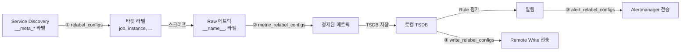

# 18. Relabeling & Configuration Deep-Dive

## 목차

1. [Relabeling 개요 - 왜 라벨 변환이 필요한가](#1-relabeling-개요---왜-라벨-변환이-필요한가)
2. [Relabel 설정 구조 (Config)](#2-relabel-설정-구조-config)
3. [Relabel Action 전체 목록](#3-relabel-action-전체-목록)
4. [Relabeling 적용 지점 (4곳)](#4-relabeling-적용-지점-4곳)
5. [PopulateLabels() 상세](#5-populatelabels-상세)
6. [mutateSampleLabels() 상세](#6-mutatesamplelabels-상세)
7. [설정 파일 구조](#7-설정-파일-구조)
8. [설정 로드 과정](#8-설정-로드-과정)
9. [설정 리로드](#9-설정-리로드)
10. [실용 Relabeling 예제](#10-실용-relabeling-예제)

---

## 1. Relabeling 개요 - 왜 라벨 변환이 필요한가

### 1.1 문제: Service Discovery와 메트릭 사이의 간극

Prometheus는 Service Discovery(SD)를 통해 타겟을 자동으로 발견한다. Kubernetes SD를 예로 들면, Pod의 메타데이터가 `__meta_kubernetes_pod_name`, `__meta_kubernetes_namespace` 같은 라벨로 전달된다. 그런데 이 라벨들은 그대로 사용하기에 문제가 있다.

1. **이름이 너무 길다** - `__meta_kubernetes_pod_label_app_kubernetes_io_name`을 쿼리에 쓸 수 없다
2. **불필요한 라벨이 많다** - SD가 제공하는 모든 메타데이터가 필요하지는 않다
3. **타겟 필터링이 필요하다** - 특정 어노테이션이 있는 Pod만 스크래프하고 싶다
4. **메트릭 정제가 필요하다** - 카디널리티가 높은 불필요한 메트릭을 제거해야 한다

Relabeling은 이 모든 문제를 **설정만으로** 해결한다. 코드 수정 없이, YAML 설정으로 라벨을 변환하고, 타겟을 필터링하고, 메트릭을 정제할 수 있다.

### 1.2 Relabeling의 핵심 원리

```
┌─────────────────────────────────────────────────────────┐
│                   Relabeling Pipeline                    │
│                                                         │
│  입력 라벨셋 ──→ [규칙1] ──→ [규칙2] ──→ ... ──→ 출력  │
│                                                         │
│  각 규칙은 순서대로 적용되며,                            │
│  이전 규칙의 출력이 다음 규칙의 입력이 된다              │
└─────────────────────────────────────────────────────────┘
```

소스 코드에서 이 파이프라인의 핵심은 `ProcessBuilder()` 함수이다.

```
// 소스: model/relabel/relabel.go (라인 274-282)
func ProcessBuilder(lb *labels.Builder, cfgs ...*Config) (keep bool) {
    for _, cfg := range cfgs {
        keep = relabel(cfg, lb)
        if !keep {
            return false
        }
    }
    return true
}
```

`ProcessBuilder()`는 `relabel.Config` 슬라이스를 순서대로 순회하며, 각 규칙을 `relabel()` 함수에 위임한다. 어떤 규칙이 `keep=false`를 반환하면(drop/keep 액션) 즉시 파이프라인을 중단하고 해당 타겟/메트릭을 버린다.

---

## 2. Relabel 설정 구조 (Config)

### 2.1 Config 구조체

```
// 소스: model/relabel/relabel.go (라인 86-105)
type Config struct {
    SourceLabels model.LabelNames   // 소스 라벨 목록
    Separator    string             // 구분자 (기본값: ";")
    Regex        Regexp             // 매칭 정규식
    Modulus      uint64             // hashmod용 나머지 값
    TargetLabel  string             // 대상 라벨
    Replacement  string             // 교체 문자열 ($1 참조)
    Action       Action             // 변환 액션 타입
}
```

### 2.2 기본값 (DefaultRelabelConfig)

설정 파일에서 생략된 필드는 아래 기본값으로 채워진다.

```
// 소스: model/relabel/relabel.go (라인 35-41)
DefaultRelabelConfig = Config{
    Action:      Replace,        // 기본 액션: replace
    Separator:   ";",            // 기본 구분자: 세미콜론
    Regex:       MustNewRegexp("(.*)"),  // 기본 정규식: 전체 매칭
    Replacement: "$1",           // 기본 교체: 첫 번째 캡처 그룹
}
```

이 기본값이 의미하는 것: **아무 설정도 하지 않으면 소스 값을 그대로 타겟 라벨에 복사한다.**

### 2.3 각 필드 상세 설명

#### SourceLabels (소스 라벨 목록)

```yaml
relabel_configs:
  - source_labels: [__meta_kubernetes_namespace, __meta_kubernetes_pod_name]
    separator: "/"
    target_label: instance
    action: replace
```

`SourceLabels`에 나열된 라벨의 값이 `Separator`로 연결(concatenate)된다. 위 예시에서 namespace가 `default`, pod_name이 `nginx-abc`이면 결합 값은 `default/nginx-abc`이 된다.

소스 코드에서 이 결합 로직:

```
// 소스: model/relabel/relabel.go (라인 284-293)
func relabel(cfg *Config, lb *labels.Builder) (keep bool) {
    var va [16]string
    values := va[:0]
    // ... 소스 라벨 값 수집
    for _, ln := range cfg.SourceLabels {
        values = append(values, lb.Get(string(ln)))
    }
    val := strings.Join(values, cfg.Separator)
```

`va [16]string` 배열은 성능 최적화이다. 소스 라벨이 16개 이하면 힙 할당 없이 스택에서 처리한다.

#### Separator (구분자)

기본값은 `";"`이다. 여러 소스 라벨의 값을 결합할 때 사용된다.

| source_labels | separator | 결합 결과 |
|---|---|---|
| `[a, b]` (값: "x", "y") | `;` (기본) | `x;y` |
| `[a, b]` (값: "x", "y") | `/` | `x/y` |
| `[a, b]` (값: "x", "y") | `` (빈 문자열) | `xy` |

#### Regex (매칭 정규식)

Prometheus는 정규식을 **자동으로 앵커링**한다. 사용자가 `(.*)` 를 입력하면 내부적으로 `^(?s:(.*))$`로 컴파일된다.

```
// 소스: model/relabel/relabel.go (라인 201-203)
func NewRegexp(s string) (Regexp, error) {
    regex, err := regexp.Compile("^(?s:" + s + ")$")
    return Regexp{Regexp: regex}, err
}
```

`(?s:...)` 플래그는 `.`이 개행 문자도 매칭하도록 한다. 이것은 라벨 값에 개행 문자가 포함될 수 있는 경우를 대비한 것이다.

**중요**: 사용자가 입력한 정규식이 자동으로 `^...$`로 감싸지므로, 부분 매칭이 아닌 전체 매칭이다. `foo`라고 쓰면 `^(?s:foo)$`가 되어 정확히 `foo`와만 매칭된다.

#### TargetLabel (대상 라벨)

값이 기록될 라벨의 이름이다. `$1` 같은 정규식 변수를 사용할 수 있다.

```yaml
# 정적 타겟 라벨
- target_label: env
  replacement: production

# 동적 타겟 라벨 ($1 참조)
- source_labels: [__name__]
  regex: "(.+)_total"
  target_label: "${1}_count"
```

#### Replacement (교체 문자열)

정규식의 캡처 그룹을 `$1`, `$2` 등으로 참조할 수 있다. 기본값은 `$1`이므로 첫 번째 캡처 그룹의 값이 사용된다.

```
// 소스: model/relabel/relabel.go (라인 320-334) - Replace 액션 처리
indexes := cfg.Regex.FindStringSubmatchIndex(val)
if indexes == nil {
    break  // 매칭 실패 → 아무것도 하지 않음
}
target := string(cfg.Regex.ExpandString([]byte{}, cfg.TargetLabel, val, indexes))
res := cfg.Regex.ExpandString([]byte{}, cfg.Replacement, val, indexes)
if len(res) == 0 {
    lb.Del(target)  // 교체 결과가 빈 문자열 → 라벨 삭제
    break
}
lb.Set(target, string(res))
```

**핵심**: replacement 결과가 빈 문자열이면 해당 라벨이 **삭제**된다. 이것은 라벨을 지우는 패턴으로 활용된다.

#### Modulus (hashmod용)

`hashmod` 액션에서만 사용된다. 소스 라벨 값의 MD5 해시를 이 값으로 나눈 나머지를 타겟 라벨에 기록한다.

```
// 소스: model/relabel/relabel.go (라인 340-343)
case HashMod:
    hash := md5.Sum([]byte(val))
    mod := binary.BigEndian.Uint64(hash[8:]) % cfg.Modulus
    lb.Set(cfg.TargetLabel, strconv.FormatUint(mod, 10))
```

MD5 해시의 마지막 8바이트만 사용하는 것은 이전 버전과의 호환성을 위한 것이다.

### 2.4 검증 규칙

`Config.Validate()` 함수는 설정의 유효성을 검사한다. 주요 검증 규칙:

| 조건 | 에러 |
|---|---|
| `hashmod`인데 `modulus`가 0 | "requires non-zero modulus" |
| `replace/hashmod/lowercase/uppercase/keepequal/dropequal`인데 `target_label` 없음 | "requires 'target_label' value" |
| `dropequal/keepequal`인데 불필요한 필드 설정 | "requires only 'source_labels' and 'target_label'" |
| `labeldrop/labelkeep`인데 불필요한 필드 설정 | "requires only 'regex'" |

---

## 3. Relabel Action 전체 목록

### 3.1 Action 타입 정의

```
// 소스: model/relabel/relabel.go (라인 44-69)
type Action string

const (
    Replace   Action = "replace"
    Keep      Action = "keep"
    Drop      Action = "drop"
    KeepEqual Action = "keepequal"
    DropEqual Action = "dropequal"
    HashMod   Action = "hashmod"
    LabelMap  Action = "labelmap"
    LabelDrop Action = "labeldrop"
    LabelKeep Action = "labelkeep"
    Lowercase Action = "lowercase"
    Uppercase Action = "uppercase"
)
```

### 3.2 각 Action 상세

#### replace - 정규식 매칭 후 값 교체

가장 많이 사용되는 액션이다. 소스 라벨 값을 정규식으로 매칭하고, 캡처 그룹을 사용하여 타겟 라벨에 새 값을 기록한다.

```yaml
# __meta_kubernetes_pod_label_app 값을 app 라벨로 복사
relabel_configs:
  - source_labels: [__meta_kubernetes_pod_label_app]
    target_label: app
    # action: replace  ← 기본값이므로 생략 가능
    # regex: (.*)      ← 기본값
    # replacement: $1  ← 기본값
```

**Fast path 최적화**: 소스 값이 비어있고, 정규식이 기본값이며, 타겟/교체에 `$` 변수가 없으면 단순 `lb.Set()`으로 처리한다.

```
// 소스: model/relabel/relabel.go (라인 313-318)
case Replace:
    // Fast path to add or delete label pair.
    if val == "" && cfg.Regex == DefaultRelabelConfig.Regex &&
        !varInRegexTemplate(cfg.TargetLabel) && !varInRegexTemplate(cfg.Replacement) {
        lb.Set(cfg.TargetLabel, cfg.Replacement)
        break
    }
```

#### keep - 매칭 대상만 유지

소스 라벨 값이 정규식에 매칭되지 않으면 해당 타겟/메트릭을 **버린다**.

```yaml
# prometheus.io/scrape 어노테이션이 "true"인 Pod만 유지
relabel_configs:
  - source_labels: [__meta_kubernetes_pod_annotation_prometheus_io_scrape]
    regex: "true"
    action: keep
```

```
// 소스: model/relabel/relabel.go (라인 301-303)
case Keep:
    if !cfg.Regex.MatchString(val) {
        return false  // 매칭 실패 → 타겟 제거
    }
```

#### drop - 매칭 대상 제거

`keep`의 반대이다. 정규식에 매칭되면 해당 타겟/메트릭을 **버린다**.

```yaml
# kube-system 네임스페이스의 타겟을 제거
relabel_configs:
  - source_labels: [__meta_kubernetes_namespace]
    regex: "kube-system"
    action: drop
```

```
// 소스: model/relabel/relabel.go (라인 296-299)
case Drop:
    if cfg.Regex.MatchString(val) {
        return false  // 매칭 성공 → 타겟 제거
    }
```

#### keepequal - 두 라벨 값이 동일하면 유지

정규식을 사용하지 않고, 소스 라벨의 결합 값과 타겟 라벨의 값을 직접 비교한다. `keep`보다 빠르다.

```yaml
# source와 target 라벨의 값이 같은 경우만 유지
relabel_configs:
  - source_labels: [label_a]
    target_label: label_b
    action: keepequal
```

```
// 소스: model/relabel/relabel.go (라인 308-311)
case KeepEqual:
    if lb.Get(cfg.TargetLabel) != val {
        return false  // 값이 다르면 제거
    }
```

#### dropequal - 두 라벨 값이 동일하면 제거

`keepequal`의 반대이다.

```yaml
relabel_configs:
  - source_labels: [label_a]
    target_label: label_b
    action: dropequal
```

```
// 소스: model/relabel/relabel.go (라인 304-307)
case DropEqual:
    if lb.Get(cfg.TargetLabel) == val {
        return false  // 값이 같으면 제거
    }
```

#### hashmod - 해시 modulo (샤딩용)

소스 라벨 값의 MD5 해시를 `modulus`로 나눈 나머지를 타겟 라벨에 기록한다. 여러 Prometheus 인스턴스 간에 타겟을 분배(샤딩)할 때 사용한다.

```yaml
# 타겟을 4개의 샤드로 분배
relabel_configs:
  - source_labels: [__address__]
    modulus: 4
    target_label: __tmp_hash
    action: hashmod
  - source_labels: [__tmp_hash]
    regex: "0"  # 이 Prometheus는 샤드 0만 담당
    action: keep
```

#### labelmap - 라벨명 변환

모든 라벨을 순회하며, 라벨 **이름**이 정규식에 매칭되면 새 이름으로 복사한다.

```yaml
# __meta_kubernetes_pod_label_* → 해당 라벨명으로 복사
relabel_configs:
  - action: labelmap
    regex: __meta_kubernetes_pod_label_(.+)
    replacement: $1
```

```
// 소스: model/relabel/relabel.go (라인 344-350)
case LabelMap:
    lb.Range(func(l labels.Label) {
        if cfg.Regex.MatchString(l.Name) {
            res := cfg.Regex.ReplaceAllString(l.Name, cfg.Replacement)
            lb.Set(res, l.Value)
        }
    })
```

**주의**: 원본 라벨은 삭제되지 않는다. `__meta_*` 접두사 라벨은 나중에 별도로 제거된다.

#### labeldrop - 라벨 제거

라벨 이름이 정규식에 매칭되면 해당 라벨을 삭제한다. `source_labels`, `target_label` 등은 사용할 수 없다.

```yaml
# "le"와 "quantile" 라벨 제거
metric_relabel_configs:
  - action: labeldrop
    regex: "le|quantile"
```

```
// 소스: model/relabel/relabel.go (라인 351-356)
case LabelDrop:
    lb.Range(func(l labels.Label) {
        if cfg.Regex.MatchString(l.Name) {
            lb.Del(l.Name)
        }
    })
```

#### labelkeep - 라벨 유지

`labeldrop`의 반대이다. 정규식에 매칭되지 않는 라벨을 모두 삭제한다.

```yaml
# __name__, job, instance만 유지
metric_relabel_configs:
  - action: labelkeep
    regex: "__name__|job|instance"
```

```
// 소스: model/relabel/relabel.go (라인 357-362)
case LabelKeep:
    lb.Range(func(l labels.Label) {
        if !cfg.Regex.MatchString(l.Name) {
            lb.Del(l.Name)
        }
    })
```

#### lowercase - 소문자 변환

소스 라벨 값을 소문자로 변환하여 타겟 라벨에 기록한다.

```yaml
relabel_configs:
  - source_labels: [__meta_kubernetes_namespace]
    target_label: namespace
    action: lowercase
```

#### uppercase - 대문자 변환

소스 라벨 값을 대문자로 변환하여 타겟 라벨에 기록한다.

```yaml
relabel_configs:
  - source_labels: [env]
    target_label: env
    action: uppercase
```

### 3.3 Action 비교 테이블

| Action | 대상 | 정규식 사용 | 타겟 드롭 가능 | 라벨 변경 |
|---|---|---|---|---|
| `replace` | 라벨 값 | O | X | O |
| `keep` | 타겟/메트릭 | O | O | X |
| `drop` | 타겟/메트릭 | O | O | X |
| `keepequal` | 타겟/메트릭 | X | O | X |
| `dropequal` | 타겟/메트릭 | X | O | X |
| `hashmod` | 라벨 값 | X | X | O |
| `labelmap` | 라벨 이름 | O | X | O |
| `labeldrop` | 라벨 이름 | O | X | O (삭제) |
| `labelkeep` | 라벨 이름 | O | X | O (삭제) |
| `lowercase` | 라벨 값 | X | X | O |
| `uppercase` | 라벨 값 | X | X | O |

---

## 4. Relabeling 적용 지점 (4곳)

Prometheus에서 relabeling은 4개의 서로 다른 지점에서 적용된다.

```
┌──────────────────────────────────────────────────────────────────────┐
│                    Relabeling 적용 지점                               │
│                                                                      │
│  ① Target Relabeling (relabel_configs)                               │
│     SD 라벨 → 타겟 라벨 변환                                          │
│     적용 위치: scrape/target.go PopulateLabels()                      │
│                                                                      │
│  ② Metric Relabeling (metric_relabel_configs)                        │
│     스크래프된 메트릭 라벨 변환                                        │
│     적용 위치: scrape/scrape.go mutateSampleLabels()                  │
│                                                                      │
│  ③ Alert Relabeling (alert_relabel_configs)                          │
│     AlertingConfig.AlertRelabelConfigs                               │
│     알림 라벨 변환                                                    │
│                                                                      │
│  ④ Remote Write Relabeling (write_relabel_configs)                   │
│     RemoteWriteConfig.WriteRelabelConfigs                            │
│     원격 저장소 전송 전 라벨 변환                                      │
└──────────────────────────────────────────────────────────────────────┘
```

### 4.1 설정 파일에서의 위치

```yaml
# ① Target Relabeling
scrape_configs:
  - job_name: example
    relabel_configs:          # ScrapeConfig.RelabelConfigs
      - source_labels: [...]
        action: keep

    # ② Metric Relabeling
    metric_relabel_configs:   # ScrapeConfig.MetricRelabelConfigs
      - source_labels: [__name__]
        action: drop

# ③ Alert Relabeling
alerting:
  alert_relabel_configs:      # AlertingConfig.AlertRelabelConfigs
    - target_label: cluster
      replacement: prod

  alertmanagers:
    - relabel_configs: [...]           # Alertmanager SD 타겟 relabeling
      alert_relabel_configs: [...]     # AlertmanagerConfig.AlertRelabelConfigs

# ④ Remote Write Relabeling
remote_write:
  - url: http://remote:9090/api/v1/write
    write_relabel_configs:    # RemoteWriteConfig.WriteRelabelConfigs
      - source_labels: [__name__]
        regex: "expensive_.*"
        action: drop
```

### 4.2 실행 시점 다이어그램



---

## 5. PopulateLabels() 상세

`PopulateLabels()`는 Service Discovery가 발견한 타겟을 최종 스크래프 타겟으로 변환하는 핵심 함수이다.

### 5.1 전체 흐름

```
// 소스: scrape/target.go (라인 594-658)

PopulateLabels(lb, cfg, tLabels, tgLabels)
    │
    ├── 1단계: PopulateDiscoveredLabels()  ← SD 라벨 + ScrapeConfig 기본값
    ├── 2단계: relabel.ProcessBuilder()    ← relabel_configs 적용
    ├── 3단계: __meta_* 라벨 제거          ← 메타 라벨 정리
    ├── 4단계: instance 라벨 기본값         ← __address__ → instance
    └── 5단계: 라벨 검증                   ← 유효성 확인
```

### 5.2 1단계: PopulateDiscoveredLabels()

SD 라벨과 ScrapeConfig의 기본 라벨을 결합한다.

```
// 소스: scrape/target.go (라인 557-589)
func PopulateDiscoveredLabels(lb *labels.Builder, cfg *config.ScrapeConfig,
    tLabels, tgLabels model.LabelSet) {

    lb.Reset(labels.EmptyLabels())

    // (1) 타겟 라벨 (개별 타겟의 라벨)
    for ln, lv := range tLabels {
        lb.Set(string(ln), string(lv))
    }
    // (2) 타겟 그룹 라벨 (그룹 공통 라벨, 타겟 라벨에 없는 것만)
    for ln, lv := range tgLabels {
        if _, ok := tLabels[ln]; !ok {
            lb.Set(string(ln), string(lv))
        }
    }

    // (3) ScrapeConfig 기본 라벨 (아직 설정되지 않은 것만)
    scrapeLabels := []labels.Label{
        {Name: model.JobLabel, Value: cfg.JobName},
        {Name: model.ScrapeIntervalLabel, Value: cfg.ScrapeInterval.String()},
        {Name: model.ScrapeTimeoutLabel, Value: cfg.ScrapeTimeout.String()},
        {Name: model.MetricsPathLabel, Value: cfg.MetricsPath},
        {Name: model.SchemeLabel, Value: cfg.Scheme},
    }
    for _, l := range scrapeLabels {
        if lb.Get(l.Name) == "" {
            lb.Set(l.Name, l.Value)
        }
    }

    // (4) 쿼리 파라미터를 라벨로 인코딩
    for k, v := range cfg.Params {
        if name := model.ParamLabelPrefix + k; len(v) > 0 && lb.Get(name) == "" {
            lb.Set(name, v[0])
        }
    }
}
```

라벨 우선순위: **타겟 라벨 > 타겟 그룹 라벨 > ScrapeConfig 기본값**

이 우선순위 덕분에 SD에서 `__scheme__: https`를 설정하면 ScrapeConfig의 `scheme: http` 기본값을 덮어쓸 수 있다.

### 5.3 2단계: relabel_configs 적용

```go
keep := relabel.ProcessBuilder(lb, cfg.RelabelConfigs...)
if !keep {
    return labels.EmptyLabels(), nil  // 타겟 드롭
}
```

`ProcessBuilder()`가 `false`를 반환하면 빈 라벨셋과 nil 에러를 반환한다. 이것은 에러가 아니라 "의도적으로 이 타겟을 건너뛴다"는 의미이다.

### 5.4 3단계: 메타 라벨(__meta_*) 제거

```go
// 소스: scrape/target.go (라인 636-640)
lb.Range(func(l labels.Label) {
    if strings.HasPrefix(l.Name, model.MetaLabelPrefix) {
        lb.Del(l.Name)
    }
})
```

`__meta_` 접두사가 붙은 라벨은 relabeling 처리 후 제거된다. 이 라벨들은 relabeling 규칙에서만 사용할 수 있고, 최종 타겟 라벨에는 포함되지 않는다. 단, `__address__`, `__scheme__`, `__metrics_path__` 같은 내부 라벨(`__`로 시작하지만 `__meta_`가 아닌 것)은 제거되지 않고 타겟 URL 구성에 사용된다.

### 5.5 4단계: instance 라벨 기본값

```go
// 소스: scrape/target.go (라인 643-645)
if v := lb.Get(model.InstanceLabel); v == "" {
    lb.Set(model.InstanceLabel, addr)
}
```

사용자가 relabeling으로 `instance` 라벨을 명시적으로 설정하지 않았으면, `__address__` 값을 기본값으로 사용한다. 이것이 일반적으로 `instance` 라벨이 `host:port` 형태를 갖는 이유이다.

### 5.6 5단계: 라벨 검증

```go
// 소스: scrape/target.go (라인 648-657)
res = lb.Labels()
err = res.Validate(func(l labels.Label) error {
    if !model.LabelValue(l.Value).IsValid() {
        return fmt.Errorf("invalid label value for %q: %q", l.Name, l.Value)
    }
    return nil
})
```

모든 라벨 값의 유효성을 검사한다. 유효하지 않은 값이 있으면 에러를 반환하고 해당 타겟을 버린다.

### 5.7 전체 과정 예시

Kubernetes에서 Pod가 발견된 경우:

```
[1단계] PopulateDiscoveredLabels() 이후:
  __address__                         = "10.0.0.1:8080"
  __meta_kubernetes_pod_name          = "api-server-abc"
  __meta_kubernetes_namespace         = "production"
  __meta_kubernetes_pod_label_app     = "api"
  __metrics_path__                    = "/metrics"       (ScrapeConfig 기본값)
  __scheme__                          = "http"           (ScrapeConfig 기본값)
  job                                 = "kubernetes-pods" (ScrapeConfig 기본값)
  __scrape_interval__                 = "15s"            (ScrapeConfig 기본값)
  __scrape_timeout__                  = "10s"            (ScrapeConfig 기본값)

[2단계] relabel_configs 적용:
  relabel_configs:
    - source_labels: [__meta_kubernetes_pod_label_app]
      target_label: app
    - source_labels: [__meta_kubernetes_namespace]
      target_label: namespace

  결과:
    app       = "api"
    namespace = "production"
    (+ 이전 라벨 모두 유지)

[3단계] __meta_* 라벨 제거:
    __meta_kubernetes_pod_name      → 삭제
    __meta_kubernetes_namespace     → 삭제
    __meta_kubernetes_pod_label_app → 삭제

[4단계] instance 기본값:
    instance = "10.0.0.1:8080"  (__address__ 값 복사)

[최종 라벨셋]:
    __address__          = "10.0.0.1:8080"
    __metrics_path__     = "/metrics"
    __scheme__           = "http"
    __scrape_interval__  = "15s"
    __scrape_timeout__   = "10s"
    job                  = "kubernetes-pods"
    instance             = "10.0.0.1:8080"
    app                  = "api"
    namespace            = "production"
```

---

## 6. mutateSampleLabels() 상세

`mutateSampleLabels()`는 스크래프된 메트릭의 라벨을 처리하는 함수이다. `honor_labels` 설정에 따라 동작이 크게 달라진다.

### 6.1 함수 시그니처

```
// 소스: scrape/scrape.go (라인 585)
func mutateSampleLabels(lset labels.Labels, target *Target, honor bool,
    rc []*relabel.Config) labels.Labels
```

호출 지점:

```
// 소스: scrape/scrape.go (라인 1181-1183)
sampleMutator: func(l labels.Labels) labels.Labels {
    return mutateSampleLabels(l, opts.target, opts.sp.config.HonorLabels,
        opts.sp.config.MetricRelabelConfigs)
},
```

### 6.2 honor_labels: true - 메트릭 라벨 우선

```go
// 소스: scrape/scrape.go (라인 588-593)
if honor {
    target.LabelsRange(func(l labels.Label) {
        if !lset.Has(l.Name) {
            lb.Set(l.Name, l.Value)
        }
    })
}
```

`honor_labels: true`이면 **메트릭이 노출하는 라벨을 존중**한다. 타겟 라벨은 메트릭에 해당 라벨이 없을 때만 추가된다.

```
메트릭: http_requests{job="api", instance="10.0.0.1:8080", env="prod"}
타겟:   {job="kubernetes-pods", instance="10.0.0.1:8080"}

honor_labels: true 결과:
  job="api"                  ← 메트릭의 값 유지 (타겟의 "kubernetes-pods" 무시)
  instance="10.0.0.1:8080"   ← 동일
  env="prod"                 ← 메트릭의 라벨 유지
```

**사용 사례**: federation, pushgateway처럼 원본 라벨을 보존해야 하는 경우에 사용한다.

### 6.3 honor_labels: false (기본값) - 타겟 라벨 우선

```go
// 소스: scrape/scrape.go (라인 594-608)
} else {
    var conflictingExposedLabels []labels.Label
    target.LabelsRange(func(l labels.Label) {
        existingValue := lset.Get(l.Name)
        if existingValue != "" {
            conflictingExposedLabels = append(conflictingExposedLabels,
                labels.Label{Name: l.Name, Value: existingValue})
        }
        lb.Set(l.Name, l.Value)  // 타겟 라벨로 덮어씀
    })

    if len(conflictingExposedLabels) > 0 {
        resolveConflictingExposedLabels(lb, conflictingExposedLabels)
    }
}
```

`honor_labels: false`이면 **타겟 라벨이 우선**된다. 충돌하는 메트릭 라벨은 `exported_` 접두사가 붙는다.

### 6.4 충돌 해결: exported_ 접두사

```
// 소스: scrape/scrape.go (라인 617-631)
func resolveConflictingExposedLabels(lb *labels.Builder,
    conflictingExposedLabels []labels.Label) {

    // 라벨 이름 길이 순으로 정렬 (짧은 것부터)
    slices.SortStableFunc(conflictingExposedLabels, func(a, b labels.Label) int {
        return len(a.Name) - len(b.Name)
    })

    for _, l := range conflictingExposedLabels {
        newName := l.Name
        for {
            newName = model.ExportedLabelPrefix + newName  // "exported_" + 이름
            if lb.Get(newName) == "" {
                lb.Set(newName, l.Value)
                break
            }
        }
    }
}
```

충돌 해결 과정:

```
메트릭: http_requests{job="api", instance="10.0.0.1:8080"}
타겟:   {job="kubernetes-pods", instance="10.0.0.1:8080"}

honor_labels: false 결과:
  job="kubernetes-pods"          ← 타겟 라벨 우선
  exported_job="api"             ← 메트릭의 원래 값은 exported_ 접두사
  instance="10.0.0.1:8080"      ← 값이 동일하므로 exported_ 추가
  exported_instance="10.0.0.1:8080"
```

**주의**: `exported_`가 이미 있으면 `exported_exported_`가 된다. 이 재귀적 접두사 추가는 `for` 루프에서 빈 슬롯을 찾을 때까지 반복된다.

### 6.5 metric_relabel_configs 적용

honor_labels 처리 후, `metric_relabel_configs`가 적용된다.

```go
// 소스: scrape/scrape.go (라인 610-612)
if keep := relabel.ProcessBuilder(lb, rc...); !keep {
    return labels.EmptyLabels()  // 메트릭 드롭
}
```

### 6.6 전체 흐름 다이어그램

```
┌──────────────────────────────────────────────────────────────────┐
│                 mutateSampleLabels() 처리 흐름                    │
│                                                                  │
│  스크래프된 메트릭 라벨 (lset)                                    │
│            │                                                     │
│            ▼                                                     │
│  ┌─────────────────────┐                                        │
│  │ honor_labels 확인    │                                        │
│  └──────┬──────┬───────┘                                        │
│    true │      │ false                                           │
│         ▼      ▼                                                 │
│  ┌──────────┐ ┌──────────────────┐                              │
│  │메트릭 우선│ │타겟 라벨 덮어쓰기 │                              │
│  │타겟 보충  │ │충돌 → exported_   │                              │
│  └────┬─────┘ └────────┬─────────┘                              │
│       │                │                                         │
│       ▼                ▼                                         │
│  ┌──────────────────────────────┐                               │
│  │ metric_relabel_configs 적용   │                               │
│  │ (ProcessBuilder)              │                               │
│  └──────────────┬───────────────┘                               │
│                 │                                                 │
│            keep=false → labels.EmptyLabels() (메트릭 드롭)       │
│            keep=true  → 최종 라벨셋 반환                          │
└──────────────────────────────────────────────────────────────────┘
```

---

## 7. 설정 파일 구조

### 7.1 최상위 Config 구조체

```
// 소스: config/config.go (라인 282-297)
type Config struct {
    GlobalConfig      GlobalConfig
    Runtime           RuntimeConfig
    AlertingConfig    AlertingConfig
    RuleFiles         []string
    ScrapeConfigFiles []string
    ScrapeConfigs     []*ScrapeConfig
    StorageConfig     StorageConfig
    TracingConfig     TracingConfig
    RemoteWriteConfigs []*RemoteWriteConfig
    RemoteReadConfigs  []*RemoteReadConfig
    OTLPConfig         OTLPConfig
}
```

### 7.2 GlobalConfig - 전역 설정

```
// 소스: config/config.go (라인 166-185)
DefaultGlobalConfig = GlobalConfig{
    ScrapeInterval:     model.Duration(1 * time.Minute),   // 기본 스크래프 주기
    ScrapeTimeout:      model.Duration(10 * time.Second),  // 기본 스크래프 타임아웃
    EvaluationInterval: model.Duration(1 * time.Minute),   // 기본 규칙 평가 주기
    RuleQueryOffset:    model.Duration(0 * time.Minute),
}
```

YAML 예시:

```yaml
global:
  scrape_interval: 15s          # 모든 job의 기본 스크래프 주기
  scrape_timeout: 10s           # 모든 job의 기본 스크래프 타임아웃
  evaluation_interval: 15s      # 규칙 평가 주기
  external_labels:              # 외부 시스템(federation, remote write)에 추가되는 라벨
    cluster: production
    region: ap-northeast-2
```

`external_labels`는 환경변수 확장을 지원한다:

```yaml
global:
  external_labels:
    cluster: ${CLUSTER_NAME}    # 환경변수로 확장
```

### 7.3 ScrapeConfig - 스크래프 설정

```
// 소스: config/config.go (라인 747-835)
type ScrapeConfig struct {
    JobName          string             // job 라벨 기본값
    HonorLabels      bool               // 메트릭 라벨 우선 여부
    HonorTimestamps  bool               // 메트릭 타임스탬프 사용 여부
    Params           url.Values         // 스크래프 URL 쿼리 파라미터
    ScrapeInterval   model.Duration     // 스크래프 주기 (global 덮어쓰기)
    ScrapeTimeout    model.Duration     // 스크래프 타임아웃 (global 덮어쓰기)
    MetricsPath      string             // 메트릭 경로 (기본: /metrics)
    Scheme           string             // http 또는 https (기본: http)
    BodySizeLimit    units.Base2Bytes   // 응답 바디 크기 제한
    SampleLimit      uint               // 메트릭 수 제한
    TargetLimit      uint               // 타겟 수 제한
    LabelLimit       uint               // 라벨 수 제한

    RelabelConfigs       []*relabel.Config  // 타겟 relabeling
    MetricRelabelConfigs []*relabel.Config  // 메트릭 relabeling

    // ServiceDiscoveryConfigs (SD 설정들)
    // HTTPClientConfig (인증, TLS 등)
}
```

YAML 예시:

```yaml
scrape_configs:
  - job_name: "api-server"
    scrape_interval: 30s
    scrape_timeout: 10s
    metrics_path: /metrics
    scheme: https
    honor_labels: false
    sample_limit: 5000
    target_limit: 100

    static_configs:
      - targets: ["10.0.0.1:8080", "10.0.0.2:8080"]
        labels:
          env: production

    relabel_configs:
      - source_labels: [__address__]
        target_label: instance

    metric_relabel_configs:
      - source_labels: [__name__]
        regex: "go_.*"
        action: drop
```

### 7.4 AlertingConfig - 알림 설정

```
// 소스: config/config.go (라인 1210-1213)
type AlertingConfig struct {
    AlertRelabelConfigs []*relabel.Config
    AlertmanagerConfigs AlertmanagerConfigs
}
```

```yaml
alerting:
  alert_relabel_configs:
    - target_label: cluster
      replacement: production

  alertmanagers:
    - static_configs:
        - targets: ["alertmanager:9093"]
      relabel_configs: []
      alert_relabel_configs: []
```

### 7.5 RemoteWriteConfig / RemoteReadConfig

```yaml
remote_write:
  - url: "http://remote-storage:9090/api/v1/write"
    remote_timeout: 30s
    write_relabel_configs:
      - source_labels: [__name__]
        regex: "expensive_metric_.*"
        action: drop
    queue_config:
      max_shards: 50
      max_samples_per_send: 2000

remote_read:
  - url: "http://remote-storage:9090/api/v1/read"
    remote_timeout: 1m
```

### 7.6 StorageConfig

```yaml
storage:
  tsdb:
    out_of_order_time_window: 30m
  exemplars:
    max_exemplars: 100000
```

### 7.7 전체 설정 파일 구조 다이어그램

```
prometheus.yml
├── global:                          # GlobalConfig
│   ├── scrape_interval
│   ├── scrape_timeout
│   ├── evaluation_interval
│   └── external_labels
├── runtime:                         # RuntimeConfig
│   └── gogc
├── alerting:                        # AlertingConfig
│   ├── alert_relabel_configs: []    # ← Relabeling 지점 ③
│   └── alertmanagers:
│       └── - relabel_configs: []
│           - alert_relabel_configs: []
├── rule_files: []
├── scrape_config_files: []          # 동적 설정 파일 경로
├── scrape_configs:                  # []*ScrapeConfig
│   └── - job_name: ...
│         relabel_configs: []        # ← Relabeling 지점 ①
│         metric_relabel_configs: [] # ← Relabeling 지점 ②
│         sd_configs: [...]
├── storage:                         # StorageConfig
├── remote_write:                    # []*RemoteWriteConfig
│   └── - url: ...
│         write_relabel_configs: []  # ← Relabeling 지점 ④
├── remote_read:                     # []*RemoteReadConfig
└── otlp:                            # OTLPConfig
```

---

## 8. 설정 로드 과정

### 8.1 LoadFile() → Load() → yaml.UnmarshalStrict()

설정 파일 로드는 두 단계로 이루어진다.

```
// 소스: config/config.go (라인 124-150)
func LoadFile(filename string, agentMode bool, logger *slog.Logger) (*Config, error) {
    content, err := os.ReadFile(filename)       // 1. 파일 읽기
    cfg, err := Load(string(content), logger)   // 2. 파싱 + 검증
    if agentMode {
        // Agent 모드에서 금지된 설정 확인
        // alerting, rule_files, remote_read는 사용 불가
    }
    cfg.SetDirectory(filepath.Dir(filename))    // 3. 상대 경로 변환
    return cfg, nil
}
```

```
// 소스: config/config.go (라인 74-120)
func Load(s string, logger *slog.Logger) (*Config, error) {
    cfg := &Config{}
    *cfg = DefaultConfig                            // 1. 기본값 설정

    err := yaml.UnmarshalStrict([]byte(s), cfg)     // 2. Strict 파싱
    // (알 수 없는 필드가 있으면 에러)

    // 3. 환경변수 확장 (external_labels)
    cfg.GlobalConfig.ExternalLabels.Range(func(v labels.Label) {
        newV := os.Expand(v.Value, func(s string) string {
            if v := os.Getenv(s); v != "" {
                return v
            }
            return ""
        })
        b.Add(v.Name, newV)
    })

    cfg.loaded = true
    return cfg, nil
}
```

### 8.2 Strict 파싱의 의미

`yaml.UnmarshalStrict()`는 설정 파일에 알 수 없는 필드가 있으면 에러를 반환한다. 이것은 오타를 방지하는 안전장치이다.

```yaml
# 아래 설정은 에러 발생 (scrpae_interval 오타)
global:
  scrpae_interval: 15s   # ← "scrape_interval"의 오타 → 에러!
```

### 8.3 UnmarshalYAML 체인

각 설정 구조체는 `UnmarshalYAML()`을 구현하여 기본값을 적용하고 검증한다.

```
yaml.UnmarshalStrict()
    └── Config.UnmarshalYAML()
        ├── *c = DefaultConfig                    // 기본값 적용
        ├── unmarshal((*plain)(c))                // YAML 파싱
        ├── GlobalConfig 복원 (빈 블록 처리)
        └── ScrapeConfig.Validate(GlobalConfig)   // 각 scrape_config 검증
            ├── relabel.Config.Validate()         // relabel 규칙 검증
            └── GlobalConfig 값 상속              // interval, timeout 등
```

### 8.4 scrape_config_files: 동적 설정 파일

```yaml
scrape_config_files:
  - /etc/prometheus/scrape_configs/*.yml
```

동적 설정 파일은 `GetScrapeConfigs()` 호출 시마다 읽혀진다.

```
// 소스: config/config.go (라인 336-382)
func (c *Config) GetScrapeConfigs() ([]*ScrapeConfig, error) {
    scfgs := make([]*ScrapeConfig, len(c.ScrapeConfigs))
    // ... 메인 설정의 scrape_configs 복사

    for _, pat := range c.ScrapeConfigFiles {
        fs, _ := filepath.Glob(pat)     // 글로브 패턴 매칭
        for _, filename := range fs {
            content, _ := os.ReadFile(filename)
            yaml.UnmarshalStrict(content, &cfg)
            for _, scfg := range cfg.ScrapeConfigs {
                scfg.Validate(c.GlobalConfig)     // 검증
                scfg.SetDirectory(filepath.Dir(filename))
                scfgs = append(scfgs, scfg)
            }
        }
    }
    return scfgs, nil
}
```

이 기능의 장점:
- 팀별로 별도의 scrape 설정 파일을 관리할 수 있다
- 설정 리로드 시 자동으로 새 파일이 반영된다
- 같은 job_name이 중복되면 에러가 발생한다

### 8.5 Relabel 설정 검증 흐름

```
ScrapeConfig.Validate()
    │
    ├── relabel.Config.Validate(nameValidationScheme)
    │   ├── action이 비어있으면 에러
    │   ├── hashmod + modulus=0 → 에러
    │   ├── replace/hashmod/lowercase/uppercase + target_label="" → 에러
    │   ├── target_label 유효성 검사 (validation scheme에 따라)
    │   ├── dropequal/keepequal + 불필요한 필드 → 에러
    │   └── labeldrop/labelkeep + 불필요한 필드 → 에러
    │
    └── MetricRelabelConfigs 동일한 검증
```

---

## 9. 설정 리로드

### 9.1 리로드 트리거

Prometheus는 두 가지 방법으로 설정을 리로드한다:

1. **SIGHUP 시그널**: `kill -HUP <pid>`
2. **HTTP POST**: `POST /-/reload` (web.enable-lifecycle 플래그 필요)

### 9.2 reloadConfig() 함수

```
// 소스: cmd/prometheus/main.go (라인 1604-1648)
func reloadConfig(filename string, enableExemplarStorage bool,
    logger *slog.Logger, ..., rls ...reloader) (err error) {

    // 1. 설정 파일 로드
    conf, err := config.LoadFile(filename, agentMode, logger)

    // 2. 모든 reloader를 순서대로 실행
    failed := false
    for _, rl := range rls {
        if err := rl.reloader(conf); err != nil {
            logger.Error("Failed to apply configuration", "err", err)
            failed = true
        }
    }

    // 3. Go GC 설정 업데이트
    updateGoGC(conf, logger)
    return nil
}
```

### 9.3 Reloader 순서 (10개)

```
// 소스: cmd/prometheus/main.go (라인 1028-1110)
reloaders := []reloader{
    {name: "db_storage",     reloader: localStorage.ApplyConfig},
    {name: "remote_storage", reloader: remoteStorage.ApplyConfig},
    {name: "web_handler",    reloader: webHandler.ApplyConfig},
    {name: "query_engine",   reloader: func(cfg) error { ... }},
    {name: "scrape",         reloader: scrapeManager.ApplyConfig},     // ★
    {name: "scrape_sd",      reloader: func(cfg) error { ... }},      // ★
    {name: "notify",         reloader: notifierManager.ApplyConfig},   // ★
    {name: "notify_sd",      reloader: func(cfg) error { ... }},      // ★
    {name: "rules",          reloader: func(cfg) error { ... }},
    // ... (tracing 등)
}
```

### 9.4 순서가 중요한 이유

소스 코드의 주석이 이를 설명한다:

```
// 소스: cmd/prometheus/main.go (라인 1059-1060)
// The Scrape and notifier managers need to reload before the Discovery manager as
// they need to read the most updated config when receiving the new targets list.
```

```
리로드 순서 다이어그램:

[1] db_storage      ─── TSDB 설정 적용
[2] remote_storage  ─── Remote Write/Read 설정 적용
[3] web_handler     ─── 웹 핸들러 설정 적용
[4] query_engine    ─── 쿼리 로그 설정 적용
[5] scrape          ─── ScrapeManager에 새 설정 적용 ★
[6] scrape_sd       ─── Scrape SD에 새 설정 적용
[7] notify          ─── NotifierManager에 새 설정 적용 ★
[8] notify_sd       ─── Notify SD에 새 설정 적용
[9] rules           ─── RuleManager에 새 규칙 적용
```

**왜 scrape가 scrape_sd보다 먼저인가?**

1. `scrape_sd`가 새 타겟을 발견하면 ScrapeManager에 전달한다
2. ScrapeManager가 이 타겟을 처리할 때 최신 설정(relabel_configs 등)을 사용해야 한다
3. 따라서 ScrapeManager의 설정 업데이트(`scrape`)가 SD 업데이트(`scrape_sd`)보다 먼저 실행되어야 한다

만약 순서가 반대라면, 새 SD가 발견한 타겟이 이전 relabel_configs로 처리되는 경쟁 조건이 발생할 수 있다.

### 9.5 리로드 실패 처리

```go
failed := false
for _, rl := range rls {
    if err := rl.reloader(conf); err != nil {
        logger.Error("Failed to apply configuration", "err", err)
        failed = true  // 에러가 나도 나머지 reloader는 계속 실행
    }
}
if failed {
    return fmt.Errorf("one or more errors occurred...")
}
```

하나의 reloader가 실패해도 나머지는 계속 실행된다. 이것은 의도적인 설계이다. 예를 들어 remote_write 설정에 문제가 있어도 scrape 설정은 정상적으로 업데이트되어야 한다.

### 9.6 리로드 메트릭

```
prometheus_config_last_reload_successful     # 1(성공) 또는 0(실패)
prometheus_config_last_reload_success_timestamp_seconds
```

---

## 10. 실용 Relabeling 예제

### 10.1 Kubernetes Pod 필터링

```yaml
# prometheus.io/scrape 어노테이션이 있는 Pod만 스크래프
scrape_configs:
  - job_name: "kubernetes-pods"
    kubernetes_sd_configs:
      - role: pod

    relabel_configs:
      # 1. prometheus.io/scrape=true인 Pod만 유지
      - source_labels: [__meta_kubernetes_pod_annotation_prometheus_io_scrape]
        regex: "true"
        action: keep

      # 2. 커스텀 메트릭 경로 설정
      - source_labels: [__meta_kubernetes_pod_annotation_prometheus_io_path]
        regex: "(.+)"
        target_label: __metrics_path__

      # 3. 커스텀 포트 설정
      - source_labels: [__address__, __meta_kubernetes_pod_annotation_prometheus_io_port]
        regex: "([^:]+)(?::\\d+)?;(\\d+)"
        replacement: "$1:$2"
        target_label: __address__

      # 4. 네임스페이스를 namespace 라벨로
      - source_labels: [__meta_kubernetes_namespace]
        target_label: namespace

      # 5. Pod 이름을 pod 라벨로
      - source_labels: [__meta_kubernetes_pod_name]
        target_label: pod

      # 6. Pod 라벨을 모두 복사
      - action: labelmap
        regex: __meta_kubernetes_pod_label_(.+)
```

### 10.2 불필요한 메트릭 드롭

```yaml
scrape_configs:
  - job_name: "node-exporter"
    metric_relabel_configs:
      # Go 런타임 메트릭 제거 (카디널리티 절약)
      - source_labels: [__name__]
        regex: "go_(gc|memstats|threads|goroutines).*"
        action: drop

      # 특정 마운트 포인트의 파일시스템 메트릭만 유지
      - source_labels: [__name__, mountpoint]
        regex: "node_filesystem_.+;/(data|home)"
        action: keep

      # quantile 라벨이 0.5인 요약(summary) 메트릭만 유지
      - source_labels: [__name__, quantile]
        regex: ".+_summary;(0\\.5|)"
        action: keep
```

### 10.3 라벨 이름 변경

```yaml
relabel_configs:
  # 긴 라벨 이름을 짧게 변경
  - source_labels: [__meta_kubernetes_pod_label_app_kubernetes_io_name]
    target_label: app

  - source_labels: [__meta_kubernetes_pod_label_app_kubernetes_io_version]
    target_label: version

  # 모든 Kubernetes 어노테이션을 복사 (접두사 제거)
  - action: labelmap
    regex: __meta_kubernetes_pod_annotation_(.+)
    replacement: annotation_$1
```

### 10.4 해시 기반 샤딩

여러 Prometheus 인스턴스에서 타겟을 분배할 때 사용한다.

```yaml
# Prometheus 인스턴스 A (4개 중 0번)
scrape_configs:
  - job_name: "distributed-scrape"
    relabel_configs:
      # __address__의 해시를 4로 나눈 나머지를 __tmp_hash에 저장
      - source_labels: [__address__]
        modulus: 4
        target_label: __tmp_hash
        action: hashmod

      # 나머지가 0인 타겟만 유지 (이 인스턴스의 담당)
      - source_labels: [__tmp_hash]
        regex: "0"
        action: keep
```

```
# 4개 Prometheus 인스턴스의 설정 차이
인스턴스 A: regex: "0"  → 전체의 ~25%
인스턴스 B: regex: "1"  → 전체의 ~25%
인스턴스 C: regex: "2"  → 전체의 ~25%
인스턴스 D: regex: "3"  → 전체의 ~25%
```

MD5 해시의 균등 분포 특성 덕분에 각 인스턴스가 대략 동일한 수의 타겟을 담당하게 된다.

### 10.5 HTTPS 타겟 처리

```yaml
relabel_configs:
  # __meta_kubernetes_pod_annotation_prometheus_io_scheme이 있으면
  # __scheme__을 해당 값으로 설정
  - source_labels: [__meta_kubernetes_pod_annotation_prometheus_io_scheme]
    regex: "(https?)"
    target_label: __scheme__
```

### 10.6 Remote Write에서 고비용 메트릭 필터링

```yaml
remote_write:
  - url: "https://remote-storage.example.com/api/v1/write"
    write_relabel_configs:
      # 히스토그램 버킷 메트릭 제거 (카디널리티가 높음)
      - source_labels: [__name__]
        regex: ".*_bucket"
        action: drop

      # 특정 네임스페이스의 메트릭만 전송
      - source_labels: [namespace]
        regex: "production|staging"
        action: keep

      # 불필요한 라벨 제거
      - action: labeldrop
        regex: "pod_template_hash|controller_revision_hash"
```

### 10.7 Alert Relabeling

```yaml
alerting:
  alert_relabel_configs:
    # 환경별 severity 조정
    - source_labels: [env, severity]
      regex: "development;critical"
      target_label: severity
      replacement: "warning"

    # 클러스터 라벨 추가
    - target_label: cluster
      replacement: "prod-ap-northeast-2"
```

### 10.8 정규식 패턴 팁

| 패턴 | 설명 | 예시 |
|---|---|---|
| `(.*)` | 전체 매칭 (기본값) | 모든 값 |
| `(.+)` | 비어있지 않은 값만 | 빈 문자열 제외 |
| `foo\|bar` | OR 매칭 | "foo" 또는 "bar" |
| `(.+)_total` | 접미사 매칭 | "http_requests_total" → $1="http_requests" |
| `([^:]+):\\d+` | 호스트:포트 분리 | "10.0.0.1:8080" → $1="10.0.0.1" |
| `__meta_kubernetes_(.+)` | 접두사 제거 | 메타 라벨 → 일반 라벨 |

### 10.9 자주 하는 실수와 해결

**실수 1: 정규식이 전체 매칭임을 모르는 경우**

```yaml
# 잘못된 예: "node"로 시작하는 메트릭을 드롭하고 싶을 때
- source_labels: [__name__]
  regex: "node"          # ← "node"라는 정확한 이름만 매칭됨!
  action: drop

# 올바른 예:
- source_labels: [__name__]
  regex: "node.*"        # ← "node"로 시작하는 모든 이름 매칭
  action: drop
```

**실수 2: replace에서 정규식 매칭 실패 시 아무 일도 안 일어남**

```yaml
# source_labels의 값이 regex에 매칭되지 않으면 아무 변경 없음
- source_labels: [__meta_kubernetes_pod_annotation_port]
  regex: "(\\d+)"
  target_label: __address__
  replacement: "${1}"
  # 어노테이션이 없으면 (빈 문자열) → 정규식 매칭 실패 → 변경 없음
```

**실수 3: replacement 빈 문자열로 라벨이 삭제됨**

```yaml
# 의도치 않은 라벨 삭제
- source_labels: [optional_label]
  regex: "(.*)"
  target_label: result
  replacement: "$1"
  # optional_label이 비어있으면 → result="" → result 라벨 삭제!
```

---

## 정리

Relabeling과 Configuration은 Prometheus의 유연성을 제공하는 핵심 메커니즘이다.

| 구성 요소 | 소스 파일 | 핵심 함수/구조체 |
|---|---|---|
| Relabel 엔진 | `model/relabel/relabel.go` | `Config`, `ProcessBuilder()`, `relabel()` |
| 타겟 라벨 생성 | `scrape/target.go` | `PopulateLabels()`, `PopulateDiscoveredLabels()` |
| 메트릭 라벨 변환 | `scrape/scrape.go` | `mutateSampleLabels()`, `resolveConflictingExposedLabels()` |
| 설정 로드 | `config/config.go` | `Load()`, `LoadFile()`, `Config`, `ScrapeConfig` |
| 설정 리로드 | `cmd/prometheus/main.go` | `reloadConfig()`, `reloaders` 배열 |

Relabeling의 핵심 설계 원칙:
1. **파이프라인 패턴** - 규칙이 순서대로 적용되며, 이전 출력이 다음 입력이 된다
2. **불변성** - 원본 라벨셋을 변경하지 않고 Builder를 통해 새 라벨셋을 생성한다
3. **조기 종료** - keep/drop 규칙이 `false`를 반환하면 나머지 규칙을 건너뛴다
4. **4개 적용 지점** - 타겟, 메트릭, 알림, 원격 쓰기에서 각각 독립적으로 적용된다
