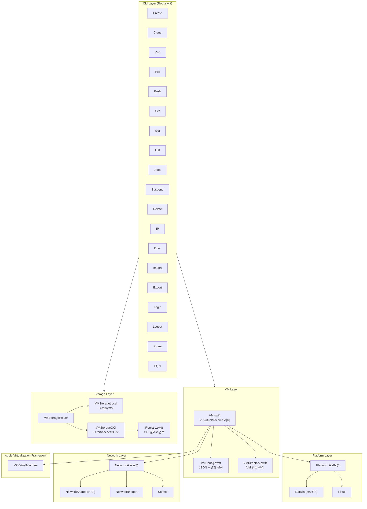
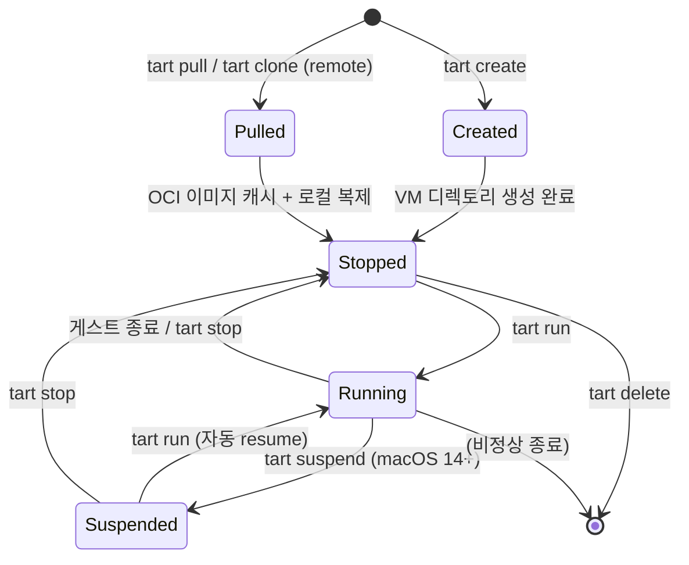

# Tart 아키텍처 (01-architecture)

## 목차

1. [프로젝트 개요](#1-프로젝트-개요)
2. [전체 아키텍처 다이어그램](#2-전체-아키텍처-다이어그램)
3. [핵심 컴포넌트 관계](#3-핵심-컴포넌트-관계)
4. [초기화 흐름](#4-초기화-흐름)
5. [VM 라이프사이클](#5-vm-라이프사이클)
6. [데이터 흐름](#6-데이터-흐름)
7. [설계 원칙](#7-설계-원칙)
8. [서브시스템 개요](#8-서브시스템-개요)
9. [의존성 구조](#9-의존성-구조)
10. [파일 시스템 레이아웃](#10-파일-시스템-레이아웃)

---

## 1. 프로젝트 개요

### 1.1 Tart란 무엇인가

Tart는 Apple Silicon(arm64) 기반 macOS 호스트에서 macOS 및 Linux 가상 머신을 생성, 실행, 관리하는 CLI 도구이다. Cirrus Labs에서 개발하였으며, CI/CD 자동화 환경에 특화된 가상화 도구이다.

핵심 기술 스택:
- **언어**: Swift 5.10
- **플랫폼**: macOS 13.0 (Ventura) 이상
- **가상화 프레임워크**: Apple의 `Virtualization.Framework` (VZVirtualMachine)
- **CLI 프레임워크**: apple/swift-argument-parser
- **이미지 배포**: OCI(Open Container Initiative) 호환 레지스트리
- **빌드 시스템**: Swift Package Manager (`Package.swift`)

### 1.2 핵심 기능

| 기능 | 설명 |
|------|------|
| VM 생성 | macOS (IPSW 기반) 및 Linux VM 생성 |
| VM 실행 | GUI/Headless 모드, VNC, 시리얼 콘솔 지원 |
| OCI Pull/Push | OCI 호환 레지스트리에서 VM 이미지 가져오기/내보내기 |
| Clone | APFS Copy-on-Write를 활용한 빠른 VM 복제 |
| Suspend/Resume | macOS 14+ 에서 VM 상태 스냅샷 저장/복원 |
| Softnet | 사용자 공간 패킷 필터를 통한 네트워크 격리 |
| Guest Agent | gRPC 기반 VM 내부 명령 실행 (`tart exec`) |

### 1.3 아키텍처 철학

Tart는 다음 원칙을 따른다:

1. **Apple 프레임워크 직접 활용**: Virtualization.Framework를 최소 래핑으로 사용하여 near-native 성능 달성
2. **OCI 표준 호환**: Docker/Podman 레지스트리와 동일한 프로토콜로 VM 이미지를 배포
3. **프로토콜 지향 설계**: `Platform`, `Network`, `CredentialsProvider` 등 Swift 프로토콜 기반 추상화
4. **CLI 우선**: CI/CD 자동화에 최적화된 명령줄 인터페이스
5. **파일 기반 VM 번들**: config.json + disk.img + nvram.bin 으로 구성된 단순한 디렉토리 구조

---

## 2. 전체 아키텍처 다이어그램

### 2.1 계층 아키텍처 (ASCII)

```
┌─────────────────────────────────────────────────────────────────────┐
│                         사용자 (CLI)                                 │
│                    $ tart run/create/pull/push ...                   │
└──────────────────────────────┬──────────────────────────────────────┘
                               │
┌──────────────────────────────▼──────────────────────────────────────┐
│                    Root.swift (@main)                                │
│              swift-argument-parser 기반 진입점                        │
│  ┌──────┬──────┬──────┬──────┬──────┬──────┬──────┬──────┬───────┐  │
│  │Create│Clone │ Run  │ Pull │ Push │ Set  │ Get  │ List │ ...   │  │
│  │.swift│.swift│.swift│.swift│.swift│.swift│.swift│.swift│(19개) │  │
│  └──┬───┴──┬───┴──┬───┴──┬───┴──┬───┴──┬───┴──┬───┴──┬───┴───────┘  │
└─────┼──────┼──────┼──────┼──────┼──────┼──────┼──────┼──────────────┘
      │      │      │      │      │      │      │      │
┌─────▼──────▼──────▼──────▼──────▼──────▼──────▼──────▼──────────────┐
│                     VM 관리 레이어                                    │
│  ┌──────────┐ ┌──────────┐ ┌─────────────┐ ┌───────────────────┐   │
│  │ VM.swift │ │VMConfig  │ │ VMDirectory │ │VMStorageHelper    │   │
│  │(VZ래퍼)  │ │.swift    │ │ .swift      │ │.swift             │   │
│  └────┬─────┘ └────┬─────┘ └──────┬──────┘ └──┬────────────┬──┘   │
│       │            │              │            │            │       │
│       │      ┌─────▼───────┐  ┌──▼────────┐  ┌▼──────────┐ │      │
│       │      │ Platform    │  │VMStorage  │  │VMStorage  │ │      │
│       │      │ 프로토콜     │  │Local      │  │OCI        │ │      │
│       │      │ ┌────────┐  │  └───────────┘  └─────┬─────┘ │      │
│       │      │ │Darwin  │  │                       │       │      │
│       │      │ │Linux   │  │                 ┌─────▼─────┐ │      │
│       │      │ └────────┘  │                 │ Registry  │ │      │
│       │      └─────────────┘                 │ (OCI)     │ │      │
│       │                                      └───────────┘ │      │
└───────┼────────────────────────────────────────────────────┼──────┘
        │                                                    │
┌───────▼────────────────────────────────────────────────────▼──────┐
│                    인프라 레이어                                    │
│  ┌──────────┐ ┌──────────┐ ┌───────────┐ ┌───────────────────┐   │
│  │ Network  │ │ FileLock │ │ PIDLock   │ │ Credentials       │   │
│  │ 프로토콜  │ │ .swift   │ │ .swift    │ │ Provider          │   │
│  │┌────────┐│ └──────────┘ └───────────┘ │┌─────────────────┐│   │
│  ││Shared  ││                            ││Keychain         ││   │
│  ││Bridged ││                            ││DockerConfig     ││   │
│  ││Softnet ││                            ││Environment      ││   │
│  │└────────┘│                            │└─────────────────┘│   │
│  └──────────┘                            └───────────────────┘   │
└──────────────────────────────┬───────────────────────────────────┘
                               │
┌──────────────────────────────▼──────────────────────────────────┐
│              Apple Virtualization.Framework                      │
│  VZVirtualMachine, VZVirtualMachineConfiguration                │
│  VZMacOSBootLoader, VZEFIBootLoader                             │
│  VZNATNetworkDeviceAttachment, VZBridgedNetworkDeviceAttachment │
│  VZDiskImageStorageDeviceAttachment, VZVirtioSocketDevice       │
└─────────────────────────────────────────────────────────────────┘
```

### 2.2 Mermaid 아키텍처 다이어그램



### 2.3 컴포넌트 상호작용 다이어그램 (ASCII)

```
┌─────────────────── tart run myvm ───────────────────────┐
│                                                          │
│  Root.main()                                             │
│    ├─ parseAsRoot() → Run 커맨드 파싱                      │
│    ├─ Config().gc() → 임시 디렉토리 정리                    │
│    └─ Run.run()                                          │
│         ├─ VMStorageLocal().open("myvm")                 │
│         │    └─ VMDirectory(baseURL: ~/.tart/vms/myvm)   │
│         ├─ VM(vmDir:, network:, ...)                     │
│         │    ├─ VMConfig(fromURL: config.json)           │
│         │    ├─ craftConfiguration(...)                   │
│         │    │    ├─ platform.bootLoader(nvramURL:)       │
│         │    │    ├─ platform.platform(nvramURL:...)      │
│         │    │    ├─ platform.graphicsDevice(vmConfig:)   │
│         │    │    ├─ network.attachments()                │
│         │    │    ├─ VZDiskImageStorageDeviceAttachment   │
│         │    │    └─ configuration.validate()             │
│         │    └─ VZVirtualMachine(configuration:)          │
│         ├─ vm.start(recovery:, resume:)                  │
│         │    ├─ network.run(sema)                        │
│         │    └─ virtualMachine.start()/resume()           │
│         ├─ ControlSocket(vmDir.controlSocketURL).run()   │
│         └─ vm.run()                                      │
│              ├─ sema.waitUnlessCancelled()               │
│              └─ network.stop()                           │
└──────────────────────────────────────────────────────────┘
```

---

## 3. 핵심 컴포넌트 관계

### 3.1 Root.swift -- @main 진입점

**파일 경로**: `Sources/tart/Root.swift`

`Root`는 `@main` 어트리뷰트가 붙은 프로그램 진입점이며, `AsyncParsableCommand` 프로토콜을 채택하여 swift-argument-parser 기반의 CLI 명령 파싱을 수행한다.

```swift
// Sources/tart/Root.swift (라인 8~33)
@main
struct Root: AsyncParsableCommand {
  static var configuration = CommandConfiguration(
    commandName: "tart",
    version: CI.version,
    subcommands: [
      Create.self,
      Clone.self,
      Run.self,
      Set.self,
      Get.self,
      List.self,
      Login.self,
      Logout.self,
      IP.self,
      Exec.self,
      Pull.self,
      Push.self,
      Import.self,
      Export.self,
      Prune.self,
      Rename.self,
      Stop.self,
      Delete.self,
      FQN.self,
    ])
```

**등록된 서브커맨드 목록 (총 19개 + macOS 14 조건부 1개)**:

| 서브커맨드 | 파일 | 역할 |
|-----------|------|------|
| `Create` | Commands/Create.swift | macOS/Linux VM 생성 |
| `Clone` | Commands/Clone.swift | 로컬/원격 VM 복제 |
| `Run` | Commands/Run.swift | VM 실행 (GUI/Headless) |
| `Set` | Commands/Set.swift | VM 설정 변경 (CPU, 메모리 등) |
| `Get` | Commands/Get.swift | VM 설정 조회 |
| `List` | Commands/List.swift | VM 목록 표시 |
| `Login` | Commands/Login.swift | OCI 레지스트리 로그인 |
| `Logout` | Commands/Logout.swift | OCI 레지스트리 로그아웃 |
| `IP` | Commands/IP.swift | VM의 IP 주소 조회 |
| `Exec` | Commands/Exec.swift | VM 내부 명령 실행 |
| `Pull` | Commands/Pull.swift | 레지스트리에서 VM 이미지 가져오기 |
| `Push` | Commands/Push.swift | 레지스트리로 VM 이미지 내보내기 |
| `Import` | Commands/Import.swift | 파일에서 VM 가져오기 |
| `Export` | Commands/Export.swift | VM을 파일로 내보내기 |
| `Prune` | Commands/Prune.swift | 미사용 VM 이미지 정리 |
| `Rename` | Commands/Rename.swift | VM 이름 변경 |
| `Stop` | Commands/Stop.swift | 실행 중인 VM 중지 |
| `Delete` | Commands/Delete.swift | VM 삭제 |
| `FQN` | Commands/FQN.swift | OCI 정규화 이름 출력 |
| `Suspend` | Commands/Suspend.swift | VM 일시 중지 (macOS 14+) |

`Suspend` 커맨드는 런타임에 macOS 14 이상일 때만 추가된다:

```swift
// Sources/tart/Root.swift (라인 37~39)
if #available(macOS 14, *) {
  configuration.subcommands.append(Suspend.self)
}
```

### 3.2 VM.swift -- VZVirtualMachine 래퍼

**파일 경로**: `Sources/tart/VM.swift`

`VM` 클래스는 Apple Virtualization.Framework의 `VZVirtualMachine`을 감싸는 핵심 래퍼이다. `NSObject`를 상속하고 `VZVirtualMachineDelegate`, `ObservableObject`를 채택한다.

```swift
// Sources/tart/VM.swift (라인 25~86)
class VM: NSObject, VZVirtualMachineDelegate, ObservableObject {
  @Published var virtualMachine: VZVirtualMachine
  var configuration: VZVirtualMachineConfiguration
  var sema = AsyncSemaphore(value: 0)
  var name: String
  var config: VMConfig
  var network: Network
```

**핵심 멤버**:

| 프로퍼티 | 타입 | 역할 |
|---------|------|------|
| `virtualMachine` | `VZVirtualMachine` | 실제 가상 머신 인스턴스 (@Published) |
| `configuration` | `VZVirtualMachineConfiguration` | 가상 머신 하드웨어 설정 |
| `sema` | `AsyncSemaphore` | VM 종료 대기용 비동기 세마포어 |
| `name` | `String` | VM 이름 |
| `config` | `VMConfig` | Tart 설정 (JSON에서 로드) |
| `network` | `Network` | 네트워크 구현체 (Shared/Bridged/Softnet) |

**VM 초기화 과정** (기존 VM 로드):

```swift
// Sources/tart/VM.swift (라인 43~86)
init(vmDir: VMDirectory, network: Network = NetworkShared(), ...) throws {
    name = vmDir.name
    config = try VMConfig.init(fromURL: vmDir.configURL)

    if config.arch != CurrentArchitecture() {
        throw UnsupportedArchitectureError()
    }

    self.network = network
    configuration = try Self.craftConfiguration(
        diskURL: vmDir.diskURL,
        nvramURL: vmDir.nvramURL,
        vmConfig: config,
        network: network,
        ...
    )
    virtualMachine = VZVirtualMachine(configuration: configuration)

    super.init()
    virtualMachine.delegate = self
}
```

**craftConfiguration() -- 하드웨어 설정 조립**:

`craftConfiguration()`은 `VM.swift`의 라인 309~445에 위치한 **정적 메서드**로, VZVirtualMachineConfiguration의 모든 하드웨어 장치를 조립하는 핵심 로직이다.

```
craftConfiguration()이 설정하는 하드웨어 장치:
┌──────────────────────────────────────────────────┐
│  VZVirtualMachineConfiguration                    │
│  ├─ bootLoader       ← platform.bootLoader()     │
│  ├─ cpuCount         ← vmConfig.cpuCount          │
│  ├─ memorySize       ← vmConfig.memorySize        │
│  ├─ platform         ← platform.platform()        │
│  ├─ graphicsDevices  ← platform.graphicsDevice()  │
│  ├─ audioDevices     ← VZVirtioSoundDevice        │
│  ├─ keyboards        ← platform.keyboards()       │
│  ├─ pointingDevices  ← platform.pointingDevices() │
│  ├─ networkDevices   ← network.attachments()      │
│  ├─ consoleDevices   ← Spice Agent (clipboard)    │
│  │                     + Version console           │
│  ├─ storageDevices   ← VZDiskImageStorageDevice   │
│  │                     + 추가 디스크               │
│  ├─ entropyDevices   ← VZVirtioEntropy            │
│  ├─ directorySharing ← VirtioFS                   │
│  ├─ serialPorts      ← VZVirtioConsoleSerial      │
│  └─ socketDevices    ← VZVirtioSocketDevice       │
└──────────────────────────────────────────────────┘
```

주목할 점: 디스크 캐싱 모드에서 Linux VM은 기본적으로 `.cached`를 사용하고, macOS VM은 `.automatic`을 사용한다. 이는 Linux VM의 파일시스템 손상을 방지하기 위한 의도적 설계이다.

```swift
// Sources/tart/VM.swift (라인 405~409)
cachingMode: caching ?? (vmConfig.os == .linux ? .cached : .automatic),
```

**VZVirtualMachineDelegate 구현**:

```swift
// Sources/tart/VM.swift (라인 447~460)
func guestDidStop(_ virtualMachine: VZVirtualMachine) {
    print("guest has stopped the virtual machine")
    sema.signal()  // 세마포어 시그널로 run() 루프 해제
}

func virtualMachine(_ virtualMachine: VZVirtualMachine, didStopWithError error: Error) {
    print("guest has stopped the virtual machine due to error: \(error)")
    sema.signal()
}
```

게스트 OS가 정상 종료하거나 오류로 종료하면 `sema.signal()`을 호출하여, `run()` 메서드에서 대기 중인 세마포어를 해제한다.

### 3.3 VMConfig.swift -- JSON 직렬화 가능한 VM 설정

**파일 경로**: `Sources/tart/VMConfig.swift`

`VMConfig`는 `Codable` 프로토콜을 채택한 구조체로, VM의 하드웨어 설정을 JSON으로 직렬화/역직렬화한다. 이것이 `config.json` 파일의 데이터 모델이다.

```swift
// Sources/tart/VMConfig.swift (라인 56~68)
struct VMConfig: Codable {
  var version: Int = 1
  var os: OS                          // .darwin 또는 .linux
  var arch: Architecture              // .arm64 또는 .amd64
  var platform: Platform              // Darwin 또는 Linux 인스턴스
  var cpuCountMin: Int                // 최소 CPU 코어 수
  private(set) var cpuCount: Int      // 현재 CPU 코어 수
  var memorySizeMin: UInt64           // 최소 메모리 (바이트)
  private(set) var memorySize: UInt64 // 현재 메모리 (바이트)
  var macAddress: VZMACAddress        // MAC 주소
  var display: VMDisplayConfig        // 디스플레이 설정 (해상도)
  var displayRefit: Bool?             // 디스플레이 자동 조정
  var diskFormat: DiskImageFormat     // 디스크 이미지 형식 (raw/asif)
}
```

**JSON CodingKeys**:

```swift
// Sources/tart/VMConfig.swift (라인 17~33)
enum CodingKeys: String, CodingKey {
  case version
  case os
  case arch
  case cpuCountMin
  case cpuCount
  case memorySizeMin
  case memorySize
  case macAddress
  case display
  case displayRefit
  case diskFormat
  // macOS 전용
  case ecid
  case hardwareModel
}
```

**CPU/메모리 설정 검증**:

`setCPU()`와 `setMemory()` 메서드는 하한값 검증을 수행한다. macOS VM은 복원 이미지의 최소 요구 사항(`cpuCountMin`, `memorySizeMin`)을 반드시 충족해야 하고, Linux VM은 Virtualization.Framework의 최소값만 충족하면 된다.

```swift
// Sources/tart/VMConfig.swift (라인 164~176)
mutating func setCPU(cpuCount: Int) throws {
    if os == .darwin && cpuCount < cpuCountMin {
        throw LessThanMinimalResourcesError(...)
    }
    if cpuCount < VZVirtualMachineConfiguration.minimumAllowedCPUCount {
        throw LessThanMinimalResourcesError(...)
    }
    self.cpuCount = cpuCount
}
```

**VMDisplayConfig**:

```swift
// Sources/tart/VMConfig.swift (라인 35~44)
struct VMDisplayConfig: Codable, Equatable {
  enum Unit: String, Codable {
    case point = "pt"
    case pixel = "px"
  }
  var width: Int = 1024
  var height: Int = 768
  var unit: Unit?
}
```

디스플레이 해상도를 포인트(pt) 또는 픽셀(px) 단위로 지정할 수 있다. macOS VM의 Darwin 플랫폼에서 포인트 단위를 사용하면 호스트의 `NSScreen.main`을 기준으로 Retina 해상도를 자동 적용한다.

### 3.4 VMDirectory -- VM 번들 구조

**파일 경로**: `Sources/tart/VMDirectory.swift`

`VMDirectory`는 VM을 구성하는 파일들의 번들 디렉토리를 나타내는 구조체이다. `Prunable` 프로토콜을 채택한다.

```swift
// Sources/tart/VMDirectory.swift (라인 5~38)
struct VMDirectory: Prunable {
  enum State: String {
    case Running = "running"
    case Suspended = "suspended"
    case Stopped = "stopped"
  }

  var baseURL: URL

  var configURL: URL {
    baseURL.appendingPathComponent("config.json")
  }
  var diskURL: URL {
    baseURL.appendingPathComponent("disk.img")
  }
  var nvramURL: URL {
    baseURL.appendingPathComponent("nvram.bin")
  }
  var stateURL: URL {
    baseURL.appendingPathComponent("state.vzvmsave")
  }
  var manifestURL: URL {
    baseURL.appendingPathComponent("manifest.json")
  }
  var controlSocketURL: URL {
    URL(fileURLWithPath: "control.sock", relativeTo: baseURL)
  }
}
```

**VM 번들 디렉토리 구조**:

```
~/.tart/vms/myvm/
├── config.json       ← VMConfig (JSON 직렬화)
├── disk.img          ← 디스크 이미지 (raw 또는 ASIF 형식)
├── nvram.bin         ← NVRAM/EFI 변수 저장소
├── state.vzvmsave    ← VM 일시중지 상태 스냅샷 (선택)
├── manifest.json     ← OCI 매니페스트 (OCI에서 pull한 경우)
├── control.sock      ← Unix 도메인 소켓 (VM 실행 중)
└── .explicitly-pulled ← 명시적 pull 마크 (OCI GC 보호)
```

**VM 상태 판별 로직**:

```swift
// Sources/tart/VMDirectory.swift (라인 62~69)
func state() throws -> State {
    if try running() {
        return State.Running
    } else if FileManager.default.fileExists(atPath: stateURL.path) {
        return State.Suspended
    } else {
        return State.Stopped
    }
}
```

VM 상태는 세 가지로 구분된다:
- **Running**: PIDLock으로 확인한 프로세스가 존재
- **Suspended**: `state.vzvmsave` 파일이 존재 (macOS 14+ 스냅샷)
- **Stopped**: 위 두 조건 모두 해당하지 않음

**초기화 검증**:

```swift
// Sources/tart/VMDirectory.swift (라인 90~106)
var initialized: Bool {
    FileManager.default.fileExists(atPath: configURL.path) &&
      FileManager.default.fileExists(atPath: diskURL.path) &&
      FileManager.default.fileExists(atPath: nvramURL.path)
}
```

`config.json`, `disk.img`, `nvram.bin` 세 파일이 모두 존재해야 유효한 VM 번들로 인정된다.

### 3.5 VMStorageLocal / VMStorageOCI -- 이중 스토리지 시스템

Tart는 두 가지 스토리지 시스템을 운영한다.

#### VMStorageLocal

**파일 경로**: `Sources/tart/VMStorageLocal.swift`

```swift
// Sources/tart/VMStorageLocal.swift (라인 3~8)
class VMStorageLocal: PrunableStorage {
  let baseURL: URL

  init() throws {
    baseURL = try Config().tartHomeDir.appendingPathComponent("vms", isDirectory: true)
  }
```

로컬 VM 저장소로, 기본 경로는 `~/.tart/vms/`이다. `PrunableStorage` 프로토콜을 채택한다.

| 메서드 | 역할 |
|--------|------|
| `exists(_ name:)` | VM 존재 여부 확인 |
| `open(_ name:)` | VMDirectory 열기 (검증 포함) |
| `create(_ name:)` | 새 VM 디렉토리 생성 |
| `move(_ name:, from:)` | 임시 디렉토리에서 이동 |
| `rename(_, _)` | VM 이름 변경 |
| `delete(_ name:)` | VM 삭제 (PIDLock 확인) |
| `list()` | 모든 로컬 VM 목록 |
| `hasVMsWithMACAddress(macAddress:)` | MAC 주소 충돌 확인 |

#### VMStorageOCI

**파일 경로**: `Sources/tart/VMStorageOCI.swift`

```swift
// Sources/tart/VMStorageOCI.swift (라인 5~9)
class VMStorageOCI: PrunableStorage {
  let baseURL: URL

  init() throws {
    baseURL = try Config().tartCacheDir.appendingPathComponent("OCIs", isDirectory: true)
  }
```

OCI 캐시 저장소로, 기본 경로는 `~/.tart/cache/OCIs/`이다. 태그 기반 이미지는 심볼릭 링크로 다이제스트 기반 이미지를 가리킨다.

```
~/.tart/cache/OCIs/
└── ghcr.io/
    └── cirruslabs/
        └── macos-tahoe-base/
            ├── latest -> sha256:abc123...   (심볼릭 링크, 태그)
            └── sha256:abc123.../            (실제 VM 파일)
                ├── config.json
                ├── disk.img
                ├── nvram.bin
                └── manifest.json
```

**가비지 컬렉션(GC)**:

```swift
// Sources/tart/VMStorageOCI.swift (라인 68~103)
func gc() throws {
    // 1. 참조 카운트 수집
    // 2. 깨진 심볼릭 링크 제거
    // 3. 명시적으로 pull되지 않았고 참조가 0인 다이제스트 이미지 제거
}
```

GC는 참조 카운트 기반으로 동작한다:
- 심볼릭 링크(태그)가 깨져 있으면 즉시 삭제
- 다이제스트 기반 이미지는 `.explicitly-pulled` 마크가 없고 심볼릭 링크 참조가 0이면 삭제

#### VMStorageHelper

**파일 경로**: `Sources/tart/VMStorageHelper.swift`

```swift
// Sources/tart/VMStorageHelper.swift (라인 3~12)
class VMStorageHelper {
  static func open(_ name: String) throws -> VMDirectory {
    try missingVMWrap(name) {
      if let remoteName = try? RemoteName(name) {
        return try VMStorageOCI().open(remoteName)
      } else {
        return try VMStorageLocal().open(name)
      }
    }
  }
```

이름에 `/`가 포함되어 `RemoteName`으로 파싱 가능하면 OCI 스토리지에서 조회하고, 그렇지 않으면 로컬 스토리지에서 조회한다. 두 스토리지의 통합 접근 레이어 역할을 한다.

### 3.6 Registry -- OCI 레지스트리 클라이언트

**파일 경로**: `Sources/tart/OCI/Registry.swift`

```swift
// Sources/tart/OCI/Registry.swift (라인 113~136)
class Registry {
  private let baseURL: URL
  let namespace: String
  let credentialsProviders: [CredentialsProvider]
  let authenticationKeeper = AuthenticationKeeper()
```

OCI Distribution Spec을 구현하는 HTTP 클라이언트이다.

**핵심 API**:

| 메서드 | HTTP | 역할 |
|--------|------|------|
| `ping()` | `GET /v2/` | 레지스트리 연결 확인 |
| `pullManifest(reference:)` | `GET /v2/{ns}/manifests/{ref}` | 매니페스트 가져오기 |
| `pushManifest(reference:, manifest:)` | `PUT /v2/{ns}/manifests/{ref}` | 매니페스트 올리기 |
| `pullBlob(digest:, handler:)` | `GET /v2/{ns}/blobs/{digest}` | BLOB 스트리밍 다운로드 |
| `pushBlob(fromData:)` | `POST + PUT /v2/{ns}/blobs/uploads/` | BLOB 업로드 (모놀리식/청크) |
| `blobExists(digest:)` | `HEAD /v2/{ns}/blobs/{digest}` | BLOB 존재 확인 |

**인증 흐름**:

```
1. 요청 전송
2. 401 Unauthorized 수신
3. WWW-Authenticate 헤더 파싱
4. Bearer 방식 → 토큰 서버에서 토큰 발급
   Basic 방식  → 자격증명 직접 전송
5. Authorization 헤더에 토큰/자격증명 포함하여 재요청
```

자격증명은 3단계 폴백 체인으로 조회한다:

```swift
// Sources/tart/OCI/Registry.swift (라인 131)
credentialsProviders: [CredentialsProvider] = [
    EnvironmentCredentialsProvider(),    // TART_REGISTRY_USERNAME/PASSWORD 환경변수
    DockerConfigCredentialsProvider(),   // ~/.docker/config.json
    KeychainCredentialsProvider()        // macOS Keychain
]
```

### 3.7 Network 프로토콜 -- 네트워크 추상화

**파일 경로**: `Sources/tart/Network/Network.swift`

```swift
// Sources/tart/Network/Network.swift
protocol Network {
  func attachments() -> [VZNetworkDeviceAttachment]
  func run(_ sema: AsyncSemaphore) throws
  func stop() async throws
}
```

세 가지 구현체가 있다:

| 구현체 | 파일 | 방식 | 용도 |
|--------|------|------|------|
| `NetworkShared` | NetworkShared.swift | `VZNATNetworkDeviceAttachment` | 기본 NAT 네트워크 |
| `NetworkBridged` | NetworkBridged.swift | `VZBridgedNetworkDeviceAttachment` | 물리 인터페이스 브릿지 |
| `Softnet` | Softnet.swift | `VZFileHandleNetworkDeviceAttachment` | 소프트웨어 패킷 필터 |

**NetworkShared (기본)**:

```swift
// Sources/tart/Network/NetworkShared.swift (라인 5~17)
class NetworkShared: Network {
  func attachments() -> [VZNetworkDeviceAttachment] {
    [VZNATNetworkDeviceAttachment()]
  }
  func run(_ sema: AsyncSemaphore) throws { }  // no-op
  func stop() async throws { }                 // no-op
}
```

가장 단순한 구현으로, Apple의 기본 NAT 네트워킹을 사용한다. `run()`과 `stop()`은 no-op이다.

**Softnet**:

```swift
// Sources/tart/Network/Softnet.swift (라인 12~36)
class Softnet: Network {
  private let process = Process()
  let vmFD: Int32

  init(vmMACAddress: String, extraArguments: [String] = []) throws {
    let fds = UnsafeMutablePointer<Int32>.allocate(capacity: MemoryLayout<Int>.stride * 2)
    let ret = socketpair(AF_UNIX, SOCK_DGRAM, 0, fds)
    vmFD = fds[0]
    let softnetFD = fds[1]
    ...
    process.executableURL = try Self.softnetExecutableURL()
    process.arguments = ["--vm-fd", String(STDIN_FILENO), "--vm-mac-address", vmMACAddress] + extraArguments
  }
```

Softnet은 별도의 `softnet` 바이너리를 자식 프로세스로 실행하여 Unix 도메인 소켓(`socketpair`)을 통해 VM과 통신한다. SUID 비트가 필요하며, 초기 사용 시 `configureSUIDBitIfNeeded()`로 자동 설정을 시도한다.

### 3.8 Platform 프로토콜 -- 플랫폼 추상화

**파일 경로**: `Sources/tart/Platform/Platform.swift`

```swift
// Sources/tart/Platform/Platform.swift
protocol Platform: Codable {
  func os() -> OS
  func bootLoader(nvramURL: URL) throws -> VZBootLoader
  func platform(nvramURL: URL, needsNestedVirtualization: Bool) throws -> VZPlatformConfiguration
  func graphicsDevice(vmConfig: VMConfig) -> VZGraphicsDeviceConfiguration
  func keyboards() -> [VZKeyboardConfiguration]
  func pointingDevices() -> [VZPointingDeviceConfiguration]
  func pointingDevicesSimplified() -> [VZPointingDeviceConfiguration]
}

protocol PlatformSuspendable: Platform {
  func pointingDevicesSuspendable() -> [VZPointingDeviceConfiguration]
  func keyboardsSuspendable() -> [VZKeyboardConfiguration]
}
```

**Darwin 구현체** (`Sources/tart/Platform/Darwin.swift`):

```swift
// Sources/tart/Platform/Darwin.swift (라인 11~13)
struct Darwin: PlatformSuspendable {
  var ecid: VZMacMachineIdentifier
  var hardwareModel: VZMacHardwareModel
```

| 메서드 | 반환값 | 설명 |
|--------|--------|------|
| `os()` | `.darwin` | macOS 게스트 |
| `bootLoader()` | `VZMacOSBootLoader()` | macOS 부트 로더 |
| `platform()` | `VZMacPlatformConfiguration` | ECID, 하드웨어 모델, 보조 스토리지 설정 |
| `graphicsDevice()` | `VZMacGraphicsDeviceConfiguration` | Retina 지원 (포인트/픽셀 단위) |
| `keyboards()` | `[VZUSBKeyboard, VZMacKeyboard]` | macOS 14+ Mac 키보드 포함 |
| `pointingDevices()` | `[VZUSBScreenCoordinate, VZMacTrackpad]` | 트랙패드 지원 |

Darwin은 `PlatformSuspendable`을 채택하여 `keyboardsSuspendable()`, `pointingDevicesSuspendable()` 메서드도 제공한다. 일시중지(Suspend) 기능은 Mac 전용 입력 장치만 사용해야 동작한다.

**Linux 구현체** (`Sources/tart/Platform/Linux.swift`):

```swift
// Sources/tart/Platform/Linux.swift (라인 3~4)
@available(macOS 13, *)
struct Linux: Platform {
```

| 메서드 | 반환값 | 설명 |
|--------|--------|------|
| `os()` | `.linux` | Linux 게스트 |
| `bootLoader()` | `VZEFIBootLoader` + `VZEFIVariableStore` | EFI 부트 로더 |
| `platform()` | `VZGenericPlatformConfiguration` | 범용 플랫폼, macOS 15+에서 중첩 가상화 지원 |
| `graphicsDevice()` | `VZVirtioGraphicsDeviceConfiguration` | Virtio 그래픽 |
| `keyboards()` | `[VZUSBKeyboardConfiguration]` | USB 키보드만 |
| `pointingDevices()` | `[VZUSBScreenCoordinatePointingDevice]` | USB 포인팅 장치만 |

**OS / Architecture 열거형**:

```swift
// Sources/tart/Platform/OS.swift
enum OS: String, Codable {
  case darwin
  case linux
}

// Sources/tart/Platform/Architecture.swift
enum Architecture: String, Codable {
  case arm64
  case amd64
}
```

---

## 4. 초기화 흐름

### 4.1 main() 실행 흐름 상세

```
┌─ Root.main() ──────────────────────────────────────────────┐
│                                                             │
│  1. macOS 14 체크 → Suspend 서브커맨드 동적 등록             │
│                                                             │
│  2. SIGINT 핸들러 설정                                       │
│     ├─ signal(SIGINT, SIG_IGN)  기본 핸들러 비활성화          │
│     └─ DispatchSource.makeSignalSource(signal: SIGINT)      │
│        └─ task.cancel()  현재 Task 취소                      │
│                                                             │
│  3. setlinebuf(stdout)  표준출력 라인 버퍼 설정               │
│                                                             │
│  4. OTel.shared.flush() 등록 (defer)                        │
│                                                             │
│  5. parseAsRoot() → 커맨드 파싱                              │
│                                                             │
│  6. OpenTelemetry 루트 스팬 생성                              │
│     ├─ spanName = 커맨드 이름                                │
│     ├─ 명령줄 인수 attribute 기록                            │
│     └─ CIRRUS_SENTRY_TAGS 환경변수 → 추가 attribute          │
│                                                             │
│  7. 가비지 컬렉션 (GC)                                       │
│     ├─ Pull, Clone 커맨드는 제외 (자체 GC 수행)               │
│     └─ Config().gc() → ~/.tart/tmp/ 내 잠금 해제된 항목 삭제  │
│                                                             │
│  8. 커맨드 실행                                               │
│     ├─ AsyncParsableCommand → try await asyncCommand.run()  │
│     └─ ParsableCommand → try command.run()                  │
│                                                             │
│  9. 에러 처리                                                │
│     ├─ ExecCustomExitCodeError → Foundation.exit(exitCode)  │
│     ├─ HasExitCode → stderr 출력 + exit(exitCode)           │
│     └─ 기타 → ArgumentParser의 exit(withError:) 호출         │
└─────────────────────────────────────────────────────────────┘
```

### 4.2 GC 메커니즘

```swift
// Sources/tart/Config.swift (라인 28~40)
func gc() throws {
    for entry in try FileManager.default.contentsOfDirectory(at: tartTmpDir, ...) {
        let lock = try FileLock(lockURL: entry)
        if try !lock.trylock() {
            continue  // 잠겨 있으면 건너뜀 (사용 중)
        }
        try FileManager.default.removeItem(at: entry)
        try lock.unlock()
    }
}
```

매 커맨드 실행 전 `~/.tart/tmp/` 디렉토리를 순회하며, `FileLock`으로 잠금 시도에 성공하는(즉, 사용 중이 아닌) 항목을 삭제한다. `Pull`과 `Clone` 커맨드는 자체적으로 GC를 수행하므로 이 단계를 건너뛴다.

### 4.3 Config -- 디렉토리 설정

**파일 경로**: `Sources/tart/Config.swift`

```swift
// Sources/tart/Config.swift (라인 3~6)
struct Config {
  let tartHomeDir: URL    // ~/.tart/ (또는 TART_HOME 환경변수)
  let tartCacheDir: URL   // ~/.tart/cache/
  let tartTmpDir: URL     // ~/.tart/tmp/
```

`TART_HOME` 환경변수로 홈 디렉토리를 변경할 수 있다. 기본값은 `~/.tart/`이다.

---

## 5. VM 라이프사이클

### 5.1 전체 라이프사이클



### 5.2 Create 흐름

```
tart create myvm --from-ipsw latest --disk-size 50

1. VMDirectory.temporary() → ~/.tart/tmp/{UUID}/ 임시 디렉토리 생성
2. FileLock(lockURL: tmpVMDir.baseURL) → GC 보호를 위한 잠금
3. [macOS] VZMacOSRestoreImage.fetchLatestSupported() → IPSW URL 획득
4. VM(vmDir:, ipswURL:, diskSizeGB:)
   a. IPSW 다운로드/캐시 확인 (IPSWCache)
   b. VZMacOSRestoreImage.load(from:) → 복원 이미지 로드
   c. VZMacAuxiliaryStorage 생성 → nvram.bin
   d. vmDir.resizeDisk(50) → disk.img (50GB sparse file)
   e. VMConfig 생성 (Darwin 플랫폼, 최소 4 CPU)
   f. config.save(toURL: config.json)
   g. craftConfiguration() → VZVirtualMachineConfiguration 조립
   h. VZMacOSInstaller(virtualMachine:, restoringFromImageAt:) → OS 설치
5. [Linux] VM.linux(vmDir:, diskSizeGB:)
   a. VZEFIVariableStore 생성 → nvram.bin
   b. vmDir.resizeDisk(50) → disk.img
   c. VMConfig(platform: Linux(), cpuCountMin: 4, memorySizeMin: 4GB)
6. VMStorageLocal().move(name, from: tmpVMDir) → ~/.tart/vms/myvm/ 으로 이동
```

### 5.3 Run 흐름

```
tart run myvm

1. VMStorageLocal().open("myvm") → VMDirectory
2. VMConfig(fromURL: config.json) → 디스크 형식 검증
3. FileLock(Config().tartHomeDir) → 전역 잠금
   └─ MAC 주소 충돌 체크 → 충돌 시 regenerateMACAddress()
4. VM(vmDir:, network:, additionalStorageDevices:, ...)
   ├─ VMConfig 로드
   ├─ craftConfiguration() → 하드웨어 설정 조립
   └─ VZVirtualMachine(configuration:)
5. PIDLock(lockURL: config.json) → VM 실행 잠금
6. [macOS 14+] state.vzvmsave 존재 시
   └─ virtualMachine.restoreMachineStateFrom(url:) → 스냅샷 복원
7. vm.start(recovery:, resume:)
   ├─ network.run(sema) → Softnet인 경우 자식 프로세스 시작
   └─ virtualMachine.start() 또는 virtualMachine.resume()
8. [macOS 14+] ControlSocket(vmDir.controlSocketURL).run()
   └─ Unix 도메인 소켓 → VM VirtioSocket 프록시
9. vm.run()
   ├─ sema.waitUnlessCancelled() → VM 종료 대기
   │   └─ guestDidStop() → sema.signal() → 대기 해제
   └─ network.stop()
10. 시그널 핸들러:
    ├─ SIGINT  → task.cancel() → VM 정상 종료
    ├─ SIGUSR1 → pause() + saveMachineState() → 스냅샷 저장
    └─ SIGUSR2 → requestStop() → 게스트 OS에 종료 요청
```

### 5.4 Stop 메커니즘

**파일 경로**: `Sources/tart/Commands/Stop.swift`

```
tart stop myvm

1. VMStorageLocal().open("myvm") → VMDirectory
2. vmDir.state() 확인
   ├─ Suspended → state.vzvmsave 삭제
   ├─ Running → stopRunning() 진행
   └─ Stopped → RuntimeError.VMNotRunning
3. stopRunning():
   a. PIDLock → 실행 중인 VM의 PID 획득
   b. kill(pid, SIGINT) → "tart run" 프로세스에 인터럽트
   c. 30초 타임아웃 동안 100ms 간격 폴링
      └─ lock.pid() == 0 이면 성공
   d. 타임아웃 후 → kill(pid, SIGKILL) → 강제 종료
```

### 5.5 Suspend/Resume 흐름

**Suspend** (`tart suspend myvm`):

```
1. PIDLock → VM PID 획득
2. kill(pid, SIGUSR1)
   └─ "tart run"의 SIGUSR1 핸들러 → pause() + saveMachineStateTo(vmDir.stateURL)
3. VM 프로세스 자동 종료
4. state.vzvmsave 파일 생성
```

**Resume** (`tart run myvm` -- 자동 감지):

```
1. state.vzvmsave 파일 존재 확인
2. virtualMachine.restoreMachineStateFrom(url: stateURL)
3. state.vzvmsave 삭제
4. virtualMachine.resume()
```

### 5.6 세마포어 기반 종료 대기 패턴

Tart의 VM 실행은 `AsyncSemaphore`(Semaphore 패키지)를 사용하는 독특한 패턴을 따른다:

```
                            ┌─ network.run(sema) ─────────────────┐
                            │  Softnet: 프로세스 종료 시 sema.signal()│
                            └─────────────────────────────────────┘

   vm.run()                 ┌─ VZVirtualMachineDelegate ──────────┐
     │                      │  guestDidStop() → sema.signal()      │
     │                      │  didStopWithError() → sema.signal()  │
     ▼                      │  attachmentDisconnected→sema.signal()│
  sema.waitUnlessCancelled()└─────────────────────────────────────┘
     │
     │  ← (Task.cancel()로도 해제 가능)
     ▼
  network.stop()
```

세마포어 값은 0으로 초기화되어 `signal()`이 호출될 때까지 `wait()`에서 블록된다. 이 패턴으로 VM 종료 이벤트(게스트 종료, 네트워크 오류, 외부 취소)를 통합적으로 처리한다.

---

## 6. 데이터 흐름

### 6.1 Pull 데이터 흐름

```
tart pull ghcr.io/cirruslabs/macos-tahoe-base:latest

┌──────────┐    ┌───────────┐    ┌──────────┐    ┌────────────┐
│ Pull.swift│───►│VMStorageOCI│───►│ Registry │───►│ OCI 레지스트리 │
│           │    │ .pull()   │    │          │    │ (ghcr.io)  │
└──────────┘    └─────┬─────┘    └────┬─────┘    └────────────┘
                      │               │
                      │  1. pullManifest()
                      │  ◄────────────┤ OCIManifest (JSON)
                      │               │
                      │  2. 다이제스트 기반 중복 확인
                      │     └─ exists(digestName) → 캐시 히트 시 종료
                      │               │
                      │  3. FileLock(hostDirectoryURL) → 동시 pull 방지
                      │               │
                      ▼               │
              ┌──────────────┐        │
              │ VMDirectory  │        │
              │ (임시)        │        │
              │              │ 4. pullFromRegistry()
              │  config.json │ ◄──────┤ pullBlob(configLayer)
              │  disk.img    │ ◄──────┤ DiskV2.pull(diskLayers) [병렬]
              │  nvram.bin   │ ◄──────┤ pullBlob(nvramLayer)
              │  manifest.json│◄──────┤ manifest 저장
              └──────┬───────┘        │
                     │                │
                     ▼                │
              move(digestName, from:) │
              symlink(tag → digest)   │
```

**OCI 매니페스트 구조**:

```json
{
  "schemaVersion": 2,
  "mediaType": "application/vnd.oci.image.manifest.v1+json",
  "config": {
    "mediaType": "application/vnd.oci.image.config.v1+json",
    "size": 123,
    "digest": "sha256:..."
  },
  "layers": [
    {
      "mediaType": "application/vnd.cirruslabs.tart.config.v1",
      "size": 456,
      "digest": "sha256:..."
    },
    {
      "mediaType": "application/vnd.cirruslabs.tart.disk.v2",
      "size": 789,
      "digest": "sha256:...",
      "annotations": {
        "org.cirruslabs.tart.uncompressed-size": "...",
        "org.cirruslabs.tart.uncompressed-content-digest": "sha256:..."
      }
    },
    {
      "mediaType": "application/vnd.cirruslabs.tart.nvram.v1",
      "size": 101,
      "digest": "sha256:..."
    }
  ],
  "annotations": {
    "org.cirruslabs.tart.uncompressed-disk-size": "50000000000",
    "org.cirruslabs.tart.upload-time": "..."
  }
}
```

Tart 고유의 미디어 타입:

```swift
// Sources/tart/OCI/Manifest.swift (라인 4~11)
let ociManifestMediaType = "application/vnd.oci.image.manifest.v1+json"
let ociConfigMediaType = "application/vnd.oci.image.config.v1+json"
let configMediaType = "application/vnd.cirruslabs.tart.config.v1"
let diskV2MediaType = "application/vnd.cirruslabs.tart.disk.v2"
let nvramMediaType = "application/vnd.cirruslabs.tart.nvram.v1"
```

### 6.2 Push 데이터 흐름

```
tart push myvm ghcr.io/myorg/myvm:v1.0

┌──────────┐    ┌──────────────┐    ┌──────────┐    ┌────────────┐
│Push.swift │───►│VMDirectory   │───►│ Registry │───►│ OCI 레지스트리│
│           │    │+OCI.swift    │    │          │    │            │
└──────────┘    └──────┬───────┘    └────┬─────┘    └────────────┘
                       │                 │
                       │  1. config.json → pushBlob()
                       │  ─────────────►│ → configMediaType 레이어
                       │                 │
                       │  2. disk.img → DiskV2.push() [압축 + 병렬]
                       │  ─────────────►│ → diskV2MediaType 레이어(들)
                       │                 │
                       │  3. nvram.bin → pushBlob()
                       │  ─────────────►│ → nvramMediaType 레이어
                       │                 │
                       │  4. OCIConfig + OCIManifest 조립
                       │  ─────────────►│ → pushManifest(reference:)
                       │                 │
```

### 6.3 Clone 데이터 흐름

```
tart clone ghcr.io/cirruslabs/macos-tahoe-base:latest myvm

1. [원격 이름 감지] RemoteName 파싱 성공
   └─ VMStorageOCI().pull() → OCI 이미지 캐시
2. VMStorageHelper.open(sourceName) → OCI 캐시의 VMDirectory
3. VMDirectory.temporary() → ~/.tart/tmp/{UUID}/
4. FileLock(Config().tartHomeDir) → 전역 잠금
5. sourceVM.clone(to: tmpVMDir, generateMAC: true)
   ├─ FileManager.copyItem (config.json, nvram.bin, disk.img)
   │   └─ APFS Copy-on-Write: 실제 데이터 복사 없이 즉시 완료
   └─ regenerateMACAddress() → MAC 주소 재생성
6. VMStorageLocal().move(newName, from: tmpVMDir)
   └─ ~/.tart/tmp/{UUID}/ → ~/.tart/vms/myvm/
7. Prune.reclaimIfNeeded() → 남은 공간 확보
```

APFS의 Copy-on-Write 메커니즘 덕분에 수십 GB의 디스크 이미지도 거의 즉시 복제된다. 쓰기가 발생할 때만 실제 데이터가 복사된다.

---

## 7. 설계 원칙

### 7.1 프로토콜 지향 추상화

Tart는 Swift의 프로토콜 지향 프로그래밍 패러다임을 적극적으로 활용한다.

| 프로토콜 | 파일 | 구현체 | 추상화 대상 |
|---------|------|--------|------------|
| `Platform` | Platform/Platform.swift | `Darwin`, `Linux` | OS별 부트 로더, 플랫폼, 입력 장치 |
| `PlatformSuspendable` | Platform/Platform.swift | `Darwin` | 일시중지 가능한 플랫폼 |
| `Network` | Network/Network.swift | `NetworkShared`, `NetworkBridged`, `Softnet` | 네트워크 어태치먼트 |
| `CredentialsProvider` | Credentials/CredentialsProvider.swift | `Keychain`, `DockerConfig`, `Environment` | 인증 자격증명 |
| `Authentication` | OCI/Authentication.swift | `BasicAuthentication`, `TokenResponse` | HTTP 인증 헤더 |
| `Prunable` | Prunable.swift | `VMDirectory` | 삭제 가능한 리소스 |
| `PrunableStorage` | Prunable.swift | `VMStorageLocal`, `VMStorageOCI` | 정리 가능한 스토리지 |

**왜 프로토콜인가?**

`Platform` 프로토콜이 대표적인 예이다. macOS와 Linux VM은 부트 로더(`VZMacOSBootLoader` vs `VZEFIBootLoader`), 플랫폼 설정(`VZMacPlatformConfiguration` vs `VZGenericPlatformConfiguration`), 그래픽 장치(`VZMacGraphicsDevice` vs `VZVirtioGraphicsDevice`)가 모두 다르다. `Platform` 프로토콜로 이 차이를 추상화하면, `craftConfiguration()` 메서드는 OS 종류를 신경 쓰지 않고 `vmConfig.platform.bootLoader()` 같은 통합 인터페이스를 사용할 수 있다.

### 7.2 Apple 프레임워크 직접 활용

Tart는 Apple Virtualization.Framework를 최소한으로 래핑한다. `VM.swift`의 `craftConfiguration()`을 보면, VZ* 클래스를 직접 조합하여 Configuration을 만든다. 별도의 중간 추상화 레이어 없이 프레임워크의 API를 있는 그대로 사용한다.

이 접근의 장점:
- 프레임워크 업데이트(새 macOS 버전)에 빠르게 대응 가능
- `#available(macOS 14, *)` 같은 조건부 컴파일로 새 기능을 점진적으로 도입
- 불필요한 추상화 레이어 없어 디버깅이 용이

### 7.3 OCI 표준 호환

Tart의 VM 이미지는 OCI Distribution Specification을 따르는 레지스트리에 저장된다. Docker Hub, GitHub Container Registry(ghcr.io), Amazon ECR 등 표준 컨테이너 레지스트리를 그대로 사용할 수 있다.

```
                 OCI 표준 프로토콜
Docker Registry ◄─────────────────────► Tart CLI
ghcr.io         ◄─────────────────────► tart pull/push
Amazon ECR      ◄─────────────────────►
```

레이어 미디어 타입만 Tart 고유(`application/vnd.cirruslabs.tart.*`)이며, 매니페스트 구조와 인증/전송 프로토콜은 완전히 표준을 따른다.

### 7.4 파일 기반 VM 번들

VM의 모든 상태가 파일 시스템에 저장된다. 데이터베이스나 별도 데몬 없이, 디렉토리 하나가 VM 전체를 표현한다. 이 설계 덕분에:
- APFS Clone (Copy-on-Write)을 활용한 빠른 복제
- 파일 잠금(`FileLock`, `PIDLock`)으로 동시성 제어
- 디렉토리 삭제만으로 VM 완전 제거

### 7.5 임시 디렉토리 + 원자적 이동 패턴

VM 생성/복제/Pull 작업은 항상 **임시 디렉토리에서 작업 후 최종 위치로 이동**하는 패턴을 따른다.

```swift
// Sources/tart/Commands/Create.swift (라인 42~81)
let tmpVMDir = try VMDirectory.temporary()
let tmpVMDirLock = try FileLock(lockURL: tmpVMDir.baseURL)
try tmpVMDirLock.lock()

try await withTaskCancellationHandler(operation: {
    // ... VM 생성 작업 ...
    try VMStorageLocal().move(name, from: tmpVMDir)
}, onCancel: {
    try? FileManager.default.removeItem(at: tmpVMDir.baseURL)
})
```

이 패턴의 장점:
- **원자성**: 작업 실패 시 불완전한 VM이 최종 스토리지에 남지 않음
- **취소 안전성**: `withTaskCancellationHandler`의 `onCancel`에서 임시 파일 정리
- **GC 안전성**: `FileLock`으로 임시 디렉토리를 잠가 GC가 건드리지 못하게 보호

---

## 8. 서브시스템 개요

### 8.1 잠금(Locking) 서브시스템

Tart는 두 가지 잠금 메커니즘을 사용한다:

| 잠금 | 파일 | 기반 시스템 콜 | 용도 |
|------|------|-------------|------|
| `FileLock` | FileLock.swift | `flock(2)` | 파일/디렉토리 잠금 (advisory) |
| `PIDLock` | PIDLock.swift | `fcntl(2)` F_SETLK | 프로세스 ID 기반 잠금 |

`PIDLock`은 `fcntl(2)`의 `F_GETLK`를 사용하여 잠금을 보유한 프로세스의 PID를 알아낼 수 있다. 이것이 `tart stop`이 VM 프로세스에 SIGINT를 보낼 수 있는 이유이다.

```swift
// Sources/tart/PIDLock.swift (라인 35~39)
func pid() throws -> pid_t {
    let (_, result) = try lockWrapper(F_GETLK, F_RDLCK, "failed to get lock \(url) status")
    return result.l_pid   // 잠금을 보유한 프로세스의 PID (0이면 잠금 없음)
}
```

### 8.2 자격증명(Credentials) 서브시스템

```swift
// Sources/tart/Credentials/CredentialsProvider.swift
protocol CredentialsProvider {
  var userFriendlyName: String { get }
  func retrieve(host: String) throws -> (String, String)?
  func store(host: String, user: String, password: String) throws
}
```

조회 우선순위:
1. `EnvironmentCredentialsProvider` -- `TART_REGISTRY_USERNAME` / `TART_REGISTRY_PASSWORD`
2. `DockerConfigCredentialsProvider` -- `~/.docker/config.json`
3. `KeychainCredentialsProvider` -- macOS Keychain

### 8.3 VNC 서브시스템

```
Sources/tart/VNC/
├── VNC.swift                  ← VNC 프로토콜 정의
├── ScreenSharingVNC.swift     ← macOS Screen Sharing 활용 (--vnc)
└── FullFledgedVNC.swift       ← Virtualization.Framework VNC (--vnc-experimental)
```

### 8.4 MACAddressResolver 서브시스템

```
Sources/tart/MACAddressResolver/
├── MACAddress.swift        ← MAC 주소 유틸리티
├── AgentResolver.swift     ← Guest Agent를 통한 IP 조회
├── ARPCache.swift          ← ARP 캐시를 통한 IP 조회
├── Lease.swift             ← DHCP 리스 파싱
└── Leases.swift            ← DHCP 리스 파일 관리
```

`tart ip` 명령은 MAC 주소를 기반으로 VM의 IP 주소를 조회한다. DHCP 리스 파일, ARP 캐시, Guest Agent 순으로 시도한다.

### 8.5 ControlSocket 서브시스템

**파일 경로**: `Sources/tart/ControlSocket.swift`

macOS 14 이상에서 사용 가능하며, Unix 도메인 소켓을 통해 외부 프로세스(`tart exec`)와 VM 내부의 VirtioSocket을 연결하는 프록시 역할을 한다. SwiftNIO 기반으로 구현되어 있다.

```
[tart exec] ◄──── Unix Socket ────► [ControlSocket] ◄──── VirtioSocket ────► [Guest Agent]
             control.sock                                    port 8080
```

### 8.6 Logging / OTel 서브시스템

```
Sources/tart/Logging/
├── Logger.swift           ← 기본 로거 (stdout)
├── ProgressObserver.swift ← Progress 객체 관찰 + 로깅
└── URLSessionLogger.swift ← HTTP 요청/응답 로깅
```

OpenTelemetry를 활용한 분산 추적도 내장되어 있다. `OTel.swift`에서 초기화하고, 각 커맨드 실행이 하나의 스팬을 구성한다.

---

## 9. 의존성 구조

### 9.1 Swift Package 의존성

`Package.swift`에 선언된 주요 의존성:

| 패키지 | 용도 |
|--------|------|
| `swift-argument-parser` | CLI 명령어 파싱 프레임워크 |
| `Dynamic` | Objective-C 런타임 동적 호출 (Recovery 모드) |
| `swift-algorithms` | Algorithms (chunked 업로드) |
| `SwiftDate` | 날짜/시간 유틸리티 |
| `Antlr4` | OCI RemoteName 파서 생성 |
| `swift-atomics` | 원자적 변수 (Softnet) |
| `TextTable` | CLI 테이블 출력 포맷 |
| `swift-sysctl` | 시스템 정보 조회 |
| `SwiftRadix` | 숫자 진법 변환 |
| `Semaphore` | AsyncSemaphore (VM 종료 대기) |
| `swift-retry` | 재시도 로직 (OCI Pull) |
| `swift-xattr` | 확장 속성 (중복제거 바이트 기록) |
| `grpc-swift` | gRPC 프레임워크 (Guest Agent 통신) |
| `tart-guest-agent (protobuf)` | Guest Agent gRPC 스텁 |
| `opentelemetry-swift` | OpenTelemetry 분산 추적 |

### 9.2 컴포넌트 의존성 그래프

```
Root.swift
  ├─ Commands/*.swift
  │    ├─ VM.swift
  │    │    ├─ VMConfig.swift
  │    │    │    ├─ Platform (프로토콜)
  │    │    │    │    ├─ Darwin.swift
  │    │    │    │    └─ Linux.swift
  │    │    │    └─ DiskImageFormat.swift
  │    │    ├─ VMDirectory.swift
  │    │    │    └─ VMDirectory+OCI.swift
  │    │    └─ Network (프로토콜)
  │    │         ├─ NetworkShared.swift
  │    │         ├─ NetworkBridged.swift
  │    │         └─ Softnet.swift
  │    ├─ VMStorageHelper.swift
  │    │    ├─ VMStorageLocal.swift
  │    │    └─ VMStorageOCI.swift
  │    │         └─ OCI/Registry.swift
  │    │              ├─ OCI/Manifest.swift
  │    │              ├─ OCI/RemoteName.swift
  │    │              ├─ OCI/Authentication.swift
  │    │              └─ Credentials/CredentialsProvider.swift
  │    └─ ControlSocket.swift
  ├─ Config.swift
  ├─ CI/CI.swift
  ├─ OTel.swift
  └─ Logging/Logger.swift
```

---

## 10. 파일 시스템 레이아웃

### 10.1 TART_HOME 디렉토리 구조

기본 경로: `~/.tart/` (TART_HOME 환경변수로 변경 가능)

```
~/.tart/
├── vms/                          ← VMStorageLocal 영역
│   ├── myvm/                     ← 로컬 VM
│   │   ├── config.json
│   │   ├── disk.img
│   │   └── nvram.bin
│   └── another-vm/
│       ├── config.json
│       ├── disk.img
│       ├── nvram.bin
│       └── state.vzvmsave        ← 일시중지 상태 (선택)
│
├── cache/                        ← 캐시 영역
│   ├── OCIs/                     ← VMStorageOCI 영역
│   │   └── ghcr.io/
│   │       └── cirruslabs/
│   │           └── macos-tahoe-base/
│   │               ├── latest -> sha256:abc...  (심볼릭 링크)
│   │               └── sha256:abc.../
│   │                   ├── config.json
│   │                   ├── disk.img
│   │                   ├── nvram.bin
│   │                   └── manifest.json
│   └── IPSWs/                    ← IPSW 캐시
│       └── sha256:xyz.ipsw
│
└── tmp/                          ← 임시 작업 영역
    └── {UUID}/                   ← FileLock으로 보호
```

### 10.2 소스코드 디렉토리 구조

```
Sources/tart/
├── Root.swift                   ← @main 진입점
├── VM.swift                     ← VZVirtualMachine 래퍼
├── VM+Recovery.swift            ← Recovery 모드 확장
├── VMConfig.swift               ← VM 설정 (JSON Codable)
├── VMDirectory.swift            ← VM 번들 디렉토리
├── VMDirectory+Archive.swift    ← Import/Export 아카이브
├── VMDirectory+OCI.swift        ← OCI Pull/Push 확장
├── VMStorageHelper.swift        ← 스토리지 통합 헬퍼
├── VMStorageLocal.swift         ← 로컬 VM 저장소
├── VMStorageOCI.swift           ← OCI 캐시 저장소
├── Config.swift                 ← TART_HOME 설정
├── FileLock.swift               ← flock(2) 기반 잠금
├── PIDLock.swift                ← fcntl(2) 기반 PID 잠금
├── Prunable.swift               ← 리소스 정리 프로토콜
├── DiskImageFormat.swift        ← 디스크 형식 (raw/asif)
├── Diskutil.swift               ← diskutil CLI 래퍼
├── Fetcher.swift                ← HTTP 다운로드
├── IPSWCache.swift              ← IPSW 캐시 관리
├── LocalLayerCache.swift        ← OCI 레이어 로컬 캐시
├── OTel.swift                   ← OpenTelemetry 설정
├── ControlSocket.swift          ← Unix Socket ↔ VirtioSocket 프록시
├── Serial.swift                 ← PTY 시리얼 콘솔
├── Term.swift                   ← 터미널 유틸리티
├── Utils.swift                  ← 공통 유틸리티
│
├── Commands/                    ← CLI 서브커맨드 (19+1개)
│   ├── Create.swift
│   ├── Clone.swift
│   ├── Run.swift
│   ├── Pull.swift
│   ├── Push.swift
│   ├── Set.swift
│   ├── Get.swift
│   ├── List.swift
│   ├── Login.swift
│   ├── Logout.swift
│   ├── IP.swift
│   ├── Exec.swift
│   ├── Import.swift
│   ├── Export.swift
│   ├── Prune.swift
│   ├── Rename.swift
│   ├── Stop.swift
│   ├── Delete.swift
│   ├── FQN.swift
│   └── Suspend.swift
│
├── Platform/                    ← OS/아키텍처 추상화
│   ├── Platform.swift           ← Platform 프로토콜
│   ├── Darwin.swift             ← macOS 구현
│   ├── Linux.swift              ← Linux 구현
│   ├── OS.swift                 ← OS 열거형
│   └── Architecture.swift       ← Architecture 열거형
│
├── Network/                     ← 네트워크 추상화
│   ├── Network.swift            ← Network 프로토콜
│   ├── NetworkShared.swift      ← NAT (기본)
│   ├── NetworkBridged.swift     ← 브릿지
│   └── Softnet.swift            ← 소프트웨어 네트워크
│
├── OCI/                         ← OCI 레지스트리 클라이언트
│   ├── Registry.swift           ← HTTP 클라이언트
│   ├── Manifest.swift           ← OCI 매니페스트 모델
│   ├── RemoteName.swift         ← OCI 이미지 이름 파서
│   ├── Digest.swift             ← SHA256 다이제스트
│   ├── Authentication.swift     ← 인증 프로토콜
│   ├── AuthenticationKeeper.swift ← 인증 상태 관리
│   ├── WWWAuthenticate.swift    ← WWW-Authenticate 헤더 파서
│   ├── URL+Absolutize.swift     ← URL 절대경로 변환
│   ├── Layerizer/               ← 디스크 레이어 압축/해제
│   │   ├── Disk.swift
│   │   └── DiskV2.swift
│   └── Reference/               ← ANTLR 기반 참조 파서
│       ├── Reference.g4
│       └── Generated/           ← ANTLR 자동 생성 코드
│
├── Credentials/                 ← 자격증명 제공자
│   ├── CredentialsProvider.swift
│   ├── KeychainCredentialsProvider.swift
│   ├── DockerConfigCredentialsProvider.swift
│   ├── EnvironmentCredentialsProvider.swift
│   └── StdinCredentials.swift
│
├── VNC/                         ← VNC 서버
│   ├── VNC.swift
│   ├── ScreenSharingVNC.swift
│   └── FullFledgedVNC.swift
│
├── MACAddressResolver/          ← IP 주소 조회
│   ├── MACAddress.swift
│   ├── AgentResolver.swift
│   ├── ARPCache.swift
│   ├── Lease.swift
│   └── Leases.swift
│
├── Logging/                     ← 로깅
│   ├── Logger.swift
│   ├── ProgressObserver.swift
│   └── URLSessionLogger.swift
│
├── Formatter/                   ← 출력 포맷
│   └── Format.swift
│
├── Passphrase/                  ← 패스프레이즈 생성
│   ├── PassphraseGenerator.swift
│   └── Words.swift
│
├── CI/                          ← CI 메타데이터
│   └── CI.swift
│
├── DeviceInfo/                  ← 호스트 디바이스 정보
│   └── DeviceInfo.swift
│
└── ShellCompletions/            ← 셸 자동완성
    └── ShellCompletions.swift
```

---

## 요약

Tart의 아키텍처는 **CLI Layer → VM Layer → Virtualization.Framework** 의 명확한 계층 구조를 가진다.

1. **CLI Layer** (`Root.swift` + `Commands/`): swift-argument-parser 기반의 19+1개 서브커맨드가 사용자 입력을 처리
2. **VM Layer** (`VM.swift` + `VMConfig.swift` + `VMDirectory.swift`): VZVirtualMachine을 래핑하고, JSON 직렬화 설정과 파일 기반 VM 번들을 관리
3. **Storage Layer** (`VMStorageLocal` + `VMStorageOCI` + `Registry`): 로컬 파일 시스템과 OCI 레지스트리의 이중 스토리지를 제공
4. **Platform Layer** (`Platform` + `Network`): macOS/Linux 플랫폼과 Shared/Bridged/Softnet 네트워크를 프로토콜로 추상화
5. **Infrastructure Layer** (`FileLock` + `PIDLock` + `Credentials` + `Logging`): 잠금, 인증, 로깅 등 공통 인프라

핵심 설계 원칙은 **프로토콜 지향 추상화**, **Apple 프레임워크 직접 활용**, **OCI 표준 호환**, **파일 기반 VM 번들**, 그리고 **임시 디렉토리 + 원자적 이동 패턴**이다. 이 아키텍처 덕분에 Tart는 단순한 CLI 도구이면서도 프로덕션 CI/CD 환경에서 안정적으로 수천 대의 VM을 관리할 수 있다.
