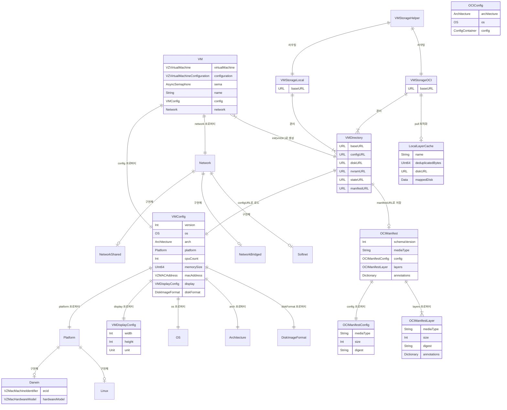

# 02. Tart 데이터 모델 (Data Model)

## 목차

1. [핵심 데이터 모델 개요](#1-핵심-데이터-모델-개요)
2. [VM 클래스](#2-vm-클래스)
3. [VMConfig 구조체](#3-vmconfig-구조체)
4. [VMDisplayConfig 구조체](#4-vmdisplayconfig-구조체)
5. [VMDirectory 구조체](#5-vmdirectory-구조체)
6. [OCI 데이터 모델](#6-oci-데이터-모델)
7. [Platform 프로토콜](#7-platform-프로토콜)
8. [Network 프로토콜](#8-network-프로토콜)
9. [Storage 모델](#9-storage-모델)
10. [보조 데이터 타입](#10-보조-데이터-타입)
11. [ER 다이어그램](#11-er-다이어그램)

---

## 1. 핵심 데이터 모델 개요

Tart는 macOS와 Linux 가상 머신을 Apple의 Virtualization.framework 위에서 관리하는 CLI 도구이다. 데이터 모델은 크게 네 가지 계층으로 구성된다.

```
+======================================================================+
|                        사용자 CLI 명령어                               |
|  (tart create / run / pull / push / clone / set / list / delete)     |
+======================================================================+
          |                    |                    |
          v                    v                    v
+------------------+  +------------------+  +------------------+
|    VM 클래스      |  |  VMDirectory     |  |  VMStorage*      |
| (런타임 실행)     |  | (파일시스템 구조)  |  | (Local / OCI)    |
+------------------+  +------------------+  +------------------+
          |                    |                    |
          v                    v                    v
+------------------+  +------------------+  +------------------+
|   VMConfig       |  |  Platform        |  |  OCI Manifest    |
| (설정 직렬화)     |  | (Darwin/Linux)   |  | (레지스트리 연동)  |
+------------------+  +------------------+  +------------------+
          |                    |                    |
          v                    v                    v
+------------------+  +------------------+  +------------------+
| VMDisplayConfig  |  |  Network         |  |  OCIConfig       |
| DiskImageFormat  |  | (Shared/Bridged  |  |  OCIManifestLayer|
| OS / Architecture|  |  /Softnet)       |  |  Descriptor      |
+------------------+  +------------------+  +------------------+
```

### 핵심 구조체/클래스 관계 요약

| 타입 | 종류 | 역할 | 소스 파일 |
|------|------|------|----------|
| `VM` | class | VZVirtualMachine 래퍼, VM 실행 제어 | `Sources/tart/VM.swift` |
| `VMConfig` | struct | VM 설정(CPU, 메모리, 디스크 등) JSON 직렬화 | `Sources/tart/VMConfig.swift` |
| `VMDisplayConfig` | struct | 디스플레이 해상도/단위 설정 | `Sources/tart/VMConfig.swift` |
| `VMDirectory` | struct | VM 파일 디렉토리 추상화 | `Sources/tart/VMDirectory.swift` |
| `Platform` | protocol | OS별 부트로더/플랫폼/입력장치 추상화 | `Sources/tart/Platform/Platform.swift` |
| `Darwin` | struct | macOS 전용 플랫폼 구현 | `Sources/tart/Platform/Darwin.swift` |
| `Linux` | struct | Linux 전용 플랫폼 구현 | `Sources/tart/Platform/Linux.swift` |
| `Network` | protocol | 네트워크 어태치먼트 추상화 | `Sources/tart/Network/Network.swift` |
| `OCIManifest` | struct | OCI 이미지 매니페스트 | `Sources/tart/OCI/Manifest.swift` |
| `OCIConfig` | struct | OCI 이미지 설정 | `Sources/tart/OCI/Manifest.swift` |
| `VMStorageLocal` | class | 로컬 VM 저장소 (~/.tart/vms/) | `Sources/tart/VMStorageLocal.swift` |
| `VMStorageOCI` | class | OCI 캐시 저장소 (~/.tart/cache/OCIs/) | `Sources/tart/VMStorageOCI.swift` |

---

## 2. VM 클래스

> 소스: `Sources/tart/VM.swift`

`VM` 클래스는 Tart의 핵심 런타임 객체이다. Apple의 `VZVirtualMachine`을 래핑하고, VM의 전체 생명주기(생성, 시작, 실행, 정지)를 관리한다.

### 2.1 클래스 선언과 프로토콜 준수

```swift
class VM: NSObject, VZVirtualMachineDelegate, ObservableObject {
  @Published var virtualMachine: VZVirtualMachine
  var configuration: VZVirtualMachineConfiguration
  var sema = AsyncSemaphore(value: 0)
  var name: String
  var config: VMConfig
  var network: Network
}
```

| 프로토콜 | 역할 |
|---------|------|
| `NSObject` | Objective-C 런타임 호환, KVO 지원 |
| `VZVirtualMachineDelegate` | VM 상태 변화 콜백 (`guestDidStop`, `didStopWithError`) |
| `ObservableObject` | SwiftUI 바인딩 지원 (`@Published`로 VM 상태 변경 전파) |

### 2.2 핵심 프로퍼티

| 프로퍼티 | 타입 | 설명 |
|---------|------|------|
| `virtualMachine` | `VZVirtualMachine` | Virtualization.framework의 실제 VM 객체. `@Published`로 선언되어 상태 변경 시 UI 갱신 가능 |
| `configuration` | `VZVirtualMachineConfiguration` | VM 하드웨어 설정 (CPU, 메모리, 디바이스 등) |
| `sema` | `AsyncSemaphore(value: 0)` | VM 종료를 대기하기 위한 비동기 세마포어. 초기값 0이므로 `wait`는 `signal`이 올 때까지 블로킹됨 |
| `name` | `String` | VM 이름 (VMDirectory의 baseURL.lastPathComponent에서 유래) |
| `config` | `VMConfig` | VM 설정 (config.json에서 로드) |
| `network` | `Network` | 네트워크 구현체 (기본값: `NetworkShared()`) |

### 2.3 초기화 (기존 VM 실행)

기존 VM을 실행할 때 사용하는 이니셜라이저이다.

```swift
init(vmDir: VMDirectory,
     network: Network = NetworkShared(),
     additionalStorageDevices: [VZStorageDeviceConfiguration] = [],
     directorySharingDevices: [VZDirectorySharingDeviceConfiguration] = [],
     serialPorts: [VZSerialPortConfiguration] = [],
     suspendable: Bool = false,
     nested: Bool = false,
     audio: Bool = true,
     clipboard: Bool = true,
     sync: VZDiskImageSynchronizationMode = .full,
     caching: VZDiskImageCachingMode? = nil,
     noTrackpad: Bool = false,
     noPointer: Bool = false,
     noKeyboard: Bool = false
) throws
```

초기화 흐름:
1. `vmDir.configURL`에서 `VMConfig`를 로드
2. 현재 호스트 아키텍처와 설정 아키텍처 비교 (불일치 시 `UnsupportedArchitectureError`)
3. `craftConfiguration()`으로 `VZVirtualMachineConfiguration` 구성
4. `VZVirtualMachine(configuration:)` 생성
5. 자신을 `delegate`로 설정

### 2.4 초기화 (macOS VM 신규 생성, arm64 전용)

```swift
#if arch(arm64)
  init(vmDir: VMDirectory, ipswURL: URL, diskSizeGB: UInt16,
       diskFormat: DiskImageFormat = .raw, network: Network = NetworkShared(), ...) async throws
#endif
```

신규 macOS VM 생성 흐름:
1. IPSW 다운로드/캐시 확인 (`retrieveIPSW`)
2. `VZMacOSRestoreImage` 로드 -> `mostFeaturefulSupportedConfiguration` 추출
3. NVRAM 생성: `VZMacAuxiliaryStorage(creatingStorageAt:hardwareModel:)`
4. 디스크 생성: `vmDir.resizeDisk(diskSizeGB, format: diskFormat)`
5. `VMConfig` 생성: `Darwin` 플랫폼, 최소 CPU 4개 이상
6. `craftConfiguration()` -> `VZVirtualMachine` 생성
7. `install(ipswURL)` 실행 (`VZMacOSInstaller`)

### 2.5 Linux VM 생성 (정적 팩토리)

```swift
@available(macOS 13, *)
static func linux(vmDir: VMDirectory, diskSizeGB: UInt16,
                  diskFormat: DiskImageFormat = .raw) async throws -> VM
```

- NVRAM: `VZEFIVariableStore(creatingVariableStoreAt:)` 사용
- 플랫폼: `Linux()`
- 기본 CPU: 4개, 기본 메모리: 4096 * 1024 * 1024 바이트 (4GB)

### 2.6 craftConfiguration() 정적 메서드

`craftConfiguration()`은 `VMConfig`를 기반으로 `VZVirtualMachineConfiguration`을 구성하는 핵심 메서드이다.

```swift
static func craftConfiguration(
  diskURL: URL, nvramURL: URL, vmConfig: VMConfig,
  network: Network, additionalStorageDevices: [...],
  directorySharingDevices: [...], serialPorts: [...],
  suspendable: Bool, nested: Bool, audio: Bool, clipboard: Bool,
  sync: VZDiskImageSynchronizationMode, caching: VZDiskImageCachingMode?,
  noTrackpad: Bool, noPointer: Bool, noKeyboard: Bool
) throws -> VZVirtualMachineConfiguration
```

구성 요소 매핑:

| 설정 항목 | 소스 | 설명 |
|----------|------|------|
| `bootLoader` | `vmConfig.platform.bootLoader(nvramURL:)` | macOS: VZMacOSBootLoader, Linux: VZEFIBootLoader |
| `cpuCount` | `vmConfig.cpuCount` | CPU 코어 수 |
| `memorySize` | `vmConfig.memorySize` | 메모리 크기 (바이트) |
| `platform` | `vmConfig.platform.platform(nvramURL:needsNestedVirtualization:)` | macOS: VZMacPlatformConfiguration, Linux: VZGenericPlatformConfiguration |
| `graphicsDevices` | `vmConfig.platform.graphicsDevice(vmConfig:)` | macOS: VZMacGraphicsDeviceConfiguration, Linux: VZVirtioGraphicsDeviceConfiguration |
| `audioDevices` | 직접 구성 | VZVirtioSoundDeviceConfiguration (suspendable이면 null speaker) |
| `keyboards` | `vmConfig.platform.keyboards()` | suspendable이면 `keyboardsSuspendable()` 사용 |
| `pointingDevices` | `vmConfig.platform.pointingDevices()` | noTrackpad이면 `pointingDevicesSimplified()` 사용 |
| `networkDevices` | `network.attachments()` | VZVirtioNetworkDeviceConfiguration에 macAddress 설정 |
| `storageDevices` | `VZDiskImageStorageDeviceAttachment` | Linux이면 캐싱 모드 .cached, 그 외 .automatic |
| `entropyDevices` | `VZVirtioEntropyDeviceConfiguration` | suspendable이 아닌 경우만 추가 |
| `consoleDevices` | 직접 구성 | 클립보드 공유(Spice agent) + 버전 콘솔("tart-version-{version}") |
| `socketDevices` | `VZVirtioSocketDeviceConfiguration` | virtio 소켓 통신 |

### 2.7 VZVirtualMachineDelegate 구현

```swift
func guestDidStop(_ virtualMachine: VZVirtualMachine) {
  print("guest has stopped the virtual machine")
  sema.signal()
}

func virtualMachine(_ virtualMachine: VZVirtualMachine, didStopWithError error: Error) {
  print("guest has stopped the virtual machine due to error: \(error)")
  sema.signal()
}

func virtualMachine(_ virtualMachine: VZVirtualMachine,
                    networkDevice: VZNetworkDevice,
                    attachmentWasDisconnectedWithError error: Error) {
  print("virtual machine's network attachment ... has been disconnected with error: \(error)")
  sema.signal()
}
```

세 가지 콜백 모두 `sema.signal()`을 호출하여 `run()` 메서드의 `sema.waitUnlessCancelled()`를 해제한다. 이것이 VM 종료를 감지하는 핵심 메커니즘이다.

### 2.8 AsyncSemaphore 패턴

```
run() 호출
    |
    v
sema.waitUnlessCancelled()  <-- 여기서 블로킹
    |
    v  (guestDidStop / didStopWithError / CancellationError)
sema.signal() 또는 Task 취소
    |
    v
VM 정리 (stop, network.stop)
```

`AsyncSemaphore`는 `Semaphore` 패키지에서 제공하며, Swift Concurrency 환경에서 세마포어 역할을 한다. 초기값이 0이므로 `waitUnlessCancelled()`는 누군가 `signal()`을 호출하거나 태스크가 취소될 때까지 대기한다.

### 2.9 에러 타입

`VM.swift`에 정의된 에러 구조체들:

| 에러 | 설명 |
|------|------|
| `UnsupportedRestoreImageError` | IPSW 이미지가 현재 하드웨어에서 지원되지 않음 |
| `NoMainScreenFoundError` | 메인 화면을 찾을 수 없음 |
| `DownloadFailed` | IPSW 다운로드 실패 |
| `UnsupportedOSError` | 호스트 OS 버전 미달 (macOS 13.0 이상 필요) |
| `UnsupportedArchitectureError` | VM 아키텍처와 호스트 아키텍처 불일치 |

---

## 3. VMConfig 구조체

> 소스: `Sources/tart/VMConfig.swift`

`VMConfig`는 VM의 하드웨어 설정을 표현하며, JSON으로 직렬화/역직렬화된다. 파일시스템에서는 `config.json`으로 저장된다.

### 3.1 프로퍼티 정의

```swift
struct VMConfig: Codable {
  var version: Int = 1
  var os: OS
  var arch: Architecture
  var platform: Platform
  var cpuCountMin: Int
  private(set) var cpuCount: Int
  var memorySizeMin: UInt64
  private(set) var memorySize: UInt64
  var macAddress: VZMACAddress
  var display: VMDisplayConfig = VMDisplayConfig()
  var displayRefit: Bool?
  var diskFormat: DiskImageFormat = .raw
}
```

| 프로퍼티 | 타입 | 기본값 | 설명 |
|---------|------|--------|------|
| `version` | `Int` | `1` | 설정 파일 버전 |
| `os` | `OS` | (platform에서 파생) | 게스트 OS 종류 (.darwin / .linux) |
| `arch` | `Architecture` | (CurrentArchitecture에서 파생) | 아키텍처 (.arm64 / .amd64) |
| `platform` | `Platform` | (생성 시 지정) | 플랫폼 구현체 (Darwin / Linux) |
| `cpuCountMin` | `Int` | (생성 시 지정) | 최소 CPU 수 |
| `cpuCount` | `Int` | `cpuCountMin`과 동일 | 현재 CPU 수 (`private(set)`) |
| `memorySizeMin` | `UInt64` | (생성 시 지정) | 최소 메모리 (바이트) |
| `memorySize` | `UInt64` | `memorySizeMin`과 동일 | 현재 메모리 (바이트, `private(set)`) |
| `macAddress` | `VZMACAddress` | `randomLocallyAdministered()` | VM의 MAC 주소 |
| `display` | `VMDisplayConfig` | `VMDisplayConfig()` | 디스플레이 설정 |
| `displayRefit` | `Bool?` | `nil` | 동적 해상도 조정 여부 |
| `diskFormat` | `DiskImageFormat` | `.raw` | 디스크 이미지 포맷 |

`cpuCount`와 `memorySize`가 `private(set)`인 이유: 최소값 검증을 강제하기 위해서이다. 외부에서는 반드시 `setCPU(cpuCount:)` 또는 `setMemory(memorySize:)`를 통해서만 변경할 수 있다.

### 3.2 CodingKeys

```swift
enum CodingKeys: String, CodingKey {
  case version
  case os
  case arch
  case cpuCountMin
  case cpuCount
  case memorySizeMin
  case memorySize
  case macAddress
  case display
  case displayRefit
  case diskFormat
  // macOS-specific keys
  case ecid
  case hardwareModel
}
```

`ecid`와 `hardwareModel`은 `Darwin` 플랫폼 전용 키이다. `VMConfig` 자체에는 없지만, `Platform`의 인코딩/디코딩 시 사용된다. 이는 `platform.encode(to:)`가 같은 인코더에 `ecid`, `hardwareModel` 키를 직접 쓰기 때문이다.

### 3.3 이니셜라이저

**프로그래밍 방식 생성:**

```swift
init(platform: Platform, cpuCountMin: Int, memorySizeMin: UInt64,
     macAddress: VZMACAddress = VZMACAddress.randomLocallyAdministered(),
     diskFormat: DiskImageFormat = .raw)
```

- `os`는 `platform.os()`에서 파생
- `arch`는 `CurrentArchitecture()`에서 파생
- 초기 `cpuCount = cpuCountMin`, `memorySize = memorySizeMin`

**JSON 디코딩:**

```swift
init(fromJSON: Data) throws
init(fromURL: URL) throws
```

커스텀 `init(from decoder: Decoder)` 구현에서 주목할 점:
- `os` 기본값: `.darwin` (하위 호환)
- `arch` 기본값: `.arm64` (하위 호환)
- `os`에 따라 `Darwin(from: decoder)` 또는 `Linux(from: decoder)`로 분기
- `macAddress`는 문자열로 저장되었다가 `VZMACAddress.init(string:)`으로 복원
- `diskFormat` 기본값: `"raw"` (하위 호환)

### 3.4 setCPU / setMemory

```swift
mutating func setCPU(cpuCount: Int) throws {
  // Darwin: cpuCountMin 이상이어야 함
  if os == .darwin && cpuCount < cpuCountMin {
    throw LessThanMinimalResourcesError(...)
  }
  // 모든 OS: VZVirtualMachineConfiguration.minimumAllowedCPUCount 이상
  if cpuCount < VZVirtualMachineConfiguration.minimumAllowedCPUCount {
    throw LessThanMinimalResourcesError(...)
  }
  self.cpuCount = cpuCount
}

mutating func setMemory(memorySize: UInt64) throws {
  // Darwin: memorySizeMin 이상이어야 함
  if os == .darwin && memorySize < memorySizeMin {
    throw LessThanMinimalResourcesError(...)
  }
  // 모든 OS: VZVirtualMachineConfiguration.minimumAllowedMemorySize 이상
  if memorySize < VZVirtualMachineConfiguration.minimumAllowedMemorySize {
    throw LessThanMinimalResourcesError(...)
  }
  self.memorySize = memorySize
}
```

검증 로직이 OS별로 다른 이유:
- **Darwin(macOS)**: Apple 하드웨어 요구사항에 따라 IPSW에서 파생된 최소값(`cpuCountMin`, `memorySizeMin`) 미만으로 설정 불가
- **Linux**: Apple 하드웨어 요구사항이 없으므로 `VZVirtualMachineConfiguration`의 절대 최소값만 체크

### 3.5 JSON 직렬화 예시

```json
{
  "version": 1,
  "os": "darwin",
  "arch": "arm64",
  "ecid": "base64EncodedString...",
  "hardwareModel": "base64EncodedString...",
  "cpuCountMin": 4,
  "cpuCount": 8,
  "memorySizeMin": 4294967296,
  "memorySize": 8589934592,
  "macAddress": "d6:ab:12:34:56:78",
  "display": {
    "width": 1920,
    "height": 1080
  },
  "diskFormat": "raw"
}
```

---

## 4. VMDisplayConfig 구조체

> 소스: `Sources/tart/VMConfig.swift` (35~54행)

```swift
struct VMDisplayConfig: Codable, Equatable {
  enum Unit: String, Codable {
    case point = "pt"
    case pixel = "px"
  }

  var width: Int = 1024
  var height: Int = 768
  var unit: Unit?
}
```

### 4.1 프로퍼티

| 프로퍼티 | 타입 | 기본값 | 설명 |
|---------|------|--------|------|
| `width` | `Int` | `1024` | 디스플레이 너비 |
| `height` | `Int` | `768` | 디스플레이 높이 |
| `unit` | `Unit?` | `nil` | 단위 (pt=논리적 포인트, px=물리적 픽셀, nil=레거시 호환) |

### 4.2 Unit과 그래픽 디바이스 매핑

`unit`의 값에 따라 `craftConfiguration()`에서 다른 방식으로 디스플레이가 구성된다:

| unit | macOS (Darwin) | Linux |
|------|---------------|-------|
| `.point` 또는 `nil` | `VZMacGraphicsDisplayConfiguration(for: hostMainScreen, sizeInPoints:)` -- 호스트 화면 DPI 참조 | `VZVirtioGraphicsScanoutConfiguration(widthInPixels:, heightInPixels:)` |
| `.pixel` | `VZMacGraphicsDisplayConfiguration(widthInPixels:, heightInPixels:, pixelsPerInch: 72)` | 동일 |

macOS에서 `.point` 모드를 사용하면 호스트의 실제 Retina 배율이 적용되므로, 1024x768pt가 2048x1536px로 렌더링될 수 있다. `.pixel` 모드는 고정 72 PPI로 동작한다.

### 4.3 CustomStringConvertible

```swift
extension VMDisplayConfig: CustomStringConvertible {
  var description: String {
    if let unit {
      "\(width)x\(height)\(unit.rawValue)"  // 예: "1920x1080pt"
    } else {
      "\(width)x\(height)"                   // 예: "1024x768"
    }
  }
}
```

---

## 5. VMDirectory 구조체

> 소스: `Sources/tart/VMDirectory.swift`

`VMDirectory`는 VM의 파일시스템 레이아웃을 추상화하는 구조체이다. 하나의 VM은 하나의 디렉토리에 해당하며, 내부에 config.json, disk.img, nvram.bin 등의 파일을 포함한다.

### 5.1 구조체 선언

```swift
struct VMDirectory: Prunable {
  var baseURL: URL
}
```

`Prunable` 프로토콜을 준수하여 캐시 정리(prune) 대상이 될 수 있다.

### 5.2 파일 경로 프로퍼티

| 프로퍼티 | 계산 방식 | 파일명 | 설명 |
|---------|----------|--------|------|
| `configURL` | `baseURL + "config.json"` | config.json | VM 설정 (VMConfig JSON) |
| `diskURL` | `baseURL + "disk.img"` | disk.img | 디스크 이미지 |
| `nvramURL` | `baseURL + "nvram.bin"` | nvram.bin | NVRAM (macOS: Mac Auxiliary Storage, Linux: EFI Variables) |
| `stateURL` | `baseURL + "state.vzvmsave"` | state.vzvmsave | VM 일시중단(suspend) 상태 저장 |
| `manifestURL` | `baseURL + "manifest.json"` | manifest.json | OCI 매니페스트 캐시 (pull 후 저장) |
| `controlSocketURL` | `baseURL + "control.sock"` | control.sock | 제어 소켓 (Unix domain socket) |
| `explicitlyPulledMark` | `baseURL + ".explicitly-pulled"` | .explicitly-pulled | 명시적 pull 표시 (GC 제외) |

### 5.3 VM 디렉토리 레이아웃

```
~/.tart/vms/my-vm/              (또는 ~/.tart/cache/OCIs/host/ns/ref/)
  +-- config.json               VMConfig JSON
  +-- disk.img                  디스크 이미지 (RAW 또는 ASIF)
  +-- nvram.bin                 NVRAM 데이터
  +-- state.vzvmsave            (선택) 일시중단 상태
  +-- manifest.json             (선택) OCI 매니페스트
  +-- control.sock              (선택) 런타임 제어 소켓
  +-- .explicitly-pulled        (선택) GC 제외 마커
```

### 5.4 State 열거형

```swift
enum State: String {
  case Running = "running"
  case Suspended = "suspended"
  case Stopped = "stopped"
}
```

상태 판별 로직:

```swift
func state() throws -> State {
  if try running() {       // PIDLock으로 프로세스 확인
    return State.Running
  } else if FileManager.default.fileExists(atPath: stateURL.path) {
    return State.Suspended  // state.vzvmsave 파일 존재
  } else {
    return State.Stopped
  }
}
```

`running()` 메서드는 `PIDLock`을 사용하여 config.json에 대한 프로세스 잠금을 확인한다. PID가 0이 아니면 실행 중이다.

### 5.5 initialized 속성

```swift
var initialized: Bool {
  FileManager.default.fileExists(atPath: configURL.path) &&
    FileManager.default.fileExists(atPath: diskURL.path) &&
    FileManager.default.fileExists(atPath: nvramURL.path)
}
```

세 파일(`config.json`, `disk.img`, `nvram.bin`)이 모두 존재해야 유효한 VM 디렉토리로 간주한다.

### 5.6 clone 메서드

```swift
func clone(to: VMDirectory, generateMAC: Bool) throws {
  try FileManager.default.copyItem(at: configURL, to: to.configURL)
  try FileManager.default.copyItem(at: nvramURL, to: to.nvramURL)
  try FileManager.default.copyItem(at: diskURL, to: to.diskURL)
  try? FileManager.default.copyItem(at: stateURL, to: to.stateURL)

  if generateMAC {
    try to.regenerateMACAddress()
  }
}
```

- 네 파일(config, nvram, disk, state) 복사
- `stateURL` 복사 실패는 무시 (`try?`) -- 일시중단 상태가 없을 수 있음
- `generateMAC`이 `true`이면 클론에 새 MAC 주소 할당

### 5.7 resizeDisk 메서드

```swift
func resizeDisk(_ sizeGB: UInt16, format: DiskImageFormat = .raw) throws
```

디스크 포맷에 따라 다른 리사이즈 전략을 사용한다:

| 상황 | 포맷 | 전략 |
|------|------|------|
| 신규 생성 | RAW | `truncate(atOffset:)` -- 스파스 파일 생성 |
| 신규 생성 | ASIF | `Diskutil.imageCreate(diskURL:, sizeGB:)` |
| 기존 확장 | RAW | `truncate(atOffset:)` -- 크기 증가만 허용 |
| 기존 확장 | ASIF | `diskutil image resize --size {sizeGB}G` |

크기 단위: `UInt64(sizeGB) * 1000 * 1000 * 1000` (SI 기준 GB, 1000^3)

### 5.8 delete 메서드

```swift
func delete() throws {
  let lock = try lock()
  if try !lock.trylock() {
    throw RuntimeError.VMIsRunning(name)
  }
  try FileManager.default.removeItem(at: baseURL)
  try lock.unlock()
}
```

`PIDLock`을 획득하여 실행 중인 VM은 삭제할 수 없도록 보호한다.

### 5.9 Prunable 프로토콜 구현

`VMDirectory`는 `Prunable` 프로토콜을 준수한다:

```swift
protocol Prunable {
  var url: URL { get }
  func delete() throws
  func accessDate() throws -> Date
  func sizeBytes() throws -> Int
  func allocatedSizeBytes() throws -> Int
}
```

| 메서드 | VMDirectory 구현 |
|--------|-----------------|
| `url` | `baseURL` |
| `delete()` | PIDLock 확인 후 디렉토리 삭제 |
| `accessDate()` | `baseURL`의 접근 시간 |
| `sizeBytes()` | config + disk + nvram 파일 크기 합산 |
| `allocatedSizeBytes()` | 실제 디스크 할당 크기 (스파스 파일에서 다를 수 있음) |

### 5.10 임시 디렉토리 생성

```swift
static func temporary() throws -> VMDirectory {
  let tmpDir = try Config().tartTmpDir.appendingPathComponent(UUID().uuidString)
  try FileManager.default.createDirectory(at: tmpDir, withIntermediateDirectories: false)
  return VMDirectory(baseURL: tmpDir)
}

static func temporaryDeterministic(key: String) throws -> VMDirectory {
  let keyData = Data(key.utf8)
  let hash = Insecure.MD5.hash(data: keyData)
  let hashString = hash.compactMap { String(format: "%02x", $0) }.joined()
  let tmpDir = try Config().tartTmpDir.appendingPathComponent(hashString)
  try FileManager.default.createDirectory(at: tmpDir, withIntermediateDirectories: true)
  return VMDirectory(baseURL: tmpDir)
}
```

- `temporary()`: UUID 기반 일회성 디렉토리 (`~/.tart/tmp/{uuid}`)
- `temporaryDeterministic(key:)`: MD5 해시 기반 결정론적 디렉토리 -- 동일 키로 재진입 가능 (pull 재개에 사용)

---

## 6. OCI 데이터 모델

> 소스: `Sources/tart/OCI/Manifest.swift`, `Sources/tart/OCI/Layerizer/DiskV2.swift`

Tart는 VM 이미지를 OCI (Open Container Initiative) 이미지 포맷으로 레지스트리에 push/pull한다. OCI 표준에 맞추되, Tart 전용 미디어 타입과 어노테이션을 추가한다.

### 6.1 미디어 타입 상수

```swift
// OCI 표준 미디어 타입
let ociManifestMediaType = "application/vnd.oci.image.manifest.v1+json"
let ociConfigMediaType   = "application/vnd.oci.image.config.v1+json"

// Tart 커스텀 미디어 타입
let configMediaType  = "application/vnd.cirruslabs.tart.config.v1"
let diskV2MediaType  = "application/vnd.cirruslabs.tart.disk.v2"
let nvramMediaType   = "application/vnd.cirruslabs.tart.nvram.v1"
```

| 미디어 타입 | 역할 | 내용물 |
|------------|------|--------|
| `configMediaType` | VM 설정 레이어 | VMConfig JSON (config.json) |
| `diskV2MediaType` | 디스크 청크 레이어 | LZ4 압축된 512MB 디스크 청크 |
| `nvramMediaType` | NVRAM 레이어 | nvram.bin 원본 |

레거시 타입 `legacyDiskV1MediaType = "application/vnd.cirruslabs.tart.disk.v1"`은 더 이상 지원하지 않으며 pull 시 에러를 발생시킨다.

### 6.2 어노테이션 상수

```swift
// 매니페스트 어노테이션
let uncompressedDiskSizeAnnotation = "org.cirruslabs.tart.uncompressed-disk-size"
let uploadTimeAnnotation           = "org.cirruslabs.tart.upload-time"

// 매니페스트 라벨
let diskFormatLabel = "org.cirruslabs.tart.disk.format"

// 레이어 어노테이션
let uncompressedSizeAnnotation          = "org.cirruslabs.tart.uncompressed-size"
let uncompressedContentDigestAnnotation = "org.cirruslabs.tart.uncompressed-content-digest"
```

### 6.3 OCIManifest

```swift
struct OCIManifest: Codable, Equatable {
  var schemaVersion: Int = 2
  var mediaType: String = ociManifestMediaType
  var config: OCIManifestConfig
  var layers: [OCIManifestLayer] = Array()
  var annotations: Dictionary<String, String>?
}
```

| 필드 | 타입 | 기본값 | 설명 |
|------|------|--------|------|
| `schemaVersion` | `Int` | `2` | OCI 스키마 버전 |
| `mediaType` | `String` | `ociManifestMediaType` | 매니페스트 미디어 타입 |
| `config` | `OCIManifestConfig` | -- | OCI 설정 블롭 참조 |
| `layers` | `[OCIManifestLayer]` | `[]` | 레이어 배열 |
| `annotations` | `[String:String]?` | -- | 매니페스트 어노테이션 |

이니셜라이저에서 `uncompressedDiskSize`와 `uploadDate`를 어노테이션에 자동 삽입한다:

```swift
init(config: OCIManifestConfig, layers: [OCIManifestLayer],
     uncompressedDiskSize: UInt64? = nil, uploadDate: Date? = nil) {
  // ...
  annotations[uncompressedDiskSizeAnnotation] = String(uncompressedDiskSize)
  annotations[uploadTimeAnnotation] = uploadDate.toISO()
}
```

`digest()` 메서드는 매니페스트 JSON의 SHA-256 해시를 반환한다:
```swift
func digest() throws -> String {
  try Digest.hash(toJSON())  // "sha256:..."
}
```

### 6.4 OCIConfig

```swift
struct OCIConfig: Codable {
  var architecture: Architecture = .arm64
  var os: OS = .darwin
  var config: ConfigContainer?

  struct ConfigContainer: Codable {
    var Labels: [String: String]?
  }
}
```

Docker Hub 호환성을 위한 스텁 OCI 설정이다. push 시 VM의 아키텍처(`arm64`/`amd64`)와 OS(`darwin`/`linux`)를 설정하고, 디스크 포맷 등의 라벨을 `config.Labels`에 포함한다.

### 6.5 OCIManifestConfig

```swift
struct OCIManifestConfig: Codable, Equatable {
  var mediaType: String = ociConfigMediaType
  var size: Int
  var digest: String
}
```

매니페스트 내에서 OCI 설정 블롭을 참조하는 디스크립터이다.

### 6.6 OCIManifestLayer

```swift
struct OCIManifestLayer: Codable, Equatable, Hashable {
  var mediaType: String
  var size: Int
  var digest: String
  var annotations: Dictionary<String, String>?
}
```

| 필드 | 설명 |
|------|------|
| `mediaType` | 레이어 유형 (configMediaType, diskV2MediaType, nvramMediaType 중 하나) |
| `size` | 압축된 레이어 크기 (바이트) |
| `digest` | 레이어 SHA-256 다이제스트 ("sha256:...") |
| `annotations` | 레이어별 어노테이션 |

레이어 어노테이션 헬퍼:

```swift
func uncompressedSize() -> UInt64? {
  annotations?[uncompressedSizeAnnotation]  // 비압축 크기
}
func uncompressedContentDigest() -> String? {
  annotations?[uncompressedContentDigestAnnotation]  // 비압축 콘텐츠의 SHA-256
}
```

`Equatable`과 `Hashable` 구현에서 `digest`만 비교한다:
```swift
static func == (lhs: Self, rhs: Self) -> Bool {
  return lhs.digest == rhs.digest
}
func hash(into hasher: inout Hasher) {
  hasher.combine(digest)
}
```

이 설계는 레이어 중복 제거(deduplication)의 핵심이다. 동일 digest를 가진 레이어는 동일한 것으로 간주한다.

### 6.7 Descriptor

```swift
struct Descriptor: Equatable {
  var size: Int
  var digest: String
}
```

OCI 표준의 디스크립터 최소 구현이다.

### 6.8 VM 이미지의 OCI 레이어 구조

하나의 Tart VM 이미지는 다음 레이어로 구성된다:

```
OCI Manifest
  +-- config (OCIConfig JSON)  .... Docker Hub 호환 스텁
  +-- layers[0]: config        .... VMConfig JSON (mediaType: configMediaType)
  +-- layers[1]: disk chunk 0  .... LZ4 압축 512MB (mediaType: diskV2MediaType)
  +-- layers[2]: disk chunk 1  .... LZ4 압축 512MB (mediaType: diskV2MediaType)
  +-- ...
  +-- layers[N]: disk chunk N  .... LZ4 압축 (나머지)
  +-- layers[N+1]: nvram       .... nvram.bin 원본 (mediaType: nvramMediaType)
```

디스크는 512MB 청크로 분할되어 개별 레이어로 push된다:
```swift
// DiskV2.swift
private static let layerLimitBytes = 512 * 1024 * 1024
```

각 청크는 LZ4 알고리즘으로 압축되며, `uncompressedSize`와 `uncompressedContentDigest` 어노테이션이 부착된다. 이를 통해 pull 시 레이어별 병렬 다운로드와 증분 업데이트가 가능하다.

### 6.9 DiskV2 레이어라이저

```swift
class DiskV2: Disk {
  private static let bufferSizeBytes = 4 * 1024 * 1024     // 4MB 버퍼
  private static let layerLimitBytes = 512 * 1024 * 1024   // 512MB 청크
  private static let holeGranularityBytes = 4 * 1024 * 1024 // 4MB 제로 감지 단위
}
```

**Push 흐름**: 디스크를 `mmap`으로 메모리 매핑 -> 512MB 청크로 분할 -> 각 청크를 LZ4 압축 -> 레지스트리에 병렬 업로드

**Pull 흐름**: 레이어 병렬 다운로드 -> LZ4 압축 해제 -> 제로 스킵 쓰기(sparse file 최적화) -> 로컬 레이어 캐시를 활용한 중복 제거

제로 스킵 쓰기(`zeroSkippingWrite`)는 4MB 단위로 데이터가 모두 0인 청크를 감지하여 디스크에 쓰지 않는다. 이는 sparse file을 활용한 공간 절약 최적화이다. 중복 제거(deduplication) 모드에서는 `F_PUNCHHOLE`을 사용하여 파일시스템 블록을 해제한다.

---

## 7. Platform 프로토콜

> 소스: `Sources/tart/Platform/Platform.swift`, `Sources/tart/Platform/Darwin.swift`, `Sources/tart/Platform/Linux.swift`

### 7.1 Platform 프로토콜

```swift
protocol Platform: Codable {
  func os() -> OS
  func bootLoader(nvramURL: URL) throws -> VZBootLoader
  func platform(nvramURL: URL, needsNestedVirtualization: Bool) throws -> VZPlatformConfiguration
  func graphicsDevice(vmConfig: VMConfig) -> VZGraphicsDeviceConfiguration
  func keyboards() -> [VZKeyboardConfiguration]
  func pointingDevices() -> [VZPointingDeviceConfiguration]
  func pointingDevicesSimplified() -> [VZPointingDeviceConfiguration]
}
```

| 메서드 | 반환 타입 | 설명 |
|--------|----------|------|
| `os()` | `OS` | 게스트 OS 종류 |
| `bootLoader(nvramURL:)` | `VZBootLoader` | 부트 로더 구성 |
| `platform(nvramURL:needsNestedVirtualization:)` | `VZPlatformConfiguration` | 플랫폼 하드웨어 구성 |
| `graphicsDevice(vmConfig:)` | `VZGraphicsDeviceConfiguration` | 그래픽 디바이스 |
| `keyboards()` | `[VZKeyboardConfiguration]` | 키보드 디바이스 목록 |
| `pointingDevices()` | `[VZPointingDeviceConfiguration]` | 포인팅 디바이스 목록 |
| `pointingDevicesSimplified()` | `[VZPointingDeviceConfiguration]` | 간소화된 포인팅 디바이스 (트랙패드 제외) |

### 7.2 PlatformSuspendable 프로토콜

```swift
protocol PlatformSuspendable: Platform {
  func pointingDevicesSuspendable() -> [VZPointingDeviceConfiguration]
  func keyboardsSuspendable() -> [VZKeyboardConfiguration]
}
```

일시중단(suspend)/재개(resume) 가능한 VM에서는 VZMacTrackpadConfiguration, VZMacKeyboardConfiguration만 사용해야 한다. USB 기반 디바이스는 일시중단 호환성이 없기 때문이다.

### 7.3 Darwin 구현 (macOS 전용, arm64)

```swift
#if arch(arm64)
struct Darwin: PlatformSuspendable {
  var ecid: VZMacMachineIdentifier
  var hardwareModel: VZMacHardwareModel
}
#endif
```

| 프로퍼티 | 타입 | 설명 |
|---------|------|------|
| `ecid` | `VZMacMachineIdentifier` | Mac 고유 식별자 (Exclusive Chip Identification). VM마다 고유 |
| `hardwareModel` | `VZMacHardwareModel` | Mac 하드웨어 모델. IPSW 복원 이미지에서 파생 |

**Codable 구현**: 두 프로퍼티 모두 `dataRepresentation`을 Base64로 인코딩하여 JSON에 저장한다.

```swift
func encode(to encoder: Encoder) throws {
  try container.encode(ecid.dataRepresentation.base64EncodedString(), forKey: .ecid)
  try container.encode(hardwareModel.dataRepresentation.base64EncodedString(), forKey: .hardwareModel)
}
```

**Platform 메서드 구현 비교표**:

| 메서드 | Darwin | Linux |
|--------|--------|-------|
| `os()` | `.darwin` | `.linux` |
| `bootLoader()` | `VZMacOSBootLoader()` | `VZEFIBootLoader()` + variableStore |
| `platform()` | `VZMacPlatformConfiguration` (ecid, hardwareModel, auxiliaryStorage) | `VZGenericPlatformConfiguration` (nestedVirtualization macOS 15+) |
| `graphicsDevice()` | `VZMacGraphicsDeviceConfiguration` (Retina 지원) | `VZVirtioGraphicsDeviceConfiguration` |
| `keyboards()` | `[VZUSBKeyboardConfiguration, VZMacKeyboardConfiguration]` (macOS 14+) | `[VZUSBKeyboardConfiguration]` |
| `pointingDevices()` | `[VZUSBScreenCoordinate..., VZMacTrackpadConfiguration]` | `[VZUSBScreenCoordinatePointingDeviceConfiguration]` |
| `pointingDevicesSimplified()` | `[VZUSBScreenCoordinatePointingDeviceConfiguration]` | 동일 (trackpad 없음) |
| `keyboardsSuspendable()` | `[VZMacKeyboardConfiguration]` (macOS 14+) | -- (미지원) |
| `pointingDevicesSuspendable()` | `[VZMacTrackpadConfiguration]` (macOS 14+) | -- (미지원) |

### 7.4 Darwin의 중첩 가상화 제한

```swift
func platform(nvramURL: URL, needsNestedVirtualization: Bool) throws -> VZPlatformConfiguration {
  if needsNestedVirtualization {
    throw RuntimeError.VMConfigurationError("macOS virtual machines do not support nested virtualization")
  }
  // ...
}
```

macOS VM은 중첩 가상화를 지원하지 않는다. Linux VM은 macOS 15 이상에서 지원한다:

```swift
// Linux.swift
func platform(nvramURL: URL, needsNestedVirtualization: Bool) throws -> VZPlatformConfiguration {
  let config = VZGenericPlatformConfiguration()
  if #available(macOS 15, *) {
    config.isNestedVirtualizationEnabled = needsNestedVirtualization
  }
  return config
}
```

---

## 8. Network 프로토콜

> 소스: `Sources/tart/Network/Network.swift`, `NetworkShared.swift`, `NetworkBridged.swift`, `Softnet.swift`

### 8.1 Network 프로토콜

```swift
protocol Network {
  func attachments() -> [VZNetworkDeviceAttachment]
  func run(_ sema: AsyncSemaphore) throws
  func stop() async throws
}
```

| 메서드 | 설명 |
|--------|------|
| `attachments()` | VZNetworkDeviceAttachment 목록 반환. craftConfiguration()에서 VZVirtioNetworkDeviceConfiguration에 매핑 |
| `run(_ sema:)` | 네트워크 서비스 시작 (Softnet만 사용) |
| `stop()` | 네트워크 서비스 종료 (Softnet만 사용) |

### 8.2 구현체 비교

| 구현체 | 클래스 | attachment 타입 | run/stop | 용도 |
|--------|--------|----------------|----------|------|
| `NetworkShared` | class | `VZNATNetworkDeviceAttachment` | no-op | 기본값. macOS 내장 NAT 네트워킹 |
| `NetworkBridged` | class | `VZBridgedNetworkDeviceAttachment` | no-op | 호스트 네트워크 인터페이스에 브릿지 |
| `Softnet` | class | `VZFileHandleNetworkDeviceAttachment` | 프로세스 실행/종료 | softnet 바이너리를 통한 커스텀 네트워킹 |

### 8.3 NetworkShared

```swift
class NetworkShared: Network {
  func attachments() -> [VZNetworkDeviceAttachment] {
    [VZNATNetworkDeviceAttachment()]
  }
  func run(_ sema: AsyncSemaphore) throws { /* no-op */ }
  func stop() async throws { /* no-op */ }
}
```

가장 단순한 구현. macOS의 내장 NAT를 사용하여 게스트에서 인터넷 접속이 가능하다.

### 8.4 NetworkBridged

```swift
class NetworkBridged: Network {
  let interfaces: [VZBridgedNetworkInterface]

  init(interfaces: [VZBridgedNetworkInterface]) {
    self.interfaces = interfaces
  }

  func attachments() -> [VZNetworkDeviceAttachment] {
    interfaces.map { VZBridgedNetworkDeviceAttachment(interface: $0) }
  }
}
```

호스트의 물리적 네트워크 인터페이스를 VM에 브릿지한다. 복수의 인터페이스를 동시에 브릿지할 수 있다.

### 8.5 Softnet

```swift
class Softnet: Network {
  private let process = Process()
  private var monitorTask: Task<Void, Error>? = nil
  private let monitorTaskFinished = ManagedAtomic<Bool>(false)
  let vmFD: Int32

  init(vmMACAddress: String, extraArguments: [String] = []) throws
}
```

Softnet은 외부 `softnet` 바이너리를 이용한 네트워킹 방식이다:

1. `socketpair(AF_UNIX, SOCK_DGRAM, 0, fds)`로 Unix 도메인 소켓 쌍 생성
2. `vmFD`(fds[0])는 VM에 할당, `softnetFD`(fds[1])는 softnet 프로세스에 전달
3. 소켓 버퍼: 수신 4MB (4 * 1024 * 1024), 송신 1MB (1 * 1024 * 1024)
4. `VZFileHandleNetworkDeviceAttachment(fileHandle:)`로 VM에 연결

`run()`에서 softnet 프로세스를 시작하고 백그라운드 태스크로 모니터링한다. softnet 프로세스가 예기치 않게 종료되면 `sema.signal()`로 VM 루프에 알린다.

SUID 비트 설정(`configureSUIDBitIfNeeded`): softnet 바이너리에 root 소유 + SUID 비트가 필요하며, 없으면 사용자에게 sudo 비밀번호를 요청하여 자동 설정한다.

---

## 9. Storage 모델

> 소스: `Sources/tart/VMStorageLocal.swift`, `Sources/tart/VMStorageOCI.swift`, `Sources/tart/VMStorageHelper.swift`

### 9.1 저장소 구조

```
~/.tart/                          (TART_HOME, 기본값 ~/.tart)
  +-- vms/                        VMStorageLocal 영역
  |   +-- my-vm/                  로컬 VM
  |   |   +-- config.json
  |   |   +-- disk.img
  |   |   +-- nvram.bin
  |   +-- another-vm/
  |       +-- ...
  +-- cache/                      캐시 영역
  |   +-- OCIs/                   VMStorageOCI 영역
  |   |   +-- ghcr.io/
  |   |   |   +-- cirruslabs/
  |   |   |       +-- macos-runner/
  |   |   |           +-- latest  -> sha256:abc...  (symlink)
  |   |   |           +-- sha256:abc.../
  |   |   |               +-- config.json
  |   |   |               +-- disk.img
  |   |   |               +-- nvram.bin
  |   |   |               +-- manifest.json
  |   +-- IPSWs/                  IPSW 캐시
  |       +-- sha256:xxx.ipsw
  +-- tmp/                        임시 파일
      +-- {uuid}/
      +-- {md5hash}/
```

### 9.2 PrunableStorage 프로토콜

```swift
protocol PrunableStorage {
  func prunables() throws -> [Prunable]
}
```

저장소에서 정리 가능한 항목 목록을 반환한다. `tart prune` 명령에서 사용된다.

### 9.3 VMStorageLocal

```swift
class VMStorageLocal: PrunableStorage {
  let baseURL: URL  // ~/.tart/vms/
}
```

| 메서드 | 설명 |
|--------|------|
| `exists(_ name: String) -> Bool` | VM 디렉토리가 초기화되었는지 확인 |
| `open(_ name: String) -> VMDirectory` | VM 열기 (validate + 접근 시간 갱신) |
| `create(_ name: String, overwrite: Bool) -> VMDirectory` | VM 생성 (디렉토리 초기화) |
| `move(_ name: String, from: VMDirectory)` | 외부 디렉토리에서 이동 |
| `rename(_ name: String, _ newName: String)` | VM 이름 변경 |
| `delete(_ name: String)` | VM 삭제 (PIDLock 확인) |
| `list() -> [(String, VMDirectory)]` | 모든 로컬 VM 목록 |
| `prunables() -> [Prunable]` | 실행 중이 아닌 VM 목록 (정리 대상) |
| `hasVMsWithMACAddress(macAddress:) -> Bool` | MAC 주소 중복 확인 |

`prunables()`는 `running()` 상태가 아닌 VM만 반환하여 실행 중인 VM의 삭제를 방지한다.

### 9.4 VMStorageOCI

```swift
class VMStorageOCI: PrunableStorage {
  let baseURL: URL  // ~/.tart/cache/OCIs/
}
```

OCI 저장소는 레지스트리에서 pull한 이미지를 캐시한다. 태그와 다이제스트의 이중 참조 시스템을 사용한다:

```
host/namespace/tag    --> symlink --> host/namespace/sha256:abc...
host/namespace/sha256:abc.../     --> 실제 VM 디렉토리
```

| 메서드 | 설명 |
|--------|------|
| `exists(_ name: RemoteName) -> Bool` | 캐시에 존재 확인 |
| `digest(_ name: RemoteName) -> String` | 심볼릭 링크를 해석하여 다이제스트 반환 |
| `open(_ name: RemoteName, _ accessDate: Date) -> VMDirectory` | 캐시된 VM 열기 |
| `create(_ name: RemoteName, overwrite: Bool) -> VMDirectory` | 캐시 디렉토리 생성 |
| `move(_ name: RemoteName, from: VMDirectory)` | 임시 디렉토리에서 이동 |
| `delete(_ name: RemoteName)` | 삭제 후 GC 실행 |
| `gc()` | 가비지 컬렉션 -- 끊어진 심볼릭 링크 제거, 참조 없는 다이제스트 디렉토리 제거 |
| `pull(_ name: RemoteName, registry: Registry, concurrency: UInt, deduplicate: Bool)` | 레지스트리에서 이미지 pull |
| `list() -> [(String, VMDirectory, Bool)]` | 모든 캐시 이미지 (이름, 디렉토리, isSymlink) |

### 9.5 OCI 가비지 컬렉션 (gc)

```swift
func gc() throws {
  var refCounts = Dictionary<URL, UInt>()

  // 1. 모든 항목을 순회하며 참조 카운트 계산
  for case let foundURL as URL in enumerator {
    let isSymlink = ...
    // 끊어진 심볼릭 링크 즉시 삭제
    if isSymlink && foundURL == foundURL.resolvingSymlinksInPath() {
      try FileManager.default.removeItem(at: foundURL)
      continue
    }
    let vmDir = VMDirectory(baseURL: foundURL.resolvingSymlinksInPath())
    refCounts[vmDir.baseURL] = (refCounts[vmDir.baseURL] ?? 0) + (isSymlink ? 1 : 0)
  }

  // 2. 참조가 0이고 명시적으로 pull하지 않은 다이제스트 디렉토리 삭제
  for (baseURL, incRefCount) in refCounts {
    let vmDir = VMDirectory(baseURL: baseURL)
    if !vmDir.isExplicitlyPulled() && incRefCount == 0 {
      try FileManager.default.removeItem(at: baseURL)
    }
  }
}
```

GC가 삭제하지 않는 경우:
- 태그 심볼릭 링크가 가리키는 다이제스트 디렉토리 (`incRefCount > 0`)
- `tart pull host/ns@sha256:...`으로 명시적으로 pull한 이미지 (`.explicitly-pulled` 마커 존재)

### 9.6 VMStorageHelper

```swift
class VMStorageHelper {
  static func open(_ name: String) throws -> VMDirectory {
    if let remoteName = try? RemoteName(name) {
      return try VMStorageOCI().open(remoteName)
    } else {
      return try VMStorageLocal().open(name)
    }
  }
  static func delete(_ name: String) throws { ... }
}
```

이름 형식에 따라 자동으로 Local 또는 OCI 저장소로 라우팅한다:
- `"my-vm"` -> VMStorageLocal
- `"ghcr.io/org/repo:tag"` -> VMStorageOCI (RemoteName으로 파싱 가능)

### 9.7 Config 구조체

```swift
struct Config {
  let tartHomeDir: URL   // TART_HOME 또는 ~/.tart
  let tartCacheDir: URL  // tartHomeDir/cache
  let tartTmpDir: URL    // tartHomeDir/tmp
}
```

`TART_HOME` 환경변수로 기본 디렉토리를 변경할 수 있다. 설정되지 않으면 `~/.tart`를 사용한다.

### 9.8 IPSWCache

```swift
class IPSWCache: PrunableStorage {
  let baseURL: URL  // ~/.tart/cache/IPSWs/
}
```

macOS 복원 이미지(IPSW)를 캐시한다. 파일명에 SHA-256 해시를 포함하여 중복 다운로드를 방지한다: `sha256:{hash}.ipsw`.

---

## 10. 보조 데이터 타입

### 10.1 OS 열거형

> 소스: `Sources/tart/Platform/OS.swift`

```swift
enum OS: String, Codable {
  case darwin
  case linux
}
```

### 10.2 Architecture 열거형

> 소스: `Sources/tart/Platform/Architecture.swift`

```swift
enum Architecture: String, Codable {
  case arm64
  case amd64
}

func CurrentArchitecture() -> Architecture {
  #if arch(arm64)
    return .arm64
  #elseif arch(x86_64)
    return .amd64
  #endif
}
```

### 10.3 DiskImageFormat 열거형

> 소스: `Sources/tart/DiskImageFormat.swift`

```swift
enum DiskImageFormat: String, CaseIterable, Codable {
  case raw = "raw"
  case asif = "asif"

  var displayName: String {
    switch self {
    case .raw:  return "RAW"
    case .asif: return "ASIF (Apple Sparse Image Format)"
    }
  }

  var isSupported: Bool {
    switch self {
    case .raw:  return true
    case .asif:
      if #available(macOS 26, *) { return true }
      else { return false }
    }
  }
}
```

| 포맷 | 설명 | 지원 조건 |
|------|------|----------|
| `raw` | 원시 디스크 이미지 (sparse file 가능) | 항상 |
| `asif` | Apple Sparse Image Format | macOS 26+ |

`ExpressibleByArgument`를 준수하여 CLI 인자로 직접 전달할 수 있다.

### 10.4 RemoteName 구조체

> 소스: `Sources/tart/OCI/RemoteName.swift`

```swift
struct RemoteName: Comparable, Hashable, CustomStringConvertible {
  var host: String
  var namespace: String
  var reference: Reference
}
```

| 프로퍼티 | 예시 | 설명 |
|---------|------|------|
| `host` | `"ghcr.io"`, `"127.0.0.1:5000"` | 레지스트리 호스트 (포트 포함 가능) |
| `namespace` | `"cirruslabs/macos-runner"` | 이미지 네임스페이스 |
| `reference` | `Reference(tag: "latest")` 또는 `Reference(digest: "sha256:...")` | 태그 또는 다이제스트 |

표현 형식: `host/namespace:tag` 또는 `host/namespace@sha256:...`

### 10.5 Reference 구조체

```swift
struct Reference: Comparable, Hashable, CustomStringConvertible {
  enum ReferenceType: Comparable {
    case Tag
    case Digest
  }

  let type: ReferenceType
  let value: String

  var fullyQualified: String {
    switch type {
    case .Tag:    return ":" + value     // ":latest"
    case .Digest: return "@" + value     // "@sha256:abc..."
    }
  }
}
```

### 10.6 LocalLayerCache

> 소스: `Sources/tart/LocalLayerCache.swift`

```swift
struct LocalLayerCache {
  struct DigestInfo {
    let range: Range<Data.Index>
    let compressedDigest: String
    let uncompressedContentDigest: String?
  }

  let name: String
  let deduplicatedBytes: UInt64
  let diskURL: URL

  private let mappedDisk: Data                         // mmap된 디스크
  private var digestToRange: [String: DigestInfo] = [:] // digest -> 범위
  private var offsetToRange: [UInt64: DigestInfo] = [:] // offset -> 범위
}
```

pull 시 기존 캐시된 이미지의 디스크를 `mmap`으로 메모리 매핑하고, 동일한 레이어 다이제스트가 있으면 네트워크 전송 없이 로컬에서 복사한다. 중복 제거 시 최소 1GB 이상의 절약이 가능한 이미지만 선택한다:

```swift
// VMStorageOCI.swift
let choosen = candidates.filter {
  $0.deduplicatedBytes > 1024 * 1024 * 1024 // 최소 1GB
}.max { left, right in
  return left.deduplicatedBytes < right.deduplicatedBytes
}
```

### 10.7 Digest 클래스

> 소스: `Sources/tart/OCI/Digest.swift`

```swift
class Digest {
  var hash: SHA256 = SHA256()

  func update(_ data: Data)
  func finalize() -> String       // "sha256:..."
  static func hash(_ data: Data) -> String
  static func hash(_ url: URL) throws -> String
  static func hash(_ url: URL, offset: UInt64, size: UInt64) throws -> String
}
```

CryptoKit의 `SHA256`을 래핑한다. 모든 다이제스트는 `"sha256:"` 접두사를 포함하는 OCI 표준 형식이다.

### 10.8 RuntimeError 열거형

> 소스: `Sources/tart/VMStorageHelper.swift`

```swift
enum RuntimeError: Error {
  case Generic(_ message: String)
  case VMConfigurationError(_ message: String)
  case VMDoesNotExist(name: String)
  case VMMissingFiles(_ message: String)
  case VMIsRunning(_ name: String)
  case VMNotRunning(_ name: String)
  case VMAlreadyRunning(_ message: String)
  case NoIPAddressFound(_ message: String)
  case InvalidDiskSize(_ message: String)
  case FailedToResizeDisk(_ message: String)
  case PIDLockFailed(_ message: String)
  case FailedToParseRemoteName(_ message: String)
  case OCIStorageError(_ message: String)
  case SuspendFailed(_ message: String)
  case PullFailed(_ message: String)
  case VMSocketFailed(_ port: UInt32, _ explanation: String)
  // ... 등
}
```

`HasExitCode` 프로토콜을 구현하여 CLI 종료 코드를 제공한다:
- `VMDoesNotExist`, `VMNotRunning`, `VMAlreadyRunning`: exit code 2
- 나머지: exit code 1

---

## 11. ER 다이어그램

### 11.1 전체 데이터 모델 관계도



### 11.2 데이터 흐름 다이어그램

```
[사용자 CLI]
    |
    v
[VMStorageHelper] ----> [VMStorageLocal] ----> [VMDirectory] ----> config.json
    |                                               |                disk.img
    |                                               |                nvram.bin
    +-------------> [VMStorageOCI] ----> [VMDirectory] + manifest.json
                         |
                         v
                    [Registry] <---> [OCIManifest]
                         |               |
                         v               v
                    [DiskV2]        [OCIManifestLayer]
                    (LZ4 압축)      (512MB 청크)

[VMDirectory] ----> [VMConfig] ----> [Platform] ----> [Darwin] 또는 [Linux]
    |                   |
    v                   v
  [VM] <---------> [VZVirtualMachine]
    |                   |
    v                   v
[Network] ----> [VZNetworkDeviceAttachment]
```

### 11.3 파일 형식 매핑

```
config.json  <---->  VMConfig (Codable)
                       +-- version: Int
                       +-- os: OS
                       +-- arch: Architecture
                       +-- platform: Platform (Darwin/Linux)
                       +-- cpuCount/cpuCountMin: Int
                       +-- memorySize/memorySizeMin: UInt64
                       +-- macAddress: VZMACAddress (문자열로 직렬화)
                       +-- display: VMDisplayConfig
                       +-- diskFormat: DiskImageFormat

manifest.json <---->  OCIManifest (Codable)
                       +-- schemaVersion: 2
                       +-- mediaType: OCI manifest
                       +-- config: OCIManifestConfig
                       +-- layers: [OCIManifestLayer]
                       +-- annotations: [String:String]

disk.img     <---->  RAW 또는 ASIF 포맷 디스크 이미지
nvram.bin    <---->  macOS: VZMacAuxiliaryStorage / Linux: VZEFIVariableStore
state.vzvmsave <-->  Virtualization.framework 일시중단 상태
```

---

## 요약

Tart의 데이터 모델은 **VM 실행(VM, VMConfig)**, **파일시스템 구조(VMDirectory)**, **원격 이미지(OCI 모델)**, **플랫폼 추상화(Platform)**, **네트워크 추상화(Network)**, **저장소 관리(VMStorage*)** 라는 여섯 가지 관심사를 프로토콜과 구조체로 깔끔하게 분리한다.

핵심 설계 결정:

1. **Platform 프로토콜**: Darwin과 Linux의 하드웨어 차이를 프로토콜로 추상화하여, VM 클래스는 OS 종류를 알 필요 없이 동일한 인터페이스로 부트로더, 플랫폼, 입력장치를 구성한다.

2. **VMConfig의 Codable 직렬화**: config.json 하나로 VM의 모든 하드웨어 설정을 표현하며, 하위 호환성을 위해 기본값을 적극 활용한다 (os 기본값 `.darwin`, arch 기본값 `.arm64`, diskFormat 기본값 `"raw"`).

3. **OCI 표준 준수 + 커스텀 확장**: OCI 매니페스트/레이어 구조를 그대로 사용하되, Tart 전용 미디어 타입(`vnd.cirruslabs.tart.*`)과 어노테이션(`org.cirruslabs.tart.*`)으로 VM 이미지의 특수 요구사항을 충족한다.

4. **레이어 기반 디스크 분할**: 디스크를 512MB 청크로 분할하여 병렬 push/pull과 레이어 수준의 중복 제거를 가능하게 한다. `OCIManifestLayer`의 `Hashable` 구현이 `digest`만 비교하는 것이 이 메커니즘의 핵심이다.

5. **이중 저장소 시스템**: 로컬 VM(`VMStorageLocal`, `~/.tart/vms/`)과 원격 캐시(`VMStorageOCI`, `~/.tart/cache/OCIs/`)를 분리하고, `VMStorageHelper`로 이름 형식 기반 자동 라우팅을 제공한다.
