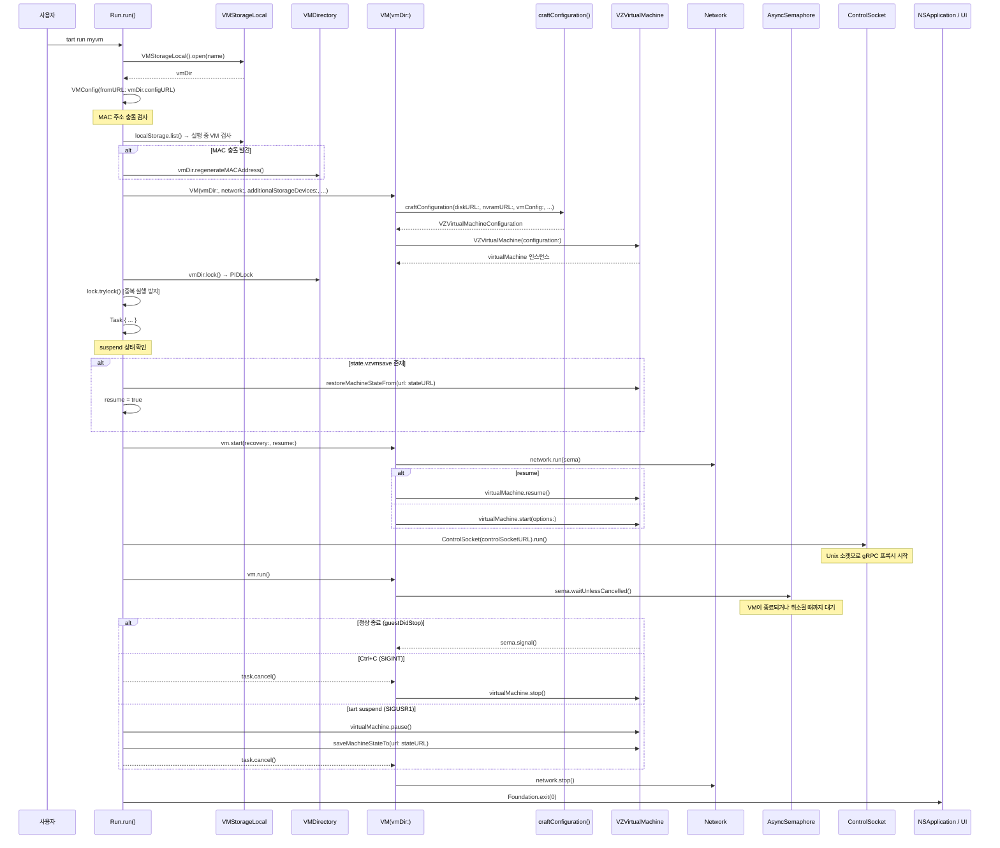
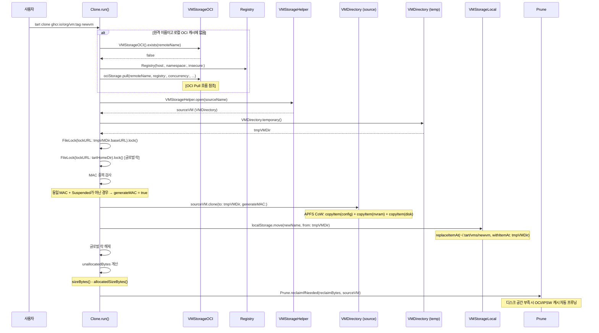
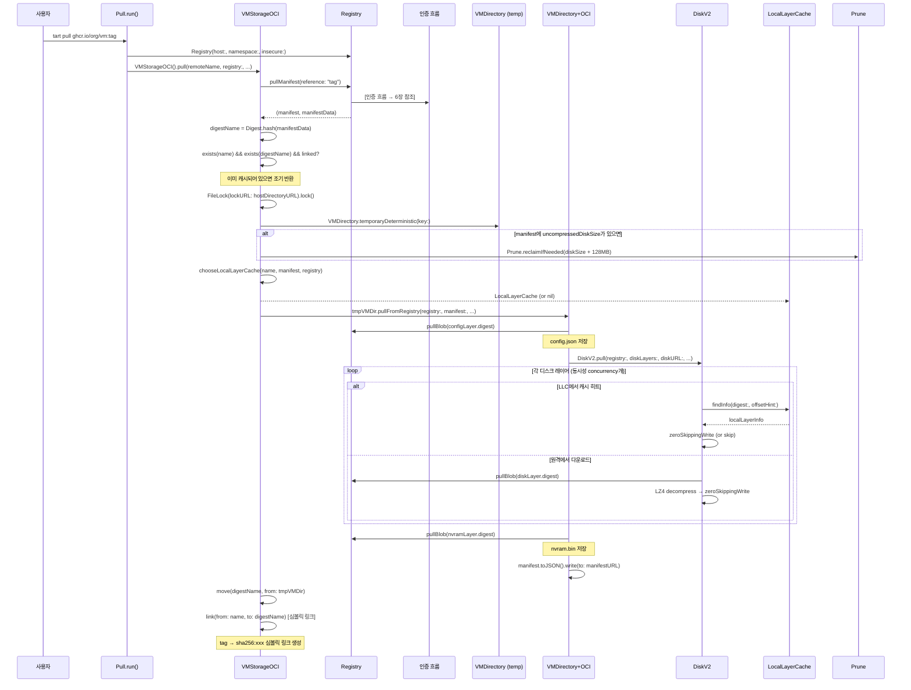
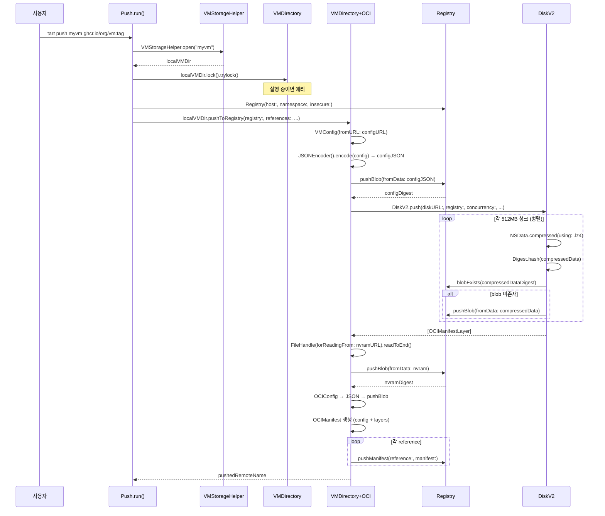
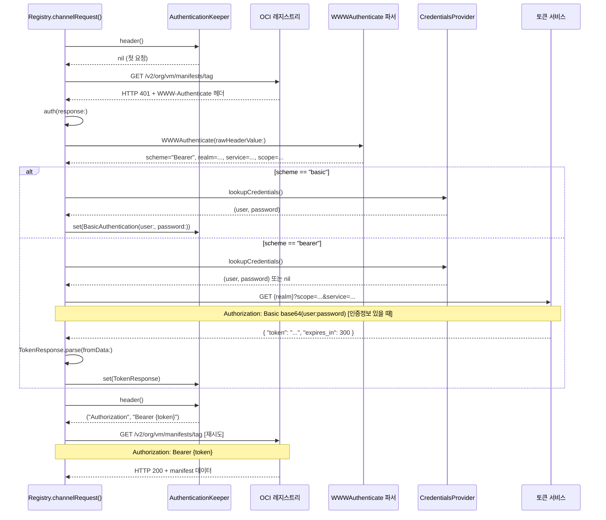
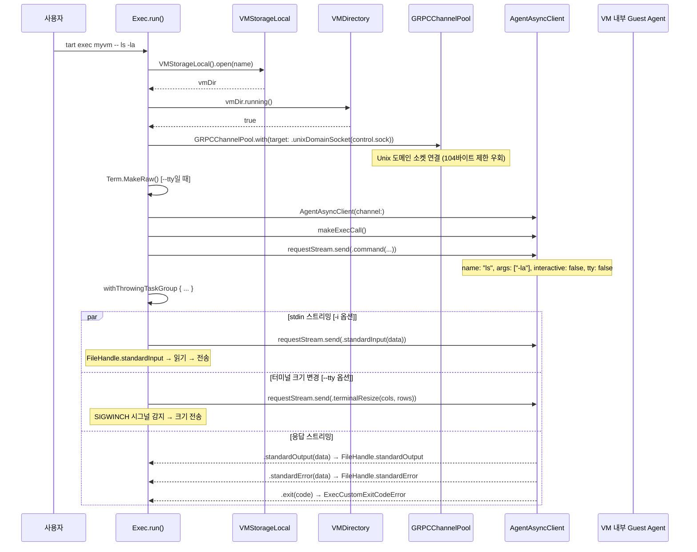
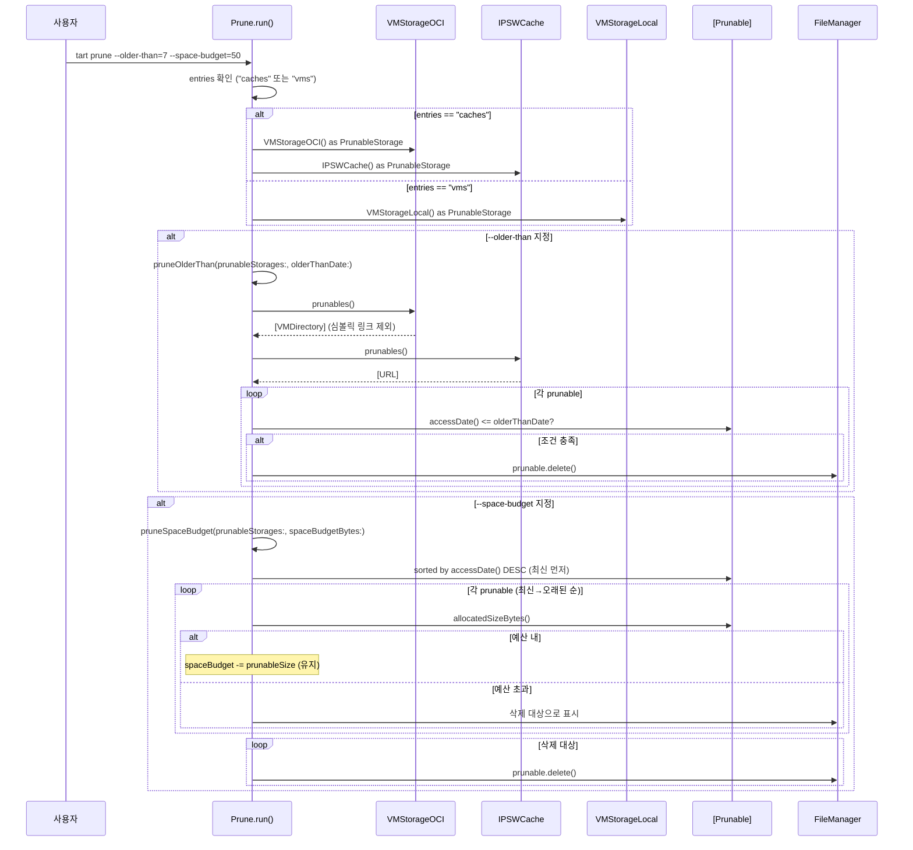
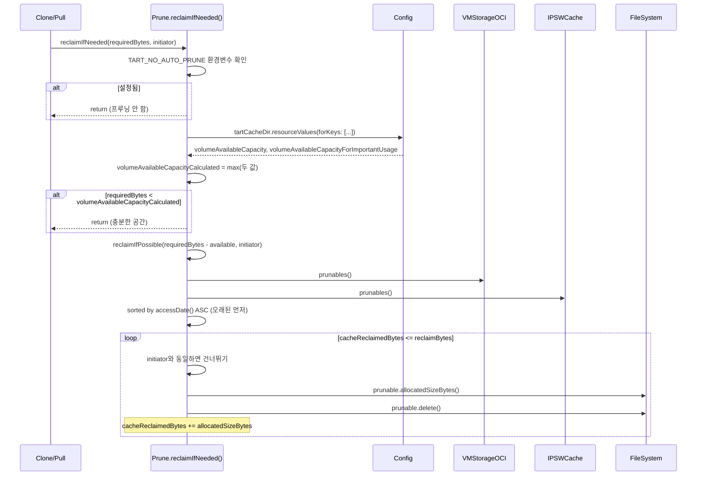

# 03. Tart 시퀀스 다이어그램

> Tart의 주요 유즈케이스 8가지를 소스코드 기반으로 분석한다.
> 각 흐름은 Mermaid 다이어그램 + ASCII 다이어그램 + 코드 참조로 설명한다.
> 모든 파일 경로와 함수명은 소스코드에서 직접 확인한 것이다.

---

## 목차

1. [VM 생성 흐름 (tart create)](#1-vm-생성-흐름-tart-create)
2. [VM 실행 흐름 (tart run)](#2-vm-실행-흐름-tart-run)
3. [VM 클론 흐름 (tart clone)](#3-vm-클론-흐름-tart-clone)
4. [OCI Pull 흐름 (tart pull)](#4-oci-pull-흐름-tart-pull)
5. [OCI Push 흐름 (tart push)](#5-oci-push-흐름-tart-push)
6. [인증 흐름](#6-인증-흐름)
7. [Exec 흐름 (tart exec)](#7-exec-흐름-tart-exec)
8. [프루닝 흐름 (tart prune)](#8-프루닝-흐름-tart-prune)

---

## 1. VM 생성 흐름 (tart create)

macOS IPSW 이미지 또는 Linux 빈 디스크로 새 VM을 생성하는 전체 흐름이다.

### 1.1 Mermaid 시퀀스 다이어그램

```mermaid
sequenceDiagram
    participant User as 사용자
    participant Create as Create.run()
    participant VMDir as VMDirectory
    participant FileLock as FileLock
    participant VM as VM(vmDir:, ipswURL:)
    participant VZRestore as VZMacOSRestoreImage
    participant VZInstaller as VZMacOSInstaller
    participant Storage as VMStorageLocal

    User->>Create: tart create myvm --from-ipsw latest
    Create->>VMDir: VMDirectory.temporary()
    VMDir-->>Create: tmpVMDir (~/.tart/tmp/{UUID})
    Create->>FileLock: FileLock(lockURL: tmpVMDir.baseURL)
    FileLock-->>Create: tmpVMDirLock
    Create->>FileLock: tmpVMDirLock.lock()

    alt fromIPSW == "latest"
        Create->>VZRestore: VZMacOSRestoreImage.fetchLatestSupported()
        VZRestore-->>Create: image (ipswURL = image.url)
    else fromIPSW가 HTTP URL
        Create->>Create: ipswURL = URL(string: fromIPSW)
    else fromIPSW가 로컬 파일 경로
        Create->>Create: ipswURL = URL(fileURLWithPath: ...)
    end

    Create->>VM: VM(vmDir: tmpVMDir, ipswURL: ipswURL, diskSizeGB: diskSize)
    VM->>VM: retrieveIPSW(remoteURL) [원격이면 다운로드]
    VM->>VZRestore: VZMacOSRestoreImage.load(from: ipswURL)
    VZRestore-->>VM: image
    VM->>VM: image.mostFeaturefulSupportedConfiguration
    VM->>VMDir: VZMacAuxiliaryStorage(creatingStorageAt: nvramURL)
    VM->>VMDir: vmDir.resizeDisk(diskSizeGB, format:)
    VM->>VM: VMConfig(...) 생성 및 config.save(toURL:)
    VM->>VM: craftConfiguration(diskURL:, nvramURL:, vmConfig:, ...)
    VM->>VM: VZVirtualMachine(configuration:)
    VM->>VZInstaller: install(ipswURL) → VZMacOSInstaller
    VZInstaller-->>VM: 설치 완료
    VM-->>Create: VM 인스턴스

    Create->>Storage: VMStorageLocal().move(name, from: tmpVMDir)
    Storage-->>Create: ~/.tart/vms/myvm/ 으로 이동 완료
```

### 1.2 ASCII 다이어그램

```
tart create myvm --from-ipsw latest
│
├─[1] VMDirectory.temporary()
│     ~/.tart/tmp/{UUID}/ 생성
│
├─[2] FileLock(lockURL: tmpVMDir.baseURL).lock()
│     임시 디렉토리를 잠가서 GC 방지
│
├─[3] IPSW URL 결정
│     ├── "latest" → VZMacOSRestoreImage.fetchLatestSupported()
│     ├── "http(s)://" → URL 직접 사용
│     └── 로컬 경로 → URL(fileURLWithPath:)
│
├─[4] VM(vmDir: tmpVMDir, ipswURL: ipswURL, diskSizeGB: 50)
│     │
│     ├── ipswURL이 원격이면 → retrieveIPSW(remoteURL:)
│     │   ├── HEAD 요청으로 x-amz-meta-digest-sha256 확인
│     │   ├── IPSWCache 히트 → 캐시된 파일 반환
│     │   └── 캐시 미스 → 다운로드 후 IPSWCache에 저장
│     │
│     ├── VZMacOSRestoreImage.load(from: ipswURL)
│     │   └── image.mostFeaturefulSupportedConfiguration → requirements
│     │
│     ├── NVRAM 생성: VZMacAuxiliaryStorage(creatingStorageAt: nvramURL)
│     ├── 디스크 생성: vmDir.resizeDisk(diskSizeGB, format:)
│     │   ├── .raw → FileHandle.truncate(atOffset: sizeGB * 1e9)
│     │   └── .asif → Diskutil.imageCreate(diskURL:, sizeGB:)
│     │
│     ├── VMConfig 생성 (platform: Darwin, cpuCount: max(4, min), ...)
│     ├── config.save(toURL: configURL)
│     ├── craftConfiguration() → VZVirtualMachineConfiguration
│     ├── VZVirtualMachine(configuration:)
│     │
│     └── install(ipswURL)
│         └── VZMacOSInstaller(virtualMachine:, restoringFromImageAt:)
│             └── installer.install() — OS 설치 진행
│
└─[5] VMStorageLocal().move("myvm", from: tmpVMDir)
      ~/.tart/tmp/{UUID}/ → ~/.tart/vms/myvm/ (원자적 이동)
```

### 1.3 핵심 코드 참조

**진입점 - `Sources/tart/Commands/Create.swift`**

```swift
// Create.run() (라인 41-81)
func run() async throws {
    let tmpVMDir = try VMDirectory.temporary()
    let tmpVMDirLock = try FileLock(lockURL: tmpVMDir.baseURL)
    try tmpVMDirLock.lock()

    try await withTaskCancellationHandler(operation: {
        #if arch(arm64)
        if let fromIPSW = fromIPSW {
            // ... IPSW URL 결정 로직
            _ = try await VM(vmDir: tmpVMDir, ipswURL: ipswURL,
                            diskSizeGB: diskSize, diskFormat: diskFormat)
        }
        #endif

        if linux {
            _ = try await VM.linux(vmDir: tmpVMDir,
                                   diskSizeGB: diskSize, diskFormat: diskFormat)
        }

        try VMStorageLocal().move(name, from: tmpVMDir)
    }, onCancel: {
        try? FileManager.default.removeItem(at: tmpVMDir.baseURL)
    })
}
```

**임시 디렉토리 생성 - `Sources/tart/VMDirectory.swift`**

```swift
// VMDirectory.temporary() (라인 72-77)
static func temporary() throws -> VMDirectory {
    let tmpDir = try Config().tartTmpDir
        .appendingPathComponent(UUID().uuidString)
    try FileManager.default.createDirectory(at: tmpDir,
        withIntermediateDirectories: false)
    return VMDirectory(baseURL: tmpDir)
}
```

**IPSW 캐시 로직 - `Sources/tart/VM.swift`**

```swift
// VM.retrieveIPSW(remoteURL:) (라인 88-134)
static func retrieveIPSW(remoteURL: URL) async throws -> URL {
    // HEAD 요청으로 sha256 해시 확인
    var headRequest = URLRequest(url: remoteURL)
    headRequest.httpMethod = "HEAD"
    let (_, headResponse) = try await Fetcher.fetch(headRequest, viaFile: false)

    if let hash = headResponse.value(forHTTPHeaderField:
        "x-amz-meta-digest-sha256") {
        let ipswLocation = try IPSWCache()
            .locationFor(fileName: "sha256:\(hash).ipsw")
        if FileManager.default.fileExists(atPath: ipswLocation.path) {
            return ipswLocation  // 캐시 히트
        }
    }
    // 캐시 미스 → 다운로드 ...
}
```

**macOS VM 초기화 - `Sources/tart/VM.swift`**

```swift
// VM.init(vmDir:, ipswURL:, ...) (라인 146-229)
// 1) VZMacOSRestoreImage.load(from: ipswURL)
// 2) image.mostFeaturefulSupportedConfiguration → requirements
// 3) VZMacAuxiliaryStorage 생성 (NVRAM)
// 4) vmDir.resizeDisk(diskSizeGB, format:)
// 5) VMConfig 생성 및 저장
// 6) craftConfiguration() → VZVirtualMachineConfiguration
// 7) install(ipswURL) → VZMacOSInstaller
```

### 1.4 설계 포인트

| 설계 결정 | 이유 |
|-----------|------|
| 임시 디렉토리에서 작업 후 원자적 이동 | 실패 시 불완전한 VM이 로컬 저장소에 남지 않도록 보장 |
| FileLock으로 임시 디렉토리 보호 | Config.gc()가 잠금 없는 임시 디렉토리를 정리하므로, 작업 중 GC 방지 |
| withTaskCancellationHandler로 취소 처리 | Ctrl+C 시 임시 디렉토리 자동 정리 |
| IPSW 캐시 (IPSWCache) | 동일 IPSW 반복 다운로드 방지, sha256 기반 캐시 키 |
| cpuCount = max(4, minimumSupportedCPUCount) | 4코어 미만 시 VM 프리징 방지 (라인 194) |

---

## 2. VM 실행 흐름 (tart run)

### 2.1 Mermaid 시퀀스 다이어그램



### 2.2 ASCII 다이어그램

```
tart run myvm [--no-graphics] [--net-softnet] [--disk ...]
│
├─[1] VMStorageLocal().open(name)
│     vmDir = ~/.tart/vms/myvm/
│
├─[2] MAC 주소 충돌 검사
│     storageLock = FileLock(lockURL: tartHomeDir)
│     실행 중인 다른 VM과 MAC 중복 → regenerateMACAddress()
│
├─[3] 네트워크 설정
│     ├── --net-softnet → Softnet(vmMACAddress:, extraArguments:)
│     ├── --net-bridged → NetworkBridged(interfaces:)
│     └── 기본값 → NetworkShared() [VZNATNetworkDeviceAttachment]
│
├─[4] VM 인스턴스 생성
│     VM(vmDir:, network:, additionalStorageDevices:, ...)
│     ├── VMConfig.init(fromURL: configURL)
│     ├── craftConfiguration()
│     │   ├── bootLoader (Darwin: VZMacOSBootLoader / Linux: VZEFIBootLoader)
│     │   ├── cpuCount, memorySize
│     │   ├── platform (VZMacPlatformConfiguration / VZGenericPlatformConfiguration)
│     │   ├── graphicsDevices
│     │   ├── audioDevices (VZVirtioSoundDeviceConfiguration)
│     │   ├── keyboards, pointingDevices
│     │   ├── networkDevices (VZVirtioNetworkDeviceConfiguration)
│     │   ├── clipboard (VZSpiceAgentPortAttachment)
│     │   ├── storageDevices (VZDiskImageStorageDeviceAttachment)
│     │   ├── entropyDevices (VZVirtioEntropyDeviceConfiguration)
│     │   ├── directorySharingDevices
│     │   ├── serialPorts
│     │   ├── consoleDevices (tart-version-{version})
│     │   └── socketDevices (VZVirtioSocketDeviceConfiguration)
│     └── VZVirtualMachine(configuration:)
│
├─[5] VM 잠금 (PIDLock)
│     lock = vmDir.lock() → PIDLock(lockURL: configURL)
│     lock.trylock() [실패 시 VMAlreadyRunning 에러]
│
├─[6] Task 시작
│     ├── suspend 상태 확인 → state.vzvmsave 존재 시 복원
│     ├── vm.start(recovery:, resume:)
│     │   ├── network.run(sema)  [Softnet: process.run()]
│     │   ├── resume → virtualMachine.resume()
│     │   └── !resume → virtualMachine.start(options:)
│     │
│     ├── ControlSocket(controlSocketURL).run()  [macOS 14+]
│     │   └── Unix 소켓 → VM 포트 8080 프록시
│     │
│     └── vm.run()
│         ├── sema.waitUnlessCancelled()
│         │   대기: guestDidStop() 또는 task.cancel()
│         ├── 취소 시: virtualMachine.stop()
│         └── network.stop()
│
├─[7] 시그널 핸들러 등록
│     ├── SIGINT  → task.cancel() [tart stop]
│     ├── SIGUSR1 → pause() → saveMachineStateTo() [tart suspend]
│     └── SIGUSR2 → requestStop() [Graceful shutdown]
│
└─[8] UI 이벤트 루프
      ├── --no-graphics → NSApplication.shared.run() [UI 없음]
      └── 기본 → runUI(suspendable, captureSystemKeys) [VM 창 표시]
```

### 2.3 핵심 코드 참조

**진입점 - `Sources/tart/Commands/Run.swift`**

```swift
// Run.run() (라인 362-606)
@MainActor
func run() async throws {
    let localStorage = try VMStorageLocal()
    let vmDir = try localStorage.open(name)
    // ...
    vm = try VM(
        vmDir: vmDir,
        network: userSpecifiedNetwork(vmDir: vmDir) ?? NetworkShared(),
        additionalStorageDevices: try additionalDiskAttachments(),
        directorySharingDevices: directoryShares() + rosettaDirectoryShare(),
        serialPorts: serialPorts,
        suspendable: suspendable,
        nested: nested,
        // ...
    )
    // ...
    let lock = try vmDir.lock()
    if try !lock.trylock() {
        throw RuntimeError.VMAlreadyRunning(
            "VM \"\(name)\" is already running!")
    }
    // ...
}
```

**VM 구성 빌드 - `Sources/tart/VM.swift`**

```swift
// VM.craftConfiguration() (라인 309-445)
static func craftConfiguration(
    diskURL: URL, nvramURL: URL, vmConfig: VMConfig,
    network: Network, ...
) throws -> VZVirtualMachineConfiguration {
    let configuration = VZVirtualMachineConfiguration()
    configuration.bootLoader = try vmConfig.platform.bootLoader(nvramURL:)
    configuration.cpuCount = vmConfig.cpuCount
    configuration.memorySize = vmConfig.memorySize
    configuration.platform = try vmConfig.platform.platform(nvramURL:, ...)
    configuration.graphicsDevices = [vmConfig.platform.graphicsDevice(...)]
    // ... (오디오, 키보드, 네트워크, 스토리지, 소켓 등)
    configuration.socketDevices = [VZVirtioSocketDeviceConfiguration()]
    try configuration.validate()
    return configuration
}
```

**VM 시작 및 대기 - `Sources/tart/VM.swift`**

```swift
// vm.start() (라인 247-255)
func start(recovery: Bool, resume shouldResume: Bool) async throws {
    try network.run(sema)
    if shouldResume {
        try await resume()
    } else {
        try await start(recovery)
    }
}

// vm.run() (라인 270-286)
func run() async throws {
    do {
        try await sema.waitUnlessCancelled()
    } catch is CancellationError {
        // Ctrl+C, tart stop, 또는 창 닫기
    }
    if Task.isCancelled {
        if self.virtualMachine.state == .running {
            try await stop()
        }
    }
    try await network.stop()
}
```

**VZVirtualMachineDelegate - `Sources/tart/VM.swift`**

```swift
// (라인 447-460)
func guestDidStop(_ virtualMachine: VZVirtualMachine) {
    print("guest has stopped the virtual machine")
    sema.signal()  // run() 대기 해제
}

func virtualMachine(_ vm: VZVirtualMachine,
                     didStopWithError error: Error) {
    print("guest has stopped the virtual machine due to error: \(error)")
    sema.signal()
}
```

### 2.4 설계 포인트

| 설계 결정 | 이유 |
|-----------|------|
| AsyncSemaphore로 VM 종료 대기 | VZVirtualMachineDelegate 콜백과 async/await를 연결하는 브릿지 |
| PIDLock으로 VM 중복 실행 방지 | config.json을 fcntl(2)로 잠가서 동시 실행 차단 |
| ControlSocket (macOS 14+) | tart exec 명령이 Unix 소켓을 통해 VM 내부 gRPC 에이전트와 통신 |
| SIGINT/SIGUSR1/SIGUSR2 핸들러 | 각각 stop/suspend/graceful-shutdown을 지원하여 다양한 종료 방식 제공 |
| storageLock으로 MAC 충돌 검사 | 동일 MAC의 VM이 동시 실행 시 네트워크 충돌 방지 |

---

## 3. VM 클론 흐름 (tart clone)

### 3.1 Mermaid 시퀀스 다이어그램



### 3.2 ASCII 다이어그램

```
tart clone ghcr.io/org/vm:tag newvm
│
├─[1] 원격 이름 분기
│     ├── RemoteName 파싱 성공 + OCI 캐시에 없음
│     │   └── ociStorage.pull(remoteName, registry:, concurrency:, ...)
│     │       [전체 OCI Pull 흐름 수행 → 4장 참조]
│     └── 로컬 이름 또는 OCI 캐시에 이미 존재
│         └── 바로 다음 단계
│
├─[2] VMStorageHelper.open(sourceName)
│     ├── RemoteName 파싱 성공 → VMStorageOCI().open(remoteName)
│     └── 로컬 이름 → VMStorageLocal().open(name)
│
├─[3] VMDirectory.temporary()
│     ~/.tart/tmp/{UUID}/
│
├─[4] 이중 잠금 획득
│     ├── FileLock(lockURL: tmpVMDir.baseURL).lock()  [임시 디렉토리 보호]
│     └── FileLock(lockURL: tartHomeDir).lock()        [글로벌 동시성 제어]
│
├─[5] MAC 주소 중복 판단
│     hasVMsWithMACAddress(macAddress: sourceVM.macAddress())
│     && sourceVM.state() != .Suspended
│     → true이면 generateMAC = true
│
├─[6] sourceVM.clone(to: tmpVMDir, generateMAC:)
│     ├── FileManager.copyItem(config.json → tmp/config.json)   [APFS CoW]
│     ├── FileManager.copyItem(nvram.bin → tmp/nvram.bin)        [APFS CoW]
│     ├── FileManager.copyItem(disk.img → tmp/disk.img)          [APFS CoW]
│     ├── FileManager.copyItem(state.vzvmsave → tmp/state.vzvmsave) [optional]
│     └── generateMAC → regenerateMACAddress()
│         └── VZMACAddress.randomLocallyAdministered()
│
├─[7] VMStorageLocal().move(newName, from: tmpVMDir)
│     ~/.tart/tmp/{UUID}/ → ~/.tart/vms/newvm/  [원자적 이동]
│
├─[8] 글로벌 락 해제
│
└─[9] 자동 프루닝 (APFS CoW 공간 확보)
      unallocatedBytes = sourceVM.sizeBytes() - sourceVM.allocatedSizeBytes()
      reclaimBytes = min(unallocatedBytes, pruneLimit * 1GB)
      Prune.reclaimIfNeeded(reclaimBytes, sourceVM)
      └── 디스크 여유 공간 < reclaimBytes 이면
          → OCI 캐시 + IPSW 캐시에서 오래된 항목 삭제
```

### 3.3 핵심 코드 참조

**진입점 - `Sources/tart/Commands/Clone.swift`**

```swift
// Clone.run() (라인 47-91)
func run() async throws {
    let ociStorage = try VMStorageOCI()
    let localStorage = try VMStorageLocal()

    if let remoteName = try? RemoteName(sourceName),
       !ociStorage.exists(remoteName) {
        let registry = try Registry(host: remoteName.host,
                                     namespace: remoteName.namespace,
                                     insecure: insecure)
        try await ociStorage.pull(remoteName, registry: registry,
                                   concurrency: concurrency,
                                   deduplicate: deduplicate)
    }

    let sourceVM = try VMStorageHelper.open(sourceName)
    let tmpVMDir = try VMDirectory.temporary()
    // ...
    let generateMAC = try localStorage.hasVMsWithMACAddress(
        macAddress: sourceVM.macAddress()) && sourceVM.state() != .Suspended
    try sourceVM.clone(to: tmpVMDir, generateMAC: generateMAC)
    try localStorage.move(newName, from: tmpVMDir)
    // ...
    let unallocatedBytes = try sourceVM.sizeBytes()
        - sourceVM.allocatedSizeBytes()
    let reclaimBytes = min(unallocatedBytes, Int(pruneLimit) * 1024 * 1024 * 1024)
    if reclaimBytes > 0 {
        try Prune.reclaimIfNeeded(UInt64(reclaimBytes), sourceVM)
    }
}
```

**APFS Copy-on-Write 클론 - `Sources/tart/VMDirectory.swift`**

```swift
// VMDirectory.clone(to:, generateMAC:) (라인 119-129)
func clone(to: VMDirectory, generateMAC: Bool) throws {
    try FileManager.default.copyItem(at: configURL, to: to.configURL)
    try FileManager.default.copyItem(at: nvramURL, to: to.nvramURL)
    try FileManager.default.copyItem(at: diskURL, to: to.diskURL)
    try? FileManager.default.copyItem(at: stateURL, to: to.stateURL)

    if generateMAC {
        try to.regenerateMACAddress()
    }
}
```

### 3.4 설계 포인트

| 설계 결정 | 이유 |
|-----------|------|
| APFS Copy-on-Write | FileManager.copyItem()은 APFS에서 CoW로 동작하므로 50GB 디스크도 순간 복사 |
| 클론 후 자동 프루닝 | CoW 디스크가 실제 쓰기 시 새 블록을 할당하므로, 미리 공간 확보 |
| MAC 주소 재생성 조건 | 동일 MAC의 VM이 이미 존재하고 Suspended가 아닌 경우에만 재생성 (Suspended VM은 MAC이 변경되면 복원 불가) |
| 글로벌 FileLock | clone과 run의 MAC 충돌 검사가 레이스 조건 없이 동작하도록 직렬화 |

---

## 4. OCI Pull 흐름 (tart pull)

### 4.1 Mermaid 시퀀스 다이어그램



### 4.2 ASCII 다이어그램

```
tart pull ghcr.io/org/vm:tag
│
├─[1] Registry(host: "ghcr.io", namespace: "org/vm", insecure: false)
│
├─[2] VMStorageOCI().pull(remoteName, registry:, concurrency:4, ...)
│     │
│     ├── registry.pullManifest(reference: "tag")
│     │   └── GET /v2/org/vm/manifests/tag  [인증 포함]
│     │
│     ├── digestName = sha256:hash(manifestData)
│     ├── 캐시 확인: exists(name) && exists(digestName) && linked?
│     │   └── true → "already cached!" → 조기 반환
│     │
│     ├── FileLock(lockURL: hostDirectoryURL).lock()
│     │   └── 동일 호스트에 대한 동시 pull 방지
│     │
│     ├── VMDirectory.temporaryDeterministic(key: name.description)
│     │   └── ~/.tart/tmp/{MD5(name)}/
│     │
│     ├── 자동 프루닝
│     │   manifest.uncompressedDiskSize() → Prune.reclaimIfNeeded()
│     │
│     ├── LocalLayerCache 선택
│     │   chooseLocalLayerCache(name, manifest, registry)
│     │   ├── 기존 OCI 캐시 이미지들의 manifest.json 로드
│     │   ├── 레이어 교집합 계산 → deduplicatedBytes
│     │   └── 1GB 이상 중복이면 베스트 매치 선택
│     │
│     ├── tmpVMDir.pullFromRegistry(registry:, manifest:, ...)
│     │   │
│     │   ├── [Config] pullBlob(configLayer.digest)
│     │   │   → config.json 저장
│     │   │
│     │   ├── [Disk] DiskV2.pull(registry:, diskLayers:, diskURL:, ...)
│     │   │   ├── 디스크 파일 생성 (truncate → uncompressedDiskSize)
│     │   │   ├── stat() → fsBlockSize 확인
│     │   │   └── withThrowingTaskGroup { ... }
│     │   │       └── 각 레이어별 (최대 concurrency개 동시):
│     │   │           ├── resumable pull 확인 (이전 실패 복구)
│     │   │           ├── LocalLayerCache 히트?
│     │   │           │   ├── deduplicate + 동일 오프셋 → skip (이미 디스크에 있음)
│     │   │           │   └── 다른 오프셋 → subdata() → zeroSkippingWrite
│     │   │           └── 원격 다운로드
│     │   │               ├── registry.pullBlob(digest, rangeStart:)
│     │   │               ├── OutputFilter(.decompress, using: .lz4)
│     │   │               └── zeroSkippingWrite (0 블록 건너뛰기)
│     │   │
│     │   ├── [NVRAM] pullBlob(nvramLayer.digest)
│     │   │   → nvram.bin 저장
│     │   │
│     │   └── manifest.toJSON().write(to: manifestURL)
│     │
│     ├── move(digestName, from: tmpVMDir)
│     │   ~/.tart/tmp/{MD5}/ → ~/.tart/cache/OCIs/ghcr.io/org/vm/sha256:xxx/
│     │
│     └── link(from: name, to: digestName)
│         ~/.tart/cache/OCIs/ghcr.io/org/vm/tag → sha256:xxx  [심볼릭 링크]
│
└─ 완료
```

### 4.3 핵심 코드 참조

**VMStorageOCI.pull() - `Sources/tart/VMStorageOCI.swift`**

```swift
// (라인 147-254)
func pull(_ name: RemoteName, registry: Registry, concurrency: UInt,
          deduplicate: Bool) async throws {
    let (manifest, manifestData) = try await registry.pullManifest(
        reference: name.reference.value)
    let digestName = RemoteName(host: name.host, namespace: name.namespace,
        reference: Reference(digest: Digest.hash(manifestData)))

    if exists(name) && exists(digestName) && linked(from: name, to: digestName) {
        return  // 이미 캐시됨
    }

    let lock = try FileLock(lockURL: hostDirectoryURL(digestName))
    // ...
    let tmpVMDir = try VMDirectory.temporaryDeterministic(key: name.description)
    // ...
    let localLayerCache = try await chooseLocalLayerCache(name, manifest, registry)
    try await tmpVMDir.pullFromRegistry(registry: registry,
        manifest: manifest, concurrency: concurrency,
        localLayerCache: localLayerCache, deduplicate: deduplicate)
    try move(digestName, from: tmpVMDir)
    // ...
    try link(from: name, to: digestName)
}
```

**pullFromRegistry - `Sources/tart/VMDirectory+OCI.swift`**

```swift
// (라인 16-89)
func pullFromRegistry(registry: Registry, manifest: OCIManifest,
                       concurrency: UInt, localLayerCache: LocalLayerCache?,
                       deduplicate: Bool) async throws {
    // [1] Config 레이어 pull
    let configLayers = manifest.layers.filter { $0.mediaType == configMediaType }
    try await registry.pullBlob(configLayers.first!.digest) { data in
        try configFile.write(contentsOf: data)
    }

    // [2] Disk 레이어들 pull (DiskV2)
    let layers = manifest.layers.filter { $0.mediaType == diskV2MediaType }
    try await DiskV2.pull(registry: registry, diskLayers: layers,
                           diskURL: diskURL, concurrency: concurrency,
                           progress: progress, localLayerCache: localLayerCache,
                           deduplicate: deduplicate)

    // [3] NVRAM 레이어 pull
    let nvramLayers = manifest.layers.filter { $0.mediaType == nvramMediaType }
    try await registry.pullBlob(nvramLayers.first!.digest) { data in
        try nvram.write(contentsOf: data)
    }

    // [4] Manifest 저장 (다음 pull 시 LocalLayerCache용)
    try manifest.toJSON().write(to: manifestURL)
}
```

**DiskV2.pull() - `Sources/tart/OCI/Layerizer/DiskV2.swift`**

```swift
// (라인 87-245)
static func pull(registry: Registry, diskLayers: [OCIManifestLayer],
                  diskURL: URL, concurrency: UInt, progress: Progress,
                  localLayerCache: LocalLayerCache?, deduplicate: Bool) async throws {
    // 1) 디스크 파일 생성/크기 조정
    let disk = try FileHandle(forWritingTo: diskURL)
    try disk.truncate(atOffset: uncompressedDiskSize)
    try disk.close()

    // 2) 파일시스템 블록 크기 확인
    var st = stat()
    stat(diskURL.path, &st)
    let fsBlockSize = UInt64(st.st_blksize)

    // 3) 병렬 레이어 fetch + decompress
    try await withThrowingTaskGroup(of: Void.self) { group in
        for (index, diskLayer) in diskLayers.enumerated() {
            if index >= concurrency { try await group.next() }

            group.addTask {
                // LocalLayerCache 히트 확인
                if let localLayerCache, let localLayerInfo = localLayerCache
                    .findInfo(digest: diskLayer.digest,
                             offsetHint: diskWritingOffset) {
                    // 캐시에서 복원 또는 건너뛰기
                    return
                }
                // 원격에서 pull + LZ4 decompress
                let filter = try OutputFilter(.decompress, using: .lz4, ...)
                try await registry.pullBlob(diskLayer.digest) { data in
                    try filter.write(data)
                }
                try filter.finalize()
            }
        }
    }
}
```

### 4.4 설계 포인트

| 설계 결정 | 이유 |
|-----------|------|
| Content-addressable 저장소 (sha256 디렉토리 + 심볼릭 링크) | 동일 이미지에 여러 태그가 있어도 디스크 한 번만 차지 |
| LocalLayerCache | 이전 버전 이미지가 캐시에 있으면 공통 레이어를 네트워크 없이 복원 |
| DiskV2 포맷 (512MB LZ4 청크) | 각 레이어를 독립적으로 압축/해제 가능, 병렬 다운로드 지원 |
| zeroSkippingWrite | 0으로 채워진 블록은 쓰지 않아 sparse 파일 유지 → 디스크 절약 |
| Resumable pull | 디스크 파일이 이미 존재하면 각 레이어의 해시를 검증하여 재다운로드 건너뛰기 |
| temporaryDeterministic (MD5 기반) | 동일 이미지를 재시도할 때 같은 임시 디렉토리를 재사용하여 resumable pull 지원 |
| retry(maxAttempts: 5) | URLError 발생 시 자동 재시도 (네트워크 불안정 대응) |

---

## 5. OCI Push 흐름 (tart push)

### 5.1 Mermaid 시퀀스 다이어그램



### 5.2 ASCII 다이어그램

```
tart push myvm ghcr.io/org/vm:tag
│
├─[1] VMStorageHelper.open("myvm") → localVMDir
│     localVMDir.lock().trylock() [실행 중이면 에러]
│
├─[2] Registry(host: "ghcr.io", namespace: "org/vm", insecure: false)
│
├─[3] localVMDir.pushToRegistry(registry:, references:, ...)
│     │
│     ├── [Config] VMConfig → JSON 인코딩
│     │   registry.pushBlob(fromData: configJSON, chunkSizeMb:)
│     │   ├── POST /v2/org/vm/blobs/uploads/ [업로드 시작]
│     │   ├── Location 헤더에서 업로드 URL 추출
│     │   └── PUT {uploadLocation}?digest=sha256:xxx [monolithic 업로드]
│     │   → configDigest 반환
│     │   → layers += OCIManifestLayer(mediaType: configMediaType, ...)
│     │
│     ├── [Disk] DiskV2.push(diskURL:, registry:, concurrency:4, ...)
│     │   ├── Data(contentsOf: diskURL, options: .alwaysMapped) [mmap]
│     │   └── withThrowingTaskGroup { ... }
│     │       └── 각 512MB 청크별 (최대 concurrency개 동시):
│     │           ├── NSData.compressed(using: .lz4) → compressedData
│     │           ├── Digest.hash(compressedData) → compressedDataDigest
│     │           ├── registry.blobExists(compressedDataDigest)
│     │           │   └── true → 건너뛰기 (이미 존재)
│     │           └── registry.pushBlob(fromData: compressedData, ...)
│     │   → layers += [OCIManifestLayer(mediaType: diskV2MediaType, ...)]
│     │
│     ├── [NVRAM] nvram = FileHandle.readToEnd()
│     │   registry.pushBlob(fromData: nvram, chunkSizeMb:)
│     │   → nvramDigest 반환
│     │   → layers += OCIManifestLayer(mediaType: nvramMediaType, ...)
│     │
│     ├── [OCI Config] OCIConfig(architecture:, os:, config: Labels)
│     │   registry.pushBlob(fromData: ociConfigJSON, chunkSizeMb:)
│     │   → ociConfigDigest 반환
│     │
│     ├── [Manifest] OCIManifest 조립
│     │   OCIManifest(config: OCIManifestConfig(size:, digest:),
│     │               layers: [config + disk chunks + nvram],
│     │               uncompressedDiskSize:, uploadDate:)
│     │
│     └── 각 reference에 대해:
│         registry.pushManifest(reference: "tag", manifest:)
│         → PUT /v2/org/vm/manifests/tag
│
└─ 완료: pushedRemoteName 반환
```

### 5.3 핵심 코드 참조

**pushToRegistry - `Sources/tart/VMDirectory+OCI.swift`**

```swift
// (라인 91-141)
func pushToRegistry(registry: Registry, references: [String],
                     chunkSizeMb: Int, concurrency: UInt,
                     labels: [String: String]) async throws -> RemoteName {
    var layers = Array<OCIManifestLayer>()

    // [1] Config blob push
    let config = try VMConfig(fromURL: configURL)
    let configJSON = try JSONEncoder().encode(config)
    let configDigest = try await registry.pushBlob(fromData: configJSON,
                                                    chunkSizeMb: chunkSizeMb)
    layers.append(OCIManifestLayer(mediaType: configMediaType,
                                    size: configJSON.count,
                                    digest: configDigest))

    // [2] Disk layers push (DiskV2)
    layers.append(contentsOf: try await DiskV2.push(
        diskURL: diskURL, registry: registry,
        chunkSizeMb: chunkSizeMb, concurrency: concurrency,
        progress: progress))

    // [3] NVRAM blob push
    let nvram = try FileHandle(forReadingFrom: nvramURL).readToEnd()!
    let nvramDigest = try await registry.pushBlob(fromData: nvram,
                                                   chunkSizeMb: chunkSizeMb)
    layers.append(OCIManifestLayer(mediaType: nvramMediaType,
                                    size: nvram.count, digest: nvramDigest))

    // [4] OCI config + Manifest push
    let ociConfigJSON = try OCIConfig(architecture: config.arch,
                                       os: config.os,
                                       config: ociConfigContainer).toJSON()
    let ociConfigDigest = try await registry.pushBlob(fromData: ociConfigJSON, ...)
    let manifest = OCIManifest(config: OCIManifestConfig(size:, digest:),
                                layers: layers, ...)
    for reference in references {
        _ = try await registry.pushManifest(reference: reference,
                                             manifest: manifest)
    }
    return RemoteName(host: registry.host!, namespace: registry.namespace,
                       reference: Reference(digest: try manifest.digest()))
}
```

**DiskV2.push() - `Sources/tart/OCI/Layerizer/DiskV2.swift`**

```swift
// (라인 25-85)
static func push(diskURL: URL, registry: Registry,
                  chunkSizeMb: Int, concurrency: UInt,
                  progress: Progress) async throws -> [OCIManifestLayer] {
    let mappedDisk = try Data(contentsOf: diskURL, options: [.alwaysMapped])

    try await withThrowingTaskGroup(of: (Int, OCIManifestLayer).self) { group in
        for (index, data) in mappedDisk
            .chunks(ofCount: layerLimitBytes).enumerated() {
            if index >= concurrency {
                if let result = try await group.next() {
                    pushedLayers.append(result)
                }
            }
            group.addTask {
                let compressedData = try (data as NSData)
                    .compressed(using: .lz4) as Data
                let compressedDataDigest = Digest.hash(compressedData)

                if try await !registry.blobExists(compressedDataDigest) {
                    _ = try await registry.pushBlob(fromData: compressedData,
                        chunkSizeMb: chunkSizeMb, digest: compressedDataDigest)
                }

                return (index, OCIManifestLayer(
                    mediaType: diskV2MediaType,
                    size: compressedData.count,
                    digest: compressedDataDigest,
                    uncompressedSize: UInt64(data.count),
                    uncompressedContentDigest: Digest.hash(data)))
            }
        }
    }
    return pushedLayers.sorted { $0.index < $1.index }.map { $0.pushedLayer }
}
```

**Registry.pushBlob() - `Sources/tart/OCI/Registry.swift`**

```swift
// (라인 206-264)
public func pushBlob(fromData: Data, chunkSizeMb: Int = 0,
                      digest: String? = nil) async throws -> String {
    // [1] POST → 업로드 세션 시작
    let (_, postResponse) = try await dataRequest(.POST,
        endpointURL("\(namespace)/blobs/uploads/"),
        headers: ["Content-Length": "0"])

    // [2] Location 헤더에서 업로드 URL 추출
    var uploadLocation = try uploadLocationFromResponse(postResponse)

    if chunkSizeMb == 0 {
        // Monolithic 업로드: PUT
        let (_, response) = try await dataRequest(.PUT, uploadLocation,
            headers: ["Content-Type": "application/octet-stream"],
            parameters: ["digest": digest], body: fromData)
    } else {
        // Chunked 업로드: PATCH * N + PUT
        for (index, chunk) in fromData.chunks(ofCount: chunkSizeMb * 1_000_000).enumerated() {
            let lastChunk = index == (chunks.count - 1)
            try await dataRequest(lastChunk ? .PUT : .PATCH, uploadLocation, ...)
            uploadLocation = try uploadLocationFromResponse(response)
        }
    }
    return digest
}
```

### 5.4 설계 포인트

| 설계 결정 | 이유 |
|-----------|------|
| mmap으로 디스크 읽기 (.alwaysMapped) | 전체 디스크를 메모리에 올리지 않고 필요한 부분만 페이지 폴트로 읽기 |
| 512MB 레이어 단위 분할 (layerLimitBytes) | 병렬 업로드 지원, 각 레이어가 독립적으로 pull 가능 |
| blobExists() 확인 후 업로드 | 이미 존재하는 레이어는 건너뛰어 증분 push 지원 |
| LZ4 압축 | 높은 압축/해제 속도, CPU 병목 최소화 |
| Monolithic vs Chunked 업로드 | chunkSizeMb=0이면 monolithic (기본), 레지스트리별 최적 전략 선택 가능 |
| 레이어에 uncompressedSize/uncompressedContentDigest 어노테이션 | pull 시 디스크 크기 사전 할당 및 무결성 검증에 활용 |

---

## 6. 인증 흐름

### 6.1 Mermaid 시퀀스 다이어그램



### 6.2 ASCII 다이어그램

```
Registry.channelRequest(method, url, headers, ...)
│
├─[1] authAwareRequest(request:, viaFile:, doAuth: true)
│     ├── AuthenticationKeeper.header()
│     │   ├── authentication == nil → nil (첫 요청)
│     │   ├── !authentication.isValid() → nil (만료됨)
│     │   └── authentication.header() → ("Authorization", "Bearer xxx")
│     ├── request에 인증 헤더 추가
│     ├── User-Agent 설정: "Tart/{version} ({os}; {model})"
│     └── Fetcher.fetch(request, viaFile:)
│
├─[2] 응답 HTTP 401이면 → auth(response:)
│     │
│     ├── WWW-Authenticate 헤더 파싱
│     │   WWWAuthenticate(rawHeaderValue: "Bearer realm=...,service=...,scope=...")
│     │   ├── scheme = "Bearer"
│     │   └── kvs = { "realm": "https://ghcr.io/token",
│     │               "service": "ghcr.io",
│     │               "scope": "repository:org/vm:pull" }
│     │
│     ├── [Basic 인증]
│     │   scheme == "basic"
│     │   └── lookupCredentials() → BasicAuthentication 설정
│     │
│     └── [Bearer 인증]
│         scheme == "bearer"
│         ├── lookupCredentials()
│         │   순서: EnvironmentCredentialsProvider
│         │       → DockerConfigCredentialsProvider
│         │       → KeychainCredentialsProvider
│         │
│         ├── GET {realm}?scope=...&service=...
│         │   Headers: Authorization: Basic base64(user:password)
│         │   [인증정보가 있을 때만]
│         │
│         ├── TokenResponse.parse(fromData:)
│         │   { "token": "eyJ...", "expires_in": 300, "issued_at": "..." }
│         │
│         └── AuthenticationKeeper.set(tokenResponse)
│
└─[3] 재시도: authAwareRequest(request:, viaFile:, doAuth: true)
      Authorization: Bearer eyJ...
      → HTTP 200 성공
```

### 6.3 핵심 코드 참조

**channelRequest (인증 감지 및 재시도) - `Sources/tart/OCI/Registry.swift`**

```swift
// (라인 326-362)
private func channelRequest(
    _ method: HTTPMethod, _ urlComponents: URLComponents,
    headers: Dictionary<String, String> = Dictionary(), ...
) async throws -> (AsyncThrowingStream<Data, Error>, HTTPURLResponse) {
    // ...
    var (channel, response) = try await authAwareRequest(
        request: request, viaFile: viaFile, doAuth: doAuth)

    if doAuth && response.statusCode == HTTPCode.Unauthorized.rawValue {
        try await auth(response: response)
        (channel, response) = try await authAwareRequest(
            request: request, viaFile: viaFile, doAuth: doAuth)
    }

    return (channel, response)
}
```

**auth() (인증 처리) - `Sources/tart/OCI/Registry.swift`**

```swift
// (라인 364-422)
private func auth(response: HTTPURLResponse) async throws {
    guard let wwwAuthenticateRaw = response.value(
        forHTTPHeaderField: "WWW-Authenticate") else {
        throw RegistryError.AuthFailed(
            why: "got HTTP 401, but WWW-Authenticate header is missing")
    }

    let wwwAuthenticate = try WWWAuthenticate(rawHeaderValue: wwwAuthenticateRaw)

    if wwwAuthenticate.scheme.lowercased() == "basic" {
        if let (user, password) = try lookupCredentials() {
            await authenticationKeeper.set(
                BasicAuthentication(user: user, password: password))
        }
        return
    }

    // Bearer 토큰 요청
    guard let realm = wwwAuthenticate.kvs["realm"] else { ... }
    guard var authenticateURL = URLComponents(string: realm) else { ... }

    authenticateURL.queryItems = ["scope", "service"].compactMap { key in
        wwwAuthenticate.kvs[key].map { URLQueryItem(name: key, value: $0) }
    }

    var headers: Dictionary<String, String> = Dictionary()
    if let (user, password) = try lookupCredentials() {
        let encodedCredentials = "\(user):\(password)".data(using: .utf8)?
            .base64EncodedString()
        headers["Authorization"] = "Basic \(encodedCredentials!)"
    }

    let (data, response) = try await dataRequest(.GET, authenticateURL,
                                                   headers: headers, doAuth: false)
    await authenticationKeeper.set(try TokenResponse.parse(fromData: data))
}
```

**WWWAuthenticate 파서 - `Sources/tart/OCI/WWWAuthenticate.swift`**

```swift
// (라인 7-63)
class WWWAuthenticate {
    var scheme: String
    var kvs: Dictionary<String, String> = Dictionary()

    init(rawHeaderValue: String) throws {
        let splits = rawHeaderValue.split(separator: " ", maxSplits: 1)
        scheme = String(splits[0])
        // contextAwareCommaSplit → 따옴표 내 콤마 무시
        let rawDirectives = contextAwareCommaSplit(
            rawDirectives: String(splits[1]))
        try rawDirectives.forEach { sequence in
            let parts = sequence.split(separator: "=", maxSplits: 1)
            let key = String(parts[0])
            var value = String(parts[1])
            value = value.trimmingCharacters(
                in: CharacterSet(charactersIn: "\""))
            kvs[key] = value
        }
    }
}
```

**AuthenticationKeeper (actor) - `Sources/tart/OCI/AuthenticationKeeper.swift`**

```swift
// (라인 1-25)
actor AuthenticationKeeper {
    var authentication: Authentication? = nil

    func set(_ authentication: Authentication) {
        self.authentication = authentication
    }

    func header() -> (String, String)? {
        if let authentication = authentication {
            if !authentication.isValid() {
                return nil  // 토큰 만료
            }
            return authentication.header()
        }
        return nil
    }
}
```

**CredentialsProvider 체인 - `Sources/tart/Credentials/CredentialsProvider.swift`**

```swift
// (라인 1-11)
protocol CredentialsProvider {
    var userFriendlyName: String { get }
    func retrieve(host: String) throws -> (String, String)?
    func store(host: String, user: String, password: String) throws
}
```

### 6.4 인증 제공자 우선순위

| 순서 | 제공자 | 소스 |
|------|-------|------|
| 1 | EnvironmentCredentialsProvider | `TART_REGISTRY_USERNAME` / `TART_REGISTRY_PASSWORD` 환경변수 |
| 2 | DockerConfigCredentialsProvider | `~/.docker/config.json` (credHelpers, credsStore, auths) |
| 3 | KeychainCredentialsProvider | macOS 키체인 (`tart login`으로 저장) |

### 6.5 설계 포인트

| 설계 결정 | 이유 |
|-----------|------|
| AuthenticationKeeper가 actor | 동시성 안전하게 토큰 상태 관리 |
| TokenResponse.isValid()로 만료 체크 | expires_in 기반 만료 시 자동으로 재인증 |
| contextAwareCommaSplit | WWW-Authenticate 값에 따옴표 내 콤마가 있는 경우(예: scope) 올바르게 파싱 |
| lookupCredentials() 실패 시 skip | 인증 제공자 하나가 실패해도 다른 제공자를 시도 |
| doAuth: false로 토큰 서비스 호출 | 토큰 서비스 자체에 대해 인증 루프가 발생하지 않도록 방지 |

---

## 7. Exec 흐름 (tart exec)

### 7.1 Mermaid 시퀀스 다이어그램



### 7.2 ASCII 다이어그램

```
tart exec [-i] [-t] myvm -- command [args...]
│
├─[1] VMStorageLocal().open(name) → vmDir
│     vmDir.running() → true 확인 (false이면 VMNotRunning 에러)
│
├─[2] gRPC 채널 생성
│     MultiThreadedEventLoopGroup(numberOfThreads: 1)
│     │
│     ├── 104바이트 Unix 소켓 경로 제한 우회:
│     │   FileManager.changeCurrentDirectoryPath(vmDir.baseURL.path())
│     │
│     └── GRPCChannelPool.with(
│           target: .unixDomainSocket("control.sock"),
│           transportSecurity: .plaintext)
│
├─[3] 터미널 raw 모드 설정 [--tty일 때]
│     Term.MakeRaw() → 이전 상태 저장
│
├─[4] execute(channel)
│     │
│     ├── AgentAsyncClient(channel: channel)
│     ├── agentAsyncClient.makeExecCall()
│     │
│     ├── [첫 메시지] requestStream.send(.command(...))
│     │   ExecRequest.Command {
│     │     name: "ls"
│     │     args: ["-la"]
│     │     interactive: false (-i 여부)
│     │     tty: false (-t 여부)
│     │     terminalSize: { cols: 80, rows: 24 } (tty일 때)
│     │   }
│     │
│     └── withThrowingTaskGroup { group in ... }
│         │
│         ├── [Task 1] stdin 스트리밍 (interactive일 때만)
│         │   for try await stdinData in stdinStream {
│         │     requestStream.send(.standardInput(data: stdinData))
│         │   }
│         │   // EOF → send(.standardInput(data: Data()))
│         │
│         ├── [Task 2] 터미널 크기 변경 (tty일 때만)
│         │   SIGWINCH 시그널 → DispatchSource
│         │   → requestStream.send(.terminalResize(cols:, rows:))
│         │
│         └── [Task 3] 응답 처리
│             for try await response in execCall.responseStream {
│               switch response.type {
│                 case .standardOutput: → FileHandle.standardOutput.write
│                 case .standardError:  → FileHandle.standardError.write
│                 case .exit(let exit): → throw ExecCustomExitCodeError
│               }
│             }
│
├─[5] 터미널 복원 [--tty일 때]
│     Term.Restore(state)
│
└─ 종료 (exit code = 원격 명령의 exit code)
```

### 7.3 핵심 코드 참조

**진입점 - `Sources/tart/Commands/Exec.swift`**

```swift
// Exec.run() (라인 30-86)
func run() async throws {
    let vmDir = try VMStorageLocal().open(name)
    if try !vmDir.running() {
        throw RuntimeError.VMNotRunning(name)
    }

    let group = MultiThreadedEventLoopGroup(numberOfThreads: 1)

    // 104바이트 Unix 소켓 경로 제한 우회
    if let baseURL = vmDir.controlSocketURL.baseURL {
        FileManager.default.changeCurrentDirectoryPath(baseURL.path())
    }

    let channel = try GRPCChannelPool.with(
        target: .unixDomainSocket(vmDir.controlSocketURL.relativePath),
        transportSecurity: .plaintext,
        eventLoopGroup: group)

    if tty && Term.IsTerminal() {
        state = try Term.MakeRaw()
    }

    try await execute(channel)
}
```

**gRPC 스트리밍 - `Sources/tart/Commands/Exec.swift`**

```swift
// execute() (라인 88-222)
private func execute(_ channel: GRPCChannel) async throws {
    let agentAsyncClient = AgentAsyncClient(channel: channel)
    let execCall = agentAsyncClient.makeExecCall()

    try await execCall.requestStream.send(.with {
        $0.type = .command(.with {
            $0.name = command[0]
            $0.args = Array(command.dropFirst(1))
            $0.interactive = interactive
            $0.tty = tty
        })
    })

    try await withThrowingTaskGroup { group in
        // [stdin 스트리밍] ...
        // [터미널 크기 변경] ...
        // [응답 처리]
        group.addTask {
            for try await response in execCall.responseStream {
                switch response.type {
                case .standardOutput(let ioChunk):
                    try FileHandle.standardOutput.write(
                        contentsOf: ioChunk.data)
                case .standardError(let ioChunk):
                    try FileHandle.standardError.write(
                        contentsOf: ioChunk.data)
                case .exit(let exit):
                    throw ExecCustomExitCodeError(exitCode: exit.code)
                default: continue
                }
            }
        }
    }
}
```

**ControlSocket (VM 측 프록시) - `Sources/tart/ControlSocket.swift`**

```swift
// (라인 8-97)
@available(macOS 14, *)
class ControlSocket {
    let controlSocketURL: URL
    let vmPort: UInt32  // 기본값 8080

    func run() async throws {
        let serverChannel = try await ServerBootstrap(group: eventLoopGroup)
            .bind(unixDomainSocketPath: controlSocketURL.relativePath) { ... }

        for try await clientChannel in serverInbound {
            group.addTask {
                try await self.handleClient(clientChannel)
            }
        }
    }

    func handleClient(_ clientChannel: ...) async throws {
        // VM의 VZVirtioSocketDevice 포트 8080에 연결
        guard let vmConnection = try await vm?.connect(
            toPort: self.vmPort) else { ... }

        // 양방향 프록시: client <-> VM
        // client → VM, VM → client
    }
}
```

### 7.4 통신 구조

```
+--------------------+         +--------------------+         +--------------------+
|    tart exec       |         |    tart run         |         |   Guest Agent      |
|                    |  Unix   |   (ControlSocket)   |  VZ     |   (VM 내부)        |
|  GRPCChannelPool   |-------->|  ServerBootstrap    |-------->|  gRPC server       |
|  (control.sock)    | Socket  |  ↔ VZVirtioSocket   | Socket  |  port 8080         |
|                    |<--------|  Device(:8080)      |<--------|                    |
+--------------------+         +--------------------+         +--------------------+

         tart exec              tart run 프로세스               VM 내부 프로세스
```

### 7.5 설계 포인트

| 설계 결정 | 이유 |
|-----------|------|
| Unix 도메인 소켓 + gRPC | TCP 소켓 없이 호스트-VM 간 안전한 통신, 네트워크 설정 불필요 |
| 104바이트 경로 제한 우회 | chdir()로 작업 디렉토리를 변경 후 상대 경로 사용 |
| ControlSocket이 NIO 기반 프록시 | Unix 소켓 → VZVirtioSocketDevice 변환 (양방향 프록시) |
| stdin 스트리밍 (regular file 분기) | 파이프 리다이렉션(`<`)과 일반 터미널 입력 모두 지원 |
| SIGWINCH 감지 | 터미널 크기 변경을 실시간으로 VM에 전달 (PTY 지원) |
| ExecCustomExitCodeError | 원격 명령의 종료 코드를 호스트로 전달 |

---

## 8. 프루닝 흐름 (tart prune)

### 8.1 Mermaid 시퀀스 다이어그램



### 8.2 자동 프루닝 흐름 (reclaimIfNeeded)



### 8.3 ASCII 다이어그램

```
[명시적 프루닝] tart prune --older-than=7 --space-budget=50 --entries=caches
│
├─[1] PrunableStorage 목록 결정
│     ├── "caches" → [VMStorageOCI, IPSWCache]
│     └── "vms"    → [VMStorageLocal]
│
├─[2] --older-than 처리
│     olderThanDate = Date() - 7.days
│     prunables = storages.flatMap { $0.prunables() }
│     prunables.filter { accessDate() <= olderThanDate }.forEach { delete() }
│
└─[3] --space-budget 처리
      spaceBudgetBytes = 50 * 1024^3
      prunables = storages.flatMap { $0.prunables() }
                         .sorted { accessDate DESC }  [최신 먼저]
      ┌──────────────────────────────────────────┐
      │  [최신]  → 예산 차감 → 유지              │
      │  [최신]  → 예산 차감 → 유지              │
      │  [오래됨] → 예산 초과 → 삭제 대상        │
      │  [오래됨] → 예산 초과 → 삭제 대상        │
      └──────────────────────────────────────────┘
      삭제 대상.forEach { delete() }


[자동 프루닝] Prune.reclaimIfNeeded(requiredBytes, initiator)
│
├─ TART_NO_AUTO_PRUNE 환경변수 있으면 → return
│
├─ 디스크 여유 공간 확인
│  volumeAvailableCapacity =
│    max(volumeAvailableCapacity, volumeAvailableCapacityForImportantUsage)
│
├─ requiredBytes < volumeAvailableCapacity → return (충분)
│
└─ reclaimIfPossible(requiredBytes - available, initiator)
   │
   ├── prunableStorages = [VMStorageOCI, IPSWCache]
   ├── prunables = storages.flatMap { prunables() }
   │                       .sorted { accessDate ASC }  [오래된 먼저]
   │
   ├── cacheUsedBytes < reclaimBytes → return (캐시 전체를 삭제해도 부족)
   │
   └── while cacheReclaimedBytes <= reclaimBytes:
       ├── prunable.url == initiator?.url → 건너뛰기 (자기 자신 보호)
       ├── cacheReclaimedBytes += prunable.allocatedSizeBytes()
       └── prunable.delete()
```

### 8.4 핵심 코드 참조

**명시적 프루닝 - `Sources/tart/Commands/Prune.swift`**

```swift
// Prune.run() (라인 46-75)
func run() async throws {
    if gc { try VMStorageOCI().gc() }

    let prunableStorages: [PrunableStorage]
    switch entries {
    case "caches": prunableStorages = [try VMStorageOCI(), try IPSWCache()]
    case "vms":    prunableStorages = [try VMStorageLocal()]
    default: throw ValidationError(...)
    }

    if let olderThan = olderThan {
        let olderThanInterval = Int(exactly: olderThan)!.days.timeInterval
        let olderThanDate = Date() - olderThanInterval
        try Prune.pruneOlderThan(prunableStorages: prunableStorages,
                                  olderThanDate: olderThanDate)
    }

    if let spaceBudget = spaceBudget {
        try Prune.pruneSpaceBudget(prunableStorages: prunableStorages,
            spaceBudgetBytes: UInt64(spaceBudget) * 1024 * 1024 * 1024)
    }
}
```

**pruneOlderThan - `Sources/tart/Commands/Prune.swift`**

```swift
// (라인 77-81)
static func pruneOlderThan(prunableStorages: [PrunableStorage],
                             olderThanDate: Date) throws {
    let prunables: [Prunable] = try prunableStorages
        .flatMap { try $0.prunables() }
    try prunables
        .filter { try $0.accessDate() <= olderThanDate }
        .forEach { try $0.delete() }
}
```

**pruneSpaceBudget - `Sources/tart/Commands/Prune.swift`**

```swift
// (라인 83-105)
static func pruneSpaceBudget(prunableStorages: [PrunableStorage],
                               spaceBudgetBytes: UInt64) throws {
    let prunables: [Prunable] = try prunableStorages
        .flatMap { try $0.prunables() }
        .sorted { try $0.accessDate() > $1.accessDate() }  // 최신 먼저

    var spaceBudgetBytes = spaceBudgetBytes
    var prunablesToDelete: [Prunable] = []

    for prunable in prunables {
        let prunableSizeBytes = UInt64(try prunable.allocatedSizeBytes())
        if prunableSizeBytes <= spaceBudgetBytes {
            spaceBudgetBytes -= prunableSizeBytes  // 예산 내 → 유지
        } else {
            prunablesToDelete.append(prunable)  // 초과 → 삭제
        }
    }
    try prunablesToDelete.forEach { try $0.delete() }
}
```

**자동 프루닝 - `Sources/tart/Commands/Prune.swift`**

```swift
// reclaimIfNeeded() (라인 107-146)
static func reclaimIfNeeded(_ requiredBytes: UInt64,
                             _ initiator: Prunable? = nil) throws {
    if ProcessInfo.processInfo.environment.keys
        .contains("TART_NO_AUTO_PRUNE") { return }

    let attrs = try Config().tartCacheDir.resourceValues(forKeys: [
        .volumeAvailableCapacityKey,
        .volumeAvailableCapacityForImportantUsageKey
    ])
    let volumeAvailableCapacityCalculated = max(
        UInt64(attrs.volumeAvailableCapacity!),
        UInt64(attrs.volumeAvailableCapacityForImportantUsage!))

    if requiredBytes < volumeAvailableCapacityCalculated { return }

    try Prune.reclaimIfPossible(
        requiredBytes - volumeAvailableCapacityCalculated, initiator)
}

// reclaimIfPossible() (라인 148-189)
private static func reclaimIfPossible(_ reclaimBytes: UInt64,
                                       _ initiator: Prunable?) throws {
    let prunableStorages: [PrunableStorage] = [
        try VMStorageOCI(), try IPSWCache()]
    let prunables = try prunableStorages
        .flatMap { try $0.prunables() }
        .sorted { try $0.accessDate() < $1.accessDate() }  // 오래된 먼저

    var cacheReclaimedBytes: Int = 0
    var it = prunables.makeIterator()

    while cacheReclaimedBytes <= reclaimBytes {
        guard let prunable = it.next() else { break }
        if prunable.url == initiator?.url.resolvingSymlinksInPath() {
            continue  // 자기 자신은 삭제하지 않음
        }
        cacheReclaimedBytes += try prunable.allocatedSizeBytes()
        try prunable.delete()
    }
}
```

### 8.5 Prunable 프로토콜 구조

```
PrunableStorage (프로토콜)
├── VMStorageOCI      → prunables(): 심볼릭 링크가 아닌 OCI 캐시 항목
├── VMStorageLocal    → prunables(): 실행 중이 아닌 로컬 VM
└── IPSWCache         → prunables(): IPSW 캐시 파일

Prunable (프로토콜)
├── VMDirectory       → url, delete(), accessDate(), sizeBytes(), allocatedSizeBytes()
└── URL+Prunable      → (IPSW 파일용)
```

**Prunable 프로토콜 - `Sources/tart/Prunable.swift`**

```swift
protocol PrunableStorage {
    func prunables() throws -> [Prunable]
}

protocol Prunable {
    var url: URL { get }
    func delete() throws
    func accessDate() throws -> Date
    func sizeBytes() throws -> Int
    func allocatedSizeBytes() throws -> Int
}
```

### 8.6 자동 프루닝 호출 지점

| 호출 위치 | 파일 | 설명 |
|-----------|------|------|
| Clone.run() | `Commands/Clone.swift` 라인 85 | 클론 후 CoW 디스크 공간 확보 |
| VMStorageOCI.pull() | `VMStorageOCI.swift` 라인 207 | pull 전 manifest의 uncompressedDiskSize 기반 공간 확보 |

### 8.7 설계 포인트

| 설계 결정 | 이유 |
|-----------|------|
| olderThan과 spaceBudget 분리 | 시간 기반과 용량 기반을 독립적으로 또는 결합하여 사용 가능 |
| spaceBudget은 최신 먼저 유지 | 최근 사용한 캐시가 더 가치 있으므로 LRU 정책 |
| reclaimIfPossible은 오래된 먼저 삭제 | 가장 덜 사용된 캐시부터 삭제하여 영향 최소화 |
| initiator 보호 | 현재 pull/clone 중인 이미지 자체를 삭제하지 않도록 방지 |
| TART_NO_AUTO_PRUNE 환경변수 | CI 환경 등에서 자동 프루닝을 비활성화할 수 있는 탈출구 |
| volumeAvailableCapacityForImportantUsage | macOS의 "purgeable" 공간까지 고려한 정확한 여유 공간 계산 |
| entries 파라미터 | "caches"(OCI+IPSW)와 "vms"(로컬 VM)를 별도로 관리하여 의도하지 않은 삭제 방지 |
| VMStorageOCI.gc() | 심볼릭 링크가 깨진 태그나 참조 없는 digest 이미지를 정리하는 가비지 컬렉션 |

---

## 전체 흐름 통합 다이어그램

아래 다이어그램은 8가지 주요 흐름이 공유하는 핵심 컴포넌트 관계를 보여준다.

```
+------------------------------------------------------------------+
|                        CLI 명령 계층                              |
|  ┌────────┐ ┌─────┐ ┌───────┐ ┌──────┐ ┌──────┐ ┌──────┐ ┌─────┐|
|  │ create │ │ run │ │ clone │ │ pull │ │ push │ │ exec │ │prune│|
|  └───┬────┘ └──┬──┘ └───┬───┘ └──┬───┘ └──┬───┘ └──┬───┘ └──┬──┘|
+------┼---------┼--------┼--------┼--------┼--------┼--------┼---+
       │         │        │        │        │        │        │
       v         v        v        v        v        │        v
+------+---+  +--+--+  +-+-+  +---+---+  +-+--+     │   +----+---+
|VMDirectory|  | VM  |  |   |  |VMStore|  |    |     │   | Prune  |
|.temporary |  |     |  |   |  |OCI    |  |    |     │   |        |
|.clone     |  |start|  |   |  |.pull  |  |    |     │   |reclaim |
|.resizeDisk|  |.run |  |   |  |       |  |    |     │   |IfNeeded|
+-----------+  |     |  |   |  |       |  |    |     │   +----+---+
               +--+--+  |   |  +---+---+  +----+     │        │
                  │      │   │      │          │      │        │
                  v      │   │      v          v      │        v
            +-----+----+ │   │  +---+----+ +---+---+  │  +-----+------+
            |craft     | │   │  |Registry| |VMDir  |  │  |PrunableStg |
            |Configure | │   │  |.pull   | |+OCI   |  │  |.prunables()|
            |ation()   | │   │  |Manifest| |.push  |  │  +-----+------+
            +----------+ │   │  |.pull   | |ToReg  |  │        │
                         │   │  |Blob    | |istry  |  │        v
                  +------+   │  |.push   | +-------+  │  +-----+----+
                  v          │  |Blob    |             │  | Prunable |
            +-----+-----+   │  +---+----+             │  |.delete() |
            |Network     |   │      │                  │  |.access   |
            |.run(sema)  |   │      v                  │  | Date()   |
            |.stop()     |   │  +---+----------+       │  +----------+
            +-----+------+   │  |Authentication|       │
                  │           │  |.auth()       |       │
                  v           │  |.lookupCreds  |       │
            +-----+------+   │  +---------+----+       │
            |NetworkShrd |   │            │             │
            |Softnet     |   │            v             │
            |Bridged     |   │  +---------+-------+     │
            +------------+   │  |CredentialsProvdr|     │
                             │  |Env/Docker/Keychn|     │
                  +----------+  +-----------------+     │
                  v                                     │
            +-----+------+                              │
            |VMStorageHlp|     +------------------------+
            |.open()     |     |
            +-----+------+    v
                  │       +----+--------+
                  v       |ControlSocket|
            +-----+----+ |.run()       |
            |VMStorage | |↔ VZVirtio   |
            |Local     | |  Socket     |
            |.move()   | +-------------+
            |.open()   |
            +----------+
```

### 흐름 간 공유 패턴

| 패턴 | 사용 흐름 | 설명 |
|------|----------|------|
| 임시 디렉토리 + 원자적 이동 | create, clone, pull | 실패 안전성 보장 |
| FileLock 기반 동시성 제어 | create, clone, run, pull | tmpDir 보호, 글로벌 락, VM 중복 실행 방지 |
| withTaskCancellationHandler | create, clone, pull | 취소 시 임시 파일 정리 |
| retry(maxAttempts: 5) | pull, push | 네트워크 오류 시 자동 재시도 |
| PrunableStorage/Prunable 프로토콜 | clone, pull, prune | 통일된 캐시 관리 인터페이스 |
| AsyncSemaphore 브릿지 | run | Delegate 콜백과 async/await 연결 |
| gRPC over Unix 소켓 | exec | 네트워크 설정 없는 호스트-VM 통신 |
| Content-addressable 저장 + 심볼릭 링크 | pull, push | OCI 이미지 중복 저장 방지 |
