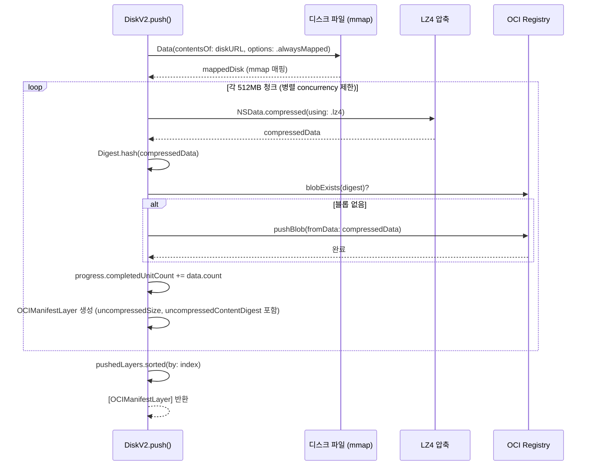
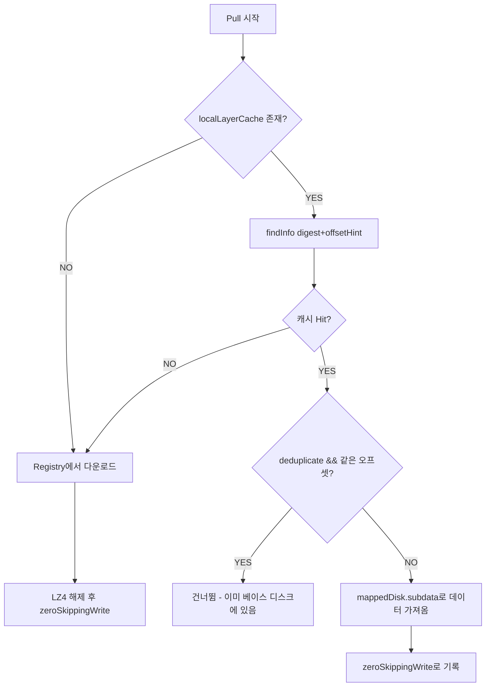

# 11. 디스크 관리 심화

## 목차

1. [개요](#1-개요)
2. [디스크 이미지 포맷](#2-디스크-이미지-포맷)
3. [DiskV2: OCI 레이어 기반 디스크 전송](#3-diskv2-oci-레이어-기반-디스크-전송)
4. [Push 파이프라인](#4-push-파이프라인)
5. [Pull 파이프라인](#5-pull-파이프라인)
6. [제로 스킵 최적화](#6-제로-스킵-최적화)
7. [LocalLayerCache: mmap 기반 로컬 캐시](#7-locallayercache-mmap-기반-로컬-캐시)
8. [디스크 생성과 리사이즈](#8-디스크-생성과-리사이즈)
9. [Diskutil 유틸리티 래퍼](#9-diskutil-유틸리티-래퍼)
10. [압축 전략: LZ4 vs LZFSE](#10-압축-전략-lz4-vs-lzfse)
11. [전체 아키텍처 다이어그램](#11-전체-아키텍처-다이어그램)

---

## 1. 개요

Tart의 디스크 관리 시스템은 macOS VM의 가상 디스크를 생성, 리사이즈, OCI 레지스트리로 Push/Pull하는 기능을 담당한다. 핵심 설계 목표는 다음과 같다:

- **대용량 디스크의 효율적 전송**: 수십~수백 GB 디스크를 512MB 청크로 분할하여 병렬 전송
- **제로 데이터 최적화**: 빈 영역을 기록하지 않아 I/O와 저장 공간 절약
- **재개 가능한 Pull**: 네트워크 장애 시 이미 완료된 레이어를 건너뛰고 이어받기
- **로컬 레이어 캐시**: 기존 VM 디스크를 mmap으로 매핑하여 중복 전송 방지
- **다중 포맷 지원**: RAW(단순 바이트 배열)와 ASIF(Apple Sparse Image Format) 지원

### 관련 소스코드 파일

| 파일 | 경로 | 역할 |
|------|------|------|
| DiskImageFormat.swift | `Sources/tart/DiskImageFormat.swift` | 디스크 포맷 열거형 |
| DiskV2.swift | `Sources/tart/OCI/Layerizer/DiskV2.swift` | OCI Push/Pull 로직 |
| LocalLayerCache.swift | `Sources/tart/LocalLayerCache.swift` | mmap 기반 로컬 캐시 |
| VMDirectory.swift | `Sources/tart/VMDirectory.swift` | 디스크 생성/리사이즈 |
| Diskutil.swift | `Sources/tart/Diskutil.swift` | diskutil 명령어 래퍼 |

---

## 2. 디스크 이미지 포맷

`Sources/tart/DiskImageFormat.swift`에 정의된 `DiskImageFormat` 열거형은 Tart가 지원하는 두 가지 디스크 이미지 형식을 나타낸다.

### 2.1 열거형 정의

```swift
// Sources/tart/DiskImageFormat.swift
enum DiskImageFormat: String, CaseIterable, Codable {
  case raw = "raw"
  case asif = "asif"

  var displayName: String {
    switch self {
    case .raw:
      return "RAW"
    case .asif:
      return "ASIF (Apple Sparse Image Format)"
    }
  }

  var isSupported: Bool {
    switch self {
    case .raw:
      return true
    case .asif:
      if #available(macOS 26, *) {
        return true
      } else {
        return false
      }
    }
  }
}
```

### 2.2 RAW vs ASIF 비교

```
+------------------+----------------------------------+----------------------------------+
| 특성             | RAW                              | ASIF                             |
+------------------+----------------------------------+----------------------------------+
| 구조             | 단순 바이트 배열                  | Apple Sparse Image Format        |
| 생성 방식         | FileHandle.truncate()            | diskutil image create blank      |
| 리사이즈 방식      | FileHandle.truncate()            | diskutil image resize            |
| macOS 요구사항    | 제한 없음                         | macOS 26 (Tahoe) 이상            |
| 디스크 공간 효율   | 전체 크기 할당                    | 사용한 만큼만 할당 (sparse)       |
| 성능             | I/O 직접 접근                     | diskutil 간접 호출               |
| APFS CoW 호환    | 호환                              | 호환                             |
+------------------+----------------------------------+----------------------------------+
```

### 2.3 ExpressibleByArgument 확장

CLI 인자로 디스크 포맷을 받기 위해 `ExpressibleByArgument` 프로토콜을 구현한다:

```swift
// Sources/tart/DiskImageFormat.swift
extension DiskImageFormat: ExpressibleByArgument {
  init?(argument: String) {
    self.init(rawValue: argument.lowercased())
  }

  static var allValueStrings: [String] {
    return allCases.map { $0.rawValue }
  }
}
```

이를 통해 `tart create --disk-format raw` 또는 `tart create --disk-format asif` 형태로 포맷을 지정할 수 있다.

### 2.4 VMConfig 내 diskFormat 필드

`Sources/tart/VMConfig.swift`의 `VMConfig` 구조체에서 `diskFormat` 필드로 디스크 포맷을 관리한다:

```swift
// Sources/tart/VMConfig.swift
struct VMConfig: Codable {
  // ...
  var diskFormat: DiskImageFormat = .raw
  // ...
}
```

config.json에 `diskFormat` 키가 없으면 기본값 `"raw"`가 사용된다:

```swift
// Sources/tart/VMConfig.swift, init(from decoder:)
let diskFormatString = try container.decodeIfPresent(String.self, forKey: .diskFormat) ?? "raw"
diskFormat = DiskImageFormat(rawValue: diskFormatString) ?? .raw
```

---

## 3. DiskV2: OCI 레이어 기반 디스크 전송

`Sources/tart/OCI/Layerizer/DiskV2.swift`의 `DiskV2` 클래스는 VM 디스크를 OCI 레지스트리에 Push/Pull하는 핵심 엔진이다.

### 3.1 핵심 상수

```swift
// Sources/tart/OCI/Layerizer/DiskV2.swift
class DiskV2: Disk {
  private static let bufferSizeBytes = 4 * 1024 * 1024       // 4MB: 압축 해제 버퍼
  private static let layerLimitBytes = 512 * 1024 * 1024     // 512MB: 레이어 분할 단위
  private static let holeGranularityBytes = 4 * 1024 * 1024  // 4MB: 제로 체크 단위
  private static let zeroChunk = Data(count: holeGranularityBytes)  // 비교용 제로 청크
}
```

### 3.2 왜 512MB 레이어인가?

OCI 레지스트리는 각 레이어를 독립된 블롭으로 저장한다. 512MB 단위로 분할하면:

1. **병렬 업로드/다운로드**: 여러 레이어를 동시에 전송 가능
2. **재개 가능성**: 실패한 레이어만 재전송
3. **캐시 효율성**: 변경되지 않은 레이어는 재사용
4. **메모리 효율성**: LZ4 압축 시 각 레이어가 독립적으로 압축/해제

```
디스크 (50GB)
+--------+--------+--------+--------+--- ... ---+--------+
| 512MB  | 512MB  | 512MB  | 512MB  |           | 나머지  |
| Layer0 | Layer1 | Layer2 | Layer3 |           | LayerN |
+--------+--------+--------+--------+--- ... ---+--------+
    |         |         |         |                   |
    v         v         v         v                   v
  [LZ4]    [LZ4]    [LZ4]    [LZ4]     ...        [LZ4]
    |         |         |         |                   |
    v         v         v         v                   v
  Blob0    Blob1    Blob2    Blob3      ...        BlobN
    |         |         |         |                   |
    +----+----+----+----+----+----+--- ... ---+-------+
         |
         v
   OCI Registry (병렬 pushBlob)
```

---

## 4. Push 파이프라인

### 4.1 전체 흐름

`DiskV2.push()` 메서드는 로컬 디스크 파일을 OCI 레지스트리에 업로드한다.

```swift
// Sources/tart/OCI/Layerizer/DiskV2.swift
static func push(diskURL: URL, registry: Registry, chunkSizeMb: Int,
                 concurrency: UInt, progress: Progress) async throws -> [OCIManifestLayer] {
  var pushedLayers: [(index: Int, pushedLayer: OCIManifestLayer)] = []

  // 1. 디스크 파일을 mmap으로 메모리 매핑
  let mappedDisk = try Data(contentsOf: diskURL, options: [.alwaysMapped])

  // 2. 병렬 태스크 그룹으로 압축 및 업로드
  try await withThrowingTaskGroup(of: (Int, OCIManifestLayer).self) { group in
    for (index, data) in mappedDisk.chunks(ofCount: layerLimitBytes).enumerated() {
      // 동시성 제한: concurrency 개수만큼만 동시 실행
      if index >= concurrency {
        if let (index, pushedLayer) = try await group.next() {
          pushedLayers.append((index, pushedLayer))
        }
      }

      group.addTask {
        // 3. LZ4 압축
        let compressedData = try (data as NSData).compressed(using: .lz4) as Data
        let compressedDataDigest = Digest.hash(compressedData)

        // 4. 재시도 로직 (최대 5회)
        try await retry(maxAttempts: 5) {
          if try await !registry.blobExists(compressedDataDigest) {
            _ = try await registry.pushBlob(fromData: compressedData,
                                            chunkSizeMb: chunkSizeMb,
                                            digest: compressedDataDigest)
          }
        } recoverFromFailure: { error in
          if error is URLError { return .retry }
          return .throw
        }

        // 5. 진행률 업데이트
        progress.completedUnitCount += Int64(data.count)

        // 6. OCIManifestLayer 생성 (비압축 크기/다이제스트 포함)
        return (index, OCIManifestLayer(
          mediaType: diskV2MediaType,
          size: compressedData.count,
          digest: compressedDataDigest,
          uncompressedSize: UInt64(data.count),
          uncompressedContentDigest: Digest.hash(data)
        ))
      }
    }
    // 나머지 태스크 수거
    for try await pushedLayer in group {
      pushedLayers.append(pushedLayer)
    }
  }

  // 7. 인덱스 순서대로 정렬하여 반환
  return pushedLayers.sorted { $0.index < $1.index }.map { $0.pushedLayer }
}
```

### 4.2 Push 시퀀스 다이어그램



### 4.3 중복 블롭 방지

Push 시 `registry.blobExists(compressedDataDigest)`를 먼저 확인한다. 동일한 데이터(예: 빈 레이어)가 이미 레지스트리에 존재하면 업로드를 건너뛴다. 이는 다음과 같은 시나리오에서 유용하다:

- 동일한 베이스 이미지에서 파생된 여러 VM
- 디스크 대부분이 비어 있는 경우 (제로 데이터)
- 이전 Push가 부분적으로 성공한 경우

### 4.4 OCIManifestLayer 메타데이터

각 레이어에는 두 가지 핵심 어노테이션이 포함된다:

| 어노테이션 | 용도 |
|-----------|------|
| `uncompressedSize` | Pull 시 디스크 파일 truncate에 필요한 전체 크기 계산 |
| `uncompressedContentDigest` | 재개 가능한 Pull에서 레이어 무결성 검증 |

---

## 5. Pull 파이프라인

### 5.1 전체 흐름

`DiskV2.pull()` 메서드는 OCI 레지스트리에서 디스크 레이어를 가져와 로컬 디스크 파일을 재구성한다.

```swift
// Sources/tart/OCI/Layerizer/DiskV2.swift
static func pull(registry: Registry, diskLayers: [OCIManifestLayer], diskURL: URL,
                 concurrency: UInt, progress: Progress,
                 localLayerCache: LocalLayerCache? = nil,
                 deduplicate: Bool = false) async throws {
  // 1. 재개 가능 Pull: 파일이 이미 존재하는지 확인
  let pullResumed = FileManager.default.fileExists(atPath: diskURL.path)

  if !pullResumed {
    if deduplicate, let localLayerCache = localLayerCache {
      // 2a. 중복 제거 모드: 기존 디스크를 복사하여 베이스로 사용
      try FileManager.default.copyItem(at: localLayerCache.diskURL, to: diskURL)
    } else {
      // 2b. 빈 디스크 생성
      FileManager.default.createFile(atPath: diskURL.path, contents: nil)
    }
  }

  // 3. 전체 비압축 크기 계산
  var uncompressedDiskSize: UInt64 = 0
  for layer in diskLayers {
    uncompressedDiskSize += layer.uncompressedSize()!
  }

  // 4. 디스크 파일을 비압축 크기로 truncate
  let disk = try FileHandle(forWritingTo: diskURL)
  try disk.truncate(atOffset: uncompressedDiskSize)
  try disk.close()

  // 5. 파일시스템 블록 크기 확인 (F_PUNCHHOLE 정렬에 필요)
  var st = stat()
  stat(diskURL.path, &st)
  let fsBlockSize = UInt64(st.st_blksize)

  // 6. 병렬 레이어 다운로드 및 압축 해제
  try await withThrowingTaskGroup(of: Void.self) { group in
    var globalDiskWritingOffset: UInt64 = 0

    for (index, diskLayer) in diskLayers.enumerated() {
      if index >= concurrency {
        try await group.next()
      }

      let diskWritingOffset = globalDiskWritingOffset

      group.addTask {
        // 6a. 재개 가능: 이미 완료된 레이어 건너뛰기
        if pullResumed {
          if try Digest.hash(diskURL, offset: diskWritingOffset,
                             size: uncompressedLayerSize) == uncompressedLayerContentDigest {
            progress.completedUnitCount += Int64(diskLayer.size)
            return
          }
        }

        // 6b. 로컬 캐시에서 레이어 찾기
        if let localLayerCache = localLayerCache,
           let localLayerInfo = localLayerCache.findInfo(digest: diskLayer.digest,
                                                          offsetHint: diskWritingOffset) {
          // 캐시에서 데이터를 가져와 zeroSkippingWrite
          // ...
          return
        }

        // 6c. 레지스트리에서 다운로드 및 LZ4 해제
        let filter = try OutputFilter(.decompress, using: .lz4,
                                       bufferCapacity: Self.bufferSizeBytes) { data in
          diskWritingOffset = try zeroSkippingWrite(disk, rdisk, fsBlockSize,
                                                    diskWritingOffset, data)
        }

        var rangeStart: Int64 = 0
        try await retry(maxAttempts: 5) {
          try await registry.pullBlob(diskLayer.digest, rangeStart: rangeStart) { data in
            try filter.write(data)
            progress.completedUnitCount += Int64(data.count)
            rangeStart += Int64(data.count)
          }
        }

        try filter.finalize()
      }

      globalDiskWritingOffset += uncompressedLayerSize
    }
  }
}
```

### 5.2 재개 가능 Pull 메커니즘

```
재개 가능 Pull 의사결정 트리:

디스크 파일 존재?
├── NO: 새로 생성 (빈 파일 또는 로컬 캐시 복사)
└── YES: pullResumed = true
     └── 각 레이어마다:
          Digest.hash(diskURL, offset, size) == uncompressedLayerContentDigest?
          ├── YES: 건너뛰기 (이미 완료)
          └── NO: 다시 다운로드

레이어 내 바이트 레벨 재개:
  rangeStart 변수를 통해 pullBlob 호출 시
  이전에 받은 바이트 수만큼 건너뛰기 지원
```

재개 가능 Pull의 핵심은 두 가지 수준에서 작동한다:

1. **레이어 수준**: `uncompressedContentDigest`로 이미 기록된 레이어의 무결성을 검증하여 건너뛰기
2. **바이트 수준**: `rangeStart` 변수로 레이어 내에서 이미 받은 바이트 이후부터 재개

### 5.3 Pull 최적화 전략 비교

```
+-------------------+-------------------------+--------------------------------+
| 전략              | 조건                     | 동작                           |
+-------------------+-------------------------+--------------------------------+
| 재개 Pull         | pullResumed == true      | 다이제스트 비교 후 건너뛰기     |
| 로컬 캐시 Hit     | localLayerCache != nil   | mmap 데이터 직접 복사          |
| 중복 제거         | deduplicate == true      | 베이스 디스크 복사 후 차분만 쓰기|
| 전체 다운로드      | 위 조건 불충족             | 레지스트리에서 전체 다운로드    |
+-------------------+-------------------------+--------------------------------+
```

---

## 6. 제로 스킵 최적화

### 6.1 핵심 원리

`zeroSkippingWrite()` 함수는 디스크에 기록할 때 제로 데이터(빈 영역)를 건너뛰어 I/O를 최적화한다. 이는 가상 디스크의 대부분이 비어 있는 경우 극적인 성능 향상을 제공한다.

```swift
// Sources/tart/OCI/Layerizer/DiskV2.swift
private static func zeroSkippingWrite(_ disk: FileHandle, _ rdisk: FileHandle?,
                                       _ fsBlockSize: UInt64, _ offset: UInt64,
                                       _ data: Data) throws -> UInt64 {
  var offset = offset

  for chunk in data.chunks(ofCount: holeGranularityBytes) {  // 4MB 단위
    // 로컬 캐시 사용 시: 기존 내용과 비교
    if let rdisk = rdisk {
      let isHoleAligned = (offset % fsBlockSize) == 0
                        && (UInt64(chunk.count) % fsBlockSize) == 0

      if isHoleAligned && chunk == zeroChunk {
        // F_PUNCHHOLE: 파일시스템 홀 생성 (물리적 블록 해제)
        var arg = fpunchhole_t(fp_flags: 0, reserved: 0,
                               fp_offset: off_t(offset),
                               fp_length: off_t(chunk.count))
        fcntl(disk.fileDescriptor, F_PUNCHHOLE, &arg)
      } else {
        // 실제 내용이 다를 때만 기록
        try rdisk.seek(toOffset: offset)
        let actualContentsOnDisk = try rdisk.read(upToCount: chunk.count)
        if chunk != actualContentsOnDisk {
          try disk.seek(toOffset: offset)
          try disk.write(contentsOf: chunk)
        }
      }
      offset += UInt64(chunk.count)
      continue
    }

    // 로컬 캐시 미사용: 제로가 아닌 청크만 기록
    if chunk != zeroChunk {
      try disk.seek(toOffset: offset)
      try disk.write(contentsOf: chunk)
    }
    offset += UInt64(chunk.count)
  }

  return offset
}
```

### 6.2 제로 비교 성능 벤치마크

`DiskV2.swift` 소스 내 주석에 포함된 실제 벤치마크 결과:

```
+--------------------------------------+---------------------------------------------------+
| Operation                            | time(1) result                                    |
+--------------------------------------+---------------------------------------------------+
| Data(...) == zeroChunk               | 2.16s user 11.71s system 73% cpu 18.928 total     |
| Data(...).contains(where: {$0 != 0}) | 603.68s user 12.97s system 99% cpu 10:22.85 total |
+--------------------------------------+---------------------------------------------------+
```

`Data == zeroChunk` 비교가 바이트 단위 검사보다 **약 33배 빠르다**. 이것이 4MB 크기의 `zeroChunk` 상수를 미리 생성해두는 이유이다.

### 6.3 F_PUNCHHOLE의 역할

```
파일시스템 관점에서의 제로 스킵:

truncate(2)로 생성된 빈 디스크:
+------+------+------+------+------+------+
| Hole | Hole | Hole | Hole | Hole | Hole |   <- 물리적 블록 없음
+------+------+------+------+------+------+

Pull 후 (제로 스킵 적용):
+------+------+------+------+------+------+
| Data | Hole | Data | Hole | Hole | Data |   <- 데이터 있는 곳만 물리적 블록
+------+------+------+------+------+------+

중복 제거 모드에서 기존 디스크를 베이스로 사용 시:
+------+------+------+------+------+------+
| Old  | Old  | New  | Old  | Hole | New  |   <- 변경된 곳만 새로 기록
+------+------+------+------+------+------+
  ^      ^                    ^
  |      |                    |
  변경 없음 -> 건너뜀        F_PUNCHHOLE -> 물리 블록 해제

F_PUNCHHOLE:
- fcntl(fd, F_PUNCHHOLE, &arg) 시스템 콜
- 파일 중간의 영역을 "홀"로 만들어 물리적 블록 반환
- 파일시스템 블록 경계에 정렬되어야 함 (isHoleAligned 체크)
- APFS에서 지원
```

### 6.4 두 가지 제로 스킵 모드

| 모드 | 조건 | 제로 청크 처리 | 비제로 청크 처리 |
|------|------|--------------|----------------|
| 기본 모드 | `rdisk == nil` | 건너뜀 (truncate가 이미 0으로 초기화) | disk.write() |
| 중복 제거 모드 | `rdisk != nil` | F_PUNCHHOLE (블록 해제) | rdisk.read()와 비교 후 변경분만 write |

기본 모드에서는 `truncate(2)`가 파일을 0으로 초기화하므로 제로 데이터를 쓸 필요가 없다. 중복 제거 모드에서는 베이스 디스크에 이미 데이터가 있을 수 있으므로, 제로 영역은 `F_PUNCHHOLE`로 명시적으로 홀을 만들어야 한다.

---

## 7. LocalLayerCache: mmap 기반 로컬 캐시

### 7.1 구조체 정의

`Sources/tart/LocalLayerCache.swift`의 `LocalLayerCache`는 기존 VM의 디스크를 mmap으로 매핑하여 Pull 시 네트워크 전송 없이 로컬에서 데이터를 가져올 수 있게 한다.

```swift
// Sources/tart/LocalLayerCache.swift
struct LocalLayerCache {
  struct DigestInfo {
    let range: Range<Data.Index>           // 디스크 내 바이트 범위
    let compressedDigest: String           // 압축된 레이어의 다이제스트
    let uncompressedContentDigest: String? // 비압축 데이터의 다이제스트
  }

  let name: String
  let deduplicatedBytes: UInt64
  let diskURL: URL

  private let mappedDisk: Data                        // mmap된 디스크 데이터
  private var digestToRange: [String: DigestInfo] = [:] // 다이제스트 -> 범위 인덱스
  private var offsetToRange: [UInt64: DigestInfo] = [:] // 오프셋 -> 범위 인덱스
}
```

### 7.2 초기화 과정

```swift
// Sources/tart/LocalLayerCache.swift
init?(_ name: String, _ deduplicatedBytes: UInt64, _ diskURL: URL,
      _ manifest: OCIManifest) throws {
  // 1. mmap(2)으로 디스크 메모리 매핑
  self.mappedDisk = try Data(contentsOf: diskURL, options: [.alwaysMapped])

  // 2. 매니페스트의 디스크 레이어에서 범위 인덱스 구축
  var offset: UInt64 = 0
  for layer in manifest.layers.filter({ $0.mediaType == diskV2MediaType }) {
    guard let uncompressedSize = layer.uncompressedSize() else {
      return nil  // 어노테이션 누락 시 실패
    }

    let info = DigestInfo(
      range: Int(offset)..<Int(offset + uncompressedSize),
      compressedDigest: layer.digest,
      uncompressedContentDigest: layer.uncompressedContentDigest()!
    )
    self.digestToRange[layer.digest] = info
    self.offsetToRange[offset] = info

    offset += uncompressedSize
  }
}
```

### 7.3 이중 인덱스 탐색

```swift
// Sources/tart/LocalLayerCache.swift
func findInfo(digest: String, offsetHint: UInt64) -> DigestInfo? {
  // 우선: 오프셋 힌트로 탐색 (동일 다이제스트의 빈 레이어 중복 방지)
  if let info = self.offsetToRange[offsetHint], info.compressedDigest == digest {
    return info
  }
  // 대안: 다이제스트로 탐색
  return self.digestToRange[digest]
}
```

### 7.4 왜 이중 인덱스인가?

```
문제: 동일한 다이제스트를 가진 여러 레이어

디스크 레이아웃:
+----------+----------+----------+----------+
| Layer 0  | Layer 1  | Layer 2  | Layer 3  |
| 512MB    | 512MB    | 512MB    | 512MB    |
| (비어있음) | (데이터)  | (비어있음) | (데이터)  |
+----------+----------+----------+----------+

Layer 0과 Layer 2가 모두 비어있으면 같은 compressed digest를 가짐

digestToRange["sha256:abc..."] → Layer 0만 반환 (먼저 등록된 것)

그러나 Pull 시 Layer 2의 올바른 위치에 써야 함:
  globalDiskWritingOffset = 1024MB (Layer 2 시작점)

offsetToRange[1024MB] → Layer 2의 DigestInfo 반환 (정확한 위치)

따라서:
  findInfo(digest: "sha256:abc...", offsetHint: 1024MB)
  → offsetToRange 우선 탐색 → Layer 2의 정확한 범위 반환
```

### 7.5 캐시 활용 흐름



---

## 8. 디스크 생성과 리사이즈

### 8.1 VMDirectory.resizeDisk()

`Sources/tart/VMDirectory.swift`의 `resizeDisk()` 메서드는 디스크 포맷에 따라 다른 전략을 사용한다.

```swift
// Sources/tart/VMDirectory.swift
func resizeDisk(_ sizeGB: UInt16, format: DiskImageFormat = .raw) throws {
  let diskExists = FileManager.default.fileExists(atPath: diskURL.path)

  if diskExists {
    try resizeExistingDisk(sizeGB)  // 기존 디스크 리사이즈
  } else {
    try createDisk(sizeGB: sizeGB, format: format)  // 새 디스크 생성
  }
}
```

### 8.2 RAW 디스크 생성 및 리사이즈

```swift
// Sources/tart/VMDirectory.swift
private func createRawDisk(sizeGB: UInt16) throws {
  FileManager.default.createFile(atPath: diskURL.path, contents: nil, attributes: nil)
  let diskFileHandle = try FileHandle(forWritingTo: diskURL)
  let desiredDiskFileLength = UInt64(sizeGB) * 1000 * 1000 * 1000
  try diskFileHandle.truncate(atOffset: desiredDiskFileLength)
  try diskFileHandle.close()
}

private func resizeRawDisk(_ sizeGB: UInt16) throws {
  let diskFileHandle = try FileHandle(forWritingTo: diskURL)
  let currentDiskFileLength = try diskFileHandle.seekToEnd()
  let desiredDiskFileLength = UInt64(sizeGB) * 1000 * 1000 * 1000

  if desiredDiskFileLength < currentDiskFileLength {
    // 축소 금지: 데이터 손실 방지
    throw RuntimeError.InvalidDiskSize(...)
  } else if desiredDiskFileLength > currentDiskFileLength {
    try diskFileHandle.truncate(atOffset: desiredDiskFileLength)
  }
  try diskFileHandle.close()
}
```

RAW 디스크는 `FileHandle.truncate(atOffset:)`로 단순하게 처리한다. 이 방식의 장점:

- **즉각적**: truncate는 O(1) 시간 복잡도
- **sparse 파일**: APFS에서 truncate된 영역은 물리적 블록을 할당하지 않음
- **축소 금지**: 데이터 손실 방지를 위해 현재 크기보다 작은 크기 요청 시 오류 발생

### 8.3 ASIF 디스크 생성 및 리사이즈

```swift
// Sources/tart/VMDirectory.swift
private func resizeASIFDisk(_ sizeGB: UInt16) throws {
  let diskImageInfo = try Diskutil.imageInfo(diskURL)
  let currentSizeBytes = try diskImageInfo.totalBytes()
  let desiredSizeBytes = UInt64(sizeGB) * 1000 * 1000 * 1000

  if desiredSizeBytes < currentSizeBytes {
    throw RuntimeError.InvalidDiskSize(...)
  } else if desiredSizeBytes > currentSizeBytes {
    try performASIFResize(sizeGB)
  }
}

private func performASIFResize(_ sizeGB: UInt16) throws {
  let process = Process()
  process.executableURL = resolveBinaryPath("diskutil")
  process.arguments = ["image", "resize", "--size", "\(sizeGB)G", diskURL.path]
  // ...
}
```

ASIF 디스크는 `diskutil` 명령어를 통해 조작한다:

| 작업 | 명령어 |
|------|--------|
| 생성 | `diskutil image create blank --format ASIF --size {size}G --volumeName Tart {path}` |
| 정보 조회 | `diskutil image info --plist {path}` |
| 리사이즈 | `diskutil image resize --size {size}G {path}` |

### 8.4 디스크 크기 조회

```swift
// Sources/tart/VMDirectory.swift
func diskSizeBytes() throws -> Int {
  let vmConfig = try VMConfig(fromURL: configURL)

  return switch vmConfig.diskFormat {
  case .raw:
    try sizeBytes()                           // 파일 크기 직접 조회
  case .asif:
    try Diskutil.imageInfo(diskURL).totalBytes()  // diskutil로 논리 크기 조회
  }
}
```

RAW 포맷은 파일 크기가 곧 디스크 크기이지만, ASIF 포맷은 sparse 이미지이므로 `diskutil image info`로 논리적 전체 크기를 조회해야 한다.

---

## 9. Diskutil 유틸리티 래퍼

### 9.1 구조체 정의

`Sources/tart/Diskutil.swift`의 `Diskutil` 구조체는 macOS의 `diskutil` 바이너리를 래핑한다.

```swift
// Sources/tart/Diskutil.swift
struct Diskutil {
  static func imageCreate(diskURL: URL, sizeGB: UInt16) throws {
    try run([
      "image", "create", "blank",
      "--format", "ASIF",
      "--size", "\(sizeGB)G",
      "--volumeName", "Tart",
      diskURL.path
    ])
  }

  static func imageInfo(_ diskURL: URL) throws -> ImageInfo {
    let (stdoutData, _) = try run(["image", "info", "--plist", diskURL.path])
    return try PropertyListDecoder().decode(ImageInfo.self, from: stdoutData)
  }

  private static func run(_ arguments: [String]) throws -> (Data, Data) {
    guard let diskutilURL = resolveBinaryPath("diskutil") else {
      throw RuntimeError.Generic("\"diskutil\" binary is not found in PATH")
    }
    let process = Process()
    process.executableURL = diskutilURL
    process.arguments = arguments
    // ... 프로세스 실행 및 결과 반환
  }
}
```

### 9.2 ImageInfo 데이터 모델

```swift
// Sources/tart/Diskutil.swift
struct ImageInfo: Codable {
  let sizeInfo: SizeInfo?
  let size: UInt64?

  enum CodingKeys: String, CodingKey {
    case sizeInfo = "Size Info"
    case size = "Size"
  }

  func totalBytes() throws -> Int {
    if let totalBytes = self.sizeInfo?.totalBytes {
      return Int(totalBytes)
    }
    if let size = self.size {
      return Int(size)
    }
    throw RuntimeError.Generic("Could not find size information in disk image info")
  }
}

struct SizeInfo: Codable {
  let totalBytes: UInt64?
  enum CodingKeys: String, CodingKey {
    case totalBytes = "Total Bytes"
  }
}
```

`diskutil image info --plist`의 출력은 Property List 형식이며, `SizeInfo.totalBytes` 또는 최상위 `size` 필드에서 전체 바이트 수를 가져온다.

---

## 10. 압축 전략: LZ4 vs LZFSE

### 10.1 왜 LZ4인가?

Tart는 디스크 레이어 압축에 LZ4를 선택했다. Apple 생태계에서 제공하는 압축 알고리즘 비교:

```
+----------+----------+-----------+------------+--------------------+
| 알고리즘  | 압축률   | 압축 속도  | 해제 속도   | Tart에서의 사용     |
+----------+----------+-----------+------------+--------------------+
| LZ4      | 낮음     | 매우 빠름  | 매우 빠름   | DiskV2 레이어 압축  |
| LZFSE    | 중간     | 빠름      | 빠름       | Apple Archive       |
| ZLIB     | 중간     | 보통      | 보통       | 미사용             |
| LZMA     | 높음     | 느림      | 느림       | 미사용             |
+----------+----------+-----------+------------+--------------------+
```

LZ4를 선택한 이유:

1. **Push/Pull 속도 우선**: 디스크 이미지는 수십 GB이므로 압축/해제 시간이 전체 시간의 상당 부분
2. **병렬 처리와의 시너지**: 여러 레이어를 동시 압축/해제하므로 CPU 효율이 중요
3. **네트워크 대역폭 대비**: 일반적으로 네트워크가 병목이므로 압축률보다 속도가 중요
4. **NSData.compressed(using:) API**: Apple Foundation에서 기본 제공

### 10.2 Push에서의 LZ4 사용

```swift
// Sources/tart/OCI/Layerizer/DiskV2.swift (push 내부)
let compressedData = try (data as NSData).compressed(using: .lz4) as Data
```

### 10.3 Pull에서의 LZ4 해제

```swift
// Sources/tart/OCI/Layerizer/DiskV2.swift (pull 내부)
let filter = try OutputFilter(.decompress, using: .lz4,
                               bufferCapacity: Self.bufferSizeBytes) { data in
  guard let data = data else { return }
  diskWritingOffset = try zeroSkippingWrite(disk, rdisk, fsBlockSize,
                                            diskWritingOffset, data)
}
```

Pull에서는 `OutputFilter` 스트리밍 API를 사용한다. 전체 레이어를 메모리에 로드하지 않고 4MB `bufferSizeBytes` 단위로 스트리밍하여 메모리 사용량을 최소화한다.

---

## 11. 전체 아키텍처 다이어그램

### 11.1 컴포넌트 관계도

```
+-------------------------------------------------------------------+
|                        디스크 관리 시스템                             |
+-------------------------------------------------------------------+
|                                                                   |
|  +-----------------+    +------------------+    +---------------+  |
|  | DiskImageFormat |    |    Diskutil       |    | VMDirectory   |  |
|  |  .raw / .asif   |<---|  imageCreate()    |<---|  resizeDisk() |  |
|  |  isSupported    |    |  imageInfo()      |    |  createDisk() |  |
|  +-----------------+    |  imageResize()    |    |  diskURL      |  |
|                         +------------------+    +-------+-------+  |
|                                                         |          |
|                                                         v          |
|  +------------------+    +-----------------+    +---------------+  |
|  | LocalLayerCache  |    |     DiskV2      |    |   VMConfig    |  |
|  |  mappedDisk      |--->|  push()         |    |  diskFormat   |  |
|  |  digestToRange   |    |  pull()         |    +---------------+  |
|  |  offsetToRange   |    |  zeroSkipWrite()|                       |
|  |  findInfo()      |    +--------+--------+                       |
|  |  subdata()       |             |                                |
|  +------------------+             v                                |
|                           +---------------+                        |
|                           | OCI Registry  |                        |
|                           |  pushBlob()   |                        |
|                           |  pullBlob()   |                        |
|                           |  blobExists() |                        |
|                           +---------------+                        |
+-------------------------------------------------------------------+
```

### 11.2 Push/Pull 데이터 흐름

```
Push 경로:
  디스크 파일 → mmap → 512MB 분할 → LZ4 압축 → pushBlob → OCI Registry
                                                    ↑
                                         blobExists()로 중복 체크

Pull 경로:
  OCI Registry → pullBlob → LZ4 해제 → zeroSkippingWrite → 디스크 파일
       ↑                                      ↑
  rangeStart로                        LocalLayerCache로
  바이트 레벨 재개                    로컬 데이터 충족 가능

중복 제거 Pull:
  기존 디스크 복사 → 각 레이어마다:
    1. 캐시 Hit + 같은 오프셋 → 건너뜀
    2. 캐시 Hit + 다른 오프셋 → subdata() → zeroSkippingWrite
    3. 캐시 Miss → Registry 다운로드 → LZ4 해제 → zeroSkippingWrite
                                                         ↑
                                              rdisk.read()와 비교하여
                                              변경분만 기록
```

### 11.3 디스크 크기 단위 주의사항

Tart는 디스크 크기에 SI 단위(10진법)를 사용한다:

```
1 GB = 1,000,000,000 bytes (10^9)
desiredDiskFileLength = UInt64(sizeGB) * 1000 * 1000 * 1000
```

이는 `tart create --disk-size 50` 명령이 50,000,000,000 바이트 (약 46.6 GiB) 디스크를 생성함을 의미한다. macOS Finder에서 표시되는 크기와 일치하지만, 일부 도구에서 표시되는 GiB 단위와는 다르다.

### 11.4 VMDirectory 내 파일 구조

```
{VM 이름}/
├── config.json      ← VMConfig (diskFormat 필드 포함)
├── disk.img         ← RAW 또는 ASIF 포맷의 디스크 이미지
├── nvram.bin        ← NVRAM/EFI 변수 저장소
├── manifest.json    ← OCI 매니페스트 (Pull 시 생성)
├── state.vzvmsave   ← 서스펜드 상태 (선택적)
├── control.sock     ← 제어 Unix 소켓 (실행 중)
└── .explicitly-pulled ← Pull 표시 마커 (선택적)
```

`diskURL`은 항상 `{baseURL}/disk.img`를 가리키며, 실제 포맷은 config.json의 `diskFormat` 필드로 구분한다.

---

## 요약

Tart의 디스크 관리 시스템은 다음과 같은 핵심 설계 원칙을 따른다:

1. **mmap 활용**: 대용량 디스크를 메모리에 효율적으로 매핑하여 Push/Pull 성능 확보
2. **512MB 레이어 분할**: OCI 레지스트리의 블롭 단위에 맞춘 병렬 전송 단위
3. **LZ4 압축**: 속도 우선 전략으로 Push/Pull 시간 최소화
4. **4MB 제로 스킵**: 빈 영역 탐지 및 F_PUNCHHOLE을 활용한 물리적 블록 절약
5. **이중 인덱스 캐시**: 다이제스트와 오프셋 양쪽으로 빠른 캐시 탐색
6. **재개 가능 전송**: 레이어 수준 및 바이트 수준의 전송 재개 지원
7. **RAW/ASIF 이중 포맷**: 호환성(RAW)과 성능(ASIF)의 선택적 사용
