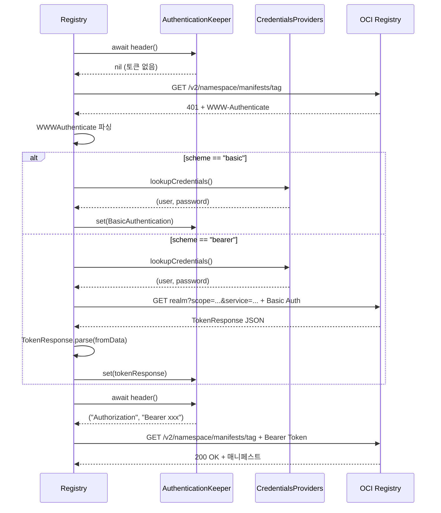
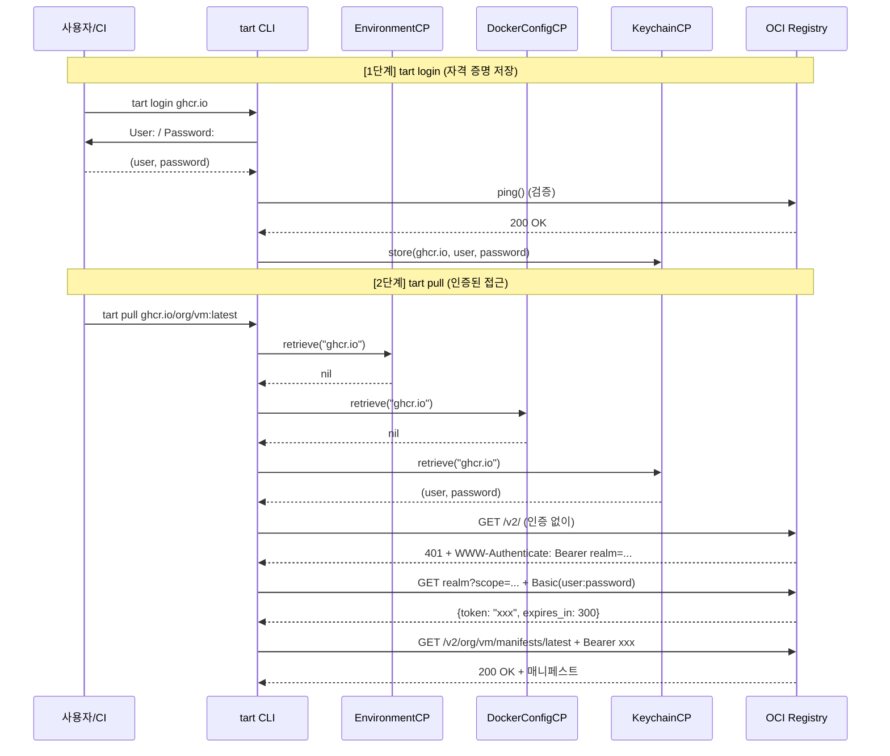

# 12. 인증 시스템 심화

## 목차

1. [개요](#1-개요)
2. [CredentialsProvider 프로토콜](#2-credentialsprovider-프로토콜)
3. [인증 프로바이더 체인](#3-인증-프로바이더-체인)
4. [EnvironmentCredentialsProvider](#4-environmentcredentialsprovider)
5. [DockerConfigCredentialsProvider](#5-dockerconfigcredentialsprovider)
6. [KeychainCredentialsProvider](#6-keychaincredentialsprovider)
7. [Authentication 프로토콜과 토큰 관리](#7-authentication-프로토콜과-토큰-관리)
8. [AuthenticationKeeper: Actor 기반 동시성](#8-authenticationkeeper-actor-기반-동시성)
9. [WWWAuthenticate: HTTP 인증 협상](#9-wwwauthenticate-http-인증-협상)
10. [Registry에서의 인증 흐름](#10-registry에서의-인증-흐름)
11. [Login/Logout 커맨드](#11-loginlogout-커맨드)
12. [StdinCredentials](#12-stdincredentials)
13. [전체 아키텍처 다이어그램](#13-전체-아키텍처-다이어그램)

---

## 1. 개요

Tart의 인증 시스템은 OCI(Open Container Initiative) 레지스트리와 상호작용할 때 사용자 자격 증명을 관리한다. Docker 생태계와의 호환성을 유지하면서도 macOS Keychain 통합, 환경변수 기반 CI/CD 지원 등 실용적인 기능을 제공한다.

### 핵심 설계 원칙

- **체인 패턴**: 여러 인증 소스를 우선순위에 따라 순차 탐색
- **Docker 호환**: `~/.docker/config.json` 및 credential helper 지원
- **macOS 네이티브**: Keychain Services API 통합
- **CI/CD 우선**: 환경변수를 최우선 순위로 처리
- **Actor 기반 동시성**: 토큰 캐시를 Swift Actor로 안전하게 관리

### 관련 소스코드 파일

| 파일 | 경로 | 역할 |
|------|------|------|
| CredentialsProvider.swift | `Sources/tart/Credentials/CredentialsProvider.swift` | 프로토콜 정의 |
| EnvironmentCredentialsProvider.swift | `Sources/tart/Credentials/EnvironmentCredentialsProvider.swift` | 환경변수 기반 인증 |
| DockerConfigCredentialsProvider.swift | `Sources/tart/Credentials/DockerConfigCredentialsProvider.swift` | Docker config 파싱 |
| KeychainCredentialsProvider.swift | `Sources/tart/Credentials/KeychainCredentialsProvider.swift` | macOS Keychain |
| StdinCredentials.swift | `Sources/tart/Credentials/StdinCredentials.swift` | 표준 입력 자격 증명 |
| Authentication.swift | `Sources/tart/OCI/Authentication.swift` | 인증 헤더 프로토콜 |
| AuthenticationKeeper.swift | `Sources/tart/OCI/AuthenticationKeeper.swift` | 토큰 캐시 Actor |
| WWWAuthenticate.swift | `Sources/tart/OCI/WWWAuthenticate.swift` | HTTP 헤더 파서 |
| Registry.swift | `Sources/tart/OCI/Registry.swift` | 레지스트리 클라이언트 |
| Login.swift | `Sources/tart/Commands/Login.swift` | 로그인 커맨드 |
| Logout.swift | `Sources/tart/Commands/Logout.swift` | 로그아웃 커맨드 |

---

## 2. CredentialsProvider 프로토콜

### 2.1 프로토콜 정의

`Sources/tart/Credentials/CredentialsProvider.swift`에서 모든 인증 프로바이더가 구현해야 하는 인터페이스를 정의한다.

```swift
// Sources/tart/Credentials/CredentialsProvider.swift
enum CredentialsProviderError: Error {
  case Failed(message: String)
}

protocol CredentialsProvider {
  var userFriendlyName: String { get }
  func retrieve(host: String) throws -> (String, String)?
  func store(host: String, user: String, password: String) throws
}
```

### 2.2 프로토콜 메서드 설명

| 메서드/프로퍼티 | 시그니처 | 설명 |
|---------------|---------|------|
| `userFriendlyName` | `String` | 로깅/오류 메시지에 사용할 프로바이더 이름 |
| `retrieve(host:)` | `(String) throws -> (String, String)?` | 호스트에 대한 (username, password) 반환. 없으면 nil |
| `store(host:user:password:)` | `(String, String, String) throws` | 자격 증명 저장 (지원하지 않는 프로바이더는 throw) |

### 2.3 설계 의도

프로토콜이 반환 타입으로 `(String, String)?` (Optional 튜플)을 사용하는 이유:

- `nil` 반환 = "이 프로바이더에는 해당 호스트의 자격 증명이 없음" -> 다음 프로바이더로 진행
- `(user, password)` 반환 = "자격 증명 발견" -> 체인 탐색 중단
- `throw` = "치명적 오류 발생" -> 오류 메시지 출력 후 다음 프로바이더로 진행

---

## 3. 인증 프로바이더 체인

### 3.1 체인 구성

`Sources/tart/OCI/Registry.swift`에서 기본 체인이 정의된다:

```swift
// Sources/tart/OCI/Registry.swift
class Registry {
  let credentialsProviders: [CredentialsProvider]

  init(baseURL: URL, namespace: String,
       credentialsProviders: [CredentialsProvider] = [
         EnvironmentCredentialsProvider(),
         DockerConfigCredentialsProvider(),
         KeychainCredentialsProvider()
       ]) throws {
    // ...
    self.credentialsProviders = credentialsProviders
  }
}
```

### 3.2 탐색 순서와 우선순위

```
인증 프로바이더 체인 (우선순위 순):

  +----------------------------------+
  | 1. EnvironmentCredentialsProvider|  ← CI/CD 환경에서 가장 우선
  |    TART_REGISTRY_USERNAME        |
  |    TART_REGISTRY_PASSWORD        |
  +----------------------------------+
               |
               v (nil 반환 시)
  +----------------------------------+
  | 2. DockerConfigCredentialsProvider|  ← Docker 도구와 호환
  |    ~/.docker/config.json         |
  |    auths / credHelpers           |
  +----------------------------------+
               |
               v (nil 반환 시)
  +----------------------------------+
  | 3. KeychainCredentialsProvider   |  ← tart login으로 저장된 자격증명
  |    macOS Keychain                |
  |    kSecClassInternetPassword     |
  +----------------------------------+
               |
               v (nil 반환 시)
       인증 없이 진행 (익명 접근)
```

### 3.3 lookupCredentials() 구현

```swift
// Sources/tart/OCI/Registry.swift
private func lookupCredentials() throws -> (String, String)? {
  var host = baseURL.host!

  if let port = baseURL.port {
    host += ":\(port)"
  }

  for provider in credentialsProviders {
    do {
      if let (user, password) = try provider.retrieve(host: host) {
        return (user, password)
      }
    } catch (let e) {
      print("Failed to retrieve credentials using \(provider.userFriendlyName), "
            + "authentication may fail: \(e)")
    }
  }
  return nil
}
```

핵심 동작:

1. 호스트명에 포트 번호를 붙여 탐색 키 생성 (예: `ghcr.io`, `registry.example.com:5000`)
2. 각 프로바이더를 순서대로 호출하며, 첫 번째 성공 결과를 반환
3. 프로바이더의 오류는 경고 메시지만 출력하고 다음 프로바이더로 진행
4. 모든 프로바이더가 nil이면 nil 반환 (익명 접근)

---

## 4. EnvironmentCredentialsProvider

### 4.1 구현

`Sources/tart/Credentials/EnvironmentCredentialsProvider.swift`는 환경변수에서 자격 증명을 가져온다.

```swift
// Sources/tart/Credentials/EnvironmentCredentialsProvider.swift
class EnvironmentCredentialsProvider: CredentialsProvider {
  let userFriendlyName = "environment variable credentials provider"

  func retrieve(host: String) throws -> (String, String)? {
    // 특정 호스트 제한 (선택적)
    if let tartRegistryHostname = ProcessInfo.processInfo.environment["TART_REGISTRY_HOSTNAME"],
       tartRegistryHostname != host {
      return nil
    }

    let username = ProcessInfo.processInfo.environment["TART_REGISTRY_USERNAME"]
    let password = ProcessInfo.processInfo.environment["TART_REGISTRY_PASSWORD"]
    if let username = username, let password = password {
      return (username, password)
    }
    return nil
  }

  func store(host: String, user: String, password: String) throws {
    // 환경변수에 저장은 지원하지 않음 (no-op)
  }
}
```

### 4.2 환경변수 설명

| 환경변수 | 필수 | 설명 |
|---------|------|------|
| `TART_REGISTRY_USERNAME` | 예 (password와 함께) | 레지스트리 사용자명 |
| `TART_REGISTRY_PASSWORD` | 예 (username과 함께) | 레지스트리 비밀번호/토큰 |
| `TART_REGISTRY_HOSTNAME` | 아니오 | 특정 호스트에만 자격 증명 적용 |

### 4.3 호스트 필터링 로직

```
TART_REGISTRY_HOSTNAME 설정 시:

  retrieve("ghcr.io"):
    TART_REGISTRY_HOSTNAME="ghcr.io" → 매칭 → (username, password) 반환
    TART_REGISTRY_HOSTNAME="ecr.aws" → 불일치 → nil 반환

  retrieve("ecr.aws"):
    TART_REGISTRY_HOSTNAME="ghcr.io" → 불일치 → nil 반환
    TART_REGISTRY_HOSTNAME="ecr.aws" → 매칭 → (username, password) 반환

TART_REGISTRY_HOSTNAME 미설정 시:
  모든 호스트에 대해 (username, password) 반환
```

### 4.4 CI/CD 사용 패턴

```bash
# GitHub Actions 예시
env:
  TART_REGISTRY_USERNAME: ${{ secrets.REGISTRY_USER }}
  TART_REGISTRY_PASSWORD: ${{ secrets.REGISTRY_TOKEN }}

# 호스트 제한 (여러 레지스트리 사용 시)
env:
  TART_REGISTRY_HOSTNAME: ghcr.io
  TART_REGISTRY_USERNAME: ${{ github.actor }}
  TART_REGISTRY_PASSWORD: ${{ secrets.GITHUB_TOKEN }}
```

---

## 5. DockerConfigCredentialsProvider

### 5.1 구현

`Sources/tart/Credentials/DockerConfigCredentialsProvider.swift`는 Docker의 `~/.docker/config.json`에서 자격 증명을 가져온다.

```swift
// Sources/tart/Credentials/DockerConfigCredentialsProvider.swift
class DockerConfigCredentialsProvider: CredentialsProvider {
  let userFriendlyName = "Docker configuration credentials provider"

  func retrieve(host: String) throws -> (String, String)? {
    let dockerConfigURL = FileManager.default.homeDirectoryForCurrentUser
      .appendingPathComponent(".docker")
      .appendingPathComponent("config.json")

    if !FileManager.default.fileExists(atPath: dockerConfigURL.path) {
      return nil
    }

    let config = try JSONDecoder().decode(DockerConfig.self,
                                          from: Data(contentsOf: dockerConfigURL))

    // 1차: auths 섹션에서 직접 찾기
    if let credentialsFromAuth = config.auths?[host]?.decodeCredentials() {
      return credentialsFromAuth
    }

    // 2차: credHelpers 섹션에서 외부 헬퍼 호출
    if let helperProgram = try config.findCredHelper(host: host) {
      return try executeHelper(binaryName: "docker-credential-\(helperProgram)",
                               host: host)
    }

    return nil
  }

  func store(host: String, user: String, password: String) throws {
    throw CredentialsProviderError.Failed(message: "Docker helpers don't support storing!")
  }
}
```

### 5.2 DockerConfig 데이터 모델

```swift
// Sources/tart/Credentials/DockerConfigCredentialsProvider.swift
struct DockerConfig: Codable {
  var auths: Dictionary<String, DockerAuthConfig>? = Dictionary()
  var credHelpers: Dictionary<String, String>? = Dictionary()

  func findCredHelper(host: String) throws -> String? {
    guard let credHelpers else { return nil }

    for (hostPattern, helperProgram) in credHelpers {
      if hostPattern == host { return helperProgram }
      // 와일드카드 매칭 (정규식)
      let compiledPattern = try? Regex(hostPattern)
      if try compiledPattern?.wholeMatch(in: host) != nil {
        return helperProgram
      }
    }
    return nil
  }
}

struct DockerAuthConfig: Codable {
  var auth: String? = nil

  func decodeCredentials() -> (String, String)? {
    guard let authBase64 = auth else { return nil }
    guard let data = Data(base64Encoded: authBase64) else { return nil }
    guard let components = String(data: data, encoding: .utf8)?
      .components(separatedBy: ":") else { return nil }
    if components.count != 2 { return nil }
    return (components[0], components[1])
  }
}
```

### 5.3 config.json 파싱 흐름

```
~/.docker/config.json 구조 예시:

{
  "auths": {
    "ghcr.io": {
      "auth": "dXNlcjpwYXNzd29yZA=="    ← base64("user:password")
    },
    "registry.example.com": {
      "auth": "YWRtaW46c2VjcmV0"
    }
  },
  "credHelpers": {
    "ecr.aws": "ecr-login",
    ".*\\.gcr\\.io": "gcloud"           ← 와일드카드 패턴 (Tart 확장)
  }
}

탐색 흐름:
  retrieve("ghcr.io"):
    1. auths["ghcr.io"] → "dXNlcjpwYXNzd29yZA==" → base64 decode → ("user", "password")
    2. (여기서 반환)

  retrieve("us-east1-docker.pkg.dev"):
    1. auths["us-east1-docker.pkg.dev"] → nil
    2. credHelpers 패턴 매칭:
       "ecr.aws" != "us-east1-docker.pkg.dev"
       ".*\\.gcr\\.io" wholeMatch → nil
    3. nil 반환
```

### 5.4 auths 섹션: Base64 디코딩

```
Base64 인코딩/디코딩 흐름:

  원본: "admin:secret123"
     ↓ base64 encode
  저장: "YWRtaW46c2VjcmV0MTIz"

  decodeCredentials():
    1. Data(base64Encoded: "YWRtaW46c2VjcmV0MTIz")
    2. String(data:encoding:.utf8) → "admin:secret123"
    3. components(separatedBy: ":") → ["admin", "secret123"]
    4. (components[0], components[1]) → ("admin", "secret123")
```

### 5.5 credHelpers 섹션: 외부 프로세스 호출

```swift
// Sources/tart/Credentials/DockerConfigCredentialsProvider.swift
private func executeHelper(binaryName: String, host: String) throws -> (String, String)? {
  guard let executableURL = resolveBinaryPath(binaryName) else {
    throw CredentialsProviderError.Failed(message: "\(binaryName) not found in PATH")
  }

  let process = Process()
  process.executableURL = executableURL
  process.arguments = ["get"]

  let outPipe = Pipe()
  let inPipe = Pipe()
  process.standardOutput = outPipe
  process.standardError = outPipe
  process.standardInput = inPipe

  process.launch()

  // stdin으로 호스트명 전달
  try inPipe.fileHandleForWriting.write(contentsOf: "\(host)\n".data(using: .utf8)!)
  inPipe.fileHandleForWriting.closeFile()

  let outputData = try outPipe.fileHandleForReading.readToEnd()
  process.waitUntilExit()

  // JSON 출력 파싱
  let getOutput = try JSONDecoder().decode(DockerGetOutput.self, from: outputData!)
  return (getOutput.Username, getOutput.Secret)
}
```

### 5.6 Credential Helper 통신 프로토콜

```
docker-credential-{helper} 통신 시퀀스:

  Tart                          docker-credential-ecr-login
    |                                      |
    |--- Process.launch() ----------------->|
    |--- stdin: "ghcr.io\n" -------------->|
    |--- stdin: EOF (closeFile) ----------->|
    |                                      |
    |<-- stdout: JSON ---------------------|
    |    {                                 |
    |      "Username": "user",             |
    |      "Secret": "token123"            |
    |    }                                 |
    |                                      |
    |<-- terminationStatus: 0 -------------|
```

### 5.7 와일드카드 매칭 (Tart 확장)

Docker CLI에서는 credHelpers의 키가 정확한 호스트명이어야 하지만, Tart는 Swift의 `Regex`를 사용한 패턴 매칭을 지원한다. 이는 Docker CLI에서 요청된 기능(https://github.com/docker/cli/issues/2928)을 Tart가 독자적으로 구현한 것이다.

```swift
// Sources/tart/Credentials/DockerConfigCredentialsProvider.swift
// DockerConfig.findCredHelper()
for (hostPattern, helperProgram) in credHelpers {
  if hostPattern == host { return helperProgram }
  let compiledPattern = try? Regex(hostPattern)
  if try compiledPattern?.wholeMatch(in: host) != nil {
    return helperProgram
  }
}
```

---

## 6. KeychainCredentialsProvider

### 6.1 구현

`Sources/tart/Credentials/KeychainCredentialsProvider.swift`는 macOS Keychain Services API를 사용한다.

```swift
// Sources/tart/Credentials/KeychainCredentialsProvider.swift
class KeychainCredentialsProvider: CredentialsProvider {
  let userFriendlyName = "Keychain credentials provider"

  func retrieve(host: String) throws -> (String, String)? {
    let query: [String: Any] = [
      kSecClass as String: kSecClassInternetPassword,
      kSecAttrProtocol as String: kSecAttrProtocolHTTPS,
      kSecAttrServer as String: host,
      kSecMatchLimit as String: kSecMatchLimitOne,
      kSecReturnAttributes as String: true,
      kSecReturnData as String: true,
      kSecAttrLabel as String: "Tart Credentials",
    ]

    var item: CFTypeRef?
    let status = SecItemCopyMatching(query as CFDictionary, &item)

    if status != errSecSuccess {
      if status == errSecItemNotFound { return nil }
      throw CredentialsProviderError.Failed(
        message: "Keychain returned unsuccessful status \(status)")
    }

    guard let item = item as? [String: Any],
          let user = item[kSecAttrAccount as String] as? String,
          let passwordData = item[kSecValueData as String] as? Data,
          let password = String(data: passwordData, encoding: .utf8)
    else {
      throw CredentialsProviderError.Failed(
        message: "Keychain item has unexpected format")
    }

    return (user, password)
  }
}
```

### 6.2 Keychain 아이템 속성

```
Keychain 아이템 구조:

+----------------------------+-----------------------------------+
| 속성                        | 값                               |
+----------------------------+-----------------------------------+
| kSecClass                  | kSecClassInternetPassword         |
| kSecAttrProtocol           | kSecAttrProtocolHTTPS             |
| kSecAttrServer             | "ghcr.io" (호스트명)              |
| kSecAttrLabel              | "Tart Credentials"                |
| kSecAttrAccount            | "username" (사용자명)             |
| kSecValueData              | Data("password") (비밀번호)       |
+----------------------------+-----------------------------------+
```

### 6.3 Store 구현 (UPSERT 패턴)

```swift
// Sources/tart/Credentials/KeychainCredentialsProvider.swift
func store(host: String, user: String, password: String) throws {
  let passwordData = password.data(using: .utf8)
  let key: [String: Any] = [
    kSecClass as String: kSecClassInternetPassword,
    kSecAttrProtocol as String: kSecAttrProtocolHTTPS,
    kSecAttrServer as String: host,
    kSecAttrLabel as String: "Tart Credentials",
  ]
  let value: [String: Any] = [
    kSecAttrAccount as String: user,
    kSecValueData as String: passwordData as Any,
  ]

  let status = SecItemCopyMatching(key as CFDictionary, nil)

  switch status {
  case errSecItemNotFound:
    // 새 항목 추가
    let status = SecItemAdd(key.merging(value) { (current, _) in current }
                            as CFDictionary, nil)
    if status != errSecSuccess {
      throw CredentialsProviderError.Failed(
        message: "Keychain failed to add item: \(status.explanation())")
    }
  case errSecSuccess:
    // 기존 항목 업데이트
    let status = SecItemUpdate(key as CFDictionary, value as CFDictionary)
    if status != errSecSuccess {
      throw CredentialsProviderError.Failed(
        message: "Keychain failed to update item: \(status.explanation())")
    }
  default:
    throw CredentialsProviderError.Failed(
      message: "Keychain failed to find item: \(status.explanation())")
  }
}
```

### 6.4 UPSERT 로직 의사결정 트리

```
store(host, user, password):

  SecItemCopyMatching(key) → status
  ├── errSecItemNotFound
  │   └── SecItemAdd(key + value) → 새 Keychain 항목 생성
  ├── errSecSuccess
  │   └── SecItemUpdate(key, value) → 기존 항목 갱신
  └── 기타 오류
      └── throw CredentialsProviderError.Failed
```

### 6.5 Remove 구현

```swift
// Sources/tart/Credentials/KeychainCredentialsProvider.swift
func remove(host: String) throws {
  let query: [String: Any] = [
    kSecClass as String: kSecClassInternetPassword,
    kSecAttrServer as String: host,
    kSecAttrLabel as String: "Tart Credentials",
  ]

  let status = SecItemDelete(query as CFDictionary)

  switch status {
  case errSecSuccess: return
  case errSecItemNotFound: return  // 이미 없으면 성공으로 처리
  default:
    throw CredentialsProviderError.Failed(
      message: "Failed to remove Keychain item(s): \(status.explanation())")
  }
}
```

### 6.6 OSStatus 오류 설명 확장

```swift
// Sources/tart/Credentials/KeychainCredentialsProvider.swift
extension OSStatus {
  func explanation() -> CFString {
    SecCopyErrorMessageString(self, nil) ?? "Unknown status code \(self)." as CFString
  }
}
```

이 확장은 Keychain API의 OSStatus 코드를 사람이 읽을 수 있는 오류 메시지로 변환한다.

---

## 7. Authentication 프로토콜과 토큰 관리

### 7.1 Authentication 프로토콜

`Sources/tart/OCI/Authentication.swift`에서 HTTP 인증 헤더를 생성하는 프로토콜을 정의한다.

```swift
// Sources/tart/OCI/Authentication.swift
protocol Authentication {
  func header() -> (String, String)
  func isValid() -> Bool
}
```

### 7.2 BasicAuthentication

```swift
// Sources/tart/OCI/Authentication.swift
struct BasicAuthentication: Authentication {
  let user: String
  let password: String

  func header() -> (String, String) {
    let creds = Data("\(user):\(password)".utf8).base64EncodedString()
    return ("Authorization", "Basic \(creds)")
  }

  func isValid() -> Bool {
    true  // Basic 인증은 만료되지 않음
  }
}
```

### 7.3 TokenResponse (Bearer 토큰)

`Sources/tart/OCI/Registry.swift`에 정의된 `TokenResponse`는 OCI 토큰 인증을 처리한다.

```swift
// Sources/tart/OCI/Registry.swift
struct TokenResponse: Decodable, Authentication {
  var token: String?
  var accessToken: String?
  var expiresIn: Int?
  var issuedAt: Date?

  static func parse(fromData: Data) throws -> Self {
    let decoder = Config.jsonDecoder()
    decoder.keyDecodingStrategy = .convertFromSnakeCase

    let dateFormatter = ISO8601DateFormatter()
    dateFormatter.formatOptions = [.withInternetDateTime]
    dateFormatter.timeZone = TimeZone(secondsFromGMT: 0)

    decoder.dateDecodingStrategy = .custom { decoder in
      let container = try decoder.singleValueContainer()
      let dateString = try container.decode(String.self)
      return dateFormatter.date(from: dateString) ?? Date()
    }

    var response = try decoder.decode(TokenResponse.self, from: fromData)
    response.issuedAt = response.issuedAt ?? Date()

    guard response.token != nil || response.accessToken != nil else {
      throw DecodingError.keyNotFound(...)
    }

    return response
  }

  var tokenExpiresAt: Date {
    (issuedAt ?? Date()) + TimeInterval(expiresIn ?? 60)
  }

  func header() -> (String, String) {
    return ("Authorization", "Bearer \(token ?? accessToken ?? "")")
  }

  func isValid() -> Bool {
    Date() < tokenExpiresAt
  }
}
```

### 7.4 Basic vs Bearer 인증 비교

```
+------------------+---------------------------+---------------------------+
| 특성             | BasicAuthentication       | TokenResponse (Bearer)     |
+------------------+---------------------------+---------------------------+
| HTTP 헤더        | Authorization: Basic xxx  | Authorization: Bearer xxx  |
| 자격 증명        | base64(user:password)     | 토큰 문자열                |
| 만료             | 만료 없음 (isValid=true)   | expiresIn 기반 (기본 60초)  |
| 사용 사례         | Basic 인증 레지스트리      | 대부분의 OCI 레지스트리     |
| 토큰 갱신        | 불필요                    | 만료 시 재요청              |
+------------------+---------------------------+---------------------------+
```

### 7.5 토큰 만료 계산

```
토큰 만료 시간 계산:

  tokenExpiresAt = (issuedAt ?? 현재시간) + TimeInterval(expiresIn ?? 60)

  예시:
    issuedAt = 2024-01-01 12:00:00
    expiresIn = 300 (5분)
    tokenExpiresAt = 2024-01-01 12:05:00

    isValid() = Date() < tokenExpiresAt
    12:03:00 < 12:05:00 → true (유효)
    12:06:00 < 12:05:00 → false (만료)

  Docker 레지스트리 스펙:
    "For compatibility with older clients, a token should never be
     returned with less than 60 seconds to live."
    → expiresIn 미지정 시 기본값 60초
```

---

## 8. AuthenticationKeeper: Actor 기반 동시성

### 8.1 구현

`Sources/tart/OCI/AuthenticationKeeper.swift`는 Swift Actor로 구현되어 동시성 안전한 토큰 캐시를 제공한다.

```swift
// Sources/tart/OCI/AuthenticationKeeper.swift
actor AuthenticationKeeper {
  var authentication: Authentication? = nil

  func set(_ authentication: Authentication) {
    self.authentication = authentication
  }

  func header() -> (String, String)? {
    if let authentication = authentication {
      // 토큰이 만료되었으면 헤더를 제공하지 않음
      if !authentication.isValid() {
        return nil
      }
      return authentication.header()
    }
    // 인증이 설정되지 않았으면 nil
    return nil
  }
}
```

### 8.2 왜 Actor인가?

```
동시성 시나리오:

Task A: pullBlob() → dataRequest() → header 필요
Task B: pullBlob() → dataRequest() → header 필요
Task C: auth() → TokenResponse 획득 → set() 호출

Actor 없이:
  Task A: read authentication → old token (만료됨)
  Task C: write authentication → new token      ← 데이터 경쟁!
  Task B: read authentication → ???              ← 불확실한 상태

Actor 사용:
  모든 접근이 직렬화됨:
  Task A: await keeper.header() → 직렬 큐에서 실행
  Task C: await keeper.set(newToken) → 직렬 큐에서 실행
  Task B: await keeper.header() → 직렬 큐에서 실행 (새 토큰 보장)
```

### 8.3 토큰 만료 처리

`header()` 메서드는 토큰이 만료되었으면 `nil`을 반환한다. 이 경우 호출자(Registry)는 인증 없이 요청을 보내고, 401 응답을 받으면 `auth()` 메서드로 새 토큰을 획득한다.

```
토큰 라이프사이클:

  1. 첫 요청: authentication == nil → header() returns nil
  2. 서버 응답: 401 Unauthorized + WWW-Authenticate 헤더
  3. auth() 호출: 새 토큰 획득 → set(token)
  4. 재요청: header() returns ("Authorization", "Bearer xxx")
  5. 시간 경과: token.isValid() == false → header() returns nil
  6. 3번으로 돌아감
```

---

## 9. WWWAuthenticate: HTTP 인증 협상

### 9.1 구현

`Sources/tart/OCI/WWWAuthenticate.swift`는 RFC 2617/6750에 따라 `WWW-Authenticate` HTTP 헤더를 파싱한다.

```swift
// Sources/tart/OCI/WWWAuthenticate.swift
class WWWAuthenticate {
  var scheme: String
  var kvs: Dictionary<String, String> = Dictionary()

  init(rawHeaderValue: String) throws {
    let splits = rawHeaderValue.split(separator: " ", maxSplits: 1)

    if splits.count == 2 {
      scheme = String(splits[0])
    } else {
      throw RegistryError.MalformedHeader(why: "...")
    }

    let rawDirectives = contextAwareCommaSplit(rawDirectives: String(splits[1]))

    try rawDirectives.forEach { sequence in
      let parts = sequence.split(separator: "=", maxSplits: 1)
      if parts.count != 2 {
        throw RegistryError.MalformedHeader(why: "...")
      }

      let key = String(parts[0])
      var value = String(parts[1])
      value = value.trimmingCharacters(in: CharacterSet(charactersIn: "\""))

      kvs[key] = value
    }
  }
}
```

### 9.2 컨텍스트 인식 콤마 분할

```swift
// Sources/tart/OCI/WWWAuthenticate.swift
private func contextAwareCommaSplit(rawDirectives: String) -> Array<String> {
  var result: Array<String> = Array()
  var inQuotation: Bool = false
  var accumulator: Array<Character> = Array()

  for ch in rawDirectives {
    if ch == "," && !inQuotation {
      result.append(String(accumulator))
      accumulator.removeAll()
      continue
    }
    accumulator.append(ch)
    if ch == "\"" {
      inQuotation.toggle()
    }
  }

  if !accumulator.isEmpty {
    result.append(String(accumulator))
  }
  return result
}
```

### 9.3 파싱 예시

```
입력: 'Bearer realm="https://ghcr.io/token",service="ghcr.io",scope="repository:user/repo:pull"'

1단계: scheme과 directives 분리
  scheme = "Bearer"
  directives = 'realm="https://ghcr.io/token",service="ghcr.io",scope="repository:user/repo:pull"'

2단계: contextAwareCommaSplit (따옴표 내 콤마 무시)
  결과:
    - 'realm="https://ghcr.io/token"'
    - 'service="ghcr.io"'
    - 'scope="repository:user/repo:pull"'

3단계: key=value 파싱 (따옴표 제거)
  kvs = {
    "realm": "https://ghcr.io/token",
    "service": "ghcr.io",
    "scope": "repository:user/repo:pull"
  }
```

### 9.4 왜 contextAwareCommaSplit인가?

URL 내에 콤마가 포함될 수 있으므로 단순 `split(separator: ",")`은 사용할 수 없다. 따옴표 내부의 콤마는 구분자가 아닌 값의 일부로 처리해야 한다.

---

## 10. Registry에서의 인증 흐름

### 10.1 전체 인증 시퀀스



### 10.2 auth() 메서드 (Registry.swift)

```swift
// Sources/tart/OCI/Registry.swift (auth 메서드 핵심 로직)
private func auth(response: HTTPURLResponse) async throws {
  guard let wwwAuthenticateRaw = response.value(forHTTPHeaderField: "WWW-Authenticate") else {
    throw RegistryError.AuthFailed(why: "got HTTP 401, but WWW-Authenticate header is missing")
  }

  let wwwAuthenticate = try WWWAuthenticate(rawHeaderValue: wwwAuthenticateRaw)

  // Basic 인증 처리
  if wwwAuthenticate.scheme.lowercased() == "basic" {
    if let (user, password) = try lookupCredentials() {
      await authenticationKeeper.set(BasicAuthentication(user: user, password: password))
    }
    return
  }

  // Bearer 토큰 인증 처리
  if wwwAuthenticate.scheme.lowercased() != "bearer" {
    throw RegistryError.AuthFailed(why: "unsupported scheme \"\(wwwAuthenticate.scheme)\"")
  }

  // 토큰 엔드포인트 URL 구성
  var authenticateURL = URLComponents(string: wwwAuthenticate.kvs["realm"]!)!
  authenticateURL.queryItems = ["scope", "service"].compactMap { key in
    if let value = wwwAuthenticate.kvs[key] {
      return URLQueryItem(name: key, value: value)
    }
    return nil
  }

  // Basic 인증으로 토큰 요청
  var headers: Dictionary<String, String> = Dictionary()
  if let (user, password) = try lookupCredentials() {
    let encodedCredentials = "\(user):\(password)".data(using: .utf8)?.base64EncodedString()
    headers["Authorization"] = "Basic \(encodedCredentials!)"
  }

  let (data, response) = try await dataRequest(.GET, authenticateURL, headers: headers, doAuth: false)

  // 토큰 파싱 및 캐시
  await authenticationKeeper.set(try TokenResponse.parse(fromData: data))
}
```

### 10.3 인증 의사결정 트리

```
OCI 레지스트리 요청 시:

  1. AuthenticationKeeper.header() 확인
     ├── nil → 인증 헤더 없이 요청
     └── (key, value) → 인증 헤더 포함하여 요청

  2. 서버 응답 확인
     ├── 200 OK → 성공
     ├── 401 Unauthorized → auth() 호출
     │   ├── WWW-Authenticate 없음 → 오류
     │   ├── scheme == "basic"
     │   │   ├── lookupCredentials() 성공 → BasicAuthentication 설정
     │   │   └── lookupCredentials() 실패 → 익명 접근 (실패 가능)
     │   ├── scheme == "bearer"
     │   │   ├── realm + credentials → 토큰 요청
     │   │   │   ├── 성공 → TokenResponse 캐시
     │   │   │   └── 실패 → AuthFailed 오류
     │   │   └── realm만 (no credentials) → 익명 토큰 요청
     │   └── 기타 scheme → 지원되지 않는 인증
     └── 기타 → HTTP 오류
```

---

## 11. Login/Logout 커맨드

### 11.1 Login 커맨드

`Sources/tart/Commands/Login.swift`는 사용자 자격 증명을 Keychain에 저장한다.

```swift
// Sources/tart/Commands/Login.swift
struct Login: AsyncParsableCommand {
  @Argument(help: "host")
  var host: String

  @Option(help: "username")
  var username: String?

  @Flag(help: "password-stdin")
  var passwordStdin: Bool = false

  @Flag(help: "connect to the OCI registry via insecure HTTP protocol")
  var insecure: Bool = false

  @Flag(help: "skip validation of the registry's credentials before logging-in")
  var noValidate: Bool = false

  func run() async throws {
    var user: String
    var password: String

    if let username = username {
      // --username + --password-stdin 모드
      user = username
      let passwordData = FileHandle.standardInput.readDataToEndOfFile()
      password = String(decoding: passwordData, as: UTF8.self)
      password.trimSuffix { c in c.isNewline }
    } else {
      // 대화형 모드
      (user, password) = try StdinCredentials.retrieve()
    }

    // 자격 증명 유효성 검증 (선택적)
    if !noValidate {
      let credentialsProvider = DictionaryCredentialsProvider([host: (user, password)])
      let registry = try Registry(host: host, namespace: "", insecure: insecure,
                                  credentialsProviders: [credentialsProvider])
      try await registry.ping()
    }

    // Keychain에 저장
    try KeychainCredentialsProvider().store(host: host, user: user, password: password)
  }
}
```

### 11.2 Login 실행 흐름

```
tart login ghcr.io --username user --password-stdin:

  1. username = "user" (--username 옵션)
  2. password = stdin에서 읽기 (개행 제거)
  3. DictionaryCredentialsProvider로 임시 프로바이더 생성
  4. Registry.ping()으로 자격 증명 검증
     ├── 성공 → Keychain에 저장
     └── 실패 → RuntimeError.InvalidCredentials

tart login ghcr.io (대화형):

  1. StdinCredentials.retrieve() 호출
     ├── "User: " 프롬프트 → username 입력
     └── "Password: " 프롬프트 → password 입력 (에코 없음)
  2. 이후 동일

tart login ghcr.io --no-validate:

  검증 건너뛰고 바로 Keychain에 저장
```

### 11.3 Logout 커맨드

`Sources/tart/Commands/Logout.swift`는 Keychain에서 자격 증명을 제거한다.

```swift
// Sources/tart/Commands/Logout.swift
struct Logout: AsyncParsableCommand {
  @Argument(help: "host")
  var host: String

  func run() async throws {
    try KeychainCredentialsProvider().remove(host: host)
  }
}
```

### 11.4 DictionaryCredentialsProvider (Login 내부)

```swift
// Sources/tart/Commands/Login.swift
fileprivate class DictionaryCredentialsProvider: CredentialsProvider {
  let userFriendlyName = "static dictionary credentials provider"
  var credentials: Dictionary<String, (String, String)>

  init(_ credentials: Dictionary<String, (String, String)>) {
    self.credentials = credentials
  }

  func retrieve(host: String) throws -> (String, String)? {
    credentials[host]
  }

  func store(host: String, user: String, password: String) throws {
    credentials[host] = (user, password)
  }
}
```

Login 커맨드는 사용자가 입력한 자격 증명으로 `DictionaryCredentialsProvider`를 만들어 `Registry`에 주입한다. 이 임시 프로바이더는 `ping()` 검증에만 사용되고, 검증 성공 후 `KeychainCredentialsProvider`에 영구 저장된다.

---

## 12. StdinCredentials

### 12.1 구현

`Sources/tart/Credentials/StdinCredentials.swift`는 터미널에서 대화형으로 자격 증명을 입력받는다.

```swift
// Sources/tart/Credentials/StdinCredentials.swift
class StdinCredentials {
  static func retrieve() throws -> (String, String) {
    let user = try readStdinCredential(name: "username", prompt: "User: ",
                                        isSensitive: false)
    let password = try readStdinCredential(name: "password", prompt: "Password: ",
                                            isSensitive: true)
    return (user, password)
  }

  private static func readStdinCredential(name: String, prompt: String,
                                           maxCharacters: Int = 8192,
                                           isSensitive: Bool) throws -> String {
    var buf = [CChar](repeating: 0, count: maxCharacters + 1 + 1)
    guard let rawCredential = readpassphrase(prompt, &buf, buf.count,
                                              isSensitive ? RPP_ECHO_OFF : RPP_ECHO_ON)
    else {
      throw StdinCredentialsError.CredentialRequired(which: name)
    }

    let credential = String(cString: rawCredential).trimmingCharacters(in: .newlines)

    if credential.count > maxCharacters {
      throw StdinCredentialsError.CredentialTooLong(
        message: "\(name) should contain no more than \(maxCharacters) characters")
    }

    return credential
  }
}
```

### 12.2 readpassphrase 활용

`readpassphrase(3)`는 BSD/macOS 시스템 라이브러리 함수로, 터미널에서 안전하게 비밀번호를 입력받는 표준 방법이다.

| 플래그 | 의미 |
|-------|------|
| `RPP_ECHO_ON` | 입력 문자를 화면에 표시 (username) |
| `RPP_ECHO_OFF` | 입력 문자를 숨김 (password) |

---

## 13. 전체 아키텍처 다이어그램

### 13.1 인증 시스템 컴포넌트 관계도

```
+----------------------------------------------------------------------+
|                          인증 시스템                                    |
+----------------------------------------------------------------------+
|                                                                      |
|  자격 증명 저장소                                                      |
|  +------------------------+  +---------------------+  +------------+ |
|  | EnvironmentCredentials |  | DockerConfigCreds    |  | KeychainCP | |
|  | Provider               |  | Provider             |  |            | |
|  | TART_REGISTRY_*        |  | ~/.docker/config.json|  | SecItem*   | |
|  +----------+-------------+  +----------+----------+  +-----+------+ |
|             |                            |                    |       |
|             +------------+---------------+--------------------+       |
|                          | CredentialsProvider 프로토콜                |
|                          v                                            |
|  +--------------------------------------------------------------+    |
|  |                       Registry                                |    |
|  |  lookupCredentials() → 체인 순회                                |    |
|  |  auth() → WWWAuthenticate 파싱 → 토큰 획득                     |    |
|  |  authenticationKeeper → Actor 기반 토큰 캐시                    |    |
|  +--------------------------------------------------------------+    |
|            |                         |                                |
|            v                         v                                |
|  +------------------+    +-----------------------------+             |
|  | Authentication   |    | AuthenticationKeeper        |             |
|  |   프로토콜        |    |   (actor)                   |             |
|  | +---------------+|    |   set(Authentication)       |             |
|  | |Basic          ||    |   header() -> (String,String)?|            |
|  | |  user:password ||    +-----------------------------+             |
|  | +---------------+|                                                |
|  | +---------------+|                                                |
|  | |TokenResponse  ||                                                |
|  | |  token/access ||                                                |
|  | |  expiresIn    ||                                                |
|  | +---------------+|                                                |
|  +------------------+                                                |
|                                                                      |
|  CLI 인터페이스                                                        |
|  +----------+    +----------+    +------------------+                |
|  | Login    |    | Logout   |    | StdinCredentials |                |
|  | cmd      |--->| cmd      |    | readpassphrase() |                |
|  +----------+    +----------+    +------------------+                |
+----------------------------------------------------------------------+
```

### 13.2 인증 체인 완전 시퀀스



### 13.3 보안 고려사항

| 영역 | 처리 방식 |
|------|---------|
| 비밀번호 입력 | `readpassphrase(RPP_ECHO_OFF)` - 화면에 표시하지 않음 |
| Keychain 저장 | `kSecClassInternetPassword` - OS 수준 암호화 |
| Docker config | base64는 인코딩이지 암호화가 아님 - 파일 보호는 OS에 의존 |
| 환경변수 | 프로세스 환경에 평문 저장 - CI/CD 시크릿 관리에 의존 |
| 토큰 만료 | `expiresIn` 기반 자동 만료 - 재인증 필요 |
| Actor 동시성 | `AuthenticationKeeper`가 데이터 경쟁 방지 |

---

## 요약

Tart의 인증 시스템은 다음과 같은 핵심 설계 원칙을 따른다:

1. **체인 패턴**: Environment -> DockerConfig -> Keychain 순서로 자격 증명 탐색
2. **Docker 호환**: `~/.docker/config.json`의 `auths`와 `credHelpers` 모두 지원
3. **와일드카드 확장**: `credHelpers`에서 정규식 패턴 매칭 지원 (Tart 고유 기능)
4. **macOS 네이티브**: `SecItemCopyMatching`/`SecItemAdd`/`SecItemUpdate` API 활용
5. **Swift Actor**: `AuthenticationKeeper`로 동시성 안전한 토큰 캐시 구현
6. **RFC 준수**: WWW-Authenticate 헤더 파싱이 RFC 2617/6750 스펙을 따름
7. **UPSERT 패턴**: Keychain 저장 시 존재 여부 확인 후 Add 또는 Update 선택
8. **재시도 내성**: 토큰 만료 시 자동으로 새 토큰 획득
