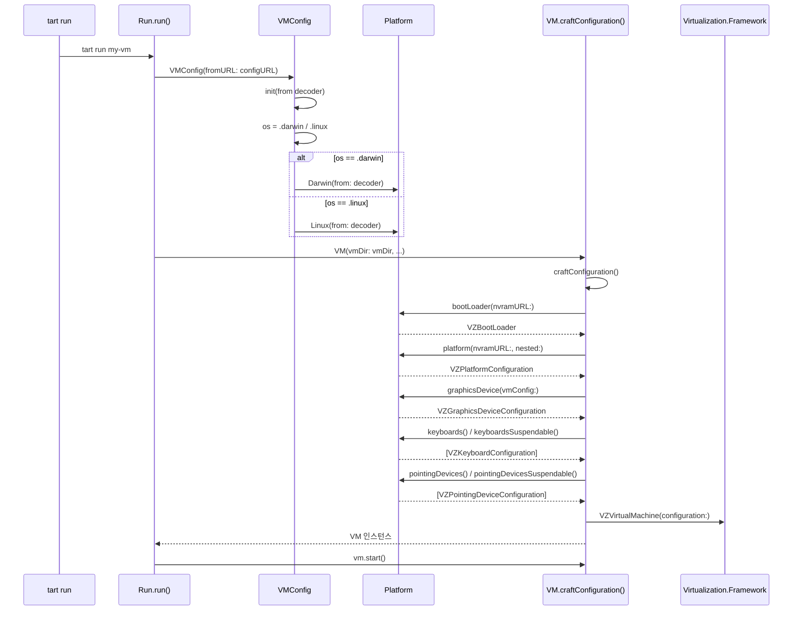

# 14. 플랫폼 추상화 심화

## 개요

Tart는 Apple의 Virtualization.Framework 위에서 macOS(Darwin) VM과 Linux VM을 모두 지원한다.
두 게스트 OS는 부트로더, 플랫폼 구성, 그래픽 장치, 키보드, 포인팅 장치 등 거의 모든 가상화
구성 요소가 다르다. Tart는 이 차이를 **`Platform` 프로토콜**이라는 단일 추상화로 감싸고,
`VMConfig`의 JSON 직렬화/역직렬화 시점에 `os` 필드를 기준으로 올바른 구현체를 선택한다.

이 문서에서는 아래 항목을 다룬다.

1. `Platform` / `PlatformSuspendable` 프로토콜 설계
2. `Darwin` 구현체 상세 (arm64 전용 `#if arch(arm64)`)
3. `Linux` 구현체 상세 (`@available(macOS 13, *)`)
4. `OS` / `Architecture` 열거형
5. `VMConfig.init(from decoder:)`에서의 다형성 디코딩
6. `VM.craftConfiguration()`에서의 플랫폼 활용
7. point vs pixel 디스플레이 단위 분기
8. Suspendable 디바이스 구성
9. 설계 철학: "왜 이렇게 만들었는가"

---

## 1. Platform 프로토콜

```
파일: Sources/tart/Platform/Platform.swift
```

```swift
protocol Platform: Codable {
  func os() -> OS
  func bootLoader(nvramURL: URL) throws -> VZBootLoader
  func platform(nvramURL: URL, needsNestedVirtualization: Bool) throws -> VZPlatformConfiguration
  func graphicsDevice(vmConfig: VMConfig) -> VZGraphicsDeviceConfiguration
  func keyboards() -> [VZKeyboardConfiguration]
  func pointingDevices() -> [VZPointingDeviceConfiguration]
  func pointingDevicesSimplified() -> [VZPointingDeviceConfiguration]
}
```

### 7개 메서드의 역할

| 메서드 | 반환 타입 | 역할 |
|--------|----------|------|
| `os()` | `OS` | `.darwin` 또는 `.linux` 반환. JSON 직렬화 키로 사용 |
| `bootLoader(nvramURL:)` | `VZBootLoader` | NVRAM URL을 받아 적절한 부트로더 생성 |
| `platform(nvramURL:needsNestedVirtualization:)` | `VZPlatformConfiguration` | 하드웨어 플랫폼 구성 (ECID, 보조 스토리지 등) |
| `graphicsDevice(vmConfig:)` | `VZGraphicsDeviceConfiguration` | 디스플레이 어댑터 구성 |
| `keyboards()` | `[VZKeyboardConfiguration]` | 가상 키보드 장치 목록 |
| `pointingDevices()` | `[VZPointingDeviceConfiguration]` | 가상 포인팅 장치 목록 (전체) |
| `pointingDevicesSimplified()` | `[VZPointingDeviceConfiguration]` | 트랙패드 제외한 단순 포인팅 장치 |

### Codable 채택의 의미

`Platform`은 `Codable`을 채택한다. 이는 `VMConfig` 구조체가 JSON으로 직렬화/역직렬화될 때
플랫폼별 필드(예: Darwin의 `ecid`, `hardwareModel`)가 함께 인코딩/디코딩되어야 하기 때문이다.

---

## 2. PlatformSuspendable 프로토콜

```swift
protocol PlatformSuspendable: Platform {
  func pointingDevicesSuspendable() -> [VZPointingDeviceConfiguration]
  func keyboardsSuspendable() -> [VZKeyboardConfiguration]
}
```

macOS 14(Sonoma)부터 VM의 상태를 저장하고 복원하는 "Suspend/Resume" 기능이 도입되었다.
그런데 Suspend 모드에서는 **USB 키보드와 USB 포인팅 장치가 호환되지 않는** 문제가 있다.
Apple의 Mac 전용 키보드(`VZMacKeyboardConfiguration`)와 트랙패드(`VZMacTrackpadConfiguration`)만
Suspend/Resume을 지원한다.

따라서 `PlatformSuspendable`은 `Platform`을 확장하여, Suspend 가능한 장치만 반환하는
2개 메서드를 추가로 요구한다.

### 구현 현황

| 구현체 | PlatformSuspendable 채택 | 이유 |
|--------|-------------------------|------|
| `Darwin` | O | Mac 전용 키보드/트랙패드 사용 가능 |
| `Linux` | X | USB 장치만 사용, Suspend 미지원 |

---

## 3. Darwin 구현체

```
파일: Sources/tart/Platform/Darwin.swift
```

### 3.1 조건부 컴파일

```swift
#if arch(arm64)

  struct Darwin: PlatformSuspendable {
    var ecid: VZMacMachineIdentifier
    var hardwareModel: VZMacHardwareModel
    // ...
  }

#endif
```

`Darwin` 구조체는 `#if arch(arm64)` 전처리기 지시문으로 감싸져 있다.
macOS VM은 Apple Silicon(arm64)에서만 실행할 수 있기 때문이다.
Intel Mac에서는 이 구조체 자체가 컴파일되지 않는다.

### 3.2 핵심 속성: ecid와 hardwareModel

```
+------------------+     +---------------------+
|    Darwin        |     |  config.json (JSON)  |
|                  |     |                      |
| ecid:            |<--->| "ecid": "base64..."  |
|   VZMacMachine   |     |                      |
|   Identifier     |     | "hardwareModel":     |
|                  |     |   "base64..."        |
| hardwareModel:   |<--->|                      |
|   VZMacHardware  |     |                      |
|   Model          |     |                      |
+------------------+     +---------------------+
```

**ECID (Exclusive Chip Identification)**
- Apple Silicon의 각 칩에 고유하게 부여되는 식별자
- VM에서는 `VZMacMachineIdentifier`로 표현
- VM 생성 시 `VZMacMachineIdentifier()`로 새로 생성
- JSON 직렬화: `dataRepresentation` -> base64 인코딩

**Hardware Model**
- VM이 에뮬레이트하는 Mac 하드웨어 모델
- macOS IPSW 복원 이미지의 `mostFeaturefulSupportedConfiguration`에서 가져옴
- JSON 직렬화: `dataRepresentation` -> base64 인코딩
- 역직렬화 시 `isSupported` 검증 수행

### 3.3 직렬화/역직렬화 (Codable)

**디코딩 (`init(from decoder:)`)**

```swift
init(from decoder: Decoder) throws {
  let container = try decoder.container(keyedBy: CodingKeys.self)

  // 1. ECID: base64 문자열 -> Data -> VZMacMachineIdentifier
  let encodedECID = try container.decode(String.self, forKey: .ecid)
  guard let data = Data.init(base64Encoded: encodedECID) else {
    throw DecodingError.dataCorruptedError(...)
  }
  guard let ecid = VZMacMachineIdentifier.init(dataRepresentation: data) else {
    throw DecodingError.dataCorruptedError(...)
  }
  self.ecid = ecid

  // 2. hardwareModel: base64 문자열 -> Data -> VZMacHardwareModel
  let encodedHardwareModel = try container.decode(String.self, forKey: .hardwareModel)
  guard let data = Data.init(base64Encoded: encodedHardwareModel) else {
    throw DecodingError.dataCorruptedError(...)
  }
  guard let hardwareModel = VZMacHardwareModel.init(dataRepresentation: data) else {
    // 하드웨어 모델 초기화 실패 = 호스트 OS가 너무 오래됨
    throw UnsupportedHostOSError()
  }
  self.hardwareModel = hardwareModel
}
```

핵심 포인트:
- `VZMacHardwareModel.init(dataRepresentation:)`가 `nil`을 반환하면 `UnsupportedHostOSError`를 던짐
- 이는 구형 macOS 호스트에서 신형 VM 이미지를 열 때 발생

**인코딩 (`encode(to:)`)**

```swift
func encode(to encoder: Encoder) throws {
  var container = encoder.container(keyedBy: CodingKeys.self)
  try container.encode(ecid.dataRepresentation.base64EncodedString(), forKey: .ecid)
  try container.encode(hardwareModel.dataRepresentation.base64EncodedString(), forKey: .hardwareModel)
}
```

### 3.4 부트로더

```swift
func bootLoader(nvramURL: URL) throws -> VZBootLoader {
  VZMacOSBootLoader()
}
```

macOS VM은 `VZMacOSBootLoader`를 사용한다. NVRAM URL은 사용하지 않는다.
macOS 부트로더는 Apple의 UEFI 변형이며, NVRAM과 보조 스토리지를 `platform()` 메서드에서 구성한다.

### 3.5 플랫폼 구성

```swift
func platform(nvramURL: URL, needsNestedVirtualization: Bool) throws -> VZPlatformConfiguration {
  if needsNestedVirtualization {
    throw RuntimeError.VMConfigurationError("macOS virtual machines do not support nested virtualization")
  }

  let result = VZMacPlatformConfiguration()

  result.machineIdentifier = ecid
  result.auxiliaryStorage = VZMacAuxiliaryStorage(url: nvramURL)

  if !hardwareModel.isSupported {
    throw UnsupportedHostOSError()
  }

  result.hardwareModel = hardwareModel

  return result
}
```

구성 요소 흐름:

```
VZMacPlatformConfiguration
    |
    +-- machineIdentifier = ecid (VZMacMachineIdentifier)
    |
    +-- auxiliaryStorage = VZMacAuxiliaryStorage(url: nvramURL)
    |
    +-- hardwareModel = hardwareModel (VZMacHardwareModel)
         |
         +-- isSupported 검증 -> false면 UnsupportedHostOSError
```

**중첩 가상화(Nested Virtualization)**: macOS VM은 지원하지 않으므로 명시적으로 에러를 던진다.

### 3.6 그래픽 장치

```swift
func graphicsDevice(vmConfig: VMConfig) -> VZGraphicsDeviceConfiguration {
  let result = VZMacGraphicsDeviceConfiguration()

  if (vmConfig.display.unit ?? .point) == .point, let hostMainScreen = NSScreen.main {
    let vmScreenSize = NSSize(width: vmConfig.display.width, height: vmConfig.display.height)
    result.displays = [
      VZMacGraphicsDisplayConfiguration(for: hostMainScreen, sizeInPoints: vmScreenSize)
    ]
    return result
  }

  result.displays = [
    VZMacGraphicsDisplayConfiguration(
      widthInPixels: vmConfig.display.width,
      heightInPixels: vmConfig.display.height,
      pixelsPerInch: 72
    )
  ]
  return result
}
```

**point vs pixel 분기 로직**:

```
vmConfig.display.unit 값 확인
    |
    +-- .point (또는 nil = 기본값)
    |       |
    |       +-- NSScreen.main 존재?
    |           |
    |           +-- Yes: VZMacGraphicsDisplayConfiguration(for:sizeInPoints:)
    |           |        -> 호스트 화면의 DPI에 맞추어 자동 조정
    |           |
    |           +-- No: pixel 모드로 폴백
    |
    +-- .pixel
            |
            +-- VZMacGraphicsDisplayConfiguration(widthInPixels:heightInPixels:pixelsPerInch:)
                -> 72 PPI 고정값 사용
                -> Apple 문서 CGDisplayScreenSize 기준 "합리적 추정치"
```

이 분기가 존재하는 이유:
- **Point 모드**: GUI가 있는 환경에서 사용. Retina 디스플레이의 스케일 팩터를 자동 반영
- **Pixel 모드**: CI/CD 등 헤드리스 환경에서 사용. `NSScreen.main`이 없을 수 있음
- `VMDisplayConfig.unit`이 `nil`이면 `.point`로 기본값 처리

### 3.7 키보드 장치

```swift
func keyboards() -> [VZKeyboardConfiguration] {
  if #available(macOS 14, *) {
    return [VZUSBKeyboardConfiguration(), VZMacKeyboardConfiguration()]
  } else {
    return [VZUSBKeyboardConfiguration()]
  }
}
```

**두 가지 키보드를 동시에 연결하는 이유**:
- `VZUSBKeyboardConfiguration`: 범용 USB HID 키보드. 모든 macOS 게스트에서 동작
- `VZMacKeyboardConfiguration`: macOS 14+ 전용. Globe 키, Touch Bar 시뮬레이션 등 Mac 고유 기능 지원
- 호환성을 위해 USB 키보드를 기본으로 두고, macOS 14+에서는 Mac 키보드를 추가

**Suspendable 키보드**:

```swift
func keyboardsSuspendable() -> [VZKeyboardConfiguration] {
  if #available(macOS 14, *) {
    return [VZMacKeyboardConfiguration()]
  } else {
    return keyboards()
  }
}
```

Suspend 모드에서는 `VZMacKeyboardConfiguration`만 반환한다.
`VZUSBKeyboardConfiguration`은 Suspend/Resume과 호환되지 않기 때문이다.

### 3.8 포인팅 장치

```swift
func pointingDevices() -> [VZPointingDeviceConfiguration] {
  [VZUSBScreenCoordinatePointingDeviceConfiguration(), VZMacTrackpadConfiguration()]
}

func pointingDevicesSimplified() -> [VZPointingDeviceConfiguration] {
  return [VZUSBScreenCoordinatePointingDeviceConfiguration()]
}

func pointingDevicesSuspendable() -> [VZPointingDeviceConfiguration] {
  if #available(macOS 14, *) {
    return [VZMacTrackpadConfiguration()]
  } else {
    return pointingDevices()
  }
}
```

3가지 변형:

| 메서드 | 반환 장치 | 용도 |
|--------|----------|------|
| `pointingDevices()` | USB + 트랙패드 | 일반 실행 (기본값) |
| `pointingDevicesSimplified()` | USB만 | `--no-trackpad` 플래그 사용 시 |
| `pointingDevicesSuspendable()` | 트랙패드만 | Suspend 모드 |

**왜 `pointingDevicesSimplified()`가 필요한가?**
- `VZMacTrackpadConfiguration`은 macOS Ventura(13) 이상의 게스트에서만 동작
- 구형 macOS 게스트를 실행할 때 트랙패드가 문제를 일으킬 수 있음
- `tart run --no-trackpad` 옵션으로 USB 포인팅 장치만 사용 가능

---

## 4. Linux 구현체

```
파일: Sources/tart/Platform/Linux.swift
```

```swift
@available(macOS 13, *)
struct Linux: Platform {
  // ...
}
```

`Linux`는 `@available(macOS 13, *)`로 표시된다. Linux VM 지원은 macOS Ventura(13)부터 가능하다.
`PlatformSuspendable`을 채택하지 **않는다** -- Linux VM은 Suspend/Resume을 지원하지 않는다.

### 4.1 부트로더

```swift
func bootLoader(nvramURL: URL) throws -> VZBootLoader {
  let result = VZEFIBootLoader()
  result.variableStore = VZEFIVariableStore(url: nvramURL)
  return result
}
```

Linux VM은 표준 UEFI 부트로더(`VZEFIBootLoader`)를 사용한다.
Darwin과 달리 `nvramURL`을 직접 사용하여 `VZEFIVariableStore`를 연결한다.
이 변수 저장소에는 UEFI 부팅 변수(부팅 순서, 보안 부트 설정 등)가 저장된다.

### 4.2 플랫폼 구성

```swift
func platform(nvramURL: URL, needsNestedVirtualization: Bool) throws -> VZPlatformConfiguration {
  let config = VZGenericPlatformConfiguration()
  if #available(macOS 15, *) {
    config.isNestedVirtualizationEnabled = needsNestedVirtualization
  }
  return config
}
```

- `VZGenericPlatformConfiguration`: 범용 ARM64 플랫폼. ECID나 하드웨어 모델 불필요
- **중첩 가상화**: macOS 15(Sequoia)부터 Linux VM에서 지원. `--nested` 플래그로 활성화

```
Darwin platform()                Linux platform()
+-------------------------+      +---------------------------+
| VZMacPlatformConfig     |      | VZGenericPlatformConfig   |
|                         |      |                           |
| - machineIdentifier     |      | - isNestedVirtualization  |
|   (ECID)                |      |   Enabled (macOS 15+)     |
| - auxiliaryStorage      |      |                           |
|   (NVRAM)               |      | (속성 없음 = 범용)          |
| - hardwareModel         |      |                           |
+-------------------------+      +---------------------------+
```

### 4.3 그래픽 장치

```swift
func graphicsDevice(vmConfig: VMConfig) -> VZGraphicsDeviceConfiguration {
  let result = VZVirtioGraphicsDeviceConfiguration()

  result.scanouts = [
    VZVirtioGraphicsScanoutConfiguration(
      widthInPixels: vmConfig.display.width,
      heightInPixels: vmConfig.display.height
    )
  ]

  return result
}
```

Linux VM은 Virtio GPU를 사용한다.

| 항목 | Darwin | Linux |
|------|--------|-------|
| 그래픽 장치 | `VZMacGraphicsDeviceConfiguration` | `VZVirtioGraphicsDeviceConfiguration` |
| 디스플레이 단위 | point 또는 pixel | pixel만 |
| DPI 설정 | 72 또는 호스트 화면 기반 | 없음 (Virtio가 관리) |
| 스캐나웃 | `displays` 배열 | `scanouts` 배열 |

Linux VM은 point/pixel 분기가 없다. Virtio GPU는 항상 pixel 단위로 동작한다.

### 4.4 키보드 및 포인팅 장치

```swift
func keyboards() -> [VZKeyboardConfiguration] {
  [VZUSBKeyboardConfiguration()]
}

func pointingDevices() -> [VZPointingDeviceConfiguration] {
  [VZUSBScreenCoordinatePointingDeviceConfiguration()]
}

func pointingDevicesSimplified() -> [VZPointingDeviceConfiguration] {
  return pointingDevices()
}
```

Linux VM은 USB 장치만 사용한다.

- Mac 전용 키보드(`VZMacKeyboardConfiguration`)와 트랙패드(`VZMacTrackpadConfiguration`)는 Linux 게스트에서 동작하지 않음
- `pointingDevicesSimplified()`는 `pointingDevices()`와 동일 -- 이미 USB만 사용하므로

---

## 5. OS 열거형

```
파일: Sources/tart/Platform/OS.swift
```

```swift
enum OS: String, Codable {
  case darwin
  case linux
}
```

JSON의 `"os"` 필드에 직접 매핑되는 단순 열거형이다.
`Codable`을 채택하므로 `"darwin"` / `"linux"` 문자열로 자동 직렬화된다.

### config.json 예시

```json
{
  "version": 1,
  "os": "darwin",
  "arch": "arm64",
  "ecid": "AAAAAgAAAAAAAAAAAAAAAA==",
  "hardwareModel": "YnBsaXN0MD...",
  "cpuCountMin": 4,
  "cpuCount": 4,
  "memorySizeMin": 4294967296,
  "memorySize": 4294967296,
  "macAddress": "9e:f6:5c:a1:b2:c3",
  "display": { "width": 1920, "height": 1200 }
}
```

```json
{
  "version": 1,
  "os": "linux",
  "arch": "arm64",
  "cpuCountMin": 4,
  "cpuCount": 4,
  "memorySizeMin": 4294967296,
  "memorySize": 4294967296,
  "macAddress": "ce:a3:d1:42:f5:67",
  "display": { "width": 1024, "height": 768 }
}
```

Darwin VM의 config.json에는 `ecid`와 `hardwareModel` 필드가 포함되지만,
Linux VM에는 이 필드가 없다. `VMConfig.init(from decoder:)`가 이를 처리한다.

---

## 6. Architecture 열거형

```
파일: Sources/tart/Platform/Architecture.swift
```

```swift
enum Architecture: String, Codable {
  case arm64
  case amd64
}

func CurrentArchitecture() -> Architecture {
  #if arch(arm64)
    return .arm64
  #elseif arch(x86_64)
    return .amd64
  #endif
}
```

`CurrentArchitecture()` 함수는 컴파일 타임에 호스트 아키텍처를 결정한다.
VM 생성 시 `VMConfig.init(platform:...)`에서 호출되어 `arch` 필드에 기록된다.

VM 실행 시에는 아키텍처 일치 여부를 검증한다:

```swift
// Sources/tart/VM.swift 61행
if config.arch != CurrentArchitecture() {
  throw UnsupportedArchitectureError()
}
```

---

## 7. VMConfig의 다형성 디코딩

```
파일: Sources/tart/VMConfig.swift
```

### 7.1 핵심 구조체

```swift
struct VMConfig: Codable {
  var version: Int = 1
  var os: OS
  var arch: Architecture
  var platform: Platform     // <-- 프로토콜 타입
  var cpuCountMin: Int
  private(set) var cpuCount: Int
  var memorySizeMin: UInt64
  private(set) var memorySize: UInt64
  var macAddress: VZMACAddress
  var display: VMDisplayConfig = VMDisplayConfig()
  var displayRefit: Bool?
  var diskFormat: DiskImageFormat = .raw
}
```

`platform` 프로퍼티의 타입이 **프로토콜** `Platform`이다.
Swift의 표준 `Codable`은 프로토콜 타입의 자동 디코딩을 지원하지 않으므로,
수동 `init(from decoder:)`에서 `os` 필드를 먼저 읽고 적절한 구현체를 선택한다.

### 7.2 디코딩 분기

```swift
init(from decoder: Decoder) throws {
  let container = try decoder.container(keyedBy: CodingKeys.self)

  version = try container.decode(Int.self, forKey: .version)
  os = try container.decodeIfPresent(OS.self, forKey: .os) ?? .darwin  // 기본값: darwin
  arch = try container.decodeIfPresent(Architecture.self, forKey: .arch) ?? .arm64

  switch os {
  case .darwin:
    #if arch(arm64)
      platform = try Darwin(from: decoder)
    #else
      throw DecodingError.dataCorruptedError(
        forKey: .os,
        in: container,
        debugDescription: "Darwin VMs are only supported on Apple Silicon hosts")
    #endif
  case .linux:
    platform = try Linux(from: decoder)
  }

  // ... 나머지 필드 디코딩
}
```

```
JSON 데이터 (config.json)
        |
        v
[VMConfig.init(from decoder:)]
        |
        +-- os 필드 읽기
        |       |
        |       +-- "darwin" --> #if arch(arm64)?
        |       |                    |
        |       |                    +-- Yes: Darwin(from: decoder)
        |       |                    |        ecid, hardwareModel 디코딩
        |       |                    |
        |       |                    +-- No: DecodingError 던짐
        |       |
        |       +-- "linux" --> Linux(from: decoder)
        |       |               (추가 필드 없음)
        |       |
        |       +-- nil (없음) --> 기본값 .darwin
        |
        +-- 나머지 공통 필드 디코딩
            cpuCountMin, cpuCount, memorySize, macAddress, display, ...
```

### 7.3 기본값 처리

`os`와 `arch` 필드는 `decodeIfPresent`로 읽으며, 없으면 각각 `.darwin`과 `.arm64`가 기본값이다.
이는 Tart의 초기 버전에서 macOS/arm64만 지원했던 시절의 JSON 파일과의 **하위 호환성**을 위한 것이다.

### 7.4 인코딩

```swift
func encode(to encoder: Encoder) throws {
  var container = encoder.container(keyedBy: CodingKeys.self)

  try container.encode(version, forKey: .version)
  try container.encode(os, forKey: .os)
  try container.encode(arch, forKey: .arch)
  try platform.encode(to: encoder)      // <-- 플랫폼별 필드를 같은 컨테이너에 인코딩
  // ...
}
```

`platform.encode(to: encoder)`는 같은 JSON 객체에 플랫폼별 필드를 추가한다.
Darwin이면 `ecid`, `hardwareModel`이 추가되고, Linux면 추가 필드가 없다.
이 "평탄화(flattening)" 접근법 덕분에 config.json이 중첩 없이 깔끔하게 유지된다.

---

## 8. CodingKeys

```swift
// Sources/tart/VMConfig.swift 17~33행
enum CodingKeys: String, CodingKey {
  case version
  case os
  case arch
  case cpuCountMin
  case cpuCount
  case memorySizeMin
  case memorySize
  case macAddress
  case display
  case displayRefit
  case diskFormat

  // macOS-specific keys
  case ecid
  case hardwareModel
}
```

`ecid`와 `hardwareModel`은 macOS 전용이지만 같은 `CodingKeys` 열거형에 정의되어 있다.
이는 Darwin과 VMConfig가 같은 JSON 디코딩 컨테이너를 공유하기 때문이다.
Darwin의 `init(from decoder:)`는 이 키를 사용해 직접 값을 추출한다.

---

## 9. VM.craftConfiguration()에서의 플랫폼 활용

```
파일: Sources/tart/VM.swift 309~445행
```

`VM` 클래스의 `craftConfiguration()` 정적 메서드에서 `Platform` 프로토콜의 모든 메서드가 사용된다:

```swift
static func craftConfiguration(...) throws -> VZVirtualMachineConfiguration {
  let configuration = VZVirtualMachineConfiguration()

  // 1. 부트로더
  configuration.bootLoader = try vmConfig.platform.bootLoader(nvramURL: nvramURL)

  // 2. 플랫폼
  configuration.platform = try vmConfig.platform.platform(
    nvramURL: nvramURL, needsNestedVirtualization: nested
  )

  // 3. 그래픽 장치
  configuration.graphicsDevices = [vmConfig.platform.graphicsDevice(vmConfig: vmConfig)]

  // 4. 키보드와 포인팅 장치 (Suspendable 분기)
  if suspendable, let platformSuspendable = vmConfig.platform.self as? PlatformSuspendable {
    configuration.keyboards = platformSuspendable.keyboardsSuspendable()
    configuration.pointingDevices = platformSuspendable.pointingDevicesSuspendable()
  } else {
    if noKeyboard {
      configuration.keyboards = []
    } else {
      configuration.keyboards = vmConfig.platform.keyboards()
    }

    if noPointer {
      configuration.pointingDevices = []
    } else if noTrackpad {
      configuration.pointingDevices = vmConfig.platform.pointingDevicesSimplified()
    } else {
      configuration.pointingDevices = vmConfig.platform.pointingDevices()
    }
  }

  // ... 나머지 구성
}
```

### 입력 장치 선택 흐름도

```
craftConfiguration() 호출
    |
    +-- suspendable == true?
    |       |
    |       +-- Yes: platform이 PlatformSuspendable인가?
    |       |           |
    |       |           +-- Yes (Darwin): keyboardsSuspendable() + pointingDevicesSuspendable()
    |       |           |                 -> Mac키보드만 + 트랙패드만
    |       |           |
    |       |           +-- No (Linux): keyboards() + pointingDevices() (폴백)
    |       |
    |       +-- No: 일반 모드
    |               |
    |               +-- noKeyboard? -> [] (빈 배열)
    |               |
    |               +-- noPointer? -> [] (빈 배열)
    |               |
    |               +-- noTrackpad? -> pointingDevicesSimplified()
    |               |                  -> USB 포인팅만
    |               |
    |               +-- 기본: keyboards() + pointingDevices()
    |                         -> USB + Mac(Darwin) 또는 USB만(Linux)
```

---

## 10. VMDisplayConfig

```swift
struct VMDisplayConfig: Codable, Equatable {
  enum Unit: String, Codable {
    case point = "pt"
    case pixel = "px"
  }

  var width: Int = 1024
  var height: Int = 768
  var unit: Unit?
}
```

기본 해상도: 1024x768.
`unit`이 `nil`이면 Darwin에서는 `.point`로, Linux에서는 항상 pixel로 해석된다.

JSON 표현 예시:
```json
{"width": 1920, "height": 1200, "unit": "pt"}  // point 모드
{"width": 1920, "height": 1200, "unit": "px"}  // pixel 모드
{"width": 1024, "height": 768}                  // unit 없음 = 기본값
```

---

## 11. 에러 처리

### UnsupportedHostOSError

```swift
struct UnsupportedHostOSError: Error, CustomStringConvertible {
  var description: String {
    "error: host macOS version is outdated to run this virtual machine"
  }
}
```

발생 시점:
1. `Darwin.init(from decoder:)` -- `VZMacHardwareModel.init(dataRepresentation:)`가 `nil` 반환 시
2. `Darwin.platform()` -- `hardwareModel.isSupported`가 `false`인 경우

이 두 검증 지점이 존재하는 이유:
- 디코딩 시점: 바이너리 데이터 파싱 실패 (포맷 변경 등)
- 플랫폼 구성 시점: 파싱은 성공했지만 현재 호스트에서 지원하지 않는 모델

### LessThanMinimalResourcesError

```swift
class LessThanMinimalResourcesError: NSObject, LocalizedError {
  // ...
}
```

`VMConfig.setCPU()`와 `VMConfig.setMemory()`에서 발생한다.
Darwin VM은 IPSW에서 가져온 최소 요구사항(`cpuCountMin`, `memorySizeMin`)보다 낮은 값을 설정할 수 없다.
Linux VM은 `VZVirtualMachineConfiguration.minimumAllowedCPUCount`만 검증한다.

---

## 12. VM 생성 시 플랫폼 초기화

### Darwin VM 생성 (IPSW 기반)

```swift
// Sources/tart/VM.swift 146~212행
#if arch(arm64)
  init(vmDir: VMDirectory, ipswURL: URL, diskSizeGB: UInt16, ...) async throws {
    // 1. IPSW 로드
    let image = try await VZMacOSRestoreImage.load(from: ipswURL)

    // 2. 하드웨어 요구사항 추출
    guard let requirements = image.mostFeaturefulSupportedConfiguration else {
      throw UnsupportedRestoreImageError()
    }

    // 3. NVRAM 생성
    _ = try VZMacAuxiliaryStorage(creatingStorageAt: vmDir.nvramURL, hardwareModel: requirements.hardwareModel)

    // 4. VMConfig 생성 -- Darwin 플랫폼 사용
    config = VMConfig(
      platform: Darwin(ecid: VZMacMachineIdentifier(), hardwareModel: requirements.hardwareModel),
      cpuCountMin: requirements.minimumSupportedCPUCount,
      memorySizeMin: requirements.minimumSupportedMemorySize,
      diskFormat: diskFormat
    )
    try config.setCPU(cpuCount: max(4, requirements.minimumSupportedCPUCount))
    // ...
  }
#endif
```

### Linux VM 생성

```swift
// Sources/tart/VM.swift 232~245행
@available(macOS 13, *)
static func linux(vmDir: VMDirectory, diskSizeGB: UInt16, ...) async throws -> VM {
  // 1. NVRAM 생성 (EFI 변수 저장소)
  _ = try VZEFIVariableStore(creatingVariableStoreAt: vmDir.nvramURL)

  // 2. VMConfig 생성 -- Linux 플랫폼 사용
  let config = VMConfig(
    platform: Linux(),
    cpuCountMin: 4,
    memorySizeMin: 4096 * 1024 * 1024,  // 4 GiB
    diskFormat: diskFormat
  )
  // ...
}
```

차이점 요약:

| 항목 | Darwin | Linux |
|------|--------|-------|
| 진입점 | `VM.init(vmDir:ipswURL:...)` | `VM.linux(vmDir:diskSizeGB:...)` |
| 플랫폼 생성 | `Darwin(ecid: VZMacMachineIdentifier(), hardwareModel: ...)` | `Linux()` |
| NVRAM | `VZMacAuxiliaryStorage(creatingStorageAt:hardwareModel:)` | `VZEFIVariableStore(creatingVariableStoreAt:)` |
| 최소 CPU | IPSW 요구사항 기반 | 하드코딩 4개 |
| 최소 메모리 | IPSW 요구사항 기반 | 하드코딩 4 GiB |
| OS 설치 | `VZMacOSInstaller`로 자동 설치 | 사용자가 ISO로 수동 설치 |

---

## 13. Darwin과 Linux 전체 비교

```
+====================+=========================+==========================+
|       항목          |        Darwin           |         Linux            |
+====================+=========================+==========================+
| 파일               | Platform/Darwin.swift    | Platform/Linux.swift     |
+--------------------+-------------------------+--------------------------+
| 가용성             | #if arch(arm64)          | @available(macOS 13, *)  |
+--------------------+-------------------------+--------------------------+
| PlatformSuspendable| O                       | X                        |
+--------------------+-------------------------+--------------------------+
| 속성               | ecid, hardwareModel     | 없음                     |
+--------------------+-------------------------+--------------------------+
| 부트로더           | VZMacOSBootLoader       | VZEFIBootLoader          |
|                    | (NVRAM 미사용)           | + VZEFIVariableStore     |
+--------------------+-------------------------+--------------------------+
| 플랫폼 구성        | VZMacPlatformConfig     | VZGenericPlatformConfig  |
|                    | ecid + aux + hwModel    | + 중첩가상화(macOS 15+)  |
+--------------------+-------------------------+--------------------------+
| 중첩 가상화        | 미지원 (에러 던짐)       | macOS 15+ 지원           |
+--------------------+-------------------------+--------------------------+
| 그래픽             | VZMacGraphicsDevice     | VZVirtioGraphicsDevice   |
|                    | point/pixel 분기         | pixel만                  |
+--------------------+-------------------------+--------------------------+
| 키보드             | USB + Mac(macOS 14+)    | USB만                    |
+--------------------+-------------------------+--------------------------+
| 포인팅 장치        | USB + 트랙패드           | USB만                    |
+--------------------+-------------------------+--------------------------+
| Simplified 포인팅  | USB만                   | = pointingDevices()      |
+--------------------+-------------------------+--------------------------+
| Suspend 키보드     | Mac 키보드만             | N/A                      |
+--------------------+-------------------------+--------------------------+
| Suspend 포인팅     | 트랙패드만               | N/A                      |
+--------------------+-------------------------+--------------------------+
| Codable 필드       | ecid(base64),           | 없음                     |
|                    | hardwareModel(base64)   |                          |
+====================+=========================+==========================+
```

---

## 14. 설계 철학: 왜 이렇게 만들었는가

### 14.1 프로토콜 기반 다형성 vs 열거형 기반

Tart는 `Platform` 프로토콜을 사용해 다형성을 구현했다.
대안으로는 `enum Platform { case darwin(Darwin), linux(Linux) }` 패턴이 있었을 것이다.

**프로토콜을 선택한 이유**:
1. `Codable` 통합이 자연스러움 -- 각 구현체가 자신의 디코딩 로직을 소유
2. `VM.craftConfiguration()`에서 `vmConfig.platform.bootLoader()` 형태로 깔끔하게 호출 가능
3. 새로운 게스트 OS 추가 시 기존 코드 수정 없이 새 구현체만 추가

**단점과 보완**:
- Swift의 `Codable`이 프로토콜 타입 자동 디코딩을 지원하지 않아 `VMConfig.init(from decoder:)`에서 수동 분기 필요
- 이를 `os` 필드 기반 switch 문으로 깔끔하게 해결

### 14.2 평탄화된 JSON 구조

`platform.encode(to: encoder)`가 VMConfig와 **같은 레벨**에 필드를 추가한다.
즉, `ecid`와 `hardwareModel`이 별도 "platform" 객체 안에 중첩되지 않는다.

```json
// 실제 구조 (평탄)
{"os": "darwin", "ecid": "...", "hardwareModel": "...", "cpuCount": 4}

// 대안 (중첩) -- Tart가 선택하지 않은 방식
{"os": "darwin", "platform": {"ecid": "...", "hardwareModel": "..."}, "cpuCount": 4}
```

평탄한 구조의 장점:
- JSON 파일이 더 읽기 쉬움
- 기존 도구로 파싱하기 쉬움
- config.json의 하위 호환성 유지가 용이

### 14.3 조건부 컴파일의 역할

```swift
#if arch(arm64)     // Darwin 전체를 감쌈
@available(macOS 13, *)  // Linux에 런타임 가용성 검사
```

이 두 가지는 서로 다른 레벨의 검사이다:
- `#if arch(arm64)`: **컴파일 타임** -- Intel Mac에서는 Darwin 관련 코드가 아예 존재하지 않음
- `@available(macOS 13, *)`: **런타임** -- macOS 12에서 실행하면 Linux 관련 코드 경로에 진입 불가

### 14.4 디스크 캐싱 모드의 OS별 분기

`VM.craftConfiguration()`에서 디스크 캐싱 모드도 OS에 따라 달라진다:

```swift
// Sources/tart/VM.swift 408행
cachingMode: caching ?? (vmConfig.os == .linux ? .cached : .automatic),
```

Linux VM은 기본적으로 `.cached` 모드를 사용한다.
이는 Virtio 블록 디바이스와 Linux 파일시스템의 특성으로 인해,
`.automatic` 모드에서 파일시스템 손상이 발생할 수 있기 때문이다.
(Pull Request #675에서 수정된 사항)

---

## 15. Mermaid 클래스 다이어그램

```mermaid
classDiagram
    class Platform {
        <<protocol>>
        +os() OS
        +bootLoader(nvramURL) VZBootLoader
        +platform(nvramURL, needsNestedVirtualization) VZPlatformConfiguration
        +graphicsDevice(vmConfig) VZGraphicsDeviceConfiguration
        +keyboards() [VZKeyboardConfiguration]
        +pointingDevices() [VZPointingDeviceConfiguration]
        +pointingDevicesSimplified() [VZPointingDeviceConfiguration]
    }

    class PlatformSuspendable {
        <<protocol>>
        +keyboardsSuspendable() [VZKeyboardConfiguration]
        +pointingDevicesSuspendable() [VZPointingDeviceConfiguration]
    }

    class Darwin {
        +ecid: VZMacMachineIdentifier
        +hardwareModel: VZMacHardwareModel
    }

    class Linux {
        (속성 없음)
    }

    class VMConfig {
        +os: OS
        +arch: Architecture
        +platform: Platform
        +cpuCount: Int
        +memorySize: UInt64
        +display: VMDisplayConfig
    }

    class OS {
        <<enum>>
        darwin
        linux
    }

    class Architecture {
        <<enum>>
        arm64
        amd64
    }

    Platform <|-- PlatformSuspendable
    PlatformSuspendable <|.. Darwin
    Platform <|.. Linux
    VMConfig --> Platform
    VMConfig --> OS
    VMConfig --> Architecture
```

---

## 16. 시퀀스 다이어그램: VM 실행 시 플랫폼 구성 흐름



---

## 17. 정리

Tart의 플랫폼 추상화는 다음과 같은 설계 원칙을 따른다:

1. **프로토콜로 차이를 캡슐화**: Darwin과 Linux의 모든 하드웨어 차이를 7개 메서드로 추상화
2. **Suspend 전용 프로토콜 분리**: `PlatformSuspendable`로 Suspend 가능 여부를 타입 레벨에서 표현
3. **JSON 평탄 직렬화**: 플랫폼별 필드를 같은 레벨에 배치하여 config.json의 가독성과 호환성 확보
4. **os 필드 기반 다형성 디코딩**: Swift Codable의 한계를 switch 문으로 우아하게 우회
5. **조건부 컴파일 + 런타임 가용성 검사**: 아키텍처와 OS 버전 제약을 각각 적절한 레벨에서 처리
6. **호스트 화면 연동**: Darwin의 point 모드로 Retina 디스플레이를 자연스럽게 지원

이 추상화 덕분에 `VM.craftConfiguration()`은 게스트 OS에 무관하게 동일한 코드 경로로
가상 머신을 구성할 수 있으며, 향후 새로운 게스트 OS(예: Windows on ARM)를 추가할 때도
`Platform` 프로토콜의 새 구현체만 작성하면 된다.
