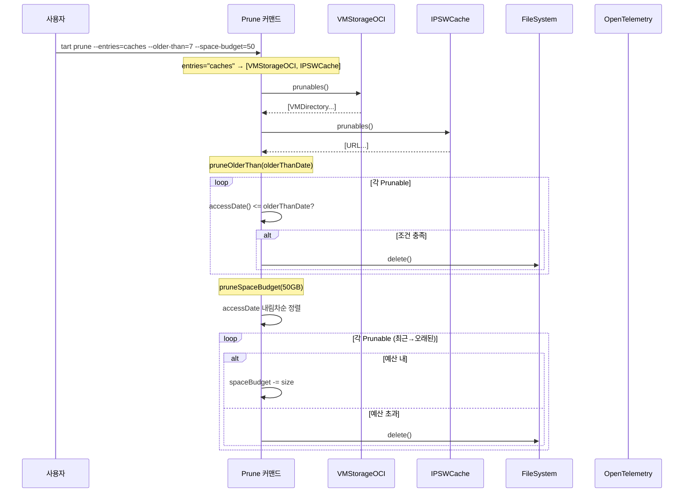
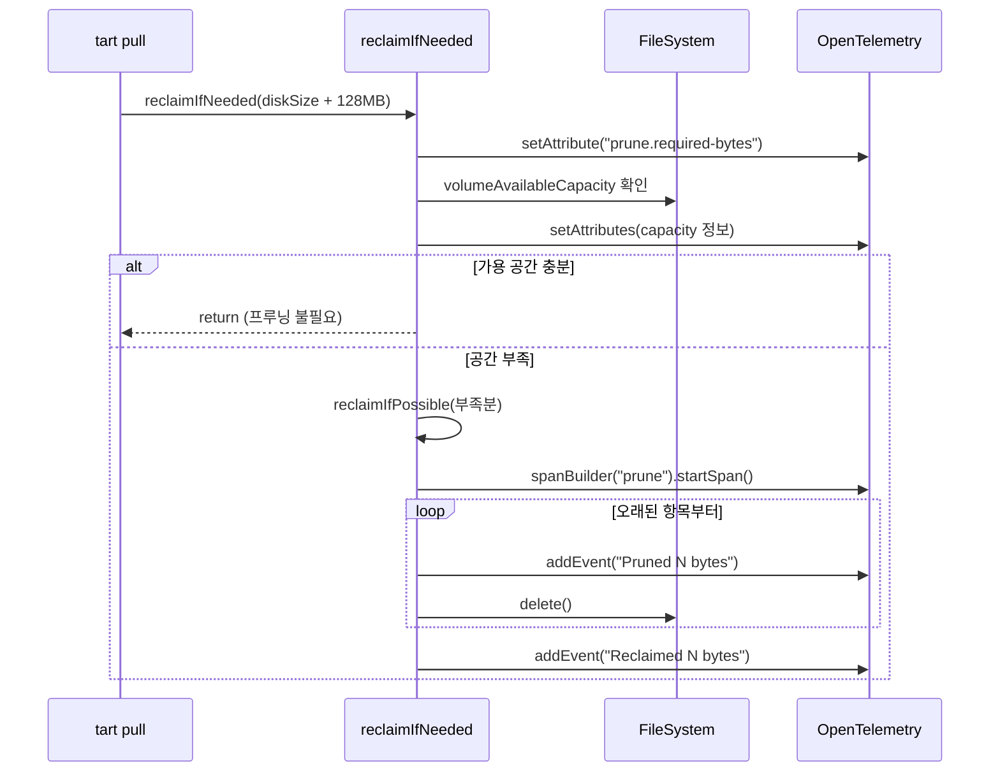

# 15. 캐시와 프루닝 시스템 심화

## 개요

Tart는 OCI 레지스트리에서 Pull한 VM 이미지와 macOS IPSW 파일을 로컬에 캐시한다. 디스크 공간이 유한하기 때문에
캐시를 효율적으로 관리하는 프루닝(pruning) 시스템이 필수적이다. Tart의 프루닝 시스템은 다음 세 가지 전략을
제공한다.

1. **시간 기반 프루닝** (`--older-than`): 마지막 접근일 기준으로 오래된 항목 삭제
2. **공간 예산 프루닝** (`--space-budget`): LRU 기반으로 총 크기 제한
3. **자동 프루닝** (`reclaimIfNeeded`): 디스크 공간 부족 시 자동으로 캐시 정리

이 문서에서는 프루닝의 전체 아키텍처, 핵심 프로토콜, 구현 세부사항, GC(가비지 컬렉션) 메커니즘,
그리고 OpenTelemetry 기반 프루닝 이벤트 추적까지 심층적으로 분석한다.

---

## 전체 아키텍처

```
+---------------------------+
|     tart prune 커맨드      |
| (Commands/Prune.swift)    |
+---------------------------+
           |
           v
+---------------------------+     +---------------------------+
| PrunableStorage 프로토콜   |---->|  Prunable 프로토콜         |
| (Prunable.swift)          |     |  (Prunable.swift)         |
+---------------------------+     +---------------------------+
      |          |                    ^       ^       ^
      v          v                    |       |       |
+-----------+ +-----------+     +--------+ +-----+ +--------+
|VMStorage  | |IPSWCache  |     |VMDir   | |URL  | |VMDir   |
|OCI        | |           |     |(OCI)   | |(IPSW)| |(Local) |
+-----------+ +-----------+     +--------+ +-----+ +--------+
      |
      v
+---------------------------+
|   gc() 가비지 컬렉션       |
|   (심볼릭 링크 참조 카운트) |
+---------------------------+

+---------------------------+
| reclaimIfNeeded()         |
| 자동 프루닝 (디스크 용량)   |
+---------------------------+

+---------------------------+
| Config.gc()               |
| tmp 디렉토리 GC            |
+---------------------------+
```

---

## Prunable 프로토콜과 PrunableStorage 프로토콜

프루닝 시스템의 핵심은 두 개의 프로토콜이다.
소스: `Sources/tart/Prunable.swift`

### PrunableStorage 프로토콜

```swift
protocol PrunableStorage {
  func prunables() throws -> [Prunable]
}
```

프루닝 대상이 되는 저장소를 추상화한다. `prunables()` 메서드는 해당 저장소에서 삭제 가능한 모든 항목의
배열을 반환한다.

**구현체:**

| 구현 클래스 | 소스 파일 | 설명 |
|------------|----------|------|
| `VMStorageOCI` | `Sources/tart/VMStorageOCI.swift` | OCI 레지스트리 캐시 |
| `VMStorageLocal` | `Sources/tart/VMStorageLocal.swift` | 로컬 VM 저장소 |
| `IPSWCache` | `Sources/tart/IPSWCache.swift` | IPSW 파일 캐시 |

### Prunable 프로토콜

```swift
protocol Prunable {
  var url: URL { get }
  func delete() throws
  func accessDate() throws -> Date
  // size on disk as seen in Finder including empty blocks
  func sizeBytes() throws -> Int
  // actual size on disk without empty blocks
  func allocatedSizeBytes() throws -> Int
}
```

프루닝 대상 항목 하나를 추상화한다. 각 항목은 다음 정보를 제공해야 한다.

| 메서드/프로퍼티 | 역할 |
|---------------|------|
| `url` | 항목의 파일시스템 경로 |
| `delete()` | 항목 삭제 수행 |
| `accessDate()` | 마지막 접근 날짜 (LRU 정렬 기준) |
| `sizeBytes()` | Finder에서 보이는 크기 (빈 블록 포함) |
| `allocatedSizeBytes()` | 실제 디스크 할당 크기 (빈 블록 제외) |

`sizeBytes()`와 `allocatedSizeBytes()`의 차이가 중요하다. macOS의 APFS 파일시스템은
sparse 파일을 지원하기 때문에, VM 디스크 이미지가 논리적으로 50GB이더라도 실제 디스크 할당은
10GB일 수 있다. 프루닝 시 공간 예산 계산에는 `allocatedSizeBytes()`를 사용한다.

**Prunable의 주요 구현: VMDirectory**

`VMDirectory` 구조체가 `Prunable` 프로토콜을 구현한다.
소스: `Sources/tart/VMDirectory.swift`

```swift
struct VMDirectory: Prunable {
  var baseURL: URL

  var url: URL {
    baseURL
  }

  func accessDate() throws -> Date {
    try baseURL.accessDate()
  }

  func allocatedSizeBytes() throws -> Int {
    try configURL.allocatedSizeBytes() + diskURL.allocatedSizeBytes() + nvramURL.allocatedSizeBytes()
  }

  func sizeBytes() throws -> Int {
    try configURL.sizeBytes() + diskURL.sizeBytes() + nvramURL.sizeBytes()
  }
}
```

VM 디렉토리의 크기는 `config.json` + `disk.img` + `nvram.bin` 세 파일의 합으로 계산된다.

---

## Prune 커맨드

소스: `Sources/tart/Commands/Prune.swift`

### 커맨드 옵션

```swift
struct Prune: AsyncParsableCommand {
  static var configuration = CommandConfiguration(
    abstract: "Prune OCI and IPSW caches or local VMs"
  )

  @Option var entries: String = "caches"
  @Option var olderThan: UInt?
  @Option var cacheBudget: UInt?   // deprecated
  @Option var spaceBudget: UInt?
  @Flag   var gc: Bool = false
}
```

| 옵션 | 기본값 | 설명 |
|------|--------|------|
| `--entries` | `"caches"` | 프루닝 대상: `"caches"` (OCI + IPSW) 또는 `"vms"` (로컬 VM) |
| `--older-than n` | 없음 | n일 이상 접근하지 않은 항목 삭제 |
| `--space-budget n` | 없음 | n GB 이하로 캐시 크기 제한 (LRU 기반) |
| `--cache-budget n` | 없음 | deprecated, `--space-budget`로 대체 |
| `--gc` | false | 숨김 옵션, OCI 가비지 컬렉션만 수행 |

### validate() - 입력 검증

```swift
mutating func validate() throws {
  // --cache-budget deprecation logic
  if let cacheBudget = cacheBudget {
    fputs("--cache-budget is deprecated, please use --space-budget\n", stderr)
    if spaceBudget != nil {
      throw ValidationError("--cache-budget is deprecated, please use --space-budget")
    }
    spaceBudget = cacheBudget
  }

  if olderThan == nil && spaceBudget == nil && !gc {
    throw ValidationError("at least one pruning criteria must be specified")
  }
}
```

최소 하나의 프루닝 기준이 지정되어야 한다. `--cache-budget`은 `--space-budget`으로 마이그레이션되며,
둘 다 지정하면 에러가 발생한다.

### run() - 실행 흐름

```swift
func run() async throws {
  if gc {
    try VMStorageOCI().gc()
  }

  let prunableStorages: [PrunableStorage]

  switch entries {
  case "caches":
    prunableStorages = [try VMStorageOCI(), try IPSWCache()]
  case "vms":
    prunableStorages = [try VMStorageLocal()]
  default:
    throw ValidationError("unsupported --entries value...")
  }

  if let olderThan = olderThan {
    let olderThanInterval = Int(exactly: olderThan)!.days.timeInterval
    let olderThanDate = Date() - olderThanInterval
    try Prune.pruneOlderThan(prunableStorages: prunableStorages, olderThanDate: olderThanDate)
  }

  if let spaceBudget = spaceBudget {
    try Prune.pruneSpaceBudget(
      prunableStorages: prunableStorages,
      spaceBudgetBytes: UInt64(spaceBudget) * 1024 * 1024 * 1024
    )
  }
}
```

실행 흐름을 다이어그램으로 표현하면 다음과 같다.

```
tart prune --entries=caches --older-than=7 --space-budget=50

  1) --gc 플래그가 있으면 VMStorageOCI.gc() 먼저 실행
  2) --entries에 따라 PrunableStorage 목록 구성
     - "caches" → [VMStorageOCI, IPSWCache]
     - "vms"    → [VMStorageLocal]
  3) --older-than이 있으면 pruneOlderThan() 실행
  4) --space-budget이 있으면 pruneSpaceBudget() 실행
```

---

## 프루닝 알고리즘 상세

### pruneOlderThan - 시간 기반 프루닝

소스: `Sources/tart/Commands/Prune.swift` 77-81행

```swift
static func pruneOlderThan(prunableStorages: [PrunableStorage], olderThanDate: Date) throws {
  let prunables: [Prunable] = try prunableStorages.flatMap { try $0.prunables() }
  try prunables.filter { try $0.accessDate() <= olderThanDate }.forEach { try $0.delete() }
}
```

**알고리즘:**
1. 모든 PrunableStorage에서 Prunable 항목을 수집 (flatMap)
2. `accessDate()` <= `olderThanDate`인 항목 필터링
3. 필터된 항목 전부 삭제

```
시간축
──────────────────────────────────────>
|                  |                  |
olderThanDate    마지막 접근          현재
                   |
          +---------+
          | 이 이미지는 삭제 대상 아님
          | (accessDate > olderThanDate)
          +---------+

+------+
| 삭제 대상
| (accessDate <= olderThanDate)
+------+
```

**시간 계산:**
`--older-than=7`이면 `Int(7).days.timeInterval`로 7일치 초 단위 interval을 구하고,
현재 시간에서 뺀 날짜가 `olderThanDate`가 된다. SwiftDate 라이브러리의 `.days` 확장을 사용한다.

### pruneSpaceBudget - 공간 예산 프루닝

소스: `Sources/tart/Commands/Prune.swift` 83-105행

```swift
static func pruneSpaceBudget(prunableStorages: [PrunableStorage], spaceBudgetBytes: UInt64) throws {
  let prunables: [Prunable] = try prunableStorages
    .flatMap { try $0.prunables() }
    .sorted { try $0.accessDate() > $1.accessDate() }  // 최근 접근 순으로 정렬

  var spaceBudgetBytes = spaceBudgetBytes
  var prunablesToDelete: [Prunable] = []

  for prunable in prunables {
    let prunableSizeBytes = UInt64(try prunable.allocatedSizeBytes())

    if prunableSizeBytes <= spaceBudgetBytes {
      // 예산 내에 들어가면 유지
      spaceBudgetBytes -= prunableSizeBytes
    } else {
      // 예산 초과 시 삭제 대상으로 표시
      prunablesToDelete.append(prunable)
    }
  }

  try prunablesToDelete.forEach { try $0.delete() }
}
```

**알고리즘:**
1. 모든 Prunable 항목을 수집하고 `accessDate` 내림차순 정렬 (가장 최근이 먼저)
2. 순서대로 순회하면서 남은 예산에서 크기를 차감
3. 예산이 부족하면 삭제 대상으로 표시
4. 삭제 대상을 모두 삭제

```
예산: 50GB
정렬 순서 (최근 접근 → 오래된 접근)

항목A (20GB) → 남은 예산 30GB → 유지
항목B (15GB) → 남은 예산 15GB → 유지
항목C (25GB) → 예산 부족     → 삭제 대상
항목D (10GB) → 예산 부족     → 삭제 대상

결과: A, B 유지 / C, D 삭제
```

핵심 설계 포인트는 **정렬이 accessDate 내림차순**이라는 점이다. 가장 최근에 접근한 항목이
우선적으로 예산을 차지하고, 오래된 항목이 먼저 삭제된다. 이것이 LRU(Least Recently Used) 전략이다.

또한 크기 비교에 `allocatedSizeBytes()`를 사용한다는 점에 주목하자. APFS의 sparse 파일 특성상,
`sizeBytes()`는 논리적 크기이고 `allocatedSizeBytes()`는 실제 디스크 사용량이다.
프루닝의 목적이 디스크 공간 확보이므로 실제 할당 크기를 기준으로 판단하는 것이 맞다.

---

## reclaimIfNeeded - 자동 프루닝

소스: `Sources/tart/Commands/Prune.swift` 107-189행

자동 프루닝은 `tart clone`이나 `tart pull` 같은 커맨드 실행 중에 디스크 공간이 부족할 때
자동으로 호출된다. 사용자가 직접 호출하는 것이 아니라 시스템이 필요에 따라 호출한다.

### reclaimIfNeeded 메서드

```swift
static func reclaimIfNeeded(_ requiredBytes: UInt64, _ initiator: Prunable? = nil) throws {
  // TART_NO_AUTO_PRUNE 환경변수로 비활성화 가능
  if ProcessInfo.processInfo.environment.keys.contains("TART_NO_AUTO_PRUNE") {
    return
  }

  // OpenTelemetry에 필요 바이트 기록
  OpenTelemetry.instance.contextProvider.activeSpan?.setAttribute(
    key: "prune.required-bytes",
    value: .int(Int(requiredBytes))
  )

  // 디스크 가용 용량 확인
  let attrs = try Config().tartCacheDir.resourceValues(forKeys: [
    .volumeAvailableCapacityKey,
    .volumeAvailableCapacityForImportantUsageKey
  ])
  let volumeAvailableCapacityCalculated = max(
    UInt64(attrs.volumeAvailableCapacity!),
    UInt64(attrs.volumeAvailableCapacityForImportantUsage!)
  )

  // 가용 용량 0 이하면 조기 반환
  if volumeAvailableCapacityCalculated <= 0 {
    OpenTelemetry.instance.contextProvider.activeSpan?
      .addEvent(name: "Zero volume capacity reported")
    return
  }

  // 필요한 공간이 가용 공간보다 작으면 프루닝 불필요
  if requiredBytes < volumeAvailableCapacityCalculated {
    return
  }

  // 부족한 만큼만 회수 시도
  try Prune.reclaimIfPossible(requiredBytes - volumeAvailableCapacityCalculated, initiator)
}
```

### 디스크 가용 용량 계산

macOS는 두 가지 디스크 용량 값을 제공한다.

| 키 | 설명 |
|----|------|
| `volumeAvailableCapacity` | 일반 가용 용량 |
| `volumeAvailableCapacityForImportantUsage` | "중요한 사용"을 위한 가용 용량 |

macOS는 사용자에게 보여주는 용량과 시스템이 실제로 사용할 수 있는 용량이 다르다.
`volumeAvailableCapacityForImportantUsage`는 purgeable 공간까지 포함하여 더 큰 값을 반환할 수 있다.
Tart는 두 값 중 큰 값을 사용하여 최대한 정확한 가용 공간을 파악한다.

```
macOS 디스크 용량 구조:

+--------------------------------------------------+
|              전체 볼륨 용량                         |
+--------------------------------------------------+
| 사용 중  | purgeable | 일반 가용  | 시스템 예약     |
+----------+-----------+-----------+----------------+
           |                       |
           |<-- 중요 사용 가용  --->|
           |                       |
                       |<-- 일반 가용 -->|

max(일반가용, 중요사용가용) = 계산된 가용 용량
```

### reclaimIfPossible - 실제 회수 실행

```swift
private static func reclaimIfPossible(_ reclaimBytes: UInt64, _ initiator: Prunable? = nil) throws {
  let span = OTel.shared.tracer.spanBuilder(spanName: "prune").startSpan()
  defer { span.end() }

  let prunableStorages: [PrunableStorage] = [try VMStorageOCI(), try IPSWCache()]
  let prunables: [Prunable] = try prunableStorages
    .flatMap { try $0.prunables() }
    .sorted { try $0.accessDate() < $1.accessDate() }  // 오래된 것부터

  // 캐시 전체 크기가 회수 필요량보다 작으면 포기
  let cacheUsedBytes = try prunables.map { try $0.allocatedSizeBytes() }.reduce(0, +)
  if cacheUsedBytes < reclaimBytes {
    return
  }

  var cacheReclaimedBytes: Int = 0
  var it = prunables.makeIterator()

  while cacheReclaimedBytes <= reclaimBytes {
    guard let prunable = it.next() else {
      break
    }

    // initiator(현재 작업 대상)는 프루닝 대상에서 제외
    if prunable.url == initiator?.url.resolvingSymlinksInPath() {
      continue
    }

    let allocatedSizeBytes = try prunable.allocatedSizeBytes()

    OpenTelemetry.instance.contextProvider.activeSpan?
      .addEvent(name: "Pruned \(allocatedSizeBytes) bytes for \(prunable.url.path)")

    cacheReclaimedBytes += allocatedSizeBytes
    try prunable.delete()
  }

  OpenTelemetry.instance.contextProvider.activeSpan?
    .addEvent(name: "Reclaimed \(cacheReclaimedBytes) bytes")
}
```

**알고리즘 핵심:**

1. OCI 캐시와 IPSW 캐시만 대상 (로컬 VM은 제외)
2. `accessDate` 오름차순 정렬 (가장 오래된 것부터)
3. 캐시 전체 크기가 회수 필요량보다 작으면 조기 반환 (회수해도 의미 없음)
4. `initiator`(현재 Pull/Clone 중인 이미지)는 삭제하지 않음
5. 필요한 만큼만 삭제하고 중단
6. 각 삭제마다 OpenTelemetry 이벤트 기록

```
회수 흐름:

  필요: 30GB

  정렬 (오래된 것부터):
  항목X (5GB, 2주 전) → 삭제, 회수 5GB
  항목Y (10GB, 1주 전) → 삭제, 회수 15GB
  항목Z (20GB, 3일 전) → 삭제, 회수 35GB >= 30GB → 중단
  항목W (15GB, 1일 전) → 삭제 안 함 (충분히 회수됨)
```

### TART_NO_AUTO_PRUNE 환경변수

```swift
if ProcessInfo.processInfo.environment.keys.contains("TART_NO_AUTO_PRUNE") {
  return
}
```

이 환경변수가 설정되어 있으면 자동 프루닝이 비활성화된다. 값은 상관없고 키의 존재만 확인한다.
CI/CD 환경에서 의도치 않은 캐시 삭제를 방지하고 싶을 때 유용하다.

### 호출 지점

`reclaimIfNeeded`는 다음 두 곳에서 호출된다.

| 호출 위치 | 소스 파일 | 상황 |
|----------|----------|------|
| `VMStorageOCI.pull()` | `Sources/tart/VMStorageOCI.swift` 207행 | OCI Pull 시 VM 크기를 알 때 |
| `Clone.run()` | `Sources/tart/Commands/Clone.swift` 85행 | Clone 후 COW 미할당 공간 확보 |

**Clone에서의 호출:**
```swift
let unallocatedBytes = try sourceVM.sizeBytes() - sourceVM.allocatedSizeBytes()
let reclaimBytes = min(unallocatedBytes, Int(pruneLimit) * 1024 * 1024 * 1024)
if reclaimBytes > 0 {
  try Prune.reclaimIfNeeded(UInt64(reclaimBytes), sourceVM)
}
```

APFS의 Copy-on-Write 특성상, Clone 직후에는 실제 디스크 공간이 거의 사용되지 않지만,
VM이 실행되면서 디스크 쓰기가 발생하면 실제 공간이 할당된다.
따라서 `sizeBytes() - allocatedSizeBytes()` 만큼이 향후 필요할 수 있는 공간이다.
`--prune-limit` 옵션으로 최대 회수량을 제한할 수 있다 (기본 100GB).

**Pull에서의 호출:**
```swift
if let uncompressedDiskSize = manifest.uncompressedDiskSize() {
  OpenTelemetry.instance.contextProvider.activeSpan?.setAttribute(
    key: "oci.image-uncompressed-disk-size-bytes",
    value: .int(Int(uncompressedDiskSize))
  )
  let otherVMFilesSize: UInt64 = 128 * 1024 * 1024
  try Prune.reclaimIfNeeded(uncompressedDiskSize + otherVMFilesSize)
}
```

OCI 매니페스트에서 비압축 디스크 크기를 알 수 있으면, 128MB(config + NVRAM 등)를 더해서
필요한 공간을 미리 확보한다.

---

## VMStorageOCI.gc() - OCI 가비지 컬렉션

소스: `Sources/tart/VMStorageOCI.swift` 68-103행

OCI 저장소의 GC는 프루닝과는 다른 메커니즘이다. OCI 이미지는 태그 → 다이제스트 구조로 저장되며,
태그는 다이제스트를 가리키는 심볼릭 링크이다.

### OCI 저장소 구조

```
~/.tart/cache/OCIs/
  github.com/org/repo/
    latest        → sha256:abc123/   (심볼릭 링크 = 태그)
    v1.0          → sha256:abc123/   (심볼릭 링크 = 태그)
    sha256:abc123/                   (다이제스트 디렉토리 = 실제 VM)
      config.json
      disk.img
      nvram.bin
    sha256:def456/                   (다이제스트 디렉토리 = 실제 VM)
      config.json
      disk.img
      nvram.bin
```

### gc() 구현

```swift
func gc() throws {
  var refCounts = Dictionary<URL, UInt>()

  guard let enumerator = FileManager.default.enumerator(
    at: baseURL,
    includingPropertiesForKeys: [.isSymbolicLinkKey]
  ) else {
    return
  }

  for case let foundURL as URL in enumerator {
    let isSymlink = try foundURL.resourceValues(
      forKeys: [.isSymbolicLinkKey]
    ).isSymbolicLink!

    // 깨진 심볼릭 링크 삭제
    if isSymlink && foundURL == foundURL.resolvingSymlinksInPath() {
      try FileManager.default.removeItem(at: foundURL)
      continue
    }

    let vmDir = VMDirectory(baseURL: foundURL.resolvingSymlinksInPath())
    if !vmDir.initialized {
      continue
    }

    // 참조 카운트 계산: 심볼릭 링크면 +1, 다이제스트 자체면 +0
    refCounts[vmDir.baseURL] = (refCounts[vmDir.baseURL] ?? 0) + (isSymlink ? 1 : 0)
  }

  // 참조가 0이고 명시적 Pull도 아닌 다이제스트 삭제
  for (baseURL, incRefCount) in refCounts {
    let vmDir = VMDirectory(baseURL: baseURL)
    if !vmDir.isExplicitlyPulled() && incRefCount == 0 {
      try FileManager.default.removeItem(at: baseURL)
    }
  }
}
```

### GC 알고리즘 상세

```
단계 1: 참조 카운트 수집

  latest (symlink) → sha256:abc123 → refCount[abc123] += 1
  v1.0   (symlink) → sha256:abc123 → refCount[abc123] += 1
  sha256:abc123    (directory)     → refCount[abc123] += 0
  sha256:def456    (directory)     → refCount[def456] += 0

  결과: { abc123: 2, def456: 0 }

단계 2: 참조 0인 항목 삭제 (명시적 Pull 제외)

  abc123: refCount=2 → 유지
  def456: refCount=0 → isExplicitlyPulled()가 false면 삭제
```

### 깨진 심볼릭 링크 처리

```swift
if isSymlink && foundURL == foundURL.resolvingSymlinksInPath() {
  try FileManager.default.removeItem(at: foundURL)
  continue
}
```

심볼릭 링크가 가리키는 대상이 삭제되면, `resolvingSymlinksInPath()`가 원본 경로를 그대로 반환한다
(대상이 없으므로 resolve 불가). 이 경우 `foundURL == foundURL.resolvingSymlinksInPath()`가
true가 되어 깨진 링크임을 감지하고 삭제한다.

### 명시적 Pull과 .explicitly-pulled 마커

소스: `Sources/tart/VMDirectory.swift`

```swift
var explicitlyPulledMark: URL {
  baseURL.appendingPathComponent(".explicitly-pulled")
}

func markExplicitlyPulled() {
  FileManager.default.createFile(atPath: explicitlyPulledMark.path, contents: nil)
}

func isExplicitlyPulled() -> Bool {
  FileManager.default.fileExists(atPath: explicitlyPulledMark.path)
}
```

다이제스트 형태로 직접 Pull한 이미지 (예: `tart pull repo@sha256:abc123`)는
`.explicitly-pulled` 빈 파일이 생성되어 GC 대상에서 제외된다.

```swift
// VMStorageOCI.pull() 내부
if name != digestName {
  try link(from: name, to: digestName)
} else {
  // 다이제스트로 직접 Pull한 경우
  VMDirectory(baseURL: vmURL(name)).markExplicitlyPulled()
}
```

### gc() 호출 시점

```swift
func delete(_ name: RemoteName) throws {
  try FileManager.default.removeItem(at: vmURL(name))
  try gc()  // 삭제 후 GC
}

func link(from: RemoteName, to: RemoteName) throws {
  try? FileManager.default.removeItem(at: vmURL(from))
  try FileManager.default.createSymbolicLink(at: vmURL(from), withDestinationURL: vmURL(to))
  try gc()  // 링크 재설정 후 GC
}
```

OCI 이미지 삭제나 심볼릭 링크 변경 후에 자동으로 GC가 실행되어 고아 다이제스트를 정리한다.

---

## PrunableStorage 구현체 상세

### VMStorageOCI.prunables()

소스: `Sources/tart/VMStorageOCI.swift` 143-145행

```swift
func prunables() throws -> [Prunable] {
  try list().filter { (_, _, isSymlink) in !isSymlink }.map { (_, vmDir, _) in vmDir }
}
```

OCI 저장소에서 프루닝 대상은 **심볼릭 링크가 아닌 다이제스트 디렉토리**만이다.
태그(심볼릭 링크)를 삭제하면 참조만 제거되고, 다이제스트 디렉토리의 실제 데이터는 남기 때문이다.
다이제스트 디렉토리를 삭제하면 이를 가리키는 심볼릭 링크는 gc()에 의해 자동 정리된다.

### VMStorageLocal.prunables()

소스: `Sources/tart/VMStorageLocal.swift` 72-74행

```swift
func prunables() throws -> [Prunable] {
  try list().map { (_, vmDir) in vmDir }.filter { try !$0.running() }
}
```

로컬 VM 프루닝에서는 **현재 실행 중이 아닌 VM**만 대상이 된다. `running()` 메서드는 PIDLock을 통해
VM의 실행 상태를 확인한다.

### IPSWCache.prunables()

소스: `Sources/tart/IPSWCache.swift` 16-19행

```swift
func prunables() throws -> [Prunable] {
  try FileManager.default.contentsOfDirectory(at: baseURL, includingPropertiesForKeys: nil)
    .filter { $0.lastPathComponent.hasSuffix(".ipsw")}
}
```

IPSW 캐시 디렉토리 내의 `.ipsw` 확장자 파일이 모두 프루닝 대상이 된다.
URL 자체가 Prunable을 구현하는 것이 아니라, URL이 Prunable 프로토콜을 준수하도록 별도 확장이 존재한다.

---

## IPSWCache 상세

소스: `Sources/tart/IPSWCache.swift`

```swift
class IPSWCache: PrunableStorage {
  let baseURL: URL

  init() throws {
    baseURL = try Config().tartCacheDir
      .appendingPathComponent("IPSWs", isDirectory: true)
    try FileManager.default.createDirectory(at: baseURL, withIntermediateDirectories: true)
  }

  func locationFor(fileName: String) -> URL {
    baseURL.appendingPathComponent(fileName, isDirectory: false)
  }
}
```

IPSW 파일은 `~/.tart/cache/IPSWs/` 디렉토리에 `sha256:{hash}.ipsw` 형태로 저장된다.
`VM.retrieveIPSW()` (Sources/tart/VM.swift)에서 IPSW 다운로드 시 SHA-256 해시 기반으로 파일명을 결정한다.

```swift
// VM.swift에서의 IPSW 캐시 사용
if let hash = headResponse.value(forHTTPHeaderField: "x-amz-meta-digest-sha256") {
  let ipswLocation = try IPSWCache().locationFor(fileName: "sha256:\(hash).ipsw")
  if FileManager.default.fileExists(atPath: ipswLocation.path) {
    defaultLogger.appendNewLine("Using cached *.ipsw file...")
    try ipswLocation.updateAccessDate()
    return ipswLocation
  }
}
```

이미 캐시에 존재하면 `accessDate`만 갱신하고 캐시된 파일을 반환한다.
프루닝 시 이 접근일이 LRU 판단의 기준이 된다.

---

## Config.gc() - 임시 디렉토리 가비지 컬렉션

소스: `Sources/tart/Config.swift` 28-40행

```swift
func gc() throws {
  for entry in try FileManager.default.contentsOfDirectory(
    at: tartTmpDir,
    includingPropertiesForKeys: [],
    options: []
  ) {
    let lock = try FileLock(lockURL: entry)
    if try !lock.trylock() {
      continue    // 잠겨 있으면 건너뛰기
    }

    try FileManager.default.removeItem(at: entry)
    try lock.unlock()
  }
}
```

`~/.tart/tmp/` 디렉토리에는 Pull이나 Clone 작업 중 생성된 임시 VM 디렉토리가 존재한다.
작업 중인 임시 디렉토리는 FileLock으로 보호되므로, `trylock()`이 실패하면 건너뛴다.
잠금이 해제된(작업이 완료되었거나 비정상 종료된) 임시 디렉토리만 삭제한다.

### Root.swift에서의 GC 호출

소스: `Sources/tart/Root.swift` 79-86행

```swift
// Run garbage-collection before each command (shouldn't take too long)
if type(of: command) != type(of: Pull()) && type(of: command) != type(of: Clone()){
  do {
    try Config().gc()
  } catch {
    fputs("Failed to perform garbage collection: \(error)\n", stderr)
  }
}
```

`Pull`과 `Clone`을 제외한 모든 커맨드 실행 전에 tmp 디렉토리 GC가 수행된다.
Pull과 Clone은 자체적으로 임시 디렉토리를 관리하므로 제외된다.
GC 실패는 경고만 출력하고 커맨드 실행을 중단하지 않는다.

---

## OpenTelemetry 프루닝 이벤트 추적

프루닝 시스템은 OpenTelemetry를 통해 상세한 이벤트를 기록한다.

### reclaimIfNeeded에서의 속성 기록

```swift
// 필요한 바이트 수
OpenTelemetry.instance.contextProvider.activeSpan?.setAttribute(
  key: "prune.required-bytes",
  value: .int(Int(requiredBytes))
)

// 볼륨 가용 용량 (두 가지)
OpenTelemetry.instance.contextProvider.activeSpan?.setAttributes([
  "prune.volume-available-capacity-bytes": .int(Int(attrs.volumeAvailableCapacity!)),
  "prune.volume-available-capacity-for-important-usage-bytes":
    .int(Int(attrs.volumeAvailableCapacityForImportantUsage!)),
  "prune.volume-available-capacity-calculated":
    .int(Int(volumeAvailableCapacityCalculated)),
])
```

### reclaimIfPossible에서의 이벤트 기록

```swift
// 프루닝 전용 스팬 생성
let span = OTel.shared.tracer.spanBuilder(spanName: "prune").startSpan()
defer { span.end() }

// 각 항목 삭제 시 이벤트
OpenTelemetry.instance.contextProvider.activeSpan?
  .addEvent(name: "Pruned \(allocatedSizeBytes) bytes for \(prunable.url.path)")

// 총 회수 완료 이벤트
OpenTelemetry.instance.contextProvider.activeSpan?
  .addEvent(name: "Reclaimed \(cacheReclaimedBytes) bytes")
```

| OTel 속성/이벤트 | 타입 | 설명 |
|-----------------|------|------|
| `prune.required-bytes` | int 속성 | 필요한 디스크 공간 |
| `prune.volume-available-capacity-bytes` | int 속성 | 일반 가용 용량 |
| `prune.volume-available-capacity-for-important-usage-bytes` | int 속성 | 중요 사용 가용 용량 |
| `prune.volume-available-capacity-calculated` | int 속성 | 계산된 가용 용량 (max) |
| `"Zero volume capacity reported"` | 이벤트 | 가용 용량 0 보고 |
| `"Pruned N bytes for {path}"` | 이벤트 | 개별 항목 삭제 |
| `"Reclaimed N bytes"` | 이벤트 | 총 회수 완료 |

---

## 프루닝 흐름 전체 시퀀스



## 자동 프루닝 시퀀스



---

## 설계 결정과 "왜(Why)" 분석

### 왜 PrunableStorage/Prunable 프로토콜을 분리했는가?

OCI 캐시, IPSW 캐시, 로컬 VM은 각각 다른 저장 구조와 삭제 방식을 가진다.
프로토콜로 추상화하면 프루닝 알고리즘을 한 번만 구현하고 모든 저장소에 적용할 수 있다.
새로운 저장소 타입이 추가되더라도 `PrunableStorage`만 구현하면 기존 프루닝 로직에 자연스럽게 통합된다.

### 왜 pruneSpaceBudget에서 accessDate 내림차순 정렬인가?

내림차순(최근 → 오래된)으로 정렬하면 가장 최근에 사용한 항목이 먼저 예산을 차지한다.
예산이 소진되면 나머지(오래된 항목)가 삭제 대상이 된다.
이것은 전통적인 LRU 캐시 전략과 동일하다.

반면 `reclaimIfPossible`에서는 오름차순(오래된 → 최근)으로 정렬한다.
이는 "필요한 만큼만 삭제"하는 목적에 맞게, 가장 가치가 낮은(오래된) 항목부터 삭제하기 위함이다.

### 왜 initiator를 프루닝에서 제외하는가?

`reclaimIfPossible`에서 `initiator`를 제외하는 이유는 자기 참조 방지이다.
Pull이나 Clone 중에 자동 프루닝이 발생하면, 현재 작업 대상인 이미지 자체가 삭제되는
역설적 상황이 발생할 수 있다. `initiator` 매개변수로 이를 방지한다.

### 왜 Config.gc()에서 trylock을 사용하는가?

임시 디렉토리 GC는 비파괴적이어야 한다. 다른 프로세스가 사용 중인 임시 디렉토리를
강제 삭제하면 데이터 손실이 발생한다. `trylock()`은 비차단(non-blocking)이므로
잠금 획득에 실패하면 즉시 반환되고, 해당 항목을 건너뛴다.

### 왜 Pull과 Clone 전에 Config.gc()를 실행하지 않는가?

Pull과 Clone은 자체적으로 임시 디렉토리를 생성하고 FileLock으로 보호한다.
이 커맨드들이 시작하기 전에 GC가 실행되면, 아직 잠금이 설정되지 않은 상태에서
이전 세션의 임시 디렉토리가 삭제될 수 있다. 하지만 이것은 의도된 동작이다.
Pull과 Clone 자체에서 GC를 호출하지 않는 이유는, 자신이 방금 생성한 임시 디렉토리를
곧바로 잠그기 전에 다른 GC가 삭제할 수 있는 경쟁 조건을 피하기 위함이다.

---

## 디렉토리 구조 요약

```
~/.tart/
  ├── vms/                          # VMStorageLocal
  │   ├── myvm1/
  │   │   ├── config.json
  │   │   ├── disk.img
  │   │   └── nvram.bin
  │   └── myvm2/
  │       ├── config.json
  │       ├── disk.img
  │       └── nvram.bin
  ├── cache/                        # Config.tartCacheDir
  │   ├── OCIs/                     # VMStorageOCI
  │   │   └── github.com/org/repo/
  │   │       ├── latest → sha256:abc123
  │   │       ├── v1.0 → sha256:abc123
  │   │       ├── sha256:abc123/
  │   │       │   ├── config.json
  │   │       │   ├── disk.img
  │   │       │   ├── nvram.bin
  │   │       │   ├── manifest.json
  │   │       │   └── .explicitly-pulled  (선택)
  │   │       └── sha256:def456/
  │   └── IPSWs/                    # IPSWCache
  │       ├── sha256:aaa...ipsw
  │       └── sha256:bbb...ipsw
  └── tmp/                          # Config.tartTmpDir (GC 대상)
      ├── {uuid}/                   # 임시 VM (FileLock 보호)
      └── {md5-hash}/              # 결정적 임시 VM (Pull용)
```

---

## 핵심 소스 파일 참조

| 파일 | 경로 | 역할 |
|------|------|------|
| Prune.swift | `Sources/tart/Commands/Prune.swift` | 프루닝 커맨드 및 알고리즘 |
| Prunable.swift | `Sources/tart/Prunable.swift` | Prunable/PrunableStorage 프로토콜 |
| VMStorageOCI.swift | `Sources/tart/VMStorageOCI.swift` | OCI 캐시 저장소 및 gc() |
| VMStorageLocal.swift | `Sources/tart/VMStorageLocal.swift` | 로컬 VM 저장소 |
| IPSWCache.swift | `Sources/tart/IPSWCache.swift` | IPSW 파일 캐시 |
| VMDirectory.swift | `Sources/tart/VMDirectory.swift` | VM 디렉토리 (Prunable 구현) |
| Config.swift | `Sources/tart/Config.swift` | 설정 및 tmp GC |
| Root.swift | `Sources/tart/Root.swift` | 커맨드 실행 전 GC 호출 |
| Clone.swift | `Sources/tart/Commands/Clone.swift` | Clone 시 자동 프루닝 호출 |
