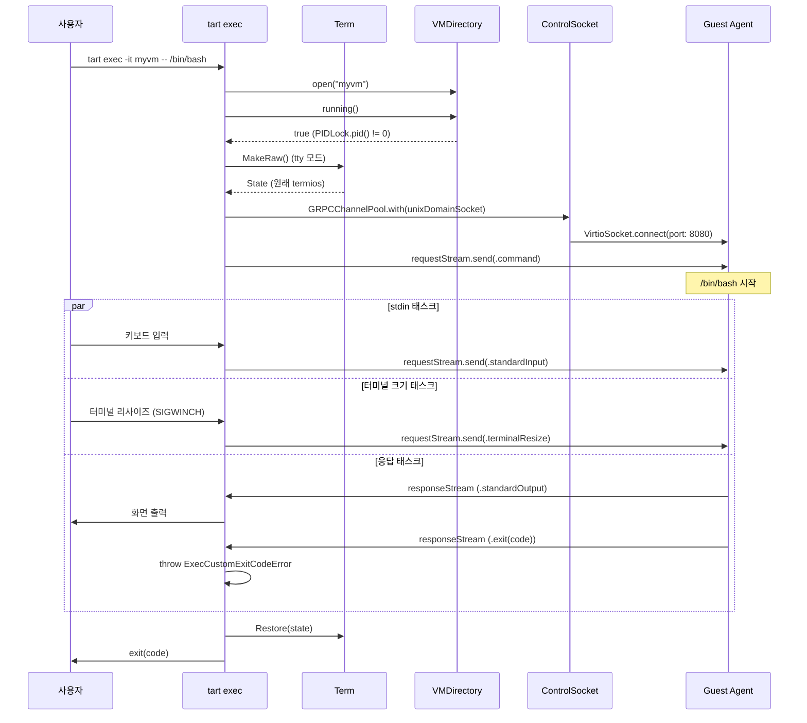

# 16. Guest Agent & Exec 심화

## 개요

Tart의 Guest Agent 시스템은 호스트 macOS에서 게스트 VM 내부의 명령을 원격 실행할 수 있게 해준다.
이 시스템은 `tart exec` 커맨드를 통해 사용되며, Unix 도메인 소켓 기반의 gRPC 통신으로 구현된다.
Guest Agent가 게스트 VM 내부에서 실행되고, 호스트의 Tart CLI가 gRPC 클라이언트로 동작한다.

핵심 구성 요소:
1. **Exec 커맨드** (`Commands/Exec.swift`): gRPC 클라이언트 - 호스트측 진입점
2. **ControlSocket** (`ControlSocket.swift`): VM의 VirtioSocket과 Unix 소켓을 프록시
3. **Term** (`Term.swift`): 터미널 raw 모드 전환 및 크기 조회
4. **AgentResolver** (`MACAddressResolver/AgentResolver.swift`): Guest Agent를 통한 IP 해석

---

## 전체 아키텍처

```
호스트 macOS                               게스트 VM
+-------------------+                    +-------------------+
| tart exec         |                    | Tart Guest Agent  |
| (gRPC 클라이언트)  |                    | (gRPC 서버)       |
+-------------------+                    +-------------------+
         |                                        ^
         v                                        |
+-------------------+                    +-------------------+
| Unix 도메인 소켓   |<--- 프록시 --->    | VirtioSocket      |
| control.sock      |                    | Port 8080         |
+-------------------+                    +-------------------+
         ^
         |
+-------------------+
| ControlSocket     |
| (NIO 프록시)      |
+-------------------+
         ^
         |
+-------------------+
| Run 커맨드        |
| (VM 시작 시 생성)  |
+-------------------+
```

### 통신 경로 상세

```
tart exec myvm -- ls -la

  1) Exec.run()
     ├── VMStorageLocal.open("myvm")  →  VMDirectory
     ├── vmDir.running() 확인          →  PIDLock 기반
     └── GRPCChannelPool.with(unixDomainSocket: "control.sock")
         └── AgentAsyncClient(channel)
             └── makeExecCall()
                 ├── requestStream.send(.command(...))
                 ├── requestStream.send(.standardInput(...))
                 └── responseStream에서 stdout/stderr/exit 수신

  내부 프록시 (ControlSocket):
     Unix Socket ←→ VZVirtioSocketDevice.connect(toPort: 8080) ←→ Guest Agent
```

---

## Exec 커맨드 상세

소스: `Sources/tart/Commands/Exec.swift`

### 구조체 정의

```swift
struct Exec: AsyncParsableCommand {
  static var configuration = CommandConfiguration(
    abstract: "Execute a command in a running VM",
    discussion: """
    Requires Tart Guest Agent running in a guest VM.
    Note that all non-vanilla Cirrus Labs VM images already have the
    Tart Guest Agent installed.
    """
  )

  @Flag(name: [.customShort("i")])
  var interactive: Bool = false

  @Flag(name: [.customShort("t")])
  var tty: Bool = false

  @Argument(help: "VM name", completion: .custom(completeLocalMachines))
  var name: String

  @Argument(parsing: .captureForPassthrough, help: "Command to execute")
  var command: [String]
}
```

| 옵션 | 짧은 이름 | 설명 |
|------|----------|------|
| `--interactive` | `-i` | 호스트의 표준 입력을 원격 명령에 연결 |
| `--tty` | `-t` | 원격 의사 터미널(PTY) 할당 |
| `name` | - | 대상 VM 이름 (위치 인자) |
| `command` | - | 실행할 명령과 인자 (passthrough 파싱) |

**사용 예시:**
```bash
tart exec myvm -- ls -la /tmp
tart exec -it myvm -- /bin/bash
tart exec myvm -- cat < input.txt
```

### run() 메서드 - 실행 흐름

소스: `Sources/tart/Commands/Exec.swift` 30-86행

```swift
func run() async throws {
  // macOS 14 이상만 지원
  if #unavailable(macOS 14) {
    throw RuntimeError.Generic(
      "\"tart exec\" is only available on macOS 14 (Sonoma) or newer"
    )
  }

  // VM 디렉토리 열기
  let vmDir = try VMStorageLocal().open(name)

  // VM 실행 상태 확인
  if try !vmDir.running() {
    throw RuntimeError.VMNotRunning(name)
  }

  // gRPC 이벤트 루프 그룹 생성
  let group = MultiThreadedEventLoopGroup(numberOfThreads: 1)
  defer { try! group.syncShutdownGracefully() }

  // Unix 소켓 경로 104바이트 제한 우회
  if let baseURL = vmDir.controlSocketURL.baseURL {
    FileManager.default.changeCurrentDirectoryPath(baseURL.path())
  }

  // gRPC 채널 생성
  let channel = try GRPCChannelPool.with(
    target: .unixDomainSocket(vmDir.controlSocketURL.relativePath),
    transportSecurity: .plaintext,
    eventLoopGroup: group,
  )
  defer { try! channel.close().wait() }

  // PTY 요청 시 터미널을 raw 모드로 전환
  var state: State? = nil
  if tty && Term.IsTerminal() {
    state = try Term.MakeRaw()
  }
  defer {
    if let state { try! Term.Restore(state) }
  }

  // 명령 실행
  do {
    try await execute(channel)
  } catch let error as GRPCConnectionPoolError {
    throw RuntimeError.Generic(
      "Failed to connect to the VM using its control socket: "
      + "\(error.localizedDescription), is the Tart Guest Agent running?"
    )
  }
}
```

### macOS 14 제한 사항

```swift
if #unavailable(macOS 14) {
  throw RuntimeError.Generic(
    "\"tart exec\" is only available on macOS 14 (Sonoma) or newer"
  )
}
```

`tart exec`는 macOS 14 (Sonoma) 이상에서만 사용 가능하다.
이유는 `withThrowingDiscardingTaskGroup`이 macOS 14에서 도입된 Swift 5.9 기능이기 때문이다.
또한 ControlSocket 자체도 `@available(macOS 14, *)` 어노테이션이 붙어 있다.

### Unix 도메인 소켓 104바이트 제한

```swift
// Change the current working directory to a VM's base directory
// to work around Unix domain socket 104 byte limitation [1]
//
// [1]: https://blog.8-p.info/en/2020/06/11/unix-domain-socket-length/
if let baseURL = vmDir.controlSocketURL.baseURL {
  FileManager.default.changeCurrentDirectoryPath(baseURL.path())
}
```

Unix 도메인 소켓의 경로 제한은 `struct sockaddr_un`의 `sun_path` 필드 크기에서 비롯된다.
macOS에서는 104바이트로 제한된다. `~/.tart/vms/my-long-vm-name/control.sock` 같은 경로가
이 제한을 초과할 수 있다.

해결 방법: 작업 디렉토리를 VM 디렉토리로 변경하고 상대 경로(`control.sock`)를 사용한다.

```
절대 경로: /Users/username/.tart/vms/my-long-vm-name/control.sock
           ^^^^^^^^^^^^^^^^^^^^^^^^^^^^^^^^^^^^^^^^^^^^^^^^^^^^^^^^^^
           65자 이상 가능 → 제한 초과

상대 경로: control.sock (12자)
           chdir("/Users/username/.tart/vms/my-long-vm-name/")
```

VMDirectory에서의 controlSocketURL 정의도 이를 반영한다.

소스: `Sources/tart/VMDirectory.swift` 29-31행

```swift
var controlSocketURL: URL {
  URL(fileURLWithPath: "control.sock", relativeTo: baseURL)
}
```

`relativeTo:`를 사용하여 상대 URL을 생성한다. `baseURL` 프로퍼티가 base URL 역할을 하고,
`relativePath`가 `"control.sock"`만 반환하도록 한다.

### VM 실행 상태 확인

```swift
let vmDir = try VMStorageLocal().open(name)

if try !vmDir.running() {
  throw RuntimeError.VMNotRunning(name)
}
```

소스: `Sources/tart/VMDirectory.swift` 49-60행

```swift
func running() throws -> Bool {
  // PIDLock() 인스턴스화 실패는 주로 "tart delete"와의 경쟁(ENOENT)
  // 이 경우 "미실행"으로 보고해도 무방
  guard let lock = try? lock() else {
    return false
  }
  return try lock.pid() != 0
}
```

PIDLock의 `pid()` 메서드로 `config.json` 파일에 잠금을 걸고 있는 프로세스의 PID를 조회한다.
PID가 0이 아니면 VM이 실행 중이다. 이 메커니즘은 17-locking.md에서 자세히 다룬다.

---

## gRPC 프로토콜

Tart는 `Cirruslabs_TartGuestAgent_Grpc_Swift` 패키지를 사용한다.
이 패키지는 Tart Guest Agent의 gRPC 서비스 정의를 Swift 코드로 생성한 것이다.

### AgentAsyncClient

소스: `Sources/tart/Commands/Exec.swift` 88-90행

```swift
let agentAsyncClient = AgentAsyncClient(channel: channel)
let execCall = agentAsyncClient.makeExecCall()
```

`AgentAsyncClient`는 gRPC 생성 코드에서 제공하는 비동기 클라이언트이다.
`makeExecCall()`은 양방향 스트리밍 RPC를 생성한다.

### 요청 메시지 구조

```swift
try await execCall.requestStream.send(.with {
  $0.type = .command(.with {
    $0.name = command[0]
    $0.args = Array(command.dropFirst(1))
    $0.interactive = interactive
    $0.tty = tty
    if tty {
      $0.terminalSize = .with {
        let (width, height) = try! Term.GetSize()
        $0.cols = UInt32(width)
        $0.rows = UInt32(height)
      }
    }
  })
})
```

요청 메시지 타입:

```
ExecRequest (oneof type)
├── .command(CommandRequest)
│     ├── name: String          # 실행할 명령 이름 (command[0])
│     ├── args: [String]        # 명령 인자 (command[1:])
│     ├── interactive: Bool     # stdin 연결 여부
│     ├── tty: Bool             # PTY 할당 여부
│     └── terminalSize          # 터미널 크기 (tty일 때만)
│           ├── cols: UInt32
│           └── rows: UInt32
├── .standardInput(IOChunk)
│     └── data: Data            # stdin 데이터
└── .terminalResize(TerminalSize)
      ├── cols: UInt32
      └── rows: UInt32
```

### 응답 메시지 구조

```
ExecResponse (oneof type)
├── .standardOutput(IOChunk)
│     └── data: Data            # stdout 데이터
├── .standardError(IOChunk)
│     └── data: Data            # stderr 데이터
└── .exit(Exit)
      └── code: Int32           # 종료 코드
```

---

## 스트리밍 구현 상세

소스: `Sources/tart/Commands/Exec.swift` 88-222행

`execute()` 메서드는 `withThrowingTaskGroup`을 사용하여 세 개의 병렬 태스크를 실행한다.

```
+--------------------------------------------------+
|           withThrowingTaskGroup                    |
|                                                    |
|  Task 1: stdin 스트리밍                             |
|    FileHandle.standardInput → requestStream        |
|                                                    |
|  Task 2: 터미널 크기 스트리밍                        |
|    SIGWINCH → requestStream.terminalResize          |
|                                                    |
|  Task 3: 응답 처리                                  |
|    responseStream → FileHandle.standardOutput       |
|                   → FileHandle.standardError        |
|                   → ExecCustomExitCodeError          |
+--------------------------------------------------+
```

### Task 1: stdin 스트리밍

```swift
if interactive {
  let stdinStream = AsyncThrowingStream<Data, Error> { continuation in
    let handle = FileHandle.standardInput

    if isRegularFile(handle.fileDescriptor) {
      // 일반 파일 (입력 리디렉션) → 청크 단위 읽기
      while true {
        do {
          let data = try handle.read(upToCount: 64 * 1024)
          if let data = data {
            continuation.yield(data)
          } else {
            continuation.finish()
            break
          }
        } catch (let error) {
          continuation.finish(throwing: error)
          break
        }
      }
    } else {
      // 터미널/파이프 → readabilityHandler
      handle.readabilityHandler = { handle in
        let data = handle.availableData
        if data.isEmpty {
          continuation.finish()
        } else {
          continuation.yield(data)
        }
      }
    }
  }

  group.addTask {
    for try await stdinData in stdinStream {
      try await execCall.requestStream.send(.with {
        $0.type = .standardInput(.with {
          $0.data = stdinData
        })
      })
    }

    // EOF 시그널
    try await execCall.requestStream.send(.with {
      $0.type = .standardInput(.with {
        $0.data = Data()  // 빈 데이터 = EOF
      })
    })
  }
}
```

**왜 두 가지 stdin 읽기 방식이 필요한가?**

| 입력 소스 | 감지 방법 | 읽기 방식 |
|----------|----------|----------|
| 터미널/파이프 | `!isRegularFile(fd)` | `readabilityHandler` (이벤트 기반) |
| 일반 파일 (< 리디렉션) | `isRegularFile(fd)` | `read(upToCount:)` (동기 읽기) |

```swift
private func isRegularFile(_ fileDescriptor: Int32) -> Bool {
  var stat = stat()
  if fstat(fileDescriptor, &stat) != 0 {
    return false
  }
  return (stat.st_mode & S_IFMT) == S_IFREG
}
```

일반 파일은 `readabilityHandler`에서 readability 이벤트를 받지 못한다.
파일 전체가 즉시 읽기 가능한 상태이기 때문이다.
따라서 파일인 경우 64KB 청크 단위로 직접 읽는다.

소스 코드의 주석이 이를 설명한다:
> Standard input can be a regular file when input redirection (<) is used,
> in which case the handle won't receive any new readability events

### Task 2: 터미널 크기 스트리밍 (SIGWINCH)

```swift
signal(SIGWINCH, SIG_IGN)
let sigwinchSrc = DispatchSource.makeSignalSource(signal: SIGWINCH)
sigwinchSrc.activate()

if tty {
  let terminalDimensionsStream = AsyncStream { continuation in
    sigwinchSrc.setEventHandler {
      continuation.yield(try! Term.GetSize())
    }
  }

  group.addTask {
    for await (width, height) in terminalDimensionsStream {
      try await execCall.requestStream.send(.with {
        $0.type = .terminalResize(.with {
          $0.cols = UInt32(width)
          $0.rows = UInt32(height)
        })
      })
    }
  }
}
```

**SIGWINCH 처리 흐름:**

```
호스트 터미널 크기 변경
      │
      v
  SIGWINCH 시그널 발생
      │
      v
  DispatchSource.makeSignalSource(signal: SIGWINCH)
      │
      v
  sigwinchSrc.setEventHandler → Term.GetSize()
      │
      v
  AsyncStream continuation.yield((width, height))
      │
      v
  for await (width, height) in terminalDimensionsStream
      │
      v
  requestStream.send(.terminalResize(...))
      │
      v
  Guest Agent가 게스트 PTY 크기 변경
```

`signal(SIGWINCH, SIG_IGN)`으로 기본 시그널 핸들러를 무시하고,
`DispatchSource`로 시그널을 캡처한다. 이렇게 하면 시그널을 비동기 스트림으로 변환할 수 있다.

### Task 3: 응답 처리

```swift
group.addTask {
  for try await response in execCall.responseStream {
    switch response.type {
    case .standardOutput(let ioChunk):
      try FileHandle.standardOutput.write(contentsOf: ioChunk.data)
    case .standardError(let ioChunk):
      try FileHandle.standardError.write(contentsOf: ioChunk.data)
    case .exit(let exit):
      throw ExecCustomExitCodeError(exitCode: exit.code)
    default:
      continue
    }
  }
}
```

응답 스트림에서 stdout/stderr 데이터를 호스트의 해당 파일 핸들에 직접 출력한다.
`exit` 이벤트가 도착하면 `ExecCustomExitCodeError`를 던져서 작업을 종료한다.

### 태스크 그룹 오류 전파

```swift
while !group.isEmpty {
  do {
    try await group.next()
  } catch {
    group.cancelAll()
    throw error
  }
}
```

어떤 태스크에서든 에러가 발생하면 모든 태스크를 취소하고 에러를 전파한다.
`exit` 이벤트의 `ExecCustomExitCodeError`도 여기서 전파된다.

---

## ExecCustomExitCodeError

소스: `Sources/tart/Commands/Exec.swift` 7-9행

```swift
struct ExecCustomExitCodeError: Error {
  let exitCode: Int32
}
```

Guest 명령의 종료 코드를 호스트 프로세스의 종료 코드로 전달하는 메커니즘이다.

소스: `Sources/tart/Root.swift` 96-99행

```swift
// Not an error, just a custom exit code from "tart exec"
if let execCustomExitCodeError = error as? ExecCustomExitCodeError {
  OTel.shared.flush()
  Foundation.exit(execCustomExitCodeError.exitCode)
}
```

Root.swift에서 이 에러를 특별히 처리하여, 일반적인 에러 메시지 없이 해당 종료 코드로 프로세스를 종료한다.
이를 통해 `tart exec myvm -- some-command`의 종료 코드가 `some-command`의 종료 코드와 동일해진다.

```
게스트 VM: ls /nonexistent → exit code 1
     │
     v
gRPC response: .exit(code: 1)
     │
     v
ExecCustomExitCodeError(exitCode: 1)
     │
     v
Root.swift: Foundation.exit(1)
     │
     v
호스트: tart exec의 exit code = 1
```

---

## ControlSocket - NIO 프록시

소스: `Sources/tart/ControlSocket.swift`

ControlSocket은 Unix 도메인 소켓과 VM의 VirtioSocket 사이의 양방향 프록시이다.

### 클래스 정의

```swift
@available(macOS 14, *)
class ControlSocket {
  let controlSocketURL: URL
  let vmPort: UInt32
  let eventLoopGroup = MultiThreadedEventLoopGroup(numberOfThreads: 1)
  let logger: os.Logger

  init(_ controlSocketURL: URL, vmPort: UInt32 = 8080) {
    self.controlSocketURL = controlSocketURL
    self.vmPort = vmPort
  }
}
```

| 프로퍼티 | 기본값 | 설명 |
|---------|--------|------|
| `controlSocketURL` | - | Unix 소켓 파일 경로 |
| `vmPort` | 8080 | VirtioSocket 포트 번호 |
| `eventLoopGroup` | 1 스레드 | NIO 이벤트 루프 |

### run() - 서버 시작

```swift
func run() async throws {
  // 이전 소켓 파일 정리
  try? FileManager.default.removeItem(atPath: controlSocketURL.path())

  // 104바이트 제한 우회
  if let baseURL = controlSocketURL.baseURL {
    FileManager.default.changeCurrentDirectoryPath(baseURL.path())
  }

  // NIO 서버 부트스트랩
  let serverChannel = try await ServerBootstrap(group: eventLoopGroup)
    .bind(unixDomainSocketPath: controlSocketURL.relativePath) { childChannel in
      childChannel.eventLoop.makeCompletedFuture {
        return try NIOAsyncChannel<ByteBuffer, ByteBuffer>(
          wrappingChannelSynchronously: childChannel
        )
      }
    }

  // 클라이언트 연결 수락
  try await withThrowingDiscardingTaskGroup { group in
    try await serverChannel.executeThenClose { serverInbound in
      for try await clientChannel in serverInbound {
        group.addTask {
          try await self.handleClient(clientChannel)
        }
      }
    }
  }
}
```

### handleClient() - 양방향 프록시

```swift
func handleClient(_ clientChannel: NIOAsyncChannel<ByteBuffer, ByteBuffer>) async throws {
  try await clientChannel.executeThenClose { clientInbound, clientOutbound in
    // VM의 VirtioSocket에 연결
    guard let vmConnection = try await vm?.connect(toPort: self.vmPort) else {
      throw RuntimeError.VMSocketFailed(self.vmPort, "VM is not running")
    }

    // VM 연결을 NIO 채널로 감싸기
    let vmChannel = try await ClientBootstrap(group: eventLoopGroup)
      .withConnectedSocket(vmConnection.fileDescriptor) { childChannel in
        childChannel.eventLoop.makeCompletedFuture {
          try NIOAsyncChannel<ByteBuffer, ByteBuffer>(
            wrappingChannelSynchronously: childChannel
          )
        }
      }

    // 양방향 프록시
    try await vmChannel.executeThenClose { (vmInbound, vmOutbound) in
      try await withThrowingDiscardingTaskGroup { group in
        // 클라이언트 → VM
        group.addTask {
          for try await message in clientInbound {
            try await vmOutbound.write(message)
          }
        }
        // VM → 클라이언트
        group.addTask {
          for try await message in vmInbound {
            try await clientOutbound.write(message)
          }
        }
      }
    }
  }
}
```

프록시 구조:

```
tart exec (gRPC 클라이언트)
       |
       | Unix Domain Socket
       v
+-------------------------------+
|       ControlSocket           |
|                               |
|  clientInbound  → vmOutbound  |  (클라이언트 → VM)
|  vmInbound      → clientOutbound| (VM → 클라이언트)
|                               |
+-------------------------------+
       |
       | VZVirtioSocketDevice.connect(toPort: 8080)
       v
Guest Agent (gRPC 서버, 포트 8080)
```

`vm?.connect(toPort:)`는 전역 변수 `vm`을 통해 접근하는 `VZVirtioSocketDevice`의 연결이다.
소스: `Sources/tart/Commands/Run.swift` 10행에서 전역 변수로 선언되어 있다.

```swift
var vm: VM?
```

### Run.swift에서의 ControlSocket 시작

소스: `Sources/tart/Commands/Run.swift` 516-520행

```swift
if #available(macOS 14, *) {
  Task {
    try await ControlSocket(vmDir.controlSocketURL).run()
  }
}
```

VM 실행 시 백그라운드 Task에서 ControlSocket 프록시를 시작한다.
macOS 14 이상에서만 사용 가능하다.

---

## Term.swift - 터미널 제어

소스: `Sources/tart/Term.swift`

### State 구조체

```swift
struct State {
  fileprivate let termios: termios
}
```

터미널의 원래 설정을 저장하여 복원할 때 사용한다.
`fileprivate`으로 외부에서 직접 접근할 수 없다.

### IsTerminal() - 터미널 여부 확인

```swift
static func IsTerminal() -> Bool {
  var termios = termios()
  return tcgetattr(FileHandle.standardInput.fileDescriptor, &termios) != -1
}
```

`tcgetattr`가 성공하면 표준 입력이 터미널이다. 파이프나 파일이면 실패한다.

### MakeRaw() - Raw 모드 전환

```swift
static func MakeRaw() throws -> State {
  var termiosOrig = termios()

  var ret = tcgetattr(FileHandle.standardInput.fileDescriptor, &termiosOrig)
  if ret == -1 {
    throw RuntimeError.TerminalOperationFailed(...)
  }

  var termiosRaw = termiosOrig
  cfmakeraw(&termiosRaw)

  ret = tcsetattr(FileHandle.standardInput.fileDescriptor, TCSANOW, &termiosRaw)
  if ret == -1 {
    throw RuntimeError.TerminalOperationFailed(...)
  }

  return State(termios: termiosOrig)
}
```

**왜 Raw 모드가 필요한가?**

일반(cooked) 모드에서는 터미널 드라이버가 입력을 줄 단위로 버퍼링하고
Ctrl+C, Ctrl+Z 같은 특수 키를 시그널로 변환한다.
Raw 모드에서는 모든 입력이 즉시 바이트 단위로 전달된다.

```
Cooked 모드:
  키 입력: h, e, l, l, o, Enter
  프로그램에 전달: "hello\n" (줄 단위)
  Ctrl+C → SIGINT (프로그램에 전달 안 됨)

Raw 모드:
  키 입력: h
  프로그램에 전달: 'h' (즉시)
  키 입력: Ctrl+C
  프로그램에 전달: '\x03' (바이트로 전달)
```

`tart exec -t`로 원격 셸을 사용할 때, Ctrl+C가 호스트의 Tart가 아닌
게스트 VM의 프로세스에 전달되어야 하므로 raw 모드가 필수이다.

`cfmakeraw()`는 POSIX 함수로, termios 구조체를 raw 모드로 설정한다.

### Restore() - 터미널 복원

```swift
static func Restore(_ state: State) throws {
  var termios = state.termios
  let ret = tcsetattr(FileHandle.standardInput.fileDescriptor, TCSANOW, &termios)
  if ret == -1 {
    throw RuntimeError.TerminalOperationFailed(...)
  }
}
```

`MakeRaw()`에서 반환된 `State`를 사용하여 원래 터미널 설정으로 복원한다.
`defer` 블록에서 호출되어 정상/비정상 종료 모두에서 복원이 보장된다.

### GetSize() - 터미널 크기 조회

```swift
static func GetSize() throws -> (width: UInt16, height: UInt16) {
  var winsize = winsize()

  guard ioctl(STDOUT_FILENO, TIOCGWINSZ, &winsize) != -1 else {
    throw RuntimeError.TerminalOperationFailed(...)
  }

  return (width: winsize.ws_col, height: winsize.ws_row)
}
```

`ioctl(TIOCGWINSZ)`로 현재 터미널의 열(columns)과 행(rows) 수를 조회한다.
초기 명령 전송 시와 SIGWINCH 발생 시 호출된다.

---

## AgentResolver - Guest Agent를 통한 IP 해석

소스: `Sources/tart/MACAddressResolver/AgentResolver.swift`

`tart ip` 커맨드에서 Guest Agent를 통해 VM의 IP 주소를 조회하는 기능이다.

```swift
class AgentResolver {
  static func ResolveIP(_ controlSocketPath: String) async throws -> IPv4Address? {
    do {
      return try await resolveIP(controlSocketPath)
    } catch let error as GRPCConnectionPoolError {
      return nil  // Guest Agent가 없으면 nil 반환
    }
  }

  private static func resolveIP(_ controlSocketPath: String) async throws -> IPv4Address? {
    let group = MultiThreadedEventLoopGroup(numberOfThreads: 1)
    defer { try! group.syncShutdownGracefully() }

    let channel = try GRPCChannelPool.with(
      target: .unixDomainSocket(controlSocketPath),
      transportSecurity: .plaintext,
      eventLoopGroup: group,
    )
    defer { try! channel.close().wait() }

    let callOptions = CallOptions(timeLimit: .timeout(.seconds(1)))
    let agentAsyncClient = AgentAsyncClient(channel: channel)
    let resolveIPCall = agentAsyncClient.makeResolveIpCall(
      ResolveIPRequest(), callOptions: callOptions
    )

    let response = try await resolveIPCall.response
    return IPv4Address(response.ip)
  }
}
```

`ResolveIP` RPC는 1초 타임아웃이 설정되어 있다. Guest Agent가 설치되지 않은 VM에서는
연결이 실패하지만, `GRPCConnectionPoolError`를 잡아서 `nil`을 반환한다.
이를 통해 다른 IP 해석 방법(DHCP 리스 파싱 등)으로 fallback할 수 있다.

---

## 전체 시퀀스 다이어그램



---

## 설계 결정과 "왜(Why)" 분석

### 왜 Unix 도메인 소켓 + gRPC인가?

VirtioSocket은 VM과의 직접 통신 채널이지만, 호스트의 여러 프로세스가 동시에 접근해야 한다
(`tart exec`, `tart ip` 등). Unix 도메인 소켓으로 프록시하면:
1. 여러 클라이언트가 동시에 연결 가능
2. 표준 gRPC 도구 사용 가능
3. 소켓 파일로 접근 제어 가능

### 왜 withThrowingTaskGroup을 사용하는가?

stdin, SIGWINCH, 응답 처리가 모두 독립적이면서 동시에 실행되어야 한다.
`withThrowingTaskGroup`은 구조적 동시성(structured concurrency)을 제공하여:
1. 한 태스크의 에러가 전체 그룹에 전파
2. `cancelAll()`로 모든 태스크를 안전하게 종료
3. 모든 태스크가 완료될 때까지 자동 대기

### 왜 stdin에 AsyncThrowingStream을 사용하는가?

`readabilityHandler`는 콜백 기반 API이다. Swift의 구조적 동시성과 통합하려면
`AsyncThrowingStream`으로 변환해야 한다. `continuation`을 통해 콜백에서
async/await 세계로 데이터를 전달한다.

### 왜 빈 Data를 EOF 시그널로 사용하는가?

```swift
try await execCall.requestStream.send(.with {
  $0.type = .standardInput(.with {
    $0.data = Data()  // EOF
  })
})
```

gRPC 스트림에는 "반쪽 닫기(half-close)" 개념이 있지만, 여기서는 프로토콜 레벨에서
빈 데이터를 EOF로 약속한다. Guest Agent가 빈 데이터를 수신하면 stdin을 닫는다.
이 방식은 ssh의 `~.` 이스케이프와 유사한 대역 내(in-band) 시그널링이다.

---

## 핵심 소스 파일 참조

| 파일 | 경로 | 역할 |
|------|------|------|
| Exec.swift | `Sources/tart/Commands/Exec.swift` | Exec 커맨드 및 gRPC 클라이언트 |
| ControlSocket.swift | `Sources/tart/ControlSocket.swift` | Unix/VirtioSocket 프록시 |
| Term.swift | `Sources/tart/Term.swift` | 터미널 raw 모드 및 크기 |
| AgentResolver.swift | `Sources/tart/MACAddressResolver/AgentResolver.swift` | IP 해석 |
| Run.swift | `Sources/tart/Commands/Run.swift` | ControlSocket 시작 (516-520행) |
| VMDirectory.swift | `Sources/tart/VMDirectory.swift` | controlSocketURL, running() |
| Root.swift | `Sources/tart/Root.swift` | ExecCustomExitCodeError 처리 |
