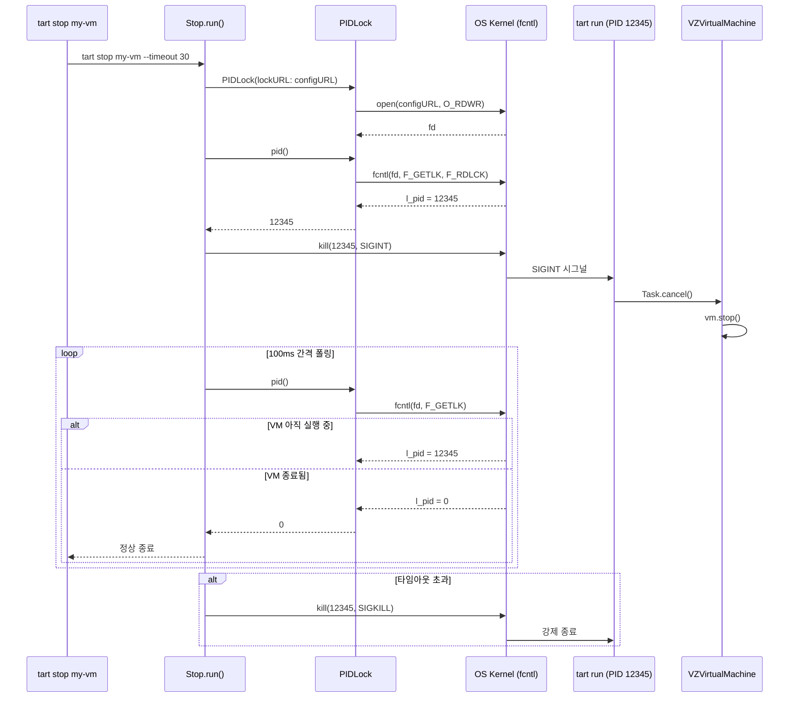

# 17. 잠금과 동시성 심화

## 개요

Tart는 다수의 CLI 프로세스가 동시에 같은 VM 스토리지에 접근할 수 있는 환경에서 동작한다.
예를 들어, 한 터미널에서 `tart run my-vm`을 실행하는 동안 다른 터미널에서 `tart stop my-vm`이나
`tart delete my-vm`을 실행할 수 있다. CI/CD 환경에서는 여러 작업이 동시에 `tart clone`과
`tart pull`을 수행하기도 한다.

이러한 동시 접근을 안전하게 처리하기 위해 Tart는 **두 가지 파일 잠금 메커니즘**을 사용한다:

1. **FileLock** -- `flock(2)` 기반 배타적 잠금
2. **PIDLock** -- `fcntl(2)` 기반 프로세스 수준 잠금

이 문서에서는 다음 항목을 다룬다:

1. FileLock 구현 상세
2. PIDLock 구현 상세
3. flock vs fcntl 비교
4. 잠금 사용 패턴별 분석 (Clone, Pull, Run, GC, Delete, Push, Import)
5. VMDirectory의 상태 판별과 PIDLock
6. Swift async/await 동시성 패턴
7. 설계 철학: 왜 두 가지 잠금을 사용하는가

---

## 1. FileLock (flock 기반)

```
파일: Sources/tart/FileLock.swift
```

### 1.1 전체 코드

```swift
import Foundation
import System

enum FileLockError: Error, Equatable {
  case Failed(_ message: String)
  case AlreadyLocked
}

class FileLock {
  let url: URL
  let fd: Int32

  init(lockURL: URL) throws {
    url = lockURL
    fd = open(lockURL.path, 0)
  }

  deinit {
    close(fd)
  }

  func trylock() throws -> Bool {
    try flockWrapper(LOCK_EX | LOCK_NB)
  }

  func lock() throws {
    _ = try flockWrapper(LOCK_EX)
  }

  func unlock() throws {
    _ = try flockWrapper(LOCK_UN)
  }

  func flockWrapper(_ operation: Int32) throws -> Bool {
    let ret = flock(fd, operation)
    if ret != 0 {
      let details = Errno(rawValue: CInt(errno))

      if (operation & LOCK_NB) != 0 && details == .wouldBlock {
        return false
      }

      throw FileLockError.Failed("failed to lock \(url): \(details)")
    }
    return true
  }
}
```

### 1.2 동작 원리

`FileLock`은 BSD `flock(2)` 시스템 콜을 사용한다.

```
flock(2) 시스템 콜
    |
    +-- LOCK_EX: 배타적 잠금 (exclusive lock)
    |            한 번에 하나의 프로세스만 획득 가능
    |
    +-- LOCK_NB: 비차단 (non-blocking)
    |            잠금을 즉시 획득할 수 없으면 대기하지 않고 반환
    |
    +-- LOCK_UN: 잠금 해제
    |
    +-- LOCK_EX | LOCK_NB: 배타적 + 비차단
                           trylock()에서 사용
```

### 1.3 trylock() vs lock()

```
trylock()                          lock()
    |                                  |
    v                                  v
flock(fd, LOCK_EX | LOCK_NB)      flock(fd, LOCK_EX)
    |                                  |
    +-- 성공: return true              +-- 성공: return (무시)
    |                                  |
    +-- EWOULDBLOCK: return false      +-- 다른 프로세스가 잠금 보유:
    |   (이미 잠겨 있음)                |   무한 대기 (블로킹)
    |                                  |
    +-- 기타 에러: throw               +-- 기타 에러: throw
```

`trylock()`은 잠금을 즉시 시도하고, 이미 다른 프로세스가 보유하고 있으면 `false`를 반환한다.
`lock()`은 잠금을 획득할 때까지 블로킹한다.

### 1.4 생명주기

```swift
init(lockURL: URL) throws {
  url = lockURL
  fd = open(lockURL.path, 0)    // 파일 열기 (읽기 전용)
}

deinit {
  close(fd)                      // 파일 디스크립터 닫기 = 잠금 자동 해제
}
```

`flock(2)` 기반 잠금은 **파일 디스크립터가 닫히면 자동으로 해제**된다.
따라서 `FileLock` 인스턴스가 소멸(deinit)되면 잠금도 함께 풀린다.
이는 프로세스가 비정상 종료해도 잠금이 자동 해제되는 안전장치 역할을 한다.

### 1.5 EWOULDBLOCK 처리

`flockWrapper` 메서드에서 핵심 에러 처리:

```swift
if (operation & LOCK_NB) != 0 && details == .wouldBlock {
  return false
}
```

`LOCK_NB` 플래그가 설정된 상태에서 `errno`가 `EWOULDBLOCK`(= `Errno.wouldBlock`)이면,
이는 "이미 잠겨 있음"을 의미하므로 에러를 던지지 않고 `false`를 반환한다.
다른 모든 에러(`EBADF`, `EINTR` 등)는 `FileLockError.Failed`로 전파된다.

---

## 2. PIDLock (fcntl 기반)

```
파일: Sources/tart/PIDLock.swift
```

### 2.1 전체 코드

```swift
import Foundation
import System

class PIDLock {
  let url: URL
  let fd: Int32

  init(lockURL: URL) throws {
    url = lockURL
    fd = open(lockURL.path, O_RDWR)
    if fd == -1 {
      let details = Errno(rawValue: CInt(errno))
      throw RuntimeError.PIDLockMissing("failed to open lock file \(url): \(details)")
    }
  }

  deinit {
    close(fd)
  }

  func trylock() throws -> Bool {
    let (locked, _) = try lockWrapper(F_SETLK, F_WRLCK, "failed to lock \(url)")
    return locked
  }

  func lock() throws {
    _ = try lockWrapper(F_SETLKW, F_WRLCK, "failed to lock \(url)")
  }

  func unlock() throws {
    _ = try lockWrapper(F_SETLK, F_UNLCK, "failed to unlock \(url)")
  }

  func pid() throws -> pid_t {
    let (_, result) = try lockWrapper(F_GETLK, F_RDLCK, "failed to get lock \(url) status")
    return result.l_pid
  }

  func lockWrapper(_ operation: Int32, _ type: Int32, _ message: String) throws -> (Bool, flock) {
    var result = flock(l_start: 0, l_len: 0, l_pid: 0, l_type: Int16(type), l_whence: Int16(SEEK_SET))

    let ret = fcntl(fd, operation, &result)
    if ret != 0 {
      if operation == F_SETLK && errno == EAGAIN {
        return (false, result)
      }

      let details = Errno(rawValue: CInt(errno))
      throw RuntimeError.PIDLockFailed("\(message): \(details)")
    }

    return (true, result)
  }
}
```

### 2.2 동작 원리

`PIDLock`은 POSIX `fcntl(2)` 시스템 콜을 사용한다.

```
fcntl(2) 파일 잠금
    |
    +-- F_SETLK: 비차단 잠금 설정 (trylock)
    |            실패 시 즉시 반환 (EAGAIN)
    |
    +-- F_SETLKW: 차단 잠금 설정 (lock)
    |             잠금을 획득할 때까지 대기
    |
    +-- F_GETLK: 잠금 상태 조회 (pid)
    |            잠금이 있으면 해당 프로세스의 PID를 반환
    |
    +-- F_WRLCK: 쓰기 잠금 (배타적)
    +-- F_RDLCK: 읽기 잠금 (F_GETLK 쿼리용)
    +-- F_UNLCK: 잠금 해제
```

### 2.3 flock 구조체

```swift
var result = flock(
  l_start: 0,            // 잠금 시작 오프셋: 파일 시작
  l_len: 0,              // 잠금 길이: 0 = 파일 전체
  l_pid: 0,              // PID (F_GETLK에서 채워짐)
  l_type: Int16(type),   // 잠금 타입: F_WRLCK, F_RDLCK, F_UNLCK
  l_whence: Int16(SEEK_SET)  // 기준점: 파일 시작
)
```

`l_start=0`, `l_len=0`, `l_whence=SEEK_SET` 조합은 **파일 전체**에 대한 잠금을 의미한다.

### 2.4 pid() 메서드 -- PIDLock의 핵심 기능

```swift
func pid() throws -> pid_t {
  let (_, result) = try lockWrapper(F_GETLK, F_RDLCK, "failed to get lock \(url) status")
  return result.l_pid
}
```

`F_GETLK` 명령은 다음과 같이 동작한다:

```
F_GETLK + F_RDLCK 호출
    |
    +-- 파일에 쓰기 잠금이 걸려 있는 경우:
    |       result.l_type = F_WRLCK
    |       result.l_pid = 잠금을 보유한 프로세스의 PID
    |       return l_pid (0이 아닌 값)
    |
    +-- 파일에 잠금이 없는 경우:
            result.l_type = F_UNLCK
            result.l_pid = 0
            return 0
```

이 메서드를 통해 "어떤 프로세스가 이 VM을 실행 중인지" PID를 알 수 있다.
이것이 바로 `flock`이 아닌 `fcntl`을 사용하는 핵심 이유이다.

### 2.5 O_RDWR 열기 모드

```swift
fd = open(lockURL.path, O_RDWR)
```

`FileLock`은 `open(lockURL.path, 0)` (읽기 전용)으로 여는 반면,
`PIDLock`은 `O_RDWR` (읽기/쓰기)로 연다.
`fcntl(2)`의 `F_WRLCK` 잠금은 쓰기 모드로 열린 파일 디스크립터가 필요하기 때문이다.

### 2.6 초기화 실패 처리

```swift
if fd == -1 {
  let details = Errno(rawValue: CInt(errno))
  throw RuntimeError.PIDLockMissing("failed to open lock file \(url): \(details)")
}
```

`PIDLock` 초기화 시 파일이 존재하지 않으면(`ENOENT`) `PIDLockMissing` 에러를 던진다.
이는 `VMDirectory.running()` 메서드에서 graceful하게 처리된다:

```swift
// Sources/tart/VMDirectory.swift 49~60행
func running() throws -> Bool {
  guard let lock = try? lock() else {
    return false
  }
  return try lock.pid() != 0
}
```

`tart delete`와 동시에 `tart list`가 실행될 때, 삭제된 VM의 config.json이 사라져
`PIDLock()` 초기화가 실패할 수 있다. 이때 `try?`로 에러를 무시하고 "실행 중이 아님"으로 처리한다.

---

## 3. flock vs fcntl 비교

```
+==================+===========================+============================+
|       항목        |    flock(2) - FileLock    |     fcntl(2) - PIDLock     |
+==================+===========================+============================+
| POSIX 표준       | BSD 확장 (비표준)          | POSIX 표준                  |
+------------------+---------------------------+----------------------------+
| 잠금 단위        | 파일 전체                  | 바이트 범위 (여기서는 전체)  |
+------------------+---------------------------+----------------------------+
| PID 조회 가능    | X                          | O (F_GETLK)               |
+------------------+---------------------------+----------------------------+
| 파일 열기 모드   | 읽기 전용 가능             | 쓰기 잠금시 O_RDWR 필요    |
+------------------+---------------------------+----------------------------+
| fork() 시 상속   | 공유 (부모-자식 공유)      | 독립 (프로세스별 별도)      |
+------------------+---------------------------+----------------------------+
| close() 동작     | fd 단위 해제               | 프로세스의 같은 inode에     |
|                  |                            | 대한 모든 잠금 해제         |
|                  |                            | ("completely stupid         |
|                  |                            |  semantics")               |
+------------------+---------------------------+----------------------------+
| NFS 지원         | 제한적                     | 지원                       |
+------------------+---------------------------+----------------------------+
| Tart 용도        | 임시 디렉토리 GC 보호,     | VM 실행 상태 확인,          |
|                  | OCI Pull 동시성 제어,      | VM 삭제 보호               |
|                  | 전역 스토리지 잠금          |                            |
+==================+===========================+============================+
```

### fcntl의 "completely stupid semantics"

Tart의 `Run.swift`에서 이에 대한 경고 주석이 있다:

```swift
// Sources/tart/Commands/Run.swift 440~450행
// Lock the VM
//
// More specifically, lock the "config.json", because we can't lock
// directories with fcntl(2)-based locking and we better not interfere
// with the VM's disk and NVRAM, because they are opened (and even seem
// to be locked) directly by the Virtualization.Framework's process.
//
// Note that due to "completely stupid semantics"[1] of the fcntl-based
// file locking, we need to acquire the lock after we read the VM's
// configuration file, otherwise we will loose the lock.
//
// [1]: https://man.openbsd.org/fcntl
```

`fcntl(2)` 잠금은 같은 프로세스 내에서 같은 inode에 대해 어떤 파일 디스크립터라도
`close()`하면 **모든** 잠금이 해제된다. 따라서:

```
잘못된 순서:
1. PIDLock 획득 (config.json fd1에 F_WRLCK)
2. VMConfig(fromURL: configURL) -- 내부적으로 config.json을 열고 읽고 닫음
3. 닫는 순간 fd1의 잠금도 해제됨!  <-- 문제

올바른 순서 (Tart가 사용하는 방식):
1. VMConfig(fromURL: configURL) -- config.json 읽기 완료
2. PIDLock 획득 (config.json fd에 F_WRLCK)
3. 잠금 유지됨
```

---

## 4. 잠금 사용 패턴 분석

### 4.1 패턴 1: 임시 디렉토리 GC 보호 (FileLock)

**사용 커맨드**: Create, Clone, Import, Pull

```
[tart create]                    [tart의 GC 루틴]
    |                                |
    v                                v
1. tmpVMDir = VMDirectory.        Config().gc():
   temporary()                       |
    |                                v
2. FileLock(lockURL:              for entry in tartTmpDir:
   tmpVMDir.baseURL)                 |
    |                                v
3. lock() -- 배타적 잠금            FileLock(lockURL: entry)
    |                                |
4. VM 생성 작업...                   trylock()
    |                                |
5. localStorage.move()              +-- false: continue (건너뜀!)
    |                                |
6. (FileLock deinit ->              +-- true: removeItem()
    자동 해제)                               + unlock()
```

GC 루틴은 `Config().gc()`에서 실행된다:

```swift
// Sources/tart/Config.swift 28~39행
func gc() throws {
  for entry in try FileManager.default.contentsOfDirectory(
    at: tartTmpDir, includingPropertiesForKeys: [], options: []
  ) {
    let lock = try FileLock(lockURL: entry)
    if try !lock.trylock() {
      continue    // <-- 잠겨 있으면 건너뜀
    }

    try FileManager.default.removeItem(at: entry)
    try lock.unlock()
  }
}
```

이 패턴의 핵심:
- `trylock()`이 `false`를 반환하면 해당 임시 디렉토리는 **사용 중**이므로 삭제하지 않음
- `trylock()`이 `true`를 반환하면 아무도 사용하지 않으므로 안전하게 삭제
- GC는 Root.swift의 `main()`에서 **매 커맨드 실행 전**에 호출됨 (Pull, Clone 제외)

```swift
// Sources/tart/Root.swift 80~86행
if type(of: command) != type(of: Pull()) && type(of: command) != type(of: Clone()){
  do {
    try Config().gc()
  } catch {
    fputs("Failed to perform garbage collection: \(error)\n", stderr)
  }
}
```

### 4.2 패턴 2: OCI Pull 동시성 제어 (FileLock)

**사용 커맨드**: Pull (VMStorageOCI.pull())

```
[tart pull img:v1]               [tart pull img:v2]
    |                                |
    v                                v
1. hostDirectoryURL              1. hostDirectoryURL
   (같은 호스트 디렉토리)            (같은 호스트 디렉토리)
    |                                |
2. FileLock(lockURL:             2. FileLock(lockURL:
   hostDirectoryURL)                hostDirectoryURL)
    |                                |
3. trylock()                     3. trylock()
    |                                |
    +-- true: 즉시 진행              +-- false: "waiting for lock..."
    |                                |
4. 풀 작업 수행...                4. lock() -- 블로킹 대기
    |                                |
5. defer { unlock() }            5. (첫 번째가 완료되면 획득)
    |                                |
6. move + link                   6. 풀 작업 수행...
```

```swift
// Sources/tart/VMStorageOCI.swift 170~178행
let lock = try FileLock(lockURL: hostDirectoryURL)

let sucessfullyLocked = try lock.trylock()
if !sucessfullyLocked {
  print("waiting for lock...")
  try lock.lock()
}
defer { try! lock.unlock() }
```

이 패턴에서는 먼저 `trylock()`을 시도하고, 실패하면 사용자에게 대기 메시지를 출력한 뒤
`lock()`으로 블로킹 대기한다. **같은 호스트**에서의 동시 풀을 직렬화하여,
동일 이미지를 중복 다운로드하는 것을 방지한다.

### 4.3 패턴 3: VM 실행 상태 잠금 (PIDLock)

**사용 커맨드**: Run

```
[tart run my-vm]
    |
    v
1. storageLock = FileLock(lockURL: Config().tartHomeDir)
   storageLock.lock()    -- 전역 잠금 (MAC 충돌 검사용)
    |
    v
2. MAC 주소 충돌 검사
    |
    v
3. VM 구성 읽기 (VMConfig)
    |
    v
4. lock = vmDir.lock()  -- PIDLock(lockURL: configURL)
   lock.trylock()
    |
    +-- false: throw VMAlreadyRunning
    |         "VM \"my-vm\" is already running!"
    |
    +-- true: 잠금 획득
         |
         v
5. storageLock.unlock()  -- 전역 잠금 해제
    |
    v
6. VM 실행 (잠금 유지)
    |
    v
7. (프로세스 종료 시 PIDLock 자동 해제)
```

핵심 코드:

```swift
// Sources/tart/Commands/Run.swift 373~457행
let storageLock = try FileLock(lockURL: Config().tartHomeDir)
try storageLock.lock()

// ... MAC 충돌 검사 ...

let lock = try vmDir.lock()
if try !lock.trylock() {
  throw RuntimeError.VMAlreadyRunning("VM \"\(name)\" is already running!")
}

// VM 상태가 "running"으로 바뀌었으므로 전역 잠금 해제
try storageLock.unlock()
```

**왜 두 단계 잠금인가?**

```
시간 -->
[프로세스 A: tart run vm1]    [프로세스 B: tart run vm2]

1. 전역잠금(FileLock) 획득    1. 전역잠금 대기...
2. MAC 충돌 검사
3. PIDLock 획득
4. 전역잠금 해제               2. 전역잠금 획득
5. VM 실행...                  3. MAC 충돌 검사
                               4. PIDLock 획득
                               5. 전역잠금 해제
                               6. VM 실행...
```

- **전역 FileLock**: MAC 주소 충돌 검사를 원자적으로 수행하기 위해 짧은 시간 보유
- **PIDLock**: VM이 실행되는 동안 계속 보유. 다른 프로세스가 `pid()`로 실행 상태 확인 가능

### 4.4 패턴 4: VM 삭제 보호 (PIDLock)

**사용 커맨드**: Delete (VMDirectory.delete())

```swift
// Sources/tart/VMDirectory.swift 262~272행
func delete() throws {
  let lock = try lock()

  if try !lock.trylock() {
    throw RuntimeError.VMIsRunning(name)
  }

  try FileManager.default.removeItem(at: baseURL)
  try lock.unlock()
}
```

```
[tart delete my-vm]
    |
    v
PIDLock(lockURL: configURL)
    |
    v
trylock()
    |
    +-- false: 다른 프로세스가 VM을 실행 중
    |         throw VMIsRunning
    |
    +-- true: 아무도 실행하지 않음
         |
         v
    removeItem(at: baseURL)
    unlock()
```

### 4.5 패턴 5: Push 보호 (PIDLock)

```swift
// Sources/tart/Commands/Push.swift 41~43행
let lock = try localVMDir.lock()
if try !lock.trylock() {
  throw RuntimeError.VMIsRunning(localName)
}
```

실행 중인 VM을 Push하면 디스크 이미지가 변경 중일 수 있어 일관성이 보장되지 않는다.
따라서 PIDLock으로 실행 상태를 확인하고, 실행 중이면 Push를 거부한다.

### 4.6 패턴 6: Stop과 Suspend에서의 PID 활용

`tart stop`과 `tart suspend`는 PIDLock의 `pid()` 메서드를 통해 대상 VM 프로세스의 PID를 가져온다:

**Stop:**
```swift
// Sources/tart/Commands/Stop.swift 32~51행
let lock = try vmDir.lock()

var pid = try lock.pid()
if pid == 0 {
  throw RuntimeError.VMNotRunning(name)
}

// SIGINT로 우아한 종료 시도
kill(pid, SIGINT)

// 타임아웃까지 대기하며 pid() 폴링
while gracefulWaitDuration.value > 0 {
  pid = try lock.pid()
  if pid == 0 {
    return  // VM이 종료됨
  }
  try await Task.sleep(nanoseconds: ...)
  gracefulWaitDuration = gracefulWaitDuration - gracefulTickDuration
}

// 강제 종료
kill(pid, SIGKILL)
```

**Suspend:**
```swift
// Sources/tart/Commands/Suspend.swift 12~27행
let vmDir = try VMStorageLocal().open(name)
let lock = try vmDir.lock()

let pid = try lock.pid()
if pid == 0 {
  throw RuntimeError.VMNotRunning("VM \"\(name)\" is not running")
}

// SIGUSR1 시그널로 Suspend 요청
let ret = kill(pid, SIGUSR1)
```

이 패턴의 흐름:

```
[tart stop my-vm]
    |
    v
PIDLock.pid()
    |
    +-- 0: VM이 실행 중이 아님 -> 에러
    |
    +-- 12345: VM 프로세스 PID
         |
         v
    kill(12345, SIGINT)   -- 우아한 종료 시도
         |
         v
    100ms마다 pid() 폴링
         |
         +-- 0이 되면: 종료 완료!
         |
         +-- 타임아웃: kill(12345, SIGKILL) -- 강제 종료
```

### 4.7 패턴 7: 전역 스토리지 잠금 (FileLock)

**사용 커맨드**: Run, Clone, Import

```swift
// Clone, Import, Run 에서 공통
let lock = try FileLock(lockURL: Config().tartHomeDir)
try lock.lock()

// ... MAC 주소 충돌 검사 또는 스토리지 이동 ...

try lock.unlock()
```

`Config().tartHomeDir` (`~/.tart`)을 잠금 대상으로 사용한다.
이 전역 잠금은 다음을 보호한다:

1. **MAC 주소 충돌 검사** (Run, Clone, Import): 여러 VM이 같은 MAC 주소를 사용하지 않도록
2. **스토리지 이동 원자성** (Clone, Import): `tmpVMDir`에서 최종 위치로의 이동이 다른 작업과 충돌하지 않도록

### 4.8 패턴 8: 디스크 잠금 확인 (FileLock)

```swift
// Sources/tart/Commands/Run.swift 976행
if try !diskReadOnly && !FileLock(lockURL: diskFileURL).trylock() {
  throw RuntimeError.DiskAlreadyInUse(
    "disk \(diskFileURL.url.path) seems to be already in use, unmount it first in Finder"
  )
}
```

추가 디스크(`--disk` 옵션)가 Finder에 마운트되어 있으면 flock으로 잠겨 있다.
`trylock()`이 `false`를 반환하면 디스크가 이미 사용 중이므로 에러를 발생시킨다.

---

## 5. VMDirectory의 상태 판별

```
파일: Sources/tart/VMDirectory.swift
```

```swift
enum State: String {
  case Running = "running"
  case Suspended = "suspended"
  case Stopped = "stopped"
}

func lock() throws -> PIDLock {
  try PIDLock(lockURL: configURL)
}

func running() throws -> Bool {
  guard let lock = try? lock() else {
    return false
  }
  return try lock.pid() != 0
}

func state() throws -> State {
  if try running() {
    return State.Running
  } else if FileManager.default.fileExists(atPath: stateURL.path) {
    return State.Suspended
  } else {
    return State.Stopped
  }
}
```

VM 상태 판별 흐름:

```
state()
    |
    v
running()
    |
    +-- PIDLock 생성 실패 (파일 없음): false
    |
    +-- lock.pid() != 0: true  -> State.Running
    |
    +-- lock.pid() == 0: false
         |
         v
    stateURL(state.vzvmsave) 존재?
         |
         +-- Yes: State.Suspended
         |
         +-- No: State.Stopped
```

**잠금 대상이 config.json인 이유**:
- `fcntl(2)` 잠금은 디렉토리에 사용할 수 없음
- 디스크 이미지(disk.img)와 NVRAM(nvram.bin)은 Virtualization.Framework가 직접 잠금
- config.json은 VM 실행 중에 변경되지 않으므로 잠금 대상으로 적합

---

## 6. 잠금 전략 종합 다이어그램

```
+==================+==========+==========+=============================+
|      커맨드       | FileLock | PIDLock  |           잠금 대상          |
+==================+==========+==========+=============================+
| tart create      | O        | X        | tmpVMDir.baseURL             |
| tart clone       | O (x2)   | X        | tmpVMDir.baseURL,            |
|                  |          |          | Config().tartHomeDir          |
| tart import      | O (x2)   | X        | tmpVMDir.baseURL,            |
|                  |          |          | Config().tartHomeDir          |
| tart pull        | O (x2)   | X        | hostDirectoryURL,            |
|                  |          |          | tmpVMDir.baseURL              |
| tart run         | O        | O        | Config().tartHomeDir (짧게), |
|                  |          |          | configURL (VM 실행 중 유지)   |
| tart stop        | X        | O (read) | configURL (pid() 조회)       |
| tart suspend     | X        | O (read) | configURL (pid() 조회)       |
| tart push        | X        | O        | configURL (trylock)          |
| tart delete      | X        | O        | configURL (trylock)          |
| tart list        | X        | O (read) | configURL (pid() 조회,       |
|                  |          |          | running 상태 확인)            |
| GC (Config.gc)   | O        | X        | tartTmpDir 내 각 항목         |
| 디스크 확인       | O        | X        | 추가 디스크 파일              |
+==================+==========+==========+=============================+
```

---

## 7. Swift async/await 동시성 패턴

Tart는 파일 잠금 외에도 Swift의 구조적 동시성(Structured Concurrency)을 활용한다.

### 7.1 AsyncSemaphore

```swift
// Sources/tart/VM.swift 33행
var sema = AsyncSemaphore(value: 0)
```

`AsyncSemaphore`는 `Semaphore` 패키지(https://github.com/groue/Semaphore)에서 제공한다.
VM 클래스에서 `VZVirtualMachineDelegate` 콜백과 async 코드 사이의 동기화에 사용된다.

```
VM 실행 흐름:

[vm.run()]                          [VZVirtualMachineDelegate]
    |                                    |
    v                                    |
sema.waitUnlessCancelled()               |
    |  (대기중...)                       |
    |                                    v
    |                               guestDidStop()
    |                                    |
    |                                    v
    |  <------ sema.signal() ------  sema.signal()
    |
    v
(VM 종료 처리)
```

```swift
// Sources/tart/VM.swift 270~286행
func run() async throws {
  do {
    try await sema.waitUnlessCancelled()
  } catch is CancellationError {
    // Ctrl+C 또는 tart stop에 의한 취소
  }

  if Task.isCancelled {
    if (self.virtualMachine.state == .running) {
      try await stop()
    }
  }

  try await network.stop()
}

// Sources/tart/VM.swift 447~455행
func guestDidStop(_ virtualMachine: VZVirtualMachine) {
  sema.signal()
}

func virtualMachine(_ virtualMachine: VZVirtualMachine, didStopWithError error: Error) {
  sema.signal()
}
```

### 7.2 Network 프로토콜과 AsyncSemaphore

```swift
// Sources/tart/Network/Network.swift
protocol Network {
  func attachments() -> [VZNetworkDeviceAttachment]
  func run(_ sema: AsyncSemaphore) throws
  func stop() async throws
}
```

네트워크 프로토콜의 `run()` 메서드도 동일한 `AsyncSemaphore`를 받는다.
Softnet 네트워크 구현에서는 외부 프로세스가 종료되면 세마포어를 시그널한다:

```swift
// Sources/tart/Network/Softnet.swift 48~61행
func run(_ sema: AsyncSemaphore) throws {
  try process.run()

  monitorTask = Task {
    process.waitUntilExit()
    sema.signal()        // <-- Softnet 종료 시 VM도 종료
    monitorTaskFinished.store(true, ordering: .sequentiallyConsistent)
  }
}
```

### 7.3 ManagedAtomic

```swift
// Sources/tart/Network/Softnet.swift 15행
private let monitorTaskFinished = ManagedAtomic<Bool>(false)
```

`ManagedAtomic`은 `swift-atomics` 패키지에서 제공한다.
Softnet의 모니터 태스크 완료 여부를 원자적으로 추적한다.

```swift
// 쓰기 (모니터 태스크 내부)
monitorTaskFinished.store(true, ordering: .sequentiallyConsistent)

// 읽기 (stop() 메서드에서)
func stop() async throws {
  if monitorTaskFinished.load(ordering: .sequentiallyConsistent) {
    // 이미 종료됨 -> 에러
    throw SoftnetError.RuntimeFailed(why: "Softnet process terminated prematurely")
  } else {
    process.interrupt()
    _ = try await monitorTask?.value
  }
}
```

`.sequentiallyConsistent` 메모리 순서를 사용하여 모든 스레드에서
일관된 값을 읽도록 보장한다.

### 7.4 withTaskCancellationHandler

```swift
// Sources/tart/Commands/Clone.swift 64행
try await withTaskCancellationHandler(operation: {
  // ... 정상 작업 (clone, move) ...
}, onCancel: {
  try? FileManager.default.removeItem(at: tmpVMDir.baseURL)
})
```

취소 핸들러 패턴은 Create, Clone, Import, Pull에서 공통으로 사용된다.
사용자가 Ctrl+C를 누르면 `onCancel` 클로저가 실행되어 임시 디렉토리를 정리한다.

```
정상 흐름:                         취소 흐름:

[operation]                        [operation 진행 중]
    |                                  |
    v                                  +-- Ctrl+C (SIGINT)
임시 디렉토리에 작업                        |
    |                                  v
    v                              [onCancel]
최종 위치로 이동                        |
    |                                  v
    v                              removeItem(tmpVMDir)
완료                                    |
                                       v
                                   정리 완료
```

### 7.5 withThrowingTaskGroup

DiskV2에서 동시 레이어 Push/Pull에 사용된다:

```swift
// Sources/tart/OCI/Layerizer/DiskV2.swift 33행
try await withThrowingTaskGroup(of: (Int, OCIManifestLayer).self) { group in
  for (index, data) in mappedDisk.chunks(ofCount: layerLimitBytes).enumerated() {
    if index >= concurrency {
      if let (index, pushedLayer) = try await group.next() {
        pushedLayers.append((index, pushedLayer))
      }
    }
    group.addTask {
      // 압축 + 업로드
    }
  }
  for try await pushedLayer in group {
    pushedLayers.append(pushedLayer)
  }
}
```

동시성 제어 방식:

```
concurrency = 3인 경우:

시간 -->
태스크 0: [============]
태스크 1: [==========]
태스크 2: [================]
태스크 3:      [============]     // 태스크 0 완료 후 시작
태스크 4:         [==========]    // 태스크 1 완료 후 시작
```

`index >= concurrency`일 때 `group.next()`로 완료된 태스크 하나를 기다린 후
새 태스크를 추가하여 동시 실행 수를 제한한다.

---

## 8. 잠금과 동시성의 상호작용

### 8.1 Pull + GC 레이스 컨디션 방지

```
시간 -->
[tart pull image:latest]              [GC (다른 커맨드의 사전 단계)]

1. tmpVMDir = temporary()
2. FileLock(tmpVMDir.baseURL)
3. lock() -- 잠금 획득
4. 다운로드 시작...                    1. Config().gc() 시작
                                      2. tartTmpDir 순회
                                      3. FileLock(tmpVMDir).trylock()
                                         -> false (잠겨있음)
                                      4. continue -- 건너뜀!
5. 다운로드 완료
6. move(digestName, from: tmpVMDir)
7. (FileLock deinit)
```

### 8.2 Run + Delete 레이스 컨디션 방지

```
시간 -->
[tart run my-vm]                      [tart delete my-vm]

1. PIDLock(configURL)
2. trylock() -> true (획득)
3. VM 실행 중...                       1. PIDLock(configURL)
                                      2. trylock() -> false!
                                      3. throw VMIsRunning
                                         "VM is running"
```

### 8.3 Run + Run 동일 VM 레이스 컨디션 방지

```
시간 -->
[tart run my-vm (A)]                  [tart run my-vm (B)]

1. FileLock(tartHomeDir).lock()
2. MAC 충돌 검사                       1. FileLock(tartHomeDir).lock()
3. PIDLock(configURL).trylock()           -> 대기 중...
   -> true
4. FileLock(tartHomeDir).unlock()      2. MAC 충돌 검사
5. VM 실행 중...                       3. PIDLock(configURL).trylock()
                                         -> false!
                                      4. throw VMAlreadyRunning
```

---

## 9. 에러 타입 정리

```swift
// FileLock 관련
enum FileLockError: Error, Equatable {
  case Failed(_ message: String)
  case AlreadyLocked
}

// PIDLock 관련 (RuntimeError에 정의)
// Sources/tart/VMStorageHelper.swift 66~67행
case PIDLockFailed(_ message: String)
case PIDLockMissing(_ message: String)
```

| 에러 | 발생 시점 | 의미 |
|------|----------|------|
| `FileLockError.Failed` | flock() 실패 | 시스템 에러 (EBADF 등) |
| `FileLockError.AlreadyLocked` | (정의만 존재) | 현재 사용되지 않음 |
| `PIDLockFailed` | fcntl() 실패 | 시스템 에러 |
| `PIDLockMissing` | open() 실패 | 파일이 존재하지 않음 (ENOENT) |

---

## 10. 설계 철학: 왜 두 가지 잠금을 사용하는가

### 10.1 FileLock의 역할: 단순한 상호 배제

FileLock(flock 기반)은 **"누군가 사용 중이면 대기하거나 건너뛰기"**라는 단순한 목적에 사용된다.

- GC: `trylock()` 실패 시 건너뜀
- Pull: `trylock()` 실패 시 대기 메시지 출력 후 `lock()`으로 블로킹
- 전역 잠금: 짧은 임계 구역 보호

flock은 구현이 단순하고 안정적이며, PID 정보가 필요하지 않은 경우에 적합하다.

### 10.2 PIDLock의 역할: 프로세스 식별이 필요한 잠금

PIDLock(fcntl 기반)은 **"어떤 프로세스가 이 자원을 잠갔는지 알아야 할 때"** 사용된다.

- `tart stop`: PID를 알아서 SIGINT/SIGKILL을 보내야 함
- `tart suspend`: PID를 알아서 SIGUSR1을 보내야 함
- `tart list`: 각 VM의 실행 상태를 표시해야 함
- `tart delete`: 실행 중인 VM 삭제 방지

### 10.3 왜 하나로 통합하지 않는가

| 시나리오 | FileLock만 사용 | PIDLock만 사용 | 둘 다 사용 (현재) |
|----------|---------------|---------------|-----------------|
| GC trylock | O | 가능하지만 과도함 | O (FileLock) |
| VM PID 조회 | 불가능 | O | O (PIDLock) |
| Pull 대기 | O | 가능 | O (FileLock) |
| fcntl 시맨틱스 | 해당 없음 | 위험 (close 시 전체 해제) | FileLock으로 회피 |

fcntl의 "close시 모든 잠금 해제" 문제 때문에, PIDLock을 범용적으로 사용하면 위험하다.
파일을 읽고 닫는 다른 코드가 의도치 않게 잠금을 해제할 수 있기 때문이다.
따라서 PIDLock은 PID 조회가 반드시 필요한 곳에만 제한적으로 사용하고,
나머지는 안전한 flock 기반 FileLock을 사용한다.

---

## 11. Mermaid 시퀀스: tart stop의 전체 흐름



---

## 12. 정리

Tart의 잠금과 동시성 시스템은 다음 원칙을 따른다:

1. **두 가지 잠금의 분리 사용**: flock(FileLock)은 단순 상호 배제, fcntl(PIDLock)은 프로세스 식별이 필요한 곳
2. **trylock 우선**: 대부분의 경우 `trylock()`으로 먼저 시도하고, 실패 시 에러 또는 블로킹 대기
3. **GC 안전성**: 임시 디렉토리를 FileLock으로 보호하여 사용 중인 파일 삭제 방지
4. **fcntl 시맨틱스 회피**: PIDLock은 config.json에만 사용하고, 설정 읽기 후에 잠금을 획득
5. **구조적 동시성 활용**: AsyncSemaphore, withTaskCancellationHandler, withThrowingTaskGroup
6. **원자적 플래그**: ManagedAtomic으로 Softnet 프로세스 상태를 안전하게 공유
7. **프로세스 종료 시 자동 해제**: flock과 fcntl 모두 프로세스 종료 시 자동으로 잠금이 풀림
