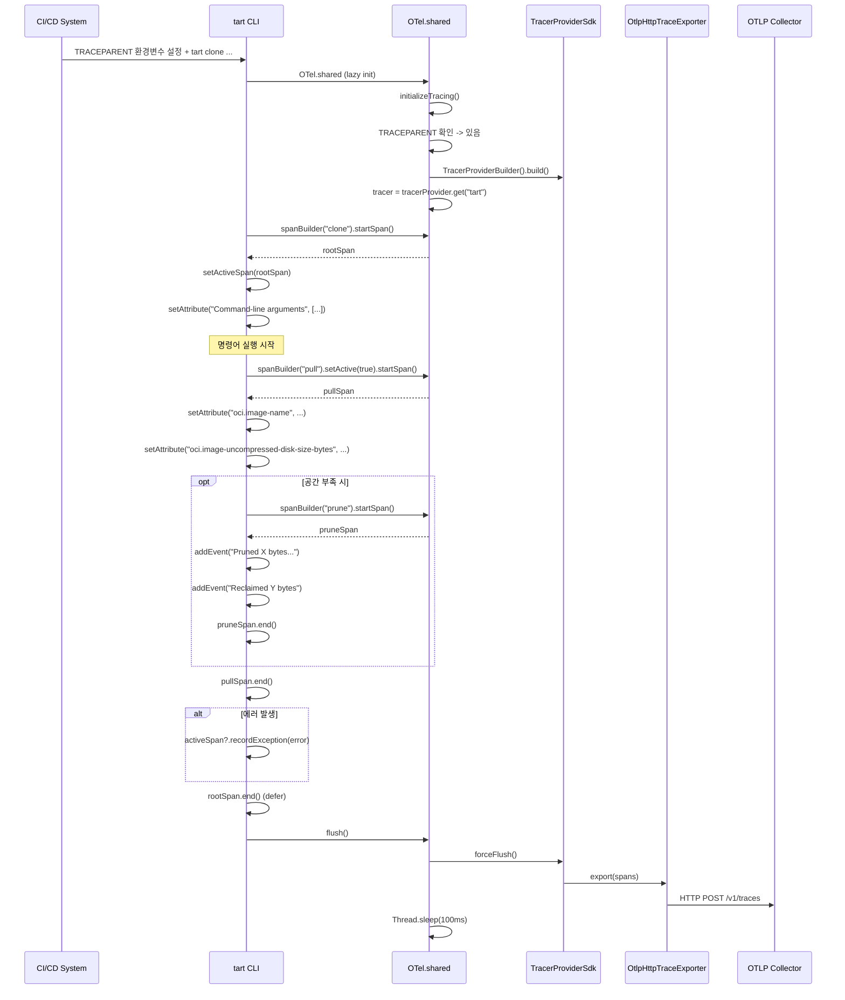
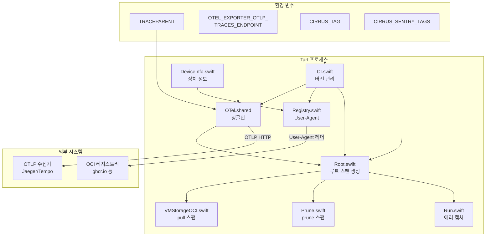

# 18. 텔레메트리 시스템 심화

## 개요

Tart는 **OpenTelemetry**(OTel)를 사용하여 CLI 명령의 실행을 추적한다.
이 텔레메트리는 기본적으로 **비활성화** 상태이며, `TRACEPARENT` 환경 변수가 설정된 경우에만
활성화된다. 주로 Cirrus CI 환경에서 빌드 파이프라인의 성능 분석과 오류 추적에 사용된다.

텔레메트리 외에도 Tart는 **User-Agent 헤더**를 통해 OCI 레지스트리에 클라이언트 정보를 전달하고,
**CI 버전 관리** 시스템으로 릴리스 태그를 추적한다.

이 문서에서는 다음 항목을 다룬다:

1. OTel 클래스 -- OpenTelemetry 초기화와 싱글턴
2. Root.swift에서의 루트 스팬 생성
3. 커맨드별 스팬과 속성 (Pull, Prune, Run)
4. CI 버전 관리 (CI.swift)
5. 장치 정보 수집 (DeviceInfo.swift)
6. User-Agent 헤더 (Registry.swift)
7. OpenTelemetry 구성 상세 (환경 변수, 리소스, 익스포터)
8. 설계 철학: 왜 이렇게 만들었는가

---

## 1. OpenTelemetry 의존성

### Package.swift 의존성 구성

```
파일: Package.swift
```

Tart는 두 개의 OpenTelemetry Swift 패키지를 사용한다:

```swift
// Package.swift 28~29행
.package(url: "https://github.com/open-telemetry/opentelemetry-swift", branch: "main"),
.package(url: "https://github.com/open-telemetry/opentelemetry-swift-core", from: "2.3.0"),
```

그리고 이 패키지에서 다음 4개 모듈을 import한다:

```swift
// Package.swift 48~51행
.product(name: "OpenTelemetryApi", package: "opentelemetry-swift-core"),
.product(name: "OpenTelemetrySdk", package: "opentelemetry-swift-core"),
.product(name: "OpenTelemetryProtocolExporterHTTP", package: "opentelemetry-swift"),
.product(name: "ResourceExtension", package: "opentelemetry-swift"),
```

### 모듈별 역할

| 모듈 | 패키지 | 역할 |
|------|--------|------|
| `OpenTelemetryApi` | opentelemetry-swift-core | 핵심 API (Tracer, Span, Context 등 인터페이스) |
| `OpenTelemetrySdk` | opentelemetry-swift-core | SDK 구현 (TracerProviderSdk, SpanProcessor 등) |
| `OpenTelemetryProtocolExporterHTTP` | opentelemetry-swift | OTLP HTTP 프로토콜로 트레이스 데이터 전송 |
| `ResourceExtension` | opentelemetry-swift | 호스트 정보 자동 수집 (OS, 머신 등) |

### 왜 두 개의 패키지인가?

OpenTelemetry Swift 프로젝트는 핵심 API/SDK(`opentelemetry-swift-core`)와
익스포터/확장(`opentelemetry-swift`)을 별도 패키지로 분리한다.
Core는 안정 버전을 사용하고(`from: "2.3.0"`),
익스포터는 `branch: "main"`으로 최신 코드를 추적한다.
이는 OTLP 프로토콜과 HTTP 전송 관련 코드가 더 자주 업데이트되기 때문이다.

```
+--------------------------------------------+
|            opentelemetry-swift-core         |
|  +------------------+  +----------------+  |
|  | OpenTelemetryApi |  | OpenTelemetrySdk|  |
|  | (인터페이스)       |  | (구현)          |  |
|  +------------------+  +----------------+  |
+--------------------------------------------+
                    |
                    v (의존)
+--------------------------------------------+
|            opentelemetry-swift              |
|  +---------------------------+             |
|  | OTLPExporterHTTP          |             |
|  | (OTLP 프로토콜 전송)       |             |
|  +---------------------------+             |
|  +---------------------------+             |
|  | ResourceExtension         |             |
|  | (호스트 정보 자동 수집)     |             |
|  +---------------------------+             |
+--------------------------------------------+
```

---

## 2. OTel 싱글턴 클래스

```
파일: Sources/tart/OTel.swift
```

### 전체 코드

```swift
import Foundation
import OpenTelemetryApi
import OpenTelemetrySdk
import OpenTelemetryProtocolExporterHttp
import ResourceExtension

class OTel {
  let tracerProvider: TracerProviderSdk?
  let tracer: Tracer

  static let shared = OTel()

  init() {
    tracerProvider = Self.initializeTracing()
    tracer = OpenTelemetry.instance.tracerProvider.get(
      instrumentationName: "tart",
      instrumentationVersion: CI.version
    )
  }

  static func initializeTracing() -> TracerProviderSdk? {
    guard let _ = ProcessInfo.processInfo.environment["TRACEPARENT"] else {
      return nil
    }

    var resource = DefaultResources().get()

    resource.merge(other: Resource(attributes: [
      SemanticConventions.Service.name.rawValue: .string("tart"),
      SemanticConventions.Service.version.rawValue: .string(CI.version)
    ]))

    let spanExporter: SpanExporter
    if let endpointRaw = ProcessInfo.processInfo.environment["OTEL_EXPORTER_OTLP_TRACES_ENDPOINT"],
       let endpoint = URL(string: endpointRaw) {
      spanExporter = OtlpHttpTraceExporter(endpoint: endpoint)
    } else {
      spanExporter = OtlpHttpTraceExporter()
    }
    let spanProcessor = SimpleSpanProcessor(spanExporter: spanExporter)
    let tracerProvider = TracerProviderBuilder()
      .add(spanProcessor: spanProcessor)
      .with(resource: resource)
      .build()

    OpenTelemetry.registerTracerProvider(tracerProvider: tracerProvider)

    return tracerProvider
  }

  func flush() {
    OpenTelemetry.instance.contextProvider.activeSpan?.end()

    guard let tracerProvider else {
      return
    }

    tracerProvider.forceFlush()

    // Work around OpenTelemetry not flushing traces after explicitly asking it to do so
    // [1]: https://github.com/open-telemetry/opentelemetry-swift/issues/685
    // [2]: https://github.com/open-telemetry/opentelemetry-swift/issues/555
    Thread.sleep(forTimeInterval: .fromMilliseconds(100))
  }
}
```

### 초기화 흐름

```
OTel.init()
    |
    v
initializeTracing()
    |
    v
TRACEPARENT 환경 변수 존재?
    |
    +-- No: return nil
    |       tracer = NoOp tracer (아무것도 하지 않음)
    |
    +-- Yes: OpenTelemetry 구성 시작
         |
         v
    DefaultResources().get()
    + merge(service.name="tart", service.version=CI.version)
         |
         v
    OTEL_EXPORTER_OTLP_TRACES_ENDPOINT 존재?
         |
         +-- Yes: OtlpHttpTraceExporter(endpoint: ...)
         |
         +-- No: OtlpHttpTraceExporter() (기본 엔드포인트)
         |
         v
    SimpleSpanProcessor(spanExporter)
         |
         v
    TracerProviderBuilder
      .add(spanProcessor)
      .with(resource)
      .build()
         |
         v
    OpenTelemetry.registerTracerProvider(tracerProvider)
         |
         v
    return tracerProvider
```

### 왜 싱글턴인가?

`static let shared = OTel()`로 Swift의 정적 상수 초기화(thread-safe lazy)를 활용한다.
OpenTelemetry의 `TracerProvider`는 애플리케이션 전체에서 하나만 존재해야 한다.
여러 개의 TracerProvider가 있으면 스팬이 올바른 컨텍스트에서 생성되지 않을 수 있다.

### flush() 메서드의 100ms 대기

```swift
func flush() {
  OpenTelemetry.instance.contextProvider.activeSpan?.end()

  guard let tracerProvider else {
    return
  }

  tracerProvider.forceFlush()

  Thread.sleep(forTimeInterval: .fromMilliseconds(100))
}
```

OpenTelemetry Swift SDK에는 `forceFlush()` 호출 후에도 트레이스가 실제로 전송되지 않는
버그가 있다(이슈 #685, #555). 이 100ms 대기는 HTTP 전송이 완료될 시간을 확보하는 우회 방법이다.

비활성 모드에서는 `tracerProvider`가 `nil`이므로 `guard`에서 즉시 반환하여
`forceFlush()`와 100ms 대기 모두 건너뛴다.

---

## 3. TRACEPARENT와 분산 추적

### W3C Trace Context

`TRACEPARENT`는 W3C Trace Context 표준에 정의된 환경변수다:

```
TRACEPARENT=00-4bf92f3577b34da6a3ce929d0e0e4736-00f067aa0ba902b7-01
             |  |                                |                  |
             v  v                                v                  v
          version  trace-id (128-bit)     parent-span-id (64-bit)  flags
```

| 필드 | 크기 | 설명 |
|------|------|------|
| version | 2자리 hex | 항상 "00" |
| trace-id | 32자리 hex | 전체 트레이스의 고유 ID |
| parent-span-id | 16자리 hex | 부모 스팬의 ID |
| trace-flags | 2자리 hex | "01" = 샘플링 됨 |

이 변수가 설정되면 Tart의 스팬은 기존 분산 추적의 **자식 스팬**으로 연결된다.
Cirrus CI에서는 파이프라인 전체를 하나의 트레이스로 추적하고,
각 `tart` 명령을 자식 스팬으로 포함시킨다.

```
Cirrus CI 파이프라인 트레이스
    |
    +-- Task: "Build macOS VM"
    |       |
    |       +-- tart clone (루트 스팬)
    |       |       |
    |       |       +-- pull (자식 스팬)
    |       |       |       |
    |       |       |       +-- prune (자식 스팬)
    |       |       |
    |       |       +-- (clone 작업)
    |       |
    |       +-- tart run (루트 스팬)
    |       |
    |       +-- tart stop (루트 스팬)
    |
    +-- Task: "Test"
            |
            +-- tart run (루트 스팬)
```

### 비활성 상태에서의 동작

`TRACEPARENT`가 없으면:
1. `tracerProvider`가 `nil`이다
2. `tracer`는 여전히 생성되지만, NoOp 구현을 사용한다
3. `spanBuilder().startSpan()`으로 스팬을 생성해도 아무것도 기록되지 않는다
4. `setAttribute`, `addEvent` 등의 호출도 무시된다

이 설계 덕분에 **트레이싱 코드가 조건문 없이** 항상 실행될 수 있다:

```swift
// 이런 코드가 필요 없음:
if OTel.shared.isEnabled {
  OTel.shared.tracer.spanBuilder(...)
}

// 대신 항상 호출 가능:
OTel.shared.tracer.spanBuilder(...)

// Optional chaining도 안전:
OpenTelemetry.instance.contextProvider.activeSpan?.setAttribute(...)
```

---

## 4. Root.swift: 루트 스팬 생성

```
파일: Sources/tart/Root.swift
```

### 루트 스팬 생성 흐름

```swift
// Sources/tart/Root.swift 55~77행
defer { OTel.shared.flush() }

do {
  var command = try parseAsRoot()

  // 루트 스팬 생성 -- 명령어 이름이 스팬 이름
  let span = OTel.shared.tracer.spanBuilder(
    spanName: type(of: command)._commandName
  ).startSpan()
  defer { span.end() }
  OpenTelemetry.instance.contextProvider.setActiveSpan(span)

  // 명령줄 인자를 속성으로 기록
  let commandLineArguments = ProcessInfo.processInfo.arguments.map { argument in
    AttributeValue.string(argument)
  }
  span.setAttribute(
    key: "Command-line arguments",
    value: .array(AttributeArray(values: commandLineArguments))
  )

  // Cirrus CI 태그 기록
  if let tags = ProcessInfo.processInfo.environment["CIRRUS_SENTRY_TAGS"] {
    for (key, value) in tags.split(separator: ",").compactMap(splitEnvironmentVariable) {
      span.setAttribute(key: key, value: .string(value))
    }
  }
  // ...
} catch {
  OpenTelemetry.instance.contextProvider.activeSpan?.recordException(error)
  // ...
}
```

### CIRRUS_SENTRY_TAGS 파싱

```swift
// Sources/tart/Root.swift 117~124행
private static func splitEnvironmentVariable(_ tag: String.SubSequence) -> (String, String)? {
  let splits = tag.split(separator: "=", maxSplits: 1)
  if splits.count != 2 {
    return nil
  }
  return (String(splits[0]), String(splits[1]))
}
```

`CIRRUS_SENTRY_TAGS="worker_type=m2pro,task_id=1234567"` 형식의 문자열을
쉼표로 분리한 후 각 항목을 `=`로 분리하여 스팬 속성으로 추가한다.

### 스팬 구조

```
루트 스팬: "pull" (또는 "run", "clone", "prune" 등)
    |
    +-- 속성: "Command-line arguments"
    |         ["tart", "pull", "ghcr.io/org/image:latest"]
    |
    +-- 속성: Cirrus CI 태그 (CIRRUS_SENTRY_TAGS에서 파싱)
    |         "worker_type" = "m2pro"
    |         "task_id" = "1234567"
    |
    +-- 자식 스팬: "pull" (VMStorageOCI.pull에서 생성)
    |       |
    |       +-- 속성: "oci.image-name"
    |       +-- 속성: "oci.image-uncompressed-disk-size-bytes"
    |
    +-- 자식 스팬: "prune" (Prune.reclaimIfPossible에서 생성)
    |       |
    |       +-- 이벤트: "Pruned N bytes for /path"
    |       +-- 이벤트: "Reclaimed N bytes"
    |
    +-- 예외: recordException(error) (에러 발생 시)
```

### 에러 캡처

```swift
// Sources/tart/Root.swift 94~114행
} catch {
  if let execCustomExitCodeError = error as? ExecCustomExitCodeError {
    OTel.shared.flush()
    Foundation.exit(execCustomExitCodeError.exitCode)
  }

  OpenTelemetry.instance.contextProvider.activeSpan?.recordException(error)

  if let errorWithExitCode = error as? HasExitCode {
    fputs("\(error)\n", stderr)
    OTel.shared.flush()
    Foundation.exit(errorWithExitCode.exitCode)
  }

  exit(withError: error)
}
```

모든 미처리 에러는 `recordException(error)`를 통해 활성 스팬에 기록된다.

---

## 5. 커맨드별 텔레메트리 상세

### 5.1 VMStorageOCI.pull() -- OCI 이미지 풀

```
파일: Sources/tart/VMStorageOCI.swift 147~254행
```

```swift
// 1단계: 이미지 이름을 루트 스팬 속성으로 설정
OpenTelemetry.instance.contextProvider.activeSpan?.setAttribute(
  key: "oci.image-name",
  value: .string(name.description)
)

// 2단계: 풀 스팬 생성 (이미지가 캐시에 없을 때만)
if !exists(digestName) {
  let span = OTel.shared.tracer.spanBuilder(spanName: "pull")
    .setActive(true)
    .startSpan()
  defer { span.end() }

  // 3단계: 비압축 디스크 크기를 스팬 속성으로 설정
  if let uncompressedDiskSize = manifest.uncompressedDiskSize() {
    OpenTelemetry.instance.contextProvider.activeSpan?.setAttribute(
      key: "oci.image-uncompressed-disk-size-bytes",
      value: .int(Int(uncompressedDiskSize))
    )
  }
}
```

**왜 `setActive(true)`를 호출하는가?**

`setActive(true)`를 호출하면 이 스팬이 현재 실행 컨텍스트의 활성 스팬이 된다.
이후 `OpenTelemetry.instance.contextProvider.activeSpan?`으로 접근하는 모든 코드가
이 스팬에 속성과 이벤트를 추가할 수 있다. 풀 과정에서 호출되는 `Prune.reclaimIfNeeded()`가
활성 스팬에 프루닝 관련 속성을 추가하는 것이 이 메커니즘의 활용 예이다.

### 5.2 Prune -- 자동 프루닝

```
파일: Sources/tart/Commands/Prune.swift 107~189행
```

#### reclaimIfNeeded() -- 자동 프루닝 판단

```swift
static func reclaimIfNeeded(_ requiredBytes: UInt64, _ initiator: Prunable? = nil) throws {
  if ProcessInfo.processInfo.environment.keys.contains("TART_NO_AUTO_PRUNE") {
    return
  }

  OpenTelemetry.instance.contextProvider.activeSpan?.setAttribute(
    key: "prune.required-bytes",
    value: .int(Int(requiredBytes))
  )

  let attrs = try Config().tartCacheDir.resourceValues(forKeys: [
    .volumeAvailableCapacityKey,
    .volumeAvailableCapacityForImportantUsageKey
  ])

  OpenTelemetry.instance.contextProvider.activeSpan?.setAttributes([
    "prune.volume-available-capacity-bytes":
      .int(Int(attrs.volumeAvailableCapacity!)),
    "prune.volume-available-capacity-for-important-usage-bytes":
      .int(Int(attrs.volumeAvailableCapacityForImportantUsage!)),
    "prune.volume-available-capacity-calculated":
      .int(Int(volumeAvailableCapacityCalculated)),
  ])

  if volumeAvailableCapacityCalculated <= 0 {
    OpenTelemetry.instance.contextProvider.activeSpan?.addEvent(
      name: "Zero volume capacity reported"
    )
    return
  }
  // ...
}
```

#### reclaimIfPossible() -- 실제 프루닝 실행

```swift
private static func reclaimIfPossible(_ reclaimBytes: UInt64, _ initiator: Prunable? = nil) throws {
  let span = OTel.shared.tracer.spanBuilder(spanName: "prune").startSpan()
  defer { span.end() }

  // ... 프루닝 대상 정렬 (최근 접근 시간 오름차순) ...

  while cacheReclaimedBytes <= reclaimBytes {
    guard let prunable = it.next() else { break }

    OpenTelemetry.instance.contextProvider.activeSpan?
      .addEvent(name: "Pruned \(allocatedSizeBytes) bytes for \(prunable.url.path)")

    cacheReclaimedBytes += allocatedSizeBytes
    try prunable.delete()
  }

  OpenTelemetry.instance.contextProvider.activeSpan?
    .addEvent(name: "Reclaimed \(cacheReclaimedBytes) bytes")
}
```

프루닝 텔레메트리 요약:

```
+==========================================+=======================================+
|          속성/이벤트                       |              의미                     |
+==========================================+=======================================+
| prune.required-bytes                     | 작업에 필요한 디스크 공간 (바이트)      |
| prune.volume-available-capacity-bytes    | OS가 보고한 가용 디스크 용량            |
| prune.volume-available-capacity-for-     | 중요 사용 기준 가용 용량               |
|   important-usage-bytes                  | (APFS 퍼지 가능한 공간 포함)           |
| prune.volume-available-capacity-         | 위 두 값 중 큰 값 (계산된 실제 가용량) |
|   calculated                             |                                       |
| "Zero volume capacity reported"          | 가용 용량이 0으로 보고된 이상 상황      |
| "Pruned N bytes for /path"               | 개별 항목 삭제 이벤트                  |
| "Reclaimed N bytes"                      | 총 회수량 요약 이벤트                  |
+==========================================+=======================================+
```

### 5.3 Run -- VM 실행

```
파일: Sources/tart/Commands/Run.swift
```

Run 커맨드는 직접 스팬을 생성하지 않지만, 다음과 같이 텔레메트리를 활용한다:

```swift
// Sources/tart/Commands/Run.swift 528행 -- 정상 종료 시
OTel.shared.flush()
Foundation.exit(0)

// Sources/tart/Commands/Run.swift 532행 -- 에러 발생 시
OpenTelemetry.instance.contextProvider.activeSpan?.recordException(error)
OTel.shared.flush()
Foundation.exit(1)
```

---

## 6. CI 버전 관리

```
파일: Sources/tart/CI/CI.swift
```

### 전체 코드

```swift
struct CI {
  private static let rawVersion = "${CIRRUS_TAG}"

  static var version: String {
    rawVersion.expanded() ? rawVersion : "SNAPSHOT"
  }

  static var release: String? {
    rawVersion.expanded() ? "tart@\(rawVersion)" : nil
  }
}

private extension String {
  func expanded() -> Bool {
    !isEmpty && !starts(with: "$")
  }
}
```

### 빌드 시 변수 치환 메커니즘

```
빌드 전 소스코드:
  private static let rawVersion = "${CIRRUS_TAG}"

CI 빌드 시 (Cirrus CI):
  CIRRUS_TAG=0.42.0 이면
  -> rawVersion = "0.42.0" (환경 변수가 치환됨)

로컬 개발 빌드 시:
  CIRRUS_TAG 미설정
  -> rawVersion = "${CIRRUS_TAG}" (리터럴 문자열 그대로)
```

### expanded() 로직

```swift
func expanded() -> Bool {
  !isEmpty && !starts(with: "$")
}
```

| rawVersion 값 | isEmpty | starts(with: "$") | expanded() | version |
|---------------|---------|-------------------|-----------|---------|
| `"0.42.0"` | false | false | true | `"0.42.0"` |
| `"${CIRRUS_TAG}"` | false | true | false | `"SNAPSHOT"` |
| `""` | true | - | false | `"SNAPSHOT"` |

### CI.version의 모든 사용처

```swift
// Root.swift 12행 -- CLI 버전 표시
version: CI.version,

// OTel.swift 15행 -- tracer 버전
instrumentationVersion: CI.version

// OTel.swift 27행 -- OTel 리소스 서비스 버전
SemanticConventions.Service.version.rawValue: .string(CI.version)

// Registry.swift 452행 -- User-Agent 헤더
"Tart/\(CI.version) (\(DeviceInfo.os); \(DeviceInfo.model))"

// VM.swift 432행 -- 가상 콘솔 장치 이름
consolePort.name = "tart-version-\(CI.version)"
```

---

## 7. 장치 정보 수집

```
파일: Sources/tart/DeviceInfo/DeviceInfo.swift
```

### 전체 코드

```swift
import Foundation
import Sysctl

class DeviceInfo {
  private static var osMemoized: String? = nil
  private static var modelMemoized: String? = nil

  static var os: String {
    if let os = osMemoized {
      return os
    }
    osMemoized = getOS()
    return osMemoized!
  }

  static var model: String {
    if let model = modelMemoized {
      return model
    }
    modelMemoized = getModel()
    return modelMemoized!
  }

  private static func getOS() -> String {
    let osVersion = ProcessInfo.processInfo.operatingSystemVersion
    return "macOS \(osVersion.majorVersion).\(osVersion.minorVersion).\(osVersion.patchVersion)"
  }

  private static func getModel() -> String {
    return SystemControl().hardware.model
  }
}
```

### 메모이제이션 패턴

```
DeviceInfo.os 첫 번째 호출:
    |
    v
osMemoized == nil
    |
    v
getOS() 호출 -> ProcessInfo.processInfo.operatingSystemVersion
    |
    v
"macOS 14.2.1" 생성 + osMemoized에 저장
    |
    v
반환: "macOS 14.2.1"

DeviceInfo.os 이후 호출:
    |
    v
osMemoized == "macOS 14.2.1" (캐시됨)
    |
    v
반환: "macOS 14.2.1" (getOS() 호출 없음)
```

### Sysctl 패키지

`Sysctl` 패키지(swift-sysctl)는 macOS의 `sysctl(3)` 시스템 콜을 Swift로 래핑한다.
`SystemControl().hardware.model`은 `sysctl hw.model` 명령과 동일한 결과를 반환한다.

예시 반환값:
- `"Mac14,6"` (MacBook Pro M2 Max)
- `"Mac15,3"` (Mac Studio M2 Ultra)
- `"VirtualMac2,1"` (VM 내부에서 실행 시)

---

## 8. User-Agent 헤더

```
파일: Sources/tart/OCI/Registry.swift 452~453행
```

### 구현

```swift
private func authAwareRequest(request: URLRequest, viaFile: Bool = false, doAuth: Bool) async throws
  -> (AsyncThrowingStream<Data, Error>, HTTPURLResponse) {
  var request = request

  if doAuth {
    if let (name, value) = await authenticationKeeper.header() {
      request.addValue(value, forHTTPHeaderField: name)
    }
  }

  request.setValue(
    "Tart/\(CI.version) (\(DeviceInfo.os); \(DeviceInfo.model))",
    forHTTPHeaderField: "User-Agent"
  )

  return try await Fetcher.fetch(request, viaFile: viaFile)
}
```

### User-Agent 형식

```
Tart/{버전} ({OS}; {하드웨어 모델})
```

예시:

| 환경 | User-Agent |
|------|-----------|
| 릴리스 빌드, M2 Max | `Tart/0.42.0 (macOS 14.2.1; Mac14,6)` |
| 릴리스 빌드, M1 | `Tart/0.42.0 (macOS 13.5.0; Mac13,1)` |
| 로컬 빌드, M2 Pro | `Tart/SNAPSHOT (macOS 14.2.1; Mac14,10)` |
| VM 내부 실행 | `Tart/SNAPSHOT (macOS 14.2.1; VirtualMac2,1)` |

### 적용 범위

User-Agent는 `authAwareRequest()` 메서드에서 설정되므로,
Registry 클래스를 통한 **모든 OCI 레지스트리 요청**에 포함된다:
`pullManifest()`, `pushManifest()`, `pullBlob()`, `pushBlob()`, `blobExists()`

---

## 9. 콘솔 장치를 통한 버전 전달

```
파일: Sources/tart/VM.swift 428~437행
```

```swift
let consolePort = VZVirtioConsolePortConfiguration()
consolePort.name = "tart-version-\(CI.version)"

let consoleDevice = VZVirtioConsoleDeviceConfiguration()
consoleDevice.ports[0] = consolePort

configuration.consoleDevices.append(consoleDevice)
```

VM의 Virtio 콘솔 장치 이름에 Tart 버전을 포함시킨다.
게스트 에이전트 소프트웨어가 이 이름을 읽어 호스트의 Tart 버전을 확인하고,
버전에 따른 기능 분기를 수행할 수 있다.

```
호스트 (Tart)                        게스트 (VM 내부)
+-------------------+                +-------------------+
| VZVirtioConsole   |    virtio      | /dev/virtio-ports |
| Port              | <-----------> | tart-version-     |
| name: "tart-      |               | 0.42.0            |
| version-0.42.0"   |               |                   |
+-------------------+                +-------------------+
                                           |
                                           v
                                     게스트 에이전트가
                                     버전 확인 후
                                     기능 분기 수행
```

---

## 10. 환경 변수 전체 목록

```
+===================================+=========================================+
|          환경 변수                  |              역할                        |
+===================================+=========================================+
| TRACEPARENT                       | OTel 트레이싱 활성화 트리거.              |
|                                   | W3C Trace Context 형식:                  |
|                                   | "00-{trace-id}-{span-id}-{flags}"       |
|                                   | 이 변수가 없으면 트레이싱 완전 비활성     |
+-----------------------------------+-----------------------------------------+
| OTEL_EXPORTER_OTLP_TRACES_        | OTLP HTTP 익스포터의 트레이스 엔드포인트.|
| ENDPOINT                          | 미설정 시 OtlpHttpTraceExporter()의      |
|                                   | 기본값 사용                              |
|                                   | (http://localhost:4318/v1/traces)       |
+-----------------------------------+-----------------------------------------+
| CIRRUS_SENTRY_TAGS                | Cirrus CI 태그. 쉼표로 구분된            |
|                                   | key=value 쌍.                           |
|                                   | 루트 스팬의 속성으로 추가됨               |
+-----------------------------------+-----------------------------------------+
| CIRRUS_TAG                        | Cirrus CI 릴리스 태그.                   |
|                                   | 빌드 시 CI.version에 치환됨              |
+-----------------------------------+-----------------------------------------+
| TART_NO_AUTO_PRUNE                | 설정 시 자동 프루닝 비활성화.            |
|                                   | reclaimIfNeeded()가 즉시 반환            |
+-----------------------------------+-----------------------------------------+
```

---

## 11. 리소스(Resource) 구성

```swift
var resource = DefaultResources().get()

resource.merge(other: Resource(attributes: [
  SemanticConventions.Service.name.rawValue: .string("tart"),
  SemanticConventions.Service.version.rawValue: .string(CI.version)
]))
```

`DefaultResources`는 `ResourceExtension` 패키지에서 제공하며,
호스트의 OS, 아키텍처 등 기본 시스템 정보를 자동으로 수집한다.

Tart가 추가하는 리소스 속성:

| 속성 | 키 | 값 |
|------|---|---|
| 서비스 이름 | `service.name` | `"tart"` |
| 서비스 버전 | `service.version` | `CI.version` |

---

## 12. SpanExporter와 SpanProcessor

### SimpleSpanProcessor

```swift
let spanProcessor = SimpleSpanProcessor(spanExporter: spanExporter)
```

`SimpleSpanProcessor`는 스팬이 종료될 때마다 **즉시** 익스포터로 전송한다.
대안인 `BatchSpanProcessor`는 스팬을 버퍼링하여 일괄 전송하지만,
CLI 도구의 짧은 수명(short-lived) 특성상 `SimpleSpanProcessor`가 더 적합하다.

```
SimpleSpanProcessor:               BatchSpanProcessor:
스팬 끝남 -> 즉시 전송              스팬 끝남 -> 버퍼에 추가
                                   일정 시간/개수 -> 일괄 전송

CLI에서는 SimpleSpanProcessor가 적합:
- 프로세스 수명이 짧음
- 스팬 수가 적음 (2~5개)
- 배치 타이머가 만료되기 전에 프로세스가 종료될 수 있음
```

### OTLP HTTP 익스포터

```swift
let spanExporter: SpanExporter
if let endpointRaw = ProcessInfo.processInfo.environment["OTEL_EXPORTER_OTLP_TRACES_ENDPOINT"],
   let endpoint = URL(string: endpointRaw) {
  spanExporter = OtlpHttpTraceExporter(endpoint: endpoint)
} else {
  spanExporter = OtlpHttpTraceExporter()
}
```

OTLP HTTP 익스포터는 트레이스 데이터를 HTTP POST(Protocol Buffers)로 전송한다.

```
Tart 프로세스
    |
    v
SimpleSpanProcessor
    |
    v
OtlpHttpTraceExporter
    |
    v  HTTP POST (protobuf)
+-------------------------+
| OTLP 수집기             |
| (Jaeger, Zipkin,        |
|  Grafana Tempo, etc.)   |
+-------------------------+
```

---

## 13. flush() 호출 패턴

```
+====================+======================+============================+
|     호출 위치       |      조건            |           목적              |
+====================+======================+============================+
| Root.swift 55행    | defer (항상)          | 정상 종료 시 모든 스팬 전송  |
| Root.swift 97행    | ExecCustomExitCode   | exec 커맨드의 커스텀 코드    |
| Root.swift 108행   | HasExitCode 에러     | 특정 종료 코드 에러          |
| Run.swift 528행    | VM 정상 종료          | exit(0) 전 스팬 전송        |
| Run.swift 536행    | VM 에러 종료          | exit(1) 전 스팬 전송        |
| Run.swift 570행    | Suspend 실패 (버전)  | macOS 14 미만               |
| Run.swift 577행    | Suspend 실패 (에러)  | Suspend 예외                |
+====================+======================+============================+
```

`Foundation.exit()`를 호출하는 모든 경로 앞에 `OTel.shared.flush()`가 있다.
`Foundation.exit()`는 프로세스를 즉시 종료하므로 `defer`가 실행되지 않는다.
따라서 `Foundation.exit()` 호출 전에 명시적으로 `flush()`를 호출해야 한다.

---

## 14. 텔레메트리 속성/이벤트 전체 목록

### 스팬 목록

| 스팬 이름 | 생성 위치 | 부모 | 설명 |
|----------|----------|------|------|
| `{command}` | Root.swift 62행 | TRACEPARENT | 루트 스팬 (커맨드 이름) |
| `"pull"` | VMStorageOCI.swift 185행 | 루트 스팬 | OCI 이미지 다운로드 |
| `"prune"` | Prune.swift 149행 | 활성 스팬 | 자동 프루닝 |

### 속성 목록

| 키 | 타입 | 설정 위치 | 설명 |
|---|------|----------|------|
| `Command-line arguments` | array(string) | Root.swift 70행 | CLI 인자 전체 |
| (CIRRUS_SENTRY_TAGS) | string | Root.swift 74행 | CI 환경 태그 |
| `oci.image-name` | string | VMStorageOCI.swift 149행 | 풀 대상 이미지 이름 |
| `oci.image-uncompressed-disk-size-bytes` | int | VMStorageOCI.swift 201행 | 비압축 디스크 크기 |
| `prune.required-bytes` | int | Prune.swift 113행 | 필요한 공간 |
| `prune.volume-available-capacity-bytes` | int | Prune.swift 128행 | 가용 용량 |
| `prune.volume-available-capacity-for-important-usage-bytes` | int | Prune.swift 129행 | 중요 사용 기준 가용 용량 |
| `prune.volume-available-capacity-calculated` | int | Prune.swift 130행 | 계산된 가용 용량 |

### 이벤트 목록

| 이벤트 이름 | 설정 위치 | 설명 |
|-----------|----------|------|
| `"Zero volume capacity reported"` | Prune.swift 134행 | 비정상적 디스크 용량 |
| `"Pruned N bytes for /path"` | Prune.swift 180행 | 개별 항목 삭제 |
| `"Reclaimed N bytes"` | Prune.swift 188행 | 총 회수량 |

### 예외 기록

| 메서드 | 설정 위치 | 설명 |
|--------|----------|------|
| `recordException(error)` | Root.swift 102행 | 커맨드 실행 에러 |
| `recordException(error)` | Run.swift 532행 | VM 실행 에러 |

---

## 15. 전체 트레이싱 아키텍처

```
+-------------------------------------------------------------------+
|                     CI/CD 파이프라인                                |
|  TRACEPARENT=00-<trace-id>-<parent-span-id>-01                    |
|  OTEL_EXPORTER_OTLP_TRACES_ENDPOINT=http://collector:4318/...     |
+-------------------------------------------------------------------+
         |
         v
+-------------------------------------------------------------------+
|                     tart CLI 프로세스                               |
|                                                                    |
|  +---------------------+                                          |
|  | OTel.shared          |                                          |
|  |   tracerProvider:    |                                          |
|  |     TracerProviderSdk|                                          |
|  |   tracer: Tracer     |                                          |
|  +---------------------+                                          |
|         |                                                          |
|         v                                                          |
|  +---------------------+     +---------------------------+        |
|  | 루트 스팬             |     | 하위 스팬                  |        |
|  | name: "clone"        |     | name: "pull"              |        |
|  | attributes:          |     |   name: "prune"           |        |
|  |   Command-line args  |     |   events:                 |        |
|  |   CI 태그            |     |     Pruned X bytes        |        |
|  | exception: (에러 시)  |     |     Reclaimed Y bytes     |        |
|  +---------------------+     +---------------------------+        |
|         |                            |                             |
|         v                            v                             |
|  +------------------------------------------------+               |
|  | SimpleSpanProcessor                             |               |
|  |   -> OtlpHttpTraceExporter                     |               |
|  |       -> HTTP POST /v1/traces                   |               |
|  +------------------------------------------------+               |
+-------------------------------------------------------------------+
         |
         v (HTTP/OTLP)
+-------------------------------------------------------------------+
|                 OTLP 수집기 / 백엔드                                |
|  Jaeger, Grafana Tempo, Honeycomb, Datadog, etc.                  |
+-------------------------------------------------------------------+
```

---

## 16. Mermaid 시퀀스: 전체 트레이싱 흐름



---

## 17. Mermaid 컴포넌트 다이어그램



---

## 18. 설계 철학: 왜 이렇게 만들었는가

### 비활성 기본값

텔레메트리는 기본적으로 비활성이다. `TRACEPARENT` 환경 변수가 있을 때만 활성화된다.
이유:
1. **프라이버시**: 사용자의 CLI 사용 패턴을 무단으로 수집하지 않음
2. **성능**: 불필요한 HTTP 요청과 직렬화 오버헤드 제거
3. **CI 환경 특화**: Cirrus CI에서는 `TRACEPARENT`가 자동 설정되므로 별도 구성 불필요

### NoOp 패턴

비활성 시 NoOp Tracer를 사용하여 코드 전체에 `if` 분기를 넣지 않는다.
NoOp 패턴의 장점:
1. **코드 가독성**: 트레이싱 로직이 비즈니스 로직과 자연스럽게 섞인다
2. **유지보수성**: 새로운 트레이싱 포인트 추가 시 조건문을 신경 쓸 필요 없다
3. **테스트 용이성**: 테스트에서 트레이싱이 자동으로 비활성화된다

### SimpleSpanProcessor 선택

`BatchSpanProcessor` 대신 `SimpleSpanProcessor`를 사용하는 이유:
- CLI 도구는 짧은 수명: 몇 초에서 몇 분
- 배치 프로세서의 타이머가 만료되기 전에 프로세스가 종료될 수 있음
- CLI에서 생성되는 스팬 수가 적어(2~5개) 배치 처리의 이점이 없음

### 활성 스팬 기반 속성 추가

많은 코드에서 `OpenTelemetry.instance.contextProvider.activeSpan?`을 통해
현재 활성 스팬에 속성을 추가한다. 이 패턴의 장점:
1. **느슨한 결합**: 속성을 추가하는 코드가 스팬을 생성한 코드를 알 필요 없음
2. **계층 구조 자동 형성**: `setActive(true)`로 부모-자식 관계가 자동 설정
3. **Optional chaining 안전성**: 활성 스팬이 없으면 자동으로 건너뜀

### 버전 관리의 단순함

`CI.swift`의 `"${CIRRUS_TAG}"` 패턴은 빌드 시스템에서 환경 변수를 소스코드에 직접 주입하는
간단하면서도 효과적인 방법이다. 별도의 버전 파일이나 빌드 스크립트가 필요 없다.

### 다른 CLI 도구와의 비교

| 도구 | 텔레메트리 방식 | 특징 |
|------|---------------|------|
| npm | 사용 통계 수집 | 옵트아웃 방식, 익명 사용 데이터 |
| Homebrew | Google Analytics | 옵트아웃 방식 |
| kubectl | 없음 | 서버 사이드에서 처리 |
| **Tart** | **OpenTelemetry 분산 추적** | **옵트인 방식 (TRACEPARENT 필요)** |

---

## 19. 정리

Tart의 텔레메트리 시스템은 다음 원칙을 따른다:

| 원칙 | 구현 |
|------|------|
| **옵트인 활성화** | `TRACEPARENT` 환경변수가 있을 때만 활성화 |
| **표준 프로토콜** | W3C Trace Context + OTLP HTTP |
| **NoOp 패턴** | 비활성 시 조건문 없이 모든 호출이 무시됨 |
| **계층적 스팬** | 루트(명령어) -> pull -> prune 계층 구조 |
| **풍부한 속성** | 이미지 크기, 디스크 용량, CLI 인자 등 기록 |
| **에러 추적** | recordException으로 모든 예외 캡처 |
| **싱글턴 관리** | OTel.shared로 전역 TracerProvider 관리 |
| **안전한 종료** | flush()로 전송 완료 보장 (+ 100ms 워크어라운드) |
| **User-Agent 식별** | 버전 + OS + 하드웨어 모델 조합으로 클라이언트 추적 |
| **빌드 시 버전 주입** | `"${CIRRUS_TAG}"` 패턴으로 별도 설정 없이 버전 관리 |
