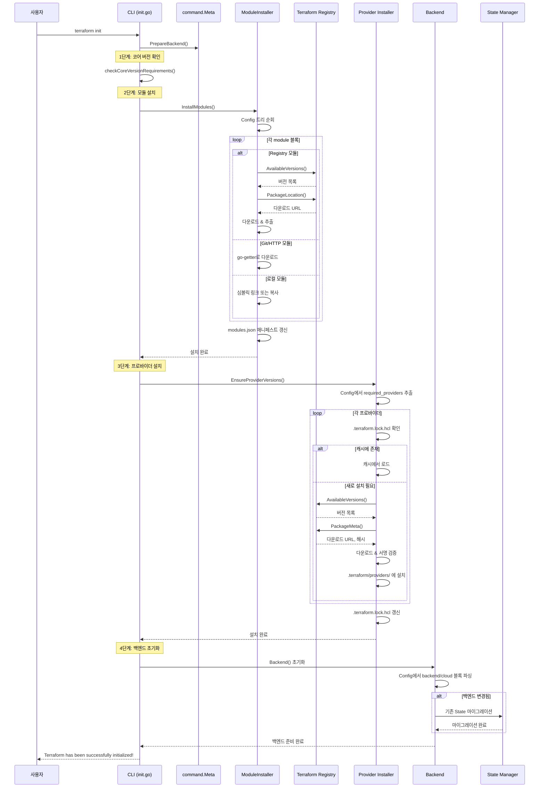
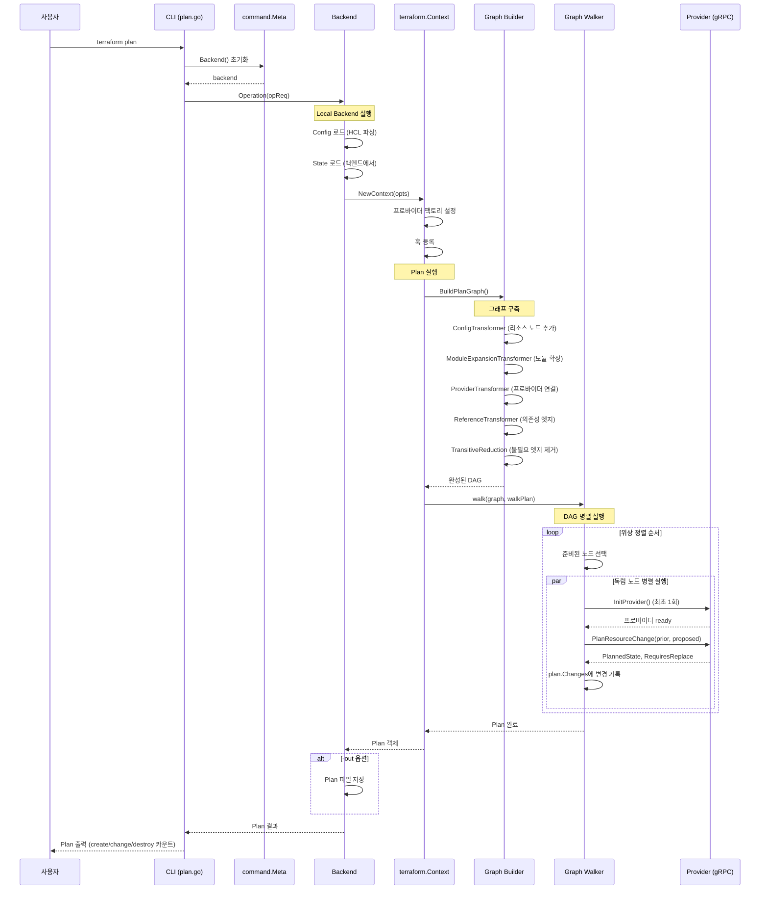
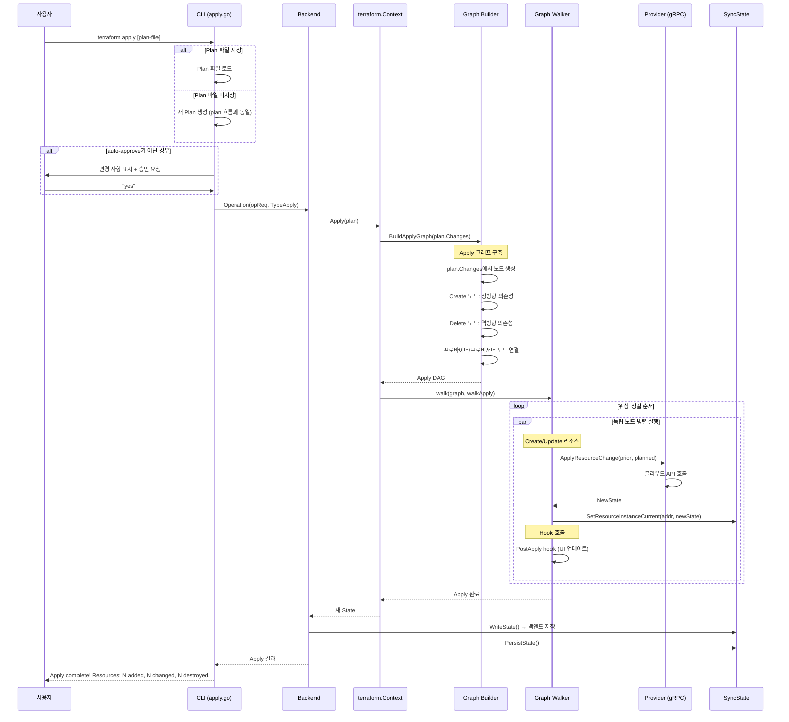
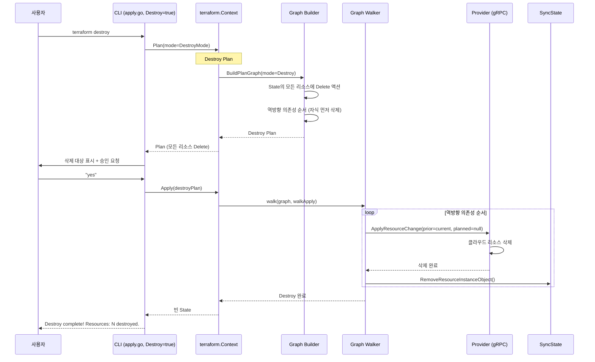
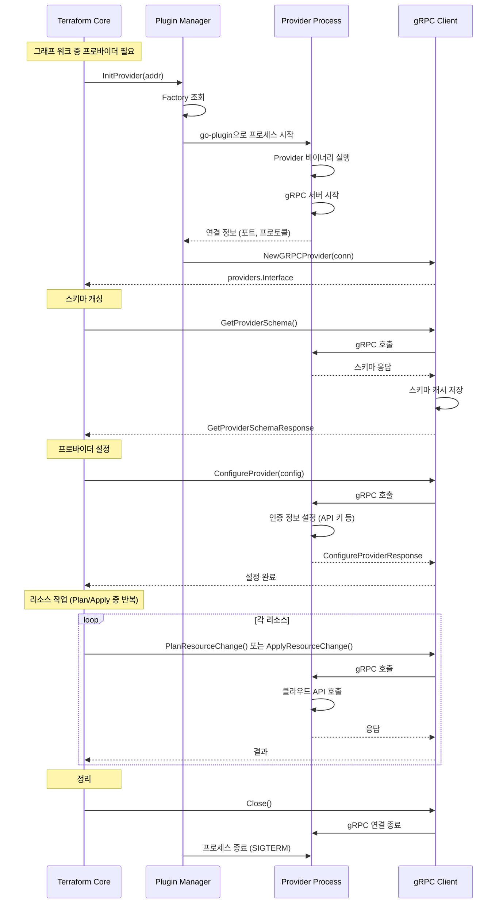
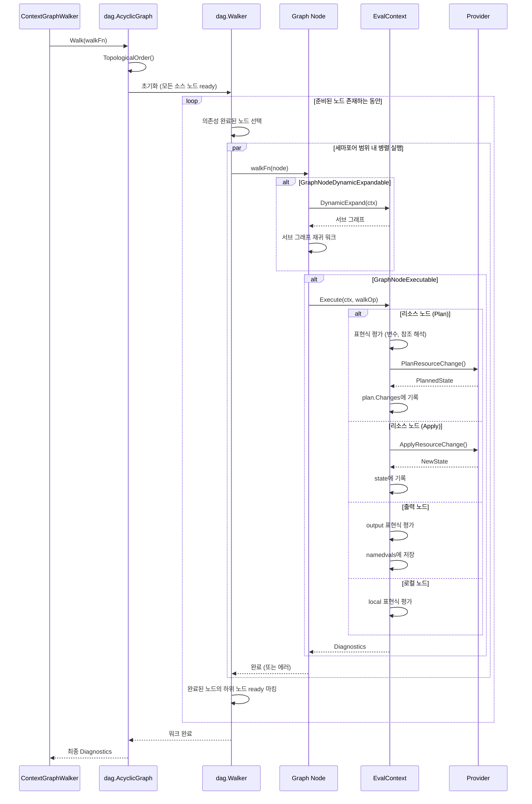
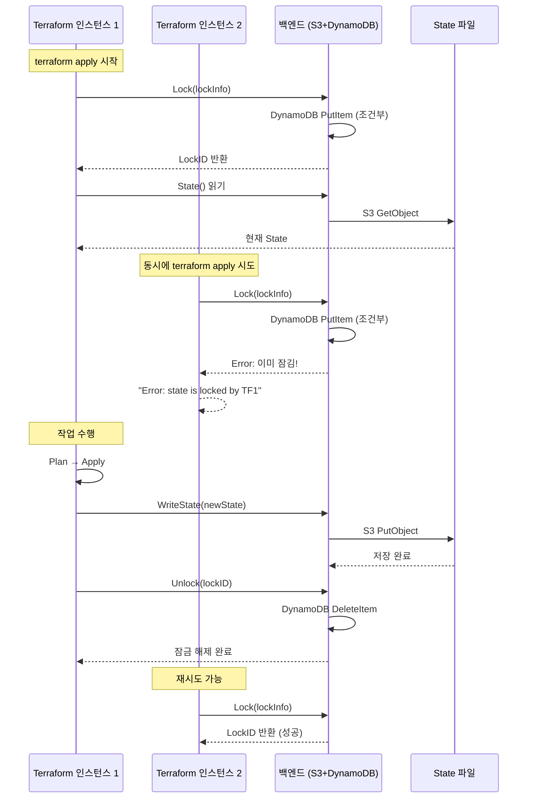
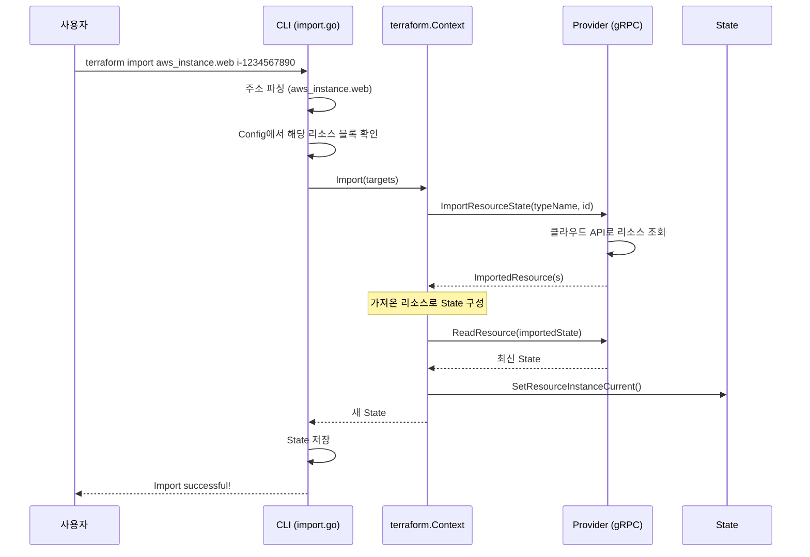

# 03. Terraform 시퀀스 다이어그램

## 1. terraform init 흐름

`terraform init`은 프로젝트 초기화의 핵심 명령으로, 모듈 설치 → 프로바이더 설치 → 백엔드 초기화를 수행한다.



## 2. terraform plan 흐름



## 3. terraform apply 흐름



## 4. terraform destroy 흐름



## 5. 프로바이더 플러그인 라이프사이클



## 6. 그래프 워크 상세 흐름



## 7. State 잠금 흐름



## 8. 모듈 인스턴스 확장 흐름

```
HCL Config:
  module "server" {
    count  = 3
    source = "./modules/server"
  }

그래프 변환 과정:
┌────────────────────────────┐
│  nodeExpandModule          │
│  (module.server)           │
│  count = 3                 │
└─────────────┬──────────────┘
              │ DynamicExpand()
              ▼
┌──────────────────────────────────────────┐
│  확장된 서브그래프                         │
│  ┌──────────────┐                        │
│  │ module.      │                        │
│  │ server[0]    │                        │
│  ├──────────────┤                        │
│  │ module.      │                        │
│  │ server[1]    │                        │
│  ├──────────────┤                        │
│  │ module.      │                        │
│  │ server[2]    │                        │
│  └──────────────┘                        │
│  각각 내부 리소스 그래프를 가짐             │
└──────────────────────────────────────────┘
```

## 9. import 흐름


