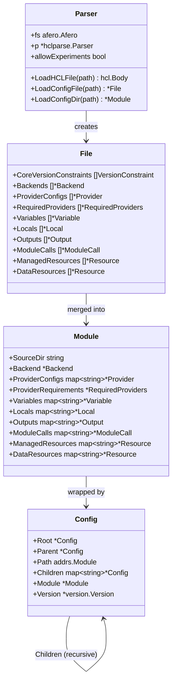

# 08. HCL 파싱 & 설정 로딩 Deep-Dive

## 목차

1. [개요](#1-개요)
2. [파싱 파이프라인 전체 흐름](#2-파싱-파이프라인-전체-흐름)
3. [Parser 구조체와 HCL2 통합](#3-parser-구조체와-hcl2-통합)
4. [파일 로딩과 블록 디코딩](#4-파일-로딩과-블록-디코딩)
5. [File에서 Module로: 병합과 검증](#5-file에서-module로-병합과-검증)
6. [Config 트리 구조](#6-config-트리-구조)
7. [Resource 블록 디코딩 상세](#7-resource-블록-디코딩-상세)
8. [Provider 요구사항 해석](#8-provider-요구사항-해석)
9. [디렉토리 기반 설정 로딩](#9-디렉토리-기반-설정-로딩)
10. [Override 파일 메커니즘](#10-override-파일-메커니즘)
11. [설계 철학과 Why](#11-설계-철학과-why)
12. [요약](#12-요약)

---

## 1. 개요

Terraform의 HCL 설정 로딩 시스템은 사용자가 작성한 `.tf` 파일을 파싱하여 Terraform 내부에서 사용할 수 있는 구조화된 설정 트리(Config Tree)로 변환하는 핵심 서브시스템이다. 이 과정은 다음 단계를 거친다:

1. **HCL 파싱**: `.tf`/`.tf.json` 파일을 HCL2 AST로 변환
2. **블록 디코딩**: AST를 Terraform 도메인 객체(Resource, Variable, Output 등)로 변환
3. **모듈 병합**: 여러 파일의 객체를 단일 Module 구조체로 합침
4. **Config 트리 구축**: 모듈 호출을 재귀적으로 따라가며 트리 구조 완성

```
.tf 파일들         HCL2 파서          블록 디코더          모듈 병합기
+-----------+    +----------+    +-------------+    +----------+
| main.tf   |--->|          |--->| File{       |--->|          |
| vars.tf   |--->| hclparse |--->|   Resources |--->| Module{} |
| output.tf |--->|          |--->|   Variables |--->|          |
+-----------+    +----------+    +-------------+    +----------+
                                                         |
                                                    Config Tree
                                                    구축(재귀적)
                                                         |
                                                    +---------+
                                                    | Config{} |
                                                    | Root     |
                                                    | Children |
                                                    +---------+
```

**핵심 소스 파일 위치**:
- `internal/configs/parser.go` - Parser 구조체
- `internal/configs/parser_config.go` - 파일 로딩/블록 디코딩
- `internal/configs/parser_config_dir.go` - 디렉토리 로딩
- `internal/configs/module.go` - Module/File 구조체, NewModule()
- `internal/configs/config.go` - Config 트리 구조체
- `internal/configs/resource.go` - Resource 블록 디코딩

---

## 2. 파싱 파이프라인 전체 흐름

### 2.1 End-to-End 흐름

```
terraform plan/apply 명령
         |
         v
    configload.Loader
         |
    LoadConfigDir(path)
         |
    +----+----+
    |         |
    v         v
 Primary   Override
 Files     Files
    |         |
    v         v
LoadConfigFile()  LoadConfigFileOverride()
    |                    |
    v                    v
 loadConfigFile(path, override=false/true)
    |
    v
 LoadHCLFile(path)     <-- HCL2 파서 호출
    |
    v
 parseConfigFile(body, diags, override, allowExperiments)
    |
    v
 File{} 구조체 반환
    |
    +-------+-------+
    |               |
    v               v
 NewModule(       mergeFile(
   primary,         override
   override)        files)
    |
    v
 Module{} 구조체
    |
    v
 BuildConfig(root Module, walker)
    |
    v
 Config{} 트리 (재귀적 자식 모듈 로딩)
```

### 2.2 핵심 타입 관계



---

## 3. Parser 구조체와 HCL2 통합

### 3.1 Parser 정의

`internal/configs/parser.go`:

```go
type Parser struct {
    fs afero.Afero          // 가상 파일시스템 추상화
    p  *hclparse.Parser     // HCL2 파서 인스턴스
    allowExperiments bool   // 실험적 기능 허용 여부
}
```

Parser는 세 가지 핵심 설계 결정을 반영한다:

| 필드 | 설계 의도 |
|------|----------|
| `fs afero.Afero` | 테스트에서 가상 파일시스템 사용 가능, 실제 코드에서는 OS 파일시스템 |
| `p *hclparse.Parser` | HCL2 라이브러리의 파서를 래핑, 소스 캐시 유지 |
| `allowExperiments` | 알파/개발 빌드에서만 실험적 언어 기능 활성화 |

### 3.2 NewParser 팩토리

```go
// internal/configs/parser.go
func NewParser(fs afero.Fs) *Parser {
    if fs == nil {
        fs = afero.OsFs{}   // 기본값: 실제 OS 파일시스템
    }
    return &Parser{
        fs: afero.Afero{Fs: fs},
        p:  hclparse.NewParser(),
    }
}
```

**Why: 왜 afero를 사용하는가?**

`afero`는 Go의 파일시스템 추상화 라이브러리로, Terraform이 이를 채택한 이유:

1. **테스트 격리**: 인메모리 파일시스템으로 테스트 시 실제 디스크 접근 불필요
2. **크로스 플랫폼**: Windows/Linux/macOS 경로 차이 추상화
3. **확장성**: 원격 파일시스템, 임베디드 파일시스템 등 교체 가능

### 3.3 LoadHCLFile - HCL2 파싱

```go
// internal/configs/parser.go
func (p *Parser) LoadHCLFile(path string) (hcl.Body, hcl.Diagnostics) {
    src, err := p.fs.ReadFile(path)
    if err != nil {
        return nil, hcl.Diagnostics{...}
    }

    var file *hcl.File
    var diags hcl.Diagnostics
    switch {
    case strings.HasSuffix(path, ".json"):
        file, diags = p.p.ParseJSON(src, path)    // JSON 문법
    default:
        file, diags = p.p.ParseHCL(src, path)     // HCL Native 문법
    }

    if file == nil || file.Body == nil {
        return hcl.EmptyBody(), diags
    }
    return file.Body, diags
}
```

**핵심 동작**:
1. 파일 확장자로 파싱 모드 결정 (`.json` vs `.tf`)
2. HCL2 파서가 `hcl.Body`를 반환 -- 아직 디코딩되지 않은 "lazy" 표현
3. `hcl.Body`는 나중에 스키마를 적용해 특정 구조체로 디코딩

**Why: 왜 hcl.Body라는 lazy 표현을 사용하는가?**

HCL2는 "부분 디코딩(partial decoding)" 패턴을 사용한다. `hcl.Body`를 즉시 전체 디코딩하지 않는 이유:

1. **유연성**: 같은 Body를 다른 스키마로 여러 번 디코딩 가능
2. **버전 호환성**: 미래 버전의 속성을 무시하고 현재 알려진 것만 디코딩
3. **에러 복구**: 일부 블록이 실패해도 나머지 블록 디코딩 가능
4. **성능**: 필요할 때만 Expression을 평가

---

## 4. 파일 로딩과 블록 디코딩

### 4.1 LoadConfigFile과 loadConfigFile

```go
// internal/configs/parser_config.go
func (p *Parser) LoadConfigFile(path string) (*File, hcl.Diagnostics) {
    return p.loadConfigFile(path, false)     // override = false
}

func (p *Parser) LoadConfigFileOverride(path string) (*File, hcl.Diagnostics) {
    return p.loadConfigFile(path, true)      // override = true
}

func (p *Parser) loadConfigFile(path string, override bool) (*File, hcl.Diagnostics) {
    body, diags := p.LoadHCLFile(path)
    if body == nil {
        return nil, diags
    }
    return parseConfigFile(body, diags, override, p.allowExperiments)
}
```

### 4.2 parseConfigFile - 블록 디코딩 핵심

`parseConfigFile`은 HCL Body를 Terraform의 `File` 구조체로 변환하는 핵심 함수이다.

```go
// internal/configs/parser_config.go
func parseConfigFile(body hcl.Body, diags hcl.Diagnostics,
    override, allowExperiments bool) (*File, hcl.Diagnostics) {

    file := &File{}

    // 1단계: Terraform 버전 제약조건 먼저 추출
    file.CoreVersionConstraints, reqDiags = sniffCoreVersionRequirements(body)

    // 2단계: 실험적 기능 확인
    file.ActiveExperiments, expDiags = sniffActiveExperiments(body, allowExperiments)

    // 3단계: 최상위 블록 스키마로 Body 디코딩
    content, contentDiags := body.Content(configFileSchema)

    // 4단계: 각 블록 타입별 디코딩
    for _, block := range content.Blocks {
        switch block.Type {
        case "terraform":      // terraform {} 블록
        case "provider":       // provider "aws" {} 블록
        case "variable":       // variable "name" {} 블록
        case "locals":         // locals {} 블록
        case "output":         // output "name" {} 블록
        case "module":         // module "name" {} 블록
        case "resource":       // resource "type" "name" {} 블록
        case "data":           // data "type" "name" {} 블록
        case "moved":          // moved {} 블록
        case "import":         // import {} 블록
        case "check":          // check "name" {} 블록
        ...
        }
    }
    return file, diags
}
```

### 4.3 configFileSchema - 최상위 스키마 정의

```go
// internal/configs/parser_config.go
var configFileSchema = &hcl.BodySchema{
    Blocks: []hcl.BlockHeaderSchema{
        {Type: "terraform"},
        {Type: "provider",  LabelNames: []string{"name"}},
        {Type: "variable",  LabelNames: []string{"name"}},
        {Type: "locals"},
        {Type: "output",    LabelNames: []string{"name"}},
        {Type: "module",    LabelNames: []string{"name"}},
        {Type: "resource",  LabelNames: []string{"type", "name"}},
        {Type: "data",      LabelNames: []string{"type", "name"}},
        {Type: "ephemeral", LabelNames: []string{"type", "name"}},
        {Type: "action",    LabelNames: []string{"type", "name"}},
        {Type: "moved"},
        {Type: "removed"},
        {Type: "import"},
        {Type: "check",     LabelNames: []string{"name"}},
    },
}
```

이 스키마는 `.tf` 파일의 최상위 레벨에서 허용되는 모든 블록 타입을 정의한다. `LabelNames`는 각 블록이 요구하는 레이블(이름)의 수와 의미를 지정한다.

### 4.4 terraform 블록 내부 스키마

```go
var terraformBlockSchema = &hcl.BodySchema{
    Attributes: []hcl.AttributeSchema{
        {Name: "required_version"},
        {Name: "experiments"},
        {Name: "language"},
    },
    Blocks: []hcl.BlockHeaderSchema{
        {Type: "backend",          LabelNames: []string{"type"}},
        {Type: "cloud"},
        {Type: "required_providers"},
        {Type: "state_store",      LabelNames: []string{"type"}},
        {Type: "provider_meta",    LabelNames: []string{"provider"}},
    },
}
```

**2단계 스키마 구조**:

```
.tf 파일
├── terraform {                      <-- configFileSchema
│   ├── required_version = "~> 1.0" <-- terraformBlockSchema
│   ├── backend "s3" { ... }        <-- terraformBlockSchema
│   └── required_providers { ... }  <-- terraformBlockSchema
│
├── provider "aws" { ... }          <-- configFileSchema
├── resource "aws_instance" "web" { <-- configFileSchema
│   ├── count/for_each              <-- ResourceBlockSchema
│   ├── lifecycle { ... }           <-- resourceLifecycleBlockSchema
│   └── provisioner "local-exec"    <-- ResourceBlockSchema
│
├── variable "name" { ... }         <-- configFileSchema
└── output "id" { ... }             <-- configFileSchema
```

---

## 5. File에서 Module로: 병합과 검증

### 5.1 File 구조체

`File`은 단일 `.tf` 파일의 내용을 표현한다:

```go
// internal/configs/module.go
type File struct {
    CoreVersionConstraints []VersionConstraint
    ActiveExperiments experiments.Set
    Backends          []*Backend
    StateStores       []*StateStore
    CloudConfigs      []*CloudConfig
    ProviderConfigs   []*Provider
    ProviderMetas     []*ProviderMeta
    RequiredProviders []*RequiredProviders
    Variables         []*Variable
    Locals            []*Local
    Outputs           []*Output
    ModuleCalls       []*ModuleCall
    ManagedResources  []*Resource
    DataResources     []*Resource
    EphemeralResources []*Resource
    Moved             []*Moved
    Removed           []*Removed
    Import            []*Import
    Checks            []*Check
    Actions           []*Action
}
```

File은 **슬라이스** 기반이다. 중복 검사를 하지 않으며, 단순히 파일 내 모든 선언을 수집한다.

### 5.2 Module 구조체

`Module`은 하나의 모듈(디렉토리)에 있는 모든 파일의 병합된 결과이다:

```go
// internal/configs/module.go
type Module struct {
    SourceDir string
    CoreVersionConstraints []VersionConstraint
    ActiveExperiments experiments.Set
    Backend              *Backend              // 하나만 허용
    StateStore           *StateStore           // 하나만 허용
    CloudConfig          *CloudConfig          // 하나만 허용
    ProviderConfigs      map[string]*Provider
    ProviderRequirements *RequiredProviders
    ProviderLocalNames   map[addrs.Provider]string
    ProviderMetas        map[addrs.Provider]*ProviderMeta
    Variables   map[string]*Variable
    Locals      map[string]*Local
    Outputs     map[string]*Output
    ModuleCalls map[string]*ModuleCall
    ManagedResources   map[string]*Resource
    DataResources      map[string]*Resource
    EphemeralResources map[string]*Resource
    ListResources      map[string]*Resource
    Actions            map[string]*Action
    Moved   []*Moved
    Removed []*Removed
    Import  []*Import
    Checks  map[string]*Check
    Tests   map[string]*TestFile
}
```

**File vs Module 비교**:

| 특성 | File (슬라이스) | Module (맵) |
|------|----------------|-------------|
| 중복 허용 | 허용 (같은 파일 내) | 불허 (에러 진단) |
| Backend | `[]*Backend` | `*Backend` (단일) |
| Variables | `[]*Variable` | `map[string]*Variable` |
| Resources | `[]*Resource` | `map[string]*Resource` |
| 목적 | 단일 파일 파싱 결과 | 모듈 전체 통합 결과 |

### 5.3 NewModule - 병합 과정

```go
// internal/configs/module.go
func NewModule(primaryFiles, overrideFiles []*File) (*Module, hcl.Diagnostics) {
    var diags hcl.Diagnostics
    mod := &Module{
        ProviderConfigs:    map[string]*Provider{},
        Variables:          map[string]*Variable{},
        Locals:             map[string]*Local{},
        Outputs:            map[string]*Output{},
        ModuleCalls:        map[string]*ModuleCall{},
        ManagedResources:   map[string]*Resource{},
        DataResources:      map[string]*Resource{},
        EphemeralResources: map[string]*Resource{},
        ListResources:      map[string]*Resource{},
        Checks:             map[string]*Check{},
        Actions:            map[string]*Action{},
        ...
    }

    // 1단계: required_providers 먼저 처리
    for _, file := range primaryFiles {
        for _, r := range file.RequiredProviders {
            if mod.ProviderRequirements != nil {
                // 에러: 중복 required_providers 블록
                diags = append(diags, ...)
                continue
            }
            mod.ProviderRequirements = r
        }
    }

    // 2단계: Primary 파일들 병합
    for _, file := range primaryFiles {
        fileDiags := mod.appendFile(file)
        diags = append(diags, fileDiags...)
    }

    // 3단계: Override 파일들 병합
    for _, file := range overrideFiles {
        fileDiags := mod.mergeFile(file)
        diags = append(diags, fileDiags...)
    }

    // 4단계: Provider 로컬 이름 매핑 생성
    mod.gatherProviderLocalNames()

    return mod, diags
}
```

### 5.4 appendFile - 중복 감지 패턴

`appendFile`은 primary 파일의 각 요소를 Module 맵에 추가하면서 중복을 검사한다:

```go
// internal/configs/module.go
func (m *Module) appendFile(file *File) hcl.Diagnostics {
    var diags hcl.Diagnostics

    // 변수 중복 검사 예시
    for _, v := range file.Variables {
        if existing, exists := m.Variables[v.Name]; exists {
            diags = append(diags, &hcl.Diagnostic{
                Severity: hcl.DiagError,
                Summary:  "Duplicate variable declaration",
                Detail:   fmt.Sprintf("... already declared at %s...",
                    existing.DeclRange),
            })
        }
        m.Variables[v.Name] = v
    }

    // Resource의 경우 Provider FQN도 동시에 해석
    for _, r := range file.ManagedResources {
        key := r.moduleUniqueKey()  // "aws_instance.web" 형태
        if existing, exists := m.ManagedResources[key]; exists {
            // 에러: 중복 리소스
        }
        m.ManagedResources[key] = r

        // Provider FQN 해석
        if r.ProviderConfigRef != nil {
            r.Provider = m.ProviderForLocalConfig(r.ProviderConfigAddr())
        } else {
            implied, err := addrs.ParseProviderPart(r.Addr().ImpliedProvider())
            if err == nil {
                r.Provider = m.ImpliedProviderForUnqualifiedType(implied)
            }
        }
    }

    return diags
}
```

**핵심 패턴: 암묵적(Implied) Provider 해석**

```
resource "aws_instance" "web" { ... }
         ^^^
         타입 이름에서 provider 유추:
         "aws_instance" → "aws" → hashicorp/aws
```

```go
// internal/configs/module.go
func (m *Module) ImpliedProviderForUnqualifiedType(pType string) addrs.Provider {
    if provider, exists := m.ProviderRequirements.RequiredProviders[pType]; exists {
        return provider.Type   // required_providers에 명시된 경우
    }
    return addrs.ImpliedProviderForUnqualifiedType(pType)  // 기본 hashicorp 네임스페이스
}
```

---

## 6. Config 트리 구조

### 6.1 Config 구조체

`Config`는 모듈 트리의 한 노드를 표현한다:

```go
// internal/configs/config.go
type Config struct {
    Root     *Config                 // 루트 모듈 (자기참조 가능)
    Parent   *Config                 // 부모 모듈 (루트면 nil)
    Path     addrs.Module            // 정적 모듈 경로
    Children map[string]*Config      // 자식 모듈들
    Module   *Module                 // 실제 설정 내용
    SourceAddr    addrs.ModuleSource // 모듈 소스 주소
    SourceAddrRaw string             // 원본 소스 문자열
    Version *version.Version         // 레지스트리 모듈의 버전
}
```

### 6.2 트리 구조 예시

```
프로젝트 구조:
├── main.tf          (module "vpc" { source = "./modules/vpc" })
├── modules/
│   └── vpc/
│       └── main.tf  (module "subnet" { source = "./subnet" })
│           └── subnet/
│               └── main.tf

Config 트리:
Config{
  Root: self,
  Path: [],
  Module: Module{...},           ← 루트 모듈
  Children: {
    "vpc": Config{
      Root: parent.Root,
      Parent: parent,
      Path: ["vpc"],
      Module: Module{...},       ← vpc 모듈
      Children: {
        "subnet": Config{
          Root: root,
          Parent: vpc,
          Path: ["vpc", "subnet"],
          Module: Module{...},   ← subnet 모듈
          Children: {},
        }
      }
    }
  }
}
```

### 6.3 트리 순회 메서드

```go
// internal/configs/config.go

// 깊이 우선 순회 - 부모가 항상 자식보다 먼저 호출됨
func (c *Config) DeepEach(cb func(c *Config)) {
    cb(c)
    for _, ch := range c.Children {
        ch.DeepEach(cb)
    }
}

// 경로로 자손 모듈 탐색
func (c *Config) Descendant(path addrs.Module) *Config {
    current := c
    for _, name := range path {
        current = current.Children[name]
        if current == nil {
            return nil
        }
    }
    return current
}

// 모듈 깊이 계산
func (c *Config) Depth() int {
    ret := 0
    this := c
    for this.Parent != nil {
        ret++
        this = this.Parent
    }
    return ret
}
```

### 6.4 TargetExists - 대상 존재 확인

```go
// internal/configs/config.go
func (c *Config) TargetExists(target addrs.Targetable) bool {
    switch target.AddrType() {
    case addrs.ConfigResourceAddrType:
        addr := target.(addrs.ConfigResource)
        module := c.Descendant(addr.Module)
        if module != nil {
            return module.Module.ResourceByAddr(addr.Resource) != nil
        }
        return false
    case addrs.ModuleAddrType:
        return c.Descendant(target.(addrs.Module)) != nil
    ...
    }
}
```

---

## 7. Resource 블록 디코딩 상세

### 7.1 Resource 구조체

```go
// internal/configs/resource.go
type Resource struct {
    Mode    addrs.ResourceMode     // Managed, Data, Ephemeral, List
    Name    string                  // 리소스 이름
    Type    string                  // 리소스 타입 (aws_instance 등)
    Config  hcl.Body               // 아직 디코딩되지 않은 설정 body
    Count   hcl.Expression         // count 메타 인자
    ForEach hcl.Expression         // for_each 메타 인자
    ProviderConfigRef *ProviderConfigRef
    Provider          addrs.Provider
    Preconditions  []*CheckRule
    Postconditions []*CheckRule
    DependsOn []hcl.Traversal
    TriggersReplacement []hcl.Expression
    Managed *ManagedResource       // managed resource 전용 필드
    DeclRange hcl.Range
    TypeRange hcl.Range
}

type ManagedResource struct {
    Connection     *Connection
    Provisioners   []*Provisioner
    ActionTriggers []*ActionTrigger
    CreateBeforeDestroy bool
    PreventDestroy      bool
    IgnoreChanges       []hcl.Traversal
    IgnoreAllChanges    bool
    CreateBeforeDestroySet bool
    PreventDestroySet      bool
}
```

### 7.2 decodeResourceBlock 상세

```go
// internal/configs/resource.go
func decodeResourceBlock(block *hcl.Block, override bool,
    allowExperiments bool) (*Resource, hcl.Diagnostics) {

    r := &Resource{
        Mode:      addrs.ManagedResourceMode,
        Type:      block.Labels[0],      // "aws_instance"
        Name:      block.Labels[1],      // "web"
        DeclRange: block.DefRange,
        Managed:   &ManagedResource{},
    }

    // PartialContent: 알려진 메타 인자만 추출, 나머지는 Config로 보존
    content, remain, moreDiags := block.Body.PartialContent(ResourceBlockSchema)
    r.Config = remain   // Provider 스키마에 따라 나중에 디코딩

    // 메타 인자 처리
    if attr, exists := content.Attributes["count"]; exists {
        r.Count = attr.Expr
    }
    if attr, exists := content.Attributes["for_each"]; exists {
        r.ForEach = attr.Expr
        if r.Count != nil {
            // 에러: count와 for_each는 상호 배타적
        }
    }
    if attr, exists := content.Attributes["provider"]; exists {
        r.ProviderConfigRef, _ = decodeProviderConfigRef(attr.Expr, "provider")
    }
    if attr, exists := content.Attributes["depends_on"]; exists {
        r.DependsOn, _ = DecodeDependsOn(attr)
    }

    // 중첩 블록 처리
    for _, block := range content.Blocks {
        switch block.Type {
        case "lifecycle":   // lifecycle 블록
            // create_before_destroy, prevent_destroy, ignore_changes 등
        case "connection":  // connection 블록
        case "provisioner": // provisioner 블록
        case "_":           // 이스케이프 블록 (메타 인자와 이름 충돌 시)
        }
    }
    return r, diags
}
```

### 7.3 PartialContent 패턴

```
resource "aws_instance" "web" {
    count = 2                    ← 메타 인자 (Terraform이 처리)
    ami           = "ami-123"    ← Provider 속성 (나중에 디코딩)
    instance_type = "t2.micro"   ← Provider 속성

    lifecycle {                  ← 메타 블록 (Terraform이 처리)
        create_before_destroy = true
    }

    tags = {                     ← Provider 속성
        Name = "web"
    }
}

PartialContent(ResourceBlockSchema) 호출 결과:
  content = { count, lifecycle }   ← 메타 인자/블록
  remain  = { ami, instance_type, tags }  ← r.Config에 저장
```

**Why: 왜 PartialContent를 사용하는가?**

Terraform 메타 인자(count, for_each, lifecycle 등)와 Provider 스키마 속성(ami, instance_type 등)을 분리하기 위함이다. Provider 스키마는 Plan/Apply 시점에야 알 수 있으므로, 파싱 단계에서는 알려진 메타 인자만 추출하고 나머지는 "미해석 Body"로 보존한다.

### 7.4 ResourceBlockSchema

```go
// internal/configs/resource.go
var ResourceBlockSchema = &hcl.BodySchema{
    Attributes: commonResourceAttributes,  // count, for_each, provider, depends_on
    Blocks: []hcl.BlockHeaderSchema{
        {Type: "locals"},
        {Type: "lifecycle"},
        {Type: "connection"},
        {Type: "provisioner", LabelNames: []string{"type"}},
        {Type: "_"},
    },
}
```

### 7.5 lifecycle 블록 디코딩

```go
var resourceLifecycleBlockSchema = &hcl.BodySchema{
    Attributes: []hcl.AttributeSchema{
        {Name: "create_before_destroy"},
        {Name: "prevent_destroy"},
        {Name: "ignore_changes"},
        {Name: "replace_triggered_by"},
    },
    Blocks: []hcl.BlockHeaderSchema{
        {Type: "precondition"},
        {Type: "postcondition"},
        {Type: "action_trigger"},
    },
}
```

`ignore_changes`는 특별한 처리가 필요하다:

```go
// "all" 키워드 또는 속성 목록
kw := hcl.ExprAsKeyword(attr.Expr)
switch {
case kw == "all":
    r.Managed.IgnoreAllChanges = true
default:
    exprs, _ := hcl.ExprList(attr.Expr)
    for _, expr := range exprs {
        traversal, _ := hcl.RelTraversalForExpr(expr)
        r.Managed.IgnoreChanges = append(r.Managed.IgnoreChanges, traversal)
    }
}
```

---

## 8. Provider 요구사항 해석

### 8.1 ProviderRequirements 수집

Config 트리 전체에서 Provider 요구사항을 재귀적으로 수집한다:

```go
// internal/configs/config.go
func (c *Config) ProviderRequirements() (providerreqs.Requirements, hcl.Diagnostics) {
    reqs := make(providerreqs.Requirements)
    diags := c.addProviderRequirements(reqs, true, true)
    return reqs, diags
}
```

### 8.2 addProviderRequirements - 3단계 수집

```go
// internal/configs/config.go
func (c *Config) addProviderRequirements(reqs providerreqs.Requirements,
    recurse, tests bool) hcl.Diagnostics {

    // 1단계: required_providers 블록의 명시적 요구사항
    if c.Module.ProviderRequirements != nil {
        for _, providerReqs := range c.Module.ProviderRequirements.RequiredProviders {
            fqn := providerReqs.Type
            constraints, _ := providerreqs.ParseVersionConstraints(...)
            reqs[fqn] = append(reqs[fqn], constraints...)
        }
    }

    // 2단계: 리소스 블록의 암묵적 요구사항
    for _, rc := range c.Module.ManagedResources {
        fqn := rc.Provider
        if _, exists := reqs[fqn]; !exists {
            reqs[fqn] = nil  // 버전 제약 없는 암묵적 의존성
        }
    }
    for _, rc := range c.Module.DataResources { ... }
    for _, rc := range c.Module.EphemeralResources { ... }

    // 3단계: 자식 모듈 재귀 탐색
    if recurse {
        for _, childConfig := range c.Children {
            childConfig.addProviderRequirements(reqs, true, false)
        }
    }

    return diags
}
```

### 8.3 Provider 이름 해석 흐름

```
사용자가 작성한 설정:

terraform {
  required_providers {
    mycloud = {
      source  = "example.com/vendor/mycloud"
      version = "~> 1.0"
    }
  }
}

resource "mycloud_server" "web" { ... }

해석 과정:
1. required_providers에서 "mycloud" → "example.com/vendor/mycloud" 매핑 저장
2. resource "mycloud_server"의 ImpliedProvider() → "mycloud"
3. ImpliedProviderForUnqualifiedType("mycloud")
   → RequiredProviders["mycloud"] 존재 → example.com/vendor/mycloud 반환

명시적 지정이 없는 경우:
resource "aws_instance" "web" { ... }
1. ImpliedProvider() → "aws"
2. RequiredProviders에 "aws" 없음
3. addrs.ImpliedProviderForUnqualifiedType("aws")
   → "registry.terraform.io/hashicorp/aws" (기본값)
```

### 8.4 VerifyDependencySelections - Lock 파일 검증

```go
// internal/configs/config.go
func (c *Config) VerifyDependencySelections(depLocks *depsfile.Locks) []error {
    reqs, _ := c.ProviderRequirements()

    for providerAddr, constraints := range reqs {
        lock := depLocks.Provider(providerAddr)
        if lock == nil {
            // 에러: lock 파일에 해당 provider 없음
            errs = append(errs, fmt.Errorf(
                "provider %s: required by this configuration but no version is selected",
                providerAddr))
            continue
        }

        selectedVersion := lock.Version()
        allowedVersions := providerreqs.MeetingConstraints(constraints)
        if !allowedVersions.Has(selectedVersion) {
            // 에러: lock된 버전이 제약조건 범위 밖
            errs = append(errs, fmt.Errorf(
                "provider %s: locked version selection %s doesn't match constraints %q",
                providerAddr, selectedVersion, currentConstraints))
        }
    }
    return errs
}
```

---

## 9. 디렉토리 기반 설정 로딩

### 9.1 LoadConfigDir

```go
// internal/configs/parser_config_dir.go
func (p *Parser) LoadConfigDir(path string, opts ...Option) (*Module, hcl.Diagnostics) {
    fileSet, diags := p.dirFileSet(path, opts...)

    // Primary 파일 로딩 (.tf, .tf.json)
    primary, fDiags := p.loadFiles(fileSet.Primary, false)

    // Override 파일 로딩 (override.tf, *_override.tf)
    override, fDiags := p.loadFiles(fileSet.Override, true)

    // Module 생성
    mod, modDiags := NewModule(primary, override)

    // 테스트 파일 로딩 (.tftest.hcl)
    if len(fileSet.Tests) > 0 {
        testFiles, fDiags := p.loadTestFiles(path, fileSet.Tests)
        mod.Tests = testFiles
    }

    return mod, diags
}
```

### 9.2 파일 분류 규칙

```
디렉토리 내 파일 분류:

*.tf, *.tf.json           → Primary 파일 (일반 설정)
override.tf               → Override 파일
*_override.tf             → Override 파일
*.tftest.hcl, *.tftest.json → 테스트 파일
*.tfquery.hcl             → 쿼리 파일

처리 순서:
1. Primary 파일들 → appendFile()로 Module에 추가
2. Override 파일들 → mergeFile()로 기존 설정 덮어쓰기
3. 테스트 파일들 → Module.Tests에 추가
```

---

## 10. Override 파일 메커니즘

### 10.1 mergeFile - Override 병합

Override 파일은 primary 파일의 설정을 **덮어쓰는** 특별한 동작을 한다:

```go
// internal/configs/module.go
func (m *Module) mergeFile(file *File) hcl.Diagnostics {
    var diags hcl.Diagnostics

    // Backend: override 파일의 backend이 기존 것을 교체
    if len(file.Backends) != 0 {
        switch len(file.Backends) {
        case 1:
            m.Backend = file.Backends[0]
            m.CloudConfig = nil      // 상호 배타적
            m.StateStore = nil       // 상호 배타적
        default:
            // 에러: override 파일에도 중복 불허
        }
    }

    // Variable: 기존 변수 덮어쓰기 (없으면 에러)
    for _, v := range file.Variables {
        existing, exists := m.Variables[v.Name]
        if !exists {
            diags = append(diags, &hcl.Diagnostic{
                Summary: "Missing base variable declaration to override",
                Detail:  "There is no variable named %q...",
            })
            continue
        }
        existing.merge(v)  // 기존 변수에 override 적용
    }

    // Resource: 기존 리소스 덮어쓰기 (없으면 에러)
    for _, r := range file.ManagedResources {
        existing, exists := m.ManagedResources[r.moduleUniqueKey()]
        if !exists {
            // 에러: override할 대상 리소스 없음
            continue
        }
        existing.merge(r, m.ProviderRequirements.RequiredProviders)
    }

    // moved, import 블록은 override 불가
    for _, m := range file.Moved {
        diags = append(diags, &hcl.Diagnostic{
            Summary: "Cannot override 'moved' blocks",
        })
    }

    return diags
}
```

**Override 규칙 요약**:

| 블록 타입 | Override 동작 |
|-----------|-------------|
| `backend` | 교체 (cloud, state_store와 상호 배타) |
| `variable` | 기존 변수의 default 등 속성 덮어쓰기 |
| `resource` | 기존 리소스의 설정 body 교체 |
| `provider` (default) | 새로 생성 가능 (빈 설정 override) |
| `provider` (aliased) | 기존 것만 override (없으면 에러) |
| `moved` | override 불가 (에러) |
| `import` | override 불가 (에러) |

---

## 11. 설계 철학과 Why

### 11.1 왜 2단계 디코딩인가? (HCL Body -> File -> Module)

```
단일 단계:  .tf 파일 → Module    (불가능한 이유)
2단계:      .tf 파일 → File → Module

이유:
1. 파일 단위 파싱은 독립적이어야 함 (병렬 처리 가능)
2. Override 파일은 다른 파일의 선언을 덮어쓰므로, 먼저 모든 파일을 수집해야 함
3. 중복 검사는 모든 파일을 본 후에만 가능
4. required_providers는 다른 모든 블록보다 먼저 처리되어야 함
```

### 11.2 왜 Expression은 파싱 시점에 평가하지 않는가?

```go
type Resource struct {
    Count   hcl.Expression   // 평가되지 않은 표현식
    ForEach hcl.Expression   // 평가되지 않은 표현식
    Config  hcl.Body         // 평가되지 않은 Body
}
```

**이유**:
1. `count`와 `for_each`의 값은 다른 리소스에 의존할 수 있음
2. 변수 값은 Plan 시점에야 결정됨
3. Provider 스키마가 있어야 Config Body를 올바르게 디코딩 가능
4. 따라서 파싱 단계에서는 **구문 분석만** 하고, **의미 분석은 Graph Walk 시점**에 수행

### 11.3 왜 Config 트리는 정적인가?

```
정적 Config 트리:               동적 모듈 인스턴스:
Config                          ModuleInstance
├── vpc                         ├── vpc[0]
│   └── subnet                  │   ├── subnet[0]
│                               │   └── subnet[1]
└── app                         ├── vpc[1]
                                │   ├── subnet[0]
                                │   └── subnet[1]
                                └── app
```

`count`/`for_each` 확장은 Plan 시점의 Graph Walk에서 이루어진다. Config 트리는 "설정의 정적 구조"만 표현하고, 실제 인스턴스 확장은 `ModuleExpansionTransformer`가 담당한다.

### 11.4 왜 Backend/CloudConfig/StateStore는 상호 배타적인가?

```go
case m.CloudConfig != nil && m.StateStore != nil && m.Backend != nil:
    // 에러: 세 가지 중 하나만 허용
```

이 세 가지는 모두 "상태 저장 위치"를 설정하는 메커니즘이다:
- `backend`: 전통적 방식 (S3, GCS 등)
- `cloud`: HCP Terraform / TFE 전용
- `state_store`: 새로운 pluggable 방식 (실험적)

하나의 상태 파일은 한 곳에만 저장될 수 있으므로, 상호 배타적이어야 한다.

### 11.5 성능 최적화 포인트

| 최적화 | 위치 | 설명 |
|--------|------|------|
| 소스 캐시 | `hclparse.Parser` | 동일 파일 재파싱 방지 |
| Lazy Body | `hcl.Body` | 필요할 때만 디코딩 |
| Provider FQN 캐시 | `Module.ProviderLocalNames` | FQN→로컬이름 매핑 재사용 |
| PartialContent | `Resource.Config` | 메타 인자와 Provider 속성 분리 |

---

## 12. 요약

### 전체 데이터 흐름

```
+----------+     +---------+     +------+     +--------+     +--------+
| .tf 파일  | --> | HCL2    | --> | File | --> | Module | --> | Config |
| (텍스트)  |     | Parser  |     | (단일 |     | (통합  |     | (트리  |
|          |     |         |     |  파일) |     |  모듈) |     |  구조) |
+----------+     +---------+     +------+     +--------+     +--------+
     |                |              |              |              |
  디스크 I/O      구문 분석       블록 디코딩     중복 검사      모듈 호출
  (.tf/.json)   (HCL Native    (switch/case)   Provider FQN    재귀적 로딩
                 또는 JSON)                     해석
```

### 핵심 설계 결정 요약

| 결정 | 이유 |
|------|------|
| afero 파일시스템 추상화 | 테스트 격리, 크로스 플랫폼 |
| 2단계 디코딩 (File→Module) | Override 지원, 중복 검사, 순서 제어 |
| Expression lazy 평가 | 의존성 해석은 Graph Walk 시점에 |
| PartialContent 패턴 | 메타 인자와 Provider 속성 분리 |
| 정적 Config 트리 | count/for_each 확장은 Plan 시점에 |
| Provider FQN 암묵적 해석 | 편의성과 하위 호환성 |
| Backend/Cloud/StateStore 상호 배타 | 단일 상태 저장소 원칙 |
