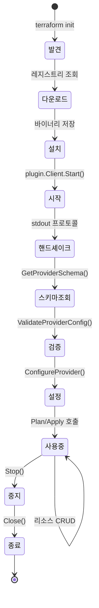

# 09. Provider Plugin System Deep-Dive

## 목차

1. [개요](#1-개요)
2. [Provider Interface 전체 설계](#2-provider-interface-전체-설계)
3. [go-plugin 프레임워크와 gRPC 통신](#3-go-plugin-프레임워크와-grpc-통신)
4. [GRPCProvider - 번역 계층](#4-grpcprovider---번역-계층)
5. [스키마 시스템](#5-스키마-시스템)
6. [스키마 캐싱 메커니즘](#6-스키마-캐싱-메커니즘)
7. [Provider 생명주기](#7-provider-생명주기)
8. [데이터 직렬화와 DynamicValue](#8-데이터-직렬화와-dynamicvalue)
9. [핵심 RPC 메서드 분석](#9-핵심-rpc-메서드-분석)
10. [ServerCapabilities와 프로토콜 진화](#10-servercapabilities와-프로토콜-진화)
11. [설계 철학과 Why](#11-설계-철학과-why)
12. [요약](#12-요약)

---

## 1. 개요

Terraform의 Provider Plugin System은 Terraform 코어와 인프라 제공자(AWS, GCP, Azure 등) 사이의 확장 가능한 통신 계층이다. 이 시스템의 핵심 설계 원칙:

1. **프로세스 격리**: Provider는 별도 프로세스로 실행되어 Terraform 코어의 안정성 보장
2. **언어 독립**: gRPC/Protobuf 기반으로 이론적으로 어떤 언어로든 Provider 작성 가능
3. **버전 독립**: Provider와 Terraform 코어를 독립적으로 업그레이드
4. **스키마 기반**: Provider가 자신의 리소스 스키마를 자기 기술(self-describing)

```
+------------------+     gRPC/Protobuf      +------------------+
|                  |  <================>     |                  |
|   Terraform      |     go-plugin           |   Provider       |
|   Core           |     프레임워크           |   (별도 프로세스)  |
|                  |                         |                  |
|  +-----------+   |     +-----------+       |  +-----------+   |
|  | providers.|   |     | tfplugin5 |       |  | 실제 API  |   |
|  | Interface |<--+---->| .proto    |<------+->| 호출 로직 |   |
|  +-----------+   |     +-----------+       |  +-----------+   |
|       ^          |                         |                  |
|       |          |                         +------------------+
|  +-----------+   |
|  | GRPCProv  |   |
|  | ider      |   |
|  +-----------+   |
+------------------+
```

**핵심 소스 파일 위치**:
- `internal/providers/provider.go` - Interface 정의, 모든 요청/응답 타입
- `internal/providers/schema_cache.go` - 글로벌 스키마 캐시
- `internal/plugin/grpc_provider.go` - GRPCProvider (클라이언트 측 번역 계층)
- `internal/tfplugin5/` - Protocol v5 protobuf 정의

---

## 2. Provider Interface 전체 설계

### 2.1 Interface 정의

`internal/providers/provider.go`에 정의된 `Interface`는 Provider가 구현해야 하는 전체 API를 규정한다:

```go
// internal/providers/provider.go
type Interface interface {
    // === 스키마 ===
    GetProviderSchema() GetProviderSchemaResponse
    GetResourceIdentitySchemas() GetResourceIdentitySchemasResponse

    // === 검증 ===
    ValidateProviderConfig(ValidateProviderConfigRequest) ValidateProviderConfigResponse
    ValidateResourceConfig(ValidateResourceConfigRequest) ValidateResourceConfigResponse
    ValidateDataResourceConfig(ValidateDataResourceConfigRequest) ValidateDataResourceConfigResponse
    ValidateEphemeralResourceConfig(...) ...
    ValidateListResourceConfig(...) ...

    // === 설정 ===
    ConfigureProvider(ConfigureProviderRequest) ConfigureProviderResponse

    // === 리소스 CRUD ===
    ReadResource(ReadResourceRequest) ReadResourceResponse
    PlanResourceChange(PlanResourceChangeRequest) PlanResourceChangeResponse
    ApplyResourceChange(ApplyResourceChangeRequest) ApplyResourceChangeResponse
    ImportResourceState(ImportResourceStateRequest) ImportResourceStateResponse
    MoveResourceState(MoveResourceStateRequest) MoveResourceStateResponse

    // === 상태 업그레이드 ===
    UpgradeResourceState(UpgradeResourceStateRequest) UpgradeResourceStateResponse
    UpgradeResourceIdentity(...) ...

    // === 데이터 소스 ===
    ReadDataSource(ReadDataSourceRequest) ReadDataSourceResponse

    // === Ephemeral 리소스 ===
    OpenEphemeralResource(...) ...
    RenewEphemeralResource(...) ...
    CloseEphemeralResource(...) ...

    // === 함수 ===
    CallFunction(CallFunctionRequest) CallFunctionResponse

    // === List 리소스 ===
    ListResource(ListResourceRequest) ListResourceResponse

    // === State Store (pluggable) ===
    ValidateStateStoreConfig(...) ...
    ConfigureStateStore(...) ...
    ReadStateBytes(...) ...
    WriteStateBytes(...) ...
    LockState(...) ...
    UnlockState(...) ...
    GetStates(...) ...
    DeleteState(...) ...

    // === Action ===
    PlanAction(...) ...
    InvokeAction(...) ...
    ValidateActionConfig(...) ...

    // === 제어 ===
    Stop() error
    Close() error

    // === Config 생성 ===
    GenerateResourceConfig(...) ...
}
```

### 2.2 메서드 카테고리별 분류

```
Provider Interface 메서드 분류
+=====================================+
|          스키마 & 검증               |
|  GetProviderSchema()                |
|  GetResourceIdentitySchemas()       |
|  ValidateProviderConfig()           |
|  ValidateResourceConfig()           |
|  ValidateDataResourceConfig()       |
+=====================================+
|          생명주기 관리               |
|  ConfigureProvider()                |
|  Stop()                             |
|  Close()                            |
+=====================================+
|          리소스 CRUD                 |
|  ReadResource()        - Read       |
|  PlanResourceChange()  - Plan       |
|  ApplyResourceChange() - Apply      |
|  ImportResourceState() - Import     |
|  MoveResourceState()   - Move       |
+=====================================+
|          데이터 소스                 |
|  ReadDataSource()                   |
+=====================================+
|          상태 관리                   |
|  UpgradeResourceState()             |
|  UpgradeResourceIdentity()          |
|  ReadStateBytes() / WriteStateBytes |
|  LockState() / UnlockState()        |
+=====================================+
```

### 2.3 핵심 요청/응답 타입

| RPC 메서드 | Request 핵심 필드 | Response 핵심 필드 |
|-----------|------------------|-------------------|
| `PlanResourceChange` | TypeName, PriorState, ProposedNewState, Config | PlannedState, RequiresReplace, Deferred |
| `ApplyResourceChange` | TypeName, PriorState, PlannedState, Config, PlannedPrivate | NewState, Private |
| `ReadResource` | TypeName, CurrentState, Private | NewState |
| `ReadDataSource` | TypeName, Config | State |
| `ImportResourceState` | TypeName, ID | ImportedResources |
| `ConfigureProvider` | TerraformVersion, Config | - |

---

## 3. go-plugin 프레임워크와 gRPC 통신

### 3.1 HashiCorp go-plugin 개요

Terraform은 HashiCorp의 `go-plugin` 라이브러리를 사용하여 Provider를 별도 프로세스로 실행하고 gRPC로 통신한다.

```
Terraform Core 프로세스              Provider 프로세스
+------------------------+          +------------------------+
|                        |          |                        |
| plugin.Client          |  stdin/  | plugin.Serve()         |
|   .Start()  -----------+- stdout -+-> GRPCProviderPlugin   |
|                        |  핸드셰이크|     .GRPCServer()      |
|   .Client() --------+  |          |                        |
|                     |  |   gRPC   |                        |
| GRPCProvider        |  | (loopback|  proto.ProviderServer  |
|   .client ----------+--+- socket)-+-> 실제 Provider 로직   |
|                        |          |                        |
| providers.Interface    |          |                        |
+------------------------+          +------------------------+
```

### 3.2 GRPCProviderPlugin

```go
// internal/plugin/grpc_provider.go
type GRPCProviderPlugin struct {
    plugin.Plugin
    GRPCProvider func() proto.ProviderServer
}

// 클라이언트 측: Terraform Core가 호출
func (p *GRPCProviderPlugin) GRPCClient(ctx context.Context,
    broker *plugin.GRPCBroker, c *grpc.ClientConn) (interface{}, error) {
    return &GRPCProvider{
        client: proto.NewProviderClient(c),   // gRPC 클라이언트 생성
        ctx:    ctx,
    }, nil
}

// 서버 측: Provider 프로세스에서 호출
func (p *GRPCProviderPlugin) GRPCServer(broker *plugin.GRPCBroker,
    s *grpc.Server) error {
    proto.RegisterProviderServer(s, p.GRPCProvider())
    return nil
}
```

### 3.3 프로세스 시작 및 핸드셰이크 과정

```
1. Terraform이 Provider 바이너리를 exec()로 실행
2. Provider 프로세스가 go-plugin 서버 시작
3. stdout에 핸드셰이크 정보 출력:
   "1|5|unix|/tmp/plugin123456|grpc"
    ^ ^  ^    ^                ^
    | |  |    |                프로토콜
    | |  |    소켓 경로
    | |  전송 방식
    | 프로토콜 버전
    매직 넘버
4. Terraform이 stdout 읽고 gRPC 연결 수립
5. 양방향 gRPC 통신 시작
```

### 3.4 통신 경로

```
Terraform 코드                    gRPC 경계                Provider 코드
+--------------+                 +----------+             +-------------+
| providers.   |                 | Proto    |             | Provider    |
| Interface    |  cty.Value      | Buf      |  Proto      | Server      |
| 메서드 호출   | -------->       | 직렬화   | -------->   | 역직렬화    |
|              |                 | (msgpack)|             | 비즈니스    |
|              |  cty.Value      |          |  Proto      | 로직 실행   |
|              | <--------       |          | <--------   |             |
+--------------+                 +----------+             +-------------+
```

---

## 4. GRPCProvider - 번역 계층

### 4.1 GRPCProvider 구조체

```go
// internal/plugin/grpc_provider.go
type GRPCProvider struct {
    PluginClient *plugin.Client       // 프로세스 제어용
    TestServer   *grpc.Server         // E2E 테스트용
    Addr         addrs.Provider       // Provider 식별자 (hashicorp/aws 등)
    client       proto.ProviderClient // gRPC 클라이언트 스텁
    ctx          context.Context      // 플러그인 생명주기 컨텍스트
    mu           sync.Mutex           // 스키마 캐시 보호
    schema       providers.GetProviderSchemaResponse  // 로컬 스키마 캐시
}
```

### 4.2 번역 패턴: ValidateResourceConfig 예시

```go
// internal/plugin/grpc_provider.go
func (p *GRPCProvider) ValidateResourceConfig(
    r providers.ValidateResourceConfigRequest) (
    resp providers.ValidateResourceConfigResponse) {

    // 1단계: 스키마 조회 (캐시 활용)
    schema := p.GetProviderSchema()
    if schema.Diagnostics.HasErrors() {
        resp.Diagnostics = schema.Diagnostics
        return resp
    }

    // 2단계: 리소스 타입별 스키마 조회
    resourceSchema, ok := schema.ResourceTypes[r.TypeName]
    if !ok {
        resp.Diagnostics = resp.Diagnostics.Append(
            fmt.Errorf("unknown resource type %q", r.TypeName))
        return resp
    }

    // 3단계: cty.Value → msgpack 직렬화
    mp, err := msgpack.Marshal(r.Config, resourceSchema.Body.ImpliedType())
    if err != nil {
        resp.Diagnostics = resp.Diagnostics.Append(err)
        return resp
    }

    // 4단계: Proto 요청 구성
    protoReq := &proto.ValidateResourceTypeConfig_Request{
        TypeName:           r.TypeName,
        Config:             &proto.DynamicValue{Msgpack: mp},
        ClientCapabilities: clientCapabilitiesToProto(r.ClientCapabilities),
    }

    // 5단계: gRPC 호출
    protoResp, err := p.client.ValidateResourceTypeConfig(p.ctx, protoReq)
    if err != nil {
        resp.Diagnostics = resp.Diagnostics.Append(grpcErr(err))
        return resp
    }

    // 6단계: Proto 응답 → Terraform 타입 변환
    resp.Diagnostics = resp.Diagnostics.Append(
        convert.ProtoToDiagnostics(protoResp.Diagnostics))
    return resp
}
```

### 4.3 번역 흐름 요약

```
GRPCProvider 메서드 호출 시 일관된 6단계 패턴:

1. GetProviderSchema()로 스키마 확보
2. 타입별 스키마에서 ImpliedType() 추출
3. cty.Value를 msgpack/DynamicValue로 직렬화
4. Proto Request 구조체 구성
5. p.client.XXX(ctx, protoReq) -- gRPC 호출
6. Proto Response → providers.XXXResponse 변환
```

---

## 5. 스키마 시스템

### 5.1 GetProviderSchemaResponse

```go
// internal/providers/provider.go
type GetProviderSchemaResponse struct {
    Provider              Schema                    // Provider 자체 설정 스키마
    ProviderMeta          Schema                    // Provider 메타 스키마
    ResourceTypes         map[string]Schema          // 리소스 타입별 스키마
    DataSources           map[string]Schema          // 데이터 소스별 스키마
    EphemeralResourceTypes map[string]Schema         // 임시 리소스별 스키마
    ListResourceTypes     map[string]Schema          // List 리소스별 스키마
    Functions             map[string]FunctionDecl    // Provider 함수 선언
    StateStores           map[string]Schema          // State Store 스키마
    Actions               map[string]ActionSchema    // Action 스키마
    Diagnostics           tfdiags.Diagnostics        // 에러/경고
    ServerCapabilities    ServerCapabilities          // 서버 기능 플래그
}
```

### 5.2 Schema 구조체

```go
// internal/providers/provider.go
type Schema struct {
    Version int64                    // 스키마 버전 (상태 마이그레이션용)
    Body    *configschema.Block      // 설정 블록 스키마
    IdentityVersion int64            // Identity 스키마 버전
    Identity        *configschema.Object  // Identity 스키마
}
```

### 5.3 스키마의 역할

```
스키마가 사용되는 곳:

1. 검증(Validate)
   - 사용자 설정이 스키마에 맞는지 검사
   - Required 속성 누락, 타입 불일치 감지

2. Plan
   - 현재 상태와 설정의 차이를 계산할 때 타입 정보 필요
   - Unknown 값 처리 규칙 결정

3. 상태 직렬화/역직렬화
   - JSON ↔ cty.Value 변환 시 타입 정보 필요
   - ImpliedType()으로 cty.Type 추론

4. 상태 업그레이드
   - SchemaVersion이 변경되면 UpgradeResourceState 호출
   - 이전 버전 상태를 현재 스키마에 맞게 마이그레이션

5. Diff 계산
   - 어떤 속성이 변경되었는지 비교
   - Computed, Optional, ForceNew 등 속성 특성 활용
```

---

## 6. 스키마 캐싱 메커니즘

### 6.1 2단계 캐시 구조

Terraform은 Provider 스키마를 두 단계로 캐시한다:

```
+------------------------------------------+
|          글로벌 스키마 캐시                |
|  providers.SchemaCache (프로세스 전역)     |
|  map[addrs.Provider]ProviderSchema        |
|  sync.Mutex 보호                          |
+------------------------------------------+
         ^                    |
         |                    v
+------------------------------------------+
|          로컬 인스턴스 캐시               |
|  GRPCProvider.schema (인스턴스별)          |
|  sync.Mutex 보호                          |
+------------------------------------------+
         ^                    |
         |                    v
+------------------------------------------+
|          Provider 프로세스                |
|  GetSchema RPC 호출                       |
|  (실제 gRPC 통신 발생)                    |
+------------------------------------------+
```

### 6.2 글로벌 캐시 구현

```go
// internal/providers/schema_cache.go
var SchemaCache = &schemaCache{
    m: make(map[addrs.Provider]ProviderSchema),
}

type schemaCache struct {
    mu sync.Mutex
    m  map[addrs.Provider]ProviderSchema
}

func (c *schemaCache) Set(p addrs.Provider, s ProviderSchema) {
    c.mu.Lock()
    defer c.mu.Unlock()
    c.m[p] = s
}

func (c *schemaCache) Get(p addrs.Provider) (ProviderSchema, bool) {
    c.mu.Lock()
    defer c.mu.Unlock()
    s, ok := c.m[p]
    return s, ok
}
```

### 6.3 GetProviderSchema 캐시 조회 로직

```go
// internal/plugin/grpc_provider.go
func (p *GRPCProvider) GetProviderSchema() providers.GetProviderSchemaResponse {
    p.mu.Lock()
    defer p.mu.Unlock()

    // 1차: 글로벌 캐시 확인 (GetProviderSchemaOptional 지원 시)
    if !p.Addr.IsZero() {
        if resp, ok := providers.SchemaCache.Get(p.Addr); ok &&
            resp.ServerCapabilities.GetProviderSchemaOptional {
            return resp
        }
    }

    // 2차: 로컬 인스턴스 캐시 확인
    if p.schema.Provider.Body != nil {
        return p.schema
    }

    // 3차: 실제 gRPC 호출
    protoResp, err := p.client.GetSchema(p.ctx, ...)
    ...

    // 결과를 글로벌 캐시에 저장
    if !p.Addr.IsZero() {
        providers.SchemaCache.Set(p.Addr, resp)
    }

    // 로컬 인스턴스 캐시에도 저장
    p.schema = resp

    return resp
}
```

### 6.4 GetProviderSchemaOptional 의미

```
GetProviderSchemaOptional = true인 Provider:
- 글로벌 캐시에서 스키마를 재사용 가능
- 같은 타입의 여러 Provider 인스턴스가 gRPC 호출 없이 스키마 공유
- 성능 향상 (AWS Provider 같이 스키마가 큰 경우 특히 효과적)

GetProviderSchemaOptional = false인 Provider:
- 매 인스턴스마다 GetSchema 호출 필요
- 레거시 호환성 유지

캐시 조회 조건:
글로벌 캐시 HIT = Addr 존재 AND 캐시 존재 AND GetProviderSchemaOptional
```

---

## 7. Provider 생명주기

### 7.1 전체 생명주기



### 7.2 단계별 상세

```
1. 발견 (Discovery)
   - terraform init 시 required_providers에서 Provider 식별
   - 레지스트리 URL, 버전 제약조건 확인

2. 다운로드 (Download)
   - registry.terraform.io에서 Provider 패키지 다운로드
   - SHA256 체크섬 + GPG 서명 검증
   - .terraform/providers/ 에 설치

3. 시작 (Start)
   - go-plugin이 Provider 바이너리를 exec()으로 실행
   - Provider 프로세스가 gRPC 서버 시작
   - loopback 소켓으로 연결

4. 스키마 조회 (GetProviderSchema)
   - Terraform Core가 첫 번째로 호출하는 RPC
   - Provider가 지원하는 모든 리소스 타입의 스키마 반환
   - 64MB 최대 수신 크기 (대형 Provider 대응)

5. 설정 (ConfigureProvider)
   - Provider에 인증 정보, 리전 등 전달
   - 이 시점부터 실제 API 호출 가능

6. 사용 (Plan/Apply)
   - ReadResource, PlanResourceChange, ApplyResourceChange 등
   - 병렬로 여러 리소스에 대해 호출될 수 있음

7. 종료 (Close)
   - gRPC 연결 종료
   - Provider 프로세스 kill
```

### 7.3 Provider 설정 과정

```go
// ConfigureProvider 요청
type ConfigureProviderRequest struct {
    TerraformVersion string    // Terraform 버전 문자열
    Config           cty.Value  // Provider 설정 블록의 값
    ClientCapabilities ClientCapabilities
}

// 설정 흐름:
// provider "aws" {
//   region     = "us-west-2"
//   access_key = var.access_key
// }
//
// 1. HCL에서 provider 블록 파싱
// 2. 변수 평가하여 cty.Value 생성
// 3. ValidateProviderConfig()로 검증
// 4. ConfigureProvider()로 Provider에 전달
// 5. Provider가 내부적으로 AWS SDK 클라이언트 초기화
```

---

## 8. 데이터 직렬화와 DynamicValue

### 8.1 cty.Value와 DynamicValue

Terraform 내부에서는 `cty.Value`를 사용하지만, gRPC 경계를 넘을 때는 `DynamicValue`로 직렬화한다:

```
Terraform Core                gRPC 경계              Provider
cty.Value -----> msgpack.Marshal() -----> DynamicValue{Msgpack: []byte}
                                                  |
cty.Value <----- msgpack.Unmarshal() <--- DynamicValue{Msgpack: []byte}
```

### 8.2 왜 msgpack인가?

```
직렬화 형식 비교:

| 형식     | 크기  | 속도  | 스키마 필요 | Unknown 지원 |
|----------|-------|-------|------------|-------------|
| JSON     | 큼    | 느림  | 아니오      | 아니오       |
| Protobuf | 작음  | 빠름  | 예 (.proto) | 아니오       |
| msgpack  | 작음  | 빠름  | 아니오      | 예 (확장)    |

msgpack을 선택한 이유:
1. cty.Value의 Unknown 값을 표현할 수 있는 확장 기능
2. Protobuf보다 유연 (동적 타입 지원)
3. JSON보다 컴팩트하고 빠름
4. 스키마 없이도 직렬화/역직렬화 가능
```

### 8.3 직렬화 코드 예시

```go
// 직렬화: cty.Value → msgpack bytes
ty := schema.Provider.Body.ImpliedType()  // 스키마에서 타입 추론
mp, err := msgpack.Marshal(r.Config, ty)

// DynamicValue로 래핑
protoReq.Config = &proto.DynamicValue{Msgpack: mp}

// 역직렬화: DynamicValue → cty.Value
func decodeDynamicValue(v *proto.DynamicValue, ty cty.Type) (cty.Value, error) {
    if len(v.Msgpack) > 0 {
        return msgpack.Unmarshal(v.Msgpack, ty)
    }
    return ctyjson.Unmarshal(v.Json, ty)  // JSON 폴백
}
```

### 8.4 64MB 수신 크기 제한

```go
// GetProviderSchema 호출 시 대형 스키마 대응
const maxRecvSize = 64 << 20  // 64MB
protoResp, err := p.client.GetSchema(p.ctx,
    new(proto.GetProviderSchema_Request),
    grpc.MaxRecvMsgSizeCallOption{MaxRecvMsgSize: maxRecvSize})
```

AWS Provider 같이 수백 개의 리소스 타입을 가진 Provider는 스키마 응답이 수 MB에 달할 수 있다. 기본 gRPC 제한(4MB)으로는 부족하여 64MB로 확장했다.

---

## 9. 핵심 RPC 메서드 분석

### 9.1 PlanResourceChange - 계획 수립

```
PlanResourceChange 흐름:

입력:
  TypeName       = "aws_instance"
  PriorState     = 현재 상태 (없으면 null = 생성)
  ProposedNewState = 설정에서 계산된 기대 상태
  Config         = 원본 설정 값 (unknown 포함 가능)

Provider 처리:
  1. PriorState와 ProposedNewState 비교
  2. Computed 속성에 대해 unknown 값 설정
  3. RequiresReplace 속성 목록 생성
  4. PlannedState 반환

출력:
  PlannedState     = 계획된 최종 상태
  RequiresReplace  = 교체가 필요한 속성 경로 목록
  PlannedPrivate   = Provider가 Apply에 전달할 비공개 데이터
```

```go
type PlanResourceChangeRequest struct {
    TypeName         string
    PriorState       cty.Value    // 이전 상태 (null = 생성)
    ProposedNewState cty.Value    // 설정에서 파생된 기대 상태
    Config           cty.Value    // 원본 설정
    PriorPrivate     []byte       // 이전 Provider 비공개 데이터
    ProviderMeta     cty.Value    // Provider 메타 설정
    ClientCapabilities ClientCapabilities
}

type PlanResourceChangeResponse struct {
    PlannedState    cty.Value            // 계획된 상태
    RequiresReplace []cty.Path           // 교체 필요 속성
    PlannedPrivate  []byte               // Apply에 전달할 비공개 데이터
    Deferred        *Deferred            // 지연된 변경 (선택적)
    Diagnostics     tfdiags.Diagnostics
}
```

### 9.2 ApplyResourceChange - 변경 적용

```
ApplyResourceChange 흐름:

입력:
  TypeName      = "aws_instance"
  PriorState    = 현재 상태
  PlannedState  = Plan에서 반환된 계획 상태
  Config        = 원본 설정
  PlannedPrivate = Plan에서 반환된 비공개 데이터

Provider 처리:
  1. 실제 API 호출 (AWS EC2 CreateInstance 등)
  2. API 응답에서 실제 속성값 확보
  3. unknown을 실제 값으로 교체
  4. NewState 반환

출력:
  NewState = 실제 적용된 상태 (unknown 없음)
  Private  = 업데이트된 비공개 데이터
```

### 9.3 ReadResource - 상태 새로고침

```
ReadResource 흐름:

목적: 원격 인프라의 실제 상태를 읽어 로컬 상태와 동기화

입력:
  TypeName     = "aws_instance"
  CurrentState = 로컬에 저장된 현재 상태
  Private      = Provider 비공개 데이터

Provider 처리:
  1. CurrentState에서 리소스 ID 추출
  2. API 호출로 실제 상태 조회
  3. 리소스가 삭제되었으면 null 반환
  4. NewState 반환

출력:
  NewState = 원격의 실제 상태 (null = 삭제됨)
  Private  = 업데이트된 비공개 데이터
```

### 9.4 ImportResourceState - 리소스 가져오기

```
ImportResourceState 흐름:

입력:
  TypeName = "aws_instance"
  ID       = "i-1234567890abcdef0"  (사용자 제공)

Provider 처리:
  1. ID로 API 호출하여 리소스 조회
  2. 결과를 cty.Value로 변환
  3. 하나의 ID에서 여러 리소스가 파생될 수 있음

출력:
  ImportedResources = [{TypeName, State, Private}, ...]
```

---

## 10. ServerCapabilities와 프로토콜 진화

### 10.1 ServerCapabilities 구조체

```go
// internal/providers/provider.go
type ServerCapabilities struct {
    PlanDestroy               bool   // Destroy 시에도 Plan 호출 지원
    GetProviderSchemaOptional bool   // 스키마 캐싱 지원
    MoveResourceState         bool   // MoveResourceState RPC 지원
    GenerateResourceConfig    bool   // 설정 자동 생성 지원
}
```

### 10.2 프로토콜 버전 진화

```
Protocol v5 (tfplugin5):
  - 현재 대부분의 Provider가 사용
  - DynamicValue에 msgpack 사용
  - 안정적이지만 제한적

Protocol v6 (tfplugin6):
  - 새로운 기능 지원 (Deferred, Ephemeral 등)
  - 하위 호환 유지하면서 확장
  - 새로운 Provider에서 권장

호환성 보장 방식:
  - ServerCapabilities로 선택적 기능 협상
  - 필수가 아닌 메서드는 Unimplemented gRPC 코드로 처리
  - 예: GetResourceIdentitySchemas가 Unimplemented면 빈 맵 반환
```

### 10.3 Unimplemented 처리 패턴

```go
// internal/plugin/grpc_provider.go
identResp, err := p.client.GetResourceIdentitySchemas(p.ctx, ...)
if err != nil {
    if status.Code(err) == codes.Unimplemented {
        // 구형 Provider는 이 메서드를 구현하지 않음
        // 에러가 아닌 빈 응답으로 처리
        identResp = &proto.GetResourceIdentitySchemas_Response{
            IdentitySchemas: map[string]*proto.ResourceIdentitySchema{},
        }
    } else {
        resp.Diagnostics = resp.Diagnostics.Append(grpcErr(err))
        return resp
    }
}
```

### 10.4 ClientCapabilities

```go
type ClientCapabilities struct {
    DeferralAllowed            bool  // Deferred 변경 처리 가능
    WriteOnlyAttributesAllowed bool  // Write-only 속성 지원
}
```

Terraform Core도 자신의 기능을 Provider에 알려, Provider가 이에 맞게 동작을 조정할 수 있다.

---

## 11. 설계 철학과 Why

### 11.1 왜 별도 프로세스인가?

```
단일 프로세스 (라이브러리 방식):
  + 통신 오버헤드 없음
  + 디버깅 용이
  - Provider 버그가 Terraform 크래시 유발
  - 메모리 공간 공유로 보안 취약
  - 언어 종속 (Go만 가능)
  - 동적 로딩 복잡

별도 프로세스 (go-plugin 방식):  ← Terraform 선택
  + 격리: Provider 크래시가 Terraform에 영향 없음
  + 언어 독립: gRPC만 구현하면 어떤 언어든 가능
  + 독립 배포: Provider 따로 업데이트 가능
  + 보안: 권한 분리 가능
  - gRPC 통신 오버헤드
  - 직렬화/역직렬화 비용
```

### 11.2 왜 Interface가 이렇게 큰가?

Provider Interface에 40+ 메서드가 있는 이유:

1. **단일 Interface 원칙**: 모든 Provider 기능을 하나의 인터페이스로 통합
2. **프로토콜 진화**: 새 기능 추가 시 기존 메서드를 깨지 않고 확장
3. **자기 완결성**: Provider가 자신의 스키마, 검증, CRUD를 모두 담당
4. **하위 호환성**: Unimplemented 패턴으로 구형 Provider도 작동

### 11.3 왜 스키마를 런타임에 조회하는가?

```
컴파일 타임 스키마:
  - 설정 파일에 스키마 내장
  - Terraform 바이너리에 포함
  - 장점: 빠른 검증
  - 단점: Provider 업데이트마다 Terraform도 업데이트 필요

런타임 스키마 (Terraform 방식):
  - GetProviderSchema RPC로 동적 조회
  - Provider가 자기 스키마를 자기 기술
  - 장점: Provider 독립 업데이트, 유연성
  - 단점: 시작 시간 약간 증가 (캐시로 완화)
```

### 11.4 왜 2단계 캐시인가?

```
글로벌 캐시만:
  - 같은 Provider 타입의 인스턴스들이 공유 가능
  - GetProviderSchemaOptional이 false면 사용 불가
  - 모든 Provider가 지원하지 않음

로컬 캐시만:
  - 인스턴스별로 독립적
  - GetProviderSchemaOptional 여부와 무관
  - 같은 타입의 여러 인스턴스가 각각 RPC 호출 필요

2단계 조합:
  - 글로벌 캐시: GetProviderSchemaOptional 지원 Provider용
  - 로컬 캐시: 모든 Provider가 최소 1회 RPC로 동작
  - 최적의 성능과 호환성 균형
```

### 11.5 성능 고려사항

| 최적화 | 효과 |
|--------|------|
| 스키마 캐시 (글로벌 + 로컬) | GetSchema RPC 호출 최소화 |
| msgpack 직렬화 | JSON 대비 2-3배 빠른 직렬화 |
| 64MB 수신 크기 | 대형 Provider 스키마 1회 전송 |
| loopback 소켓 | 네트워크 오버헤드 제거 |
| ServerCapabilities 협상 | 불필요한 RPC 호출 방지 |

---

## 12. 요약

### Provider Plugin System 아키텍처

```
+-------------------------------------------------------------------+
|                      Terraform Core                                |
|                                                                    |
|  providers.Interface  ←→  GRPCProvider  ←→  proto.ProviderClient  |
|        (추상)              (번역 계층)         (gRPC 스텁)          |
|                                                                    |
|  SchemaCache (글로벌) ←── GRPCProvider.schema (로컬)               |
+-------------------------------------------------------------------+
                              ↕ gRPC (loopback socket)
+-------------------------------------------------------------------+
|                      Provider Process                              |
|                                                                    |
|  proto.ProviderServer  →  실제 Provider 구현  →  클라우드 API      |
|                                                                    |
+-------------------------------------------------------------------+
```

### 핵심 설계 결정 요약

| 결정 | 이유 |
|------|------|
| 별도 프로세스 격리 | 안정성, 언어 독립, 독립 배포 |
| gRPC + Protobuf | 성능, 타입 안전, 언어 독립 |
| msgpack DynamicValue | Unknown 값 지원, 스키마 독립 직렬화 |
| 런타임 스키마 조회 | Provider 독립 업데이트 |
| 2단계 스키마 캐시 | 성능과 호환성 균형 |
| ServerCapabilities | 하위 호환 프로토콜 진화 |
| Unimplemented 패턴 | 선택적 기능의 우아한 처리 |
| 단일 Interface | 일관된 API, 타입 안전 |
