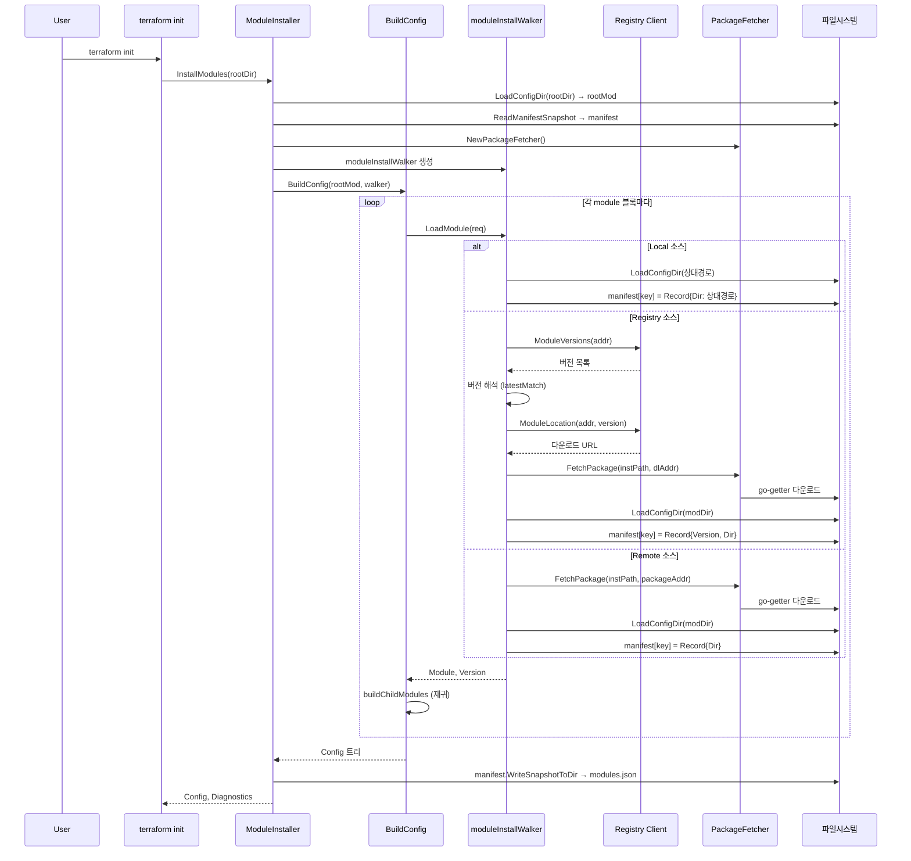
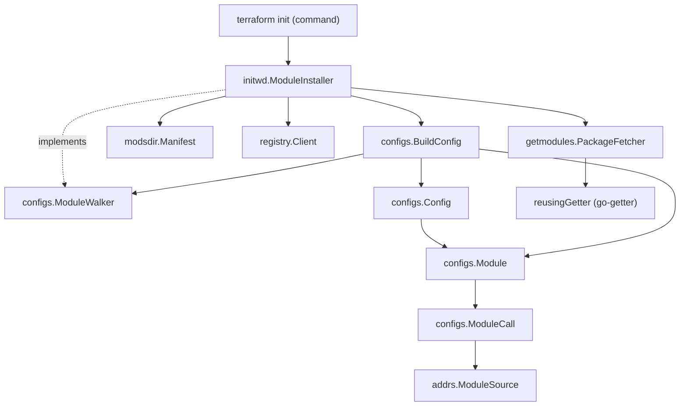

# 12. Terraform Module System Deep-Dive

## 목차

1. [개요](#1-개요)
2. [모듈 소스 주소 체계](#2-모듈-소스-주소-체계)
3. [ModuleCall: 설정 파싱 단계](#3-modulecall-설정-파싱-단계)
4. [Config 트리: 정적 모듈 트리](#4-config-트리-정적-모듈-트리)
5. [BuildConfig와 ModuleWalker](#5-buildconfig와-modulewalker)
6. [ModuleInstaller: 모듈 설치 엔진](#6-moduleinstaller-모듈-설치-엔진)
7. [소스 유형별 설치 전략](#7-소스-유형별-설치-전략)
8. [레지스트리 클라이언트와 버전 해석](#8-레지스트리-클라이언트와-버전-해석)
9. [Manifest: 설치 상태 추적](#9-manifest-설치-상태-추적)
10. [PackageFetcher와 go-getter](#10-packagefetcher와-go-getter)
11. [모듈 확장: count/for_each](#11-모듈-확장-countfor_each)
12. [Provider 전달 메커니즘](#12-provider-전달-메커니즘)
13. [설계 결정 분석](#13-설계-결정-분석)
14. [전체 아키텍처 정리](#14-전체-아키텍처-정리)

---

## 1. 개요

Terraform의 Module System은 인프라 코드의 **재사용, 캡슐화, 구성**을 위한 핵심 메커니즘이다. 하나의 Terraform 설정은 root 모듈로부터 시작하여, `module` 블록을 통해 자식 모듈을 호출하고, 그 자식이 또 다른 자식을 호출하는 **트리 구조**를 형성한다.

### 모듈 시스템의 핵심 질문

| 질문 | 답 |
|------|-----|
| 모듈 소스는 어디서 오는가? | Local, Registry, Remote (Git/S3/HTTP 등) 3종 |
| 어떻게 설치되는가? | `terraform init` 시 ModuleInstaller가 `.terraform/modules/`에 다운로드 |
| 설치 상태는 어떻게 추적하는가? | `modules.json` manifest 파일 |
| 설정 트리는 어떻게 구축되는가? | BuildConfig + ModuleWalker 패턴 |
| 실행 시 어떻게 확장되는가? | count/for_each에 의한 ModuleExpansionTransformer |

### 관련 소스코드 위치

```
terraform/internal/
├── addrs/
│   ├── module.go                    # Module 주소 타입 (정적 경로)
│   ├── module_instance.go           # ModuleInstance (동적 인스턴스)
│   ├── module_source.go             # ModuleSource 인터페이스 (Local/Registry/Remote)
│   └── module_package.go            # ModulePackage, ModuleRegistryPackage
├── configs/
│   ├── config.go                    # Config 트리 노드
│   ├── config_build.go              # BuildConfig, ModuleWalker
│   ├── module.go                    # Module 구조체 (파싱된 설정)
│   └── module_call.go               # ModuleCall (module 블록 파싱)
├── initwd/
│   ├── module_install.go            # ModuleInstaller (설치 엔진)
│   └── module_install_hooks.go      # ModuleInstallHooks (UI 콜백)
├── modsdir/
│   ├── manifest.go                  # Manifest, Record (설치 상태)
│   └── paths.go                     # ManifestSnapshotFilename
├── getmodules/
│   ├── installer.go                 # PackageFetcher
│   └── getter.go                    # reusingGetter (go-getter 래퍼)
├── registry/
│   └── client.go                    # Registry Client (API 호출)
└── terraform/
    ├── transform_module_expansion.go # ModuleExpansionTransformer
    └── node_module_expand.go        # nodeExpandModule
```

---

## 2. 모듈 소스 주소 체계

Terraform은 모듈 소스 주소를 **3가지 유형**으로 분류한다. 이 분류는 설치 전략과 버전 관리 방식을 결정하는 핵심 분기점이다.

### ModuleSource 인터페이스

```
// 파일: internal/addrs/module_source.go

type ModuleSource interface {
    String() string      // 정규화된 전체 표현
    ForDisplay() string  // 사용자 친화적 표현
    moduleSource()       // 인터페이스 마커
}
```

### 3가지 구현 타입

```
                    ModuleSource (interface)
                   /         |          \
                  /          |           \
    ModuleSourceLocal  ModuleSourceRegistry  ModuleSourceRemote
    (상대 경로)         (레지스트리)           (원격 패키지)
```

#### (1) ModuleSourceLocal

```go
// 파일: internal/addrs/module_source.go

type ModuleSourceLocal string   // 예: "./modules/vpc", "../shared"
```

- 상대 경로(`.`/`..`으로 시작)만 허용
- **파일 복사 없음**: 부모 모듈 디렉토리로부터 상대 경로로 직접 참조
- **버전 제약 불가**: version 인수를 사용하면 에러

#### (2) ModuleSourceRegistry

```go
// 파일: internal/addrs/module_source.go

type ModuleSourceRegistry tfaddr.Module
// 예: "hashicorp/consul/aws", "registry.example.com/org/module/provider"
```

- `hostname/namespace/name/provider` 형식 (hostname 생략 시 `registry.terraform.io`)
- **2단계 해석**: Registry API로 버전 목록 조회 -> 다운로드 URL 취득 -> Remote 주소로 변환
- **버전 제약 가능**: `version = "~> 2.0"` 형태로 범위 지정

#### (3) ModuleSourceRemote

```go
// 파일: internal/addrs/module_source.go

type ModuleSourceRemote struct {
    Package ModulePackage  // go-getter 주소 (git::https://..., s3::... 등)
    Subdir  string         // 패키지 내 서브디렉토리
}
```

- Git, S3, GCS, HTTP 등 go-getter가 지원하는 모든 프로토콜
- Subdir로 패키지 내 특정 디렉토리를 지정 (예: `git::https://...//modules/vpc`)
- **버전 제약 불가**: 레지스트리를 거치지 않으므로 직접 ref 태그 등으로 관리

### 소스 주소 파싱 분기

```
module "vpc" {
  source  = "..."        # source 문자열
  version = "~> 2.0"     # version 인수 (optional)
}

파싱 로직 (module_call.go):

  if haveVersionArg {
      addr, err = moduleaddrs.ParseModuleSourceRegistry(mc.SourceAddrRaw)
      // version이 있으면 반드시 Registry 주소로 파싱 시도
  } else {
      addr, err = moduleaddrs.ParseModuleSource(mc.SourceAddrRaw)
      // 자동 감지: "./"면 Local, "host/ns/name/provider"면 Registry, 나머지 Remote
  }
```

**왜 version 유무로 파싱 전략을 나누는가?** `version` 인수는 레지스트리 모듈에서만 유효하다. version이 명시되었는데 소스가 레지스트리 형식이 아니면, 사용자 의도와 불일치하므로 더 명확한 에러 메시지를 제공할 수 있다.

---

## 3. ModuleCall: 설정 파싱 단계

`module` 블록을 HCL에서 파싱하면 `ModuleCall` 구조체가 생성된다.

### ModuleCall 구조체

```go
// 파일: internal/configs/module_call.go

type ModuleCall struct {
    Name            string              // module "name" { ... } 의 name
    SourceAddr      addrs.ModuleSource  // 파싱된 소스 주소
    SourceAddrRaw   string              // 원본 소스 문자열
    SourceAddrRange hcl.Range           // 소스 위치 (에러 메시지용)
    SourceSet       bool                // source 속성 존재 여부
    Config          hcl.Body            // 모듈에 전달할 입력 변수 (미평가 HCL body)
    Version         VersionConstraint   // 버전 제약 (Registry 전용)
    Count           hcl.Expression      // count 메타인수
    ForEach         hcl.Expression      // for_each 메타인수
    Providers       []PassedProviderConfig  // providers = { ... }
    DependsOn       []hcl.Traversal     // depends_on 명시적 의존성
    DeclRange       hcl.Range           // 블록 위치
}
```

### moduleBlockSchema

```go
// 파일: internal/configs/module_call.go

var moduleBlockSchema = &hcl.BodySchema{
    Attributes: []hcl.AttributeSchema{
        {Name: "source", Required: true},
        {Name: "version"},
        {Name: "count"},
        {Name: "for_each"},
        {Name: "depends_on"},
        {Name: "providers"},
        {Name: "ignore_nested_deprecations"},
    },
    Blocks: []hcl.BlockHeaderSchema{
        {Type: "_"},         // 메타인수 이스케이프 블록
        {Type: "lifecycle"}, // 예약됨
        {Type: "locals"},    // 예약됨
        {Type: "provider", LabelNames: []string{"type"}}, // 예약됨
    },
}
```

### PartialContent 패턴의 활용

```
module 블록의 HCL Body
  │
  ├── PartialContent(moduleBlockSchema) ──→ 메타인수 추출 (source, version, count 등)
  │
  └── remain (나머지 Body) ──→ mc.Config에 저장
                                  │
                                  └── 나중에 모듈의 variable 스키마로 디코딩
```

**왜 PartialContent인가?** `module` 블록은 메타인수(source, version 등)와 모듈 입력 변수가 동일한 블록 안에 혼재한다. PartialContent를 사용하면 알려진 메타인수만 먼저 추출하고, 나머지는 모듈이 선언한 variable과 매칭하기 위해 미평가 상태로 보존한다.

### PassedProviderConfig

```go
// 파일: internal/configs/module_call.go

type PassedProviderConfig struct {
    InChild  *ProviderConfigRef  // 자식 모듈에서의 provider 이름
    InParent *ProviderConfigRef  // 부모 모듈에서의 provider 이름
}
```

```hcl
module "vpc" {
  source = "./modules/vpc"

  providers = {
    aws        = aws.west       # InChild: "aws", InParent: "aws.west"
    aws.backup = aws.east       # InChild: "aws.backup", InParent: "aws.east"
  }
}
```

---

## 4. Config 트리: 정적 모듈 트리

모듈을 설치하고 파싱한 결과는 `Config` 트리로 조립된다. 이 트리는 **정적 모듈 트리**로, count/for_each에 의한 인스턴스 확장 이전의 구조를 나타낸다.

### Config 구조체

```go
// 파일: internal/configs/config.go

type Config struct {
    Root     *Config              // 항상 루트 모듈을 가리킴 (루트면 자기 자신)
    Parent   *Config              // 부모 모듈 (루트면 nil)
    Path     addrs.Module         // 루트로부터의 정적 경로 (예: ["network", "vpc"])
    Children map[string]*Config   // 자식 모듈 맵 (키: module 블록 이름)
    Module   *Module              // 이 모듈의 파싱된 설정 (리소스, 변수 등)

    // 소스 정보 (루트 모듈에서는 의미 없음)
    CallRange       hcl.Range
    SourceAddr      addrs.ModuleSource
    SourceAddrRaw   string
    SourceAddrRange hcl.Range
    Version         *version.Version   // Registry 모듈만 해당
}
```

### Config 트리 예시

```
project/
├── main.tf           # root module
│   ├── module "network" { source = "./modules/network" }
│   └── module "app"     { source = "hashicorp/consul/aws" version = "~> 0.1" }
└── modules/
    └── network/
        └── main.tf
            └── module "vpc" { source = "../vpc" }

                    Config Tree
                    ═══════════

            Root (Path: [])
            ├── Module: {ManagedResources, Variables, ...}
            ├── Children:
            │   ├── "network" ──→ Config (Path: ["network"])
            │   │   ├── SourceAddr: ModuleSourceLocal("./modules/network")
            │   │   ├── Version: nil (로컬이므로)
            │   │   ├── Module: {ManagedResources, ...}
            │   │   └── Children:
            │   │       └── "vpc" ──→ Config (Path: ["network", "vpc"])
            │   │           ├── SourceAddr: ModuleSourceLocal("../vpc")
            │   │           └── ...
            │   └── "app" ──→ Config (Path: ["app"])
            │       ├── SourceAddr: ModuleSourceRegistry{...}
            │       ├── Version: v0.1.5
            │       ├── Module: {ManagedResources, ...}
            │       └── Children: {}
            └── Root: (self-referential)
```

### 핵심 탐색 메서드

| 메서드 | 용도 |
|--------|------|
| `DeepEach(cb)` | 전체 트리를 DFS로 순회, 부모 먼저 방문 |
| `Descendant(path)` | 정적 경로로 자손 모듈 검색 |
| `DescendantForInstance(path)` | 동적 ModuleInstance 경로에서 정적 Config 검색 |
| `ProviderRequirements()` | 전체 트리의 provider 요구사항 수집 |
| `Depth()` | 루트로부터의 깊이 계산 |

### Module vs ModuleInstance

```
정적 (Config 트리):   module.network.vpc        ← addrs.Module
동적 (실행 시):        module.network[0].vpc[1]  ← addrs.ModuleInstance

Module = []string{"network", "vpc"}
ModuleInstance = []ModuleInstanceStep{
    {Name: "network", InstanceKey: IntKey(0)},
    {Name: "vpc", InstanceKey: IntKey(1)},
}
```

**왜 정적/동적 주소를 분리하는가?** 설정 파싱 시점에는 count/for_each의 값이 아직 평가되지 않았으므로 인스턴스 키를 알 수 없다. Config 트리는 정적 구조만 표현하고, 실행 시 Graph Walk에서 count/for_each를 평가하여 동적으로 인스턴스를 확장한다.

---

## 5. BuildConfig와 ModuleWalker

Config 트리 구축은 `BuildConfig` 함수가 담당한다. 이 함수는 **Visitor 패턴**의 변형인 `ModuleWalker`를 사용하여 자식 모듈을 재귀적으로 로드한다.

### BuildConfig 전체 흐름

```
BuildConfig(root *Module, walker ModuleWalker, loader MockDataLoader)
    │
    ├── (1) cfg := &Config{Module: root, Root: cfg}
    │       루트 Config 노드 생성 (자기참조)
    │
    ├── (2) cfg.Children = buildChildModules(cfg, walker)
    │       │
    │       ├── root.Module.ModuleCalls 순회
    │       │
    │       └── 각 ModuleCall마다:
    │           ├── ModuleRequest 생성 (Name, Path, SourceAddr, VersionConstraint, Parent)
    │           ├── loadModule(root, &req, walker)
    │           │   ├── walker.LoadModule(req) → (Module, Version, Diagnostics)
    │           │   ├── Config 노드 생성
    │           │   └── buildChildModules(child, walker) ← 재귀!
    │           └── ret[call.Name] = child
    │
    ├── (3) buildTestModules(cfg, walker)
    │       테스트 파일의 run 블록에서 참조하는 모듈 로드
    │
    ├── (4) cfg.resolveProviderTypes()
    │       모듈 트리 전체의 provider 타입 해석
    │
    ├── (5) validateProviderConfigs(nil, cfg, nil)
    │       provider 설정 유효성 검증
    │
    └── (6) installMockDataFiles(cfg, loader)
            테스트용 mock 데이터 로드
```

### ModuleWalker 인터페이스

```go
// 파일: internal/configs/config_build.go

type ModuleWalker interface {
    LoadModule(req *ModuleRequest) (*Module, *version.Version, hcl.Diagnostics)
}

type ModuleWalkerFunc func(req *ModuleRequest) (*Module, *version.Version, hcl.Diagnostics)
```

```go
// ModuleRequest: walker에게 전달되는 요청 정보
type ModuleRequest struct {
    Name              string                // module 블록 이름
    Path              addrs.Module          // 루트로부터의 전체 경로
    SourceAddr        addrs.ModuleSource    // 파싱된 소스 주소
    SourceAddrRange   hcl.Range
    VersionConstraint VersionConstraint     // 버전 제약
    Parent            *Config               // 부모 Config (Children 미완성 상태)
    CallRange         hcl.Range
}
```

### Walker 패턴의 의미

```
                BuildConfig
                     │
          ┌──────────┼──────────┐
          │          │          │
     loadModule  loadModule  loadModule
          │          │          │
          ▼          ▼          ▼
     walker.LoadModule(req)
          │
          │   ← 이 콜백이 실제 "설치 또는 로드" 결정
          │     - terraform init: ModuleInstaller가 구현
          │     - 설정 로드: configload.Loader가 구현
          │     - 테스트: DisabledModuleWalker 등 사용
          │
          ▼
     *configs.Module 반환
```

**왜 Walker 패턴인가?** BuildConfig는 트리 구조를 재귀적으로 구축하는 역할에만 집중하고, 실제 모듈을 "어디서 어떻게 가져오는가"는 Walker 구현체에 위임한다. 이로써:
- `terraform init` 시에는 ModuleInstaller가 Walker로 동작하여 모듈을 다운로드/설치
- 이후 `terraform plan/apply` 시에는 이미 설치된 모듈을 로컬에서 로드하는 Walker 사용
- 테스트에서는 모듈 의존성 없이 단일 모듈만 테스트 가능

---

## 6. ModuleInstaller: 모듈 설치 엔진

`terraform init`의 핵심 컴포넌트인 `ModuleInstaller`는 root 모듈로부터 모든 의존 모듈을 재귀적으로 탐색하여 `.terraform/modules/` 디렉토리에 설치한다.

### ModuleInstaller 구조체

```go
// 파일: internal/initwd/module_install.go

type ModuleInstaller struct {
    modsDir string                // .terraform/modules/ 경로
    loader  *configload.Loader    // 설정 파서
    reg     *registry.Client      // 레지스트리 API 클라이언트

    // 캐시: 설치 세션 동안 레지스트리 응답을 재사용
    registryPackageVersions map[addrs.ModuleRegistryPackage]*response.ModuleVersions
    registryPackageSources  map[moduleVersion]addrs.ModuleSourceRemote
}

type moduleVersion struct {
    module  addrs.ModuleRegistryPackage
    version string
}
```

### InstallModules 전체 흐름

```
InstallModules(ctx, rootDir, testsDir, upgrade, installErrsOnly, hooks)
    │
    ├── (1) rootMod = loader.Parser().LoadConfigDirWithTests(rootDir, testsDir)
    │       루트 모듈 파싱 (HCL → Module 구조체)
    │
    ├── (2) rootMod.CheckCoreVersionRequirements(nil, nil)
    │       Terraform 버전 호환성 검사
    │
    ├── (3) manifest = modsdir.ReadManifestSnapshotForDir(modsDir)
    │       기존 설치 상태 로드 (modules.json)
    │
    ├── (4) fetcher = getmodules.NewPackageFetcher()
    │       패키지 다운로더 생성
    │
    ├── (5) manifest[""] = Record{Key: "", Dir: rootDir}
    │       루트 모듈의 manifest 레코드 생성
    │
    ├── (6) walker = moduleInstallWalker(ctx, manifest, upgrade, hooks, fetcher)
    │       ModuleWalker 콜백 생성
    │
    ├── (7) cfg = installDescendantModules(rootMod, manifest, walker, installErrsOnly)
    │       ├── configs.BuildConfig(rootMod, walker, ...)
    │       │   └── 재귀적으로 walker.LoadModule 호출
    │       │       └── 각 모듈마다 설치 또는 캐시 활용
    │       └── manifest.WriteSnapshotToDir(modsDir)
    │           설치 완료 후 manifest 저장
    │
    └── return cfg, diags
```

### moduleInstallWalker 내부 로직

이 함수가 생성하는 `ModuleWalkerFunc` 콜백이 모듈 시스템의 핵심 설치 로직을 포함한다.

```
moduleInstallWalker 콜백(req *ModuleRequest)
    │
    ├── (1) 유효성 검사
    │       ├── req.SourceAddr == nil? → 부모 파싱 에러, 스킵
    │       ├── req.Name == ""? → manifest 키 충돌 방지
    │       └── !ValidIdentifier(req.Name)? → 원격 모듈 경로 안전성
    │
    ├── (2) 재설치 필요 여부 판단
    │       ├── upgrade 플래그가 true? → 항상 재설치
    │       ├── manifest에 기록 없음? → 새 설치
    │       ├── SourceAddr 변경? → 재설치
    │       └── Version이 제약에 불합치? → 재설치
    │
    ├── (3) 기존 설치 활용 (재설치 불필요 시)
    │       ├── manifest 레코드의 Dir이 존재하는 디렉토리?
    │       ├── loader.Parser().LoadConfigDir(record.Dir) → Module 반환
    │       └── return mod, record.Version, diags
    │
    └── (4) 소스 유형별 설치 (재설치 필요 시)
            switch addr := req.SourceAddr.(type) {
            case ModuleSourceLocal:
                installLocalModule(req, key, manifest, hooks)
            case ModuleSourceRegistry:
                installRegistryModule(ctx, req, key, instPath, addr, manifest, hooks, fetcher)
            case ModuleSourceRemote:
                installGoGetterModule(ctx, req, key, instPath, manifest, hooks, fetcher)
            }
```

### 재설치 판단 로직 상세

```go
// 파일: internal/initwd/module_install.go (moduleInstallWalker 내부)

replace := upgrade
if !replace {
    record, recorded := manifest[key]
    switch {
    case !recorded:
        // 처음 설치하는 모듈
        replace = true
    case record.SourceAddr != req.SourceAddr.String():
        // 소스 주소가 변경됨 (예: Registry → Local)
        replace = true
    case record.Version != nil && !req.VersionConstraint.Required.Check(record.Version):
        // 기존 버전이 새 제약에 맞지 않음
        replace = true
    }
}
```

**왜 이 3가지 조건인가?**

1. **미기록**: 최초 설치이므로 반드시 다운로드 필요
2. **소스 변경**: 설정에서 `source`를 바꿨으면 이전 설치는 무효
3. **버전 불합치**: 설정에서 `version`을 바꿨으면 현재 설치된 버전이 맞지 않을 수 있음

### 캐스케이드 삭제

모듈을 재설치할 때, 그 모듈의 모든 하위 모듈도 함께 삭제한다.

```go
// 하위 모듈 캐스케이드 삭제
if replace {
    delete(manifest, key)
    keyPrefix := key + "."
    for subKey := range manifest {
        if strings.HasPrefix(subKey, keyPrefix) {
            delete(manifest, subKey)
        }
    }
}
```

```
manifest 키 구조:

""              ← 루트 모듈
"network"       ← module.network
"network.vpc"   ← module.network.module.vpc
"app"           ← module.app

"network" 재설치 시:
  - "network" 삭제
  - "network.vpc" 삭제 (keyPrefix = "network.")
  - "app"은 유지
```

---

## 7. 소스 유형별 설치 전략

### (1) Local 모듈 설치

```go
// 파일: internal/initwd/module_install.go

func (i *ModuleInstaller) installLocalModule(
    req *configs.ModuleRequest, key string,
    manifest modsdir.Manifest, hooks ModuleInstallHooks,
) (*configs.Module, hcl.Diagnostics) {

    // 부모 모듈의 디렉토리를 기준으로 상대 경로 해석
    parentKey := manifest.ModuleKey(req.Parent.Path)
    parentRecord := manifest[parentKey]
    newDir := filepath.Join(parentRecord.Dir, req.SourceAddr.String())

    // 심볼릭 링크 해석
    newDir, err := filepath.EvalSymlinks(newDir)

    // 파일 복사 없이 직접 로드
    mod, mDiags := i.loader.Parser().LoadConfigDir(newDir)

    // manifest에 기록 (Dir만 저장, Version 없음)
    manifest[key] = modsdir.Record{
        Key:        key,
        Dir:        newDir,
        SourceAddr: req.SourceAddr.String(),
    }
    hooks.Install(key, nil, newDir)
    return mod, diags
}
```

**핵심 특징:**
- **파일 복사 없음**: `.terraform/modules/`에 복사하지 않고, 원본 디렉토리를 직접 참조
- **버전 없음**: 로컬 모듈은 항상 현재 파일시스템 상태를 사용
- **부모 기준 경로 해석**: 부모의 manifest 레코드에서 Dir을 가져와 상대 경로를 결합

### (2) Registry 모듈 설치

```
installRegistryModule 흐름:

    ┌──────────────────────────────────────────────────────────────┐
    │                    Registry Module Install                   │
    │                                                              │
    │  (1) 캐시 확인                                               │
    │      registryPackageVersions[packageAddr] 존재?              │
    │      ├── Yes → 캐시된 버전 목록 사용                         │
    │      └── No → reg.ModuleVersions(regsrcAddr) API 호출       │
    │                                                              │
    │  (2) 버전 해석                                               │
    │      모든 버전 순회:                                          │
    │      ├── Pre-release 필터링 (정확 매치만 허용)               │
    │      ├── latestVersion 추적 (에러 메시지용)                  │
    │      └── req.VersionConstraint.Required.Check(v)             │
    │          └── latestMatch = 최신 호환 버전                    │
    │                                                              │
    │  (3) 다운로드 URL 취득                                       │
    │      registryPackageSources[moduleAddr] 캐시 확인            │
    │      └── 미스 → reg.ModuleLocation(regsrcAddr, version)     │
    │                  └── X-Terraform-Get 헤더에서 URL 추출      │
    │                  └── ModuleSourceRemote로 파싱               │
    │                                                              │
    │  (4) 패키지 다운로드                                         │
    │      fetcher.FetchPackage(ctx, instPath, dlAddr.Package)    │
    │                                                              │
    │  (5) 서브디렉토리 해석                                       │
    │      finalAddr = dlAddr.FromRegistry(addr)                  │
    │      modDir = filepath.Join(instPath, finalAddr.Subdir)     │
    │                                                              │
    │  (6) 설정 로드 & manifest 기록                               │
    │      loader.Parser().LoadConfigDir(modDir)                  │
    │      manifest[key] = Record{Version: latestMatch, Dir, ...} │
    └──────────────────────────────────────────────────────────────┘
```

### (3) Remote 모듈 설치 (go-getter)

```go
// 파일: internal/initwd/module_install.go

func (i *ModuleInstaller) installGoGetterModule(
    ctx context.Context, req *configs.ModuleRequest,
    key string, instPath string,
    manifest modsdir.Manifest, hooks ModuleInstallHooks,
    fetcher *getmodules.PackageFetcher,
) (*configs.Module, hcl.Diagnostics) {

    addr := req.SourceAddr.(addrs.ModuleSourceRemote)

    // version은 불허
    if len(req.VersionConstraint.Required) != 0 {
        // Error: "Cannot apply a version constraint..."
    }

    // go-getter로 패키지 다운로드
    err := fetcher.FetchPackage(ctx, instPath, addr.Package.String())

    // 서브디렉토리 glob 확장
    modDir, err := moduleaddrs.ExpandSubdirGlobs(instPath, addr.Subdir)

    // 설정 로드 & manifest 기록
    mod, mDiags := i.loader.Parser().LoadConfigDir(modDir)
    manifest[key] = modsdir.Record{
        Key:        key,
        Dir:        modDir,
        SourceAddr: req.SourceAddr.String(),
    }
}
```

### 소스 유형별 비교표

| 특성 | Local | Registry | Remote |
|------|-------|----------|--------|
| 파일 복사 | 없음 | .terraform/modules/에 다운로드 | .terraform/modules/에 다운로드 |
| 버전 관리 | 불가 | version 제약 지원 | 불가 (Git ref 등으로 수동) |
| 경로 해석 | 부모 Dir 기준 상대 경로 | Registry API -> Remote URL | go-getter 직접 |
| Manifest Dir | 원본 디렉토리 경로 | .terraform/modules/key 내 경로 | .terraform/modules/key 내 경로 |
| Version in Manifest | nil | *version.Version | nil |
| 패키지 캐시 | 해당 없음 | registryPackageVersions/Sources | reusingGetter |

---

## 8. 레지스트리 클라이언트와 버전 해석

### Registry Client

```go
// 파일: internal/registry/client.go

type Client struct {
    client   *retryablehttp.Client  // 재시도 가능한 HTTP 클라이언트
    services *disco.Disco           // 서비스 디스커버리
}
```

### 서비스 디스커버리

Registry 통신은 **2단계 간접 참조**를 거친다.

```
(1) Service Discovery
    GET https://registry.terraform.io/.well-known/terraform.json
    Response: { "modules.v1": "/v1/modules/" }

(2) Module Versions
    GET https://registry.terraform.io/v1/modules/{namespace}/{name}/{provider}/versions
    Response: { "modules": [{ "versions": [{"version": "2.1.0"}, ...] }] }

(3) Module Download
    GET https://registry.terraform.io/v1/modules/{namespace}/{name}/{provider}/{version}/download
    Response: 204 No Content
    Header: X-Terraform-Get: https://github.com/hashicorp/.../archive/v2.1.0.tar.gz
```

**왜 X-Terraform-Get 헤더인가?** 레지스트리는 모듈의 실제 소스 코드를 호스팅하지 않는다. 대신 모듈 작성자가 등록한 다운로드 URL을 헤더로 반환한다. 이 설계 덕분에 레지스트리는 가볍게 유지되면서도 다양한 저장소(GitHub, S3, etc.)를 지원할 수 있다.

### 버전 해석 알고리즘

```go
// 파일: internal/initwd/module_install.go (installRegistryModule 내부)

var latestMatch *version.Version   // 제약에 맞는 최신 버전
var latestVersion *version.Version // 전체 최신 버전 (에러 메시지용)

for _, mv := range modMeta.Versions {
    v, err := version.NewVersion(mv.Version)

    // Pre-release 필터링
    if v.Prerelease() != "" {
        acceptableVersions, _ := versions.MeetingConstraintsString(
            req.VersionConstraint.Required.String())
        version, _ := versions.ParseVersion(v.String())
        if !acceptableVersions.Has(version) {
            continue  // 정확히 요청하지 않은 pre-release는 무시
        }
    }

    // 전체 최신 추적
    if latestVersion == nil || v.GreaterThan(latestVersion) {
        latestVersion = v
    }

    // 제약 매칭
    if req.VersionConstraint.Required.Check(v) {
        if latestMatch == nil || v.GreaterThan(latestMatch) {
            latestMatch = v
        }
    }
}
```

### Pre-release 처리 전략

```
version = "~> 2.0"

사용 가능한 버전:
  2.0.0       ← Check → Yes
  2.1.0       ← Check → Yes
  2.1.1-beta  ← Pre-release → 정확 매치 아님 → 무시
  3.0.0       ← Check → No (major 다름)

version = "2.1.1-beta"

사용 가능한 버전:
  2.1.1-beta  ← Pre-release → 정확 매치 → 허용!
```

**왜 pre-release를 별도 라이브러리(apparentlymart/go-versions)로 검증하는가?** hashicorp/go-version과 apparentlymart/go-versions는 pre-release 처리 방식이 다르다. Terraform은 "pre-release는 정확히 요청한 경우에만 사용"이라는 정책을 따르는데, 이 동작은 apparentlymart/go-versions 라이브러리가 기본 제공한다. 코드 주석에서도 향후 provider 버전 로직과 통일하기 위해 이 라이브러리를 사용한다고 설명한다.

### 레지스트리 응답 캐싱

```go
// 두 개의 캐시 맵으로 중복 API 호출 방지

// 캐시 1: 버전 목록 (동일 패키지의 여러 서브모듈이 있을 때 유용)
registryPackageVersions map[addrs.ModuleRegistryPackage]*response.ModuleVersions

// 캐시 2: 다운로드 URL (동일 버전의 여러 서브모듈이 있을 때 유용)
registryPackageSources map[moduleVersion]addrs.ModuleSourceRemote
```

```
예시: 동일 패키지의 서브모듈들

module "vpc" {
  source  = "hashicorp/consul/aws//modules/consul-cluster"
  version = "~> 0.1"
}

module "server" {
  source  = "hashicorp/consul/aws//modules/consul-server"
  version = "~> 0.1"
}

→ 두 모듈 모두 "hashicorp/consul/aws" 패키지에 속함
→ ModuleVersions API는 1번만 호출, ModuleLocation도 1번만 호출
→ 패키지 다운로드도 reusingGetter 덕분에 1번만 (이후 로컬 복사)
```

---

## 9. Manifest: 설치 상태 추적

### Record 구조체

```go
// 파일: internal/modsdir/manifest.go

type Record struct {
    Key        string           `json:"Key"`              // 모듈 경로 키 (예: "network.vpc")
    SourceAddr string           `json:"Source"`            // 소스 주소 문자열
    Version    *version.Version `json:"-"`                 // 파싱된 버전 (JSON 직렬화 제외)
    VersionStr string           `json:"Version,omitempty"` // JSON용 버전 문자열
    Dir        string           `json:"Dir"`               // 로컬 디렉토리 경로
}
```

### Manifest 타입

```go
type Manifest map[string]Record  // 키: ModuleKey (경로를 '.'으로 연결)
```

### ModuleKey 생성 규칙

```go
func (m Manifest) ModuleKey(path addrs.Module) string {
    if len(path) == 0 {
        return ""  // 루트 모듈
    }
    return strings.Join([]string(path), ".")
}
```

```
addrs.Module{}                    → ""              (루트)
addrs.Module{"network"}          → "network"
addrs.Module{"network", "vpc"}   → "network.vpc"
addrs.Module{"app"}              → "app"
```

### modules.json 파일 형식

```json
{
  "Modules": [
    {
      "Key": "",
      "Source": "",
      "Dir": "."
    },
    {
      "Key": "network",
      "Source": "./modules/network",
      "Dir": "modules/network"
    },
    {
      "Key": "network.vpc",
      "Source": "../vpc",
      "Dir": "modules/vpc"
    },
    {
      "Key": "app",
      "Source": "registry.terraform.io/hashicorp/consul/aws",
      "Version": "0.1.5",
      "Dir": ".terraform/modules/app"
    }
  ]
}
```

### 직렬화/역직렬화

```
                 WriteSnapshot                    ReadManifestSnapshot
Manifest (map) ──────────────→ modules.json ──────────────────────→ Manifest (map)
    │                              │                                    │
    ├── Version → VersionStr       ├── JSON 배열                       ├── VersionStr → Version
    ├── Dir: filepath.ToSlash()    │   (키 정렬됨)                     ├── Dir: filepath.FromSlash()
    └── 키 정렬 후 직렬화          └── manifestSnapshotFile             └── SourceAddr 정규화
```

**왜 Dir 경로를 ToSlash/FromSlash로 변환하는가?** modules.json은 `terraform init`을 실행한 OS에서 생성된다. Windows에서는 `\`를 사용하지만, 이 파일이 Terraform Cloud의 원격 실행에서 Linux 워커에 의해 읽힐 수 있다. 따라서 저장 시 항상 forward slash로 정규화하고, 읽기 시 OS에 맞게 변환한다.

### 역직렬화의 방어적 처리

```go
// 빈 파일 허용
if len(src) == 0 {
    return make(Manifest), nil
}

// 중복 키 감지
if _, exists := new[record.Key]; exists {
    return nil, fmt.Errorf("snapshot file contains two records for path %s", record.Key)
}

// 소스 주소 정규화 (하위 호환)
if record.SourceAddr != "" {
    if addr, err := moduleaddrs.ParseModuleSource(record.SourceAddr); err == nil {
        record.SourceAddr = addr.String()
    }
}
```

### 파일시스템 레이아웃

```
project/
├── main.tf
├── modules/
│   ├── network/
│   │   └── main.tf
│   └── vpc/
│       └── main.tf
└── .terraform/
    └── modules/
        ├── modules.json          ← Manifest 파일
        ├── app/                  ← Registry 모듈 (hashicorp/consul/aws)
        │   ├── main.tf
        │   └── modules/
        │       ├── consul-cluster/
        │       └── consul-server/
        └── monitoring/           ← Remote 모듈 (git::https://...)
            └── main.tf
```

**Local 모듈은 .terraform/modules/ 안에 없다.** Local 모듈(./modules/network)은 원본 디렉토리를 직접 참조하므로 복사되지 않는다. modules.json의 Dir 필드가 프로젝트 내 상대 경로를 직접 가리킨다.

---

## 10. PackageFetcher와 go-getter

### PackageFetcher

```go
// 파일: internal/getmodules/installer.go

type PackageFetcher struct {
    getter reusingGetter  // 동일 패키지 재다운로드 방지
}

func (f *PackageFetcher) FetchPackage(
    ctx context.Context, instDir string, packageAddr string,
) error {
    return f.getter.getWithGoGetter(ctx, instDir, packageAddr)
}
```

### reusingGetter: 패키지 수준 캐시

```go
// 파일: internal/getmodules/getter.go

type reusingGetter map[string]string  // packageAddr → 이전 설치 경로

func (g reusingGetter) getWithGoGetter(ctx context.Context, instPath, packageAddr string) error {
    if prevDir, exists := g[packageAddr]; exists {
        // 이전에 이미 다운로드한 패키지 → 로컬 복사
        os.Mkdir(instPath, os.ModePerm)
        copy.CopyDir(instPath, prevDir)
    } else {
        // 최초 다운로드
        client := getter.Client{
            Src:           packageAddr,
            Dst:           instPath,
            Mode:          getter.ClientModeDir,
            Detectors:     goGetterNoDetectors,  // 감지기 비활성화
            Decompressors: goGetterDecompressors,
            Getters:       goGetterGetters,
            Ctx:           ctx,
        }
        client.Get()
        g[packageAddr] = instPath  // 캐시에 기록
    }
    return nil
}
```

### 지원하는 프로토콜

```go
// 파일: internal/getmodules/getter.go

var goGetterGetters = map[string]getter.Getter{
    "http":  getterHTTPGetter,    // HTTP/HTTPS
    "https": getterHTTPGetter,
    "gcs":   new(getter.GCSGetter),  // Google Cloud Storage
    "s3":    new(getter.S3Getter),   // Amazon S3
    "git":   new(getter.GitGetter),  // Git
    "hg":    new(getter.HgGetter),   // Mercurial
    "file":  new(getter.FileGetter), // 로컬 파일시스템
}
```

### 지원하는 압축 형식

| 확장자 | 디컴프레서 |
|--------|-----------|
| bz2, tbz2, tar.bz2 | Bzip2, TarBzip2 |
| gz, tar.gz, tgz | Gzip, TarGzip |
| xz, tar.xz, txz | Xz, TarXz |
| zip | Zip |

### go-getter 사용 전략

**왜 goGetterNoDetectors를 사용하는가?** go-getter의 "detector"는 사용자 입력을 자동으로 특정 프로토콜로 변환하는 기능이다(예: `github.com/foo/bar`를 Git URL로). 하지만 Terraform은 자체적인 소스 주소 파싱(moduleaddrs 패키지)을 수행하며, 이 파싱 결과가 Terraform의 호환성 약속에 해당한다. go-getter의 detector가 새 버전에서 동작을 바꾸면 Terraform의 하위 호환성이 깨질 수 있으므로, detector를 완전히 비활성화하고 이미 정규화된 주소만 전달한다.

```
사용자 입력: "github.com/hashicorp/example"
    │
    ├── (Terraform의 주소 파서가 처리)
    │   moduleaddrs.ParseModuleSource(...)
    │   → addrs.ModuleSourceRemote{Package: "git::https://github.com/hashicorp/example.git"}
    │
    └── (go-getter에게 전달 - detector 없이)
        getter.Client{Src: "git::https://github.com/hashicorp/example.git", ...}
```

---

## 11. 모듈 확장: count/for_each

Config 트리는 **정적** 구조이다. 실행 시점에 `count`와 `for_each` 인수를 평가하여 모듈 인스턴스를 **동적**으로 확장하는 것은 `ModuleExpansionTransformer`의 역할이다.

### ModuleExpansionTransformer

```go
// 파일: internal/terraform/transform_module_expansion.go

type ModuleExpansionTransformer struct {
    Config   *configs.Config
    Concrete ConcreteModuleNodeFunc  // 래핑 함수 주입
}
```

### nodeExpandModule

```go
// 파일: internal/terraform/node_module_expand.go

type nodeExpandModule struct {
    Addr       addrs.Module       // 정적 모듈 경로
    Config     *configs.Module    // 모듈 설정
    ModuleCall *configs.ModuleCall // 호출 블록 (count/for_each 포함)
}
```

### 확장 과정

```
정적 Config 트리:
    Root
    └── module.network (count = 3)
        └── module.subnet

Graph Walk 시:

    nodeExpandModule{Addr: ["network"]}
        │
        ├── Execute():
        │   ├── count = 3 평가
        │   └── 3개 인스턴스 생성
        │       ├── module.network[0]
        │       ├── module.network[1]
        │       └── module.network[2]
        │
        └── 각 인스턴스가 다시 자식 모듈 확장
            ├── module.network[0].module.subnet
            ├── module.network[1].module.subnet
            └── module.network[2].module.subnet
```

### nodeExpandModule이 구현하는 인터페이스

```go
var (
    _ GraphNodeExecutable       = (*nodeExpandModule)(nil)
    _ GraphNodeReferenceable    = (*nodeExpandModule)(nil)
    _ GraphNodeReferencer       = (*nodeExpandModule)(nil)
    _ GraphNodeReferenceOutside = (*nodeExpandModule)(nil)
)
```

| 인터페이스 | 역할 |
|-----------|------|
| GraphNodeExecutable | Graph Walk에서 실행되어 인스턴스를 확장 |
| GraphNodeReferenceable | 다른 노드가 이 모듈을 참조할 수 있음 |
| GraphNodeReferencer | 이 모듈이 count/for_each에서 참조하는 의존성 표현 |
| GraphNodeReferenceOutside | 모듈 경계를 넘는 참조 해석 |

### 정적 vs 동적 주소 체계

```
┌─────────────────────────────────────────────────────────────┐
│                    주소 체계 비교                             │
│                                                              │
│  정적 (Config/설정 시점):                                    │
│    addrs.Module = []string                                   │
│    예: ["network", "vpc"]                                    │
│    용도: Config 트리 탐색, 설정 분석                         │
│                                                              │
│  동적 (실행 시점):                                           │
│    addrs.ModuleInstance = []ModuleInstanceStep                │
│    예: [{Name:"network", Key:IntKey(0)},                     │
│         {Name:"vpc", Key:StringKey("us-west")}]              │
│    용도: State 저장, 리소스 주소 지정                        │
│                                                              │
│  변환:                                                       │
│    Module → ModuleInstance:                                   │
│      count/for_each 평가 후 인스턴스 키 부여                 │
│    ModuleInstance → Module:                                   │
│      Config.DescendantForInstance() (키 무시)                 │
└─────────────────────────────────────────────────────────────┘
```

---

## 12. Provider 전달 메커니즘

모듈 시스템에서 provider 설정의 전달은 가장 복잡한 부분 중 하나이다.

### 기본 동작: 암묵적 전달

```hcl
# root module
provider "aws" {
  region = "us-west-2"
}

module "network" {
  source = "./modules/network"
  # providers 인수 생략 → 동일 이름의 provider가 자동 전달됨
}
```

### 명시적 전달: providers 인수

```hcl
provider "aws" {
  alias  = "west"
  region = "us-west-2"
}

provider "aws" {
  alias  = "east"
  region = "us-east-1"
}

module "network" {
  source = "./modules/network"

  providers = {
    aws = aws.west           # 자식의 "aws" → 부모의 "aws.west"
  }
}
```

### resolveProviderTypes: 타입 해석

```go
// 파일: internal/configs/config.go

func (c *Config) resolveProviderTypes() map[string]addrs.Provider {
    // (1) 자식 모듈 먼저 재귀적으로 해석
    for _, child := range c.Children {
        child.resolveProviderTypes()
    }

    // (2) required_providers에서 명시적 타입 수집
    providers := map[string]addrs.Provider{}
    for name, p := range c.Module.ProviderRequirements.RequiredProviders {
        providers[name] = p.Type  // 예: "aws" → "registry.terraform.io/hashicorp/aws"
    }

    // (3) provider 블록의 타입 설정
    for _, p := range c.Module.ProviderConfigs {
        addr, required := providers[p.Name]
        if required {
            p.providerType = addr
        } else {
            // 암묵적: 로컬 이름으로 기본 provider 추론
            p.providerType = addrs.NewDefaultProvider(p.Name)
        }
    }

    // (4) module 호출의 provider 매핑 연결
    for _, mod := range c.Module.ModuleCalls {
        for _, p := range mod.Providers {
            if addr, known := providers[p.InParent.Name]; known {
                p.InParent.providerType = addr
            }
        }
    }

    return providers
}
```

### ProviderRequirements 수집

Config 트리 전체를 순회하여 필요한 provider를 수집하는 과정:

```
addProviderRequirements(reqs, recurse, tests)
    │
    ├── (1) required_providers 블록에서 명시적 요구사항
    │       for name, req := range ProviderRequirements.RequiredProviders
    │           reqs[req.Type] = append(reqs[req.Type], constraints...)
    │
    ├── (2) ManagedResources에서 암묵적 요구사항
    │       for _, rc := range ManagedResources
    │           reqs[rc.Provider] = nil  // 버전 제약 없이 등록
    │
    ├── (3) DataResources에서 암묵적 요구사항
    │
    ├── (4) EphemeralResources에서 암묵적 요구사항
    │
    ├── (5) Import 블록에서 암묵적 요구사항
    │
    ├── (6) provider 블록의 version 인수 (deprecated but supported)
    │
    └── (7) 재귀: 자식 모듈 순회
            for _, childConfig := range c.Children
                childConfig.addProviderRequirements(reqs, true, false)
```

---

## 13. 설계 결정 분석

### Q1: 왜 모듈을 .terraform/modules/에 복사하는가?

```
대안 1: 원격 모듈을 직접 참조 (다운로드하지 않음)
  → 문제: 매번 plan/apply마다 네트워크 호출 필요
  → 문제: 오프라인에서 작동 불가
  → 문제: 원격 소스가 변경되면 예측 불가능한 동작

대안 2: 글로벌 캐시 디렉토리에 저장
  → 문제: 프로젝트 간 버전 충돌 가능
  → 문제: 동시 실행 시 경합 조건

선택: 프로젝트별 .terraform/modules/ 디렉토리
  → 장점: 완전 격리, 오프라인 가능, 예측 가능한 동작
  → 단점: 디스크 공간 사용 (동일 모듈이 여러 프로젝트에 중복)
```

### Q2: 왜 Local 모듈은 복사하지 않는가?

```
Local 모듈은 동일한 "패키지" 내에 속한다는 전제가 있다.
  → 같은 리포지토리에서 함께 관리됨
  → 항상 일관된 파일시스템 레이아웃이 보장됨
  → 복사하면 오히려 수정 사항이 반영되지 않는 혼란 발생

반면 Remote 모듈은 외부 패키지이므로:
  → 별도 생명주기로 관리됨
  → 네트워크 없이도 작동해야 함
  → 특정 시점의 스냅샷을 고정해야 함
```

### Q3: 왜 Manifest를 JSON 파일로 관리하는가?

```
대안: SQLite, BoltDB 등 임베디드 DB
  → 문제: 추가 의존성
  → 문제: 파일 잠금 이슈
  → 문제: 디버깅 어려움

선택: modules.json (단순 JSON 파일)
  → 장점: 사람이 읽을 수 있음 (디버깅 용이)
  → 장점: 추가 의존성 없음
  → 장점: VCS에서 diff 가능 (보통 .gitignore에 포함하지만)
  → 단점: 원자적 쓰기 보장 어려움 (실제로는 terraform init만 쓰므로 문제 없음)
```

### Q4: 왜 BuildConfig와 ModuleInstaller가 분리되어 있는가?

```
BuildConfig (configs 패키지)
  → 역할: Config 트리 구축의 "형태"만 담당
  → 입력: root Module + ModuleWalker
  → 출력: Config 트리
  → 설치 로직 모름

ModuleInstaller (initwd 패키지)
  → 역할: "terraform init" 시 모듈 다운로드/설치
  → ModuleWalker를 구현하여 BuildConfig에 주입
  → 레지스트리, go-getter 등의 의존성 보유

이 분리의 장점:
  → configs 패키지는 "순수한" 설정 처리에 집중 (네트워크 의존성 없음)
  → 테스트에서 DisabledModuleWalker 등으로 쉽게 대체 가능
  → init 이후의 plan/apply에서는 가벼운 Walker 사용 가능
```

### Q5: 왜 reusingGetter 캐시가 필요한가?

```
시나리오: 하나의 레지스트리 패키지에 여러 서브모듈이 있는 경우

module "cluster" {
  source  = "hashicorp/consul/aws//modules/consul-cluster"
  version = "~> 0.1"
}

module "server" {
  source  = "hashicorp/consul/aws//modules/consul-server"
  version = "~> 0.1"
}

캐시 없이: 동일한 Git 저장소를 2번 clone
캐시 있으면: 1번 clone + 1번 로컬 복사

reusingGetter는 packageAddr를 키로 사용하므로,
서브디렉토리가 달라도 동일 패키지면 재사용한다.
```

---

## 14. 전체 아키텍처 정리

### Mermaid: 모듈 설치 전체 흐름



### Mermaid: 모듈 시스템 패키지 의존성



### 패키지별 책임 요약

| 패키지 | 핵심 타입 | 책임 |
|--------|----------|------|
| `addrs` | Module, ModuleInstance, ModuleSource | 주소 체계 정의 |
| `configs` | Config, Module, ModuleCall, ModuleWalker | 설정 파싱, 트리 구축 |
| `initwd` | ModuleInstaller, ModuleInstallHooks | 모듈 다운로드/설치 |
| `modsdir` | Manifest, Record | 설치 상태 추적 (modules.json) |
| `getmodules` | PackageFetcher, reusingGetter | 원격 패키지 다운로드 |
| `registry` | Client | Registry API 통신 |
| `terraform` | ModuleExpansionTransformer, nodeExpandModule | 실행 시 모듈 인스턴스 확장 |

### 데이터 흐름 요약

```
┌─────────────────────────────────────────────────────────────────────────┐
│                        Module System Data Flow                          │
│                                                                         │
│  HCL Source                                                             │
│  ┌──────────────┐                                                       │
│  │ module "x" { │                                                       │
│  │   source=... │──(1)파싱──→ ModuleCall                                │
│  │   version=.. │                │                                      │
│  │   count=3    │                │                                      │
│  └──────────────┘                ▼                                      │
│                           ModuleSource                                  │
│                           (Local/Registry/Remote)                       │
│                                  │                                      │
│                        (2)설치(init 시)                                  │
│                                  │                                      │
│               ┌──────────────────┼──────────────────┐                   │
│               │                  │                  │                   │
│             Local             Registry           Remote                │
│           (참조만)        (API→URL→다운로드)    (go-getter)              │
│               │                  │                  │                   │
│               └──────────────────┼──────────────────┘                   │
│                                  │                                      │
│                                  ▼                                      │
│                            .terraform/modules/                          │
│                            ├── modules.json (Manifest)                  │
│                            └── {key}/ (다운로드된 소스)                  │
│                                  │                                      │
│                        (3)Config 트리 구축                               │
│                                  │                                      │
│                                  ▼                                      │
│                              Config                                     │
│                           ┌────────────┐                                │
│                           │ Root       │                                │
│                           │ ├ Children │                                │
│                           │ │ ├ "x"    │                                │
│                           │ │ │ └ ...  │                                │
│                           │ └ Module   │                                │
│                           └────────────┘                                │
│                                  │                                      │
│                     (4)Graph Walk 시 확장                                │
│                                  │                                      │
│                                  ▼                                      │
│                     module.x[0], module.x[1], module.x[2]              │
│                     (ModuleExpansionTransformer)                        │
└─────────────────────────────────────────────────────────────────────────┘
```

### maybeImproveLocalInstallError: 패키지 이탈 감지

모듈 설치 에러 처리에서 특히 주목할 만한 기능이 있다. Local 모듈이 패키지 경계를 벗어나는 경우를 감지하는 `maybeImproveLocalInstallError` 함수이다.

```
외부 패키지:
  registry.terraform.io/hashicorp/consul/aws (패키지 경계)
    └── modules/
        ├── consul-cluster/
        │   └── main.tf
        │       module "helper" {
        │         source = "../../internal"  ← 패키지 이탈!
        │       }                               (패키지 루트를 넘어감)
        └── internal/
            └── main.tf
```

이 함수는 에러가 발생한 Local 모듈 설치에서, 상대 경로가 패키지 경계를 벗어나는지 추적한다. 패키지 경계를 벗어나면 일반적인 "디렉토리를 찾을 수 없음" 에러 대신 "Local module path escapes module package"라는 더 구체적인 에러 메시지를 제공한다.

```go
// 경로 추적 로직 (단순화):
const prefix = "*/"
currentPath := path.Join(prefix, startPath)
for _, step := range localRefs {
    nextPath := path.Join(currentPath, step.SourceAddr.String())
    if !strings.HasPrefix(nextPath, prefix) {
        // 패키지 이탈 감지!
        // 더 구체적인 에러 메시지 반환
    }
    currentPath = nextPath
}
```

---

### 핵심 코드 경로 요약

| 작업 | 시작점 | 핵심 함수 |
|------|--------|----------|
| 모듈 블록 파싱 | configs/module_call.go | `decodeModuleBlock()` |
| 소스 주소 파싱 | getmodules/moduleaddrs/ | `ParseModuleSource()`, `ParseModuleSourceRegistry()` |
| Config 트리 구축 | configs/config_build.go | `BuildConfig()`, `buildChildModules()` |
| 모듈 설치 | initwd/module_install.go | `InstallModules()`, `moduleInstallWalker()` |
| Local 설치 | initwd/module_install.go | `installLocalModule()` |
| Registry 설치 | initwd/module_install.go | `installRegistryModule()` |
| Remote 설치 | initwd/module_install.go | `installGoGetterModule()` |
| 패키지 다운로드 | getmodules/getter.go | `reusingGetter.getWithGoGetter()` |
| Registry API | registry/client.go | `ModuleVersions()`, `ModuleLocation()` |
| Manifest 관리 | modsdir/manifest.go | `ReadManifestSnapshot()`, `WriteSnapshot()` |
| Provider 타입 해석 | configs/config.go | `resolveProviderTypes()` |
| 모듈 인스턴스 확장 | terraform/transform_module_expansion.go | `ModuleExpansionTransformer.Transform()` |

이상으로 Terraform Module System의 전체 구조와 동작 원리를 분석했다. 모듈 시스템은 **주소 체계 → 파싱 → 설치 → 트리 구축 → 실행 시 확장**이라는 5단계 파이프라인으로 동작하며, 각 단계가 명확한 패키지 경계로 분리되어 있다. 이 분리 덕분에 다양한 소스 유형(Local, Registry, Remote)을 일관된 인터페이스로 처리하면서도, 각 유형에 최적화된 설치 전략을 적용할 수 있다.
