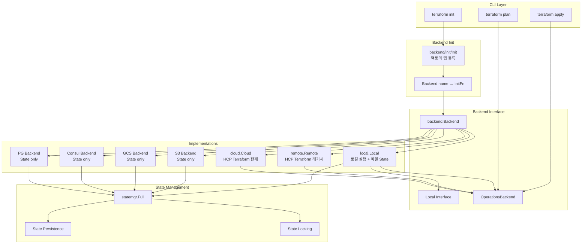

# 13. 백엔드 시스템 심화

## 목차

1. [개요](#1-개요)
2. [Backend 인터페이스 계층 구조](#2-backend-인터페이스-계층-구조)
3. [백엔드 등록 시스템 (팩토리 패턴)](#3-백엔드-등록-시스템-팩토리-패턴)
4. [로컬 백엔드](#4-로컬-백엔드)
5. [Remote 백엔드 (HCP Terraform)](#5-remote-백엔드-hcp-terraform)
6. [OperationsBackend와 Operation 구조체](#6-operationsbackend와-operation-구조체)
7. [백엔드별 State 저장/잠금 메커니즘](#7-백엔드별-state-저장잠금-메커니즘)
8. [State 마이그레이션 프로세스](#8-state-마이그레이션-프로세스)
9. [워크스페이스 관리](#9-워크스페이스-관리)
10. [설계 결정: 왜 백엔드가 추상화되어 있는가](#10-설계-결정-왜-백엔드가-추상화되어-있는가)
11. [전체 아키텍처 다이어그램](#11-전체-아키텍처-다이어그램)
12. [정리](#12-정리)

---

## 1. 개요

Terraform의 백엔드(Backend) 시스템은 **State 저장소**와 **오퍼레이션 실행 환경**을 추상화하는 핵심 서브시스템이다. 사용자가 `terraform init`에서 백엔드를 설정하면, 이후 모든 `plan`, `apply`, `refresh` 명령은 해당 백엔드를 통해 State를 읽고 쓰며 잠금을 관리한다.

백엔드 시스템이 해결하는 핵심 문제:

| 문제 | 백엔드의 해결 방식 |
|------|-------------------|
| 팀 협업 시 State 공유 | 원격 저장소(S3, GCS, Consul 등)에 State 저장 |
| 동시 변경 방지 | State Locking(DynamoDB, GCS 조건부 쓰기 등) |
| 원격 실행 | HCP Terraform/Enterprise에서 plan/apply 실행 |
| State 보안 | 암호화된 저장소, 접근 제어 |
| 마이그레이션 | 로컬 ↔ 리모트 간 State 자동 이동 |

### 핵심 소스 파일

| 파일 경로 | 역할 |
|-----------|------|
| `internal/backend/backend.go` | Backend 인터페이스 정의 |
| `internal/backend/init/init.go` | 백엔드 팩토리 등록 |
| `internal/backend/local/backend.go` | 로컬 백엔드 구현 |
| `internal/backend/remote/backend.go` | Remote 백엔드 구현 |
| `internal/backend/backendrun/operation.go` | Operation 구조체, OperationsBackend 인터페이스 |
| `internal/backend/backendrun/local_run.go` | LocalRun, Local 인터페이스 |
| `internal/cloud/backend.go` | HCP Terraform Cloud 백엔드 |
| `internal/command/meta_backend.go` | CLI에서 백엔드 초기화 로직 |

---

## 2. Backend 인터페이스 계층 구조

Terraform 백엔드 시스템은 3단계 인터페이스 계층으로 설계되어 있다.

### 2.1 기본 Backend 인터페이스

`internal/backend/backend.go`에 정의된 최소 인터페이스:

```go
// Backend is the minimal interface that must be implemented to enable Terraform.
type Backend interface {
    ConfigSchema() *configschema.Block
    PrepareConfig(cty.Value) (cty.Value, tfdiags.Diagnostics)
    Configure(cty.Value) tfdiags.Diagnostics
    StateMgr(workspace string) (statemgr.Full, tfdiags.Diagnostics)
    DeleteWorkspace(name string, force bool) tfdiags.Diagnostics
    Workspaces() ([]string, tfdiags.Diagnostics)
}
```

이 인터페이스가 요구하는 역할:

| 메서드 | 책임 |
|--------|------|
| `ConfigSchema()` | 백엔드 설정 블록의 스키마 반환 (HCL 파싱용) |
| `PrepareConfig()` | 설정 값 검증 및 기본값 삽입 |
| `Configure()` | 설정 값으로 내부 필드 초기화 |
| `StateMgr()` | 워크스페이스별 State Manager 반환 |
| `DeleteWorkspace()` | 워크스페이스 삭제 |
| `Workspaces()` | 워크스페이스 목록 반환 |

### 2.2 OperationsBackend 인터페이스

`internal/backend/backendrun/operation.go`에 정의:

```go
// OperationsBackend is an extension of backend.Backend for the few backends
// that can directly perform Terraform operations.
type OperationsBackend interface {
    backend.Backend
    Operation(context.Context, *Operation) (*RunningOperation, error)
    ServiceDiscoveryAliases() ([]HostAlias, error)
}
```

대부분의 백엔드는 State 저장만 하지만, `OperationsBackend`를 구현하는 백엔드는 직접 plan/apply를 실행할 수 있다.

### 2.3 Local 인터페이스

`internal/backend/backendrun/local_run.go`에 정의:

```go
// Local implements additional behavior on a Backend that allows local
// operations in addition to remote operations.
type Local interface {
    LocalRun(*Operation) (*LocalRun, statemgr.Full, tfdiags.Diagnostics)
}
```

`console`, `import`, `graph` 같은 명령은 설정 파일과 State에 직접 접근해야 하므로, 이 인터페이스를 추가로 요구한다.

### 인터페이스 계층도

```
+------------------------------+
|       backend.Backend        |   ← 모든 백엔드의 기본 인터페이스
| (State 저장, 워크스페이스)     |
+------------------------------+
          ↑           ↑
          |           |
+---------+----+  +---+---------+
| Operations   |  | Local       |
| Backend      |  | Interface   |
| (plan/apply  |  | (console,   |
|  실행 가능)   |  |  import 등) |
+--------------+  +-------------+
          ↑
          |
+---------+----+
| local.Local  |   ← 로컬 백엔드: 모든 인터페이스 구현
| remote.Remote|   ← 리모트 백엔드: Backend + OperationsBackend
| cloud.Cloud  |   ← 클라우드 백엔드: Backend + OperationsBackend
+--------------+
```

---

## 3. 백엔드 등록 시스템 (팩토리 패턴)

### 3.1 Init 함수와 팩토리 맵

`internal/backend/init/init.go`에서 모든 사용 가능한 백엔드를 하드코딩으로 등록한다:

```go
// backends is the list of available backends. This is a global variable
// because backends are currently hardcoded into Terraform and can't be
// modified without recompilation.
var backends map[string]backend.InitFn
var backendsLock sync.Mutex

func Init(services *disco.Disco) {
    backendsLock.Lock()
    defer backendsLock.Unlock()

    backends = map[string]backend.InitFn{
        "local":  func() backend.Backend { return backendLocal.New() },
        "remote": func() backend.Backend { return backendRemote.New(services) },

        // Remote State backends
        "azurerm":    func() backend.Backend { return backendAzure.New() },
        "consul":     func() backend.Backend { return backendConsul.New() },
        "cos":        func() backend.Backend { return backendCos.New() },
        "gcs":        func() backend.Backend { return backendGCS.New() },
        "http":       func() backend.Backend { return backendHTTP.New() },
        "inmem":      func() backend.Backend { return backendInmem.New() },
        "kubernetes": func() backend.Backend { return backendKubernetes.New() },
        "oss":        func() backend.Backend { return backendOSS.New() },
        "pg":         func() backend.Backend { return backendPg.New() },
        "s3":         func() backend.Backend { return backendS3.New() },
        "oci":        func() backend.Backend { return backendOCI.New() },

        // HCP Terraform 'backend'
        "cloud": func() backend.Backend { return backendCloud.New(services) },
    }
}
```

### 3.2 InitFn 타입

```go
// InitFn is used to initialize a new backend.
type InitFn func() Backend
```

팩토리 함수는 매번 새 백엔드 인스턴스를 생성한다. 이것이 중요한 이유는 `Configure()`가 인스턴스당 한 번만 호출될 수 있기 때문이다.

### 3.3 백엔드 조회

```go
func Backend(name string) backend.InitFn {
    backendsLock.Lock()
    defer backendsLock.Unlock()
    return backends[name]
}
```

`sync.Mutex`로 보호하여 동시 접근 안전성을 보장한다.

### 3.4 제거된 백엔드 추적

```go
RemovedBackends = map[string]string{
    "artifactory": `The "artifactory" backend is not supported in Terraform v1.3 or later.`,
    "azure":       `The "azure" backend name has been removed, please use "azurerm".`,
    "etcd":        `The "etcd" backend is not supported in Terraform v1.3 or later.`,
    "etcdv3":      `The "etcdv3" backend is not supported in Terraform v1.3 or later.`,
    "manta":       `The "manta" backend is not supported in Terraform v1.3 or later.`,
    "swift":       `The "swift" backend is not supported in Terraform v1.3 or later.`,
}
```

이전에 지원하다 제거한 백엔드에 대해 사용자 친화적인 에러 메시지를 제공한다.

### 3.5 Deprecated 백엔드 심

```go
type deprecatedBackendShim struct {
    backend.Backend
    Message string
}

func (b deprecatedBackendShim) PrepareConfig(obj cty.Value) (cty.Value, tfdiags.Diagnostics) {
    newObj, diags := b.Backend.PrepareConfig(obj)
    return newObj, diags.Append(tfdiags.SimpleWarning(b.Message))
}
```

Go의 임베딩을 활용하여 기존 백엔드를 감싸고, 검증 시 경고 메시지를 주입하는 패턴이다.

### 등록 흐름

```
main.go: realMain()
    ↓
backendInit.Init(services)
    ↓
backends map에 13개 백엔드 팩토리 등록
    ↓
commands.go: initCommands()
    ↓
각 Command에서 backendInit.Backend("s3") 등으로 팩토리 조회
    ↓
팩토리 함수 실행 → 새 Backend 인스턴스 생성
    ↓
Configure(cty.Value) 호출 → 내부 상태 초기화
```

---

## 4. 로컬 백엔드

### 4.1 Local 구조체

`internal/backend/local/backend.go`에 정의된 로컬 백엔드:

```go
type Local struct {
    StatePath         string
    StateOutPath      string
    StateBackupPath   string
    StateWorkspaceDir string

    OverrideStatePath       string
    OverrideStateOutPath    string
    OverrideStateBackupPath string

    states map[string]statemgr.Full

    ContextOpts *terraform.ContextOpts

    OpInput      bool
    OpValidation bool

    Backend backend.Backend   // nil이 아니면 이 백엔드에 State 저장 위임

    opLock sync.Mutex
}

var _ backend.Backend = (*Local)(nil)
var _ backendrun.OperationsBackend = (*Local)(nil)
```

### 4.2 핵심 상수

```go
const (
    DefaultWorkspaceDir    = "terraform.tfstate.d"
    DefaultWorkspaceFile   = "environment"
    DefaultStateFilename   = "terraform.tfstate"
    DefaultBackupExtension = ".backup"
)
```

### 4.3 State 경로 결정 로직

`StatePaths()` 메서드는 워크스페이스 이름에 따라 State 파일 경로를 결정한다:

```go
func (b *Local) StatePaths(name string) (stateIn, stateOut, backupOut string) {
    statePath := b.OverrideStatePath
    stateOutPath := b.OverrideStateOutPath
    backupPath := b.OverrideStateBackupPath

    isDefault := name == backend.DefaultStateName || name == ""

    baseDir := ""
    if !isDefault {
        baseDir = filepath.Join(b.stateWorkspaceDir(), name)
    }

    if statePath == "" {
        if isDefault {
            statePath = b.StatePath
        }
        if statePath == "" {
            statePath = filepath.Join(baseDir, DefaultStateFilename)
        }
    }
    // ...
}
```

경로 우선순위:

```
CLI 플래그 (-state, -state-out, -backup)
    ↓ (비어있으면)
백엔드 설정 (path, workspace_dir)
    ↓ (비어있으면)
기본값 (terraform.tfstate, terraform.tfstate.d/)
```

### 4.4 워크스페이스별 디렉토리 구조

```
project/
├── terraform.tfstate              ← default 워크스페이스
├── terraform.tfstate.backup
└── terraform.tfstate.d/
    ├── staging/
    │   └── terraform.tfstate      ← staging 워크스페이스
    └── production/
        └── terraform.tfstate      ← production 워크스페이스
```

### 4.5 StateMgr 구현

```go
func (b *Local) StateMgr(name string) (statemgr.Full, tfdiags.Diagnostics) {
    if b.Backend != nil {
        return b.Backend.StateMgr(name)  // 위임 패턴
    }

    if s, ok := b.states[name]; ok {
        return s, diags  // 캐시된 인스턴스 반환
    }

    statePath, stateOutPath, backupPath := b.StatePaths(name)
    s := statemgr.NewFilesystemBetweenPaths(statePath, stateOutPath)
    if backupPath != "" {
        s.SetBackupPath(backupPath)
    }

    b.states[name] = s  // 캐시
    return s, diags
}
```

중요한 설계: `b.Backend != nil`일 때 위임하는 패턴. 이것이 **로컬 실행 + 원격 State 저장** 시나리오를 가능하게 한다.

### 4.6 Operation 실행

```go
func (b *Local) Operation(ctx context.Context, op *backendrun.Operation) (*backendrun.RunningOperation, error) {
    var f func(context.Context, context.Context, *backendrun.Operation, *backendrun.RunningOperation)
    switch op.Type {
    case backendrun.OperationTypeRefresh:
        f = b.opRefresh
    case backendrun.OperationTypePlan:
        f = b.opPlan
    case backendrun.OperationTypeApply:
        f = b.opApply
    }

    b.opLock.Lock()  // 한 번에 하나의 오퍼레이션만

    runningCtx, done := context.WithCancel(context.Background())
    runningOp := &backendrun.RunningOperation{Context: runningCtx}

    stopCtx, stop := context.WithCancel(ctx)
    runningOp.Stop = stop

    cancelCtx, cancel := context.WithCancel(context.Background())
    runningOp.Cancel = cancel

    go func() {
        defer done()
        defer stop()
        defer cancel()
        defer b.opLock.Unlock()
        f(stopCtx, cancelCtx, op, runningOp)
    }()

    return runningOp, nil
}
```

### 4.7 이중 Context 패턴

```
stopCtx  ←  Graceful Stop (SIGINT 1회)
    │         "현재 리소스까지 완료하고 멈춤"
    │
cancelCtx ← Force Cancel (SIGINT 2회)
    │         "즉시 프로세스 종료"
    │
runningCtx ← Operation 완료 추적
              "Done()이 호출되면 오퍼레이션 종료"
```

```
사용자 Ctrl+C (1회)
    ↓
stopCtx.Done() 시그널
    ↓
go tfCtx.Stop()  ← 현재 리소스 완료 후 정지
    ↓
PersistState() 호출  ← 중간 상태 저장
    ↓
사용자 Ctrl+C (2회, 강제)
    ↓
cancelCtx.Done() 시그널
    ↓
즉시 종료 (canceled = true)
```

### 4.8 opApply 흐름

`internal/backend/local/backend_apply.go`에서:

```go
func (b *Local) opApply(stopCtx, cancelCtx context.Context,
    op *backendrun.Operation, runningOp *backendrun.RunningOperation) {

    // 1. 설정 파일 없는 apply 차단
    if op.PlanFile == nil && op.PlanMode != plans.DestroyMode && !op.HasConfig() {
        // "No configuration files" 에러
    }

    // 2. StateHook 등록 (주기적 State 저장)
    stateHook := new(StateHook)
    op.Hooks = append(op.Hooks, stateHook)

    // 3. localRun으로 Context 준비
    lr, _, opState, contextDiags := b.localRun(op)

    // 4. State 잠금 해제 defer
    defer func() { op.StateLocker.Unlock() }()

    // 5. Plan 실행 (저장된 plan이 없는 경우)
    // 6. Apply 실행
    // 7. State 저장
}
```

---

## 5. Remote 백엔드 (HCP Terraform)

### 5.1 Remote 구조체

`internal/backend/remote/backend.go`에 정의:

```go
type Remote struct {
    CLI      cli.Ui
    CLIColor *colorstring.Colorize
    ContextOpts *terraform.ContextOpts

    client       *tfe.Client     // HCP Terraform API 클라이언트
    lastRetry    time.Time
    hostname     string
    organization string
    workspace    string
    prefix       string
    services     *disco.Disco

    local      backendrun.OperationsBackend  // 로컬 폴백
    forceLocal bool                          // 로컬 강제 사용

    opLock                sync.Mutex
    ignoreVersionConflict bool
}

var _ backend.Backend = (*Remote)(nil)
var _ backendrun.OperationsBackend = (*Remote)(nil)
```

### 5.2 Cloud 구조체 (최신)

`internal/cloud/backend.go`에 정의된 최신 HCP Terraform 백엔드:

```go
type Cloud struct {
    CLI      cli.Ui
    CLIColor *colorstring.Colorize
    ContextOpts *terraform.ContextOpts

    client   *tfe.Client
    viewHooks views.CloudHooks

    Hostname     string
    Token        string
    Organization string
    WorkspaceMapping WorkspaceMapping

    ServicesHost *disco.Host
    services     *disco.Disco
    renderer     *jsonformat.Renderer

    local        backendrun.OperationsBackend
    forceLocal   bool
    opLock       sync.Mutex
}
```

### 5.3 Remote vs Cloud 비교

| 항목 | Remote 백엔드 | Cloud 백엔드 |
|------|--------------|-------------|
| 설정 블록 | `backend "remote" {}` | `cloud {}` |
| 위치 | `internal/backend/remote/` | `internal/cloud/` |
| 워크스페이스 | `name` 또는 `prefix` | `WorkspaceMapping` (태그, 이름, 프로젝트) |
| 상태 | 레거시 | 현재 권장 |
| 등록 이름 | `"remote"` | `"cloud"` |

### 5.4 로컬 폴백 패턴

Remote/Cloud 백엔드 모두 로컬 실행 모드를 지원한다:

```
Cloud 백엔드 생성 시:
    ↓
forceLocal 체크
    ├── true: backendLocal.NewWithBackend(self)로 래핑
    │         → 로컬에서 plan/apply 실행, 원격에 State 저장
    │
    └── false: 원격에서 plan/apply 실행
              → API를 통해 HCP Terraform에 위임
```

이 설계로 인해 로컬 백엔드는 모든 오퍼레이션의 "기본 실행자" 역할을 한다.

---

## 6. OperationsBackend와 Operation 구조체

### 6.1 Operation 구조체 전체 필드

`internal/backend/backendrun/operation.go`에 정의:

```go
type Operation struct {
    Type         OperationType    // Plan, Apply, Refresh
    PlanId       string           // 원격 백엔드용 plan ID
    PlanRefresh  bool             // plan 전 refresh 여부
    PlanOutPath  string           // plan 파일 저장 경로

    PlanOutBackend    *plans.Backend      // plan에 저장할 백엔드 정보
    PlanOutStateStore *plans.StateStore   // plan에 저장할 state store

    ConfigDir    string                   // 설정 파일 디렉토리
    ConfigLoader *configload.Loader       // 설정 로더
    DependencyLocks *depsfile.Locks       // 의존성 잠금

    Hooks      []terraform.Hook          // 이벤트 훅
    PlanFile   *planfile.WrappedPlanFile  // 저장된 plan 파일
    PlanMode   plans.Mode                // Normal, Destroy, RefreshOnly

    AutoApprove       bool               // 자동 승인
    Targets           []addrs.Targetable  // -target 대상
    ForceReplace      []addrs.AbsResourceInstance  // -replace 대상
    Variables         map[string]arguments.UnparsedVariableValue
    DeferralAllowed   bool               // 실험적: 부분 plan

    View        views.Operation          // UI 출력
    UIIn        terraform.UIInput
    UIOut       terraform.UIOutput
    StateLocker clistate.Locker          // State 잠금

    Workspace   string                   // 워크스페이스 이름
}
```

### 6.2 RunningOperation

```go
type RunningOperation struct {
    context.Context                    // 완료 추적용 Context

    Stop   context.CancelFunc         // Graceful Stop
    Cancel context.CancelFunc         // Force Cancel

    Result    OperationResult          // Success(0) 또는 Failure(1)
    PlanEmpty bool                     // Plan이 변경사항 없음
    State     *states.State            // 최종 State
}
```

### 6.3 LocalRun 구조체

```go
type LocalRun struct {
    Core       *terraform.Context  // 초기화된 Terraform Core 컨텍스트
    Config     *configs.Config     // 설정
    InputState *states.State       // 입력 State
    PlanOpts   *terraform.PlanOpts // Plan 옵션 (저장된 plan apply 시 nil)
    Plan       *plans.Plan         // 저장된 plan (apply 시)
}
```

### 6.4 OperationType

```go
const (
    OperationTypeInvalid OperationType = iota
    OperationTypeRefresh
    OperationTypePlan
    OperationTypeApply
)
```

### 6.5 ReportResult 헬퍼

```go
func (o *Operation) ReportResult(op *RunningOperation, diags tfdiags.Diagnostics) {
    if diags.HasErrors() {
        op.Result = OperationFailure
    } else {
        op.Result = OperationSuccess
    }
    if o.View != nil {
        o.View.Diagnostics(diags)
    }
}
```

에러 진단 → 실패 상태 설정 → UI 출력의 공통 패턴을 캡슐화한다.

---

## 7. 백엔드별 State 저장/잠금 메커니즘

### 7.1 지원 백엔드 목록

```
internal/backend/remote-state/
├── azure/       # Azure Blob Storage
├── consul/      # HashiCorp Consul KV
├── cos/         # Tencent Cloud Object Storage
├── gcs/         # Google Cloud Storage
├── http/        # HTTP REST API
├── inmem/       # 메모리 (테스트용)
├── kubernetes/  # Kubernetes Secret
├── oci/         # Oracle Cloud Infrastructure
├── oss/         # Alibaba Cloud OSS
├── pg/          # PostgreSQL
└── s3/          # AWS S3
```

### 7.2 백엔드별 저장/잠금 메커니즘 비교

| 백엔드 | 저장소 | 잠금 메커니즘 | 암호화 |
|--------|--------|-------------|--------|
| **S3** | S3 버킷 | DynamoDB 테이블 | SSE-S3, SSE-KMS |
| **GCS** | GCS 버킷 | GCS 조건부 쓰기 (generation number) | Google 관리 또는 CMEK |
| **Azure** | Blob Storage | Blob Lease | Azure 관리 |
| **Consul** | Consul KV | Consul Session Lock | TLS |
| **PG** | PostgreSQL 테이블 | `pg_advisory_lock` | DB 수준 |
| **Kubernetes** | K8s Secret | K8s Lease/Coordination | Secret 암호화 |
| **HTTP** | HTTP 엔드포인트 | LOCK/UNLOCK 메서드 | TLS |
| **Local** | 로컬 파일 | 없음 (단일 사용자) | 없음 |

### 7.3 S3 + DynamoDB 잠금 상세

```
terraform plan 실행 시:

1. DynamoDB에 Lock 획득
   PUT Item {
     LockID: "my-bucket/path/terraform.tfstate-md5",
     Info: {
       ID: "uuid",
       Operation: "OperationTypePlan",
       Who: "user@host",
       Created: "2024-01-01T00:00:00Z"
     }
   }

2. S3에서 State 읽기
   GET s3://my-bucket/path/terraform.tfstate

3. Plan 실행

4. DynamoDB에서 Lock 해제
   DELETE Item { LockID: "..." }
```

### 7.4 statemgr.Full 인터페이스

모든 State Manager가 구현해야 하는 인터페이스:

```
statemgr.Full = Reader + Writer + Persister + Refresher + Locker (선택적)

Reader:    State() *states.State        ← 현재 State 반환
Writer:    WriteState(*states.State)    ← 메모리에 State 쓰기
Persister: PersistState(schemas)        ← 영구 저장소에 저장
Refresher: RefreshState()               ← 영구 저장소에서 읽기
Locker:    Lock(info) / Unlock(id)      ← 잠금/해제 (선택적)
```

### 7.5 잠금 충돌 처리

```
$ terraform plan

Error: Error acquiring the state lock

Error message: ConditionalCheckFailedException: The conditional request failed
Lock Info:
  ID:        a1b2c3d4-e5f6-7890-abcd-ef1234567890
  Path:      my-bucket/terraform.tfstate
  Operation: OperationTypePlan
  Who:       alice@workstation
  Version:   1.5.0
  Created:   2024-01-15 10:30:00.000000000 +0000 UTC

Terraform acquires a state lock to protect the state from being written
by multiple users at the same time. Please resolve the issue above and try
again. For most commands, you can disable locking with the "-lock=false"
flag, but this is not recommended.
```

---

## 8. State 마이그레이션 프로세스

### 8.1 마이그레이션 트리거

State 마이그레이션은 `terraform init` 시 발생한다. `internal/command/meta_backend.go`에서 처리:

```go
type BackendOpts struct {
    BackendConfig    *configs.Backend
    StateStoreConfig *configs.StateStore
    Locks            *depsfile.Locks
    ConfigOverride   hcl.Body
    Init             bool      // 초기화 허용 여부
    ForceLocal       bool      // 로컬 강제
}
```

### 8.2 마이그레이션 시나리오

```
시나리오 1: 로컬 → S3
┌─────────────┐     ┌─────────────┐
│  Local       │ ──→ │  S3          │
│  terraform.  │     │  my-bucket/  │
│  tfstate     │     │  tfstate     │
└─────────────┘     └─────────────┘
  기존 State        새 State 위치

시나리오 2: S3 → GCS
┌─────────────┐     ┌─────────────┐
│  S3          │ ──→ │  GCS         │
│  my-bucket/  │     │  my-bucket/  │
│  tfstate     │     │  tfstate     │
└─────────────┘     └─────────────┘

시나리오 3: S3 → 로컬 (cloud → local)
┌─────────────┐     ┌─────────────┐
│  S3          │ ──→ │  Local       │
│  my-bucket/  │     │  terraform.  │
│  tfstate     │     │  tfstate     │
└─────────────┘     └─────────────┘
```

### 8.3 마이그레이션 프로세스 상세

```
terraform init (백엔드 변경 감지)
    ↓
1. 이전 백엔드 로드 (.terraform/terraform.tfstate에서)
    ↓
2. 새 백엔드 초기화 (HCL 설정에서)
    ↓
3. 이전 백엔드에서 워크스페이스 목록 조회
    ↓
4. 각 워크스페이스에 대해:
   a. 이전 백엔드의 StateMgr(workspace)로 State 읽기
   b. 새 백엔드의 StateMgr(workspace)로 State 쓰기
   c. Lock → RefreshState → WriteState → PersistState → Unlock
    ↓
5. 새 백엔드 설정을 .terraform/terraform.tfstate에 저장
    ↓
6. 사용자에게 확인: "기존 State를 삭제할까요?"
```

### 8.4 마이그레이션 안전장치

| 장치 | 설명 |
|------|------|
| 사용자 확인 프롬프트 | `-migrate-state` 플래그 또는 대화형 확인 |
| State 잠금 | 마이그레이션 중 양쪽 백엔드 모두 잠금 |
| 경로 충돌 감지 | `PathsConflictWith()` — 로컬 백엔드 간 같은 파일 사용 방지 |
| 백업 | 로컬 백엔드는 `.backup` 파일 자동 생성 |
| 원자적 쓰기 | S3, GCS 등은 조건부 쓰기로 동시 변경 방지 |

### 8.5 PathsConflictWith 구현

```go
func (b *Local) PathsConflictWith(other *Local) bool {
    otherPaths := map[string]struct{}{}
    otherWorkspaces, _ := other.Workspaces()
    for _, name := range otherWorkspaces {
        p, _, _ := other.StatePaths(name)
        otherPaths[p] = struct{}{}
    }

    ourWorkspaces, _ := other.Workspaces()
    for _, name := range ourWorkspaces {
        p, _, _ := b.StatePaths(name)
        if _, exists := otherPaths[p]; exists {
            return true  // 같은 파일을 공유 → 충돌
        }
    }
    return false
}
```

---

## 9. 워크스페이스 관리

### 9.1 DefaultStateName

```go
const DefaultStateName = "default"
```

모든 백엔드는 반드시 `"default"` 워크스페이스를 가져야 하며, 이 워크스페이스는 삭제할 수 없다.

### 9.2 로컬 워크스페이스 목록

```go
func (b *Local) Workspaces() ([]string, tfdiags.Diagnostics) {
    if b.Backend != nil {
        return b.Backend.Workspaces()  // 위임
    }

    envs := []string{backend.DefaultStateName}  // 항상 default 포함

    entries, err := os.ReadDir(b.stateWorkspaceDir())
    if os.IsNotExist(err) {
        return envs, nil  // 디렉토리 없으면 default만
    }

    var listed []string
    for _, entry := range entries {
        if entry.IsDir() {
            listed = append(listed, filepath.Base(entry.Name()))
        }
    }

    sort.Strings(listed)
    envs = append(envs, listed...)
    return envs, diags
}
```

### 9.3 워크스페이스 삭제

```go
func (b *Local) DeleteWorkspace(name string, force bool) tfdiags.Diagnostics {
    if name == backend.DefaultStateName {
        return diags.Append(errors.New("cannot delete default state"))
    }

    delete(b.states, name)  // 캐시에서 제거
    err := os.RemoveAll(filepath.Join(b.stateWorkspaceDir(), name))
    // ...
}
```

### 9.4 원격 워크스페이스 매핑

Cloud 백엔드에서의 워크스페이스 매핑:

```hcl
# 이름 기반
cloud {
  organization = "my-org"
  workspaces {
    name = "my-workspace"
  }
}

# 태그 기반 (여러 워크스페이스)
cloud {
  organization = "my-org"
  workspaces {
    tags = ["app:web", "env:production"]
  }
}

# 프로젝트 기반
cloud {
  organization = "my-org"
  workspaces {
    project = "my-project"
  }
}
```

### 9.5 워크스페이스 에러 처리

```go
var (
    ErrDefaultWorkspaceNotSupported = errors.New(
        "default workspace not supported\n" +
        "You can create a new workspace with the \"workspace new\" command.")

    ErrWorkspacesNotSupported = errors.New("workspaces not supported")
)
```

---

## 10. 설계 결정: 왜 백엔드가 추상화되어 있는가

### 10.1 핵심 이유: 관심사 분리

Terraform CLI는 **어디에 State가 저장되는지** 알 필요가 없다. CLI는 `Backend` 인터페이스만 사용하고, 구체적인 저장소(S3, GCS, 로컬 파일)는 인터페이스 뒤에 숨겨진다.

```
CLI Layer                    Backend Layer               Storage Layer
┌──────────┐               ┌──────────────┐             ┌──────────┐
│ apply.go │──StateMgr()──→│ S3 Backend   │──PutObj()──→│ AWS S3   │
│ plan.go  │               │              │──Lock()───→│ DynamoDB │
│ init.go  │               └──────────────┘             └──────────┘
│          │               ┌──────────────┐             ┌──────────┐
│          │──StateMgr()──→│ GCS Backend  │──Insert()──→│ GCS      │
│          │               └──────────────┘             └──────────┘
│          │               ┌──────────────┐             ┌──────────┐
│          │──StateMgr()──→│ Local Backend│──Write()───→│ FS       │
└──────────┘               └──────────────┘             └──────────┘
```

### 10.2 왜 플러그인이 아닌 하드코딩인가

`init.go`의 주석이 이 결정을 설명한다:

> backends are currently hardcoded into Terraform and can't be modified without recompilation.

> Backends are hardcoded into Terraform because the API for backends uses complex structures and supporting that over the plugin system is currently prohibitively difficult.

플러그인으로 만들지 않은 이유:

| 이유 | 설명 |
|------|------|
| 복잡한 데이터 구조 | `statemgr.Full`, `Operation` 등이 gRPC로 직렬화하기 어려움 |
| 양방향 통신 | Operation 실행 중 UI 피드백, State 잠금 등 |
| 보안 | State에 민감한 정보가 포함될 수 있어 프로세스 간 전달이 위험 |
| 성능 | State가 수 MB에 달할 수 있어 IPC 오버헤드가 큼 |

### 10.3 위임 패턴의 의미

로컬 백엔드의 `Backend` 필드가 핵심이다:

```go
type Local struct {
    Backend backend.Backend   // nil이 아니면 State 저장 위임
}
```

이 설계로 인해:
- `local` + `s3`: 로컬에서 실행하고 S3에 State 저장
- `remote` + `forceLocal=true`: 로컬에서 실행하고 HCP Terraform에 State 저장
- `cloud` + `forceLocal=true`: 동일

```
NewWithBackend(s3Backend) → Local{Backend: s3Backend}
    ↓
Local.StateMgr("prod") → s3Backend.StateMgr("prod")  // S3에서 State
Local.Operation()       → Local.opApply()              // 로컬에서 실행
```

### 10.4 왜 Operation이 Backend에 있는가

`OperationsBackend` 인터페이스에 `Operation()` 메서드가 있는 이유:

1. **원격 실행 지원**: HCP Terraform은 원격 서버에서 plan/apply를 실행. 이 경우 Operation은 API 호출로 변환된다.
2. **일관된 인터페이스**: CLI는 로컬이든 원격이든 동일한 `Operation()` 메서드를 호출한다.
3. **State 잠금과 연동**: Operation이 실행되는 동안 State를 잠그는 것은 Backend의 책임이다.

---

## 11. 전체 아키텍처 다이어그램



### Operation 실행 시퀀스

```
┌─────────┐    ┌──────────┐    ┌──────────────┐    ┌──────────┐
│  CLI     │    │  Meta    │    │  Backend     │    │  Core    │
│  Command │    │          │    │  (Local)     │    │          │
└────┬─────┘    └────┬─────┘    └─────┬────────┘    └────┬─────┘
     │               │               │                   │
     │ Run(args)     │               │                   │
     ├──────────────→│               │                   │
     │               │ Backend()     │                   │
     │               ├──────────────→│                   │
     │               │  (초기화)      │                   │
     │               │←──────────────┤                   │
     │               │               │                   │
     │               │ Operation()   │                   │
     │               ├──────────────→│                   │
     │               │               │ Lock State        │
     │               │               ├──────┐            │
     │               │               │      │            │
     │               │               │←─────┘            │
     │               │               │                   │
     │               │               │ localRun()        │
     │               │               ├──────────────────→│
     │               │               │   (Context 생성)   │
     │               │               │←──────────────────┤
     │               │               │                   │
     │               │               │ Plan()/Apply()    │
     │               │               ├──────────────────→│
     │               │               │   (실행)           │
     │               │               │←──────────────────┤
     │               │               │                   │
     │               │               │ PersistState()    │
     │               │               ├──────┐            │
     │               │               │      │ (State 저장)│
     │               │               │←─────┘            │
     │               │               │                   │
     │               │               │ Unlock()          │
     │               │               ├──────┐            │
     │               │               │      │            │
     │               │               │←─────┘            │
     │               │ RunningOp     │                   │
     │               │←──────────────┤                   │
     │  ExitStatus   │               │                   │
     │←──────────────┤               │                   │
```

---

## 12. 정리

### 핵심 요약

| 개념 | 설명 |
|------|------|
| **Backend 인터페이스** | 최소 인터페이스: State 저장, 워크스페이스, 설정 |
| **OperationsBackend** | plan/apply 실행 가능한 확장 인터페이스 |
| **팩토리 패턴** | 13개 백엔드를 이름 → InitFn 맵으로 등록 |
| **로컬 백엔드** | 기본 실행자, 위임 패턴으로 원격 State 지원 |
| **이중 Context** | Graceful Stop + Force Cancel 패턴 |
| **State Locking** | 백엔드별 고유 메커니즘 (DynamoDB, pg_advisory_lock 등) |
| **마이그레이션** | init 시 자동 감지, 사용자 확인 후 State 이동 |
| **하드코딩 이유** | 복잡한 데이터 구조, 보안, 성능 문제로 플러그인화 불가 |

### 학습 포인트

1. **인터페이스 계층화**: 기본 → 확장 → 로컬 전용의 3단계 구조
2. **위임 패턴**: `Local.Backend` 필드로 실행과 저장을 분리
3. **팩토리 패턴**: 컴파일 타임 등록으로 안전성 확보
4. **Context 기반 취소**: Go의 context.Context를 활용한 graceful shutdown
5. **추상화의 비용**: 하드코딩이라는 trade-off를 의식적으로 선택
