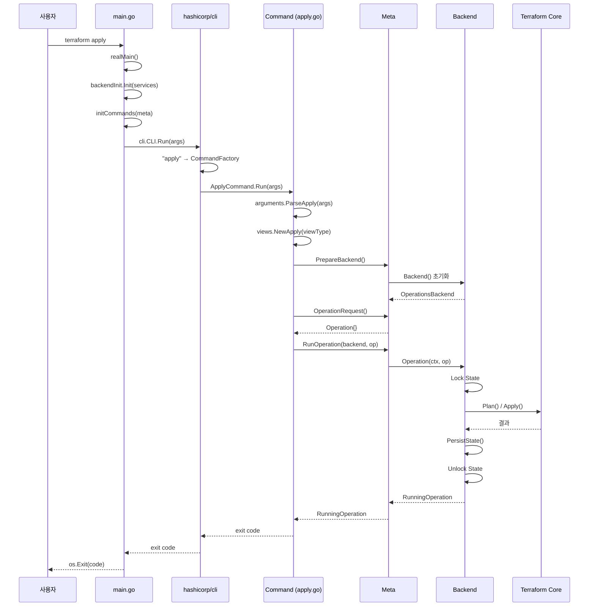

# 14. CLI 커맨드 시스템 심화

## 목차

1. [개요](#1-개요)
2. [main.go: realMain() 초기화 흐름](#2-maingo-realmain-초기화-흐름)
3. [commands.go: initCommands() 명령 등록](#3-commandsgo-initcommands-명령-등록)
4. [Meta 구조체: 모든 명령의 기반](#4-meta-구조체-모든-명령의-기반)
5. [meta_backend.go: Backend() 초기화](#5-meta_backendgo-backend-초기화)
6. [ApplyCommand 구현 분석](#6-applycommand-구현-분석)
7. [PlanCommand 구현 분석](#7-plancommand-구현-분석)
8. [InitCommand 구현 분석](#8-initcommand-구현-분석)
9. [명령 디스패치 흐름 (hashicorp/cli)](#9-명령-디스패치-흐름-hashicorpcli)
10. [Meta.RunOperation() 실행과 인터럽트 처리](#10-metarunoperation-실행과-인터럽트-처리)
11. [설계 결정: 왜 Meta가 모든 명령의 기반인가](#11-설계-결정-왜-meta가-모든-명령의-기반인가)
12. [전체 흐름 다이어그램](#12-전체-흐름-다이어그램)
13. [정리](#13-정리)

---

## 1. 개요

Terraform CLI는 `hashicorp/cli` 라이브러리를 기반으로 한 커맨드 시스템이다. `terraform plan`, `terraform apply` 같은 모든 명령이 일관된 패턴으로 구현되어 있으며, `Meta` 구조체가 모든 명령에 공통으로 필요한 기능(백엔드 초기화, State 로드, 프로바이더 소스 등)을 제공한다.

### 핵심 소스 파일

| 파일 경로 | 역할 | 크기 |
|-----------|------|------|
| `main.go` | 프로세스 진입점, `realMain()` | ~350줄 |
| `commands.go` | `initCommands()`, 명령 팩토리 등록 | ~500줄 |
| `internal/command/meta.go` | `Meta` 구조체, 공통 기능 | ~700줄 |
| `internal/command/meta_backend.go` | `Backend()` 초기화 | ~3000줄 (125KB) |
| `internal/command/apply.go` | `ApplyCommand` 구현 | ~250줄 |
| `internal/command/plan.go` | `PlanCommand` 구현 | ~200줄 |
| `internal/command/init.go` | `InitCommand` 구현 | ~1600줄 (65KB) |

### 왜 meta_backend.go가 125KB인가

`meta_backend.go`가 거대한 이유는 백엔드 초기화가 매우 복잡한 상태 머신이기 때문이다:
- 기존 백엔드 설정 로드 (`.terraform/terraform.tfstate`)
- 새 백엔드 설정 파싱 (HCL)
- 변경 감지 (로컬→리모트, 리모트→다른 리모트)
- State 마이그레이션 프롬프트
- 에러 복구 로직

---

## 2. main.go: realMain() 초기화 흐름

### 2.1 프로세스 진입점

`main.go`의 시작:

```go
func main() {
    os.Exit(realMain())
}

func realMain() int {
    defer logging.PanicHandler()
    // ...
}
```

`PanicHandler`가 모든 패닉을 캐치하여 크래시 리포트를 생성한다.

### 2.2 realMain() 단계별 흐름

```
realMain()
│
├── 1. OpenTelemetry 초기화
│   openTelemetryInit()
│
├── 2. 임시 로그 파일 설정
│   TF_TEMP_LOG_PATH 환경변수 확인
│
├── 3. 버전/런타임 로깅
│   log.Printf("[INFO] Terraform version: %s", Version)
│   log.Printf("[INFO] Go runtime version: %s", runtime.Version())
│
├── 4. 터미널 초기화
│   streams, err := terminal.Init()
│   → Stdout/Stderr/Stdin 스트림 설정
│   → 터미널 여부, 컬럼 수 감지
│
├── 5. CLI 설정 로드
│   config, diags := cliconfig.LoadConfig()
│   → ~/.terraformrc 또는 %APPDATA%/terraform.rc
│
├── 6. 작업 디렉토리 변경 (-chdir 처리)
│   처리된 args에서 -chdir 추출
│   os.Chdir(newDir)
│
├── 7. 서비스 디스커버리 초기화
│   services := disco.New()
│   → TLS 설정, 인증 토큰, 호스트 설정
│
├── 8. 프로바이더 소스 설정
│   providerSrc, diags := providerSource(...)
│   → Registry, 로컬 미러, 캐시 디렉토리
│
├── 9. 백엔드 팩토리 등록
│   backendInit.Init(services)
│   → 13개 백엔드 팩토리 맵 초기화
│
├── 10. 명령 등록
│   initCommands(ctx, originalWorkingDir, streams, config,
│                services, providerSrc, providerDevOverrides,
│                unmanagedProviders)
│
├── 11. hashicorp/cli 실행
│   cliRunner := &cli.CLI{
│       Args:         args,
│       Commands:     Commands,
│       Autocomplete: true,
│   }
│   exitCode, err := cliRunner.Run()
│
└── return exitCode
```

### 2.3 서비스 디스커버리

```go
services := disco.New()
services.SetUserAgent(httpclient.TerraformUserAgent(version.String()))
```

서비스 디스커버리는 HCP Terraform, 프로바이더 레지스트리 등 원격 서비스의 API 엔드포인트를 자동 발견하는 메커니즘이다. `app.terraform.io`에 접속하면 `/.well-known/terraform.json`을 통해 사용 가능한 서비스를 알려준다.

### 2.4 환경변수 처리

```go
const EnvCLI = "TF_CLI_ARGS"
const runningInAutomationEnvName = "TF_IN_AUTOMATION"
```

| 환경변수 | 용도 |
|---------|------|
| `TF_CLI_ARGS` | 추가 CLI 인수 주입 |
| `TF_CLI_ARGS_plan` | plan 명령에만 적용되는 추가 인수 |
| `TF_IN_AUTOMATION` | 자동화 환경 표시 (후속 명령 제안 숨김) |
| `TF_DATA_DIR` | `.terraform` 디렉토리 위치 오버라이드 |
| `TF_TEMP_LOG_PATH` | 임시 로그 파일 경로 |

---

## 3. commands.go: initCommands() 명령 등록

### 3.1 initCommands 함수

```go
func initCommands(
    ctx context.Context,
    originalWorkingDir string,
    streams *terminal.Streams,
    config *cliconfig.Config,
    services *disco.Disco,
    providerSrc getproviders.Source,
    providerDevOverrides map[addrs.Provider]getproviders.PackageLocalDir,
    unmanagedProviders map[addrs.Provider]*plugin.ReattachConfig,
) {
    // Meta 인스턴스 생성
    meta := command.Meta{
        WorkingDir: wd,
        Streams:    streams,
        View:       views.NewView(streams).SetRunningInAutomation(inAutomation),
        Color:      true,
        GlobalPluginDirs: cliconfig.GlobalPluginDirs(),
        Ui:         Ui,
        Services:   services,
        BrowserLauncher: webbrowser.NewNativeLauncher(),
        RunningInAutomation: inAutomation,
        CLIConfigDir:    configDir,
        PluginCacheDir:  config.PluginCacheDir,
        ShutdownCh:      makeShutdownCh(),
        CallerContext:    ctx,
        ProviderSource:   providerSrc,
        ProviderDevOverrides: providerDevOverrides,
        UnmanagedProviders:   unmanagedProviders,
    }

    // 명령 팩토리 맵 등록
    Commands = map[string]cli.CommandFactory{
        "apply": func() (cli.Command, error) {
            return &command.ApplyCommand{Meta: meta}, nil
        },
        "plan": func() (cli.Command, error) {
            return &command.PlanCommand{Meta: meta}, nil
        },
        "init": func() (cli.Command, error) {
            return &command.InitCommand{Meta: meta}, nil
        },
        // ... 40+ 명령
    }
}
```

### 3.2 명령 분류

```go
// PrimaryCommands — 기본 워크플로우에서 강조
var PrimaryCommands []string

// HiddenCommands — 도움말에서 숨김
var HiddenCommands map[string]struct{}
```

### 3.3 등록된 명령 전체 목록

| 카테고리 | 명령 | Command 구조체 |
|---------|------|---------------|
| **핵심 워크플로** | `init` | `InitCommand` |
| | `plan` | `PlanCommand` |
| | `apply` | `ApplyCommand` |
| | `destroy` | `ApplyCommand{Destroy: true}` |
| **State 관리** | `show` | `ShowCommand` |
| | `output` | `OutputCommand` |
| | `refresh` | `RefreshCommand` |
| | `import` | `ImportCommand` |
| **워크스페이스** | `workspace new` | `WorkspaceNewCommand` |
| | `workspace select` | `WorkspaceSelectCommand` |
| | `workspace list` | `WorkspaceListCommand` |
| | `workspace delete` | `WorkspaceDeleteCommand` |
| **설정** | `fmt` | `FmtCommand` |
| | `validate` | `ValidateCommand` |
| | `console` | `ConsoleCommand` |
| | `graph` | `GraphCommand` |
| **프로바이더** | `providers` | `ProvidersCommand` |
| | `providers lock` | `ProvidersLockCommand` |
| | `providers mirror` | `ProvidersMirrorCommand` |
| | `providers schema` | `ProvidersSchemaCommand` |
| **인증** | `login` | `LoginCommand` |
| | `logout` | `LogoutCommand` |
| **테스트** | `test` | `TestCommand` |
| **실험적** | `query` | `QueryCommand` |
| | `rpcapi` | rpcapi.CLICommandFactory |

### 3.4 특수 명령: destroy

`destroy`는 별도의 Command가 아니라 `ApplyCommand`의 변형이다:

```go
"destroy": func() (cli.Command, error) {
    return &command.ApplyCommand{
        Meta:    meta,
        Destroy: true,  // 이 플래그만 다름
    }, nil
},
```

이것은 `terraform destroy`가 내부적으로 `terraform apply -destroy`와 동일하다는 것을 코드 수준에서 보여준다.

### 3.5 레거시 호환: env 명령

```go
"env": func() (cli.Command, error) {
    return &command.WorkspaceCommand{
        Meta:       meta,
        LegacyName: true,
    }, nil
},
```

`terraform env`는 `terraform workspace`로 이름이 변경되었지만, 레거시 호환성을 위해 유지한다.

---

## 4. Meta 구조체: 모든 명령의 기반

### 4.1 Meta 필드 분류

`internal/command/meta.go`에 정의된 `Meta` 구조체:

```
Meta 구조체
├── 외부 설정 (initCommands에서 설정)
│   ├── WorkingDir *workdir.Dir        ← 작업 디렉토리
│   ├── Streams *terminal.Streams      ← 표준 입출력
│   ├── View *views.View               ← 구조화된 출력
│   ├── Color bool                     ← 컬러 출력 여부
│   ├── Ui cli.Ui                      ← 레거시 UI
│   ├── Services *disco.Disco          ← 서비스 디스커버리
│   ├── RunningInAutomation bool       ← TF_IN_AUTOMATION
│   ├── CLIConfigDir string            ← ~/.terraform.d
│   ├── PluginCacheDir string          ← 프로바이더 캐시
│   ├── ProviderSource getproviders.Source
│   ├── ProviderDevOverrides           ← 개발용 프로바이더 오버라이드
│   ├── UnmanagedProviders             ← 외부 관리 프로바이더
│   ├── ShutdownCh <-chan struct{}     ← Ctrl+C 시그널
│   ├── CallerContext context.Context  ← 텔레메트리 컨텍스트
│   └── AllowExperimentalFeatures bool
│
├── 보호 필드 (명령에서 설정)
│   ├── pluginPath []string            ← -plugin-dir
│   └── testingOverrides               ← 테스트용 오버라이드
│
└── 내부 필드
    ├── configLoader *configload.Loader     ← 설정 로더 (지연 초기화)
    ├── backendConfigState                  ← 현재 백엔드 설정
    ├── stateStoreConfigState              ← State Store 설정
    ├── input bool                          ← -input 플래그
    ├── targets []addrs.Targetable          ← -target 리스트
    ├── color bool                          ← 내부 컬러 플래그
    ├── statePath string                    ← -state 플래그
    ├── stateOutPath string                 ← -state-out 플래그
    └── backupPath string                   ← -backup 플래그
```

### 4.2 Meta가 제공하는 주요 메서드

| 메서드 | 역할 |
|--------|------|
| `Backend()` | 백엔드 초기화 및 반환 |
| `PrepareBackend()` | 백엔드 준비 (plan/apply용) |
| `OperationRequest()` | Operation 구조체 생성 |
| `LoadConfig()` | HCL 설정 파일 로드 |
| `process(args)` | 공통 플래그 전처리 |
| `CommandContext()` | 명령 실행용 Context 생성 |
| `loadPluginPath()` | 플러그인 경로 로드 |

### 4.3 View 시스템

```go
View *views.View  // 구조화된 출력 추상화
```

View 시스템은 동일한 데이터를 다른 형식으로 출력할 수 있게 해준다:

```
ViewType
├── ViewHuman     ← 기본: 사람이 읽기 좋은 텍스트
├── ViewJSON      ← -json: 기계 처리용 JSON
└── ViewRaw       ← 원시 출력
```

각 명령은 자체 View를 생성:

```go
// ApplyCommand에서:
view := views.NewApply(args.ViewType, c.Destroy, c.View)

// PlanCommand에서:
view := views.NewPlan(args.ViewType, c.View)

// InitCommand에서:
view := views.NewInit(initArgs.ViewType, c.View)
```

---

## 5. meta_backend.go: Backend() 초기화

### 5.1 BackendOpts 구조체

```go
type BackendOpts struct {
    BackendConfig    *configs.Backend     // backend "s3" {} 블록
    StateStoreConfig *configs.StateStore  // state_store {} 블록 (실험적)
    Locks            *depsfile.Locks      // 의존성 잠금
    ConfigOverride   hcl.Body             // -backend-config 오버라이드
    Init             bool                 // 초기화 모드 여부
    ForceLocal       bool                 // 로컬 강제
}
```

### 5.2 Backend() 메서드 의사 코드

```
Meta.Backend(opts)
│
├── 1. 설정 파일에서 백엔드 블록 확인
│   configBackend := config.Module.Backend
│
├── 2. 저장된 백엔드 설정 읽기
│   savedBackend := .terraform/terraform.tfstate의 "backend" 필드
│
├── 3. 상태 결정
│   ├── CASE A: 설정도 없고 저장도 없음
│   │   → 로컬 백엔드 사용
│   │
│   ├── CASE B: 설정은 있고 저장은 없음
│   │   → 새 백엔드 초기화 (첫 init)
│   │
│   ├── CASE C: 설정도 있고 저장도 있음
│   │   ├── 같은 타입 → 설정 업데이트
│   │   └── 다른 타입 → 마이그레이션
│   │
│   ├── CASE D: 설정은 없고 저장은 있음
│   │   → 백엔드 제거, 로컬로 마이그레이션
│   │
│   └── CASE E: cloud 블록 → cloud 백엔드 초기화
│
├── 4. 백엔드 인스턴스 생성
│   factory := backendInit.Backend(backendType)
│   backend := factory()
│
├── 5. 설정 적용
│   backend.Configure(configVal)
│
├── 6. 로컬 래핑 (필요 시)
│   local := backendLocal.NewWithBackend(backend)
│
└── return local
```

### 5.3 왜 125KB인가

`meta_backend.go`가 거대한 이유를 구체적으로:

```
meta_backend.go 주요 함수 (대략적 라인 수)
├── BackendOpts 구조체          (~30줄)
├── Backend()                   (~200줄) — 메인 초기화 라우터
├── backendFromConfig()         (~300줄) — 설정 기반 백엔드 생성
├── backendFromSavedConfig()    (~200줄) — 저장된 설정 기반
├── backendInitRequired()       (~100줄) — init 필요 여부 확인
├── backendMigrate()            (~400줄) — State 마이그레이션
├── backendMigrateTo()          (~200줄) — 타겟 마이그레이션
├── backendMigrateFrom()        (~200줄) — 소스 마이그레이션
├── backendConfigNeedsMigrate() (~100줄) — 마이그레이션 필요 확인
├── backendConfigureConfig()    (~150줄) — 설정 합병 로직
├── backendCLIOpts()            (~100줄) — CLI → ContextOpts 변환
├── 각종 헬퍼 함수들            (~500줄+)
└── 에러 메시지 상수             (~200줄)
```

각 경우에 대한 에러 처리, 사용자 프롬프트, 마이그레이션 로직이 모두 이 파일에 있기 때문이다.

---

## 6. ApplyCommand 구현 분석

### 6.1 구조체 정의

```go
type ApplyCommand struct {
    Meta
    Destroy bool  // true이면 terraform destroy
}
```

Go의 구조체 임베딩으로 `Meta`의 모든 메서드와 필드를 상속받는다.

### 6.2 Run() 메서드 흐름

```go
func (c *ApplyCommand) Run(rawArgs []string) int {
    // 1. View 인수 파싱 (-json, -no-color)
    common, rawArgs := arguments.ParseView(rawArgs)
    c.View.Configure(common)

    // 2. 명령별 인수 파싱
    var args *arguments.Apply
    switch {
    case c.Destroy:
        args, diags = arguments.ParseApplyDestroy(rawArgs)
    default:
        args, diags = arguments.ParseApply(rawArgs)
    }

    // 3. View 인스턴스 생성
    view := views.NewApply(args.ViewType, c.Destroy, c.View)

    // 4. 플러그인 경로 로드
    c.pluginPath, err = c.loadPluginPath()

    // 5. Plan 파일 로드 (있으면)
    planFile, loadPlanFileDiags := c.LoadPlanFile(args.PlanPath)

    // 6. Meta 상태 변경 (FIXME: 설계 부채)
    c.Meta.input = args.InputEnabled
    c.Meta.parallelism = args.Operation.Parallelism

    // 7. 백엔드 준비
    be, beDiags := c.PrepareBackend(planFile, args.State, args.ViewType)

    // 8. Operation 요청 구성
    opReq, opDiags := c.OperationRequest(
        be, view, args.ViewType, planFile,
        args.Operation, args.AutoApprove,
    )

    // 9. 변수 수집
    opReq.Variables, varDiags = args.Vars.CollectValues(...)

    // 10. Operation 실행
    op, err := c.RunOperation(be, opReq)

    // 11. 종료 코드 결정
    return op.Result.ExitStatus()
}
```

### 6.3 Apply vs Destroy의 차이

```
terraform apply (Destroy=false)
├── PlanMode = plans.NormalMode
├── AutoApprove는 -auto-approve 플래그로
└── Plan 파일 입력 지원

terraform destroy (Destroy=true)
├── PlanMode = plans.DestroyMode
├── 별도의 확인 프롬프트 ("Do you really want to destroy?")
└── Plan 파일 입력 불가
```

---

## 7. PlanCommand 구현 분석

### 7.1 구조체 정의

```go
type PlanCommand struct {
    Meta
}
```

ApplyCommand와 달리 추가 필드가 없다.

### 7.2 Run() 메서드 핵심 부분

```go
func (c *PlanCommand) Run(rawArgs []string) int {
    // 1~4. Apply와 동일한 패턴

    // 5. 백엔드 준비 (Plan은 planFile 없이)
    be, beDiags := c.PrepareBackend(args.State, args.ViewType)

    // 6. 원격 실행 감지
    b, isRemoteBackend := be.(BackendWithRemoteTerraformVersion)
    if isRemoteBackend && !b.IsLocalOperations() {
        diags = diags.Append(c.providerDevOverrideRuntimeWarningsRemoteExecution())
    }

    // 7. Operation 요청 구성
    opReq, opDiags := c.OperationRequest(
        be, view, args.ViewType,
        args.Operation, args.OutPath,
        args.GenerateConfigPath,
    )

    // 8. 변수 수집
    opReq.Variables, varDiags = args.Vars.CollectValues(...)

    // 9. Operation 실행
    op, err := c.RunOperation(be, opReq)

    // 10. Plan이 비어있으면 exit code 2
    if op.PlanEmpty {
        return 2  // 변경사항 없음 (-detailed-exitcode)
    }
    return op.Result.ExitStatus()
}
```

### 7.3 Plan의 출력 경로

```go
opReq.PlanOutPath = args.OutPath  // -out=plan.tfplan
```

`-out` 플래그가 지정되면 plan 파일을 저장하고, 나중에 `terraform apply plan.tfplan`으로 사용할 수 있다.

---

## 8. InitCommand 구현 분석

### 8.1 구조체 정의

```go
type InitCommand struct {
    Meta
    incompleteProviders []string
}
```

### 8.2 왜 InitCommand가 65KB인가

init은 Terraform에서 가장 복잡한 명령이다. 수행하는 작업:

```
terraform init
│
├── 1. 인수 파싱
│   arguments.ParseInit(args)
│   → -upgrade, -reconfigure, -migrate-state, -backend-config 등
│
├── 2. 실험적 PSS (Pluggable State Storage) 분기
│   if AllowExperimentalFeatures && EnablePssExperiment {
│       return c.runPssInit(initArgs, view)
│   }
│
├── 3. 모듈 다운로드
│   c.getModules(...)
│   → registry에서 모듈 소스 다운로드
│   → .terraform/modules/ 에 저장
│
├── 4. 백엔드 초기화
│   c.Backend(backendOpts)
│   → 백엔드 설정 파싱
│   → 기존 백엔드와 비교
│   → 필요 시 State 마이그레이션
│   → .terraform/terraform.tfstate 업데이트
│
├── 5. 프로바이더 설치
│   c.getProviders(...)
│   → 설정에서 필요한 프로바이더 분석
│   → 레지스트리에서 다운로드
│   → 의존성 잠금 파일 (.terraform.lock.hcl) 업데이트
│   → .terraform/providers/ 에 설치
│
├── 6. 테스트 파일 내 모듈 처리
│   for _, file := range earlyRoot.Tests {
│       for _, run := range file.Runs {
│           if run.Module != nil { testModules = true }
│       }
│   }
│
└── 7. 성공 메시지 출력
```

### 8.3 모듈 다운로드

```go
func (c *InitCommand) getModules(ctx context.Context, path, testsDir string,
    earlyRoot *configs.Module, upgrade bool, view views.Init) (output bool, abort bool, diags tfdiags.Diagnostics) {

    testModules := false
    for _, file := range earlyRoot.Tests {
        for _, run := range file.Runs {
            if run.Module != nil {
                testModules = true
            }
        }
    }
    // ...
}
```

### 8.4 프로바이더 설치 과정

```
프로바이더 설치 흐름:

1. 설정에서 required_providers 분석
   terraform {
     required_providers {
       aws = { source = "hashicorp/aws", version = "~> 5.0" }
     }
   }

2. 의존성 잠금 파일 확인
   .terraform.lock.hcl의 해시 비교

3. 설치 소스 결정
   ├── Dev Override → 로컬 경로
   ├── Plugin Cache → 캐시 디렉토리
   ├── Local Mirror → 로컬 미러
   └── Registry → registry.terraform.io API

4. 다운로드 및 설치
   .terraform/providers/registry.terraform.io/hashicorp/aws/5.0.0/

5. 잠금 파일 업데이트
   .terraform.lock.hcl에 해시 기록
```

---

## 9. 명령 디스패치 흐름 (hashicorp/cli)

### 9.1 hashicorp/cli 라이브러리

Terraform은 `github.com/hashicorp/cli` 라이브러리를 사용한다. 이 라이브러리는:

```go
// cli.Command 인터페이스
type Command interface {
    Run(args []string) int
    Help() string
    Synopsis() string
}
```

### 9.2 CommandFactory 패턴

```go
// cli.CommandFactory는 명령 인스턴스를 생성하는 팩토리
type CommandFactory func() (Command, error)

// Commands 맵에 팩토리 등록
Commands = map[string]cli.CommandFactory{
    "apply": func() (cli.Command, error) {
        return &command.ApplyCommand{Meta: meta}, nil
    },
}
```

팩토리 패턴을 사용하는 이유:
1. **지연 생성**: 실행되는 명령만 인스턴스화
2. **격리**: 각 명령이 독립적인 Meta 복사본 보유
3. **서브커맨드 지원**: `"workspace new"` 같은 계층형 명령

### 9.3 디스패치 흐름

```
사용자 입력: terraform apply -auto-approve main.tf

hashicorp/cli.CLI.Run()
    ↓
1. args 파싱: ["apply", "-auto-approve", "main.tf"]
    ↓
2. 명령 이름 매칭: "apply"
    ↓
3. 서브커맨드 확인: "apply"는 서브커맨드 없음
    ↓
4. CommandFactory 실행:
   factory := Commands["apply"]
   cmd, err := factory()  // → &ApplyCommand{Meta: meta}
    ↓
5. 명령 실행:
   exitCode := cmd.Run(["-auto-approve", "main.tf"])
    ↓
6. 종료 코드 반환: os.Exit(exitCode)
```

### 9.4 서브커맨드 처리

```
사용자 입력: terraform workspace new staging

hashicorp/cli.CLI.Run()
    ↓
1. args: ["workspace", "new", "staging"]
    ↓
2. 가장 긴 매칭: "workspace new" (2단어)
    ↓
3. factory := Commands["workspace new"]
    ↓
4. cmd.Run(["staging"])
```

서브커맨드는 공백으로 구분된 문자열 키로 등록된다:

```go
"workspace new":    // 서브커맨드
"workspace select": // 서브커맨드
"workspace list":   // 서브커맨드
"workspace delete": // 서브커맨드
```

### 9.5 자동완성

```go
cliRunner := &cli.CLI{
    Args:         args,
    Commands:     Commands,
    Autocomplete: true,  // 셸 자동완성 지원
}
```

`hashicorp/cli`가 bash/zsh 자동완성 스크립트 생성을 자동으로 처리한다.

---

## 10. Meta.RunOperation() 실행과 인터럽트 처리

### 10.1 RunOperation 핵심 로직

`Meta`에서 Operation을 실행하는 공통 패턴:

```
c.RunOperation(be, opReq)
    ↓
1. OperationsBackend 확인
   opBackend, ok := be.(backendrun.OperationsBackend)
    ↓
2. Operation 실행 (비블로킹)
   op, err := opBackend.Operation(ctx, opReq)
   → go func() { f(stopCtx, cancelCtx, op, runningOp) }()
    ↓
3. 완료 대기
   select {
   case <-op.Context.Done():   // 정상 완료
   case <-c.ShutdownCh:        // Ctrl+C
   }
    ↓
4. 결과 반환
   return op, nil
```

### 10.2 인터럽트 처리 상세

```
사용자 Ctrl+C (1회)
    ↓
ShutdownCh 닫힘 (signal.Notify)
    ↓
RunOperation에서 감지
    ↓
op.Stop() 호출  ← stopCtx 취소
    ↓
Local.opWait()에서 감지:
    select {
    case <-stopCtx.Done():
        view.Stopping()              ← "Stopping..." 메시지
        opStateMgr.PersistState()    ← 현재까지의 State 저장
        go tfCtx.Stop()              ← Terraform Core에 Stop 요청
        ↓
        select {
        case <-cancelCtx.Done():     ← Ctrl+C 2회 → 강제 취소
            canceled = true
        case <-doneCh:               ← 정상적으로 Stop 완료
        }
    }
```

### 10.3 Graceful Shutdown 시퀀스

```
┌──────────┐   SIGINT(1)   ┌───────────┐   SIGINT(2)   ┌──────────┐
│ Running  │──────────────→│ Stopping  │──────────────→│ Canceled │
│          │               │           │               │          │
│ plan/    │               │ 현재 리소스│               │ 즉시     │
│ apply    │               │ 완료 대기  │               │ 프로세스  │
│ 실행 중  │               │ State 저장 │               │ 종료     │
└──────────┘               └───────────┘               └──────────┘
```

### 10.4 State 저장 보장

```go
// opWait에서 Stop 감지 시:
if err := opStateMgr.PersistState(nil); err != nil {
    diags = diags.Append(tfdiags.Sourceless(
        tfdiags.Error,
        "Error saving current state",
        fmt.Sprintf(earlyStateWriteErrorFmt, err),
    ))
    view.Diagnostics(diags)
}
```

인터럽트 시에도 State를 저장하려는 시도를 한다. 이것이 Terraform이 "인프라의 실제 상태"를 잃지 않도록 보장하는 메커니즘이다.

---

## 11. 설계 결정: 왜 Meta가 모든 명령의 기반인가

### 11.1 공통 기능의 양

모든 명령이 필요로 하는 기능:

| 기능 | 관련 Meta 필드/메서드 |
|------|---------------------|
| 백엔드 초기화 | `Backend()`, `PrepareBackend()` |
| 설정 로드 | `configLoader`, `LoadConfig()` |
| 프로바이더 소스 | `ProviderSource` |
| State 접근 | `StateMgr` (Backend 통해) |
| UI 출력 | `View`, `Ui`, `Streams` |
| 작업 디렉토리 | `WorkingDir` |
| 인터럽트 처리 | `ShutdownCh` |
| 컬러 출력 | `Color`, `color` |
| 플래그 처리 | `process()`, `targetFlags` |

### 11.2 임베딩 패턴의 장점

```go
type ApplyCommand struct {
    Meta  // 임베딩 — Meta의 모든 필드/메서드를 직접 사용 가능
    Destroy bool
}
```

임베딩 덕분에:

```go
func (c *ApplyCommand) Run(args []string) int {
    // Meta의 메서드를 직접 호출
    c.pluginPath, err = c.loadPluginPath()  // Meta.loadPluginPath()
    be, _ := c.PrepareBackend(...)          // Meta.PrepareBackend()
    op, _ := c.RunOperation(be, opReq)      // Meta.RunOperation()
}
```

### 11.3 대안: 컴포지션 vs 임베딩

```
현재 (임베딩):
┌──────────────────────┐
│    ApplyCommand      │
│  ┌────────────────┐  │
│  │     Meta       │  │ ← 모든 필드/메서드가 flat하게 접근 가능
│  │  WorkingDir    │  │
│  │  Streams       │  │
│  │  Backend()     │  │
│  │  ...           │  │
│  └────────────────┘  │
│  Destroy bool        │
└──────────────────────┘

대안 (컴포지션):
┌──────────────────────┐
│    ApplyCommand      │
│  meta: *Meta ────────┼──→ 필드 접근 시 c.meta.WorkingDir 필요
│  Destroy bool        │     번거로움
└──────────────────────┘
```

### 11.4 설계 부채 인정

코드 자체가 설계 부채를 인정한다:

```go
// apply.go에서:
// FIXME: the -input flag value is needed to initialize the backend and the
// operation, but there is no clear path to pass this value down, so we
// continue to mutate the Meta object state for now.
c.Meta.input = args.InputEnabled

// FIXME: the -parallelism flag is used to control the concurrency of
// Terraform operations. At the moment, this value is used both to
// initialize the backend via the ContextOpts field inside CLIOpts, and to
// set a largely unused field on the Operation request.
c.Meta.parallelism = args.Operation.Parallelism
```

이는 명령 간에 Meta를 통한 "암시적 상태 전달"이 일어나고 있음을 보여준다. 리팩토링하면 좋겠지만 작동하는 코드를 깨뜨릴 위험이 크기 때문에 주석으로 기록해두는 실용적 접근이다.

### 11.5 View 마이그레이션

```go
// meta.go 주석:
// View is the newer abstraction used for output from Terraform operations.
// We are slowly migrating Terraform operations away from using `cli.Ui`
// and towards using `views.View`.
```

| 이전 (Ui) | 현재 (View) |
|-----------|------------|
| `c.Ui.Output("message")` | `view.Diagnostics(diags)` |
| 문자열 기반 | 구조화된 데이터 |
| 텍스트만 | JSON, 텍스트 지원 |
| 테스트 어려움 | 테스트 용이 |

---

## 12. 전체 흐름 다이어그램

### 명령 실행 전체 흐름



### 초기화 순서 다이어그램

```
┌─────────────────────────────────────────────────────────────┐
│                     realMain() 실행                         │
├─────────────────────────────────────────────────────────────┤
│                                                             │
│  ┌─────────┐  ┌──────────┐  ┌──────────┐  ┌────────────┐  │
│  │OTel Init│→│Terminal   │→│CLI Config│→│-chdir 처리│  │
│  │         │  │Init      │  │Load      │  │            │  │
│  └─────────┘  └──────────┘  └──────────┘  └────────────┘  │
│                                                             │
│  ┌──────────┐  ┌──────────┐  ┌──────────┐  ┌────────────┐  │
│  │Service   │→│Provider  │→│Backend   │→│Command    │  │
│  │Discovery │  │Source    │  │Init      │  │Registration│  │
│  └──────────┘  └──────────┘  └──────────┘  └────────────┘  │
│                                                             │
│  ┌────────────────────────────────────────────────────────┐ │
│  │              cli.CLI.Run(args)                         │ │
│  │  명령 디스패치 → CommandFactory → Command.Run()        │ │
│  └────────────────────────────────────────────────────────┘ │
└─────────────────────────────────────────────────────────────┘
```

---

## 13. 정리

### 핵심 요약

| 개념 | 설명 |
|------|------|
| **realMain()** | 프로세스 진입점, 13단계 초기화 수행 |
| **initCommands()** | 단일 Meta로 40+개 명령 팩토리 등록 |
| **Meta** | 모든 명령의 공통 기반 (백엔드, 설정, UI, 인터럽트) |
| **meta_backend.go** | 125KB — 백엔드 초기화 상태 머신의 복잡성 |
| **hashicorp/cli** | 명령 디스패치, 서브커맨드, 자동완성 |
| **View 시스템** | Human/JSON 출력 추상화, Ui에서 점진적 마이그레이션 |
| **인터럽트 처리** | 이중 Context — Graceful Stop + Force Cancel |
| **설계 부채** | Meta를 통한 암시적 상태 전달 (FIXME 주석) |

### 학습 포인트

1. **팩토리 패턴**: `CommandFactory`로 지연 생성 + 격리
2. **임베딩 패턴**: Go의 struct embedding으로 상속 없는 코드 재사용
3. **점진적 마이그레이션**: Ui → View 전환을 한 번에 하지 않고 점진적으로
4. **Graceful Shutdown**: 인프라 도구에서 안전한 중단이 왜 중요한지
5. **설계 부채 관리**: FIXME 주석으로 문제를 인정하고 추적하는 실용적 접근
