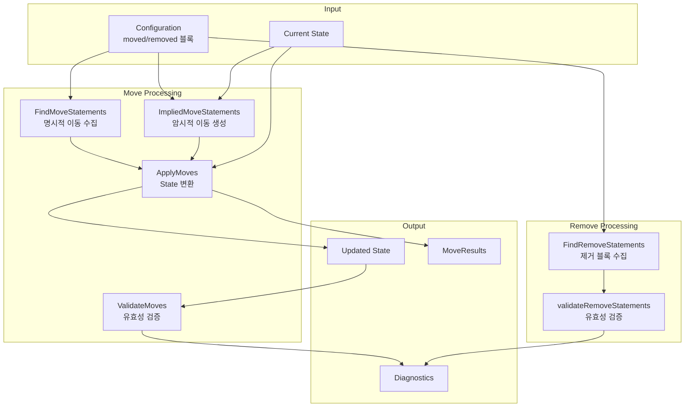

# 17. 리팩토링 & Moved 블록 심화

## 목차

1. [개요](#1-개요)
2. [MoveStatement 구조체](#2-movestatement-구조체)
3. [이동 문 검색: FindMoveStatements](#3-이동-문-검색-findmovestatements)
4. [암시적 이동: ImpliedMoveStatements](#4-암시적-이동-impliedmovestatements)
5. [이동 유효성 검증: ValidateMoves](#5-이동-유효성-검증-validatemoves)
6. [이동 실행: ApplyMoves](#6-이동-실행-applymoves)
7. [크로스 프로바이더 이동](#7-크로스-프로바이더-이동)
8. [Removed 블록](#8-removed-블록)
9. [이동 체인 해석](#9-이동-체인-해석)
10. [State 변환 과정](#10-state-변환-과정)
11. [충돌 감지 및 해결](#11-충돌-감지-및-해결)
12. [설계 결정: 왜 moved 블록이 필요한가](#12-설계-결정-왜-moved-블록이-필요한가)
13. [정리](#13-정리)

---

## 1. 개요

Terraform의 리팩토링(Refactoring) 시스템은 `moved` 블록과 `removed` 블록을 통해 **인프라를 파괴하지 않고 코드 구조를 변경**할 수 있게 한다. 리소스 이름을 변경하거나, 모듈로 이동하거나, 모듈 이름을 변경할 때 기존 State를 자동으로 업데이트한다.

### 해결하는 문제

| 시나리오 | moved 블록 없이 | moved 블록 사용 |
|---------|----------------|----------------|
| 리소스 이름 변경 | 삭제 + 재생성 | State만 업데이트 |
| 모듈 이동 | 삭제 + 재생성 | State만 업데이트 |
| terraform state mv | 수동, 코드 리뷰 불가 | 자동, 코드 리뷰 가능 |
| 팀 배포 | 각 팀원이 state mv 실행 | 코드 변경만으로 자동 |

### 핵심 소스 파일

| 파일 경로 | 역할 |
|-----------|------|
| `internal/refactoring/move_statement.go` | MoveStatement 구조체, 검색/생성 |
| `internal/refactoring/move_validate.go` | 이동 유효성 검증 |
| `internal/refactoring/move_execute.go` | 이동 실행 (State 변환) |
| `internal/refactoring/cross_provider_move.go` | 크로스 프로바이더 이동 |
| `internal/refactoring/remove_statement.go` | removed 블록 처리 |
| `internal/addrs/move_endpoint.go` | MoveEndpoint 주소 타입 |

---

## 2. MoveStatement 구조체

### 2.1 정의

`internal/refactoring/move_statement.go`에 정의:

```go
type MoveStatement struct {
    From, To  *addrs.MoveEndpointInModule
    DeclRange tfdiags.SourceRange

    // Provider는 "to" 주소의 프로바이더 설정.
    // 이동 후 리소스를 관리할 프로바이더.
    // 모듈 이동인 경우 nil.
    Provider *addrs.AbsProviderConfig

    // Implied는 명시적 moved 블록이 아닌
    // 자동 생성된 이동 문인 경우 true.
    Implied bool
}
```

### 2.2 HCL에서의 moved 블록

```hcl
# 리소스 이름 변경
moved {
  from = aws_instance.old_name
  to   = aws_instance.new_name
}

# 모듈 이동
moved {
  from = module.old_module
  to   = module.new_module
}

# 리소스를 모듈로 이동
moved {
  from = aws_instance.web
  to   = module.compute.aws_instance.web
}

# 인스턴스 키 변경 (count → for_each)
moved {
  from = aws_instance.web[0]
  to   = aws_instance.web["primary"]
}
```

### 2.3 MoveEndpointInModule

```go
// MoveEndpoint는 이동의 시작점 또는 끝점을 나타냄
type MoveEndpoint struct {
    SourceRange tfdiags.SourceRange
    relSubject  AbsMoveable  // 상대 주소 (내부적으로 AbsMoveable 오용)
}
```

`MoveEndpointInModule`은 모듈 경로와 결합된 MoveEndpoint:

```
moved {
  from = aws_instance.old    # → MoveEndpointInModule{module: RootModule, endpoint: ...}
  to   = aws_instance.new    # → MoveEndpointInModule{module: RootModule, endpoint: ...}
}
```

### 2.4 ObjectKind

```go
func (s *MoveStatement) ObjectKind() addrs.MoveEndpointKind {
    return s.From.ObjectKind()
}
// MoveEndpointModule   — 모듈 이동
// MoveEndpointResource — 리소스 이동
```

---

## 3. 이동 문 검색: FindMoveStatements

### 3.1 재귀적 설정 탐색

```go
func FindMoveStatements(rootCfg *configs.Config) []MoveStatement {
    return findMoveStatements(rootCfg, nil)
}

func findMoveStatements(cfg *configs.Config, into []MoveStatement) []MoveStatement {
    modAddr := cfg.Path

    for _, mc := range cfg.Module.Moved {
        // 1. 엔드포인트 통합 (from과 to가 같은 종류인지 확인)
        fromAddr, toAddr := addrs.UnifyMoveEndpoints(modAddr, mc.From, mc.To)

        // 2. MoveStatement 구성
        stmt := MoveStatement{
            From:      fromAddr,
            To:        toAddr,
            DeclRange: tfdiags.SourceRangeFromHCL(mc.DeclRange),
            Implied:   false,
        }

        // 3. 프로바이더 정보 첨부 (리소스 이동인 경우)
        if toResource, ok := mc.To.ConfigMoveable(addrs.RootModule).(addrs.ConfigResource); ok {
            modCfg := cfg.Descendant(toResource.Module)
            if modCfg != nil {
                resourceConfig := modCfg.Module.ResourceByAddr(toResource.Resource)
                if resourceConfig != nil {
                    stmt.Provider = &addrs.AbsProviderConfig{
                        Module:   modAddr,
                        Provider: resourceConfig.Provider,
                    }
                    if resourceConfig.ProviderConfigRef != nil {
                        stmt.Provider.Alias = resourceConfig.ProviderConfigRef.Alias
                    }
                }
            }
        }

        into = append(into, stmt)
    }

    // 4. 자식 모듈 재귀 탐색
    for _, childCfg := range cfg.Children {
        into = findMoveStatements(childCfg, into)
    }

    return into
}
```

### 3.2 프로바이더 첨부 이유

moved 블록에 프로바이더 정보를 첨부하는 이유:

```
이동 전: aws_instance.old → Provider: aws (이전 설정)
이동 후: aws_instance.new → Provider: aws (새 설정)

크로스 프로바이더 이동 시:
이동 전: aws_instance.old → Provider: aws
이동 후: module.new.aws_instance.new → Provider: aws (다른 별칭 가능)
```

---

## 4. 암시적 이동: ImpliedMoveStatements

### 4.1 왜 암시적 이동이 필요한가

Terraform v1.0 이전에는 `count`를 추가/제거할 때 자동으로 인스턴스를 매핑하는 "NodeCountBoundary" 휴리스틱이 있었다. `moved` 블록 도입 후에도 이 동작을 유지하기 위해 암시적 이동을 생성한다.

### 4.2 암시적 이동 시나리오

```hcl
# 이전: count 없는 리소스
resource "aws_instance" "web" {
  ami = "ami-123"
}
# State: aws_instance.web (NoKey)

# 변경 후: count 추가
resource "aws_instance" "web" {
  count = 3
  ami   = "ami-123"
}
# 암시적 moved: aws_instance.web → aws_instance.web[0]
```

```hcl
# 이전: count 있는 리소스
resource "aws_instance" "web" {
  count = 3
  ami   = "ami-123"
}
# State: aws_instance.web[0], aws_instance.web[1], aws_instance.web[2]

# 변경 후: count 제거
resource "aws_instance" "web" {
  ami = "ami-123"
}
# 암시적 moved: aws_instance.web[0] → aws_instance.web
# (나머지 [1], [2]는 삭제 대상)
```

### 4.3 구현 상세

```go
func ImpliedMoveStatements(rootCfg *configs.Config, prevRunState *states.State,
    explicitStmts []MoveStatement) []MoveStatement {
    return impliedMoveStatements(rootCfg, prevRunState, explicitStmts, nil)
}

func impliedMoveStatements(cfg *configs.Config, prevRunState *states.State,
    explicitStmts []MoveStatement, into []MoveStatement) []MoveStatement {

    modAddr := cfg.Path

    for _, modState := range prevRunState.ModuleInstances(modAddr) {
        for _, rState := range modState.Resources {
            rAddr := rState.Addr
            rCfg := cfg.Module.ResourceByAddr(rAddr.Resource)
            if rCfg == nil {
                continue  // 설정에 없으면 암시적 이동 불필요
            }

            var fromKey, toKey addrs.InstanceKey

            switch {
            case rCfg.Count != nil:
                // count가 추가됨: NoKey → IntKey(0)
                if riState := rState.Instances[addrs.NoKey]; riState != nil {
                    fromKey = addrs.NoKey
                    toKey = addrs.IntKey(0)
                }
            case rCfg.Count == nil && rCfg.ForEach == nil:
                // count가 제거됨: IntKey(0) → NoKey
                if riState := rState.Instances[addrs.IntKey(0)]; riState != nil {
                    fromKey = addrs.IntKey(0)
                    toKey = addrs.NoKey
                }
            }

            if fromKey != toKey {
                // 사용자가 이미 명시적 moved를 작성했는지 확인
                if !haveMoveStatementForResource(rAddr, explicitStmts) {
                    into = append(into, MoveStatement{
                        From:      addrs.ImpliedMoveStatementEndpoint(rAddr.Instance(fromKey), ...),
                        To:        addrs.ImpliedMoveStatementEndpoint(rAddr.Instance(toKey), ...),
                        Provider:  provider,
                        DeclRange: approxSrcRange,
                        Implied:   true,
                    })
                }
            }
        }
    }

    for _, childCfg := range cfg.Children {
        into = impliedMoveStatements(childCfg, prevRunState, explicitStmts, into)
    }

    return into
}
```

### 4.4 명시적 이동 우선

```go
func haveMoveStatementForResource(addr addrs.AbsResource, stmts []MoveStatement) bool {
    for _, stmt := range stmts {
        if stmt.From.SelectsResource(addr) { return true }
        if stmt.To.SelectsResource(addr) { return true }
    }
    return false
}
```

사용자가 명시적 `moved` 블록을 작성했다면, 암시적 이동은 생성하지 않는다. 사용자가 0번이 아닌 다른 인스턴스를 유지하고 싶을 수 있기 때문이다.

---

## 5. 이동 유효성 검증: ValidateMoves

### 5.1 검증 시점

중요한 아키텍처 특이점: **검증은 실행 후에** 일어난다.

```
Plan 단계:
1. ApplyMoves() 실행 (State 변환) ← 유효하지 않아도 실행
2. Plan Walk (변환된 State 기반)
3. ValidateMoves() 실행 ← 유효성 검증
4. 유효하지 않으면 잘못된 Plan이지만 사용자에게 보여주지 않음
```

주석이 이 결정을 설명한다:

> Because validation depends on the planning result but move execution must happen _before_ planning, we have the unusual situation where sibling function ApplyMoves must run before ValidateMoves and must therefore tolerate and ignore any invalid statements.

### 5.2 검증 항목

```go
func ValidateMoves(stmts []MoveStatement, rootCfg *configs.Config,
    declaredInsts instances.Set) tfdiags.Diagnostics {

    g := buildMoveStatementGraph(stmts)

    for _, stmt := range stmts {
        fromMod, _ := stmt.From.ModuleCallTraversals()

        for _, fromModInst := range declaredInsts.InstancesForModule(fromMod, false) {
            absFrom := stmt.From.InModuleInstance(fromModInst)
            absTo := stmt.To.InModuleInstance(fromModInst)

            // 검증 1: 자기 자신으로 이동 금지
            if addrs.Equivalent(absFrom, absTo) {
                diags = diags.Append("Redundant move statement")
            }

            // 검증 2: 중복 from 주소 금지
            if existing, ok := stmtFrom.GetOk(absFrom); ok {
                diags = diags.Append("Ambiguous move statements")
            }

            // 검증 3: 중복 to 주소 금지
            if existing, ok := stmtTo.GetOk(absTo); ok {
                diags = diags.Append("Ambiguous move statements")
            }
        }
    }
}
```

### 5.3 검증 규칙 요약

| 규칙 | 에러 메시지 | 설명 |
|------|-----------|------|
| 자기 이동 | "Redundant move statement" | from과 to가 동일 |
| 중복 소스 | "Ambiguous move statements" | 같은 from에서 여러 to |
| 중복 대상 | "Ambiguous move statements" | 여러 from이 같은 to |
| 타입 불일치 | 설정 파서에서 잡힘 | 리소스 ↔ 모듈 혼합 |
| 순환 | DAG 검증에서 잡힘 | A→B→A |

### 5.4 그래프 기반 검증

```go
g := buildMoveStatementGraph(stmts)
```

이동 문을 DAG(Directed Acyclic Graph)로 구성하여:
1. 체인 관계 파악 (A→B, B→C → A→B→C)
2. 순환 감지
3. 실행 순서 결정

---

## 6. 이동 실행: ApplyMoves

### 6.1 핵심 함수

```go
func ApplyMoves(stmts []MoveStatement, state *states.State,
    providerFactory map[addrs.Provider]providers.Factory) (MoveResults, tfdiags.Diagnostics) {

    ret := makeMoveResults()

    if len(stmts) == 0 {
        return ret, nil
    }

    // 1. 이동 문 그래프 구성
    g := buildMoveStatementGraph(stmts)

    // 2. 그래프 유효성 확인
    if diags := validateMoveStatementGraph(g); diags.HasErrors() {
        return ret, nil  // 무효하면 아무것도 하지 않음
    }

    // 3. 추이 감소 (Transitive Reduction)
    g.TransitiveReduction()

    // 4. 시작 노드 찾기 (의존성 없는 노드)
    startNodes := make(dag.Set, len(stmts))
    for _, v := range g.Vertices() {
        if len(g.DownEdges(v)) == 0 {
            startNodes.Add(v)
        }
    }

    // 5. 이동 실행 (깊이 우선 역순)
    // ... ReverseDepthFirstWalk ...
}
```

### 6.2 그래프 워킹

```
이동 문 그래프:
    A→B (먼저 실행)
    ↓
    B→C (나중 실행)

ReverseDepthFirstWalk:
    1. B→C 실행 (잎 노드부터)
    2. A→B 실행 (루트로 올라감)

왜 역순인가?
    체인 A→B→C가 있을 때:
    1. 먼저 B를 C로 이동
    2. 그 다음 A를 (이미 C로 이동한) B로 이동
    → 최종: A가 C에 도착
```

### 6.3 체인 결과 기록

```go
recordOldAddr := func(oldAddr, newAddr addrs.AbsResourceInstance) {
    if prevMove, exists := ret.Changes.GetOk(oldAddr); exists {
        // 이미 이동된 적이 있으면 체인 압축
        ret.Changes.Remove(oldAddr)
        oldAddr = prevMove.From  // 원래 위치로 추적
    }
    ret.Changes.Put(newAddr, MoveSuccess{
        From: oldAddr,
        To:   newAddr,
    })
}
```

### 6.4 MoveResults

```go
type MoveResults struct {
    Changes addrs.Map[addrs.AbsResourceInstance, MoveSuccess]
    Blocked addrs.Map[addrs.AbsMoveable, MoveBlocked]
}

type MoveSuccess struct {
    From addrs.AbsResourceInstance
    To   addrs.AbsResourceInstance
}

type MoveBlocked struct {
    Wanted addrs.AbsMoveable
    Actual addrs.AbsMoveable
}
```

### 6.5 실행 흐름 다이어그램

```
ApplyMoves() 전체 흐름:

┌─────────────────────────────────────────────────────────┐
│ 1. 이동 문 수집                                          │
│    FindMoveStatements()                                  │
│    + ImpliedMoveStatements()                             │
└───────────────────┬─────────────────────────────────────┘
                    ↓
┌─────────────────────────────────────────────────────────┐
│ 2. DAG 구성                                              │
│    buildMoveStatementGraph(stmts)                        │
│    체인 관계, 중첩 관계 분석                               │
└───────────────────┬─────────────────────────────────────┘
                    ↓
┌─────────────────────────────────────────────────────────┐
│ 3. 추이 감소                                             │
│    g.TransitiveReduction()                               │
│    직접 의존성만 유지                                      │
└───────────────────┬─────────────────────────────────────┘
                    ↓
┌─────────────────────────────────────────────────────────┐
│ 4. 역방향 깊이 우선 탐색                                  │
│    ReverseDepthFirstWalk                                 │
│    각 이동 문에 대해:                                     │
│    ├── 소스 인스턴스 존재 확인                             │
│    ├── 대상에 이미 인스턴스 있는지 확인                     │
│    ├── State에서 이동 실행                                │
│    └── 결과 기록 (성공/차단)                              │
└───────────────────┬─────────────────────────────────────┘
                    ↓
┌─────────────────────────────────────────────────────────┐
│ 5. 결과 반환                                             │
│    MoveResults{Changes, Blocked}                         │
└─────────────────────────────────────────────────────────┘
```

---

## 7. 크로스 프로바이더 이동

### 7.1 crossTypeMover

`internal/refactoring/cross_provider_move.go`에 정의:

```go
type crossTypeMover struct {
    State             *states.State
    ProviderFactories map[addrs.Provider]providers.Factory
    ProviderCache     map[addrs.Provider]providers.Interface
}
```

### 7.2 프로바이더 캐싱

```go
func (m *crossTypeMover) getProvider(providers addrs.Provider) (providers.Interface, error) {
    // 캐시에서 먼저 확인
    if provider, ok := m.ProviderCache[providers]; ok {
        return provider, nil
    }

    // 팩토리에서 새로 생성
    if factory, ok := m.ProviderFactories[providers]; ok {
        provider, err := factory()
        m.ProviderCache[providers] = provider
        return provider, nil
    }

    return nil, fmt.Errorf("provider %s implementation not found", providers)
}
```

### 7.3 크로스 타입 이동 감지

```go
func (m *crossTypeMover) prepareCrossTypeMove(stmt *MoveStatement,
    source, target addrs.AbsResource) (*crossTypeMove, tfdiags.Diagnostics) {

    targetProviderAddr := stmt.Provider
    sourceProviderAddr := m.State.Resource(source).ProviderConfig

    if targetProviderAddr.Provider.Equals(sourceProviderAddr.Provider) {
        if source.Resource.Type == target.Resource.Type {
            // 같은 프로바이더, 같은 타입 → 일반 이동
            return nil, nil
        }
    }

    // 다른 프로바이더 또는 다른 타입 → 크로스 타입 이동 준비
    // ...
}
```

### 7.4 크로스 타입 이동 시나리오

```hcl
# 시나리오 1: 같은 프로바이더, 다른 타입
moved {
  from = aws_instance.old
  to   = aws_spot_instance.new
}

# 시나리오 2: 다른 프로바이더 별칭
moved {
  from = aws_instance.old        # provider = aws
  to   = aws_instance.new        # provider = aws.west
}

# 시나리오 3: 다른 프로바이더 (예: 분할)
moved {
  from = aws_instance.old
  to   = awscc_ec2_instance.new
}
```

### 7.5 close 메서드

```go
func (m *crossTypeMover) close() tfdiags.Diagnostics {
    var diags tfdiags.Diagnostics
    for _, provider := range m.ProviderCache {
        diags = diags.Append(provider.Close())
    }
    return diags
}
```

캐시된 프로바이더 인스턴스는 이동 완료 후 반드시 닫아야 한다.

---

## 8. Removed 블록

### 8.1 RemoveStatement 구조체

`internal/refactoring/remove_statement.go`에 정의:

```go
type RemoveStatement struct {
    From      addrs.ConfigMoveable  // 제거 대상 주소
    Destroy   bool                  // true: 리소스 파괴, false: State에서만 제거
    DeclRange tfdiags.SourceRange
}
```

### 8.2 HCL에서의 removed 블록

```hcl
# 리소스를 State에서만 제거 (실제 인프라 유지)
removed {
  from = aws_instance.legacy

  lifecycle {
    destroy = false
  }
}

# 리소스 파괴 + State에서 제거
removed {
  from = aws_instance.legacy

  lifecycle {
    destroy = true  # 기본값
  }
}

# 모듈 제거
removed {
  from = module.old_module

  lifecycle {
    destroy = false
  }
}
```

### 8.3 FindRemoveStatements

```go
func FindRemoveStatements(rootCfg *configs.Config) (
    addrs.Map[addrs.ConfigMoveable, RemoveStatement], tfdiags.Diagnostics) {

    stmts := findRemoveStatements(rootCfg, addrs.MakeMap[addrs.ConfigMoveable, RemoveStatement]())
    diags := validateRemoveStatements(rootCfg, stmts)
    return stmts, diags
}
```

### 8.4 제거 유효성 검증

```go
func validateRemoveStatements(cfg *configs.Config,
    stmts addrs.Map[addrs.ConfigMoveable, RemoveStatement]) tfdiags.Diagnostics {

    for _, rst := range stmts.Keys() {
        switch rst := rst.(type) {
        case addrs.ConfigResource:
            m := cfg.Descendant(rst.Module)
            if r := m.Module.ResourceByAddr(rst.Resource); r != nil {
                // 에러: "Removed resource still exists"
                // removed 선언했지만 설정에 여전히 존재
            }
        case addrs.Module:
            if m := cfg.Descendant(rst); m != nil {
                // 에러: "Removed module still exists"
            }
        }
    }
}
```

### 8.5 removed vs terraform state rm

| 항목 | `removed` 블록 | `terraform state rm` |
|------|---------------|---------------------|
| 방식 | 선언적 (코드) | 명령형 (CLI) |
| 코드 리뷰 | 가능 | 불가 |
| 팀 배포 | 자동 적용 | 각자 실행 필요 |
| 롤백 | Git revert | 수동 state import |
| 파괴 제어 | `destroy = false/true` | state에서만 제거 |
| 버전 관리 | 코드에 기록 | 기록 없음 |

### 8.6 removed 검색 구현

```go
func findRemoveStatements(cfg *configs.Config,
    into addrs.Map[addrs.ConfigMoveable, RemoveStatement]) addrs.Map[addrs.ConfigMoveable, RemoveStatement] {

    for _, mc := range cfg.Module.Removed {
        switch mc.From.ObjectKind() {
        case addrs.RemoveTargetResource:
            res := mc.From.RelSubject.(addrs.ConfigResource)
            fromAddr := addrs.ConfigResource{
                Module:   cfg.Path.Append(res.Module),
                Resource: res.Resource,
            }
            // ...
        case addrs.RemoveTargetModule:
            // 모듈 제거 처리
        }
    }

    for _, childCfg := range cfg.Children {
        into = findRemoveStatements(childCfg, into)
    }

    return into
}
```

---

## 9. 이동 체인 해석

### 9.1 체인이란

여러 `moved` 블록이 연결되어 하나의 이동 경로를 형성하는 것:

```hcl
# 1단계: 이름 변경
moved {
  from = aws_instance.web
  to   = aws_instance.application
}

# 2단계: 모듈로 이동
moved {
  from = aws_instance.application
  to   = module.compute.aws_instance.application
}

# 결과 체인: aws_instance.web → aws_instance.application → module.compute.aws_instance.application
# 최종 효과: aws_instance.web → module.compute.aws_instance.application
```

### 9.2 그래프 구성

```
이동 체인 DAG:

A→B 이동문 ──depends_on──→ B→C 이동문

실행 순서 (역순):
1. B→C 실행 (B에 있는 것을 C로)
2. A→B 실행 (A에 있는 것을 이제 C에 있는 B로 → 최종적으로 C)
```

### 9.3 체인 압축

```go
recordOldAddr := func(oldAddr, newAddr addrs.AbsResourceInstance) {
    if prevMove, exists := ret.Changes.GetOk(oldAddr); exists {
        // 이전 이동이 있으면 체인 압축
        ret.Changes.Remove(oldAddr)
        oldAddr = prevMove.From  // 원래의 원래 위치
    }
    ret.Changes.Put(newAddr, MoveSuccess{
        From: oldAddr,  // 체인의 시작점
        To:   newAddr,  // 체인의 끝점
    })
}
```

결과에서는 체인의 중간 단계가 생략되고, 처음과 마지막만 기록된다:

```
기록: MoveSuccess{From: aws_instance.web, To: module.compute.aws_instance.application}
중간(aws_instance.application)은 기록에서 생략
```

### 9.4 3단계 이상 체인

```hcl
moved { from = a to = b }
moved { from = b to = c }
moved { from = c to = d }
```

```
DAG: a→b → b→c → c→d

실행 순서:
1. c→d (State에서 c를 d로)
2. b→c (State에서 b를 c로 → 실제론 이미 d에 있음)
3. a→b (State에서 a를 b로 → 실제론 이미 d에 있음)

최종: a가 d에 도착
기록: MoveSuccess{From: a, To: d}
```

### 9.5 TransitiveReduction

```go
g.TransitiveReduction()
```

추이 감소는 DAG에서 간접적으로 도달 가능한 직접 간선을 제거한다:

```
감소 전:                감소 후:
A → B                   A → B
A → C                   B → C
B → C
(A→C는 A→B→C로 도달 가능하므로 제거)
```

이것이 `ReverseDepthFirstWalk`가 올바르게 동작하기 위한 전제 조건이다.

---

## 10. State 변환 과정

### 10.1 리소스 이동

```
State 변환 (리소스 이동):

변환 전:
{
  "resources": [
    {
      "address": "aws_instance.old_name",
      "provider": "registry.terraform.io/hashicorp/aws",
      "instances": [
        { "attributes": { "id": "i-123", "ami": "ami-456" } }
      ]
    }
  ]
}

변환 후:
{
  "resources": [
    {
      "address": "aws_instance.new_name",      ← 주소만 변경
      "provider": "registry.terraform.io/hashicorp/aws",  ← 동일
      "instances": [
        { "attributes": { "id": "i-123", "ami": "ami-456" } }  ← 동일
      ]
    }
  ]
}
```

### 10.2 모듈 이동

```
State 변환 (모듈 이동):

변환 전:
  module.old_vpc.aws_subnet.public[0]
  module.old_vpc.aws_subnet.public[1]
  module.old_vpc.aws_route_table.main

변환 후:
  module.new_vpc.aws_subnet.public[0]    ← 모듈 경로만 변경
  module.new_vpc.aws_subnet.public[1]
  module.new_vpc.aws_route_table.main
```

### 10.3 인스턴스 키 변경

```
State 변환 (count → for_each):

변환 전:
  aws_instance.web[0]  → { id: "i-111" }
  aws_instance.web[1]  → { id: "i-222" }

moved { from = aws_instance.web[0] to = aws_instance.web["primary"] }
moved { from = aws_instance.web[1] to = aws_instance.web["secondary"] }

변환 후:
  aws_instance.web["primary"]   → { id: "i-111" }
  aws_instance.web["secondary"] → { id: "i-222" }
```

---

## 11. 충돌 감지 및 해결

### 11.1 충돌 시나리오

```hcl
# 시나리오 1: 대상에 이미 리소스 존재
resource "aws_instance" "new" { ... }  # 이미 State에 있음

moved {
  from = aws_instance.old
  to   = aws_instance.new    # 충돌!
}
```

### 11.2 차단(Blockage) 기록

```go
recordBlockage := func(newAddr, wantedAddr addrs.AbsMoveable) {
    ret.Blocked.Put(newAddr, MoveBlocked{
        Wanted: wantedAddr,
        Actual: newAddr,
    })
}
```

이동하려는 대상에 이미 리소스가 있으면, 이동은 "차단"되고 `MoveBlocked`로 기록된다.

### 11.3 충돌 유형

| 충돌 | 동작 | 결과 |
|------|------|------|
| 대상에 이미 존재 | 이동 차단 | 에러 진단 |
| 소스에 아무것도 없음 | 이동 무시 | 조용히 스킵 |
| 중복 소스 (A→B, A→C) | 유효성 검증에서 잡힘 | 에러 |
| 중복 대상 (A→C, B→C) | 유효성 검증에서 잡힘 | 에러 |
| 순환 (A→B→A) | DAG 검증에서 잡힘 | 에러 |

### 11.4 Plan에서의 충돌 표시

```
Terraform will perform the following actions:

  # aws_instance.old has moved to aws_instance.new
    resource "aws_instance" "new" {
        id            = "i-123"
        ami           = "ami-456"
        instance_type = "t3.micro"
    }

Plan: 0 to add, 0 to change, 0 to destroy.
```

충돌이 없으면 Plan에 이동이 표시되고, 실제 인프라 변경은 없다.

---

## 12. 설계 결정: 왜 moved 블록이 필요한가

### 12.1 terraform state mv의 한계

```bash
# 기존 방법: 명령형
terraform state mv aws_instance.old aws_instance.new
```

문제점:

| 문제 | 설명 |
|------|------|
| 코드 리뷰 불가 | state mv는 CLI 명령이라 Git에 기록 안 됨 |
| 팀 배포 불일치 | 각 팀원이 같은 state mv를 실행해야 함 |
| 자동화 어려움 | CI/CD에서 state mv를 조건부로 실행하기 복잡 |
| 롤백 어려움 | state mv를 되돌리려면 반대 방향 mv 필요 |
| 모듈 재사용 | 모듈 게시 시 소비자가 state mv를 해야 함 |

### 12.2 moved 블록의 장점

```hcl
# 선언적 + 코드 리뷰 가능
moved {
  from = aws_instance.old
  to   = aws_instance.new
}
```

| 장점 | 설명 |
|------|------|
| Git에 기록 | PR로 리뷰 가능 |
| 자동 적용 | `terraform plan` 시 자동 감지 |
| 멱등성 | 여러 번 실행해도 동일 결과 |
| 모듈 게시 | 모듈 작성자가 moved를 포함하면 소비자 투명 |
| 체인 지원 | 여러 단계의 이동을 선언적으로 표현 |
| 팀 동기화 | 코드만 pull하면 자동 적용 |

### 12.3 왜 검증이 실행 후인가

```
일반적 기대: 검증 → 실행
실제 순서: 실행 → 검증

이유:
- 검증은 Plan 결과(인스턴스 집합)에 의존
- Plan은 State에 의존
- 이동은 State를 변경
- 따라서: 이동 → 변경된 State로 Plan → Plan 결과로 검증

순서:
1. ApplyMoves(stmts, state)  ← 무효해도 실행 (에러 무시)
2. Plan Walk(변경된 state)    ← 잘못된 Plan 생성 가능
3. ValidateMoves(stmts, ...)  ← 여기서 에러 감지
4. 에러가 있으면 Plan을 사용자에게 보여주지 않음
```

### 12.4 왜 암시적 이동을 유지하는가

```
v1.0 이전 동작:
  count가 추가/제거되면 NodeCountBoundary 휴리스틱으로 자동 매핑

v1.1+ 동작:
  moved 블록으로 명시적 이동 지원
  + ImpliedMoveStatements로 이전 동작 호환

이전 호환성을 깨뜨리면:
  - 기존 모듈에 count를 추가할 때마다 리소스 재생성
  - 사용자 혼란과 불편
```

주석이 이를 명확히 한다:

> We should think very hard before adding any _new_ implication rules for moved statements.

새로운 암시적 규칙 추가는 극도로 신중해야 한다.

---

## 13. 정리

### 전체 리팩토링 흐름



### 핵심 요약

| 개념 | 설명 |
|------|------|
| **MoveStatement** | from + to + 프로바이더 + 암시 여부 |
| **FindMoveStatements** | 재귀적 설정 탐색, 프로바이더 첨부 |
| **ImpliedMoveStatements** | count 추가/제거 시 v1.0 호환 이동 |
| **ValidateMoves** | 자기 이동, 중복, 순환 검증 (실행 후) |
| **ApplyMoves** | DAG 기반 체인 실행, State 변환 |
| **crossTypeMover** | 다른 프로바이더/타입 간 이동 지원 |
| **RemoveStatement** | State에서 제거 (destroy 선택 가능) |
| **체인 압축** | A→B→C → 결과에서 A→C만 기록 |

### 학습 포인트

1. **선언적 리팩토링**: 명령형 state mv 대신 코드로 리팩토링 선언
2. **역순 실행**: 체인에서 잎 노드부터 실행하여 올바른 최종 상태 도달
3. **검증 후 실행**: 비직관적이지만 필요한 아키텍처 결정
4. **암시적 호환성**: 이전 버전 동작을 깨뜨리지 않는 신중한 접근
5. **DAG 활용**: 이동 문 간의 의존성과 실행 순서를 그래프로 관리
