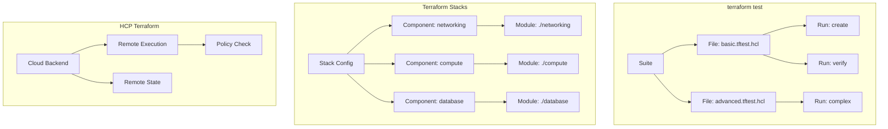

# 18. 테스트 프레임워크 & Stacks 심화

## 목차

1. [개요](#1-개요)
2. [terraform test 프레임워크](#2-terraform-test-프레임워크)
3. [.tftest.hcl 파일 형식](#3-tftesthcl-파일-형식)
4. [테스트 실행 흐름](#4-테스트-실행-흐름)
5. [테스트 모드: plan-only와 apply](#5-테스트-모드-plan-only와-apply)
6. [Suite, File, Run 계층 구조](#6-suite-file-run-계층-구조)
7. [Terraform Stacks 아키텍처](#7-terraform-stacks-아키텍처)
8. [Stack 설정 구조 (stackconfig)](#8-stack-설정-구조-stackconfig)
9. [Component 모델](#9-component-모델)
10. [HCP Terraform 통합 (Cloud 패키지)](#10-hcp-terraform-통합-cloud-패키지)
11. [원격 Plan/Apply 실행](#11-원격-planapply-실행)
12. [설계 결정: 왜 terraform test가 필요한가](#12-설계-결정-왜-terraform-test가-필요한가)
13. [정리](#13-정리)

---

## 1. 개요

이 문서는 Terraform의 세 가지 고급 기능을 다룬다:

1. **terraform test**: 인프라 코드의 자동화된 테스트 프레임워크
2. **Terraform Stacks**: 여러 Terraform 구성을 하나의 배포 단위로 관리
3. **HCP Terraform 통합**: 원격 실행, State 관리, 협업 기능

### 핵심 소스 파일

| 파일/디렉토리 | 역할 |
|-------------|------|
| `internal/moduletest/` | terraform test 핵심 타입 정의 |
| `internal/moduletest/run.go` | Run 구조체 (개별 테스트 단계) |
| `internal/moduletest/file.go` | File 구조체 (테스트 파일) |
| `internal/moduletest/suite.go` | Suite 구조체 (테스트 스위트) |
| `internal/moduletest/status.go` | Status 열거형 |
| `internal/stacks/stackconfig/` | Stack 설정 파싱 |
| `internal/stacks/stackruntime/` | Stack 런타임 실행 |
| `internal/stacks/stackaddrs/` | Stack 주소 체계 |
| `internal/cloud/backend.go` | HCP Terraform Cloud 백엔드 |

---

## 2. terraform test 프레임워크

### 2.1 테스트 프레임워크의 목적

Terraform test는 **인프라 코드의 동작을 검증**하는 내장 테스트 프레임워크이다.

```
기존 접근                     terraform test
─────────                     ──────────────
Terratest (Go 코드)           HCL 선언적 테스트
별도 프로그래밍 언어 필요       Terraform 언어로 작성
테스트 인프라 수동 관리         자동 생성/정리
설정 파일과 분리               설정 파일과 통합
```

### 2.2 TestSuiteRunner 인터페이스

`internal/moduletest/suite.go`에 정의:

```go
type TestSuiteRunner interface {
    Test(experimentsAllowed bool) (Status, tfdiags.Diagnostics)
    Stop()
    Cancel()
    IsStopped() bool
}
```

### 2.3 CommandMode

```go
type CommandMode int

const (
    NormalMode  CommandMode = iota  // 일반 테스트 실행
    CleanupMode                     // 정리 전용 모드
)
```

---

## 3. .tftest.hcl 파일 형식

### 3.1 기본 구조

```hcl
# tests/basic.tftest.hcl

# 프로바이더 설정 (선택적)
provider "aws" {
  region = "us-east-1"
}

# 변수 오버라이드 (선택적)
variables {
  instance_type = "t3.micro"
  environment   = "test"
}

# 테스트 실행 블록
run "create_instance" {
  command = apply  # 또는 plan

  assert {
    condition     = aws_instance.web.instance_type == "t3.micro"
    error_message = "Instance type mismatch"
  }
}

run "verify_output" {
  command = plan

  assert {
    condition     = output.instance_id != ""
    error_message = "Instance ID should not be empty"
  }
}
```

### 3.2 파일 명명 규칙

```
project/
├── main.tf
├── variables.tf
├── outputs.tf
├── tests/
│   ├── basic.tftest.hcl        ← 기본 테스트
│   ├── advanced.tftest.hcl     ← 고급 테스트
│   └── edge_cases.tftest.hcl   ← 엣지 케이스
└── testdata/
    └── fixtures.tfvars          ← 테스트용 변수
```

### 3.3 run 블록 옵션

```hcl
run "test_name" {
  # 실행 명령
  command = apply  # plan 또는 apply

  # 대상 모듈 (기본: 현재 모듈)
  module {
    source = "./modules/helper"
  }

  # 변수 오버라이드
  variables {
    name = "test-resource"
  }

  # Plan 모드
  plan_options {
    mode    = normal  # normal, refresh-only
    refresh = true
    target  = ["aws_instance.web"]
    replace = ["aws_instance.web"]
  }

  # 어설션
  assert {
    condition     = aws_instance.web.tags["Environment"] == "test"
    error_message = "Environment tag should be 'test'"
  }

  # 예상 실패
  expect_failures = [
    var.invalid_input,
    output.computed_value,
  ]
}
```

### 3.4 어설션 표현식

```hcl
# 기본 비교
assert {
  condition     = length(aws_instance.web) == 3
  error_message = "Expected 3 instances, got ${length(aws_instance.web)}"
}

# 정규식 매칭
assert {
  condition     = can(regex("^i-[a-f0-9]+$", aws_instance.web.id))
  error_message = "Instance ID format is invalid"
}

# null 체크
assert {
  condition     = aws_instance.web.public_ip != null
  error_message = "Public IP should be assigned"
}

# 복합 조건
assert {
  condition     = alltrue([
    aws_instance.web.instance_type == "t3.micro",
    length(aws_instance.web.tags) > 0,
    startswith(aws_instance.web.tags["Name"], "web-"),
  ])
  error_message = "Instance configuration is incorrect"
}
```

---

## 4. 테스트 실행 흐름

### 4.1 전체 흐름

```
terraform test
    ↓
1. 테스트 파일 발견
   *.tftest.hcl 파일 검색
   tests/ 디렉토리 스캔
    ↓
2. Suite 구성
   Suite{
     Files: map[string]*File{
       "basic.tftest.hcl": &File{
         Runs: []*Run{run1, run2, ...},
       },
     },
   }
    ↓
3. 각 File에 대해:
   ├── 4. 각 Run에 대해:
   │   ├── Setup: 변수 설정, 프로바이더 초기화
   │   ├── Execute: plan 또는 apply 실행
   │   ├── Assert: 어설션 평가
   │   └── Record: 결과 기록
   │
   └── 5. Cleanup:
       State에서 생성된 리소스 destroy
    ↓
6. 결과 집계
   Pass/Fail/Error/Skip 카운트
```

### 4.2 시퀀스 다이어그램

```
┌──────────┐    ┌──────────┐    ┌──────────┐    ┌──────────┐
│  CLI     │    │  Suite   │    │  File    │    │  Run     │
│ (test)   │    │  Runner  │    │          │    │          │
└────┬─────┘    └────┬─────┘    └────┬─────┘    └────┬─────┘
     │               │               │               │
     │ Test()        │               │               │
     ├──────────────→│               │               │
     │               │ File 순회     │               │
     │               ├──────────────→│               │
     │               │               │ Run 순회      │
     │               │               ├──────────────→│
     │               │               │               │
     │               │               │  Setup        │
     │               │               │  ├── vars     │
     │               │               │  ├── provider │
     │               │               │  └── config   │
     │               │               │               │
     │               │               │  Execute      │
     │               │               │  ├── plan/    │
     │               │               │  │   apply    │
     │               │               │  └── state    │
     │               │               │               │
     │               │               │  Assert       │
     │               │               │  ├── 조건 평가 │
     │               │               │  └── 결과 기록 │
     │               │               │←──────────────┤
     │               │               │               │
     │               │  Cleanup      │               │
     │               │  (destroy)    │               │
     │               │←──────────────┤               │
     │  Status       │               │               │
     │←──────────────┤               │               │
```

### 4.3 State 관리

각 테스트 파일은 독립적인 State를 가진다:

```
테스트 실행 중:

File "basic.tftest.hcl":
├── Run "setup":     State = {} → {vpc, subnet}
├── Run "create":    State = {vpc, subnet} → {vpc, subnet, instance}
├── Run "verify":    State = {vpc, subnet, instance} (plan only, 변경 없음)
└── Cleanup:         State = {vpc, subnet, instance} → {} (destroy all)

File "advanced.tftest.hcl":
├── Run "complex":   State = {} → {rds, elasticache}
└── Cleanup:         State = {rds, elasticache} → {}
```

---

## 5. 테스트 모드: plan-only와 apply

### 5.1 plan 모드

```hcl
run "check_plan" {
  command = plan

  assert {
    condition     = aws_instance.web.instance_type == "t3.micro"
    error_message = "Wrong instance type in plan"
  }
}
```

- 실제 인프라를 생성하지 않음
- Plan의 예상 값(Known/Unknown)으로 어설션 평가
- 빠르고 안전 (비용 없음)
- Unknown 값은 어설션에서 주의 필요

### 5.2 apply 모드

```hcl
run "create_and_verify" {
  command = apply

  assert {
    condition     = aws_instance.web.public_ip != null
    error_message = "Public IP should be assigned after creation"
  }
}
```

- 실제 인프라 생성
- 실제 값으로 어설션 평가 (Unknown 없음)
- 느리고 비용 발생
- Cleanup에서 자동 destroy

### 5.3 모드 비교

| 항목 | plan 모드 | apply 모드 |
|------|---------|-----------|
| 인프라 생성 | No | Yes |
| Unknown 값 | 있을 수 있음 | 없음 (모두 Known) |
| 실행 속도 | 빠름 | 느림 |
| 비용 | 없음 | 있음 |
| State 변경 | No | Yes |
| Cleanup 필요 | No | Yes (자동) |
| 검증 범위 | 설정 논리 | 실제 동작 |

### 5.4 혼합 사용 패턴

```hcl
# 1단계: apply로 인프라 생성
run "setup" {
  command = apply

  variables {
    create_resources = true
  }
}

# 2단계: plan으로 변경 없음 확인 (멱등성 테스트)
run "idempotent" {
  command = plan

  assert {
    condition     = length(changes) == 0
    error_message = "Re-running plan should produce no changes"
  }
}

# 3단계: apply로 추가 리소스 생성
run "add_more" {
  command = apply

  variables {
    instance_count = 3
  }

  assert {
    condition     = length(aws_instance.web) == 3
    error_message = "Should have 3 instances"
  }
}
```

---

## 6. Suite, File, Run 계층 구조

### 6.1 계층도

```
Suite (테스트 스위트)
├── Status: Pass/Fail/Error/Pending
├── CommandMode: NormalMode/CleanupMode
│
├── File "basic.tftest.hcl"
│   ├── Status: Pass
│   ├── Config: *configs.TestFile
│   ├── Diagnostics: []
│   │
│   ├── Run "create"
│   │   ├── Status: Pass
│   │   ├── Config: *configs.TestRun
│   │   ├── ModuleConfig: *configs.Config
│   │   ├── Outputs: cty.Value
│   │   └── Diagnostics: []
│   │
│   └── Run "verify"
│       ├── Status: Pass
│       └── ...
│
└── File "advanced.tftest.hcl"
    ├── Status: Fail
    │
    └── Run "complex"
        ├── Status: Fail
        └── Diagnostics: [assertion failed]
```

### 6.2 Status 열거형

`internal/moduletest/status.go`에 정의:

```go
type Status int

const (
    Pending Status = iota  // 아직 실행 안 됨
    Skip                   // 건너뜀
    Pass                   // 성공
    Fail                   // 어설션 실패
    Error                  // 런타임 에러
)
```

순서가 중요하다. 높은 값이 더 심각한 상태:

```
Pending(0) < Skip(1) < Pass(2) < Fail(3) < Error(4)
```

### 6.3 Status.Merge

```go
func (status Status) Merge(next Status) Status {
    if next > status {
        return next
    }
    return status
}
```

File과 Suite의 전체 상태는 가장 심각한 Run의 상태:

```
Run 1: Pass
Run 2: Fail    ← 가장 심각
Run 3: Pass

File Status: Fail (Merge 결과)
```

### 6.4 Suite 구조체

```go
type Suite struct {
    Status      Status
    CommandMode CommandMode
    Files       map[string]*File
}
```

### 6.5 File 구조체

```go
type File struct {
    Config *configs.TestFile
    Name   string
    Status Status
    Runs   []*Run
    Diagnostics tfdiags.Diagnostics
    sync.Mutex  // 동시 접근 보호
}
```

스레드 안전:

```go
func (f *File) UpdateStatus(status Status) {
    f.Lock()
    defer f.Unlock()
    f.Status = f.Status.Merge(status)
}
```

### 6.6 Run 구조체

```go
type Run struct {
    Config       *configs.TestRun
    ModuleConfig *configs.Config
    Verbose      *Verbose

    Name    string
    Index   int
    Status  Status
    Outputs cty.Value

    Diagnostics   tfdiags.Diagnostics
    ExecutionMeta *RunExecutionMeta
}
```

### 6.7 RunExecutionMeta

```go
type RunExecutionMeta struct {
    Start    time.Time
    Duration time.Duration
}

func (m *RunExecutionMeta) StartTimestamp() string {
    if m.Start.IsZero() { return "" }
    return m.Start.UTC().Format(time.RFC3339)
}
```

### 6.8 Verbose 구조체

```go
type Verbose struct {
    Plan         *plans.Plan
    State        *states.State
    Config       *configs.Config
    Providers    map[addrs.Provider]providers.ProviderSchema
    Provisioners map[string]*configschema.Block
}
```

`-verbose` 플래그로 실행하면 각 Run의 Plan 출력을 상세히 보여준다.

---

## 7. Terraform Stacks 아키텍처

### 7.1 Stacks란

Terraform Stacks는 **여러 Terraform 구성(Component)을 하나의 배포 단위로 관리**하는 기능이다.

```
기존 Terraform                  Terraform Stacks
──────────────                  ─────────────────
모듈 A: terraform apply         Stack:
모듈 B: terraform apply           Component A + Component B + Component C
모듈 C: terraform apply           → 단일 plan/apply로 모두 관리
```

### 7.2 Stacks 디렉토리 구조

```
internal/stacks/
├── stackaddrs/       # Stack 주소 체계
├── stackconfig/      # Stack 설정 파싱
│   ├── parser/       # HCL 파서
│   ├── stackconfigtypes/  # 타입 정의
│   ├── typeexpr/     # 타입 표현식
│   ├── config.go     # Config 구조체
│   ├── component.go  # Component 정의
│   ├── stack.go      # Stack 정의
│   ├── declarations.go  # 선언 목록
│   └── ...
├── stackruntime/     # 런타임 실행
├── stackplan/        # Stack Plan
├── stackstate/       # Stack State
├── stackmigrate/     # Stack 마이그레이션
├── stackutils/       # 유틸리티
└── tfstackdata1/     # 직렬화 형식
```

### 7.3 Stack vs Module

| 항목 | Module | Stack |
|------|--------|-------|
| 파일 확장자 | `.tf` | `.tfstack.hcl` |
| 구성 단위 | Resource | Component (Module 참조) |
| 중첩 | Module call | Embedded Stack |
| 배포 | 개별 apply | 단일 apply |
| State | 단일 State | Component별 State |
| Plan | 단일 Plan | 통합 Plan |
| 프로바이더 | 모듈 내 설정 | Stack 레벨 설정 |

---

## 8. Stack 설정 구조 (stackconfig)

### 8.1 Config 구조체

`internal/stacks/stackconfig/config.go`에 정의:

```go
type Config struct {
    Root *ConfigNode

    Sources *sourcebundle.Bundle

    ProviderRefTypes map[addrs.Provider]cty.Type
}
```

### 8.2 ConfigNode

```go
type ConfigNode struct {
    Stack    *Stack
    Source   sourceaddrs.FinalSource
    Children map[string]*ConfigNode
}
```

트리 구조:

```
ConfigNode (Root Stack)
├── Stack: *Stack (루트 스택 선언)
├── Source: /path/to/root
├── Children:
│   ├── "network": ConfigNode
│   │   ├── Stack: *Stack (네트워크 스택 선언)
│   │   └── Children: {}
│   └── "compute": ConfigNode
│       ├── Stack: *Stack (컴퓨트 스택 선언)
│       └── Children: {}
```

### 8.3 Stack 구조체

```go
type Stack struct {
    SourceAddr  sourceaddrs.FinalSource
    ConfigFiles map[string]*File

    Declarations  // 임베딩: 모든 선언 포함
}
```

### 8.4 Declarations (선언 목록)

```go
type Declarations struct {
    Components        map[string]*Component
    InputVariables    map[string]*InputVariable
    LocalValues       map[string]*LocalValue
    OutputValues      map[string]*OutputValue
    ProviderConfigs   map[string]*ProviderConfig
    EmbeddedStacks    map[string]*EmbeddedStack
    RequiredProviders map[string]*ProviderRequirements
    Removed           []*Removed
}
```

### 8.5 Stack 조회 메서드

```go
func (config *Config) Stack(stack stackaddrs.Stack) *Stack {
    current := config.Root
    for _, part := range stack {
        var ok bool
        current, ok = current.Children[part.Name]
        if !ok { return nil }
    }
    return current.Stack
}

func (config *Config) Component(component stackaddrs.ConfigComponent) *Component {
    stack := config.Stack(component.Stack)
    if stack == nil || stack.Components == nil { return nil }
    return stack.Components[component.Item.Name]
}
```

### 8.6 중첩 제한

```go
const maxEmbeddedStackNesting = 20
```

무한 재귀를 방지하기 위한 임의의 제한. 자기 참조 소스 주소나 호출 순환을 감지한다.

---

## 9. Component 모델

### 9.1 Component 구조체

`internal/stacks/stackconfig/component.go`에 정의:

```go
type Component struct {
    Name string

    SourceAddr                               sourceaddrs.Source
    VersionConstraints                       constraints.IntersectionSpec
    SourceAddrRange, VersionConstraintsRange tfdiags.SourceRange

    FinalSourceAddr sourceaddrs.FinalSource

    ForEach hcl.Expression

    Inputs hcl.Expression

    ProviderConfigs map[addrs.LocalProviderConfig]hcl.Expression

    DeclRange tfdiags.SourceRange
}
```

### 9.2 HCL에서의 Component 선언

```hcl
# stack.tfstack.hcl

component "networking" {
  source = "./modules/networking"

  inputs = {
    vpc_cidr = var.vpc_cidr
    region   = var.region
  }

  providers = {
    aws = provider.aws.main
  }
}

component "compute" {
  source  = "hashicorp/ec2/aws"
  version = "~> 3.0"

  for_each = var.regions

  inputs = {
    subnet_id     = component.networking.subnet_id
    instance_type = var.instance_type
  }

  providers = {
    aws = provider.aws.configs[each.key]
  }
}
```

### 9.3 Component의 핵심 역할

```
Stack의 Component ≈ 모듈의 Resource

Component는 Terraform 모듈을 가리키며,
그 모듈의 Resource들이 실제 인프라를 구성한다.

Stack
├── Component "networking"
│   └── Module: ./modules/networking
│       ├── aws_vpc.main
│       ├── aws_subnet.public[0..2]
│       └── aws_internet_gateway.igw
│
├── Component "compute"
│   └── Module: hashicorp/ec2/aws
│       ├── aws_instance.web[0..2]
│       └── aws_eip.web[0..2]
│
└── Component "database"
    └── Module: ./modules/database
        ├── aws_rds_instance.main
        └── aws_rds_subnet_group.main
```

### 9.4 Component 간 참조

```hcl
# Component 간 데이터 전달
component "compute" {
  inputs = {
    subnet_id = component.networking.subnet_id  # 다른 Component의 출력 참조
  }
}
```

이 참조가 자동으로 Component 간 의존성을 생성한다.

### 9.5 for_each와 Component

```hcl
# 여러 리전에 동일 Component 배포
component "regional_service" {
  source = "./modules/service"

  for_each = toset(["us-east-1", "eu-west-1", "ap-northeast-1"])

  inputs = {
    region = each.key
  }
}
```

---

## 10. HCP Terraform 통합 (Cloud 패키지)

### 10.1 Cloud 구조체

`internal/cloud/backend.go`에 정의:

```go
type Cloud struct {
    CLI      cli.Ui
    CLIColor *colorstring.Colorize
    ContextOpts *terraform.ContextOpts

    client   *tfe.Client          // HCP Terraform API 클라이언트
    viewHooks views.CloudHooks    // CLI 출력 훅

    Hostname     string           // app.terraform.io
    Token        string           // API 토큰
    Organization string           // 조직 이름
    WorkspaceMapping WorkspaceMapping  // 워크스페이스 매핑

    ServicesHost *disco.Host      // 서비스 디스커버리 결과
    services     *disco.Disco
    renderer     *jsonformat.Renderer  // JSON Plan 렌더링

    local      backendrun.OperationsBackend  // 로컬 폴백
    forceLocal bool                          // 로컬 강제 실행

    opLock                sync.Mutex
    ignoreVersionConflict bool
    runningInAutomation   bool
    input                 bool
}

var _ backend.Backend = (*Cloud)(nil)
var _ backendrun.OperationsBackend = (*Cloud)(nil)
var _ backendrun.Local = (*Cloud)(nil)
```

### 10.2 Cloud 설정 스키마

```go
func (b *Cloud) ConfigSchema() *configschema.Block {
    return &configschema.Block{
        Attributes: map[string]*configschema.Attribute{
            "hostname":     {Type: cty.String, Optional: true},
            "organization": {Type: cty.String, Optional: true},
            "token":        {Type: cty.String, Optional: true},
        },
        BlockTypes: map[string]*configschema.NestedBlock{
            "workspaces": {
                Block: configschema.Block{
                    Attributes: map[string]*configschema.Attribute{
                        "name":    {Type: cty.String, Optional: true},
                        "project": {Type: cty.String, Optional: true},
                        "tags":    {Type: cty.DynamicPseudoType, Optional: true},
                    },
                },
            },
        },
    }
}
```

### 10.3 HCL에서의 cloud 블록

```hcl
terraform {
  cloud {
    hostname     = "app.terraform.io"
    organization = "my-organization"

    workspaces {
      name = "my-workspace"
    }
  }
}
```

### 10.4 WorkspaceMapping 전략

```
1. 이름 기반 (단일 워크스페이스)
   workspaces {
     name = "production"
   }

2. 태그 기반 (다중 워크스페이스)
   workspaces {
     tags = ["app:web"]
   }
   → terraform workspace select production
   → terraform workspace select staging

3. 프로젝트 기반
   workspaces {
     project = "my-project"
   }
```

### 10.5 인터페이스 구현 확인

```go
var _ backend.Backend = (*Cloud)(nil)
var _ backendrun.OperationsBackend = (*Cloud)(nil)
var _ backendrun.Local = (*Cloud)(nil)
```

Cloud는 세 가지 인터페이스를 모두 구현:
- `Backend`: State 저장소로서의 역할
- `OperationsBackend`: 원격 plan/apply 실행
- `Local`: 로컬 명령(console, import 등) 지원

---

## 11. 원격 Plan/Apply 실행

### 11.1 원격 실행 흐름

```
terraform plan (Cloud 백엔드)
    ↓
1. 로컬에서 설정 파일 패키징
   .tar.gz로 압축
    ↓
2. HCP Terraform에 설정 업로드
   POST /api/v2/configuration-versions
    ↓
3. Run 생성
   POST /api/v2/runs
    ↓
4. 원격 실행 대기
   GET /api/v2/runs/{run-id} (폴링)
    ↓
5. 로그 스트리밍
   GET /api/v2/plans/{plan-id}/log
   실시간 출력
    ↓
6. Plan 결과 수신
   JSON Plan 파싱 → 로컬 렌더링
    ↓
7. (Apply의 경우) 승인 대기
   웹 UI 또는 CLI에서 승인
    ↓
8. Apply 실행 + 로그 스트리밍
    ↓
9. 최종 State 업데이트 (자동)
```

### 11.2 로컬 실행 모드

```
forceLocal = true인 경우:

terraform plan (Cloud 백엔드, 로컬 실행)
    ↓
1. Cloud에서 State 다운로드
   GET /api/v2/workspaces/{id}/current-state-version
    ↓
2. 로컬에서 Plan 실행
   (일반 로컬 백엔드와 동일)
    ↓
3. Cloud에 State 업로드
   POST /api/v2/state-versions
```

### 11.3 forceLocal 결정 기준

```
로컬 실행이 강제되는 경우:
├── HCP Terraform 워크스페이스의 실행 모드가 "local"
├── 프로바이더 Dev Override가 설정됨
├── Unmanaged Provider가 있음
└── 사용자가 명시적으로 로컬 실행 요청

원격 실행:
├── 워크스페이스 실행 모드가 "remote" (기본)
└── 위 조건 해당 없음
```

### 11.4 버전 호환성

```go
ignoreVersionConflict bool
```

로컬 Terraform 버전과 원격 워크스페이스에 설정된 버전이 다르면 경고 또는 에러를 발생시킨다.

### 11.5 원격 실행의 장점

| 항목 | 로컬 실행 | 원격 실행 |
|------|---------|---------|
| 실행 환경 | 개발자 머신 | HCP 서버 |
| 인증 정보 | 로컬 저장 | HCP에 안전 저장 |
| 정책 검사 | 불가 | Sentinel/OPA |
| 비용 예측 | 불가 | 자동 |
| 감사 로그 | 불가 | 자동 |
| 동시 실행 방지 | State Lock만 | 큐 기반 |

---

## 12. 설계 결정: 왜 terraform test가 필요한가

### 12.1 인프라 코드 검증의 필요성

```
소프트웨어 코드                 인프라 코드
─────────────                 ──────────
단위 테스트                    terraform validate (구문만)
통합 테스트                    ??? (기존에 없었음)
E2E 테스트                    수동 배포 후 확인

terraform test는 "인프라 코드의 통합 테스트"를 채운다.
```

### 12.2 기존 도구와의 비교

| 도구 | 언어 | 장점 | 단점 |
|------|------|------|------|
| **terraform test** | HCL | 내장, 언어 통합, 선언적 | 커스텀 로직 제한 |
| **Terratest** | Go | 유연, 프로그래밍 가능 | Go 지식 필요, 설정 별도 |
| **Kitchen-Terraform** | Ruby | Chef 통합 | Ruby 지식 필요 |
| **terraform validate** | N/A | 빠름, 내장 | 구문만 검증 |

### 12.3 terraform test의 핵심 가치

```
1. 언어 통합
   테스트도 HCL로 작성 → Terraform 지식만으로 충분

2. 자동 정리
   apply로 생성한 리소스를 자동 destroy → 인프라 잔여물 방지

3. 선언적
   "이 조건이 참이어야 한다"만 명시 → 검증 로직 분리

4. CI/CD 통합
   exit code로 성공/실패 보고 → GitHub Actions, Jenkins 등에서 사용

5. 모듈 테스트
   모듈 작성자가 테스트 포함하여 배포 → 소비자 신뢰 향상
```

### 12.4 왜 Stacks가 필요한가

```
문제: 마이크로서비스 아키텍처에서 20개 Terraform 구성을 관리

기존 방식:
  ├── networking/    terraform apply
  ├── database/      terraform apply (networking 완료 후)
  ├── cache/         terraform apply (networking 완료 후)
  ├── service-a/     terraform apply (database, cache 완료 후)
  ├── service-b/     terraform apply (database 완료 후)
  └── monitoring/    terraform apply (모든 서비스 완료 후)
  → 6번의 순차적 apply, 수동 의존성 관리

Stacks 방식:
  stack.tfstack.hcl:
    component "networking" { ... }
    component "database" { depends_on = component.networking }
    component "cache" { depends_on = component.networking }
    component "service-a" { depends_on = [component.database, component.cache] }
    component "service-b" { depends_on = component.database }
    component "monitoring" { depends_on = [component.service-a, component.service-b] }
  → 단일 apply, 자동 의존성 관리, 병렬 실행
```

### 12.5 왜 Cloud 통합이 깊은가

```
Terraform CLI ←→ HCP Terraform의 긴밀한 통합:

1. State는 팀의 공유 자산
   → 원격 State 저장소가 기본이어야 함

2. 인프라 변경은 위험
   → 정책 검사, 승인 워크플로가 필요

3. 인증 정보는 민감
   → 개발자 머신이 아닌 서버에 보관

4. 실행 환경은 일관되어야
   → "내 머신에서는 됐는데" 문제 방지

이것이 Cloud가 단순한 State 저장소가 아닌
OperationsBackend를 구현하는 이유이다.
```

---

## 13. 정리

### 전체 구조 다이어그램



### 핵심 요약

| 개념 | 설명 |
|------|------|
| **Suite** | 테스트 스위트 — 여러 File 포함 |
| **File** | 테스트 파일 — 여러 Run 포함, 독립 State |
| **Run** | 개별 테스트 단계 — plan 또는 apply + assert |
| **Status** | Pending → Skip → Pass → Fail → Error (우선순위 순) |
| **Stack Config** | Component + Provider + Variable 선언 |
| **Component** | Stack의 핵심 — Terraform Module 참조 |
| **ConfigNode** | Stack 트리 구조 — 중첩 Stack 지원 |
| **Cloud** | Backend + OperationsBackend + Local 구현 |
| **원격 실행** | 설정 업로드 → 원격 Plan → 승인 → Apply |
| **forceLocal** | 원격 State + 로컬 실행 하이브리드 모드 |

### 학습 포인트

1. **선언적 테스트**: HCL로 작성하는 인프라 테스트 — 별도 언어 불필요
2. **자동 정리**: apply 테스트 후 자동 destroy — 리소스 누수 방지
3. **Status Merge**: 가장 심각한 상태가 전체를 대표 — 간결한 결과 집계
4. **Component 모델**: Stack에서 Module을 추상화하는 핵심 단위
5. **원격/로컬 하이브리드**: Cloud 백엔드의 유연한 실행 모드 전환
6. **인터페이스 통합**: Cloud가 세 가지 인터페이스를 모두 구현하여 모든 시나리오 지원
