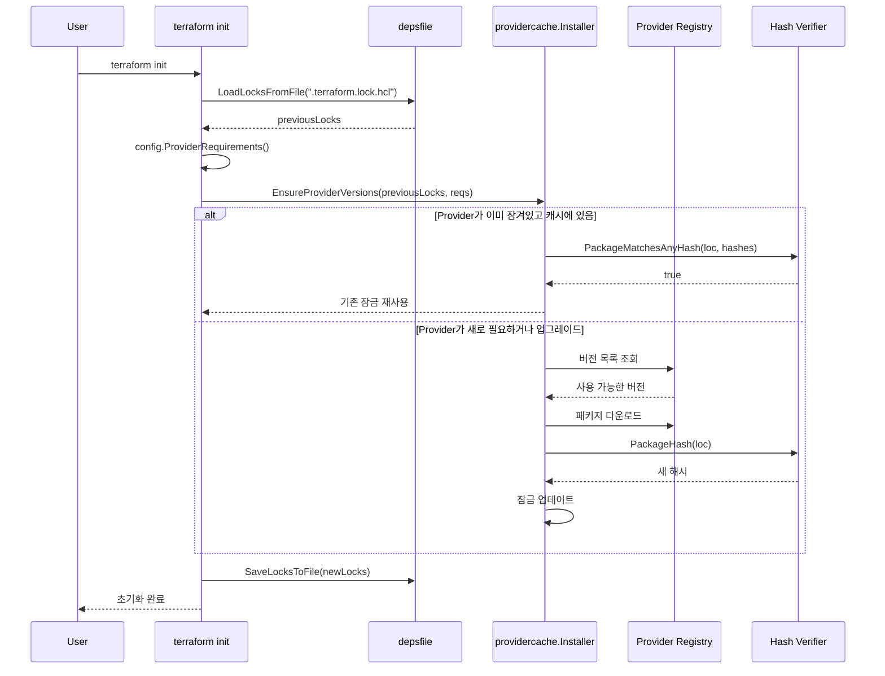

# 19. 의존성 잠금 파일 (Dependency Lock File / depsfile)

## 목차
1. [개요](#1-개요)
2. [왜 의존성 잠금 파일이 필요한가](#2-왜-의존성-잠금-파일이-필요한가)
3. [핵심 데이터 구조](#3-핵심-데이터-구조)
4. [아키텍처 개요](#4-아키텍처-개요)
5. [잠금 파일 포맷과 파싱](#5-잠금-파일-포맷과-파싱)
6. [해시 검증 시스템](#6-해시-검증-시스템)
7. [Provider 설치와 잠금의 통합](#7-provider-설치와-잠금의-통합)
8. [잠금 파일 생명주기](#8-잠금-파일-생명주기)
9. [개발자 오버라이드 메커니즘](#9-개발자-오버라이드-메커니즘)
10. [실제 사용 패턴과 운영](#10-실제-사용-패턴과-운영)

---

## 1. 개요

Terraform의 의존성 잠금 파일(`.terraform.lock.hcl`)은 프로젝트에서 사용하는 Provider의 정확한 버전과 무결성 해시를 기록하는 파일이다. 이 파일은 `terraform init` 실행 시 자동으로 생성/업데이트되며, 버전 관리 시스템(VCS)에 체크인하여 팀 전체가 동일한 Provider 버전을 사용하도록 보장한다.

**소스코드 위치:** `internal/depsfile/` 패키지

```
internal/depsfile/
├── doc.go              # 패키지 문서
├── locks.go            # Locks, ProviderLock 핵심 구조체
├── locks_file.go       # HCL 파일 직렬화/역직렬화
├── paths.go            # 파일 경로 상수
├── testing.go          # 테스트 유틸리티
├── locks_test.go       # 단위 테스트
├── locks_file_test.go  # 파일 I/O 테스트
└── testdata/           # 테스트 데이터
```

패키지 문서(`internal/depsfile/doc.go`)에서 설계 의도를 명확히 설명하고 있다:

> "A dependency lock file tracks the most recently selected upstream versions of each dependency, and is intended for checkin to version control."

---

## 2. 왜 의존성 잠금 파일이 필요한가

### 2.1 해결하는 문제

| 문제 | 잠금 파일의 해결 방식 |
|------|---------------------|
| 재현 불가능한 빌드 | 버전 + 해시를 고정하여 동일한 결과 보장 |
| 공급망 공격 | 해시 검증으로 패키지 변조 감지 |
| 팀 간 버전 불일치 | VCS에 체크인하여 모든 팀원이 동일 버전 사용 |
| 암묵적 업그레이드 | 명시적 `terraform init -upgrade` 없이는 버전 변경 불가 |
| 플랫폼 간 호환성 | 여러 플랫폼의 해시를 한 파일에 기록 |

### 2.2 설계 결정의 근거

**왜 별도 파일인가?**

`doc.go`에서 두 가지 이유를 제시한다:

1. **범위의 차이**: `.tf` 파일은 개별 모듈을 구성하지만, 잠금 파일은 전체 구성 트리에 적용된다.
2. **자동 관리**: 잠금 파일은 주로 Terraform이 자동으로 유지하므로, 사람이 직접 편집하는 `.tf` 파일과 분리하면 어떤 파일이 Terraform에 의해 변경되는지 쉽게 구분할 수 있다.

**왜 HCL 형식인가?**

Terraform 생태계의 일관성을 위해 HCL 형식을 사용한다. JSON이나 YAML이 아닌 HCL을 선택한 것은, 드물지만 사용자가 직접 편집해야 하는 경우에 다른 Terraform 파일과 동일한 형식을 사용하도록 하기 위해서다.

---

## 3. 핵심 데이터 구조

### 3.1 Locks 구조체

`internal/depsfile/locks.go`에 정의된 최상위 구조체:

```go
// Locks는 의존성 잠금 파일에 보관되는 정보를 나타내는 최상위 타입이다.
type Locks struct {
    providers          map[addrs.Provider]*ProviderLock
    overriddenProviders map[addrs.Provider]struct{}
    sources            map[string][]byte
}
```

| 필드 | 타입 | 설명 |
|------|------|------|
| `providers` | `map[addrs.Provider]*ProviderLock` | Provider 주소 -> 잠금 정보 매핑 |
| `overriddenProviders` | `map[addrs.Provider]struct{}` | 오버라이드된 Provider 집합 (메모리 전용) |
| `sources` | `map[string][]byte` | HCL 파서의 소스 버퍼 (에러 메시지용) |

### 3.2 ProviderLock 구조체

개별 Provider의 잠금 정보를 담는 구조체:

```go
// ProviderLock은 특정 Provider에 대한 잠금 정보를 나타낸다.
type ProviderLock struct {
    addr               addrs.Provider
    version            providerreqs.Version
    versionConstraints providerreqs.VersionConstraints
    hashes             []providerreqs.Hash
}
```

| 필드 | 타입 | 설명 |
|------|------|------|
| `addr` | `addrs.Provider` | Provider의 정규화된 주소 (예: `registry.terraform.io/hashicorp/aws`) |
| `version` | `providerreqs.Version` | 선택된 정확한 버전 (권위적) |
| `versionConstraints` | `providerreqs.VersionConstraints` | 선택 시 사용된 제약 조건 (UI 힌트용) |
| `hashes` | `[]providerreqs.Hash` | 패키지 무결성 해시 목록 |

**핵심 설계 결정**: `version`이 권위적(authoritative)이고, `versionConstraints`는 단순히 UI 힌트에 불과하다. 이는 `Locks.Equal()` 메서드에서 명시적으로 표현된다:

```go
// Equal은 버전 제약 조건의 동등성은 명시적으로 고려하지 않는다.
// 이는 UI에서 실행 간 변경 사항을 설명하기 위한 힌트로만 저장되며,
// 의존성 설치 결정에 사용되지 않기 때문이다.
func (l *Locks) Equal(other *Locks) bool {
    // ...version과 hashes만 비교, constraints는 무시
}
```

### 3.3 Hash 타입 시스템

`internal/getproviders/providerreqs/hash.go`에 정의:

```go
// Hash는 패키지 또는 패키지 내용의 체크섬을 나타내는 특별한 형식의 문자열이다.
type Hash string

// HashScheme은 Hash 값에 허용되는 스킴의 열거형이다.
type HashScheme string

const (
    HashScheme1   HashScheme = "h1:"  // 디렉토리 내용 해시 (현재 기본)
    HashSchemeZip HashScheme = "zh:"  // .zip 아카이브 해시 (레거시)
)
```

해시 문자열의 구조:

```
h1:abcdef1234567890...   ← HashScheme1 (디렉토리 해시, SHA256)
zh:abcdef1234567890...   ← HashSchemeZip (.zip 파일 SHA256, 레거시)
```

---

## 4. 아키텍처 개요

### 4.1 전체 시스템 구조

```
┌─────────────────────────────────────────────────────────────────────┐
│                        terraform init                               │
│                                                                     │
│  ┌──────────────┐    ┌──────────────────┐    ┌──────────────────┐   │
│  │ Config       │    │ Provider         │    │ Lock File        │   │
│  │ Requirements │───▶│ Installer        │◀──▶│ (.terraform      │   │
│  │ (*.tf)       │    │ (providercache)  │    │  .lock.hcl)      │   │
│  └──────────────┘    └──────┬───────────┘    └──────────────────┘   │
│                             │                                       │
│                             ▼                                       │
│                    ┌──────────────────┐                              │
│                    │ Hash Verification │                             │
│                    │ (getproviders)   │                              │
│                    └──────────────────┘                              │
│                             │                                       │
│                             ▼                                       │
│                    ┌──────────────────┐                              │
│                    │ Provider Cache   │                              │
│                    │ (.terraform/     │                              │
│                    │  providers/)     │                              │
│                    └──────────────────┘                              │
└─────────────────────────────────────────────────────────────────────┘
```

### 4.2 Mermaid 시퀀스 다이어그램



---

## 5. 잠금 파일 포맷과 파싱

### 5.1 파일 형식

`.terraform.lock.hcl` 파일의 실제 형식:

```hcl
# This file is maintained automatically by "terraform init".
# Manual edits may be lost in future updates.

provider "registry.terraform.io/hashicorp/aws" {
  version     = "4.67.0"
  constraints = ">= 4.0.0, < 5.0.0"
  hashes = [
    "h1:dCRc4GqsyfqHEMjgtlM1EympBcgTmcLkLTnLS...",
    "zh:0128e8ab5d04...",
  ]
}

provider "registry.terraform.io/hashicorp/random" {
  version     = "3.5.1"
  constraints = "~> 3.0"
  hashes = [
    "h1:VSnd9ZIPyfKHOObuQCaKfNjB7pS6nCV...",
  ]
}
```

### 5.2 파싱 흐름 (LoadLocksFromFile)

`internal/depsfile/locks_file.go`의 `LoadLocksFromFile` 함수가 진입점:

```
LoadLocksFromFile(filename)
    │
    ▼
loadLocks(parseFunc)
    │
    ├── hclparse.Parser.ParseHCLFile(filename)
    │       HCL 구문 파싱 → *hcl.File
    │
    ▼
decodeLocksFromHCL(locks, body)
    │
    ├── body.Content(schema)
    │       "provider" 블록과 "module" 블록 스키마 정의
    │
    ├── for each "provider" block:
    │       decodeProviderLockFromHCL(block)
    │           ├── addrs.ParseProviderSourceString(rawAddr)
    │           ├── ProviderIsLockable(addr) 확인
    │           ├── 정규화 형식 검증
    │           ├── decodeProviderVersionArgument()
    │           ├── decodeProviderVersionConstraintsArgument()
    │           └── decodeProviderHashesArgument()
    │
    └── "module" 블록 → 경고 (미래 기능)
```

### 5.3 저장 흐름 (SaveLocksToFile)

`SaveLocksToFile` → `SaveLocksToBytes`의 2단계 구조:

```go
func SaveLocksToFile(locks *Locks, filename string) tfdiags.Diagnostics {
    src, diags := SaveLocksToBytes(locks)
    // ...
    err := replacefile.AtomicWriteFile(filename, src, 0644)
    // ...
}
```

**핵심 설계 포인트 - 원자적 파일 쓰기:**

`replacefile.AtomicWriteFile`을 사용하여 파일을 원자적으로 교체한다. 이는 텍스트 에디터 통합 등 외부 도구가 파일 변경을 감지할 수 있도록 하기 위함이다.

**정규화된 출력:**

`SaveLocksToBytes`에서 의도적으로 기존 파일의 형식을 보존하지 않는다:

```go
// 다른 hclwrite 사용에서는 일반적으로 작성자의 기존 파일에 대해
// 수술적 업데이트를 수행하여 블록 순서, 주석 등을 보존한다.
// 여기서는 의도적으로 그렇게 하지 않는다.
// 이 파일이 주로 Terraform에 속한다는 사실을 강조하고,
// VCS diff가 실제 기능에 영향을 미치는 변경만 반영하도록
// 매우 정규화된 형태로 유지한다.
```

Provider들은 정렬되어 출력된다 (`providers[i].LessThan(providers[j])`).

### 5.4 해시 세트 인코딩

`encodeHashSetTokens` 함수는 해시 목록을 HCL 토큰 수준에서 직접 생성한다:

```go
func encodeHashSetTokens(hashes []providerreqs.Hash) hclwrite.Tokens {
    // 저수준 토큰 조작으로 소스코드를 생성한다.
    // diff 가독성을 위해 정확한 레이아웃을 유지한다.
    ret := hclwrite.Tokens{
        {Type: hclsyntax.TokenOBrack, Bytes: []byte{'['}},
        {Type: hclsyntax.TokenNewline, Bytes: []byte{'\n'}},
    }
    for _, hash := range hashes {
        hashVal := cty.StringVal(hash.String())
        ret = append(ret, hclwrite.TokensForValue(hashVal)...)
        ret = append(ret, /* comma + newline tokens */...)
    }
    ret = append(ret, &hclwrite.Token{
        Type: hclsyntax.TokenCBrack, Bytes: []byte{']'},
    })
    return ret
}
```

---

## 6. 해시 검증 시스템

### 6.1 해시 스킴 비교

| 속성 | h1: (HashScheme1) | zh: (HashSchemeZip) |
|------|-------------------|---------------------|
| 대상 | 패키지 내용 (디렉토리) | .zip 아카이브 자체 |
| 알고리즘 | SHA256 (Go Modules dirhash.Hash1) | SHA256 |
| 로컬 디렉토리 검증 | 가능 | 불가능 |
| .zip 파일 검증 | 가능 | 가능 |
| 표준 | Go Modules와 동일 | Terraform 레거시 |
| 미래 지향성 | 현재 기본 | 하위 호환성용 |

### 6.2 HashV1 (h1:) 알고리즘

`internal/getproviders/hash.go`의 `PackageHashV1` 함수:

```go
func PackageHashV1(loc PackageLocation) (providerreqs.Hash, error) {
    // HashV1은 Go Modules의 hash version 1과 동일하다.
    // 내부적으로 dirhash.Hash1은 디렉토리의 모든 파일에 대해
    // 줄바꿈으로 구분된 path+filehash 쌍의 시퀀스를 생성하고,
    // 그 문자열의 해시를 반환한다. 양쪽 모두 SHA256을 사용한다.

    switch loc := loc.(type) {
    case PackageLocalDir:
        packageDir, err := filepath.EvalSymlinks(string(loc))
        s, err := dirhash.HashDir(packageDir, "", dirhash.Hash1)
        return Hash(s), err

    case PackageLocalArchive:
        archivePath, err := filepath.EvalSymlinks(string(loc))
        s, err := dirhash.HashZip(archivePath, dirhash.Hash1)
        return Hash(s), err
    }
}
```

해시 계산 과정:

```
PackageHashV1 알고리즘 (dirhash.Hash1 기반)
━━━━━━━━━━━━━━━━━━━━━━━━━━━━━━━━━━━━━━━━

디렉토리 입력:
  provider-dir/
  ├── terraform-provider-aws_v4.67.0
  └── LICENSE

1단계: 각 파일의 SHA256 해시 계산
  sha256("terraform-provider-aws_v4.67.0 내용") → abc123...
  sha256("LICENSE 내용") → def456...

2단계: 정렬된 "경로\t해시" 쌍 문자열 생성
  "terraform-provider-aws_v4.67.0\tabc123...\n"
  "LICENSE\tdef456...\n"

3단계: 전체 문자열의 SHA256 해시 → 최종 결과
  h1:xyz789...
```

### 6.3 해시 매칭 전략

`PackageMatchesAnyHash` 함수는 효율적인 캐싱을 통해 해시를 검증한다:

```go
func PackageMatchesAnyHash(loc PackageLocation, allowed []providerreqs.Hash) (bool, error) {
    // 같은 스킴의 해시가 여러 개 있을 수 있으므로
    // 스킴별로 한 번만 해시를 계산하여 캐싱한다
    var v1Hash, zipHash providerreqs.Hash

    for _, want := range allowed {
        switch want.Scheme() {
        case providerreqs.HashScheme1:
            if v1Hash == providerreqs.NilHash {
                got, err := PackageHashV1(loc)  // 첫 번째만 계산
                v1Hash = got
            }
            if v1Hash == want { return true, nil }

        case providerreqs.HashSchemeZip:
            // 유사한 캐싱 로직
        }
    }
    return false, nil
}
```

### 6.4 PreferredHashes 필터링

```go
func PreferredHashes(given []Hash) []Hash {
    var ret []Hash
    for _, hash := range given {
        switch hash.Scheme() {
        case HashScheme1, HashSchemeZip:
            ret = append(ret, hash)
        }
    }
    return ret
}
```

현재는 h1:과 zh: 모두 "선호"로 취급하지만, 미래에 h2: 같은 새 스킴이 도입되면 h1:보다 h2:를 우선시하도록 변경할 수 있다.

---

## 7. Provider 설치와 잠금의 통합

### 7.1 terraform init 흐름

`internal/command/init.go`에서 잠금 파일과 Provider 설치의 통합:

```
terraform init
    │
    ├── getProvidersFromConfig()
    │       │
    │       ├── c.lockedDependencies()
    │       │       previousLocks = LoadLocksFromFile()
    │       │
    │       ├── inst.EnsureProviderVersions(previousLocks, reqs, mode)
    │       │       Provider 설치/업그레이드, 해시 검증
    │       │
    │       └── return configLocks
    │
    ├── getProvidersFromState()
    │       │
    │       └── return stateLocks
    │
    └── saveDependencyLockFile(previousLocks, configLocks, stateLocks)
            │
            ├── mergeLockedDependencies(configLocks, stateLocks)
            │
            ├── newLocks.Equal(previousLocks) 비교
            │
            ├── flagLockfile == "readonly" → 에러 또는 경고
            │
            └── replaceLockedDependencies(newLocks)
                    SaveLocksToFile()
```

### 7.2 -lockfile 플래그

`saveDependencyLockFile` 함수에서 세 가지 모드를 처리한다:

| 모드 | 동작 |
|------|------|
| (기본) | 잠금 파일 자동 업데이트 |
| `-lockfile=readonly` | 잠금 파일 변경 거부, Provider 주소 변경 시 에러 |
| `-upgrade` + `-lockfile=readonly` | 충돌, 에러 반환 |

```go
if flagLockfile == "readonly" {
    if !newLocks.EqualProviderAddress(previousLocks) {
        // Provider 의존성이 변경됨 → 에러
        diags = diags.Append(tfdiags.Sourceless(
            tfdiags.Error,
            "Provider dependency changes detected",
            "Changes to the required provider dependencies were detected, " +
            "but the lock file is read-only...",
        ))
    } else {
        // 해시만 변경됨 → 경고 (새 해시 스킴 정보 등)
        diags = diags.Append(tfdiags.Sourceless(
            tfdiags.Warning,
            "Provider lock file not updated",
            "Changes to the provider selections were detected, " +
            "but not saved...",
        ))
    }
}
```

### 7.3 잠금 가능 여부 확인

모든 Provider가 잠금 대상은 아니다. `ProviderIsLockable` 함수로 확인한다:

```go
// ProviderIsLockable은 주어진 Provider가 버전 잠금 대상인지 반환한다.
// 현재 built-in Provider와 legacy Provider를 제외한 모든 Provider가 잠금 대상이다.
func ProviderIsLockable(addr addrs.Provider) bool {
    return !(addr.IsBuiltIn() || addr.IsLegacy())
}
```

| Provider 유형 | 예시 | 잠금 가능 |
|---------------|------|-----------|
| 일반 Provider | `registry.terraform.io/hashicorp/aws` | O |
| Built-in Provider | `terraform.io/builtin/terraform` | X |
| Legacy Provider | `registry.terraform.io/-/aws` | X |

---

## 8. 잠금 파일 생명주기

### 8.1 생성 → 업데이트 → 검증 흐름

```
┌─────────────┐    ┌──────────────────┐    ┌──────────────────┐
│ 1. 최초 생성 │    │ 2. 업데이트       │    │ 3. 검증          │
│             │    │                  │    │                  │
│ terraform   │    │ terraform init   │    │ terraform plan   │
│ init        │    │ -upgrade         │    │ terraform apply  │
│             │    │                  │    │                  │
│ ┌─────────┐ │    │ ┌──────────────┐ │    │ ┌──────────────┐ │
│ │ reqs →  │ │    │ │ 새 버전 선택 │ │    │ │ 잠금 파일    │ │
│ │ 버전선택│ │    │ │ + 해시 갱신  │ │    │ │ 로드 + 검증  │ │
│ │ + 해시  │ │    │ └──────────────┘ │    │ └──────────────┘ │
│ │ 계산    │ │    │         │        │    │         │        │
│ └────┬────┘ │    │         ▼        │    │         ▼        │
│      │      │    │ ┌──────────────┐ │    │ ┌──────────────┐ │
│      ▼      │    │ │ lock.hcl    │ │    │ │ 캐시 해시    │ │
│ lock.hcl    │    │ │ 파일 갱신   │ │    │ │ 비교         │ │
│ 파일 생성   │    │ └──────────────┘ │    │ └──────────────┘ │
└─────────────┘    └──────────────────┘    └──────────────────┘
```

### 8.2 NewProviderLock의 정규화

`NewProviderLock` 함수에서 해시 목록을 정규화한다:

```go
func NewProviderLock(addr addrs.Provider, version providerreqs.Version,
    constraints providerreqs.VersionConstraints, hashes []providerreqs.Hash) *ProviderLock {
    // 1. 해시를 사전순으로 정렬
    sort.Slice(hashes, func(i, j int) bool {
        return string(hashes[i]) < string(hashes[j])
    })

    // 2. 인플레이스 중복 제거 (정렬된 상태이므로 연속 중복만 확인)
    dedupeHashes := hashes[:0]
    prevHash := providerreqs.NilHash
    for _, hash := range hashes {
        if hash != prevHash {
            dedupeHashes = append(dedupeHashes, hash)
            prevHash = hash
        }
    }

    return &ProviderLock{
        addr:               addr,
        version:            version,
        versionConstraints: constraints,
        hashes:             dedupeHashes,
    }
}
```

**왜 이렇게 하는가?**

- **정렬**: 해시는 논리적으로 집합(set)이므로 순서가 무의미하다. 정렬하면 `Locks.Equal()`에서 단순 아이템별 비교가 가능하다.
- **인플레이스 중복 제거**: 불필요한 메모리 할당을 피하면서도 중복을 제거한다. 정렬된 상태이므로 중복은 항상 연속적이다.

### 8.3 ContainsAll 검증

```go
// ContainsAll은 이 ProviderLock의 해시가 target의 모든 해시를 포함하는지 반환한다.
func (l *ProviderLock) ContainsAll(target *ProviderLock) bool {
    targetIndex := 0
    for ix := 0; ix < len(l.hashes); ix++ {
        if l.hashes[ix] == target.hashes[targetIndex] {
            targetIndex++
            if targetIndex >= len(target.hashes) {
                return true
            }
        }
    }
    return false
}
```

이 함수는 정렬된 두 해시 슬라이스를 O(n+m) 시간에 포함 관계를 확인하는 투 포인터 알고리즘을 사용한다.

### 8.4 DeepCopy

```go
func (l *Locks) DeepCopy() *Locks {
    ret := NewLocks()
    for addr, lock := range l.providers {
        hashes := slices.Clone(lock.hashes)
        ret.SetProvider(addr, lock.version, lock.versionConstraints, hashes)
    }
    return ret
}
```

잠금 객체를 안전하게 복제한다. 해시 슬라이스도 복제하여 원본과 복사본이 메모리를 공유하지 않는다.

---

## 9. 개발자 오버라이드 메커니즘

### 9.1 오버라이드란?

개발 중에 Provider의 로컬 빌드를 사용하고 싶을 때, 잠금 파일의 제약을 임시로 무시하는 기능이다.

**파일 경로** (`internal/depsfile/paths.go`):

```go
const DevOverrideFilePath = ".terraform/dev-overrides.hcl"
```

### 9.2 오버라이드 상태 관리

```go
// SetProviderOverridden은 이 Terraform 프로세스가 주어진 Provider의
// 잠금 정보를 무시하고 다른 특별한 방법으로 접근할 것임을 기록한다.
func (l *Locks) SetProviderOverridden(addr addrs.Provider) {
    if l.overriddenProviders == nil {
        l.overriddenProviders = make(map[addrs.Provider]struct{})
    }
    l.overriddenProviders[addr] = struct{}{}
}

// ProviderIsOverridden은 주어진 Provider가 오버라이드되었는지 확인한다.
func (l *Locks) ProviderIsOverridden(addr addrs.Provider) bool {
    _, ret := l.overriddenProviders[addr]
    return ret
}
```

**핵심 특성:**

- `overriddenProviders`는 메모리 전용 어노테이션이며, 파일에 저장되지 않는다
- Terraform 실행 간에 지속되지 않는다
- CLI 계층에서 설정되며, 환경 변수나 CLI 설정에 의해 결정된다

### 9.3 오버라이드 전파

```go
// SetSameOverriddenProviders는 다른 Locks 객체에서
// 동일한 오버라이드 정보를 복사한다.
func (l *Locks) SetSameOverriddenProviders(other *Locks) {
    if other == nil {
        return
    }
    for addr := range other.overriddenProviders {
        l.SetProviderOverridden(addr)
    }
}
```

이를 통해 잠금 객체 간에 오버라이드 정보를 전파할 수 있다.

---

## 10. 실제 사용 패턴과 운영

### 10.1 일반적인 워크플로

```bash
# 1. 최초 초기화 - 잠금 파일 생성
terraform init

# 2. 잠금 파일을 VCS에 커밋
git add .terraform.lock.hcl
git commit -m "Add dependency lock file"

# 3. CI/CD에서 readonly 모드 사용
terraform init -lockfile=readonly

# 4. Provider 버전 업그레이드
terraform init -upgrade

# 5. 특정 플랫폼의 해시 추가
terraform providers lock \
  -platform=linux_amd64 \
  -platform=darwin_arm64
```

### 10.2 CI/CD 보안 패턴

```bash
# CI/CD 파이프라인에서 권장되는 설정
terraform init -lockfile=readonly -input=false

# 잠금 파일이 변경되면 실패하므로
# 개발자가 명시적으로 업데이트해야 함
```

### 10.3 다중 플랫폼 해시 관리

```bash
# 여러 플랫폼의 해시를 한 번에 기록
terraform providers lock \
  -platform=linux_amd64 \
  -platform=linux_arm64 \
  -platform=darwin_amd64 \
  -platform=darwin_arm64 \
  -platform=windows_amd64
```

이렇게 하면 잠금 파일에 모든 플랫폼의 해시가 포함되어, 어떤 플랫폼에서 `terraform init`을 실행해도 해시 검증이 성공한다.

### 10.4 트러블슈팅 가이드

| 증상 | 원인 | 해결 방법 |
|------|------|-----------|
| `Provider dependency changes detected` | readonly 모드에서 Provider 변경 | `-lockfile=readonly` 없이 `terraform init` 실행 |
| 해시 불일치 | 다른 플랫폼에서 실행 | `terraform providers lock -platform=...` |
| `failed to update dependency lock file` | 파일 권한 문제 | 파일 쓰기 권한 확인 |
| 잠금 파일에 없는 Provider | 새 Provider 추가 | `terraform init` 실행 |

### 10.5 잠금 파일과 go.sum의 비교

| 특성 | .terraform.lock.hcl | go.sum |
|------|---------------------|--------|
| 대상 | Terraform Provider | Go 모듈 |
| 형식 | HCL | 평문 해시 목록 |
| 해시 알고리즘 | h1:/zh: (SHA256) | h1: (SHA256) |
| 범위 | 직접 의존성만 | 전이적 의존성 포함 |
| 원자적 쓰기 | 예 (replacefile) | 아니오 |
| 플랫폼별 해시 | 여러 플랫폼 포함 가능 | N/A |

---

## 요약

Terraform의 의존성 잠금 파일 시스템은 다음과 같은 핵심 설계 원칙을 따른다:

1. **보안 우선**: 해시 검증을 통해 공급망 공격으로부터 보호한다
2. **재현 가능성**: 정확한 버전과 해시를 기록하여 동일한 결과를 보장한다
3. **팀 협업**: VCS에 체크인하여 모든 팀원이 동일한 의존성을 사용한다
4. **정규화**: 파일 출력을 정규화하여 VCS diff의 노이즈를 최소화한다
5. **유연성**: 개발자 오버라이드와 readonly 모드로 다양한 워크플로를 지원한다
6. **미래 대비**: 새로운 해시 스킴을 쉽게 추가할 수 있는 구조를 갖추고 있다

**핵심 소스코드 파일 참조:**

| 파일 | 역할 |
|------|------|
| `internal/depsfile/locks.go` | Locks, ProviderLock 구조체 정의 |
| `internal/depsfile/locks_file.go` | HCL 파일 읽기/쓰기 |
| `internal/depsfile/paths.go` | 파일 경로 상수 |
| `internal/getproviders/providerreqs/hash.go` | Hash 타입과 HashScheme 정의 |
| `internal/getproviders/hash.go` | 해시 계산 및 검증 함수 |
| `internal/command/init.go` | terraform init의 잠금 파일 통합 |
