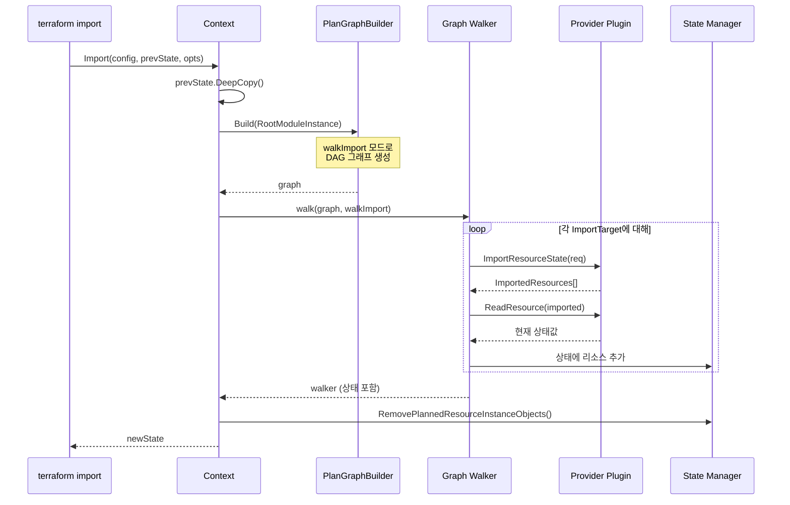

# 20. Import 기능과 설정 생성 (Import / genconfig)

## 목차
1. [개요](#1-개요)
2. [왜 Import 기능이 필요한가](#2-왜-import-기능이-필요한가)
3. [핵심 데이터 구조](#3-핵심-데이터-구조)
4. [아키텍처 개요](#4-아키텍처-개요)
5. [CLI Import 명령 (레거시)](#5-cli-import-명령-레거시)
6. [선언적 Import 블록](#6-선언적-import-블록)
7. [설정 자동 생성 (genconfig)](#7-설정-자동-생성-genconfig)
8. [Import 실행 흐름 (Core)](#8-import-실행-흐름-core)
9. [상태값에서 설정 추출](#9-상태값에서-설정-추출)
10. [실제 사용 패턴과 운영](#10-실제-사용-패턴과-운영)

---

## 1. 개요

Terraform의 Import 기능은 이미 존재하는 인프라 리소스를 Terraform의 상태(state)로 가져와 관리 대상에 포함시키는 메커니즘이다. 기존에 수동으로 생성했거나 다른 도구로 관리하던 리소스를 Terraform으로 전환할 때 필수적인 기능이다.

Import에는 두 가지 방식이 있다:

| 방식 | 명령어/구문 | 도입 시기 | 설정 생성 |
|------|------------|----------|-----------|
| CLI Import (레거시) | `terraform import ADDR ID` | 초기 버전 | 수동 작성 필요 |
| 선언적 Import 블록 | `import { to = ... id = ... }` | v1.5+ | `-generate-config-out` 지원 |

**소스코드 위치:**

```
internal/
├── command/import.go          # CLI import 명령 구현
├── configs/import.go          # import 블록 HCL 디코딩
├── genconfig/                 # 설정 자동 생성 엔진
│   ├── doc.go
│   ├── generate_config.go     # 핵심 설정 생성 로직
│   └── generate_config_write.go  # 파일 출력 로직
└── terraform/
    ├── context_import.go      # Core import 실행 엔진
    └── node_resource_plan_instance.go  # Plan 단계 import 처리
```

---

## 2. 왜 Import 기능이 필요한가

### 2.1 해결하는 문제

| 문제 | Import의 해결 방식 |
|------|-------------------|
| 레거시 인프라 마이그레이션 | 기존 리소스를 파괴하지 않고 Terraform 관리 하에 편입 |
| 팀 간 인프라 이관 | 한 팀에서 수동 관리하던 리소스를 IaC로 전환 |
| 재해 복구 | 상태 파일 유실 시 기존 인프라를 다시 연결 |
| 점진적 도입 | Terraform을 한꺼번에 도입하지 않고 점진적으로 적용 |
| 설정 역공학 | 기존 리소스의 설정을 자동으로 HCL 코드로 생성 |

### 2.2 설계 철학

**왜 두 가지 방식이 있는가?**

초기 CLI import(`terraform import`)는 리소스를 상태에 추가하는 것만 지원했다. 사용자가 반드시 먼저 `.tf` 파일에 리소스 설정을 작성해야 했고, import 후에 `terraform plan`으로 차이를 확인하면서 설정을 조정해야 했다.

이 방식의 한계를 해결하기 위해 선언적 import 블록이 도입되었다:

1. **코드로서의 Import**: import 자체를 HCL 설정으로 선언하여 VCS에 기록
2. **자동 설정 생성**: `-generate-config-out` 옵션으로 HCL 설정을 자동 생성
3. **Plan/Apply 통합**: 일반적인 plan/apply 워크플로에 통합
4. **for_each 지원**: 여러 리소스를 한 번에 import

---

## 3. 핵심 데이터 구조

### 3.1 Import 블록 구조체

`internal/configs/import.go`에 정의:

```go
type Import struct {
    ID       hcl.Expression    // 리소스의 Provider별 식별자
    Identity hcl.Expression    // 리소스의 Provider별 identity (ID의 대안)
    To       hcl.Expression    // 대상 Terraform 리소스 주소
    ToResource addrs.ConfigResource  // 정적으로 파싱된 리소스 주소

    ForEach  hcl.Expression    // for_each 표현식 (선택적)

    ProviderConfigRef *ProviderConfigRef  // Provider 설정 참조
    Provider          addrs.Provider      // Provider 주소

    DeclRange         hcl.Range  // 선언 위치
    ProviderDeclRange hcl.Range  // Provider 선언 위치
}
```

**핵심 설계 결정 - ID vs Identity:**

```go
// import 블록에서 id와 identity 중 정확히 하나만 지정해야 한다
if imp.ID == nil && imp.Identity == nil {
    diags = append(diags, &hcl.Diagnostic{
        Summary: "Invalid import block",
        Detail:  "At least one of 'id' or 'identity' must be specified.",
    })
}
if imp.ID != nil && imp.Identity != nil {
    diags = append(diags, &hcl.Diagnostic{
        Summary: "Invalid import block",
        Detail:  "Only one of 'id' or 'identity' can be specified.",
    })
}
```

### 3.2 ImportTarget 구조체

`internal/terraform/context_import.go`에 정의:

```go
// ImportOpts는 Import의 설정으로 사용된다.
type ImportOpts struct {
    Targets      []*ImportTarget  // Import 대상 목록
    SetVariables InputValues      // 외부에서 설정된 변수
}

// ImportTarget은 단일 리소스의 import 대상이다.
type ImportTarget struct {
    Config     *configs.Import          // 원본 import 블록 (config 기반)
    LegacyAddr addrs.AbsResourceInstance // CLI import의 리소스 주소
    LegacyID   string                    // CLI import의 ID
}
```

### 3.3 genconfig 핵심 구조체

`internal/genconfig/generate_config.go`에 정의:

```go
// ImportGroup은 하나 이상의 리소스와 import 설정 블록을 나타낸다.
type ImportGroup struct {
    Imports []ResourceImport
}

// ResourceImport는 import와 관련 리소스를 쌍으로 묶는다.
type ResourceImport struct {
    ImportBody []byte     // import 블록 HCL 바이트
    Resource   Resource   // 리소스 설정
}

// Resource는 생성된 리소스 설정을 나타낸다.
type Resource struct {
    Addr addrs.AbsResourceInstance  // 리소스 주소
    Body []byte                     // HCL 속성과 블록
}
```

### 3.4 Change 구조체 (파일 쓰기)

`internal/genconfig/generate_config_write.go`에 정의:

```go
type Change struct {
    Addr            string  // 리소스 주소 문자열
    ImportID        string  // Import ID
    GeneratedConfig string  // 생성된 HCL 설정
}
```

---

## 4. 아키텍처 개요

### 4.1 Import 시스템 전체 구조

```
┌───────────────────────────────────────────────────────────────────┐
│                     Import 시스템 아키텍처                          │
│                                                                   │
│  ┌─────────────────┐        ┌──────────────────┐                  │
│  │ CLI Import      │        │ Import Block     │                  │
│  │ terraform import│        │ import { ... }   │                  │
│  │ ADDR ID         │        │ (HCL 선언)       │                  │
│  └────────┬────────┘        └────────┬─────────┘                  │
│           │                          │                            │
│           ▼                          ▼                            │
│  ┌──────────────────────────────────────────────┐                 │
│  │           ImportTarget / ImportOpts           │                 │
│  └──────────────────────┬───────────────────────┘                 │
│                         │                                         │
│                         ▼                                         │
│  ┌──────────────────────────────────────────────┐                 │
│  │           Context.Import() / Plan()           │                 │
│  │        (terraform/context_import.go)          │                 │
│  └──────────────────────┬───────────────────────┘                 │
│                         │                                         │
│           ┌─────────────┼─────────────┐                           │
│           ▼             ▼             ▼                           │
│  ┌────────────┐ ┌────────────┐ ┌────────────────┐                │
│  │ Provider   │ │ State      │ │ genconfig      │                │
│  │ Import API │ │ Update     │ │ (설정 생성)     │                │
│  └────────────┘ └────────────┘ └────────────────┘                │
│                                        │                          │
│                                        ▼                          │
│                               ┌────────────────┐                 │
│                               │ generated.tf   │                 │
│                               │ (HCL 출력)     │                 │
│                               └────────────────┘                 │
└───────────────────────────────────────────────────────────────────┘
```

### 4.2 CLI Import vs 선언적 Import 비교

```
CLI Import 흐름:                    선언적 Import 흐름:
━━━━━━━━━━━━━━━                    ━━━━━━━━━━━━━━━━━━

1. 사용자가 .tf에 설정 작성        1. import 블록 작성 (main.tf)
   resource "aws_instance" "web"      import {
     { ... }                            to = aws_instance.web
                                        id = "i-1234567890"
2. terraform import \                 }
     aws_instance.web \
     i-1234567890                  2. terraform plan
                                      -generate-config-out=generated.tf
3. State에 리소스 추가
                                   3. 자동으로 설정 생성 + State 업데이트
4. terraform plan으로
   설정 조정                       4. terraform apply
```

---

## 5. CLI Import 명령 (레거시)

### 5.1 ImportCommand 구현

`internal/command/import.go`의 `ImportCommand.Run()` 메서드:

```go
type ImportCommand struct {
    Meta  // 공통 메타데이터 (상태 경로, 백엔드 등)
}
```

### 5.2 실행 흐름

```
ImportCommand.Run(args)
    │
    ├── 1. arguments.ParseImport(args)
    │       CLI 인수 파싱 (ADDR, ID, 옵션)
    │
    ├── 2. hclsyntax.ParseTraversalAbs(traversalSrc)
    │       리소스 주소 파싱
    │       addrs.ParseAbsResourceInstance(traversal)
    │
    ├── 3. 관리형 리소스(Managed Resource) 확인
    │       addr.Resource.Resource.Mode != addrs.ManagedResourceMode → 에러
    │
    ├── 4. c.loadConfig(configPath)
    │       전체 설정 로드 → 대상 리소스가 설정에 있는지 확인
    │
    ├── 5. config.DescendantForInstance(addr.Module)
    │       모듈 경로 확인
    │
    ├── 6. targetMod.ManagedResources에서 리소스 찾기
    │       Type과 Name이 일치하는 리소스 검색
    │       없으면 에러 + 설정 작성 안내 메시지
    │
    ├── 7. c.backend() → local.LocalRun(opReq)
    │       백엔드 초기화, 상태 잠금
    │
    ├── 8. lr.Core.Import(lr.Config, lr.InputState, &ImportOpts{...})
    │       핵심 Import 실행
    │
    └── 9. state.WriteState(newState) → state.PersistState()
            상태 저장
```

### 5.3 리소스 존재 확인 로직

CLI import는 반드시 대상 리소스가 설정에 존재해야 한다:

```go
rcs := targetMod.ManagedResources
var rc *configs.Resource
resourceRelAddr := addr.Resource.Resource
for _, thisRc := range rcs {
    if resourceRelAddr.Type == thisRc.Type && resourceRelAddr.Name == thisRc.Name {
        rc = thisRc
        break
    }
}
if rc == nil {
    // 에러 메시지와 함께 리소스 설정 작성 안내
    c.Ui.Error(fmt.Sprintf(
        importCommandMissingResourceFmt,
        addr, modulePath, resourceRelAddr.Type, resourceRelAddr.Name,
    ))
    return 1
}
```

에러 메시지 템플릿:

```go
const importCommandMissingResourceFmt = `Error: resource address %q does not exist in the configuration.

Before importing this resource, please create its configuration in %s. For example:

resource %q %q {
  # (resource arguments)
}
`
```

---

## 6. 선언적 Import 블록

### 6.1 Import 블록 HCL 스키마

`internal/configs/import.go`에 정의된 스키마:

```go
var importBlockSchema = &hcl.BodySchema{
    Attributes: []hcl.AttributeSchema{
        {Name: "provider"},             // Provider 설정 참조 (선택)
        {Name: "for_each"},             // 반복 처리 (선택)
        {Name: "id"},                   // 리소스 ID (id 또는 identity 중 하나 필수)
        {Name: "to", Required: true},   // 대상 리소스 주소 (필수)
        {Name: "identity"},             // 리소스 identity (id의 대안)
    },
}
```

### 6.2 Import 블록 디코딩

`decodeImportBlock` 함수의 핵심 로직:

```go
func decodeImportBlock(block *hcl.Block) (*Import, hcl.Diagnostics) {
    imp := &Import{DeclRange: block.DefRange}
    content, moreDiags := block.Body.Content(importBlockSchema)

    // id 속성 처리
    if attr, exists := content.Attributes["id"]; exists {
        imp.ID = attr.Expr
    }

    // identity 속성 처리
    if attr, exists := content.Attributes["identity"]; exists {
        imp.Identity = attr.Expr
    }

    // to 속성 처리 - JSON의 경우 특별 처리
    if attr, exists := content.Attributes["to"]; exists {
        toExpr, jsDiags := unwrapJSONRefExpr(attr.Expr)
        imp.To = toExpr

        // 정적 ConfigResource 주소 추출
        addr, toDiags := parseConfigResourceFromExpression(imp.To)

        // 관리형 리소스만 import 가능
        if addr.Resource.Mode != addrs.ManagedResourceMode {
            diags = append(diags, &hcl.Diagnostic{
                Summary: "Invalid import address",
                Detail:  "Only managed resources can be imported.",
            })
        }
        imp.ToResource = addr
    }

    // for_each 처리
    if attr, exists := content.Attributes["for_each"]; exists {
        imp.ForEach = attr.Expr
    }

    // provider 처리 - 모듈 내 import에서는 사용 불가
    if attr, exists := content.Attributes["provider"]; exists {
        if len(imp.ToResource.Module) > 0 {
            diags = append(diags, &hcl.Diagnostic{
                Summary: "Invalid import provider argument",
                Detail:  "The provider argument can only be specified in " +
                         "import blocks that will generate configuration.",
            })
        }
        imp.ProviderConfigRef, providerDiags = decodeProviderConfigRef(attr.Expr, "provider")
    }

    return imp, diags
}
```

### 6.3 동적 인덱스 표현식 처리

`to` 속성에 for_each 기반 동적 인덱스가 포함될 수 있다:

```hcl
import {
  for_each = var.instances
  to       = aws_instance.example[each.key]
  id       = each.value.id
}
```

이 경우 `exprToResourceTraversal` 함수가 인덱스 표현식을 건너뛰고 `ConfigResource`만 추출한다:

```go
func exprToResourceTraversal(expr hcl.Expression) (hcl.Traversal, hcl.Diagnostics) {
    switch e := expr.(type) {
    case *hclsyntax.IndexExpr:
        // 인덱스 표현식에서 컬렉션만 가져온다
        // ConfigResource에는 인덱스가 필요 없다
        t, d := exprToResourceTraversal(e.Collection)
        trav = append(trav, t...)

    case *hclsyntax.ScopeTraversalExpr:
        // 정적 참조는 그대로 사용
        trav = append(trav, e.Traversal...)

    case *hclsyntax.RelativeTraversalExpr:
        // 상대 참조는 재귀적으로 처리
        t, d := exprToResourceTraversal(e.Source)
        trav = append(trav, t...)
        trav = append(trav, e.Traversal...)
    }
    return trav, diags
}
```

---

## 7. 설정 자동 생성 (genconfig)

### 7.1 GenerateResourceContents

`internal/genconfig/generate_config.go`의 핵심 함수:

```go
func GenerateResourceContents(
    addr addrs.AbsResourceInstance,
    schema *configschema.Block,
    pc addrs.LocalProviderConfig,
    configVal cty.Value,
    forceProviderAddr bool,
) (Resource, tfdiags.Diagnostics) {
    var buf strings.Builder

    // 1. Provider 주소 생성 (필요한 경우)
    generateProviderAddr := pc.LocalName != addr.Resource.Resource.ImpliedProvider() || pc.Alias != ""
    if generateProviderAddr || forceProviderAddr {
        buf.WriteString(fmt.Sprintf("provider = %s\n", pc.StringCompact()))
    }

    // 2. 속성과 블록 생성
    if configVal.RawEquals(cty.NilVal) {
        // 상태 값이 없으면 스키마 기반 빈 값 생성
        writeConfigAttributes(addr, &buf, schema.Attributes, 2)
        writeConfigBlocks(addr, &buf, schema.BlockTypes, 2)
    } else {
        // 상태 값이 있으면 실제 값으로 생성
        writeConfigAttributesFromExisting(addr, &buf, configVal, schema.Attributes, 2)
        writeConfigBlocksFromExisting(addr, &buf, configVal, schema.BlockTypes, 2)
    }

    // 3. HCL 포맷팅
    formatted := hclwrite.Format([]byte(buf.String()))
    return Resource{Addr: addr, Body: formatted}, diags
}
```

### 7.2 속성 생성 로직

상태값에서 속성을 생성하는 `writeConfigAttributesFromExisting`:

```go
func writeConfigAttributesFromExisting(addr addrs.AbsResourceInstance,
    buf *strings.Builder, stateVal cty.Value,
    attrs map[string]*configschema.Attribute, indent int) tfdiags.Diagnostics {

    // 속성명을 정렬하여 일관된 출력 보장
    for _, name := range slices.Sorted(maps.Keys(attrs)) {
        attrS := attrs[name]

        // 상태에서 값 추출
        var val cty.Value
        if !stateVal.IsNull() && stateVal.Type().HasAttribute(name) {
            val = stateVal.GetAttr(name)
        } else {
            val = attrS.EmptyValue()
        }

        // Computed이면서 null인 속성은 건너뛰기
        if attrS.Computed && val.IsNull() {
            continue
        }

        // Deprecated 속성은 건너뛰기
        if attrS.Deprecated {
            continue
        }

        // Sensitive 속성은 null로 표시
        if attrS.Sensitive {
            buf.WriteString("null # sensitive")
        } else {
            // JSON 문자열인 경우 jsonencode() 래핑
            if !val.IsNull() && val.Type() == cty.String &&
               json.Valid([]byte(val.AsString())) {
                // ...jsonencode 처리
            } else {
                tok := hclwrite.TokensForValue(val)
                tok.WriteTo(buf)
            }
        }
    }
}
```

### 7.3 속성 필터링 규칙

| 조건 | 동작 | 이유 |
|------|------|------|
| `Computed && null` | 건너뛰기 | 계산된 속성은 설정에 쓰지 않음 |
| `Deprecated` | 건너뛰기 | 비추천 속성은 표시하지 않음 |
| `Sensitive` | `null # sensitive` | 민감 값은 노출하지 않음 |
| JSON 문자열 | `jsonencode(...)` | Terraform 관용적 표현 |
| `Required` | 빈 값 + `# REQUIRED` | 필수 속성 표시 |
| `Optional` | 빈 값 + `# OPTIONAL` | 선택 속성 표시 |

### 7.4 중첩 블록 처리

다양한 Nesting 모드에 따른 블록 생성:

```go
func writeConfigNestedBlockFromExisting(...) {
    switch schema.Nesting {
    case configschema.NestingSingle, configschema.NestingGroup:
        // name {
        //   key = value
        // }

    case configschema.NestingList, configschema.NestingSet:
        // name {         ← 리스트의 각 요소마다 반복
        //   key = value
        // }

    case configschema.NestingMap:
        // name "key_label" {
        //   key = value
        // }
    }
}
```

### 7.5 Resource.String() 출력 형식

```go
func (r Resource) String() string {
    var buf strings.Builder
    buf.WriteString(fmt.Sprintf("resource %q %q {\n",
        r.Addr.Resource.Resource.Type,
        r.Addr.Resource.Resource.Name))
    buf.Write(r.Body)
    buf.WriteString("}")

    formatted := hclwrite.Format([]byte(buf.String()))
    return string(formatted)
}
```

출력 예시:

```hcl
resource "aws_instance" "web" {
  ami           = "ami-12345678"
  instance_type = "t2.micro"

  tags = {
    Name = "my-instance"
  }
}
```

---

## 8. Import 실행 흐름 (Core)

### 8.1 Context.Import()

`internal/terraform/context_import.go`의 핵심 함수:

```go
func (c *Context) Import(config *configs.Config, prevRunState *states.State,
    opts *ImportOpts) (*states.State, tfdiags.Diagnostics) {

    defer c.acquireRun("import")()

    // 호출자의 상태를 수정하지 않도록 DeepCopy
    state := prevRunState.DeepCopy()

    // Import 그래프 빌더 초기화
    builder := &PlanGraphBuilder{
        ImportTargets:      opts.Targets,
        Config:             config,
        State:              state,
        RootVariableValues: variables,
        Plugins:            c.plugins,
        Operation:          walkImport,
    }

    // 그래프 빌드
    graph, graphDiags := builder.Build(addrs.RootModuleInstance)

    // 그래프 순회 (Walk)
    walker, walkDiags := c.walk(graph, walkImport, &graphWalkOpts{
        Config:     config,
        InputState: state,
    })

    // 읽을 수 없었던 데이터 소스의 unknown 객체 제거
    walker.State.RemovePlannedResourceInstanceObjects()

    newState := walker.State.Close()
    return newState, diags
}
```

### 8.2 Mermaid 시퀀스 다이어그램



### 8.3 Plan 단계에서의 Import 처리

`node_resource_plan_instance.go`에서 import와 genconfig의 통합:

```
Plan 단계 Import 처리
━━━━━━━━━━━━━━━━━━━

1. Import 대상 식별
   │
   ├── Config 기반 import: import 블록에서 to/id 추출
   └── CLI 기반 import: ImportTarget에서 LegacyAddr/LegacyID 추출
   │
2. Provider에 ImportResourceState 호출
   │
   ▼
3. 상태값 수신 (cty.Value)
   │
4. generateConfigPath가 설정된 경우:
   │
   ├── Config가 이미 있으면 → 에러
   │     "tried to generate config for X, but it already exists"
   │
   └── Config가 없으면 → genconfig 호출
         │
         ├── GenerateResourceContents(addr, schema, pc, configVal)
         │     → Resource.String() → generatedConfigHCL
         │
         └── hclsyntax.ParseConfig(body) → synthHCLFile
               합성된 HCL 파일로 Plan 계속 진행
```

### 8.4 생성된 설정의 Plan 통합

import 시 설정이 자동 생성되면, 해당 설정은 즉시 Plan에 통합된다:

```go
// node_resource_plan_instance.go에서
if deferred == nil && len(n.generateConfigPath) > 0 {
    if n.Config != nil {
        return instanceRefreshState, nil,
            diags.Append(fmt.Errorf(
                "tried to generate config for %s, but it already exists", n.Addr))
    }

    // HCL 문자열 생성
    n.generatedConfigHCL = generatedResource.String()

    // HCL 파싱하여 합성 설정으로 사용
    synthHCLFile, hclDiags := hclsyntax.ParseConfig(
        generatedResource.Body,
        filepath.Base(n.generateConfigPath),
        hcl.Pos{Byte: 0, Line: 1, Column: 1},
    )
}
```

---

## 9. 상태값에서 설정 추출

### 9.1 ExtractLegacyConfigFromState

`internal/genconfig/generate_config.go`의 함수로, Provider가 `GenerateResourceConfig`를 구현하지 않았을 때 상태값을 설정 가능한 형태로 필터링한다:

```go
func ExtractLegacyConfigFromState(schema *configschema.Block, state cty.Value) cty.Value {
    config, _ := cty.Transform(state, func(path cty.Path, v cty.Value) (cty.Value, error) {
        attr := schema.AttributeByPath(path)
        block := schema.BlockByPath(path)

        switch {
        case attr != nil:
            // deprecated 속성 → null
            if attr.Deprecated { return null, nil }

            // read-only (Computed && !Optional) → null
            if attr.Computed && !attr.Optional { return null, nil }

            // Legacy SDK의 Optional+Computed "id" 속성 → null
            if path.Equals(cty.GetAttrPath("id")) && attr.Computed && attr.Optional {
                return null, nil
            }

            // Optional이면서 빈 문자열 → null (Legacy SDK 호환)
            if ty == cty.String {
                if !v.IsNull() && attr.Optional && len(v.AsString()) == 0 {
                    return null, nil
                }
            }
            return v, nil

        case block != nil:
            if block.Deprecated { return null, nil }
        }

        return v, nil
    })
    return config
}
```

### 9.2 필터링 규칙 상세

```
상태값 필터링 파이프라인
━━━━━━━━━━━━━━━━━━━━━

입력: Provider에서 반환된 전체 상태값 (cty.Value)

  ┌─────────────────┐
  │ Deprecated?     │──Yes──▶ null (건너뛰기)
  └────────┬────────┘
           │ No
  ┌─────────────────┐
  │ Computed &&     │──Yes──▶ null (읽기 전용)
  │ !Optional?      │
  └────────┬────────┘
           │ No
  ┌─────────────────┐
  │ id && Computed  │──Yes──▶ null (Legacy SDK)
  │ && Optional?    │
  └────────┬────────┘
           │ No
  ┌─────────────────┐
  │ Optional &&     │──Yes──▶ null (Legacy SDK)
  │ String == ""?   │
  └────────┬────────┘
           │ No
           ▼
       값 유지 (설정에 포함)
```

---

## 10. 실제 사용 패턴과 운영

### 10.1 CLI Import 워크플로

```bash
# 1단계: 리소스 설정 작성 (반드시 먼저)
cat > main.tf << 'EOF'
resource "aws_instance" "web" {
  # 최소한의 설정으로 시작
  ami           = "ami-12345678"
  instance_type = "t2.micro"
}
EOF

# 2단계: Import 실행
terraform import aws_instance.web i-1234567890abcdef0

# 3단계: Plan으로 차이 확인
terraform plan
# 실제 상태와 설정의 차이를 보고 설정을 조정

# 4단계: 설정 조정 후 no-diff 확인
terraform plan  # "No changes" 확인
```

### 10.2 선언적 Import + 설정 생성 워크플로

```bash
# 1단계: Import 블록 작성
cat > imports.tf << 'EOF'
import {
  to = aws_instance.web
  id = "i-1234567890abcdef0"
}

import {
  to = aws_s3_bucket.data
  id = "my-data-bucket"
}
EOF

# 2단계: 설정 생성과 함께 Plan
terraform plan -generate-config-out=generated.tf

# 3단계: 생성된 설정 검토
cat generated.tf
# 자동 생성된 HCL 설정 확인 및 수정

# 4단계: Apply
terraform apply

# 5단계: Import 블록 정리 (apply 후 제거 가능)
rm imports.tf
```

### 10.3 for_each를 사용한 대량 Import

```hcl
# 여러 리소스를 한 번에 import
locals {
  instances = {
    "web"  = "i-1234567890abcdef0"
    "api"  = "i-0987654321fedcba0"
    "db"   = "i-abcdef1234567890a"
  }
}

import {
  for_each = local.instances
  to       = aws_instance.server[each.key]
  id       = each.value
}

resource "aws_instance" "server" {
  for_each      = local.instances
  ami           = "ami-12345678"
  instance_type = "t2.micro"
}
```

### 10.4 생성된 설정 파일 형식

`generate_config_write.go`에서 파일 헤더를 자동 생성:

```go
// 파일 전체 헤더
header := "# __generated__ by Terraform\n" +
          "# Please review these resources and move them into your " +
          "main configuration files.\n"

// 각 리소스 헤더
header := "\n# __generated__ by Terraform"
if len(c.ImportID) > 0 {
    header += fmt.Sprintf(" from %q", c.ImportID)
}
header += "\n"
```

생성된 파일 예시:

```hcl
# __generated__ by Terraform
# Please review these resources and move them into your main configuration files.

# __generated__ by Terraform from "i-1234567890abcdef0"
resource "aws_instance" "web" {
  ami                    = "ami-12345678"
  instance_type          = "t2.micro"
  subnet_id              = "subnet-abc123"
  vpc_security_group_ids = ["sg-12345"]

  tags = {
    Name = "my-instance"
  }
}
```

### 10.5 대상 파일 검증

```go
func ValidateTargetFile(out string) (diags tfdiags.Diagnostics) {
    if _, err := os.Stat(out); !os.IsNotExist(err) {
        diags = diags.Append(tfdiags.Sourceless(
            tfdiags.Error,
            "Target generated file already exists",
            "Terraform can only write generated config into a new file. " +
            "Either choose a different target location or move all existing " +
            "configuration out of the target file, delete it and try again.",
        ))
    }
    return diags
}
```

**왜 기존 파일에 쓰지 않는가?**

기존 설정을 실수로 덮어쓰는 것을 방지하기 위해, 생성된 설정은 반드시 새 파일에만 쓸 수 있다.

### 10.6 트러블슈팅 가이드

| 증상 | 원인 | 해결 방법 |
|------|------|-----------|
| `resource address does not exist` | 설정에 리소스가 없음 | `.tf` 파일에 리소스 블록 추가 |
| `only managed resources can be imported` | data 리소스를 import 시도 | `resource` 블록만 import 가능 |
| `Target generated file already exists` | 이미 파일이 존재 | 기존 파일 삭제 또는 다른 경로 지정 |
| Plan에서 diff 발생 | 생성된 설정이 실제 상태와 불일치 | 수동으로 설정 조정 |
| `At least one of 'id' or 'identity'` | import 블록에 id/identity 누락 | id 또는 identity 속성 추가 |
| `Only one of 'id' or 'identity'` | 둘 다 지정함 | 하나만 지정 |

### 10.7 CLI Import vs 선언적 Import 비교 표

| 특성 | CLI Import | 선언적 Import |
|------|-----------|---------------|
| 명령어 | `terraform import ADDR ID` | `terraform plan/apply` |
| 사전 설정 필요 | 필수 (수동 작성) | 선택 (`-generate-config-out`) |
| VCS 추적 | 명령 이력에만 존재 | import 블록을 코드로 추적 |
| 대량 Import | 스크립트 필요 | `for_each` 지원 |
| Plan 통합 | 별도 실행 | Plan/Apply에 자연스럽게 통합 |
| 팀 협업 | 어려움 (명령 공유 필요) | 쉬움 (코드 리뷰 가능) |
| 모듈 내 Import | 지원 | 지원 |
| 상태 잠금 | 직접 처리 | 자동 처리 |

---

## 요약

Terraform의 Import 시스템은 기존 인프라를 IaC(Infrastructure as Code)로 전환하는 핵심 메커니즘이다.

**핵심 설계 원칙:**

1. **안전성**: 리소스가 설정에 존재하는지 확인하여 타이포로 인한 실수 방지
2. **점진적 발전**: CLI import → 선언적 import → 자동 설정 생성으로 진화
3. **코드 우선**: import 자체를 HCL 코드로 선언하여 팀 협업과 코드 리뷰 지원
4. **자동화**: 상태에서 설정을 자동 생성하여 수동 작업 최소화
5. **안전한 필터링**: deprecated, computed, sensitive 속성을 적절히 처리

**핵심 소스코드 파일 참조:**

| 파일 | 역할 |
|------|------|
| `internal/command/import.go` | CLI `terraform import` 명령 구현 |
| `internal/configs/import.go` | import 블록 HCL 디코딩, 스키마 정의 |
| `internal/terraform/context_import.go` | Core Import 실행 엔진 |
| `internal/genconfig/generate_config.go` | HCL 설정 자동 생성 |
| `internal/genconfig/generate_config_write.go` | 생성된 설정 파일 쓰기 |
| `internal/terraform/node_resource_plan_instance.go` | Plan 단계 import/genconfig 통합 |
